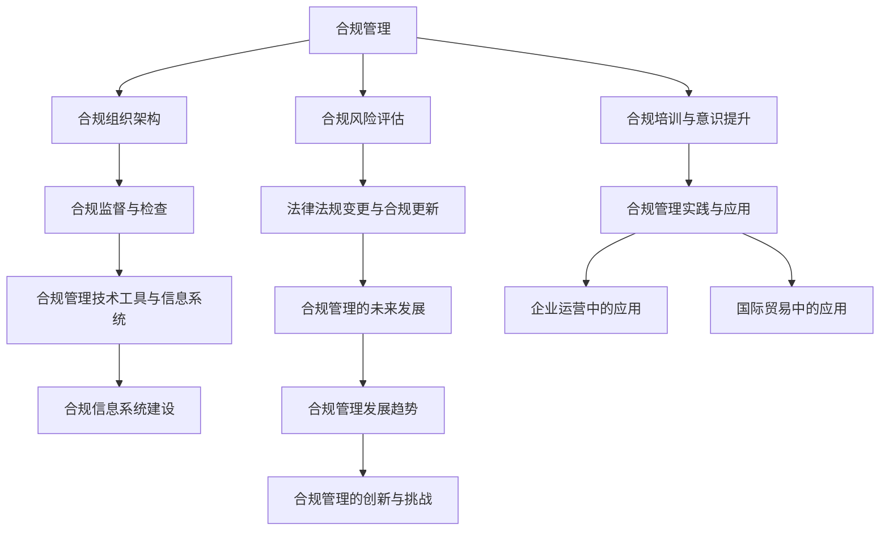

                 

### 文章标题：合规管理：确保组织符合法律法规

> **关键词：** 合规管理、法律法规、风险管理、合规监督、国际贸易

**摘要：** 本文章旨在探讨合规管理的概念、重要性、法律框架、管理体系建设、监督检查、法律法规变更处理、企业运营中的应用、国际贸易中的合规管理、技术工具与信息系统，以及合规管理的未来发展。通过详细的解析和实践案例，本文为读者提供了全面、系统的合规管理指南。

---

### 第一部分：合规管理基础

合规管理是现代企业管理中的重要组成部分，它确保组织在法律、法规和行业准则的框架下进行运营。以下是关于合规管理基础的具体内容。

#### 第1章：合规管理的概念与重要性

##### 1.1 合规管理的定义与背景

**定义：** 合规管理是指组织为了确保其运营活动符合法律法规、监管要求、内部规章制度和行业准则，而实施的一系列政策、程序和操作。

**背景：** 合规管理的起源可以追溯到20世纪末，随着全球化和金融市场的发展，企业面临的监管要求越来越严格。合规管理的目的是防止企业因违反法律法规而遭受罚款、处罚，甚至破产。

##### 1.2 合规管理的法律框架

**国内主要法律法规概述：** 国内关于合规管理的法律法规主要包括《公司法》、《合同法》、《劳动法》、《税收征收管理法》和《证券法》等。

**国际合规法规概述：** 国际合规法规主要包括《联合国反腐败公约》、《反洗钱法》、《美国外国_corporation_披露法（FCPA）》和《欧盟反洗钱指令（AML）》等。

##### 1.3 合规管理的核心原则

**基本原则与规范：** 合规管理的基本原则包括合法性原则、诚信原则、公平原则和完善性原则。

**国际合规管理的最佳实践：** 国际上，合规管理的最佳实践包括设立合规委员会、制定合规政策、进行合规培训、建立合规监控机制和制定合规应对计划。

#### 第2章：合规管理体系建设

##### 2.1 合规组织架构

**合规部门的设置与职责：** 合规部门应设置合规负责人、合规专员和合规支持人员。

**法务与合规部门的协作：** 法务与合规部门应在职责分工的基础上，建立沟通协调机制。

##### 2.2 合规风险评估

**风险评估流程：** 风险评估流程包括风险识别、风险评估和风险应对策略。

**风险识别与评估方法：** 风险识别可以通过内部调查、第三方评估和数据分析等方法进行。

##### 2.3 合规培训与意识提升

**培训计划的制定与实施：** 培训计划应包括培训目标、培训内容和培训评估。

**合规文化营造：** 通过企业文化内涵的塑造和合规文化的推广，提升员工的合规意识。

#### 第3章：合规监督与合规检查

##### 3.1 合规监督机制

**监督体系的建设与运行：** 建立包括定期审查、不定期检查和报告制度的监督体系。

**监督职责与监督流程：** 明确监督职责，规范监督流程。

##### 3.2 合规检查方法与流程

**内部合规检查：** 包括内部审计和内部调查。

**外部合规审查：** 包括监管机构审查和第三方审查。

##### 3.3 合规整改与合规报告

**合规整改：** 制定整改计划，执行整改措施。

**合规报告：** 提供合规报告的内容和提交方式。

#### 第4章：法律法规变更与合规更新

##### 4.1 法律法规变更的监测

**变更信息来源：** 通过政府官方网站、行业协会和专业咨询机构等获取变更信息。

**变更影响分析：** 分析变更对业务的直接影响和对合规管理的影响。

##### 4.2 合规更新的策略与实施

**合规政策与程序更新：** 制定合规政策，更新内部程序。

**内部沟通与培训：** 建立内部沟通机制，调整培训内容。

### 第二部分：合规管理实践与应用

#### 第5章：合规管理在企业运营中的应用

##### 5.1 合规管理在财务领域的应用

**财务合规风险识别与管理：** 识别财务合规风险，制定风险管理策略。

**内部财务控制与审计：** 建立内部控制制度，进行内部审计。

##### 5.2 合规管理在供应链管理中的应用

**供应商合规评估：** 设定评估标准，进行评估。

**供应链合规监控：** 建立监控机制，监控供应链合规情况。

##### 5.3 合规管理在人力资源领域的应用

**劳动法规遵守与员工权益保护：** 遵守劳动法律法规，保护员工权益。

**薪酬与福利合规管理：** 审查薪酬结构合规性，确保福利合规性。

#### 第6章：合规管理在国际贸易中的应用

##### 6.1 国际贸易合规概述

**国际贸易法律框架：** 了解国际贸易法律法规的内容和监管机构。

**国际贸易合规风险：** 分析贸易限制、禁运、惩罚性关税和反倾销等合规风险。

##### 6.2 贸易合规监管

**主要贸易合规监管机构：** 了解世界贸易组织（WTO）、美国贸易代表办公室（USTR）和欧盟委员会等主要监管机构。

**贸易合规审查与违规处理：** 掌握审查流程和处理措施。

##### 6.3 跨境合规案例解析

**案例背景：** 分析案例涉及的国家和地区、背景信息。

**案例分析：** 探讨合规问题、违规事实和合规管理教训。

#### 第7章：合规管理技术工具与信息系统

##### 7.1 合规管理技术工具

**合规管理软件介绍：** 了解合规管理软件的功能和特点。

**数据分析与监控工具：** 使用数据分析工具和监控工具。

##### 7.2 合规信息系统建设

**信息系统架构设计：** 设计合规信息系统架构。

**信息技术合规要求：** 了解信息技术安全和管理的合规要求。

##### 7.3 合规技术与数字化转型

**数字化合规趋势：** 探讨数字化合规的发展方向和优势。

**数字化合规的实施策略：** 制定实施策略。

#### 第8章：合规管理的未来发展

##### 8.1 合规管理发展趋势

**新技术对合规管理的影响：** 分析人工智能、区块链等新技术的影响。

**国际合规管理的未来方向：** 探讨全球化趋势和跨国合规挑战。

##### 8.2 合规管理的创新与挑战

**创新技术在合规管理中的应用：** 探索区块链、人工智能等技术在合规管理中的应用。

**合规管理面临的挑战与应对策略：** 分析挑战和制定应对策略。

### 附录

#### 附录A：合规管理相关法律法规汇总

**法律法规列表：** 列出相关法律法规。

**法律法规链接：** 提供法律法规的链接。

#### 附录B：合规管理常用工具与资源

**常用工具列表：** 列出常用工具。

**资源链接：** 提供工具的链接。

#### 附录C：合规管理案例分析

**案例列表：** 列出案例分析案例。

**案例详细分析：** 对案例进行详细分析。

### 核心概念与联系流程图

以下是合规管理的核心概念与联系流程图：

### 核心概念与联系流程图解析

- **合规管理（A）：** 合规管理的核心概念，涵盖整个合规管理体系。
- **合规组织架构（B）：** 包括合规部门的设置与职责，以及法务与合规部门的协作。
- **合规风险评估（C）：** 识别和管理合规风险。
- **合规培训与意识提升（D）：** 提升员工的合规意识和培训。
- **合规监督与检查（E）：** 建立监督体系和合规检查方法。
- **法律法规变更与合规更新（F）：** 监测法律法规变更，更新合规政策和程序。
- **合规管理实践与应用（G）：** 合规管理在企业运营、国际贸易中的应用。
- **合规管理技术工具与信息系统（H）：** 使用合规管理技术和信息系统。
- **合规管理的未来发展（I）：** 探讨合规管理的新技术和未来方向。
- **企业运营中的应用（J）：** 包括财务、供应链和人力资源领域的应用。
- **国际贸易中的应用（K）：** 分析国际贸易合规风险和监管。
- **合规信息系统建设（L）：** 设计合规信息系统的架构。
- **合规管理发展趋势（M）：** 探讨新技术对合规管理的影响。
- **合规管理的创新与挑战（N）：** 分析合规管理面临的创新和挑战。

通过这一流程图，读者可以清晰地理解合规管理的核心概念及其相互关系，从而更好地掌握合规管理的理论和实践。

