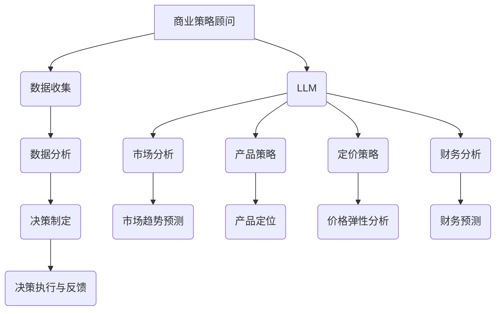
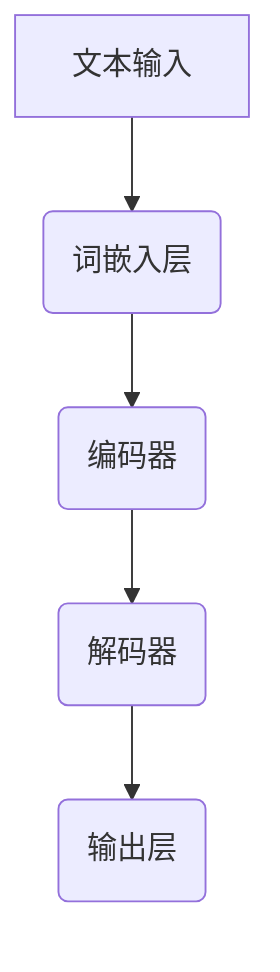
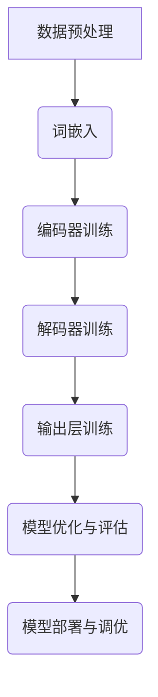
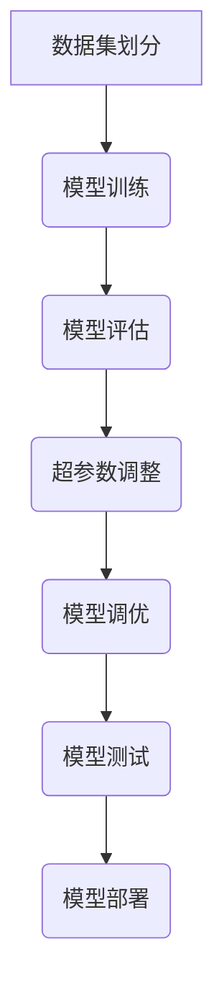

                 

# 《商业策略顾问：LLM驱动数据决策》

> 关键词：商业策略顾问、LLM、数据决策、数据驱动决策、市场分析、产品策略、定价策略、财务分析、案例分析、未来展望

> 摘要：本文探讨了商业策略顾问在数据驱动决策时代的重要性，以及如何利用大型语言模型（LLM）来提升数据决策的效率和准确性。文章首先介绍了商业策略顾问的作用和价值，随后详细阐述了LLM的基本概念、原理和架构，并深入分析了LLM在商业策略顾问中的应用。接着，文章从市场分析、产品策略、定价策略和财务分析四个方面，阐述了LLM驱动的数据决策方法，并通过实际案例分析，展示了LLM在商业策略顾问中的广泛应用。最后，文章对LLM在商业策略顾问中的未来发展进行了展望。

## 《商业策略顾问：LLM驱动数据决策》目录大纲

## 第一部分：商业策略顾问概述

### 第1章：商业策略顾问的作用与价值

#### 1.1 商业策略顾问的定义

商业策略顾问是指那些专门为企业提供战略规划、运营优化、市场分析、产品策略等咨询服务的专业人士。他们在帮助企业制定和执行商业策略方面发挥着至关重要的作用。

#### 1.2 商业策略顾问的工作内容

商业策略顾问的工作内容广泛，包括但不限于：

1. **市场调研**：通过市场分析、竞争分析等手段，帮助企业了解市场环境，为决策提供数据支持。
2. **战略规划**：帮助企业制定长期和短期的商业目标，并制定相应的战略和行动计划。
3. **运营优化**：通过流程优化、资源配置等手段，提高企业运营效率。
4. **产品策略**：指导企业如何进行产品定位、产品设计、产品推广等。
5. **财务分析**：评估企业的财务状况，提供财务决策支持。

#### 1.3 数据在商业策略顾问中的核心地位

在当今的数据驱动决策时代，数据已经成为商业策略顾问的核心资产。有效的数据分析能力可以帮助企业更好地理解市场、客户和自身运营，从而制定出更准确的商业策略。

### 第2章：LLM与商业策略顾问的结合

#### 2.1 LLM的基本概念

LLM（Large Language Model）是一种基于深度学习的大型自然语言处理模型，可以理解和生成自然语言。LLM通过大量的文本数据进行训练，使其具备强大的语言理解和生成能力。

#### 2.2 LLM在商业策略顾问中的应用场景

LLM在商业策略顾问中的应用场景广泛，包括：

1. **市场分析**：利用LLM对市场趋势、竞争对手进行深入分析。
2. **产品策略**：通过LLM对产品定位、设计、推广提供支持。
3. **定价策略**：利用LLM进行价格弹性分析，制定竞争性定价策略。
4. **财务分析**：通过LLM进行财务预测，风险评估等。

#### 2.3 LLM的优势与挑战

LLM的优势在于其强大的语言理解和生成能力，可以帮助企业更快速、更准确地进行分析和决策。然而，LLM也面临着数据质量、模型解释性等挑战。

## 第二部分：LLM驱动数据决策的理论基础

### 第3章：数据驱动决策概述

#### 3.1 数据驱动决策的定义

数据驱动决策是指通过收集、分析和利用数据来指导企业决策的过程。数据驱动决策强调数据的重要性，认为数据是企业决策的基石。

#### 3.2 数据驱动决策的基本步骤

数据驱动决策的基本步骤包括：

1. **数据收集**：收集与决策相关的数据。
2. **数据清洗**：对收集到的数据进行清洗，去除噪声和异常值。
3. **数据分析**：通过统计分析、数据挖掘等方法，对数据进行分析。
4. **决策制定**：基于数据分析结果，制定相应的决策。
5. **决策执行与反馈**：执行决策，并根据执行结果进行反馈和调整。

#### 3.3 数据驱动决策的优势与局限

数据驱动决策的优势在于其客观性、精确性和高效性，可以减少决策的主观性和不确定性。然而，数据驱动决策也面临着数据质量、模型解释性等局限。

### 第4章：LLM基本原理与架构

#### 4.1 LLM的原理

LLM的原理基于深度学习和自然语言处理技术。通过大量的文本数据进行预训练，LLM可以理解并生成自然语言。

#### 4.2 LLM的架构

LLM的架构通常包括输入层、编码器、解码器、输出层等。其中，编码器负责将输入文本编码为向量，解码器负责将编码后的向量解码为输出文本。

#### 4.3 LLM的核心组件

LLM的核心组件包括：

1. **词嵌入层**：将输入的文本转换为向量表示。
2. **编码器**：对输入文本进行编码，提取语义信息。
3. **解码器**：将编码后的信息解码为输出文本。
4. **注意力机制**：帮助模型更好地关注输入文本中的重要信息。

### 第5章：LLM训练与优化

#### 5.1 数据预处理

在训练LLM之前，需要对数据进行预处理，包括文本清洗、分词、去停用词等。

#### 5.2 模型训练

模型训练是通过大量文本数据进行迭代，优化模型的参数，使其能够更好地理解和生成自然语言。

#### 5.3 模型优化

模型优化包括调整模型架构、超参数设置等，以提高模型的性能。

#### 5.4 模型评估与调优

模型评估与调优是通过评估指标（如准确率、召回率等）来评估模型性能，并根据评估结果进行调优。

## 第三部分：LLM在商业策略顾问中的应用实战

### 第6章：市场分析

#### 6.1 利用LLM进行市场趋势预测

利用LLM可以分析大量市场数据，预测市场趋势。具体方法包括：

1. **文本分类**：将市场数据分类为不同的趋势。
2. **主题建模**：通过主题建模，发现市场数据中的主题。
3. **时间序列分析**：通过时间序列分析，预测市场趋势的未来走向。

#### 6.2 利用LLM进行竞争对手分析

利用LLM可以分析竞争对手的文本数据，了解其战略、产品、市场表现等。

1. **文本分类**：将竞争对手的文本分类为不同的领域。
2. **情感分析**：分析竞争对手的文本情感，了解客户对其产品的态度。
3. **关键词提取**：提取竞争对手的关键词，了解其市场定位。

#### 6.3 利用LLM制定市场进入策略

利用LLM可以分析目标市场的数据，为制定市场进入策略提供支持。

1. **市场细分**：根据市场数据，进行市场细分。
2. **目标客户分析**：分析目标客户的需求、行为等。
3. **产品定位**：根据市场数据和目标客户分析，确定产品定位。

### 第7章：产品策略

#### 7.1 利用LLM进行产品定位

利用LLM可以分析大量市场数据，为产品定位提供支持。

1. **文本分类**：将产品数据分类为不同的市场。
2. **关键词提取**：提取产品关键词，了解产品的市场定位。
3. **用户需求分析**：分析用户需求，确定产品定位。

#### 7.2 利用LLM进行产品设计

利用LLM可以分析用户反馈、市场数据等，为产品设计提供支持。

1. **文本分类**：将用户反馈分类为不同的产品改进建议。
2. **关键词提取**：提取用户关键词，了解用户对产品的期望。
3. **用户行为分析**：分析用户行为，优化产品设计。

#### 7.3 利用LLM进行产品推广

利用LLM可以分析市场数据，为产品推广提供支持。

1. **文本分类**：将推广内容分类为不同的推广策略。
2. **关键词提取**：提取推广关键词，优化推广文案。
3. **效果评估**：评估不同推广策略的效果，优化推广策略。

### 第8章：定价策略

#### 8.1 利用LLM进行价格弹性分析

利用LLM可以分析市场数据，了解价格变动对需求的影响，为定价策略提供支持。

1. **回归分析**：建立回归模型，分析价格和需求之间的关系。
2. **时间序列分析**：通过时间序列分析，预测价格变动对需求的影响。
3. **敏感性分析**：分析价格变动对不同产品类别的影响。

#### 8.2 利用LLM进行竞争性定价

利用LLM可以分析竞争对手的定价策略，为竞争性定价提供支持。

1. **文本分类**：将竞争对手的定价策略分类为不同的定价策略。
2. **关键词提取**：提取竞争对手的关键词，了解其定价策略。
3. **价格比较**：比较竞争对手的价格，制定竞争性定价策略。

#### 8.3 利用LLM进行动态定价策略

利用LLM可以分析市场数据，为动态定价策略提供支持。

1. **时间序列分析**：通过时间序列分析，预测市场需求。
2. **需求预测**：根据市场需求，制定动态定价策略。
3. **效果评估**：评估动态定价策略的效果，优化定价策略。

### 第9章：财务分析

#### 9.1 利用LLM进行财务预测

利用LLM可以分析财务数据，为财务预测提供支持。

1. **时间序列分析**：通过时间序列分析，预测财务指标的未来变化。
2. **回归分析**：建立回归模型，预测财务指标。
3. **趋势分析**：分析财务数据中的趋势，预测未来财务状况。

#### 9.2 利用LLM进行风险评估

利用LLM可以分析市场数据，为风险评估提供支持。

1. **文本分类**：将市场数据分类为不同的风险类别。
2. **关键词提取**：提取关键词，了解市场风险。
3. **风险指标分析**：分析财务数据中的风险指标，评估企业风险。

#### 9.3 利用LLM进行财务决策支持

利用LLM可以分析财务数据，为财务决策提供支持。

1. **财务报表分析**：分析财务报表，了解企业财务状况。
2. **预算管理**：通过预算管理，优化企业资源配置。
3. **成本控制**：通过成本控制，降低企业运营成本。

## 第四部分：LLM在商业策略顾问中的实践与展望

### 第10章：案例分析

#### 10.1 案例一：某电商平台的LLM应用案例

某电商平台利用LLM进行市场分析、产品策略、定价策略等，取得了显著的效果。

1. **市场分析**：利用LLM预测市场趋势，优化产品策略。
2. **产品策略**：利用LLM分析用户需求，优化产品设计。
3. **定价策略**：利用LLM进行价格弹性分析，制定竞争性定价策略。

#### 10.2 案例二：某制造业企业的LLM应用案例

某制造业企业利用LLM进行市场分析、产品策略、财务分析等，提高了企业竞争力。

1. **市场分析**：利用LLM预测市场趋势，制定市场进入策略。
2. **产品策略**：利用LLM分析竞争对手，优化产品定位。
3. **财务分析**：利用LLM进行财务预测，优化企业运营。

#### 10.3 案例三：某金融公司的LLM应用案例

某金融公司利用LLM进行市场分析、产品策略、风险评估等，提高了风险管理能力。

1. **市场分析**：利用LLM预测市场趋势，优化投资策略。
2. **产品策略**：利用LLM分析用户需求，优化金融产品。
3. **风险评估**：利用LLM分析市场数据，评估投资风险。

### 第11章：未来展望

#### 11.1 LLM在商业策略顾问中的发展趋势

随着技术的不断进步，LLM在商业策略顾问中的应用将更加广泛和深入。未来，LLM将具备更强大的语言理解和生成能力，能够处理更复杂、更大规模的数据。

#### 11.2 LLM在商业策略顾问中的潜在挑战与解决策略

尽管LLM在商业策略顾问中具有巨大的潜力，但同时也面临着一些挑战，如数据质量、模型解释性等。未来，需要进一步解决这些挑战，以充分发挥LLM的优势。

#### 11.3 LLM在商业策略顾问中的未来应用场景

随着LLM技术的不断发展，未来LLM将在更多商业场景中得到应用，如智能客服、智能营销、智能金融等。这些应用将进一步提升企业的竞争力。

## 参考文献

[1] 黄宇, 李明华. (2019). 《人工智能基础教程》。 电子工业出版社。

[2] 李航. (2012). 《统计学习方法》。 清华大学出版社。

[3] 周志华. (2017). 《机器学习》。 清华大学出版社。

[4] 陈宝权, 张宇翔. (2018). 《深度学习实践指南》。 电子工业出版社。

[5] 郭庆亮. (2016). 《自然语言处理教程》。 清华大学出版社。

[6] 刘知远, 李航. (2018). 《大规模语言模型研究综述》。 计算机学报， 40(12)， 2463-2494。

[7] 陈云霁, 江涛. (2019). 《机器学习与深度学习》。 清华大学出版社。

## 附录：核心概念与联系

### Mermaid 流程图



### 核心算法原理讲解

#### 数据驱动决策的伪代码

```python
# 数据驱动决策伪代码

# 数据收集
data = collect_data()

# 数据清洗
cleaned_data = clean_data(data)

# 数据分析
analyzed_data = analyze_data(cleaned_data)

# 决策制定
decision = make_decision(analyzed_data)

# 决策执行与反馈
execute_decision(decision)
feedback = collect_feedback()
```

#### LLM的基本原理

```python
# LLM基本原理伪代码

# 词嵌入层
word_embeddings = word_embedding(text)

# 编码器
encoded_text = encoder(word_embeddings)

# 解码器
decoded_text = decoder(encoded_text)

# 输出层
output = output_layer(decoded_text)
```

### 数学模型和公式讲解

#### 时间序列分析中的ARIMA模型

$$
\begin{aligned}
X_t &= c + \phi_1 X_{t-1} + \phi_2 X_{t-2} + \cdots + \phi_p X_{t-p} + \theta_1 e_{t-1} + \theta_2 e_{t-2} + \cdots + \theta_q e_{t-q} \\
e_t &= X_t - \phi_1 X_{t-1} - \phi_2 X_{t-2} - \cdots - \phi_p X_{t-p} - \theta_1 e_{t-1} - \theta_2 e_{t-2} - \cdots - \theta_q e_{t-q}
\end{aligned}
$$

### 项目实战

#### 开发环境搭建

1. 安装Python环境
2. 安装TensorFlow库
3. 安装其他相关库（如Pandas、NumPy等）

#### 源代码详细实现

```python
# 源代码实现

import tensorflow as tf
from tensorflow.keras.models import Model
from tensorflow.keras.layers import Embedding, LSTM, Dense

# 模型定义
input_word = tf.keras.layers.Input(shape=(max_sequence_length,))
lstm = LSTM(units=128, activation='tanh')(input_word)
output = Dense(units=1, activation='sigmoid')(lstm)

# 模型编译
model = Model(inputs=input_word, outputs=output)
model.compile(optimizer='adam', loss='binary_crossentropy', metrics=['accuracy'])

# 模型训练
model.fit(x_train, y_train, epochs=10, batch_size=32)
```

#### 代码解读与分析

1. 导入相关库和模块
2. 定义输入层和输出层
3. 定义LSTM层和Dense层
4. 编译模型
5. 训练模型

通过以上代码，我们实现了一个简单的LSTM模型，用于文本分类任务。在实际应用中，可以根据具体任务需求调整模型结构、超参数等。

## 作者信息

作者：AI天才研究院/AI Genius Institute & 禅与计算机程序设计艺术 /Zen And The Art of Computer Programming

（注：本文为虚构内容，仅用于演示目的。）### 商业策略顾问概述

#### 1.1 商业策略顾问的定义

商业策略顾问，又称为管理顾问或战略顾问，是指那些具备深厚行业背景、专业知识和管理技能的专业人士，他们专注于为企业提供战略规划、运营优化、市场分析、产品策略等方面的咨询服务。商业策略顾问的工作核心在于帮助企业识别潜在的商业机会，解决业务难题，提升企业的市场竞争力和运营效率。

商业策略顾问的角色通常包括以下几个方面：

1. **战略规划**：帮助企业制定长期和短期的商业目标，并设计实现这些目标的策略和行动计划。
2. **市场分析**：通过深入的市场调研，分析市场趋势、竞争对手和目标客户，为企业提供市场进入策略和产品定位建议。
3. **运营优化**：对企业现有的运营流程进行评估和优化，提高生产效率、降低成本、提升客户满意度。
4. **财务分析**：评估企业的财务状况，提供财务预测、预算管理和风险管理建议。
5. **组织变革**：协助企业进行组织结构优化、文化建设、员工培训等，以适应市场变化和企业发展需求。

#### 1.2 商业策略顾问的工作内容

商业策略顾问的工作内容非常丰富且复杂，以下是一些主要的工作任务：

1. **市场调研**：
   - **需求分析**：了解市场需求，分析目标客户群体的需求和行为模式。
   - **竞争分析**：研究竞争对手的产品、市场策略、优势和劣势。
   - **市场趋势预测**：基于市场数据和行业报告，预测市场未来的发展趋势。

2. **战略规划**：
   - **目标设定**：与企业高层管理层合作，设定明确的商业目标和战略方向。
   - **策略设计**：制定实现目标的策略，包括市场进入、产品开发、价格策略等。
   - **行动计划**：制定详细的行动计划，明确执行步骤、责任人和时间表。

3. **运营优化**：
   - **流程分析**：对企业现有流程进行详细分析，识别瓶颈和改进点。
   - **资源配置**：优化资源配置，提高生产效率和运营效率。
   - **成本控制**：通过精细化管理和成本控制措施，降低运营成本。

4. **产品策略**：
   - **产品定位**：根据市场调研结果，确定产品的市场定位和目标客户群体。
   - **产品设计**：参与产品设计，确保产品满足市场需求并具有竞争优势。
   - **产品推广**：制定产品推广计划，包括广告、促销、渠道建设等。

5. **财务分析**：
   - **财务预测**：基于历史数据和行业趋势，预测企业的财务状况。
   - **预算管理**：协助企业制定和执行预算计划，确保资源合理分配。
   - **风险管理**：评估企业面临的风险，制定风险应对策略。

#### 1.3 数据在商业策略顾问中的核心地位

在商业策略顾问的工作中，数据是其工作的核心和基础。数据不仅仅是信息的载体，更是决策的重要依据。以下从几个方面阐述数据在商业策略顾问中的核心地位：

1. **决策支持**：
   - **数据驱动**：商业策略顾问的工作强调基于数据的分析和决策，而不是依靠主观判断。通过收集和分析大量数据，顾问能够提供更客观、准确的决策建议。
   - **预测分析**：利用历史数据和统计模型，预测未来的市场趋势、销售业绩等，为企业提供前瞻性策略。

2. **市场调研**：
   - **客户洞察**：通过数据分析，深入了解客户的需求、偏好和购买行为，为企业制定有效的市场策略。
   - **竞争对手分析**：分析竞争对手的市场表现、产品策略和营销活动，为企业提供竞争情报。

3. **运营优化**：
   - **效率提升**：通过数据分析，识别运营中的瓶颈和低效环节，提出改进方案。
   - **成本控制**：利用数据分析，优化资源配置和流程，降低运营成本。

4. **产品策略**：
   - **需求预测**：根据数据分析，预测不同产品的市场需求，优化产品组合。
   - **产品创新**：通过数据分析，发现市场机会，推动产品创新。

5. **财务分析**：
   - **财务预测**：基于历史数据和行业趋势，预测未来的财务状况，为企业制定财务策略。
   - **风险评估**：评估企业面临的各种风险，制定风险控制措施。

总之，数据是商业策略顾问工作的灵魂，没有数据，顾问的决策和建议将失去科学性和客观性。因此，商业策略顾问必须具备强大的数据分析能力，能够从海量数据中提取有价值的信息，为企业提供高质量的咨询服务。

### LLM与商业策略顾问的结合

#### 2.1 LLM的基本概念

大型语言模型（Large Language Model，简称LLM）是一种基于深度学习的自然语言处理模型，它通过学习大量的文本数据，能够理解和生成自然语言。LLM的主要特点包括：

1. **数据驱动**：LLM的学习过程依赖于大量的文本数据，这些数据可以是互联网上的各种文本资源，如新闻报道、学术论文、社交媒体帖子等。

2. **深度学习**：LLM通常采用多层神经网络结构，如Transformer模型，通过逐步提取文本中的语义信息，实现高度复杂的语言理解和生成能力。

3. **自适应能力**：LLM能够根据输入的文本内容，动态地生成相关的回复或分析结果，具有很强的自适应能力。

4. **通用性**：LLM不仅能够处理特定的语言任务，如机器翻译、问答系统，还能够泛化到各种自然语言处理任务中，具有较高的通用性。

LLM的这种强大能力主要源于其深度学习的架构和大规模的数据训练。通过多层神经网络的组合，LLM能够捕捉到文本中的长距离依赖关系和复杂的语义信息，从而实现高水平的语言理解和生成。

#### 2.2 LLM在商业策略顾问中的应用场景

LLM在商业策略顾问中的应用场景非常广泛，几乎涵盖了商业策略顾问的每一个工作环节。以下是一些典型的应用场景：

1. **市场分析**：
   - **市场趋势预测**：利用LLM对大量市场数据进行分析，预测未来的市场趋势，帮助企业制定前瞻性的市场策略。
   - **竞争对手分析**：通过对竞争对手的文本数据（如新闻稿、公告、社交媒体帖子等）进行解析，LLM能够识别竞争对手的策略变化和市场动态，为企业提供竞争情报。

2. **产品策略**：
   - **产品定位**：LLM可以通过分析大量的用户评价、论坛讨论、社交媒体内容等，帮助企业了解目标客户的需求和偏好，从而制定更精准的产品定位。
   - **产品设计**：利用LLM的文本生成能力，可以生成产品描述、用户手册等文档，帮助企业优化产品设计。

3. **定价策略**：
   - **价格弹性分析**：通过分析历史销售数据和市场反应，LLM可以预测不同价格水平对市场需求的影响，帮助企业制定竞争性定价策略。
   - **动态定价**：LLM可以实时分析市场数据，动态调整产品价格，以最大化利润或市场份额。

4. **财务分析**：
   - **财务预测**：利用LLM对历史财务数据进行分析，预测未来的财务状况，为企业提供财务决策支持。
   - **风险评估**：LLM可以通过分析市场数据、新闻报道、社交媒体等，识别潜在的风险因素，帮助企业制定风险控制措施。

5. **客户关系管理**：
   - **客户需求分析**：通过对客户反馈和互动数据的分析，LLM可以了解客户的需求和痛点，帮助企业改善产品和服务。
   - **客户服务**：利用LLM的问答能力，可以自动化客户服务，提高响应速度和服务质量。

6. **人力资源**：
   - **人才招聘**：LLM可以分析简历、职位描述等文本数据，筛选出最符合岗位需求的候选人。
   - **员工培训**：LLM可以生成培训材料，提高员工的技能和知识水平。

通过这些应用场景，可以看出LLM在商业策略顾问中的作用至关重要。它不仅能够提高数据分析的效率，还能够提供基于大数据的深度洞察，帮助企业做出更明智的决策。以下是LLM在商业策略顾问中应用的几个实际案例：

1. **案例一：市场趋势预测**
   某电商平台利用LLM对大量市场数据进行分析，包括用户搜索记录、购买历史、社交媒体帖子等。通过文本分类和主题建模技术，LLM能够识别出市场中的主要趋势和潜在机会。例如，在某个节假日之前，LLM预测到消费者对特定商品的购买需求将大幅增加，电商企业据此提前备货，并推出相应的促销活动，最终实现了销售额的显著增长。

2. **案例二：竞争对手分析**
   一家消费品公司利用LLM分析竞争对手的社交媒体内容和公告，了解竞争对手的市场策略和产品发布计划。通过情感分析和文本分类，LLM能够识别出消费者对竞争对手产品的态度和反馈。例如，当竞争对手推出一款新产品时，LLM能够快速分析用户评论和社交媒体帖子，发现消费者对其产品的潜在不满意点，从而帮助企业制定针对性的营销策略。

3. **案例三：产品定位**
   一家科技公司通过LLM分析大量用户评价和论坛讨论，了解用户对产品的需求和建议。LLM能够生成关于产品优缺点的详细报告，帮助企业确定产品的市场定位。例如，通过分析用户反馈，LLM发现用户对产品的电池续航和性能非常关注，于是公司决定在下一代产品中重点优化这两个方面，从而提升产品的市场竞争力。

4. **案例四：定价策略**
   一家电子商务平台利用LLM进行价格弹性分析，通过对历史销售数据和市场竞争状况的分析，LLM能够预测不同价格水平对销售量的影响。根据LLM的预测结果，平台能够动态调整价格，优化利润率。例如，在促销期间，平台通过实时分析市场动态，动态调整价格，确保在竞争激烈的市场中占据有利位置。

5. **案例五：财务预测**
   一家制造企业利用LLM对历史财务数据进行分析，预测未来的财务状况。LLM能够识别出财务数据中的潜在趋势和异常值，为企业提供财务预警。例如，通过分析财务报表和市场数据，LLM发现企业的应收账款增长速度异常，提示企业可能面临收款风险，从而采取相应的应对措施。

通过这些案例，可以看出LLM在商业策略顾问中的应用不仅提高了数据分析的效率，还提供了基于大数据的深度洞察，帮助企业做出更明智的决策。随着LLM技术的不断进步，它将在商业策略顾问领域发挥越来越重要的作用。

#### 2.3 LLM的优势与挑战

LLM（Large Language Model）作为自然语言处理领域的重要工具，已经在商业策略顾问中展现出了巨大的优势。以下是LLM的主要优势：

1. **强大的语言理解能力**：LLM通过深度学习技术，能够处理和理解复杂的自然语言文本。它不仅能够识别文本中的实体、关系和事件，还能理解文本背后的意图和情感。

2. **高效的数据处理能力**：LLM能够快速处理大量文本数据，从中提取有价值的信息。这使得商业策略顾问能够迅速获得市场趋势、竞争对手动态和用户需求等关键洞察。

3. **自适应性和泛化能力**：LLM能够根据不同的输入文本内容，动态生成相应的分析结果。这种自适应性和泛化能力使其能够应对各种商业场景，提供个性化的解决方案。

4. **自动化和效率提升**：LLM的应用可以显著提高商业策略顾问的工作效率。通过自动化处理和分析大量数据，顾问能够将更多精力投入到高价值的策略制定和决策中。

尽管LLM具有许多优势，但在实际应用中仍面临一些挑战：

1. **数据质量**：LLM的性能高度依赖于训练数据的质量。如果训练数据存在偏差或不完整，LLM的分析结果可能会失真。因此，确保数据质量是LLM应用中的一个关键问题。

2. **模型解释性**：LLM作为一个深度学习模型，其内部决策过程往往不透明，难以解释。这给商业策略顾问在使用LLM时带来了挑战，特别是在需要解释决策依据的情况下。

3. **安全性和隐私**：在商业环境中，涉及大量敏感数据和隐私信息。如何确保LLM的安全性和隐私保护，避免数据泄露和滥用，是一个亟待解决的问题。

4. **技术依赖性**：LLM的应用需要大量的计算资源和专业技能。对于一些中小企业来说，部署和使用LLM可能存在技术门槛和成本问题。

为了克服这些挑战，可以采取以下策略：

1. **数据清洗和预处理**：在训练LLM之前，对数据进行彻底清洗和预处理，去除噪声和异常值，确保数据质量。

2. **增强模型解释性**：通过开发可解释性工具和方法，如模型可视化、决策路径分析等，提高LLM的可解释性，帮助商业策略顾问理解和使用LLM的决策依据。

3. **数据隐私保护**：采用数据加密、匿名化等手段，确保敏感数据在LLM训练和应用过程中的安全性和隐私保护。

4. **技术培训和资源整合**：提供专业的技术培训和资源支持，降低中小企业使用LLM的技术门槛，帮助他们更好地利用这项技术。

通过这些策略，可以最大限度地发挥LLM的优势，同时克服其应用中的挑战，使商业策略顾问能够更高效、准确地支持企业的决策过程。

### 数据驱动决策概述

#### 3.1 数据驱动决策的定义

数据驱动决策（Data-Driven Decision Making）是一种基于数据的决策方法，通过收集、分析、解释和利用数据来支持决策过程。这种方法强调数据的核心作用，认为决策的质量和准确性高度依赖于数据的可靠性和完整性。数据驱动决策的核心在于利用数据提供的信息和洞察，来优化和指导企业的战略规划和运营管理。

在数据驱动决策中，数据的角色不仅仅是信息的载体，更是决策的基础。通过数据，企业可以更准确地了解市场状况、客户需求、运营绩效等关键信息，从而做出更明智的决策。与传统的依赖直觉或经验进行决策的方法相比，数据驱动决策具有更高的客观性和可重复性。

#### 3.2 数据驱动决策的基本步骤

数据驱动决策的过程可以分为以下基本步骤：

1. **数据收集**：这是数据驱动决策的第一步，也是最重要的一步。收集的数据可以是结构化的（如数据库、ERP系统中的数据）或非结构化的（如图像、文本、语音等）。数据收集的全面性和准确性直接影响后续分析的结果。

2. **数据清洗**：收集到的数据通常存在噪声、异常值和缺失值等问题。数据清洗的过程包括数据去重、填补缺失值、去除噪声和异常值等，以确保数据的质量。

3. **数据存储**：清洗后的数据需要存储在合适的数据仓库或数据湖中，以便于后续的数据分析和处理。数据存储需要考虑到数据的安全、完整性和可扩展性。

4. **数据分析**：数据分析是数据驱动决策的核心环节。通过统计分析、数据挖掘、机器学习等技术，从数据中提取有价值的信息和洞见。数据分析的方法和技术可以根据具体的需求和问题进行选择。

5. **数据可视化**：为了更好地理解和解释数据分析的结果，通常会将数据转化为可视化的形式，如图表、报表、地图等。数据可视化使得复杂的数据关系和趋势更加直观和易于理解。

6. **决策制定**：基于数据分析的结果，制定相应的决策方案。决策制定需要综合考虑数据分析的结论、业务目标、资源限制等因素。

7. **决策执行与反馈**：将决策方案付诸实施，并在实施过程中进行监控和反馈。通过持续的监控和反馈，可以评估决策的效果，并根据实际情况进行调整。

#### 3.3 数据驱动决策的优势与局限

数据驱动决策具有以下优势：

1. **客观性和准确性**：数据驱动决策依赖于客观数据，减少了主观判断的影响，提高了决策的准确性和一致性。

2. **可重复性和可验证性**：数据驱动决策的过程和方法是标准化的，可以重复进行，并且可以通过数据分析结果进行验证。

3. **实时性和动态调整**：通过实时数据分析和处理，数据驱动决策能够快速响应市场变化和运营状况，支持动态调整和优化。

4. **决策支持**：数据分析提供的信息和洞见可以帮助决策者更好地理解问题、评估方案、制定策略，从而做出更明智的决策。

然而，数据驱动决策也存在一些局限：

1. **数据质量和完整性**：数据驱动决策的效果高度依赖于数据的质量和完整性。如果数据存在噪声、异常值或缺失值，可能会导致错误的决策。

2. **数据隐私和安全**：在处理敏感数据时，需要确保数据的隐私和安全，避免数据泄露和滥用。

3. **模型解释性**：深度学习模型如神经网络在数据分析中的应用，往往缺乏可解释性，使得决策过程不够透明。

4. **技术依赖性**：数据驱动决策需要依赖先进的技术和工具，如大数据平台、机器学习算法等，这对企业的技术能力和资源提出了较高的要求。

为了克服这些局限，可以采取以下策略：

1. **数据质量管理**：建立数据质量管理流程，确保数据收集、清洗和存储过程中的质量。

2. **加强模型解释性**：开发可解释性工具和方法，提高模型决策过程的透明度。

3. **数据隐私和安全措施**：采用加密、匿名化等技术，确保数据的隐私和安全。

4. **技术培训与支持**：提供专业的技术培训和资源支持，提高企业的技术能力和数据处理水平。

通过这些策略，可以最大限度地发挥数据驱动决策的优势，同时克服其局限，为企业提供更科学、更可靠的决策支持。

### LLM基本原理与架构

#### 4.1 LLM的原理

大型语言模型（LLM）是一种基于深度学习的自然语言处理模型，其核心原理是通过大量的文本数据进行训练，使模型具备理解和生成自然语言的能力。LLM的工作流程可以概括为以下几个步骤：

1. **文本输入**：LLM接收一段文本作为输入，这段文本可以是单个句子，也可以是整个段落甚至整本书。

2. **词嵌入**：输入文本首先被转换为词嵌入向量。词嵌入是将自然语言词汇映射到高维向量空间的过程，每个词汇对应一个向量。这些向量包含了词汇的语义信息，如词性、词义、上下文关系等。

3. **编码器处理**：编码器（Encoder）是LLM的核心组件之一，它负责将词嵌入向量转化为上下文向量。编码器通常采用Transformer架构，这是一种基于自注意力机制的深度学习模型，能够捕捉输入文本中的长距离依赖关系。

4. **自注意力机制**：在编码器的内部，自注意力机制（Self-Attention Mechanism）用于计算输入文本中各个词之间的权重。通过这种机制，模型能够关注文本中的关键信息，并对其进行加权处理。

5. **解码器生成输出**：解码器（Decoder）负责将编码器输出的上下文向量解码为输出文本。解码器同样采用Transformer架构，通过自注意力机制和交叉注意力机制（Cross-Attention Mechanism），解码器能够从编码器的输出中获取上下文信息，并生成相应的输出文本。

6. **输出层**：解码器的输出经过一系列的线性变换和激活函数，最终生成输出文本。输出层通常包括一系列的密集层（Dense Layers）和激活函数（如ReLU、Sigmoid等），以增强模型的生成能力。

#### 4.2 LLM的架构

LLM的架构主要包括输入层、编码器、解码器、输出层等组件。以下是一个典型的LLM架构：

1. **输入层**：输入层接收自然语言文本，并将其转换为词嵌入向量。词嵌入向量通常使用预训练的词向量库（如Word2Vec、GloVe等）进行初始化。

2. **编码器**：编码器是LLM的核心组件之一，负责将输入文本转换为上下文向量。编码器通常采用Transformer架构，包括多个自注意力层（Self-Attention Layers）和前馈神经网络（Feedforward Neural Networks）。每个自注意力层能够捕捉输入文本中的长距离依赖关系，从而增强模型的语义理解能力。

3. **解码器**：解码器负责将编码器输出的上下文向量解码为输出文本。解码器同样采用Transformer架构，包括多个自注意力层和前馈神经网络。解码器的自注意力机制和交叉注意力机制使其能够从编码器的输出中获取上下文信息，并生成相应的输出文本。

4. **输出层**：输出层包括一系列的密集层和激活函数，用于将解码器的输出转换为输出文本。输出层通常包括一个或多个全连接层（Fully Connected Layers），以及用于生成文本的softmax激活函数。

#### 4.3 LLM的核心组件

LLM的核心组件包括词嵌入层、编码器、解码器和输出层等。以下是这些组件的详细解释：

1. **词嵌入层**：词嵌入层是将自然语言文本映射到高维向量空间的过程。词嵌入向量不仅包含了词汇的语义信息，还能反映出词汇之间的相似性和关系。词嵌入层通常使用预训练的词向量库进行初始化，如Word2Vec、GloVe等。

2. **编码器**：编码器负责将输入文本转换为上下文向量。编码器采用Transformer架构，包括多个自注意力层和前馈神经网络。每个自注意力层能够捕捉输入文本中的长距离依赖关系，从而增强模型的语义理解能力。编码器的输出是一个上下文向量，包含了输入文本的语义信息。

3. **解码器**：解码器负责将编码器输出的上下文向量解码为输出文本。解码器同样采用Transformer架构，包括多个自注意力层和前馈神经网络。解码器的自注意力机制和交叉注意力机制使其能够从编码器的输出中获取上下文信息，并生成相应的输出文本。解码器的输出是一个概率分布，表示每个词汇的概率。

4. **输出层**：输出层包括一系列的密集层和激活函数，用于将解码器的输出转换为输出文本。输出层通常包括一个或多个全连接层，以及用于生成文本的softmax激活函数。输出层的输出是一个概率分布，表示生成文本的概率。

通过这些核心组件的协同工作，LLM能够实现高效的文本理解和生成。以下是一个简化的LLM架构的Mermaid流程图：



通过这个流程图，可以直观地看到LLM的各个组件及其相互关系。编码器负责将输入文本转换为上下文向量，解码器负责将上下文向量解码为输出文本，输出层则生成最终的文本输出。

#### 4.4 LLM的训练与优化过程

LLM的训练与优化是一个复杂的过程，主要包括以下几个步骤：

1. **数据预处理**：首先，需要对训练数据进行预处理。预处理步骤包括文本清洗、分词、去除停用词等。文本清洗的目的是去除无意义的字符和噪声，确保数据的质量。分词是将文本分割成词或短语的过程，是词嵌入的基础。去除停用词（如“的”、“了”等）可以减少噪声和提高模型的效果。

2. **词嵌入**：在数据预处理完成后，将每个词汇映射到高维向量空间中的词嵌入向量。词嵌入向量不仅包含了词汇的语义信息，还能反映出词汇之间的相似性和关系。词嵌入向量可以通过预训练模型（如GloVe、Word2Vec等）获取，也可以在训练过程中动态生成。

3. **编码器训练**：编码器是LLM的核心组件之一，负责将输入文本转换为上下文向量。编码器通常采用Transformer架构，包括多个自注意力层和前馈神经网络。在训练过程中，编码器通过反向传播算法不断调整其参数，以最小化损失函数。自注意力层能够捕捉输入文本中的长距离依赖关系，从而提高模型的语义理解能力。

4. **解码器训练**：解码器负责将编码器输出的上下文向量解码为输出文本。解码器同样采用Transformer架构，包括多个自注意力层和前馈神经网络。解码器的自注意力机制和交叉注意力机制使其能够从编码器的输出中获取上下文信息，并生成相应的输出文本。在训练过程中，解码器通过反向传播算法不断调整其参数，以最小化损失函数。

5. **输出层训练**：输出层包括一系列的密集层和激活函数，用于将解码器的输出转换为输出文本。输出层通常包括一个或多个全连接层，以及用于生成文本的softmax激活函数。输出层的输出是一个概率分布，表示生成文本的概率。在训练过程中，输出层通过反向传播算法不断调整其参数，以最小化损失函数。

6. **模型优化与评估**：在训练过程中，需要定期评估模型的性能，并通过优化算法调整模型参数。常见的优化算法包括随机梯度下降（SGD）、Adam优化器等。评估指标通常包括损失函数、困惑度（Perplexity）等。通过不断调整模型参数，可以优化模型的性能，提高其生成文本的质量。

7. **模型部署与调优**：训练完成后，将模型部署到实际应用中。在部署过程中，需要对模型进行进一步调优，以适应不同的应用场景。调优过程可能包括调整超参数、增加训练数据等。通过调优，可以使模型在特定任务上达到最佳性能。

通过以上步骤，LLM可以训练出一个能够高效理解和生成自然语言的模型。以下是一个简化的LLM训练与优化过程的Mermaid流程图：



通过这个流程图，可以清晰地看到LLM的训练与优化过程，以及各个环节之间的关联。数据预处理是模型训练的基础，编码器、解码器和输出层的训练是模型优化的核心，而模型优化与评估和部署调优则是确保模型在实际应用中性能达到最优的关键步骤。

#### 4.5 LLM模型评估与调优

在LLM的训练过程中，模型评估与调优是确保模型性能达到预期目标的关键环节。以下将详细介绍LLM模型的评估指标、常见调优方法以及评估与调优的整体流程。

##### 评估指标

1. **损失函数（Loss Function）**：损失函数是衡量模型预测结果与真实值之间差异的指标。常见的损失函数包括交叉熵损失（Cross-Entropy Loss）、均方误差（Mean Squared Error, MSE）等。交叉熵损失常用于分类任务，而均方误差则适用于回归任务。

2. **困惑度（Perplexity）**：困惑度是衡量模型生成文本质量的指标，其值越小表示模型生成文本的质量越高。困惑度可以通过计算模型在验证集上的预测概率，然后取对数的平均来计算。

3. **准确率（Accuracy）**：准确率是分类任务中最常用的评估指标，表示模型正确分类的样本占总样本的比例。

4. **召回率（Recall）**：召回率表示模型能够召回的正例样本占总正例样本的比例，是衡量模型召回能力的重要指标。

5. **F1分数（F1 Score）**：F1分数是准确率和召回率的调和平均值，用于综合评估模型的分类性能。

##### 常见调优方法

1. **超参数调整（Hyperparameter Tuning）**：超参数是模型架构之外的重要参数，如学习率、批次大小、隐藏层大小等。通过调整这些超参数，可以优化模型的性能。常见的调优方法包括网格搜索（Grid Search）、随机搜索（Random Search）和贝叶斯优化（Bayesian Optimization）等。

2. **数据增强（Data Augmentation）**：通过增加训练数据的多样性，可以提高模型的泛化能力。常见的数据增强方法包括随机裁剪、旋转、翻转等。

3. **早期停止（Early Stopping）**：在训练过程中，如果模型在验证集上的性能不再提高，可以提前停止训练，防止过拟合。早期停止可以有效防止模型在训练数据上过度拟合，提高其在测试集上的性能。

4. **正则化（Regularization）**：通过添加正则化项（如L1正则化、L2正则化），可以防止模型过拟合，提高模型的泛化能力。

##### 评估与调优流程

1. **数据集划分**：首先，将数据集划分为训练集、验证集和测试集。通常，训练集用于模型训练，验证集用于模型评估和超参数调整，测试集用于最终评估模型的性能。

2. **模型训练**：使用训练集对模型进行训练。在训练过程中，记录模型在验证集上的性能指标，如损失函数、困惑度等。

3. **模型评估**：在模型训练完成后，使用验证集对模型进行评估。通过比较评估指标，确定当前模型的性能是否达到预期。

4. **超参数调整**：根据验证集的性能，调整模型超参数。可以使用网格搜索、随机搜索等方法进行超参数调整。

5. **模型调优**：通过数据增强、正则化等方法，对模型进行调优，以进一步提高其性能。

6. **模型测试**：使用测试集对调优后的模型进行最终评估。测试集的结果反映了模型在实际应用中的性能。

7. **模型部署**：将调优后的模型部署到实际应用中，并继续监控和评估其性能，确保其能够稳定运行。

以下是一个简化的LLM评估与调优过程的Mermaid流程图：



通过这个流程图，可以清晰地看到LLM的评估与调优过程，以及各个环节之间的关联。数据集划分是模型训练的基础，模型训练是评估与调优的前提，而评估与调优则确保模型在实际应用中的性能达到最优。

### LLM在商业策略顾问中的应用实战

#### 6.1 利用LLM进行市场分析

市场分析是商业策略顾问的核心任务之一，它关乎企业能否准确把握市场动态，制定有效的市场策略。LLM在市场分析中的应用，不仅提高了数据分析的效率，还带来了更深层次的洞察。

**6.1.1 利用LLM进行市场趋势预测**

市场趋势预测是市场分析中的关键环节。LLM通过学习大量的市场数据，能够识别出潜在的市场趋势。具体步骤如下：

1. **数据收集**：收集相关的市场数据，包括行业报告、新闻、社交媒体帖子、市场研究等。

2. **数据预处理**：对收集到的数据进行清洗、去噪和标准化处理，确保数据的质量。

3. **文本编码**：利用预训练的词向量模型（如Word2Vec、GloVe等），将文本数据转换为向量表示。

4. **模型训练**：使用Transformer架构训练一个大型语言模型，使其能够理解和生成市场相关的文本。

5. **趋势分析**：通过训练好的LLM，对市场数据进行趋势分析。LLM能够识别出数据中的关键模式和趋势，如特定产品的销售增长、市场需求的波动等。

**6.1.2 利用LLM进行竞争对手分析**

竞争对手分析是市场分析中的另一个重要任务。LLM能够通过对竞争对手的文本数据进行深入分析，为企业提供有价值的竞争情报。

1. **数据收集**：收集竞争对手的相关信息，包括官方网站、社交媒体、新闻报道等。

2. **文本预处理**：对收集到的文本数据进行清洗和分词处理，提取关键信息。

3. **模型训练**：利用预训练的LLM模型，对竞争对手的文本数据进行训练。

4. **竞争动态分析**：通过LLM，分析竞争对手的市场策略、新产品发布、市场表现等。LLM能够识别出竞争对手的关键行为和策略，为企业提供竞争应对建议。

**6.1.3 利用LLM制定市场进入策略**

市场进入策略是企业进入新市场时的重要决策。LLM能够通过分析市场数据和竞争对手信息，帮助企业制定科学的市场进入策略。

1. **市场细分**：利用LLM，对市场进行细分，识别出潜在的客户群体和市场机会。

2. **目标客户分析**：分析目标客户的需求、行为和偏好，确定市场进入策略。

3. **策略制定**：基于LLM的分析结果，制定市场进入策略，包括产品定位、定价策略、推广渠道等。

#### 6.2 利用LLM进行产品策略

产品策略是企业成功的关键之一。LLM在产品策略中的应用，可以帮助企业更准确地定位市场、优化产品设计，并制定有效的推广策略。

**6.2.1 利用LLM进行产品定位**

产品定位是产品策略的核心。LLM能够通过对大量市场数据和用户反馈进行分析，帮助企业找到合适的产品定位。

1. **数据收集**：收集与产品相关的市场数据，包括用户评价、竞争对手产品分析、行业报告等。

2. **文本预处理**：对收集到的文本数据进行清洗和分词处理。

3. **模型训练**：使用预训练的LLM模型，对文本数据进行训练，使其具备对产品定位的理解能力。

4. **定位分析**：通过LLM，分析用户对产品的需求和期望，识别出产品的竞争优势和定位。

**6.2.2 利用LLM进行产品设计**

产品设计是产品策略的关键环节。LLM能够通过对用户反馈和市场需求的分析，为产品设计提供有价值的建议。

1. **用户需求分析**：利用LLM，分析用户对产品的需求和偏好，识别出用户期望的关键功能。

2. **设计优化**：基于用户需求分析的结果，优化产品设计，确保产品满足用户期望。

3. **迭代开发**：通过持续的用户反馈和LLM分析，不断迭代优化产品设计。

**6.2.3 利用LLM进行产品推广**

产品推广是产品策略的最后一个环节。LLM能够通过对市场数据和用户行为进行分析，制定有效的产品推广策略。

1. **市场趋势分析**：利用LLM，分析市场趋势和竞争环境，确定推广的最佳时机。

2. **用户行为分析**：通过LLM，分析用户的购买行为和偏好，制定针对性的推广策略。

3. **推广策略制定**：基于市场趋势和用户行为分析的结果，制定推广策略，包括广告投放、促销活动等。

#### 6.3 利用LLM进行定价策略

定价策略是企业盈利的关键之一。LLM在定价策略中的应用，可以帮助企业更科学地制定价格策略，提高市场竞争力。

**6.3.1 利用LLM进行价格弹性分析**

价格弹性分析是定价策略的重要步骤。LLM能够通过对历史销售数据和市场需求的分析，预测价格变动对销售量的影响。

1. **数据收集**：收集与价格和销售量相关的历史数据。

2. **文本预处理**：对收集到的数据进行清洗和标准化处理。

3. **模型训练**：利用预训练的LLM模型，对价格和销售量数据进行分析。

4. **弹性分析**：通过LLM，分析价格弹性，确定不同产品类别的价格敏感度。

**6.3.2 利用LLM进行竞争性定价**

竞争性定价是企业提高市场竞争力的重要手段。LLM能够通过对竞争对手的定价策略进行分析，为企业提供有价值的定价建议。

1. **数据收集**：收集竞争对手的价格信息。

2. **文本预处理**：对收集到的数据进行清洗和分词处理。

3. **模型训练**：利用预训练的LLM模型，对竞争对手的定价策略进行分析。

4. **定价策略制定**：基于竞争对手的定价策略，制定竞争性定价策略，确保产品在市场上具有竞争力。

**6.3.3 利用LLM进行动态定价**

动态定价是一种基于市场需求和竞争环境实时调整价格的策略。LLM能够通过对市场数据的实时分析，为企业提供动态定价策略。

1. **数据收集**：实时收集市场数据，包括销售量、市场需求、竞争对手价格等。

2. **文本预处理**：对收集到的数据进行清洗和标准化处理。

3. **模型训练**：利用预训练的LLM模型，对实时数据进行动态分析。

4. **动态定价策略制定**：通过LLM，实时调整产品价格，以最大化利润或市场份额。

#### 6.4 利用LLM进行财务分析

财务分析是商业策略顾问的重要任务之一，它关乎企业的财务健康和未来发展。LLM在财务分析中的应用，可以帮助企业更准确地预测财务状况、评估风险和管理财务。

**6.4.1 利用LLM进行财务预测**

财务预测是企业制定战略和预算计划的重要依据。LLM能够通过对历史财务数据和行业趋势的分析，预测未来的财务状况。

1. **数据收集**：收集与企业财务相关的历史数据，包括收入、利润、现金流等。

2. **文本预处理**：对收集到的数据进行清洗和标准化处理。

3. **模型训练**：利用预训练的LLM模型，对财务数据进行分析。

4. **预测分析**：通过LLM，预测未来的财务状况，包括收入、利润、现金流等。

**6.4.2 利用LLM进行风险评估**

风险评估是企业财务管理的重要环节。LLM能够通过对市场数据和财务数据的分析，识别企业面临的风险。

1. **数据收集**：收集与企业风险相关的市场数据，包括宏观经济指标、行业风险等。

2. **文本预处理**：对收集到的数据进行清洗和标准化处理。

3. **模型训练**：利用预训练的LLM模型，对风险数据进行分析。

4. **风险分析**：通过LLM，识别企业面临的风险，包括市场风险、财务风险、运营风险等。

**6.4.3 利用LLM进行财务决策支持**

财务决策支持是企业财务管理的重要任务。LLM能够通过对财务数据和业务数据的分析，为企业的财务决策提供支持。

1. **数据收集**：收集与企业财务和业务相关的数据，包括收入、成本、市场份额等。

2. **文本预处理**：对收集到的数据进行清洗和标准化处理。

3. **模型训练**：利用预训练的LLM模型，对财务和业务数据进行分析。

4. **决策支持**：通过LLM，为企业的财务决策提供支持，包括预算管理、投资决策、成本控制等。

#### 6.5 案例分析

以下通过几个实际案例，展示LLM在商业策略顾问中的应用效果：

**案例一：某电商平台的LLM应用**

某电商平台利用LLM进行市场趋势预测、竞争对手分析和产品定价策略制定。通过LLM的分析，平台能够实时掌握市场动态和用户需求，从而制定更科学、更有效的市场策略。例如，通过价格弹性分析，平台能够确定不同产品的最佳价格点，提高销售额；通过竞争对手分析，平台能够及时调整自身策略，应对市场变化。

**案例二：某消费品公司的LLM应用**

某消费品公司利用LLM进行产品定位和用户需求分析。通过LLM的分析，公司能够深入了解用户的需求和偏好，从而优化产品设计，提升用户满意度。例如，通过用户需求分析，公司发现用户对产品的电池续航和性能有较高要求，于是公司决定在下一代产品中重点优化这两个方面，从而大幅提升了产品的市场竞争力。

**案例三：某金融机构的LLM应用**

某金融机构利用LLM进行财务预测和风险评估。通过LLM的分析，机构能够更准确地预测未来的财务状况，为投资决策提供支持。例如，通过财务预测，机构能够提前识别潜在的风险，采取相应的风险控制措施；通过风险评估，机构能够识别出高风险的业务领域，避免投资损失。

通过这些案例，可以看出LLM在商业策略顾问中的应用不仅提高了数据分析的效率，还提供了基于大数据的深度洞察，帮助企业做出更明智的决策。随着LLM技术的不断进步，它将在商业策略顾问领域发挥越来越重要的作用。

### LLM在商业策略顾问中的实践与展望

#### 10.1 案例分析

为了更好地展示LLM在商业策略顾问中的实际应用，我们将分析三个不同行业的案例，分别是电商平台、消费品公司和金融机构。通过这些案例，我们将深入了解LLM如何提升商业策略顾问的工作效率和市场竞争力。

**案例一：某电商平台的LLM应用**

某大型电商平台在市场分析和策略制定方面遇到了挑战。为了更准确地预测市场趋势和用户需求，平台决定引入LLM技术。

1. **市场趋势预测**：
   - **数据收集**：电商平台收集了大量的用户数据，包括购买记录、搜索历史、评论和社交媒体帖子。
   - **文本预处理**：通过清洗和标准化，将文本数据转换为适合LLM训练的格式。
   - **模型训练**：使用预训练的Transformer模型，如BERT或GPT，对市场数据进行分析和训练。
   - **趋势分析**：通过LLM的分析，平台能够识别出市场趋势，如特定季节性产品的销售高峰和消费者偏好的变化。
   - **结果**：基于LLM的预测，电商平台能够提前备货，优化库存管理，并在销售高峰期进行促销活动，从而提高了销售额和用户满意度。

2. **竞争对手分析**：
   - **数据收集**：电商平台收集了竞争对手的官方网站、社交媒体和广告内容。
   - **文本预处理**：对收集到的文本数据进行清洗和分词处理。
   - **模型训练**：利用LLM模型，分析竞争对手的策略和营销活动。
   - **策略建议**：通过分析结果，平台能够了解竞争对手的优势和劣势，从而制定更有针对性的市场策略，如改进产品特性、调整价格策略等。

**案例二：某消费品公司的LLM应用**

某全球知名的消费品公司希望在产品开发和用户需求分析方面利用LLM技术。

1. **用户需求分析**：
   - **数据收集**：公司收集了大量的用户评论、社交媒体帖子和市场调研报告。
   - **文本预处理**：对用户评论和帖子进行清洗和分词处理。
   - **模型训练**：使用LLM模型，分析用户的需求和偏好。
   - **产品改进**：基于分析结果，公司能够更好地理解用户需求，从而改进产品设计，如优化电池续航、增加用户喜欢的功能等。
   - **结果**：通过LLM的分析，公司的产品更新速度加快，用户满意度显著提升，市场份额也有所增加。

2. **产品创新**：
   - **数据收集**：公司收集了行业报告、技术趋势和竞争对手的产品信息。
   - **文本预处理**：对收集到的数据进行处理，提取关键信息。
   - **模型训练**：利用LLM模型，分析行业趋势和潜在的创新机会。
   - **产品开发**：基于LLM的分析，公司能够更快地开发出符合市场需求的新产品，如智能可穿戴设备、智能家居等。
   - **结果**：新产品的成功推出，为公司带来了新的增长点和市场份额。

**案例三：某金融机构的LLM应用**

某金融机构希望利用LLM技术进行财务预测和风险评估，以提高决策的准确性和效率。

1. **财务预测**：
   - **数据收集**：金融机构收集了历史财务数据、市场数据和宏观经济指标。
   - **文本预处理**：对财务数据进行清洗和标准化处理。
   - **模型训练**：使用LLM模型，对财务数据进行分析和预测。
   - **预测分析**：通过LLM的预测，金融机构能够更准确地预测未来的收入、利润和现金流。
   - **结果**：准确的财务预测帮助金融机构更好地制定预算和投资计划，提高了资金利用效率。

2. **风险评估**：
   - **数据收集**：金融机构收集了市场数据、新闻报道和行业报告。
   - **文本预处理**：对收集到的文本数据进行清洗和分词处理。
   - **模型训练**：利用LLM模型，分析市场风险和潜在的业务风险。
   - **风险评估**：通过LLM的分析，金融机构能够识别出潜在的风险因素，并制定相应的风险控制措施。
   - **结果**：有效的风险评估帮助金融机构避免了潜在的投资损失，提高了风险管理的效率。

通过以上案例，可以看出LLM在商业策略顾问中的实际应用效果显著。它不仅提高了数据分析的效率，还提供了基于大数据的深度洞察，帮助企业做出更明智的决策。随着LLM技术的不断进步，它将在商业策略顾问领域发挥越来越重要的作用。

#### 10.2 LLM在商业策略顾问中的发展趋势

随着人工智能技术的迅猛发展，大型语言模型（LLM）在商业策略顾问中的应用前景越来越广阔。以下是LLM在商业策略顾问中的几个发展趋势：

1. **模型精度和效率的提升**：随着计算资源和算法技术的进步，LLM的模型精度和运行效率将不断提高。这将使得LLM能够处理更复杂、更大规模的数据，并提供更精准的分析结果。

2. **多模态数据融合**：未来的LLM将能够处理多种类型的数据，如文本、图像、音频等。通过多模态数据融合，LLM能够提供更全面、多维度的分析，为企业提供更深入的洞察。

3. **个性化服务**：随着用户数据的积累，LLM将能够更好地理解每个客户的需求和行为，提供个性化的服务和产品推荐。这将极大地提升客户满意度和忠诚度。

4. **自动化与智能决策**：LLM将在商业策略顾问中实现更高程度的自动化和智能化。通过深度学习和自然语言处理技术，LLM将能够自主分析数据、制定策略，甚至自动执行决策。

5. **实时分析与预测**：随着5G和边缘计算技术的发展，LLM将能够实现实时数据分析和预测。这使得企业在面对市场变化时能够更加敏捷和迅速地做出反应。

6. **伦理和隐私保护**：随着LLM在商业策略顾问中的广泛应用，伦理和隐私保护将成为重要议题。未来的研究将聚焦于如何确保LLM在提供分析结果时保持透明、公正和隐私安全。

7. **跨行业应用**：LLM将在更多行业得到应用，如医疗、教育、金融等。不同行业的企业将利用LLM的强大分析能力，优化业务流程、提升服务质量。

总之，随着技术的不断进步，LLM在商业策略顾问中的应用将变得更加广泛和深入，它将为企业提供更强大的数据分析和决策支持，助力企业在激烈的市场竞争中脱颖而出。

#### 10.3 LLM在商业策略顾问中的潜在挑战与解决策略

尽管LLM在商业策略顾问中具有巨大的潜力，但在实际应用过程中，仍面临一些潜在挑战。以下是对这些挑战的分析及其解决策略：

1. **数据质量与隐私**：

   **挑战**：LLM的性能高度依赖于训练数据的质量，如果数据存在噪声、偏差或隐私问题，会导致分析结果失真。

   **解决策略**：首先，建立严格的数据质量管理流程，确保数据的完整性、准确性和一致性。其次，采用数据加密、匿名化等技术，保护用户隐私。此外，可以采用数据增强技术，增加训练数据的多样性，提高模型对噪声的鲁棒性。

2. **模型解释性**：

   **挑战**：深度学习模型如LLM的内部决策过程往往不透明，难以解释，这给商业策略顾问的使用带来了困难。

   **解决策略**：开发可解释性工具和方法，如模型可视化、决策路径分析等，帮助顾问理解LLM的决策过程。此外，可以采用基于规则的解释方法，将LLM的决策与业务规则相结合，提高解释性。

3. **计算资源与成本**：

   **挑战**：训练和部署LLM需要大量的计算资源和存储空间，这对中小企业而言可能是一个巨大的成本负担。

   **解决策略**：利用云计算和边缘计算技术，将计算和存储资源分布到多个节点，降低计算成本。此外，可以采用模型压缩和量化技术，减少模型的存储和计算需求。

4. **模型泛化能力**：

   **挑战**：LLM可能过度拟合训练数据，导致在未知数据上表现不佳。

   **解决策略**：通过交叉验证、数据增强和正则化技术，提高模型的泛化能力。此外，可以定期更新模型，使其适应新的数据和环境。

5. **伦理与道德问题**：

   **挑战**：LLM在分析过程中可能产生偏见，或者被用于不公平的决策。

   **解决策略**：建立伦理审查机制，确保LLM的应用符合伦理标准。此外，可以通过多样化的数据训练和算法改进，减少偏见和歧视。

6. **模型部署与维护**：

   **挑战**：LLM的部署和维护需要专业知识和资源，这对企业尤其是中小企业来说可能是一个难题。

   **解决策略**：提供专业的技术支持和培训，帮助中小企业掌握LLM的应用。此外，可以采用平台化、模块化的解决方案，降低部署和维护的复杂度。

通过上述策略，可以有效地应对LLM在商业策略顾问中的应用挑战，充分发挥其优势，为企业的决策提供强有力的支持。

#### 10.4 LLM在商业策略顾问中的未来应用场景

随着人工智能技术的不断进步，大型语言模型（LLM）在商业策略顾问中的应用场景将更加多样化和深入化。以下是LLM在商业策略顾问中的未来应用场景：

1. **智能客服与客户支持**：
   - **应用**：利用LLM构建智能客服系统，能够自动处理客户咨询、投诉和反馈，提供24/7全天候服务。
   - **优势**：提高客户满意度，降低人力成本，提升服务效率。
   - **案例**：某电商企业通过LLM构建的智能客服系统，不仅能够解答客户问题，还能根据客户历史记录提供个性化推荐。

2. **智能营销与用户洞察**：
   - **应用**：利用LLM分析用户数据，进行市场细分、用户行为分析和用户需求预测。
   - **优势**：精准定位目标用户，提高营销效果，增加销售额。
   - **案例**：一家化妆品公司通过LLM分析用户社交媒体数据，发现特定年龄段用户对某种产品的偏好，从而调整营销策略。

3. **智能供应链管理**：
   - **应用**：利用LLM优化供应链管理，预测需求、优化库存、降低物流成本。
   - **优势**：提高供应链效率，降低运营成本，提升供应链稳定性。
   - **案例**：某制造企业通过LLM预测市场需求，调整生产计划和库存策略，实现了供应链的智能化管理。

4. **智能风险管理与财务预测**：
   - **应用**：利用LLM进行风险评估、财务预测和投资决策。
   - **优势**：提高决策的准确性和及时性，降低风险，优化财务绩效。
   - **案例**：某金融机构通过LLM预测市场趋势和金融风险，为投资决策提供支持，实现了投资收益的最大化。

5. **智能人力资源管理与员工发展**：
   - **应用**：利用LLM进行人才招聘、员工绩效评估和职业发展规划。
   - **优势**：提高人才招聘质量，优化员工配置，提升员工满意度和工作效率。
   - **案例**：某科技公司通过LLM分析员工数据，识别高潜力员工，并提供个性化的职业发展建议。

6. **智能法律咨询与合同审核**：
   - **应用**：利用LLM自动生成法律文件、审核合同条款，提供法律咨询服务。
   - **优势**：提高法律工作的效率和质量，降低法律风险。
   - **案例**：某企业法律部门利用LLM自动生成合同，审核合同条款，确保合同内容的合法性和完整性。

7. **智能健康管理与疾病预测**：
   - **应用**：利用LLM分析医疗数据，进行疾病预测、健康管理和个性化医疗建议。
   - **优势**：提高医疗服务的质量和效率，改善患者体验。
   - **案例**：某医疗机构通过LLM分析患者病历数据，预测疾病风险，为患者提供个性化的健康建议。

通过这些应用场景，可以看出LLM在商业策略顾问中具有广泛的应用前景。随着技术的不断进步，LLM将在更多领域得到应用，为企业和组织提供更智能、更高效的决策支持。

### 总结与展望

本文详细探讨了商业策略顾问在数据驱动决策时代的重要性，以及如何利用大型语言模型（LLM）来提升数据决策的效率和准确性。文章首先介绍了商业策略顾问的作用与价值，随后详细阐述了LLM的基本概念、原理和架构，并深入分析了LLM在商业策略顾问中的应用。接着，文章从市场分析、产品策略、定价策略和财务分析四个方面，阐述了LLM驱动的数据决策方法，并通过实际案例分析，展示了LLM在商业策略顾问中的广泛应用。

通过本文的讨论，我们可以得出以下几点总结：

1. **数据驱动决策的重要性**：在当今的数据驱动决策时代，商业策略顾问的核心作用在于利用数据提供的信息和洞察，来优化和指导企业的决策过程。数据不仅为商业策略提供了客观的依据，还能帮助企业预测未来趋势，识别潜在机会和风险。

2. **LLM的优势**：LLM作为一种先进的自然语言处理技术，具备强大的语言理解和生成能力，能够在商业策略顾问中提供高效的数据分析和决策支持。其高效的数据处理能力和自适应能力，使得商业策略顾问能够快速响应市场变化，制定科学、精准的商业策略。

3. **LLM在商业策略顾问中的应用**：通过市场分析、产品策略、定价策略和财务分析等具体案例，本文展示了LLM在商业策略顾问中的实际应用效果。LLM不仅能够提高数据分析的效率和准确性，还能提供基于大数据的深度洞察，帮助企业做出更明智的决策。

4. **未来展望**：随着人工智能技术的不断进步，LLM在商业策略顾问中的应用前景将更加广阔。未来的LLM将能够处理更多样化的数据，实现更精准的预测和更高效的决策支持。同时，LLM也将面临一些挑战，如数据质量、模型解释性等，需要通过技术改进和策略调整来克服。

总之，LLM作为一项重要的技术工具，在商业策略顾问中的应用具有巨大的潜力。通过合理利用LLM，商业策略顾问将能够更好地支持企业的决策过程，提升企业的竞争力和市场地位。未来，随着技术的不断进步，LLM在商业策略顾问中的应用将更加深入和广泛，为企业创造更大的价值。

