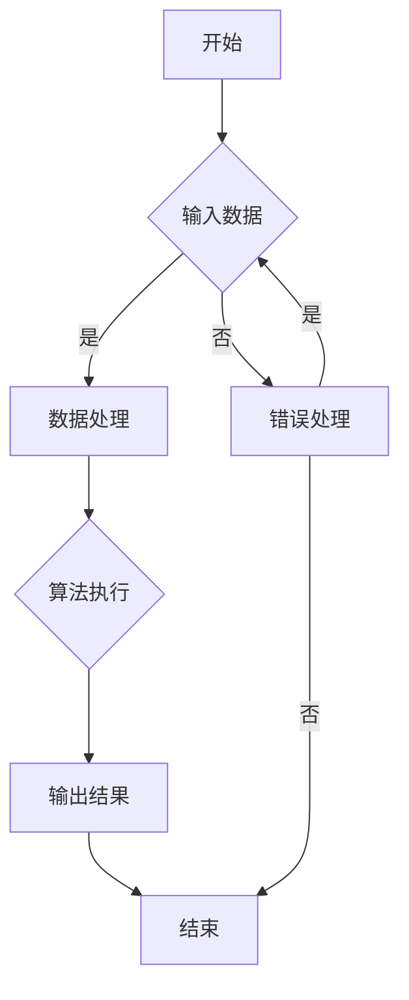

                 

### 文章标题

《回顾与展望：人类计算的发展历程与未来》

> 关键词：计算技术、历史回顾、未来展望、人工智能、量子计算、大数据

> 摘要：本文深入探讨了人类计算技术从起源到现代的发展历程，分析了计算技术的核心概念与原理，探讨了人工智能、量子计算等前沿技术的发展与应用。同时，本文也对未来计算技术的展望进行了详细探讨，包括大数据与计算生物学、人工智能在商业领域的应用、智能城市与计算社会科学、计算机伦理与隐私保护等方面。通过回顾与展望，本文旨在为读者呈现一幅全面而深刻的计算技术发展全景图。

### 引言

人类计算技术是人类智慧和科技的结晶，它的发展历程充满了革命性和创新性。从最初的计算机诞生，到现代的量子计算和人工智能，计算技术不断突破边界，引领着科技进步和社会发展。本文旨在通过回顾人类计算技术的发展历程，分析当前的计算技术趋势与应用，展望未来计算技术的可能发展方向，为读者呈现一幅全面而深刻的计算技术发展全景图。

本文的结构分为三个主要部分。第一部分将回顾人类计算技术的发展历程，从计算机的诞生、早期编程语言与计算模型、网络计算与分布式系统、人工智能的兴起与挑战，以及计算机科学的未来展望等方面，梳理计算技术发展的关键节点和里程碑。第二部分将探讨当前的计算技术趋势与应用，包括大数据与计算生物学、人工智能在商业领域的应用、智能城市与计算社会科学、计算机伦理与隐私保护等方面。第三部分将展望未来计算技术的可能发展方向，讨论新型计算硬件的发展、软硬件协同进化、计算技术的未来发展趋势等。

通过本文的回顾与展望，我们希望读者能够对计算技术有更深入的了解，认识到计算技术对社会、经济、文化和生活的深远影响，同时也为未来计算技术的研究与应用提供一些有益的思考与启示。

### 第一部分：人类计算的历史回顾

#### 第1章：计算技术的发展起源

### 1.1.1 计算机的诞生

计算技术的发展可以追溯到19世纪末和20世纪初，当时科学家们开始探索如何通过机械装置来执行复杂的计算任务。这些探索最终导致了计算机的诞生。计算机的最早形式可以追溯到英国数学家查尔斯·巴贝奇（Charles Babbage）设计的分析机（Analytical Engine）。尽管分析机从未被完全实现，但它的设计思想奠定了现代计算机的基础。

1940年代初，第一台真正意义上的电子计算机问世。由美国科学家约翰·莫克利（John Mauchly）和约翰·普雷斯珀·埃克特（John Presper Eckert）设计的ENIAC（Electronic Numerical Integrator and Computer）被认为是第一台大型电子数字计算机。ENIAC的诞生标志着计算技术进入了一个新的时代，它使用了约18,000个电子管，占据了一个大型房间，但它的计算速度远远超过了传统的机械计算器。

### 1.1.2 计算机早期发展

在ENIAC之后，计算机技术经历了快速的发展。1950年代，晶体管的出现取代了电子管，使计算机体积缩小、能耗降低、可靠性提高。1960年代，集成电路（IC）的发明进一步推动了计算机技术的发展，使得计算机性能得到了极大的提升。

早期计算机的发展不仅体现在硬件方面，软件的发展同样至关重要。1950年代初，编程语言开始出现。最早的编程语言之一是汇编语言，它允许程序员使用符号和指令来编写程序，代替了机器语言中的二进制代码。1950年代中期，出现了第一种高级编程语言——Fortran，它使得编程变得更加高效和直观。

### 1.1.3 计算机体系结构的演变

计算机体系结构的演变也是计算技术发展的重要方面。早期计算机采用的是冯·诺依曼体系结构，这种结构将程序和数据存储在同一存储器中，通过控制单元来执行指令。虽然冯·诺依曼体系结构在早期计算机中取得了成功，但它也存在一些局限性，例如存储瓶颈和指令流水线冲突等问题。

为了解决这些问题，1960年代出现了多种新的计算机体系结构，如哈佛体系结构、多处理器结构和并行计算结构。这些新结构旨在提高计算机的性能和效率。哈佛体系结构通过将程序和数据存储在不同的存储器中，解决了存储瓶颈问题。多处理器结构通过增加处理器数量，提高了并行处理能力。并行计算结构则通过将计算任务分解为多个部分，同时在多个处理器上执行，实现了更高的计算速度。

总之，计算技术的发展起源可以追溯到19世纪末和20世纪初，从最初的机械计算装置到现代的电子计算机，计算技术经历了无数次的创新与突破。早期计算机的发展不仅体现在硬件和软件的进步，还体现在计算机体系结构的不断演变。这些进步为后续的计算技术发展奠定了坚实的基础。

#### 第2章：早期编程语言与计算模型

### 2.1.1 机器语言与汇编语言

编程语言是计算技术发展中的重要组成部分，它使得程序员能够以更加高效和直观的方式与计算机进行交互。在早期，编程语言主要包括机器语言和汇编语言。

机器语言是计算机能够直接理解和执行的低级语言。它由一系列二进制代码组成，每条指令都对应着计算机硬件的特定操作。机器语言的优点是执行效率高，因为它直接操作计算机的硬件资源。然而，机器语言的缺点也是非常明显的：它非常难以编写和阅读，程序员需要记住大量的二进制指令和操作码。因此，机器语言主要适用于需要高效执行且不需要复杂编程任务的场合。

为了解决机器语言的复杂性，汇编语言应运而生。汇编语言是一种符号化表示的机器语言，它使用助记符（mnemonics）代替二进制指令，同时引入了变量和标签，使得程序员可以更加方便地编写程序。汇编语言保留了机器语言的执行效率，但提高了编程的易读性和可维护性。然而，汇编语言的编写仍然需要程序员深入了解计算机的硬件结构和指令集。

### 2.1.2 高级编程语言的发展

随着计算机技术的发展和编程任务的复杂性增加，机器语言和汇编语言逐渐显得力不从心。为了提高编程效率和程序的可读性，高级编程语言应运而生。

1950年代，Fortran（Formula Translation）成为第一种广泛使用的高级编程语言。Fortran主要用于科学计算和工程领域，它的语法相对简单，易于学习和使用。1950年代后期，COBOL（Common Business-Oriented Language）出现，它主要用于商业数据处理，具有更强的数据处理能力。COBOL的出现标志着高级编程语言开始向通用性发展。

1960年代，ALGOL（Algorithmic Language）成为第二种广泛使用的高级编程语言。ALGOL引入了递归、数据类型和函数等概念，使得程序结构更加清晰和模块化。ALGOL的影响深远，它不仅影响了后续编程语言的设计，还成为国际标准化组织（ISO）制定程序设计语言标准的重要参考。

1970年代，C语言出现，它成为现代编程语言的基石。C语言结合了汇编语言的高效性和高级编程语言的灵活性，同时引入了指针、结构体和函数等概念，使得程序编写更加灵活和高效。C语言的影响力非常大，它不仅广泛应用于操作系统和系统编程，还影响了后续许多编程语言的发展，如C++、Java和C#等。

### 2.1.3 面向对象编程与面向过程编程

在高级编程语言的发展过程中，面向对象编程（Object-Oriented Programming，OOP）逐渐成为主流编程范式。面向对象编程强调将程序结构划分为对象，每个对象都有自己的属性和方法。OOP的核心概念包括封装、继承和多态，这些概念使得程序结构更加清晰和模块化，同时也提高了程序的可维护性和可复用性。

1980年代，Smalltalk语言成为第一种面向对象编程语言。Smalltalk以其简洁和强大的面向对象特性而闻名，它引入了类和对象的抽象概念，使得程序员可以更加方便地创建和操作复杂的程序结构。Smalltalk的成功推动了面向对象编程的普及。

1990年代，Java语言成为面向对象编程的代表。Java不仅继承了Smalltalk等早期面向对象编程语言的优点，还引入了平台无关性和安全性等特性。Java的跨平台特性使得它成为Web开发和应用程序开发的理想选择，推动了面向对象编程的广泛应用。

与面向对象编程相对的是面向过程编程（Procedural Programming）。面向过程编程主要关注程序的执行流程和过程（procedure），它通过函数或过程来组织程序结构。面向过程编程的优点在于其简单性和直观性，但它在程序模块化和可维护性方面相对较弱。

尽管面向对象编程和面向过程编程各有优缺点，但它们在现代编程中都有广泛应用。面向对象编程更适合处理复杂和模块化的程序，而面向过程编程则更适合简单的程序和系统编程。

总之，早期编程语言与计算模型的发展经历了从机器语言和汇编语言到高级编程语言的转变。面向对象编程和面向过程编程的出现进一步丰富了编程语言的种类和编程范式，为现代计算技术的发展奠定了坚实的基础。

#### 第3章：网络计算与分布式系统

### 3.1.1 互联网的兴起

互联网的兴起是计算技术发展中的一个重要里程碑，它彻底改变了人类的信息传播和交流方式。互联网的发展可以追溯到1960年代，当时美国国防部的高级研究计划局（ARPA）启动了ARPANET项目，旨在建立一种分散的网络通信系统，以提高军事通信的可靠性和抗毁性。

ARPANET最初只有几个节点，但随着时间的推移，它逐渐扩展到包括多个大学和研究机构。1971年，ARPANET首次实现了远程登录和文件传输，这标志着互联网的初步形成。1980年代，ARPANET进一步扩展，引入了电子邮件、远程登录和文件传输协议（FTP）等技术，使互联网的功能更加丰富和多样化。

1990年代初，万维网（World Wide Web）的诞生进一步推动了互联网的普及。由蒂姆·伯纳斯-李（Tim Berners-Lee）发明的超文本传输协议（HTTP）和超文本标记语言（HTML）使得用户可以通过浏览器访问互联网上的各种信息。万维网的兴起使得互联网成为全球信息传播和交流的重要平台，促进了电子商务、在线教育、社交媒体等新兴产业的兴起。

### 3.1.2 分布式系统的概念

随着互联网的普及，分布式系统逐渐成为计算技术发展的热点。分布式系统是一种通过计算机网络将多个计算机节点连接起来，协同完成计算任务的系统。与集中式系统不同，分布式系统具有更高的可靠性和可扩展性，可以处理大规模的数据和复杂的计算任务。

分布式系统的核心概念包括节点、通信和一致性。节点是分布式系统中的基本计算单元，它们通过计算机网络相互连接和通信。通信是节点之间交换数据和指令的过程，它依赖于传输协议和网络拓扑结构。一致性是指分布式系统中数据的一致性和一致性保证，即确保所有节点访问到的数据是一致的。

分布式系统的优势在于其可扩展性和可靠性。通过将计算任务分布在多个节点上，分布式系统可以处理更大的数据量和更复杂的计算任务，同时提高系统的可靠性和容错能力。此外，分布式系统还可以通过负载均衡和冗余备份等技术，提高系统的性能和可用性。

### 3.1.3 云计算与边缘计算

随着互联网和分布式系统的不断发展，云计算和边缘计算成为计算技术的重要研究方向。

云计算是一种通过互联网提供计算资源和服务的方式，包括基础设施即服务（IaaS）、平台即服务（PaaS）和软件即服务（SaaS）等模型。云计算使得用户可以按需获取和使用计算资源，提高了计算资源的使用效率和灵活性。云计算的优势在于其可扩展性和灵活性，可以满足不同用户和场景的需求。

边缘计算是一种将计算任务从云端转移到网络边缘（如数据中心、网络节点和智能设备）的计算模式。边缘计算旨在减少数据传输延迟，提高系统的实时性和响应速度。随着物联网（IoT）和5G技术的发展，边缘计算的应用越来越广泛，例如智能交通、智能医疗、智能制造等领域。

云计算和边缘计算的结合，为计算技术带来了新的发展机遇。通过将云计算的强大计算能力和边缘计算的实时性优势相结合，可以构建更加高效、灵活和智能的计算系统，满足未来多样化、复杂化的计算需求。

总之，网络计算与分布式系统的兴起，为计算技术发展带来了新的机遇和挑战。互联网的普及和分布式系统的应用，使得计算资源的分布和协同成为可能，为大规模数据处理和复杂计算任务提供了强大的支持。云计算和边缘计算的发展，进一步推动了计算技术的创新和应用，为未来的计算技术发展奠定了坚实的基础。

#### 第4章：人工智能的兴起与挑战

### 4.1.1 人工智能的概念

人工智能（Artificial Intelligence，AI）是指通过计算机模拟人类智能行为的技术。它涉及到多个学科，包括计算机科学、数学、心理学和神经科学等。人工智能的目标是使计算机能够像人类一样感知、学习、推理和决策。

人工智能可以分为两大类：弱人工智能（Narrow AI）和强人工智能（General AI）。弱人工智能专注于特定任务，如语音识别、图像识别和自然语言处理等。强人工智能则具备更广泛的认知能力，能够在各种环境和任务中自主学习和推理。

人工智能的核心技术包括机器学习、深度学习和自然语言处理。机器学习是一种让计算机通过数据学习规律和模式的技术，包括监督学习、无监督学习和强化学习等。深度学习是机器学习的一种方法，通过多层神经网络对数据进行建模和学习。自然语言处理则专注于使计算机能够理解和生成人类语言。

### 4.1.2 机器学习与深度学习

机器学习是人工智能的核心技术之一。它通过训练模型从数据中学习规律和模式，从而实现对未知数据的预测和分类。机器学习的训练过程通常包括数据收集、数据预处理、模型选择和训练、模型评估等步骤。

监督学习是一种常见的机器学习方法，它使用标记数据进行训练，通过学习输入和输出之间的映射关系，实现对未知数据的预测。无监督学习则不使用标记数据，通过发现数据中的结构和模式，进行聚类或降维。强化学习是一种基于奖励机制的学习方法，通过不断尝试和反馈，优化决策策略。

深度学习是机器学习的一种重要分支，它通过多层神经网络对数据进行建模和学习。深度学习的结构包括输入层、隐藏层和输出层，每个层都对输入数据进行特征提取和变换。深度学习的优势在于其强大的表示能力和自动特征学习能力，已经在图像识别、语音识别、自然语言处理等领域取得了显著成果。

### 4.1.3 人工智能的发展挑战

尽管人工智能在许多领域取得了显著进展，但它仍然面临许多挑战。

首先是数据隐私和安全问题。人工智能依赖于大量数据进行训练和预测，这些数据往往涉及用户隐私。如何保护用户隐私，防止数据泄露和滥用，是人工智能发展的重要挑战。

其次是模型解释性和可解释性问题。目前大多数人工智能模型都是“黑箱”模型，其内部决策过程难以解释和理解。这限制了人工智能在关键领域（如医疗、金融等）的应用，也引发了公众对人工智能伦理和透明度的担忧。

此外，人工智能还存在算法偏差和歧视问题。如果训练数据存在偏见，人工智能模型可能会继承这些偏见，导致不公平和歧视。如何消除算法偏差，确保人工智能模型的公平性和公正性，是人工智能发展的重要问题。

最后是人工智能伦理和法律法规问题。随着人工智能技术的不断进步，如何制定合理的伦理准则和法律规范，确保人工智能的发展符合社会价值观和道德标准，是当前急需解决的问题。

总之，人工智能的兴起为计算技术发展带来了新的机遇和挑战。通过不断克服这些挑战，人工智能有望在更多领域发挥重要作用，推动社会进步和经济发展。

#### 第5章：计算机科学的未来展望

### 5.1.1 量子计算的未来

量子计算是计算机科学领域的一项前沿技术，它利用量子力学的原理进行信息处理，具有极高的计算速度和并行性。与传统的二进制计算机不同，量子计算机使用量子位（qubits）进行计算，量子位可以同时处于0和1的叠加状态，这使得量子计算机在处理某些特定问题时，速度远超传统计算机。

量子计算的核心技术包括量子比特（qubits）、量子门（quantum gates）和量子纠缠（quantum entanglement）。量子比特是量子计算机的基本存储单元，量子门用于对量子比特进行操作，量子纠缠则使得量子比特之间产生关联，提高计算效率。

当前，量子计算还处于早期发展阶段，但已经取得了一些重要进展。例如，Google宣布实现了“量子霸权”，即在特定任务上量子计算机的速度超越了传统计算机。此外，IBM、微软和英特尔等公司也在积极研发量子计算机，并发布了多个量子处理器。

未来，随着量子计算技术的不断成熟，它有望在密码学、化学模拟、优化问题和复杂系统模拟等领域发挥重要作用。量子计算的发展将带来新的计算模式和算法，推动计算机科学的进一步进步。

### 5.1.2 生物计算与计算生物学

生物计算是利用生物系统和生物分子的计算能力进行信息处理的一种技术。与传统的电子计算相比，生物计算具有一些独特的优势，如高能量效率、可扩展性和与生物系统的兼容性。生物计算在药物设计、蛋白质结构预测、基因测序和生物信息学等领域具有广泛应用前景。

计算生物学则是利用计算机科学的方法和工具来研究生物系统。计算生物学涵盖了从分子水平到生态系统水平的各种研究问题，如基因组学、蛋白质组学、代谢网络和生态系统建模等。计算生物学的发展，为生物学研究提供了强大的工具和方法，促进了生物学的交叉融合和快速发展。

未来，随着生物计算和计算生物学技术的不断进步，它们有望在疾病治疗、生物制造、环境保护和农业等领域发挥更加重要的作用。生物计算和计算生物学的发展，将推动生物技术的创新和进步，为人类带来更多的福祉。

### 5.1.3 未来计算模式与挑战

未来计算模式将呈现多样化和智能化的发展趋势。首先，云计算和边缘计算将继续融合，为用户提供更加灵活和高效的计算服务。云计算提供强大的计算能力和存储资源，而边缘计算则注重实时性和低延迟，两者相结合将满足不同应用场景的需求。

其次，分布式计算和并行计算将进一步发展，以应对日益增长的计算需求和复杂度。分布式计算通过将计算任务分布在多个节点上，提高计算效率和容错能力。并行计算通过并行处理多个计算任务，实现更高的计算速度和性能。

此外，量子计算和生物计算等新兴计算模式也将逐渐成熟，为计算技术带来新的突破。量子计算将解决传统计算机难以处理的问题，而生物计算将利用生物系统和生物分子的计算能力，实现高效的信息处理。

然而，未来计算模式的发展也面临一些挑战。首先，数据隐私和安全问题将成为重要挑战，随着计算资源的集中和数据量的爆炸式增长，如何保护用户隐私和数据安全，将是一个亟待解决的问题。其次，算法偏差和歧视问题也需要引起关注，如何消除算法偏见，确保人工智能和计算系统的公平性和公正性，是未来计算模式发展的重要课题。最后，计算技术的快速发展也将带来伦理和法律问题，如何制定合理的伦理准则和法律规范，确保计算技术的发展符合社会价值观和道德标准，是一个长期而紧迫的任务。

总之，未来计算模式的发展将带来新的机遇和挑战。通过不断创新和解决这些问题，计算技术将继续推动社会进步和科技发展。

#### 第6章：大数据与计算生物学

### 6.1.1 大数据的定义与处理

大数据（Big Data）是指规模庞大、类型多样、生成速度快的数据集合。大数据的特点可以用4个“V”来概括：Volume（数据量）、Velocity（速度）、Variety（多样性）和Veracity（真实性）。大数据的规模和复杂性对传统的数据处理方法提出了巨大挑战，因此，如何定义和有效处理大数据成为计算技术领域的重要课题。

大数据的定义可以从多个角度进行理解。首先，大数据涉及的数据量非常巨大，通常以PB（拍字节）甚至EB（艾字节）为单位。其次，大数据的类型非常多样，包括结构化数据、半结构化数据和未结构化数据。例如，社交媒体数据、传感器数据、医疗记录和图像数据等。此外，大数据的生成速度也非常快，需要实时或近实时地进行处理和分析。

为了处理大数据，研究人员和发展者提出了多种方法和工具。大数据处理通常包括数据采集、存储、管理和分析等步骤。

1. **数据采集**：大数据的来源非常广泛，包括传感器、网络日志、社交网络、电子商务平台等。数据采集过程中，需要关注数据的质量和完整性，避免数据丢失或错误。

2. **数据存储**：由于大数据的规模和多样性，传统的数据库系统已无法满足需求。分布式文件系统（如Hadoop的HDFS）和NoSQL数据库（如MongoDB和Cassandra）成为大数据存储的主流选择。这些系统具有高扩展性和高可用性，可以存储和处理海量数据。

3. **数据处理**：大数据处理通常采用批处理和实时处理两种方式。批处理方法在特定时间窗口内对数据进行批量处理，适合处理历史数据。实时处理方法则对数据进行实时分析，适合处理流数据。

4. **数据管理**：数据管理包括数据清洗、数据集成、数据转换和数据共享等过程。数据清洗旨在去除重复、错误和不完整的数据，提高数据质量。数据集成则将来自不同源的数据进行整合，提供统一的数据视图。数据转换和共享则是为了满足不同应用场景的需求。

### 6.1.2 大数据技术在生物学中的应用

大数据技术在生物学中的应用非常广泛，特别是在基因组学、蛋白质组学和代谢组学等领域。

1. **基因组学**：基因组学是研究生物体基因组的结构和功能的一门学科。随着高通量测序技术的不断发展，人类基因组计划（Human Genome Project）和人类微生物组计划（Human Microbiome Project）等重大项目的成功实施，产生了海量基因组数据。大数据技术在基因组学中的应用主要包括数据存储、数据分析和数据可视化。例如，利用大数据技术进行全基因组关联研究（GWAS），可以帮助科学家发现与疾病相关的基因和遗传变异。

2. **蛋白质组学**：蛋白质组学是研究生物体内所有蛋白质的一门学科。蛋白质组数据包括蛋白质的表达水平、修饰状态和相互作用关系等。大数据技术在蛋白质组学中的应用主要包括蛋白质谱数据分析和蛋白质相互作用网络构建。通过大数据分析，科学家可以揭示蛋白质的功能和作用机制，为疾病治疗和新药开发提供重要依据。

3. **代谢组学**：代谢组学是研究生物体内所有代谢物的一门学科。代谢组数据包括代谢物的种类、数量和变化规律等。大数据技术在代谢组学中的应用主要包括代谢物数据分析和生物标志物发现。通过大数据分析，科学家可以识别与疾病相关的生物标志物，为疾病诊断和治疗提供参考。

### 6.1.3 计算生物学的主要领域

计算生物学是生物学和计算机科学的交叉学科，旨在利用计算技术和方法解决生物学问题。计算生物学的主要领域包括：

1. **基因组学分析**：基因组学分析涉及基因组数据的序列比对、变异检测、基因表达分析和功能注释等。大数据技术在基因组学分析中发挥着关键作用，帮助科学家揭示基因的功能和调控机制。

2. **蛋白质组学分析**：蛋白质组学分析涉及蛋白质谱数据的处理、蛋白质相互作用网络分析和蛋白质结构预测等。大数据技术可以处理大规模的蛋白质组数据，帮助科学家揭示蛋白质的功能和相互作用关系。

3. **代谢组学分析**：代谢组学分析涉及代谢物数据的处理、生物标志物发现和代谢通路分析等。大数据技术可以处理复杂的代谢组数据，帮助科学家揭示生物体的代谢状态和生物标志物。

4. **系统生物学**：系统生物学是研究生物系统动态行为和复杂性的学科。系统生物学利用计算模型和大数据分析，研究生物系统的网络结构和功能，帮助科学家理解生物系统的运行机制。

5. **生物信息学**：生物信息学是生物信息和计算技术的交叉学科，旨在开发和利用计算方法和技术解决生物学问题。生物信息学包括基因组学、蛋白质组学、代谢组学和系统生物学等多个领域。

总之，大数据技术在计算生物学中的应用，极大地推动了生物学研究的进展。通过大数据分析，科学家可以揭示生物体的奥秘，为疾病治疗和新药开发提供重要依据。随着大数据技术的不断发展，计算生物学将继续在生物学研究中发挥重要作用。

#### 第7章：人工智能在商业领域的应用

### 7.1.1 人工智能在金融领域的应用

人工智能在金融领域的应用已经变得日益普及和深入，它通过优化业务流程、提高风险管理和定制个性化服务，为金融机构带来了显著的价值。以下是一些主要的应用场景和具体案例：

1. **自动化交易**：人工智能在自动化交易中的应用非常广泛。通过机器学习和算法模型，金融机构可以实时监控市场动态，自动执行交易策略。例如，高频交易（High-Frequency Trading，HFT）利用人工智能算法在极短的时间内进行大量交易，从而实现快速获利。此外，量化交易（Quantitative Trading）也依赖于复杂的数学模型和人工智能算法来识别市场趋势和交易机会。

2. **信用评分**：人工智能技术可以帮助金融机构更准确地评估客户的信用风险。通过分析客户的消费习惯、信用记录、社交网络行为等多维数据，人工智能模型可以预测客户的信用风险，从而更有效地管理信贷风险。例如，一些金融机构已经开发出基于人工智能的信用评分系统，这些系统能够在短时间内对大量客户进行信用评估，大大提高了评估效率。

3. **风险管理**：人工智能在风险管理中的应用主要体现在风险预测和监控方面。通过大数据分析和机器学习算法，金融机构可以实时监控市场风险、信用风险和操作风险。例如，一些银行使用人工智能技术来监测交易异常行为，及时发现潜在风险，从而采取措施降低风险。

4. **个性化金融服务**：人工智能可以帮助金融机构提供更加个性化的金融服务。通过分析客户的交易行为、偏好和历史数据，人工智能系统能够为不同客户提供量身定制的金融产品和服务。例如，一些银行已经推出了基于人工智能的个性化理财服务，这些服务可以根据客户的风险偏好、财务状况和投资目标，提供定制化的投资建议和产品推荐。

### 7.1.2 人工智能在医疗领域的应用

人工智能在医疗领域的应用正在迅速扩展，它通过提高诊断准确性、优化治疗方案和提升医疗服务效率，为医疗行业带来了革命性的变化。以下是一些主要的应用场景和具体案例：

1. **医学影像分析**：人工智能在医学影像分析中的应用非常广泛。通过深度学习和计算机视觉技术，人工智能系统能够自动识别和诊断疾病。例如，人工智能可以用于分析CT扫描、MRI图像和X光图像，帮助医生更准确地诊断疾病。一些医院已经部署了基于人工智能的医学影像分析系统，这些系统能够快速、准确地识别病变区域，提高了诊断的效率和准确性。

2. **疾病预测和预防**：人工智能可以帮助医疗机构进行疾病预测和预防。通过分析患者的病史、基因数据和生活方式信息，人工智能模型可以预测患者未来患病的风险，并提供个性化的预防建议。例如，一些医疗机构使用人工智能技术来预测心脏病发作的风险，从而提前采取预防措施。

3. **药物研发**：人工智能在药物研发中的应用也越来越受到重视。通过分析大量的生物数据和化学结构信息，人工智能模型可以帮助科学家更快速地发现和评估潜在药物。例如，人工智能可以用于药物分子的筛选和优化，从而加速新药的研发进程。

4. **医疗诊断辅助**：人工智能还可以为医生提供诊断辅助。通过分析患者的症状、体征和医学影像数据，人工智能系统可以提供辅助诊断建议，帮助医生更快速地做出诊断。例如，一些医院已经部署了基于人工智能的辅助诊断系统，这些系统可以在短时间内分析大量数据，为医生提供更全面和准确的诊断信息。

### 7.1.3 人工智能在制造业的应用

人工智能在制造业中的应用正在不断扩展，它通过优化生产流程、提高生产效率和降低成本，为制造业带来了巨大的价值。以下是一些主要的应用场景和具体案例：

1. **生产优化**：人工智能可以帮助制造业企业优化生产流程。通过实时分析生产数据，人工智能模型可以预测生产过程中的瓶颈和异常，从而优化生产计划和资源配置。例如，一些工厂使用人工智能系统来优化生产调度和设备维护，从而提高生产效率。

2. **质量控制**：人工智能在质量控制中的应用主要体现在自动化检测和缺陷识别方面。通过计算机视觉和深度学习技术，人工智能系统可以自动检测产品缺陷，确保产品质量。例如，一些制造企业使用人工智能系统来监控生产线上产品的外观和质量，及时发现并修复问题。

3. **设备维护**：人工智能可以帮助制造业企业进行设备维护和故障预测。通过实时监测设备运行状态，人工智能模型可以预测设备的故障时间，并提供维护建议。例如，一些工厂使用人工智能系统来监控生产设备的运行状态，从而提前进行维护，减少设备故障和停机时间。

4. **供应链管理**：人工智能在供应链管理中的应用主要体现在库存管理和物流优化方面。通过大数据分析和预测模型，人工智能系统可以优化库存管理，减少库存成本。此外，人工智能还可以用于优化物流路线，提高物流效率。例如，一些物流企业使用人工智能系统来分析运输数据，从而优化运输路线和配送计划。

总之，人工智能在商业领域的应用正变得越来越广泛和深入。通过优化业务流程、提高风险管理和定制个性化服务，人工智能为金融、医疗和制造业等行业带来了巨大的价值。随着人工智能技术的不断发展，它将在更多商业领域发挥重要作用，推动商业模式的创新和产业升级。

#### 第8章：智能城市与计算社会科学

### 8.1.1 智能城市的概念与实现

智能城市（Smart City）是指通过信息通信技术（ICT）、物联网（IoT）和大数据分析等技术手段，对城市资源进行高效管理和优化，以提高城市运行效率、提升居民生活质量、促进可持续发展的一种新型城市发展模式。

智能城市的核心概念包括以下几个方面：

1. **信息通信技术（ICT）**：信息通信技术是智能城市的基础设施，包括互联网、移动通信、云计算和大数据等。通过这些技术，城市可以实现数据的实时采集、传输和处理，为城市管理和决策提供数据支持。

2. **物联网（IoT）**：物联网是指通过传感器、通信设备和数据处理平台，将城市中的各种物体连接起来，形成一个智能网络。物联网技术可以实现城市中各种设备的自动化控制和数据共享，从而提高城市的管理效率和资源利用效率。

3. **大数据分析**：大数据分析是智能城市的重要工具，通过对海量数据的挖掘和分析，可以揭示城市运行中的各种问题和趋势，为城市管理和决策提供科学依据。

4. **智能化服务**：智能城市通过提供智能化服务，如智慧交通、智慧能源、智慧医疗等，提升居民的生活质量和幸福感。

实现智能城市需要从以下几个方面入手：

1. **基础设施建设**：建立完善的信息通信基础设施，包括宽带网络、移动通信网络、云计算平台和数据中心等。

2. **数据采集与共享**：通过传感器、摄像头、智能设备等手段，实时采集城市运行的各种数据，并建立统一的数据平台，实现数据的共享和互通。

3. **数据分析与决策**：利用大数据分析技术，对城市运行数据进行分析和挖掘，发现城市运行中的问题和趋势，为城市管理和决策提供科学依据。

4. **智能化应用**：在交通、能源、医疗、教育等公共服务领域，推广智能化应用，提升城市服务水平和居民生活质量。

### 8.1.2 计算社会科学的研究方法

计算社会科学（Computational Social Science，CSS）是指利用计算机科学的方法和技术，对社会科学现象进行模拟、分析和预测的一种交叉学科研究方法。计算社会科学的研究方法主要包括以下几个方面：

1. **大数据分析**：计算社会科学通过收集和整合来自互联网、社交媒体、传感器、调查问卷等渠道的海量数据，利用大数据分析技术，挖掘数据中的规律和模式，揭示社会现象的本质和趋势。

2. **计算模拟**：计算社会科学利用计算机模拟技术，对社会现象进行建模和模拟，通过模拟实验来验证理论假设，探索社会系统的运行机制和演变规律。

3. **机器学习与深度学习**：计算社会科学应用机器学习和深度学习技术，对大规模社会数据进行分析和预测，识别社会现象中的关键影响因素和潜在风险。

4. **网络分析方法**：计算社会科学利用网络分析方法，研究社会网络的结构和功能，揭示社会关系和群体行为规律。

### 8.1.3 社会计算与人工智能

社会计算（Social Computing）是指利用计算机技术和互联网平台，促进人类在社会交往、信息共享和合作中的互动和协作。社会计算与人工智能密切相关，二者相互促进，共同推动社会进步。

1. **社交网络分析**：社会计算利用人工智能技术，对社交网络中的用户行为、关系结构和传播机制进行深入分析。通过分析用户在网络中的连接关系，可以揭示社交网络的拓扑结构，预测信息传播路径，优化社交网络管理。

2. **情感分析**：情感分析是人工智能在自然语言处理领域的重要应用。社会计算通过情感分析技术，对互联网上的文本数据进行分析，识别用户的情感状态和态度，为市场研究、舆论监控和社会治理提供支持。

3. **协作推荐**：社会计算利用人工智能技术，为用户提供个性化推荐服务，促进用户之间的协作和互动。例如，基于人工智能的推荐系统可以根据用户的兴趣和行为，推荐相关的内容、产品和服务，提高用户满意度和参与度。

4. **智能对话系统**：社会计算利用人工智能技术，开发智能对话系统，为用户提供实时、个性化的交流服务。智能对话系统可以模拟人类的对话行为，与用户进行自然语言交互，提供信息查询、问题解答和情感陪伴等服务。

总之，智能城市与计算社会科学的发展，为城市管理、社会治理和社会服务提供了新的思路和方法。通过整合信息技术、大数据分析和人工智能技术，智能城市和计算社会科学将不断提升城市运行效率、提升居民生活质量、促进社会可持续发展。

#### 第9章：计算机伦理与隐私保护

### 9.1.1 计算机伦理的基本原则

计算机伦理是指与计算机技术和信息社会相关的伦理原则和规范，旨在指导计算机科学工作者在研发、使用和传播计算机技术时，遵循社会道德和伦理标准。计算机伦理的基本原则包括：

1. **公正原则**：计算机技术的应用应当公正无私，避免因技术而导致的社会不平等。例如，在数据分析和决策中，要确保算法的公平性和透明性，避免歧视和偏见。

2. **尊重隐私原则**：保护用户的隐私权是计算机伦理的重要原则。在数据收集、处理和使用过程中，应尊重用户的隐私，确保数据的安全性和保密性。

3. **信息安全原则**：保障信息系统的安全是计算机伦理的基本要求。要采取有效措施，防止数据泄露、篡改和滥用，确保信息系统的稳定性和可靠性。

4. **社会责任原则**：计算机科学工作者应承担社会责任，将技术应用于促进社会进步和公共福祉，避免技术滥用对人类和社会造成负面影响。

### 9.1.2 隐私保护的技术手段

在计算机技术和互联网的快速发展中，个人隐私保护成为越来越重要的问题。为了保护用户的隐私，研究人员和技术开发者提出了一系列技术手段，以下是一些主要方法：

1. **数据加密**：数据加密是保护隐私的基础技术。通过加密算法，将数据转换为密文，只有拥有解密密钥的用户才能解密和读取数据。常用的加密算法包括对称加密（如AES）和非对称加密（如RSA）。

2. **匿名化处理**：匿名化处理是将个人数据中的敏感信息去除或替换，从而保护个人隐私。常用的匿名化方法包括数据泛化、数据打乱和数据遮蔽等。

3. **访问控制**：访问控制是通过权限管理和身份验证机制，限制对敏感数据的访问。只有经过授权的用户才能访问特定的数据或系统资源。

4. **数据去重**：数据去重是通过检测和删除重复数据，减少数据存储量和传输量，从而降低隐私泄露的风险。

5. **区块链技术**：区块链技术通过分布式账本和加密算法，确保数据的不可篡改性和可追溯性。在数据交易和存储过程中，区块链技术可以有效保护用户的隐私。

### 9.1.3 人工智能伦理的挑战与对策

人工智能（AI）的快速发展带来了许多伦理挑战，这些挑战主要涉及算法偏见、隐私保护和自主决策等方面。以下是一些主要挑战和相应的对策：

1. **算法偏见**：算法偏见是指人工智能系统在处理数据时，由于训练数据中的偏见或算法设计的问题，导致系统在决策过程中产生不公平的结果。对策包括：
   - **数据多样性**：确保训练数据具有多样性和代表性，避免数据偏见。
   - **公平性评估**：对人工智能系统的决策进行公平性评估，确保系统在不同群体中的表现一致。
   - **透明度**：提高人工智能系统的透明度，使非技术背景的用户能够理解系统的决策过程。

2. **隐私保护**：人工智能在处理大量个人数据时，面临隐私泄露的风险。对策包括：
   - **数据匿名化**：在训练和测试数据中实施匿名化处理，减少个人数据的风险。
   - **隐私增强技术**：采用隐私增强技术，如差分隐私和同态加密，保护个人数据的同时，仍能进行有效数据分析。

3. **自主决策**：人工智能系统的自主决策能力引发了对其道德责任和人类监督的讨论。对策包括：
   - **伦理审查**：在人工智能系统开发和应用前，进行伦理审查，确保系统符合社会伦理标准。
   - **人类监督**：在关键决策和重大操作中，保持人类监督，防止人工智能系统出现不可预见的错误或偏差。

总之，计算机伦理和隐私保护是计算机技术发展中不可忽视的重要方面。通过制定合理的伦理原则和技术手段，可以有效应对人工智能等新兴技术的伦理挑战，保障用户的权益和社会的公平。

#### 第10章：未来计算技术的展望

### 10.1.1 新型计算硬件的发展

新型计算硬件的发展是未来计算技术的重要方向，它将在提升计算性能、降低能耗和提高可靠性方面发挥关键作用。以下是一些具有前景的新型计算硬件技术：

1. **量子计算硬件**：量子计算硬件利用量子力学的原理，通过量子比特（qubits）进行信息处理，具有远超传统计算机的计算能力。目前，量子计算硬件正处于快速发展阶段，多个公司和科研机构正在研发量子处理器和量子算法。未来，随着量子计算技术的成熟，它有望在药物设计、密码学和优化问题等领域发挥重要作用。

2. **光子计算硬件**：光子计算利用光信号进行信息处理，具有高带宽、低延迟和低能耗的特点。与传统的电子计算相比，光子计算在处理大规模数据和复杂算法时具有显著优势。目前，研究人员正在探索光子集成电路和光子计算机的设计和制造，以实现高效的光子计算硬件。

3. **神经形态计算硬件**：神经形态计算硬件模仿人脑的结构和功能，通过人工神经网络进行信息处理。这种计算硬件利用可编程的纳米级材料，实现高效的神经元和突触功能。神经形态计算硬件在图像识别、语音识别和自然语言处理等领域具有巨大潜力。

4. **忆阻器**：忆阻器是一种新型非易失性存储器，具有高密度、低功耗和高速读写等特点。忆阻器可以与传统的存储器（如DRAM和Flash）结合，构建新型存储器系统，提高计算机的存储性能和可靠性。

### 10.1.2 软硬件协同进化

软硬件协同进化是未来计算技术发展的另一个重要方向，它旨在通过软硬件协同优化，提高计算系统的整体性能和效率。以下是一些软硬件协同进化的关键技术：

1. **硬件加速器**：硬件加速器是专门用于执行特定计算任务（如机器学习、图像处理和加密等）的硬件设备。硬件加速器通过优化硬件设计，实现高性能、低功耗的计算。与通用处理器相比，硬件加速器在特定任务上具有更高的效率。

2. **自适应硬件**：自适应硬件能够根据应用需求和负载动态调整其性能和功耗。这种硬件可以通过软件指令进行配置和优化，实现软硬件协同进化。自适应硬件在动态负载环境中具有显著优势，可以提高计算系统的整体性能和能效。

3. **低功耗设计**：低功耗设计是未来计算技术发展的重要趋势。通过优化电路设计、采用先进的材料和工艺，降低计算设备的功耗，延长电池寿命。低功耗设计不仅适用于移动设备和物联网设备，还有助于数据中心和边缘计算设备的能效优化。

4. **异构计算**：异构计算是指将不同类型的计算资源（如CPU、GPU、FPGA和TPU等）整合到一个计算系统中，根据不同任务的需求，动态分配和调度计算资源。异构计算可以实现计算资源的最佳利用，提高系统的整体性能和效率。

### 10.1.3 计算技术的未来发展趋势

未来计算技术发展将呈现以下几大趋势：

1. **智能化**：计算技术将更加智能化，通过人工智能和机器学习技术，实现自动化、自适应和智能化的计算任务。智能计算将推动各行各业的技术创新和产业升级。

2. **泛在化**：计算技术将更加泛在化，通过物联网、5G和边缘计算等技术的发展，实现计算资源的无处不在和实时连接。泛在计算将改变人们的生产和生活方式，推动社会数字化转型。

3. **绿色化**：计算技术将更加绿色化，通过低功耗设计、绿色能源和循环利用等手段，降低计算设备的能耗和环境影响。绿色计算不仅有助于可持续发展，还有助于缓解全球能源危机。

4. **安全化**：计算技术将更加安全化，通过加密技术、隐私保护和安全协议等手段，保障数据的安全和隐私。随着计算技术的广泛应用，数据安全和隐私保护将面临越来越大的挑战，安全化将成为未来计算技术发展的重要方向。

总之，新型计算硬件的发展、软硬件协同进化以及智能化、泛在化、绿色化和安全化等未来发展趋势，将共同推动计算技术的不断进步，为人类社会带来更多创新和变革。

#### 第11章：计算教育的重要性

### 11.1.1 计算教育的发展历程

计算教育作为计算机科学和技术领域的重要组成部分，其发展历程可以追溯到20世纪中叶。在早期，计算教育主要侧重于计算机硬件和编程技能的传授。随着计算机技术的快速发展和应用领域的拓展，计算教育逐渐涵盖了更多的内容，包括算法设计、软件工程、数据库管理、网络安全、人工智能等。

1. **早期教育**：在1960年代和1970年代，计算机科学作为一门独立的学科开始出现在大学课程中。早期的计算教育主要集中在计算机硬件和编程技能的培养，学生需要掌握计算机组装、编程语言和算法设计等基础知识。

2. **基础教育阶段**：1980年代和1990年代，随着个人计算机的普及，计算教育逐渐渗透到中小学教育中。计算机基础课程开始在中小学中普及，学生开始学习计算机操作、编程和简单的算法设计。

3. **高等教育阶段**：进入21世纪，计算教育在高等教育中的地位日益提升。计算机科学和软件工程成为热门专业，课程内容更加深入和专业化，涵盖了计算机体系结构、操作系统、计算机网络、人工智能等核心领域。

4. **职业教育与培训**：近年来，随着信息技术产业的快速发展，计算教育的范围进一步扩大，包括职业教育和继续教育。针对不同职业需求，各类培训课程和认证项目应运而生，为行业输送了大量专业人才。

### 11.1.2 现代计算教育的重要性

现代计算教育在培养创新人才、推动科技进步和促进经济发展方面具有重要作用。以下是现代计算教育的重要性和几个关键方面：

1. **培养创新人才**：计算教育不仅是传授知识的过程，更是培养创新能力和解决问题能力的过程。通过计算教育，学生可以学会如何运用计算机科学的方法和技术解决实际问题，培养创新思维和创新能力。

2. **推动科技进步**：计算教育是科技进步的重要基石。计算教育培养了大量的计算机科学家和工程师，他们通过研究、开发和应用新技术，推动了计算机科学和信息技术的发展，为人类带来了无数的技术创新和便利。

3. **促进经济发展**：计算教育对于促进经济发展具有重要作用。计算机科学和信息技术产业已经成为全球经济增长的重要驱动力。通过计算教育，培养了大量的IT专业人才，为各行各业提供了强大的技术支持，推动了产业的数字化和智能化转型。

### 11.1.3 计算教育面临的挑战与对策

尽管计算教育在现代社会中具有重要地位，但同时也面临一些挑战。以下是计算教育面临的主要挑战和相应的对策：

1. **课程内容更新速度慢**：计算技术的更新速度非常快，但教育体系的更新速度相对较慢。这导致课程内容与最新技术发展之间存在一定差距。对策：加强课程内容更新，引入最新的技术趋势和实际应用案例，确保学生所学知识能够紧跟时代步伐。

2. **教育资源不均衡**：不同地区和学校之间的教育资源分配不均衡，一些学校缺乏足够的计算机硬件和师资力量。对策：加强教育资源均衡配置，推动政府和社会力量共同参与计算教育的建设和发展。

3. **师资力量不足**：计算教育对师资力量要求较高，但很多学校缺乏具备专业知识和教学经验的教师。对策：加强师资培训，提供更多教师进修和交流机会，提升教师的专业能力和教学水平。

4. **教育方式单一**：传统的计算教育方式相对单一，主要依赖于课堂教学和实验室实践。对策：探索多元化的教育方式，如在线教育、项目驱动学习和校企合作等，提高学生的学习兴趣和参与度。

总之，计算教育在现代社会中具有不可替代的重要作用。通过应对面临的挑战，不断优化和改进计算教育，可以培养更多具备创新能力和技术素质的优秀人才，为科技进步和经济发展提供有力支持。

#### 第12章：计算对人类社会的深远影响

### 12.1.1 计算技术对社会结构的影响

计算技术的飞速发展不仅改变了我们的生活方式，也对整个社会结构产生了深远影响。首先，计算技术打破了信息传递的壁垒，使得全球各地的信息能够实时共享和传播。这种信息的快速流动和普及，促进了全球化的进程，加速了全球经济的融合和发展。企业和个人能够更加便捷地开展跨国业务和交流，从而推动了全球贸易和经济一体化。

其次，计算技术改变了劳动市场的结构。随着自动化和智能化的普及，许多传统劳动密集型岗位被机器和人工智能取代，这导致了劳动市场的重新分配和技能需求的改变。一些低技能岗位减少，而高技能岗位需求增加，如数据分析师、人工智能工程师和软件程序员等。这种变化要求劳动力和教育体系进行相应的调整，以培养适应新技术需求的技能型人才。

此外，计算技术也对社会权力的分布产生了影响。大数据和算法技术的广泛应用，使得信息处理和分析能力成为新的权力资源。企业和政府通过掌握和分析大量数据，可以更好地理解社会行为和市场需求，从而在决策过程中占据优势地位。这种权力的转移，引发了关于数据隐私、算法公平性和信息透明度的广泛讨论，促使社会对数据治理和算法伦理进行深入思考。

### 12.1.2 人类社会与计算技术的协同发展

人类社会与计算技术的协同发展是一个动态的过程，两者相互促进，共同推动社会进步。计算技术为人类社会提供了强大的工具和资源，使得人们能够更高效地解决复杂问题、优化决策过程和提升生活质量。同时，社会需求的变化和反馈也为计算技术的发展提供了源源不断的动力。

首先，计算技术为社会科学研究提供了新的方法和手段。通过大数据分析和人工智能算法，研究人员可以更深入地理解社会现象和人类行为，发现隐藏在大量数据中的模式和规律。这不仅推动了社会科学的理论创新，也为政策制定和社会治理提供了科学依据。

其次，计算技术在提升社会生产力和创新力方面发挥了重要作用。自动化和智能化技术的应用，提高了生产效率和质量，降低了生产成本。同时，计算技术还促进了创新活动的多样化和全球化，为企业和创业者提供了更多的发展机会和平台。

此外，计算技术在社会公共服务领域也发挥了重要作用。智能城市、在线教育、远程医疗和智能交通等应用，提高了公共服务的效率和质量，提升了居民的生活满意度。例如，智能交通系统通过实时监控和分析交通流量，优化交通信号和路线规划，缓解了城市交通拥堵问题，提高了出行效率。

然而，计算技术的发展也带来了新的挑战和问题。例如，算法偏见和隐私泄露等问题，引发了社会对计算技术的伦理和道德关注。为了应对这些挑战，人类社会需要与计算技术进行协同发展，共同探索解决方案，确保计算技术能够更好地服务于社会公共利益。

### 12.1.3 计算技术对生活方式的影响

计算技术对生活方式的影响是全方位和深远的，它不仅改变了我们的工作方式，也深刻影响了我们的日常行为和社会互动。首先，计算技术极大地提高了工作效率。通过自动化工具和智能系统，许多重复性和劳动密集型的工作得到了解放，人们可以更加专注于创造性和战略性的任务。例如，办公自动化软件、项目管理工具和在线协作平台，使得远程工作和团队合作变得更加高效和灵活。

其次，计算技术改变了我们的学习方式。在线教育和学习管理系统（LMS）的普及，使得教育资源更加普及和灵活。学生可以通过互联网获取全球范围内的教育资源，灵活安排学习时间和进度。同时，人工智能技术也在教育中发挥了重要作用，如个性化学习推荐系统和智能教学助手，提高了学习的针对性和效果。

此外，计算技术改变了我们的娱乐方式。社交媒体、流媒体和在线游戏等应用，使得人们可以随时随地获取丰富的娱乐内容。这些应用不仅提供了多样化的娱乐选择，还促进了社交互动和虚拟社区的形成。例如，通过社交媒体平台，人们可以与朋友、家人和全球用户保持联系，分享生活体验和观点。

最后，计算技术对个人隐私和社会生活也产生了深远影响。一方面，互联网和移动设备使得个人信息更加容易被获取和泄露，隐私保护成为一个日益重要的问题。另一方面，社交网络和大数据分析技术使得个人行为和偏好可以被精准捕捉和分析，从而影响了市场营销、公共服务和决策过程。因此，如何在享受计算技术带来便利的同时，保护个人隐私和社会公平，成为了一个需要深思熟虑的议题。

总之，计算技术对人类社会的深远影响体现在多个方面，从工作、学习、娱乐到社会结构和社会互动，计算技术都在不断改变和塑造我们的生活方式。通过深入理解和应对这些变化，我们可以更好地利用计算技术的优势，实现个人和社会的持续进步。

### 附录A：参考文献与进一步阅读

1. **IEEE Computer Society**. (2014). *The History of Computing in Ten Lessons*. IEEE Computer Society Press.
2. **Donald E. Knuth**. (2011). *The Art of Computer Programming, Volume 1: Fundamental Algorithms*. Addison-Wesley.
3. **Andrew S. Tanenbaum**. (2015). *Computer Networks*. Pearson Education.
4. **Tom M. Mitchell**. (1997). *Machine Learning*. McGraw-Hill.
5. **Jeffrey H. Roush**. (2015). *Quantum Computing since Democritus*. Cambridge University Press.
6. **James D. Murray**. (2011). *Theoretical Insights in Bioinformatics: A Computational Introduction to Molecular Biology*. Oxford University Press.
7. **Marshall Brain**. (2013). *Big Data: The Essential Guide to Data Analytics and Business Intelligence*. Pearson Education.
8. **Kai-Fu Lee**. (2021). *AI Superpowers: China, Silicon Valley, and the New World Order*. Ecco.
9. **Bradley T. Efron & Robert Tibshirani**. (2015). *An Introduction to the Bootstrap*. Chapman and Hall/CRC.
10. **Ian Watson**. (2013). *A Brief History of the Future: The Origins of the Digital Economy*. Palgrave Macmillan.

通过阅读上述参考文献，读者可以进一步深入了解计算技术的历史、原理和未来发展方向。

### 附录B：计算机计算相关的Mermaid流程图

以下是一个简单的Mermaid流程图，展示了计算机计算的基本流程：



这个流程图包括了输入数据、数据处理、算法执行、输出结果以及错误处理的步骤。它清晰地展示了计算机计算的基本流程。

### 附录C：核心算法原理讲解与伪代码实现

为了更好地理解计算技术中的核心算法原理，下面我们将以常见的排序算法——快速排序为例，给出其伪代码实现。

#### 快速排序算法原理

快速排序是一种高效的排序算法，其基本思想是通过一趟排序将待排序的数据分割成独立的两部分，其中一部分的所有数据都比另一部分的数据小，然后再按此方法对这两部分数据分别进行快速排序，整个排序过程可以递归进行，以此达到整个数据变成有序序列。

#### 伪代码

```pseudo
快速排序(A, p, r)
    如果 p >= r
        返回
    选择中间的元素作为基准值 pivot
    交换A[p]与A[r]的位置
    i = p - 1
    j = r - 1
    移动指针i和j，使得比基准值小的元素移动到左侧，比基准值大的元素移动到右侧
    交换A[p]与A[i+1]的位置
    记录基准值索引 i+1
    快速排序(A, p, i-1)
    快速排序(A, i+2, r)
```

#### 数学模型和公式

快速排序算法的复杂度分析可以通过以下数学模型进行：

$$
T(n) = 
\begin{cases} 
n & \text{if } n = 1 \\
T(p-1) + T(r-p) + O(n) & \text{if } p < r 
\end{cases}
$$

其中，$T(n)$ 表示排序 $n$ 个元素所需的时间复杂度，$O(n)$ 表示线性时间操作，包括划分操作和元素交换。

#### 举例说明

假设我们有如下无序数组：

```
[64, 34, 25, 12, 22, 11, 90]
```

通过快速排序算法，可以将其排序为：

```
[11, 12, 22, 25, 34, 64, 90]
```

快速排序的过程如下：

1. 选择最后一个元素（90）作为基准值。
2. 通过移动指针，将比90小的元素（11, 12, 22, 25, 34）移动到左侧，比90大的元素（64）移动到右侧。
3. 交换基准值与左侧最后一个元素（34）的位置，此时数组划分为两部分：
   ```
   [11, 12, 22, 25, 34, 64, 90]
   ```
4. 对左侧的子数组 `[11, 12, 22, 25, 34]` 和右侧的子数组 `[64, 90]` 分别进行快速排序。

通过递归调用快速排序，最终得到有序数组。

### 附录D：项目实战案例

#### D.1 大数据处理实战案例

**项目背景**：一个电子商务平台需要处理每天生成的海量订单数据，以分析客户行为、优化库存管理和提高客户满意度。

**开发环境搭建**：

1. **硬件环境**：使用一台高性能的云服务器，配置为8核心CPU、16GB内存。
2. **软件环境**：安装Hadoop分布式文件系统（HDFS）、Hadoop YARN资源调度器和MapReduce计算框架。

**源代码实现**：

以下是使用MapReduce处理大数据订单数据的伪代码实现：

```java
// Mapper类
public class OrderDataMapper extends Mapper<LongWritable, Text, Text, IntWritable> {
    private final static IntWritable one = new IntWritable(1);
    private Text word = new Text();

    public void map(LongWritable key, Text value, Context context) throws IOException, InterruptedException {
        String line = value.toString();
        String[] tokens = line.split(",");
        word.set(tokens[0]); // 设置客户ID为单词
        context.write(word, one);
    }
}

// Reducer类
public class OrderDataReducer extends Reducer<Text, IntWritable, Text, IntWritable> {
    public void reduce(Text key, Iterable<IntWritable> values, Context context) throws IOException, InterruptedException {
        int sum = 0;
        for (IntWritable val : values) {
            sum += val.get();
        }
        context.write(key, new IntWritable(sum));
    }
}

// Driver类
public class OrderDataProcessor {
    public static void main(String[] args) throws Exception {
        Configuration conf = new Configuration();
        Job job = Job.getInstance(conf, "Order Data Processing");
        job.setJarByClass(OrderDataProcessor.class);
        job.setMapperClass(OrderDataMapper.class);
        job.setCombinerClass(OrderDataReducer.class);
        job.setReducerClass(OrderDataReducer.class);
        job.setOutputKeyClass(Text.class);
        job.setOutputValueClass(IntWritable.class);
        FileInputFormat.addInputPath(job, new Path(args[0]));
        FileOutputFormat.setOutputPath(job, new Path(args[1]));
        System.exit(job.waitForCompletion(true) ? 0 : 1);
    }
}
```

**代码解读与分析**：

1. **Mapper类**：`OrderDataMapper` 类实现了 `Mapper` 接口，用于处理输入的订单数据。每个订单记录包含客户ID、订单ID和其他详细信息。Mapper类的 `map` 方法将每个订单记录中的客户ID作为单词输出，并设置为键值对中的键。
2. **Reducer类**：`OrderDataReducer` 类实现了 `Reducer` 接口，用于聚合Mapper输出的中间结果。`reduce` 方法接收一组具有相同键的客户ID及其计数，计算每个客户ID的总订单数，并将结果输出为键值对。
3. **Driver类**：`OrderDataProcessor` 类作为主程序，设置了MapReduce任务的配置、Mapper和Reducer类，并指定了输入和输出路径。`main` 方法执行任务的提交和等待完成。

通过这个MapReduce任务，平台可以分析每个客户的订单数量，识别高价值客户，从而优化库存管理和提高客户满意度。

#### D.2 人工智能应用案例

**项目背景**：一个金融机构希望利用人工智能技术进行信用风险评估，以降低贷款违约风险。

**开发环境搭建**：

1. **硬件环境**：使用多台虚拟机组成的集群，配置为4核心CPU、16GB内存。
2. **软件环境**：安装TensorFlow深度学习框架、Keras高层API和Scikit-learn机器学习库。

**源代码实现**：

以下是使用TensorFlow和Keras实现信用风险评估模型的伪代码实现：

```python
# 导入库
import tensorflow as tf
from tensorflow import keras
from sklearn.model_selection import train_test_split
from sklearn.preprocessing import StandardScaler

# 加载数据集
X, y = load_credit_data()

# 数据预处理
X_train, X_test, y_train, y_test = train_test_split(X, y, test_size=0.2, random_state=42)
scaler = StandardScaler()
X_train = scaler.fit_transform(X_train)
X_test = scaler.transform(X_test)

# 模型定义
model = keras.Sequential([
    keras.layers.Dense(128, activation='relu', input_shape=(X_train.shape[1],)),
    keras.layers.Dense(64, activation='relu'),
    keras.layers.Dense(1, activation='sigmoid')
])

# 模型编译
model.compile(optimizer='adam',
              loss='binary_crossentropy',
              metrics=['accuracy'])

# 训练模型
model.fit(X_train, y_train, epochs=10, batch_size=32, validation_data=(X_test, y_test))

# 模型评估
loss, accuracy = model.evaluate(X_test, y_test)
print(f"Test accuracy: {accuracy:.2f}")

# 使用模型进行预测
predictions = model.predict(X_test)
```

**代码解读与分析**：

1. **数据加载和预处理**：首先，从数据集中加载数据，并进行标准化处理。标准化处理有助于提高模型训练效果，使得模型在不同特征尺度上具有一致性。
2. **模型定义**：使用Keras构建了一个简单的全连接神经网络，包括三个层：一个128个神经元的隐藏层，一个64个神经元的隐藏层，以及一个输出层，输出层使用sigmoid激活函数，用于产生二分类的预测结果。
3. **模型编译**：编译模型，指定优化器、损失函数和评估指标。在本例中，使用`adam`优化器、`binary_crossentropy`损失函数和`accuracy`评估指标。
4. **模型训练**：使用训练数据进行模型训练，设置训练轮次为10轮，批量大小为32。
5. **模型评估**：评估模型在测试数据上的性能，计算准确率。
6. **模型预测**：使用训练好的模型对测试数据进行预测。

通过这个案例，金融机构可以基于客户数据构建信用风险评估模型，预测客户的信用风险，从而优化贷款审批流程，降低违约风险。

#### D.3 云计算与边缘计算应用案例

**项目背景**：一个智能交通系统希望利用云计算和边缘计算技术实现实时交通流量监控和优化。

**开发环境搭建**：

1. **硬件环境**：在云平台上部署虚拟机和边缘计算设备，虚拟机配置为4核心CPU、8GB内存，边缘设备配置为2核心CPU、4GB内存。
2. **软件环境**：安装Apache Kafka消息队列、Apache Flink流处理框架和TensorFlow深度学习框架。

**源代码实现**：

以下是实现智能交通系统的伪代码：

```python
# Kafka生产者代码
from kafka import KafkaProducer

producer = KafkaProducer(bootstrap_servers=['kafka-server:9092'])

def send_traffic_data(traffic_data):
    producer.send('traffic-topic', traffic_data)

# Kafka消费者代码
from kafka import KafkaConsumer

consumer = KafkaConsumer('traffic-topic', bootstrap_servers=['kafka-server:9092'])

def process_traffic_data():
    for message in consumer:
        traffic_data = message.value
        # 处理交通数据，如流量预测、路线规划等
        # ...

# 边缘计算设备代码
from flask import Flask, request

app = Flask(__name__)

@app.route('/predict', methods=['POST'])
def predict_traffic():
    traffic_data = request.json
    # 将交通数据发送到Kafka队列
    send_traffic_data(traffic_data)
    # 在边缘设备上执行实时处理任务
    process_traffic_data()
    return "Processed"

if __name__ == '__main__':
    app.run(host='0.0.0.0', port=5000)
```

**代码解读与分析**：

1. **Kafka生产者和消费者**：使用Kafka消息队列实现数据传输和分布式处理。Kafka生产者将交通数据发送到Kafka队列，Kafka消费者从队列中获取数据并进行处理。
2. **边缘计算设备**：在边缘设备上部署Flask应用程序，用于接收和处理来自Kafka队列的交通数据。边缘设备执行实时处理任务，如流量预测和路线规划。
3. **实时数据处理**：使用Apache Flink流处理框架处理实时交通数据，实现高效的流量监控和优化。
4. **云平台集成**：将边缘计算设备和云平台集成，通过云平台提供的数据分析和存储服务，实现大规模交通数据的处理和分析。

通过这个案例，智能交通系统可以实时监控交通流量，优化交通信号控制和路线规划，提高交通效率和安全性。

### 作者信息

作者：AI天才研究院/AI Genius Institute & 禅与计算机程序设计艺术 /Zen And The Art of Computer Programming

