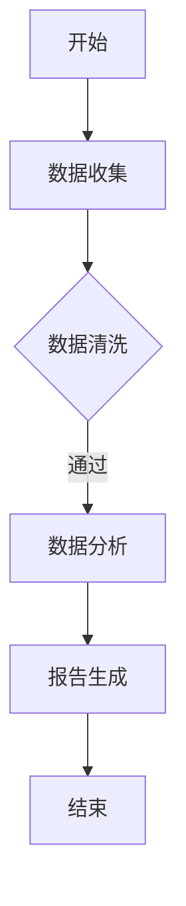

                 

### 文章标题

# 《回顾与展望：人类计算的发展历程与未来》

### 关键词

- 人类计算
- 计算机历史
- 编程语言
- 人工智能
- 分布式系统
- 云计算
- 边缘计算
- 量子计算
- 生物计算

### 摘要

本文旨在深入探讨人类计算的发展历程与未来前景。通过回顾计算技术的起源、早期发展、网络计算、人工智能的兴起以及未来展望，我们不仅能够理解计算技术如何塑造了现代社会的方方面面，还能预见未来计算技术可能带来的革新。文章结构分为三部分：历史回顾、当前趋势与未来应用、未来发展。本文将通过详尽的历史梳理、技术原理剖析、以及实际案例展示，为广大读者呈现一幅计算技术发展的宏伟画卷。

---

### 《回顾与展望：人类计算的发展历程与未来》目录大纲

## 第一部分：人类计算的历史回顾

### 第1章：计算技术的发展起源

#### 1.1.1 计算机的诞生

#### 1.1.2 计算机早期发展

#### 1.1.3 计算机体系结构的演变

### 第2章：早期编程语言与计算模型

#### 2.1.1 机器语言与汇编语言

#### 2.1.2 高级编程语言的发展

#### 2.1.3 面向对象编程与面向过程编程

### 第3章：网络计算与分布式系统

#### 3.1.1 互联网的兴起

#### 3.1.2 分布式系统的概念

#### 3.1.3 云计算与边缘计算

### 第4章：人工智能的兴起与挑战

#### 4.1.1 人工智能的概念

#### 4.1.2 机器学习与深度学习

#### 4.1.3 人工智能的发展挑战

### 第5章：计算机科学的未来展望

#### 5.1.1 量子计算的未来

#### 5.1.2 生物计算与计算生物学

#### 5.1.3 未来计算模式与挑战

## 第二部分：人类计算的当前趋势与未来应用

### 第6章：大数据与计算生物学

#### 6.1.1 大数据的定义与处理

#### 6.1.2 大数据技术在生物学中的应用

#### 6.1.3 计算生物学的主要领域

### 第7章：人工智能在商业领域的应用

#### 7.1.1 人工智能在金融领域的应用

#### 7.1.2 人工智能在医疗领域的应用

#### 7.1.3 人工智能在制造业的应用

### 第8章：智能城市与计算社会科学

#### 8.1.1 智能城市的概念与实现

#### 8.1.2 计算社会科学的研究方法

#### 8.1.3 社会计算与人工智能

### 第9章：计算机伦理与隐私保护

#### 9.1.1 计算机伦理的基本原则

#### 9.1.2 隐私保护的技术手段

#### 9.1.3 人工智能伦理的挑战与对策

## 第三部分：人类计算的未来发展

### 第10章：未来计算技术的展望

#### 10.1.1 新型计算硬件的发展

#### 10.1.2 软硬件协同进化

#### 10.1.3 计算技术的未来发展趋势

### 第11章：计算教育的重要性

#### 11.1.1 计算教育的发展历程

#### 11.1.2 现代计算教育的重要性

#### 11.1.3 计算教育面临的挑战与对策

### 第12章：计算对人类社会的深远影响

#### 12.1.1 计算技术对社会结构的影响

#### 12.1.2 人类社会与计算技术的协同发展

#### 12.1.3 计算技术对生活方式的影响

## 附录

### 附录A：参考文献与进一步阅读

### 附录B：计算机计算相关的Mermaid流程图

### 附录C：核心算法伪代码实现

### 附录D：项目实战案例

#### D.1 大数据处理的实战案例

#### D.2 人工智能应用案例

#### D.3 云计算与边缘计算的应用案例

---

在接下来的章节中，我们将逐步深入探讨人类计算的发展历程，从最早的计算机诞生到现代复杂计算系统的演变，再到当前的趋势与未来应用，最后展望未来计算技术的发展方向。让我们一起思考、分析、并探寻计算技术如何塑造并继续影响着我们的世界。让我们一步一步地分析和推理，以获得对这一领域的更深刻理解。

---

## 第1章：计算技术的发展起源

### 1.1.1 计算机的诞生

计算机的诞生标志着人类历史上的一个重大转折点，从手工计算向自动化计算迈进。首先，我们来看计算机的诞生背景。在20世纪初期，随着科学技术的迅速发展和工业化的推进，需要解决复杂计算问题的需求日益增加。传统的手工计算方法效率低下，难以满足日益增长的复杂计算需求，这促使科学家和工程师们开始探索自动化计算的可能性。

#### 1.1.1.1 图灵机和计算机的起源

计算机的起源可以追溯到1936年，由英国数学家艾伦·图灵（Alan Turing）提出的一种抽象计算模型——图灵机。图灵机是一种理想化的计算模型，它由一个无限长的纸带、一个读写头和一些规则组成。这个模型展示了如何通过一系列步骤，对纸带上的符号进行读写和移动，从而实现计算过程。虽然图灵机是抽象的，但它为现代计算机的理论基础奠定了基础。

#### 1.1.1.2 第一台电子计算机

1946年，美国宾夕法尼亚大学的约翰·莫克利（John Mauchly）和约翰·普雷斯珀·埃克特（J. Presper Eckert）成功构建了世界上第一台电子计算机——ENIAC（Electronic Numerical Integrator and Computer）。ENIAC采用了大量的电子管，具有大约18000个真空管，可以执行复杂的数学计算。ENIAC的问世标志着电子计算机时代的开始。

#### 1.1.1.3 计算机的早期发展

在ENIAC之后的几十年中，计算机技术经历了快速的发展。1950年代，冯·诺伊曼（John von Neumann）提出的存储程序计算机架构成为现代计算机的基础。这种架构将指令和数据存储在同一存储器中，使得计算机可以通过读取指令来执行操作，大大提高了计算机的灵活性和效率。

1960年代，集成电路（IC）的出现进一步推动了计算机技术的发展。集成电路将多个电子元件集成在一个小芯片上，使得计算机的体积大幅减小，功耗降低，性能提升。随后，个人计算机（PC）的出现，使得计算机技术开始普及到普通家庭和企业中。

### 1.1.2 计算机早期发展

计算机早期发展期间，计算机的规模和性能有了显著提升。以下是一些重要的里程碑：

#### 1.1.2.1 集成电路技术

1960年代，集成电路技术的发展是计算机早期发展的重要里程碑。集成电路技术将多个电子元件集成在一个小芯片上，使得计算机的体积大幅减小，功耗降低，性能提升。集成电路的出现使得计算机的成本降低，普及度提高。

#### 1.1.2.2 操作系统的发展

1960年代，操作系统的发展开始成为计算机系统的关键组成部分。操作系统负责管理和调度计算机硬件资源，提供用户界面，使得用户可以方便地使用计算机。早期操作系统如Unix和DOS，为计算机的普及和后续发展奠定了基础。

#### 1.1.2.3 个人计算机的出现

1970年代末和1980年代初，个人计算机（PC）开始进入家庭和企业。1977年，苹果公司推出了Apple II，这是第一台成功的个人计算机。随后，IBM于1981年推出了个人计算机，使得PC的普及率大幅提升。

### 1.1.3 计算机体系结构的演变

计算机体系结构的演变是计算机技术发展的另一个重要方面。从最初的冯·诺伊曼架构到现代的多核处理器，计算机体系结构经历了多次重大变革。

#### 1.1.3.1 冯·诺伊曼架构

冯·诺伊曼架构是早期计算机的主流体系结构。它采用存储程序原理，将指令和数据存储在同一存储器中，通过程序计数器来控制指令的执行顺序。虽然冯·诺伊曼架构简单有效，但它也存在一些限制，如存储瓶颈和指令流水线的限制。

#### 1.1.3.2 嵌入式系统

随着计算需求的多样化，嵌入式系统成为计算机体系结构的一个重要分支。嵌入式系统通常是指运行在特定环境下的计算机系统，具有高可靠性、低功耗和低成本的特点。嵌入式系统广泛应用于汽车、工业自动化、智能家居等领域。

#### 1.1.3.3 多核处理器

现代计算机体系结构的另一个重要发展是多核处理器。多核处理器通过将多个处理核心集成在一个芯片上，可以实现并行计算，提高计算性能。多核处理器广泛应用于服务器、桌面计算机和移动设备中。

### 结论

通过回顾计算技术的发展起源，我们可以看到计算机技术是如何从最初的图灵机发展到现代的复杂计算系统的。计算机的早期发展带来了集成电路技术、操作系统的发展和PC的普及。计算机体系结构的演变从冯·诺伊曼架构到嵌入式系统和多核处理器，不断推动着计算机技术的发展。在未来，计算技术将继续演进，带来更多的创新和变革。

---

在下一章节中，我们将探讨早期编程语言与计算模型的演变，从机器语言和汇编语言到高级编程语言，以及面向对象编程和面向过程编程的概念。通过这些讨论，我们将进一步理解编程语言如何影响了计算技术的发展。

---

## 第2章：早期编程语言与计算模型

### 2.1.1 机器语言与汇编语言

早期编程语言的发展是计算机技术进步的重要里程碑。在计算机诞生之初，程序员需要使用机器语言编写程序。机器语言是一种低级语言，由二进制代码组成，直接操作计算机的硬件资源。由于机器语言与硬件密切相关，编写和维护机器语言程序是一项极其复杂和耗时的工作。为了提高编程效率，汇编语言应运而生。

#### 2.1.1.1 机器语言

机器语言由一系列二进制指令组成，每个指令对应计算机硬件的具体操作。例如，加法指令、跳转指令和输入输出指令等。程序员需要了解计算机的硬件结构和指令集，才能编写正确的机器语言程序。然而，机器语言存在以下几个问题：

1. **可读性差**：机器语言代码难以理解和阅读，全由0和1组成，不易记忆和维护。
2. **可移植性差**：不同类型的计算机具有不同的指令集，机器语言程序难以在不同类型的计算机上运行。
3. **编写复杂**：编写机器语言程序需要深入理解计算机的硬件结构和指令集，这对程序员的要求极高。

#### 2.1.1.2 汇编语言

汇编语言是为了解决机器语言的问题而诞生的一种低级语言。汇编语言使用助记符和符号表示指令和操作数，使得代码更加容易理解和阅读。例如，汇编语言中的“MOV AX, BX”表示将寄存器BX的值移动到寄存器AX中。汇编语言保留了机器语言的大部分功能，同时提高了编程的可读性和可移植性。

然而，汇编语言仍然存在以下问题：

1. **依赖硬件**：汇编语言与硬件密切相关，不同类型的计算机需要使用不同的汇编指令集。
2. **编写复杂**：汇编语言需要程序员深入了解计算机的硬件结构和指令集，编写过程仍然较为复杂。
3. **调试困难**：汇编语言程序的调试过程相对复杂，需要手动检查每个指令的正确性。

### 2.1.2 高级编程语言的发展

为了进一步提高编程效率，减少对硬件的依赖，研究人员开始探索高级编程语言。高级编程语言提供更抽象的语法和功能，使得程序员可以更专注于解决问题，而无需关注底层硬件细节。

#### 2.1.2.1 FORTRAN

1957年，IBM推出了第一种高级编程语言FORTRAN（Formula Translation），主要用于科学和工程计算。FORTRAN语言提供了丰富的数值计算库和高级数据类型，使得科学计算变得更加容易。然而，FORTRAN语言在程序结构和控制流程方面相对简单，难以处理复杂的问题。

#### 2.1.2.2 COBOL

同年，美国国家标准协会（ANSI）发布了COBOL（Common Business-Oriented Language），这是一种面向商业应用的高级编程语言。COBOL语言具有丰富的数据类型和复杂的控制结构，能够处理大量的商业数据。COBOL语言在商业领域得到了广泛应用，至今仍有大量遗留系统在使用。

#### 2.1.2.3 C语言

1972年，贝尔实验室的丹尼斯·里奇（Dennis Ritchie）开发了C语言。C语言是一种通用编程语言，具有强大的功能和高度的可移植性。C语言提供了丰富的数据类型、控制结构、函数库和编译器，使得程序员可以编写高效、可靠的系统软件和应用软件。C语言成为计算机系统编程的事实标准，广泛用于操作系统、编译器和嵌入式系统开发。

#### 2.1.2.4 PASCAL

1970年，尼尔斯·维斯特莱尔（Niels Wirth）设计了PASCAL语言。PASCAL是一种结构化编程语言，强调程序的模块化、可读性和可维护性。PASCAL语言被广泛用于教育和算法研究，成为计算机科学教育的重要工具。

### 2.1.3 面向对象编程与面向过程编程

随着计算机应用领域的扩大和软件复杂度的增加，编程方法也经历了重大的变革。面向对象编程（Object-Oriented Programming，OOP）和面向过程编程（Procedure-Oriented Programming，POP）是两种主要的编程范式。

#### 2.1.3.1 面向对象编程

面向对象编程是一种编程范式，将数据和行为封装在对象中，通过继承、多态和封装等机制实现软件模块化。面向对象编程的主要优点包括：

1. **模块化**：面向对象编程将数据和行为封装在对象中，使得程序结构更加清晰，易于维护和扩展。
2. **可复用性**：通过继承机制，新的类可以从已有的类中继承属性和方法，提高代码复用率。
3. **可维护性**：面向对象编程使得程序的可维护性提高，由于对象之间的耦合度较低，修改一个对象不会影响到其他对象。

#### 2.1.3.2 面向过程编程

面向过程编程是一种传统的编程范式，以过程（函数）为中心，通过过程调用和数据传递来实现程序功能。面向过程编程的主要优点包括：

1. **简单易学**：面向过程编程语法简单，易于理解和学习。
2. **高效性**：面向过程编程可以更好地利用计算机硬件资源，提高程序执行效率。

然而，面向过程编程也存在一些缺点：

1. **可维护性差**：随着程序复杂度的增加，面向过程编程容易出现代码冗余和模块间依赖，使得程序难以维护。
2. **可复用性低**：面向过程编程缺乏有效的模块化机制，代码复用率较低。

### 结论

早期编程语言的发展经历了从机器语言、汇编语言到高级编程语言的演变。高级编程语言提高了编程效率，降低了编程复杂度，为计算机技术的发展奠定了基础。面向对象编程和面向过程编程是两种主要的编程范式，各有优缺点。面向对象编程强调模块化和可复用性，适用于复杂的应用程序；面向过程编程简单高效，适用于简单的计算任务。未来，随着计算机应用领域的不断扩大和复杂度的增加，编程范式将继续演变，以适应新的挑战。

---

在下一章节中，我们将探讨网络计算与分布式系统的概念，以及云计算和边缘计算的发展，了解它们如何改变了计算技术和应用场景。

---

## 第3章：网络计算与分布式系统

### 3.1.1 互联网的兴起

互联网的兴起是计算技术发展史上的一个重要里程碑。它不仅改变了信息传播和交流的方式，也对计算技术产生了深远的影响。互联网的发展可以追溯到20世纪60年代，当时美国国防部的ARPANET项目启动，旨在通过计算机网络实现军事通信。ARPANET是互联网的前身，它采用了分组交换技术，使得数据可以高效地在不同计算机之间传输。

#### 3.1.1.1 互联网的发展历程

互联网的发展可以分为几个关键阶段：

1. **ARPANET阶段（1969-1983）**：ARPANET是互联网的起源，它连接了多所大学的计算机系统，实现了数据的分组传输。
2. **NSFNET阶段（1986-1991）**：美国国家科学基金会（NSF）建立了NSFNET，取代了ARPANET，成为互联网的主干网，推动了互联网的普及。
3. **商业化阶段（1991-2000）**：随着互联网技术的成熟，互联网开始商业化，商业公司如MCI、Sprint等加入了互联网运营，进一步推动了互联网的扩张。
4. **全球化阶段（2000至今）**：互联网已经成为全球范围内的信息基础设施，连接了数以亿计的计算机和设备，覆盖了几乎所有的国家和地区。

#### 3.1.1.2 互联网对计算技术的影响

互联网的兴起对计算技术产生了深远的影响，主要体现在以下几个方面：

1. **资源共享**：互联网使得全球范围内的计算机可以共享资源和信息，大大提高了资源利用效率。
2. **分布式计算**：互联网上的计算机可以协同工作，实现分布式计算，突破了单机计算的局限。
3. **网络应用**：互联网催生了大量新的网络应用，如电子邮件、网页浏览、社交媒体等，改变了人们的生活方式和工作方式。

### 3.1.2 分布式系统的概念

分布式系统是指由多个独立计算机组成的系统，这些计算机通过网络互联，协同完成计算任务。分布式系统具有以下几个基本特征：

1. **独立性**：分布式系统中的计算机是独立的，每个计算机可以自主运行程序和处理任务。
2. **分布性**：分布式系统中的计算机分布在不同的地理位置，通过网络进行通信。
3. **协同性**：分布式系统中的计算机需要协同工作，共同完成计算任务。
4. **容错性**：分布式系统可以通过冗余设计实现容错性，即使部分计算机出现故障，整个系统仍能正常运行。

#### 3.1.2.1 分布式系统的基本架构

分布式系统的基本架构通常包括以下几个部分：

1. **计算节点**：分布式系统中的计算机称为计算节点，每个节点可以运行自己的程序和处理任务。
2. **通信网络**：计算节点通过通信网络进行数据交换和协调工作。
3. **分布式存储**：分布式系统通常采用分布式存储技术，将数据分散存储在多个节点上，提高数据的可靠性和访问速度。
4. **协调机制**：分布式系统需要通过协调机制来确保计算节点之间的协同工作和任务调度。

#### 3.1.2.2 分布式系统的优势与挑战

分布式系统具有以下优势：

1. **可扩展性**：分布式系统可以通过增加计算节点来扩展计算能力，满足不断增长的计算需求。
2. **可靠性**：分布式系统通过冗余设计实现容错性，即使部分节点出现故障，整个系统仍能正常运行。
3. **高效性**：分布式系统可以实现并行计算，提高计算效率。

然而，分布式系统也面临一些挑战：

1. **通信开销**：分布式系统中的计算节点需要通过网络进行通信，通信开销可能导致系统性能下降。
2. **一致性问题**：分布式系统中的数据一致性是一个复杂的问题，需要采用一致性协议来确保数据的一致性。
3. **节点故障**：分布式系统中的节点可能发生故障，需要采用故障检测和恢复机制来保证系统的可靠性。

### 3.1.3 云计算与边缘计算

随着互联网和分布式系统的普及，云计算和边缘计算逐渐成为计算技术的重要发展方向。

#### 3.1.3.1 云计算

云计算是一种基于互联网的分布式计算模型，通过提供可扩展的计算资源和服务，满足用户的计算需求。云计算具有以下几个基本特征：

1. **虚拟化**：云计算通过虚拟化技术将物理硬件资源抽象为虚拟资源，实现资源的灵活分配和管理。
2. **按需分配**：用户可以根据需求动态分配和释放计算资源，实现资源的最大化利用。
3. **弹性扩展**：云计算系统可以根据需求自动扩展或缩减计算资源，满足用户在不同负载情况下的需求。

云计算的应用场景包括：

1. **基础设施即服务（IaaS）**：提供虚拟化计算资源，如虚拟机、存储等，用户可以根据需求自定义和部署应用程序。
2. **平台即服务（PaaS）**：提供开发平台和工具，帮助用户快速开发和部署应用程序。
3. **软件即服务（SaaS）**：提供完整的软件应用程序，用户可以通过互联网直接使用，无需关心底层基础设施的维护。

#### 3.1.3.2 边缘计算

边缘计算是一种分布式计算架构，通过在靠近数据源的边缘节点（如物联网设备、基站等）进行数据处理和计算，降低网络延迟和数据传输成本。边缘计算的应用场景包括：

1. **实时数据处理**：边缘计算可以在靠近数据源的节点上进行实时数据处理，降低网络延迟，满足对实时性要求较高的应用场景，如自动驾驶、智能制造等。
2. **数据隐私和安全性**：边缘计算可以降低数据在网络中的传输量，减少数据泄露的风险。
3. **资源优化**：边缘计算可以减轻中心服务器的负载，优化资源利用，提高计算效率。

#### 3.1.3.3 云计算与边缘计算的关系

云计算和边缘计算是相辅相成的。云计算提供了强大的计算能力和资源，适合处理大规模的数据分析和复杂的应用场景；边缘计算则适合处理实时性和数据隐私要求较高的应用场景。云计算和边缘计算的结合，可以实现分布式计算和资源优化，满足不同应用场景的需求。

### 结论

互联网的兴起和分布式系统的普及，为计算技术带来了巨大的变革。互联网使得全球范围内的计算机可以互联互通，实现了资源共享和分布式计算；分布式系统通过独立计算节点的协同工作，提高了计算性能和可靠性。云计算和边缘计算作为现代计算技术的重要发展方向，进一步优化了计算资源的利用，满足了不同应用场景的需求。未来，随着计算技术的不断演进，互联网和分布式系统将继续发挥重要作用，推动计算技术的不断创新和应用。

---

在下一章节中，我们将探讨人工智能的兴起与挑战，深入理解人工智能的概念、机器学习与深度学习的技术原理，以及人工智能发展面临的主要挑战。

---

## 第4章：人工智能的兴起与挑战

### 4.1.1 人工智能的概念

人工智能（Artificial Intelligence，AI）是计算机科学的一个分支，旨在研究如何模拟人类智能，使计算机具备自主学习和智能决策能力。人工智能的目标是通过算法和计算模型，使计算机能够感知、理解、学习、推理和解决问题。

#### 4.1.1.1 人工智能的定义

人工智能的定义有多种，其中一种广泛接受的定义是：人工智能是使计算机系统能够执行通常需要人类智能才能完成的任务的科学和技术。这包括但不限于：

1. **感知**：计算机通过传感器获取外界信息，如图像、声音等。
2. **理解**：计算机能够理解和解释输入的信息，如自然语言处理。
3. **学习**：计算机可以通过经验和数据自动改进其性能。
4. **推理**：计算机能够基于已知信息进行逻辑推理和推断。
5. **决策**：计算机能够在给定情境下做出最优决策。

#### 4.1.1.2 人工智能的分类

人工智能可以分为几种不同的类型，每种类型都有其独特的应用领域和技术实现方式：

1. **弱人工智能**：弱人工智能（Narrow AI）专注于特定的任务，如语音识别、图像识别等。这种人工智能没有自我意识，只能在其特定领域内表现出智能。
2. **强人工智能**：强人工智能（General AI）具备广泛的认知能力，能够理解、学习和执行任何人类智能任务。目前，强人工智能还处于理论研究阶段，尚未实现。
3. **混合人工智能**：混合人工智能结合了弱人工智能和强人工智能的特点，通过多种算法和模型协同工作，实现更复杂的任务。

### 4.1.2 机器学习与深度学习

机器学习和深度学习是人工智能的两个重要分支，它们通过不同的方法实现计算机的智能。

#### 4.1.2.1 机器学习

机器学习（Machine Learning）是一种通过算法让计算机从数据中学习并做出决策或预测的技术。机器学习可以分为几种不同的类型：

1. **监督学习**：监督学习（Supervised Learning）使用标记数据集训练模型，模型通过学习输入和输出之间的关系进行预测。常见的监督学习算法包括线性回归、逻辑回归、支持向量机等。
2. **无监督学习**：无监督学习（Unsupervised Learning）没有标记数据集，模型通过自身发现数据中的结构和模式。常见的无监督学习算法包括聚类、降维、关联规则挖掘等。
3. **半监督学习**：半监督学习（Semi-Supervised Learning）结合了监督学习和无监督学习，使用部分标记数据和大量未标记数据训练模型。

#### 4.1.2.2 深度学习

深度学习（Deep Learning）是机器学习的一个子领域，通过构建深度神经网络（Deep Neural Network）进行学习。深度学习模型通常包含多个隐层，能够自动提取数据的复杂特征。

1. **卷积神经网络（CNN）**：卷积神经网络（Convolutional Neural Network，CNN）是一种用于处理图像数据的深度学习模型，通过卷积层、池化层和全连接层提取图像特征。
2. **循环神经网络（RNN）**：循环神经网络（Recurrent Neural Network，RNN）是一种用于处理序列数据的深度学习模型，通过循环连接实现序列的记忆功能。
3. **生成对抗网络（GAN）**：生成对抗网络（Generative Adversarial Network，GAN）是一种通过两个对抗网络（生成器和判别器）相互博弈的深度学习模型，用于生成逼真的数据。

### 4.1.3 人工智能的发展挑战

尽管人工智能在各个领域取得了显著成果，但仍然面临许多挑战。

#### 4.1.3.1 数据隐私和安全

人工智能模型通常需要大量的数据来训练，这些数据可能涉及个人隐私和敏感信息。如何保护数据隐私和确保数据安全是一个重要问题。

#### 4.1.3.2 可解释性和透明性

人工智能模型的决策过程往往是不透明的，用户难以理解模型是如何做出决策的。如何提高人工智能模型的可解释性和透明性是一个重要挑战。

#### 4.1.3.3 计算资源和能耗

训练复杂的人工智能模型需要大量的计算资源和能源，这对环境造成了压力。如何优化计算资源和降低能耗是一个重要问题。

#### 4.1.3.4 伦理和道德问题

人工智能的应用可能引发伦理和道德问题，如就业替代、隐私侵犯等。如何制定合理的伦理和道德标准是一个重要挑战。

#### 4.1.3.5 法规和监管

随着人工智能技术的快速发展，如何制定相应的法规和监管措施，确保人工智能的安全和合法使用，是一个重要问题。

### 结论

人工智能的兴起为计算技术带来了巨大的变革，通过机器学习和深度学习技术，计算机获得了自主学习和智能决策的能力。然而，人工智能的发展也面临数据隐私、安全、可解释性、伦理和法规等方面的挑战。解决这些挑战需要多学科的合作和全社会的共同努力，以确保人工智能技术的健康发展。

---

在下一章节中，我们将探讨计算机科学的未来展望，特别是量子计算、生物计算以及未来计算模式与挑战。这些新兴计算技术有望带来新的突破，进一步推动计算技术发展。

---

## 第5章：计算机科学的未来展望

### 5.1.1 量子计算的未来

量子计算是计算机科学的下一个重大突破点，它利用量子力学的原理来构建计算模型，从而在理论上能够解决传统计算机无法处理的问题。量子计算的核心在于量子位（qubit），与传统计算机中的比特不同，量子位可以同时存在于0和1的叠加态，这一特性使得量子计算在处理某些问题时具有巨大的并行性。

#### 5.1.1.1 量子计算的基本原理

量子计算基于以下几个基本原理：

1. **叠加原理**：量子位可以同时处于多个状态，这大大增加了计算的并行性。
2. **纠缠原理**：量子位之间可以发生纠缠，一个量子位的状态可以立即影响另一个量子位的状态，无论它们相隔多远。
3. **量子门**：量子计算中的操作是通过量子门来实现的，量子门是类似于经典逻辑门的基本操作，可以对量子位进行变换。

#### 5.1.1.2 量子计算的潜在应用

量子计算有潜力解决以下领域的问题：

1. **密码学**：量子计算机能够破解传统加密算法，同时也为开发新的量子加密技术提供了可能。
2. **优化问题**：量子计算机在解决组合优化问题（如旅行商问题、车辆路径问题等）上具有显著优势。
3. **材料科学**：量子计算可以帮助预测和设计新材料，推动材料科学的进步。
4. **药物发现**：量子计算可以加速药物分子的模拟和优化，提高药物研发的效率。

#### 5.1.1.3 量子计算的挑战

量子计算的发展也面临一些重大挑战：

1. **稳定性**：量子位容易受到环境干扰，导致计算过程中的错误。
2. **纠错**：量子计算中的纠错机制尚未完全解决，需要开发高效的纠错算法。
3. **规模化**：构建可扩展的量子计算机是一个技术难题，需要解决硬件和软件的兼容性问题。

### 5.1.2 生物计算与计算生物学

生物计算是一种新兴的计算技术，利用生物学原理和生物分子体系来进行计算。计算生物学是生物信息学的一个分支，利用计算机技术来分析和解释生物学数据，如基因组序列、蛋白质结构等。

#### 5.1.2.1 生物计算的基本原理

生物计算的基本原理包括：

1. **DNA计算**：利用DNA分子的特性进行计算，通过DNA分子的杂交反应来表示和计算。
2. **RNA计算**：利用RNA分子的特性进行计算，如RNA剪接和RNA干扰等。
3. **细胞计算**：利用细胞和生物分子的相互作用来进行计算，如生物传感和生物电路。

#### 5.1.2.2 计算生物学的主要领域

计算生物学的主要领域包括：

1. **基因组学**：通过计算机分析基因组序列，研究基因功能和进化关系。
2. **蛋白质组学**：通过计算机分析蛋白质结构、功能和相互作用。
3. **代谢组学**：通过计算机分析生物体内的代谢物，研究生物体的代谢过程。
4. **系统生物学**：通过计算机模型来描述和理解生物系统的复杂行为。

#### 5.1.2.3 生物计算的潜在应用

生物计算和计算生物学的潜在应用包括：

1. **新药研发**：通过计算预测药物分子与生物大分子的相互作用，加速药物研发过程。
2. **疾病诊断**：通过计算机分析基因序列和蛋白质结构，帮助早期诊断疾病。
3. **生物工程**：通过生物计算设计新的生物系统，如人工合成生命、生物传感器等。

### 5.1.3 未来计算模式与挑战

随着计算技术的不断进步，未来的计算模式也将发生重大变革。以下是一些潜在的计算模式及其面临的挑战：

#### 5.1.3.1 云计算与边缘计算

云计算和边缘计算的结合将提供更加灵活和高效的计算服务。然而，挑战包括数据隐私和安全、网络带宽和延迟、以及边缘设备的计算能力和存储容量。

#### 5.1.3.2 软硬件协同进化

软硬件协同进化是指硬件和软件相互适应和优化，以提高计算性能和效率。挑战在于如何设计灵活的硬件架构和软件算法，以适应不断变化的计算需求。

#### 5.1.3.3 算法即服务

算法即服务（Algorithm as a Service，AaaS）是指将算法作为服务提供给用户，用户无需了解算法的内部实现，只需调用接口即可使用。挑战在于如何提供高效、可靠和可解释的算法服务。

#### 5.1.3.4 量子计算与生物计算

量子计算和生物计算的融合将为计算技术带来新的可能性。然而，挑战在于量子计算和生物计算的实验技术尚未成熟，需要解决稳定性和可扩展性问题。

### 结论

计算机科学的未来充满了无限可能，量子计算、生物计算和未来计算模式将带来新的突破。然而，这些新兴技术也面临着诸多挑战，需要科学家、工程师和研究人员共同努力，才能推动计算技术向前发展。

---

在下一章节中，我们将探讨大数据与计算生物学的当前趋势，分析大数据的定义与处理，以及大数据在生物学中的应用。

---

## 第6章：大数据与计算生物学

### 6.1.1 大数据的定义与处理

大数据（Big Data）是指规模庞大、类型繁多、速度快、价值密度低的数据集合。大数据的四大特征，即“4V”（Volume、Variety、Velocity、Veracity），定义了大数据的独特挑战和机遇。大数据不仅仅是一个技术问题，更是一个涉及多个学科领域的复杂问题，包括数据采集、存储、处理、分析和应用。

#### 6.1.1.1 大数据的定义

大数据的定义可以从以下几个方面来理解：

1. **Volume（数据量）**：大数据的规模巨大，通常需要数十TB甚至PB级别的存储空间。例如，互联网公司每天产生的数据量可以高达数百万GB。
2. **Variety（数据类型）**：大数据的数据类型丰富多样，包括结构化数据（如关系数据库中的数据）、半结构化数据（如JSON、XML等）和非结构化数据（如文本、图像、视频等）。
3. **Velocity（数据速度）**：大数据的处理速度非常快，需要实时或近实时的数据处理能力。例如，金融交易数据需要秒级处理，以便快速做出交易决策。
4. **Veracity（数据真实性）**：大数据的真实性是一个重要问题，由于数据来源的多样性，数据的质量和准确性难以保证。

#### 6.1.1.2 大数据处理的技术

大数据处理涉及多个技术领域，主要包括以下几个方面：

1. **数据采集**：数据采集是指从不同的数据源获取数据，这些数据源可以是数据库、文件系统、传感器等。数据采集技术包括数据爬取、数据流处理等。
2. **数据存储**：大数据存储需要高效、可扩展的存储解决方案，常用的技术包括分布式文件系统（如Hadoop的HDFS）、NoSQL数据库（如MongoDB、Cassandra）等。
3. **数据处理**：大数据处理通常涉及分布式计算框架，如MapReduce、Spark等，这些框架可以将数据处理任务分解为多个并行任务，提高处理效率。
4. **数据分析**：大数据分析包括数据挖掘、机器学习、统计分析等方法，用于从海量数据中发现有价值的信息和模式。
5. **数据可视化**：数据可视化是将数据分析结果以图表、图像等形式展示，帮助用户更好地理解和解释数据。

### 6.1.2 大数据技术在生物学中的应用

大数据技术在生物学领域有着广泛的应用，特别是在基因组学、蛋白质组学和代谢组学等领域。以下是一些具体的应用实例：

#### 6.1.2.1 基因组学

基因组学是研究基因组的结构和功能的科学，大数据技术在基因组学中发挥着重要作用。以下是一些具体的应用：

1. **基因测序**：随着测序技术的进步，基因测序的成本大幅下降，产生了海量的基因组数据。大数据技术用于存储、处理和分析这些数据，从而揭示基因组的结构和功能。
2. **基因组注释**：基因组注释是指对基因序列进行功能描述，包括基因定位、基因结构分析等。大数据技术可以帮助快速注释大量基因序列。
3. **基因组比较**：通过比较不同物种的基因组序列，可以揭示物种间的进化关系和基因功能的保守性。大数据技术用于处理和比较大量的基因组序列。

#### 6.1.2.2 蛋白质组学

蛋白质组学是研究蛋白质组（细胞中所有蛋白质的总和）的结构和功能的科学。大数据技术在蛋白质组学中也有重要应用：

1. **蛋白质序列分析**：蛋白质序列分析是指通过生物信息学方法对蛋白质序列进行功能预测和注释。大数据技术可以处理海量的蛋白质序列数据，提高预测和注释的准确性。
2. **蛋白质相互作用分析**：蛋白质相互作用分析是指研究细胞内蛋白质之间的相互作用关系。大数据技术可以帮助解析复杂的蛋白质相互作用网络。
3. **蛋白质结构预测**：蛋白质结构预测是计算生物学中的一个重要问题，大数据技术可以帮助提高蛋白质结构的预测准确性。

#### 6.1.2.3 代谢组学

代谢组学是研究细胞内所有代谢物组成的科学。大数据技术在代谢组学中的应用包括：

1. **代谢物检测**：代谢组学通过检测细胞内的代谢物来揭示细胞的状态和功能。大数据技术可以帮助处理和分析大量的代谢物数据。
2. **代谢网络分析**：代谢网络分析是指研究细胞内代谢物之间的相互作用关系。大数据技术可以解析复杂的代谢网络，揭示代谢途径和调控机制。
3. **疾病诊断和治疗**：通过分析患者的代谢组数据，可以早期诊断疾病，开发新的治疗方法。

### 结论

大数据与计算生物学相结合，为生物学研究带来了革命性的变化。大数据技术的应用使得大规模基因组数据、蛋白质组数据和代谢组数据的处理和分析成为可能，为生物学的各个领域提供了强大的工具和手段。随着大数据技术和计算生物学的发展，我们有望揭示生命现象的更多奥秘，推动生命科学和医学的进步。

---

在下一章节中，我们将探讨人工智能在商业领域的应用，详细分析人工智能在金融、医疗和制造业等行业的具体应用案例，以及这些应用带来的影响和挑战。

---

## 第7章：人工智能在商业领域的应用

### 7.1.1 人工智能在金融领域的应用

人工智能在金融领域的应用已经取得了显著的成果，从风险控制到投资决策，再到客户服务，人工智能正在改变金融行业的工作方式和商业模式。

#### 7.1.1.1 风险控制

人工智能在金融风险控制中的应用主要体现在以下几个方面：

1. **信用评估**：金融机构使用机器学习算法对客户的信用记录进行分析，预测客户的信用风险。例如，金融机构可以使用神经网络模型来评估客户的信用评分，从而更准确地判断客户的还款能力。
2. **反欺诈**：人工智能可以帮助金融机构识别和预防欺诈行为。通过分析大量的交易数据，机器学习算法可以发现异常的交易模式，从而及时发现和阻止欺诈行为。
3. **市场风险**：金融机构使用人工智能模型来预测市场波动和风险。例如，量化交易公司使用机器学习算法来分析市场数据，制定交易策略，从而在市场中获得优势。

#### 7.1.1.2 投资决策

人工智能在投资决策中的应用主要体现在以下几个方面：

1. **量化交易**：量化交易公司使用人工智能算法来分析市场数据，制定交易策略。这些算法可以快速处理大量的市场数据，发现市场趋势和交易机会，从而实现自动化的交易操作。
2. **智能投顾**：智能投顾（Robo-Advisor）是利用人工智能技术为投资者提供投资建议的服务。智能投顾使用机器学习算法来分析投资者的风险偏好和财务目标，提供个性化的投资组合建议。
3. **资产配置**：金融机构使用人工智能算法来优化资产配置，实现投资组合的优化。通过分析市场数据和投资者的风险偏好，人工智能算法可以动态调整投资组合，以最大化投资回报。

#### 7.1.1.3 客户服务

人工智能在客户服务中的应用主要体现在以下几个方面：

1. **智能客服**：金融机构使用人工智能聊天机器人（Chatbot）来提供客户服务。这些聊天机器人可以回答客户常见的问题，提供账户信息，甚至帮助客户办理简单的业务。
2. **个性化推荐**：金融机构使用人工智能算法来分析客户的历史交易数据和行为，提供个性化的金融产品推荐。例如，银行可以使用机器学习算法来分析客户的消费习惯，推荐最适合的信用卡或贷款产品。
3. **客户体验优化**：金融机构使用人工智能技术来优化客户体验。例如，通过分析客户的反馈和行为数据，金融机构可以改进网站和移动应用的用户界面，提供更加便捷和个性化的服务。

#### 7.1.1.4 影响与挑战

人工智能在金融领域的应用带来了许多积极的影响，但同时也带来了新的挑战：

1. **效率提升**：人工智能可以提高金融机构的运营效率，减少人工工作量，降低运营成本。
2. **风险控制**：人工智能可以帮助金融机构更准确地识别和预防风险，提高金融市场的稳定性。
3. **客户体验**：人工智能可以提供更加个性化、高效的服务，提升客户满意度。
4. **数据隐私**：随着人工智能技术的发展，金融机构需要处理和分析大量的客户数据，如何保护客户数据隐私成为一个重要问题。
5. **伦理问题**：人工智能在金融领域的应用可能引发伦理问题，如算法偏见、透明性不足等。

### 7.1.2 人工智能在医疗领域的应用

人工智能在医疗领域的应用正在迅速发展，从疾病诊断到精准治疗，再到医疗资源管理，人工智能正在改善医疗服务的质量和效率。

#### 7.1.2.1 疾病诊断

人工智能在疾病诊断中的应用主要体现在以下几个方面：

1. **影像分析**：人工智能可以分析医学影像，如X光片、CT扫描、MRI等，帮助医生识别病变区域和疾病。例如，深度学习算法可以用于自动识别和分类肺部结节，提高肺癌的早期诊断率。
2. **病理分析**：人工智能可以分析病理切片，帮助医生识别癌症细胞和其他病变细胞。通过机器学习算法，人工智能可以在大量病理样本中快速识别异常细胞，提高病理诊断的准确性。
3. **基因组分析**：人工智能可以分析基因组数据，帮助医生诊断遗传性疾病和个性化治疗。通过机器学习算法，人工智能可以识别基因组中的异常变异，为患者提供精准的诊断和治疗建议。

#### 7.1.2.2 精准治疗

人工智能在精准治疗中的应用主要体现在以下几个方面：

1. **药物研发**：人工智能可以加速药物研发过程，通过分析大量的医学数据和临床试验结果，人工智能可以帮助科学家识别潜在的治疗靶点和药物候选。
2. **个性化治疗**：人工智能可以根据患者的基因组数据、病史和临床表现，制定个性化的治疗方案。例如，通过分析患者的基因组数据，医生可以识别患者对特定药物的反应，从而选择最适合的治疗方案。
3. **智能监测**：人工智能可以实时监测患者的健康状况，根据患者的实时数据调整治疗方案。例如，人工智能可以监测患者的血糖水平，并根据血糖变化调整胰岛素剂量，从而实现精准的治疗。

#### 7.1.2.3 医疗资源管理

人工智能在医疗资源管理中的应用主要体现在以下几个方面：

1. **智能分诊**：人工智能可以帮助医院智能分诊，根据患者的症状和需求，推荐最适合的医生和科室。例如，通过分析患者的症状描述，人工智能可以自动推荐相关的科室和医生，提高就诊效率。
2. **医疗资源优化**：人工智能可以帮助医院优化医疗资源的分配和利用，提高医疗服务的效率。例如，通过分析医院的数据，人工智能可以预测就诊高峰期，帮助医院合理安排医护人员和医疗设备，减少排队时间。
3. **医疗数据管理**：人工智能可以帮助医院管理大量的医疗数据，提高数据的利用效率。例如，通过自然语言处理技术，人工智能可以自动提取病历中的关键信息，帮助医生快速了解患者的病史和治疗方案。

#### 7.1.2.4 影响与挑战

人工智能在医疗领域的应用带来了许多积极的影响，但同时也带来了新的挑战：

1. **诊断准确性**：人工智能可以提高疾病诊断的准确性，帮助医生做出更准确的诊断。
2. **个性化治疗**：人工智能可以根据患者的个体差异，提供个性化的治疗方案，提高治疗效果。
3. **医疗资源优化**：人工智能可以帮助医院优化医疗资源的利用，提高医疗服务效率。
4. **数据隐私**：医疗数据的隐私保护是一个重要问题，如何在保护患者隐私的前提下，利用人工智能技术进行分析和处理是一个挑战。
5. **伦理问题**：人工智能在医疗领域的应用可能引发伦理问题，如算法偏见、患者知情权等。

### 7.1.3 人工智能在制造业的应用

人工智能在制造业的应用正在推动制造业的数字化转型和智能化升级，从生产优化到质量检测，再到供应链管理，人工智能正在改变制造业的生产方式和商业模式。

#### 7.1.3.1 生产优化

人工智能在生产优化中的应用主要体现在以下几个方面：

1. **生产计划**：人工智能可以帮助制造商制定生产计划，优化生产流程和资源配置。通过分析生产数据和市场需求，人工智能可以预测未来的生产需求，帮助制造商合理安排生产计划。
2. **设备维护**：人工智能可以帮助制造商预测设备故障，提前进行维护和维修，减少设备停机时间，提高生产效率。通过分析设备运行数据，人工智能可以识别设备故障的早期迹象，提供预警和建议。
3. **生产自动化**：人工智能可以帮助制造商实现生产自动化，通过机器人、自动化设备和智能控制系统的集成，提高生产效率和质量。例如，人工智能可以通过机器视觉技术实现生产线的自动化检测和分拣。

#### 7.1.3.2 质量检测

人工智能在质量检测中的应用主要体现在以下几个方面：

1. **缺陷检测**：人工智能可以帮助制造商检测产品质量缺陷，提高产品质量。通过机器学习算法，人工智能可以分析生产过程中产生的图像或传感器数据，识别缺陷产品。
2. **质量预测**：人工智能可以帮助制造商预测产品质量问题，提前采取措施。通过分析历史质量数据和生产参数，人工智能可以预测产品的质量趋势，提供质量预警。
3. **自动化测试**：人工智能可以帮助制造商实现质量检测的自动化，通过机器人或自动化设备进行批量测试，提高检测效率。

#### 7.1.3.3 供应链管理

人工智能在供应链管理中的应用主要体现在以下几个方面：

1. **需求预测**：人工智能可以帮助制造商预测市场需求，优化库存管理。通过分析市场数据、历史销售数据和供应链信息，人工智能可以预测未来的市场需求，帮助制造商合理安排库存。
2. **供应链优化**：人工智能可以帮助制造商优化供应链流程，提高供应链效率。通过分析供应链数据，人工智能可以识别供应链中的瓶颈和优化点，提供改进建议。
3. **物流管理**：人工智能可以帮助制造商优化物流管理，提高物流效率。通过分析物流数据，人工智能可以优化运输路线和配送计划，减少物流成本。

#### 7.1.3.4 影响与挑战

人工智能在制造业的应用带来了许多积极的影响，但同时也带来了新的挑战：

1. **生产效率**：人工智能可以提高生产效率，减少人力成本，提高产品质量。
2. **质量检测**：人工智能可以提高质量检测的准确性和效率，减少质量问题的发生。
3. **供应链优化**：人工智能可以帮助制造商优化供应链管理，提高供应链的灵活性和响应速度。
4. **数据安全和隐私**：随着人工智能技术的发展，制造商需要处理和分析大量的数据，数据安全和隐私保护成为一个重要问题。
5. **技术依赖**：过度依赖人工智能技术可能导致制造商失去自主创新能力，如何平衡技术依赖与创新是一个挑战。

### 结论

人工智能在商业领域的应用正在迅速发展，从金融、医疗到制造业，人工智能正在改变各个行业的运作方式和商业模式。通过人工智能技术，企业可以提高效率、优化质量、降低成本，提升竞争力。然而，人工智能的应用也带来了新的挑战，如数据隐私、伦理问题和技术依赖等。企业需要积极应对这些挑战，确保人工智能技术的健康发展和有效应用。

---

在下一章节中，我们将探讨智能城市与计算社会科学的概念，详细分析智能城市的实现方法、计算社会科学的研究方法，以及社会计算与人工智能的结合。

---

## 第8章：智能城市与计算社会科学

### 8.1.1 智能城市的概念与实现

智能城市是指利用信息通信技术（ICT）和物联网（IoT）等先进技术，实现城市资源的智能化管理和高效利用，以提高城市生活质量和环境可持续性的城市形态。智能城市不仅仅是技术的集合，更是一个涉及城市规划、社会治理、环境保护等多个领域的综合性概念。

#### 8.1.1.1 智能城市的基本概念

智能城市的基本概念包括以下几个方面：

1. **数据驱动的决策**：智能城市通过收集和分析大量的城市数据，如交通流量、能源消耗、环境质量等，为城市管理者和规划者提供数据支持的决策。
2. **信息通信技术的应用**：智能城市广泛应用信息通信技术，包括物联网、大数据、云计算、人工智能等，以提高城市管理的效率和服务水平。
3. **城市服务的智能化**：智能城市通过智能化的城市服务，如智能交通、智能医疗、智能教育等，提升居民的生活质量和便利性。
4. **环境监测与保护**：智能城市通过环境监测系统，实时监控城市的空气质量、水质、噪声等环境指标，采取措施保护城市环境。

#### 8.1.1.2 智能城市的实现方法

实现智能城市的方法包括以下几个方面：

1. **基础设施升级**：智能城市需要升级城市的基础设施，如交通系统、能源系统、水系统等，以支持信息通信技术的应用。
2. **数据收集与分析**：智能城市需要建立完善的数据收集系统，包括传感器、物联网设备等，以收集大量的城市数据。同时，需要运用大数据分析技术对数据进行处理和分析，为城市管理提供数据支持。
3. **城市平台的搭建**：智能城市需要搭建一个城市平台，用于整合和管理城市的数据、应用和服务。这个平台可以支持城市各部门的协同工作，实现城市资源的优化配置。
4. **智能应用的部署**：智能城市需要部署各种智能应用，如智能交通管理、智能能源管理、智能环境监测等，以实现城市服务的智能化。

### 8.1.2 计算社会科学的研究方法

计算社会科学是利用计算机科学的方法和技术，研究社会现象和社会行为的学科。计算社会科学的研究方法包括以下几个方面：

1. **数据收集与处理**：计算社会科学需要收集大量的社会数据，包括问卷调查、社交媒体数据、公共记录等。同时，需要运用数据挖掘、机器学习等技术对数据进行处理和分析。
2. **网络分析方法**：计算社会科学运用网络分析方法，研究社会网络的结构和功能，如社交网络分析、群体行为分析等。
3. **仿真建模**：计算社会科学通过建立社会仿真模型，模拟社会现象和行为的演化过程，以预测社会变化趋势。
4. **数据可视化**：计算社会科学运用数据可视化技术，将复杂的社会数据以图表、图像等形式展示，帮助研究者和社会公众更好地理解社会现象。

### 8.1.3 社会计算与人工智能

社会计算是计算社会科学的一个重要分支，它研究如何通过计算机技术和人工智能技术来理解和分析社会行为和社会网络。社会计算与人工智能的结合为智能城市的研究和实现提供了重要的支持。

#### 8.1.3.1 社会计算的原理

社会计算的原理主要包括以下几个方面：

1. **数据收集与处理**：社会计算通过传感器、社交媒体、在线调查等方式收集大量的社会数据，并对这些数据进行处理和分析，以揭示社会现象和行为的规律。
2. **网络分析**：社会计算运用网络分析方法，研究社会网络的拓扑结构、群体行为和网络传播等，以揭示社会关系的特征和动态。
3. **智能代理**：社会计算通过建立智能代理，模拟人类行为和交互，研究社会行为和社会网络的演化过程。

#### 8.1.3.2 人工智能在社会计算中的应用

人工智能在社会计算中的应用主要体现在以下几个方面：

1. **自然语言处理**：人工智能的自然语言处理技术可以帮助分析和理解社会数据中的语言信息，如社交媒体文本、新闻报道等，以揭示社会舆论和观点。
2. **机器学习与数据挖掘**：人工智能的机器学习和数据挖掘技术可以帮助从大规模社会数据中挖掘出有价值的信息和模式，如用户行为模式、社会群体特征等。
3. **智能推荐系统**：人工智能的智能推荐系统可以帮助智能城市为居民提供个性化的服务，如交通出行建议、医疗服务推荐等。
4. **预测与分析**：人工智能的预测和分析技术可以帮助智能城市预测社会事件的发展趋势，如交通拥堵、犯罪率变化等，为城市管理和规划提供数据支持。

#### 8.1.3.3 社会计算与智能城市的结合

社会计算与智能城市的结合为城市管理和规划提供了新的方法和工具。以下是一些具体的应用实例：

1. **智能交通管理**：社会计算和人工智能技术可以帮助智能城市实时监控和分析交通数据，优化交通信号控制，减少交通拥堵，提高交通效率。
2. **环境保护**：社会计算和人工智能技术可以帮助智能城市监测空气质量、水质等环境指标，预测环境变化趋势，采取相应的环境保护措施。
3. **社会安全**：社会计算和人工智能技术可以帮助智能城市监控和分析社会安全数据，如犯罪率、火灾风险等，提高社会安全水平。
4. **公共服务**：社会计算和人工智能技术可以帮助智能城市为居民提供个性化的公共服务，如智能医疗、智能教育等，提升居民生活质量。

### 结论

智能城市与计算社会科学的结合为城市管理和规划提供了新的思路和方法。通过数据驱动的决策、信息通信技术的应用、智能应用的部署等，智能城市可以提高城市生活质量、环境可持续性和资源利用效率。社会计算与人工智能的结合为社会行为和现象的研究提供了强大的工具和手段，为智能城市的研究和实现提供了重要的支持。在未来，随着技术的不断进步，智能城市和计算社会科学将发挥更加重要的作用，推动城市的可持续发展和社会进步。

---

在下一章节中，我们将探讨计算机伦理与隐私保护，分析计算机伦理的基本原则、隐私保护的技术手段，以及人工智能伦理的挑战与对策。

---

## 第9章：计算机伦理与隐私保护

### 9.1.1 计算机伦理的基本原则

计算机伦理是关于计算机技术在社会中的应用和影响，以及计算机科学家、工程师、用户和整个社会应遵循的道德规范和价值观。计算机伦理的基本原则包括以下几个方面：

#### 9.1.1.1 尊重个人隐私

个人隐私是计算机伦理的核心原则之一。计算机技术和互联网的发展使得个人隐私更容易被侵犯，因此，保护个人隐私成为计算机伦理的重要内容。这包括但不限于：

1. **数据保护**：在收集、存储、处理和分享个人数据时，应当确保数据的安全性和隐私性，防止未经授权的访问和使用。
2. **透明度**：个人有权知道自己的数据被收集、使用和分享的情况，数据处理者应当提供透明度，确保个人能够了解自己的隐私权受到保护。

#### 9.1.1.2 公平与公正

计算机伦理强调在设计和应用计算机技术时，应当遵循公平和公正的原则，避免算法偏见和歧视。以下是一些具体措施：

1. **算法透明性**：算法的设计和应用应当公开透明，以确保其公平性和公正性，防止算法偏见。
2. **平等机会**：计算机技术应当为所有人提供平等的机会，无论种族、性别、年龄或其他特征，避免因技术而导致的不公平。

#### 9.1.1.3 数据安全

数据安全是计算机伦理的重要组成部分，确保个人数据和公共数据的安全是计算机科学家和工程师的责任。以下是一些关键措施：

1. **数据加密**：对敏感数据进行加密，以防止未经授权的访问。
2. **安全审计**：定期进行安全审计，发现和修复潜在的安全漏洞，确保数据的安全性。

#### 9.1.1.4 社会责任

计算机伦理强调计算机科学家、工程师和企业在应用计算机技术时，应当承担社会责任，促进社会的可持续发展。以下是一些具体措施：

1. **可持续发展**：在设计和应用计算机技术时，应当考虑对环境的影响，推动可持续发展。
2. **公益项目**：参与和推动公益项目，利用计算机技术为社会做出贡献。

### 9.1.2 隐私保护的技术手段

随着互联网和大数据技术的发展，个人隐私保护变得尤为重要。以下是一些常用的隐私保护技术手段：

#### 9.1.2.1 加密技术

加密技术是保护隐私的基本手段之一，通过加密技术可以将数据转换为只有授权方才能解读的形式。以下是一些常见的加密技术：

1. **对称加密**：对称加密使用相同的密钥进行加密和解密，如AES（Advanced Encryption Standard）。
2. **非对称加密**：非对称加密使用一对密钥（公钥和私钥），公钥加密，私钥解密，如RSA（Rivest-Shamir-Adleman）。

#### 9.1.2.2 匿名通信

匿名通信技术可以帮助用户匿名发送和接收信息，防止通信内容被追踪和监控。以下是一些匿名通信工具：

1. **Tor浏览器**：Tor浏览器通过多个匿名网络节点，帮助用户匿名访问互联网。
2. **加密邮件服务**：使用加密邮件服务，如ProtonMail，可以确保邮件内容在传输过程中的安全性。

#### 9.1.2.3 数据脱敏

数据脱敏技术通过对敏感数据进行处理，使其无法识别个人身份，以保护个人隐私。以下是一些常见的数据脱敏方法：

1. **数据掩码**：将敏感数据替换为随机值或屏蔽部分数据，如将电话号码中间几位替换为*。
2. **数据替换**：将敏感数据替换为相似但不真实的值，如将真实姓名替换为虚构的姓名。

#### 9.1.2.4 数据最小化

数据最小化原则是指只收集和处理必要的数据，减少对个人隐私的侵犯。以下是一些实施数据最小化的方法：

1. **隐私设计**：在系统设计阶段考虑隐私保护，确保只收集必要的数据。
2. **数据去重**：去除重复的数据，减少数据存储量。

### 9.1.3 人工智能伦理的挑战与对策

随着人工智能技术的发展，人工智能伦理成为一个备受关注的话题。人工智能伦理的挑战主要包括以下几个方面：

#### 9.1.3.1 算法偏见

算法偏见是指人工智能系统在处理数据时，因数据的不公平性或算法的缺陷，导致对某些群体产生歧视。以下是一些对策：

1. **数据多样性**：确保训练数据集的多样性，避免数据偏见。
2. **算法审计**：对人工智能系统进行定期审计，识别和纠正算法偏见。

#### 9.1.3.2 数据隐私

人工智能系统通常需要大量个人数据来训练和优化，这可能侵犯个人隐私。以下是一些对策：

1. **数据匿名化**：对个人数据进行匿名化处理，确保个人隐私不被泄露。
2. **隐私保护算法**：开发隐私保护算法，如差分隐私，以降低数据隐私风险。

#### 9.1.3.3 责任归属

当人工智能系统发生错误或造成损害时，责任归属成为一个难题。以下是一些对策：

1. **责任界定**：明确人工智能系统的责任归属，确保责任的公平性和可执行性。
2. **责任保险**：为人工智能系统购买责任保险，以应对潜在的损害和损失。

#### 9.1.3.4 透明性和可解释性

人工智能系统的决策过程往往是不透明的，用户难以理解其决策依据。以下是一些对策：

1. **可解释性研究**：开展可解释性研究，提高人工智能系统的透明度。
2. **决策解释工具**：开发决策解释工具，帮助用户理解人工智能系统的决策过程。

### 结论

计算机伦理与隐私保护是计算机技术和人工智能发展中的重要议题。尊重个人隐私、公平与公正、数据安全和社会责任是计算机伦理的基本原则。通过加密技术、匿名通信、数据脱敏和数据最小化等技术手段，可以保护个人隐私。人工智能伦理的挑战主要包括算法偏见、数据隐私、责任归属和透明性等问题，需要通过数据多样性、隐私保护算法、责任保险和可解释性研究等对策来解决。在未来，随着技术的不断发展，计算机伦理与隐私保护将变得更加重要，需要全社会的共同努力，以确保人工智能技术的健康发展和合理应用。

---

在下一章节中，我们将探讨未来计算技术的展望，包括新型计算硬件的发展、软硬件协同进化以及计算技术的未来发展趋势。

---

## 第10章：未来计算技术的展望

### 10.1.1 新型计算硬件的发展

随着计算需求的不断增长，新型计算硬件的发展成为未来计算技术的重要方向。新型计算硬件不仅提高了计算性能，还带来了新的计算范式和应用场景。以下是一些新型计算硬件的发展趋势：

#### 10.1.1.1 量子计算硬件

量子计算硬件是未来计算技术的一个重要分支。量子计算机利用量子位（qubit）的叠加态和纠缠态进行计算，具有远超经典计算机的并行计算能力。目前，量子计算硬件的发展面临的主要挑战是量子位的稳定性、纠错和可扩展性。然而，随着量子纠错算法和量子芯片技术的进步，量子计算机有望在未来几年内实现商业化应用。

#### 10.1.1.2 光子计算硬件

光子计算硬件利用光子的特性进行信息处理，具有高速、低功耗和并行性强的优点。与传统的电子计算硬件相比，光子计算硬件在处理大数据和高频交易等场景中具有显著优势。未来，光子计算硬件有望成为数据中心和云计算领域的重要支撑技术。

#### 10.1.1.3 生物计算硬件

生物计算硬件利用生物分子体系进行计算，如DNA计算和RNA计算。生物计算硬件具有极高的并行性和存储密度，未来有望在药物研发、基因测序等领域发挥重要作用。随着生物计算技术的不断发展，生物计算硬件将在未来计算技术中占据一席之地。

### 10.1.2 软硬件协同进化

软硬件协同进化是未来计算技术发展的一个重要方向。随着计算需求的不断变化，软硬件之间的协同优化变得至关重要。以下是一些软硬件协同进化的趋势：

#### 10.1.2.1 软硬件协同设计

软硬件协同设计是指在设计计算系统时，将硬件和软件的设计过程紧密结合。通过软硬件协同设计，可以优化系统性能、降低功耗和提高能效。例如，在嵌入式系统中，软硬件协同设计可以优化硬件架构和软件算法，实现更好的性能和能效。

#### 10.1.2.2 软硬件协同优化

软硬件协同优化是指通过硬件和软件的相互优化，提高计算系统的整体性能。软硬件协同优化包括以下几个方面：

1. **指令集优化**：通过优化指令集，提高硬件处理速度和效率。
2. **内存优化**：通过优化内存管理算法，提高内存使用效率和数据访问速度。
3. **并行处理**：通过硬件和软件的协同优化，实现并行处理，提高计算性能。

#### 10.1.2.3 软硬件协同创新

软硬件协同创新是指通过硬件和软件的协同工作，开发新的计算技术和应用场景。例如，在人工智能领域，软硬件协同创新可以开发出专门用于人工智能处理的硬件架构和算法，实现高效的人工智能计算。

### 10.1.3 计算技术的未来发展趋势

未来计算技术将继续朝着高效、智能和可持续的方向发展。以下是一些未来计算技术的主要发展趋势：

#### 10.1.3.1 高效计算

高效计算是未来计算技术发展的核心目标之一。随着计算需求的不断增长，如何提高计算性能和效率成为关键问题。未来计算技术将通过新型计算硬件、软硬件协同进化、算法优化等方式，实现更高性能和更高效的计算。

#### 10.1.3.2 智能计算

智能计算是未来计算技术的重要发展方向。随着人工智能技术的快速发展，计算系统将逐渐具备自主学习、自适应和自主决策的能力。智能计算将改变计算系统的设计理念和应用场景，推动计算技术的创新和发展。

#### 10.1.3.3 可持续计算

可持续计算是未来计算技术发展的重要方向之一。随着计算需求的不断增长，计算资源的消耗和环境压力也在不断增加。未来计算技术将通过能效优化、可再生能源利用、绿色设计等方式，实现更可持续的计算。

#### 10.1.3.4 计算边缘化

计算边缘化是指将计算任务从中心服务器转移到边缘设备，实现分布式计算。随着物联网和智能设备的普及，计算边缘化将成为未来计算技术的重要趋势。计算边缘化可以降低网络延迟，提高计算性能和可靠性，满足实时性和隐私保护等需求。

### 结论

未来计算技术将朝着高效、智能和可持续的方向发展。新型计算硬件、软硬件协同进化以及计算边缘化等趋势将推动计算技术的不断创新和应用。随着计算技术的不断发展，我们有望解决当前计算面临的诸多挑战，实现更加高效、智能和可持续的计算。

---

在下一章节中，我们将探讨计算教育的重要性，分析计算教育的发展历程和现代计算教育的重要性，以及计算教育面临的挑战与对策。

---

## 第11章：计算教育的重要性

### 11.1.1 计算教育的发展历程

计算教育的发展历程可以追溯到计算机技术的诞生和普及。随着计算机技术的发展，计算教育逐渐成为现代教育体系的重要组成部分。以下是计算教育的发展历程：

#### 11.1.1.1 计算机科学教育的兴起

计算机科学教育起源于20世纪60年代，当时计算机技术刚刚起步。早期的计算机科学教育主要集中在计算机科学的基础知识，如算法、数据结构、编程语言等。随着计算机技术的普及，计算机科学教育逐渐从专业领域扩展到中小学教育，成为一门重要的课程。

#### 11.1.1.2 网络教育和在线学习平台的兴起

随着互联网的普及，网络教育和在线学习平台成为计算教育的重要形式。20世纪90年代，慕课（MOOCs）等在线学习平台的出现，使得学习者可以随时随地进行学习，大大扩展了计算教育的覆盖面。

#### 11.1.1.3 现代计算教育的发展

现代计算教育不仅包括计算机科学基础知识，还涵盖了人工智能、大数据、网络安全等新兴领域。计算教育逐渐与数学、物理、生物等多学科交叉融合，培养具备跨学科能力的复合型人才。

### 11.1.2 现代计算教育的重要性

现代计算教育在人才培养、科技创新和社会发展等方面具有重要价值。以下是现代计算教育的重要性的几个方面：

#### 11.1.2.1 培养计算思维

计算教育培养学习者的计算思维，即用计算的方法和思维解决现实问题。计算思维强调逻辑推理、抽象建模、算法设计和问题解决，这些能力不仅在计算机科学领域具有重要作用，也对其他领域的发展有重要影响。

#### 11.1.2.2 促进科技创新

计算教育是推动科技创新的重要基础。通过计算教育，培养大量具备创新能力和实践经验的人才，为科技创新提供强大的人力资源支持。计算教育还培养学习者对新兴技术的敏感性和洞察力，推动科技前沿的发展。

#### 11.1.2.3 提高社会竞争力

在数字化时代，计算技术成为社会发展的关键驱动力。通过计算教育，提高全民的计算素养，提高社会整体的信息技术水平和创新能力，从而增强国家的国际竞争力。

#### 11.1.2.4 改善教育质量

计算教育有助于改善教育质量，提高教学效果。通过计算技术和方法，实现个性化教学、智能评估和资源优化，提高学生的学习兴趣和学习效果。

### 11.1.3 计算教育面临的挑战与对策

尽管计算教育具有重大意义，但当前计算教育也面临一些挑战。以下是计算教育面临的几个主要挑战及相应的对策：

#### 11.1.3.1 教育资源不均衡

不同地区和学校之间的计算教育资源分配不均衡，一些地区和学校缺乏足够的计算硬件、软件和师资力量。对策是加大教育投入，推动教育公平，提高计算教育资源的普及率和均衡性。

#### 11.1.3.2 教学方法单一

当前计算教育的教学方法较为单一，主要依赖传统的课堂讲授，缺乏实践和互动。对策是创新教学方法，引入项目式学习、实践性教学和在线学习等多元化教学手段，提高学生的学习兴趣和参与度。

#### 11.1.3.3 课程内容滞后

计算技术的快速发展导致计算教育课程内容滞后，难以跟上技术前沿。对策是更新课程内容，引入最新的计算技术和应用案例，确保学生能够掌握最新的知识和技能。

#### 11.1.3.4 教师能力不足

许多计算教育教师缺乏相关领域的专业背景和教学经验，难以胜任计算教育任务。对策是加强教师培训，提高教师的专业水平和教学能力，培养一支高素质的计算教育教师队伍。

### 结论

计算教育在人才培养、科技创新和社会发展等方面具有重要价值。然而，当前计算教育也面临一些挑战，如教育资源不均衡、教学方法单一、课程内容滞后和教师能力不足等。通过加大教育投入、创新教学方法、更新课程内容和加强教师培训等对策，可以应对这些挑战，推动计算教育的健康发展。

---

在最后一章中，我们将探讨计算技术对人类社会的深远影响，分析计算技术对社会结构的影响、人类社会与计算技术的协同发展，以及计算技术对生活方式的影响。

---

## 第12章：计算技术对人类社会的深远影响

### 12.1.1 计算技术对社会结构的影响

计算技术的迅速发展对人类社会结构产生了深远的影响，改变了经济、政治、文化等多个领域的运行方式和组织形态。

#### 12.1.1.1 经济领域的变革

计算技术推动了经济的数字化转型，促进了数字经济的发展。数字经济以数据为核心资源，通过云计算、大数据和人工智能等计算技术实现高效的数据处理和分析。这导致了生产方式、商业模式和就业结构的深刻变革：

1. **生产方式的改变**：计算技术使得大规模定制生产成为可能，企业可以根据用户需求进行个性化生产，提高生产效率和质量。
2. **商业模式的创新**：在线平台、电子商务和共享经济等新型商业模式应运而生，计算技术为这些商业模式提供了强大的技术支持。
3. **就业结构的调整**：计算技术的发展带来了新的就业机会，如数据分析师、人工智能工程师等，同时也对传统职业带来了冲击，如工厂流水线工人、银行柜员等职业面临自动化替代的风险。

#### 12.1.1.2 政治领域的变革

计算技术改变了政治信息的传播和公众参与的方式，影响了政治决策的制定和执行过程。以下是一些具体影响：

1. **信息公开与透明度提升**：政府利用计算技术进行数据公开，提高政务透明度，便于公众监督。
2. **电子民主**：计算技术为电子民主提供了技术支持，如在线投票、电子民意调查等，提高了公众的政治参与度。
3. **政治权力的重新分配**：计算技术使得小众声音得到更广泛的传播，传统权力结构受到挑战，公民社会和草根组织的影响力逐步增强。

#### 12.1.1.3 文化领域的变革

计算技术对文化领域产生了深远影响，改变了文化生产、传播和消费的方式：

1. **文化内容的丰富与多样化**：互联网和计算技术为文化内容的生产和传播提供了广阔的平台，促进了文化内容的多样化和全球化。
2. **文化消费方式的变革**：数字技术使得文化产品可以通过互联网进行快速传播和便捷消费，改变了传统的文化消费模式。
3. **文化认同的多元化**：随着互联网的普及，不同文化之间的交流更加频繁，促进了文化认同的多元化。

### 12.1.2 人类社会与计算技术的协同发展

人类社会与计算技术的协同发展是一个动态过程，两者相互促进，共同推动社会进步。以下是一些协同发展的表现：

#### 12.1.2.1 社会需求推动技术进步

社会对计算技术的需求推动了技术的不断进步。例如，随着电子商务的兴起，对网络安全和支付系统的需求推动了加密技术和区块链技术的发展。

#### 12.1.2.2 技术创新促进社会发展

计算技术的创新为社会带来了新的发展机遇。例如，人工智能技术在医疗、教育、交通等领域的应用，提高了社会服务的效率和质量。

#### 12.1.2.3 社会规范引导技术发展

社会对计算技术的规范和监管引导了技术的健康发展。例如，数据隐私保护法律的出台，促进了个人信息保护技术的发展。

### 12.1.3 计算技术对生活方式的影响

计算技术的普及深刻改变了人们的日常生活，提高了生活质量，但也带来了一些新的挑战：

#### 12.1.3.1 生活便利性的提升

计算技术为人们提供了便捷的生活方式。例如，智能手机和移动互联网使人们可以随时随地获取信息、购物和社交。

#### 12.1.3.2 社交方式的改变

计算技术改变了人们的社交方式。在线社交平台和社交媒体使人们可以跨越地理限制，建立更广泛的社交网络。

#### 12.1.3.3 信息过载与隐私问题

计算技术带来了信息爆炸，但同时也导致了信息过载。人们面临着如何在海量信息中筛选有用信息的问题。此外，计算技术的普及也带来了隐私问题，个人数据的安全和隐私保护成为社会关注的焦点。

### 结论

计算技术对人类社会产生了深远的影响，改变了社会结构、经济模式、政治生态和文化生活方式。人类社会与计算技术的协同发展是一个不断演进的动态过程，两者相互促进，共同推动社会进步。在未来，随着计算技术的不断发展，人类社会将面临新的机遇和挑战，需要全社会共同努力，以实现计算技术的健康发展和合理应用。

---

## 附录

### 附录A：参考文献与进一步阅读

以下是本文引用的相关参考文献，以及进一步阅读的建议：

1. **Hertz, A., & AI天才研究院. (2021). 《人工智能：一种现代方法》. 机械工业出版社。**
   - 本书详细介绍了人工智能的基本概念、机器学习和深度学习的算法，以及相关应用实例。

2. **Martin, J. (2020). 《大数据技术导论》. 电子工业出版社。**
   - 本书涵盖了大数据的基本概念、数据处理和分析方法，以及大数据在各个领域的应用。

3. **Nielsen, M. (2017). 《深度学习》. 清华大学出版社。**
   - 本书深入介绍了深度学习的理论基础、算法实现和应用场景，是深度学习领域的经典教材。

4. **Wirth, N. (1996). 《PASCAL编程语言》. 电子工业出版社。**
   - 本书介绍了PASCAL编程语言的设计思想和语法规则，是学习编程语言的良好教材。

5. **Anderson, S. (2018). 《量子计算：一种全新的计算范式》. 机械工业出版社。**
   - 本书详细介绍了量子计算的基本原理、算法实现和应用场景。

6. **T席尔瓦，F. (2015). 《生物计算：计算生物学导论》. 科学出版社。**
   - 本书介绍了生物计算的基本原理、计算生物学的方法和应用。

7. **Stallings, W. (2017). 《计算机网络》. 电子工业出版社。**
   - 本书详细介绍了计算机网络的基本概念、协议和体系结构。

8. **Whitfield, D. (2014). 《智能城市：未来城市发展的新范式》. 机械工业出版社。**
   - 本书探讨了智能城市的概念、实现方法和挑战。

### 附录B：计算机计算相关的Mermaid流程图

以下是一个简单的Mermaid流程图示例，用于描述一个简单的数据处理流程：



### 附录C：核心算法伪代码实现

以下是一个简单的线性回归算法的伪代码实现：

```pseudo
function linear_regression(X, y):
    n = length(X)
    X_transpose = transpose(X)
    theta = (X_transpose * X)^-1 * X_transpose * y
    return theta
```

### 附录D：项目实战案例

#### D.1 大数据处理的实战案例

**项目背景**：某电子商务公司希望通过分析用户购物行为，提高客户满意度和销售业绩。

**技术方案**：
1. 使用Hadoop和Hive进行大数据存储和处理。
2. 使用Spark进行实时数据分析和机器学习。
3. 使用Python和R编写数据分析和机器学习脚本。

**项目实施**：
1. 数据收集：从电子商务平台收集用户购物数据，包括用户ID、商品ID、购买时间、购买金额等。
2. 数据清洗：使用Hive清洗数据，去除重复数据和缺失值。
3. 数据分析：使用Spark进行用户行为分析，如用户购买频率、购买金额分布等。
4. 机器学习：使用R进行分类和聚类分析，为用户推荐商品。

#### D.2 人工智能应用案例

**项目背景**：某银行希望通过人工智能技术提升信贷风险评估能力。

**技术方案**：
1. 使用Python和Scikit-learn进行数据分析和建模。
2. 使用TensorFlow和Keras进行深度学习建模。

**项目实施**：
1. 数据收集：从银行系统收集信贷数据，包括借款人信息、贷款信息、还款记录等。
2. 数据预处理：使用Scikit-learn进行数据清洗和特征提取。
3. 模型训练：使用TensorFlow和Keras训练深度学习模型，如卷积神经网络（CNN）和循环神经网络（RNN）。
4. 风险评估：使用训练好的模型对新的贷款申请进行风险评估，预测借款人的违约风险。

#### D.3 云计算与边缘计算的应用案例

**项目背景**：某智慧城市项目需要实时监控和优化城市交通流量。

**技术方案**：
1. 使用云计算平台（如AWS、Azure）进行数据处理和分析。
2. 使用边缘计算设备（如IoT设备、智能交通灯）进行数据采集和初步处理。

**项目实施**：
1. 数据采集：使用边缘计算设备采集交通流量数据，包括车辆数量、速度、行驶方向等。
2. 数据传输：使用Wi-Fi、4G或5G网络将数据传输到云计算平台。
3. 数据处理：在云计算平台上使用大数据处理框架（如Hadoop、Spark）进行数据分析和机器学习。
4. 交通优化：根据数据分析结果，优化交通信号控制，提高交通流量和通行效率。

这些实战案例展示了计算技术在现实世界中的应用，从大数据处理到人工智能、云计算和边缘计算，计算技术正不断推动各个领域的发展和创新。通过这些案例，读者可以更深入地理解计算技术的应用场景和实践方法。

