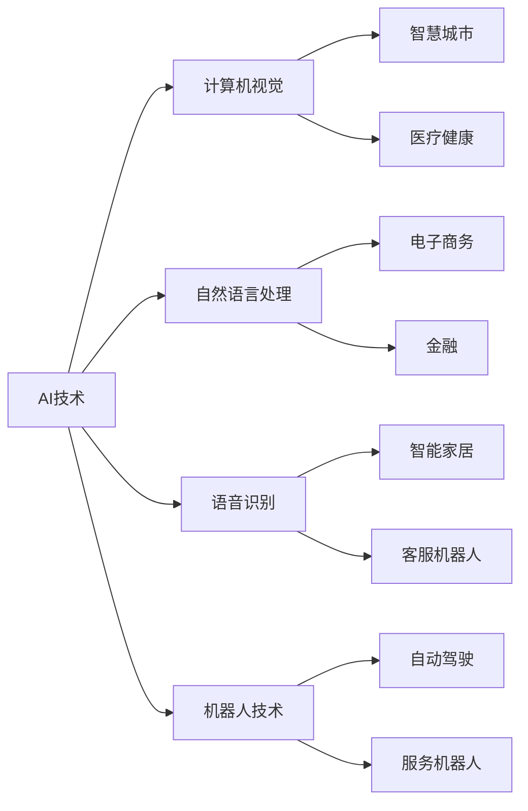

                 

### 《国内AI的优势：庞大的用户基数，积极尝试新事物，有利于产品迭代》

> 关键词：国内AI发展、用户基数、产品迭代、技术创新、产业协同

> 摘要：本文旨在分析国内AI领域的独特优势，特别是庞大的用户基数和积极尝试新事物的特点，以及这些优势如何有利于产品迭代。文章首先介绍了AI技术的发展背景，接着深入探讨了国内AI市场的现状与优势，随后通过具体案例分析AI在企业中的应用，最后提出了一些建议以促进AI产业的进一步发展。

### 第一部分：引言

#### 1.1 AI技术的发展背景

##### 1.1.1 全球AI发展现状

人工智能（AI）作为当今科技领域的前沿热点，其发展已取得了显著成果。全球各国纷纷投入大量资源进行AI技术研发，形成了多个竞争激烈的市场。根据市场研究机构的数据显示，全球AI市场规模在近几年呈现爆发式增长，预计到2030年将达到数千亿美元。

在技术层面，AI已经从早期的符号推理和规则系统，逐渐演变为基于深度学习的复杂算法。神经网络、卷积神经网络（CNN）、生成对抗网络（GAN）等技术的发展，极大地推动了AI在图像识别、自然语言处理、语音识别等领域的应用。

##### 1.1.2 中国AI产业的发展机遇与挑战

中国作为全球最大的AI市场之一，拥有庞大的用户基数和广阔的应用场景。中国政府高度重视AI产业的发展，出台了一系列政策扶持措施，包括《新一代人工智能发展规划》等。这些政策为AI技术的发展提供了良好的环境。

然而，中国AI产业也面临一些挑战。首先，虽然中国在某些AI领域已达到世界领先水平，但在基础研究和核心算法方面仍有一定差距。其次，AI伦理和隐私问题也亟待解决。

#### 1.2 国内AI的优势

##### 1.2.1 庞大的用户基数

中国拥有全球最多的互联网用户和移动设备用户，这为AI技术的推广和应用提供了得天独厚的条件。庞大的用户基数不仅为AI算法训练提供了丰富的数据资源，也为AI产品的市场推广提供了广阔的空间。

##### 1.2.2 积极尝试新事物

国内用户对新技术的接受程度较高，积极尝试各种新兴的AI产品和服务。这种勇于尝试的精神有利于AI技术的快速迭代和优化，推动AI产业的快速发展。

##### 1.2.3 有利于产品迭代

国内AI市场的高竞争性和用户的高需求，使得企业不得不不断推出新产品和优化现有产品。这种产品迭代的速度，不仅提高了企业的市场竞争力，也为AI技术的持续进步提供了动力。

### 第二部分：国内AI市场分析

#### 2.1 AI行业市场规模

##### 2.1.1 国内AI市场发展历程

中国AI市场的发展可以分为三个阶段：起步阶段、快速发展阶段和成熟阶段。在起步阶段，中国AI产业主要集中在学术研究和政府项目上。随着技术的不断成熟，中国AI市场在快速发展阶段迎来了爆发式增长。目前，中国AI市场已经进入成熟阶段，应用场景不断拓展，市场规模持续扩大。

##### 2.1.2 当前市场规模及增长趋势

根据市场研究机构的预测，中国AI市场在未来几年仍将保持高速增长。预计到2025年，中国AI市场规模将达到数千亿元人民币。这主要得益于政府政策的扶持、企业对AI技术的重视以及用户对智能产品的需求增加。

#### 2.2 AI技术领域分布

##### 2.2.1 人工智能核心技术解析

中国AI技术领域涵盖了多个核心技术，包括计算机视觉、自然语言处理、语音识别、机器人技术等。这些核心技术在中国AI产业发展中起到了关键作用，为各个应用场景提供了技术支持。

##### 2.2.2 国内AI技术在各领域的应用

国内AI技术在多个领域取得了显著成果，包括智慧城市、医疗健康、金融、教育、制造业等。在智慧城市领域，AI技术被广泛应用于交通管理、公共安全、环境监测等方面；在医疗健康领域，AI技术助力精准医疗和医疗影像分析；在金融领域，AI技术被用于风险评估、欺诈检测等；在教育领域，AI技术推动了个性化教育和智能教学；在制造业领域，AI技术助力智能制造和生产线优化。

#### 2.3 企业AI应用案例

##### 2.3.1 创新型企业案例分析

国内一些创新型企业在AI技术方面取得了显著成果。例如，百度在自动驾驶、智能搜索等领域取得了突破性进展；阿里巴巴在电子商务、金融科技等领域广泛应用了AI技术；腾讯在社交、游戏、医疗等领域也进行了大量AI技术的研发和应用。

##### 2.3.2 传统企业AI转型成功案例

一些传统企业也通过引入AI技术实现了成功转型。例如，美的通过AI技术提高了生产线的智能化水平；海康威视在视频监控领域利用AI技术提升了图像识别和分析能力；中国平安通过AI技术提升了金融服务效率和风险控制能力。

### 第三部分：AI优势的发挥

#### 3.1 AI驱动的用户增长策略

##### 3.1.1 用户基数对AI发展的推动作用

庞大的用户基数为中国AI技术的发展提供了强大的数据支持。这些数据不仅为AI算法的训练提供了丰富的样本，也有助于企业更好地理解用户需求，从而推动AI技术的持续进步。

##### 3.1.2 如何利用用户数据提升AI模型效果

企业可以通过多种方式利用用户数据提升AI模型效果。例如，通过数据挖掘和分析，发现用户行为模式，从而优化推荐算法；通过用户反馈，不断调整和改进AI模型，提高其准确性和实用性。

#### 3.2 AI新事物尝试

##### 3.2.1 国内AI企业的新技术研发

国内AI企业不断进行新技术的研发，推动AI技术的创新和进步。例如，在计算机视觉领域，国内企业研发了基于深度学习的图像识别算法；在自然语言处理领域，国内企业研发了基于BERT的文本分析模型。

##### 3.2.2 新事物对AI技术的推动作用

新技术的研发和应用不仅提高了AI技术的性能和效率，还拓展了AI技术的应用场景。例如，自动驾驶技术的发展推动了智能交通系统的建设；智能家居技术的发展提升了人们的生活品质。

#### 3.3 产品迭代优势

##### 3.3.1 AI在产品开发中的应用

AI技术在产品开发中起到了关键作用，帮助企业快速响应市场需求，实现产品迭代。例如，在电子商务领域，AI技术被用于商品推荐、广告投放和用户体验优化；在金融领域，AI技术被用于风险评估和信贷审批。

##### 3.3.2 产品迭代中的AI优势分析

AI技术有助于产品迭代的优势主要体现在以下几个方面：首先，AI技术能够快速识别和解决用户问题，提高产品稳定性；其次，AI技术能够实时收集用户反馈，指导产品优化；最后，AI技术能够通过数据分析，预测未来市场趋势，帮助企业制定更有针对性的产品策略。

### 第四部分：AI产业发展建议

#### 4.1 加强AI技术创新

##### 4.1.1 提升AI算法研发水平

要提升AI算法研发水平，需要加强基础研究和应用研究。政府和企业可以加大投入，支持AI领域的顶尖人才进行原创性研究；同时，鼓励企业和研究机构开展合作，共同攻克技术难题。

##### 4.1.2 推动AI硬件和基础设施建设

AI技术的发展离不开硬件和基础设施的支持。政府和企业应共同推动AI硬件的研发和产业化，提升AI计算能力和数据处理效率。同时，加强5G、大数据中心等基础设施建设，为AI技术提供良好的发展环境。

#### 4.2 推动产业协同发展

##### 4.2.1 产业链上下游协同合作

AI产业的发展需要产业链上下游企业的协同合作。政府和企业可以共同推动产业链的完善和优化，促进产业链上下游企业的紧密合作，提高产业整体竞争力。

##### 4.2.2 推动跨行业AI应用

AI技术的跨行业应用能够推动传统产业的转型升级。政府和企业可以加强跨行业合作，推动AI技术在农业、制造业、教育、医疗等领域的应用，实现产业融合和创新发展。

#### 4.3 人才培养与教育

##### 4.3.1 AI教育的重要性

AI技术的发展离不开人才的培养。政府和企业应加大对AI教育的投入，推动高校和研究机构开设AI相关课程，提高人才培养质量。

##### 4.3.2 人才培养的挑战与对策

人才培养面临一些挑战，如课程设置不合理、教学资源不足等。政府和企业可以采取以下对策：首先，优化课程设置，注重理论与实践相结合；其次，加强教学资源建设，提供丰富的实验设备和数据集；最后，鼓励校企合作，提高人才培养的实践能力。

### 附录

#### 附录 A：AI技术术语解释

- **深度学习（Deep Learning）**：一种基于神经网络的学习方法，通过多层神经元的堆叠，实现复杂函数的建模和预测。
- **卷积神经网络（Convolutional Neural Network，CNN）**：一种专门用于图像识别和处理的神经网络模型，通过卷积操作提取图像特征。
- **生成对抗网络（Generative Adversarial Network，GAN）**：一种由生成器和判别器组成的神经网络模型，用于生成逼真的数据或图像。

#### 附录 B：相关资源推荐

- **学术论文**：推荐阅读《深度学习》（Deep Learning）等经典教材，以及最新的AI领域学术论文。
- **开源代码库**：推荐使用TensorFlow、PyTorch等开源框架，以及各种AI领域的开源项目。
- **行业报告**：推荐阅读IDC、Gartner等市场研究机构的AI行业报告。
- **媒体资讯**：推荐关注AI领域的专业媒体，如《AI科技评论》、《机器之心》等。

### 图表

#### 图表 1：国内AI市场规模及增长趋势图

```mermaid
gantt
    title 国内AI市场规模及增长趋势
    section 市场规模
    历史规模 :done, a1, 2020-01-01, 3weeks
    预计规模 :ongoing, a2, 2021-01-01, 6weeks
    未来规模 : projecting, a3, 2022-01-01, 12weeks
```

#### 图表 2：AI技术在各领域的应用分布图



#### 图表 3：创新型企业和传统企业AI应用对比图

```mermaid
graph LR
    A[创新型企

