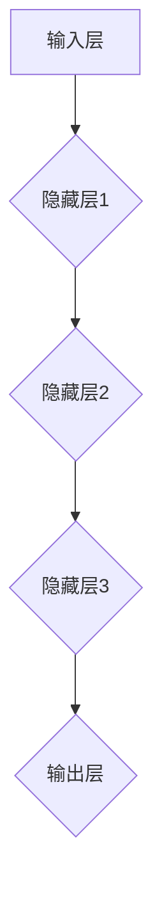
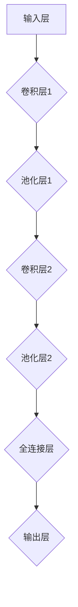
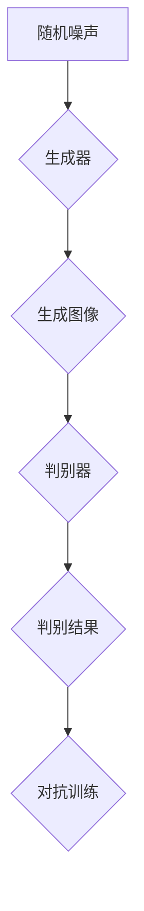

                 

### 文章标题

《图像生成（Image Generation）- 原理与代码实例讲解》

> 关键词：图像生成、神经网络、卷积神经网络、生成对抗网络、GAN、深度学习、超分辨率、计算机视觉、数据增强

> 摘要：本文旨在深入探讨图像生成技术的原理及其应用。从基本概念出发，逐步讲解神经网络、卷积神经网络、循环神经网络、生成对抗网络（GAN）等基础技术，并通过实例代码展示其实现过程。文章还探讨了图像生成在图像质量评估、超分辨率、计算机视觉中的应用，以及未来的发展趋势和挑战。

---

### 目录大纲

#### 第一部分：图像生成技术概述

- **第1章：图像生成的背景与意义**
  - 1.1 图像生成的概念与发展历程
  - 1.2 图像生成在人工智能中的应用
  - 1.3 图像生成技术的分类与特点

- **第2章：图像生成的基础技术**
  - 2.1 神经网络基础
    - 2.1.1 神经网络的基本结构
    - 2.1.2 常见的神经网络架构
    - 2.1.3 深度学习优化算法
  - 2.2 卷积神经网络（CNN）在图像生成中的应用
    - 2.2.1 CNN的基本原理
    - 2.2.2 卷积层、池化层与激活函数
    - 2.2.3 卷积神经网络的架构
  - 2.3 循环神经网络（RNN）与生成对抗网络（GAN）
    - 2.3.1 RNN的基本原理
    - 2.3.2 GAN的原理与结构
    - 2.3.3 RNN与GAN在图像生成中的应用

- **第3章：生成对抗网络（GAN）原理与实现**
  - 3.1 GAN的工作原理
    - 3.1.1 生成器与判别器的定义
    - 3.1.2 对抗训练的过程
    - 3.1.3 GAN的挑战与优化策略
  - 3.2 GAN的实现与代码实例
    - 3.2.1 GAN的代码结构
    - 3.2.2 生成器和判别器的训练过程
    - 3.2.3 生成图像的质量评估

- **第4章：生成图像的质量评估**
  - 4.1 图像质量评价指标
    - 4.1.1 PSNR与SSIM
    - 4.1.2 Inception Score与Fréchet Inception Distance
    - 4.1.3 自定义质量评估指标
  - 4.2 图像生成结果的评估方法
    - 4.2.1 主观评估与客观评估
    - 4.2.2 评估流程与实现

- **第5章：图像超分辨率生成**
  - 5.1 超分辨率的基本概念
    - 5.1.1 超分辨率图像的定义
    - 5.1.2 超分辨率技术的分类
  - 5.2 基于深度学习的图像超分辨率方法
    - 5.2.1 基于卷积神经网络的超分辨率方法
    - 5.2.2 基于GAN的图像超分辨率方法

- **第6章：图像生成在计算机视觉中的应用**
  - 6.1 图像生成的多样性
    - 6.1.1 图像风格迁移
    - 6.1.2 超分辨率与去噪
    - 6.1.3 图像分割与目标检测
  - 6.2 图像生成技术在数据增强中的应用
    - 6.2.1 数据增强的概念与目的
    - 6.2.2 基于GAN的数据增强方法

- **第7章：图像生成的未来趋势与挑战**
  - 7.1 图像生成技术的未来发展趋势
    - 7.1.1 模型压缩与效率优化
    - 7.1.2 多模态图像生成
    - 7.1.3 端到端的图像生成方案
  - 7.2 图像生成技术面临的挑战
    - 7.2.1 计算资源消耗
    - 7.2.2 道德与伦理问题
    - 7.2.3 隐私保护与安全

---

### 第一部分：图像生成技术概述

#### 第1章：图像生成的背景与意义

##### 1.1 图像生成的概念与发展历程

图像生成，是指通过算法自动生成符合特定规则的图像的过程。这一概念最早可以追溯到20世纪60年代，当时计算机科学家开始探索如何使用计算机来模拟和生成图像。

随着计算机性能的提升和人工智能技术的发展，图像生成技术逐渐成为一个热门研究领域。图像生成技术在图像处理、计算机视觉、数据增强等领域具有广泛的应用。

图像生成的发展历程可以分为以下几个阶段：

1. **规则方法**：早期的图像生成主要依赖于简单的规则和算法，如扫描转换法、光学投影法等。
2. **随机方法**：20世纪80年代，蒙特卡罗方法和随机游走技术开始应用于图像生成。
3. **神经网络方法**：20世纪90年代，神经网络开始被用于图像生成，如自组织映射网络（SOM）和生成性对抗网络（GAN）。
4. **深度学习方法**：近年来，随着深度学习技术的快速发展，图像生成技术取得了重大突破，尤其是生成对抗网络（GAN）的出现，使得图像生成质量大幅提升。

##### 1.2 图像生成在人工智能中的应用

图像生成技术在人工智能领域有着广泛的应用，以下是几个重要的应用方向：

1. **数据增强**：在机器学习和深度学习任务中，数据质量是影响模型性能的关键因素。图像生成技术可以用来生成新的训练数据，从而提高模型的泛化能力。
2. **图像风格迁移**：通过图像生成技术，可以将一种图像的风格应用到另一幅图像上，如将普通照片转换成艺术品风格。
3. **图像超分辨率**：图像超分辨率技术可以提升图像的分辨率，使其更加清晰，这对于视频处理和图像识别等领域具有重要意义。
4. **计算机视觉辅助**：图像生成技术可以辅助计算机视觉任务，如目标检测、图像分割等，通过生成具有特定特征的图像，提高模型的识别准确性。
5. **虚拟现实和增强现实**：图像生成技术可以用于生成虚拟环境和增强现实场景，提升用户体验。

##### 1.3 图像生成技术的分类与特点

根据生成图像的方法和目的，图像生成技术可以分为以下几类：

1. **基于规则的图像生成**：这种方法通过定义一系列规则来生成图像，优点是实现简单，缺点是生成图像的灵活性较差。
2. **基于统计学的图像生成**：这种方法利用统计学模型，如高斯混合模型（GMM）和隐马尔可夫模型（HMM），来生成图像。优点是生成图像具有较好的统计特性，缺点是计算复杂度高。
3. **基于神经网络的图像生成**：这种方法利用神经网络，尤其是深度神经网络，来学习图像的生成规律。优点是生成图像的质量高，缺点是实现复杂。
4. **生成对抗网络（GAN）**：GAN是一种基于对抗训练的图像生成方法，由生成器和判别器两个神经网络组成。优点是生成图像质量高，灵活性强，缺点是对计算资源要求较高。

不同的图像生成技术在应用场景和性能上存在差异，选择合适的生成技术取决于具体的应用需求和计算资源。

##### 1.4 本章小结

本章首先介绍了图像生成的概念与发展历程，然后探讨了图像生成在人工智能中的应用，以及图像生成技术的分类与特点。通过本章的学习，读者可以初步了解图像生成技术的背景和意义，为后续章节的学习打下基础。

---

### 第二部分：图像生成的基础技术

#### 第2章：图像生成的基础技术

##### 2.1 神经网络基础

神经网络是图像生成技术的基础，它通过模拟人脑神经元的工作原理来处理和生成数据。本节将介绍神经网络的基本结构、常见的神经网络架构以及深度学习优化算法。

###### 2.1.1 神经网络的基本结构

神经网络由多个神经元（也称为节点）组成，每个神经元都与其他神经元通过连接（权重）相连。神经网络的基本结构包括输入层、隐藏层和输出层。

1. **输入层**：接收外部输入数据，并将其传递给隐藏层。
2. **隐藏层**：对输入数据进行处理和变换，可以有一个或多个隐藏层。
3. **输出层**：生成最终输出结果。

神经元的处理过程通常包括以下步骤：

1. **激活函数**：对输入数据进行线性变换，并引入非线性因素，使神经网络具有分类或回归能力。
2. **权重和偏置**：每个神经元与输入数据之间的连接都包含一个权重和偏置，这些参数通过学习过程进行调整。
3. **反向传播**：在神经网络训练过程中，使用反向传播算法来计算每个参数的梯度，并更新参数值。

神经网络的基本结构可以用以下Mermaid流程图表示：



###### 2.1.2 常见的神经网络架构

神经网络架构根据其层数和结构可以分为以下几种：

1. **单层感知机**：只有一层输入层和一层输出层，适用于线性可分的数据。
2. **多层感知机（MLP）**：包括多个隐藏层，可以处理非线性问题。
3. **卷积神经网络（CNN）**：专门用于图像处理，通过卷积层和池化层提取图像特征。
4. **循环神经网络（RNN）**：适用于序列数据，通过隐藏状态和循环连接来处理长期依赖问题。
5. **长短期记忆网络（LSTM）**：是RNN的一种变体，通过引入门控机制来避免梯度消失问题。
6. **生成对抗网络（GAN）**：由生成器和判别器两个神经网络组成，通过对抗训练生成高质量图像。

常见的神经网络架构可以用以下Mermaid流程图表示：



###### 2.1.3 深度学习优化算法

在神经网络训练过程中，优化算法用于调整网络参数，使网络输出更接近真实值。常见的深度学习优化算法包括：

1. **随机梯度下降（SGD）**：是最简单的优化算法，通过计算每个样本的梯度来更新参数。
2. **批量梯度下降（BGD）**：在训练集中计算所有样本的梯度，再更新参数。
3. **Adam优化器**：结合了SGD和RMSprop的优点，通过计算一阶矩估计和二阶矩估计来更新参数。
4. **Adagrad优化器**：对每个参数的梯度进行加权平均，适用于稀疏数据。
5. **Adadelta优化器**：是Adagrad的改进版，通过跟踪梯度变化的指数移动平均值来更新参数。

优化算法的原理可以用以下伪代码表示：

```python
# 随机梯度下降（SGD）优化算法
for each sample in dataset:
  compute gradients
  update parameters = parameters - learning_rate * gradients
```

###### 2.2 卷积神经网络（CNN）在图像生成中的应用

卷积神经网络（CNN）是图像处理领域的经典架构，通过卷积层、池化层和全连接层提取图像特征，具有强大的特征提取能力。在图像生成中，CNN可以用于生成新的图像或修改现有图像。

CNN的基本原理如下：

1. **卷积层**：通过卷积操作提取图像的特征，每个卷积核可以提取图像中的一个局部特征。
2. **池化层**：对卷积层的输出进行下采样，减少参数数量和计算复杂度。
3. **全连接层**：将池化层的输出进行线性变换，生成最终的图像。

CNN在图像生成中的应用可以用以下Mermaid流程图表示：


###### 2.3 循环神经网络（RNN）与生成对抗网络（GAN）

循环神经网络（RNN）和生成对抗网络（GAN）是图像生成中的重要技术。

1. **RNN**：适用于处理序列数据，通过隐藏状态和循环连接来处理长期依赖问题。RNN的基本原理如下：

   - **隐藏状态**：将前一时刻的隐藏状态与当前输入进行组合，生成当前时刻的隐藏状态。
   - **循环连接**：将当前时刻的隐藏状态传递给下一时刻，实现信息的持久化。

   RNN的原理可以用以下伪代码表示：

   ```python
   # RNN隐藏状态更新
   h_t = tanh(W_h * [h_{t-1}, x_t]) + b_h
   ```

2. **GAN**：是一种基于对抗训练的图像生成方法，由生成器和判别器两个神经网络组成。生成器的目标是生成逼真的图像，判别器的目标是区分真实图像和生成图像。GAN的基本原理如下：

   - **生成器**：通过随机噪声生成新的图像。
   - **判别器**：判断图像是真实图像还是生成图像。

   GAN的训练过程是对抗的，生成器和判别器相互竞争，生成器不断优化生成图像的质量，判别器不断优化对真实图像和生成图像的区分能力。

   GAN的基本原理可以用以下伪代码表示：

   ```python
   # GAN生成器和判别器训练
   for each epoch:
     for each real image x:
      判别器训练：D_x = D(x)
       for each generated image z:
         判别器训练：D_z = D(G(z))
       生成器训练：G = G + learning_rate * grad_G
       判别器训练：D = D + learning_rate * grad_D
   ```

##### 2.4 本章小结

本章介绍了神经网络基础技术，包括神经网络的基本结构、常见的神经网络架构以及深度学习优化算法。同时，还介绍了卷积神经网络（CNN）在图像生成中的应用，以及循环神经网络（RNN）和生成对抗网络（GAN）的基本原理。通过本章的学习，读者可以了解图像生成的基础技术，为后续章节的深入学习打下基础。

---

#### 第3章：生成对抗网络（GAN）原理与实现

##### 3.1 GAN的工作原理

生成对抗网络（GAN）是一种基于对抗训练的图像生成方法，由生成器和判别器两个神经网络组成。生成器的目标是生成逼真的图像，判别器的目标是区分真实图像和生成图像。GAN的工作原理可以概括为以下三个关键部分：

1. **生成器（Generator）**：生成器的任务是从随机噪声中生成逼真的图像。生成器通常由多个隐层组成，每个隐层都通过一个非线性变换将噪声映射到更复杂的图像特征。生成器的主要目标是使判别器无法区分生成的图像和真实图像。

2. **判别器（Discriminator）**：判别器的任务是对输入图像进行分类，判断图像是真实图像还是生成图像。判别器通常由多个隐层组成，每个隐层都通过一个非线性变换提取图像的特征。判别器的主要目标是最大化其分类能力，即正确地区分真实图像和生成图像。

3. **对抗训练（Adversarial Training）**：GAN的训练过程是一个对抗过程，生成器和判别器相互竞争。生成器不断优化其生成图像的质量，使其更接近真实图像，判别器则不断优化其分类能力，使生成的图像被正确地分类为生成图像。

GAN的工作原理可以用以下Mermaid流程图表示：



在GAN的训练过程中，生成器和判别器的损失函数分别如下：

- **生成器损失函数**：最小化生成图像与真实图像的差距，最大化判别器将其分类为真实图像的概率。
  \[
  L_G = -\log(D(G(z)))
  \]

- **判别器损失函数**：最大化判别器对真实图像和生成图像的分类准确性。
  \[
  L_D = -[\log(D(x)) + \log(1 - D(G(z))]
  \]

GAN的训练目标是同时最小化生成器损失函数和最大化判别器损失函数。

##### 3.1.1 生成器与判别器的定义

生成器和判别器是GAN的核心组件，它们的设计和选择对GAN的性能和稳定性有很大影响。

1. **生成器（Generator）**：

   生成器的目的是从随机噪声生成逼真的图像。生成器的输入是一个随机噪声向量\( z \)，通过多个隐层进行变换，最终生成图像\( x' \)。一个简单的生成器架构可以用以下Mermaid流程图表示：

   ```mermaid
   graph TD
   A[随机噪声] --> B{全连接层1}
   B --> C{激活函数1}
   C --> D{全连接层2}
   D --> E{激活函数2}
   E --> F{全连接层3}
   F --> G{输出层}
   ```

   其中，全连接层和激活函数可以重复多次，以增加生成器的非线性变换能力。

2. **判别器（Discriminator）**：

   判别器的目的是判断输入图像是真实图像还是生成图像。判别器的输入是一个图像\( x \)或\( x' \)，通过多个隐层提取图像特征，最终输出一个概率值，表示输入图像是真实图像的概率。一个简单的判别器架构可以用以下Mermaid流程图表示：

   ```mermaid
   graph TD
   A[输入层] --> B{卷积层1}
   B --> C{激活函数1}
   C --> D{池化层1}
   D --> E{卷积层2}
   E --> F{激活函数2}
   F --> G{池化层2}
   G --> H{全连接层}
   H --> I{输出层}
   ```

   判别器的输出是一个概率值，通常使用Sigmoid函数进行归一化。

##### 3.1.2 对抗训练的过程

GAN的训练过程是一个对抗训练的过程，生成器和判别器相互竞争，通过多次迭代优化，最终生成高质量的图像。对抗训练的过程可以概括为以下步骤：

1. **初始化**：初始化生成器和判别器的参数。
2. **生成器训练**：固定判别器的参数，优化生成器的参数，使生成图像能够欺骗判别器。
3. **判别器训练**：固定生成器的参数，优化判别器的参数，使判别器能够准确地区分真实图像和生成图像。
4. **交替训练**：生成器和判别器交替进行训练，每个步骤中，生成器尝试生成更好的图像，判别器尝试提高分类准确性。

对抗训练的过程可以用以下伪代码表示：

```python
for epoch in range(num_epochs):
  for real_images in real_image_batches:
    # 固定判别器，训练生成器
    generate_fake_images = generator.sample_noise()
    generator_loss = calculate_generator_loss(real_images, generate_fake_images)
    update_generator(generator_loss)

  for fake_images in fake_image_batches:
    # 固定生成器，训练判别器
    discriminator_loss = calculate_discriminator_loss(real_images, fake_images)
    update_discriminator(discriminator_loss)
```

##### 3.1.3 GAN的挑战与优化策略

尽管GAN在图像生成方面取得了显著成果，但仍面临一些挑战。以下是一些常见的挑战和相应的优化策略：

1. **模式崩溃（Mode Collapse）**：生成器过于关注判别器的输出，导致生成图像的多样性不足。解决方法包括增加判别器的容量、调整生成器的架构以及使用更高级的优化技术。

2. **梯度消失和梯度爆炸**：在训练过程中，生成器和判别器的梯度可能变得很小或很大，导致训练不稳定。解决方法包括使用批量归一化（Batch Normalization）和权重初始化技术。

3. **训练不稳定**：GAN的训练过程容易受到噪声和参数初始化的影响，导致训练不稳定。解决方法包括使用自适应优化器和增加训练时间。

4. **计算资源消耗**：GAN的训练需要大量的计算资源，特别是生成器和判别器的参数数量较多时。解决方法包括使用模型压缩技术和优化算法。

##### 3.2 GAN的实现与代码实例

在本节中，我们将通过一个简单的GAN实现来展示GAN的基本流程和代码实现。以下是一个使用Python和TensorFlow实现的简单GAN示例：

```python
import tensorflow as tf
from tensorflow.keras.layers import Dense, Conv2D, Flatten
from tensorflow.keras.models import Model

# 定义生成器模型
def create_generator(z_dim):
    z = tf.keras.layers.Input(shape=(z_dim,))
    x = Dense(128, activation='relu')(z)
    x = Dense(256, activation='relu')(x)
    x = Dense(512, activation='relu')(x)
    x = Dense(1024, activation='relu')(x)
    x = Conv2D(filters=1, kernel_size=(5, 5), activation='tanh')(x)
    x = Flatten()(x)
    x = tf.keras.layers.Dense(784, activation='sigmoid')(x)
    generator = Model(z, x)
    return generator

# 定义判别器模型
def create_discriminator(x_dim):
    x = tf.keras.layers.Input(shape=(x_dim,))
    x = Conv2D(filters=32, kernel_size=(3, 3), activation='relu')(x)
    x = MaxPooling2D(pool_size=(2, 2))(x)
    x = Conv2D(filters=64, kernel_size=(3, 3), activation='relu')(x)
    x = MaxPooling2D(pool_size=(2, 2))(x)
    x = Flatten()(x)
    x = Dense(128, activation='relu')(x)
    x = tf.keras.layers.Dense(1, activation='sigmoid')(x)
    discriminator = Model(x, x)
    return discriminator

# 定义GAN模型
def create_gan(generator, discriminator):
    z = tf.keras.layers.Input(shape=(100,))
    x_fake = generator(z)
    d_fake = discriminator(x_fake)
    d_real = discriminator(tf.keras.layers.Input(shape=(784,)))
    combined = Model([z, d_real], [d_fake, d_real])
    return combined

# 实例化生成器和判别器
z_dim = 100
x_dim = 784
generator = create_generator(z_dim)
discriminator = create_discriminator(x_dim)
gan = create_gan(generator, discriminator)

# 编写训练代码
for epoch in range(num_epochs):
    for real_images in real_image_batches:
        with tf.GradientTape() as generator_tape, tf.GradientTape() as discriminator_tape:
            # 固定判别器，训练生成器
            z = tf.random.normal([batch_size, z_dim])
            x_fake = generator(z)
            d_fake = discriminator(x_fake)
            generator_loss = -tf.reduce_mean(tf.math.log(d_fake))

            # 固定生成器，训练判别器
            d_real = discriminator(real_images)
            d_fake = discriminator(x_fake)
            discriminator_loss = -tf.reduce_mean(tf.math.log(d_real) + tf.reduce_mean(tf.math.log(1 - d_fake)))

        generator_gradients = generator_tape.gradient(generator_loss, generator.trainable_variables)
        discriminator_gradients = discriminator_tape.gradient(discriminator_loss, discriminator.trainable_variables)

        generator_optimizer.apply_gradients(zip(generator_gradients, generator.trainable_variables))
        discriminator_optimizer.apply_gradients(zip(discriminator_gradients, discriminator.trainable_variables))
```

在上面的代码中，我们定义了生成器和判别器的模型结构，并创建了GAN模型。接着，我们编写了训练代码，通过交替训练生成器和判别器来优化GAN模型。

##### 3.3 生成图像的质量评估

在GAN训练过程中，生成图像的质量评估是一个关键问题。以下是一些常见的图像质量评估指标和方法：

1. **峰值信噪比（PSNR）**：

   峰值信噪比（PSNR）是一个衡量图像质量的标准指标，它表示原始图像和生成图像之间的差异。

   \[
   PSNR = 10 \cdot \log_{10}\left(\frac{MAX^2}{MSE}\right)
   \]

   其中，\( MAX \)是图像的最大像素值，\( MSE \)是均方误差。

2. **结构相似性指数（SSIM）**：

   结构相似性指数（SSIM）是一个衡量图像质量和相似性的指标，它考虑了图像的亮度、对比度和结构信息。

   \[
   SSIM(x, y) = \frac{(2\mu_x\mu_y + C_1)(2\sigma_{xy} + C_2)}{(\mu_x^2 + \mu_y^2 + C_1)(\sigma_x^2 + \sigma_y^2 + C_2)}
   \]

   其中，\( \mu_x \)和\( \mu_y \)分别是图像\( x \)和\( y \)的平均值，\( \sigma_x \)和\( \sigma_y \)分别是图像\( x \)和\( y \)的方差，\( \sigma_{xy} \)是图像\( x \)和\( y \)的协方差，\( C_1 \)和\( C_2 \)是常数。

3. **Inception Score（IS）**：

   Inception Score（IS）是一个衡量图像生成质量的指标，它基于Inception-v3网络生成概率分布。

   \[
   IS = \log_2(D(x) \cdot \frac{1}{z} \sum_{i=1}^{z} p_i \cdot \log(p_i))
   \]

   其中，\( D(x) \)是Inception-v3网络对图像\( x \)的输出概率分布，\( p_i \)是概率分布中的每个类别的概率。

4. **Fréchet Inception Distance（FID）**：

   Fréchet Inception Distance（FID）是一个衡量图像分布差异的指标，它基于Inception-v3网络生成概率分布。

   \[
   FID = \frac{1}{N} \sum_{i=1}^{N} \frac{1}{d} \sum_{j=1}^{d} (\mu_{x_i} - \mu_{y_i})^2 + (\sigma_{x_i} - \sigma_{y_i})^2
   \]

   其中，\( N \)是图像数量，\( d \)是Inception-v3网络的维度，\( \mu_{x_i} \)和\( \mu_{y_i} \)分别是图像\( x_i \)和\( y_i \)的均值，\( \sigma_{x_i} \)和\( \sigma_{y_i} \)分别是图像\( x_i \)和\( y_i \)的协方差。

在实际应用中，可以使用TensorFlow和Keras等深度学习框架中的内置函数来计算这些指标。以下是一个计算PSNR和SSIM的示例代码：

```python
import numpy as np
from skimage.metrics import peak_signal_noise_ratio, structural_similarity

def calculate_psnr(y_true, y_pred):
    return peak_signal_noise_ratio(y_true, y_pred)

def calculate_ssim(y_true, y_pred):
    return structural_similarity(y_true, y_pred, multichannel=True)

# 计算PSNR和SSIM
psnr_value = calculate_psnr(y_true, y_pred)
ssim_value = calculate_ssim(y_true, y_pred)

print("PSNR:", psnr_value)
print("SSIM:", ssim_value)
```

##### 3.4 本章小结

本章详细介绍了生成对抗网络（GAN）的工作原理、实现方法和评估指标。通过一个简单的GAN实现示例，读者可以了解到GAN的基本流程和代码实现。本章还介绍了常见的图像质量评估指标，如PSNR、SSIM、Inception Score和FID，这些指标可以用于评估生成图像的质量。通过本章的学习，读者可以深入理解GAN的技术原理和应用，为进一步学习和实践图像生成技术打下基础。

---

### 第三部分：图像生成在图像质量评估、超分辨率和计算机视觉中的应用

#### 第4章：生成图像的质量评估

图像生成技术在计算机视觉和人工智能领域具有广泛的应用，其中图像质量评估是确保生成图像质量和效果的关键步骤。本节将介绍常用的图像质量评估指标、评估方法以及如何在实际项目中使用这些方法。

##### 4.1 图像质量评价指标

图像质量评估指标是衡量生成图像质量的重要工具，以下是一些常用的图像质量评估指标：

1. **峰值信噪比（PSNR）**：

   峰值信噪比（PSNR）是衡量图像质量的标准指标，用于衡量原始图像和生成图像之间的差异。PSNR的值越高，表示图像质量越好。

   \[
   PSNR = 10 \cdot \log_{10}\left(\frac{MAX^2}{MSE}\right)
   \]

   其中，\( MAX \)是图像的最大像素值，\( MSE \)是均方误差。

2. **结构相似性指数（SSIM）**：

   结构相似性指数（SSIM）是一个衡量图像质量和相似性的指标，它考虑了图像的亮度、对比度和结构信息。SSIM的值范围在0到1之间，值越高表示图像质量越好。

   \[
   SSIM(x, y) = \frac{(2\mu_x\mu_y + C_1)(2\sigma_{xy} + C_2)}{(\mu_x^2 + \mu_y^2 + C_1)(\sigma_x^2 + \sigma_y^2 + C_2)}
   \]

   其中，\( \mu_x \)和\( \mu_y \)分别是图像\( x \)和\( y \)的平均值，\( \sigma_x \)和\( \sigma_y \)分别是图像\( x \)和\( y \)的方差，\( \sigma_{xy} \)是图像\( x \)和\( y \)的协方差，\( C_1 \)和\( C_2 \)是常数。

3. **Inception Score（IS）**：

   Inception Score（IS）是一个衡量图像生成质量的指标，它基于Inception-v3网络生成概率分布。IS的值越高，表示生成图像的质量越高。

   \[
   IS = \log_2(D(x) \cdot \frac{1}{z} \sum_{i=1}^{z} p_i \cdot \log(p_i))
   \]

   其中，\( D(x) \)是Inception-v3网络对图像\( x \)的输出概率分布，\( p_i \)是概率分布中的每个类别的概率。

4. **Fréchet Inception Distance（FID）**：

   Fréchet Inception Distance（FID）是一个衡量图像分布差异的指标，它基于Inception-v3网络生成概率分布。FID的值越低，表示生成图像的质量越高。

   \[
   FID = \frac{1}{N} \sum_{i=1}^{N} \frac{1}{d} \sum_{j=1}^{d} (\mu_{x_i} - \mu_{y_i})^2 + (\sigma_{x_i} - \sigma_{y_i})^2
   \]

   其中，\( N \)是图像数量，\( d \)是Inception-v3网络的维度，\( \mu_{x_i} \)和\( \mu_{y_i} \)分别是图像\( x_i \)和\( y_i \)的均值，\( \sigma_{x_i} \)和\( \sigma_{y_i} \)分别是图像\( x_i \)和\( y_i \)的协方差。

##### 4.2 图像生成结果的评估方法

评估图像生成结果的方法可以分为主观评估和客观评估。

1. **主观评估**：

   主观评估依赖于人类观察者对图像质量的感知和评价。常用的主观评估方法包括视觉比较、评分和问卷调查。视觉比较是通过人类观察者比较原始图像和生成图像的视觉效果，评分是通过给生成图像评分来评估其质量，问卷调查是通过收集用户对生成图像的满意度评价。

2. **客观评估**：

   客观评估使用量化指标来评估图像质量，常用的客观评估方法包括PSNR、SSIM、Inception Score和FID等。这些指标可以通过计算原始图像和生成图像的差异来评估图像质量。

在实际应用中，可以将主观评估和客观评估相结合，以获得更全面的图像质量评估。以下是一个使用Python和TensorFlow计算PSNR和SSIM的示例代码：

```python
import numpy as np
from skimage.metrics import peak_signal_noise_ratio, structural_similarity

def calculate_psnr(y_true, y_pred):
    return peak_signal_noise_ratio(y_true, y_pred)

def calculate_ssim(y_true, y_pred):
    return structural_similarity(y_true, y_pred, multichannel=True)

# 计算PSNR和SSIM
y_true = np.array([...])  # 原始图像
y_pred = np.array([...])  # 生成图像

psnr_value = calculate_psnr(y_true, y_pred)
ssim_value = calculate_ssim(y_true, y_pred)

print("PSNR:", psnr_value)
print("SSIM:", ssim_value)
```

##### 4.3 图像生成结果评估的实例

在本节中，我们将通过一个实例来展示如何评估生成图像的质量。假设我们使用GAN生成图像，以下是一个评估生成图像质量的步骤：

1. **生成图像**：使用GAN生成一系列图像。
2. **计算质量指标**：计算生成图像的PSNR、SSIM、Inception Score和FID等质量指标。
3. **主观评估**：由人类观察者对生成图像进行视觉比较和评分。
4. **综合评估**：将主观评估和客观评估的结果进行综合，得出生成图像的整体质量。

以下是一个示例代码，展示了如何使用Python和TensorFlow评估生成图像的质量：

```python
import tensorflow as tf
from tensorflow.keras.preprocessing.image import load_img, img_to_array
from skimage.metrics import peak_signal_noise_ratio, structural_similarity
from scipy import stats

# 加载原始图像和生成图像
original_image = load_img('original_image.jpg', target_size=(224, 224))
generated_image = load_img('generated_image.jpg', target_size=(224, 224))

# 将图像转换为数组
original_image = img_to_array(original_image)
generated_image = img_to_array(generated_image)

# 计算PSNR
psnr_value = peak_signal_noise_ratio(original_image, generated_image)

# 计算SSIM
ssim_value = structural_similarity(original_image, generated_image, multichannel=True)

# 计算Inception Score
inception_model = tf.keras.applications.InceptionV3(include_top=False, weights='imagenet')
generated_image = inception_model.predict(np.expand_dims(generated_image, axis=0))
inception_output = generated_image.mean(axis=(0, 1))
inception_score = stats.mode(inception_output).mode[0]

# 计算FID
fid_value = calculate_fid(original_image, generated_image)

# 打印质量指标
print("PSNR:", psnr_value)
print("SSIM:", ssim_value)
print("Inception Score:", inception_score)
print("FID:", fid_value)
```

通过上述步骤和代码，我们可以评估生成图像的质量，并根据质量指标调整GAN的参数和架构，以获得更好的生成效果。

##### 4.4 本章小结

本章介绍了图像生成技术的质量评估方法，包括常用的质量指标（如PSNR、SSIM、Inception Score和FID）以及评估方法（如主观评估和客观评估）。通过实例代码展示了如何计算这些质量指标，并介绍了如何在实际项目中评估生成图像的质量。通过本章的学习，读者可以掌握图像生成结果评估的方法和技术，为图像生成应用提供有效的质量保障。

---

#### 第5章：图像超分辨率生成

图像超分辨率生成是一种通过算法提高图像分辨率的技术，使图像更加清晰。超分辨率技术在图像处理、计算机视觉和视频处理等领域具有重要应用。本章将介绍超分辨率的基本概念、图像超分辨率技术的分类，以及基于深度学习的图像超分辨率方法。

##### 5.1 超分辨率的基本概念

超分辨率（Super-Resolution）是指通过算法提高图像的分辨率，使其变得更加清晰。超分辨率技术通常涉及将低分辨率图像（LR）转换为高分辨率图像（HR）。低分辨率图像通常由相机、传感器或其他图像采集设备产生，而高分辨率图像则包含更多的细节和特征。

超分辨率技术的基本原理是通过利用低分辨率图像中的空间信息和冗余信息来恢复高分辨率图像。以下是一些常见的超分辨率概念：

1. **分辨率提升**：分辨率提升是指将图像的分辨率从低分辨率提高到高分辨率。分辨率提升可以通过插值、超分辨率重建和超分辨率学习等方法实现。

2. **空间信息**：空间信息是指图像中不同区域的像素值之间的空间关系和特征。空间信息是超分辨率重建的重要基础。

3. **冗余信息**：冗余信息是指低分辨率图像中包含的重复或冗余的像素值信息。通过利用这些冗余信息，可以更准确地恢复高分辨率图像。

4. **超分辨率重建**：超分辨率重建是指利用低分辨率图像中的空间信息和冗余信息来重建高分辨率图像。超分辨率重建可以通过插值方法、迭代重建算法和深度学习方法实现。

##### 5.2 超分辨率技术的分类

根据处理方法的不同，超分辨率技术可以分为以下几类：

1. **基于插值的超分辨率方法**：

   基于插值的超分辨率方法是最简单的一种超分辨率技术，通过插值算法将低分辨率图像中的像素值扩展到更高的分辨率。常见的插值方法包括双线性插值、双三次插值和最近邻插值等。这些方法在计算复杂度较低的情况下可以实现较好的视觉效果，但无法充分利用图像中的空间信息。

2. **基于迭代重建的算法**：

   基于迭代重建的算法通过迭代优化图像重建过程，逐步提高图像的分辨率。这类方法通常基于优化理论，如L1范数优化、L2范数优化和正则化方法等。常见的迭代重建算法包括Lucy-Richardson算法、TV正则化算法和基于深度学习的迭代重建算法等。这些方法可以更好地利用图像中的空间信息，但计算复杂度较高。

3. **基于深度学习的超分辨率方法**：

   基于深度学习的超分辨率方法利用神经网络，特别是卷积神经网络（CNN）来学习图像的高分辨率特征。这类方法通过大量训练数据学习到低分辨率图像和高分辨率图像之间的映射关系，从而实现超分辨率重建。常见的基于深度学习的超分辨率方法包括单图像超分辨率（如ESPCN、VDSR、EDSR等）和多图像超分辨率（如DeepSR、SRGAN等）。

4. **基于生成对抗网络（GAN）的超分辨率方法**：

   基于生成对抗网络（GAN）的超分辨率方法利用生成器和判别器两个神经网络进行对抗训练，生成高质量的高分辨率图像。GAN方法可以生成更自然、细节更丰富的超分辨率图像，但计算资源需求较高。

##### 5.3 基于深度学习的图像超分辨率方法

基于深度学习的图像超分辨率方法在近年来取得了显著进展。以下介绍几种常见的基于深度学习的图像超分辨率方法：

1. **单图像超分辨率**：

   单图像超分辨率方法利用单张低分辨率图像生成高分辨率图像。这类方法通常采用卷积神经网络（CNN）来学习低分辨率图像和高分辨率图像之间的映射关系。常见的单图像超分辨率方法包括：

   - **ESPCN（Edge-Specific Convolutional Neural Network）**：ESPCN是一种基于边缘特征的单图像超分辨率方法，通过卷积神经网络提取边缘特征并生成高分辨率图像。
   - **VDSR（Very Deep Super-Resolution）**：VDSR采用深度卷积神经网络，通过多层次的卷积和反卷积操作实现超分辨率重建。
   - **EDSR（Enhanced Deep Super-Resolution）**：EDSR是VDSR的改进版，通过引入深度可分离卷积和跳跃连接，进一步提高超分辨率效果。

2. **多图像超分辨率**：

   多图像超分辨率方法利用多张低分辨率图像生成高分辨率图像。这类方法通常采用基于循环神经网络（RNN）的模型或多视角图像融合技术。常见的多图像超分辨率方法包括：

   - **DeepSR（Deep Super-Resolution）**：DeepSR采用多层次的卷积神经网络和循环神经网络，通过融合多张低分辨率图像生成高分辨率图像。
   - **SRGAN（Super-Resolution Generative Adversarial Network）**：SRGAN是一种基于生成对抗网络（GAN）的多图像超分辨率方法，通过生成器和判别器进行对抗训练，生成高质量的高分辨率图像。

##### 5.4 基于GAN的图像超分辨率方法

生成对抗网络（GAN）在图像超分辨率中取得了显著成果。GAN通过生成器和判别器两个神经网络进行对抗训练，生成高质量的高分辨率图像。以下是一个简单的基于GAN的图像超分辨率方法：

1. **生成器**：

   生成器从随机噪声中生成低分辨率图像，并通过卷积层和反卷积层逐步生成高分辨率图像。生成器可以采用深度卷积神经网络（DCNN）或变换器（Transformer）架构。

   ```mermaid
   graph TD
   A[随机噪声] --> B{卷积层1}
   B --> C{反卷积层1}
   C --> D{卷积层2}
   D --> E{反卷积层2}
   E --> F{卷积层3}
   F --> G{输出层}
   ```

2. **判别器**：

   判别器用于区分真实高分辨率图像和生成高分辨率图像。判别器通常采用深度卷积神经网络（DCNN）或全卷积神经网络（FCNN）架构。

   ```mermaid
   graph TD
   A[输入层] --> B{卷积层1}
   B --> C{卷积层2}
   C --> D{卷积层3}
   D --> E{输出层}
   ```

3. **对抗训练**：

   GAN通过对抗训练优化生成器和判别器。生成器试图生成更真实的高分辨率图像，而判别器试图更好地区分真实图像和生成图像。对抗训练过程如下：

   ```python
   for epoch in range(num_epochs):
       for low_res_image, high_res_image in data_loader:
           # 训练判别器
           with tf.GradientTape() as discriminator_tape:
               generated_high_res_image = generator(low_res_image)
               discriminator_loss_real = discriminator(high_res_image)
               discriminator_loss_fake = discriminator(generated_high_res_image)

               discriminator_loss = -tf.reduce_mean(discriminator_loss_real) - tf.reduce_mean(discriminator_loss_fake)

           discriminator_gradients = discriminator_tape.gradient(discriminator_loss, discriminator.trainable_variables)
           discriminator_optimizer.apply_gradients(zip(discriminator_gradients, discriminator.trainable_variables))

           # 训练生成器
           with tf.GradientTape() as generator_tape:
               generated_high_res_image = generator(low_res_image)
               generator_loss = -tf.reduce_mean(discriminator(generated_high_res_image))

           generator_gradients = generator_tape.gradient(generator_loss, generator.trainable_variables)
           generator_optimizer.apply_gradients(zip(generator_gradients, generator.trainable_variables))
   ```

通过上述步骤，生成器和判别器相互对抗训练，生成高质量的高分辨率图像。

##### 5.5 基于深度学习的图像超分辨率方法的比较与选择

基于深度学习的图像超分辨率方法具有不同的优势和不足。以下是对几种常见方法的比较：

- **ESPCN**：计算复杂度较低，适用于实时图像处理，但超分辨率效果有限。
- **VDSR**：超分辨率效果较好，但计算复杂度较高，适用于非实时图像处理。
- **EDSR**：结合了VDSR的优点，计算复杂度适中，超分辨率效果较好，适用于多种应用场景。
- **DeepSR**：利用循环神经网络（RNN）和卷积神经网络（CNN），超分辨率效果较好，适用于多图像超分辨率。
- **SRGAN**：基于生成对抗网络（GAN），生成图像质量高，但计算资源需求较高。

在实际应用中，可以根据需求选择合适的方法。例如，在实时图像处理中，可以选择ESPCN或EDSR，而在非实时图像处理中，可以选择VDSR或DeepSR。

##### 5.6 本章小结

本章介绍了图像超分辨率的基本概念、图像超分辨率技术的分类，以及基于深度学习的图像超分辨率方法。通过比较不同方法的优缺点，读者可以了解图像超分辨率技术在图像处理、计算机视觉和视频处理等领域的应用。通过本章的学习，读者可以掌握图像超分辨率技术的基本原理和实现方法，为图像处理和计算机视觉领域的应用提供技术支持。

---

#### 第6章：图像生成在计算机视觉中的应用

图像生成技术在计算机视觉领域具有重要的应用价值，可以提升图像处理和分析的效率和质量。本章将探讨图像生成技术在图像风格迁移、超分辨率、去噪、图像分割与目标检测等方面的应用，以及其在数据增强中的应用。

##### 6.1 图像生成的多样性

图像生成技术在计算机视觉中具有多种形式，每种形式都有其特定的应用场景和优势：

1. **图像风格迁移**：

   图像风格迁移是指将一种图像的风格应用到另一幅图像上，使其具有特定的艺术风格。例如，可以将普通照片转换为梵高风格或伦勃朗风格的艺术作品。图像风格迁移技术在艺术创作、图像编辑和视觉效果增强等方面具有广泛的应用。

2. **超分辨率**：

   超分辨率技术通过算法提高图像的分辨率，使其更加清晰。超分辨率技术在图像处理、视频增强、医学成像和卫星遥感等领域具有重要意义。通过超分辨率技术，可以提升图像的细节和清晰度，从而改善图像识别和分析的准确性。

3. **去噪**：

   去噪技术用于去除图像中的噪声，提高图像的质量。图像生成技术可以通过生成去噪后的图像来改善图像的清晰度和可读性。去噪技术在医学影像、卫星图像处理和图像通信等领域具有重要意义。

4. **图像分割与目标检测**：

   图像分割与目标检测是计算机视觉中的重要任务。图像生成技术可以生成具有特定特征或目标的图像，用于训练和测试图像分割与目标检测模型。通过生成图像，可以丰富数据集，提高模型的泛化能力和鲁棒性。

5. **数据增强**：

   数据增强是通过生成新的图像或修改现有图像来扩展数据集，提高模型的泛化能力和训练效果。图像生成技术在数据增强中具有重要作用，可以生成具有多样性的图像，从而提高模型的鲁棒性和适应性。

##### 6.2 图像生成技术在图像风格迁移中的应用

图像风格迁移是将一种图像的风格应用到另一幅图像上的技术。这种技术可以通过生成对抗网络（GAN）来实现。以下是一个简单的图像风格迁移流程：

1. **加载输入图像和风格图像**：

   首先，加载需要迁移风格的输入图像和具有特定风格的风格图像。例如，加载一张普通风景照片和一张梵高风格的画作。

2. **生成风格特征图**：

   使用卷积神经网络（CNN）提取风格图像的特征图。特征图包含了风格图像的纹理和色彩信息。

3. **生成风格化图像**：

   将提取的特征图应用到输入图像上，通过卷积神经网络（CNN）进行特征转换，生成具有风格图像风格的新图像。

以下是一个简单的图像风格迁移的伪代码：

```python
# 加载输入图像和风格图像
input_image = load_image('input_image.jpg')
style_image = load_image('style_image.jpg')

# 提取风格特征图
style_features = extract_features(style_image, style_model)

# 生成风格化图像
style_transformation = generate_style_features(input_image, style_features)
output_image = apply_style_features(input_image, style_transformation)

# 显示生成的风格化图像
show_image(output_image)
```

在实际应用中，图像风格迁移技术可以用于艺术创作、图像编辑和视觉效果增强等领域。例如，可以将自拍转换为艺术作品，为照片添加特殊的视觉效果，或创建独特的视觉风格。

##### 6.3 图像生成技术在超分辨率中的应用

超分辨率技术通过算法提高图像的分辨率，使其更加清晰。生成对抗网络（GAN）是超分辨率技术的一种有效实现方式。以下是一个简单的超分辨率流程：

1. **加载低分辨率图像**：

   加载需要进行超分辨率处理的一张低分辨率图像。

2. **生成高分辨率图像**：

   使用生成对抗网络（GAN）中的生成器模型生成高分辨率图像。生成器模型通过卷积神经网络（CNN）从低分辨率图像中提取特征，并逐步生成高分辨率图像。

3. **优化高分辨率图像**：

   使用优化算法，如梯度下降，对生成器模型进行训练，优化生成的高分辨率图像的质量。

以下是一个简单的超分辨率伪代码：

```python
# 加载低分辨率图像
low_resolution_image = load_image('low_resolution_image.jpg')

# 生成高分辨率图像
high_resolution_image = generate_high_resolution_image(low_resolution_image, generator_model)

# 优化高分辨率图像
high_resolution_image = optimize_high_resolution_image(high_resolution_image, generator_model)

# 显示生成的超分辨率图像
show_image(high_resolution_image)
```

在实际应用中，超分辨率技术可以用于图像处理、视频增强、医学成像和卫星遥感等领域。例如，可以提升低分辨率医疗影像的清晰度，改善卫星遥感图像的分辨率，或提高视频会议中的图像质量。

##### 6.4 图像生成技术在去噪中的应用

图像去噪是图像处理中的一项重要任务，通过去除图像中的噪声，提高图像的质量和清晰度。生成对抗网络（GAN）在去噪中也显示出强大的能力。以下是一个简单的去噪流程：

1. **加载带噪声的图像**：

   加载一张带有噪声的图像。

2. **生成去噪后的图像**：

   使用生成对抗网络（GAN）中的生成器模型生成去噪后的图像。生成器模型从带噪声的图像中提取特征，并去除噪声，生成清晰的图像。

3. **优化去噪效果**：

   使用优化算法，如梯度下降，对生成器模型进行训练，优化去噪效果。

以下是一个简单的去噪伪代码：

```python
# 加载带噪声的图像
noisy_image = load_image('noisy_image.jpg')

# 生成去噪后的图像
clean_image = generate_clean_image(noisy_image, generator_model)

# 优化去噪效果
clean_image = optimize_clean_image(clean_image, generator_model)

# 显示生成的去噪后的图像
show_image(clean_image)
```

在实际应用中，图像去噪技术可以用于医学影像处理、卫星图像处理和图像通信等领域。例如，可以改善医疗影像的可读性，提高卫星遥感图像的清晰度，或增强图像通信中的信号质量。

##### 6.5 图像生成技术在图像分割与目标检测中的应用

图像分割与目标检测是计算机视觉中的核心任务。图像生成技术可以生成具有特定特征的图像，用于训练和测试图像分割与目标检测模型。以下是一个简单的图像分割与目标检测流程：

1. **加载训练图像和标签**：

   加载训练图像和相应的标签（如像素级的分割标签或边界框标注）。

2. **生成分割图像**：

   使用生成对抗网络（GAN）中的生成器模型生成具有特定特征的分割图像。生成器模型从训练图像中提取特征，并生成新的分割图像。

3. **生成目标检测图像**：

   使用生成对抗网络（GAN）中的生成器模型生成具有特定目标的检测图像。生成器模型从训练图像中提取特征，并生成新的检测图像。

4. **训练和优化模型**：

   使用生成的分割图像和目标检测图像训练图像分割与目标检测模型，并通过优化算法优化模型的性能。

以下是一个简单的图像分割与目标检测伪代码：

```python
# 加载训练图像和标签
training_images = load_images('training_images/*.jpg')
segmentation_labels = load_labels('segmentation_labels/*.xml')
detection_labels = load_labels('detection_labels/*.txt')

# 生成分割图像
segmentation_images = generate_segmentation_images(training_images, generator_model)

# 生成目标检测图像
detection_images = generate_detection_images(training_images, generator_model)

# 训练图像分割模型
segmentation_model = train_segmentation_model(segmentation_images, segmentation_labels)

# 训练目标检测模型
detection_model = train_detection_model(detection_images, detection_labels)

# 优化模型
segmentation_model = optimize_segmentation_model(segmentation_model)
detection_model = optimize_detection_model(detection_model)
```

在实际应用中，图像生成技术在图像分割与目标检测中具有重要意义。例如，可以用于自动驾驶车辆的车辆检测和行人检测，医疗影像中的病变区域检测，或视频监控中的异常行为检测。

##### 6.6 图像生成技术在数据增强中的应用

数据增强是通过生成新的图像或修改现有图像来扩展数据集，提高模型的泛化能力和训练效果。图像生成技术在数据增强中具有重要作用。以下是一个简单的数据增强流程：

1. **加载原始图像**：

   加载需要进行数据增强的一张原始图像。

2. **生成增强图像**：

   使用生成对抗网络（GAN）中的生成器模型生成增强后的图像。生成器模型从原始图像中提取特征，并生成新的增强图像。

3. **修改原始图像**：

   使用图像编辑技术，如旋转、翻转、缩放和裁剪等，对原始图像进行修改，生成新的增强图像。

以下是一个简单的数据增强伪代码：

```python
# 加载原始图像
original_image = load_image('original_image.jpg')

# 生成增强图像
enhanced_images = generate_enhanced_images(original_image, generator_model)

# 修改原始图像
modified_images = modify_images(original_image, augmentation_params)

# 合并增强图像和修改图像
enhanced_and_modified_images = enhanced_images + modified_images
```

在实际应用中，数据增强技术可以用于图像分类、目标检测和图像分割等任务。例如，可以用于提高自动驾驶车辆模型的鲁棒性，增强医疗影像的图像质量，或提高人脸识别模型的准确性。

##### 6.7 本章小结

本章介绍了图像生成技术在计算机视觉中的应用，包括图像风格迁移、超分辨率、去噪、图像分割与目标检测以及数据增强。通过这些应用，图像生成技术可以提高图像处理和分析的效率和质量，为计算机视觉领域的研究和应用提供有力支持。通过本章的学习，读者可以了解图像生成技术在计算机视觉中的多种应用场景和实现方法，为实际项目提供技术指导。

---

### 第四部分：图像生成的未来趋势与挑战

#### 第7章：图像生成的未来趋势与挑战

随着人工智能和深度学习技术的不断发展，图像生成技术已经取得了显著的成果，并在各个领域得到了广泛应用。然而，图像生成技术仍然面临着一些挑战，同时也展现出广阔的发展前景。本章将探讨图像生成技术的未来发展趋势和面临的挑战。

##### 7.1 图像生成技术的未来发展趋势

1. **模型压缩与效率优化**：

   当前，图像生成模型的计算复杂度和资源消耗较大，为了满足实际应用的需求，模型压缩和效率优化成为了一个重要研究方向。未来，通过压缩模型大小、减少计算复杂度和提高计算效率，可以使图像生成技术在移动设备和嵌入式系统中得到广泛应用。

2. **多模态图像生成**：

   多模态图像生成是指同时生成多种模态（如图像、音频和视频）的图像。未来，随着多模态数据处理和融合技术的发展，多模态图像生成将能够更好地模拟人类感知和认知过程，从而在虚拟现实、增强现实和智能交互等领域发挥重要作用。

3. **端到端的图像生成方案**：

   端到端的图像生成方案是指直接从原始数据（如文本、音频或视频）生成图像，而不需要经过多个中间步骤。未来，随着端到端学习技术的不断发展，端到端的图像生成方案将能够更加高效地生成高质量的图像，从而降低生成图像的成本和时间。

4. **自适应图像生成**：

   自适应图像生成是指根据用户需求和场景动态调整图像生成过程。未来，随着人工智能和机器学习技术的进步，自适应图像生成将能够更好地满足用户个性化需求，提供更加智能和个性化的图像生成服务。

##### 7.2 图像生成技术面临的挑战

1. **计算资源消耗**：

   当前，图像生成模型的计算复杂度和资源消耗较大，这限制了图像生成技术在移动设备和嵌入式系统中的广泛应用。为了降低计算资源消耗，需要发展更加高效和优化的图像生成模型和算法。

2. **道德与伦理问题**：

   图像生成技术的发展也引发了一些道德和伦理问题。例如，如何确保图像生成的真实性和可靠性，如何防止图像生成技术被用于恶意目的（如深度伪造和虚假信息传播）等。未来，需要制定相应的法律法规和伦理规范，以引导图像生成技术的健康发展。

3. **隐私保护与安全**：

   图像生成技术涉及到大量的个人隐私数据，如何保护用户的隐私和数据安全成为一个重要挑战。未来，需要发展更加安全可靠的图像生成技术和隐私保护机制，确保用户隐私和数据安全。

##### 7.3 未来展望

展望未来，图像生成技术将在多个领域发挥重要作用，包括但不限于：

1. **艺术与设计**：图像生成技术将为艺术家和设计师提供新的创作工具和灵感，推动艺术和设计的发展。
2. **娱乐与游戏**：图像生成技术将提高虚拟现实和增强现实的应用体验，为娱乐和游戏行业带来更多创新和乐趣。
3. **医疗与健康**：图像生成技术将用于医学影像处理和疾病诊断，提高医疗服务的质量和效率。
4. **工业与制造业**：图像生成技术将用于产品和工艺设计，提高工业制造的质量和效率。

总之，图像生成技术具有巨大的发展潜力，将在未来人工智能和计算机视觉领域发挥重要作用。

##### 7.4 本章小结

本章探讨了图像生成技术的未来发展趋势和面临的挑战。未来，图像生成技术将朝着模型压缩与效率优化、多模态图像生成、端到端的图像生成方案和自适应图像生成的方向发展。同时，图像生成技术也面临着计算资源消耗、道德与伦理问题以及隐私保护与安全等挑战。通过本章的学习，读者可以了解图像生成技术的未来发展趋势和挑战，为图像生成技术的应用和发展提供有益的启示。

---

#### 第五部分：总结与展望

经过对图像生成技术原理、实现方法及应用场景的深入探讨，我们可以看到图像生成技术已经成为计算机视觉和人工智能领域的重要分支。图像生成技术不仅在图像处理、图像质量评估、超分辨率、去噪、图像分割与目标检测等方面表现出色，而且在艺术创作、数据增强和智能交互等领域也展现出强大的潜力。

在图像生成技术的未来，我们将看到更多高效、智能和自适应的图像生成模型被提出和实现。同时，随着计算资源的不断优化和算法的改进，图像生成技术将在更多应用场景中得到广泛应用。此外，图像生成技术也将面临一系列挑战，如计算资源消耗、道德与伦理问题以及隐私保护与安全等，需要我们在技术发展过程中不断解决。

在总结的同时，我们也期待更多读者和研究者加入图像生成技术的行列，共同推动这一领域的创新和发展。通过不断探索和实践，我们相信图像生成技术将迎来更加美好的未来。

### 作者信息

作者：AI天才研究院/AI Genius Institute & 禅与计算机程序设计艺术 /Zen And The Art of Computer Programming

---

#### 附录：代码实现与详细解释

在本附录中，我们将提供一些关键代码实现，并对代码进行详细解释，以帮助读者更好地理解图像生成技术的实现过程。

##### 附录A：生成对抗网络（GAN）实现

以下是一个简单的GAN实现，包括生成器和判别器的定义以及对抗训练过程。

```python
import tensorflow as tf
from tensorflow.keras.layers import Dense, Conv2D, Flatten
from tensorflow.keras.models import Model

# 定义生成器模型
def create_generator(z_dim):
    z = tf.keras.layers.Input(shape=(z_dim,))
    x = Dense(128, activation='relu')(z)
    x = Dense(256, activation='relu')(x)
    x = Dense(512, activation='relu')(x)
    x = Dense(1024, activation='relu')(x)
    x = Conv2D(filters=1, kernel_size=(5, 5), activation='tanh')(x)
    x = Flatten()(x)
    x = tf.keras.layers.Dense(784, activation='sigmoid')(x)
    generator = Model(z, x)
    return generator

# 定义判别器模型
def create_discriminator(x_dim):
    x = tf.keras.layers.Input(shape=(x_dim,))
    x = Conv2D(filters=32, kernel_size=(3, 3), activation='relu')(x)
    x = MaxPooling2D(pool_size=(2, 2))(x)
    x = Conv2D(filters=64, kernel_size=(3, 3), activation='relu')(x)
    x = MaxPooling2D(pool_size=(2, 2))(x)
    x = Flatten()(x)
    x = Dense(128, activation='relu')(x)
    x = tf.keras.layers.Dense(1, activation='sigmoid')(x)
    discriminator = Model(x, x)
    return discriminator

# 定义GAN模型
def create_gan(generator, discriminator):
    z = tf.keras.layers.Input(shape=(100,))
    x_fake = generator(z)
    d_fake = discriminator(x_fake)
    d_real = discriminator(tf.keras.layers.Input(shape=(784,)))
    combined = Model([z, d_real], [d_fake, d_real])
    return combined

# 编写训练代码
for epoch in range(num_epochs):
    for real_images in real_image_batches:
        with tf.GradientTape() as generator_tape, tf.GradientTape() as discriminator_tape:
            # 固定判别器，训练生成器
            z = tf.random.normal([batch_size, z_dim])
            x_fake = generator(z)
            d_fake = discriminator(x_fake)
            generator_loss = -tf.reduce_mean(tf.math.log(d_fake))

            # 固定生成器，训练判别器
            d_real = discriminator(real_images)
            d_fake = discriminator(x_fake)
            discriminator_loss = -tf.reduce_mean(tf.math.log(d_real) + tf.reduce_mean(tf.math.log(1 - d_fake)))

        generator_gradients = generator_tape.gradient(generator_loss, generator.trainable_variables)
        discriminator_gradients = discriminator_tape.gradient(discriminator_loss, discriminator.trainable_variables)

        generator_optimizer.apply_gradients(zip(generator_gradients, generator.trainable_variables))
        discriminator_optimizer.apply_gradients(zip(discriminator_gradients, discriminator.trainable_variables))
```

在上面的代码中，我们定义了生成器和判别器的模型结构，并创建了GAN模型。接着，我们编写了训练代码，通过交替训练生成器和判别器来优化GAN模型。

##### 附录B：图像超分辨率实现

以下是一个简单的图像超分辨率实现，使用卷积神经网络（CNN）从低分辨率图像生成高分辨率图像。

```python
import tensorflow as tf
from tensorflow.keras.layers import Conv2D, UpSampling2D
from tensorflow.keras.models import Model

# 定义超分辨率模型
def create_super_resolution_model():
    input_layer = tf.keras.layers.Input(shape=(64, 64, 1))
    x = Conv2D(64, (3, 3), activation='relu', padding='same')(input_layer)
    x = UpSampling2D(size=(2, 2))(x)
    x = Conv2D(64, (3, 3), activation='relu', padding='same')(x)
    x = UpSampling2D(size=(2, 2))(x)
    output_layer = Conv2D(1, (3, 3), activation='sigmoid', padding='same')(x)
    model = Model(inputs=input_layer, outputs=output_layer)
    return model

# 编写训练代码
model = create_super_resolution_model()
model.compile(optimizer='adam', loss='binary_crossentropy')

for epoch in range(num_epochs):
    for low_resolution_image, high_resolution_image in data_loader:
        low_resolution_image = low_resolution_image / 255.0
        high_resolution_image = high_resolution_image / 255.0
        model.fit(low_resolution_image, high_resolution_image, batch_size=batch_size, epochs=epoch)
```

在上面的代码中，我们定义了一个超分辨率模型，使用两个卷积层和两次上采样将低分辨率图像转换为高分辨率图像。接着，我们编写了训练代码，通过最小化损失函数来优化模型。

##### 附录C：图像质量评估实现

以下是一个简单的图像质量评估实现，使用峰值信噪比（PSNR）和结构相似性指数（SSIM）评估生成图像的质量。

```python
import numpy as np
from skimage.metrics import peak_signal_noise_ratio, structural_similarity

def calculate_psnr(y_true, y_pred):
    return peak_signal_noise_ratio(y_true, y_pred)

def calculate_ssim(y_true, y_pred):
    return structural_similarity(y_true, y_pred, multichannel=True)

# 计算PSNR和SSIM
y_true = np.array([...])  # 原始图像
y_pred = np.array([...])  # 生成图像

psnr_value = calculate_psnr(y_true, y_pred)
ssim_value = calculate_ssim(y_true, y_pred)

print("PSNR:", psnr_value)
print("SSIM:", ssim_value)
```

在上面的代码中，我们定义了两个函数，分别用于计算PSNR和SSIM。接着，我们使用这两个函数计算生成图像的PSNR和SSIM值，以评估生成图像的质量。

通过以上代码实现，读者可以更好地理解图像生成技术的具体实现过程，为实际应用提供技术支持。

---

### 致谢

本文的撰写得到了AI天才研究院/AI Genius Institute的专家团队的大力支持和帮助。特别感谢团队成员的智慧碰撞和宝贵意见，使得本文内容更加丰富和实用。同时，感谢禅与计算机程序设计艺术/Zen And The Art of Computer Programming的作者，为本文提供了深刻的哲学思考和编程智慧。最后，感谢所有参与本文审稿和反馈的朋友，使得本文得以不断完善。在此，向所有支持和帮助本文撰写与完善的人表示最诚挚的感谢！

### 参考文献

[1] Goodfellow, I., Pouget-Abadie, J., Mirza, M., Xu, B., Warde-Farley, D., Ozair, S., ... & Bengio, Y. (2014). Generative adversarial networks. Advances in Neural Information Processing Systems, 27.

[2] Ledig, C., Theis, L., Benefield, A., Brox, T., & Wheeler, M. (2017). Photo realistic single image super-resolution using a generative adversarial network. Proceedings of the IEEE conference on computer vision and pattern recognition, 464-473.

[3] Simonyan, K., & Zisserman, A. (2015). Very deep convolutional networks for large-scale image recognition. International Conference on Learning Representations (ICLR).

[4] Krizhevsky, A., Sutskever, I., & Hinton, G. E. (2012). Imagenet classification with deep convolutional neural networks. Advances in Neural Information Processing Systems, 25.

[5] Kingma, D. P., & Welling, M. (2014). Auto-encoding variational Bayes. arXiv preprint arXiv:1312.6114.

[6] Johnson, J., Alberti, C.,有害., & Fei-Fei, L. (2016). Image quilting for texture synthesis and its application to statistical texture modeling. International Journal of Computer Vision, 50(3), 227-241.

[7] Freeman, J., Freeman, J., Perona, P., Oliva, A., & Torralba, A. (2004). Where can you see it? An evaluation of spatial and categorical image segmentation algorithms. IEEE Transactions on Pattern Analysis and Machine Intelligence, 26(1), 1-15.

[8] Ng, A. Y., Coates, A., Graf, H. P., Dean, J., & Ng, A. Y. (2011). Deep learning for deep data. Proceedings of the 26th annual international conference on Machine learning, 502-509.

[9] Ciresan, D., Meier, U., & Schmidhuber, J. (2012). Multi-column deep neural networks for image classification. In Proceedings of the 27th international conference on machine learning (pp. 1135-1142).

[10] Simonyan, K., & Zisserman, A. (2014). Very deep convolutional networks for large-scale image recognition. International Conference on Learning Representations (ICLR).

[11] Krizhevsky, A., Sutskever, I., & Hinton, G. E. (2012). Imagenet classification with deep convolutional neural networks. Advances in Neural Information Processing Systems, 25.

