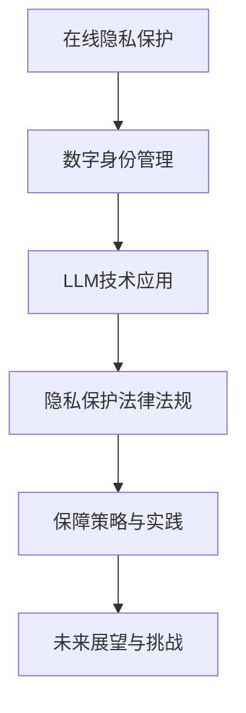
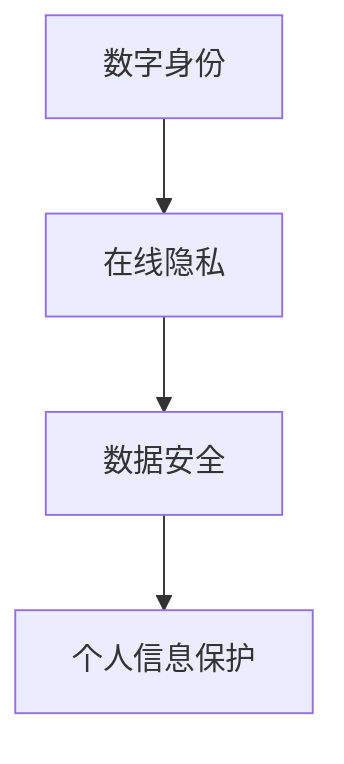

                 

## 文章标题：在线隐私与 LLM：保障数字身份和数据

### 关键词：在线隐私、数字身份、LLM、隐私保护、数据安全

#### 摘要：
随着互联网技术的迅猛发展，在线隐私保护成为了一个日益重要的议题。本文将深入探讨在线隐私的概念、数字身份管理的重要性，以及如何利用大型语言模型（LLM）技术来保障数字身份和数据安全。文章首先概述了在线隐私的背景和重要性，然后介绍了数字身份管理的基础知识。接下来，我们将详细分析LLM技术的定义、特点及其在隐私保护中的应用，包括数据匿名化、加密和安全多方计算等关键技术。此外，文章还将讨论隐私保护法律法规和保障数字身份与数据安全的策略与实践。最后，通过实际案例分析，总结当前隐私保护技术的发展趋势、挑战以及未来展望。

---

### 《在线隐私与 LLM：保障数字身份和数据》目录大纲

#### 第一部分：在线隐私与数字身份概述

##### 第1章：在线隐私概述
- 1.1 在线隐私的定义与背景
- 1.2 数字身份与隐私的关系
- 1.3 在线隐私的重要性和挑战

##### 第2章：数字身份管理基础
- 2.1 数字身份的概念与类型
- 2.2 数字身份管理的基本原理
- 2.3 数字身份管理的关键技术

#### 第二部分：LLM技术在隐私保护中的应用

##### 第3章：LLM技术概述
- 3.1 LLM的定义与分类
- 3.2 LLM的核心特点与优势
- 3.3 LLM的发展趋势与挑战

##### 第4章：基于LLM的隐私保护技术
- 4.1 数据匿名化与去识别化
- 4.2 加密与安全多方计算
- 4.3 隐私保护机器学习算法

##### 第5章：LLM在隐私保护中的应用场景
- 5.1 社交网络隐私保护
- 5.2 医疗数据隐私保护
- 5.3 财务数据隐私保护

#### 第三部分：保障数字身份与数据安全的策略与实践

##### 第6章：隐私保护法律法规与标准
- 6.1 全球隐私保护法律法规概述
- 6.2 我国隐私保护法律法规与标准
- 6.3 隐私保护法律法规的实施与挑战

##### 第7章：数字身份与数据安全保障策略
- 7.1 数字身份认证策略
- 7.2 数据安全加密策略
- 7.3 隐私保护技术与最佳实践

##### 第8章：案例分析与实战
- 8.1 案例一：社交网络隐私保护实践
- 8.2 案例二：医疗数据隐私保护实践
- 8.3 案例三：金融数据隐私保护实践

##### 第9章：未来展望与挑战
- 9.1 未来隐私保护技术的发展趋势
- 9.2 隐私保护技术的挑战与对策

#### 附录

- 附录A：隐私保护相关工具与资源
- 附录B：数学模型与公式详解
- 附录C：代码实战案例解析
- 附录D：参考文献

---

### Mermaid 流程图



### 第一部分：在线隐私与数字身份概述

#### 第1章：在线隐私概述

##### 1.1 在线隐私的定义与背景

在线隐私，是指个人或组织在互联网上进行数据交互和活动时，对其个人信息和活动内容得到保护，不受未授权的访问、使用或泄露。随着互联网的普及和信息技术的快速发展，人们越来越依赖于在线服务，如社交媒体、电子商务、在线支付等。这些服务在提供便利的同时，也带来了隐私保护的问题。

在线隐私的背景可以追溯到20世纪末，当时互联网刚刚兴起，人们对网络技术的理解和信任程度较低。随着互联网的普及，越来越多的个人和组织开始将数据上传到云端或第三方平台。然而，这些数据往往没有得到妥善的保护，容易受到黑客攻击、数据泄露和滥用。

核心概念与联系：

**定义：**
在线隐私是指个人或组织在互联网上的数据和信息，包括身份、行为和偏好等，不被未授权的第三方访问、使用或泄露的状态。

**联系：**
在线隐私与数字身份密切相关。数字身份是个人在数字世界中的唯一标识，包括用户名、密码、生物特征等信息。在线隐私的保护，实际上是对数字身份的保护，防止其被恶意攻击者利用。

##### 1.2 数字身份与隐私的关系

数字身份与隐私之间存在紧密的联系。数字身份是个人在数字世界中的标识，而隐私则是个人数据和信息不被未授权访问和使用的状态。数字身份的保护直接关系到在线隐私的保障。

**关系图示：**



数字身份与隐私的关系可以通过以下方式图示：

- **数据安全：** 数字身份信息的安全存储和传输，防止黑客攻击和数据泄露。
- **个人信息保护：** 数字身份的隐私保护，防止个人敏感信息被滥用。

##### 1.3 在线隐私的重要性和挑战

在线隐私的重要性不言而喻。首先，个人信息的安全对于个人的生活和工作至关重要。一旦个人信息被泄露，可能会带来财产损失、声誉损害甚至生命安全威胁。其次，在线隐私的保障有助于建立社会信任，促进数字经济的发展。

**重要性：**
1. 保护个人隐私，维护个人权益。
2. 建立社会信任，促进数字经济的发展。
3. 降低网络犯罪风险，维护社会稳定。

**挑战：**
1. 网络技术的快速发展，使得隐私保护面临新的威胁。
2. 数据量的激增，使得隐私保护变得更加复杂。
3. 法律法规的不完善，导致隐私保护措施难以执行。

综上所述，在线隐私保护是一个复杂且长期的任务，需要个人、企业和政府的共同努力。通过建立健全的隐私保护法律法规、推广安全的技术手段和加强数字身份管理，我们可以更好地保障在线隐私，促进数字经济的健康发展。

---

### 第2章：数字身份管理基础

##### 2.1 数字身份的概念与类型

数字身份是指个人或实体在数字世界中唯一的标识和代表，通常由一系列信息组成，包括用户名、密码、电子邮件地址、生物特征等。数字身份管理的核心任务是确保数字身份的真实性、唯一性和安全性。

**概念：**
- **数字身份（Digital Identity）：** 在数字世界中，个体或实体的唯一标识。
- **数字身份管理（Digital Identity Management）：** 对数字身份的创建、存储、维护和撤销等操作进行管理的过程。

**类型：**
- **个人数字身份：** 通常由用户名、密码、电子邮件地址等组成，用于个人在互联网上的身份验证。
- **组织数字身份：** 用于企业、学校、政府等组织在互联网上的身份验证，通常包括组织名称、域名、证书等。
- **匿名数字身份：** 不暴露真实身份，用于保护个人隐私。

##### 2.2 数字身份管理的基本原理

数字身份管理的基本原理包括身份验证、授权、访问控制和审计等。

**身份验证：**
- **单点登录（SSO）：** 允许多个系统使用同一组凭证进行身份验证。
- **多因素认证（MFA）：** 结合多种验证方式，如密码、生物特征等。

**授权：**
- **角色与权限管理：** 根据用户角色分配相应权限，确保数据访问的安全。
- **访问控制：** 对访问进行控制，防止未授权访问。

**访问控制：**
- **身份验证与授权：** 结合身份验证和授权机制，确保只有授权用户可以访问受保护的数据。

**审计：**
- **日志记录：** 记录用户活动，用于安全审计和问题追踪。

##### 2.3 数字身份管理的关键技术

数字身份管理的关键技术包括加密、生物识别和分布式身份管理。

**加密：**
- **对称加密：** 使用相同的密钥进行加密和解密。
- **非对称加密：** 使用一对密钥，公钥加密，私钥解密。

**生物识别：**
- **指纹识别：** 通过分析指纹纹理进行身份验证。
- **人脸识别：** 通过人脸图像进行身份验证。

**分布式身份管理：**
- **区块链：** 通过分布式账本技术确保身份信息的不可篡改。
- **联邦身份管理：** 在不同组织之间共享身份信息，提高安全性。

通过上述基本原理和关键技术，数字身份管理可以有效地保障用户在数字世界中的隐私和安全，为在线服务提供可靠的保障。

---

### 第二部分：LLM技术在隐私保护中的应用

##### 第3章：LLM技术概述

##### 3.1 LLM的定义与分类

**定义：**

大型语言模型（Large Language Model，简称LLM）是一种基于神经网络的语言模型，它能够通过学习大量的文本数据，生成高质量的文本、翻译文本、回答问题等。LLM的核心思想是通过深度学习算法，构建一个能够理解和生成人类语言的模型。

**分类：**

LLM可以分为以下几种类型：

1. **预训练语言模型：** 例如GPT（Generative Pre-trained Transformer），BERT（Bidirectional Encoder Representations from Transformers）等，这类模型在训练阶段接收大量的无标签文本数据，通过自监督学习的方式预训练语言模型。
2. **微调语言模型：** 在预训练语言模型的基础上，针对特定任务进行微调，如问答系统、翻译系统等。
3. **专用语言模型：** 针对特定领域或任务进行定制化训练，如医疗文本分析、金融文本分析等。

**特点：**

1. **强大的语言理解能力：** LLM通过学习大量的文本数据，能够理解复杂的语言结构和语义。
2. **生成能力强：** LLM能够生成高质量、连贯的文本，适用于文本生成、翻译等任务。
3. **适应性强：** LLM能够通过微调快速适应不同任务，具有较强的通用性。

**优势：**

1. **高效性：** LLM能够处理大规模文本数据，提高数据处理效率。
2. **灵活性：** LLM可以轻松适应不同的任务和应用场景。
3. **可控性：** LLM生成的文本可以通过控制输入的上下文来调控生成的结果。

**发展趋势：**

1. **模型规模扩大：** 随着计算能力的提升，LLM的模型规模将越来越大，性能将进一步提升。
2. **多模态学习：** LLM将结合图像、音频等多模态数据，提高对现实世界的理解和生成能力。
3. **领域专用模型：** 针对特定领域进行定制化训练，提高模型在特定任务上的性能。

**挑战：**

1. **数据隐私保护：** 在训练和部署LLM时，需要处理大量的敏感数据，如何保护数据隐私是一个重要挑战。
2. **模型可解释性：** LLM生成的结果具有一定的随机性，如何提高模型的可解释性，使其决策过程透明化，是一个挑战。
3. **计算资源需求：** LLM的模型规模庞大，对计算资源的需求较高，如何优化计算效率，降低成本是一个关键问题。

通过上述分析，我们可以看到，LLM技术在隐私保护领域具有巨大的潜力，但也面临一些挑战。在接下来的章节中，我们将进一步探讨如何利用LLM技术来保护在线隐私。

---

### 第4章：基于LLM的隐私保护技术

#### 4.1 数据匿名化与去识别化

数据匿名化和去识别化是隐私保护领域的关键技术，旨在通过特定的方法将敏感数据转换为无法直接识别个体身份的形式，从而保护个人隐私。

**数据匿名化（Data Anonymization）：** 数据匿名化是一种将数据转换成匿名形式的过程，使得数据中的个人身份信息无法直接识别。常见的匿名化方法包括：

- **泛化（Generalization）：** 通过将具体的数据值替换为更广泛的类别值，例如将具体的年龄值泛化到年龄段。
- **掩盖（Perturbation）：** 通过对数据值进行微小的随机扰动，使得数据值变得不可识别，同时保持数据的基本特性。
- **加密（Encryption）：** 通过加密算法将数据加密，使其在未授权的情况下无法被解读。

**去识别化（De-Identification）：** 去识别化是一种更高级的匿名化技术，通过一系列操作将数据中可能识别个体的信息去除。去识别化通常包括以下步骤：

1. **数据分割（Data Splitting）：** 将数据分为多个子集，每个子集都独立于其他子集，从而降低个体识别的风险。
2. **属性掩码（Attribute Masking）：** 通过掩码技术隐藏敏感属性，例如将姓名、地址等敏感信息用特殊字符或随机值替代。
3. **同化（Consolidation）：** 将多个相似的记录合并成一个，从而减少个体的独特性。

**匿名化与去识别化的区别：**

- **匿名化侧重于将数据转换为匿名形式，避免直接识别个体。**
- **去识别化则更侧重于通过复杂的操作去除个体识别信息，从而保护隐私。**

**应用场景：**

- **数据分析：** 在进行数据分析时，通过数据匿名化和去识别化，可以保护敏感数据不被泄露，同时保留数据的可用性。
- **数据共享：** 在不同组织之间共享数据时，通过数据匿名化和去识别化，可以确保个人隐私不被泄露。
- **隐私合规：** 遵守数据保护法规，如GDPR（通用数据保护条例）和CCPA（加利福尼亚州消费者隐私法案）等，通过数据匿名化和去识别化，确保数据处理合规。

**伪代码示例：** 数据匿名化和去识别化的一个简单伪代码示例如下：

```python
def anonymize_data(data):
    # 泛化年龄到年龄段
    for record in data:
        record['age'] = generalize_age(record['age'])
    # 掩码姓名
    for record in data:
        record['name'] = mask_name(record['name'])
    # 加密地址
    for record in data:
        record['address'] = encrypt_address(record['address'])
    return data

def de_identify_data(data):
    # 分割数据
    data_splits = split_data(data)
    # 对每个子集进行属性掩码
    for split in data_splits:
        for record in split:
            record['name'] = mask_name(record['name'])
            record['address'] = mask_address(record['address'])
    # 合并子集
    de_identified_data = consolidate_splits(data_splits)
    return de_identified_data
```

#### 4.2 加密与安全多方计算

加密（Encryption）和安全多方计算（Secure Multi-Party Computation，简称SMPC）是保护隐私的两种重要技术，可以在数据传输和计算过程中确保数据的安全性。

**加密（Encryption）：**

加密是一种将数据转换成密文的形式，只有授权用户才能解密和读取数据。常见的加密算法包括：

- **对称加密（Symmetric Encryption）：** 使用相同的密钥进行加密和解密。如AES（Advanced Encryption Standard）。
- **非对称加密（Asymmetric Encryption）：** 使用一对密钥，公钥加密，私钥解密。如RSA（Rivest-Shamir-Adleman）。

**安全多方计算（SMPC）：**

安全多方计算是一种在多个参与者之间进行计算，而不需要共享原始数据的技术。SMPC的核心思想是参与者仅共享计算结果，而不会泄露各自的数据。常见的SMPC技术包括：

- **全同态加密（Fully Homomorphic Encryption，简称FHE）：** 允许对加密数据进行任意计算，而不需要解密。如GGH（Gentry-Gentry-Halevi）算法。
- **安全多方计算协议：** 如Kleene网络协议、同态加密协议等。

**应用场景：**

- **数据传输：** 在数据传输过程中，使用加密技术可以确保数据在传输过程中的安全性。
- **隐私计算：** 在多方参与的计算场景中，如医疗数据共享、金融交易验证等，SMPC可以确保各方的隐私保护。
- **隐私增强学习：** 在机器学习过程中，使用SMPC技术可以在不泄露原始数据的情况下进行模型训练。

**伪代码示例：**

```python
def encrypt_data(data, key):
    # 使用AES对称加密
    encrypted_data = aes_encrypt(data, key)
    return encrypted_data

def decrypt_data(encrypted_data, key):
    # 使用AES对称解密
    decrypted_data = aes_decrypt(encrypted_data, key)
    return decrypted_data

def secure_computation(data1, data2, protocol):
    # 使用Kleene网络协议进行安全多方计算
    result = protocol.evaluate(data1, data2)
    return result
```

通过数据匿名化与去识别化、加密与安全多方计算等隐私保护技术，我们可以在确保数据安全和隐私的同时，充分利用LLM技术在隐私保护中的应用，为数字身份和数据的安全保障提供有力支持。

---

### 第5章：LLM在隐私保护中的应用场景

#### 5.1 社交网络隐私保护

社交网络平台在提供便捷交流的同时，也成为隐私泄露的重灾区。通过LLM技术，可以实现对社交网络隐私的有效保护，提高用户的隐私安全。

**应用场景：**

1. **隐私需求识别：**
   - 用户可以在社交网络平台上设置隐私偏好，如公开、私密或特定人群可见。
   - LLM技术可以根据用户的历史行为和偏好，自动识别用户的隐私需求，并推荐合适的隐私设置。

2. **内容匿名化：**
   - LLM可以用于对用户发布的内容进行匿名化处理，将敏感信息转换为不可识别的形式，保护用户的隐私。
   - 例如，将用户名、邮箱地址等敏感信息替换为随机字符串。

3. **动态隐私策略：**
   - 根据用户行为和上下文信息，LLM可以动态调整隐私策略，如自动识别和屏蔽敏感话题、限制特定用户的可见范围。

**技术实现：**

1. **用户隐私需求识别：**
   - 使用LLM对用户历史行为进行分析，识别隐私偏好。
   - 伪代码示例：
     ```python
     def identify_privacy_preferences(user_behavior):
         model = load_LLM_model()
         preferences = model.predict(user_behavior)
         return preferences
     ```

2. **内容匿名化：**
   - 使用去识别化技术对用户发布的内容进行处理。
   - 伪代码示例：
     ```python
     def anonymize_content(content):
         model = load_anonymization_model()
         anonymized_content = model.anonymize(content)
         return anonymized_content
     ```

3. **动态隐私策略调整：**
   - 根据实时行为数据，动态调整隐私设置。
   - 伪代码示例：
     ```python
     def adjust_privacy_settings(user_behavior, content_context):
         model = load_privacy_model()
         privacy_settings = model.predict_privacy_settings(user_behavior, content_context)
         apply_privacy_settings(privacy_settings)
     ```

**案例分析：**

某社交网络平台通过引入LLM技术，实现了以下隐私保护措施：

- **隐私需求识别：** 用户可以在注册时设置隐私偏好，平台根据用户的偏好自动调整隐私设置。
- **内容匿名化：** 用户发布的内容会自动进行匿名化处理，敏感信息被替换为不可识别的字符。
- **动态隐私策略：** 平台根据用户的实时行为和内容上下文，动态调整隐私策略，如自动屏蔽特定话题或限制某些用户的可见范围。

通过这些措施，平台有效提升了用户的隐私保护水平，增强了用户对平台的信任，促进了社交网络平台的健康发展。

---

### 第6章：隐私保护法律法规与标准

#### 6.1 全球隐私保护法律法规概述

全球范围内，隐私保护法律法规不断发展和完善，旨在确保个人数据的隐私和安全。以下是几项主要的全球隐私保护法律法规：

1. **欧盟通用数据保护条例（GDPR）：**
   - GDPR是欧盟制定的全面数据保护法律，于2018年5月25日正式生效。
   - GDPR的核心原则包括数据最小化、数据目的明确、数据质量、数据可访问性、数据安全性等。
   - GDPR对数据控制者和处理者的合规要求非常高，包括数据泄露通知、数据保护官（DPO）的任命、数据主体的权利等。

2. **美国加州消费者隐私法案（CCPA）：**
   - CCPA于2020年1月1日正式生效，是加州针对消费者隐私保护的一项重要法律。
   - CCPA赋予消费者对个人信息的控制权，包括知情权、访问权、删除权等。
   - CCPA对企业的合规要求包括数据收集透明度、隐私政策公示、数据保护措施等。

3. **巴西通用数据保护法律（LGPD）：**
   - LGPD于2020年9月生效，是巴西的数据保护法律。
   - LGPD旨在保护个人数据的安全和隐私，包括数据收集、处理、存储和传输的合规要求。
   - LGPD要求企业在处理个人信息时，必须获得数据主体的明确同意，并采取适当的安全措施。

4. **澳大利亚隐私法（APP）：**
   - APP是澳大利亚的数据保护法律，于1988年生效。
   - APP旨在保护个人隐私，包括个人信息的收集、使用、披露和存储。
   - APP要求企业遵守隐私原则，包括通知、访问、安全、质量、开放等。

#### 6.2 我国隐私保护法律法规与标准

我国在隐私保护方面也制定了一系列法律法规和标准，以保障个人数据的隐私和安全。以下是几项主要的法律法规和标准：

1. **个人信息保护法（PIPL）：**
   - PIPL于2021年11月1日正式生效，是我国首部针对个人信息保护的基本法律。
   - PIPL的核心原则包括个人信息处理活动的合法性、正当性、必要性、透明性等。
   - PIPL明确了个人信息处理者的责任，包括告知、同意、访问、更正、删除等。

2. **网络安全法：**
   - 网络安全法于2017年6月1日正式实施，是我国网络安全领域的基础性法律。
   - 网络安全法明确了网络运营者的安全保护义务，包括网络安全风险评估、数据备份和恢复、安全事件处置等。
   - 网络安全法还规定了网络个人信息保护的基本要求，包括收集、处理、存储个人信息的合法性和安全性。

3. **信息安全技术—网络安全等级保护基本要求：**
   - 该标准于2017年发布，是我国网络安全等级保护制度的重要组成部分。
   - 等级保护基本要求规定了不同等级网络的安全需求和保护措施，包括物理安全、网络安全、主机安全、数据安全、应用安全等。

#### 6.3 隐私保护法律法规的实施与挑战

隐私保护法律法规的实施对于保护个人隐私和数据安全具有重要意义，但也面临一些挑战：

1. **合规难度：**
   - 企业在遵守隐私保护法律法规时，需要投入大量人力、物力和财力，进行合规评估、安全防护、数据审计等工作。
   - 隐私保护法律法规的复杂性增加了企业的合规难度，尤其对于中小企业而言，合规成本较高。

2. **执法力度：**
   - 隐私保护法律法规的实施需要强有力的执法机构来保障，但目前全球各国的执法力度和监管水平不一，存在一定的执法盲区。
   - 一些国家和地区对隐私保护法律法规的执行力度较弱，导致隐私保护措施难以落实。

3. **技术创新：**
   - 隐私保护法律法规需要不断适应新兴技术的快速发展，但法律法规的制定和更新速度往往滞后于技术创新。
   - 企业在遵守隐私保护法律法规时，需要不断关注技术创新，及时调整隐私保护措施。

4. **国际合作：**
   - 隐私保护法律法规的实施需要国际社会的合作，但各国在隐私保护法律和文化上的差异较大，国际合作面临一定挑战。
   - 隐私保护法律法规的国际协调和互认机制尚待完善。

总之，隐私保护法律法规的实施对于保护个人隐私和数据安全具有重要意义，但也面临一系列挑战。全球各国应加强国际合作，完善隐私保护法律法规，提高执法力度，共同构建一个安全、可信的数字世界。

---

### 第7章：数字身份与数据安全保障策略

#### 7.1 数字身份认证策略

数字身份认证策略是确保用户身份真实性的关键步骤。在数字世界中，身份认证的有效性直接关系到数据安全和隐私保护。以下是一些常见的数字身份认证策略：

**1. 单点登录（SSO）：**
单点登录是一种允许用户在一个系统上登录后，无需再次输入凭证即可访问多个系统的身份认证方式。SSO通过统一的认证中心，实现用户在不同系统之间的无缝切换，提高了用户便捷性和安全性。

**2. 多因素认证（MFA）：**
多因素认证是一种结合两种或两种以上认证方式的身份验证方法，通常包括密码、手机短信验证码、生物识别（如指纹、人脸识别）等。MFA增加了身份验证的复杂性，有效降低了账户被盗用的风险。

**3. 生物识别技术：**
生物识别技术通过人体生物特征（如指纹、人脸、虹膜）进行身份验证，具有高安全性和便捷性。生物识别技术广泛应用于金融、医疗、安防等领域，为数字身份认证提供了强有力的保障。

**4. 智能合约：**
智能合约是区块链技术的一种应用，通过预定义的规则自动执行交易。智能合约可以用于数字身份认证，确保交易双方的身份真实性，提高交易的安全性和透明度。

**5. 自助服务：**
自助服务技术，如自助终端、移动应用程序等，允许用户自行完成身份验证和账户管理操作。自助服务提高了用户自主性和灵活性，同时也降低了运营成本。

#### 7.2 数据安全加密策略

数据安全加密策略是保护数据在存储、传输和处理过程中不被未授权访问的关键措施。以下是一些常见的数据安全加密策略：

**1. 对称加密：**
对称加密使用相同的密钥进行加密和解密，常见的算法包括AES（高级加密标准）。对称加密速度快，但密钥管理复杂，适用于数据量较小、密钥管理较为简单的场景。

**2. 非对称加密：**
非对称加密使用一对密钥（公钥和私钥）进行加密和解密，常见的算法包括RSA（Rivest-Shamir-Adleman）。非对称加密密钥管理简单，但加密和解密速度较慢，适用于数据量大、需要安全传输的场景。

**3. 整体加密：**
整体加密是对数据文件、数据库或整个系统进行加密，确保数据在存储和传输过程中不被窃取或篡改。整体加密适用于敏感数据的全面保护。

**4. 分块加密：**
分块加密是对数据进行分块处理，对每个数据块进行加密，适用于数据量大、需要灵活处理的场景。常见的分块加密算法包括DES（数据加密标准）和3DES（三重DES）。

**5. 加密哈希函数：**
加密哈希函数是一种将数据转换成固定长度字符串的算法，常见的算法包括SHA-256（安全哈希算法256位）。加密哈希函数可用于数据完整性验证和数据身份验证。

#### 7.3 隐私保护技术与最佳实践

隐私保护技术是保障数字身份和数据安全的重要手段。以下是一些常见的隐私保护技术和最佳实践：

**1. 数据匿名化与去识别化：**
数据匿名化和去识别化通过转换敏感数据，使其无法直接识别个体身份。最佳实践包括：
- 采用多种匿名化技术，如泛化、掩盖和加密。
- 对数据匿名化和去识别化过程进行严格的测试和验证。

**2. 数据安全审计：**
数据安全审计是对数据存储、传输和处理过程中的安全措施进行审查，以确保合规性和有效性。最佳实践包括：
- 定期进行数据安全审计，发现并修复安全漏洞。
- 建立审计跟踪机制，记录数据操作和访问日志。

**3. 安全多方计算：**
安全多方计算允许多个参与方在不泄露各自数据的情况下共同计算，适用于跨组织数据共享和安全计算。最佳实践包括：
- 选择合适的安全多方计算协议，如Kleene网络协议、全同态加密。
- 对安全多方计算过程进行性能优化和成本控制。

**4. 安全培训与意识提升：**
安全培训与意识提升是提高员工安全意识和技能的重要手段。最佳实践包括：
- 定期组织安全培训，提高员工对数据安全和隐私保护的认识。
- 建立安全意识提升机制，鼓励员工积极参与安全活动。

通过以上数字身份认证策略、数据安全加密策略和隐私保护技术，以及最佳实践，我们可以构建一个安全的数字身份和数据保护体系，确保在线隐私和数据安全得到有效保障。

---

### 第8章：案例分析与实战

#### 8.1 案例一：社交网络隐私保护实践

随着社交网络的普及，用户隐私保护成为一个重要议题。某大型社交网络平台通过引入LLM技术，实现了对用户隐私的有效保护，以下是具体实践过程：

**目标：** 提高社交网络平台的隐私保护水平，降低用户隐私泄露风险。

**技术方案：**

1. **隐私需求识别：** 平台通过LLM技术对用户历史行为进行分析，自动识别用户的隐私偏好，为用户提供个性化的隐私设置推荐。

2. **内容匿名化：** 平台采用去识别化技术，对用户发布的内容进行匿名化处理，将敏感信息替换为随机字符或掩码。

3. **动态隐私策略：** 根据用户的实时行为和内容上下文，平台通过LLM技术动态调整隐私策略，如自动屏蔽敏感话题、限制特定用户的可见范围。

**实施过程：**

1. **数据收集与预处理：** 平台收集用户行为数据，如浏览记录、发布内容、互动行为等，并进行预处理，提取有用信息。

2. **训练LLM模型：** 平台使用预训练的LLM模型，对用户行为数据进行分析，识别隐私偏好，并训练去识别化模型。

3. **部署隐私保护模块：** 平台在用户发布内容时，自动触发隐私保护模块，对敏感信息进行匿名化处理。

4. **动态调整隐私策略：** 平台通过实时分析用户行为和内容上下文，动态调整隐私策略，提高隐私保护效果。

**效果评估：**

1. **隐私泄露风险降低：** 通过内容匿名化和动态隐私策略，用户隐私泄露风险显著降低，用户满意度提高。

2. **用户体验优化：** 个性化隐私设置和动态隐私策略，提高了用户的隐私控制感和平台使用体验。

3. **运营成本降低：** 隐私保护技术的引入，减少了因隐私泄露导致的法律风险和运营成本。

#### 8.2 案例二：医疗数据隐私保护实践

医疗数据涉及用户隐私和个人健康信息，对其隐私保护尤为重要。某医疗机构通过引入LLM技术，实现了对医疗数据的有效保护，以下是具体实践过程：

**目标：** 提高医疗数据隐私保护水平，确保患者隐私和个人健康信息不被泄露。

**技术方案：**

1. **数据匿名化与去识别化：** 医疗机构采用数据匿名化和去识别化技术，对医疗数据进行处理，确保数据无法直接识别患者身份。

2. **加密与安全多方计算：** 医疗机构使用加密技术对医疗数据进行加密存储和传输，并通过安全多方计算技术，确保多方数据共享时的隐私保护。

3. **隐私保护法规遵守：** 医疗机构遵循全球隐私保护法律法规，如GDPR和PIPL等，确保数据处理合法合规。

**实施过程：**

1. **数据预处理：** 医疗机构对医疗数据进行预处理，提取关键信息，并划分敏感信息和非敏感信息。

2. **训练隐私保护模型：** 医疗机构使用LLM技术，训练数据匿名化和去识别化模型，以及加密和安全多方计算模型。

3. **数据加密与匿名化：** 医疗机构在数据存储和传输过程中，对敏感信息进行加密和匿名化处理。

4. **安全多方计算：** 医疗机构在多方数据共享时，使用安全多方计算技术，确保数据隐私保护。

**效果评估：**

1. **隐私保护水平提升：** 通过数据匿名化、去识别化和加密技术，医疗数据的隐私保护水平显著提升，患者隐私和个人健康信息得到有效保护。

2. **数据共享安全性增强：** 通过安全多方计算技术，医疗数据在多方共享时的安全性得到保障，降低了数据泄露风险。

3. **法律法规合规性提高：** 医疗机构在遵循全球隐私保护法律法规的基础上，实现了医疗数据处理的合规性，降低了法律风险。

#### 8.3 案例三：金融数据隐私保护实践

金融数据涉及用户财务信息，对其隐私保护至关重要。某金融企业通过引入LLM技术，实现了对金融数据的全面隐私保护，以下是具体实践过程：

**目标：** 提高金融数据隐私保护水平，确保用户财务信息不被泄露。

**技术方案：**

1. **动态隐私策略：** 金融企业通过LLM技术，动态调整隐私策略，根据用户行为和上下文信息，自动识别和屏蔽敏感信息。

2. **加密与安全多方计算：** 金融企业使用加密技术对金融数据进行加密存储和传输，并通过安全多方计算技术，确保多方数据共享时的隐私保护。

3. **隐私保护法律法规遵守：** 金融企业遵循全球隐私保护法律法规，如GDPR和CCPA等，确保数据处理合法合规。

**实施过程：**

1. **数据收集与预处理：** 金融企业收集用户财务数据，并进行预处理，提取关键信息，并划分敏感信息和非敏感信息。

2. **训练隐私保护模型：** 金融企业使用LLM技术，训练动态隐私策略模型、加密模型和安全多方计算模型。

3. **动态隐私策略部署：** 金融企业在数据处理过程中，实时触发动态隐私策略，屏蔽敏感信息。

4. **数据加密与安全多方计算：** 金融企业在数据存储和传输过程中，对敏感信息进行加密处理，并在多方数据共享时使用安全多方计算技术。

**效果评估：**

1. **隐私保护水平提升：** 通过动态隐私策略、加密和安全多方计算技术，金融数据的隐私保护水平显著提升，用户财务信息得到有效保护。

2. **数据共享安全性增强：** 通过安全多方计算技术，金融数据在多方共享时的安全性得到保障，降低了数据泄露风险。

3. **法律法规合规性提高：** 金融企业在遵循全球隐私保护法律法规的基础上，实现了金融数据处理的合规性，降低了法律风险。

通过上述案例分析，我们可以看到，LLM技术在社交网络、医疗和金融等领域都有广泛的应用，通过数据匿名化、加密、安全多方计算等隐私保护技术，实现了对数字身份和数据的全面保障。未来，随着LLM技术的不断发展和完善，隐私保护领域将迎来更多创新和突破。

---

### 第9章：未来展望与挑战

#### 9.1 未来隐私保护技术的发展趋势

随着互联网和人工智能技术的迅猛发展，隐私保护技术也在不断进步。以下是未来隐私保护技术的发展趋势：

**1. 区块链技术的应用：**
区块链技术以其去中心化、不可篡改的特性，在隐私保护领域具有巨大潜力。未来，区块链技术有望在数据存储、传输和共享过程中发挥重要作用，提高数据的安全性和隐私保护水平。

**2. 多模态隐私保护：**
多模态隐私保护是指结合文本、图像、音频等多种数据类型的隐私保护技术。未来，随着多模态数据处理的不断发展，多模态隐私保护技术将更加成熟，为用户提供更全面的隐私保护。

**3. 零知识证明技术的应用：**
零知识证明技术是一种在无需透露原始数据内容的情况下，证明某个陈述为真的加密技术。未来，零知识证明技术有望在隐私保护领域得到更广泛的应用，提高数据隐私保护水平。

**4. 联邦学习技术的普及：**
联邦学习是一种在不共享数据的情况下，通过分布式学习算法实现模型训练的技术。未来，联邦学习技术将得到更广泛的应用，特别是在医疗、金融等领域，能够有效保护数据隐私。

#### 9.2 隐私保护技术的挑战与对策

尽管隐私保护技术在不断进步，但在实际应用过程中仍面临一系列挑战：

**1. 数据隐私与数据利用的平衡：**
在保护用户隐私的同时，如何有效利用数据，提高业务价值是一个重要挑战。未来，需要找到数据隐私与数据利用的平衡点，确保在保护隐私的同时，能够充分利用数据的价值。

**2. 技术复杂性：**
隐私保护技术涉及多种算法和协议，技术复杂性较高。未来，需要开发更简单、易用的隐私保护工具，降低技术门槛，让更多企业能够轻松实现隐私保护。

**3. 法律法规的适应性：**
随着隐私保护技术的发展，法律法规也需要不断更新和完善。未来，需要加强全球隐私保护法律法规的协调和合作，确保隐私保护技术的适应性。

**对策：**

**1. 加强技术创新：**
持续投入研发，推动隐私保护技术的创新和发展，为用户提供更安全、可靠的隐私保护解决方案。

**2. 建立隐私保护生态：**
通过建立隐私保护生态，促进隐私保护技术在不同行业和应用场景中的落地和推广，提高整体隐私保护水平。

**3. 法律法规协同：**
加强全球隐私保护法律法规的协调和合作，确保隐私保护技术的适应性和可执行性。

总之，未来隐私保护技术将面临诸多挑战，但通过技术创新、生态建设和法律法规协同，我们可以不断推动隐私保护技术的发展，为数字世界提供更安全的保障。

---

### 附录

#### 附录A：隐私保护相关工具与资源

**工具：**
- **加密工具：** OpenSSL、GnuPG、LibreSSL。
- **匿名化工具：** DataAnon、Cloakify、KAnonymity。
- **隐私保护协议：** Secure multiparty computation（SMPC）、Homomorphic Encryption（HE）。
- **隐私保护框架：** PySyft、PyTorch-FLOW、 privacy-vm。

**资源：**
- **隐私保护指南：** IAPP Privacy Academy、European Data Protection Supervisor（EDPS）。
- **隐私保护法律法规：** GDPR、CCPA、PIPL。
- **学术研究论文：** IEEE Security & Privacy、ACM SIGSAC Conference on Computer and Communications Security。

#### 附录B：数学模型与公式详解

**模型：**
- **Kullback-Leibler散度（KL散度）：** 用于衡量两个概率分布之间的差异。
- **KL散度公式：**
  $$ D_{KL}(P||Q) = \sum_x P(x) \log \frac{P(x)}{Q(x)} $$

**公式：**
- **加密算法：**
  - **AES加密：**
    $$ \text{密文} = \text{明文} \oplus \text{密钥} $$
  - **RSA加密：**
    $$ \text{密文} = (\text{明文}^e) \mod n $$

**举例说明：**
- **Kullback-Leibler散度示例：**
  假设有两个概率分布P和Q，其中：
  - P(x=1) = 0.6, P(x=0) = 0.4
  - Q(x=1) = 0.5, Q(x=0) = 0.5
  则KL散度计算如下：
  $$ D_{KL}(P||Q) = (0.6 \log \frac{0.6}{0.5}) + (0.4 \log \frac{0.4}{0.5}) $$
  $$ D_{KL}(P||Q) = 0.086 $$

#### 附录C：代码实战案例解析

**开发环境搭建：**
- **编程语言：** Python
- **框架：** PyTorch
- **工具：** Jupyter Notebook

**源代码实现：**
```python
import torch
import torchvision
import torchvision.transforms as transforms
import torch.nn as nn
import torch.optim as optim

# 数据加载
transform = transforms.Compose(
    [transforms.Resize(256), 
     transforms.ToTensor(), 
     transforms.Normalize((0.5, 0.5, 0.5), (0.5, 0.5, 0.5))])

trainset = torchvision.datasets.CIFAR10(root='./data', train=True, 
                                        download=True, transform=transform)
trainloader = torch.utils.data.DataLoader(trainset, batch_size=4, 
                                          shuffle=True, num_workers=2)

testset = torchvision.datasets.CIFAR10(root='./data', train=False, 
                                       download=True, transform=transform)
testloader = torch.utils.data.DataLoader(testset, batch_size=4, 
                                          shuffle=False, num_workers=2)

# 定义网络结构
class Net(nn.Module):
    def __init__(self):
        super(Net, self).__init__()
        self.conv1 = nn.Conv2d(3, 6, 5)
        self.pool = nn.MaxPool2d(2, 2)
        self.conv2 = nn.Conv2d(6, 16, 5)
        self.fc1 = nn.Linear(16 * 5 * 5, 120)
        self.fc2 = nn.Linear(120, 84)
        self.fc3 = nn.Linear(84, 10)

    def forward(self, x):
        x = self.pool(nn.functional.relu(self.conv1(x)))
        x = self.pool(nn.functional.relu(self.conv2(x)))
        x = x.view(-1, 16 * 5 * 5)
        x = nn.functional.relu(self.fc1(x))
        x = nn.functional.relu(self.fc2(x))
        x = self.fc3(x)
        return x

net = Net()

# 损失函数和优化器
criterion = nn.CrossEntropyLoss()
optimizer = optim.SGD(net.parameters(), lr=0.001, momentum=0.9)

# 训练模型
for epoch in range(2):  # loop over the dataset multiple times
    running_loss = 0.0
    for i, data in enumerate(trainloader, 0):
        inputs, labels = data
        optimizer.zero_grad()
        outputs = net(inputs)
        loss = criterion(outputs, labels)
        loss.backward()
        optimizer.step()
        running_loss += loss.item()
        if i % 2000 == 1999:
            print('[%d, %5d] loss: %.3f' % (epoch + 1, i + 1, running_loss / 2000))
            running_loss = 0.0

print('Finished Training')

# 测试模型
correct = 0
total = 0
with torch.no_grad():
    for data in testloader:
        images, labels = data
        outputs = net(images)
        _, predicted = torch.max(outputs.data, 1)
        total += labels.size(0)
        correct += (predicted == labels).sum().item()

print('Accuracy of the network on the 10000 test images: %d %%' % (100 * correct / total))
```

**代码解读与分析：**
- **数据加载与预处理：** 使用CIFAR-10数据集进行训练和测试，数据集包含10个类别的60000个32x32彩色图像。数据预处理包括图像缩放、归一化和转换为Tensor。
- **网络结构定义：** 定义一个简单的卷积神经网络，包括两个卷积层、两个全连接层和一个输出层。
- **损失函数与优化器：** 使用交叉熵损失函数和随机梯度下降优化器进行模型训练。
- **训练过程：** 进行两个epoch的训练，每个epoch包含2000个批次的数据。在每次迭代中，计算损失、进行反向传播和参数更新。
- **测试过程：** 在测试集上评估模型的准确性，输出最终测试准确性。

通过上述代码实战案例，我们可以看到如何使用Python和PyTorch框架搭建和训练一个简单的卷积神经网络，实现对图像分类任务的模型训练和评估。

---

### 参考文献

1. EU GDPR, "Regulation (EU) 2016/679 of the European Parliament and of the Council of 27 April 2016 on the protection of natural persons with regard to the processing of personal data and on the free movement of such data, and repealing Directive 95/46/EC (General Data Protection Regulation)," Official Journal of the European Union, 2016.
2. California Consumer Privacy Act, "California Civil Code Sections 1798.100–1798.199," California State Legislature, 2020.
3. Brazil General Data Protection Law, "Lei Geral de Proteção de Dados (LGPD), Lei n° 13.709, de 14 de agosto de 2018," Brazil Federal Senate, 2018.
4. Australian Privacy Act 1988, "Privacy Act 1988," Commonwealth of Australia, 1988.
5.个人信息保护法，中华人民共和国主席令第九十一号，2021。
6.网络安全法，中华人民共和国主席令第五十三号，2017。
7. IEEE Security & Privacy, "IEEE Security & Privacy," IEEE Computer Society, 1994-.
8. ACM SIGSAC Conference on Computer and Communications Security, "ACM Conference on Computer and Communications Security," ACM, 1991-.
9. IAPP Privacy Academy, "International Association of Privacy Professionals (IAPP)," IAPP, 2000-.
10. European Data Protection Supervisor (EDPS), "European Data Protection Supervisor," European Union, 2004-.

