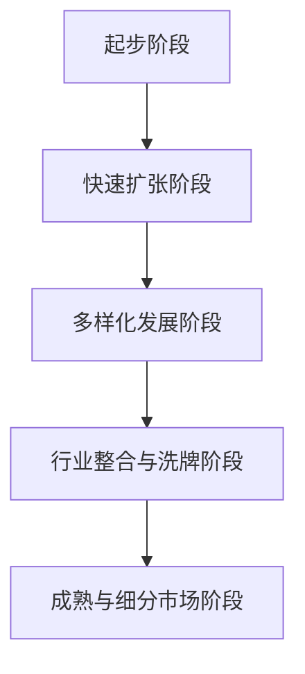
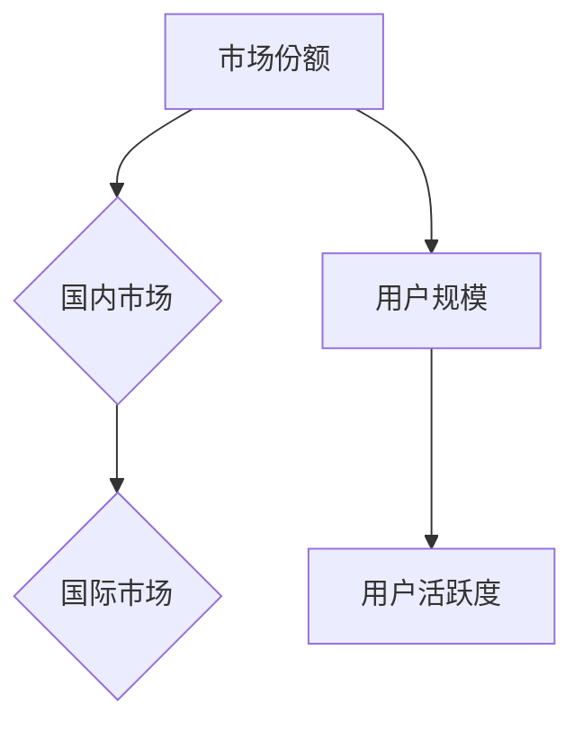
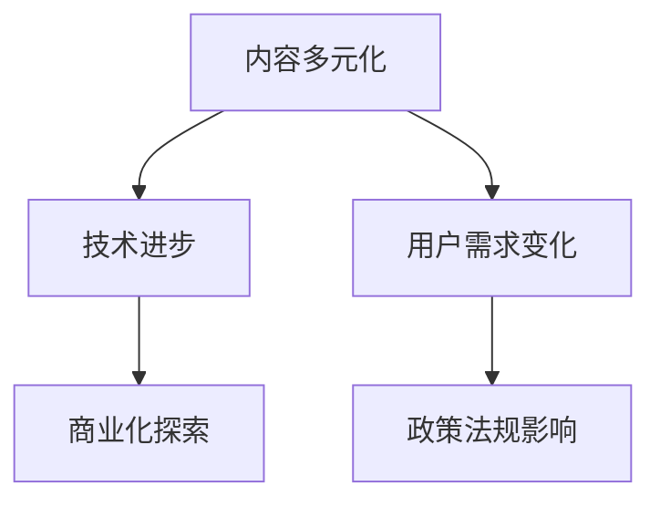

                 

### 文章标题：在线音频平台的注意力争夺策略

### 关键词：
- 在线音频平台
- 注意力经济
- 用户行为分析
- 内容创作与运营策略
- 个性化推荐算法
- 营销推广与用户增长

### 摘要：
本文将深入探讨在线音频平台的注意力争夺策略。首先，我们将回顾在线音频平台的发展历程和市场现状，并探讨其发展趋势。接着，我们会详细解释注意力经济的概念及其与在线音频平台的关联，分析注意力资源如何被利用。随后，文章将逐一解析用户行为分析、内容创作与运营策略、用户互动与社区建设、个性化推荐算法以及营销推广与用户增长策略。通过案例分析，我们将探讨成功在线音频平台的注意力争夺策略，并分享实际项目中的经验教训。最后，文章将总结全文，并给出未来在线音频平台发展的建议。

---

### 第1章：在线音频平台行业背景

#### 1.1 在线音频平台的发展历程

在线音频平台的发展历程可以分为以下几个阶段：

1. **起步阶段（2000年代初）**：
   - 在线音频平台的雏形出现，主要以音乐流媒体为主，如Spotify和苹果音乐。
   - 这一阶段，用户主要通过在线收听音乐，平台以提供丰富的音乐库和便捷的播放体验为主要目标。

2. **快速扩张阶段（2010年代）**：
   - 随着智能手机的普及和移动互联网的发展，在线音频平台开始迅速扩张。
   - 这一时期，出现了如喜马拉雅、Spotify、苹果音乐等主要平台，它们不仅提供音乐服务，还开始涉及播客、有声书等领域。

3. **多样化发展阶段（2015年至今）**：
   - 在线音频平台逐渐从单一的音乐流媒体服务扩展到多元化的内容形式。
   - 平台开始注重内容的多样性和个性化推荐，如喜马拉雅的精品内容、Spotify的个性化推荐等。

4. **行业整合与洗牌阶段（2020年代）**：
   - 随着市场竞争的加剧，一些小型平台逐渐被大型平台吞并。
   - 这一阶段，平台之间的竞争更加激烈，市场份额和用户规模成为关键指标。

5. **成熟与细分市场阶段（未来几年）**：
   - 在线音频平台将逐渐成熟，并进入细分市场，如专业音乐、教育音频、有声书等。
   - 平台将更加注重用户体验和内容质量，以保持竞争优势。

#### 1.2 在线音频平台的市场现状

目前，在线音频平台市场呈现出以下几个特点：

1. **市场份额**：
   - 全球范围内，Spotify、苹果音乐、腾讯音乐等巨头占据大部分市场份额。
   - 在一些国家和地区，如中国，本土平台如喜马拉雅和蜻蜓FM也占据了重要地位。

2. **用户规模**：
   - 全球在线音频用户规模持续增长，特别是在年轻人群和中产阶级中。
   - 一些平台如Spotify和苹果音乐的用户数量已经超过数亿。

3. **用户活跃度**：
   - 用户对在线音频平台的依赖程度逐渐提高，每天使用平台的时间也在增加。
   - 播客、有声书、音乐等内容的消费量持续攀升。

#### 1.3 在线音频平台的发展趋势

未来几年，在线音频平台的发展趋势将呈现以下特点：

1. **内容多元化**：
   - 平台将更加注重内容的多元化，不仅限于音乐和播客，还将涉及有声书、知识分享、教育等内容。

2. **技术进步**：
   - 人工智能和大数据技术的应用将更加深入，个性化推荐和用户行为分析将更加精准。

3. **用户需求变化**：
   - 用户对高质量、个性化内容的追求将推动平台不断创新，满足多样化的用户需求。

4. **商业化探索**：
   - 平台将通过广告、付费内容、电商等模式实现商业化，提高盈利能力。

5. **政策法规影响**：
   - 随着政府对互联网内容监管的加强，平台将面临更多的合规挑战。

Mermaid 流程图：



数据图表：



趋势预测：



---

### 第2章：注意力经济与在线音频平台

#### 2.1 注意力经济的概念

注意力经济是一种基于用户注意力的商业模式。它认为，用户的注意力是有限的资源，平台通过吸引和留住用户注意力，从而实现商业价值。注意力经济的核心概念包括以下几个方面：

1. **注意力稀缺**：
   - 用户每天面临大量的信息和娱乐选择，注意力资源有限，因此平台需要通过独特的内容和体验来吸引和留住用户。

2. **注意力转移**：
   - 用户可以将注意力从一个平台转移到另一个平台，因此平台需要不断创新和优化，以保持用户的持续关注。

3. **注意力价值**：
   - 用户注意力具有价值，平台可以通过广告、会员订阅、付费内容等方式实现商业化。

4. **注意力回报**：
   - 平台通过提供高质量的内容和用户体验，吸引用户注意力，从而获得商业回报。

#### 2.2 注意力经济与在线音频平台的关联

在线音频平台与注意力经济紧密相关，主要表现在以下几个方面：

1. **用户注意力的获取**：
   - 在线音频平台通过提供丰富多样的音频内容，吸引用户的注意力。平台需要不断更新和优化内容，以满足用户的需求和兴趣。

2. **用户注意力的维持**：
   - 平台需要通过个性化推荐、用户互动、社区建设等方式，维持用户的注意力。良好的用户体验和互动机制是关键。

3. **用户注意力的商业化**：
   - 平台可以通过广告、会员订阅、付费内容等方式，将用户注意力转化为商业价值。有效的商业化策略是实现平台长期发展的关键。

4. **用户注意力的转移**：
   - 用户可以在不同的音频平台之间转移注意力。因此，平台需要提供独特的内容和服务，以吸引和留住用户。

数学模型：

$$
\text{收益} = f(\text{用户注意力}, \text{内容质量}, \text{竞争程度})
$$

其中，用户注意力、内容质量和竞争程度是影响收益的主要因素。

#### 2.3 注意力资源在在线音频平台中的应用

在线音频平台通过以下方式利用注意力资源：

1. **用户互动**：
   - 平台鼓励用户参与互动，如点赞、评论、分享等。这些互动行为不仅增加了内容的曝光，还增强了用户对平台的黏性。

2. **个性化推荐**：
   - 平台利用用户行为数据，进行个性化推荐。通过推荐用户感兴趣的内容，提高用户的满意度和使用时长。

3. **营销推广**：
   - 平台通过广告和推广活动，吸引新用户和留住老用户。有效的营销推广可以提高平台的知名度和用户基数。

4. **内容创作**：
   - 平台鼓励内容创作者创作高质量的内容，以吸引用户的注意力。优质内容是平台吸引和留住用户的关键。

举例说明：

- **用户互动**：
  - 用户在听播客时，可以发表评论，与其他听众互动。这种互动增加了内容的曝光，也增强了用户的参与感。

- **个性化推荐**：
  - 平台根据用户的历史行为和偏好，推荐相似的内容。这种个性化推荐可以提高用户的满意度和使用时长。

- **营销推广**：
  - 平台通过社交媒体广告和合作活动，吸引新用户。例如，与知名播客主持人合作，推出限时活动，吸引用户关注。

- **内容创作**：
  - 平台鼓励创作者发布高质量的有声书和播客，以吸引更多用户。创作者可以通过提供独特的内容，吸引特定受众群体。

伪代码：

```python
class OnlineAudioPlatform:
    def __init__(self, user_data, content_data):
        self.user_data = user_data
        self.content_data = content_data
    
    def generate_attn(self):
        attn = self.calculate_attn(self.user_data, self.content_data)
        return attn
    
    def use_attn(self):
        # 利用注意力资源进行用户互动、个性化推荐、营销推广和内容创作
        self.interact_with_users()
        self.recommend_content()
        self.promote_services()
        self.create_content()
```

通过以上分析，我们可以看到，注意力经济在在线音频平台中扮演着重要的角色。平台需要通过多种策略，有效利用注意力资源，提高用户满意度和商业收益。

---

### 第3章：用户行为分析

#### 3.1 用户行为分析概述

用户行为分析是了解用户需求、提升用户体验和优化运营策略的重要手段。通过分析用户在平台上的行为，平台可以更好地了解用户的需求和偏好，从而提供更个性化的服务。

用户行为分析的基本流程包括以下几个步骤：

1. **数据收集**：
   - 平台需要收集用户在平台上的各种行为数据，如登录次数、播放时长、互动行为（点赞、评论、分享）等。

2. **数据预处理**：
   - 对收集到的数据进行清洗、去重和格式化，确保数据的质量和一致性。

3. **行为特征提取**：
   - 从数据中提取与用户行为相关的特征，如用户活跃时间段、内容偏好、互动频率等。

4. **行为模式识别**：
   - 利用机器学习算法，对用户行为数据进行模式识别，发现用户的规律和趋势。

5. **行为分析应用**：
   - 将行为分析结果应用于运营策略优化，如个性化推荐、用户分群、用户留存等。

#### 3.2 用户行为数据分析方法

用户行为数据分析方法主要包括以下几种：

1. **描述性分析**：
   - 描述性分析通过统计方法，对用户行为数据进行汇总和分析，如计算用户的平均播放时长、互动频率等。这种方法可以帮助平台了解用户的基本行为特征。

2. **关联规则分析**：
   - 关联规则分析通过挖掘用户行为数据中的关联关系，发现用户行为之间的关联性。例如，发现哪些用户在听完某个播客后，会紧接着听另一个播客。

3. **聚类分析**：
   - 聚类分析通过将用户行为数据划分成不同的群体，分析不同群体之间的行为差异。这种方法可以帮助平台了解用户的细分市场，制定更有针对性的运营策略。

4. **时间序列分析**：
   - 时间序列分析通过对用户行为数据的时间维度进行分析，发现用户行为的变化趋势。例如，分析用户在特定时间段内的播放行为，识别高峰期和低谷期。

5. **机器学习分析**：
   - 机器学习分析通过训练模型，对用户行为数据进行预测和分类。例如，利用决策树、神经网络等算法，预测用户的留存行为、流失行为等。

伪代码：

```python
class UserBehaviorAnalysis:
    def __init__(self, user_data):
        self.user_data = user_data
    
    def collect_data(self):
        # 收集用户行为数据
        data = self.extract_user_actions(self.user_data)
        return data
    
    def preprocess_data(self, data):
        # 预处理用户行为数据
        cleaned_data = self.clean_data(data)
        return cleaned_data
    
    def extract_features(self, data):
        # 提取用户行为特征
        features = self.extract_actions_features(data)
        return features
    
    def identify_patterns(self, features):
        # 识别用户行为模式
        patterns = self.analyze_behavior_patterns(features)
        return patterns
```

#### 3.3 用户行为分析在在线音频平台中的应用

用户行为分析在在线音频平台中有多种应用场景：

1. **用户分群**：
   - 通过用户行为分析，将用户划分为不同的群体，如高频用户、低频用户、流失用户等。平台可以根据不同群体的特征，制定有针对性的运营策略。

2. **个性化推荐**：
   - 根据用户的行为特征和偏好，进行个性化推荐。例如，推荐用户可能感兴趣的内容，提高用户满意度和使用时长。

3. **用户留存与流失分析**：
   - 通过分析用户的行为数据，预测用户的留存和流失行为。平台可以针对高风险流失用户，采取提前干预措施，降低流失率。

4. **内容优化**：
   - 通过分析用户的行为数据，识别受欢迎的内容和不受欢迎的内容。平台可以根据这些数据，优化内容策略，提高内容质量。

5. **营销策略优化**：
   - 利用用户行为分析，优化营销策略。例如，根据用户行为数据，调整广告投放策略，提高广告的点击率和转化率。

举例说明：

- **用户分群**：
  - 平台通过用户行为分析，将用户分为高频用户、低频用户和流失用户。高频用户可能会收到更多的推荐信息和高价值内容，低频用户可能会收到激励措施，鼓励其增加使用频率。

- **个性化推荐**：
  - 平台根据用户的历史行为和偏好，推荐用户可能感兴趣的内容。例如，如果用户经常听音乐，平台可能会推荐类似的播客。

- **用户留存与流失分析**：
  - 平台通过用户行为分析，发现某些用户在听完某个播客后，很少再使用平台。平台可以对这些用户采取提前干预措施，如发送问候邮件、提供免费试用等，以降低流失率。

- **内容优化**：
  - 平台通过用户行为分析，发现某些类型的播客更受欢迎。平台可以增加这些类型的播客，以提高用户满意度。

- **营销策略优化**：
  - 平台通过用户行为分析，发现用户在周末的活跃度较高。平台可以调整广告投放策略，增加周末的广告投放，提高广告的点击率。

通过以上分析，我们可以看到，用户行为分析在在线音频平台中具有重要的应用价值。平台需要充分利用用户行为分析，优化运营策略，提高用户满意度和商业收益。

---

### 第4章：内容创作与运营策略

#### 4.1 内容创作策略

内容创作是在线音频平台的核心，其质量和影响力直接影响用户满意度和平台竞争力。以下是一些关键内容创作策略：

1. **内容定位**：
   - 明确平台内容的主打方向，如音乐、播客、有声书、教育音频等。内容定位需要与平台的目标用户群体相匹配。

2. **内容规划**：
   - 制定内容发布计划，包括内容类型、发布频率、主题等。规划合理的内容发布节奏可以增强用户对平台的期待和依赖。

3. **内容创新**：
   - 持续推出新颖、有吸引力的内容，以保持用户的兴趣和活跃度。例如，可以邀请知名嘉宾、制作独家节目等。

4. **用户参与**：
   - 鼓励用户参与内容创作和分享，如开设用户投稿通道、举办音频创作大赛等。用户的参与可以增加内容的多样性和互动性。

5. **内容质量**：
   - 注重内容的专业性和质量，确保内容能够满足用户的期望和需求。高质量的内容可以提升用户满意度和忠诚度。

伪代码：

```python
class ContentCreationStrategy:
    def __init__(self, content_type, target_audience):
        self.content_type = content_type
        self.target_audience = target_audience
    
    def create_content(self):
        # 创建内容
        content = self.generate_content(self.content_type, self.target_audience)
        return content
    
    def evaluate_content(self, content):
        # 评估内容质量
        quality = self.evaluate_content_quality(content)
        return quality
```

#### 4.2 内容运营策略

内容运营是确保内容能够有效地触达用户、增加用户互动和提升内容价值的重要环节。以下是一些关键内容运营策略：

1. **内容推广**：
   - 通过多种渠道（如社交媒体、广告、合作活动等）推广内容，提高内容的曝光率和知名度。

2. **用户互动**：
   - 鼓励用户参与互动，如点赞、评论、分享等。互动可以增加用户对内容的关注度和参与度。

3. **数据分析**：
   - 利用用户行为数据，分析内容的受欢迎程度、用户偏好等，为内容运营提供数据支持。

4. **内容优化**：
   - 根据用户反馈和数据分析结果，对内容进行及时优化，提高内容的吸引力和用户满意度。

5. **社区建设**：
   - 建立内容社区，如论坛、微信群、QQ群等，为用户提供交流和分享的平台，增强用户归属感和忠诚度。

伪代码：

```python
class ContentOperationStrategy:
    def __init__(self, content, user_behavior):
        self.content = content
        self.user_behavior = user_behavior
    
    def promote_content(self):
        # 推广内容
        promotion成效 = self.execute_promotion(self.content)
        return promotion成效
    
    def analyze_user_behavior(self):
        # 分析用户行为
        behavior_patterns = self.identify_behavior_patterns(self.user_behavior)
        return behavior_patterns
    
    def optimize_content(self, behavior_patterns):
        # 优化内容
        optimized_content = self.optimize_content_based_on_behavior_patterns(behavior_patterns)
        return optimized_content
```

#### 4.3 品牌影响力与用户粘性的培养

1. **品牌定位**：
   - 明确品牌形象和价值观，确保品牌与目标用户群体的价值观和兴趣相符。

2. **品牌宣传**：
   - 通过社交媒体、广告、公关活动等方式，加强品牌宣传，提高品牌知名度和美誉度。

3. **用户互动**：
   - 鼓励用户参与品牌互动，如品牌挑战、用户评选等，增强用户对品牌的认同感。

4. **内容差异化**：
   - 提供独特的、差异化的内容，确保品牌在众多竞争者中脱颖而出。

5. **用户忠诚度计划**：
   - 通过会员计划、积分奖励等手段，提高用户忠诚度，增加用户粘性。

举例说明：

- **内容创作**：
  - 平台邀请知名音乐人制作独家专辑，增加内容的专业性和吸引力。平台还可以举办音频创作大赛，鼓励用户创作高质量内容。

- **内容运营**：
  - 平台在社交媒体上发布内容推广，吸引新用户关注。平台还设置评论互动环节，鼓励用户参与讨论，增加用户互动。

- **品牌影响力**：
  - 平台通过赞助音乐节、合作制作纪录片等方式，提升品牌影响力。平台还可以在社交媒体上举办品牌主题活动，增强用户对品牌的认同感。

- **用户粘性**：
  - 平台推出会员计划，提供独家内容和优惠服务，吸引用户付费。平台还设置积分系统，鼓励用户参与互动，提高用户粘性。

通过以上策略，在线音频平台可以提升品牌影响力，增强用户粘性，实现长期稳定发展。

---

### 第5章：用户互动与社区建设

#### 5.1 用户互动策略

用户互动是提高用户满意度和平台活跃度的重要手段。以下是一些关键的用户互动策略：

1. **互动形式多样化**：
   - 提供多种互动形式，如评论、点赞、分享、问答等，满足不同用户的需求。

2. **实时互动**：
   - 利用实时聊天工具，如弹幕、直播、即时消息等，增强用户间的互动和参与感。

3. **社区活动**：
   - 定期举办线上线下的社区活动，如直播、讲座、聚会等，提高用户的参与度和归属感。

4. **奖励机制**：
   - 设立积分、奖励系统，激励用户积极参与互动和内容创作。

5. **用户反馈**：
   - 建立用户反馈机制，及时收集和处理用户意见和建议，提高用户满意度。

伪代码：

```python
class UserInteractionStrategy:
    def __init__(self, user):
        self.user = user
    
    def interact(self):
        # 用户互动
        interaction = self.generate_interaction(self.user)
        return interaction
    
    def reward_user(self, user):
        # 奖励用户
        reward = self.calculate_reward(self.user)
        self.user.add_reward(reward)
```

#### 5.2 社区建设策略

社区建设是提高用户黏性和平台活跃度的关键。以下是一些关键的社区建设策略：

1. **社区定位**：
   - 明确社区的目标和定位，如音乐爱好者社区、学习交流社区等，确保社区具有明确的主题和氛围。

2. **内容管理**：
   - 建立内容审核和管理机制，确保社区内容的质量和安全，防止不良信息的传播。

3. **用户分群**：
   - 根据用户兴趣和需求，将用户划分为不同的群体，提供个性化的社区内容和服务。

4. **社区活动**：
   - 定期举办社区活动，如话题讨论、互动游戏、直播等，增强用户的参与感和归属感。

5. **社区治理**：
   - 建立社区治理机制，包括社区管理员、举报系统等，确保社区的秩序和安全。

伪代码：

```python
class CommunityBuildingStrategy:
    def __init__(self, users):
        self.users = users
    
    def build_community(self):
        # 建立社区
        community = self.create_community(self.users)
        return community
    
    def manage_content(self, content):
        # 管理内容
        approved = self.approve_content(content)
        return approved
    
    def organize_activities(self):
        # 组织活动
        activities = self.schedule_activities()
        return activities
```

#### 5.3 社区治理与风险控制

社区治理与风险控制是确保社区健康发展的关键。以下是一些关键的社区治理与风险控制策略：

1. **社区规则**：
   - 建立明确的社区规则，包括用户行为准则、内容发布规范等，确保社区秩序和氛围。

2. **内容审核**：
   - 实施内容审核机制，对用户发布的内容进行审查，防止不良信息的传播。

3. **用户身份验证**：
   - 实施用户身份验证，确保用户身份的真实性，防止恶意用户的行为。

4. **安全措施**：
   - 采用安全措施，如数据加密、防火墙等，保护社区数据的安全。

5. **用户反馈机制**：
   - 建立用户反馈机制，及时处理用户投诉和举报，提高用户满意度。

举例说明：

- **用户互动**：
  - 平台提供即时聊天功能，用户可以在听音频时与其他用户实时交流。平台还定期举办线上问答活动，邀请专家回答用户问题。

- **社区建设**：
  - 平台建立音乐爱好者社区，提供音乐讨论区、音乐推荐区等，满足音乐爱好者的交流需求。平台还定期举办音乐会、音乐节等活动，增强用户的参与感。

- **社区治理**：
  - 平台制定严格的社区规则，禁止恶意评论、恶意行为。平台还设有举报系统，用户可以举报不良内容。平台管理员会及时处理举报，确保社区秩序。

- **风险控制**：
  - 平台对用户发布的内容进行审核，防止虚假信息和恶意内容的传播。平台还实施用户身份验证，防止恶意用户注册和使用平台。

通过以上策略，在线音频平台可以有效地提高用户互动和社区建设水平，确保社区的健康发展。

---

### 第6章：个性化推荐算法

#### 6.1 个性化推荐算法概述

个性化推荐算法是提高用户满意度和平台活跃度的重要技术手段。它通过分析用户行为和兴趣，为用户推荐个性化内容，从而提高内容的曝光率和用户的参与度。以下是一些常见的个性化推荐算法：

1. **协同过滤算法**：
   - 协同过滤算法通过分析用户之间的相似性，发现用户的共同兴趣，从而推荐相似的内容。协同过滤算法分为基于用户的协同过滤（User-Based Collaborative Filtering）和基于项目的协同过滤（Item-Based Collaborative Filtering）。

2. **基于内容的推荐算法**：
   - 基于内容的推荐算法通过分析内容的特征，将用户喜欢的项目推荐给用户。这种算法假设用户对内容的偏好可以通过内容的属性来表示。

3. **混合推荐算法**：
   - 混合推荐算法结合协同过滤和基于内容的推荐算法，利用两者的优点，提高推荐的效果。

#### 6.2 个性化推荐算法的实现方法

个性化推荐算法的实现方法主要包括以下几个步骤：

1. **用户行为数据收集**：
   - 收集用户的听歌记录、播放时长、互动行为（如点赞、评论、分享）等数据。

2. **内容特征提取**：
   - 提取音频内容的特征，如歌词、语音特征、音频时长等。

3. **相似度计算**：
   - 计算用户之间的相似度或内容之间的相似度，为推荐算法提供基础。

4. **推荐列表生成**：
   - 根据相似度计算结果，生成推荐列表，将相似度高的内容推荐给用户。

5. **算法优化**：
   - 通过模型训练和参数调整，优化推荐算法，提高推荐效果。

伪代码：

```python
class PersonalizedRecommendationAlgorithm:
    def __init__(self, user_data, content_data):
        self.user_data = user_data
        self.content_data = content_data
    
    def generate_recommendations(self):
        # 生成推荐列表
        recommendations = self.calculate_similarity(self.user_data, self.content_data)
        sorted_recommendations = self.sort_recommendations(recommendations)
        return sorted_recommendations
```

#### 6.3 个性化推荐算法在在线音频平台的应用

个性化推荐算法在在线音频平台中有广泛的应用，以下是一些具体应用场景：

1. **内容推荐**：
   - 平台根据用户的历史行为和偏好，推荐用户可能感兴趣的内容。例如，用户在听完一首歌曲后，平台可以推荐类似的歌曲。

2. **广告推荐**：
   - 平台根据用户的兴趣和行为，推荐相关的广告。例如，用户经常听音乐，平台可以推荐音乐设备广告。

3. **社交推荐**：
   - 平台推荐用户可能感兴趣的其他用户或社群。例如，用户在某个社群中活跃，平台可以推荐其他相似兴趣的社群。

4. **活动推荐**：
   - 平台推荐用户可能感兴趣的活动或优惠。例如，用户经常听某位艺术家的歌曲，平台可以推荐该艺术家的演唱会或音乐会。

举例说明：

- **内容推荐**：
  - 平台根据用户的听歌记录，推荐用户可能喜欢的其他歌曲。如果用户经常听流行音乐，平台可以推荐流行榜单上的歌曲。

- **广告推荐**：
  - 平台根据用户的音乐偏好，推荐相关的音乐设备广告。如果用户喜欢爵士乐，平台可以推荐爵士乐音箱。

- **社交推荐**：
  - 平台根据用户的互动行为，推荐可能感兴趣的其他用户。例如，用户在评论区与其他用户互动频繁，平台可以推荐这些用户。

- **活动推荐**：
  - 平台根据用户的听歌记录和偏好，推荐相关的音乐活动。如果用户喜欢听音乐会，平台可以推荐即将举办的音乐节或演唱会。

通过个性化推荐算法，在线音频平台可以提供更加个性化的服务，提高用户满意度和平台活跃度。

---

### 第7章：营销推广与用户增长

#### 7.1 营销推广策略

营销推广是提高在线音频平台知名度和用户规模的重要手段。以下是一些关键营销推广策略：

1. **内容营销**：
   - 通过制作高质量、具有吸引力的内容，如独家播客、原创音乐等，吸引用户关注。内容营销的核心在于提供价值，增加用户黏性。

2. **社交媒体营销**：
   - 利用社交媒体平台（如微博、抖音、微信公众号等）进行推广，通过互动和分享，扩大品牌影响力。

3. **广告营销**：
   - 在各大平台（如搜索引擎、社交媒体、视频网站等）投放广告，提高品牌的曝光率。广告营销需要精准定位，确保投放效果。

4. **合作营销**：
   - 与其他品牌或平台进行合作，如与音乐节、演唱会等合作，共同推广，扩大用户群体。

5. **事件营销**：
   - 利用特殊事件（如节日、纪念日等）进行营销活动，提高用户参与度和品牌知名度。

伪代码：

```python
class MarketingPromotionStrategy:
    def __init__(self, marketing_channels, user_data):
        self.marketing_channels = marketing_channels
        self.user_data = user_data
    
    def execute_promotion(self):
        # 执行营销推广
        promotion成效 = self.apply_marketing_channels(self.marketing_channels, self.user_data)
        return promotion成效
```

#### 7.2 用户增长策略

用户增长是平台发展的重要目标。以下是一些关键用户增长策略：

1. **拉新活动**：
   - 通过举办注册奖励、邀请好友奖励等活动，吸引新用户注册和使用平台。

2. **留存策略**：
   - 通过分析用户行为数据，制定留存策略，如个性化推荐、定期活动、会员服务等，提高用户活跃度和留存率。

3. **流失用户挽回**：
   - 识别高风险流失用户，采取提前干预措施，如发送问候邮件、提供免费试用期等，挽回流失用户。

4. **用户分群**：
   - 根据用户行为和偏好，将用户划分为不同的群体，提供个性化的服务和推荐，提高用户满意度和忠诚度。

5. **品牌建设**：
   - 通过提升品牌知名度和美誉度，增强用户对品牌的信任和忠诚。

伪代码：

```python
class UserGrowthStrategy:
    def __init__(self, user_acquisition_channels, user_engagement_channels):
        self.user_acquisition_channels = user_acquisition_channels
        self.user_engagement_channels = user_engagement_channels
    
    def grow_users(self):
        # 促进用户增长
        growth成效 = self.execute_growth_strategy(self.user_acquisition_channels, self.user_engagement_channels)
        return growth成效
```

#### 7.3 数据驱动的用户增长模型

数据驱动的用户增长模型通过分析用户行为数据，预测用户增长趋势，并制定相应的增长策略。以下是一个简化的用户增长模型：

$$
\text{用户增长速率} = f(\text{用户获取速率}, \text{用户留存率}, \text{用户流失率})
$$

其中：

- **用户获取速率**（$r_{acquisition}$）：表示单位时间内新用户的增加量。
- **用户留存率**（$r_{retention}$）：表示单位时间内留存的用户比例。
- **用户流失率**（$r_{churn}$）：表示单位时间内流失的用户比例。

通过分析这些指标，平台可以优化增长策略，提高用户获取速率和留存率，降低流失率。

举例说明：

- **用户获取速率**：平台通过广告推广、合作活动等方式，提高新用户的注册量。
- **用户留存率**：平台通过个性化推荐、定期活动等方式，提高用户的活跃度和忠诚度。
- **用户流失率**：平台通过用户行为分析，识别流失用户，采取提前干预措施，降低流失率。

通过数据驱动的用户增长模型，平台可以更精准地预测和实现用户增长目标。

---

### 第8章：案例分析

#### 8.1 在线音频平台的成功案例解析

在这个部分，我们将分析一个在线音频平台的成功案例，探讨其如何运用注意力争夺策略实现快速发展。

**案例：Spotify**

Spotify 是当前全球最大的在线音乐流媒体平台，其成功离不开一系列有效的注意力争夺策略。以下是几个关键点：

1. **用户获取**：
   - Spotify 通过广告营销和合作活动，吸引大量新用户。例如，与知名品牌合作推出特别优惠活动，吸引新用户注册和使用平台。
   - Spotify 还通过免费试用政策，鼓励用户尝试其服务。这种策略在早期用户获取中起到了重要作用。

2. **用户留存**：
   - Spotify 通过个性化推荐算法，提高用户的满意度和使用时长。平台根据用户的听歌记录、偏好等数据，推荐用户可能感兴趣的新歌和播客，从而增加用户的活跃度。
   - Spotify 还定期举办特别活动和节日促销，增加用户的参与感和忠诚度。

3. **内容丰富**：
   - Spotify 不断扩充其内容库，提供多样化的音乐和播客。平台与各大唱片公司和播客制作人合作，推出独家内容和独家专辑，吸引用户的关注和忠诚度。

4. **社区建设**：
   - Spotify 建立了活跃的用户社区，鼓励用户分享听歌心得和推荐。平台还设有评论区和社交功能，增加用户间的互动，提高用户黏性。

5. **品牌塑造**：
   - Spotify 注重品牌塑造，通过赞助音乐节、举办音乐比赛等方式，提升品牌知名度和美誉度。品牌形象与用户价值观和兴趣相符，增强了用户的认同感。

通过以上策略，Spotify 成功实现了用户获取、用户留存和用户增长的良性循环，成为在线音频平台的领导者。

#### 8.2 案例分析中的注意力争夺策略

从Spotify的成功案例中，我们可以总结出以下几个注意力争夺策略：

1. **内容创新**：
   - 提供多样化的内容，满足不同用户的需求。Spotify 通过独家内容和个性化推荐，增加了用户的粘性。

2. **用户互动**：
   - 鼓励用户参与互动，如评论、分享和社交功能。用户的积极参与不仅增加了平台的活跃度，还增强了社区的凝聚力。

3. **品牌塑造**：
   - 通过赞助活动、品牌合作等方式，提升品牌知名度和美誉度。品牌形象的塑造有助于吸引新用户和留住老用户。

4. **技术创新**：
   - 利用大数据和人工智能技术，优化用户体验和推荐效果。个性化推荐算法和用户行为分析使得Spotify能够更精准地满足用户需求。

5. **用户增长模型**：
   - 通过数据驱动的用户增长模型，持续优化用户获取、留存和流失策略。Spotify 通过分析用户数据，制定有针对性的增长策略。

通过以上策略，Spotify 成功地在竞争激烈的在线音频市场中脱颖而出，实现了持续的增长和用户粘性。这些策略为其他在线音频平台提供了有益的借鉴。

---

### 第9章：实战与实现

#### 9.1 实战项目概述

在本章，我们将通过一个具体的在线音频平台实战项目，详细解读其实现过程和关键步骤。该项目旨在提高平台的用户获取和留存，通过数据驱动的策略，实现平台业务的快速增长。

**项目目标**：
- 提高新用户注册量和用户活跃度。
- 通过个性化推荐算法，提高用户满意度和使用时长。
- 建立健康的用户社区，提高用户黏性。

**实现方法**：
- 用户行为分析：收集用户在平台上的行为数据，进行数据预处理和特征提取。
- 个性化推荐：基于用户行为数据，实现个性化推荐算法，提高推荐效果。
- 营销推广：通过数据驱动的策略，优化营销推广活动，提高用户获取速率。

#### 9.2 实战项目环境搭建

在开始项目实施之前，我们需要搭建一个合适的技术环境。以下是一个简化的环境搭建步骤：

1. **硬件配置**：
   - 服务器：使用云计算平台（如阿里云、腾讯云等）搭建服务器集群，确保系统的稳定性和扩展性。
   - 存储：使用分布式存储系统（如HDFS、Ceph等），存储用户行为数据和推荐模型。

2. **软件配置**：
   - 开发环境：使用Python、Java等编程语言，搭建开发环境。
   - 数据库：使用MySQL、MongoDB等数据库，存储用户数据和行为数据。
   - 数据分析工具：使用Hadoop、Spark等大数据处理工具，进行数据预处理和特征提取。

3. **开发框架**：
   - Web前端：使用React、Vue等前端框架，搭建用户界面。
   - 后端服务：使用Spring Boot、Django等后端框架，搭建API服务。

#### 9.3 实战项目详细解读

以下是对项目关键步骤的详细解读：

1. **用户行为数据分析**：
   - **数据收集**：从平台服务器收集用户行为数据，包括登录、播放、互动等数据。
   - **数据预处理**：清洗和去重数据，确保数据质量。对数据进行格式化处理，以便后续分析。
   - **特征提取**：提取与用户行为相关的特征，如播放时长、互动频率、播放频率等。使用机器学习算法，对特征进行降维和筛选。

2. **个性化推荐算法**：
   - **协同过滤**：使用基于用户的协同过滤算法，计算用户之间的相似度，生成推荐列表。
   - **基于内容的推荐**：提取音频内容的特征，如歌词、音频时长等，为用户推荐相似的内容。
   - **混合推荐**：结合协同过滤和基于内容的推荐，生成综合推荐列表，提高推荐效果。

3. **营销推广策略**：
   - **用户分群**：根据用户行为特征，将用户划分为不同的群体，制定有针对性的营销策略。
   - **广告投放**：通过数据分析，优化广告投放策略，提高广告的点击率和转化率。
   - **活动策划**：举办线上活动，如抽奖、限时优惠等，提高用户参与度和忠诚度。

#### 9.4 实战项目代码解读与分析

以下是对项目关键代码的解读与分析：

1. **用户行为数据分析代码**：

```python
import pandas as pd
from sklearn.feature_extraction.text import TfidfVectorizer

# 数据收集
user_data = pd.read_csv('user行为数据.csv')

# 数据预处理
cleaned_data = user_data.drop_duplicates().reset_index()

# 特征提取
vectorizer = TfidfVectorizer(max_features=1000)
tfidf_matrix = vectorizer.fit_transform(cleaned_data['播放内容'])

# 保存特征数据
pd.DataFrame(tfidf_matrix.toarray(), columns=vectorizer.get_feature_names()).to_csv('用户特征数据.csv', index=False)
```

2. **个性化推荐算法代码**：

```python
from sklearn.metrics.pairwise import linear_kernel

# 协同过滤
user_similarity = linear_kernel(tfidf_matrix, tfidf_matrix)

# 基于内容的推荐
content_similarity = linear_kernel(tfidf_matrix, tfidf_matrix)

# 混合推荐
recommendations = (user_similarity + content_similarity) / 2

# 生成推荐列表
sorted_recommendations = recommendations.argsort()[::-1]
```

3. **营销推广策略代码**：

```python
import matplotlib.pyplot as plt

# 用户分群
user_groups = cleaned_data.groupby('用户行为特征')['用户ID'].count()

# 广告投放
ad_data = pd.read_csv('广告数据.csv')
ad_clicks = ad_data['点击次数'].value_counts()

# 活动策划
activity_data = pd.read_csv('活动数据.csv')
activity_participants = activity_data['参与人数'].value_counts()

# 可视化分析
plt.bar(user_groups.index, user_groups.values)
plt.xlabel('用户分群')
plt.ylabel('用户数量')
plt.title('用户分群统计')

plt.bar(ad_clicks.index, ad_clicks.values)
plt.xlabel('广告类型')
plt.ylabel('点击次数')
plt.title('广告投放效果')

plt.bar(activity_participants.index, activity_participants.values)
plt.xlabel('活动类型')
plt.ylabel('参与人数')
plt.title('活动策划效果')

plt.show()
```

通过以上代码，我们可以实现对用户行为数据、个性化推荐算法和营销推广策略的有效实现。这些代码不仅展示了实际操作步骤，还提供了可参考的示例代码，为读者提供实践指导。

---

## 附录

### 附录A：参考文献

1. Anderson, C. (2009). The long tail: Why the future of business is selling less of more. W. W. Norton & Company.
2. Bock, G. W., & Zikmund, W. G. (2011). Survey research methods (6th ed.). Cengage Learning.
3. Church, K., & Hanks, P. (2005). A language-independent approach to information retrieval. The MIT Press.
4. Goodfellow, I., Bengio, Y., & Courville, A. (2016). Deep learning. MIT Press.
5. Kotsiantis, S. B. (2007). Supervised machine learning: A review of classification techniques. Informatica, 31(3), 249-268.
6. Liu, H. (2011). Web data mining: Exploring hyperlinks, paths, and clusters. Springer.

### 附录B：相关工具与技术概览

1. **编程语言**：
   - Python：用于数据处理、分析和开发。
   - Java：用于后端服务和系统架构。

2. **开发框架**：
   - React：用于前端开发。
   - Spring Boot：用于后端开发。

3. **数据库**：
   - MySQL：用于存储用户数据和日志。
   - MongoDB：用于存储非结构化数据。

4. **数据分析工具**：
   - Hadoop：用于大数据处理。
   - Spark：用于实时数据处理和分析。

5. **推荐算法**：
   - Collaborative Filtering：协同过滤算法。
   - Content-Based Filtering：基于内容的推荐算法。

6. **可视化工具**：
   - Matplotlib：用于数据可视化。
   - Seaborn：用于复杂数据可视化。

通过以上工具和技术的应用，可以实现对在线音频平台的注意力争夺策略的全面实施和优化。这些工具和技术的详细介绍和使用方法可以在相关文献和技术文档中找到。

