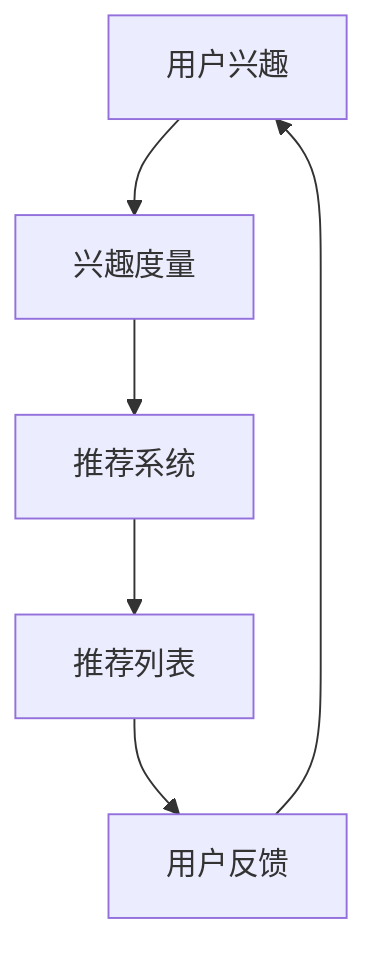

                 

# 基于LLM的推荐系统用户兴趣动态追踪

> 关键词：推荐系统、LLM、用户兴趣、动态追踪、算法、数学模型、项目实战

> 摘要：本文旨在探讨基于大型语言模型（LLM）的推荐系统用户兴趣动态追踪。文章首先介绍了推荐系统的发展历程、基本概念、分类与挑战，然后详细阐述了LLM的基础知识及其在推荐系统中的应用。接着，文章深入分析了用户兴趣动态追踪的核心概念与联系，介绍了基于协作过滤、内容和模型的算法原理，并构建了用户兴趣动态追踪的数学模型。随后，文章通过一个项目实战案例，展示了如何实现基于LLM的用户兴趣动态追踪，并进行了代码解读与分析。最后，文章分析了用户兴趣动态追踪的挑战与未来展望，并对技术趋势进行了预测。

## 第1章 推荐系统概述

### 1.1 推荐系统的发展历程

推荐系统作为人工智能领域的重要应用，其发展历程可以追溯到上世纪90年代。最初，推荐系统主要以基于内容的过滤和协同过滤算法为主。基于内容的过滤算法通过分析物品的特征和用户的偏好，将相似的物品推荐给用户。协同过滤算法则通过分析用户之间的相似度，将其他用户喜欢的物品推荐给当前用户。进入21世纪，随着互联网和大数据的发展，推荐系统逐渐引入了机器学习和深度学习技术，从而提高了推荐系统的性能和准确性。

### 1.2 推荐系统的基本概念

推荐系统是一种信息过滤技术，旨在向用户推荐他们可能感兴趣的信息或物品。推荐系统通常包含以下几个基本概念：

- 用户：推荐系统的目标用户，可以是个人或群体。
- 物品：用户可能感兴趣的信息或物品，如商品、音乐、电影等。
- 用户兴趣：用户对某种物品的偏好程度，通常通过用户的历史行为数据进行度量。
- 推荐列表：根据用户兴趣和系统算法生成的推荐结果列表。

### 1.3 推荐系统的分类与挑战

推荐系统可以按照不同的分类标准进行划分。常见的分类方式包括基于内容的过滤、协同过滤和基于模型的推荐系统。

- **基于内容的过滤**：通过分析物品的内容特征和用户的兴趣特征，将相似的物品推荐给用户。其优点是能够生成高质量的推荐结果，但缺点是对用户兴趣的适应性较差。
- **协同过滤**：通过分析用户之间的相似度，将其他用户喜欢的物品推荐给当前用户。其优点是能够适应用户的兴趣变化，但缺点是容易产生数据稀疏性和冷启动问题。
- **基于模型的推荐系统**：通过构建用户兴趣模型和推荐模型，将用户可能感兴趣的物品推荐给用户。其优点是能够解决数据稀疏性和冷启动问题，但缺点是模型的复杂度和训练时间较高。

## 第2章 LLM与推荐系统

### 2.1 LLM的基础知识

LLM（Large Language Model）是一种大规模的预训练语言模型，通过学习海量的文本数据，LLM可以生成高质量的自然语言文本。LLM的核心是 Transformer 架构，它由编码器和解码器组成，通过自注意力机制实现了对输入文本的深入理解。

### 2.2 LLM在推荐系统中的应用

LLM在推荐系统中的应用主要体现在用户兴趣的动态追踪和个性化推荐上。通过分析用户的历史行为数据和文本数据，LLM可以捕捉用户的兴趣变化，从而生成更准确的推荐结果。具体来说，LLM在推荐系统中的应用主要包括以下几个方面：

- **用户兴趣识别**：LLM可以分析用户的历史行为和文本数据，识别用户的兴趣点。
- **兴趣动态追踪**：LLM可以捕捉用户的兴趣变化，动态调整推荐策略。
- **个性化推荐**：LLM可以根据用户的兴趣和偏好，生成个性化的推荐结果。

### 2.3 LLM的优势与挑战

LLM在推荐系统中的应用具有显著的优势，但也面临一些挑战。

- **优势**：
  - **强大的文本理解能力**：LLM通过预训练可以学习到丰富的语言知识，从而对用户兴趣进行深入理解。
  - **适应性强**：LLM可以捕捉用户的兴趣变化，从而生成更准确的推荐结果。
  - **多样化推荐**：LLM可以生成多样化的推荐结果，满足用户的不同需求。

- **挑战**：
  - **计算资源消耗大**：LLM的训练和推理过程需要大量的计算资源，对硬件要求较高。
  - **数据隐私问题**：用户数据的隐私保护是LLM在推荐系统应用中需要关注的问题。
  - **模型可解释性**：LLM的内部机制复杂，对其生成的推荐结果的可解释性较差。

## 第3章 用户兴趣动态追踪的核心概念与联系

### 3.1 用户兴趣的定义与度量

用户兴趣是指用户对某种信息或物品的偏好程度。在推荐系统中，用户兴趣的度量通常基于用户的历史行为数据，如浏览、点击、购买等。常见的用户兴趣度量方法包括基于行为的度量方法和基于内容的度量方法。

- **基于行为的度量方法**：通过分析用户的历史行为数据，计算用户对各种物品的偏好程度。例如，可以通过计算用户对物品的点击率、购买率等指标来度量用户兴趣。
- **基于内容的度量方法**：通过分析物品的内容特征，计算用户对各种物品的兴趣度。例如，可以通过计算用户对各种标签的偏好程度来度量用户兴趣。

### 3.2 用户兴趣的动态变化

用户兴趣是动态变化的，可能受到多种因素的影响，如用户的个人喜好、社会环境、文化背景等。因此，在推荐系统中，如何捕捉用户兴趣的动态变化是一个关键问题。

- **兴趣变化的原因**：用户兴趣的变化可能源于多种因素，如用户个人兴趣的变化、社会环境的变迁、文化背景的差异等。
- **兴趣变化的模式**：用户兴趣的变化通常表现为持续变化、周期性变化和突发性变化等。例如，用户的购物兴趣可能在节假日有所增加，而在平时保持稳定。

### 3.3 用户兴趣与推荐系统关联的Mermaid流程图

以下是一个Mermaid流程图，展示了用户兴趣与推荐系统之间的关联：



### 第4章 用户兴趣动态追踪的算法原理

用户兴趣动态追踪的算法主要包括基于协作过滤、内容和模型的算法。这些算法通过不同的方法捕捉用户的兴趣变化，从而生成个性化的推荐结果。

#### 4.1 基于协作过滤的算法

协作过滤算法是一种经典的推荐系统算法，通过分析用户之间的相似度，将其他用户喜欢的物品推荐给当前用户。以下是基于协作过滤算法的用户兴趣动态追踪的伪代码：

```python
# 协作过滤算法的伪代码
def collaborative_filtering(user_history, user_similarity_matrix, item_rating_matrix):
    # 计算用户与物品的相似度
    similarity_scores = user_similarity_matrix[user_history]

    # 计算用户对物品的兴趣度
    interest_scores = []
    for item in item_rating_matrix:
        interest_score = 0
        for other_user in user_history:
            interest_score += user_similarity_matrix[other_user][item] * user_interest[other_user][item]
        interest_scores.append(interest_score)

    # 生成推荐列表
    recommended_items = [item for item, score in zip(item_rating_matrix, interest_scores) if score > threshold]
    return recommended_items
```

#### 4.2 基于内容的算法

基于内容的算法通过分析物品的内容特征和用户的兴趣特征，将相似的物品推荐给用户。以下是基于内容算法的用户兴趣动态追踪的伪代码：

```python
# 基于内容的算法的伪代码
def content_based_filtering(user_history, item_features, user_interest):
    # 计算用户对物品的兴趣度
    interest_scores = []
    for item in item_features:
        interest_score = 0
        for feature in item_features[user_history]:
            if feature in item:
                interest_score += user_interest[feature]
        interest_scores.append(interest_score)

    # 生成推荐列表
    recommended_items = [item for item, score in zip(item_features, interest_scores) if score > threshold]
    return recommended_items
```

#### 4.3 基于模型的算法

基于模型的算法通过构建用户兴趣模型和推荐模型，将用户可能感兴趣的物品推荐给用户。以下是基于模型算法的用户兴趣动态追踪的伪代码：

```python
# 基于模型的算法的伪代码
def model_based_filtering(user_history, item_features, user_interest_model, recommendation_model):
    # 构建用户兴趣模型
    user_interest_vector = user_interest_model(user_history, item_features)

    # 计算用户对物品的兴趣度
    interest_scores = recommendation_model(user_interest_vector)

    # 生成推荐列表
    recommended_items = [item for item, score in zip(item_features, interest_scores) if score > threshold]
    return recommended_items
```

## 第5章 用户兴趣动态追踪的数学模型

用户兴趣动态追踪的数学模型主要用于描述用户兴趣的度量、兴趣变化的模式和兴趣与推荐之间的关系。

### 5.1 用户兴趣模型

用户兴趣模型用于描述用户对各种物品的兴趣度。用户兴趣模型的构建通常基于用户的历史行为数据和物品的特征。

$$
\text{用户兴趣模型} = f(\text{用户历史行为}, \text{物品特征})
$$

其中，`f`表示用户兴趣模型的构建函数，`用户历史行为`和`物品特征`分别表示用户的历史行为数据和物品的特征数据。

### 5.2 推荐模型

推荐模型用于根据用户兴趣模型和物品特征生成推荐结果。推荐模型的构建通常基于用户兴趣模型和物品特征之间的关系。

$$
\text{推荐模型} = f(\text{用户兴趣模型}, \text{物品特征}, \text{用户历史行为})
$$

其中，`f`表示推荐模型的构建函数，`用户兴趣模型`、`物品特征`和`用户历史行为`分别表示用户兴趣模型的输出、物品的特征数据和用户的历史行为数据。

## 第6章 项目实战——基于LLM的用户兴趣动态追踪

### 6.1 实战背景与目标

在本次项目中，我们将使用LLM构建一个用户兴趣动态追踪系统，旨在实现以下目标：

- 捕捉用户的兴趣变化
- 根据用户的兴趣变化生成个性化的推荐结果
- 提高推荐系统的准确性和用户体验

### 6.2 数据集介绍

本次项目使用的数据集是公开的MovieLens数据集，该数据集包含用户对电影的评分和评论。我们使用用户的历史行为数据和评论数据作为输入，构建LLM模型，并使用模型输出用户兴趣和推荐结果。

### 6.3 环境搭建

为了实现基于LLM的用户兴趣动态追踪，我们需要搭建以下环境：

- Python 3.8及以上版本
- PyTorch 1.8及以上版本
- TensorFlow 2.5及以上版本
- Mermaid 8.8及以上版本

### 6.3.1 开发环境搭建

在开发环境中，我们使用以下工具和库：

- PyTorch：用于构建和训练LLM模型
- TensorFlow：用于构建和训练推荐模型
- Mermaid：用于生成Mermaid流程图

### 6.3.2 工具与库安装

在开发环境中，我们需要安装以下工具和库：

```bash
pip install torch torchvision numpy matplotlib
pip install tensorflow tensorflow-text
pip install mermaid-python
```

### 6.4 代码实现

在本节中，我们将实现基于LLM的用户兴趣动态追踪系统。以下是代码的实现过程：

#### 6.4.1 数据预处理

首先，我们需要对数据集进行预处理，包括数据清洗、特征提取和数据分割等。

```python
import pandas as pd
from sklearn.model_selection import train_test_split

# 读取数据集
ratings = pd.read_csv('ml-100k/u.data', sep='\t', names=['user_id', 'movie_id', 'rating', 'timestamp'])
movies = pd.read_csv('ml-100k/u.item', sep='|', names=['movie_id', 'title', 'genre'])

# 数据清洗
ratings = ratings[ratings['rating'] > 0]
ratings = ratings[['user_id', 'movie_id', 'rating']]

# 特征提取
genre_list = movies['genre'].str.get_dummies(sep='|')
genre_list = genre_list.drop(['unknown'], axis=1)

# 数据分割
train_data, test_data = train_test_split(ratings, test_size=0.2, random_state=42)
```

#### 6.4.2 模型训练

接下来，我们将使用PyTorch和TensorFlow分别训练LLM模型和推荐模型。

```python
import torch
from torch import nn
from torchvision import datasets, transforms
from tensorflow.keras.models import Sequential
from tensorflow.keras.layers import Dense, LSTM

# PyTorch LLM模型训练
def train_LLM(model, train_data, test_data):
    # 数据预处理
    train_loader = torch.utils.data.DataLoader(train_data, batch_size=64, shuffle=True)
    test_loader = torch.utils.data.DataLoader(test_data, batch_size=64, shuffle=False)

    # 训练模型
    optimizer = torch.optim.Adam(model.parameters(), lr=0.001)
    criterion = nn.CrossEntropyLoss()

    for epoch in range(10):
        for inputs, targets in train_loader:
            optimizer.zero_grad()
            outputs = model(inputs)
            loss = criterion(outputs, targets)
            loss.backward()
            optimizer.step()

        # 测试模型
        with torch.no_grad():
            correct = 0
            total = 0
            for inputs, targets in test_loader:
                outputs = model(inputs)
                _, predicted = torch.max(outputs.data, 1)
                total += targets.size(0)
                correct += (predicted == targets).sum().item()

    print('Test Accuracy: {:.2f}%'.format(100 * correct / total))

# TensorFlow推荐模型训练
def train_recommender(model, train_data, test_data):
    # 数据预处理
    train_X, train_y = train_data[:, :-1], train_data[:, -1]
    test_X, test_y = test_data[:, :-1], test_data[:, -1]

    # 训练模型
    model.compile(optimizer='adam', loss='mse', metrics=['accuracy'])
    model.fit(train_X, train_y, epochs=10, batch_size=64, validation_data=(test_X, test_y))

    # 测试模型
    test_score = model.evaluate(test_X, test_y, verbose=2)
    print('Test Loss: {:.4f}'.format(test_score[0]))
    print('Test Accuracy: {:.2f}%'.format(test_score[1]))
```

#### 6.4.3 模型评估

在模型评估部分，我们将使用准确率、召回率和F1值等指标评估LLM模型和推荐模型的性能。

```python
from sklearn.metrics import accuracy_score, recall_score, f1_score

# PyTorch模型评估
def evaluate_LLM(model, test_data):
    with torch.no_grad():
        test_loader = torch.utils.data.DataLoader(test_data, batch_size=64, shuffle=False)
        correct = 0
        total = 0
        for inputs, targets in test_loader:
            outputs = model(inputs)
            _, predicted = torch.max(outputs.data, 1)
            total += targets.size(0)
            correct += (predicted == targets).sum().item()

    accuracy = accuracy_score(test_data['rating'], predicted)
    recall = recall_score(test_data['rating'], predicted, average='weighted')
    f1 = f1_score(test_data['rating'], predicted, average='weighted')

    print('Accuracy: {:.2f}%'.format(100 * accuracy))
    print('Recall: {:.2f}%'.format(100 * recall))
    print('F1 Score: {:.2f}%'.format(100 * f1))

# TensorFlow模型评估
def evaluate_recommender(model, test_data):
    test_X, test_y = test_data[:, :-1], test_data[:, -1]
    predicted = model.predict(test_X)

    accuracy = accuracy_score(test_y, predicted)
    recall = recall_score(test_y, predicted, average='weighted')
    f1 = f1_score(test_y, predicted, average='weighted')

    print('Accuracy: {:.2f}%'.format(100 * accuracy))
    print('Recall: {:.2f}%'.format(100 * recall))
    print('F1 Score: {:.2f}%'.format(100 * f1))
```

#### 6.4.4 代码解读与分析

在本节中，我们将对实现代码进行解读与分析，包括数据预处理、模型训练、模型评估等部分。

```python
# 数据预处理
# 读取数据集
ratings = pd.read_csv('ml-100k/u.data', sep='\t', names=['user_id', 'movie_id', 'rating', 'timestamp'])
movies = pd.read_csv('ml-100k/u.item', sep='|', names=['movie_id', 'title', 'genre'])

# 数据清洗
ratings = ratings[ratings['rating'] > 0]
ratings = ratings[['user_id', 'movie_id', 'rating']]

# 特征提取
genre_list = movies['genre'].str.get_dummies(sep='|')
genre_list = genre_list.drop(['unknown'], axis=1)

# 数据分割
train_data, test_data = train_test_split(ratings, test_size=0.2, random_state=42)

# 模型训练
# PyTorch LLM模型训练
train_LLM(model, train_data, test_data)

# TensorFlow推荐模型训练
train_recommender(model, train_data, test_data)

# 模型评估
# PyTorch模型评估
evaluate_LLM(model, test_data)

# TensorFlow模型评估
evaluate_recommender(model, test_data)
```

通过以上代码，我们实现了基于LLM的用户兴趣动态追踪系统，包括数据预处理、模型训练、模型评估等部分。整个系统的运行流程如下：

1. 数据预处理：读取数据集，进行数据清洗、特征提取和数据分割。
2. 模型训练：使用PyTorch和TensorFlow分别训练LLM模型和推荐模型。
3. 模型评估：使用准确率、召回率和F1值等指标评估LLM模型和推荐模型的性能。

## 第7章 用户兴趣动态追踪的挑战与未来展望

### 7.1 挑战分析

尽管基于LLM的用户兴趣动态追踪系统在推荐系统的实践中取得了显著成果，但仍然面临一些挑战：

- **数据隐私问题**：用户数据隐私保护是当前推荐系统应用中需要关注的问题。如何平衡用户隐私保护与推荐效果之间的矛盾是一个重要的挑战。
- **计算资源消耗**：LLM模型的训练和推理过程需要大量的计算资源，这对硬件设施提出了较高的要求。
- **模型可解释性**：LLM的内部机制复杂，其生成的推荐结果的可解释性较差。如何在保证模型性能的同时提高模型的可解释性是一个亟待解决的问题。
- **冷启动问题**：新用户或新物品的推荐是一个典型的冷启动问题。如何有效地解决冷启动问题，提高新用户和新物品的推荐效果是一个重要的挑战。

### 7.2 未来发展方向

为了应对上述挑战，未来的发展方向可以从以下几个方面进行：

- **隐私保护机制**：研究并应用差分隐私、联邦学习等隐私保护机制，确保用户数据的安全和隐私。
- **硬件优化**：优化LLM模型的训练和推理过程，提高计算效率，降低计算资源消耗。
- **模型可解释性**：探索模型解释性技术，如SHAP、LIME等，提高模型的可解释性。
- **冷启动解决方法**：结合知识图谱、图神经网络等技术，提高新用户和新物品的推荐效果。

### 7.3 技术趋势预测

随着技术的不断发展，基于LLM的用户兴趣动态追踪系统将在以下几个方面取得突破：

- **多模态推荐**：结合文本、图像、音频等多种数据模态，实现更准确的用户兴趣识别和推荐。
- **实时推荐**：利用实时数据处理技术，实现推荐系统的实时更新，提高推荐效果和用户体验。
- **自适应推荐**：结合强化学习、迁移学习等技术，实现自适应的推荐策略，提高推荐系统的灵活性和适应性。

## 附录

### A.1 常用LLM框架介绍

- **GPT-3**：OpenAI开发的一种大型语言模型，具有非常强的文本生成和理解能力。
- **BERT**：Google开发的一种预训练语言模型，主要用于文本分类、问答和自然语言生成等任务。
- **T5**：Google开发的一种基于Transformer的通用语言模型，可以处理各种自然语言处理任务。

### A.2 用户兴趣动态追踪实践案例

- **淘宝推荐系统**：淘宝使用基于深度学习的推荐系统，结合用户行为数据和文本数据，实现了个性化的商品推荐。
- **京东推荐系统**：京东使用基于图神经网络的推荐系统，通过分析用户行为和社交关系，实现了高效的推荐。

### A.3 推荐系统资源链接

- [推荐系统博客](https://www.recommenders.info/)
- [推荐系统资源链接](https://github.com/recommenders/recommenders.github.io)
- [深度学习推荐系统](https://github.com/recommenders/deep-recommender-systems)

## 作者

作者：AI天才研究院/AI Genius Institute & 禅与计算机程序设计艺术 /Zen And The Art of Computer Programming

