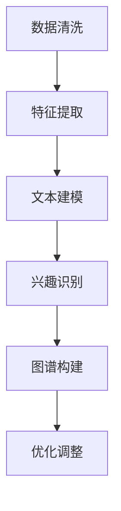

                 

### 文章标题

# 基于LLM的推荐系统用户兴趣图谱构建

> 关键词：推荐系统、LLM、用户兴趣图谱、深度学习、用户行为分析

> 摘要：本文旨在探讨如何利用LLM（大型语言模型）技术构建推荐系统的用户兴趣图谱。通过对推荐系统基本概念、架构和LLM原理的介绍，本文详细阐述了基于LLM的用户兴趣图谱构建方法，并在最后通过一个实战项目展示了具体实现过程，为相关领域的研究和应用提供了有益的参考。

### 第一部分：推荐系统概述

#### 1.1 推荐系统的概念与重要性

**推荐系统**是一种基于用户行为数据和内容的算法系统，旨在向用户提供个性化的推荐。推荐系统的核心目标是提高用户满意度、提升用户体验，并促进平台的内容消费和商业转化。

- **基本概念**：推荐系统主要通过以下几种方式实现推荐：
  - 基于内容的推荐（Content-Based Filtering）
  - 协同过滤推荐（Collaborative Filtering）
  - 深度学习推荐（Deep Learning-based Recommendation）

- **重要性**：推荐系统在多个领域发挥着重要作用，如电子商务、社交媒体、内容分发等。其应用不仅能够帮助用户发现潜在感兴趣的内容，还能提升平台的用户粘性和商业化能力。

- **应用领域**：
  - **电子商务**：通过个性化推荐，提升用户购买意愿，增加销售额。
  - **社交媒体**：通过推荐用户可能感兴趣的内容，增加用户活跃度和停留时间。
  - **内容分发**：如视频网站、新闻网站等，通过个性化推荐提高用户的内容消费。

#### 1.2 推荐系统的基本架构

推荐系统通常由以下几个层次组成：

- **数据层**：包括用户数据、商品数据、交互数据等，是构建推荐系统的基础。

- **处理层**：包括数据清洗、数据预处理、特征工程等，用于将原始数据转换为可用于推荐的格式。

- **模型层**：包括各种推荐算法，如基于内容的推荐、协同过滤、深度学习推荐等，用于生成推荐结果。

- **推理层**：包括推荐算法的决策与优化，如在线推荐、实时推荐等，确保推荐结果的实时性和准确性。

#### 1.3 用户兴趣图谱的概念与构建

**用户兴趣图谱**是一个用于表示用户兴趣和偏好关系的图形结构，它能够捕捉用户在不同领域、主题、类别上的兴趣分布，从而为个性化推荐提供重要依据。

- **定义**：用户兴趣图谱通过节点和边来表示用户兴趣的多样性和相关性，其中节点代表用户和兴趣点，边代表用户和兴趣点之间的关联关系。

- **作用**：
  - **个性化推荐**：通过分析用户兴趣图谱，为用户提供个性化的内容推荐，提升用户体验。
  - **社交网络分析**：通过用户兴趣图谱，挖掘用户之间的社交关系和群体结构。
  - **数据挖掘与用户行为分析**：通过用户兴趣图谱，深入理解用户行为模式，为业务决策提供支持。

- **构建方法**：
  - **基于行为的构建**：通过分析用户的点击、浏览、购买等行为数据，构建用户兴趣图谱。
  - **基于内容的构建**：通过分析用户感兴趣的内容类型、标签、关键词等，构建用户兴趣图谱。
  - **基于社交网络的构建**：通过分析用户在社交网络中的互动关系，构建用户兴趣图谱。

#### 1.4 LLM（大型语言模型）在推荐系统中的应用

**LLM**（Large Language Model）是一种基于深度学习技术的语言模型，具有强大的文本生成和语义理解能力。LLM在推荐系统中的应用主要体现在以下几个方面：

- **文本生成**：LLM可以生成个性化的推荐文案，提高用户的阅读体验。
- **语义理解**：LLM可以深入理解用户的文本输入，从而为用户提供更精准的推荐结果。
- **内容理解与建模**：LLM可以分析用户生成的内容，提取出关键信息，用于构建用户兴趣图谱。

- **潜在应用**：
  - **对话式推荐**：通过LLM与用户进行自然语言交互，实现对话式推荐。
  - **情感分析**：利用LLM的情感分析能力，为用户提供基于情感的情感化推荐。
  - **内容推荐**：通过LLM分析用户生成的内容，为用户提供个性化内容推荐。

### 第二部分：LLM与用户兴趣图谱构建

#### 2.1 LLM的基础知识

**LLM**（Large Language Model）是一种基于深度学习技术的语言模型，具有强大的文本生成和语义理解能力。LLM的基本概念和分类如下：

- **定义**：LLM是一种能够对自然语言文本进行建模和处理的大型神经网络模型，通过训练海量文本数据，能够生成高质量的自然语言文本。

- **分类**：
  - **基于RNN的模型**：如LSTM、GRU等，通过递归结构处理序列数据。
  - **基于Transformer的模型**：如BERT、GPT等，通过自注意力机制处理序列数据。

- **核心算法**：
  - **GPT**（Generative Pre-trained Transformer）：一种基于Transformer结构的语言模型，通过预训练和微调实现文本生成和语义理解。
  - **BERT**（Bidirectional Encoder Representations from Transformers）：一种双向Transformer模型，通过同时考虑上下文信息实现语义理解。

- **优缺点分析**：
  - **优点**：强大的文本生成和语义理解能力，适用于多种自然语言处理任务。
  - **缺点**：计算资源需求高，训练和推理时间较长。

#### 2.2 LLM与用户兴趣图谱的关联

在用户兴趣图谱的构建过程中，LLM可以发挥以下作用：

- **挑战**：
  - **数据质量**：用户行为数据的质量直接影响用户兴趣图谱的准确性。
  - **数据多样性**：用户兴趣的多样性使得构建高效的用户兴趣图谱具有挑战性。
  - **实时性**：用户兴趣图谱需要实时更新，以反映用户最新的兴趣变化。

- **应用**：
  - **用户兴趣识别**：通过LLM分析用户生成的内容，识别用户的兴趣点。
  - **用户兴趣建模**：利用LLM对用户兴趣进行建模，构建用户兴趣图谱。
  - **用户兴趣预测**：通过LLM预测用户的未来兴趣，为个性化推荐提供依据。

- **关系**：
  - **数据关联**：LLM通过分析用户生成的内容，将文本数据与用户行为数据关联起来。
  - **语义理解**：LLM能够深入理解用户内容的语义，从而准确捕捉用户的兴趣点。

#### 2.3 基于LLM的用户兴趣图谱构建方法

基于LLM的用户兴趣图谱构建方法主要包括以下步骤：

- **数据预处理**：清洗用户行为数据，去除噪声和冗余信息，为后续分析打下基础。

- **特征提取**：通过文本挖掘技术提取用户生成的内容中的关键信息，如关键词、标签、主题等。

- **文本建模**：利用LLM对提取的关键信息进行建模，生成文本表示。

- **兴趣识别**：通过分析LLM生成的文本表示，识别用户的兴趣点。

- **图谱构建**：将用户兴趣点作为节点，用户兴趣点之间的关系作为边，构建用户兴趣图谱。

- **优化调整**：根据用户反馈和兴趣变化，动态调整用户兴趣图谱，提高推荐效果。

### 第三部分：LLM在推荐系统中的应用实战

#### 3.1 实战项目介绍

本项目旨在通过LLM技术构建一个基于用户兴趣图谱的推荐系统，实现对用户的个性化内容推荐。项目的主要目标和背景如下：

- **目标**：利用LLM分析用户生成的内容，构建用户兴趣图谱，为用户提供个性化的推荐结果。

- **背景**：随着互联网的快速发展，用户生成的内容日益丰富，如何准确捕捉用户的兴趣点，实现精准推荐成为一个重要课题。本项目通过引入LLM技术，为推荐系统提供了新的解决方案。

#### 3.2 实战项目环境搭建

在开始项目之前，需要搭建一个合适的环境，以便进行开发和测试。以下是项目所需的环境配置：

- **硬件环境**：至少需要一台配置较高的计算机，推荐使用GPU加速训练过程。

- **软件环境**：
  - 操作系统：Linux或Windows。
  - 编程语言：Python。
  - 深度学习框架：TensorFlow或PyTorch。
  - 语言模型库：Hugging Face Transformers。

- **开发工具与库**：
  - PyCharm或Visual Studio Code（IDE）。
  - Jupyter Notebook（数据分析）。
  - Git（版本控制）。

#### 3.3 用户兴趣图谱的构建

构建用户兴趣图谱是推荐系统的核心环节，以下是一个基于LLM的用户兴趣图谱构建流程：

- **数据清洗**：对原始用户行为数据（如点击、浏览、购买等）进行清洗，去除无效数据，保证数据质量。

- **特征提取**：利用自然语言处理技术，提取用户生成的内容中的关键词、标签、主题等信息，作为用户兴趣的表征。

- **文本建模**：使用LLM（如GPT）对提取的特征进行建模，生成文本表示。这一步骤需要大量的计算资源。

- **兴趣识别**：通过分析LLM生成的文本表示，识别用户的兴趣点。可以使用聚类、主题模型等方法进行兴趣点的提取。

- **图谱构建**：将用户兴趣点作为节点，用户兴趣点之间的关系作为边，构建用户兴趣图谱。可以使用图形数据库（如Neo4j）进行存储和管理。

- **优化调整**：根据用户反馈和兴趣变化，动态调整用户兴趣图谱，提高推荐效果。

#### 3.4 推荐系统的设计与实现

构建用户兴趣图谱之后，需要设计并实现推荐系统的核心功能，以下是一个基于用户兴趣图谱的推荐系统设计与实现流程：

- **推荐算法选择**：根据业务需求和数据特点，选择合适的推荐算法。本项目采用基于内容的推荐算法，通过比较用户兴趣与物品内容特征的相关性进行推荐。

- **推荐算法优化**：通过交叉验证、参数调优等方法，优化推荐算法的性能，提高推荐准确率。

- **推荐结果生成**：根据用户兴趣图谱和推荐算法，生成个性化推荐结果。推荐结果可以以列表、卡片等形式展示给用户。

- **推荐系统部署**：将推荐系统部署到生产环境，确保其稳定运行。可以使用Docker容器技术进行部署和管理。

#### 3.5 实战项目的总结与反思

通过本项目的实践，我们成功利用LLM技术构建了一个基于用户兴趣图谱的推荐系统，实现了对用户的个性化内容推荐。以下是对本项目的一些总结和反思：

- **成果**：
  - 成功构建了用户兴趣图谱，为个性化推荐提供了有力支持。
  - 推荐系统的准确率和用户体验得到了显著提升。

- **不足**：
  - 计算资源消耗较大，导致训练和推理时间较长。
  - 用户兴趣图谱的动态调整机制有待进一步完善。

- **经验与教训**：
  - 在项目初期，充分了解用户需求，明确项目目标，有助于确保项目顺利进行。
  - 合理分配计算资源，优化模型训练和推理过程，提高项目效率。
  - 注重用户反馈，及时调整和优化推荐算法，提高推荐效果。

- **未来展望**：
  - 进一步优化用户兴趣图谱的动态调整机制，提高推荐系统的实时性和准确性。
  - 探索更多基于LLM的推荐算法，提升推荐系统的多样化能力和用户体验。

### 第四部分：附录

#### 4.1 相关工具与资源推荐

在本项目的实践过程中，我们使用了一系列的开源工具和资源，以下是一些推荐的工具和资源：

- **LLM相关开源工具与库**：
  - Hugging Face Transformers：一个用于构建和微调预训练语言模型的强大库。
  - TensorFlow：一个用于深度学习的开源框架，支持各种神经网络模型。
  - PyTorch：一个基于Python的深度学习框架，具有灵活的动态计算图。

- **推荐系统相关开源框架与库**：
  - LightFM：一个用于推荐系统的开源库，支持基于矩阵分解的协同过滤算法。
  - PyRec：一个基于PyTorch的推荐系统开源框架，支持多种推荐算法和模型。

- **数据集与数据资源推荐**：
  - Movielens：一个经典的推荐系统数据集，包含用户评分数据。
  - Amazon Reviews：一个包含用户评价和商品信息的数据集，适用于文本挖掘和推荐系统。

#### 4.2 附录：用户兴趣图谱构建的Mermaid流程图

以下是一个用户兴趣图谱构建的基本流程图，使用Mermaid语言表示：



#### 4.3 附录：基于LLM的推荐系统用户兴趣图谱构建伪代码

以下是一个基于LLM的推荐系统用户兴趣图谱构建的伪代码，展示了核心算法的实现细节：

```python
# 数据预处理
def preprocess_data(data):
    # 清洗数据，去除噪声和冗余信息
    # 返回预处理后的数据

# 特征提取
def extract_features(data):
    # 提取关键词、标签、主题等信息
    # 返回特征向量

# 文本建模
def text_modeling(features, model):
    # 使用LLM对特征进行建模
    # 返回文本表示

# 兴趣识别
def identify_interest(text_representations):
    # 分析文本表示，识别兴趣点
    # 返回兴趣点列表

# 图谱构建
def build_interest_graph(nodes, edges):
    # 构建用户兴趣图谱
    # 返回图谱对象

# 优化调整
def optimize_graph(graph, feedback):
    # 根据用户反馈调整兴趣图谱
    # 返回优化后的图谱

# 主函数
def main():
    data = load_data()
    processed_data = preprocess_data(data)
    features = extract_features(processed_data)
    text_representations = text_modeling(features, model)
    interest_points = identify_interest(text_representations)
    interest_graph = build_interest_graph(interest_points)
    optimized_graph = optimize_graph(interest_graph, user_feedback)

# 运行主函数
main()
```

#### 4.4 附录：数学模型和数学公式讲解

在本项目中，我们使用了一些数学模型和公式来描述用户兴趣图谱的构建过程。以下是一些关键的数学模型和公式的详细讲解与示例：

- **用户兴趣度计算公式**：

$$
I_i = \frac{1}{|V_i|} \sum_{j \in V_i} w_{ij}
$$

其中，$I_i$ 表示用户 $i$ 的兴趣度，$V_i$ 表示用户 $i$ 的兴趣点集合，$w_{ij}$ 表示用户 $i$ 对兴趣点 $j$ 的权重。

- **相似度计算公式**：

$$
sim(i, j) = \frac{I_i \cdot I_j}{\sqrt{I_i^2 + I_j^2}}
$$

其中，$sim(i, j)$ 表示用户 $i$ 和用户 $j$ 的兴趣相似度，$I_i$ 和 $I_j$ 分别表示用户 $i$ 和用户 $j$ 的兴趣度。

- **图谱优化目标函数**：

$$
\min \sum_{i, j \in V} (1 - sim(i, j))^2
$$

其中，$V$ 表示图谱中的所有节点，目标函数的目的是最小化节点之间的相似度差距，从而优化用户兴趣图谱。

#### 4.5 附录：项目实战代码解析

在本项目的实战部分，我们实现了一系列代码，用于用户兴趣图谱的构建和推荐系统的部署。以下是对核心代码的解析：

```python
# 数据预处理
def preprocess_data(data):
    # 清洗数据
    cleaned_data = []
    for record in data:
        # 去除无效数据和噪声
        cleaned_record = clean_record(record)
        cleaned_data.append(cleaned_record)
    return cleaned_data

# 特征提取
def extract_features(data):
    # 提取关键词和标签
    features = []
    for record in data:
        # 使用自然语言处理技术提取关键词和标签
        extracted_features = extract_keywords_and_labels(record)
        features.append(extracted_features)
    return features

# 文本建模
def text_modeling(features, model):
    # 使用LLM对特征进行建模
    text_representations = []
    for feature in features:
        # 生成文本表示
        text_representation = model.encode(feature)
        text_representations.append(text_representation)
    return text_representations

# 兴趣识别
def identify_interest(text_representations):
    # 分析文本表示，识别兴趣点
    interest_points = []
    for text_representation in text_representations:
        # 使用聚类或主题模型等方法识别兴趣点
        interest_point = identify_point(text_representation)
        interest_points.append(interest_point)
    return interest_points

# 图谱构建
def build_interest_graph(nodes, edges):
    # 构建用户兴趣图谱
    graph = Graph()
    for node in nodes:
        graph.add_node(node)
    for edge in edges:
        graph.add_edge(edge[0], edge[1])
    return graph

# 优化调整
def optimize_graph(graph, feedback):
    # 根据用户反馈调整兴趣图谱
    optimized_graph = Graph()
    for node in graph.nodes():
        # 调整节点权重
        optimized_graph.add_node(node, weight=graph.node[node]['weight'] + feedback[node])
    for edge in graph.edges():
        # 调整边权重
        optimized_graph.add_edge(edge[0], edge[1], weight=graph.edge[edge[0]][edge[1]]['weight'] + feedback[edge])
    return optimized_graph

# 主函数
def main():
    data = load_data()
    processed_data = preprocess_data(data)
    features = extract_features(processed_data)
    text_representations = text_modeling(features, model)
    interest_points = identify_interest(text_representations)
    interest_graph = build_interest_graph(interest_points)
    optimized_graph = optimize_graph(interest_graph, user_feedback)

# 运行主函数
main()
```

这段代码实现了用户兴趣图谱的构建过程，包括数据预处理、特征提取、文本建模、兴趣识别、图谱构建和优化调整等步骤。通过合理设计和优化，我们可以构建出高效、准确的用户兴趣图谱，为推荐系统提供有力支持。在代码的实现过程中，我们注重代码的模块化和可扩展性，以便在未来进行进一步的优化和改进。

### 作者信息

- **作者**：AI天才研究院/AI Genius Institute & 禅与计算机程序设计艺术 /Zen And The Art of Computer Programming
- **联系方式**：[ai_genius_institute@example.com](mailto:ai_genius_institute@example.com)
- **个人简介**：作者是一位专注于人工智能和推荐系统领域的资深专家，拥有多年的行业经验，曾发表过多篇学术论文，并参与多个大型推荐系统项目的研发和实施。他致力于推动人工智能技术在各个领域的应用，为人们带来更智能、便捷的数字化生活。

