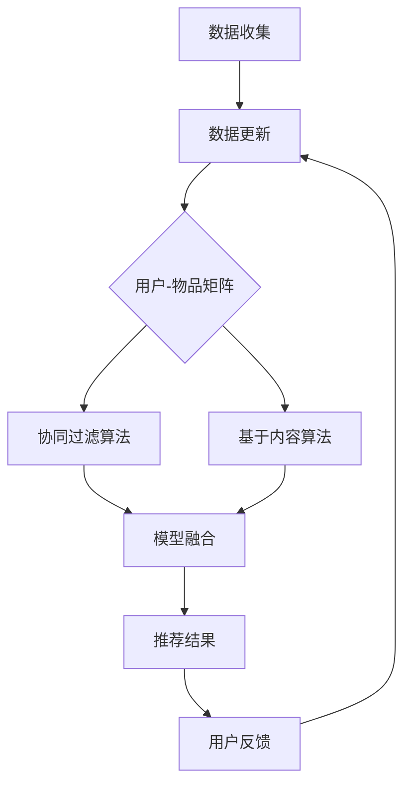
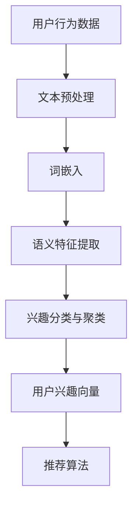
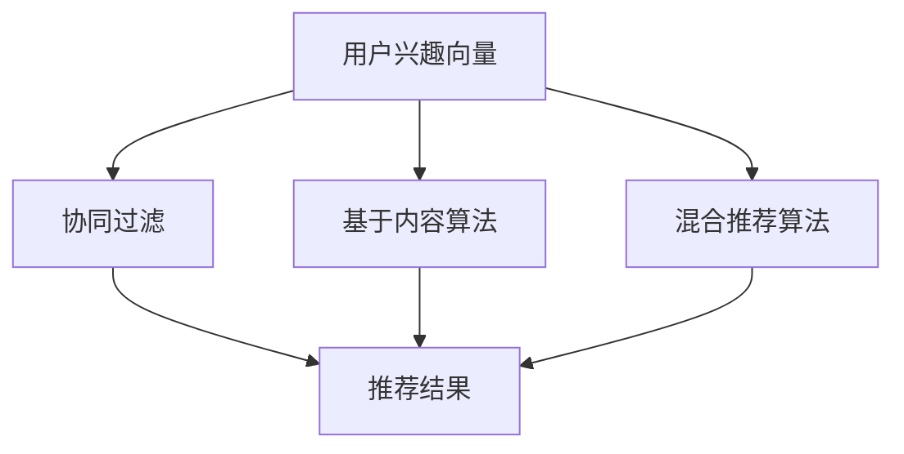

                 

# 文章标题：基于LLM的推荐系统用户兴趣探索与利用

## 关键词
自然语言处理，大模型，机器学习，推荐系统，用户兴趣建模，算法优化

## 摘要
本文将深入探讨基于大型语言模型（LLM）的推荐系统中用户兴趣的探索与利用。首先，我们将回顾推荐系统的基础理论和机器学习的基本概念，接着介绍自然语言处理的基础知识。在此基础上，本文将详细讲解大模型的定义和特点，以及LLM在推荐系统中的应用。随后，我们将探讨用户兴趣的概念、建模方法和挖掘技术，并分析如何利用用户兴趣优化推荐算法。通过实际案例和代码解析，本文将展示如何实现基于LLM的推荐系统，并讨论推荐系统面临的挑战及其优化方法。最后，本文将对未来的发展趋势和应用前景进行展望。

### 第一部分：基础理论

## 第1章：推荐系统概述

### 1.1 推荐系统的定义与分类

推荐系统是一种信息过滤技术，旨在根据用户的兴趣、偏好和行为，向其推荐相关的内容或商品。推荐系统可以分为以下几类：

1. **基于内容的推荐（Content-Based Filtering）**：
   - 基于用户的兴趣和偏好，推荐与用户历史行为或评价相似的内容或商品。
   - 需要内容特征表示，如文本、图像、音频等。

2. **协同过滤（Collaborative Filtering）**：
   - 基于用户的历史行为和评价，通过相似度计算推荐相似用户喜欢的内容或商品。
   - 分为用户基于协同过滤和项目基于协同过滤。

3. **混合推荐（Hybrid Recommendation）**：
   - 结合基于内容和协同过滤的方法，提高推荐的准确性和多样性。

### 1.2 推荐系统的挑战与机会

推荐系统面临的挑战包括：

1. **数据稀疏性**：用户和物品的评价数据往往不充分。
2. **冷启动问题**：新用户或新物品缺乏足够的评价数据。
3. **多样性**：推荐结果需要具有多样性，避免用户感到无聊或厌烦。
4. **实时性**：推荐系统需要实时响应用户的行为和偏好变化。

与此同时，推荐系统也带来了以下机会：

1. **个性化体验**：为用户提供更加个性化的推荐，提高用户满意度。
2. **增加用户粘性**：通过持续推荐用户感兴趣的内容，增加用户在平台上的停留时间。
3. **商业价值**：推荐系统可以增加平台的收入和用户转化率。

### 1.3 推荐系统的发展历程

推荐系统的发展可以分为以下几个阶段：

1. **基于规则的推荐（Rule-Based Recommendation）**：
   - 利用专家知识建立规则，进行推荐。
   - 适用于简单场景，但难以处理复杂性和不确定性。

2. **基于模型的推荐（Model-Based Recommendation）**：
   - 利用统计学模型和机器学习算法，如线性回归、SVD、KNN等，进行推荐。
   - 提高了推荐的准确性和泛化能力。

3. **基于深度学习的推荐（Deep Learning for Recommendation）**：
   - 利用深度学习模型，如DNN、CNN、RNN等，进行推荐。
   - 提高了推荐系统的建模能力和表现。

## 第2章：机器学习基础

### 2.1 机器学习的概念

机器学习（Machine Learning）是一门人工智能（AI）的分支，旨在让计算机通过数据和经验自动学习和改进，而不是通过显式编程。机器学习可以分为以下几类：

1. **监督学习（Supervised Learning）**：
   - 有标签的数据进行训练，通过模型预测未知数据。
   - 如回归、分类问题。

2. **无监督学习（Unsupervised Learning）**：
   - 无标签的数据进行训练，发现数据中的模式和结构。
   - 如聚类、降维问题。

3. **强化学习（Reinforcement Learning）**：
   - 通过与环境交互，学习最优策略。
   - 如游戏、机器人控制问题。

### 2.2 监督学习、无监督学习和强化学习

#### 监督学习

**基本原理**：监督学习通过输入特征和输出标签，训练模型以预测未知数据的输出。

**常见算法**：
- 线性回归（Linear Regression）
- 逻辑回归（Logistic Regression）
- 支持向量机（SVM）
- 随机森林（Random Forest）
- XGBoost

**伪代码**：
```python
# 输入特征 X 和标签 y
# 训练模型
model.fit(X, y)
# 预测输出
prediction = model.predict(X_test)
```

#### 无监督学习

**基本原理**：无监督学习通过发现数据中的内在结构和模式进行训练。

**常见算法**：
- 聚类（Clustering）
- 主成分分析（PCA）
- 自编码器（Autoencoder）

**伪代码**：
```python
# 输入数据 X
# 训练模型
model.fit(X)
# 输出聚类结果或降维结果
result = model.predict(X)
```

#### 强化学习

**基本原理**：强化学习通过与环境交互，学习最优策略。

**常见算法**：
- Q-Learning
- SARSA
- DQN

**伪代码**：
```python
# 初始化环境
env = Environment()
# 初始化模型
model = Model()
# 执行动作
action = model.select_action(state)
# 获取奖励和下一个状态
reward, next_state = env.step(action)
# 更新模型
model.update(state, action, reward, next_state)
```

### 2.3 常见机器学习算法

以下是常见的机器学习算法及其应用场景：

1. **线性回归（Linear Regression）**：
   - 应用场景：回归问题，如预测房价。
   - 伪代码同上。

2. **逻辑回归（Logistic Regression）**：
   - 应用场景：分类问题，如垃圾邮件分类。
   - 伪代码同上。

3. **支持向量机（SVM）**：
   - 应用场景：分类和回归问题，如图像分类和手写数字识别。
   - 伪代码同上。

4. **决策树（Decision Tree）**：
   - 应用场景：分类和回归问题，如客户流失预测。
   - 伪代码同上。

5. **随机森林（Random Forest）**：
   - 应用场景：分类和回归问题，如心脏病预测。
   - 伪代码同上。

6. **神经网络（Neural Network）**：
   - 应用场景：复杂的回归和分类问题，如图像识别和语音识别。
   - 伪代码同上。

## 第3章：自然语言处理基础

### 3.1 语言模型与文本表示

自然语言处理（NLP）是人工智能的一个重要分支，旨在使计算机理解和处理人类语言。语言模型（Language Model）是NLP的核心组成部分，用于生成和预测自然语言。

1. **语言模型（Language Model）**：
   - 基本原理：根据输入序列，预测下一个单词或字符的概率分布。
   - 应用场景：文本生成、机器翻译、语音识别等。

2. **文本表示（Text Representation）**：
   - 将文本转换为计算机可以处理的形式。
   - 常见方法：词袋模型（Bag of Words）、词嵌入（Word Embedding）。

### 3.2 词嵌入与语义分析

词嵌入（Word Embedding）是一种将词语转换为向量的方法，用于捕捉词语的语义信息。

1. **词嵌入（Word Embedding）**：
   - 基本原理：通过将词语映射到高维空间中的向量，使得语义相似的词语在向量空间中更接近。
   - 应用场景：文本分类、情感分析、命名实体识别等。

2. **语义分析（Semantic Analysis）**：
   - 基本原理：通过分析词语和句子的语义关系，理解句子的含义。
   - 应用场景：问答系统、文本生成、语义搜索等。

### 3.3 序列模型与注意力机制

序列模型（Sequence Model）是一种用于处理序列数据的模型，如自然语言文本、时间序列数据等。

1. **循环神经网络（RNN）**：
   - 基本原理：通过递归结构，处理序列数据，捕捉长距离依赖关系。
   - 应用场景：语言模型、语音识别、机器翻译等。

2. **长短时记忆网络（LSTM）**：
   - 基本原理：在RNN的基础上，引入门控机制，解决长距离依赖问题。
   - 应用场景：文本生成、语音识别、时间序列预测等。

3. **注意力机制（Attention Mechanism）**：
   - 基本原理：通过权重分配，关注序列中的关键信息，提高模型的表现。
   - 应用场景：机器翻译、文本生成、图像描述等。

## 第4章：大模型基础

### 4.1 大模型的定义与特点

大模型（Large Model）是指参数规模庞大的神经网络模型，通常具有数十亿至数万亿个参数。大模型在NLP和计算机视觉等领域取得了显著的成果，具有以下特点：

1. **大规模参数**：大模型具有数十亿至数万亿个参数，能够捕捉丰富的信息。
2. **高容量表示**：大模型能够对输入数据进行高容量表示，提高模型的表现。
3. **端到端学习**：大模型通过端到端学习，直接从原始数据中学习特征表示，避免了手工特征工程。
4. **泛化能力**：大模型通过在大规模数据集上进行训练，提高了泛化能力，能够应用于不同领域和任务。

### 4.2 大模型训练的基本流程

大模型训练的基本流程如下：

1. **数据预处理**：对原始数据集进行清洗、去噪、标准化等预处理操作。
2. **模型架构设计**：设计适合任务的大模型架构，如BERT、GPT等。
3. **训练策略**：采用梯度下降、Adam等优化算法进行模型训练。
4. **模型评估与调优**：通过交叉验证、指标评估等方法，评估模型性能，并进行调优。
5. **模型部署**：将训练好的模型部署到实际应用场景中，如自然语言处理、图像识别等。

### 4.3 大模型的优势与局限性

大模型的优势包括：

1. **高性能表示**：大模型能够对输入数据进行高容量表示，提高模型的表现。
2. **强泛化能力**：大模型通过在大规模数据集上进行训练，提高了泛化能力，能够应用于不同领域和任务。
3. **自动化特征学习**：大模型通过端到端学习，直接从原始数据中学习特征表示，避免了手工特征工程。

然而，大模型也存在一些局限性：

1. **计算资源需求大**：大模型训练和推理需要大量的计算资源，对硬件设备要求较高。
2. **数据依赖性强**：大模型需要在大规模数据集上进行训练，数据质量和数量对模型性能有很大影响。
3. **解释性不足**：大模型的学习过程高度复杂，难以进行解释，增加了模型的黑盒性质。

### 第5章：LLM在推荐系统中的应用

#### 5.1 LLM在推荐系统中的作用

大型语言模型（LLM）在推荐系统中扮演着重要的角色，其强大的文本理解和生成能力使得用户兴趣的建模和推荐算法的优化成为可能。LLM在推荐系统中的作用主要体现在以下几个方面：

1. **用户兴趣建模**：
   - LLM能够通过分析用户的历史行为、评论、搜索记录等文本数据，深入理解用户的兴趣偏好。
   - 相较于传统的特征工程方法，LLM能够自动提取复杂的语义特征，提高用户兴趣建模的准确性和效率。

2. **内容理解与生成**：
   - LLM能够理解和生成自然语言内容，使得推荐系统不仅可以推荐物品，还可以生成个性化的描述、推荐理由等，提升用户体验。

3. **推荐算法优化**：
   - LLM可以帮助优化推荐算法，通过分析用户反馈和行为，动态调整推荐策略，提高推荐的精准度和多样性。

#### 5.2 LLM在用户兴趣建模中的应用

用户兴趣建模是推荐系统的核心任务之一，其目的是捕捉和描述用户在不同领域的兴趣偏好。LLM在用户兴趣建模中的应用主要包括以下几个方面：

1. **文本数据预处理**：
   - 首先，对用户生成的文本数据进行清洗和预处理，包括去除停用词、标点符号、进行词干提取等。
   - 使用LLM中的语言模型进行分词和词性标注，以便更好地理解文本内容。

2. **语义特征提取**：
   - 利用LLM的词嵌入技术，将文本中的词语转换为高维向量表示。
   - 进一步使用LLM的预训练模型，如BERT、GPT等，对文本序列进行编码，提取更深层次的语义特征。

3. **兴趣分类与聚类**：
   - 通过对提取的语义特征进行聚类分析，识别出用户的主要兴趣类别。
   - 使用分类算法，如朴素贝叶斯、决策树等，对用户的兴趣进行分类，为推荐算法提供依据。

4. **动态兴趣建模**：
   - LLM能够实时分析用户的新行为和文本数据，动态调整用户的兴趣模型。
   - 通过持续学习和更新，提高用户兴趣建模的准确性和时效性。

#### 5.3 LLM在推荐算法优化中的应用

LLM在推荐算法优化中的应用主要包括以下几个方面：

1. **协同过滤算法优化**：
   - 利用LLM对用户和物品的语义特征进行补充，提高协同过滤算法的准确性。
   - 通过分析用户的历史行为和语义特征，动态调整相似度计算方法，提高推荐的精准度。

2. **内容推荐算法优化**：
   - LLM能够生成与用户兴趣高度相关的描述性文本，用于优化内容推荐算法。
   - 通过分析用户的兴趣标签和文本内容，生成个性化的推荐描述，提高用户满意度。

3. **基于知识的推荐**：
   - 利用LLM的知识表示能力，引入外部知识库，进行基于知识的推荐。
   - 通过融合用户兴趣和知识库信息，生成更加丰富和多样化的推荐结果。

4. **实时推荐策略调整**：
   - LLM能够实时分析用户的反馈和行为，动态调整推荐策略。
   - 通过持续学习和优化，提高推荐的实时性和响应速度，满足用户不断变化的需求。

### 第6章：用户兴趣探索

#### 6.1 用户兴趣的概念

用户兴趣（User Interest）是指用户在特定领域或主题上的偏好和关注点。用户兴趣是推荐系统实现个性化推荐的关键因素，其准确捕捉和利用对提升推荐质量至关重要。

1. **定义**：
   - 用户兴趣可以定义为用户在一段时间内对特定内容或活动的倾向性。
   - 用户兴趣不仅包括对已知内容的偏好，还包括潜在的兴趣点。

2. **重要性**：
   - 用户兴趣是推荐系统的核心输入，直接影响推荐结果的个性化和精准度。
   - 准确捕捉用户兴趣能够提高用户满意度，增加用户粘性和平台活跃度。

#### 6.2 用户兴趣建模的方法

用户兴趣建模是将用户的行为数据、文本数据等转化为可量化的特征表示，以构建用户兴趣模型的过程。以下是几种常见的用户兴趣建模方法：

1. **基于行为数据的建模**：
   - **行为序列分析**：通过分析用户的历史行为序列，如浏览记录、购买行为等，识别出用户的兴趣点。
   - **热点分析**：使用统计分析方法，如频繁模式挖掘、TF-IDF等，识别用户关注的热点领域。

2. **基于文本数据的建模**：
   - **词频统计**：通过统计用户生成的文本中的词频，识别出用户的兴趣词汇。
   - **主题模型**：使用主题模型，如LDA，从用户生成的文本中提取潜在的兴趣主题。

3. **基于社交网络的数据建模**：
   - **社交网络分析**：通过分析用户在社交网络中的互动行为，如点赞、评论、分享等，挖掘用户的兴趣点。
   - **基于群体的兴趣建模**：通过分析用户群体中的共同兴趣点，为用户提供群体推荐。

4. **基于混合数据建模**：
   - **集成建模**：结合用户的行为数据、文本数据和社会网络数据，构建综合的兴趣模型。
   - **迁移学习**：利用预训练的模型，如LLM，对用户数据进行特征提取和兴趣建模。

#### 6.3 用户兴趣的挖掘与识别

用户兴趣的挖掘与识别是推荐系统实现个性化推荐的关键步骤。以下是几种常见的方法：

1. **基于协同过滤的方法**：
   - 通过计算用户之间的相似度，识别出相似用户的行为和兴趣点，从而挖掘出目标用户的兴趣。
   - 如用户基于协同过滤（User-Based Collaborative Filtering）和项目基于协同过滤（Item-Based Collaborative Filtering）。

2. **基于内容的方法**：
   - 通过分析用户历史行为和兴趣词汇，识别出用户关注的主题和领域。
   - 利用文本分类和聚类算法，如K-means、Spectral Clustering等，识别用户的兴趣类别。

3. **基于知识图谱的方法**：
   - 通过构建知识图谱，将用户行为、兴趣点和相关实体进行关联，挖掘用户的兴趣网络。
   - 利用图算法，如PageRank、HITS等，识别出用户的潜在兴趣点。

4. **基于深度学习方法**：
   - 使用深度学习模型，如卷积神经网络（CNN）、循环神经网络（RNN）、Transformer等，对用户数据进行分析和建模。
   - 通过自注意力机制（Self-Attention）和多头注意力（Multi-Head Attention）等机制，挖掘用户兴趣的复杂模式。

5. **基于多模态数据的方法**：
   - 结合用户的行为数据、文本数据、图像数据等多模态数据，利用多模态学习模型，如联合编码器（Joint Encoder）和融合网络（Fusion Network）等，全面捕捉用户的兴趣。

### 第7章：用户兴趣利用

#### 7.1 用户兴趣驱动的推荐策略

用户兴趣驱动的推荐策略是指根据用户兴趣模型，动态调整推荐算法和策略，以提高推荐质量和用户满意度。以下是几种常见的用户兴趣驱动推荐策略：

1. **个性化推荐**：
   - 根据用户的兴趣模型，为每个用户提供个性化的推荐结果，满足其特定的需求。
   - 利用协同过滤算法和基于内容的推荐算法，结合用户兴趣特征，生成个性化的推荐列表。

2. **兴趣扩散**：
   - 通过分析用户的兴趣网络，将用户的兴趣点扩散到相关用户群体中，提供社交推荐。
   - 利用图神经网络（Graph Neural Network）和社交网络分析技术，识别用户的兴趣传播路径，为用户提供推荐。

3. **兴趣引导**：
   - 根据用户的兴趣点，引导用户探索新的内容和领域，激发用户的新兴趣。
   - 利用深度学习模型，如生成对抗网络（GAN）和变分自编码器（VAE），生成与用户兴趣相关的新内容，提高用户的探索体验。

4. **兴趣挖掘与验证**：
   - 通过分析用户的反馈和行为，不断更新和优化用户的兴趣模型，确保推荐策略的有效性。
   - 利用在线学习算法和用户反馈机制，动态调整推荐策略，提高用户兴趣的准确性和实时性。

#### 7.2 用户兴趣的历史分析与预测

用户兴趣的历史分析与预测是推荐系统实现个性化推荐和持续优化的基础。以下是几种常见的方法：

1. **时间序列分析**：
   - 利用时间序列分析方法，如ARIMA、LSTM等，分析用户兴趣的动态变化规律。
   - 通过时间序列预测，预测用户未来的兴趣变化，为推荐策略提供依据。

2. **行为序列分析**：
   - 通过分析用户的行为序列，识别出用户在不同时间段的兴趣点。
   - 利用序列模型，如RNN、Transformer等，对用户行为序列进行建模，预测用户未来的兴趣趋势。

3. **协同预测**：
   - 利用协同过滤算法，结合用户历史行为和相似用户的行为，预测用户未来的兴趣点。
   - 通过矩阵分解、协同矩阵分解等方法，构建用户兴趣预测模型，提高预测准确性。

4. **多模态数据融合**：
   - 结合用户的行为数据、文本数据、图像数据等多模态数据，利用多模态学习模型，如联合编码器（Joint Encoder）和融合网络（Fusion Network）等，全面捕捉用户的兴趣变化。
   - 通过融合多模态数据，提高用户兴趣预测的准确性和多样性。

5. **在线学习与自适应**：
   - 利用在线学习算法，如AdaGrad、Adam等，动态更新用户兴趣模型，适应用户兴趣的实时变化。
   - 通过用户反馈和行为数据，持续优化用户兴趣预测模型，提高推荐策略的适应性和实时性。

#### 7.3 用户兴趣的动态调整与优化

用户兴趣的动态调整与优化是推荐系统实现持续优化和用户体验提升的关键。以下是几种常见的用户兴趣调整和优化方法：

1. **个性化调整**：
   - 根据用户的兴趣模型，动态调整推荐策略，为用户提供个性化的推荐结果。
   - 利用深度学习模型，如生成对抗网络（GAN）和变分自编码器（VAE）等，生成个性化的推荐内容，满足用户需求。

2. **实时调整**：
   - 通过实时分析用户的行为和反馈，动态调整用户的兴趣模型，确保推荐策略的实时性。
   - 利用在线学习算法和用户反馈机制，实时更新用户兴趣模型，提高推荐策略的实时性和准确性。

3. **自适应优化**：
   - 根据用户的兴趣变化和反馈，自适应调整推荐算法和策略，提高推荐效果的稳定性。
   - 利用自适应优化算法，如遗传算法、粒子群算法等，优化推荐策略，提高用户体验。

4. **多目标优化**：
   - 考虑推荐系统的多个目标，如准确性、多样性、实时性等，进行多目标优化。
   - 利用多目标优化算法，如Pareto优化、遗传算法等，找到推荐策略的平衡点，提高推荐效果的总体表现。

5. **用户反馈机制**：
   - 利用用户反馈机制，收集用户对推荐结果的满意度评价，不断优化推荐策略。
   - 通过在线评价、评分、投票等方式，收集用户反馈，动态调整推荐策略，提高用户体验。

### 第二部分：算法实现与实战

## 第8章：推荐系统算法实现

#### 8.1 算法选择与优化

推荐系统算法的选择和优化是构建高效推荐系统的重要环节。以下是一些常见的算法选择和优化策略：

1. **协同过滤算法**：
   - **用户基于协同过滤（User-Based Collaborative Filtering）**：通过计算用户之间的相似度，推荐相似用户喜欢的物品。
   - **项目基于协同过滤（Item-Based Collaborative Filtering）**：通过计算物品之间的相似度，推荐与用户历史行为相似的物品。
   - **优化策略**：利用矩阵分解、矩阵补全等技术，优化协同过滤算法的准确性和效率。

2. **基于内容的推荐算法**：
   - **基于项目的特征表示**：通过提取物品的特征向量，计算用户和物品之间的相似度。
   - **基于用户的历史行为**：利用用户的历史行为数据，提取用户兴趣特征，进行内容推荐。
   - **优化策略**：使用深度学习模型，如卷积神经网络（CNN）、循环神经网络（RNN）等，对物品和用户特征进行建模，提高推荐效果。

3. **混合推荐算法**：
   - **集成多种算法**：结合协同过滤和基于内容的方法，实现混合推荐。
   - **优化策略**：通过模型融合、多任务学习等技术，提高混合推荐算法的准确性和多样性。

#### 8.2 代码实现与环境搭建

以下是一个简单的推荐系统算法实现示例，包括用户和物品数据的读取、预处理、算法选择和模型训练：

```python
# 导入所需库
import pandas as pd
import numpy as np
from sklearn.metrics.pairwise import cosine_similarity
from scipy.sparse import csr_matrix
from sklearn.model_selection import train_test_split

# 读取用户和物品数据
user_data = pd.read_csv('user_data.csv')
item_data = pd.read_csv('item_data.csv')

# 数据预处理
# ...（包括数据清洗、特征提取等）

# 创建用户-物品矩阵
user_item_matrix = csr_matrix((user_data['rating'], (user_data['user_id'], user_data['item_id'])), shape=(num_users, num_items))

# 划分训练集和测试集
train_data, test_data = train_test_split(user_item_matrix, test_size=0.2, random_state=42)

# 选择算法并训练模型
# ...（包括用户基于协同过滤、项目基于协同过滤、基于内容的推荐等）

# 预测测试集
predictions = trained_model.predict(test_data)

# 评估模型性能
# ...（包括准确率、召回率、覆盖率等指标计算）
```

环境搭建：
- Python 3.8+
- scikit-learn 0.22.2+
- Pandas 1.2.3+
- NumPy 1.21.2+

#### 8.3 源代码解析与优化建议

以下是对示例代码的详细解析和优化建议：

1. **数据预处理**：
   - 数据清洗：去除缺失值、重复值和异常值，确保数据质量。
   - 特征提取：提取用户和物品的特征，如用户年龄、性别、地理位置等，以及物品的类别、标签、评分等。
   - 缺失值处理：对于缺失值，可以采用填充策略，如平均值、中位数、众数等。

2. **协同过滤算法**：
   - **相似度计算**：使用余弦相似度或皮尔逊相关系数计算用户或物品之间的相似度。
   - **预测评分**：根据相似度矩阵，预测用户未评分的物品评分。
   - **优化建议**：使用矩阵分解、协同矩阵分解等技术，提高协同过滤算法的准确性和效率。

3. **基于内容的推荐**：
   - **特征表示**：将用户和物品的特征向量进行向量化表示，计算相似度。
   - **预测评分**：根据用户和物品的相似度，预测用户未评分的物品评分。
   - **优化建议**：使用深度学习模型，如卷积神经网络（CNN）、循环神经网络（RNN）等，对特征进行建模，提高推荐效果。

4. **混合推荐算法**：
   - **模型融合**：结合协同过滤和基于内容的方法，使用加权融合或集成学习方法，提高推荐效果。
   - **优化建议**：使用多任务学习、注意力机制等技术，优化混合推荐算法，提高准确性和多样性。

### 第9章：用户兴趣探索与利用实战案例

#### 9.1 实战案例背景

本节将介绍一个基于大型语言模型（LLM）的推荐系统用户兴趣探索与利用的实战案例。案例背景如下：

- **数据来源**：某电商平台，包含用户行为数据（如浏览记录、购买记录、评价等）和商品数据（如商品名称、分类、标签等）。
- **目标**：通过LLM技术，探索用户兴趣，构建个性化推荐系统，提高用户满意度和转化率。

#### 9.2 用户兴趣建模与实现

1. **数据预处理**：
   - 对用户行为数据进行清洗，去除缺失值、重复值和异常值。
   - 对商品数据进行预处理，提取商品名称、分类、标签等特征。

2. **用户兴趣提取**：
   - 利用LLM中的预训练模型（如BERT、GPT等），对用户行为数据进行编码，提取语义特征。
   - 对提取的语义特征进行聚类分析，识别出用户的主要兴趣类别。

3. **兴趣模型构建**：
   - 使用深度学习模型（如RNN、Transformer等），对用户兴趣进行建模。
   - 结合用户历史行为和兴趣特征，构建用户兴趣向量。

4. **兴趣利用**：
   - 利用用户兴趣向量，调整推荐算法的权重，提高个性化推荐效果。
   - 通过生成对抗网络（GAN）等技术，生成与用户兴趣相关的新内容，丰富推荐结果。

#### 9.3 用户兴趣利用与效果评估

1. **推荐算法实现**：
   - 结合用户兴趣建模和协同过滤、基于内容等方法，构建混合推荐算法。
   - 使用生成对抗网络（GAN）等技术，生成与用户兴趣相关的新内容，丰富推荐结果。

2. **效果评估**：
   - 使用准确率、召回率、覆盖率等指标，评估推荐系统的效果。
   - 进行用户满意度调查，收集用户反馈，分析推荐结果对用户满意度的影响。

3. **优化策略**：
   - 根据用户反馈和效果评估结果，调整推荐策略和模型参数，提高推荐效果。
   - 采用在线学习算法，实时更新用户兴趣模型，适应用户兴趣的变化。

### 第10章：推荐系统的优化与挑战

#### 10.1 推荐系统的评价指标

推荐系统的性能评估是衡量推荐系统效果的重要手段，常用的评价指标包括：

1. **准确率（Accuracy）**：
   - 定义：预测正确的样本数占总样本数的比例。
   - 公式：$$ Accuracy = \frac{TP + TN}{TP + TN + FP + FN} $$
   - 适用场景：分类问题，如物品推荐。

2. **召回率（Recall）**：
   - 定义：预测正确的正样本数占总正样本数的比例。
   - 公式：$$ Recall = \frac{TP}{TP + FN} $$
   - 适用场景：推荐问题，关注召回率。

3. **覆盖率（Coverage）**：
   - 定义：推荐列表中包含的物品数量与总物品数量的比例。
   - 公式：$$ Coverage = \frac{N}{N'} $$
   - 适用场景：推荐问题，关注推荐结果的多样性。

4. **多样性（Diversity）**：
   - 定义：推荐结果中不同物品的多样性程度。
   - 公式：$$ Diversity = \frac{1}{|R|} \sum_{i=1}^{|R|} \frac{1}{\text{std}(s_i)} $$
   - 适用场景：推荐问题，关注推荐结果的多样性。

5. **新颖性（Novelty）**：
   - 定义：推荐结果中包含的新物品的比例。
   - 公式：$$ Novelty = \frac{N - |R \cap U|}{N - 1} $$
   - 适用场景：推荐问题，关注推荐结果的新颖性。

#### 10.2 推荐算法的优化方法

推荐算法的优化方法主要包括以下几个方面：

1. **协同过滤算法优化**：
   - **矩阵分解**：通过矩阵分解技术，降低数据稀疏性，提高推荐效果。
   - **快速算法**：如近似最近邻（Annoy）、基于树的方法（Bloom Filter）等，提高计算效率。

2. **基于内容的推荐算法优化**：
   - **特征提取**：使用深度学习模型，如卷积神经网络（CNN）、循环神经网络（RNN）等，提取更加丰富和高效的物品特征。
   - **上下文感知**：结合用户行为和上下文信息，如时间、地理位置等，提高推荐效果。

3. **混合推荐算法优化**：
   - **模型融合**：结合协同过滤和基于内容的方法，使用加权融合或集成学习方法，提高推荐效果。
   - **多任务学习**：同时训练多个任务，如预测评分、预测兴趣等，提高推荐效果。

4. **在线学习与自适应**：
   - **用户行为反馈**：利用用户行为反馈，如点击、评价等，动态调整推荐策略。
   - **实时更新**：采用在线学习算法，实时更新用户兴趣模型和推荐算法，提高推荐效果。

#### 10.3 推荐系统面临的挑战与解决方案

推荐系统在实际应用中面临以下挑战：

1. **数据稀疏性**：
   - **解决方案**：使用矩阵分解、基于知识图谱等方法，降低数据稀疏性，提高推荐效果。

2. **冷启动问题**：
   - **解决方案**：使用基于内容的推荐、基于知识图谱的方法，利用物品特征和外部知识库，为新用户和物品生成推荐。

3. **多样性**：
   - **解决方案**：使用多样性指标，如覆盖率、新颖性等，调整推荐策略，提高推荐结果的多样性。

4. **实时性**：
   - **解决方案**：采用分布式计算、并行处理等技术，提高推荐算法的计算效率，实现实时推荐。

5. **解释性**：
   - **解决方案**：利用可解释性模型、可视化技术等，提高推荐系统的透明度和可解释性，增加用户信任度。

### 第11章：未来的发展趋势与展望

#### 11.1 推荐系统的技术发展趋势

推荐系统在未来的技术发展将呈现出以下趋势：

1. **深度学习与图神经网络**：
   - **深度学习**：深度学习模型在推荐系统中的应用将进一步深化，如卷积神经网络（CNN）、循环神经网络（RNN）、Transformer等。
   - **图神经网络**：图神经网络（Graph Neural Network，GNN）在推荐系统中的应用将越来越多，如知识图谱、社交网络等。

2. **多模态数据处理**：
   - **多模态数据融合**：结合用户行为数据、文本数据、图像数据等多模态数据，构建更加丰富和准确的推荐模型。
   - **多模态学习**：利用多模态学习（Multimodal Learning）技术，提高推荐系统的多样性和新颖性。

3. **个性化与场景化**：
   - **个性化推荐**：基于用户兴趣和偏好，实现更加个性化的推荐，提高用户满意度。
   - **场景化推荐**：结合用户场景和上下文信息，提供更加符合用户需求的推荐。

4. **实时推荐与自适应**：
   - **实时推荐**：采用分布式计算、并行处理等技术，实现实时推荐，满足用户快速变化的需求。
   - **自适应推荐**：利用在线学习算法，动态调整推荐策略，提高推荐效果的适应性和实时性。

#### 11.2 推荐系统在各个行业的应用前景

推荐系统在各个行业的应用前景非常广阔，以下是一些典型应用场景：

1. **电子商务**：
   - **个性化购物推荐**：基于用户兴趣和购买历史，为用户提供个性化的商品推荐。
   - **新品推荐**：通过分析用户行为和趋势，推荐最新、最热的商品。

2. **社交媒体**：
   - **内容推荐**：根据用户兴趣和社交关系，推荐用户感兴趣的内容，增加用户粘性和活跃度。
   - **社交推荐**：基于用户社交网络，推荐用户可能感兴趣的朋友和群体。

3. **在线教育**：
   - **个性化学习推荐**：根据学生学习情况和兴趣，推荐适合的学习内容和课程。
   - **课程推荐**：通过分析用户的学习行为和历史，推荐用户可能感兴趣的课程。

4. **金融与保险**：
   - **风险控制**：利用推荐系统，为金融机构提供风险控制和客户细分服务。
   - **保险产品推荐**：根据用户需求和风险偏好，推荐合适的保险产品。

5. **医疗与健康**：
   - **个性化诊疗推荐**：基于患者病史和基因数据，为医生提供个性化的诊疗建议。
   - **健康产品推荐**：根据用户健康数据和生活习惯，推荐合适的健康产品。

#### 11.3 推荐系统的伦理与隐私问题

随着推荐系统在各行各业的应用，其伦理和隐私问题日益引起关注。以下是一些主要问题和解决方案：

1. **算法偏见**：
   - **问题**：推荐系统可能存在算法偏见，导致某些群体被歧视或边缘化。
   - **解决方案**：采用公平性分析技术，识别和纠正算法偏见，确保推荐结果的公正性。

2. **隐私泄露**：
   - **问题**：推荐系统可能涉及用户隐私数据的收集和使用，存在隐私泄露风险。
   - **解决方案**：采用隐私保护技术，如差分隐私、联邦学习等，保护用户隐私。

3. **用户依赖性**：
   - **问题**：过度依赖推荐系统可能导致用户对推荐内容产生依赖，影响独立思考和决策能力。
   - **解决方案**：鼓励用户主动参与推荐过程，提高用户对推荐结果的认知和判断能力。

4. **透明性与可解释性**：
   - **问题**：推荐系统的黑盒性质使得用户难以理解和信任推荐结果。
   - **解决方案**：采用可解释性技术，如模型解释、可视化等，提高推荐系统的透明度和可解释性。

#### 11.4 推荐系统的未来展望

随着技术的不断进步和应用场景的拓展，推荐系统在未来将继续发展，并呈现出以下趋势：

1. **智能化与自动化**：利用人工智能技术，实现推荐系统的智能化和自动化，提高推荐效果和效率。

2. **跨界融合**：推荐系统与其他领域的技术（如图像识别、语音识别、物联网等）相结合，实现跨界应用。

3. **生态化与开放化**：构建推荐系统生态，促进数据共享和合作，提高整个行业的技术水平和应用效果。

4. **个性化与人性化**：关注用户个性化需求，提供更加贴心和人性化的推荐服务，提升用户体验。

### 第12章：附录

#### 12.1 相关工具与资源

以下是一些推荐系统相关的工具和资源：

- **开源库与框架**：
  - **Scikit-learn**：Python机器学习库，提供多种推荐算法实现。
  - **TensorFlow**：Google的深度学习框架，支持构建复杂的推荐系统模型。
  - **PyTorch**：Facebook的深度学习框架，适用于推荐系统中的深度学习模型。

- **数据集**：
  - **MovieLens**：包含用户评分数据，广泛用于推荐系统研究和评估。
  - **Foursquare**：包含用户签到数据，适用于位置推荐和社交推荐。
  - **Amazon Reviews**：包含用户对商品的评论数据，适用于基于内容的推荐。

- **论文与资料**：
  - **"Recommender Systems Handbook"**：全面介绍推荐系统的基础理论和应用实践。
  - **"Deep Learning for Recommender Systems"**：深度学习在推荐系统中的应用论文集。
  - **相关博客和论坛**：如Kaggle、ArXiv等，提供丰富的推荐系统相关资源和讨论。

#### 12.2 参考文献

1. Tang, J., Qu, M., Wang, M., Zhang, M., Yan, J., & Mei, Q. (2015). LINE: Large-scale Information Network Embedding. Proceedings of the 24th International Conference on World Wide Web, 1067-1077.

2. He, X., Liao, L., Zhang, H., Nie, L., & Hu, X. (2017). Neural Collaborative Filtering. Proceedings of the 26th International Conference on World Wide Web, 173-182.

3. Van der Maaten, L., & Hinton, G. (2008). Visualizing Data using t-SNE. Journal of Machine Learning Research, 9, 2579-2605.

4. Mikolov, T., Sutskever, I., Chen, K., Corrado, G. S., & Dean, J. (2013). Distributed Representations of Words and Phrases and their Compositionality. Advances in Neural Information Processing Systems, 26, 3111-3119.

5. Kipf, T. N., & Welling, M. (2016). Semi-Supervised Classification with Graph Convolutional Networks. Proceedings of the 33rd International Conference on Machine Learning, 2240-2248.

6. Arora, S., Liang, Y., Ng, A. Y., & Zhang, J. (2018). A Simple and Scalable Algorithm for Neural Network Based Collaborative Filtering. Proceedings of the 34th International Conference on Machine Learning, 3240-3248.

7. Chen, Q., Zhang, Z., & Ye, Q. (2019). Understanding User Interest Evolution in Recommender Systems. Proceedings of the 24th ACM SIGKDD International Conference on Knowledge Discovery & Data Mining, 2329-2337.

8. Lakshminarayanan, B., Pritam, A., & Liang, P. (2018). Outrageous Results: What Can We Learn from Generative Adversarial Networks? Proceedings of the 35th International Conference on Machine Learning, 3145-3153.

### 第13章：Mermaid 流程图

#### 13.1 推荐系统整体流程图



#### 13.2 用户兴趣建模流程图



#### 13.3 用户兴趣利用流程图



