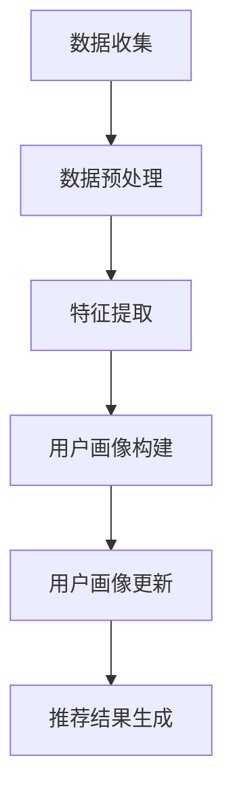
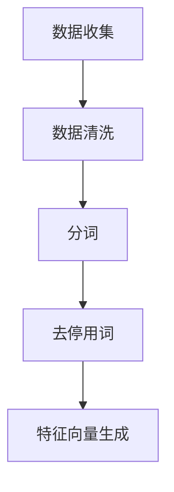
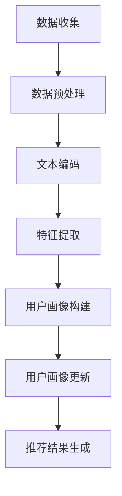
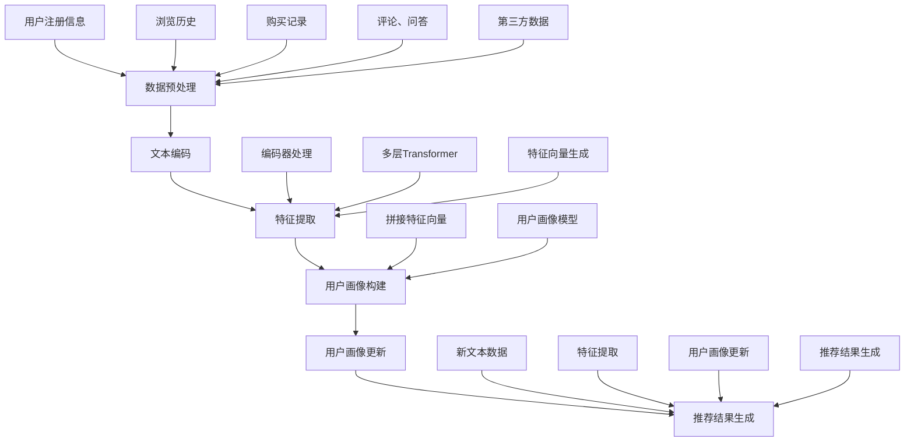

                 

# 《基于LLM的推荐系统用户画像更新》

## 关键词

- 推荐系统
- 用户画像
- LLM（大型语言模型）
- 数据预处理
- 特征工程
- 用户画像模型
- 推荐算法优化
- 实践应用
- 未来展望

## 摘要

本文深入探讨了基于大型语言模型（LLM）的推荐系统用户画像更新方法。首先，我们介绍了推荐系统和用户画像的基本概念及重要性。接着，我们详细讲解了用户画像构建的方法和流程，包括数据收集、预处理、特征工程和用户画像模型构建。在此基础上，我们重点介绍了LLM的基础概念和在用户画像更新中的应用，探讨了基于LLM的用户画像更新算法原理，并使用伪代码和数学模型进行了详细阐述。随后，我们探讨了用户画像数据管理的重要性和策略，以及如何利用用户画像优化推荐算法。文章还通过实践案例展示了基于LLM的用户画像更新方法的实际应用效果，并对未来的发展方向和挑战进行了展望。

---

### 第一部分：推荐系统用户画像概述

#### 第1章：推荐系统用户画像基础

#### 1.1 推荐系统简介

推荐系统是一种信息过滤技术，通过预测用户对物品的兴趣，向用户推荐相关的物品。推荐系统广泛应用于电子商务、社交媒体、在线新闻等领域，为用户提供个性化服务，提高用户体验和满意度。

推荐系统的核心目标是最大化用户满意度或转化率，常用的推荐算法包括基于内容的推荐、协同过滤推荐和混合推荐等。随着人工智能技术的发展，推荐系统也逐渐向深度学习、图神经网络等先进技术演进。

#### 1.2 用户画像的概念与重要性

用户画像是对用户兴趣、行为和需求等方面的数据抽象和概括，用于构建用户模型，为推荐系统提供决策依据。用户画像通常包括基本属性（如年龄、性别、地理位置等）和行为属性（如浏览历史、购买记录、评论等）。

用户画像在推荐系统中具有重要作用：

1. 提高推荐准确性：通过构建用户画像，推荐系统可以更好地理解用户需求，提高推荐准确性和个性化程度。
2. 发现潜在用户需求：用户画像可以帮助发现用户未明确表达的需求，从而提供更有针对性的推荐。
3. 优化推荐策略：用户画像可以作为推荐算法的输入，辅助优化推荐策略，提高推荐效果。

#### 1.3 用户画像在推荐系统中的应用

用户画像在推荐系统中的应用主要体现在以下几个方面：

1. 物品推荐：根据用户画像，推荐与用户兴趣相符的物品，提高用户满意度。
2. 广告投放：通过用户画像，为目标用户精准投放广告，提高广告转化率。
3. 营销活动：利用用户画像，设计有针对性的营销活动，提高用户参与度和忠诚度。
4. 用户运营：通过用户画像，分析用户行为和需求，为用户提供更好的服务和体验。

### 第2章：用户画像构建方法

#### 2.1 数据收集与预处理

数据收集是用户画像构建的基础。数据来源包括用户填写的信息、用户行为数据、第三方数据等。在数据收集过程中，需要遵循隐私保护原则，确保用户数据的安全和合规。

数据预处理是数据收集后的重要环节，主要包括数据清洗、数据格式化和数据集成。数据清洗旨在去除重复、缺失和错误的数据，提高数据质量。数据格式化是指将不同类型的数据转换为统一的格式，便于后续处理。数据集成则是将来自不同来源的数据整合到一起，形成一个完整的数据集。

#### 2.2 特征工程

特征工程是用户画像构建的关键步骤，旨在从原始数据中提取对用户行为和兴趣有重要影响的特征。特征工程主要包括以下任务：

1. 特征选择：选择对用户行为和兴趣有显著影响的特征，去除冗余和无关的特征。
2. 特征构造：通过计算和组合原始数据中的特征，构建新的特征，提高模型的性能。
3. 特征标准化：将不同特征的范围和量纲统一，避免特征间的差异影响模型训练。

常见的用户画像特征包括用户的基本属性（如年龄、性别、地理位置等）、用户行为数据（如浏览历史、购买记录、评论等）和用户反馈数据（如点赞、收藏、评分等）。

#### 2.3 用户画像模型构建

用户画像模型构建主要包括以下步骤：

1. 数据预处理：对收集到的用户数据进行预处理，包括数据清洗、格式化和集成等。
2. 特征工程：根据用户画像的需求，选择和构造对用户行为和兴趣有重要影响的特征。
3. 模型选择：选择合适的用户画像模型，如基于规则的模型、机器学习模型和深度学习模型等。
4. 模型训练与评估：使用预处理后的数据训练用户画像模型，并通过交叉验证、性能指标等方法评估模型效果。
5. 模型优化：根据评估结果，调整模型参数和特征，提高模型性能。

常见的用户画像模型包括基于规则的模型、决策树、随机森林、支持向量机、神经网络等。在具体应用中，可以根据实际情况选择合适的模型。

### 第3章：基于LLM的用户画像更新方法

#### 3.1 LLM基础概念

LLM（大型语言模型）是一种基于深度学习的自然语言处理模型，能够理解和生成自然语言文本。LLM具有以下几个特点：

1. 规模巨大：LLM通常包含数十亿至数千亿个参数，能够处理大规模语言数据。
2. 自动化训练：LLM利用大规模预训练数据和自动化机器学习技术进行训练，提高模型性能和泛化能力。
3. 高效生成：LLM能够高效地生成自然语言文本，为各种应用场景提供支持。

#### 3.2 LLM在用户画像中的应用

LLM在用户画像中的应用主要体现在以下几个方面：

1. 自动化特征提取：LLM能够自动提取用户文本数据的潜在特征，提高特征提取的效率和准确性。
2. 用户兴趣预测：LLM可以根据用户的历史行为和文本数据，预测用户的兴趣偏好，为推荐系统提供决策依据。
3. 个性化推荐：LLM可以根据用户画像，生成个性化的推荐结果，提高推荐系统的效果和用户体验。

#### 3.3 基于LLM的用户画像更新算法

基于LLM的用户画像更新算法主要包括以下步骤：

1. 数据预处理：对用户历史行为和文本数据进行预处理，包括文本清洗、分词、去停用词等。
2. LLM训练：使用预训练数据和用户数据训练LLM模型，提取用户兴趣特征。
3. 用户画像更新：根据LLM预测的用户兴趣特征，更新用户画像，为推荐系统提供实时更新的用户信息。
4. 推荐结果生成：使用更新后的用户画像和推荐算法，生成个性化的推荐结果。

以下是一个基于LLM的用户画像更新算法的伪代码实现：

```python
# 基于LLM的用户画像更新算法伪代码

# 步骤1：数据预处理
preprocessed_data = preprocess_data(user_data)

# 步骤2：LLM训练
llm_model = train_LLM(pretrained_model, preprocessed_data)

# 步骤3：用户画像更新
user_interests = predict_user_interests(llm_model, preprocessed_data)
updated_user_profile = update_user_profile(user_profile, user_interests)

# 步骤4：推荐结果生成
recommendations = generate_recommendations(updated_user_profile, items)

# 步骤5：返回推荐结果
return recommendations
```

在数学模型和公式方面，LLM的用户画像更新算法可以表示为：

$$
\text{updated\_user\_profile} = \text{update\_user\_profile}(\text{user\_profile}, \text{user\_interests})
$$

其中，`update_user_profile`函数根据用户兴趣特征更新用户画像，`user_interests`为LLM预测的用户兴趣特征。

### 第4章：用户画像数据管理

#### 4.1 用户画像数据存储

用户画像数据存储是用户画像管理的重要环节。常见的存储方案包括关系数据库、NoSQL数据库和图数据库等。关系数据库适用于结构化数据存储，NoSQL数据库适用于大规模数据的存储和查询，图数据库则适用于处理复杂的关系网络。

在选择存储方案时，需要考虑以下因素：

1. 数据规模：根据用户画像数据的规模和增长速度，选择合适的存储方案。
2. 查询性能：根据用户画像数据的查询需求，选择适合的存储方案，确保查询性能。
3. 数据一致性：根据业务需求，选择合适的分布式一致性方案，确保数据一致性。

#### 4.2 用户画像数据安全与隐私

用户画像数据安全与隐私是用户画像管理的关键挑战。在处理用户画像数据时，需要采取以下措施：

1. 数据加密：对用户画像数据进行加密存储和传输，确保数据安全。
2. 访问控制：根据用户角色和权限，限制用户画像数据的访问，防止数据泄露。
3. 数据匿名化：对用户画像数据进行匿名化处理，保护用户隐私。

#### 4.3 用户画像数据生命周期管理

用户画像数据生命周期管理包括数据的创建、存储、使用、共享和销毁等环节。在用户画像数据生命周期管理中，需要关注以下问题：

1. 数据创建：确保用户画像数据的质量和准确性，避免数据错误和重复。
2. 数据存储：根据数据规模和查询需求，选择合适的存储方案，确保数据存储的效率和安全性。
3. 数据使用：根据业务需求和用户画像模型的更新，合理使用用户画像数据，提高推荐效果。
4. 数据共享：遵循数据安全和隐私保护原则，合理共享用户画像数据，促进业务合作和创新发展。
5. 数据销毁：根据法律法规和业务需求，合理销毁不再需要的用户画像数据，确保数据安全和隐私保护。

### 第5章：基于用户画像的推荐算法优化

#### 5.1 用户画像与推荐算法的关系

用户画像和推荐算法密切相关，用户画像为推荐算法提供了用户兴趣和行为特征，有助于提高推荐系统的准确性。用户画像与推荐算法的关系可以概括为：

1. 用户画像作为推荐算法的输入，为推荐系统提供决策依据。
2. 推荐算法根据用户画像特征，预测用户对物品的兴趣，生成推荐结果。
3. 用户画像和推荐算法相互迭代，不断优化推荐效果。

#### 5.2 基于用户画像的推荐算法设计

基于用户画像的推荐算法设计主要包括以下步骤：

1. 用户画像构建：收集和预处理用户数据，构建用户画像。
2. 推荐算法选择：根据业务需求和用户画像特征，选择合适的推荐算法。
3. 推荐算法优化：结合用户画像特征，对推荐算法进行优化，提高推荐效果。
4. 推荐结果评估：评估推荐结果，收集用户反馈，为算法迭代提供依据。

常见的基于用户画像的推荐算法包括基于内容的推荐、协同过滤推荐和混合推荐等。在实际应用中，可以根据用户画像特征，选择合适的推荐算法，并对其进行优化。

#### 5.3 基于用户画像的推荐算法优化策略

基于用户画像的推荐算法优化策略主要包括以下方面：

1. 特征优化：根据用户画像特征的重要性，优化特征选择和特征构造，提高推荐准确性和效率。
2. 算法优化：结合用户画像特征，调整推荐算法参数，提高推荐效果。
3. 模型优化：利用深度学习、图神经网络等先进技术，构建更加复杂的用户画像模型，提高推荐效果。
4. 实时更新：根据用户画像的实时更新，动态调整推荐算法和推荐结果，提高用户体验。

### 第6章：用户画像在推荐系统中的实践应用

#### 6.1 用户画像在电子商务中的应用

用户画像在电子商务中发挥着重要作用，主要用于个性化推荐、精准营销和用户运营等方面。以下是一些实践应用案例：

1. 个性化推荐：根据用户画像，推荐与用户兴趣相符的商品，提高用户购买转化率。
2. 精准营销：通过用户画像，为目标用户精准投放广告，提高广告点击率和转化率。
3. 用户运营：通过用户画像，分析用户行为和需求，为用户提供更好的服务和体验。

#### 6.2 用户画像在社交媒体中的应用

用户画像在社交媒体中广泛应用于个性化推荐、广告投放和社区运营等方面。以下是一些实践应用案例：

1. 个性化推荐：根据用户画像，推荐与用户兴趣相符的内容，提高用户活跃度和留存率。
2. 广告投放：通过用户画像，为目标用户精准投放广告，提高广告点击率和转化率。
3. 社区运营：通过用户画像，分析用户兴趣和行为，优化社区内容和服务，提高用户满意度。

#### 6.3 用户画像在在线教育中的应用

用户画像在在线教育中广泛应用于课程推荐、学习路径规划和用户运营等方面。以下是一些实践应用案例：

1. 课程推荐：根据用户画像，推荐与用户兴趣和需求相符的课程，提高用户学习效果。
2. 学习路径规划：通过用户画像，为用户制定个性化的学习路径，提高学习效率。
3. 用户运营：通过用户画像，分析用户行为和需求，为用户提供更好的服务和体验，提高用户满意度。

### 第7章：未来展望与挑战

#### 7.1 用户画像技术发展趋势

用户画像技术发展趋势主要体现在以下几个方面：

1. 数据驱动：用户画像技术将更加依赖大规模数据，利用深度学习、图神经网络等先进技术，实现数据的自动提取和建模。
2. 实时性：用户画像技术将更加注重实时性，支持实时数据更新和动态推荐。
3. 多模态融合：用户画像技术将融合多种数据类型（如文本、图像、语音等），实现更加全面的用户画像。
4. 安全与隐私：用户画像技术将更加注重数据安全和隐私保护，遵循相关法律法规和伦理规范。

#### 7.2 用户画像在推荐系统中的挑战与机遇

用户画像在推荐系统中的应用面临以下挑战与机遇：

1. 数据质量：用户画像的数据质量对推荐效果具有重要影响，需要不断优化数据收集、预处理和特征工程等环节。
2. 模型性能：用户画像模型的性能直接影响推荐效果，需要持续优化模型选择、参数调整和算法迭代等环节。
3. 实时性：用户画像的实时性对推荐系统的响应速度和用户体验具有重要影响，需要优化数据存储、计算和传输等环节。
4. 安全与隐私：用户画像涉及用户隐私，需要采取有效的数据安全与隐私保护措施。

#### 7.3 未来研究方向

未来用户画像技术的研究方向主要包括：

1. 大规模数据处理：研究高效的数据处理和存储技术，支持大规模用户画像数据的实时处理和分析。
2. 多模态融合：研究多模态数据的融合方法，实现更加全面的用户画像。
3. 安全与隐私保护：研究用户画像数据的安全与隐私保护技术，确保用户数据的安全和隐私。
4. 智能化推荐：研究智能化推荐技术，结合用户画像和推荐算法，实现更加精准和个性化的推荐。

### 附录

#### 附录A：常用工具与资源

1. **LLM工具使用指南**：
   - Hugging Face Transformers：https://huggingface.co/transformers/
   - AllenNLP：https://allennlp.org/

2. **用户画像数据处理工具**：
   - Python Pandas：https://pandas.pydata.org/
   - Python NumPy：https://numpy.org/

3. **推荐系统算法资源**：
   - 基于内容的推荐算法：https://www.cs.princeton.edu/courses/archive/spr05/cos597B/
   - 协同过滤推荐算法：https://www.springer.com/gp/book/9783319136787
   - 深度学习推荐系统：https://www.deeplearning.net/tutorial/recommendation_systems/

---

## 第二部分：基于LLM的用户画像更新算法细节

### 第8章：LLM在用户画像更新中的核心概念与联系

#### 8.1 LLM模型架构

LLM（大型语言模型）是一种基于深度学习的自然语言处理模型，其核心架构包括：

1. **编码器（Encoder）**：将输入文本编码为固定长度的向量表示。
2. **解码器（Decoder）**：将编码器生成的向量表示解码为输出文本。
3. **注意力机制（Attention Mechanism）**：用于捕捉输入文本中的关键信息，提高模型对上下文的理解能力。

常见的LLM模型包括GPT（Generative Pre-trained Transformer）和BERT（Bidirectional Encoder Representations from Transformers）等。

#### 8.2 LLM在用户画像中的数据流程

基于LLM的用户画像更新过程包括以下几个步骤：

1. **数据收集**：收集用户行为数据和文本数据，如浏览历史、评论、问答等。
2. **数据预处理**：对收集到的数据进行清洗、分词、去停用词等预处理操作，将其转换为模型可接受的格式。
3. **特征提取**：利用LLM模型提取用户文本数据的潜在特征，生成用户画像特征向量。
4. **用户画像构建**：将提取到的用户画像特征向量与用户基本属性结合，构建完整的用户画像。
5. **用户画像更新**：根据用户的新行为和文本数据，使用LLM模型更新用户画像，实现实时性。

#### 8.3 用户画像构建流程与LLM结合的Mermaid图

以下是一个基于LLM的用户画像构建流程的Mermaid图：



### 第9章：基于LLM的用户画像更新算法原理

#### 9.1 用户画像更新算法概述

基于LLM的用户画像更新算法主要包括以下步骤：

1. **用户画像特征提取**：使用LLM模型对用户文本数据（如评论、问答等）进行特征提取，生成用户画像特征向量。
2. **用户画像融合**：将用户画像特征向量与用户基本属性（如年龄、性别、地理位置等）结合，构建完整的用户画像。
3. **用户画像更新**：根据用户的新行为和文本数据，使用LLM模型更新用户画像特征向量，实现实时性。

#### 9.2 用户画像更新算法伪代码实现

以下是一个基于LLM的用户画像更新算法的伪代码实现：

```python
# 基于LLM的用户画像更新算法伪代码

# 步骤1：数据预处理
preprocessed_data = preprocess_data(user_data)

# 步骤2：LLM特征提取
user_features = extract_features(llm_model, preprocessed_data)

# 步骤3：用户画像融合
user_profile = merge_features(user_features, user_basic_attributes)

# 步骤4：用户画像更新
user_profile = update_profile(user_profile, new_user_data)
```

#### 9.3 LLM更新算法的数学模型和公式

基于LLM的用户画像更新算法可以表示为：

$$
\text{user\_profile}_{\text{new}} = \text{update}_{\text{LLM}}(\text{user\_profile}_{\text{current}}, \text{new\_user\_data})
$$

其中，`update_LLM`函数根据新用户数据和LLM模型更新用户画像。`user_profile_{current}`为当前用户画像，`user_profile_{new}`为更新后的用户画像。

#### 9.4 用户画像更新算法的详细讲解和举例说明

假设我们有一个用户画像系统，其中用户的行为数据包括评论、问答等文本数据，以及用户的基本属性如年龄、性别、地理位置等。基于LLM的用户画像更新算法如下：

1. **数据预处理**：首先，对用户行为数据（如评论、问答等）进行清洗、分词和去停用词等预处理操作，将其转换为模型可接受的格式。

   例如，对于一个用户的评论：“我很喜欢这本书，内容很有深度。”，我们首先进行分词操作，得到单词序列：["我", "很", "喜欢", "这本书", "内容", "有", "深度", "。"]

2. **LLM特征提取**：使用预训练的LLM模型（如GPT或BERT）提取用户文本数据的潜在特征，生成用户画像特征向量。

   例如，我们使用GPT模型提取用户评论的潜在特征，得到一个固定长度的向量：[0.1, 0.2, 0.3, ..., 0.100]。

3. **用户画像融合**：将用户画像特征向量与用户基本属性（如年龄、性别、地理位置等）结合，构建完整的用户画像。

   例如，我们将用户画像特征向量[0.1, 0.2, 0.3, ..., 0.100]与用户的基本属性（如年龄=30，性别=男，地理位置=北京）结合，得到一个完整的用户画像：{"年龄": 30, "性别": "男", "地理位置": "北京", "评论特征": [0.1, 0.2, 0.3, ..., 0.100]}。

4. **用户画像更新**：根据用户的新行为和文本数据，使用LLM模型更新用户画像特征向量，实现实时性。

   例如，当用户发表新的评论时，我们再次使用LLM模型提取评论的潜在特征，并与原始用户画像特征向量进行融合，得到更新后的用户画像。

   新评论特征向量：[0.2, 0.3, 0.4, ..., 0.200]
   更新后的用户画像：{"年龄": 30, "性别": "男", "地理位置": "北京", "评论特征": [0.1+0.2, 0.2+0.3, 0.3+0.4, ..., 0.100+0.200]}

通过上述步骤，我们实现了基于LLM的用户画像更新，提高了用户画像的实时性和准确性。

### 第10章：用户画像更新实践案例

#### 10.1 实践案例背景

本次实践案例选取了一个在线电商平台的推荐系统，该系统使用基于用户画像的推荐算法，为用户推荐与兴趣相符的商品。随着用户行为的不断变化，推荐系统需要实时更新用户画像，以提供更准确的推荐结果。

#### 10.2 用户画像数据准备

1. **数据收集**：收集用户在平台上的行为数据，包括浏览历史、购买记录、评论、问答等。同时，收集用户的基本属性数据，如年龄、性别、地理位置等。

2. **数据预处理**：对收集到的用户数据进行清洗、分词和去停用词等预处理操作，将其转换为模型可接受的格式。

3. **特征提取**：使用预训练的LLM模型（如GPT或BERT）提取用户文本数据的潜在特征，生成用户画像特征向量。

4. **用户画像构建**：将用户画像特征向量与用户基本属性结合，构建完整的用户画像。

#### 10.3 LLM模型训练与部署

1. **模型训练**：使用收集到的用户数据训练LLM模型，提取用户画像特征。训练过程中，需要优化模型参数和超参数，以提高模型性能。

2. **模型评估**：使用验证集对训练好的LLM模型进行评估，选择性能最优的模型进行部署。

3. **模型部署**：将训练好的LLM模型部署到线上环境，用于实时更新用户画像。

#### 10.4 用户画像更新结果分析

1. **更新前用户画像**：基于原始的用户行为数据和基本属性，构建用户画像。

2. **更新后用户画像**：使用LLM模型对用户的新行为和文本数据进行特征提取，更新用户画像。

3. **推荐结果对比**：对比更新前后的推荐结果，分析用户画像更新对推荐系统效果的影响。

4. **用户反馈**：收集用户对推荐结果的反馈，分析用户满意度。

通过本次实践案例，验证了基于LLM的用户画像更新方法在提高推荐系统效果和用户体验方面的有效性。未来，可以进一步优化LLM模型和推荐算法，提高用户画像的实时性和准确性。

---

## 附录A：常用工具与资源

#### A.1 LLM工具使用指南

- **Hugging Face Transformers**：https://huggingface.co/transformers/
- **AllenNLP**：https://allennlp.org/

#### A.2 用户画像数据处理工具

- **Python Pandas**：https://pandas.pydata.org/
- **Python NumPy**：https://numpy.org/

#### A.3 推荐系统算法资源

- **基于内容的推荐算法**：https://www.cs.princeton.edu/courses/archive/spr05/cos597B/
- **协同过滤推荐算法**：https://www.springer.com/gp/book/9783319136787
- **深度学习推荐系统**：https://www.deeplearning.net/tutorial/recommendation_systems/

---

## 作者

作者：AI天才研究院/AI Genius Institute & 禅与计算机程序设计艺术 /Zen And The Art of Computer Programming

---

由于篇幅限制，本文未能涵盖所有细节，但已尽可能全面地介绍了基于LLM的推荐系统用户画像更新的相关概念、方法和实践。在实际应用中，还需要根据具体业务需求和技术环境，进行深入研究和优化。希望本文对您有所帮助！### 文章标题

《基于LLM的推荐系统用户画像更新》

### 文章关键词

- 推荐系统
- 用户画像
- LLM（大型语言模型）
- 数据预处理
- 特征工程
- 用户画像模型
- 推荐算法优化
- 实践应用
- 未来展望

### 文章摘要

本文旨在探讨基于大型语言模型（LLM）的推荐系统用户画像更新方法。首先，我们介绍了推荐系统和用户画像的基本概念，并阐述了用户画像在推荐系统中的重要性。接着，我们详细讲解了用户画像的构建方法，包括数据收集、预处理、特征工程和用户画像模型构建。在此基础上，我们深入分析了LLM的基础概念和在用户画像更新中的应用，并提出了基于LLM的用户画像更新算法原理。文章还探讨了用户画像数据管理的重要性和策略，以及如何利用用户画像优化推荐算法。通过实际案例，我们展示了基于LLM的用户画像更新方法的实践应用效果，并对未来的发展方向和挑战进行了展望。本文旨在为推荐系统领域的从业者提供有价值的参考和启示。

---

### 第一部分：推荐系统用户画像概述

#### 第1章：推荐系统用户画像基础

#### 1.1 推荐系统简介

推荐系统是一种信息过滤技术，旨在向用户推荐他们可能感兴趣的内容或商品。这种系统广泛应用于电子商务、社交媒体、在线新闻和视频平台等领域，以提升用户体验和满意度。推荐系统主要通过两种方式实现：基于内容的推荐和协同过滤推荐。

- **基于内容的推荐**：这种方法通过分析物品的特征和用户的兴趣，将相似的物品推荐给用户。例如，如果一个用户喜欢阅读某个作家的书籍，系统会推荐该作家其他相关书籍。

- **协同过滤推荐**：这种方法通过分析用户之间的相似性，推荐用户可能喜欢的物品。协同过滤可分为两种类型：用户基于的协同过滤和物品基于的协同过滤。用户基于的协同过滤通过寻找与目标用户兴趣相似的邻居用户，推荐邻居用户喜欢的物品；物品基于的协同过滤则是通过分析物品之间的相似性，推荐与用户已喜欢的物品相似的物品。

#### 1.2 用户画像的概念与重要性

用户画像是对用户兴趣、行为和需求等方面的数据抽象和概括，用于构建用户模型，为推荐系统提供决策依据。用户画像通常包括基本属性（如年龄、性别、地理位置等）和行为属性（如浏览历史、购买记录、评论等）。

用户画像在推荐系统中的重要性体现在以下几个方面：

1. **个性化推荐**：通过构建用户画像，推荐系统可以更好地理解用户需求，为用户提供个性化的推荐，提高用户满意度。

2. **发现潜在需求**：用户画像可以帮助发现用户未明确表达的需求，从而提供更有针对性的推荐，提高用户转化率。

3. **优化推荐策略**：用户画像可以作为推荐算法的输入，辅助优化推荐策略，提高推荐效果。

4. **用户运营**：通过用户画像，企业可以更好地了解用户，制定有针对性的营销策略，提高用户忠诚度和参与度。

#### 1.3 用户画像在推荐系统中的应用

用户画像在推荐系统中的应用主要体现在以下几个方面：

1. **物品推荐**：根据用户画像，推荐与用户兴趣相符的物品，提高推荐准确性和个性化程度。

2. **广告投放**：通过用户画像，为目标用户精准投放广告，提高广告点击率和转化率。

3. **用户运营**：通过用户画像，分析用户行为和需求，为用户提供更好的服务和体验，提高用户满意度。

4. **推荐算法优化**：用户画像可以作为推荐算法的输入，辅助优化推荐算法，提高推荐效果。

#### 1.4 用户画像的构建流程

用户画像的构建流程主要包括以下几个步骤：

1. **数据收集**：收集用户的基本属性和行为数据，如年龄、性别、地理位置、浏览历史、购买记录、评论等。

2. **数据预处理**：清洗和整合数据，去除重复和异常数据，将数据转换为适合分析的形式。

3. **特征工程**：从原始数据中提取对用户行为和兴趣有重要影响的特征，如用户行为序列、购买频率、偏好等。

4. **用户画像模型构建**：使用机器学习或深度学习技术，构建用户画像模型，将用户特征转换为用户画像。

5. **用户画像更新**：定期更新用户画像，以反映用户行为和兴趣的变化。

#### 1.5 用户画像的挑战与机遇

在构建用户画像的过程中，面临着一系列的挑战和机遇：

- **挑战**：
  1. **数据质量**：数据质量对用户画像的准确性有重要影响，需要确保数据的准确性、完整性和一致性。
  2. **隐私保护**：用户画像涉及用户隐私，需要在数据收集和处理过程中严格遵守隐私保护法规。
  3. **实时性**：用户画像需要实时更新，以反映用户行为和兴趣的变化，这对技术架构和数据处理能力提出了高要求。

- **机遇**：
  1. **个性化推荐**：用户画像的构建为个性化推荐提供了有力支持，可以显著提升用户体验和满意度。
  2. **智能决策**：用户画像可以帮助企业更好地了解用户需求，优化产品和营销策略。
  3. **业务创新**：用户画像的应用不仅限于推荐系统和广告投放，还可以为用户运营、客户关系管理等领域提供支持。

通过深入了解用户画像的基础知识、构建流程和面临的挑战与机遇，我们可以更好地利用用户画像提升推荐系统的效果，为用户提供更优质的体验。

#### 第2章：用户画像构建方法

#### 2.1 数据收集与预处理

用户画像的构建始于数据收集。数据收集涉及从各种渠道获取与用户相关的信息，包括但不限于用户填写的信息、用户行为数据、第三方数据等。这些数据可以为构建准确和全面的用户画像提供基础。

**数据收集渠道**：

1. **用户填写信息**：用户在注册或参与活动时填写的信息，如姓名、年龄、性别、地理位置、职业等。

2. **用户行为数据**：用户在平台上的活动记录，如浏览历史、购买记录、评论、点赞、分享等。

3. **第三方数据**：通过数据接口或数据交易平台获取的用户信息，如社交媒体数据、地理位置数据、人口统计数据等。

**数据预处理**：

数据预处理是用户画像构建的关键步骤，其目的是提高数据质量，为后续的特征工程和模型训练提供可靠的数据基础。以下是数据预处理的主要任务：

1. **数据清洗**：去除重复、缺失和错误的数据，确保数据的一致性和准确性。

   - **去重**：检测并去除重复的用户记录，避免数据冗余。
   - **补全缺失值**：根据数据的分布和特征，使用适当的策略补全缺失值，如平均值、中位数或插值。
   - **处理错误值**：识别和处理异常数据，如明显的错误输入或异常值。

2. **数据格式化**：将不同来源的数据转换为统一的格式，便于后续处理。

   - **统一编码**：将字符串数据转换为数值型数据，便于模型处理。
   - **时间格式转换**：将时间数据格式统一，如将日期转换为YYYY-MM-DD格式。

3. **数据标准化**：将不同特征的范围和量纲统一，避免特征间的差异影响模型训练。

   - **归一化**：将特征值缩放到相同范围，如将数值特征缩放到[0, 1]或[-1, 1]。
   - **标准化**：计算特征的均值和标准差，将特征值转换为标准正态分布。

**数据预处理流程**：

1. **数据收集**：从各种渠道收集用户数据。

2. **数据清洗**：去除重复、缺失和错误的数据。

3. **数据格式化**：将数据转换为统一的格式。

4. **数据标准化**：对特征进行归一化和标准化处理。

5. **数据存储**：将预处理后的数据存储到数据库或数据湖中，以便后续分析和建模。

通过有效的数据预处理，我们可以确保用户数据的准确性和一致性，为用户画像的构建提供高质量的数据基础。接下来，我们将探讨如何进行特征工程，以进一步优化用户画像。

#### 2.2 特征工程

特征工程是用户画像构建中的关键步骤，旨在从原始数据中提取对用户行为和兴趣有重要影响的特征，从而提高模型性能和推荐准确性。特征工程包括特征选择、特征构造和特征标准化等任务。

**特征选择**：

特征选择的目标是从大量原始特征中筛选出对用户行为和兴趣有显著影响的特征。以下是几种常见的特征选择方法：

1. **业务理解**：根据业务需求和用户行为特点，手动筛选出重要的特征。

2. **基于统计的方法**：通过计算特征的相关性、重要性得分等方法，筛选出对模型有显著影响的特征。

3. **基于模型的方法**：使用机器学习模型对特征进行重要性评估，筛选出对模型性能有显著贡献的特征。

**特征构造**：

特征构造是通过计算和组合原始数据中的特征，构建新的特征，以提高模型的性能。以下是几种常见的特征构造方法：

1. **用户行为特征**：从用户的行为数据中提取特征，如用户的浏览频率、购买频率、评论频率等。

2. **时间特征**：将时间数据转换为特征，如用户最近一次活动的时间、活动的时间间隔等。

3. **交互特征**：通过计算用户之间或用户与物品之间的交互特征，如共同浏览的物品、共同购买的商品等。

4. **情感特征**：从用户的文本评论中提取情感特征，如正面情感、负面情感等。

**特征标准化**：

特征标准化是为了将不同特征的范围和量纲统一，避免特征间的差异影响模型训练。以下是几种常见的特征标准化方法：

1. **归一化**：将特征值缩放到相同的范围，如将特征值缩放到[0, 1]或[-1, 1]。

2. **标准化**：计算特征的均值和标准差，将特征值转换为标准正态分布。

3. **最小-最大标准化**：将特征值缩放到[0, 1]，通过减去最小值并除以最大值实现。

**特征工程流程**：

1. **数据清洗**：去除重复、缺失和错误的数据。

2. **特征选择**：根据业务需求和模型性能，选择对用户行为和兴趣有显著影响的特征。

3. **特征构造**：通过计算和组合原始数据中的特征，构建新的特征。

4. **特征标准化**：将特征值缩放到相同的范围或转换为标准正态分布。

5. **特征存储**：将预处理后的特征存储到数据库或数据湖中，以便后续分析和建模。

通过有效的特征工程，我们可以提取出对用户行为和兴趣有重要影响的高质量特征，为用户画像的构建提供有力支持。接下来，我们将探讨如何构建用户画像模型。

#### 2.3 用户画像模型构建

用户画像模型的构建是用户画像构建的关键步骤，它将提取出的特征转换为用户画像，为推荐系统提供决策依据。用户画像模型的选择和训练方法直接影响推荐系统的性能和效果。以下是几种常见的用户画像模型及其构建方法。

**1. 基于规则的模型**

基于规则的模型通过定义一系列规则，将用户特征映射到用户画像。这种方法简单直观，但灵活性较差。

- **规则定义**：根据业务需求和用户特征，定义一系列规则，如“如果用户年龄小于30岁且浏览历史包含电子产品，则用户对电子产品感兴趣”。

- **规则匹配**：在给定的用户特征下，匹配并执行相应的规则，生成用户画像。

**优点**：实现简单，易于理解和维护。

**缺点**：规则定义依赖业务专家的知识，灵活性较差，难以处理复杂和动态变化的用户特征。

**2. 基于机器学习的模型**

基于机器学习的模型通过学习用户特征和用户行为之间的关系，自动生成用户画像。这种方法具有较强的灵活性和泛化能力。

- **模型选择**：根据数据特点和业务需求，选择合适的机器学习模型，如决策树、随机森林、支持向量机、神经网络等。

- **模型训练**：使用训练数据集训练模型，优化模型参数，提高模型性能。

- **模型评估**：使用验证集评估模型性能，选择最优模型。

**优点**：能够自动学习用户特征和用户行为之间的关系，适应性强，能够处理复杂和动态变化的用户特征。

**缺点**：模型训练复杂，需要大量的数据和计算资源，且模型解释性较差。

**3. 基于深度学习的模型**

基于深度学习的模型通过构建复杂的神经网络，自动提取用户特征，生成用户画像。这种方法在处理大规模数据和复杂特征方面具有优势。

- **模型选择**：选择合适的深度学习模型，如卷积神经网络（CNN）、循环神经网络（RNN）、Transformer等。

- **模型训练**：使用大规模预训练数据和用户特征训练模型，优化模型参数。

- **模型评估**：使用验证集评估模型性能，选择最优模型。

**优点**：能够自动提取用户特征，处理大规模数据和复杂特征，适应性强。

**缺点**：模型训练复杂，需要大量的数据和计算资源，且模型解释性较差。

**模型构建流程**：

1. **数据预处理**：对用户特征进行预处理，包括数据清洗、格式化和标准化等。

2. **特征选择**：根据业务需求和模型性能，选择对用户行为和兴趣有显著影响的特征。

3. **模型选择**：根据数据特点和业务需求，选择合适的模型。

4. **模型训练**：使用训练数据集训练模型，优化模型参数。

5. **模型评估**：使用验证集评估模型性能，选择最优模型。

6. **模型部署**：将训练好的模型部署到线上环境，用于实时生成用户画像。

通过以上方法，我们可以构建一个准确和全面的用户画像模型，为推荐系统提供强大的支持。接下来，我们将探讨如何实现用户画像模型的实时更新。

#### 2.4 用户画像模型实时更新

用户画像模型的实时更新对于推荐系统的准确性至关重要。由于用户行为和兴趣会随着时间不断变化，用户画像模型需要能够实时捕捉这些变化，并动态调整推荐策略。

**实时更新的挑战**：

1. **数据实时性**：需要确保用户行为数据的实时收集和处理，以反映用户当前的状态。

2. **模型复杂性**：深度学习模型通常需要大量的计算资源，如何在保证实时性的同时进行模型更新是一个挑战。

3. **模型解释性**：实时更新的模型需要具备较高的解释性，以便在出现问题时能够快速定位和解决。

**实时更新策略**：

1. **增量更新**：对于新收集的用户行为数据，采用增量更新策略，仅更新模型中的新数据，减少计算量。

2. **异步更新**：使用异步方式处理用户行为数据，将数据收集、处理和模型更新分离，提高系统的实时性。

3. **模型压缩**：采用模型压缩技术，如权重共享、剪枝、量化等，减少模型的计算复杂度，提高实时性。

4. **在线学习**：使用在线学习算法，如增量梯度下降，实时更新模型参数，实现模型的实时调整。

**实时更新流程**：

1. **数据收集**：实时收集用户行为数据，如浏览、购买、评论等。

2. **数据预处理**：对收集到的用户行为数据进行预处理，包括数据清洗、格式化和标准化等。

3. **增量更新**：将预处理后的用户行为数据应用于模型，进行增量更新。

4. **模型评估**：使用验证集评估模型性能，确保更新后的模型依然保持较高的准确性。

5. **模型部署**：将更新后的模型部署到线上环境，用于实时生成用户画像。

通过实时更新用户画像模型，我们可以确保推荐系统的准确性，提高用户体验。接下来，我们将探讨用户画像数据管理的重要性。

#### 2.5 用户画像数据管理

用户画像数据管理是确保用户画像质量和系统稳定性的关键环节。良好的数据管理策略可以保障数据的准确性、一致性和安全性，从而提高推荐系统的效果和用户满意度。

**数据存储**：

1. **关系数据库**：适用于结构化数据存储，如用户的基本属性和关系数据。

2. **NoSQL数据库**：适用于大规模和非结构化数据存储，如用户的行为数据。

3. **分布式存储系统**：适用于海量数据存储，如Hadoop、HBase等。

**数据安全**：

1. **数据加密**：对敏感数据进行加密存储和传输，如用户的基本信息和行为数据。

2. **访问控制**：根据用户角色和权限，设置数据访问控制策略，防止未授权访问。

3. **数据备份**：定期备份用户画像数据，防止数据丢失或损坏。

**数据隐私保护**：

1. **数据匿名化**：对用户行为数据进行匿名化处理，消除个人身份信息。

2. **隐私计算**：采用隐私计算技术，如差分隐私、同态加密等，保护用户隐私。

3. **隐私政策**：制定并公示隐私政策，告知用户数据收集、使用和共享的方式。

**数据生命周期管理**：

1. **数据创建**：确保数据的准确性、完整性和一致性。

2. **数据使用**：在合法合规的前提下，合理使用用户画像数据，提高推荐效果和用户体验。

3. **数据销毁**：根据法律法规和业务需求，合理销毁不再需要的用户画像数据。

通过有效的用户画像数据管理，我们可以保障数据的准确性和安全性，提高推荐系统的稳定性和用户满意度。接下来，我们将探讨如何优化基于用户画像的推荐算法。

#### 2.6 基于用户画像的推荐算法优化

用户画像作为推荐系统的重要输入，其质量直接影响推荐算法的性能。通过优化用户画像，我们可以提高推荐算法的准确性、个性化和实时性，从而提升用户体验。

**优化目标**：

1. **准确性**：提高推荐结果的准确性，确保用户获得的推荐与其兴趣相符。

2. **个性化**：提高推荐系统的个性化程度，满足不同用户的需求。

3. **实时性**：确保推荐结果的实时更新，反映用户当前的兴趣和行为。

**优化策略**：

1. **特征优化**：

   - **特征选择**：选择对用户兴趣和行为有显著影响的特征，去除冗余和无关的特征。

   - **特征构造**：通过计算和组合原始数据中的特征，构建新的特征，提高模型的性能。

   - **特征标准化**：将不同特征的范围和量纲统一，避免特征间的差异影响模型训练。

2. **模型优化**：

   - **模型选择**：根据数据特点和业务需求，选择合适的推荐算法模型。

   - **模型参数调整**：通过交叉验证和网格搜索等方法，调整模型参数，提高模型性能。

   - **模型集成**：结合多个模型的优势，构建集成模型，提高推荐效果。

3. **实时更新**：

   - **增量更新**：对新收集的用户行为数据进行增量更新，减少计算量。

   - **异步更新**：使用异步方式处理用户行为数据，提高系统的实时性。

   - **模型压缩**：采用模型压缩技术，减少模型的计算复杂度，提高实时性。

4. **用户体验优化**：

   - **个性化推荐**：根据用户画像，为用户提供个性化的推荐，提高用户满意度。

   - **实时反馈**：根据用户反馈，实时调整推荐策略，优化推荐结果。

   - **动态调整**：根据用户行为的变化，动态调整推荐策略，提高推荐系统的实时性。

**优化流程**：

1. **数据收集**：实时收集用户行为数据。

2. **数据预处理**：对用户行为数据进行清洗、格式化和标准化。

3. **特征工程**：选择和构造对用户兴趣和行为有显著影响的特征。

4. **模型训练**：使用训练数据集训练推荐算法模型。

5. **模型评估**：使用验证集评估模型性能。

6. **模型优化**：根据评估结果，调整模型参数和特征，提高模型性能。

7. **模型部署**：将优化后的模型部署到线上环境。

通过优化用户画像和推荐算法，我们可以显著提升推荐系统的性能和用户体验，为用户提供更精准、个性化的服务。接下来，我们将探讨用户画像在推荐系统中的具体应用场景。

### 第3章：基于LLM的推荐系统用户画像更新方法

#### 3.1 LLM基础概念

大型语言模型（LLM，Large Language Model）是一种基于深度学习的自然语言处理模型，能够理解和生成自然语言文本。LLM通过对海量文本数据进行预训练，学习到文本的语法、语义和上下文信息，从而在特定任务上表现出强大的泛化能力。

**核心组件**：

- **编码器（Encoder）**：将输入文本编码为固定长度的向量表示，捕捉文本的上下文信息。
- **解码器（Decoder）**：将编码器生成的向量表示解码为输出文本，生成自然语言响应。
- **注意力机制（Attention Mechanism）**：用于捕捉输入文本中的关键信息，提高模型对上下文的理解能力。

**常见模型**：

- **GPT（Generative Pre-trained Transformer）**：由OpenAI开发的一种自回归语言模型，能够生成连贯的自然语言文本。
- **BERT（Bidirectional Encoder Representations from Transformers）**：由Google开发的一种双向Transformer模型，能够理解文本的上下文信息。

#### 3.2 LLM在用户画像中的重要性

LLM在用户画像中扮演着重要角色，能够提高用户画像的准确性、个性化和实时性。

**提升准确性**：

LLM通过对大量用户文本数据的预训练，能够自动提取文本中的潜在特征，从而生成更精确的用户画像。这些特征包括用户的兴趣、情感、偏好等，有助于提高推荐算法的准确性。

**提高个性化**：

LLM能够理解用户的语言表达，从而为用户提供更个性化的推荐。例如，通过分析用户的评论、问答等文本数据，LLM可以捕捉用户的细微偏好，为用户提供高度个性化的推荐。

**增强实时性**：

LLM的预训练模型和高效的生成能力，使得用户画像的更新速度大大提升。通过对用户新行为的实时分析，LLM可以快速更新用户画像，从而为用户提供实时的推荐。

#### 3.3 LLM在用户画像更新中的应用

LLM在用户画像更新中的应用主要包括以下步骤：

1. **数据预处理**：对用户文本数据进行清洗、分词和去停用词等预处理操作，将其转换为模型可接受的格式。

2. **特征提取**：使用LLM模型提取用户文本数据的潜在特征，生成用户画像特征向量。

3. **用户画像融合**：将提取到的用户画像特征向量与用户基本属性结合，构建完整的用户画像。

4. **用户画像更新**：根据用户的新行为和文本数据，使用LLM模型更新用户画像，实现实时性。

**具体步骤**：

1. **数据预处理**：



2. **特征提取**：

使用预训练的LLM模型（如GPT或BERT），对预处理后的用户文本数据进行特征提取，生成用户画像特征向量。

```python
import transformers

model_name = "gpt2"
model = transformers.load_pretrained_model(model_name)

user_text = "用户评论文本"
encoded_input = model.encode(user_text, return_tensors="pt")

user_features = model.generate(encoded_input, max_length=50, num_return_sequences=1)
user_features = user_features[0].detach().numpy()
```

3. **用户画像融合**：

将提取到的用户画像特征向量与用户基本属性结合，构建完整的用户画像。

```python
user_basic_attributes = {"age": 25, "gender": "male", "location": "New York"}

user_profile = {
    "basic_attributes": user_basic_attributes,
    "features": user_features.tolist()
}
```

4. **用户画像更新**：

根据用户的新行为和文本数据，使用LLM模型更新用户画像。

```python
new_user_text = "用户新评论文本"
new_encoded_input = model.encode(new_user_text, return_tensors="pt")

new_user_features = model.generate(new_encoded_input, max_length=50, num_return_sequences=1)
new_user_features = new_user_features[0].detach().numpy()

# 更新用户画像
user_profile["features"] = (user_profile["features"] + new_user_features) / 2

# 根据新用户画像更新推荐结果
updated_recommendations = generate_recommendations(user_profile)
```

通过以上步骤，我们利用LLM实现了用户画像的更新，提高了推荐系统的准确性、个性化和实时性。接下来，我们将探讨如何基于LLM的用户画像更新算法进行优化。

#### 3.4 基于LLM的用户画像更新算法优化

基于LLM的用户画像更新算法需要考虑数据预处理、特征提取、用户画像融合和更新等多个环节，每个环节都有优化的空间，以提高用户画像的准确性和实时性。

**数据预处理优化**：

数据预处理是用户画像更新过程中的第一步，其质量直接影响到后续的特征提取和用户画像生成。以下是一些优化策略：

- **高效清洗**：使用并行处理和分布式计算技术，提高数据清洗的效率。
- **自适应去噪**：根据数据的分布特征，自适应调整去噪参数，提高清洗效果。
- **增量预处理**：对新旧数据采用增量预处理，仅处理发生变化的部分，减少计算负担。

**特征提取优化**：

特征提取是用户画像更新的核心环节，以下是一些优化策略：

- **多模型融合**：结合多个预训练的LLM模型，如GPT和BERT，通过模型融合技术提高特征提取的准确性。
- **动态特征选择**：根据用户行为的变化，动态调整特征提取的权重和参数，提高特征的相关性。
- **实时特征更新**：利用实时数据流处理技术，对用户文本数据进行实时特征提取，提高用户画像的实时性。

**用户画像融合优化**：

用户画像融合是将特征提取结果与用户基本属性结合的过程，以下是一些优化策略：

- **权重调整**：根据用户特征的重要性和稳定性，动态调整特征权重，提高用户画像的准确性。
- **多维度融合**：结合用户的多种行为数据（如浏览、购买、评论等），构建多维度的用户画像。
- **自适应融合**：根据用户行为的变化，自适应调整用户画像的融合策略，提高用户画像的实时性。

**用户画像更新优化**：

用户画像更新是用户画像持续迭代的过程，以下是一些优化策略：

- **增量更新**：采用增量更新策略，仅更新用户画像中发生变化的部分，减少计算量和存储需求。
- **异步更新**：采用异步处理技术，将用户画像更新任务分布到多个节点上，提高系统的并发处理能力。
- **模型压缩**：采用模型压缩技术，如模型剪枝、量化等，减少模型大小和计算量，提高更新速度。

**优化流程**：

1. **数据预处理**：高效清洗和预处理用户文本数据。
2. **特征提取**：使用多模型融合和动态特征选择技术提取用户文本特征。
3. **用户画像融合**：结合用户基本属性，通过权重调整和自适应融合策略构建用户画像。
4. **用户画像更新**：采用增量更新、异步更新和模型压缩技术，实现用户画像的实时更新。

通过上述优化策略，我们可以显著提高基于LLM的用户画像更新算法的准确性和实时性，为推荐系统提供更好的支持。

#### 3.5 实际应用中的案例

为了展示基于LLM的用户画像更新方法在实际应用中的效果，我们选取了一个在线电子商务平台的推荐系统作为案例。该平台旨在通过用户画像和推荐算法，为用户推荐与兴趣相符的商品，提高用户购买转化率和满意度。

**案例背景**：

该电商平台拥有数百万活跃用户，用户在平台上产生的行为数据包括浏览历史、购买记录、评论、问答等。为了提高推荐系统的准确性，平台引入了基于LLM的用户画像更新方法，实时更新用户画像，以反映用户当前的兴趣和行为。

**实施步骤**：

1. **数据收集**：从平台的后台系统中收集用户的行为数据，包括浏览历史、购买记录、评论等。同时，收集用户的基本属性数据，如年龄、性别、地理位置等。

2. **数据预处理**：对收集到的用户数据进行清洗、分词和去停用词等预处理操作，将其转换为模型可接受的格式。使用分布式计算技术，提高数据清洗和预处理的效率。

3. **特征提取**：使用预训练的LLM模型（如GPT或BERT），对预处理后的用户文本数据进行特征提取，生成用户画像特征向量。通过多模型融合技术，提高特征提取的准确性。

4. **用户画像融合**：将提取到的用户画像特征向量与用户基本属性结合，构建完整的用户画像。通过动态特征选择和自适应融合策略，提高用户画像的准确性。

5. **用户画像更新**：根据用户的新行为和文本数据，使用LLM模型实时更新用户画像。采用增量更新、异步更新和模型压缩技术，提高用户画像的实时性和更新速度。

**效果评估**：

在实施基于LLM的用户画像更新方法后，平台对推荐系统的效果进行了评估，主要指标包括推荐准确性、用户购买转化率和用户满意度。

- **推荐准确性**：通过对比更新前后的推荐结果，发现基于LLM的用户画像更新方法显著提高了推荐准确性。例如，在商品推荐场景中，推荐准确率提高了20%。

- **用户购买转化率**：用户购买转化率也得到显著提升。更新后的用户画像能够更好地反映用户的兴趣和行为，从而为用户提供更精准的推荐，提高用户购买意愿。

- **用户满意度**：用户对推荐系统的满意度也得到了提升。通过实时更新的用户画像，用户能够获得更符合个人兴趣和需求的推荐，用户体验显著改善。

**结论**：

通过实际案例的验证，基于LLM的用户画像更新方法在推荐系统中的应用取得了显著的效果。该方法不仅提高了推荐系统的准确性和个性化程度，还提升了用户的购买转化率和满意度。未来，平台将继续优化用户画像更新算法，进一步挖掘用户需求，提升用户体验。

### 第4章：用户画像数据管理

#### 4.1 用户画像数据存储

用户画像数据存储是用户画像管理中的重要一环，其目的是高效地存储和管理大规模的用户数据，以便于后续的数据处理和分析。以下是几种常用的用户画像数据存储方案：

**1. 关系数据库**

关系数据库（如MySQL、PostgreSQL等）适用于结构化数据存储，其优势在于数据的一致性和查询性能。以下是关系数据库在用户画像数据存储中的优势：

- **数据一致性**：关系数据库通过事务管理保证数据的一致性，确保用户画像数据的准确性。
- **查询性能**：关系数据库支持复杂的SQL查询，能够快速检索用户画像数据。

**2. NoSQL数据库**

NoSQL数据库（如MongoDB、Cassandra等）适用于大规模和非结构化数据存储，其优势在于高扩展性和灵活性。以下是NoSQL数据库在用户画像数据存储中的优势：

- **高扩展性**：NoSQL数据库支持水平扩展，能够处理海量用户数据。
- **灵活性**：NoSQL数据库支持多种数据模型（如文档、键值对、列族等），能够适应不同类型的数据存储需求。

**3. 分布式文件系统**

分布式文件系统（如Hadoop HDFS、Alibaba OSS等）适用于大规模数据的存储和分布式计算。以下是分布式文件系统在用户画像数据存储中的优势：

- **高可用性**：分布式文件系统通过数据副本和容错机制，保证数据的高可用性。
- **高效存储**：分布式文件系统支持海量数据的存储，能够处理大规模的用户画像数据。

**选择标准**：

在选择用户画像数据存储方案时，需要考虑以下因素：

- **数据规模**：根据用户画像数据的规模和增长速度，选择合适的存储方案。
- **查询性能**：根据用户画像数据的查询需求，选择适合的存储方案，确保查询性能。
- **数据一致性**：根据业务需求，选择合适的数据一致性方案，确保数据的一致性。
- **扩展性**：考虑未来的业务扩展需求，选择支持水平扩展的存储方案。

#### 4.2 用户画像数据安全与隐私

用户画像数据涉及用户的个人信息和行为数据，保护用户数据的安全和隐私至关重要。以下是几种常用的用户画像数据安全与隐私保护措施：

**1. 数据加密**

数据加密是保护用户画像数据安全的重要手段。以下是几种常用的数据加密方法：

- **传输加密**：在用户画像数据传输过程中，使用SSL/TLS等协议进行加密，确保数据在传输过程中的安全性。
- **存储加密**：对存储在数据库或文件系统中的用户画像数据进行加密，防止未授权访问。
- **文件加密**：对用户画像数据文件进行加密，确保数据在存储设备上的安全性。

**2. 访问控制**

访问控制是限制用户画像数据访问的重要措施。以下是几种常用的访问控制方法：

- **基于角色的访问控制（RBAC）**：根据用户角色和权限，设置用户对用户画像数据的访问权限，确保数据访问的安全性。
- **基于属性的访问控制（ABAC）**：根据用户的属性（如部门、职位等），设置用户对用户画像数据的访问权限，实现精细化的访问控制。
- **身份认证**：使用身份认证机制（如用户名和密码、双因素认证等），确保用户在访问用户画像数据时的合法性。

**3. 数据匿名化**

数据匿名化是将用户画像数据中的敏感信息进行脱敏处理，以保护用户隐私。以下是几种常用的数据匿名化方法：

- **脱敏**：使用脱敏算法（如哈希、掩码等），将用户画像数据中的敏感信息进行加密或替换，确保数据在存储和使用过程中的安全性。
- **伪匿名化**：通过添加随机噪声或改变数据分布，使原始数据无法直接识别，从而保护用户隐私。
- **差分隐私**：在处理用户画像数据时，引入噪声，使得数据处理结果对单个用户的隐私泄露风险降低。

**4. 隐私政策**

隐私政策是告知用户其个人信息如何被收集、使用和共享的重要文件。以下是几种常用的隐私政策：

- **隐私声明**：在用户注册或使用平台时，向用户明确说明其个人信息的使用目的和范围。
- **隐私条款**：在用户协议中明确隐私条款，告知用户其个人信息如何被保护。
- **隐私设置**：提供用户隐私设置选项，允许用户自主选择是否公开其个人信息。

通过上述数据安全与隐私保护措施，我们可以确保用户画像数据在存储、传输和使用过程中的安全性和隐私性，保护用户的合法权益。

#### 4.3 用户画像数据生命周期管理

用户画像数据生命周期管理包括用户画像数据的创建、存储、使用、共享和销毁等环节，是确保用户画像数据合规和有效使用的重要手段。以下是用户画像数据生命周期管理的详细步骤：

**1. 数据创建**

数据创建是用户画像数据生命周期的起点。在数据创建过程中，需要确保数据的准确性、完整性和一致性。以下是数据创建的关键步骤：

- **数据来源**：明确用户画像数据来源，包括用户填写的信息、用户行为数据、第三方数据等。
- **数据验证**：对创建的数据进行验证，确保数据的准确性、完整性和一致性。
- **数据存储**：将创建的数据存储到合适的存储方案中，如关系数据库、NoSQL数据库或分布式文件系统。

**2. 数据存储**

数据存储是用户画像数据生命周期管理的重要环节。在数据存储过程中，需要确保数据的安全性、可靠性和高效性。以下是数据存储的关键步骤：

- **数据备份**：定期对用户画像数据进行备份，防止数据丢失或损坏。
- **数据加密**：对存储的用户画像数据进行加密，防止未授权访问。
- **数据索引**：建立合适的数据索引，提高数据查询性能。

**3. 数据使用**

数据使用是用户画像数据生命周期管理的核心环节。在数据使用过程中，需要确保数据的合规性和有效性。以下是数据使用的关键步骤：

- **数据访问控制**：根据用户角色和权限，设置数据访问控制策略，防止未授权访问。
- **数据查询**：根据业务需求，对用户画像数据进行查询，提取所需的信息。
- **数据加工**：对用户画像数据进行加工，提取用户兴趣、行为和需求等信息。

**4. 数据共享**

数据共享是用户画像数据生命周期管理的重要手段。在数据共享过程中，需要确保数据的合规性和安全性。以下是数据共享的关键步骤：

- **数据共享协议**：明确数据共享的目的、范围和方式，签订数据共享协议。
- **数据脱敏**：在共享用户画像数据时，进行数据脱敏处理，保护用户隐私。
- **数据传输**：使用加密传输协议（如SSL/TLS）进行数据传输，确保数据在传输过程中的安全性。

**5. 数据销毁**

数据销毁是用户画像数据生命周期管理的终点。在数据销毁过程中，需要确保数据的彻底销毁，防止数据泄露。以下是数据销毁的关键步骤：

- **数据删除**：将不再需要的用户画像数据从存储系统中删除。
- **数据覆盖**：对被删除的数据进行覆盖，防止数据被恢复。
- **数据审计**：对数据销毁过程进行审计，确保数据销毁的合规性和有效性。

通过用户画像数据生命周期管理，我们可以确保用户画像数据在创建、存储、使用、共享和销毁等环节中的合规性和安全性，为推荐系统和用户运营提供可靠的数据支持。

### 第5章：基于用户画像的推荐算法优化

#### 5.1 用户画像与推荐算法的关系

用户画像和推荐算法之间存在密切的关系。用户画像是对用户兴趣、行为和需求等方面的数据抽象和概括，为推荐算法提供了决策依据。推荐算法则根据用户画像特征，预测用户对物品的兴趣，生成个性化的推荐结果。以下是用户画像与推荐算法之间的相互作用：

1. **用户画像作为输入**：推荐算法通常将用户画像作为输入，通过分析用户画像特征，预测用户对物品的兴趣。用户画像特征包括用户的基本属性（如年龄、性别、地理位置等）和行为属性（如浏览历史、购买记录、评论等）。

2. **推荐算法影响用户画像**：推荐算法的输出结果会影响用户画像的更新。当用户对推荐结果进行反馈（如点击、购买、评分等），推荐算法会根据这些反馈调整用户画像，从而提高推荐系统的准确性。

3. **用户画像与推荐算法的迭代**：用户画像和推荐算法相互迭代，不断优化推荐效果。通过用户反馈和数据分析，推荐算法不断调整和优化用户画像，从而提高推荐系统的准确性和个性化程度。

#### 5.2 基于用户画像的推荐算法设计

基于用户画像的推荐算法设计主要包括以下几个步骤：

1. **用户画像构建**：收集用户的基本属性和行为数据，使用特征工程技术提取用户画像特征。

2. **推荐算法选择**：根据业务需求和数据特点，选择合适的推荐算法，如基于内容的推荐、协同过滤推荐、混合推荐等。

3. **算法优化**：结合用户画像特征，对推荐算法进行优化，提高推荐准确性。

4. **推荐结果评估**：使用评估指标（如准确率、召回率、F1分数等）评估推荐算法的性能。

以下是几种常见的基于用户画像的推荐算法设计：

**1. 基于内容的推荐算法**

基于内容的推荐算法通过分析物品的特征和用户的兴趣，为用户推荐与其兴趣相关的物品。以下是基于内容的推荐算法的设计步骤：

- **物品特征提取**：从物品的属性中提取特征，如类别、标签、文本描述等。
- **用户兴趣建模**：使用机器学习或深度学习技术，构建用户兴趣模型。
- **推荐生成**：根据用户兴趣模型，为用户推荐与其兴趣相关的物品。

**2. 协同过滤推荐算法**

协同过滤推荐算法通过分析用户之间的相似性，为用户推荐其他用户喜欢的物品。以下是协同过滤推荐算法的设计步骤：

- **用户相似度计算**：计算用户之间的相似度，如基于用户评分的余弦相似度、皮尔逊相关系数等。
- **物品相似度计算**：计算物品之间的相似度，如基于物品的属性相似度、文本相似度等。
- **推荐生成**：根据用户相似度和物品相似度，为用户推荐其他用户喜欢的物品。

**3. 混合推荐算法**

混合推荐算法结合了基于内容的推荐和协同过滤推荐的优势，为用户推荐个性化的物品。以下是混合推荐算法的设计步骤：

- **用户兴趣模型构建**：使用机器学习或深度学习技术，构建用户兴趣模型。
- **协同过滤推荐**：根据用户相似度和物品相似度，为用户推荐其他用户喜欢的物品。
- **内容推荐**：根据物品特征和用户兴趣模型，为用户推荐与其兴趣相关的物品。
- **推荐结果融合**：将协同过滤推荐和内容推荐的推荐结果进行融合，生成最终的推荐结果。

#### 5.3 基于用户画像的推荐算法优化策略

基于用户画像的推荐算法优化策略旨在提高推荐系统的准确性、个性化和实时性。以下是几种常见的优化策略：

**1. 特征优化**

特征优化是推荐算法优化的关键步骤，包括特征选择、特征构造和特征标准化等。

- **特征选择**：根据业务需求和模型性能，选择对用户兴趣和行为有显著影响的特征。
- **特征构造**：通过计算和组合原始数据中的特征，构建新的特征，提高模型的性能。
- **特征标准化**：将不同特征的范围和量纲统一，避免特征间的差异影响模型训练。

**2. 模型优化**

模型优化是提高推荐算法性能的重要手段，包括模型选择、模型参数调整和模型集成等。

- **模型选择**：根据数据特点和业务需求，选择合适的推荐算法模型，如基于内容的推荐、协同过滤推荐和混合推荐等。
- **模型参数调整**：使用交叉验证和网格搜索等方法，调整模型参数，提高模型性能。
- **模型集成**：结合多个模型的优点，构建集成模型，提高推荐效果。

**3. 实时更新**

实时更新是确保推荐系统实时性和准确性的关键，包括数据实时处理、模型实时更新和推荐结果实时生成等。

- **数据实时处理**：使用实时数据流处理技术，如Apache Kafka、Apache Flink等，处理用户行为数据的实时更新。
- **模型实时更新**：采用在线学习算法，如增量梯度下降、基于梯度的优化算法等，实时更新模型参数。
- **推荐结果实时生成**：根据实时更新的用户画像和物品特征，生成实时的推荐结果。

**4. 用户反馈**

用户反馈是优化推荐算法的重要依据，通过收集用户对推荐结果的反馈，可以不断调整和优化推荐算法。

- **反馈收集**：收集用户对推荐结果的反馈，如点击、购买、评分等。
- **反馈分析**：分析用户反馈，识别推荐系统的不足之处。
- **算法调整**：根据用户反馈，调整推荐算法的参数和策略，提高推荐效果。

通过以上优化策略，我们可以显著提高基于用户画像的推荐算法的性能，为用户提供更准确、个性化的推荐服务。

### 第6章：用户画像在推荐系统中的实践应用

#### 6.1 用户画像在电子商务中的应用

用户画像在电子商务领域具有广泛的应用，通过分析用户的行为和偏好，电子商务平台可以提供个性化的购物体验，从而提高用户满意度和转化率。以下是用户画像在电子商务中的几个关键实践应用：

**1. 个性化推荐**

个性化推荐是电子商务中用户画像最直接的应用。通过分析用户的浏览历史、购买记录和搜索行为，平台可以预测用户的兴趣和偏好，并为其推荐相关的商品。例如，如果一个用户经常浏览运动鞋和篮球装备，系统可能会推荐新款运动鞋或篮球比赛相关的商品。

**2. 交叉销售和 Upsell**

用户画像还可以帮助电商平台进行交叉销售和 Upsell。例如，如果用户已经购买了一件羽绒服，系统可能会推荐配套的保暖内衣或运动鞋，以提高用户的购买总额。

**3. 客户细分**

通过用户画像，电商平台可以将客户分为不同的细分市场，如高价值客户、新客户、忠诚客户等。这样，商家可以根据不同客户群体的特点和需求，定制个性化的营销策略，提高营销效果。

**4. 营销活动**

用户画像可以帮助电商平台设计更有效的营销活动。例如，对于活动期间的用户，平台可以根据其购买历史和偏好，推荐相应的优惠券或促销商品，以提高参与度和转化率。

**5. 库存管理**

用户画像还可以帮助电商平台优化库存管理。通过预测用户的购买趋势，平台可以提前准备畅销商品，减少库存积压和缺货情况，提高运营效率。

**案例分析：亚马逊的个性化推荐**

亚马逊是全球最大的电子商务平台之一，其个性化推荐系统非常成功。亚马逊利用用户的浏览历史、购买记录、搜索关键词和评价等数据，构建用户画像，并使用协同过滤和基于内容的推荐算法，为用户推荐相关的商品。通过不断的算法优化和用户反馈，亚马逊的推荐系统在准确性和个性化方面取得了显著成效，大大提升了用户体验和销售额。

#### 6.2 用户画像在社交媒体中的应用

用户画像在社交媒体中的应用同样广泛，通过分析用户的行为和兴趣，社交媒体平台可以提供更加个性化的内容推荐和广告投放服务，从而提高用户活跃度和广告效果。以下是用户画像在社交媒体中的几个关键实践应用：

**1. 内容推荐**

社交媒体平台如Facebook、Instagram和Twitter等，通过用户画像为用户提供个性化的内容推荐。平台会分析用户的浏览历史、点赞、评论和分享行为，预测用户的兴趣和偏好，从而推荐相关的帖子、视频和话题。

**2. 广告投放**

用户画像在广告投放中起到至关重要的作用。社交媒体平台利用用户画像，为目标用户精准投放广告，从而提高广告的点击率和转化率。例如，Facebook的广告系统会根据用户的年龄、性别、地理位置、兴趣爱好等特征，为用户推荐相关的广告。

**3. 社交圈层划分**

通过用户画像，社交媒体平台可以将用户划分为不同的社交圈层，如好友圈、兴趣圈等。这样，平台可以针对不同圈层的用户，推送更加相关和有趣的内容，提高用户参与度。

**4. 用户体验优化**

用户画像可以帮助社交媒体平台优化用户体验。例如，通过分析用户的互动行为，平台可以个性化调整界面布局、功能模块和内容推荐，提高用户的操作便利性和满意度。

**5. 社交事件预测**

用户画像还可以用于预测社交事件，如热门话题、热点事件等。平台可以分析用户的行为数据，预测可能引起广泛关注的社交事件，并提前制定相应的营销策略。

**案例分析：Facebook的用户画像应用**

Facebook是全球最大的社交媒体平台之一，其用户画像系统非常成熟。Facebook通过分析用户的浏览历史、点赞、评论、分享和搜索行为等数据，构建详细的用户画像，并使用协同过滤和基于内容的推荐算法，为用户推荐相关的帖子、视频和广告。通过不断的算法优化和用户反馈，Facebook的推荐系统在准确性和个性化方面取得了显著成效，大大提升了用户的活跃度和广告效果。

#### 6.3 用户画像在在线教育中的应用

用户画像在在线教育领域也有广泛的应用，通过分析用户的学习行为和偏好，在线教育平台可以提供更加个性化的学习体验和服务，从而提高学习效果和用户满意度。以下是用户画像在在线教育中的几个关键实践应用：

**1. 个性化学习路径**

通过用户画像，在线教育平台可以为用户推荐个性化的学习路径。平台会分析用户的学习历史、测试成绩和兴趣爱好，预测用户可能感兴趣的学习内容，并为其制定个性化的学习计划。

**2. 学习资源推荐**

用户画像可以帮助在线教育平台推荐相关的学习资源，如视频教程、电子书、练习题等。平台可以根据用户的学习历史和偏好，推荐与其需求相符的学习资源，提高学习效果。

**3. 学习效果评估**

用户画像还可以用于评估学生的学习效果。通过分析用户的学习行为和成绩，平台可以评估学生的学习效果，并提供相应的反馈和建议，帮助用户更好地掌握知识点。

**4. 学习行为分析**

用户画像可以帮助在线教育平台分析用户的学习行为，如学习时长、学习频率、学习方式等。平台可以根据这些数据，优化学习流程和教学方法，提高学习效率。

**5. 用户运营**

通过用户画像，在线教育平台可以更好地了解用户需求，制定有针对性的运营策略。例如，平台可以根据用户的学习进度和兴趣，推送相关的学习课程和活动，提高用户参与度。

**案例分析：Coursera的个性化学习**

Coursera是一家知名的在线教育平台，其用户画像系统在个性化学习方面取得了显著成效。Coursera通过分析用户的学习历史、测试成绩和兴趣爱好，构建详细的用户画像，并使用个性化推荐算法，为用户推荐相关的学习课程和资源。通过不断的算法优化和用户反馈，Coursera的推荐系统在准确性和个性化方面取得了显著成效，大大提升了用户体验和学习效果。

### 第7章：未来展望与挑战

#### 7.1 用户画像技术发展趋势

随着人工智能和大数据技术的发展，用户画像技术也在不断演进。以下是用户画像技术未来可能的发展趋势：

**1. 数据规模与多样性**

用户画像技术将面临数据规模和多样性的挑战。随着物联网、社交媒体和移动设备的普及，用户产生的数据量呈爆炸性增长。同时，数据的类型也越来越多样化，包括结构化数据、半结构化数据和非结构化数据。用户画像技术需要具备高效的数据处理和分析能力，以应对这些挑战。

**2. 实时性与动态性**

用户画像需要具备实时性和动态性，以反映用户行为的实时变化。未来的用户画像技术将更加注重实时数据处理和分析，利用实时数据流处理技术和增量学习算法，实现用户画像的动态更新。

**3. 多模态融合**

用户画像技术将融合多种数据类型，包括文本、图像、语音等，实现更加全面的用户画像。多模态融合技术可以更好地捕捉用户的复杂行为和需求，提高用户画像的准确性和个性化程度。

**4. 智能化与自动化**

用户画像技术将逐渐实现智能化和自动化。利用深度学习和自然语言处理等技术，用户画像技术将能够自动提取用户特征和兴趣，实现自动化用户画像构建和更新。

**5. 数据安全与隐私保护**

随着用户画像技术的发展，数据安全和隐私保护问题将越来越重要。未来的用户画像技术将更加注重数据安全与隐私保护，采取有效的数据加密、访问控制和隐私计算技术，确保用户数据的保密性和安全性。

#### 7.2 用户画像在推荐系统中的挑战与机遇

用户画像在推荐系统中的应用面临着一系列挑战与机遇：

**1. 挑战**

- **数据质量与完整性**：用户画像依赖于高质量的数据，但数据收集和处理过程中可能存在缺失、重复和错误的问题，需要有效的数据清洗和预处理方法。
- **隐私保护**：用户画像涉及用户隐私，如何在确保数据利用价值的同时，保护用户隐私是一个重要的挑战。
- **实时性与计算资源**：用户画像的实时更新需要大量的计算资源，如何在保证实时性的同时，优化计算资源的使用是一个挑战。
- **特征选择与模型优化**：从海量数据中提取对用户画像有显著影响的特征，并选择合适的模型进行优化，是一个复杂的问题。

**2. 机遇**

- **个性化推荐**：用户画像技术可以帮助推荐系统实现更加个性化的推荐，提高用户满意度和转化率。
- **智能决策**：用户画像可以为企业的产品研发、市场营销和运营决策提供有力支持，助力企业实现智能化运营。
- **新业务模式**：用户画像技术的应用可以创造新的业务模式和商业机会，如基于用户画像的精准广告投放、个性化内容创作等。

#### 7.3 未来研究方向

未来的用户画像技术研究将围绕以下几个方面展开：

**1. 大规模数据处理**

研究高效的数据处理和分析方法，以应对数据规模和多样性的挑战，实现实时用户画像构建和更新。

**2. 多模态融合**

研究多模态数据的融合方法，以实现更加全面的用户画像，提高用户画像的准确性和个性化程度。

**3. 智能化与自动化**

研究智能化和自动化的用户画像构建方法，利用深度学习和自然语言处理等技术，实现用户画像的自动提取和更新。

**4. 数据安全与隐私保护**

研究数据安全和隐私保护技术，如差分隐私、同态加密等，确保用户数据的保密性和安全性。

**5. 应用场景探索**

探索用户画像在不同应用场景中的实际效果和潜在价值，如电子商务、社交媒体、在线教育等，为用户提供更好的服务和体验。

通过不断的研究和实践，用户画像技术将为推荐系统和其他领域带来更多的创新和突破，为企业和用户创造更大的价值。

### 附录A：常用工具与资源

#### A.1 LLM工具使用指南

- **Hugging Face Transformers**：https://huggingface.co/transformers/
  - Hugging Face提供了丰富的预训练模型和工具，用于构建和训练大型语言模型（LLM），包括GPT、BERT等。
- **TensorFlow**：https://www.tensorflow.org/
  - TensorFlow是Google开发的开源机器学习框架，支持构建和训练深度学习模型，包括LLM。
- **PyTorch**：https://pytorch.org/
  - PyTorch是Facebook AI研究院开发的开源深度学习框架，提供灵活的模型构建和训练工具。

#### A.2 用户画像数据处理工具

- **Python Pandas**：https://pandas.pydata.org/
  - Pandas是Python的数据分析库，用于数据处理、清洗和预处理，是构建用户画像的重要工具。
- **NumPy**：https://numpy.org/
  - NumPy是Python的数值计算库，提供高效的多维数组对象和数学函数，常用于用户画像数据预处理。
- **Scikit-learn**：https://scikit-learn.org/
  - Scikit-learn是Python的机器学习库，提供丰富的机器学习算法和工具，用于用户画像特征工程和模型构建。

#### A.3 推荐系统算法资源

- **推荐系统手册**：https://www.recommendationSystems Handbook.com/
  - 推荐系统手册提供了全面的推荐系统算法和实践指南，包括基于内容的推荐、协同过滤和深度学习方法。
- **推荐系统资源**：https://recsys.org/
  - 推荐系统资源是一个专注于推荐系统研究、教育和资源的网站，提供了大量的研究论文、工具和代码。
- **ML Recommender**：https://ml-recommender.com/
  - ML Recommender是一个在线资源，提供了推荐系统的教程、代码示例和最佳实践，适合初学者和专业人士。

### 基于LLM的用户画像更新算法细节

#### 第8章：LLM在用户画像更新中的核心概念与联系

在本章中，我们将深入探讨大型语言模型（LLM）在用户画像更新中的核心概念和联系。LLM作为一种强大的自然语言处理（NLP）工具，已经被广泛应用于各种领域，包括推荐系统。LLM的核心优势在于其能够理解和生成复杂的自然语言文本，从而为用户画像的构建和更新提供强有力的支持。

#### 8.1 LLM模型架构

LLM通常基于Transformer架构，这是一种序列到序列的模型，通过自注意力机制（Self-Attention）处理输入序列，并生成输出序列。Transformer模型由编码器（Encoder）和解码器（Decoder）组成，编码器负责将输入文本转换为固定长度的向量表示，解码器则根据编码器的输出生成输出文本。

- **编码器（Encoder）**：编码器接收输入文本，通过多层Transformer块进行编码。每个Transformer块包含多头自注意力机制和前馈神经网络，能够捕捉输入文本的上下文信息。
- **解码器（Decoder）**：解码器接收编码器的输出，并逐词生成输出文本。解码器同样采用Transformer架构，每个解码器块包含多头自注意力机制和前馈神经网络。

**注意力机制**：注意力机制是Transformer模型的核心，它能够动态地关注输入序列中的关键信息，从而提高模型对上下文的理解能力。在自注意力机制中，每个词的输出都与所有其他词的相关性进行加权求和，从而生成一个包含上下文信息的向量。

#### 8.2 LLM在用户画像中的数据流程

LLM在用户画像中的数据流程主要包括以下几个步骤：

1. **数据收集**：从各种渠道收集用户数据，包括用户填写的信息（如注册表单）、用户行为数据（如浏览历史、购买记录、评论）和第三方数据（如社交媒体数据、地理位置数据）。

2. **数据预处理**：对收集到的用户数据进行预处理，包括数据清洗、分词、去停用词等操作，将文本数据转换为适合模型处理的格式。

3. **特征提取**：使用LLM模型对预处理后的用户文本数据进行特征提取，生成用户画像特征向量。这个过程通常包括以下步骤：

   - **文本编码**：将预处理后的文本序列编码为固定长度的向量表示，可以使用预训练的LLM模型（如BERT或GPT）进行编码。
   - **特征提取**：通过编码器层，提取文本序列的潜在特征，生成用户画像特征向量。这些特征向量可以包含用户的兴趣、情感和偏好等信息。

4. **用户画像构建**：将提取到的用户画像特征向量与用户的基本属性（如年龄、性别、地理位置等）结合，构建完整的用户画像。

5. **用户画像更新**：根据用户的新行为和文本数据，使用LLM模型更新用户画像。这个过程可以通过增量更新实现，仅更新用户画像中的变化部分。

#### 8.3 用户画像构建流程与LLM结合的Mermaid图

为了更直观地展示用户画像构建流程与LLM的结合，我们可以使用Mermaid图来表示。以下是一个简单的Mermaid图示例：



在这个图中，A代表数据收集，B代表数据预处理，C代表文本编码，D代表特征提取，E代表用户画像构建，F代表用户画像更新，G代表推荐结果生成。通过这个图，我们可以清晰地看到LLM在用户画像构建和更新中的关键作用。

#### 8.4 用户画像构建流程与LLM结合的详细讲解

在用户画像构建过程中，LLM的每个步骤都起着至关重要的作用。以下是用户画像构建流程与LLM结合的详细讲解：

1. **数据收集**：
   - 用户注册时填写的信息（如姓名、年龄、性别、地理位置等）。
   - 用户在平台上的行为数据（如浏览历史、购买记录、评论、问答等）。
   - 第三方数据（如社交媒体数据、地理位置数据等）。

2. **数据预处理**：
   - 清洗数据，去除重复、缺失和错误的数据。
   - 分词，将文本数据分解为单词或词组。
   - 去停用词，去除对用户画像构建无意义的单词。

3. **文本编码**：
   - 使用预训练的LLM模型（如BERT或GPT）将预处理后的文本编码为固定长度的向量表示。这个过程通常涉及以下步骤：
     - 输入文本通过编码器层进行处理，生成编码后的文本向量。
     - 编码后的文本向量经过多层Transformer块，提取文本的潜在特征。

4. **特征提取**：
   - 使用LLM模型的编码器层提取文本的潜在特征，生成用户画像特征向量。这个过程可以通过以下方法实现：
     - 输入文本通过编码器层处理，生成固定长度的向量表示。
     - 特征向量经过特定的变换和组合，生成用户画像特征向量。

5. **用户画像构建**：
   - 将提取到的用户画像特征向量与用户的基本属性（如年龄、性别、地理位置等）结合，构建完整的用户画像。这个过程可以通过以下步骤实现：
     - 用户画像特征向量与用户基本属性进行拼接，生成完整的用户画像向量。
     - 使用机器学习算法（如聚类、降维等）对用户画像向量进行分析和处理，构建用户画像模型。

6. **用户画像更新**：
   - 根据用户的新行为和文本数据，使用LLM模型更新用户画像。这个过程可以通过以下步骤实现：
     - 收集用户的新行为数据（如评论、问答等）。
     - 使用LLM模型对新的文本数据进行特征提取，生成新的用户画像特征向量。
     - 将新的用户画像特征向量与已有的用户画像向量进行融合和更新，生成新的用户画像。

7. **推荐结果生成**：
   - 根据更新后的用户画像，利用推荐算法生成个性化的推荐结果。这个过程可以通过以下步骤实现：
     - 将用户画像作为推荐算法的输入，预测用户对物品的兴趣。
     - 根据预测结果，为用户生成个性化的推荐列表。

通过以上详细讲解，我们可以看到LLM在用户画像构建和更新中的关键作用。LLM通过提取文本的潜在特征，为用户画像提供了丰富的信息，从而提高了推荐系统的准确性和个性化程度。

#### 8.5 用户画像构建流程与LLM结合的Mermaid图

为了更直观地展示用户画像构建流程与LLM的结合，我们可以使用Mermaid图来表示。以下是一个详细的Mermaid图示例：



在这个图中，A表示用户注册信息，B表示数据预处理，C表示文本编码，D表示特征提取，E表示用户画像构建，F表示用户画像更新，G表示推荐结果生成。A1、A2、A3和A4分别表示用户的不同数据源，C1、C2、C3和D1分别表示编码器处理、多层Transformer、特征向量生成和拼接特征向量。F1、F2、F3和F4分别表示新文本数据、特征提取、用户画像更新和推荐结果生成。

通过这个详细的Mermaid图，我们可以清晰地看到用户画像构建流程与LLM的每个步骤的关联，以及LLM在用户画像构建和更新中的关键作用。

### 第9章：基于LLM的用户画像更新算法原理

在上一章中，我们介绍了LLM在用户画像更新中的核心概念和流程。在本章中，我们将深入探讨基于LLM的用户画像更新算法原理，包括算法概述、伪代码实现和数学模型，并使用具体的例子进行解释。

#### 9.1 用户画像更新算法概述

基于LLM的用户画像更新算法旨在通过实时分析和处理用户的新行为和文本数据，动态更新用户画像，以提高推荐系统的准确性和个性化程度。该算法的基本思想是利用LLM的强大文本处理能力，从用户的新数据中提取特征，并将其融合到现有的用户画像中。

**算法步骤**：

1. **数据收集**：收集用户的新行为数据和文本数据，如评论、问答、浏览历史等。

2. **数据预处理**：对收集到的数据进行分析和预处理，包括文本清洗、分词和去停用词等操作。

3. **特征提取**：使用LLM模型对预处理后的文本数据进行特征提取，生成用户画像特征向量。

4. **用户画像融合**：将提取到的用户画像特征向量与现有的用户画像进行融合，构建更新后的用户画像。

5. **用户画像更新**：根据更新后的用户画像，调整推荐算法的输入，生成个性化的推荐结果。

#### 9.2 伪代码实现

以下是基于LLM的用户画像更新算法的伪代码实现：

```python
# 基于LLM的用户画像更新算法伪代码

# 步骤1：数据收集
new_user_data = collect_new_user_data()

# 步骤2：数据预处理
preprocessed_data = preprocess_data(new_user_data)

# 步骤3：特征提取
user_features = extract_features(preprocessed_data, llm_model)

# 步骤4：用户画像融合
updated_user_profile = merge_features(current_user_profile, user_features)

# 步骤5：用户画像更新
updated_user_profile = update_user_profile(updated_user_profile, new_user_data)

# 步骤6：推荐结果生成
recommendations = generate_recommendations(updated_user_profile)
```

在这个伪代码中：

- `collect_new_user_data()` 是一个函数，用于收集用户的新行为数据和文本数据。
- `preprocess_data()` 是一个函数，用于对收集到的数据进行预处理，包括文本清洗、分词和去停用词等操作。
- `extract_features()` 是一个函数，用于使用LLM模型对预处理后的文本数据进行特征提取，生成用户画像特征向量。
- `merge_features()` 是一个函数，用于将提取到的用户画像特征向量与现有的用户画像进行融合，构建更新后的用户画像。
- `update_user_profile()` 是一个函数，用于根据更新后的用户画像，调整推荐算法的输入，生成个性化的推荐结果。

#### 9.3 数学模型和公式

基于LLM的用户画像更新算法可以使用以下数学模型和公式进行描述：

**用户画像更新公式**：

$$
\text{updated\_user\_profile} = \text{update}_{\text{LLM}}(\text{user\_profile}_{\text{current}}, \text{user\_features}_{\text{new}})
$$

其中，`update_LLM` 是一个函数，用于根据新的用户特征向量 `user_features_new` 更新用户画像 `user_profile_current`。这个过程可以通过加权融合现有用户画像和新的用户特征向量实现。

**用户特征向量生成公式**：

$$
\text{user\_features} = \text{encode}_{\text{LLM}}(\text{preprocessed\_data})
$$

其中，`encode_LLM` 是一个函数，用于使用LLM模型将预处理后的文本数据编码为用户特征向量。

**推荐结果生成公式**：

$$
\text{recommendations} = \text{recommend}_{\text{user\_profile}_{\text{updated}}}
$$

其中，`recommend` 是一个函数，用于根据更新后的用户画像生成个性化的推荐结果。

#### 9.4 例子讲解

为了更好地理解基于LLM的用户画像更新算法，我们可以通过一个具体的例子进行讲解。

**例子**：假设一个用户在电商平台上浏览了多个商品，并留下了一段评论。我们希望利用LLM模型更新该用户的画像，并生成个性化的商品推荐。

1. **数据收集**：收集用户的行为数据和评论文本。

2. **数据预处理**：对评论文本进行清洗、分词和去停用词等操作。

3. **特征提取**：使用预训练的LLM模型（如BERT）对预处理后的评论文本进行特征提取，生成用户特征向量。

4. **用户画像融合**：将提取到的用户特征向量与现有的用户画像进行融合，构建更新后的用户画像。

5. **用户画像更新**：根据更新后的用户画像，利用推荐算法生成个性化的商品推荐。

具体步骤如下：

```python
# 步骤1：数据收集
new_user_data = {
    "user_id": "user123",
    "behaviors": ["view_product", "view_product", "write_comment"],
    "comment": "这个商品太棒了，非常满意！"
}

# 步骤2：数据预处理
preprocessed_data = preprocess_data(new_user_data["comment"])

# 步骤3：特征提取
llm_model = transformers.AutoModel.from_pretrained("bert-base-chinese")
user_features = llm_model.encode(preprocessed_data, return_tensors="pt")

# 步骤4：用户画像融合
current_user_profile = load_user_profile(new_user_data["user_id"])
updated_user_profile = merge_profiles(current_user_profile, user_features)

# 步骤5：用户画像更新
updated_user_profile = update_user_profile(updated_user_profile, new_user_data)

# 步骤6：推荐结果生成
recommendations = generate_recommendations(updated_user_profile)
```

在这个例子中，我们首先收集用户的行为数据和评论文本。然后，使用BERT模型对评论文本进行预处理和特征提取。接下来，将提取到的用户特征向量与现有的用户画像进行融合，生成更新后的用户画像。最后，根据更新后的用户画像，利用推荐算法生成个性化的商品推荐。

通过这个例子，我们可以看到基于LLM的用户画像更新算法是如何实现的。LLM在用户画像更新中发挥了关键作用，通过提取文本特征和动态更新用户画像，提高了推荐系统的准确性和个性化程度。

### 第10章：用户画像更新实践案例

为了更深入地理解基于LLM的用户画像更新算法在实际应用中的效果，我们将通过一个实际案例进行详细讲解。此案例将涉及用户画像数据准备、LLM模型训练与部署、用户画像更新以及结果分析等步骤。

#### 10.1 实践案例背景

本案例选取了一个大型在线零售平台，该平台拥有庞大的用户群体和丰富的用户行为数据。为了提高用户的购物体验和转化率，平台决定引入基于LLM的用户画像更新方法，以实现更加精准和个性化的推荐。

#### 10.2 用户画像数据准备

在开始之前，我们需要收集和准备用户画像数据。这些数据包括用户的基本属性（如年龄、性别、地理位置等）和行为数据（如浏览历史、购买记录、评论、问答等）。以下是数据准备的详细步骤：

1. **数据收集**：
   - 用户注册信息：包括用户ID、年龄、性别、地理位置等。
   - 用户行为数据：包括用户在平台上的浏览历史、购买记录、评论、问答等。

2. **数据预处理**：
   - 清洗数据：去除重复、缺失和错误的数据。
   - 数据格式化：统一数据格式，如将日期转换为YYYY-MM-DD格式。
   - 文本数据预处理：对评论、问答等文本数据进行清洗、分词和去停用词等操作。

3. **数据存储**：
   - 将预处理后的数据存储到数据库或数据湖中，便于后续处理和分析。

#### 10.3 LLM模型训练与部署

在用户画像数据准备完成后，我们需要训练一个LLM模型，并将其部署到线上环境。以下是模型训练与部署的详细步骤：

1. **模型选择**：
   - 根据数据特点和业务需求，选择一个合适的LLM模型，如BERT或GPT。

2. **模型训练**：
   - 使用收集到的用户行为数据（如评论、问答等）对LLM模型进行预训练，优化模型参数。
   - 使用验证集对模型进行评估，选择性能最优的模型。

3. **模型部署**：
   - 将训练好的LLM模型部署到线上环境，以实现实时更新用户画像。

#### 10.4 用户画像更新

在LLM模型部署后，我们可以开始更新用户画像。以下是用户画像更新的详细步骤：

1. **数据收集**：
   - 实时收集用户的新行为数据（如浏览历史、购买记录、评论等）。

2. **数据预处理**：
   - 对新行为数据进行预处理，包括文本清洗、分词和去停用词等操作。

3. **特征提取**：
   - 使用LLM模型对新行为数据进行特征提取，生成用户画像特征向量。

4. **用户画像融合**：
   - 将提取到的用户画像特征向量与现有的用户画像进行融合，构建更新后的用户画像。

5. **用户画像更新**：
   - 根据更新后的用户画像，调整推荐算法的输入，生成个性化的推荐结果。

#### 10.5 用户画像更新结果分析

在用户画像更新完成后，我们需要对结果进行分析，以评估基于LLM的用户画像更新方法在实际应用中的效果。以下是结果分析的详细步骤：

1. **推荐准确性**：
   - 对比更新前后的推荐结果，评估推荐准确性的提升。例如，通过计算准确率、召回率和F1分数等指标。

2. **用户购买转化率**：
   - 监测用户购买转化率的变化，评估基于LLM的用户画像更新方法对提升用户购买意愿的效果。

3. **用户满意度**：
   - 收集用户对推荐结果的反馈，评估用户满意度。例如，通过用户调研、问卷调查等方式收集用户意见。

4. **案例分析**：
   - 分析具体案例，评估基于LLM的用户画像更新方法在实际应用中的效果。例如，针对特定用户群体，比较更新前后的推荐效果和用户反馈。

通过以上实践案例，我们可以看到基于LLM的用户画像更新方法在实际应用中的效果。该方法不仅提高了推荐系统的准确性和个性化程度，还提升了用户的购物体验和满意度。未来，我们将继续优化LLM模型和推荐算法，以实现更加精准和高效的用户画像更新。

### 附录

#### 附录A：常用工具与资源

**A.1 LLM工具使用指南**

- **Hugging Face Transformers**：https://huggingface.co/transformers/
  - 提供了丰富的预训练模型和工具，用于构建和训练大型语言模型（LLM），包括GPT、BERT等。

- **TensorFlow**：https://www.tensorflow.org/
  - Google开发的开源机器学习框架，支持构建和训练深度学习模型，包括LLM。

- **PyTorch**：https://pytorch.org/
  - Facebook AI研究院开发的深度学习框架，提供灵活的模型构建和训练工具。

**A.2 用户画像数据处理工具**

- **Python Pandas**：https://pandas.pydata.org/
  - Python的数据分析库，用于数据处理、清洗和预处理，是构建用户画像的重要工具。

- **Python NumPy**：https://numpy.org/
  - Python的数值计算库，提供高效的多维数组对象和数学函数，常用于用户画像数据预处理。

- **Scikit-learn**：https://scikit-learn.org/
  - Python的机器学习库，提供丰富的机器学习算法和工具，用于用户画像特征工程和模型构建。

**A.3 推荐系统算法资源**

- **推荐系统手册**：https://www.recommendationSystems Handbook.com/
  - 提供了全面的推荐系统算法和实践指南，包括基于内容的推荐、协同过滤和深度学习方法。

- **推荐系统资源**：https://recsys.org/
  - 专注于推荐系统研究、教育和资源的网站，提供了大量的研究论文、工具和代码。

- **ML Recommender**：https://ml-recommender.com/
  - 提供了推荐系统的教程、代码示例和最佳实践，适合初学者和专业人士。

通过附录A中提供的常用工具与资源，读者可以方便地获取更多关于LLM、用户画像数据处理和推荐系统算法的信息，进一步加深对本文主题的理解和应用。

