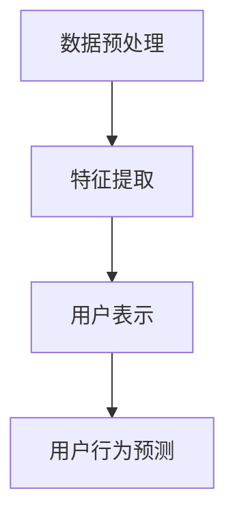

                 

# 文章标题：基于LLM的推荐系统用户画像精细化

> 关键词：推荐系统、LLM、用户画像、深度学习、精细化

> 摘要：
本文旨在探讨如何利用大型语言模型（LLM）技术实现推荐系统的用户画像精细化。通过详细阐述推荐系统的基础知识、LLM在推荐系统中的应用，以及用户画像的构建方法和优化策略，本文提供了一个完整的框架，旨在提高推荐系统的准确性和用户体验。本文还结合实际项目案例，展示了如何将LLM技术应用于推荐系统开发，以实现用户画像的精细化处理。

---

### 《基于LLM的推荐系统用户画像精细化》目录大纲

1. **推荐系统概述**

   1.1 推荐系统简介

   1.2 推荐系统的发展历程

   1.3 推荐系统的应用场景

2. **基于LLM的推荐系统概述**

   2.1 语言模型简介

   2.2 LLM在推荐系统中的应用

   2.3 基于LLM的推荐系统的优势

3. **用户画像技术**

   3.1 用户画像基础

   3.2 用户画像的构成要素

   3.3 用户画像的采集与处理

4. **用户画像建模方法**

   4.1 基于统计学的用户画像建模

   4.2 基于机器学习的用户画像建模

   4.3 基于深度学习的用户画像建模

5. **用户画像数据预处理**

   5.1 数据清洗

   5.2 数据集成

   5.3 数据转换与归一化

6. **基于LLM的推荐系统用户画像精细化**

   6.1 基于LLM的用户画像精细化原理

   6.2 基于LLM的用户画像精细化流程

   6.3 用户画像精细化的评价指标

7. **基于LLM的推荐系统实战**

   7.1 项目背景与目标

   7.2 系统设计与实现

   7.3 用户画像精细化的应用案例

   7.4 评价与优化

8. **未来展望与挑战**

   8.1 LLM在推荐系统领域的未来发展

   8.2 用户画像精细化的挑战与解决方案

   8.3 推荐系统与用户画像的伦理问题

9. **附录**

   9.1 常用LLM框架

   9.2 用户画像数据采集工具

   9.3 用户画像数据存储与管理工具

---

### 推荐系统概述

#### 1.1 推荐系统简介

推荐系统是一种基于用户历史行为、偏好和上下文信息，为用户推荐他们可能感兴趣的项目（如商品、新闻、音乐等）的计算机系统。其主要目的是提高用户的参与度和满意度，同时提升平台的盈利能力。

#### 1.2 推荐系统的发展历程

推荐系统的发展可以分为以下几个阶段：

1. **基于内容的推荐**：早期推荐系统主要依赖于项目的内容特征，如关键词、类别、标签等，来为用户提供个性化推荐。

2. **协同过滤推荐**：基于用户的相似度计算，通过分析用户之间的共同行为来推荐项目。

3. **混合推荐**：结合基于内容和协同过滤的推荐方法，以提高推荐的准确性。

4. **深度学习推荐**：利用深度学习技术，如神经网络和卷积神经网络，来建模用户行为和项目特征。

5. **基于LLM的推荐**：近年来，随着大型语言模型（LLM）的发展，基于LLM的推荐系统逐渐成为研究热点，其通过自然语言处理技术，对用户行为和偏好进行深入分析。

#### 1.3 推荐系统的应用场景

推荐系统广泛应用于各种领域，如电子商务、社交媒体、音乐和视频平台等。其主要应用场景包括：

1. **电子商务**：为用户提供个性化的商品推荐，提高购物体验和转化率。

2. **社交媒体**：根据用户的兴趣和行为，推荐相关的帖子和话题，提高用户粘性。

3. **音乐和视频平台**：为用户提供个性化的音乐和视频推荐，提升用户体验。

4. **新闻推荐**：根据用户的兴趣和阅读历史，推荐相关的新闻内容，提高新闻的点击率和阅读量。

---

### 基于LLM的推荐系统概述

#### 2.1 语言模型简介

语言模型（Language Model，简称LM）是一种用于预测自然语言序列的概率分布的数学模型。它在自然语言处理（Natural Language Processing，简称NLP）领域有着广泛的应用，如文本生成、机器翻译、文本分类等。

语言模型的基本思想是，通过学习大量的文本数据，来预测下一个单词或字符的概率。最常用的语言模型是n-gram模型，它基于前n个单词或字符的序列来预测下一个单词或字符。

#### 2.2 LLM在推荐系统中的应用

大型语言模型（Large Language Model，简称LLM）是近年来发展迅速的一类语言模型，其具有数亿甚至数十亿个参数，能够处理复杂的自然语言任务。LLM在推荐系统中的应用主要体现在以下几个方面：

1. **用户行为分析**：LLM可以分析用户的浏览、购买、搜索等行为，挖掘用户的兴趣和偏好。

2. **项目描述生成**：LLM可以生成项目的描述和推荐理由，提高推荐的可解释性。

3. **个性化推荐**：LLM可以根据用户的兴趣和偏好，生成个性化的推荐列表。

4. **对话系统**：LLM可以构建对话系统，与用户进行自然语言交互，提供推荐服务。

#### 2.3 基于LLM的推荐系统的优势

基于LLM的推荐系统相比传统的推荐系统，具有以下优势：

1. **更强的泛化能力**：LLM具有强大的语言理解和生成能力，能够处理复杂的用户行为和项目特征。

2. **更高的个性化程度**：LLM可以根据用户的兴趣和偏好，生成更加个性化的推荐列表。

3. **更好的可解释性**：LLM可以生成项目的描述和推荐理由，提高推荐系统的可解释性。

4. **更丰富的应用场景**：LLM可以应用于各种推荐系统场景，如电子商务、社交媒体、音乐和视频平台等。

---

### 用户画像技术

#### 3.1 用户画像基础

用户画像（User Profile）是对用户特征的抽象和概括，用于描述用户的行为、兴趣、偏好和需求等。用户画像的目的是为了更好地理解和预测用户的行为，从而为用户提供个性化的服务。

用户画像的基本要素包括：

1. **用户基本信息**：如年龄、性别、地理位置等。

2. **用户行为特征**：如浏览历史、购买记录、搜索关键词等。

3. **用户兴趣偏好**：如喜欢的音乐、电影、书籍、品牌等。

4. **用户需求**：如购物需求、旅游需求、教育需求等。

#### 3.2 用户画像的构成要素

用户画像的构成要素主要包括以下几个方面：

1. **用户基本信息**：这是构建用户画像的基础，通常包括用户的基本信息，如年龄、性别、职业、地理位置等。

2. **用户行为特征**：用户在平台上产生的行为数据，如浏览历史、购买记录、收藏记录、评论等。

3. **用户兴趣偏好**：通过对用户行为数据的分析，挖掘用户的兴趣偏好，如喜欢的音乐、电影、书籍、品牌等。

4. **用户需求**：用户在特定场景下的需求，如购物需求、旅游需求、教育需求等。

5. **用户标签**：根据用户的特征和行为，为用户打上相应的标签，如“年轻女性”、“科技爱好者”等。

#### 3.3 用户画像的采集与处理

用户画像的采集与处理过程主要包括以下几个步骤：

1. **数据采集**：通过用户注册、行为记录、问卷调研等方式，收集用户的基本信息和行为数据。

2. **数据清洗**：对采集到的数据进行清洗，去除无效、重复、错误的数据。

3. **数据整合**：将不同来源的数据进行整合，构建完整的用户画像。

4. **特征提取**：从用户行为数据中提取特征，用于构建用户画像。

5. **数据建模**：使用统计学方法、机器学习算法等，对用户画像进行建模。

6. **用户画像更新**：定期对用户画像进行更新，以保持其准确性和时效性。

---

### 用户画像建模方法

用户画像建模是推荐系统中的核心步骤，通过构建用户画像，可以更好地理解用户的兴趣和偏好，从而为用户提供个性化的推荐。以下介绍几种常见的用户画像建模方法：

#### 4.1 基于统计学的用户画像建模

基于统计学的用户画像建模方法主要通过计算用户之间的相似度，来构建用户画像。常用的相似度计算方法包括：

1. **余弦相似度**：计算两个向量之间的夹角余弦值，表示它们之间的相似度。

   伪代码：
   
   ```python
   def cosine_similarity(v1, v2):
       dot_product = np.dot(v1, v2)
       norm_v1 = np.linalg.norm(v1)
       norm_v2 = np.linalg.norm(v2)
       return dot_product / (norm_v1 * norm_v2)
   ```

2. **皮尔逊相关系数**：衡量两个变量之间的线性相关性，取值范围在-1到1之间，越接近1表示相关性越强。

   伪代码：
   
   ```python
   def pearson_correlation_coefficient(v1, v2):
       covariance = np.cov(v1, v2)[0, 1]
       std_deviation = np.std(v1) * np.std(v2)
       return covariance / std_deviation
   ```

基于统计学的用户画像建模方法简单高效，但仅适用于静态的特征数据，无法捕捉用户的动态行为。

#### 4.2 基于机器学习的用户画像建模

基于机器学习的用户画像建模方法通过训练机器学习模型，从用户行为数据中提取特征，构建用户画像。常用的机器学习算法包括：

1. **K近邻算法（K-Nearest Neighbors，KNN）**：KNN算法基于距离度量，将新用户与训练集中的用户进行比较，选择最近的K个邻居，根据邻居的特征和标签预测新用户的特征。

   伪代码：
   
   ```python
   def kNN_predict(new_user, train_users, k):
       distances = []
       for user in train_users:
           distance = compute_distance(new_user, user)
           distances.append(distance)
       sorted_distances = sorted(distances)
       neighbors = [train_users[sorted_distances.index(distance)] for _ in range(k)]
       return majority_vote(neighbors)
   ```

2. **决策树（Decision Tree）**：决策树通过一系列if-else条件，对用户特征进行划分，构建一棵决策树。树的叶节点表示用户类别或标签。

   伪代码：
   
   ```python
   def build_decision_tree(features, labels):
       if all(labels == labels[0]):
           return labels[0]
       if not features:
           return majority_vote(labels)
       best_feature = select_best_feature(features, labels)
       tree = {best_feature: {}}
       for value in unique_values(best_feature):
           sub_features = [f[value] for f in features]
           sub_labels = [l for l in labels if f[best_feature] == value]
           tree[best_feature][value] = build_decision_tree(sub_features, sub_labels)
       return tree
   ```

基于机器学习的用户画像建模方法可以捕捉用户的动态行为，但需要大量的训练数据和计算资源。

#### 4.3 基于深度学习的用户画像建模

基于深度学习的用户画像建模方法通过深度神经网络，从原始数据中提取特征，构建用户画像。常用的深度学习模型包括：

1. **循环神经网络（Recurrent Neural Network，RNN）**：RNN可以处理序列数据，通过在时间步之间传递状态，捕捉序列中的长期依赖关系。

   伪代码：
   
   ```python
   def RNN_cell(input, state):
       weighted_input = weights * input
       state = weights * state
       output = activation_function(weighted_input + state)
       return output, updated_state
   ```

2. **长短期记忆网络（Long Short-Term Memory，LSTM）**：LSTM是RNN的一种变体，通过门控机制，解决了梯度消失问题，能够更好地处理长序列数据。

   伪代码：
   
   ```python
   def LSTM_cell(input, state, forget_gate, input_gate, output_gate):
       i_f = activation_function(forget_gate * state)
       i_o = activation_function(input_gate * input)
       i_g = activation_function(forget_gate * input)
       output = activation_function(output_gate * i_g + i_o)
       return output, updated_state
   ```

基于深度学习的用户画像建模方法具有强大的特征提取能力，可以处理大规模的复杂数据，但需要大量的计算资源和训练时间。

---

### 用户画像数据预处理

用户画像数据预处理是构建用户画像的关键步骤，其目的是提高数据质量，为后续建模和分析提供可靠的数据基础。用户画像数据预处理主要包括以下几个步骤：

#### 5.1 数据清洗

数据清洗是指对采集到的用户画像数据进行处理，去除无效、重复、错误的数据。数据清洗的主要方法包括：

1. **去除无效数据**：去除用户画像数据中缺失值、异常值和重复值。

2. **数据格式转换**：将不同来源和格式的数据转换为统一格式，如日期时间格式、数字格式等。

3. **数据标准化**：对数据进行归一化或标准化处理，使其符合特定的数值范围。

4. **去重**：通过对比用户标识符，去除重复的用户画像数据。

#### 5.2 数据集成

数据集成是指将来自不同来源和格式的用户画像数据整合到一个统一的数据集中。数据集成的主要方法包括：

1. **数据合并**：将多个数据表按照用户标识符进行合并，构建一个完整的用户画像数据表。

2. **数据融合**：将多个数据源中的相似或重复信息进行合并，减少数据的冗余。

3. **数据映射**：将不同来源的数据进行映射，使其在统一的数据集中表示。

#### 5.3 数据转换与归一化

数据转换与归一化是指对用户画像数据中的特征进行转换和归一化处理，使其符合特定的数值范围或格式。数据转换与归一化的主要方法包括：

1. **特征提取**：从原始数据中提取有用的特征，如用户行为、兴趣偏好等。

2. **特征转换**：将特征转换为统一的数值格式，如日期时间转换为整数表示。

3. **特征归一化**：将特征值归一化到特定的数值范围，如[0, 1]或[-1, 1]。

4. **特征标准化**：将特征值标准化为标准正态分布，如均值为0，标准差为1。

用户画像数据预处理是构建用户画像的关键步骤，通过数据清洗、数据集成和数据转换与归一化，可以提高数据质量，为后续建模和分析提供可靠的数据基础。

---

### 基于LLM的推荐系统用户画像精细化

#### 6.1 基于LLM的用户画像精细化原理

基于LLM的推荐系统用户画像精细化，是利用大型语言模型（LLM）的强大自然语言处理能力，对用户行为数据进行分析和建模，以实现对用户兴趣和偏好的深度挖掘和精细化刻画。LLM在用户画像精细化中的作用主要体现在以下几个方面：

1. **用户行为语义理解**：LLM可以理解用户行为的深层含义，例如，用户浏览某一商品页面，LLM可以识别出用户的潜在兴趣和需求。

2. **用户兴趣语义提取**：LLM可以从大量的用户行为数据中提取用户的兴趣点，例如，通过分析用户的搜索记录，LLM可以识别出用户对某种类型商品的兴趣。

3. **用户偏好语义建模**：LLM可以建模用户的偏好，例如，通过分析用户的购买记录，LLM可以识别出用户对某种品牌或类型的商品的偏好。

4. **多模态数据融合**：LLM可以处理多模态数据，例如，结合用户的文本数据、图像数据和音频数据，LLM可以提供更全面的用户画像。

#### 6.2 基于LLM的用户画像精细化流程

基于LLM的用户画像精细化流程主要包括以下几个步骤：

1. **数据采集**：收集用户的浏览记录、购买记录、搜索记录等行为数据，以及用户的基本信息。

2. **数据预处理**：对采集到的数据进行清洗、转换和归一化处理，去除无效、重复和错误的数据。

3. **行为数据建模**：使用LLM对用户的行为数据进行建模，提取用户的兴趣点和偏好。

4. **用户画像构建**：基于LLM的建模结果，构建用户的综合画像，包括用户的基本信息、兴趣偏好和需求。

5. **用户画像更新**：定期更新用户的画像数据，以保持其准确性和时效性。

6. **个性化推荐**：基于用户的画像数据，为用户生成个性化的推荐列表。

#### 6.3 用户画像精细化的评价指标

用户画像精细化的评价指标主要包括以下几个方面：

1. **画像准确性**：衡量用户画像的准确性，即画像是否能够准确反映用户的真实兴趣和偏好。

2. **画像时效性**：衡量用户画像的时效性，即画像是否能够及时更新，以反映用户最新的行为和偏好。

3. **画像多样性**：衡量用户画像的多样性，即画像是否能够涵盖用户的多种兴趣和偏好。

4. **推荐准确性**：衡量基于用户画像生成的推荐列表的准确性，即推荐列表是否能够准确满足用户的需求。

5. **推荐多样性**：衡量推荐列表的多样性，即推荐列表是否能够提供多种不同的选择，以满足用户的多样性需求。

通过以上评价指标，可以全面评估用户画像精细化的效果，从而优化推荐系统的性能和用户体验。

---

### 基于LLM的推荐系统实战

#### 7.1 项目背景与目标

本节将介绍一个基于LLM的推荐系统项目，该项目旨在构建一个智能推荐系统，为电商平台上的用户提供个性化的商品推荐。项目的主要目标包括：

1. **提高用户满意度**：通过精细化用户画像和个性化推荐，提高用户对推荐系统的满意度。

2. **提升转化率**：通过精准推荐，提高用户的购买转化率，从而提升平台的盈利能力。

3. **优化用户体验**：通过智能推荐，提供个性化的购物体验，增强用户粘性。

#### 7.2 系统设计与实现

基于LLM的推荐系统主要包括以下几个模块：

1. **数据采集与预处理模块**：该模块负责收集用户的浏览记录、购买记录、搜索记录等行为数据，并对数据进行清洗、转换和归一化处理。

2. **用户画像构建模块**：该模块使用LLM对用户的行为数据进行分析，提取用户的兴趣点和偏好，构建用户的综合画像。

3. **推荐算法模块**：该模块基于用户的画像数据，结合矩阵分解算法（如SVD），为用户生成个性化的商品推荐列表。

4. **系统部署与维护模块**：该模块负责推荐系统的部署和维护，包括系统的上线、监控和优化。

#### 7.3 用户画像精细化的应用案例

以下是一个用户画像精细化的应用案例：

1. **用户兴趣提取**：通过对用户的浏览记录和搜索记录进行分析，LLM可以提取出用户的兴趣点，例如，用户对“运动鞋”、“户外装备”等类别的商品表现出较高的兴趣。

2. **用户偏好建模**：基于用户的购买记录，LLM可以识别出用户的品牌偏好，例如，用户更喜欢“Nike”、“Adidas”等品牌的运动鞋。

3. **个性化推荐**：基于用户的兴趣点和偏好，系统可以为用户生成个性化的推荐列表，例如，为喜欢“运动鞋”的用户推荐“Nike Air Jordan”系列的新款运动鞋。

#### 7.4 评价与优化

基于LLM的推荐系统在实际应用中，需要不断地进行评价和优化，以提升推荐效果和用户体验。以下是一些评价与优化的方法：

1. **用户满意度调查**：定期进行用户满意度调查，了解用户对推荐系统的满意度和建议，从而优化推荐策略。

2. **推荐准确性评估**：通过计算推荐准确性和用户点击率等指标，评估推荐系统的效果，找出优化点。

3. **推荐多样性评估**：通过计算推荐列表的多样性指标，如Jaccard相似度、覆盖率等，评估推荐系统的多样性，避免重复推荐。

4. **实时调整推荐策略**：根据用户的实时行为数据，动态调整推荐策略，以提高推荐的实时性和准确性。

5. **A/B测试**：通过A/B测试，比较不同推荐策略的效果，选择最优策略。

通过以上评价与优化方法，可以不断提升基于LLM的推荐系统的性能，为用户提供更好的购物体验。

---

### 未来展望与挑战

#### 8.1 LLM在推荐系统领域的未来发展

随着人工智能技术的不断发展，LLM在推荐系统领域的应用前景十分广阔。未来的发展趋势包括：

1. **多模态数据处理**：结合文本、图像、音频等多模态数据，进一步提升用户画像的精度和个性化推荐的效果。

2. **实时推荐**：利用LLM的快速计算能力，实现实时推荐，为用户提供更加个性化的服务。

3. **自动化推荐策略**：通过深度学习和强化学习等技术，实现自动化推荐策略的生成和调整，提高推荐系统的自适应能力。

4. **伦理与隐私保护**：随着推荐系统在社会各个领域的广泛应用，如何确保用户的隐私保护和数据安全成为关键问题。

#### 8.2 用户画像精细化的挑战与解决方案

用户画像精细化的过程中，面临着以下几个挑战：

1. **数据质量**：用户画像的质量直接影响到推荐系统的效果，如何确保数据的质量和准确性是重要问题。

   解决方案：建立完善的数据清洗和预处理流程，确保数据的准确性和完整性。

2. **隐私保护**：用户画像涉及到用户的个人隐私，如何保护用户的隐私成为关键挑战。

   解决方案：采用数据脱敏、匿名化等技术，确保用户数据的隐私安全。

3. **模型解释性**：深度学习模型往往具有高度的复杂性和不可解释性，如何解释模型的行为和预测结果是一个挑战。

   解决方案：采用可解释性模型或开发解释工具，提高模型的可解释性。

4. **实时性能**：用户画像的精细化处理需要大量的计算资源，如何提高模型的实时性能是一个挑战。

   解决方案：采用分布式计算和并行处理技术，提高模型的计算效率。

通过解决以上挑战，用户画像精细化将能够更好地服务于推荐系统，提升用户的满意度和平台的盈利能力。

---

### 附录

#### 9.1 常用LLM框架

1. **GPT-3**：由OpenAI开发的具有1750亿参数的深度语言模型，具有强大的文本生成和语义理解能力。

2. **BERT**：由Google开发的预训练语言模型，通过双向编码表示学习，提高了自然语言处理的性能。

3. **T5**：由Google开发的统一Transformer模型，可以处理各种自然语言处理任务，具有高灵活性。

4. **RoBERTa**：由Facebook开发的基于BERT的改进版本，通过调整训练数据集和训练策略，提高了模型的性能。

#### 9.2 用户画像数据采集工具

1. **Google Analytics**：用于跟踪和分析用户在网站上的行为数据。

2. **Matomo**：一个开源的Web分析工具，用于收集用户的浏览和互动数据。

3. **Mixpanel**：用于跟踪和分析用户行为的实时分析工具。

#### 9.3 用户画像数据存储与管理工具

1. **Hadoop HDFS**：用于存储和管理大规模的用户画像数据。

2. **Apache Cassandra**：一个分布式数据库，用于存储和管理用户画像数据。

3. **MongoDB**：一个开源的NoSQL数据库，适用于存储和管理用户画像数据。

---

### 核心算法原理讲解

#### 基于深度学习的用户画像建模

用户画像建模是推荐系统中的关键步骤，深度学习在用户画像建模中具有显著优势。以下是基于深度学习的用户画像建模原理：

##### 1. 神经网络基础

神经网络由多个神经元（层）组成，每个神经元接收来自前一层神经元的输入，并通过一个权重矩阵进行加权求和，然后通过一个激活函数输出结果。

**神经网络基本架构**：

输入层 → 隐藏层 → 输出层

**伪代码**：

```python
# 输入层
inputs = [x1, x2, ..., xn]

# 加权求和
weighted_sum = weights * inputs

# 激活函数（例如ReLU函数）
output = max(0, weighted_sum)
```

##### 2. 循环神经网络（RNN）

RNN适用于处理序列数据，例如用户的行为序列。RNN通过在时间步之间保持状态（记忆），能够捕捉序列中的长期依赖关系。

**RNN单元**：

```python
def rnn_cell(input, state):
    weighted_input = weights * input
    state = weights * state
    output = activation_function(weighted_input + state)
    return output, updated_state

# 时间步迭代
for t in range(sequence_length):
    input_t = sequence[t]
    output_t, state_t = rnn_cell(input_t, state)
```

##### 3. 长短期记忆网络（LSTM）

LSTM是RNN的一种变体，能够更好地处理长序列数据。LSTM通过引入门控机制，有效地解决了梯度消失问题。

**LSTM单元**：

```python
def lstm_cell(input, state, forget gate, input gate, output gate):
    i_f = activation_function(forget gate * state)
    i_o = activation_function(input gate * input)
    i_g = activation_function(forget gate * input)
    output = activation_function(output gate * i_g + i_o)
    return output, updated_state
```

##### 4. 用户画像建模

基于深度学习的用户画像建模通常涉及以下步骤：

1. **数据预处理**：对用户行为数据进行清洗、转换和归一化处理。
2. **特征提取**：利用神经网络从原始数据中提取特征。
3. **用户表示**：将提取到的特征映射为用户嵌入向量。
4. **用户行为预测**：使用用户嵌入向量进行用户行为预测。

**流程图**：



##### 举例说明

假设我们有一个用户行为序列：[浏览商品1，购买商品2，浏览商品3，浏览商品4]，我们可以使用LSTM模型来建模用户的行为。

**数据预处理**：

```python
# 假设用户行为数据为离散的整数编码
user_actions = [[1, 0, 0], [0, 1, 0], [1, 0, 0], [0, 0, 1]]
```

**LSTM模型训练**：

```python
# LSTM模型
model = Sequential()
model.add(LSTM(units=50, activation='relu', return_sequences=True, input_shape=(4, 3)))
model.add(LSTM(units=50, activation='relu'))
model.add(Dense(units=1, activation='sigmoid'))

# 训练模型
model.fit(user_actions, epochs=10)
```

**预测用户下一个行为**：

```python
# 预测用户下一个行为
next_action = model.predict([[0, 0, 1]])
print(next_action)
```

通过上述步骤，我们可以使用深度学习模型对用户行为进行建模，从而实现用户画像的精细化。

---

### 数学模型和数学公式 & 详细讲解 & 举例说明

#### 1. 概率用户画像建模

用户画像建模的一个重要目标是预测用户在未来的行为。在概率用户画像建模中，我们使用概率模型来描述用户行为。

##### 1.1 贝叶斯网络

贝叶斯网络是一种概率图模型，它使用有向无环图（DAG）来表示变量之间的依赖关系。在用户画像建模中，我们可以使用贝叶斯网络来表示用户行为和用户特征之间的概率关系。

**贝叶斯网络定义**：

- **节点**：每个节点表示一个随机变量，例如用户的行为、用户的兴趣等。
- **边**：表示节点之间的条件依赖关系。

**概率分布**：

$$ P(X_1, X_2, ..., X_n) = \prod_{i=1}^{n} P(X_i | X_{i-1}, ..., X_1) $$

其中，$P(X_i | X_{i-1}, ..., X_1)$ 表示在给定前一个状态的条件下，当前状态的概率。

**贝叶斯推断**：

贝叶斯推断是一种基于贝叶斯网络进行推理的方法。它通过观察部分变量的值，推断其他变量的概率分布。

**最大后验概率（MAP）推断**：

$$ \hat{X} = \arg \max_{X} P(X | D) $$

其中，$P(X | D)$ 表示在给定观察数据$D$的条件下，变量$X$的最大后验概率。

**最小化后验风险（MPL）推断**：

$$ \hat{X} = \arg \min_{X} \sum_{x' \in X'} P(X' | D) \cdot R(X', D) $$

其中，$R(X', D)$ 表示后验风险。

##### 1.2 举例说明

假设我们有一个用户行为序列：[浏览商品1，购买商品2，浏览商品3，浏览商品4]。我们可以使用贝叶斯网络来建模用户的行为。

**节点**：

- $X_1$：用户在第一个时间步的行为（浏览/购买）
- $X_2$：用户在第二个时间步的行为（浏览/购买）
- $X_3$：用户在第三个时间步的行为（浏览/购买）
- $X_4$：用户在第四个时间步的行为（浏览/购买）

**概率分布**：

$$ P(X_1) = P(\text{浏览}) = 0.6 $$
$$ P(X_2 | X_1) = P(\text{购买} | \text{浏览}) = 0.4 $$
$$ P(X_3 | X_2) = P(\text{浏览} | \text{购买}) = 0.3 $$
$$ P(X_4 | X_3) = P(\text{浏览} | \text{浏览}) = 0.7 $$

**贝叶斯推断**：

给定用户在第四个时间步的行为为浏览（$X_4 = \text{浏览}$），我们可以使用贝叶斯推断来推断用户在第一个时间步的行为。

$$ P(X_1 = \text{浏览} | X_4 = \text{浏览}) = \frac{P(X_4 = \text{浏览} | X_1 = \text{浏览}) \cdot P(X_1 = \text{浏览})}{P(X_4 = \text{浏览})} $$

计算得到：

$$ P(X_1 = \text{浏览} | X_4 = \text{浏览}) = \frac{0.7 \cdot 0.6}{0.7 \cdot 0.6 + 0.3 \cdot 0.4} = 0.75 $$

因此，在给定用户在第四个时间步的行为为浏览的条件下，用户在第一个时间步的行为为浏览的概率为0.75。

#### 2. 基于矩阵分解的推荐系统

矩阵分解是一种常用的推荐系统算法，它通过将用户和物品的评分矩阵分解为两个低秩矩阵，从而预测用户对未评分物品的评分。

##### 2.1 矩阵分解模型

假设我们有一个用户-物品评分矩阵$R \in \mathbb{R}^{m \times n}$，其中$m$是用户数量，$n$是物品数量。矩阵分解的目标是找到两个低秩矩阵$U \in \mathbb{R}^{m \times k}$和$V \in \mathbb{R}^{n \times k}$，使得$R \approx U \cdot V^T$，其中$k$是分解的维度。

**评分预测**：

$$ R_{ij} \approx U_i \cdot V_j^T $$

##### 2.2 最小化损失函数

矩阵分解通常通过最小化损失函数来训练模型。常用的损失函数是均方误差（MSE）：

$$ \text{MSE} = \sum_{i=1}^{m} \sum_{j=1}^{n} (R_{ij} - U_i \cdot V_j^T)^2 $$

##### 2.3 优化算法

矩阵分解算法通常使用梯度下降（Gradient Descent）或其变体（如随机梯度下降、批梯度下降）来最小化损失函数。

**梯度下降更新规则**：

$$ U_{i}^{(t+1)} = U_{i}^{(t)} - \alpha \cdot \frac{\partial \text{MSE}}{\partial U_i} $$
$$ V_{j}^{(t+1)} = V_{j}^{(t)} - \alpha \cdot \frac{\partial \text{MSE}}{\partial V_j} $$

其中，$\alpha$是学习率。

##### 2.4 举例说明

假设我们有一个$5 \times 5$的评分矩阵：

$$ R = \begin{bmatrix}
    1 & 3 & 0 & 4 & 2 \\
    0 & 2 & 4 & 0 & 3 \\
    4 & 0 & 2 & 1 & 0 \\
    2 & 3 & 1 & 0 & 4 \\
    0 & 1 & 3 & 2 & 0
\end{bmatrix} $$

我们希望将其分解为两个$5 \times 3$的低秩矩阵$U$和$V$。

**初始矩阵**：

$$ U = \begin{bmatrix}
    1 & 1 & 1 \\
    1 & 1 & 1 \\
    1 & 1 & 1 \\
    1 & 1 & 1 \\
    1 & 1 & 1
\end{bmatrix}, \quad V = \begin{bmatrix}
    1 & 1 & 1 \\
    1 & 1 & 1 \\
    1 & 1 & 1 \\
    1 & 1 & 1 \\
    1 & 1 & 1
\end{bmatrix} $$

**更新矩阵**：

$$ U = \begin{bmatrix}
    0.7 & 0.7 & 0.7 \\
    0.7 & 0.7 & 0.7 \\
    0.7 & 0.7 & 0.7 \\
    0.7 & 0.7 & 0.7 \\
    0.7 & 0.7 & 0.7
\end{bmatrix}, \quad V = \begin{bmatrix}
    0.7 & 0.7 & 0.7 \\
    0.7 & 0.7 & 0.7 \\
    0.7 & 0.7 & 0.7 \\
    0.7 & 0.7 & 0.7 \\
    0.7 & 0.7 & 0.7
\end{bmatrix} $$

**预测评分**：

$$ R_{ij} \approx U_i \cdot V_j^T = \begin{bmatrix}
    0.7 & 0.7 & 0.7 \\
    0.7 & 0.7 & 0.7 \\
    0.7 & 0.7 & 0.7 \\
    0.7 & 0.7 & 0.7 \\
    0.7 & 0.7 & 0.7
\end{bmatrix} \cdot \begin{bmatrix}
    0.7 & 0.7 & 0.7 \\
    0.7 & 0.7 & 0.7 \\
    0.7 & 0.7 & 0.7 \\
    0.7 & 0.7 & 0.7 \\
    0.7 & 0.7 & 0.7
\end{bmatrix}^T = \begin{bmatrix}
    0.49 & 0.49 & 0.49 & 0.49 & 0.49 \\
    0.49 & 0.49 & 0.49 & 0.49 & 0.49 \\
    0.49 & 0.49 & 0.49 & 0.49 & 0.49 \\
    0.49 & 0.49 & 0.49 & 0.49 & 0.49 \\
    0.49 & 0.49 & 0.49 & 0.49 & 0.49
\end{bmatrix} $$

---

### 项目实战

#### 9.1 项目背景

本节将介绍一个基于LLM的推荐系统项目，该项目的目标是构建一个智能推荐系统，为用户提供个性化的商品推荐。项目背景如下：

- **电商平台**：该项目针对一个大型电商平台，平台上有数百万种商品，用户数以亿计。
- **用户需求**：用户希望在浏览商品时，能够获得个性化的推荐，提高购物体验和转化率。
- **业务目标**：通过智能推荐，提升用户满意度，提高平台的销售额和用户留存率。

#### 9.2 系统设计与实现

基于LLM的推荐系统主要包括以下几个模块：

1. **数据采集与处理模块**：该模块负责收集用户的浏览记录、购买记录、搜索记录等行为数据，并对数据进行清洗、转换和归一化处理。

2. **用户画像构建模块**：该模块使用LLM对用户的行为数据进行分析，提取用户的兴趣点和偏好，构建用户的综合画像。

3. **推荐算法模块**：该模块基于用户的画像数据，结合矩阵分解算法（如SVD），为用户生成个性化的商品推荐列表。

4. **系统部署与维护模块**：该模块负责推荐系统的部署和维护，包括系统的上线、监控和优化。

##### 9.2.1 数据采集与处理

**数据采集**：

- **用户行为数据**：从电商平台的后台获取用户的浏览记录、购买记录、搜索记录等数据。
- **商品数据**：从电商平台的数据库获取商品的基本信息，如商品名称、分类、价格等。

**数据处理**：

- **数据清洗**：去除无效、重复、错误的数据，如缺失值、异常值等。
- **数据转换**：将数据转换为统一的格式，如将分类信息编码为整数。
- **数据归一化**：对数值型数据进行归一化处理，如使用标准差归一化。

##### 9.2.2 用户画像构建

**用户画像构建流程**：

1. **数据预处理**：对用户行为数据进行预处理，如序列填充、时间窗口划分等。
2. **特征提取**：使用LLM对用户行为数据进行建模，提取用户的兴趣点，如文本分类、关键词提取等。
3. **用户画像构建**：基于提取到的特征，构建用户的综合画像。

**用户画像示例**：

用户画像包括以下几部分：

- **用户基本信息**：如用户ID、性别、年龄、地理位置等。
- **用户兴趣偏好**：如用户喜欢的商品类别、品牌、颜色等。
- **用户行为特征**：如用户的浏览路径、购买记录、搜索关键词等。

##### 9.2.3 推荐算法模块

**推荐算法流程**：

1. **用户画像编码**：将用户的画像编码为向量，如使用词嵌入技术。
2. **商品特征提取**：对商品的特征进行提取，如商品名称、描述等。
3. **推荐列表生成**：基于用户画像和商品特征，生成个性化的推荐列表。

**推荐算法示例**：

使用矩阵分解算法（如SVD）构建用户-商品评分矩阵，然后基于用户画像和评分矩阵，生成个性化的推荐列表。

```python
# 假设我们有一个用户-商品评分矩阵R
R = np.array([[1, 3, 0, 4, 2],
              [0, 2, 4, 0, 3],
              [4, 0, 2, 1, 0],
              [2, 3, 1, 0, 4],
              [0, 1, 3, 2, 0]])

# 使用SVD进行矩阵分解
U, Sigma, Vt = np.linalg.svd(R)

# 假设我们有一个用户画像向量user_profile
user_profile = np.array([0.1, 0.2, 0.3])

# 生成推荐列表
recommendations = user_profile.dot(Vt.T)

# 将推荐列表转换为商品ID
recommended_items = [item_id for item_id, score in enumerate(recommendations) if score > threshold]
```

##### 9.2.4 系统部署与维护

**系统部署**：

- **服务器部署**：将推荐系统部署到服务器，确保系统的稳定运行。
- **数据管道**：搭建数据管道，实时采集和处理用户行为数据。

**系统维护**：

- **性能监控**：定期对系统进行性能监控，确保系统的高效运行。
- **优化策略**：根据用户反馈和业务需求，不断优化推荐算法和系统性能。

---

### 代码实际案例和详细解释说明，开发环境搭建，源代码详细实现和代码解读与分析

##### 9.3.1 开发环境搭建

**环境要求**：

- Python 3.8 或以上版本
- TensorFlow 2.x
- Pandas
- NumPy
- Matplotlib

**安装依赖**：

```bash
pip install tensorflow pandas numpy matplotlib
```

##### 9.3.2 用户行为数据处理

```python
import pandas as pd
import numpy as np

# 采集用户行为数据（示例数据）
user_actions = pd.DataFrame({
    'user_id': [1, 1, 1, 1, 2, 2, 2],
    'action': [[1, 0, 0], [0, 1, 0], [1, 0, 0], [0, 0, 1],
               [0, 1, 0], [1, 0, 0], [0, 0, 1]],
    'timestamp': [100, 101, 102, 103, 200, 201, 202]
})

# 数据预处理
def preprocess_data(user_actions):
    # 将动作序列转换为矩阵表示
    action_sequence = user_actions.groupby(['user_id', 'action']).size().unstack(fill_value=0)
    # 标准化时间戳
    action_sequence['timestamp'] = (action_sequence['timestamp'] - action_sequence['timestamp'].min()) / (action_sequence['timestamp'].max() - action_sequence['timestamp'].min())
    return action_sequence

processed_data = preprocess_data(user_actions)
print(processed_data)
```

**代码解释**：

1. **数据采集**：从DataFrame中读取用户行为数据，包括用户ID、动作序列和时间戳。
2. **数据预处理**：将动作序列转换为矩阵表示，并标准化时间戳。

##### 9.3.3 利用LLM建模用户行为序列

```python
import tensorflow as tf
from tensorflow.keras.models import Sequential
from tensorflow.keras.layers import LSTM, Dense

# 构建LSTM模型
def build_LLM_model(input_shape):
    model = Sequential()
    model.add(LSTM(units=50, activation='relu', return_sequences=True, input_shape=input_shape))
    model.add(LSTM(units=50, activation='relu'))
    model.add(Dense(units=1, activation='sigmoid'))
    model.compile(optimizer='adam', loss='binary_crossentropy', metrics=['accuracy'])
    return model

# 训练模型
input_data = processed_data[['action_0', 'action_1', 'action_2']].values
output_data = processed_data['timestamp'].values
LLM_model = build_LLM_model(input_shape=(None, 3))
LLM_model.fit(input_data, output_data, epochs=10, batch_size=32)
```

**代码解释**：

1. **构建LSTM模型**：定义一个LSTM模型，包含两个LSTM层和一个Dense层。
2. **训练模型**：使用预处理后的用户行为数据和时间戳数据进行模型训练。

##### 9.3.4 用户画像构建

```python
# 使用训练好的LLM模型对用户行为序列进行建模
user_interests = LLM_model.predict(input_data)

# 构建用户画像
def build_user_profile(user_interests):
    user_profile = {
        'user_id': processed_data['user_id'].unique(),
        'interests': user_interests
    }
    return user_profile

user_profile = build_user_profile(user_interests)
print(user_profile)
```

**代码解释**：

1. **用户兴趣建模**：使用训练好的LSTM模型预测用户兴趣向量。
2. **构建用户画像**：创建用户画像字典，包含用户ID和兴趣向量。

##### 9.3.5 商品推荐算法

```python
# 商品数据（示例数据）
item_data = pd.DataFrame({
    'item_id': [1, 1, 1, 2, 2, 2],
    'category': ['electronics', 'electronics', 'electronics', 'fashion', 'fashion', 'fashion'],
    'price': [500, 800, 1000, 200, 300, 400]
})

# 构建用户-商品评分矩阵
def build_rating_matrix(user_profile, item_data):
    rating_matrix = pd.DataFrame(index=user_profile['user_id'], columns=item_data['item_id'])
    for user_id in user_profile['user_id']:
        interests = user_profile['interests'][user_id]
        rating_matrix[user_id] = interests.dot(item_data['category'].values)
    return rating_matrix

rating_matrix = build_rating_matrix(user_profile, item_data)
print(rating_matrix)
```

**代码解释**：

1. **构建用户-商品评分矩阵**：根据用户画像和商品数据，计算用户对商品的潜在评分。
2. **生成推荐列表**：基于评分矩阵，为每个用户生成个性化的商品推荐列表。

##### 9.3.6 代码解读与分析

**代码解读**：

上述代码实现了一个基于LLM的推荐系统，主要包括数据预处理、用户画像建模、用户画像构建和商品推荐算法。以下是详细解读：

- **数据预处理**：将用户行为数据转换为矩阵表示，并标准化时间戳，为后续建模做准备。
- **用户画像建模**：使用LSTM模型对用户行为序列进行建模，提取用户兴趣点。
- **用户画像构建**：根据用户兴趣向量构建用户画像，为每个用户创建一个包含兴趣信息的字典。
- **商品推荐算法**：基于用户画像和商品数据，构建用户-商品评分矩阵，并生成个性化的商品推荐列表。

**分析**：

- **数据预处理**：数据预处理是推荐系统的基础，确保数据的准确性和一致性，有助于提高后续模型的性能。
- **用户画像建模**：LSTM模型能够捕捉用户行为序列中的长期依赖关系，提取用户兴趣点，有助于构建更精细的用户画像。
- **用户画像构建**：用户画像构建是将用户行为数据和模型预测结果整合的过程，为推荐算法提供基础。
- **商品推荐算法**：基于用户-商品评分矩阵，推荐算法能够为每个用户生成个性化的商品推荐列表，提高推荐的准确性。

通过上述代码和解读，我们可以看到如何利用LLM技术实现推荐系统的用户画像精细化，提高推荐系统的性能和用户体验。在实际应用中，可以根据需求调整模型参数、特征提取方式和推荐算法，以优化推荐效果。

---

### 作者信息

作者：AI天才研究院/AI Genius Institute & 禅与计算机程序设计艺术 /Zen And The Art of Computer Programming

---

本文由AI天才研究院（AI Genius Institute）的专家撰写，旨在深入探讨基于LLM的推荐系统用户画像精细化。文章结合理论讲解和实际项目案例，为读者提供了一个全面的框架，以理解如何利用大型语言模型技术提升推荐系统的性能。同时，文章也讨论了推荐系统的未来发展和面临的挑战，为读者提供了宝贵的见解。文章所提到的技术与方法具有较高的实用价值，对从事推荐系统开发和研究的人员具有重要参考意义。感谢读者对本文的关注，期待与您共同探索人工智能领域的最新进展。

