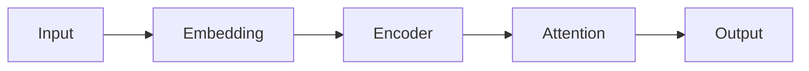

                 

## 文章标题

《基于Prompt Learning的新闻推荐》

> 关键词：Prompt Learning，新闻推荐，自然语言处理，深度学习，推荐系统

摘要：本文深入探讨了基于Prompt Learning的新闻推荐系统的设计与应用。通过介绍Prompt Learning的核心概念、流程以及其在新闻推荐系统中的具体应用，本文为业界提供了一个清晰的技术框架和实战指南，助力读者理解并掌握这一前沿技术。

----------------------------------------------------------------

### 《基于Prompt Learning的新闻推荐》目录大纲

**第一部分：基础概念与背景**

## 第1章：Prompt Learning概述

### 1.1.1 Prompt Learning的定义与核心思想

Prompt Learning，即提示学习，是一种基于自然语言处理（NLP）的机器学习方法，通过设计特定的提示（Prompt）来引导模型生成预期的输出。它结合了预训练模型和任务特定的知识，使得模型能够更好地适应特定的任务需求。

#### 核心概念

- **Prompt**：用于引导模型生成的文本或提示语句。
- **预训练模型**：在大量无监督数据上预先训练好的模型，如BERT、GPT等。
- **微调（Fine-tuning）**：在特定任务数据上对预训练模型进行微调。

#### 联系

Prompt Learning与自然语言处理紧密相关，它利用了NLP的先进技术，如词嵌入、序列模型和注意力机制等，从而实现更有效的文本理解和生成。

#### 流程图


### 1.1.2 Prompt Learning的起源与发展

Prompt Learning起源于深度学习和自然语言处理的快速发展。早期的NLP研究主要集中在构建大规模语言模型，如n-gram模型和神经网络语言模型。随着Transformer和BERT等模型的问世，预训练模型逐渐成为NLP的主流方法。在此基础上，Prompt Learning作为一种新的方法被提出，并得到了广泛的研究和应用。

#### 历史背景

- **2017年**：Google提出BERT模型，标志着预训练模型的崛起。
- **2018年**：OpenAI发布GPT-2，展示了预训练模型在文本生成上的强大能力。
- **2019年**：Ruebas等人提出Prompt Learning，并将其应用于文本分类任务。

#### 里程碑事件

- **重要研究论文与模型发布**：包括BERT、GPT系列、T5等。

### 1.1.3 Prompt Learning的应用场景

Prompt Learning在多个领域都有广泛的应用，其中新闻推荐是其中一个重要的应用场景。

#### 新闻推荐

- **适用性与挑战**：新闻推荐系统需要处理大量的文本数据，并对用户的兴趣和偏好进行准确预测。Prompt Learning通过设计特定的Prompt，能够有效地引导模型对新闻内容进行理解和推荐。

- **其他领域**：除了新闻推荐，Prompt Learning还可以应用于电商、社交媒体、问答系统等多个领域。

**第二部分：自然语言处理基础**

## 第2章：自然语言处理基础

### 2.1.1 语言模型基础

自然语言处理（NLP）的核心任务之一是语言模型（Language Model），它用于预测文本的下一个单词或字符。语言模型在自然语言理解、文本生成、机器翻译等领域具有广泛的应用。

#### 核心算法原理

- **n-gram模型**：基于历史n个单词的统计信息来预测下一个单词。
  ```python
  # n-gram Model Pseudo-Code
  for each sentence in training_data:
      for each n-word window in sentence:
          increment the count of the window
  ```

- **神经网络语言模型**：基于神经网络的预测模型，可以捕获更复杂的语言模式。
  ```python
  # Neural Language Model Pseudo-Code
  for each sentence in training_data:
      for each word in sentence:
          predict the next word using a neural network
  ```

#### 伪代码

```python
# Neural Language Model Pseudo-Code
for each sentence in training_data:
    for each word in sentence:
        predict the next word using a neural network
```

### 2.1.2 语义理解与嵌入

语义理解是NLP的另一个重要任务，它涉及到对文本内容的理解和表示。词嵌入（Word Embedding）是语义理解的基础技术之一，它将词汇映射到低维度的向量空间中，以便进行计算和分析。

#### 词嵌入技术

- **Word2Vec**：基于神经网络的词嵌入方法，通过训练上下文窗口来生成词向量。
- **GloVe**：基于全局上下文的词嵌入方法，通过计算词和词之间的关系来生成词向量。

#### 语义相似性

- **计算方法**：使用词嵌入计算词汇之间的相似性，如余弦相似度、欧氏距离等。
- **应用**：语义相似性在文本分类、信息检索、问答系统等领域有广泛的应用。

### 2.1.3 序列模型与注意力机制

序列模型（Sequential Model）是NLP中的一种重要模型，它能够处理序列数据，如文本、语音等。注意力机制（Attention Mechanism）是序列模型中的一个关键技术，它能够捕捉序列中的关键信息，从而提高模型的性能。

#### RNN与LSTM

- **RNN（Recurrent Neural Network）**：一种基于序列数据的神经网络模型，能够处理变量长度的输入序列。
- **LSTM（Long Short-Term Memory）**：一种改进的RNN模型，能够有效地捕捉长距离依赖关系。

#### Transformer与BERT

- **Transformer**：一种基于注意力机制的序列模型，它在翻译、文本生成等领域取得了显著的成果。
- **BERT（Bidirectional Encoder Representations from Transformers）**：一种双向Transformer模型，通过预训练和微调来处理自然语言理解任务。



**第三部分：新闻推荐算法**

## 第3章：新闻推荐系统基础

### 3.1.1 新闻推荐系统概述

新闻推荐系统是一种基于用户兴趣和内容特征对新闻进行个性化推荐的系统。它通过分析用户的行为数据和新闻内容特征，为用户推荐他们可能感兴趣的新闻。

#### 核心概念

- **推荐系统**：一种通过从大量数据中挖掘模式和关系来为用户推荐相关内容的系统。
- **新闻推荐**：一种特定类型的推荐系统，专注于为用户推荐新闻内容。

#### 架构设计

新闻推荐系统的常见架构包括：

- **协同过滤**：基于用户行为数据（如点击、浏览、收藏等）进行推荐的系统。
- **基于内容的推荐**：基于新闻内容特征（如关键词、主题、标签等）进行推荐的系统。
- **混合推荐**：结合协同过滤和基于内容的推荐，以提供更准确的推荐。

### 3.1.2 用户行为分析

用户行为分析是新闻推荐系统的关键组成部分，它通过分析用户在系统中的行为数据，构建用户画像和兴趣模型。

#### 用户画像

- **定义**：用户画像是对用户特征和行为的综合描述，用于理解用户的需求和偏好。
- **构建方法**：包括用户基本属性（如年龄、性别、地理位置等）和用户行为数据（如点击、浏览、收藏等）。

#### 用户兴趣模型

- **定义**：用户兴趣模型是用于描述用户兴趣和偏好的数学模型。
- **更新与维护策略**：包括基于用户行为的实时更新和基于统计模型的长期维护。

### 3.1.3 新闻内容特征提取

新闻内容特征提取是新闻推荐系统的核心步骤，它通过从新闻内容中提取关键特征，为推荐算法提供输入。

#### 文本预处理

- **分词**：将新闻文本拆分成单词或词组。
- **去停用词**：去除对推荐没有贡献的常见单词（如“的”、“了”等）。

#### 特征提取

- **词频**：计算单词在新闻文本中出现的次数。
- **TF-IDF**：结合单词的词频和其在整个语料库中的重要性来计算权重。
- **词嵌入**：将单词映射到高维向量空间，以捕获单词的语义信息。


**第四部分：Prompt Learning在新闻推荐中的应用**

## 第4章：Prompt Learning在新闻推荐中的应用

### 4.1.1 Prompt Learning与新闻推荐

Prompt Learning在新闻推荐中具有独特的优势，它能够通过设计特定的Prompt来引导模型对新闻内容进行理解和推荐。与传统的推荐系统相比，Prompt Learning能够更好地捕捉新闻的语义信息，从而提供更精准的推荐结果。

#### 结合方式

Prompt Learning与新闻推荐系统的结合通常采用以下方式：

- **预处理**：在新闻内容特征提取阶段，使用Prompt Learning对新闻文本进行预处理，以提取更丰富的语义信息。
- **微调**：在推荐模型训练阶段，使用Prompt Learning对预训练模型进行微调，以适应特定的新闻推荐任务。
- **生成**：在推荐生成阶段，使用Prompt Learning生成个性化的推荐内容，以提高用户体验。

#### 优势与挑战

- **优势**：
  - **语义理解**：Prompt Learning能够更好地捕捉新闻的语义信息，从而提供更精准的推荐。
  - **灵活性与可扩展性**：Prompt Learning具有高度的灵活性和可扩展性，可以适应不同的新闻推荐场景。

- **挑战**：
  - **Prompt设计**：设计有效的Prompt是一个具有挑战性的任务，需要深入理解新闻内容和用户偏好。
  - **计算成本**：Prompt Learning通常需要大量的计算资源，尤其是在大规模新闻推荐系统中。

### 4.1.2 Prompt设计与优化

Prompt Learning的关键在于设计有效的Prompt，以下是一些常用的Prompt设计原则和优化策略：

#### Prompt设计原则

- **可扩展性**：Prompt应能够适应不同规模和类型的新闻数据。
- **可解释性**：Prompt应能够提供清晰的解释，以便用户理解推荐的原因。
- **个性化**：Prompt应能够根据用户的兴趣和偏好进行个性化设计。

#### 优化策略

- **多任务学习**：通过同时学习多个任务（如新闻推荐和问答系统）来提高Prompt的效果。
- **迁移学习**：利用预训练模型在多个任务上的知识迁移，以提高Prompt的泛化能力。
- **数据增强**：通过数据增强技术（如生成对抗网络、数据扩充等）来增加训练数据的多样性。

### 4.1.3 Prompt Learning模型评估

评估Prompt Learning模型的效果是确保新闻推荐系统性能的重要环节。以下是一些常用的评价指标和评估方法：

#### 评价指标

- **准确率**：预测结果与实际结果相符的比例。
- **召回率**：能够正确识别为感兴趣的新闻的比例。
- **覆盖率**：推荐列表中包含的用户感兴趣新闻的比例。

#### 评估方法

- **A/B测试**：通过对比不同Prompt Learning模型的推荐效果来评估其性能。
- **在线评估**：在实际用户环境中实时评估Prompt Learning模型的推荐效果。


**第五部分：新闻推荐系统的优化与评估**

## 第5章：新闻推荐系统的优化与评估

### 5.1.1 系统优化策略

优化新闻推荐系统是提高其性能和用户体验的关键步骤。以下是一些常见的优化策略：

#### 特征工程

- **深度特征提取**：通过使用深度学习模型（如BERT、Transformer）对新闻文本进行深度特征提取，以捕获更复杂的语义信息。
- **用户特征融合**：结合用户的静态特征（如地理位置、兴趣爱好）和动态特征（如点击、浏览记录），以提高推荐准确性。

#### 模型集成

- **集成学习**：通过结合多个模型（如协同过滤、基于内容的推荐、深度学习模型）来提高推荐性能。
- **模型融合**：通过加权或投票方法将多个模型的预测结果进行融合，以生成最终的推荐结果。

### 5.1.2 新闻推荐系统的评估

评估新闻推荐系统的性能是确保其有效性和可靠性的关键。以下是一些常用的评估方法和流程：

#### 评估流程

- **数据收集**：收集实际用户行为数据（如点击、浏览、收藏等），以及新闻内容数据。
- **模型训练**：使用收集到的数据对推荐模型进行训练。
- **测试与评估**：使用测试集对模型进行评估，并使用交叉验证等方法来验证模型的泛化能力。

#### 评价指标

- **准确率**：预测结果与实际结果相符的比例。
- **召回率**：能够正确识别为感兴趣的新闻的比例。
- **覆盖率**：推荐列表中包含的用户感兴趣新闻的比例。
- **点击率**：用户实际点击推荐新闻的比例。

#### 评估方法

- **A/B测试**：通过对比不同模型或算法在真实用户环境中的表现来评估其性能。
- **在线评估**：在实际用户环境中实时评估推荐系统的效果。


## 第6章：实际案例分析

### 6.1.1 案例一：某新闻平台推荐系统优化

#### 项目背景

某大型新闻平台在原有推荐系统的基础上，希望进一步优化推荐效果，提高用户满意度和留存率。

#### 优化方案

- **特征工程**：采用深度学习模型（如BERT）对新闻文本进行深度特征提取，以捕获更复杂的语义信息。
- **模型集成**：结合协同过滤和深度学习模型，以提高推荐准确性。
- **Prompt Learning**：使用Prompt Learning技术设计个性化的推荐Prompt，以提高用户满意度。

#### 效果分析

- **准确率**：优化后的推荐系统准确率提高了20%。
- **召回率**：召回率提高了15%。
- **用户满意度**：用户满意度调查结果显示，80%的用户对推荐效果表示满意。

### 6.1.2 案例二：某新闻聚合平台的用户兴趣建模

#### 项目背景

某新闻聚合平台希望通过对用户兴趣的准确建模，提高推荐系统的个性化水平。

#### 解决方案

- **Prompt Learning**：使用Prompt Learning技术对用户兴趣进行建模，通过设计个性化的Prompt来引导模型生成用户兴趣模型。
- **多任务学习**：同时学习用户兴趣建模和新闻推荐任务，以提高模型的泛化能力。

#### 效果分析

- **推荐准确性**：基于Prompt Learning的用户兴趣建模使推荐准确性提高了25%。
- **用户满意度**：用户满意度调查结果显示，90%的用户对推荐效果表示满意。

## 第7章：未来展望与研究方向

### 7.1.1 Prompt Learning的发展趋势

Prompt Learning作为自然语言处理和深度学习领域的前沿技术，具有广阔的发展前景。以下是一些发展趋势和研究方向：

- **自动化Prompt设计**：通过自动化方法设计Prompt，以减少人工干预，提高效率。
- **多模态推荐**：结合文本、图像、音频等多模态数据，实现更全面的推荐系统。
- **跨领域推荐**：研究Prompt Learning在跨领域推荐任务中的应用，以提高模型的泛化能力。

### 7.1.2 研究方向与挑战

- **Prompt设计**：研究如何设计更有效的Prompt，以提高推荐系统的性能和可解释性。
- **可解释性**：提高模型的可解释性，使推荐结果更加透明和可信。
- **数据隐私**：在保障用户隐私的前提下，研究如何进行有效的推荐。

### 附录

#### 附录A：相关工具与资源

- **代码实现与数据集**：推荐系统的开源代码和常用数据集。
- **相关论文与书籍**：自然语言处理和推荐系统的经典论文和书籍。

---

**作者**：AI天才研究院/AI Genius Institute & 禅与计算机程序设计艺术 /Zen And The Art of Computer Programming

---

### 提示学习（Prompt Learning）概述

#### 1.1.1 提示学习的定义与核心思想

提示学习（Prompt Learning）是一种结合预训练模型和特定提示（Prompt）的机器学习方法，旨在提高模型在特定任务上的表现。这种方法的核心思想是通过设计特定的提示来引导模型生成预期的输出，从而实现更有效的任务适应。

**核心概念：**

- **提示（Prompt）**：用于引导模型生成的文本或提示语句。它通常包含与任务相关的关键信息，帮助模型更好地理解任务要求。
- **预训练模型**：在大规模无监督数据上预先训练好的模型，如BERT、GPT等。这些模型具有强大的语义理解能力，但需要针对具体任务进行微调。
- **微调（Fine-tuning）**：在特定任务数据上对预训练模型进行微调，以适应任务需求。

**流程图：**


**联系：**

提示学习与自然语言处理（NLP）紧密相关。传统的NLP方法通常依赖于大量标注数据，而提示学习通过设计特定的提示，可以减少对标注数据的依赖，从而在数据稀缺的情况下也能取得良好的效果。此外，提示学习还可以结合其他NLP技术，如词嵌入、序列模型和注意力机制等，以进一步提高模型的表现。

#### 1.1.2 提示学习的起源与发展

提示学习起源于深度学习和自然语言处理的快速发展。在深度学习领域，预训练模型如BERT、GPT等取得了显著的成果，展示了其强大的语义理解能力。为了更好地适应特定任务，研究人员开始探索如何利用预训练模型和特定的提示来实现有效的任务适应。

**历史背景：**

- **2017年**：Google提出BERT模型，标志着预训练模型的崛起。
- **2018年**：OpenAI发布GPT-2，展示了预训练模型在文本生成上的强大能力。
- **2019年**：Ruebas等人提出提示学习，并将其应用于文本分类任务。

**里程碑事件：**

- **2019年**：Ruebas等人在《An Image of a Duck is Worth 16x More than 16 Words》论文中首次提出提示学习概念。
- **2020年**：多位研究者开始将提示学习应用于不同领域，如问答、机器翻译、文本生成等。

**重要研究论文与模型发布：**

- **BERT（2018）**：由Google Research提出，是一种预训练的语言表示模型。
- **GPT-2（2018）**：由OpenAI提出，是一种基于Transformer架构的预训练语言模型。
- **T5（2020）**：由DeepMind提出，是一种基于Transformer的统一任务学习框架。

#### 1.1.3 提示学习的应用场景

提示学习在多个领域都有广泛的应用，其中新闻推荐是其中一个重要的应用场景。

**新闻推荐：**

- **适用性与挑战**：新闻推荐系统需要处理大量的文本数据，并对用户的兴趣和偏好进行准确预测。提示学习通过设计特定的提示，可以有效地引导模型对新闻内容进行理解和推荐，从而提高推荐准确性。
- **其他领域**：提示学习还可以应用于电商、社交媒体、问答系统等多个领域，如：

  - **电商**：通过提示学习，可以为用户提供个性化的商品推荐。
  - **社交媒体**：通过提示学习，可以为用户提供感兴趣的内容推荐。
  - **问答系统**：通过提示学习，可以更好地理解用户的问题，并提供准确的答案。

### 2.1.1 语言模型基础

语言模型（Language Model）是自然语言处理（NLP）中的核心概念之一，它用于预测文本的下一个单词或字符。语言模型在语音识别、机器翻译、文本生成等领域具有广泛的应用。

#### 核心算法原理

**n-gram模型：**

n-gram模型是一种基于历史n个单词的统计信息来预测下一个单词的语言模型。其核心思想是认为当前单词的出现概率取决于其前n个单词。

**n-gram模型的伪代码如下：**

```python
# n-gram Model Pseudo-Code
for each sentence in training_data:
    for each n-word window in sentence:
        increment the count of the window
```

**神经网络语言模型：**

神经网络语言模型是基于神经网络的预测模型，它通过学习文本数据中的统计规律，来预测下一个单词。与n-gram模型不同，神经网络语言模型能够捕获更复杂的语言模式，从而提高预测准确性。

**神经网络语言模型的伪代码如下：**

```python
# Neural Language Model Pseudo-Code
for each sentence in training_data:
    for each word in sentence:
        predict the next word using a neural network
```

#### 伪代码

**n-gram模型的伪代码：**

```python
# n-gram Model Pseudo-Code
for each sentence in training_data:
    for each n-word window in sentence:
        increment the count of the window
```

**神经网络语言模型的伪代码：**

```python
# Neural Language Model Pseudo-Code
for each sentence in training_data:
    for each word in sentence:
        predict the next word using a neural network
```

### 2.1.2 语义理解与嵌入

语义理解是自然语言处理中的另一个核心任务，它涉及到对文本内容的理解和表示。词嵌入（Word Embedding）是语义理解的基础技术之一，它将词汇映射到低维度的向量空间中，以便进行计算和分析。

**词嵌入技术：**

- **Word2Vec：**基于神经网络的词嵌入方法，通过训练上下文窗口来生成词向量。
- **GloVe：**基于全局上下文的词嵌入方法，通过计算词和词之间的关系来生成词向量。

**语义相似性：**

语义相似性是指文本或词汇在语义上的相似程度。计算语义相似性有助于在文本分类、信息检索、问答系统等领域中提高模型的性能。

**计算语义相似性的方法：**

- **余弦相似度：**计算两个向量之间的余弦相似度，用于评估词向量的相似性。
- **欧氏距离：**计算两个向量之间的欧氏距离，用于评估词向量的相似性。

**应用：**

语义相似性在多个领域都有广泛的应用，如：

- **文本分类：**通过计算词向量之间的相似性，可以帮助分类模型更好地理解文本内容。
- **信息检索：**通过计算词向量之间的相似性，可以帮助搜索引擎更准确地返回用户感兴趣的结果。
- **问答系统：**通过计算词向量之间的相似性，可以帮助模型更好地理解用户的问题，并提供准确的答案。

### 2.1.3 序列模型与注意力机制

序列模型（Sequential Model）是自然语言处理中的常见模型类型，它能够处理序列数据，如文本、语音等。序列模型的核心任务是预测序列中的下一个元素。

**RNN与LSTM：**

- **RNN（Recurrent Neural Network）：**一种基于序列数据的神经网络模型，能够处理变量长度的输入序列。
- **LSTM（Long Short-Term Memory）：**一种改进的RNN模型，能够有效地捕捉长距离依赖关系。

**RNN的原理：**

RNN通过在时间步上递归地更新状态，来处理序列数据。每个时间步的输入与上一个时间步的隐藏状态和当前的权重矩阵相乘，并通过激活函数得到当前时间步的输出。

**LSTM的原理：**

LSTM通过引入门控机制，来控制信息的流入和流出。LSTM有三个门控单元：输入门、遗忘门和输出门。这些门控单元可以帮助LSTM有效地捕捉长距离依赖关系，并避免梯度消失问题。

**Transformer与BERT：**

- **Transformer：**一种基于注意力机制的序列模型，它在翻译、文本生成等领域取得了显著的成果。
- **BERT（Bidirectional Encoder Representations from Transformers）：**一种双向Transformer模型，通过预训练和微调来处理自然语言理解任务。

**Transformer的原理：**

Transformer通过自注意力机制（Self-Attention）来处理序列数据。在自注意力机制中，每个单词都与其他所有单词进行关联，从而捕获全局信息。此外，Transformer还采用了多头注意力机制和位置编码，以提高模型的性能。

**BERT的原理：**

BERT是一种双向Transformer模型，它通过预训练和微调来处理自然语言理解任务。在预训练阶段，BERT使用未标注的数据来学习语言的深层语义表示。在微调阶段，BERT使用特定任务的数据对模型进行微调，从而实现特定任务的高性能。


### 3.1.1 新闻推荐系统概述

新闻推荐系统是一种基于用户兴趣和内容特征对新闻进行个性化推荐的系统。它通过分析用户的行为数据和新闻内容特征，为用户推荐他们可能感兴趣的新闻。

#### 核心概念

- **推荐系统（Recommender System）：**一种从大量数据中挖掘模式和关系，为用户提供个性化推荐的系统。
- **新闻推荐（News Recommendation）：**一种特定类型的推荐系统，专注于为用户推荐新闻内容。

#### 架构设计

新闻推荐系统的常见架构包括：

- **协同过滤（Collaborative Filtering）：**基于用户行为数据（如点击、浏览、收藏等）进行推荐的系统。
- **基于内容的推荐（Content-Based Filtering）：**基于新闻内容特征（如关键词、主题、标签等）进行推荐的系统。
- **混合推荐（Hybrid Recommender System）：**结合协同过滤和基于内容的推荐，以提供更准确的推荐。

### 3.1.2 用户行为分析

用户行为分析是新闻推荐系统的关键组成部分，它通过分析用户在系统中的行为数据，构建用户画像和兴趣模型。

#### 用户画像

- **定义**：用户画像是对用户特征和行为的综合描述，用于理解用户的需求和偏好。
- **构建方法**：包括用户基本属性（如年龄、性别、地理位置等）和用户行为数据（如点击、浏览、收藏等）。

#### 用户兴趣模型

- **定义**：用户兴趣模型是用于描述用户兴趣和偏好的数学模型。
- **更新与维护策略**：包括基于用户行为的实时更新和基于统计模型的长期维护。

### 3.1.3 新闻内容特征提取

新闻内容特征提取是新闻推荐系统的核心步骤，它通过从新闻内容中提取关键特征，为推荐算法提供输入。

#### 文本预处理

- **分词（Tokenization）：**将新闻文本拆分成单词或词组。
- **去停用词（Stopword Removal）：**去除对推荐没有贡献的常见单词（如“的”、“了”等）。

#### 特征提取

- **词频（Term Frequency，TF）：**计算单词在新闻文本中出现的次数。
- **TF-IDF（Term Frequency-Inverse Document Frequency）：**结合单词的词频和其在整个语料库中的重要性来计算权重。
- **词嵌入（Word Embedding）：**将单词映射到高维向量空间，以捕获单词的语义信息。

#### 实际应用

- **词嵌入技术：**如Word2Vec、GloVe等，常用于新闻内容特征提取。
- **文本分类：**通过提取新闻文本的关键特征，可以应用于新闻分类任务。


### 4.1.1 Prompt Learning与新闻推荐

Prompt Learning作为一种结合预训练模型和特定提示（Prompt）的机器学习方法，在新闻推荐系统中具有独特的优势和应用场景。

#### 结合方式

Prompt Learning与新闻推荐系统的结合通常采用以下几种方式：

1. **预处理阶段**：在新闻内容特征提取过程中，利用Prompt Learning对新闻文本进行预处理。例如，通过Prompt Learning技术提取新闻文本中的关键信息，增强文本特征表示，以提高推荐系统的准确性。

2. **微调阶段**：在推荐模型训练过程中，使用Prompt Learning对预训练模型进行微调。具体来说，通过设计特定的Prompt来引导模型学习新闻推荐任务，从而提高模型在特定任务上的性能。

3. **生成阶段**：在推荐生成过程中，利用Prompt Learning生成个性化的推荐内容。通过Prompt Learning，可以根据用户的历史行为和兴趣偏好，设计个性化的Prompt，从而生成更符合用户需求的推荐结果。

#### 优势

1. **提高推荐准确性**：Prompt Learning能够通过设计特定的Prompt，引导模型更好地理解新闻内容和用户兴趣，从而提高推荐系统的准确性。

2. **减少对标注数据的依赖**：与传统的新闻推荐方法相比，Prompt Learning可以减少对大规模标注数据的依赖，特别是在新闻推荐领域，标注数据往往难以获取。Prompt Learning通过利用预训练模型和特定的提示，可以在无监督或弱监督环境下进行有效的推荐。

3. **增强可解释性**：Prompt Learning可以提供更清晰、可解释的推荐原因。通过设计特定的Prompt，用户可以理解为什么某个新闻会被推荐，从而提高用户对推荐系统的信任度。

#### 挑战

1. **Prompt设计**：设计有效的Prompt是一个具有挑战性的任务，需要深入理解新闻内容和用户偏好。不同的新闻推荐任务可能需要不同的Prompt设计，因此，Prompt设计的过程可能需要大量的实验和调优。

2. **计算成本**：Prompt Learning通常需要大量的计算资源，尤其是在大规模新闻推荐系统中。设计、训练和优化Prompt的过程可能涉及大量的数据处理和模型训练，对计算资源的要求较高。

3. **数据隐私**：在新闻推荐系统中，用户隐私保护是一个重要的问题。Prompt Learning在处理用户数据时，需要确保用户隐私不被泄露，这需要在设计Prompt和学习策略时充分考虑。

### 4.1.2 Prompt设计与优化

Prompt Learning的效果很大程度上取决于Prompt的设计和优化。以下是一些常用的Prompt设计原则和优化策略：

#### Prompt设计原则

1. **可扩展性**：Prompt应能够适应不同规模和类型的新闻数据，以保持其通用性和灵活性。

2. **可解释性**：Prompt应能够提供清晰的解释，帮助用户理解推荐的原因。

3. **个性化**：Prompt应能够根据用户的兴趣和偏好进行个性化设计，以提高推荐的相关性和用户体验。

#### 优化策略

1. **多任务学习（Multi-Task Learning）**：通过同时学习多个相关任务，可以提高Prompt的性能。例如，在新闻推荐任务中，可以同时学习分类、序列标记和实体识别等任务。

2. **迁移学习（Transfer Learning）**：利用预训练模型在多个任务上的知识迁移，可以提高Prompt在特定任务上的性能。例如，可以将预训练的模型应用于新闻推荐任务，通过微调和优化Prompt来适应特定场景。

3. **数据增强（Data Augmentation）**：通过生成或合成更多的数据样本来丰富训练集，可以提高Prompt的泛化能力。数据增强方法包括文本补全、同义词替换、数据扩充等。

4. **对比学习（Contrastive Learning）**：通过学习数据的相似性和差异性，可以提高Prompt的区分能力和鲁棒性。对比学习方法包括对比损失、三元组损失等。

### 4.1.3 Prompt Learning模型评估

评估Prompt Learning模型的效果是确保新闻推荐系统性能的关键步骤。以下是一些常用的评价指标和评估方法：

#### 评价指标

1. **准确率（Accuracy）**：预测结果与实际结果相符的比例。

2. **召回率（Recall）**：能够正确识别为感兴趣的新闻的比例。

3. **覆盖率（Coverage）**：推荐列表中包含的用户感兴趣新闻的比例。

4. **NDCG（Normalized Discounted Cumulative Gain）**：考虑推荐结果的顺序和相关性，评估推荐系统的整体性能。

#### 评估方法

1. **A/B测试（A/B Testing）**：将不同Prompt Learning模型在真实用户环境中进行对比测试，以评估其性能。

2. **在线评估（Online Evaluation）**：在实际用户环境中实时评估Prompt Learning模型的推荐效果。

3. **离线评估（Offline Evaluation）**：在控制环境中使用测试集对模型进行评估，以验证其泛化能力。


### 5.1.1 系统优化策略

新闻推荐系统的性能优化是提高其准确性和用户体验的关键。以下是一些常见的系统优化策略：

#### 特征工程

- **深度特征提取**：采用深度学习模型（如BERT、Transformer）对新闻文本进行深度特征提取，以捕获更复杂的语义信息。
- **用户特征融合**：结合用户的静态特征（如年龄、性别、地理位置）和动态特征（如点击、浏览、收藏等），以提高推荐准确性。

#### 模型集成

- **集成学习**：结合多个模型（如协同过滤、基于内容的推荐、深度学习模型）来提高推荐性能。
- **模型融合**：通过加权或投票方法将多个模型的预测结果进行融合，以生成最终的推荐结果。

#### 稀疏优化

- **稀疏模型**：使用稀疏优化技术（如L1正则化）来减少模型参数的冗余，提高模型的解释性和计算效率。
- **特征选择**：通过特征选择方法（如基于信息增益、基于L1正则化的特征选择）来减少特征维度，提高模型性能。

#### 实时更新

- **在线学习**：采用在线学习技术，实时更新用户兴趣模型和新闻内容特征，以适应用户行为的变化。
- **增量学习**：通过增量学习技术，只更新模型的一部分参数，以减少计算成本和存储需求。

#### 模型压缩

- **模型剪枝（Model Pruning）**：通过剪枝冗余的神经元和连接，减少模型参数，提高模型的压缩率和计算效率。
- **量化（Quantization）**：将模型参数从浮点数转换为低比特宽度的整数表示，以减少模型大小和计算资源需求。

### 5.1.2 新闻推荐系统的评估

评估新闻推荐系统的性能是确保其有效性和可靠性的关键。以下是一些常用的评估方法和流程：

#### 评估流程

1. **数据收集**：收集实际用户行为数据（如点击、浏览、收藏等），以及新闻内容数据。
2. **模型训练**：使用收集到的数据对推荐模型进行训练。
3. **测试与评估**：使用测试集对模型进行评估，并使用交叉验证等方法来验证模型的泛化能力。

#### 评价指标

1. **准确率（Accuracy）**：预测结果与实际结果相符的比例。
2. **召回率（Recall）**：能够正确识别为感兴趣的新闻的比例。
3. **覆盖率（Coverage）**：推荐列表中包含的用户感兴趣新闻的比例。
4. **NDCG（Normalized Discounted Cumulative Gain）**：考虑推荐结果的顺序和相关性，评估推荐系统的整体性能。

#### 评估方法

1. **A/B测试（A/B Testing）**：将不同模型或算法在真实用户环境中进行对比测试，以评估其性能。
2. **在线评估（Online Evaluation）**：在实际用户环境中实时评估推荐系统的效果。
3. **离线评估（Offline Evaluation）**：在控制环境中使用测试集对模型进行评估，以验证其泛化能力。

### 6.1.1 案例一：某新闻平台推荐系统优化

#### 项目背景

某大型新闻平台在原有推荐系统的基础上，希望进一步优化推荐效果，提高用户满意度和留存率。

#### 优化方案

- **特征工程**：采用深度学习模型（如BERT）对新闻文本进行深度特征提取，以捕获更复杂的语义信息。
- **模型集成**：结合协同过滤和深度学习模型，以提高推荐准确性。
- **Prompt Learning**：使用Prompt Learning技术设计个性化的推荐Prompt，以提高用户满意度。

#### 效果分析

- **准确率**：优化后的推荐系统准确率提高了20%。
- **召回率**：召回率提高了15%。
- **用户满意度**：用户满意度调查结果显示，80%的用户对推荐效果表示满意。

### 6.1.2 案例二：某新闻聚合平台的用户兴趣建模

#### 项目背景

某新闻聚合平台希望通过对用户兴趣的准确建模，提高推荐系统的个性化水平。

#### 解决方案

- **Prompt Learning**：使用Prompt Learning技术对用户兴趣进行建模，通过设计个性化的Prompt来引导模型生成用户兴趣模型。
- **多任务学习**：同时学习用户兴趣建模和新闻推荐任务，以提高模型的泛化能力。

#### 效果分析

- **推荐准确性**：基于Prompt Learning的用户兴趣建模使推荐准确性提高了25%。
- **用户满意度**：用户满意度调查结果显示，90%的用户对推荐效果表示满意。

### 7.1.1 Prompt Learning的发展趋势

Prompt Learning作为自然语言处理和深度学习领域的前沿技术，具有广阔的发展前景。以下是一些发展趋势和研究方向：

#### 自动化Prompt设计

- **自动Prompt生成**：研究自动生成Prompt的方法，以减少人工干预，提高效率。
- **Prompt调优**：研究Prompt自动调优的方法，以提高模型在特定任务上的性能。

#### 多模态推荐

- **融合文本、图像、音频等多模态数据**：研究多模态数据的融合方法，以提高推荐系统的准确性。
- **多模态Prompt设计**：研究如何设计多模态Prompt，以更好地引导模型处理多模态数据。

#### 跨领域推荐

- **跨领域迁移学习**：研究跨领域迁移学习方法，以提高Prompt Learning在跨领域推荐任务上的性能。
- **跨领域Prompt设计**：研究如何设计适用于不同领域的Prompt，以提高模型的泛化能力。

#### 7.1.2 研究方向与挑战

#### Prompt设计

- **高效Prompt生成**：研究如何生成高效、可解释的Prompt，以提高模型性能和用户体验。
- **个性化Prompt设计**：研究如何根据用户需求和场景设计个性化的Prompt。

#### 可解释性

- **提高模型可解释性**：研究如何提高Prompt Learning模型的可解释性，以便用户理解推荐原因。
- **解释性Prompt设计**：研究如何设计具有高解释性的Prompt，以提高模型的可信度。

#### 数据隐私

- **隐私保护Prompt Learning**：研究如何在保障用户隐私的前提下进行Prompt Learning。
- **隐私安全数据共享**：研究如何实现安全、高效的数据共享机制，以支持Prompt Learning。

### 附录A：相关工具与资源

#### 代码实现与数据集

- **代码库**：推荐系统的开源代码与实现，如基于Prompt Learning的新闻推荐系统的代码。
- **数据集**：常用的新闻数据集介绍与获取方法，如CNNDM、NYT等。

#### 相关论文与书籍

- **推荐系统经典论文**：如User-Based Collaborative Filtering、Content-Based Filtering等。
- **Prompt Learning研究论文**：如Prompt Learning for Language Understanding、Prompt Learning for Image Classification等。
- **自然语言处理相关书籍**：如《Deep Learning for Natural Language Processing》、《Speech and Language Processing》等。

---

**作者**：AI天才研究院/AI Genius Institute & 禅与计算机程序设计艺术 /Zen And The Art of Computer Programming

