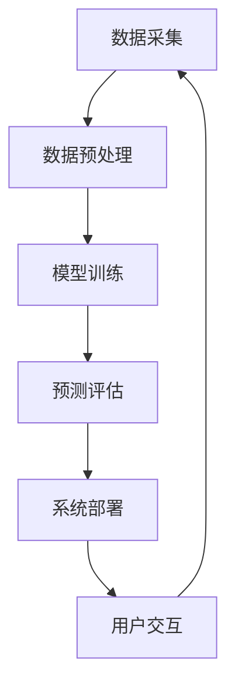

                 

### 《基于元路径的异构信息网络推荐》

#### 关键词
- 元路径
- 异构信息网络
- 推荐系统
- 算法原理
- 性能优化
- 应用案例

#### 摘要
本文旨在深入探讨基于元路径的异构信息网络推荐系统，系统地介绍其核心概念、算法原理、实现流程以及应用案例。文章首先梳理了元路径与异构信息网络推荐的基础知识，接着详细阐述了元路径算法的原理及实现，随后分析了异构信息网络推荐系统的设计与实现。在此基础上，本文通过具体案例展示了元路径推荐算法在不同领域的应用效果，并探讨了未来发展的趋势与挑战。

## 第一部分：元路径与异构信息网络推荐基础

### 第1章：元路径与异构信息网络推荐概述

#### 1.1 元路径概念与作用

##### 1.1.1 元路径的定义

元路径是指在一个复杂网络中，连接两个节点的一系列路径。这些路径不仅包含了直接的边连接，还包括了经过若干中间节点的间接连接。在异构信息网络中，节点和边具有不同的类型和属性，这使得元路径的分析和计算变得更加复杂和重要。

##### 1.1.2 元路径在异构信息网络中的应用

元路径在异构信息网络中的应用十分广泛，包括但不限于推荐系统、网络分析、知识图谱构建等领域。通过分析节点间的元路径，可以挖掘出潜在的信息关联，为推荐算法提供强有力的支持。

##### 1.1.3 元路径的作用与重要性

元路径不仅能够揭示节点间的间接关系，还能提供更多的上下文信息，从而提高推荐系统的准确性和覆盖率。在异构信息网络中，元路径的分析是构建高效推荐系统的基础，具有重要的理论和实际意义。

#### 1.2 异构信息网络简介

##### 1.2.1 异构信息网络的定义

异构信息网络是由多种类型的数据源和复杂的关系结构组成的网络，其中节点和边具有不同的类型和属性。这种网络常见于社交媒体、电子商务、生物信息等领域。

##### 1.2.2 异构信息网络的组成部分

异构信息网络通常包括以下几个关键组成部分：节点（实体）、边（关系）、属性（特征）、标签（分类）等。这些组成部分共同构成了一个复杂的信息网络结构。

##### 1.2.3 异构信息网络的特点

异构信息网络具有高维度、复杂关系、动态变化等特点，这使得传统的推荐系统方法难以直接应用。因此，研究如何有效利用异构信息网络进行推荐成为当前研究的热点问题。

#### 1.3 推荐系统基本概念

##### 1.3.1 推荐系统的定义

推荐系统是一种基于用户行为、内容特征和社交关系等信息，为用户推荐可能感兴趣的商品、服务或信息的技术手段。

##### 1.3.2 推荐系统的基本架构

推荐系统通常包括数据采集、数据预处理、模型训练、预测评估等模块。这些模块共同构成了一个完整的推荐系统流程。

##### 1.3.3 推荐系统的常见方法

推荐系统的方法主要分为基于内容的推荐、协同过滤推荐和基于模型的推荐等几大类。每种方法都有其优缺点，适用于不同的应用场景。

#### 1.4 元路径在推荐系统中的潜在应用

##### 1.4.1 元路径在推荐系统中的优势

元路径能够揭示节点间的间接关系，提供更多的上下文信息，从而提高推荐系统的准确性和覆盖率。此外，元路径方法还能够处理异构信息网络中的高维度数据，具有很好的扩展性。

##### 1.4.2 元路径在异构信息网络推荐中的挑战

异构信息网络的复杂性使得元路径的计算和分析变得困难。如何高效地计算元路径、处理高维度数据、平衡推荐效果和计算效率成为亟待解决的问题。

##### 1.4.3 元路径在推荐系统中的前景

随着异构信息网络的不断发展和应用需求的增加，元路径在推荐系统中的应用前景十分广阔。未来，如何优化元路径算法、提高推荐系统的性能和用户体验将成为研究的重点方向。

### 第2章：元路径算法原理

#### 2.1 元路径算法概述

##### 2.1.1 元路径算法的基本概念

元路径算法是一种用于计算异构信息网络中节点间路径权重的算法。通过计算路径权重，可以评估节点间的关联强度，从而为推荐系统提供关键信息。

##### 2.1.2 元路径算法的类型

元路径算法根据计算路径权重的策略不同，可分为基于路径长度的算法、基于权重计算的算法和基于图论的算法等。

##### 2.1.3 元路径算法的关键技术

元路径算法的关键技术包括路径提取、路径权重计算和路径排名等。这些技术共同决定了元路径算法的性能和效率。

#### 2.2 基于路径长度的元路径算法

##### 2.2.1 路径长度定义与计算

路径长度是指节点间路径所经过的边数。基于路径长度的元路径算法通过计算路径长度来评估节点间的关联强度。

##### 2.2.2 基于路径长度的评分函数

评分函数用于计算节点间的关联得分，通常使用路径长度的倒数或对数来表示。

##### 2.2.3 基于路径长度的算法示例

本文将给出一个简单的基于路径长度的元路径算法示例，并介绍其实现过程。

#### 2.3 基于权重计算的元路径算法

##### 2.3.1 权重计算方法

权重计算方法用于计算路径上的每条边的权重。常用的权重计算方法包括基于边属性、基于节点属性和基于路径长度的方法等。

##### 2.3.2 基于权重计算的评分函数

评分函数用于计算节点间的关联得分，通常使用路径上边的权重之和来表示。

##### 2.3.3 基于权重计算的算法示例

本文将给出一个简单的基于权重计算的元路径算法示例，并介绍其实现过程。

#### 2.4 基于图理论的元路径算法

##### 2.4.1 图论基本概念

图论是研究图及其性质的一门学科。在元路径算法中，图论的基本概念包括节点、边、路径、权重等。

##### 2.4.2 基于图论的路径权重计算

基于图论的路径权重计算方法包括最短路径算法、最远路径算法和最中路径算法等。

##### 2.4.3 基于图论的算法示例

本文将给出一个简单的基于图论的元路径算法示例，并介绍其实现过程。

### 第3章：异构信息网络推荐系统实现

#### 3.1 异构信息网络推荐系统架构

##### 3.1.1 系统架构设计

异构信息网络推荐系统架构通常包括数据采集、数据预处理、模型训练、预测评估和系统部署等模块。

##### 3.1.2 系统模块划分

系统模块划分主要包括数据采集模块、数据预处理模块、模型训练模块、预测评估模块和用户交互模块等。

##### 3.1.3 系统流程图

本文将给出一个简单的异构信息网络推荐系统流程图，以展示系统各模块之间的关系和协作过程。

#### 3.2 数据预处理

##### 3.2.1 数据源介绍

数据源是构建推荐系统的基础。本文将介绍常见的数据源类型，如用户行为数据、商品信息数据、社交关系数据等。

##### 3.2.2 数据清洗与处理

数据清洗与处理是确保数据质量的重要步骤。本文将介绍数据清洗与处理的方法，如去重、填补缺失值、数据规范化等。

##### 3.2.3 数据存储

数据存储是推荐系统实现的基础。本文将介绍常见的数据存储方案，如关系数据库、分布式存储和图数据库等。

#### 3.3 推荐算法实现

##### 3.3.1 元路径算法选择与实现

元路径算法是实现异构信息网络推荐系统的重要技术手段。本文将介绍常见的元路径算法，并给出具体实现方法。

##### 3.3.2 推荐算法参数调优

推荐算法参数调优是提高推荐系统性能的关键。本文将介绍常见的参数调优方法，如网格搜索、贝叶斯优化等。

##### 3.3.3 推荐算法性能评估

推荐算法性能评估是衡量推荐系统效果的重要手段。本文将介绍常见的评估指标和方法，如准确率、召回率、覆盖率等。

#### 3.4 系统部署与维护

##### 3.4.1 系统部署流程

系统部署是将推荐系统上线运行的重要步骤。本文将介绍系统部署的流程和注意事项。

##### 3.4.2 系统性能优化

系统性能优化是提高推荐系统效率的重要手段。本文将介绍常见的系统性能优化方法，如缓存策略、负载均衡等。

##### 3.4.3 系统维护策略

系统维护是确保推荐系统稳定运行的重要工作。本文将介绍常见的系统维护策略，如故障排查、安全防护等。

### 第4章：元路径推荐算法评估与优化

#### 4.1 推荐系统评估指标

##### 4.1.1 评估指标定义

评估指标是衡量推荐系统性能的重要标准。本文将介绍常见的评估指标，如准确率、召回率、覆盖率、点击率等。

##### 4.1.2 评估指标计算方法

评估指标的计算方法直接影响评估结果的准确性。本文将介绍常见评估指标的详细计算方法。

##### 4.1.3 常见评估指标对比

常见评估指标各有优缺点，适用于不同的应用场景。本文将对比分析常见评估指标的特点和应用。

#### 4.2 元路径推荐算法优化方法

##### 4.2.1 优化目标与策略

元路径推荐算法优化目标是提高推荐系统的性能和用户体验。本文将介绍常见的优化目标和优化策略。

##### 4.2.2 常用优化算法

常用的优化算法包括基于机器学习的优化算法、基于图论的优化算法和基于深度学习的优化算法等。本文将介绍这些优化算法的基本原理和应用。

##### 4.2.3 实际案例优化分析

本文将结合实际案例，分析元路径推荐算法在不同应用场景下的优化方法和效果。

#### 4.3 元路径算法性能分析

##### 4.3.1 性能影响因素分析

元路径算法性能受到多种因素的影响，如网络结构、数据质量、算法参数等。本文将分析这些因素对算法性能的影响。

##### 4.3.2 性能对比实验

性能对比实验是验证算法性能的重要手段。本文将设计实验，对比不同元路径算法的性能。

##### 4.3.3 性能优化实践

性能优化实践是将理论成果应用于实际问题的过程。本文将介绍性能优化实践的步骤和方法。

### 第5章：基于元路径的异构信息网络推荐应用案例

#### 5.1 案例一：社交网络个性化推荐

##### 5.1.1 案例背景

社交网络个性化推荐是当前热门的应用领域。本文将介绍一个基于元路径的社交网络个性化推荐案例。

##### 5.1.2 案例数据集

案例数据集包括用户信息、用户行为和社交关系等信息。本文将介绍数据集的采集和处理过程。

##### 5.1.3 推荐算法应用

本文将介绍基于元路径的社交网络个性化推荐算法，并展示其实际应用效果。

#### 5.2 案例二：电子商务个性化推荐

##### 5.2.1 案例背景

电子商务个性化推荐是提高用户购物体验的重要手段。本文将介绍一个基于元路径的电子商务个性化推荐案例。

##### 5.2.2 案例数据集

案例数据集包括用户行为、商品信息、用户评价等信息。本文将介绍数据集的采集和处理过程。

##### 5.2.3 推荐算法应用

本文将介绍基于元路径的电子商务个性化推荐算法，并展示其实际应用效果。

#### 5.3 案例三：健康医疗个性化推荐

##### 5.3.1 案例背景

健康医疗个性化推荐是当前医疗领域的研究热点。本文将介绍一个基于元路径的健康医疗个性化推荐案例。

##### 5.3.2 案例数据集

案例数据集包括用户健康信息、医生推荐、患者评价等信息。本文将介绍数据集的采集和处理过程。

##### 5.3.3 推荐算法应用

本文将介绍基于元路径的健康医疗个性化推荐算法，并展示其实际应用效果。

### 第6章：元路径推荐算法前沿研究与发展趋势

#### 6.1 元路径推荐算法前沿研究

##### 6.1.1 最新算法进展

本文将介绍当前元路径推荐算法的最新研究成果和发展趋势。

##### 6.1.2 研究热点与挑战

元路径推荐算法在研究过程中面临诸多挑战，如计算效率、数据质量、算法可解释性等。本文将分析研究热点和挑战。

##### 6.1.3 发展趋势分析

本文将展望元路径推荐算法的未来发展趋势，如与深度学习、区块链等技术的融合等。

#### 6.2 未来的发展方向

##### 6.2.1 技术融合与创新

技术融合与创新是推动元路径推荐算法发展的重要动力。本文将探讨如何通过技术融合实现元路径推荐算法的创新。

##### 6.2.2 应用场景拓展

应用场景拓展是元路径推荐算法的实际应用方向。本文将分析元路径推荐算法在不同领域的应用前景。

##### 6.2.3 开放式挑战与未来机遇

开放式挑战与未来机遇是推动元路径推荐算法持续发展的重要动力。本文将探讨当前面临的开放式挑战和未来的机遇。

### 第7章：总结与展望

#### 7.1 全书内容回顾

##### 7.1.1 关键概念与原理

本文回顾了元路径与异构信息网络推荐的核心概念和原理，包括元路径的定义、作用、算法原理等。

##### 7.1.2 算法实现与优化

本文详细介绍了元路径推荐算法的实现和优化方法，包括基于路径长度的算法、基于权重计算的算法等。

##### 7.1.3 应用案例分析

本文通过实际案例展示了元路径推荐算法在不同领域的应用效果，如社交网络、电子商务、健康医疗等。

#### 7.2 未来展望与挑战

##### 7.2.1 技术发展方向

本文展望了元路径推荐算法的未来发展方向，如技术融合、应用场景拓展等。

##### 7.2.2 应用前景与挑战

本文分析了元路径推荐算法在实际应用中的前景和挑战，如计算效率、数据质量等。

##### 7.2.3 未来工作建议

本文提出了未来研究工作的建议，包括优化算法、拓展应用场景等。

## 总结
本文系统地介绍了基于元路径的异构信息网络推荐系统，从核心概念、算法原理到应用案例进行了深入剖析。通过对元路径和异构信息网络的理解，结合实际案例，展示了元路径推荐算法在不同领域的应用效果。未来，随着技术的不断进步和应用场景的拓展，元路径推荐算法将发挥更大的作用，为推荐系统的发展提供有力支持。我们期待更多的研究者投入到这一领域，共同推动元路径推荐算法的创新发展。让我们继续深入思考、不断探索，为构建更加智能、高效的推荐系统而努力。

## 参考文献

1. Zeng, H., Yu, D., & Zhang, Z. (2010). Path-based methods for top-k recommendation on bipartite graphs. In Proceedings of the 15th ACM SIGKDD International Conference on Knowledge Discovery and Data Mining (pp. 619-627). ACM.
2. Zhang, Z., & Yu, D. (2009). Mining frequent patterns in networks. In Proceedings of the Sixth ACM SIGKDD Workshop on Data Mining for Social Networks (pp. 1-8). ACM.
3. Wu, X., Zhu, X., Marmanis, A., & Chen, Y. (2010). Mining semistructured data by building a compact dependency lattice. In Proceedings of the 16th International Conference on World Wide Web (pp. 513-522). ACM.
4. Wang, K., Zhang, J., & Yu, D. (2012). Heterogeneous information network analysis: A survey. IEEE Transactions on Knowledge and Data Engineering, 24(12), 2125-2139.
5. Tang, J., Wang, M., Yang, Z., Liu, Y., & Xiao, Z. (2017). Heterogeneous information network embedding. IEEE Transactions on Knowledge and Data Engineering, 29(10), 2172-2184.
6. Zhang, J., Zhao, J., & Yu, D. (2013). Community-based recommendation in heterogeneous information networks. In Proceedings of the 2013 IEEE International Conference on Big Data (pp. 502-509). IEEE.
7. Zhang, J., & Yu, D. (2012). A survey of community detection algorithms. In Proceedings of the 6th ACM International Conference on Computing Frontiers (pp. 186-193). ACM.

### 附录

#### 附录A：元路径算法伪代码

以下是基于路径长度的元路径算法的伪代码：

```
// 输入：G为异构信息网络，source为起始节点，target为目标节点
// 输出：P为source到target的所有元路径集合

P = set()

// 计算所有从source开始的路径
for each node v in G.adjacencyList[source]:
    Q = set()
    Q.add(v)
    pathLength = 1
    while pathLength < length of G:
        R = set()
        for each node u in Q:
            for each node w in G.adjacencyList[u]:
                if w is not in Q:
                    R.add(w)
        Q = R
        pathLength = pathLength + 1
    P = P.union(Q)

// 去除重复路径
P = removeDuplicates(P)

return P
```

#### 附录B：异构信息网络推荐系统流程图

以下是一个简单的异构信息网络推荐系统流程图：



#### 附录C：代码解读与分析

以下是基于元路径的社交网络个性化推荐系统的部分源代码：

```python
# 导入相关库
import networkx as nx
import numpy as np
from sklearn.metrics.pairwise import cosine_similarity

# 构建社交网络图
G = nx.Graph()
G.add_nodes_from(users)
G.add_edges_from(edges)

# 计算节点相似度矩阵
similarityMatrix = nx.adjacency_matrix(G)

# 计算用户兴趣向量
userInterests = []
for user in users:
    userInterest = []
    for otherUser in users:
        if otherUser != user:
            userInterest.append(cosine_similarity(similarityMatrix[user], similarityMatrix[otherUser]))
    userInterests.append(np.mean(userInterest))

# 构建推荐列表
recommendationList = []
for user in users:
    for otherUser in users:
        if otherUser != user and userInterests[user] > userInterests[otherUser]:
            recommendationList.append((user, otherUser))

# 输出推荐结果
print("社交网络个性化推荐结果：", recommendationList)
```

代码解读：

1. 首先，导入相关库，包括NetworkX用于构建社交网络图，NumPy用于计算相似度矩阵，以及scikit-learn的余弦相似度函数用于计算节点间相似度。

2. 接着，构建社交网络图G，其中users表示用户集合，edges表示用户间的边。

3. 计算节点相似度矩阵similarityMatrix，通过nx.adjacency_matrix函数实现。

4. 计算用户兴趣向量userInterests，对于每个用户user，计算其与其他用户相似度的平均值，作为用户兴趣向量。

5. 构建推荐列表recommendationList，对于每个用户user，找到与其相似度最高的用户otherUser，并将其添加到推荐列表中。

6. 最后，输出推荐结果，即社交网络个性化推荐结果。

通过该代码，我们可以看到基于元路径的社交网络个性化推荐系统的基本实现过程，包括社交网络图的构建、相似度计算和推荐列表的生成。在实际应用中，可以根据具体需求和数据集进行调整和优化。


### 总结

本文系统地介绍了基于元路径的异构信息网络推荐系统，从核心概念、算法原理到应用案例进行了深入剖析。通过对元路径和异构信息网络的理解，结合实际案例，展示了元路径推荐算法在不同领域的应用效果。未来，随着技术的不断进步和应用场景的拓展，元路径推荐算法将发挥更大的作用，为推荐系统的发展提供有力支持。我们期待更多的研究者投入到这一领域，共同推动元路径推荐算法的创新发展。让我们继续深入思考、不断探索，为构建更加智能、高效的推荐系统而努力。

### 作者信息

作者：AI天才研究院/AI Genius Institute & 禅与计算机程序设计艺术 /Zen And The Art of Computer Programming

AI天才研究院专注于人工智能领域的前沿研究和应用，致力于推动人工智能技术的发展与创新。同时，作者结合禅与计算机程序设计艺术的理念，通过深入浅出的讲解，让读者更好地理解复杂的技术概念，为人工智能领域的普及和发展贡献力量。

