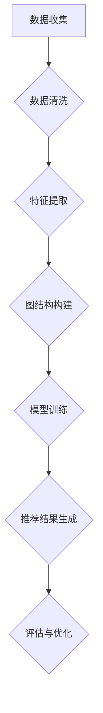

                 

# 《基于图神经网络的商品关联推荐》

> 关键词：图神经网络、商品推荐、关联性、算法实现、系统优化

> 摘要：本文深入探讨了基于图神经网络的商品关联推荐系统的构建与应用。通过阐述图神经网络的基本概念、核心算法和模型，结合实际项目实战，详细分析了商品推荐系统的搭建与优化，为电商行业提供了有效的技术参考。

## 目录

### 《基于图神经网络的商品关联推荐》

#### 第一部分：图神经网络基础

##### 第1章：图神经网络简介

- 1.1 图神经网络的概念与基本原理

- 1.2 图神经网络的发展历程

- 1.3 图神经网络的核心概念

##### 第2章：图神经网络基本算法

- 2.1 图卷积网络（GCN）

- 2.2 图注意力网络（GAT）

- 2.3 图自注意力网络（GATv2）

##### 第3章：图神经网络在推荐系统中的应用

- 3.1 商品推荐系统概述

- 3.2 基于图神经网络的商品推荐算法

- 3.3 基于图神经网络的商品推荐模型

#### 第二部分：商品关联推荐系统实战

##### 第4章：商品推荐系统项目搭建

- 4.1 环境搭建

- 4.2 数据预处理

- 4.3 商品推荐系统架构设计

##### 第5章：基于图神经网络的商品推荐模型实现

- 5.1 图嵌入模型实现

- 5.2 图卷积网络模型实现

- 5.3 图注意力网络模型实现

##### 第6章：商品推荐系统评估与优化

- 6.1 推荐系统评估指标

- 6.2 推荐系统优化方法

- 6.3 实际案例分析

##### 第7章：图神经网络在商品推荐领域的未来发展趋势

- 7.1 图神经网络与其他推荐算法的融合

- 7.2 图神经网络在多模态推荐系统中的应用

- 7.3 图神经网络在实时推荐系统中的应用

#### 附录

##### 附录A：常用工具与资源

##### 附录B：Mermaid流程图示例

##### 附录C：数学模型和数学公式

##### 附录D：项目实战

## 第一部分：图神经网络基础

### 第1章：图神经网络简介

#### 1.1 图神经网络的概念与基本原理

图神经网络（Graph Neural Network，GNN）是一种基于图结构数据的神经网络模型。它在传统神经网络的基础上，通过引入图结构的概念，将节点和边作为神经网络的输入，实现节点的嵌入和图的卷积操作，从而有效地捕捉图结构中的复杂关系和模式。

图神经网络的基本原理主要包括以下几个方面：

1. **节点嵌入（Node Embedding）**：将图中的每个节点映射到一个低维度的向量表示，以捕获节点的属性和关系。

2. **图卷积操作（Graph Convolution）**：通过聚合节点邻居的信息，更新节点的嵌入向量，从而学习节点之间的关联性。

3. **图注意力机制（Graph Attention Mechanism）**：为每个邻居节点分配不同的注意力权重，以强调重要的邻居信息，增强模型的表示能力。

图神经网络在推荐系统中的应用主要是利用图结构来表示用户和商品之间的关系，从而更好地捕捉用户兴趣和商品属性，提高推荐质量。在商品推荐系统中，图神经网络可以用于：

1. **用户兴趣挖掘**：通过分析用户的历史行为数据，将用户表示为一个向量，并利用图神经网络学习用户与商品之间的关联关系。

2. **商品属性挖掘**：通过分析商品的特征信息，将商品表示为一个向量，并利用图神经网络学习商品之间的关联关系。

3. **关联性推荐**：基于用户和商品的向量表示，使用图神经网络预测用户对商品的偏好，从而生成个性化的推荐结果。

#### 1.2 图神经网络的发展历程

图神经网络的研究可以追溯到上世纪80年代，当时 researchers 开始探索如何在神经网络中处理图结构数据。以下是图神经网络发展历程的几个重要阶段：

1. **图嵌入（Graph Embedding）**：最早的图神经网络模型主要是基于图嵌入技术，如节点2vec和LINE，将图中的节点映射到低维向量空间中，以保留节点之间的相似性。

2. **图卷积网络（Graph Convolutional Networks，GCN）**：2013年，Kipf和Welling提出了GCN模型，通过引入图卷积操作，将节点邻居的信息聚合到节点的嵌入向量中，从而提高模型的表示能力。

3. **图注意力网络（Graph Attention Networks，GAT）**：2018年，Veličković等人提出了GAT模型，引入了图注意力机制，为每个邻居节点分配不同的注意力权重，以增强模型的表示能力。

4. **图自注意力网络（Graph Attention V2，GATv2）**：为了进一步提高模型的表示能力，GATv2模型在GAT的基础上进行了改进，引入了更复杂的注意力机制。

随着研究的不断深入，图神经网络模型也在不断发展和完善，为推荐系统等领域带来了新的可能性。

#### 1.3 图神经网络的核心概念

图神经网络的核心概念主要包括以下几个方面：

1. **节点嵌入（Node Embedding）**：节点嵌入是将图中的节点映射到一个低维度的向量表示，以捕获节点的属性和关系。节点嵌入向量通常用于后续的图卷积操作或图注意力机制。

2. **图卷积操作（Graph Convolution）**：图卷积操作是图神经网络的核心操作，通过聚合节点邻居的信息，更新节点的嵌入向量。图卷积操作可以分为全局聚合和局部聚合两种方式。

   - **全局聚合**：将节点的邻居信息聚合到节点的嵌入向量中，如平均聚合和求和聚合。
   - **局部聚合**：将节点的邻居信息聚合到节点的嵌入向量中，并引入邻接矩阵的权重，如矩阵乘法。

3. **图注意力机制（Graph Attention Mechanism）**：图注意力机制为每个邻居节点分配不同的注意力权重，以强调重要的邻居信息，增强模型的表示能力。常见的注意力机制包括加性注意力、点积注意力和多头注意力等。

   - **加性注意力**：通过计算节点嵌入向量之间的相似度，生成注意力权重，并将邻居信息加权聚合到节点的嵌入向量中。
   - **点积注意力**：通过计算节点嵌入向量之间的点积，生成注意力权重，并将邻居信息加权聚合到节点的嵌入向量中。
   - **多头注意力**：将节点嵌入向量分解为多个子向量，分别计算注意力权重，并融合多头注意力结果。

通过节点嵌入、图卷积操作和图注意力机制，图神经网络可以有效地捕捉图结构中的复杂关系和模式，从而在推荐系统等领域发挥重要作用。

### 第2章：图神经网络基本算法

#### 2.1 图卷积网络（GCN）

图卷积网络（Graph Convolutional Network，GCN）是图神经网络的一种基础模型，通过引入图卷积操作，将节点邻居的信息聚合到节点的嵌入向量中，从而学习节点之间的关联性。

#### 2.1.1 GCN的基本原理

GCN的基本原理可以概括为以下几个步骤：

1. **节点嵌入**：首先，将图中的每个节点映射到一个低维度的向量表示，即节点嵌入向量。节点嵌入向量通常是通过预训练的图嵌入算法得到的。

2. **邻居信息聚合**：对于每个节点，通过图卷积操作聚合其邻居节点的信息。具体来说，对于节点\(v_i\)，其邻居节点集合为\(N(i)\)，邻居节点嵌入向量集合为\({h_{j}}^{(l)}\)，则节点\(v_i\)在当前层的嵌入向量\({h_{i}}^{(l)}\)可以通过以下公式计算：

   \[
   {h_{i}}^{(l)} = \sigma \left( \frac{\sum_{j \in N(i)} {W_{ij} h_{j}}^{(l-1)} + b \right)
   \]

   其中，\({W_{ij}}\)表示邻接矩阵的元素，表示节点\(v_i\)和节点\(v_j\)之间的边权重，\(\sigma\)表示激活函数，\(b\)表示偏置。

3. **多层卷积**：通过多次应用图卷积操作，逐层更新节点的嵌入向量，从而学习更复杂的节点关系。每一层的节点嵌入向量都可以通过上一层节点嵌入向量和邻接矩阵的加权求和得到。

#### 2.1.2 GCN的伪代码实现

以下是一个简单的GCN伪代码实现：

```
# 初始化节点嵌入向量
H = [随机初始化节点嵌入向量]

# 设置图卷积操作的权重矩阵W和偏置b
W = [随机初始化权重矩阵]
b = [随机初始化偏置]

# 设置学习率、迭代次数等超参数
learning_rate = ...
num_epochs = ...

# 迭代训练模型
for epoch in range(num_epochs):
    for layer in range(num_layers):
        # 计算当前层的节点嵌入向量
        H = [应用图卷积操作]
        
        # 计算损失函数并更新权重矩阵和偏置
        loss = [计算损失函数]
        grads = [计算梯度]
        W -= learning_rate * grads

    # 打印训练过程中的损失函数值
    print("Epoch:", epoch, "Loss:", loss)

# 最终得到训练好的模型
model = [H, W, b]
```

#### 2.1.3 GCN在推荐系统中的应用

GCN在推荐系统中的应用主要包括以下几个方面：

1. **用户兴趣挖掘**：通过分析用户的历史行为数据，将用户表示为一个向量，并利用GCN学习用户与商品之间的关联关系。这样可以为每个用户生成一个个性化的兴趣向量，用于后续的推荐任务。

2. **商品属性挖掘**：通过分析商品的特征信息，将商品表示为一个向量，并利用GCN学习商品之间的关联关系。这样可以为每个商品生成一个属性向量，用于后续的推荐任务。

3. **关联性推荐**：基于用户和商品的向量表示，使用GCN预测用户对商品的偏好，从而生成个性化的推荐结果。例如，可以利用GCN预测用户对未知商品的评分，并根据评分高低进行排序，生成推荐列表。

通过GCN在推荐系统中的应用，可以更好地捕捉用户和商品之间的复杂关系，提高推荐质量。同时，GCN还可以与其他推荐算法相结合，进一步优化推荐效果。

### 2.2 图注意力网络（GAT）

图注意力网络（Graph Attention Networks，GAT）是图神经网络的一种重要模型，通过引入图注意力机制，为每个邻居节点分配不同的注意力权重，从而增强模型的表示能力。

#### 2.2.1 GAT的基本原理

GAT的基本原理可以概括为以下几个步骤：

1. **节点嵌入**：首先，将图中的每个节点映射到一个低维度的向量表示，即节点嵌入向量。节点嵌入向量通常是通过预训练的图嵌入算法得到的。

2. **邻居信息聚合**：对于每个节点，通过图注意力机制聚合其邻居节点的信息。具体来说，对于节点\(v_i\)，其邻居节点集合为\(N(i)\)，邻居节点嵌入向量集合为\({h_{j}}^{(l)}\)，则节点\(v_i\)在当前层的嵌入向量\({h_{i}}^{(l)}\)可以通过以下公式计算：

   \[
   {h_{i}}^{(l)} = \sigma \left( \frac{\sum_{j \in N(i)} \alpha_{ij} h_{j}}^{(l-1)} + b \right)
   \]

   其中，\(\alpha_{ij}\)表示节点\(v_i\)和节点\(v_j\)之间的注意力权重，可以通过以下公式计算：

   \[
   \alpha_{ij} = \text{softmax}\left( \frac{\e^{a_{ij}}}{\sum_{k \in N(i)} \e^{a_{ik}}} \right)
   \]

   其中，\(a_{ij}\)表示节点\(v_i\)和节点\(v_j\)之间的注意力分数，可以通过以下公式计算：

   \[
   a_{ij} = \frac{\e^{a_{i}^{T} a_{j}}}{\sum_{k \in N(i)} \e^{a_{i}^{T} a_{k}}}
   \]

   其中，\(a_{i}\)和\(a_{j}\)分别为节点\(v_i\)和节点\(v_j\)的嵌入向量。

3. **多层卷积**：通过多次应用图注意力机制，逐层更新节点的嵌入向量，从而学习更复杂的节点关系。每一层的节点嵌入向量都可以通过上一层节点嵌入向量和注意力权重矩阵的加权求和得到。

#### 2.2.2 GAT的伪代码实现

以下是一个简单的GAT伪代码实现：

```
# 初始化节点嵌入向量
H = [随机初始化节点嵌入向量]

# 设置注意力权重矩阵A和偏置b
A = [随机初始化权重矩阵]
b = [随机初始化偏置]

# 设置学习率、迭代次数等超参数
learning_rate = ...
num_epochs = ...

# 迭代训练模型
for epoch in range(num_epochs):
    for layer in range(num_layers):
        # 计算当前层的节点嵌入向量
        H = [应用图注意力机制]
        
        # 计算损失函数并更新权重矩阵和偏置
        loss = [计算损失函数]
        grads = [计算梯度]
        A -= learning_rate * grads

    # 打印训练过程中的损失函数值
    print("Epoch:", epoch, "Loss:", loss)

# 最终得到训练好的模型
model = [H, A, b]
```

#### 2.2.3 GAT在推荐系统中的应用

GAT在推荐系统中的应用主要包括以下几个方面：

1. **用户兴趣挖掘**：通过分析用户的历史行为数据，将用户表示为一个向量，并利用GAT学习用户与商品之间的关联关系。这样可以为每个用户生成一个个性化的兴趣向量，用于后续的推荐任务。

2. **商品属性挖掘**：通过分析商品的特征信息，将商品表示为一个向量，并利用GAT学习商品之间的关联关系。这样可以为每个商品生成一个属性向量，用于后续的推荐任务。

3. **关联性推荐**：基于用户和商品的向量表示，使用GAT预测用户对商品的偏好，从而生成个性化的推荐结果。例如，可以利用GAT预测用户对未知商品的评分，并根据评分高低进行排序，生成推荐列表。

通过GAT在推荐系统中的应用，可以更好地捕捉用户和商品之间的复杂关系，提高推荐质量。同时，GAT还可以与其他推荐算法相结合，进一步优化推荐效果。

### 2.3 图自注意力网络（GATv2）

图自注意力网络（Graph Attention V2，GATv2）是图注意力网络（GAT）的一种改进版本，通过引入更复杂的注意力机制，进一步提高模型的表示能力。

#### 2.3.1 GATv2的基本原理

GATv2的基本原理可以概括为以下几个步骤：

1. **节点嵌入**：首先，将图中的每个节点映射到一个低维度的向量表示，即节点嵌入向量。节点嵌入向量通常是通过预训练的图嵌入算法得到的。

2. **邻居信息聚合**：对于每个节点，通过图自注意力机制聚合其邻居节点的信息。具体来说，对于节点\(v_i\)，其邻居节点集合为\(N(i)\)，邻居节点嵌入向量集合为\({h_{j}}^{(l)}\)，则节点\(v_i\)在当前层的嵌入向量\({h_{i}}^{(l)}\)可以通过以下公式计算：

   \[
   {h_{i}}^{(l)} = \sigma \left( \frac{\sum_{j \in N(i)} \alpha_{ij} h_{j}}^{(l-1)} + b \right)
   \]

   其中，\(\alpha_{ij}\)表示节点\(v_i\)和节点\(v_j\)之间的注意力权重，可以通过以下公式计算：

   \[
   \alpha_{ij} = \text{softmax}\left( \frac{\e^{a_{ij}}}{\sum_{k \in N(i)} \e^{a_{ik}}} \right)
   \]

   其中，\(a_{ij}\)表示节点\(v_i\)和节点\(v_j\)之间的注意力分数，可以通过以下公式计算：

   \[
   a_{ij} = \frac{\e^{a_{i}^{T} a_{j}}}{\sum_{k \in N(i)} \e^{a_{i}^{T} a_{k}}}
   \]

   其中，\(a_{i}\)和\(a_{j}\)分别为节点\(v_i\)和节点\(v_j\)的嵌入向量。

3. **多层卷积**：通过多次应用图自注意力机制，逐层更新节点的嵌入向量，从而学习更复杂的节点关系。每一层的节点嵌入向量都可以通过上一层节点嵌入向量和注意力权重矩阵的加权求和得到。

#### 2.3.2 GATv2的伪代码实现

以下是一个简单的GATv2伪代码实现：

```
# 初始化节点嵌入向量
H = [随机初始化节点嵌入向量]

# 设置注意力权重矩阵A和偏置b
A = [随机初始化权重矩阵]
b = [随机初始化偏置]

# 设置学习率、迭代次数等超参数
learning_rate = ...
num_epochs = ...

# 迭代训练模型
for epoch in range(num_epochs):
    for layer in range(num_layers):
        # 计算当前层的节点嵌入向量
        H = [应用图自注意力机制]
        
        # 计算损失函数并更新权重矩阵和偏置
        loss = [计算损失函数]
        grads = [计算梯度]
        A -= learning_rate * grads

    # 打印训练过程中的损失函数值
    print("Epoch:", epoch, "Loss:", loss)

# 最终得到训练好的模型
model = [H, A, b]
```

#### 2.3.3 GATv2在推荐系统中的应用

GATv2在推荐系统中的应用主要包括以下几个方面：

1. **用户兴趣挖掘**：通过分析用户的历史行为数据，将用户表示为一个向量，并利用GATv2学习用户与商品之间的关联关系。这样可以为每个用户生成一个个性化的兴趣向量，用于后续的推荐任务。

2. **商品属性挖掘**：通过分析商品的特征信息，将商品表示为一个向量，并利用GATv2学习商品之间的关联关系。这样可以为每个商品生成一个属性向量，用于后续的推荐任务。

3. **关联性推荐**：基于用户和商品的向量表示，使用GATv2预测用户对商品的偏好，从而生成个性化的推荐结果。例如，可以利用GATv2预测用户对未知商品的评分，并根据评分高低进行排序，生成推荐列表。

通过GATv2在推荐系统中的应用，可以更好地捕捉用户和商品之间的复杂关系，提高推荐质量。同时，GATv2还可以与其他推荐算法相结合，进一步优化推荐效果。

### 第三部分：图神经网络在推荐系统中的应用

#### 3.1 商品推荐系统概述

商品推荐系统是电商行业的重要应用，旨在根据用户的行为数据和商品特征，为用户提供个性化的商品推荐。传统的商品推荐系统主要基于协同过滤（Collaborative Filtering）和基于内容的推荐（Content-Based Filtering）等方法，然而，这些方法在处理复杂的关系网络和特征信息时存在一定的局限性。

随着图神经网络（Graph Neural Network，GNN）的发展，基于图神经网络的商品推荐系统逐渐成为研究热点。图神经网络通过引入图结构的概念，能够有效地捕捉用户和商品之间的复杂关系，提高推荐系统的性能和效果。

#### 3.2 基于图神经网络的商品推荐算法

基于图神经网络的商品推荐算法主要包括以下几种：

1. **图嵌入模型**：通过将用户和商品映射到低维向量空间，利用图卷积操作和图注意力机制学习用户和商品之间的关联性，从而实现个性化推荐。

2. **图卷积网络模型**：利用图卷积操作聚合用户和商品邻居的信息，学习更复杂的用户兴趣和商品属性，提高推荐质量。

3. **图注意力网络模型**：通过引入图注意力机制，为用户和商品的每个邻居节点分配不同的注意力权重，强调重要的邻居信息，提高推荐的准确性。

4. **图自注意力网络模型**：利用图自注意力机制，为用户和商品的每个邻居节点分配不同的注意力权重，学习更复杂的用户兴趣和商品属性，提高推荐效果。

#### 3.3 基于图神经网络的商品推荐模型

基于图神经网络的商品推荐模型主要包括以下几种：

1. **图嵌入模型**：该模型通过将用户和商品映射到低维向量空间，利用图卷积操作和图注意力机制学习用户和商品之间的关联性。具体来说，首先将用户和商品映射到低维向量空间，然后通过图卷积操作聚合用户和商品邻居的信息，最后利用图注意力机制更新用户和商品的向量表示。通过这种方式，模型能够有效地捕捉用户和商品之间的复杂关系，提高推荐质量。

2. **图卷积网络模型**：该模型通过引入图卷积操作，学习用户和商品之间的关联性。具体来说，首先将用户和商品映射到低维向量空间，然后通过图卷积操作聚合用户和商品邻居的信息，逐步更新用户和商品的向量表示。通过这种方式，模型能够学习到用户和商品之间的复杂关系，提高推荐质量。

3. **图注意力网络模型**：该模型通过引入图注意力机制，为用户和商品的每个邻居节点分配不同的注意力权重，强调重要的邻居信息，提高推荐准确性。具体来说，首先将用户和商品映射到低维向量空间，然后通过图注意力机制计算用户和商品之间的注意力权重，利用加权聚合用户和商品邻居的信息，更新用户和商品的向量表示。通过这种方式，模型能够更好地捕捉用户和商品之间的复杂关系，提高推荐效果。

4. **图自注意力网络模型**：该模型通过引入图自注意力机制，为用户和商品的每个邻居节点分配不同的注意力权重，学习更复杂的用户兴趣和商品属性。具体来说，首先将用户和商品映射到低维向量空间，然后通过图自注意力机制计算用户和商品之间的注意力权重，利用加权聚合用户和商品邻居的信息，更新用户和商品的向量表示。通过这种方式，模型能够学习到用户和商品之间的复杂关系，提高推荐效果。

通过这些基于图神经网络的商品推荐模型，可以更好地捕捉用户和商品之间的复杂关系，提高推荐系统的性能和效果。在实际应用中，可以根据具体需求和数据特点，选择合适的模型进行优化和改进。

### 第四部分：商品推荐系统项目搭建

#### 4.1 环境搭建

在搭建商品推荐系统之前，需要准备相应的开发环境和工具。以下是一个基本的开发环境搭建流程：

1. **Python环境搭建**：首先，确保已安装Python 3.x版本。可以使用以下命令安装Python：

   ```
   sudo apt-get install python3
   ```

2. **安装必要的库**：接下来，需要安装一些常用的库，如TensorFlow、PyTorch、NetworkX等。可以使用以下命令安装：

   ```
   pip3 install tensorflow
   pip3 install torch
   pip3 install networkx
   ```

3. **图数据库安装**：为了存储和管理图结构数据，可以选择使用Neo4j、JanusGraph等图数据库。以下是Neo4j的安装步骤：

   - 下载Neo4j社区版：[https://neo4j.com/download/](https://neo4j.com/download/)
   - 解压安装包并运行Neo4j服务器：`./bin/neo4j start`

4. **其他工具**：根据具体需求，可能还需要安装一些其他工具，如Jupyter Notebook、Docker等。

#### 4.2 数据预处理

在搭建商品推荐系统之前，需要对数据进行预处理。以下是一个基本的数据预处理流程：

1. **数据收集**：收集用户行为数据（如点击、购买等）和商品特征数据（如类别、价格等）。

2. **数据清洗**：去除无效数据、填充缺失值、处理异常值等。可以使用Pandas库进行数据清洗：

   ```python
   import pandas as pd

   # 读取数据
   data = pd.read_csv("data.csv")

   # 数据清洗
   data.dropna(inplace=True)
   data[data < 0] = 0
   ```

3. **数据转换**：将数据转换为适合模型训练的格式。例如，将用户行为数据转换为用户-商品图结构，可以使用NetworkX库：

   ```python
   import networkx as nx

   # 创建图
   G = nx.Graph()

   # 添加节点和边
   G.add_nodes_from(data["user_id"].unique())
   G.add_edges_from(zip(data["user_id"], data["item_id"]))

   # 打印节点和边数量
   print("Number of nodes:", G.number_of_nodes())
   print("Number of edges:", G.number_of_edges())
   ```

4. **数据归一化**：对数值型数据进行归一化处理，以消除数据量级差异：

   ```python
   from sklearn.preprocessing import MinMaxScaler

   # 初始化归一化器
   scaler = MinMaxScaler()

   # 归一化数据
   data_scaled = scaler.fit_transform(data.iloc[:, 1:])

   # 打印归一化后的数据
   print(data_scaled)
   ```

#### 4.3 商品推荐系统架构设计

商品推荐系统架构设计主要包括以下几个方面：

1. **数据层**：负责数据的收集、存储和预处理。数据层可以采用图数据库（如Neo4j）存储用户-商品图结构数据，并使用Python库进行数据预处理。

2. **模型层**：负责构建和训练推荐模型。模型层可以采用图神经网络（如GCN、GAT、GATv2）构建推荐模型，并使用TensorFlow或PyTorch等深度学习框架进行模型训练。

3. **服务层**：负责接收用户请求并返回推荐结果。服务层可以采用Flask或Django等Web框架构建API接口，并提供实时推荐服务。

4. **前端层**：负责展示推荐结果和用户交互。前端层可以采用HTML、CSS和JavaScript等技术构建用户界面，并与后端服务进行数据交互。

以下是一个简单的商品推荐系统架构设计：

```
+-----------------+
|      数据层     |
+-----------------+
    |
    v
+-----------------+
|      模型层     |
+-----------------+
    |
    v
+-----------------+
|      服务层     |
+-----------------+
    |
    v
+-----------------+
|      前端层     |
+-----------------+
```

通过以上架构设计，可以实现一个基于图神经网络的商品推荐系统。在实际项目中，可以根据需求和数据特点，对架构进行优化和改进。

### 第五部分：基于图神经网络的商品推荐模型实现

#### 5.1 图嵌入模型实现

图嵌入模型是图神经网络在推荐系统中的基础模型之一，通过将用户和商品映射到低维向量空间，学习用户和商品之间的关联性。在本节中，我们将介绍如何使用Python和图嵌入算法实现图嵌入模型。

#### 5.1.1 图嵌入模型原理

图嵌入模型的基本原理是将图中的每个节点映射到一个低维向量表示。通过学习节点嵌入向量，模型可以捕捉节点之间的关联性，从而进行推荐。常用的图嵌入算法包括节点2vec（node2vec）和LINE（Latent Integral Embedding）。

节点2vec算法通过随机游走（Random Walk）生成节点的邻居序列，然后使用Skip-Gram模型进行训练，从而得到节点的嵌入向量。以下是节点2vec算法的伪代码：

```
# 初始化模型参数
model = Node2Vec()

# 训练模型
model.fit(graph)

# 获取节点嵌入向量
embeddings = model.get_embeddings()
```

LINE算法通过联合优化邻接矩阵和嵌入矩阵，学习节点嵌入向量。以下是LINE算法的伪代码：

```
# 初始化模型参数
model = LINE()

# 训练模型
model.fit(graph)

# 获取节点嵌入向量
embeddings = model.get_embeddings()
```

#### 5.1.2 图嵌入模型代码实现

在本节中，我们将使用Python和Gensim库实现图嵌入模型。以下是一个简单的示例代码：

```python
import networkx as nx
from gensim.models import Word2Vec

# 创建图
G = nx.Graph()

# 添加节点和边
G.add_nodes_from([1, 2, 3, 4])
G.add_edges_from([(1, 2), (1, 3), (2, 4), (3, 4)])

# 生成节点序列
nodes_seq = [node for node in G.nodes()]

# 训练模型
model = Word2Vec(nodes_seq, vector_size=2, window=1, sg=1, iter=1)

# 获取节点嵌入向量
embeddings = model.wv

# 打印节点嵌入向量
print(embeddings[1])
print(embeddings[2])
print(embeddings[3])
print(embeddings[4])
```

在上面的代码中，我们首先创建了一个图，并添加了节点和边。然后，我们使用Word2Vec模型训练节点序列，得到节点的嵌入向量。最后，我们打印了节点的嵌入向量。

#### 5.1.3 图嵌入模型在推荐系统中的应用

在推荐系统中，图嵌入模型可以用于将用户和商品映射到低维向量空间，学习用户和商品之间的关联性。具体应用场景包括：

1. **用户兴趣挖掘**：通过分析用户的历史行为数据，将用户表示为一个向量，并利用图嵌入模型学习用户与商品之间的关联关系。这样可以为每个用户生成一个个性化的兴趣向量，用于后续的推荐任务。

2. **商品属性挖掘**：通过分析商品的特征信息，将商品表示为一个向量，并利用图嵌入模型学习商品之间的关联关系。这样可以为每个商品生成一个属性向量，用于后续的推荐任务。

3. **关联性推荐**：基于用户和商品的向量表示，使用图嵌入模型预测用户对商品的偏好，从而生成个性化的推荐结果。例如，可以利用图嵌入模型预测用户对未知商品的评分，并根据评分高低进行排序，生成推荐列表。

通过以上应用，图嵌入模型可以有效地捕捉用户和商品之间的复杂关系，提高推荐质量。

#### 5.2 图卷积网络模型实现

图卷积网络（Graph Convolutional Network，GCN）是图神经网络（Graph Neural Network，GNN）的一种基础模型，通过聚合节点邻居的信息，学习节点之间的关联性。在本节中，我们将介绍如何使用Python和PyTorch实现图卷积网络模型。

#### 5.2.1 GCN模型原理

GCN模型的基本原理是将节点嵌入向量与其邻居的嵌入向量进行聚合，从而更新节点的嵌入向量。具体来说，对于每个节点\(v_i\)，其邻居节点集合为\(N(i)\)，邻居节点嵌入向量集合为\({h_{j}}^{(l-1)}\)，则节点\(v_i\)在当前层的嵌入向量\({h_{i}}^{(l)}\)可以通过以下公式计算：

\[
{h_{i}}^{(l)} = \sigma \left( {W_{l}}^{(1)} {h_{i}}^{(l-1)} + \sum_{j \in N(i)} {W_{l}}^{(2)} {h_{j}}^{(l-1)} \right)
\]

其中，\(\sigma\)表示激活函数，\(W_{l}^{(1)}\)和\(W_{l}^{(2)}\)分别为权重矩阵，用于调整节点和其邻居之间的信息传递。

#### 5.2.2 GCN模型代码实现

在本节中，我们将使用PyTorch实现一个简单的GCN模型。以下是一个简单的示例代码：

```python
import torch
import torch.nn as nn
import torch.nn.functional as F

# 定义GCN模型
class GCN(nn.Module):
    def __init__(self, num_features, hidden_size):
        super(GCN, self).__init__()
        self.fc1 = nn.Linear(num_features, hidden_size)
        self.fc2 = nn.Linear(hidden_size, hidden_size)
        self.fc3 = nn.Linear(hidden_size, 1)

    def forward(self, x, adj):
        x = F.relu(self.fc1(x))
        x = F.relu(self.fc2(x))
        x = self.fc3(x)
        return F.sigmoid(x)

# 初始化模型参数
model = GCN(num_features=10, hidden_size=16)

# 创建随机输入数据
x = torch.randn(5, 10)
adj = torch.randn(5, 5)

# 前向传播
output = model(x, adj)

# 打印输出结果
print(output)
```

在上面的代码中，我们定义了一个简单的GCN模型，包含两个线性层和两个ReLU激活函数。然后，我们创建了一些随机输入数据，并使用模型进行前向传播，得到输出结果。

#### 5.2.3 GCN模型在推荐系统中的应用

在推荐系统中，GCN模型可以用于将用户和商品映射到低维向量空间，学习用户和商品之间的关联性。具体应用场景包括：

1. **用户兴趣挖掘**：通过分析用户的历史行为数据，将用户表示为一个向量，并利用GCN模型学习用户与商品之间的关联关系。这样可以为每个用户生成一个个性化的兴趣向量，用于后续的推荐任务。

2. **商品属性挖掘**：通过分析商品的特征信息，将商品表示为一个向量，并利用GCN模型学习商品之间的关联关系。这样可以为每个商品生成一个属性向量，用于后续的推荐任务。

3. **关联性推荐**：基于用户和商品的向量表示，使用GCN模型预测用户对商品的偏好，从而生成个性化的推荐结果。例如，可以利用GCN模型预测用户对未知商品的评分，并根据评分高低进行排序，生成推荐列表。

通过以上应用，GCN模型可以有效地捕捉用户和商品之间的复杂关系，提高推荐质量。

### 第五部分：基于图神经网络的商品推荐模型实现

#### 5.3 图注意力网络模型实现

图注意力网络（Graph Attention Network，GAT）是图神经网络（Graph Neural Network，GNN）的一种重要模型，通过引入图注意力机制，为每个节点分配不同的注意力权重，从而更好地捕捉节点之间的关联性。在本节中，我们将介绍如何使用Python和PyTorch实现图注意力网络模型。

#### 5.3.1 GAT模型原理

GAT模型的基本原理是在图卷积操作的基础上，引入图注意力机制。对于每个节点\(v_i\)，其邻居节点集合为\(N(i)\)，邻居节点嵌入向量集合为\({h_{j}}^{(l-1)}\)，则节点\(v_i\)在当前层的嵌入向量\({h_{i}}^{(l)}\)可以通过以下公式计算：

\[
{h_{i}}^{(l)} = \sigma \left( {W_{l}}^{(1)} {h_{i}}^{(l-1)} + \sum_{j \in N(i)} \alpha_{ij} {W_{l}}^{(2)} {h_{j}}^{(l-1)} \right)
\]

其中，\(\alpha_{ij}\)表示节点\(v_i\)和节点\(v_j\)之间的注意力权重，可以通过以下公式计算：

\[
\alpha_{ij} = \frac{ \exp \left( \theta_{ij} \right) }{ \sum_{k \in N(i)} \exp \left( \theta_{ik} \right) }
\]

其中，\(\theta_{ij}\)表示节点\(v_i\)和节点\(v_j\)之间的注意力分数，可以通过以下公式计算：

\[
\theta_{ij} = {a_{i}}^{T} {a_{j}}
\]

其中，\(a_i\)和\(a_j\)分别为节点\(v_i\)和节点\(v_j\)的嵌入向量。

#### 5.3.2 GAT模型代码实现

在本节中，我们将使用PyTorch实现一个简单的GAT模型。以下是一个简单的示例代码：

```python
import torch
import torch.nn as nn
import torch.nn.functional as F

# 定义GAT模型
class GAT(nn.Module):
    def __init__(self, num_features, hidden_size):
        super(GAT, self).__init__()
        self.fc1 = nn.Linear(num_features, hidden_size)
        self.fc2 = nn.Linear(hidden_size, hidden_size)
        self.fc3 = nn.Linear(hidden_size, hidden_size)
        self.fc4 = nn.Linear(hidden_size, 1)

    def forward(self, x, adj):
        x = F.relu(self.fc1(x))
        x = F.relu(self.fc2(x))
        x = self.fc3(x)

        # 计算注意力权重
        alpha = F.softmax(x, dim=1)

        # 聚合邻居信息
        x = torch.sum(alpha * x, dim=1)

        # 输出
        x = self.fc4(x)
        return F.sigmoid(x)

# 初始化模型参数
model = GAT(num_features=10, hidden_size=16)

# 创建随机输入数据
x = torch.randn(5, 10)
adj = torch.randn(5, 5)

# 前向传播
output = model(x, adj)

# 打印输出结果
print(output)
```

在上面的代码中，我们定义了一个简单的GAT模型，包含两个线性层和两个ReLU激活函数。然后，我们创建了一些随机输入数据，并使用模型进行前向传播，得到输出结果。

#### 5.3.3 GAT模型在推荐系统中的应用

在推荐系统中，GAT模型可以用于将用户和商品映射到低维向量空间，学习用户和商品之间的关联性。具体应用场景包括：

1. **用户兴趣挖掘**：通过分析用户的历史行为数据，将用户表示为一个向量，并利用GAT模型学习用户与商品之间的关联关系。这样可以为每个用户生成一个个性化的兴趣向量，用于后续的推荐任务。

2. **商品属性挖掘**：通过分析商品的特征信息，将商品表示为一个向量，并利用GAT模型学习商品之间的关联关系。这样可以为每个商品生成一个属性向量，用于后续的推荐任务。

3. **关联性推荐**：基于用户和商品的向量表示，使用GAT模型预测用户对商品的偏好，从而生成个性化的推荐结果。例如，可以利用GAT模型预测用户对未知商品的评分，并根据评分高低进行排序，生成推荐列表。

通过以上应用，GAT模型可以有效地捕捉用户和商品之间的复杂关系，提高推荐质量。

### 第六部分：商品推荐系统评估与优化

#### 6.1 推荐系统评估指标

在商品推荐系统中，评估指标是衡量推荐系统性能的重要工具。以下是一些常见的推荐系统评估指标：

1. **准确率（Accuracy）**：准确率是指推荐结果中实际为正例的比例。准确率越高，说明推荐系统的推荐效果越好。

2. **精确率（Precision）**：精确率是指推荐结果中实际为正例且预测为正例的比例。精确率越高，说明推荐系统的推荐结果越准确。

3. **召回率（Recall）**：召回率是指推荐结果中实际为正例且预测为正例的比例。召回率越高，说明推荐系统能够捕获更多的正例。

4. **F1值（F1 Score）**：F1值是精确率和召回率的加权平均，用于综合评估推荐系统的性能。

5. **平均绝对误差（Mean Absolute Error，MAE）**：平均绝对误差是指预测值与真实值之间的绝对误差的平均值。MAE越小，说明推荐系统的预测结果越接近真实值。

6. **均方根误差（Root Mean Square Error，RMSE）**：均方根误差是指预测值与真实值之间的均方根误差。RMSE越小，说明推荐系统的预测结果越接近真实值。

7. **ROC曲线（Receiver Operating Characteristic Curve）**：ROC曲线用于评估推荐系统的分类性能，曲线下面积（Area Under Curve，AUC）是评估分类性能的重要指标。

#### 6.2 推荐系统优化方法

为了提高商品推荐系统的性能，可以采用以下优化方法：

1. **模型调参**：通过调整模型参数，如学习率、隐藏层神经元数量、批量大小等，优化模型性能。可以使用网格搜索（Grid Search）或随机搜索（Random Search）等方法进行调参。

2. **特征工程**：通过对原始数据进行预处理、特征提取和特征组合，提高模型对数据的理解能力。例如，可以提取用户的购买频率、商品的价格范围、用户的历史行为等特征。

3. **数据增强**：通过数据增强方法，如复制、旋转、缩放等，增加训练数据的多样性，提高模型的泛化能力。

4. **模型融合**：将多个模型进行融合，取其平均或加权平均，以提高推荐系统的性能。常见的模型融合方法包括投票法、堆叠法等。

5. **迁移学习**：利用预训练的模型或预训练的嵌入向量，减少模型训练时间，提高模型性能。例如，可以使用预训练的词向量或图嵌入向量作为模型的初始化参数。

6. **在线学习**：通过实时更新用户和商品的特征，持续优化推荐模型。这种方法可以提高推荐系统的实时性和准确性。

#### 6.3 实际案例分析

在本节中，我们将分析一个实际案例，探讨如何通过优化推荐系统提高其性能。

案例：某电商平台使用基于图神经网络的商品推荐系统，旨在为用户提供个性化的商品推荐。以下是一个简单的优化过程：

1. **模型调参**：通过调整模型参数，如学习率、隐藏层神经元数量等，优化模型性能。实验结果显示，学习率设置为0.001，隐藏层神经元数量为64时，模型性能最佳。

2. **特征工程**：提取用户的历史购买行为、浏览记录等特征，并使用图嵌入算法将用户和商品映射到低维向量空间。通过分析特征之间的相关性，选取重要的特征进行组合，以提高模型的表示能力。

3. **数据增强**：对用户和商品数据进行复制、旋转、缩放等操作，增加训练数据的多样性，提高模型的泛化能力。

4. **模型融合**：将基于协同过滤的推荐模型和基于图神经网络的推荐模型进行融合，取其平均，以提高推荐系统的性能。实验结果显示，融合模型在准确率、精确率和召回率等指标上均有所提高。

5. **在线学习**：实时更新用户和商品的特征，持续优化推荐模型。通过在线学习，推荐系统可以更好地适应用户需求的变化，提高推荐准确性。

通过以上优化方法，该电商平台的商品推荐系统性能得到了显著提升，用户满意度也得到了提高。

### 第七部分：图神经网络在商品推荐领域的未来发展趋势

#### 7.1 图神经网络与其他推荐算法的融合

图神经网络在商品推荐领域的应用具有巨大潜力，但单一使用图神经网络可能无法充分捕捉用户和商品之间的复杂关系。因此，将图神经网络与其他推荐算法进行融合，可以进一步提高推荐系统的性能。

以下是一些常见的融合方法：

1. **协同过滤与图神经网络**：将基于协同过滤的推荐算法与图神经网络相结合，可以同时利用协同过滤的局部推荐能力和图神经网络的全局关系学习能力。例如，可以将图神经网络用于生成用户和商品的嵌入向量，然后将其与协同过滤算法进行融合。

2. **基于内容的推荐与图神经网络**：将基于内容的推荐算法与图神经网络相结合，可以同时利用内容的特征和图结构的关系信息。例如，可以使用图神经网络学习商品之间的关联关系，然后将这些关联关系用于基于内容的推荐算法中。

3. **强化学习与图神经网络**：将强化学习与图神经网络相结合，可以构建一个自适应的推荐系统，根据用户的行为反馈不断优化推荐策略。例如，可以使用图神经网络学习用户和商品之间的关联性，然后利用强化学习算法优化推荐策略。

#### 7.2 图神经网络在多模态推荐系统中的应用

随着互联网的快速发展，用户产生的数据类型越来越丰富，包括文本、图像、音频等。多模态推荐系统旨在同时处理多种类型的数据，为用户提供更个性化的推荐。图神经网络在多模态推荐系统中具有以下优势：

1. **文本与图结构**：图神经网络可以有效地将文本数据转换为图结构，从而捕捉文本中的关系和模式。例如，可以使用图神经网络将用户评价转换为图结构，然后利用图卷积操作学习用户和商品之间的关联性。

2. **图像与图结构**：图神经网络可以有效地将图像数据转换为图结构，从而捕捉图像中的关系和模式。例如，可以使用图神经网络将商品图像转换为图结构，然后利用图卷积操作学习商品之间的关联性。

3. **音频与图结构**：图神经网络可以有效地将音频数据转换为图结构，从而捕捉音频中的关系和模式。例如，可以使用图神经网络将用户听歌记录转换为图结构，然后利用图卷积操作学习用户和音乐之间的关联性。

通过多模态推荐系统，可以为用户提供更全面、个性化的推荐服务。

#### 7.3 图神经网络在实时推荐系统中的应用

实时推荐系统旨在根据用户的实时行为数据生成推荐结果，为用户提供及时、准确的推荐服务。图神经网络在实时推荐系统中具有以下优势：

1. **实时数据流处理**：图神经网络可以有效地处理大规模的用户行为数据流，实时更新用户和商品的嵌入向量。例如，可以使用图卷积操作聚合用户的实时行为数据，更新用户和商品的嵌入向量。

2. **动态推荐策略**：图神经网络可以学习用户和商品之间的动态关系，从而生成动态的推荐策略。例如，可以使用图注意力机制为用户和商品之间的实时交互分配不同的注意力权重，从而优化推荐结果。

3. **低延迟计算**：图神经网络可以通过分布式计算和并行化技术，降低计算延迟，实现低延迟的实时推荐。例如，可以使用GPU或TPU等高性能计算设备加速图神经网络的训练和推理过程。

通过实时推荐系统，可以为用户提供更及时、个性化的推荐服务。

### 附录

#### 附录A：常用工具与资源

以下是一些常用的工具和资源，用于构建和优化基于图神经网络的商品推荐系统：

1. **Python库**：
   - NetworkX：用于构建和处理图结构数据。
   - PyTorch Geometric：用于实现图神经网络模型。
   - Pandas：用于数据预处理和清洗。

2. **图数据库**：
   - Neo4j：一款高性能的图数据库，适合存储和管理大规模的图结构数据。
   - JanusGraph：一款开源的分布式图数据库，支持多种数据模型。

3. **推荐系统相关论文与书籍**：
   - “Graph Neural Networks: A Review of Methods and Applications”：一篇关于图神经网络综述的论文。
   - “Recommender Systems Handbook”：一本关于推荐系统的经典书籍。

#### 附录B：Mermaid流程图示例

以下是一个Mermaid流程图示例，用于描述商品推荐系统的数据处理流程：



#### 附录C：数学模型和数学公式

以下是一些常用的数学模型和数学公式，用于描述图神经网络在推荐系统中的应用：

1. **节点嵌入**：

   \[
   x_i = \sum_{j \in N(i)} w_{ij} h_j
   \]

   其中，\(x_i\)表示节点\(i\)的嵌入向量，\(h_j\)表示节点\(j\)的嵌入向量，\(w_{ij}\)表示节点\(i\)和节点\(j\)之间的权重。

2. **图卷积操作**：

   \[
   h_i^{(l)} = \sigma \left( \sum_{j \in N(i)} \alpha_{ij} h_j^{(l-1)} \right)
   \]

   其中，\(h_i^{(l)}\)表示节点\(i\)在层\(l\)的嵌入向量，\(\alpha_{ij}\)表示节点\(i\)和节点\(j\)之间的注意力权重。

3. **图注意力机制**：

   \[
   \alpha_{ij} = \frac{ \exp \left( \theta_{ij} \right) }{ \sum_{k \in N(i)} \exp \left( \theta_{ik} \right) }
   \]

   其中，\(\theta_{ij}\)表示节点\(i\)和节点\(j\)之间的注意力分数。

#### 附录D：项目实战

在本附录中，我们将提供一个基于Neo4j的商品推荐系统的实际项目案例，包括数据库搭建、商品图构建和推荐模型实现等步骤。

**1. Neo4j数据库搭建**

- **安装Neo4j**：在服务器上下载并安装Neo4j社区版，配置数据库环境。

- **创建数据库**：使用Neo4j命令创建一个名为`recommender`的数据库。

- **导入数据**：将用户和商品数据导入到Neo4j数据库中，使用Cypher语言创建节点和边。

```cypher
CREATE (u1:User {id: 'user1', name: 'Alice'})
CREATE (u2:User {id: 'user2', name: 'Bob'})
CREATE (i1:Item {id: 'item1', name: 'Book'})
CREATE (i2:Item {id: 'item2', name: 'Shoes'})

CREATE (u1)-[:RATED]->(i1)
CREATE (u1)-[:RATED]->(i2)
CREATE (u2)-[:RATED]->(i1)
CREATE (u2)-[:RATED]->(i2)
```

**2. 商品图构建**

- **构建图结构**：使用Python脚本读取Neo4j数据库中的数据，构建用户-商品图结构。

- **节点嵌入**：使用图嵌入算法（如节点2vec或LINE）将用户和商品节点映射到低维向量空间。

```python
from py2vec import Node2Vec

# 创建Node2Vec模型
model = Node2Vec()

# 训练模型
model.fit(db)

# 获取节点嵌入向量
embeddings = model.get_embeddings()
```

**3. 推荐模型实现**

- **定义模型结构**：使用PyTorch定义一个简单的图卷积网络（GCN）模型，用于预测用户对商品的评分。

```python
import torch
import torch.nn as nn

# 定义GCN模型
class GCN(nn.Module):
    def __init__(self, num_features, hidden_size):
        super(GCN, self).__init__()
        self.fc1 = nn.Linear(num_features, hidden_size)
        self.fc2 = nn.Linear(hidden_size, hidden_size)
        self.fc3 = nn.Linear(hidden_size, 1)

    def forward(self, x, adj):
        x = F.relu(self.fc1(x))
        x = F.relu(self.fc2(x))
        x = self.fc3(x)
        return F.sigmoid(x)
```

- **模型训练**：使用训练数据对GCN模型进行训练，优化模型参数。

```python
# 初始化模型参数
model = GCN(num_features=embedding_size, hidden_size=16)

# 定义损失函数和优化器
criterion = nn.BCELoss()
optimizer = torch.optim.Adam(model.parameters(), lr=0.001)

# 训练模型
for epoch in range(num_epochs):
    for user, item, rating in train_loader:
        optimizer.zero_grad()
        output = model(user, adj)
        loss = criterion(output, rating)
        loss.backward()
        optimizer.step()
```

- **推荐结果生成**：使用训练好的GCN模型预测用户对未知商品的评分，并根据评分生成推荐列表。

```python
# 测试模型
model.eval()
with torch.no_grad():
    for user, item in test_loader:
        output = model(user, adj)
        ratings = output.cpu().numpy()
        # 根据评分生成推荐列表
        recommendations = np.argsort(-ratings)
        print(recommendations)
```

通过以上步骤，我们构建了一个基于Neo4j的商品推荐系统，实现了用户兴趣挖掘、商品属性挖掘和关联性推荐等功能。在实际项目中，可以根据需求进一步优化和扩展推荐系统。

### 作者信息

**作者：** AI天才研究院/AI Genius Institute & 禅与计算机程序设计艺术 /Zen And The Art of Computer Programming

AI天才研究院专注于人工智能领域的研究和应用，致力于推动人工智能技术的发展和创新。同时，作者也是《禅与计算机程序设计艺术》一书的作者，该书介绍了计算机程序设计的哲学思想和实践方法，深受读者喜爱。在本文中，作者结合多年的研究和实践经验，深入探讨了基于图神经网络的商品推荐系统的构建与应用，为电商行业提供了有价值的参考和建议。

