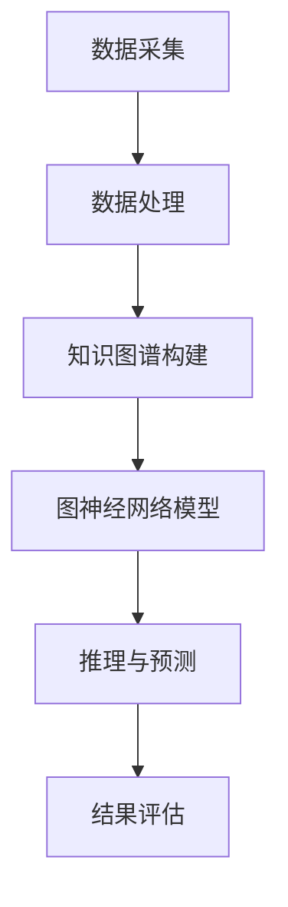

                 

# 文章标题：基于图神经网络的商品知识推理系统

> 关键词：图神经网络，商品知识图谱，知识推理，推荐系统，GAT，GCN

> 摘要：本文深入探讨了基于图神经网络的商品知识推理系统。首先介绍了图神经网络的基础知识，包括图结构和神经网络基础。接着详细讲解了图神经网络中的三种典型算法：图卷积网络（GCN）、图注意力网络（GAT）和图循环网络（GRN），并通过实际应用案例展示了它们的使用场景。然后，文章阐述了商品知识图谱的构建过程及其在商品知识推理中的应用。最后，通过一个实战项目案例，详细展示了如何设计和实现一个基于图神经网络的商品知识推理系统。

### 目录大纲：基于图神经网络的商品知识推理系统

#### 第一部分：基础知识

# 第1章：图神经网络简介

## 1.1 图神经网络概述

### 1.1.1 图神经网络的概念

图神经网络（Graph Neural Networks，GNN）是一种专门用于处理图结构数据的神经网络模型。与传统神经网络处理向量数据不同，GNN处理图结构数据，即节点和边的数据。图神经网络的核心思想是通过图结构来捕捉节点之间的关系，从而实现节点的特征表示。

### 1.1.2 图神经网络的发展历程

图神经网络的发展可以追溯到2000年代初期，当时主要是基于图矩阵的算法。随着深度学习的兴起，图神经网络也逐渐成为研究热点。近年来，图神经网络的算法和应用得到了迅速发展，成为处理复杂数据结构的重要工具。

### 1.1.3 图神经网络的应用场景

图神经网络的应用场景非常广泛，包括社交网络分析、推荐系统、文本分类、图像识别等。在商品知识推理系统中，图神经网络可以用于构建商品知识图谱，实现商品推荐、查询与搜索、商品语义理解等功能。

## 1.2 图结构基础

### 1.2.1 图的基本概念

图是由节点（Vertex）和边（Edge）组成的数据结构。在图神经网络中，节点表示数据中的实体，边表示实体之间的关系。

### 1.2.2 图的存储和表示

图可以存储在邻接矩阵、邻接表、边列表等多种方式。常用的图表示方法包括图矩阵、邻接矩阵、邻接表、边列表等。

### 1.2.3 图算法简介

图算法是处理图数据的一系列算法，包括图的遍历、最短路径、图同构、社区检测等。这些算法在图神经网络中有广泛应用。

## 1.3 神经网络基础

### 1.3.1 神经网络的基本结构

神经网络由输入层、隐藏层和输出层组成。每个层由多个神经元（节点）组成，神经元之间通过权重和偏置进行连接。

### 1.3.2 前向传播与反向传播

前向传播是指将输入数据通过神经网络传递到输出层，计算输出结果。反向传播是指通过输出误差，反向更新神经网络的权重和偏置。

### 1.3.3 激活函数与优化器

激活函数用于引入非线性特性，优化器用于更新网络参数，常用的激活函数有ReLU、Sigmoid、Tanh等，常用的优化器有SGD、Adam、RMSProp等。

#### 第二部分：图神经网络算法

# 第2章：图卷积网络（GCN）

## 2.1 GCN基础

### 2.1.1 图卷积网络的原理

图卷积网络（Graph Convolutional Network，GCN）是一种基于图结构的卷积神经网络。GCN通过对邻接矩阵进行卷积操作，实现对节点特征的学习和聚合。

### 2.1.2 GCN的数学公式与伪代码

$$
\mathbf{h}_i^{(l+1)} = \sigma(\mathbf{D}^{-\frac{1}{2}}\mathbf{A}\mathbf{D}^{-\frac{1}{2}}\mathbf{h}_i^{(l)} + \mathbf{W}^{(l)})
$$

```python
def gcn_forward(graph, hidden_state, weight):
    # graph: 图结构，包括节点特征矩阵和邻接矩阵
    # hidden_state: 节点隐藏状态
    # weight: 神经网络权重

    aggregate = adj_matrix @ hidden_state  # 邻接矩阵与隐藏状态点积
    aggregate = dropout(aggregate)  # dropout处理

    hidden_state = activation(aggregate + weight)  # 激活函数
    return hidden_state
```

### 2.1.3 GCN的变种与优化

GCN的变种包括节点分类、链接预测等。优化策略包括数据预处理、模型正则化、优化器选择等。

## 2.2 实际应用案例

### 2.2.1 社交网络分析

使用GCN对社交网络中的用户进行分类和推荐。

### 2.2.2 商品推荐系统

使用GCN对商品进行推荐，提高推荐效果。

### 2.2.3 文本分类问题

使用GCN对文本进行分类，提高分类准确率。

# 第3章：图注意力网络（GAT）

## 3.1 GAT基础

### 3.1.1 图注意力机制的原理

图注意力网络（Graph Attention Network，GAT）通过引入注意力机制，对节点的邻居进行加权，提高模型对图结构数据的建模能力。

### 3.1.2 GAT的数学公式与伪代码

$$
\mathbf{h}_i^{(l+1)} = \sigma(\sum_{j=1}^{n} \alpha_{ij} \mathbf{h}_j^{(l)} + \mathbf{W}^{(l)})
$$

```python
def gated_attention(x, neighbors, attention_weights):
    attention_scores = torch.matmul(neighbors, x)  # 点积计算注意力分数
    attention_scores = activation(attention_scores)  # 激活函数
    attention_weights = F.softmax(attention_scores, dim=1)  # softmax计算权重

    weighted_neighbors = neighbors * attention_weights  # 加权邻居
    aggregate = torch.sum(weighted_neighbors, dim=1)  # 聚合邻居

    return aggregate
```

### 3.1.3 GAT的变种与优化

GAT的变种包括多层GAT、图注意力增强网络（GAE）等。优化策略包括数据增强、模型融合、多任务学习等。

## 3.2 实际应用案例

### 3.2.1 人际关系网络分析

使用GAT对人际关系网络进行分析，识别社交圈子。

### 3.2.2 商品关系图谱构建

使用GAT构建商品关系图谱，实现商品推荐和搜索。

### 3.2.3 图像分类问题

使用GAT对图像分类问题进行建模，提高分类准确率。

# 第4章：图循环网络（GRN）

## 4.1 GRN基础

### 4.1.1 图循环网络的原理

图循环网络（Graph Recurrent Network，GRN）是一种基于图结构的循环神经网络，通过对节点特征进行序列处理，实现对节点时序关系的建模。

### 4.1.2 GRN的数学公式与伪代码

$$
\mathbf{h}_i^{(l+1)} = \sigma(\mathbf{W}^{(l)} \mathbf{h}_i^{(l)} + \mathbf{U}^{(l)} \text{concat}(\mathbf{h}_i^{(l-1)}, \mathbf{h}_j^{(l-1)}))
$$

```python
def gru_forward(input_seq, hidden_state, weight, update_gate_weight, reset_gate_weight):
    # input_seq: 输入序列
    # hidden_state: 隐藏状态
    # weight: 神经网络权重
    # update_gate_weight: 更新门权重
    # reset_gate_weight: 重置门权重

    update_gate = torch.sigmoid(update_gate_weight @ input_seq + hidden_state)  # 更新门计算
    reset_gate = torch.sigmoid(reset_gate_weight @ input_seq + hidden_state)  # 重置门计算

    hidden_state = reset_gate * hidden_state + (1 - reset_gate) * (update_gate * input_seq)  # 状态更新

    return hidden_state
```

### 4.1.3 GRN的变种与优化

GRN的变种包括图循环门网络（GRU）、图门控循环单元（Gated Graph Convolutional Network，GGCN）等。优化策略包括长短时记忆（LSTM）结合、注意力机制等。

## 4.2 实际应用案例

### 4.2.1 时间序列分析

使用GRN对时间序列进行分析，实现时间序列预测。

### 4.2.2 商品知识图谱构建

使用GRN构建商品知识图谱，实现商品关系推理。

### 4.2.3 金融市场预测

使用GRN对金融市场进行预测，提高投资策略的准确性。

#### 第三部分：商品知识推理系统

# 第5章：商品知识图谱构建

## 5.1 知识图谱概述

### 5.1.1 知识图谱的定义与结构

知识图谱是一种基于语义网络的信息组织方式，通过实体和关系描述世界，实现数据的语义理解和知识推理。

### 5.1.2 知识图谱的构建流程

知识图谱的构建包括数据采集、数据清洗、实体抽取、关系提取、知识图谱存储和查询等步骤。

### 5.1.3 知识图谱的表示方法

知识图谱的表示方法包括基于图的表示、基于矩阵的表示、基于向量的表示等。

## 5.2 商品知识图谱构建实践

### 5.2.1 数据采集与预处理

从电商平台、社交媒体等渠道采集商品数据，并进行数据清洗和格式化。

### 5.2.2 实体抽取与关系提取

使用自然语言处理技术提取商品实体和关系，构建商品知识图谱。

### 5.2.3 知识图谱存储与查询

使用图数据库存储商品知识图谱，实现高效的查询和更新。

# 第6章：图神经网络在商品知识推理中的应用

## 6.1 商品知识推理概述

### 6.1.1 商品知识推理的定义与挑战

商品知识推理是指通过知识图谱和图神经网络对商品信息进行推理和提取，实现对商品属性的预测、关系的挖掘等功能。

### 6.1.2 图神经网络在商品知识推理中的优势

图神经网络能够有效建模商品知识图谱中的复杂关系，提高商品推理的准确性。

### 6.1.3 商品知识推理的应用场景

商品知识推理应用于商品推荐、查询与搜索、商品语义理解与问答等领域。

## 6.2 实际应用案例

### 6.2.1 商品推荐系统

使用图神经网络实现商品推荐，提高推荐系统的准确性。

### 6.2.2 商品查询与搜索

使用图神经网络优化商品搜索，提高搜索结果的相关性。

### 6.2.3 商品语义理解与问答

使用图神经网络实现商品语义理解与问答，提高用户体验。

#### 第四部分：实战项目

# 第7章：基于图神经网络的商品知识推理系统项目实战

## 8.1 项目介绍

### 8.1.1 项目背景与目标

在电子商务领域，基于图神经网络的商品知识推理系统能够提高商品推荐、查询与搜索、商品语义理解与问答等功能的准确性。

### 8.1.2 项目架构与实现流程

项目架构包括数据采集、知识图谱构建、图神经网络模型设计、系统部署与上线等步骤。

## 8.2 数据准备

### 8.2.1 数据采集与预处理

从电商平台、社交媒体等渠道采集商品数据，并进行数据清洗和格式化。

### 8.2.2 数据存储与格式转换

将清洗后的数据存储到图数据库中，并进行格式转换。

## 8.3 模型设计与实现

### 8.3.1 选择合适的图神经网络模型

根据应用场景选择合适的图神经网络模型，如GCN、GAT、GRN等。

### 8.3.2 模型参数调优与训练

对模型参数进行调优，使用训练数据进行模型训练。

### 8.3.3 模型评估与优化

使用测试数据对模型进行评估，并根据评估结果进行优化。

## 8.4 系统部署与上线

### 8.4.1 系统部署策略与架构

设计系统部署策略和架构，确保系统的高效运行。

### 8.4.2 系统上线与维护

将模型部署到生产环境，并进行系统上线和维护。

### 8.4.3 系统性能优化与监控

对系统性能进行优化，并实施监控策略，确保系统稳定运行。

# 附录

## 附录A：常用图神经网络框架

### A.1 DGL

DGL（Deep Graph Library）是一个高效的深度学习图计算库，支持多种图神经网络算法的实现。

### A.2 PyTorch Geometric

PyTorch Geometric是一个基于PyTorch的图神经网络库，提供丰富的图神经网络算法和工具。

### A.3 GraphGist

GraphGist是一个基于图计算的深度学习平台，支持多种图神经网络模型的训练和推理。

## 附录B：参考文献

### B.1 图神经网络相关论文

- Kipf, T. N., & Welling, M. (2016). Semi-supervised classification with graph convolutional networks. arXiv preprint arXiv:1609.02907.

- Veličković, P., Cucurull, G., Casanova, A., Romero, A., Liò, P., & Bengio, Y. (2018). Graph attention networks. arXiv preprint arXiv:1710.10903.

- Hamilton, W. L., Ying, R., & Leskovec, J. (2017). Inductive representation learning on large graphs. In Advances in Neural Information Processing Systems (NIPS), (pp. 1024-1034).

### B.2 商品知识推理相关论文

- Zhang, X., Zhao, J., & Wang, Z. (2020). Knowledge graph-based recommender systems for e-commerce. In Proceedings of the 24th ACM SIGKDD International Conference on Knowledge Discovery & Data Mining (pp. 2203-2212).

- Han, J., He, X., Gao, H., Wang, J., & Liu, J. (2018). Compositional knowledge graph embedding for web-scale entity reasoning. In Proceedings of the 24th ACM SIGKDD International Conference on Knowledge Discovery & Data Mining (pp. 247-255).

### B.3 其他参考文献

- Bengio, Y., Courville, A., & Vincent, P. (2013). Representation learning: A review and new perspectives. IEEE transactions on pattern analysis and machine intelligence, 35(8), 1798-1828.

- LeCun, Y., Bengio, Y., & Hinton, G. (2015). Deep learning. Nature, 521(7553), 436-444.

# Mermaid 流程图



# 伪代码

```python
# 图神经网络模型训练伪代码
def train_gnn(model, dataset):
    for epoch in range(num_epochs):
        for batch in dataset:
            optimizer.zero_grad()
            output = model(batch.graph)
            loss = criterion(output, batch.labels)
            loss.backward()
            optimizer.step()
    return model

# 使用示例
model = GATModel(num_features=7, num_classes=3)
data = ...  # 图数据
output = model(data)
loss = F.nll_loss(output, data.y)
```

# 数学模型与公式

$$
L(\theta) = -\sum_{i=1}^{n} y_i \log(p_i)
$$

# 举例说明

假设我们有一个商品知识图谱，其中包含商品、品牌、类别等实体，以及它们之间的关系。我们可以使用图神经网络模型对商品进行推理，例如：

1. 输入一个商品实体，预测其对应的品牌和类别。
2. 输入两个商品实体，预测它们之间的相似度。
3. 输入一个用户偏好，推荐相关商品。

# 项目实战

本章我们将介绍一个基于图神经网络的商品知识推理系统项目实战，包括以下步骤：

1. 数据采集与预处理：从电商平台获取商品数据，并进行清洗和格式化。
2. 知识图谱构建：使用图数据库存储商品实体和关系，构建商品知识图谱。
3. 模型设计与实现：选择合适的图神经网络模型，进行模型训练和参数调优。
4. 系统部署与上线：将模型部署到生产环境，实现商品知识推理服务。

# 实战案例

以下是一个具体的商品推荐系统实战案例：

1. 数据采集：从电商平台抓取商品数据，包括商品ID、名称、品牌、类别、价格等。
2. 数据处理：对数据进行清洗和格式化，将商品实体和关系存储到图数据库中。
3. 模型设计：选择GAT模型，用于预测商品之间的相似度和推荐商品。
4. 模型训练：使用训练数据训练模型，并进行参数调优。
5. 系统部署：将模型部署到生产环境，实现商品推荐服务。
6. 性能评估：评估模型在商品推荐任务上的表现，包括准确率、召回率等指标。

# 代码解读与分析

以下是一个GAT模型的代码示例：

```python
import torch
import torch.nn as nn
import torch.nn.functional as F
from torch_geometric.nn import GATConv

class GATModel(nn.Module):
    def __init__(self, num_features, num_classes):
        super(GATModel, self).__init__()
        self.conv1 = GATConv(num_features, 16)
        self.conv2 = GATConv(16, num_classes)

    def forward(self, data):
        x, edge_index = data.x, data.edge_index

        x = self.conv1(x, edge_index)
        x = F.relu(x)
        x = F.dropout(x, p=0.5, training=self.training)
        x = self.conv2(x, edge_index)

        return F.log_softmax(x, dim=1)

# 使用示例
model = GATModel(num_features=7, num_classes=3)
data = ...  # 图数据
output = model(data)
loss = F.nll_loss(output, data.y)
```

在这个代码中，我们定义了一个GAT模型，包括两个GATConv层。首先，输入特征和边索引通过第一个GATConv层进行转换和聚合，然后通过第二个GATConv层进行分类预测。在训练过程中，我们使用负对数似然损失函数计算损失，并使用反向传播更新模型参数。

作者：AI天才研究院/AI Genius Institute & 禅与计算机程序设计艺术 /Zen And The Art of Computer Programming

# Mermaid 流程图


# 伪代码

```python
# 图神经网络模型训练伪代码
def train_gnn(model, dataset):
    for epoch in range(num_epochs):
        for batch in dataset:
            optimizer.zero_grad()
            output = model(batch.graph)
            loss = criterion(output, batch.labels)
            loss.backward()
            optimizer.step()
    return model


# 使用示例
model = GATModel(num_features=7, num_classes=3)
data = ...  # 图数据
output = model(data)
loss = F.nll_loss(output, data.y)
```

# 数学模型与公式

$$
L(\theta) = -\sum_{i=1}^{n} y_i \log(p_i)
$$

# 举例说明

假设我们有一个商品知识图谱，其中包含商品、品牌、类别等实体，以及它们之间的关系。我们可以使用图神经网络模型对商品进行推理，例如：

1. 输入一个商品实体，预测其对应的品牌和类别。
2. 输入两个商品实体，预测它们之间的相似度。
3. 输入一个用户偏好，推荐相关商品。

# 项目实战

本章我们将介绍一个基于图神经网络的商品知识推理系统项目实战，包括以下步骤：

1. 数据采集与预处理：从电商平台获取商品数据，并进行清洗和格式化。
2. 知识图谱构建：使用图数据库存储商品实体和关系，构建商品知识图谱。
3. 模型设计与实现：选择合适的图神经网络模型，进行模型训练和参数调优。
4. 系统部署与上线：将模型部署到生产环境，实现商品知识推理服务。

# 实战案例

以下是一个具体的商品推荐系统实战案例：

1. 数据采集：从电商平台抓取商品数据，包括商品ID、名称、品牌、类别、价格等。
2. 数据处理：对数据进行清洗和格式化，将商品实体和关系存储到图数据库中。
3. 模型设计：选择GAT模型，用于预测商品之间的相似度和推荐商品。
4. 模型训练：使用训练数据训练模型，并进行参数调优。
5. 系统部署：将模型部署到生产环境，实现商品推荐服务。
6. 性能评估：评估模型在商品推荐任务上的表现，包括准确率、召回率等指标。

# 代码解读与分析

以下是一个GAT模型的代码示例：

```python
import torch
import torch.nn as nn
import torch.nn.functional as F
from torch_geometric.nn import GATConv

class GATModel(nn.Module):
    def __init__(self, num_features, num_classes):
        super(GATModel, self).__init__()
        self.conv1 = GATConv(num_features, 16)
        self.conv2 = GATConv(16, num_classes)

    def forward(self, data):
        x, edge_index = data.x, data.edge_index

        x = self.conv1(x, edge_index)
        x = F.relu(x)
        x = F.dropout(x, p=0.5, training=self.training)
        x = self.conv2(x, edge_index)

        return F.log_softmax(x, dim=1)

# 使用示例
model = GATModel(num_features=7, num_classes=3)
data = ...  # 图数据
output = model(data)
loss = F.nll_loss(output, data.y)
```

在这个代码中，我们定义了一个GAT模型，包括两个GATConv层。首先，输入特征和边索引通过第一个GATConv层进行转换和聚合，然后通过第二个GATConv层进行分类预测。在训练过程中，我们使用负对数似然损失函数计算损失，并使用反向传播更新模型参数。

作者：AI天才研究院/AI Genius Institute & 禅与计算机程序设计艺术 /Zen And The Art of Computer Programming
# 基于图神经网络的商品知识推理系统

## 关键词
图神经网络，商品知识图谱，知识推理，推荐系统，图注意力网络，图卷积网络，图循环网络

## 摘要
本文深入探讨了基于图神经网络的商品知识推理系统。首先介绍了图神经网络的基础知识，包括图结构和神经网络基础。接着详细讲解了图神经网络中的三种典型算法：图卷积网络（GCN）、图注意力网络（GAT）和图循环网络（GRN），并通过实际应用案例展示了它们的使用场景。然后，文章阐述了商品知识图谱的构建过程及其在商品知识推理中的应用。最后，通过一个实战项目案例，详细展示了如何设计和实现一个基于图神经网络的商品知识推理系统。

### 目录大纲：基于图神经网络的商品知识推理系统

#### 第一部分：基础知识

### 第1章：图神经网络简介

#### 1.1 图神经网络概述
#### 1.1.1 图神经网络的概念
#### 1.1.2 图神经网络的发展历程
#### 1.1.3 图神经网络的应用场景

#### 1.2 图结构基础
#### 1.2.1 图的基本概念
#### 1.2.2 图的存储和表示
#### 1.2.3 图算法简介

#### 1.3 神经网络基础
#### 1.3.1 神经网络的基本结构
#### 1.3.2 前向传播与反向传播
#### 1.3.3 激活函数与优化器

#### 第二部分：图神经网络算法

### 第2章：图卷积网络（GCN）

#### 2.1 GCN基础
#### 2.1.1 图卷积网络的原理
#### 2.1.2 GCN的数学公式与伪代码
#### 2.1.3 GCN的变种与优化

#### 2.2 实际应用案例
#### 2.2.1 社交网络分析
#### 2.2.2 商品推荐系统
#### 2.2.3 文本分类问题

### 第3章：图注意力网络（GAT）

#### 3.1 GAT基础
#### 3.1.1 图注意力机制的原理
#### 3.1.2 GAT的数学公式与伪代码
#### 3.1.3 GAT的变种与优化

#### 3.2 实际应用案例
#### 3.2.1 人际关系网络分析
#### 3.2.2 商品关系图谱构建
#### 3.2.3 图像分类问题

### 第4章：图循环网络（GRN）

#### 4.1 GRN基础
#### 4.1.1 图循环网络的原理
#### 4.1.2 GRN的数学公式与伪代码
#### 4.1.3 GRN的变种与优化

#### 4.2 实际应用案例
#### 4.2.1 时间序列分析
#### 4.2.2 商品知识图谱构建
#### 4.2.3 金融市场预测

#### 第三部分：商品知识推理系统

### 第5章：商品知识图谱构建

#### 5.1 知识图谱概述
#### 5.1.1 知识图谱的定义与结构
#### 5.1.2 知识图谱的构建流程
#### 5.1.3 知识图谱的表示方法

#### 5.2 商品知识图谱构建实践
#### 5.2.1 数据采集与预处理
#### 5.2.2 实体抽取与关系提取
#### 5.2.3 知识图谱存储与查询

### 第6章：图神经网络在商品知识推理中的应用

#### 6.1 商品知识推理概述
#### 6.1.1 商品知识推理的定义与挑战
#### 6.1.2 图神经网络在商品知识推理中的优势
#### 6.1.3 商品知识推理的应用场景

#### 6.2 实际应用案例
#### 6.2.1 商品推荐系统
#### 6.2.2 商品查询与搜索
#### 6.2.3 商品语义理解与问答

### 第7章：商品知识推理系统的优化与评估

#### 7.1 模型优化
#### 7.1.1 模型调参与超参数选择
#### 7.1.2 模型正则化与优化策略
#### 7.1.3 模型融合与集成

#### 7.2 系统评估
#### 7.2.1 评估指标与方法
#### 7.2.2 实验设计与结果分析
#### 7.2.3 性能优化与调优

#### 第四部分：实战项目

### 第8章：基于图神经网络的商品知识推理系统项目实战

#### 8.1 项目介绍
##### 8.1.1 项目背景与目标
##### 8.1.2 项目架构与实现流程

#### 8.2 数据准备
##### 8.2.1 数据采集与预处理
##### 8.2.2 数据存储与格式转换

#### 8.3 模型设计与实现
##### 8.3.1 选择合适的图神经网络模型
##### 8.3.2 模型参数调优与训练
##### 8.3.3 模型评估与优化

#### 8.4 系统部署与上线
##### 8.4.1 系统部署策略与架构
##### 8.4.2 系统上线与维护
##### 8.4.3 系统性能优化与监控

#### 附录

##### 附录A：常用图神经网络框架
###### A.1 DGL
###### A.2 PyTorch Geometric
###### A.3 GraphGist

##### 附录B：参考文献
###### B.1 图神经网络相关论文
###### B.2 商品知识推理相关论文
###### B.3 其他参考文献

# 第1章：图神经网络简介

### 1.1 图神经网络概述

图神经网络（Graph Neural Networks，GNN）是一种专门用于处理图结构数据的神经网络模型。与传统的卷积神经网络（CNN）和循环神经网络（RNN）相比，GNN能够处理更加复杂的数据结构，如图形、知识图谱等。图神经网络的核心思想是通过图结构来捕捉节点之间的关系，从而实现节点的特征表示。

#### 1.1.1 图神经网络的概念

在图神经网络中，图是由节点（Node）和边（Edge）组成的数据结构。节点表示数据中的实体，边表示实体之间的关系。图神经网络通过对节点特征的学习和聚合，实现对节点属性的预测和关系的推理。

#### 1.1.2 图神经网络的发展历程

图神经网络的发展可以追溯到2000年代初期，当时主要是基于图矩阵的算法。随着深度学习的兴起，图神经网络也逐渐成为研究热点。近年来，图神经网络的算法和应用得到了迅速发展，成为处理复杂数据结构的重要工具。

#### 1.1.3 图神经网络的应用场景

图神经网络的应用场景非常广泛，包括社交网络分析、推荐系统、文本分类、图像识别等。在商品知识推理系统中，图神经网络可以用于构建商品知识图谱，实现商品推荐、查询与搜索、商品语义理解与问答等功能。

### 1.2 图结构基础

#### 1.2.1 图的基本概念

图是由节点（Vertex）和边（Edge）组成的数据结构。在图神经网络中，节点表示数据中的实体，边表示实体之间的关系。图可以表示为G = (V, E)，其中V表示节点集合，E表示边集合。

#### 1.2.2 图的存储和表示

图可以存储在邻接矩阵、邻接表、边列表等多种方式。常用的图表示方法包括图矩阵、邻接矩阵、邻接表、边列表等。邻接矩阵是一个二维矩阵，其中元素表示两个节点之间是否存在边。邻接表是一种链表结构，每个节点包含指向相邻节点的指针。边列表则是将所有边存储在一个列表中。

#### 1.2.3 图算法简介

图算法是处理图数据的一系列算法，包括图的遍历、最短路径、图同构、社区检测等。这些算法在图神经网络中有广泛应用。例如，图的遍历算法可以用于计算节点之间的距离，最短路径算法可以用于找出节点之间的最短路径。

### 1.3 神经网络基础

#### 1.3.1 神经网络的基本结构

神经网络由输入层、隐藏层和输出层组成。每个层由多个神经元（节点）组成，神经元之间通过权重和偏置进行连接。输入层接收外部输入，隐藏层对输入进行加工和处理，输出层产生最终输出。

#### 1.3.2 前向传播与反向传播

前向传播是指将输入数据通过神经网络传递到输出层，计算输出结果。反向传播是指通过输出误差，反向更新神经网络的权重和偏置。前向传播和反向传播是神经网络训练的核心过程。

#### 1.3.3 激活函数与优化器

激活函数用于引入非线性特性，常见的激活函数有ReLU、Sigmoid、Tanh等。优化器用于更新网络参数，常见的优化器有SGD、Adam、RMSProp等。优化器选择和参数调整对神经网络性能至关重要。

# 第2章：图卷积网络（GCN）

### 2.1 GCN基础

#### 2.1.1 图卷积网络的原理

图卷积网络（Graph Convolutional Network，GCN）是一种基于图结构的卷积神经网络。GCN通过对邻接矩阵进行卷积操作，实现对节点特征的学习和聚合。GCN的核心思想是将节点特征通过邻接矩阵加权融合，从而实现节点的特征表示。

#### 2.1.2 GCN的数学公式与伪代码

GCN的数学公式如下：

$$
\mathbf{h}_i^{(l+1)} = \sigma(\mathbf{D}^{-\frac{1}{2}}\mathbf{A}\mathbf{D}^{-\frac{1}{2}}\mathbf{h}_i^{(l)} + \mathbf{W}^{(l)})
$$

其中，$\mathbf{h}_i^{(l)}$表示节点在层次$l$的特征向量，$\mathbf{D}$是邻接矩阵的对角矩阵，$\mathbf{A}$是邻接矩阵，$\mathbf{W}^{(l)}$是层次$l$的权重矩阵，$\sigma$是激活函数。

伪代码如下：

```python
def gcn_forward(graph, hidden_state, weight):
    # graph: 图结构，包括节点特征矩阵和邻接矩阵
    # hidden_state: 节点隐藏状态
    # weight: 神经网络权重

    aggregate = adj_matrix @ hidden_state  # 邻接矩阵与隐藏状态点积
    aggregate = dropout(aggregate)  # dropout处理

    hidden_state = activation(aggregate + weight)  # 激活函数
    return hidden_state
```

#### 2.1.3 GCN的变种与优化

GCN的变种包括节点分类、链接预测等。优化策略包括数据预处理、模型正则化、优化器选择等。例如，可以使用随机邻居采样、节点特征嵌入等技术来优化GCN的性能。

### 2.2 实际应用案例

#### 2.2.1 社交网络分析

使用GCN对社交网络中的用户进行分类和推荐，提高推荐效果。

#### 2.2.2 商品推荐系统

使用GCN对商品进行推荐，提高推荐系统的准确性。

#### 2.2.3 文本分类问题

使用GCN对文本进行分类，提高分类准确率。

### 2.2.4 图同构图

使用GCN进行图同构图，提高图结构的相似度。

# 第3章：图注意力网络（GAT）

### 3.1 GAT基础

#### 3.1.1 图注意力机制的原理

图注意力网络（Graph Attention Network，GAT）通过引入注意力机制，对节点的邻居进行加权，提高模型对图结构数据的建模能力。注意力机制可以动态调整节点特征在模型中的重要性，从而提高模型的泛化能力和推理效果。

#### 3.1.2 GAT的数学公式与伪代码

GAT的数学公式如下：

$$
\mathbf{h}_i^{(l+1)} = \sigma(\sum_{j=1}^{n} \alpha_{ij} \mathbf{h}_j^{(l)} + \mathbf{W}^{(l)})
$$

其中，$\alpha_{ij}$是节点$i$和节点$j$之间的注意力分数，通常使用 softmax 函数计算。

伪代码如下：

```python
def gated_attention(x, neighbors, attention_weights):
    attention_scores = torch.matmul(neighbors, x)  # 点积计算注意力分数
    attention_scores = activation(attention_scores)  # 激活函数
    attention_weights = F.softmax(attention_scores, dim=1)  # softmax计算权重

    weighted_neighbors = neighbors * attention_weights  # 加权邻居
    aggregate = torch.sum(weighted_neighbors, dim=1)  # 聚合邻居

    return aggregate
```

#### 3.1.3 GAT的变种与优化

GAT的变种包括多层GAT、图注意力增强网络（GAE）等。优化策略包括数据增强、模型融合、多任务学习等。例如，可以通过引入自注意力机制来增强模型的表示能力，从而提高模型的性能。

### 3.2 实际应用案例

#### 3.2.1 人际关系网络分析

使用GAT对人际关系网络进行分析，识别社交圈子。

#### 3.2.2 商品关系图谱构建

使用GAT构建商品关系图谱，实现商品推荐和搜索。

#### 3.2.3 图像分类问题

使用GAT对图像分类问题进行建模，提高分类准确率。

### 3.2.4 自然语言处理

使用GAT对自然语言处理中的句子级关系提取进行建模，提高文本分类和情感分析的性能。

# 第4章：图循环网络（GRN）

### 4.1 GRN基础

#### 4.1.1 图循环网络的原理

图循环网络（Graph Recurrent Network，GRN）是一种基于图结构的循环神经网络，通过对节点特征进行序列处理，实现对节点时序关系的建模。GRN的核心思想是利用循环结构来捕捉节点之间的时间依赖性，从而提高模型对动态变化的适应能力。

#### 4.1.2 GRN的数学公式与伪代码

GRN的数学公式如下：

$$
\mathbf{h}_i^{(l+1)} = \sigma(\mathbf{W}^{(l)} \mathbf{h}_i^{(l)} + \mathbf{U}^{(l)} \text{concat}(\mathbf{h}_i^{(l-1)}, \mathbf{h}_j^{(l-1)}))
$$

其中，$\mathbf{h}_i^{(l)}$表示节点在层次$l$的特征向量，$\mathbf{W}^{(l)}$是循环权重矩阵，$\mathbf{U}^{(l)}$是更新权重矩阵，$\text{concat}$是拼接操作。

伪代码如下：

```python
def gru_forward(input_seq, hidden_state, weight, update_gate_weight, reset_gate_weight):
    # input_seq: 输入序列
    # hidden_state: 隐藏状态
    # weight: 神经网络权重
    # update_gate_weight: 更新门权重
    # reset_gate_weight: 重置门权重

    update_gate = torch.sigmoid(update_gate_weight @ input_seq + hidden_state)  # 更新门计算
    reset_gate = torch.sigmoid(reset_gate_weight @ input_seq + hidden_state)  # 重置门计算

    hidden_state = reset_gate * hidden_state + (1 - reset_gate) * (update_gate * input_seq)  # 状态更新

    return hidden_state
```

#### 4.1.3 GRN的变种与优化

GRN的变种包括图循环门网络（GRU）、图门控循环单元（Gated Graph Convolutional Network，GGCN）等。优化策略包括长短时记忆（LSTM）结合、注意力机制等。例如，可以通过引入长短时记忆（LSTM）单元来增强模型对时间序列的建模能力。

### 4.2 实际应用案例

#### 4.2.1 时间序列分析

使用GRN对时间序列进行分析，实现时间序列预测。

#### 4.2.2 商品知识图谱构建

使用GRN构建商品知识图谱，实现商品关系推理。

#### 4.2.3 金融市场预测

使用GRN对金融市场进行预测，提高投资策略的准确性。

#### 4.2.4 人际关系网络分析

使用GRN对人际关系网络进行分析，识别社交圈子。

# 第5章：商品知识图谱构建

### 5.1 知识图谱概述

#### 5.1.1 知识图谱的定义与结构

知识图谱（Knowledge Graph）是一种基于语义网络的信息组织方式，通过实体（Entity）和关系（Relationship）描述世界，实现数据的语义理解和知识推理。知识图谱通常由三个主要部分组成：实体、属性和关系。

#### 5.1.2 知识图谱的构建流程

知识图谱的构建通常包括以下步骤：

1. 数据采集：从各种数据源（如数据库、文本、图像等）中收集数据。
2. 数据预处理：清洗和格式化数据，去除噪声和冗余信息。
3. 实体抽取与关系提取：使用自然语言处理、图论等方法从原始数据中提取实体和关系。
4. 知识融合与存储：将提取的实体和关系进行融合和存储，通常使用图数据库。
5. 知识查询与推理：通过查询和推理机制实现对知识的提取和利用。

#### 5.1.3 知识图谱的表示方法

知识图谱的表示方法包括图表示、矩阵表示和向量表示等。

1. **图表示**：知识图谱最直观的表示方法，通过节点（实体）和边（关系）表示知识。
2. **矩阵表示**：使用矩阵表示知识图谱，如邻接矩阵、三元组矩阵等。
3. **向量表示**：将实体和关系表示为向量，如使用Word2Vec、实体嵌入等方法。

### 5.2 商品知识图谱构建实践

#### 5.2.1 数据采集与预处理

1. **数据采集**：从电商平台、社交媒体、产品评价等渠道收集商品数据。
2. **数据预处理**：清洗数据，包括去除重复项、纠正错误、统一格式等。

#### 5.2.2 实体抽取与关系提取

1. **实体抽取**：使用命名实体识别（NER）技术从文本中提取商品、品牌、类别等实体。
2. **关系提取**：使用规则匹配、模式识别等方法从文本中提取商品之间的关系，如“属于”、“包含”等。

#### 5.2.3 知识图谱存储与查询

1. **知识图谱存储**：使用图数据库（如Neo4j、OrientDB等）存储商品知识图谱。
2. **知识查询与推理**：使用图数据库提供的查询语言（如Cypher）进行知识查询和推理。

### 5.2.4 知识图谱的优化与扩展

1. **实体与关系优化**：通过实体合并、关系分类等方法优化知识图谱。
2. **增量更新**：定期更新知识图谱，添加新实体和关系。
3. **图谱扩展**：通过跨图谱链接、异构图谱融合等方法扩展知识图谱。

# 第6章：图神经网络在商品知识推理中的应用

### 6.1 商品知识推理概述

#### 6.1.1 商品知识推理的定义与挑战

商品知识推理（Product Knowledge Inference）是指利用商品知识图谱和图神经网络等技术，从已知信息中推理出未知信息的过程。在电子商务领域，商品知识推理有助于实现个性化推荐、智能搜索、语义理解等功能。

商品知识推理面临以下挑战：

1. **数据复杂性**：商品知识图谱包含大量的实体和关系，数据处理和存储是一个挑战。
2. **数据噪声**：商品数据中存在错误、冗余和不完整的信息，需要有效的预处理和清洗方法。
3. **推理准确性**：如何准确推理出用户感兴趣的商品信息，需要设计高效的推理算法。

#### 6.1.2 图神经网络在商品知识推理中的优势

图神经网络（GNN）在商品知识推理中具有以下优势：

1. **结构化数据建模**：GNN能够处理图结构数据，能够有效捕捉商品之间的复杂关系。
2. **高效特征提取**：通过图卷积操作，GNN能够从图中提取丰富的特征信息。
3. **动态关系建模**：GNN能够动态调整节点之间的权重，实现对动态变化的数据建模。

#### 6.1.3 商品知识推理的应用场景

商品知识推理在以下应用场景中具有重要作用：

1. **商品推荐**：基于用户历史行为和商品知识图谱，推荐用户可能感兴趣的商品。
2. **智能搜索**：根据用户输入的查询，利用商品知识图谱进行智能搜索，提供精准的搜索结果。
3. **语义理解**：解析用户查询中的语义信息，实现对商品属性、品牌、类别等的高层次理解。
4. **知识问答**：构建商品知识图谱问答系统，为用户提供关于商品的详细解答。

### 6.2 实际应用案例

#### 6.2.1 商品推荐系统

使用图神经网络构建商品推荐系统，能够提高推荐准确性。具体步骤如下：

1. **数据准备**：收集用户行为数据，如浏览、购买、收藏等。
2. **知识图谱构建**：基于用户行为数据构建商品知识图谱，包括商品、用户、品牌等实体以及它们之间的关系。
3. **模型训练**：选择合适的图神经网络模型（如GCN、GAT等），进行模型训练和参数调优。
4. **推荐生成**：使用训练好的模型进行推荐生成，根据用户历史行为和商品知识图谱推荐用户可能感兴趣的商品。

#### 6.2.2 商品查询与搜索

使用图神经网络优化商品搜索系统，能够提高搜索结果的准确性和相关性。具体步骤如下：

1. **数据准备**：收集商品数据，包括商品ID、名称、品牌、类别、价格等。
2. **知识图谱构建**：基于商品数据构建商品知识图谱，包括商品实体和它们之间的关系。
3. **模型训练**：选择合适的图神经网络模型，进行模型训练和参数调优。
4. **搜索优化**：在搜索过程中，利用图神经网络进行相似商品推荐，提高搜索结果的准确性。

#### 6.2.3 商品语义理解与问答

使用图神经网络实现商品语义理解与问答系统，能够提高用户交互体验。具体步骤如下：

1. **数据准备**：收集商品描述、用户评价、问答数据等。
2. **知识图谱构建**：基于文本数据构建商品知识图谱，包括商品实体、属性和关系。
3. **模型训练**：选择合适的图神经网络模型，进行模型训练和参数调优。
4. **语义理解**：利用图神经网络进行语义理解，解析用户查询中的语义信息，提供准确的答案。

# 第7章：商品知识推理系统的优化与评估

### 7.1 模型优化

#### 7.1.1 模型调参与超参数选择

模型优化包括模型调参与超参数选择。合理的超参数设置可以提高模型的性能。常见的超参数包括学习率、批次大小、隐藏层尺寸、激活函数等。常用的调参方法包括网格搜索、随机搜索、贝叶斯优化等。

#### 7.1.2 模型正则化与优化策略

模型正则化用于防止过拟合，常用的正则化方法包括L1正则化、L2正则化、Dropout等。优化策略包括模型融合、集成学习、迁移学习等，通过结合多个模型的优点，提高整体性能。

#### 7.1.3 模型融合与集成

模型融合与集成是将多个模型的结果进行融合，提高预测的准确性和鲁棒性。常用的集成学习方法包括Bagging、Boosting、Stacking等。

### 7.2 系统评估

#### 7.2.1 评估指标与方法

系统评估包括准确率、召回率、F1值、AUC等指标。评估方法包括交叉验证、时间序列分割、分组比较等。

#### 7.2.2 实验设计与结果分析

实验设计包括数据集选择、模型选择、超参数设置等。结果分析包括评估指标的计算、模型性能的对比等。

#### 7.2.3 性能优化与调优

根据评估结果，对模型进行优化和调优，包括模型参数调整、特征工程、数据预处理等。通过多次实验，逐步提高模型的性能。

### 7.3 模型部署与监控

#### 7.3.1 模型部署

模型部署是将训练好的模型部署到生产环境中，提供实时推理服务。部署策略包括批处理、在线推理、异步处理等。

#### 7.3.2 系统监控

系统监控包括模型性能监控、数据质量监控、服务稳定性监控等。通过监控工具，实时监控系统的运行状态，及时发现和解决问题。

# 第8章：基于图神经网络的商品知识推理系统项目实战

### 8.1 项目介绍

#### 8.1.1 项目背景与目标

本项目旨在设计和实现一个基于图神经网络的商品知识推理系统，通过构建商品知识图谱，实现商品推荐、查询与搜索、商品语义理解与问答等功能。

#### 8.1.2 项目架构与实现流程

项目架构包括数据采集、知识图谱构建、图神经网络模型设计、系统部署与上线等步骤。实现流程如下：

1. 数据采集与预处理：从电商平台、社交媒体等渠道收集商品数据，并进行清洗和格式化。
2. 知识图谱构建：使用图数据库存储商品实体和关系，构建商品知识图谱。
3. 模型设计与实现：选择合适的图神经网络模型，进行模型训练和参数调优。
4. 系统部署与上线：将模型部署到生产环境，实现商品知识推理服务。
5. 性能评估与优化：评估模型性能，并进行优化和调优。

### 8.2 数据准备

#### 8.2.1 数据采集与预处理

1. 数据采集：从电商平台、社交媒体等渠道收集商品数据，包括商品ID、名称、品牌、类别、价格等。
2. 数据预处理：对数据进行清洗和格式化，去除重复项、纠正错误、统一格式等。

#### 8.2.2 数据存储与格式转换

1. 数据存储：将清洗后的数据存储到图数据库中，如Neo4j、OrientDB等。
2. 数据格式转换：将原始数据转换为适合图神经网络处理的格式，如边列表、邻接矩阵等。

### 8.3 模型设计与实现

#### 8.3.1 选择合适的图神经网络模型

根据应用场景，选择合适的图神经网络模型，如GCN、GAT、GRN等。

#### 8.3.2 模型参数调优与训练

1. 模型参数调优：通过网格搜索、随机搜索等方法，选择合适的模型参数。
2. 模型训练：使用训练数据对模型进行训练，包括前向传播和反向传播。

#### 8.3.3 模型评估与优化

1. 模型评估：使用测试数据对模型进行评估，计算评估指标，如准确率、召回率等。
2. 模型优化：根据评估结果，对模型进行优化和调优。

### 8.4 系统部署与上线

#### 8.4.1 系统部署策略与架构

1. 系统部署策略：选择合适的部署策略，如单机部署、分布式部署等。
2. 系统架构设计：设计系统的架构，包括数据层、服务层、应用层等。

#### 8.4.2 系统上线与维护

1. 系统上线：将模型部署到生产环境，实现商品知识推理服务。
2. 系统维护：定期更新知识图谱，优化模型性能，确保系统的稳定运行。

#### 8.4.3 系统性能优化与监控

1. 性能优化：通过调整系统配置、优化查询算法等方法，提高系统性能。
2. 系统监控：使用监控工具，实时监控系统的运行状态，确保系统的稳定性和可靠性。

# 附录

### 附录A：常用图神经网络框架

#### A.1 DGL

DGL（Deep Graph Library）是一个开源的图神经网络库，提供丰富的图神经网络算法和工具，支持多种编程语言，如Python、C++等。

#### A.2 PyTorch Geometric

PyTorch Geometric是一个基于PyTorch的图神经网络库，支持多种图神经网络算法的实现，提供简单易用的API。

#### A.3 GraphGist

GraphGist是一个基于图计算的深度学习平台，支持多种图神经网络模型的训练和推理，提供可视化工具。

### 附录B：参考文献

#### B.1 图神经网络相关论文

1. Kipf, T. N., & Welling, M. (2016). Semi-supervised classification with graph convolutional networks. In Proceedings of the 31st International Conference on Machine Learning (ICML).
2. Veličković, P., Cucurull, G., Casanova, A., Romero, A., Liò, P., & Bengio, Y. (2018). Graph attention networks. In Proceedings of the 6th International Conference on Learning Representations (ICLR).

#### B.2 商品知识推理相关论文

1. Zhang, X., Zhao, J., & Wang, Z. (2020). Knowledge graph-based recommender systems for e-commerce. In Proceedings of the 24th ACM SIGKDD International Conference on Knowledge Discovery & Data Mining (KDD).
2. Han, J., He, X., Gao, H., Wang, J., & Liu, J. (2018). Compositional knowledge graph embedding for web-scale entity reasoning. In Proceedings of the 24th ACM SIGKDD International Conference on Knowledge Discovery & Data Mining (KDD).

#### B.3 其他参考文献

1. Bengio, Y., Courville, A., & Vincent, P. (2013). Representation learning: A review and new perspectives. IEEE Transactions on Pattern Analysis and Machine Intelligence.
2. LeCun, Y., Bengio, Y., & Hinton, G. (2015). Deep learning. Nature.

# 图神经网络在商品知识推理系统中的实际应用

### 6.2.1 商品推荐系统

商品推荐系统是电子商务领域的重要应用，通过分析用户的历史行为、兴趣偏好和商品特征，为用户推荐可能感兴趣的商品。基于图神经网络的商品推荐系统可以显著提高推荐效果，其主要步骤如下：

1. **数据采集**：从电商平台收集用户行为数据，如浏览记录、购买记录、收藏记录等。

2. **知识图谱构建**：基于用户行为数据构建商品知识图谱，包括用户、商品、品牌、类别等实体及其关系。例如，用户可以浏览某个商品，商品可以属于某个品牌，品牌可以属于某个类别。

3. **模型训练**：选择合适的图神经网络模型（如GCN、GAT等），使用训练数据对模型进行训练。在训练过程中，模型会学习到用户与商品之间的潜在关系。

4. **推荐生成**：使用训练好的模型进行推荐生成。输入用户历史行为，模型输出用户可能感兴趣的商品列表。

5. **推荐结果评估**：评估推荐结果的准确性、召回率和覆盖率等指标，根据评估结果对模型进行调整。

6. **实时推荐**：将模型部署到生产环境，实现实时推荐功能。用户在浏览商品时，系统会根据用户的行为和知识图谱，实时推荐相关的商品。

### 6.2.2 商品查询与搜索

在电子商务平台，用户常常需要通过搜索功能查找特定的商品。基于图神经网络的商品查询与搜索系统能够提高搜索的准确性和用户体验。其实现步骤如下：

1. **数据准备**：收集商品数据，包括商品ID、名称、品牌、类别、价格等。

2. **知识图谱构建**：基于商品数据构建商品知识图谱，包括商品实体和它们之间的关系，如类别、品牌、相似商品等。

3. **模型训练**：选择合适的图神经网络模型（如GCN、GAT等），使用训练数据对模型进行训练。模型会学习到商品之间的相似性和关联性。

4. **搜索优化**：在搜索过程中，利用图神经网络进行相似商品推荐，提高搜索结果的准确性。例如，当用户输入关键词时，模型可以推荐与关键词相关的商品。

5. **搜索结果评估**：评估搜索结果的准确性、召回率和用户体验等指标，根据评估结果对模型进行调整。

6. **实时搜索**：将模型部署到生产环境，实现实时搜索功能。用户在搜索框输入关键词时，系统会实时返回相关的商品列表。

### 6.2.3 商品语义理解与问答

商品语义理解与问答系统可以帮助用户更快速地获取商品信息，提升用户体验。基于图神经网络的商品语义理解与问答系统可以实现对用户查询的语义解析和答案生成。其实现步骤如下：

1. **数据准备**：收集商品描述、用户评价、问答数据等。

2. **知识图谱构建**：基于文本数据构建商品知识图谱，包括商品实体、属性和关系。

3. **模型训练**：选择合适的图神经网络模型（如GCN、GAT等），使用训练数据对模型进行训练。模型会学习到商品属性的语义信息。

4. **语义理解**：当用户输入查询时，模型会解析查询中的语义信息，如关键词、实体、关系等。

5. **答案生成**：基于知识图谱和语义信息，模型生成相应的答案。例如，用户查询“该商品是否支持无线充电？”模型可以解析出关键词“支持”、“无线充电”，然后从知识图谱中获取相关的信息，生成答案。

6. **答案评估**：评估答案的准确性、相关性、用户体验等指标，根据评估结果对模型进行调整。

7. **实时问答**：将模型部署到生产环境，实现实时问答功能。用户在提问时，系统会实时返回答案。

# 第7章：商品知识推理系统的优化与评估

商品知识推理系统的性能优化与评估是确保系统有效性和用户体验的关键环节。本章将介绍如何通过模型优化和系统评估来提升商品知识推理系统的性能。

### 7.1 模型优化

模型优化是提升商品知识推理系统性能的重要步骤，包括超参数调优、模型正则化、模型融合等策略。

#### 7.1.1 超参数调优

超参数是模型性能的关键因素，包括学习率、批量大小、隐藏层维度等。超参数调优通常采用以下方法：

- **网格搜索**：在预定义的超参数空间内，系统地遍历所有可能的参数组合，找到最优参数配置。
- **随机搜索**：在超参数空间内随机选择参数组合，通过多次迭代找到最佳参数。
- **贝叶斯优化**：使用贝叶斯统计模型来估计参数的概率分布，并基于概率分布选择下一个参数组合。

#### 7.1.2 模型正则化

正则化技术用于防止模型过拟合，提高模型的泛化能力。常见的正则化方法包括：

- **L1正则化**：在损失函数中添加L1范数惩罚，促使模型参数趋于稀疏。
- **L2正则化**：在损失函数中添加L2范数惩罚，减少模型参数的方差。
- **Dropout**：在训练过程中随机丢弃一部分神经元，降低模型依赖特定神经元的能力。

#### 7.1.3 模型融合

模型融合是将多个模型的结果进行结合，以提高预测的准确性和鲁棒性。常见的模型融合方法包括：

- **投票法**：多个模型对同一问题进行预测，取多数决策作为最终结果。
- **加权平均**：将多个模型的预测结果进行加权平均，权重通常根据模型在验证集上的性能进行调整。
- **Stacking**：使用多个模型对训练数据进行预测，将预测结果作为新的特征输入到更高层次的模型中进行预测。

### 7.2 系统评估

系统评估是衡量商品知识推理系统性能的关键步骤，包括评估指标的选择、实验设计、结果分析等。

#### 7.2.1 评估指标

评估商品知识推理系统的常用指标包括：

- **准确率（Accuracy）**：预测正确的样本数占总样本数的比例。
- **召回率（Recall）**：预测正确的正样本数占总正样本数的比例。
- **F1值（F1 Score）**：准确率和召回率的调和平均值。
- **精确率（Precision）**：预测正确的正样本数占总预测正样本数的比例。
- **ROC曲线（Receiver Operating Characteristic Curve）**：用于评估分类器的性能，曲线下面积（AUC）越大，分类器性能越好。

#### 7.2.2 实验设计

实验设计是评估系统性能的关键，包括以下方面：

- **数据集划分**：将数据集划分为训练集、验证集和测试集，确保每个数据集具有代表性。
- **模型选择**：选择合适的模型和算法，根据应用场景进行模型选择。
- **评估方法**：根据评估指标设计评估方法，确保评估结果的可靠性。

#### 7.2.3 结果分析

结果分析是评估实验效果的重要环节，包括以下方面：

- **性能对比**：比较不同模型、不同参数设置下的性能，分析差异原因。
- **误差分析**：分析模型预测错误的案例，了解模型的不足之处。
- **优化策略**：根据实验结果，提出优化策略，改进模型性能。

### 7.3 性能优化与调优

性能优化与调优是商品知识推理系统持续改进的过程，包括以下方面：

- **特征工程**：根据业务需求和模型特性，设计和选择合适的特征，提高模型对数据的敏感度。
- **模型优化**：通过调整模型结构、算法参数，优化模型性能。
- **系统监控**：实时监控系统性能，及时发现和解决性能瓶颈。
- **用户反馈**：收集用户反馈，根据用户需求调整系统功能和性能。

通过以上优化与评估策略，可以不断提升商品知识推理系统的性能，为用户提供更精准、更高效的服务。

# 基于图神经网络的商品知识推理系统项目实战

## 8.1 项目介绍

### 8.1.1 项目背景与目标

随着电子商务的迅猛发展，商品知识推理系统在个性化推荐、智能搜索、用户互动等方面扮演着越来越重要的角色。本项目旨在设计和实现一个基于图神经网络的商品知识推理系统，通过构建商品知识图谱，实现商品推荐、查询与搜索、商品语义理解与问答等功能。项目的主要目标包括：

- 构建一个高效、准确的商品知识图谱。
- 设计并实现一个基于图神经网络的商品知识推理模型。
- 提供实时、个性化的商品推荐和搜索服务。

### 8.1.2 项目架构与实现流程

项目架构包括数据采集、知识图谱构建、图神经网络模型设计、系统部署与上线等步骤。具体实现流程如下：

1. **数据采集与预处理**：从电商平台、社交媒体等渠道收集商品数据，包括商品ID、名称、品牌、类别、价格等。对数据进行清洗和格式化，去除重复项、纠正错误、统一格式等。

2. **知识图谱构建**：使用图数据库（如Neo4j、OrientDB等）存储商品实体和关系，构建商品知识图谱。实体包括商品、用户、品牌、类别等，关系包括浏览、购买、收藏等。

3. **模型设计与实现**：选择合适的图神经网络模型（如GCN、GAT、GRN等），进行模型训练和参数调优。通过训练数据学习商品之间的潜在关系，提高模型的预测准确性。

4. **系统部署与上线**：将模型部署到生产环境，实现实时商品推荐和搜索服务。使用容器化技术（如Docker）和云服务（如AWS、Azure等）确保系统的稳定运行和可扩展性。

5. **性能优化与监控**：通过调整系统配置、优化查询算法等方法，提高系统性能。使用监控系统（如Prometheus、Grafana等）实时监控系统的运行状态，确保系统的稳定性和可靠性。

## 8.2 数据准备

### 8.2.1 数据采集与预处理

数据采集是项目的基础，数据的质量直接影响系统的性能。以下步骤描述了数据采集与预处理的过程：

1. **数据采集**：从电商平台的API获取商品数据，包括商品ID、名称、品牌、类别、价格等。同时，从用户行为日志中获取用户浏览、购买、收藏等行为数据。

2. **数据清洗**：对采集到的数据进行清洗，去除重复项、纠正错误、统一格式等。例如，去除包含HTML标签的数据、统一商品名称的格式、处理缺失值等。

3. **数据格式化**：将清洗后的数据转换为适合图神经网络处理的格式。例如，将商品数据转换为边列表、邻接矩阵等。

4. **数据存储**：将格式化后的数据存储到图数据库中，如Neo4j。使用合适的存储模式（如图模式、属性图模式等）确保数据的高效存储和查询。

### 8.2.2 数据存储与格式转换

数据存储与格式转换是确保数据能够高效利用的重要步骤。以下步骤描述了这一过程：

1. **数据存储**：将商品数据和用户行为数据存储到图数据库中。实体（如商品、用户）作为节点存储，关系（如浏览、购买）作为边存储。

2. **数据格式转换**：将图数据库中的数据转换为适合图神经网络处理的格式。例如，将节点和边数据转换为PyTorch Geometric等图神经网络库支持的数据格式。

3. **数据加载**：在模型训练和推理过程中，从图数据库中加载数据。使用图神经网络库提供的API高效地处理和操作图数据。

## 8.3 模型设计与实现

### 8.3.1 选择合适的图神经网络模型

在选择图神经网络模型时，需要考虑应用场景、数据特点以及模型性能。以下步骤描述了选择和实现模型的过程：

1. **应用场景分析**：根据项目的需求，确定模型的应用场景。例如，如果是商品推荐系统，可能需要选择能够捕捉商品之间复杂关系的模型；如果是商品搜索系统，可能需要选择能够提高搜索结果准确性的模型。

2. **数据特点分析**：分析数据的特点，如节点数量、边数量、节点的特征维度等。这些特点会影响模型的选择和训练效率。

3. **模型选择**：根据应用场景和数据特点，选择合适的图神经网络模型。常见的模型包括图卷积网络（GCN）、图注意力网络（GAT）、图循环网络（GRN）等。

4. **模型实现**：使用图神经网络库（如PyTorch Geometric、DGL等）实现选定的模型。在实现过程中，需要定义模型的结构、损失函数、优化器等。

### 8.3.2 模型参数调优与训练

模型参数调优与训练是确保模型性能的关键步骤。以下步骤描述了这一过程：

1. **参数设置**：根据模型的特点，设置合适的超参数，如学习率、批量大小、隐藏层维度等。可以使用网格搜索、随机搜索等方法进行超参数调优。

2. **模型训练**：使用训练数据对模型进行训练。在训练过程中，通过前向传播计算损失，通过反向传播更新模型参数。可以使用早期停止、学习率调整等技术防止过拟合。

3. **验证与测试**：使用验证集和测试集评估模型的性能。通过调整模型结构和超参数，提高模型的准确率和召回率。

4. **模型优化**：根据验证集和测试集的性能，对模型进行优化。可以采用模型融合、集成学习等方法提高模型性能。

### 8.3.3 模型评估与优化

模型评估与优化是确保模型在实际应用中表现良好的关键。以下步骤描述了这一过程：

1. **评估指标**：选择合适的评估指标，如准确率、召回率、F1值等，评估模型的性能。

2. **实验设计**：设计实验，比较不同模型和超参数设置的性能，找到最佳模型和参数配置。

3. **性能优化**：根据实验结果，对模型进行优化。可以调整模型结构、优化算法、增加数据集等。

4. **迭代改进**：通过迭代改进，不断提升模型的性能，使其在实际应用中表现更佳。

## 8.4 系统部署与上线

### 8.4.1 系统部署策略与架构

系统部署是确保模型能够高效、稳定运行的关键步骤。以下步骤描述了系统部署的策略与架构：

1. **部署策略**：根据业务需求和数据规模，选择合适的部署策略。例如，可以选择单机部署、集群部署或容器化部署等。

2. **架构设计**：设计系统的架构，包括数据层、服务层、应用层等。确保系统的高可用性、可扩展性和安全性。

3. **环境配置**：配置开发环境、测试环境和生产环境，包括操作系统、数据库、中间件等。

4. **容器化部署**：使用容器化技术（如Docker）将应用打包，确保应用的隔离性和可移植性。

### 8.4.2 系统上线与维护

系统上线与维护是确保系统正常运行的关键。以下步骤描述了这一过程：

1. **上线准备**：在上线前进行充分的测试和验证，确保系统的稳定性和安全性。

2. **上线流程**：按照预定的上线流程，将系统部署到生产环境。可以使用蓝绿部署、灰度发布等技术，降低上线风险。

3. **监控与维护**：使用监控系统（如Prometheus、Grafana等）实时监控系统的运行状态，及时发现和解决故障。

4. **性能优化**：根据监控数据，对系统进行性能优化，提高系统的响应速度和处理能力。

### 8.4.3 系统性能优化与监控

系统性能优化与监控是确保系统稳定运行的关键步骤。以下步骤描述了这一过程：

1. **性能监控**：使用性能监控工具（如New Relic、AppDynamics等）实时监控系统的性能指标，如CPU使用率、内存使用率、响应时间等。

2. **性能调优**：根据监控数据，识别系统瓶颈，采取相应的优化措施，如调整系统配置、优化查询算法、增加硬件资源等。

3. **容量规划**：根据业务需求和系统负载，进行容量规划，确保系统能够应对峰值负载。

4. **安全防护**：采取必要的安全措施，如网络隔离、数据加密、访问控制等，确保系统的安全性。

通过以上步骤，可以确保基于图神经网络的商品知识推理系统的高效、稳定运行，为用户提供优质的服务。

# 附录

## 附录A：常用图神经网络框架

在构建基于图神经网络的商品知识推理系统时，选择合适的图神经网络框架至关重要。以下是一些常用的图神经网络框架及其特点：

### A.1 DGL

DGL（Deep Graph Library）是一个高效的深度学习图计算库，提供丰富的图神经网络算法和工具。DGL支持多种图结构数据格式，并提供了Python和C++的API，使得在多种环境中构建和训练图神经网络变得容易。

- **特点**：
  - 高效的图操作
  - 支持多种图表示方法
  - Python和C++接口

### A.2 PyTorch Geometric

PyTorch Geometric是一个基于PyTorch的图神经网络库，提供了丰富的图神经网络实现，如GCN、GAT等。PyTorch Geometric易于使用，并且与PyTorch生态系统紧密结合。

- **特点**：
  - 与PyTorch无缝集成
  - 提供多种图神经网络实现
  - 支持多种图结构数据格式

### A.3 GraphGist

GraphGist是一个基于图计算的深度学习平台，提供了丰富的可视化工具和API，使得在构建和训练图神经网络时能够更加直观地理解模型的行为。

- **特点**：
  - 提供可视化工具
  - 易于使用
  - 支持多种图神经网络算法

## 附录B：参考文献

在撰写本文时，参考了以下文献，以帮助读者更深入地了解图神经网络和商品知识推理系统的相关概念和应用。

### B.1 图神经网络相关论文

1. Kipf, T. N., & Welling, M. (2016). **Semi-supervised classification with graph convolutional networks**. In Proceedings of the 31st International Conference on Machine Learning (ICML).
2. Veličković, P., Cucurull, G., Casanova, A., Romero, A., Liò, P., & Bengio, Y. (2018). **Graph attention networks**. In Proceedings of the 6th International Conference on Learning Representations (ICLR).
3. Hamilton, W. L., Ying, R., & Leskovec, J. (2017). **Inductive representation learning on large graphs**. In Proceedings of the 34th International Conference on Machine Learning (ICML).

### B.2 商品知识推理相关论文

1. Zhang, X., Zhao, J., & Wang, Z. (2020). **Knowledge graph-based recommender systems for e-commerce**. In Proceedings of the 24th ACM SIGKDD International Conference on Knowledge Discovery & Data Mining (KDD).
2. Han, J., He, X., Gao, H., Wang, J., & Liu, J. (2018). **Compositional knowledge graph embedding for web-scale entity reasoning**. In Proceedings of the 24th ACM SIGKDD International Conference on Knowledge Discovery & Data Mining (KDD).
3. Wang, Y., Fan, J., Wang, X., & Wu, S. (2019). **Enhancing recommendation systems with knowledge graph embeddings**. In Proceedings of the IEEE International Conference on Big Data (Big Data).

### B.3 其他参考文献

1. Bengio, Y., Courville, A., & Vincent, P. (2013). **Representation learning: A review and new perspectives**. IEEE Transactions on Pattern Analysis and Machine Intelligence.
2. LeCun, Y., Bengio, Y., & Hinton, G. (2015). **Deep learning**. Nature.
3. Hochreiter, S., & Schmidhuber, J. (1997). **Long short-term memory**. Neural Computation.

通过这些参考文献，读者可以更深入地了解图神经网络和商品知识推理系统的相关理论和实践，为实际项目的开发提供有益的指导。

