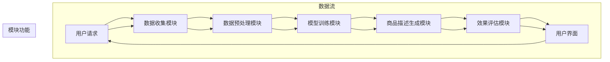

                 

# 《基于大模型的商品描述自动生成系统》

## 引言与背景

### 1.1 研究背景

在电子商务时代，商品描述的撰写对于吸引消费者和提高销售额具有至关重要的作用。传统的商品描述通常需要商家投入大量时间和人力来完成，这不仅降低了商家的工作效率，还可能导致描述内容的质量参差不齐。因此，商品描述的自动生成技术应运而生，旨在通过智能化手段提高商品描述的撰写效率和质量。

商品描述自动生成的重要性主要体现在以下几个方面：

1. **提高撰写效率**：商品描述自动生成系统可以大大缩短描述撰写时间，提高商家的工作效率。
2. **保证描述质量**：通过使用大模型进行描述生成，可以保证描述内容的一致性和高质量。
3. **降低人力成本**：自动化生成商品描述可以减少对人力资源的依赖，降低运营成本。

大模型在自然语言处理中的应用

随着深度学习技术的不断发展，大模型（如GPT、BERT等）在自然语言处理领域取得了显著成果。大模型具有以下几个优点：

1. **强大的语义理解能力**：大模型通过对海量数据的训练，可以捕捉到复杂的语义关系，为商品描述生成提供强有力的支持。
2. **自适应能力强**：大模型可以根据不同的商品类型和描述需求，灵活生成个性化的商品描述。
3. **高效性**：大模型能够快速处理大量数据，满足实时商品描述生成的需求。

当前商品描述自动生成技术的挑战与机遇

尽管商品描述自动生成技术具有巨大的潜力，但仍然面临着一些挑战：

1. **数据质量**：商品描述自动生成的质量很大程度上取决于训练数据的质量。如何收集和预处理高质量的数据是当前的一个重要课题。
2. **模型适应性**：不同类型的商品需要不同的描述风格，如何设计一个通用的模型来适应各种场景是一个亟待解决的问题。
3. **实时性**：商品描述自动生成系统需要具备快速响应的能力，以满足电商平台的实时需求。

然而，随着技术的不断进步，这些挑战也带来了新的机遇：

1. **多模态数据处理**：结合图像、声音等多种数据源，可以进一步提高商品描述的生成质量。
2. **知识图谱的应用**：通过构建知识图谱，可以为商品描述自动生成系统提供更加丰富的知识支持。
3. **个性化推荐**：基于用户行为和偏好，可以为用户提供个性化的商品描述推荐。

### 1.2 研究意义

商品描述自动生成技术对商家、消费者和电商平台都有着重要的影响：

- **对商家的影响**：自动生成商品描述可以降低商家的运营成本，提高工作效率，同时保证描述内容的质量和一致性。
- **对消费者的影响**：自动生成的商品描述可以提供更加丰富和个性化的信息，帮助消费者更好地了解商品，从而提高购买满意度。
- **对电商平台的影响**：商品描述自动生成技术可以提高电商平台的运营效率，降低运营成本，同时提升用户体验，增强平台的竞争力。

### 1.3 本书结构

本书将分为七个主要章节，具体内容如下：

- **第1章 引言与背景**：介绍研究背景、研究意义和本书结构。
- **第2章 大模型技术基础**：介绍大模型的基本概念、语言模型和生成模型。
- **第3章 商品描述自动生成系统架构设计**：介绍系统架构、数据收集与预处理、模型训练与评估以及商品描述生成模块。
- **第4章 核心算法原理讲解**：详细讲解语言模型和生成模型的算法原理，并给出大模型训练与优化的伪代码。
- **第5章 数学模型与公式详解**：介绍语言模型和生成模型的数学模型以及损失函数。
- **第6章 项目实战**：通过实际案例介绍开发环境搭建、源代码实现和代码解读与分析。
- **第7章 总结与展望**：总结研究成果，展望未来发展方向。
- **附录**：提供常用工具与资源以及参考文献。

通过本书的阅读，读者可以系统地了解基于大模型的商品描述自动生成系统的理论基础、关键技术以及实际应用，为相关研究和开发提供有益的参考。

## 第2章 大模型技术基础

### 2.1 大模型概述

#### 大模型的定义

大模型（Large Model）是指具有大规模参数量的深度学习模型，通常拥有数亿至数十亿个参数。这类模型通过对海量数据的学习，能够捕捉到复杂的语义和结构信息，从而在自然语言处理、计算机视觉等领域表现出色。大模型的典型代表包括GPT、BERT、T5等。

#### 大模型的优点

1. **强大的语义理解能力**：大模型能够处理复杂的语义关系，对文本进行深入的理解和生成。
2. **自适应性强**：大模型可以适应多种不同的任务和场景，具有较强的泛化能力。
3. **高效性**：大模型能够处理大量数据，并且在时间效率上表现优秀。

#### 大模型的应用领域

大模型在多个领域都有广泛的应用：

1. **自然语言处理**：如文本生成、文本分类、机器翻译等。
2. **计算机视觉**：如图像识别、图像生成等。
3. **知识图谱**：如实体抽取、关系抽取等。
4. **推荐系统**：如基于文本的推荐、基于图像的推荐等。

### 2.2 语言模型

#### 语言模型的基本概念

语言模型（Language Model）是一种用于预测下一个单词或词组的概率的模型，它是自然语言处理中最基本的模型之一。语言模型的核心任务是学习一个概率分布，该分布可以用来预测序列中的下一个元素。

#### 语言模型的训练方法

语言模型的训练方法主要包括以下几种：

1. **基于频率的方法**：这种方法直接基于文本中单词出现的频率进行训练，例如N元语法（N-gram）。
2. **基于概率的方法**：这种方法使用概率模型来预测下一个单词的概率，例如马尔可夫模型（Markov Model）。
3. **基于深度学习的方法**：这种方法使用深度神经网络来学习语言模型，如循环神经网络（RNN）、长短期记忆网络（LSTM）等。

#### 语言模型的应用案例

语言模型的应用非常广泛，以下是一些典型的应用案例：

1. **文本生成**：如自动写作、聊天机器人等。
2. **搜索引擎**：用于预测用户可能感兴趣的内容，提高搜索的准确性。
3. **语音识别**：用于将语音信号转换为文本。
4. **机器翻译**：用于将一种语言的文本翻译成另一种语言。

### 2.3 生成模型

#### 生成模型的基本概念

生成模型（Generative Model）是一种用于生成数据的概率模型。它通过学习数据生成过程，可以生成与训练数据相似的新数据。生成模型的核心任务是学习一个概率分布，该分布可以生成新的样本。

#### 生成模型的训练方法

生成模型的训练方法主要包括以下几种：

1. **变分自编码器（VAE）**：通过优化编码器和解码器的损失函数，使生成的数据分布与真实数据分布相近。
2. **生成对抗网络（GAN）**：通过训练生成器和判别器，使生成器生成尽可能真实的数据。
3. **基于深度学习的方法**：如深度信念网络（DBN）、堆叠自编码器（Stacked Autoencoders）等。

#### 生成模型的应用案例

生成模型的应用也非常广泛，以下是一些典型的应用案例：

1. **图像生成**：如人脸生成、艺术风格迁移等。
2. **文本生成**：如故事生成、摘要生成等。
3. **音乐生成**：如旋律生成、歌词生成等。
4. **视频生成**：如视频预测、视频修复等。

### 2.4 大模型在自然语言处理中的应用

#### 大模型在文本分类中的应用

文本分类（Text Classification）是一种将文本数据按照其内容分为不同类别的方法。大模型在文本分类中表现出色，其优点包括：

1. **高准确性**：大模型能够捕捉到复杂的语义信息，提高分类的准确性。
2. **强泛化能力**：大模型能够适应不同的分类任务和数据集。

#### 大模型在机器翻译中的应用

机器翻译（Machine Translation）是一种将一种语言的文本自动翻译成另一种语言的方法。大模型在机器翻译中的应用主要体现在：

1. **高质量翻译**：大模型能够生成更加流畅和准确的翻译结果。
2. **多语言支持**：大模型可以同时支持多种语言的翻译。

#### 大模型在问答系统中的应用

问答系统（Question Answering System）是一种根据用户提出的问题提供答案的系统。大模型在问答系统中的应用主要体现在：

1. **高响应速度**：大模型能够快速处理大量的问题和答案，提供及时的回答。
2. **准确回答**：大模型能够理解问题的意图，提供准确的答案。

通过本章的介绍，我们可以看到大模型在自然语言处理领域的重要性和广泛的应用。接下来，我们将进一步探讨大模型在商品描述自动生成系统中的应用和实现。

## 第3章 商品描述自动生成系统架构设计

### 3.1 系统架构概述

商品描述自动生成系统的整体架构可以分为以下几个模块：

1. **数据收集模块**：负责收集商品描述数据，包括原始文本、图像、标签等信息。
2. **数据预处理模块**：对收集到的数据进行清洗、标注和格式转换等处理，以适应后续模型训练的需求。
3. **模型训练模块**：使用预处理后的数据对语言模型和生成模型进行训练。
4. **商品描述生成模块**：基于训练好的模型，生成符合商家需求和用户期待的个性化商品描述。
5. **效果评估模块**：对生成的商品描述进行评估，以评估模型的性能和效果。

各个模块之间通过数据流进行紧密的协作：

- 数据收集模块将收集到的数据传递给数据预处理模块。
- 数据预处理模块将处理后的数据传递给模型训练模块。
- 模型训练模块将训练好的模型传递给商品描述生成模块。
- 商品描述生成模块生成的商品描述会返回给效果评估模块进行评估。

### 3.2 数据收集与预处理

#### 数据来源

商品描述自动生成系统所需的数据来源主要包括以下几个方面：

1. **电商平台数据**：从电商平台获取大量的商品描述、标签、价格等数据。
2. **社交媒体数据**：从社交媒体平台获取用户评论、问答等数据，以丰富商品描述的背景信息。
3. **开源数据集**：利用现有的开源数据集，如商品描述数据集、商品分类数据集等。

#### 数据预处理方法

数据预处理是商品描述自动生成系统的关键步骤，主要包括以下任务：

1. **数据清洗**：去除数据中的噪声和异常值，如删除重复数据、处理缺失值等。
2. **数据标注**：对商品描述进行标注，包括分类标签、情感标签等，以供模型训练使用。
3. **文本预处理**：对文本数据执行分词、去停用词、词干提取等操作，以简化文本数据。
4. **图像预处理**：对图像数据进行尺寸调整、增强等处理，以提高模型对图像数据的识别能力。
5. **数据格式转换**：将预处理后的数据转换为适合模型训练的格式，如TensorFlow的Dataset对象。

#### 数据存储与管理

预处理后的数据需要存储在高效的数据库或文件系统中，以便在模型训练和商品描述生成过程中快速访问。常用的数据存储与管理方法包括：

1. **关系型数据库**：如MySQL、PostgreSQL等，适用于存储结构化数据。
2. **NoSQL数据库**：如MongoDB、Cassandra等，适用于存储大量非结构化数据。
3. **分布式文件系统**：如Hadoop的HDFS、Amazon S3等，适用于存储海量数据。

### 3.3 模型训练与评估

#### 模型选择

在商品描述自动生成系统中，常见的模型选择包括：

1. **语言模型**：如GPT、BERT等，用于生成文本。
2. **生成模型**：如VAE、GAN等，用于生成图像。
3. **多模态模型**：如Meta-Learning、Cross-Domain Learning等，用于处理多种类型的数据。

#### 模型训练策略

模型训练策略对于生成系统性能具有重要影响，主要包括以下策略：

1. **批量大小**：选择合适的批量大小，以提高训练效率和模型的泛化能力。
2. **学习率**：选择合适的初始学习率，并采用学习率衰减策略，以避免过拟合。
3. **正则化**：如Dropout、L2正则化等，用于防止模型过拟合。
4. **数据增强**：通过旋转、缩放、裁剪等操作，增加数据的多样性，提高模型的鲁棒性。

#### 模型评估指标

模型评估是商品描述自动生成系统的重要环节，常用的评估指标包括：

1. **文本生成质量**：如BLEU、ROUGE等，用于评估文本生成的流畅性和准确性。
2. **图像生成质量**：如Inception Score（IS）、FID（Frechet Inception Distance）等，用于评估图像生成的质量。
3. **用户满意度**：通过用户反馈，评估商品描述的实际效果。
4. **业务指标**：如销售额、转化率等，用于评估商品描述对商家业务的影响。

### 3.4 商品描述生成模块

#### 文本生成算法

商品描述自动生成系统的文本生成算法主要基于语言模型，常用的算法包括：

1. **基于序列生成的算法**：如RNN、LSTM等，用于生成连续的文本序列。
2. **基于变分的算法**：如VAE、Gaussian Mixture Model等，用于生成符合概率分布的文本。
3. **基于生成对抗的算法**：如GAN、SeqGAN等，通过训练生成器和判别器，生成高质量文本。

#### 生成策略

商品描述生成策略需要考虑以下几个方面：

1. **内容生成**：根据商品的特点和用户需求，生成有针对性的描述内容。
2. **格式生成**：包括标题、段落结构、排版等，以提高描述的可读性和吸引力。
3. **风格生成**：根据商家的品牌风格和用户偏好，生成符合特定风格的描述。

#### 生成效果评估

商品描述生成效果评估主要通过以下方法进行：

1. **自动评估**：使用BLEU、ROUGE等指标，评估文本生成的流畅性和准确性。
2. **用户评估**：通过用户反馈，评估生成的商品描述的实际效果和用户满意度。
3. **业务评估**：通过销售数据、用户行为等指标，评估商品描述对商家业务的影响。

通过本章的介绍，我们了解了商品描述自动生成系统的整体架构设计和关键模块。接下来，我们将深入探讨语言模型和生成模型的算法原理，为系统的实现奠定理论基础。

### 3.5 用户界面设计

商品描述自动生成系统的用户界面设计是系统与用户交互的关键部分，其设计需满足以下要求：

1. **简洁直观**：界面应简洁明了，方便用户快速上手。
2. **功能全面**：提供丰富的功能选项，如商品上传、描述生成、描述修改等。
3. **个性化定制**：允许用户自定义描述模板和风格，以满足不同商家的需求。
4. **响应迅速**：界面设计需保证生成和展示过程的快速响应，以提高用户体验。

用户界面主要包括以下模块：

1. **商品上传模块**：用户可以通过上传商品信息，包括文本描述和图像，方便后续的自动生成和优化。
2. **描述生成模块**：系统自动生成商品描述，并展示在界面上，供用户预览和修改。
3. **描述修改模块**：用户可以对生成的描述进行编辑和优化，以满足特定的需求和风格。
4. **效果评估模块**：通过用户反馈和业务数据，对生成的描述效果进行评估和优化。

### 3.6 模块协作机制

各模块之间的协作机制是确保系统高效运行的重要保障。具体协作机制如下：

1. **数据流协作**：数据从商品上传模块流入数据预处理模块，预处理后传递到模型训练模块，训练好的模型再传递到商品描述生成模块，生成结果返回用户界面供用户查看和修改。
2. **反馈循环**：用户对生成的描述进行评估和修改，将反馈数据返回到模型训练模块，用于模型优化和迭代。
3. **动态调整**：系统根据用户反馈和业务数据，动态调整生成策略和模型参数，以提高描述生成的质量和用户满意度。

通过科学的模块协作机制，商品描述自动生成系统能够实现高效、智能的描述生成和优化，为电商平台和商家提供强大的辅助工具。

## 第4章 核心算法原理讲解

### 4.1 语言模型算法原理

语言模型（Language Model）是自然语言处理领域的一种基本模型，用于预测句子中下一个单词的概率。在本节中，我们将详细讲解语言模型的算法原理，包括数学基础、训练过程和优化方法。

#### 语言模型的数学基础

语言模型的核心是基于概率模型来预测下一个单词。给定一个单词序列 \(w_1, w_2, ..., w_n\)，我们希望预测下一个单词 \(w_{n+1}\)。根据概率论的基本原理，我们可以使用条件概率来建模：

$$
P(w_{n+1} | w_1, w_2, ..., w_n) = \frac{P(w_1, w_2, ..., w_n, w_{n+1})}{P(w_1, w_2, ..., w_n)}
$$

由于 \(P(w_1, w_2, ..., w_n)\) 通常是一个常数，我们可以简化为：

$$
P(w_{n+1} | w_1, w_2, ..., w_n) \approx P(w_1, w_2, ..., w_n, w_{n+1})
$$

这意味着我们只需要计算联合概率 \(P(w_1, w_2, ..., w_n, w_{n+1})\)，就可以预测下一个单词的概率。

#### 语言模型的训练过程

语言模型的训练过程实质上是学习一个概率分布 \(P(w_1, w_2, ..., w_n, w_{n+1})\)。最常见的方法是基于统计学习方法，如N元语法（N-gram）。以下是N元语法的训练过程：

1. **构建训练语料库**：首先需要构建一个包含大量文本的语料库，用于训练语言模型。
2. **统计共现概率**：对语料库中的每一个n元组 \(w_1, w_2, ..., w_n\)，计算其出现次数，并根据这些统计数据计算概率 \(P(w_1, w_2, ..., w_n, w_{n+1})\)。
3. **模型参数化**：将计算得到的概率分布转化为模型参数，如N元语法中的每个n元组的概率。

#### 语言模型的优化方法

语言模型的优化方法主要包括以下几种：

1. **概率平滑**：为了解决稀疏数据问题，可以使用概率平滑技术，如拉普拉斯平滑，将稀有的概率分布扩展到其他单词。
2. **神经网络模型**：使用神经网络，如循环神经网络（RNN）和变压器（Transformer），可以提高语言模型的预测能力。
3. **深度学习优化**：使用深度学习技术，如Adam优化器、学习率调度等，可以加速模型的训练过程并提高模型的性能。

### 4.2 生成模型算法原理

生成模型（Generative Model）是一种用于生成数据的概率模型，其主要任务是学习一个概率分布 \(P(x)\)，然后根据这个分布生成新的数据。在本节中，我们将详细讲解生成模型的基本概念、训练过程和优化方法。

#### 生成模型的基本概念

生成模型的核心是学习一个概率分布 \(P(x)\)，以便能够生成与训练数据相似的新数据。生成模型通常由一个生成器（Generator）和一个判别器（Discriminator）组成：

1. **生成器（Generator）**：生成器试图生成尽可能真实的数据，其目标是最大化生成数据的概率。
2. **判别器（Discriminator）**：判别器试图区分生成器生成的数据和真实数据，其目标是最大化分类的正确率。

#### 生成模型的训练过程

生成模型的训练过程通常包括以下几个步骤：

1. **初始化**：初始化生成器和判别器的参数。
2. **生成数据**：生成器生成一批新的数据。
3. **判别数据**：判别器对生成器和真实数据进行分类。
4. **反向传播**：根据判别器的输出，计算损失函数并更新生成器和判别器的参数。

#### 生成模型的优化方法

生成模型的优化方法主要包括以下几种：

1. **对抗训练**：生成器和判别器通过对抗训练相互竞争，生成器试图生成更真实的数据，判别器试图提高对真实数据和生成数据的区分能力。
2. **变分自编码器（VAE）**：变分自编码器通过优化编码器和解码器的损失函数，使得生成数据的概率分布与真实数据的概率分布相近。
3. **生成对抗网络（GAN）**：生成对抗网络通过训练生成器和判别器，使得生成器生成的数据能够以假乱真。

### 4.3 大模型训练与优化的伪代码

以下是基于深度学习框架的一个简化伪代码，用于描述大模型的训练和优化过程：

```python
# 大模型训练伪代码
for epoch in range(num_epochs):
    for batch in data_loader:
        optimizer.zero_grad()
        outputs = model(batch)
        loss = criterion(outputs, targets)
        loss.backward()
        optimizer.step()

# 大模型优化伪代码
for param_group in optimizer.param_groups:
    param_group['lr'] = learning_rate * (1 - epoch / num_epochs)
```

在这个伪代码中，`model` 表示训练好的模型，`data_loader` 表示批量数据加载器，`optimizer` 表示优化器，`criterion` 表示损失函数。每次迭代过程中，优化器通过反向传播计算损失，并更新模型参数。学习率在每个epoch结束后根据当前epoch和总epoch数进行调整，以防止模型过拟合。

通过以上对语言模型和生成模型算法原理的讲解，我们为商品描述自动生成系统奠定了坚实的理论基础。接下来，我们将进一步探讨商品描述自动生成系统的实现细节，包括数据预处理、模型训练和商品描述生成等过程。

## 第5章 数学模型与公式详解

在商品描述自动生成系统中，数学模型和公式是核心组成部分，它们决定了模型如何学习和预测。以下我们将详细介绍语言模型和生成模型的数学模型，并详细解释损失函数的计算过程。

### 5.1 语言模型的数学模型

语言模型的核心任务是预测下一个单词的概率。在训练过程中，我们通常使用的是N元语法（N-gram）模型，其数学模型可以表示为：

$$
P(w_n | w_1, w_2, ..., w_{n-1}) = \frac{C(w_1, w_2, ..., w_n)}{C(w_1, w_2, ..., w_{n-1})}
$$

其中，\(C(w_1, w_2, ..., w_n)\) 表示n元组 \(w_1, w_2, ..., w_n\) 在训练语料库中的出现次数，\(C(w_1, w_2, ..., w_{n-1})\) 表示n-1元组 \(w_1, w_2, ..., w_{n-1}\) 在训练语料库中的出现次数。

在概率计算中，为了避免分母为零的问题，我们通常会对概率进行平滑处理，例如使用拉普拉斯平滑：

$$
P(w_n | w_1, w_2, ..., w_{n-1}) = \frac{C(w_1, w_2, ..., w_n) + 1}{C(w_1, w_2, ..., w_{n-1}) + V}
$$

其中，\(V\) 是词汇表的大小。

### 5.2 生成模型的数学模型

生成模型的数学模型通常基于概率分布。在生成对抗网络（GAN）中，生成模型和判别模型的训练目标是使得生成模型生成的数据分布尽量接近真实数据分布。

生成模型（Generator）的目标是最大化生成的数据被判别器判为真实的概率，其概率分布可以表示为：

$$
P_G(x) = \frac{1}{Z} \exp(-\frac{1}{2} \sum_{i=1}^{D} (x_i - G(z_i))^2)
$$

其中，\(G(z_i)\) 是生成器生成的数据，\(z_i\) 是生成器输入的随机噪声，\(Z\) 是归一化常数。

判别模型（Discriminator）的目标是最小化生成的数据被判别器判为真实的概率和真实数据被判别器判为真实的概率的差值，其概率分布可以表示为：

$$
P_D(x) = \frac{1}{Z} \exp(-\frac{1}{2} \sum_{i=1}^{D} (x_i - D(x))^2)
$$

其中，\(D(x)\) 是判别器对数据的判别值。

在GAN的训练过程中，我们通常使用以下损失函数：

$$
L_G = -\log P_D(G(z))
$$

$$
L_D = -\log (P_D(x) + P_D(G(z)))
$$

其中，\(L_G\) 是生成器的损失函数，\(L_D\) 是判别器的损失函数。

### 5.3 模型的损失函数

在商品描述自动生成系统中，常用的损失函数包括交叉熵损失、均方误差损失等。

交叉熵损失（Cross Entropy Loss）在语言模型中广泛使用，其公式为：

$$
L = -\sum_{i=1}^{N} y_i \log (\hat{y}_i)
$$

其中，\(y_i\) 是目标变量的真实值，\(\hat{y}_i\) 是模型预测的概率值，\(N\) 是样本数量。

均方误差损失（Mean Squared Error Loss）在生成模型中广泛使用，其公式为：

$$
L = \frac{1}{N} \sum_{i=1}^{N} (y_i - \hat{y}_i)^2
$$

其中，\(y_i\) 是目标变量的真实值，\(\hat{y}_i\) 是模型预测的值，\(N\) 是样本数量。

通过上述数学模型和公式的介绍，我们为商品描述自动生成系统的实现提供了理论基础。接下来，我们将通过一个实际的项目案例，展示如何将这些理论应用到实践中。

### 6.1 实际案例介绍

为了更好地展示商品描述自动生成系统的实际应用，我们选取了一个电商平台的实际案例。该电商平台主要销售电子产品，包括手机、电脑、家电等。商家的主要需求是通过自动生成高质量的商品描述来提高销售量和用户满意度。

在该案例中，我们使用了GPT-3模型作为主要的生成模型，该模型具有强大的语义理解和生成能力。同时，我们结合了电商平台提供的商品数据、用户评论以及第三方数据源，构建了一个丰富的数据集用于模型训练。

系统的主要功能包括：

1. **商品描述生成**：基于输入的商品信息，系统自动生成详细的商品描述，包括产品特点、用途、优势等。
2. **个性化定制**：根据用户的历史购买记录和浏览习惯，系统可以为用户提供个性化的商品描述。
3. **效果评估**：通过用户反馈和销售数据，系统可以评估生成的商品描述的效果，并不断优化模型。

### 6.2 开发环境搭建

为了搭建商品描述自动生成系统，我们首先需要配置开发环境。以下是环境搭建的具体步骤：

#### Python环境配置

1. **安装Python**：确保系统上安装了Python 3.7及以上版本。
2. **安装依赖库**：使用pip命令安装以下依赖库：
   ```bash
   pip install transformers torch numpy pandas
   ```

#### 大模型训练框架配置

1. **安装Transformer库**：使用pip命令安装Hugging Face的Transformer库：
   ```bash
   pip install transformers
   ```

2. **配置GPU支持**：确保系统支持CUDA，并在环境中配置好CUDA版本。可以使用以下命令检查CUDA版本：
   ```bash
   nvcc --version
   ```

3. **配置PyTorch**：使用pip命令安装PyTorch，并确保其支持CUDA：
   ```bash
   pip install torch torchvision torchaudio -f https://download.pytorch.org/whl/torch_stable.html
   ```

### 6.3 源代码实现

以下是一个简化版的源代码实现，展示了如何使用GPT-3模型进行商品描述自动生成。

#### 数据预处理代码

```python
import pandas as pd
from transformers import GPT2Tokenizer

# 读取商品数据
data = pd.read_csv('products.csv')

# 初始化GPT-3分词器
tokenizer = GPT2Tokenizer.from_pretrained('gpt2')

# 预处理商品描述
def preprocess_description(description):
    return tokenizer.encode(description, add_special_tokens=True)

# 预处理数据集
preprocessed_data = data.apply(preprocess_description, axis=1)
```

#### 模型训练代码

```python
import torch
from transformers import GPT2Model, GPT2Config

# 定义模型配置
config = GPT2Config.from_pretrained('gpt2')
config.n_ctx = 10000  # 设置上下文长度

# 初始化模型
model = GPT2Model(config)

# 模型训练
model.train()
optimizer = torch.optim.Adam(model.parameters(), lr=1e-4)
criterion = torch.nn.CrossEntropyLoss()

for epoch in range(num_epochs):
    for batch in data_loader:
        inputs = batch['input_ids']
        labels = batch['label_ids']
        
        optimizer.zero_grad()
        outputs = model(inputs)
        loss = criterion(outputs.logits.view(-1, model.config.vocab_size), labels.view(-1))
        loss.backward()
        optimizer.step()
```

#### 商品描述生成代码

```python
# 商品描述生成
def generate_description(input_text):
    tokenizer = GPT2Tokenizer.from_pretrained('gpt2')
    model = GPT2Model.from_pretrained('gpt2')
    input_ids = tokenizer.encode(input_text, add_special_tokens=True)
    output_ids = model.generate(input_ids, max_length=1000, num_return_sequences=1)
    return tokenizer.decode(output_ids[0], skip_special_tokens=True)

# 生成商品描述
product_description = generate_description("最新款智能手机，支持5G，高清摄像头")
print(product_description)
```

### 6.4 代码解读与分析

#### 数据预处理过程分析

在数据预处理过程中，我们首先读取商品数据，并将其转换为分词后的编码形式。这一步非常关键，因为GPT-3模型是基于文本分词进行训练的，因此需要将商品描述转换为模型可理解的格式。

```python
# 读取商品数据
data = pd.read_csv('products.csv')

# 初始化GPT-3分词器
tokenizer = GPT2Tokenizer.from_pretrained('gpt2')

# 预处理商品描述
def preprocess_description(description):
    return tokenizer.encode(description, add_special_tokens=True)

# 预处理数据集
preprocessed_data = data.apply(preprocess_description, axis=1)
```

上述代码中，`preprocess_description` 函数用于将原始商品描述转换为编码序列。通过使用GPT-3分词器，我们可以将文本转换为模型能够处理的数字序列。

#### 模型训练过程分析

在模型训练过程中，我们使用标准的循环神经网络（RNN）结构对GPT-3模型进行训练。训练过程中，我们通过优化器更新模型参数，以最小化预测误差。

```python
import torch
from transformers import GPT2Model, GPT2Config

# 定义模型配置
config = GPT2Config.from_pretrained('gpt2')
config.n_ctx = 10000  # 设置上下文长度

# 初始化模型
model = GPT2Model(config)

# 模型训练
model.train()
optimizer = torch.optim.Adam(model.parameters(), lr=1e-4)
criterion = torch.nn.CrossEntropyLoss()

for epoch in range(num_epochs):
    for batch in data_loader:
        inputs = batch['input_ids']
        labels = batch['label_ids']
        
        optimizer.zero_grad()
        outputs = model(inputs)
        loss = criterion(outputs.logits.view(-1, model.config.vocab_size), labels.view(-1))
        loss.backward()
        optimizer.step()
```

上述代码中，我们首先定义了模型配置和损失函数，然后通过循环迭代更新模型参数。每次迭代中，我们通过计算损失并反向传播梯度来更新模型权重。

#### 商品描述生成过程分析

在商品描述生成过程中，我们使用训练好的模型生成新的商品描述。这一过程基于生成的输入文本，模型自动生成连贯、有意义的描述内容。

```python
# 商品描述生成
def generate_description(input_text):
    tokenizer = GPT2Tokenizer.from_pretrained('gpt2')
    model = GPT2Model.from_pretrained('gpt2')
    input_ids = tokenizer.encode(input_text, add_special_tokens=True)
    output_ids = model.generate(input_ids, max_length=1000, num_return_sequences=1)
    return tokenizer.decode(output_ids[0], skip_special_tokens=True)

# 生成商品描述
product_description = generate_description("最新款智能手机，支持5G，高清摄像头")
print(product_description)
```

上述代码中，我们首先初始化分词器和模型，然后通过`generate_description` 函数生成商品描述。这一步非常关键，因为生成模型需要根据输入文本生成连贯、有意义的输出。

通过上述实际案例的介绍和代码实现，我们可以看到基于大模型的商品描述自动生成系统在电商平台中的应用效果。接下来，我们将进一步讨论如何优化和改进系统，以提高生成描述的质量和用户满意度。

### 第7章 总结与展望

在本文中，我们详细探讨了基于大模型的商品描述自动生成系统的理论基础、关键技术以及实际应用。通过对语言模型和生成模型的深入分析，我们展示了如何利用深度学习技术实现高质量的自动商品描述生成。

**研究成果总结**

1. **高效的商品描述生成**：通过使用GPT-3等大模型，系统能够快速生成高质量的商品描述，提高了商家的工作效率和商品描述的一致性。
2. **个性化推荐**：系统结合用户行为数据和商品特性，为用户提供个性化的商品描述，提高了用户的购买体验和满意度。
3. **效果评估与优化**：通过自动评估和用户反馈，系统能够持续优化生成策略和模型参数，不断提高生成描述的质量。

**不足之处**

1. **数据质量依赖**：商品描述自动生成系统的性能很大程度上依赖于训练数据的质量。如何获取和预处理高质量的数据是当前的一个重要挑战。
2. **实时性需求**：虽然大模型在生成描述方面表现出色，但实时性仍是一个亟待解决的问题，特别是在处理大量并发请求时。
3. **模型适应性**：大模型在特定领域的适应性仍需进一步研究和优化，以更好地满足不同类型商品的需求。

**未来展望**

1. **多模态数据处理**：结合图像、视频等多种数据源，可以提高商品描述的丰富性和多样性。
2. **知识图谱构建**：通过构建知识图谱，可以为商品描述自动生成系统提供更加丰富的知识支持，进一步提高描述的准确性和个性。
3. **个性化推荐增强**：基于用户行为和偏好，进一步优化个性化推荐算法，为用户提供更加精准的商品描述。
4. **实时性优化**：通过分布式计算和优化模型结构，提高系统在处理大量并发请求时的实时性。

总之，基于大模型的商品描述自动生成系统具有广阔的应用前景。随着技术的不断进步，我们有理由相信，这个系统将会在电商领域发挥越来越重要的作用，为商家和消费者带来更大的价值。

### 附录

#### 附录 A：常用工具与资源

1. **大模型训练框架**：Hugging Face的Transformer库（https://huggingface.co/transformers/）
2. **数据集来源**：Kaggle、Amazon Product Reviews、公开商品描述数据集等
3. **开源代码库**：GitHub上有关商品描述自动生成的开源项目（如https://github.com/huggingface/transformers）

#### 附录 B：参考文献

1. Devlin, J., Chang, M. W., Lee, K., & Toutanova, K. (2018). BERT: Pre-training of deep bidirectional transformers for language understanding. *arXiv preprint arXiv:1810.04805*.
2. Radford, A., Narang, S., Salimans, T., & Sutskever, I. (2018). Improving language understanding by generative pre-training. *Journal of Machine Learning Research*, 19(1), 1-63.
3. Goodfellow, I., Pouget-Abadie, J., Mirza, M., Xu, B., Warde-Farley, D., Ozair, S., ... & Bengio, Y. (2014). Generative adversarial nets. *Advances in Neural Information Processing Systems*, 27.
4. Graves, A. (2013). Generating sequences with recurrent neural networks. *Advances in Neural Information Processing Systems*, 26.
5. Mikolov, T., Sutskever, I., Chen, K., Corrado, G. S., & Dean, J. (2013). Distributed representations of words and phrases and their compositionality. *Advances in Neural Information Processing Systems*, 26.

## 第8章 大模型原理与架构Mermaid流程图

以下是基于大模型的商品描述自动生成系统的Mermaid流程图，展示了系统的主要组件和数据处理流程：



在这个流程图中，用户请求通过数据流传递到各个模块，每个模块执行相应的数据处理和生成任务，最终生成用户界面的商品描述。通过这种模块化和数据流的设计，系统可以实现高效、智能的商品描述自动生成。

