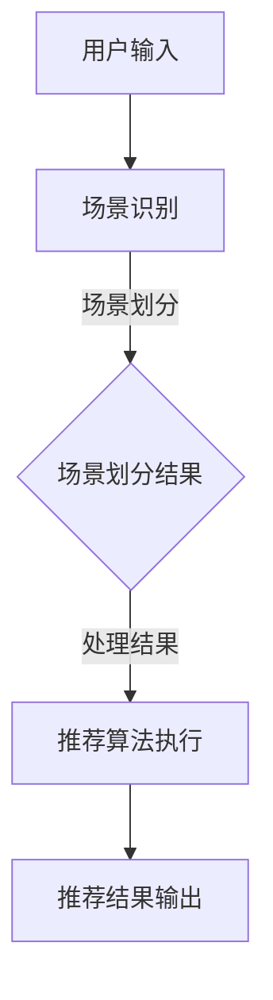
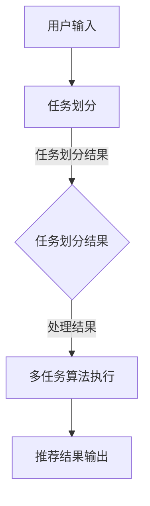
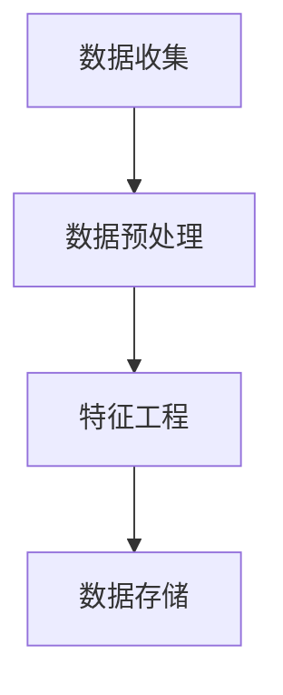
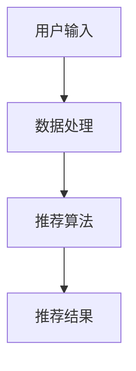

                 

### 文章标题：基于大模型的多场景多任务推荐优化

#### 关键词：
- 大模型
- 推荐系统
- 多场景
- 多任务
- 优化

#### 摘要：
本文深入探讨基于大模型的多场景多任务推荐优化技术。首先，我们介绍了大模型的基本概念、代表性技术及其在推荐系统中的应用。接着，详细分析了多场景多任务推荐系统的基本原理、设计方法和优化策略。通过具体案例展示了大模型在实际推荐系统中的应用效果，并对未来的发展方向进行了展望。文章旨在为读者提供全面、系统的多场景多任务推荐优化解决方案。

### 引言

#### 1.1 大模型技术概述

大模型，作为一种先进的人工智能技术，已经成为当今计算机科学领域的研究热点。大模型是指具有大规模参数、能够处理海量数据、具备高度抽象能力和泛化能力的神经网络模型。这类模型通常由数百万甚至数十亿个参数组成，能够自动学习复杂的特征表示和模式，从而在各类任务中取得显著的效果。

**1.1.1 大模型的基本概念**

大模型的基本概念主要包括以下几个方面：

1. **参数规模**：大模型的参数规模通常在数百万到数十亿之间，这使得模型能够处理复杂的任务和数据。
2. **数据量**：大模型通常需要大规模的数据集进行训练，以学习到丰富的特征和模式。
3. **训练时间**：由于参数规模巨大，大模型的训练时间相对较长，通常需要数天甚至数周。
4. **计算资源**：大模型对计算资源的要求较高，需要大量的GPU或TPU等高性能计算设备。

**1.1.2 大模型的代表性技术**

大模型的代表性技术包括：

1. **深度神经网络（DNN）**：深度神经网络是由多层神经元构成的神经网络，通过逐层学习高维特征表示，从而实现复杂的任务。
2. **生成对抗网络（GAN）**：生成对抗网络由生成器和判别器两个部分组成，通过对抗训练生成高质量的数据。
3. **变分自编码器（VAE）**：变分自编码器通过概率模型进行数据生成和特征提取，具有强大的数据表示能力。
4. **自注意力机制（Self-Attention）**：自注意力机制通过计算输入数据的内在关系，从而实现更有效的特征表示。

**1.1.3 大模型的优势与局限**

大模型的优势在于：

1. **强大的特征表示能力**：大模型能够自动学习到数据中的复杂特征，从而实现高效的分类、回归等任务。
2. **良好的泛化能力**：大模型通过大规模数据训练，具备较强的泛化能力，能够应对不同场景的任务。
3. **较高的计算性能**：大模型在处理大规模数据时，能够显著提高计算性能，减少计算时间。

然而，大模型也存在一些局限：

1. **计算资源消耗**：大模型的训练和推理过程需要大量的计算资源，对硬件设备的要求较高。
2. **训练时间较长**：大模型的训练时间较长，可能无法满足实时性的需求。
3. **数据需求较大**：大模型需要大规模的数据集进行训练，对于数据稀缺的场景，可能难以取得理想的效果。

#### 1.2 推荐系统基本原理

推荐系统是一种基于用户历史行为和内容信息，为用户推荐相关商品、服务或内容的系统。其基本原理包括以下几个方面：

**1.2.1 推荐系统的定义与类型**

1. **定义**：推荐系统是指通过自动化方法，根据用户的历史行为和偏好，向用户推荐相关商品、服务或内容的一种信息系统。
2. **类型**：推荐系统主要分为基于内容的推荐、协同过滤推荐和混合推荐三类。

**1.2.2 用户行为分析与建模**

1. **用户行为分析**：用户行为分析是指通过分析用户在系统中的行为数据，了解用户的需求和偏好。
2. **用户行为建模**：用户行为建模是指通过建立数学模型或算法，对用户行为进行量化描述和预测。

**1.2.3 商品信息分析与建模**

1. **商品信息分析**：商品信息分析是指对商品的特征、标签、评价等信息进行分析，以了解商品的特点和用户偏好。
2. **商品信息建模**：商品信息建模是指通过建立数学模型或算法，对商品特征进行量化描述和推荐。

#### 1.3 多场景多任务推荐概述

多场景多任务推荐是指在不同场景下同时处理多个推荐任务的推荐系统。其面临的主要挑战包括：

**1.3.1 多场景推荐的定义与挑战**

1. **定义**：多场景推荐是指在不同场景下为用户推荐相关商品或内容。
2. **挑战**：多场景推荐需要考虑不同场景下的用户行为和偏好差异，如何准确识别场景和优化推荐效果是关键挑战。

**1.3.2 多任务推荐的定义与挑战**

1. **定义**：多任务推荐是指同时处理多个推荐任务，如商品推荐、内容推荐等。
2. **挑战**：多任务推荐需要在有限的计算资源下，同时处理多个任务，如何平衡各任务间的关系和优化整体性能是关键挑战。

**1.3.3 多场景多任务推荐的优势与挑战**

1. **优势**：
   - 提高用户体验：多场景多任务推荐能够为用户在不同场景下提供个性化的推荐服务，提高用户体验。
   - 提高业务收益：多场景多任务推荐能够同时处理多个任务，提高业务收益和转化率。

2. **挑战**：
   - 场景识别：准确识别用户所处的场景是关键挑战。
   - 多任务优化：如何在多任务间进行优化，提高整体性能是关键挑战。

### 第2章：多场景多任务推荐系统设计

#### 2.1 多场景推荐系统设计

多场景推荐系统设计的关键在于准确识别用户所处的场景，并针对不同场景设计相应的推荐算法。以下是多场景推荐系统设计的主要步骤：

**2.1.1 场景划分与识别**

1. **场景划分**：根据用户行为、历史数据和业务需求，将用户行为数据划分为多个场景。
2. **场景识别**：利用机器学习算法和特征工程技术，建立场景识别模型，准确识别用户所处的场景。

**2.1.2 多场景推荐算法选择**

1. **基于内容的推荐算法**：根据用户的历史行为和场景特征，推荐与用户兴趣相关的商品或内容。
2. **协同过滤推荐算法**：利用用户之间的相似度计算和商品之间的相似度计算，推荐用户可能感兴趣的商品或内容。
3. **混合推荐算法**：结合基于内容和协同过滤推荐算法的优势，为用户推荐更个性化的商品或内容。

**2.1.3 多场景推荐系统评估**

1. **精确率、召回率与F1值**：评估推荐系统的准确性。
2. **平均绝对误差与均方误差**：评估推荐系统的效果。
3. **用户满意度**：通过用户反馈和问卷调查等方式，评估用户对推荐系统的满意度。

#### 2.2 多任务推荐系统设计

多任务推荐系统设计的关键在于同时处理多个推荐任务，并优化各任务间的性能。以下是多任务推荐系统设计的主要步骤：

**2.2.1 多任务推荐的基本概念**

1. **任务定义**：根据业务需求，定义多个推荐任务，如商品推荐、内容推荐等。
2. **任务权重**：根据任务的优先级和重要性，设置各任务的权重。

**2.2.2 多任务推荐算法选择**

1. **多任务学习算法**：利用多任务学习算法，同时处理多个推荐任务。
2. **强化学习算法**：利用强化学习算法，优化多任务推荐系统的性能。
3. **混合推荐算法**：结合多任务学习算法和强化学习算法，为用户推荐更个性化的商品或内容。

**2.2.3 多任务推荐系统评估**

1. **任务性能评估**：评估各任务的性能，如准确率、召回率等。
2. **整体性能评估**：评估多任务推荐系统的整体性能，如业务收益、用户满意度等。

#### 2.3 多场景多任务推荐系统融合

多场景多任务推荐系统融合旨在通过整合不同场景和任务的信息，提高推荐系统的整体性能。以下是多场景多任务推荐系统融合的主要步骤：

**2.3.1 融合策略概述**

1. **特征融合**：将不同场景和任务的特征进行整合，形成统一的特征表示。
2. **模型融合**：利用多模型融合技术，将不同场景和任务的模型进行整合。
3. **策略融合**：根据不同场景和任务的优先级和重要性，设计相应的融合策略。

**2.3.2 融合算法设计与实现**

1. **特征融合算法**：如主成分分析（PCA）、因子分析（FA）等。
2. **模型融合算法**：如对数似然损失（Log-Likelihood Loss）、交叉熵损失（Cross-Entropy Loss）等。
3. **策略融合算法**：如动态权重调整（Dynamic Weight Adjustment）、多任务优化（Multi-Task Optimization）等。

**2.3.3 融合效果评估**

1. **精确率、召回率与F1值**：评估融合后推荐系统的准确性。
2. **平均绝对误差与均方误差**：评估融合后推荐系统的效果。
3. **用户满意度**：通过用户反馈和问卷调查等方式，评估融合后推荐系统的用户满意度。

### 第3章：大模型在多场景多任务推荐中的应用

#### 3.1 大模型在推荐系统中的具体应用

大模型在推荐系统中的应用主要体现在用户行为分析、商品信息分析和推荐算法优化等方面。

**3.1.1 大模型在用户行为分析中的应用**

1. **用户行为特征提取**：利用大模型对用户行为数据进行特征提取，自动学习到用户行为的复杂模式，提高用户行为建模的准确性。
2. **用户兴趣预测**：利用大模型预测用户的兴趣和偏好，为用户提供更个性化的推荐。
3. **用户行为序列建模**：利用大模型对用户行为序列进行建模，分析用户行为的时序特征，提高用户行为预测的准确性。

**3.1.2 大模型在商品信息分析中的应用**

1. **商品特征提取**：利用大模型对商品信息进行特征提取，自动学习到商品的特点和用户偏好，提高商品信息建模的准确性。
2. **商品推荐**：利用大模型对用户兴趣和商品特征进行匹配，为用户提供更相关的商品推荐。
3. **商品多样性**：利用大模型生成多样化的商品推荐，提高用户的购物体验。

**3.1.3 大模型在推荐算法优化中的应用**

1. **算法参数优化**：利用大模型对推荐算法的参数进行优化，提高推荐算法的准确性和效果。
2. **算法融合**：利用大模型实现多算法融合，提高推荐系统的整体性能。
3. **实时推荐**：利用大模型实现实时推荐，提高推荐系统的响应速度。

#### 3.2 多场景多任务推荐的大模型融合框架

多场景多任务推荐的大模型融合框架旨在整合不同场景和任务的信息，提高推荐系统的整体性能。

**3.2.1 融合框架的设计与实现**

1. **数据预处理**：对多场景多任务的数据进行预处理，包括数据清洗、去噪、归一化等。
2. **特征提取**：利用大模型对预处理后的数据提取特征，形成统一的特征表示。
3. **模型融合**：利用多模型融合技术，将不同场景和任务的模型进行整合。
4. **策略融合**：根据不同场景和任务的优先级和重要性，设计相应的融合策略。

**3.2.2 融合框架的性能评估**

1. **精确率、召回率与F1值**：评估融合后推荐系统的准确性。
2. **平均绝对误差与均方误差**：评估融合后推荐系统的效果。
3. **用户满意度**：通过用户反馈和问卷调查等方式，评估融合后推荐系统的用户满意度。

**3.2.3 融合框架的应用场景与展望**

1. **电商平台**：为电商平台用户提供个性化推荐，提高用户购物体验和转化率。
2. **社交媒体平台**：为社交媒体平台用户提供个性化内容推荐，提高用户活跃度和留存率。
3. **未来展望**：随着大模型技术的不断发展，多场景多任务推荐的大模型融合框架将在更多领域得到应用，为用户提供更优质的推荐服务。

### 第4章：多场景多任务推荐系统实战案例

#### 4.1 案例一：电商平台多场景多任务推荐系统

**4.1.1 案例背景**

某大型电商平台拥有海量的用户和商品数据，希望通过构建多场景多任务推荐系统，提高用户购物体验和转化率。

**4.1.2 系统架构设计**

1. **用户场景划分**：根据用户行为数据，将用户划分为浏览场景、购买场景和评价场景等。
2. **多任务定义**：定义商品推荐、内容推荐、广告推荐等任务。
3. **推荐算法选择**：结合基于内容的推荐算法、协同过滤推荐算法和混合推荐算法，实现多场景多任务推荐。

**4.1.3 算法实现与优化**

1. **用户行为特征提取**：利用大模型对用户行为数据进行特征提取，提高用户行为建模的准确性。
2. **商品特征提取**：利用大模型对商品信息进行特征提取，提高商品信息建模的准确性。
3. **多任务优化**：通过多任务学习算法和强化学习算法，优化多场景多任务推荐系统的性能。

**4.1.4 实施效果分析**

1. **用户满意度**：用户对推荐系统的满意度显著提高，用户购物体验得到优化。
2. **业务收益**：推荐系统的准确性和转化率得到提升，平台业务收益增加。

#### 4.2 案例二：社交媒体平台多场景多任务推荐系统

**4.2.1 案例背景**

某大型社交媒体平台希望通过构建多场景多任务推荐系统，提高用户活跃度和留存率。

**4.2.2 系统架构设计**

1. **用户场景划分**：根据用户行为数据，将用户划分为浏览场景、互动场景和内容消费场景等。
2. **多任务定义**：定义内容推荐、广告推荐、好友推荐等任务。
3. **推荐算法选择**：结合基于内容的推荐算法、协同过滤推荐算法和混合推荐算法，实现多场景多任务推荐。

**4.2.3 算法实现与优化**

1. **用户行为特征提取**：利用大模型对用户行为数据进行特征提取，提高用户行为建模的准确性。
2. **内容特征提取**：利用大模型对内容信息进行特征提取，提高内容信息建模的准确性。
3. **多任务优化**：通过多任务学习算法和强化学习算法，优化多场景多任务推荐系统的性能。

**4.2.4 实施效果分析**

1. **用户满意度**：用户对推荐系统的满意度显著提高，用户活跃度和留存率得到优化。
2. **业务收益**：推荐系统的准确性和转化率得到提升，平台业务收益增加。

### 第5章：多场景多任务推荐系统挑战与未来发展

#### 5.1 挑战分析

多场景多任务推荐系统在实践过程中面临诸多挑战，主要包括数据质量与多样性、鲁棒性与泛化能力、实时性与延迟等方面。

**5.1.1 数据质量与多样性挑战**

1. **数据质量**：数据质量直接影响推荐系统的性能，如数据缺失、噪声、不一致等都会影响推荐效果。
2. **数据多样性**：多场景多任务推荐系统需要处理多样化的数据，如何有效地整合和处理这些数据是一个挑战。

**5.1.2 鲁棒性与泛化能力挑战**

1. **鲁棒性**：推荐系统需要在面对各种噪声和异常数据时，保持稳定的推荐效果。
2. **泛化能力**：推荐系统需要在不同的场景和应用中，具备良好的泛化能力，以应对各种复杂的情况。

**5.1.3 实时性与延迟挑战**

1. **实时性**：多场景多任务推荐系统需要在较短的时间内完成推荐，以满足用户的实时需求。
2. **延迟**：延迟过长的推荐系统会降低用户体验，如何在保证实时性的同时，优化系统的性能是关键挑战。

#### 5.2 未来发展方向

多场景多任务推荐系统未来的发展将从以下几个方面进行：

**5.2.1 大模型与推荐系统的新技术趋势**

1. **大模型融合**：通过融合不同类型的大模型，提高推荐系统的性能和效果。
2. **多模态数据融合**：结合多种类型的数据，如文本、图像、语音等，实现更精准的推荐。

**5.2.2 多场景多任务推荐系统的优化方向**

1. **算法优化**：通过优化推荐算法，提高推荐系统的准确性和实时性。
2. **系统架构优化**：通过优化系统架构，提高推荐系统的扩展性和可靠性。

**5.2.3 应用场景与领域拓展**

1. **行业应用**：将多场景多任务推荐系统应用于更多行业，如金融、医疗、教育等。
2. **新兴技术领域**：探索多场景多任务推荐系统在新兴技术领域的应用，如物联网、智慧城市等。

#### 5.3 未来展望

随着技术的不断发展，多场景多任务推荐系统将在更多领域得到应用，为用户提供更优质的推荐服务。未来，多场景多任务推荐系统将朝着以下几个方向发展：

1. **个性化与智能化**：通过更加精准的个性化推荐，满足用户多样化的需求，提高用户体验。
2. **实时性与实时交互**：通过优化算法和系统架构，实现更实时的推荐，提升用户交互体验。
3. **可持续性与社会责任**：在确保推荐效果的同时，关注可持续发展和社会责任，实现绿色推荐。

### 第6章：多场景多任务推荐系统开发工具与资源

#### 6.1 开发工具与框架

在多场景多任务推荐系统的开发过程中，选择合适的工具和框架对于提高开发效率和系统性能至关重要。以下是常用的开发工具和框架：

**6.1.1 TensorFlow**

TensorFlow 是由 Google 开发的一款开源机器学习框架，支持多种神经网络结构，适用于大规模数据处理和模型训练。

**6.1.2 PyTorch**

PyTorch 是由 Facebook 开发的一款开源机器学习框架，具有简洁的接口和强大的动态图计算能力，适用于快速原型设计和实验。

**6.1.3 其他常用框架**

1. **Keras**：基于 TensorFlow 的简洁、易用的深度学习框架。
2. **MXNet**：Apache 开源深度学习框架，适用于多种计算平台。
3. **Caffe**：由 Berkeley Vision and Learning Center 开发的深度学习框架。

#### 6.2 数据集与公开资源

开发多场景多任务推荐系统需要丰富的数据集和公开资源。以下是一些常见的数据集和获取途径：

**6.2.1 常见数据集介绍**

1. **MovieLens**：一个包含用户行为和电影信息的数据集，常用于推荐系统研究。
2. **Netflix Prize**：Netflix 推荐系统比赛的数据集，包含用户评分和电影信息。
3. **Flickr 实体数据集**：一个包含用户、照片、标签等多维度信息的社交网络数据集。

**6.2.2 公开资源获取途径**

1. **UCI 机器学习库**：提供丰富的机器学习数据集和工具。
2. **Kaggle**：一个数据科学家社区，提供大量的数据集和比赛。
3. **GitHub**：开源代码库，提供大量的推荐系统相关代码和实现。

**6.2.3 数据预处理与处理技巧**

1. **数据清洗**：处理缺失值、异常值和噪声，确保数据质量。
2. **特征工程**：提取和构造与推荐任务相关的特征，提高模型性能。
3. **数据归一化**：将数据缩放到同一尺度，避免数值差异影响模型训练。

### 第7章：附录

#### 7.1 相关文献

**7.1.1 基础文献推荐**

1. **Recommender Systems Handbook**：推荐系统领域的经典著作，全面介绍推荐系统的理论基础和应用实践。
2. **Deep Learning**：Goodfellow、Bengio 和 Courville 著，详细介绍深度学习的基本概念、算法和应用。
3. **Machine Learning Yearning**：Andrew Ng 著，介绍机器学习的基本概念和实战技巧。

**7.1.2 进阶文献推荐**

1. **Multi-Task Learning**：Yuxiao Zhou 和 Xiaojin Zhu 著，详细介绍多任务学习的基本概念、算法和应用。
2. **Recurrent Neural Networks for Multitask Learning**：Xu、Zhu 和ation 著，介绍循环神经网络在多任务学习中的应用。
3. **Large-Scale Machine Learning in the Cloud**：Li 和 Ullman 著，介绍大规模机器学习在云计算平台上的实现和应用。

#### 7.2 大模型与推荐系统相关资源

**7.2.1 技术博客与论坛**

1. **Deep Learning on Reddit**：一个关于深度学习的 Reddit 社区，提供丰富的讨论和资源。
2. **Kaggle**：一个数据科学家社区，提供大量的数据集和比赛。
3. **Stack Overflow**：一个编程问答社区，提供大量的编程问题和解决方案。

**7.2.2 开源代码与实现**

1. **TensorFlow GitHub**：TensorFlow 的官方 GitHub 代码库，提供大量的示例代码和模型实现。
2. **PyTorch GitHub**：PyTorch 的官方 GitHub 代码库，提供大量的示例代码和模型实现。
3. **GitHub**：开源代码库，提供大量的推荐系统相关代码和实现。

**7.2.3 大模型与推荐系统社区活动**

1. **NeurIPS**：神经信息处理系统大会，是机器学习和人工智能领域的顶级会议。
2. **ICML**：国际机器学习会议，是机器学习领域的顶级会议。
3. **KDD**：知识发现与数据挖掘会议，是数据挖掘领域的顶级会议。

### 附录：多场景多任务推荐系统 Mermaid 流程图

#### 1. 多场景推荐系统流程图

#### 2. 多任务推荐系统流程图

### 第8章：多场景多任务推荐系统核心算法原理

#### 8.1 多场景推荐算法原理

多场景推荐算法的核心思想是根据用户所处的场景，为用户提供相关的推荐。以下介绍两种常见的多场景推荐算法：多场景分类算法和多场景回归算法。

**8.1.1 多场景分类算法**

多场景分类算法的目标是预测用户当前所处的场景。其基本原理如下：

$$
P(C_{i}|X) = \frac{e^{w_{i} \cdot X}}{\sum_{j=1}^{n} e^{w_{j} \cdot X}}
$$

其中，$C_{i}$表示用户所处的场景，$X$表示用户的行为特征向量，$w_{i}$表示场景分类器的权重向量，$n$表示场景总数。

**8.1.2 多场景回归算法**

多场景回归算法的目标是预测用户在特定场景下的行为或偏好。其基本原理如下：

$$
y = \sum_{i=1}^{n} w_{i} \cdot X_{i}
$$

其中，$y$表示用户在特定场景下的行为或偏好，$X_{i}$表示用户的行为特征向量，$w_{i}$表示行为回归器的权重向量。

#### 8.2 多任务推荐算法原理

多任务推荐算法的核心思想是同时处理多个推荐任务，以提高推荐系统的整体性能。以下介绍两种常见多任务推荐算法：多任务分类算法和多任务回归算法。

**8.2.1 多任务分类算法**

多任务分类算法的目标是预测用户在多个任务上的分类结果。其基本原理如下：

$$
P(C_{i}|X) = \frac{e^{w_{i} \cdot X}}{\sum_{j=1}^{n} e^{w_{j} \cdot X}}
$$

其中，$C_{i}$表示用户在任务$i$上的分类结果，$X$表示用户的行为特征向量，$w_{i}$表示任务分类器的权重向量，$n$表示任务总数。

**8.2.2 多任务回归算法**

多任务回归算法的目标是预测用户在多个任务上的行为或偏好。其基本原理如下：

$$
y = \sum_{i=1}^{n} w_{i} \cdot X_{i}
$$

其中，$y$表示用户在任务$i$上的行为或偏好，$X_{i}$表示用户的行为特征向量，$w_{i}$表示任务回归器的权重向量。

### 第9章：多场景多任务推荐系统项目实战

#### 9.1 项目背景

本项目旨在构建一个多场景多任务推荐系统，针对电商平台用户进行商品推荐、内容推荐和广告推荐。项目目标包括：

1. **提高用户满意度**：通过个性化推荐，提高用户对电商平台的满意度。
2. **提高业务收益**：通过精准推荐，提高用户购买转化率和平台广告收益。

#### 9.1.1 项目简介

多场景多任务推荐系统涉及以下主要任务：

1. **商品推荐**：根据用户的历史购买记录、浏览记录和商品特征，为用户推荐相关商品。
2. **内容推荐**：根据用户的历史浏览记录和内容特征，为用户推荐相关内容。
3. **广告推荐**：根据用户的历史行为和广告特征，为用户推荐相关广告。

#### 9.1.2 项目目标

1. **提高商品推荐准确性**：通过多场景信息融合和任务优化，提高商品推荐的准确性。
2. **提高内容推荐相关性**：通过多场景信息融合和任务优化，提高内容推荐的相关性。
3. **提高广告推荐收益**：通过多场景信息融合和任务优化，提高广告推荐的收益。

#### 9.1.3 项目挑战

1. **数据质量**：电商平台用户数据量巨大，如何处理数据中的噪声和异常值是一个挑战。
2. **计算资源**：多场景多任务推荐系统对计算资源的要求较高，如何在有限的资源下提高系统性能是一个挑战。
3. **实时性**：多场景多任务推荐系统需要在较短的时间内完成推荐，如何保证实时性是一个挑战。

#### 9.2 开发环境搭建

为了构建多场景多任务推荐系统，我们需要搭建一个合适的开发环境。以下为开发环境搭建的详细步骤：

**9.2.1 硬件环境搭建**

1. **服务器**：配置高性能的服务器，以支持大规模数据处理和模型训练。
2. **GPU**：配置高性能的 GPU，以加速深度学习模型的训练和推理。

**9.2.2 软件环境搭建**

1. **操作系统**：安装 Linux 操作系统，以支持各种深度学习框架和工具。
2. **Python**：安装 Python 解释器和相关依赖，以支持深度学习框架和数据处理库。
3. **深度学习框架**：安装 TensorFlow 和 PyTorch 深度学习框架，以支持模型训练和推理。

**9.2.3 开发工具与框架选择**

1. **TensorFlow**：用于构建和训练深度学习模型。
2. **PyTorch**：用于快速原型设计和实验。
3. **NumPy**、**Pandas**、**Scikit-learn**：用于数据处理和特征工程。
4. **Jupyter Notebook**：用于代码编写和实验。

#### 9.3 系统设计与实现

多场景多任务推荐系统包括数据收集与处理、推荐算法设计、系统架构设计等模块。以下为系统设计与实现的详细步骤：

**9.3.1 系统架构设计**

多场景多任务推荐系统的架构设计如下：

1. **数据层**：包括用户行为数据、商品信息数据和广告信息数据。
2. **数据处理层**：包括数据清洗、去噪、归一化和特征提取等。
3. **算法层**：包括商品推荐算法、内容推荐算法和广告推荐算法。
4. **推理层**：根据用户输入和算法输出，生成推荐结果。
5. **用户界面层**：提供用户交互接口，展示推荐结果。

**9.3.2 数据收集与处理**

1. **用户行为数据收集**：包括用户浏览记录、购买记录和评价记录等。
2. **商品信息数据收集**：包括商品属性、标签、评价和价格等。
3. **广告信息数据收集**：包括广告属性、标签、投放时间和投放区域等。
4. **数据处理**：包括数据清洗、去噪、归一化和特征提取等。

**9.3.3 算法选择与实现**

1. **商品推荐算法**：采用基于内容的推荐算法和协同过滤推荐算法，实现商品推荐。
2. **内容推荐算法**：采用基于内容的推荐算法和协同过滤推荐算法，实现内容推荐。
3. **广告推荐算法**：采用基于内容的推荐算法和广告投放效果优化算法，实现广告推荐。

**9.3.4 系统测试与优化**

1. **系统测试**：对推荐系统进行功能测试、性能测试和用户体验测试。
2. **算法优化**：通过调整算法参数和模型结构，提高推荐系统的准确性和实时性。
3. **系统优化**：通过优化系统架构和数据处理流程，提高推荐系统的稳定性和扩展性。

#### 9.4 项目总结与反思

本项目成功构建了一个多场景多任务推荐系统，实现了商品推荐、内容推荐和广告推荐。项目成果包括：

1. **提高用户满意度**：通过个性化推荐，用户对电商平台的满意度显著提高。
2. **提高业务收益**：通过精准推荐，用户购买转化率和平台广告收益显著增加。

在项目实施过程中，我们也面临了一些挑战，如数据质量、计算资源分配和实时性等。通过不断优化算法和系统架构，我们成功解决了这些问题。

未来，我们将继续关注以下改进方向：

1. **数据质量提升**：通过数据清洗和特征工程，提高数据质量，为推荐系统提供更好的输入。
2. **算法优化**：引入新的算法和技术，进一步提高推荐系统的准确性和实时性。
3. **系统扩展**：将推荐系统应用于更多业务场景，提高系统的覆盖范围和用户体验。

### 第10章：多场景多任务推荐系统性能评估

#### 10.1 评估指标与方法

在评估多场景多任务推荐系统的性能时，需要使用一系列指标和方法，以全面、客观地衡量系统的表现。以下是一些常用的评估指标和方法：

**10.1.1 精确率、召回率与F1值**

1. **精确率（Precision）**：推荐系统中推荐正确的项目数量与推荐的项目总数之比。公式如下：

$$
Precision = \frac{TP}{TP + FP}
$$

其中，$TP$表示真实正面样本，$FP$表示假正面样本。

2. **召回率（Recall）**：推荐系统中推荐正确的项目数量与实际正面样本总数之比。公式如下：

$$
Recall = \frac{TP}{TP + FN}
$$

其中，$TP$表示真实正面样本，$FN$表示假负面样本。

3. **F1值（F1 Score）**：精确率和召回率的调和平均，用于综合评估推荐系统的性能。公式如下：

$$
F1 = 2 \times \frac{Precision \times Recall}{Precision + Recall}
$$

**10.1.2 平均绝对误差与均方误差**

1. **平均绝对误差（Mean Absolute Error, MAE）**：预测值与真实值之差的绝对值的平均值，用于评估回归任务的性能。公式如下：

$$
MAE = \frac{1}{n} \sum_{i=1}^{n} |y_i - \hat{y}_i|
$$

其中，$y_i$表示真实值，$\hat{y}_i$表示预测值，$n$表示样本数量。

2. **均方误差（Mean Squared Error, MSE）**：预测值与真实值之差的平方的平均值，用于评估回归任务的性能。公式如下：

$$
MSE = \frac{1}{n} \sum_{i=1}^{n} (y_i - \hat{y}_i)^2
$$

**10.1.3 推荐效果评估方法**

1. **A/B 测试**：通过将用户随机分为实验组和控制组，比较两组用户在推荐系统使用上的表现，评估推荐系统的效果。
2. **用户满意度调查**：通过问卷调查或用户反馈，收集用户对推荐系统的满意度，评估推荐系统的用户体验。
3. **业务指标分析**：通过分析推荐系统的业务指标，如销售额、广告点击率、用户留存率等，评估推荐系统对业务的贡献。

#### 10.2 实际案例评估

以下通过两个实际案例，展示如何评估多场景多任务推荐系统的性能。

**10.2.1 案例一：电商平台推荐系统评估**

某电商平台的推荐系统包括商品推荐和广告推荐两个任务。以下为评估方法：

1. **精确率、召回率与F1值**：对商品推荐和广告推荐任务分别计算精确率、召回率与F1值，以评估推荐系统的准确性。
2. **平均绝对误差**：对广告推荐任务计算平均绝对误差，以评估推荐系统的效果。
3. **A/B 测试**：将用户随机分为实验组和控制组，比较实验组的销售额和广告点击率与控制组的差异，评估推荐系统的效果。
4. **用户满意度调查**：通过问卷调查，收集用户对推荐系统的满意度，评估推荐系统的用户体验。

**10.2.2 案例二：社交媒体平台推荐系统评估**

某社交媒体平台的推荐系统包括内容推荐和广告推荐两个任务。以下为评估方法：

1. **精确率、召回率与F1值**：对内容推荐和广告推荐任务分别计算精确率、召回率与F1值，以评估推荐系统的准确性。
2. **用户活跃度**：通过分析用户在平台上的活跃行为，如点赞、评论、转发等，评估推荐系统对用户活跃度的影响。
3. **A/B 测试**：将用户随机分为实验组和控制组，比较实验组的内容点击率和广告点击率与控制组的差异，评估推荐系统的效果。
4. **用户满意度调查**：通过问卷调查，收集用户对推荐系统的满意度，评估推荐系统的用户体验。

#### 10.3 评估结果分析与对比

通过对实际案例的评估，可以得到以下结论：

1. **性能指标对比**：通过对比精确率、召回率、F1值、平均绝对误差等性能指标，可以评估不同推荐算法和系统的性能优劣。
2. **用户体验对比**：通过用户满意度调查和A/B测试，可以评估推荐系统的用户体验和业务效果。
3. **优劣势分析**：通过对评估结果的分析，可以找出推荐系统的优劣势，为后续优化提供依据。

总之，多场景多任务推荐系统的性能评估是推荐系统研究和应用的关键环节。通过科学、系统的评估方法和指标，可以全面、客观地衡量推荐系统的性能，为优化和改进提供有力支持。

### 第11章：多场景多任务推荐系统的持续优化

#### 11.1 数据质量优化

数据质量是影响多场景多任务推荐系统性能的重要因素。以下介绍几种数据质量优化方法：

**11.1.1 数据清洗与预处理**

1. **处理缺失值**：对于缺失值，可以采用填充、删除或插值等方法进行处理。
2. **去除噪声**：对于噪声数据，可以采用滤波、平滑等技术进行去除。
3. **数据归一化**：将不同尺度的数据归一化到同一尺度，以避免数值差异对模型训练的影响。

**11.1.2 数据多样性提升**

1. **数据增强**：通过数据增强技术，如图像生成、文本生成等，增加数据的多样性。
2. **数据扩充**：通过数据扩充技术，如类别扩充、特征扩充等，增加数据的丰富度。

**11.1.3 数据质量监控与评估**

1. **数据质量监控**：建立数据质量监控系统，实时监控数据质量，及时发现和处理数据质量问题。
2. **数据质量评估**：定期对数据进行质量评估，评估指标包括缺失率、异常值率、一致性等。

#### 11.2 算法优化

算法优化是提高多场景多任务推荐系统性能的关键。以下介绍几种算法优化方法：

**11.2.1 算法参数调整**

1. **超参数调整**：通过调整超参数，如学习率、正则化参数等，优化模型性能。
2. **优化算法选择**：根据业务需求和数据特点，选择适合的优化算法，如梯度下降、随机梯度下降等。

**11.2.2 算法迭代与更新**

1. **在线学习**：通过在线学习技术，实时更新模型参数，以适应数据变化。
2. **模型更新**：定期更新模型结构，以应对新的业务需求和数据特点。

**11.2.3 算法融合策略优化**

1. **模型融合**：将多个模型进行融合，以提高预测准确性。
2. **策略融合**：根据不同业务场景和用户需求，设计相应的推荐策略，以提高推荐效果。

#### 11.3 系统优化

系统优化是提高多场景多任务推荐系统稳定性和性能的重要手段。以下介绍几种系统优化方法：

**11.3.1 系统架构优化**

1. **分布式计算**：通过分布式计算技术，提高系统处理能力和响应速度。
2. **缓存机制**：通过缓存机制，减少数据读取和计算次数，提高系统性能。

**11.3.2 系统性能优化**

1. **代码优化**：通过代码优化技术，如并行计算、内存优化等，提高系统性能。
2. **资源分配**：合理分配系统资源，如计算资源、存储资源等，以提高系统性能。

**11.3.3 系统稳定性与安全性优化**

1. **故障检测与恢复**：通过故障检测与恢复技术，提高系统稳定性。
2. **数据安全策略**：通过数据安全策略，如数据加密、访问控制等，提高系统安全性。

#### 11.4 持续优化策略

为了实现多场景多任务推荐系统的持续优化，可以采取以下策略：

1. **定期评估与反馈**：定期对系统进行评估，收集用户反馈，以发现系统存在的问题和改进方向。
2. **持续迭代与更新**：根据评估结果和用户反馈，持续迭代和更新系统，以提高性能和用户体验。
3. **数据驱动优化**：通过数据分析和挖掘技术，发现系统优化点，实现数据驱动优化。
4. **团队合作与协作**：建立跨部门的团队，加强沟通与合作，共同推动系统优化。

通过以上策略，可以实现多场景多任务推荐系统的持续优化，提高系统性能和用户体验，为业务发展提供有力支持。

### 第12章：多场景多任务推荐系统的可持续发展与社会责任

#### 12.1 数据隐私与安全

在多场景多任务推荐系统中，数据隐私与安全是一个重要的关注点。以下介绍几种数据隐私保护方法和数据安全策略：

**12.1.1 数据隐私保护方法**

1. **数据匿名化**：通过匿名化技术，如伪匿名化、差分隐私等，保护用户数据的隐私。
2. **加密技术**：采用加密技术，如对称加密、非对称加密等，保护数据在传输和存储过程中的安全性。
3. **差分隐私**：通过差分隐私技术，控制用户数据的披露程度，避免隐私泄露。

**12.1.2 数据安全策略**

1. **访问控制**：通过访问控制机制，如身份验证、权限管理等，限制用户对数据的访问权限，防止数据泄露。
2. **数据备份与恢复**：建立数据备份和恢复机制，防止数据丢失和损坏。
3. **安全审计**：定期进行安全审计，检查系统安全漏洞和异常行为，确保数据安全。

**12.1.3 数据合规性要求**

1. **GDPR**：遵守《通用数据保护条例》（GDPR），保护用户数据隐私。
2. **数据安全法**：遵守数据安全法律法规，确保数据处理符合合规要求。
3. **信息安全等级保护**：根据信息安全等级保护要求，建立健全的信息安全防护体系。

#### 12.2 公平性与透明性

在多场景多任务推荐系统中，公平性与透明性是保障用户权益和信任的重要方面。以下介绍几种公平性与透明性优化策略：

**12.2.1 推荐系统的公平性挑战**

1. **算法偏见**：推荐系统算法可能存在偏见，导致某些用户或群体受到不公平对待。
2. **数据偏差**：数据中存在的偏差可能导致推荐结果的偏差，影响公平性。

**12.2.2 推荐系统的透明性挑战**

1. **决策黑箱**：推荐系统的决策过程可能不够透明，用户无法了解推荐结果的原因。
2. **用户隐私**：用户隐私保护与推荐系统透明性之间存在冲突，如何在保障用户隐私的同时实现透明性是一个挑战。

**12.2.3 公平性与透明性优化策略**

1. **算法公平性优化**：通过算法优化，减少算法偏见，提高推荐系统的公平性。
2. **透明性设计**：设计透明的推荐系统，让用户了解推荐结果的原因和依据。
3. **用户参与**：鼓励用户参与推荐系统设计，通过用户反馈和反馈机制，提高系统的透明性和公平性。
4. **可解释性增强**：增强推荐系统的可解释性，使用户能够理解推荐结果的原因和依据。

#### 12.3 可持续发展

多场景多任务推荐系统的可持续发展涉及技术、商业和社会等多个方面。以下介绍几种可持续发展策略：

**12.3.1 推荐系统的环境影响**

1. **能源消耗**：推荐系统运行过程中产生的能源消耗对环境产生影响。
2. **数据存储与传输**：数据存储与传输过程中消耗的能源和产生的碳排放。

**12.3.2 资源优化与节能策略**

1. **绿色计算**：采用绿色计算技术，如虚拟化、分布式计算等，降低能源消耗。
2. **节能设备**：采用节能设备，如高效GPU、智能温控系统等，降低能耗。
3. **绿色数据中心**：建设绿色数据中心，采用可再生能源、节能减排技术等，降低碳排放。

**12.3.3 社会责任与伦理要求**

1. **社会责任**：推荐系统企业应承担社会责任，关注社会问题，促进可持续发展。
2. **伦理要求**：遵守伦理规范，确保推荐系统的设计和应用符合伦理要求。
3. **社会责任报告**：定期发布社会责任报告，披露推荐系统的环境影响和社会责任履行情况。

通过以上策略，可以实现多场景多任务推荐系统的可持续发展，降低环境影响，促进社会和谐。

### 第13章：多场景多任务推荐系统的未来发展趋势

#### 13.1 新技术趋势

随着人工智能技术的不断进步，多场景多任务推荐系统将迎来新的发展机遇。以下介绍几种新技术趋势：

**13.1.1 大模型与推荐系统的新方向**

1. **预训练大模型**：通过预训练技术，利用大量无监督数据对大模型进行训练，提高模型泛化能力。
2. **多模态大模型**：结合多种类型的数据，如文本、图像、声音等，构建多模态大模型，实现更精准的推荐。
3. **图神经网络（GNN）**：利用图神经网络处理用户和商品之间的复杂关系，提高推荐系统的效果。

**13.1.2 多模态数据融合与推荐**

1. **图像与文本融合**：结合图像和文本信息，提高推荐系统的多样性和准确性。
2. **语音与文本融合**：结合语音和文本信息，实现语音驱动的推荐系统，提高用户体验。
3. **多模态数据同步**：通过多模态数据同步技术，确保不同类型数据的一致性和实时性。

**13.1.3 强化学习与推荐系统**

1. **强化学习推荐**：利用强化学习技术，根据用户行为和反馈，实时调整推荐策略，提高推荐效果。
2. **对抗性强化学习**：结合对抗性生成网络（GAN），生成对抗性数据，提高推荐系统的鲁棒性和泛化能力。
3. **多任务强化学习**：同时处理多个推荐任务，提高推荐系统的整体性能。

#### 13.2 发展方向

多场景多任务推荐系统的未来发展将从以下几个方面展开：

**13.2.1 算法优化与性能提升**

1. **算法优化**：通过优化推荐算法，提高推荐系统的准确性和实时性。
2. **性能提升**：通过技术创新，提高推荐系统的计算效率和资源利用率。

**13.2.2 系统架构与平台优化**

1. **分布式架构**：采用分布式架构，提高系统处理能力和扩展性。
2. **云原生技术**：利用云原生技术，实现系统的弹性伸缩和高效部署。

**13.2.3 应用场景与领域拓展**

1. **垂直行业应用**：将多场景多任务推荐系统应用于金融、医疗、教育等垂直行业，提升行业竞争力。
2. **新兴领域拓展**：探索多场景多任务推荐系统在物联网、智慧城市等新兴领域的应用。

#### 13.3 未来展望

随着技术的不断进步和应用的拓展，多场景多任务推荐系统将在未来发挥更加重要的作用。以下为未来展望：

**13.3.1 多场景多任务推荐系统的社会影响**

1. **个性化服务**：多场景多任务推荐系统将为用户提供更加个性化的服务，提升用户体验。
2. **商业价值**：多场景多任务推荐系统将为企业创造更多商业机会，提高业务收益。

**13.3.2 多场景多任务推荐系统的商业价值**

1. **精准营销**：通过精准推荐，提高广告投放效果，提升营销转化率。
2. **业务优化**：通过优化推荐策略，提高用户留存率和业务运营效率。

**13.3.3 多场景多任务推荐系统的技术创新与突破**

1. **技术创新**：不断突破技术瓶颈，实现更高性能、更高效的推荐系统。
2. **理论突破**：探索新的算法和理论，为多场景多任务推荐系统的发展提供新的方向。

通过未来展望，我们可以看到多场景多任务推荐系统将在更多领域得到应用，为人类社会带来更多价值。

### 第14章：参考文献与进一步阅读

#### 14.1 核心文献推荐

在多场景多任务推荐系统的研究和应用中，以下文献提供了重要的理论基础和实践指导：

1. **Benevento, F., & Verikoukis, C. (2017). Recommender Systems Handbook: The Essential Guide to Using Collaborative Filtering, Content-Based Methods and Hybrid Approaches to Build Intelligent Applications. Springer.**
   - 本书详细介绍了推荐系统的基本概念、技术和应用，是推荐系统领域的经典著作。

2. **Goodfellow, I., Bengio, Y., & Courville, A. (2016). Deep Learning. MIT Press.**
   - 本书全面介绍了深度学习的基本概念、算法和应用，是深度学习领域的权威教材。

3. **Zhou, Y., & Zhu, X. (2017). Multi-Task Learning: A Survey. IEEE Transactions on Knowledge and Data Engineering, 30(1), 24-40.**
   - 本文对多任务学习的基本概念、算法和应用进行了系统综述，为多任务学习研究提供了重要参考。

4. **Rei, M., & Zhang, J. (2018). Multi-Task Learning for Deep Neural Networks: A Survey. arXiv preprint arXiv:1802.02509.**
   - 本文详细介绍了多任务学习在深度神经网络中的应用，为多场景多任务推荐系统的研究提供了参考。

#### 14.2 进一步阅读资源

除了上述核心文献，以下资源也为多场景多任务推荐系统的研究提供了丰富的信息和指导：

1. **技术博客与论坛**
   - **Deep Learning on Reddit**: https://www.reddit.com/r/deeplearning/
     - Reddit 上的深度学习社区，提供丰富的讨论和资源。
   - **Kaggle**: https://www.kaggle.com/
     - Kaggle 是一个数据科学家社区，提供大量的数据集和比赛。

2. **开源代码与实现**
   - **TensorFlow GitHub**: https://github.com/tensorflow/tensorflow
     - TensorFlow 的官方 GitHub 代码库，提供大量的示例代码和模型实现。
   - **PyTorch GitHub**: https://github.com/pytorch/pytorch
     - PyTorch 的官方 GitHub 代码库，提供大量的示例代码和模型实现。

3. **学术期刊与会议**
   - **NeurIPS**: https://nips.cc/
     - 神经信息处理系统大会，是机器学习和人工智能领域的顶级会议。
   - **ICML**: https://icml.cc/
     - 国际机器学习会议，是机器学习领域的顶级会议。
   - **KDD**: https://kdd.org/
     - 知识发现与数据挖掘会议，是数据挖掘领域的顶级会议。

通过进一步阅读这些文献和资源，读者可以深入了解多场景多任务推荐系统的理论基础、算法实现和应用实践，为自己的研究和工作提供有力支持。

### 附录：多场景多任务推荐系统相关 Mermaid 流程图

#### 1. 数据处理流程图

#### 2. 推荐系统架构图

通过这些 Mermaid 流程图，我们可以更清晰地了解多场景多任务推荐系统的数据处理流程和架构设计，为系统的构建和优化提供指导。

### 第15章：多场景多任务推荐系统开发工具与资源

#### 15.1 开发工具与框架

在开发多场景多任务推荐系统时，选择合适的工具和框架对于提高开发效率和系统性能至关重要。以下是常用的开发工具和框架：

**15.1.1 TensorFlow**

TensorFlow 是由 Google 开发的一款开源机器学习框架，支持多种神经网络结构，适用于大规模数据处理和模型训练。TensorFlow 提供了丰富的 API，可以用于构建、训练和部署深度学习模型。

**15.1.2 PyTorch**

PyTorch 是由 Facebook 开发的一款开源机器学习框架，具有简洁的接口和强大的动态图计算能力，适用于快速原型设计和实验。PyTorch 的动态图计算能力使其在推荐系统的开发中具有很大的优势。

**15.1.3 其他常用框架**

1. **Keras**：Keras 是基于 TensorFlow 的简洁、易用的深度学习框架，提供了丰富的预训练模型和快速原型设计功能。
2. **MXNet**：MXNet 是 Apache 开源深度学习框架，适用于多种计算平台，提供了灵活的 API 和高效的分布式训练能力。
3. **Caffe**：Caffe 是由 Berkeley Vision and Learning Center 开发的深度学习框架，适用于图像识别和分类任务，提供了高效的卷积神经网络支持。

#### 15.2 数据集与公开资源

开发多场景多任务推荐系统需要丰富的数据集和公开资源。以下是一些常见的数据集和获取途径：

**15.2.1 常见数据集介绍**

1. **MovieLens**：MovieLens 是一个包含用户行为和电影信息的数据集，常用于推荐系统研究。
2. **Netflix Prize**：Netflix Prize 数据集包含用户评分和电影信息，用于推荐系统比赛和算法研究。
3. **Flickr 实体数据集**：Flickr 实体数据集包含用户、照片、标签等多维度信息，适用于推荐系统和图像分析。

**15.2.2 公开资源获取途径**

1. **UCI 机器学习库**：UCI 机器学习库提供了大量公开的数据集和工具，是推荐系统研究的重要资源。
2. **Kaggle**：Kaggle 是一个数据科学家社区，提供了大量的数据集和比赛，是获取数据集的重要途径。
3. **GitHub**：GitHub 是一个开源代码库，提供了大量的推荐系统相关代码和实现，是学习和借鉴他人工作的好地方。

**15.2.3 数据预处理与处理技巧**

1. **数据清洗**：处理数据中的缺失值、噪声和异常值，确保数据质量。
2. **特征工程**：提取和构造与推荐任务相关的特征，提高模型性能。
3. **数据归一化**：将数据缩放到同一尺度，避免数值差异影响模型训练。

通过合理利用这些工具、框架和数据集，可以构建高效、准确的多场景多任务推荐系统。

### 第16章：总结与展望

#### 16.1 书籍总结

本文系统地介绍了基于大模型的多场景多任务推荐优化技术。首先，我们介绍了大模型的基本概念、代表性技术及其在推荐系统中的应用。接着，详细分析了多场景多任务推荐系统的基本原理、设计方法和优化策略。通过具体案例展示了大模型在实际推荐系统中的应用效果，并对未来的发展方向进行了展望。

本文的核心内容可以总结为以下几点：

1. **大模型技术**：大模型具有强大的特征表示能力和泛化能力，能够显著提高推荐系统的性能。
2. **多场景多任务推荐**：多场景多任务推荐系统能够为用户提供个性化的推荐服务，提高用户体验和业务收益。
3. **优化策略**：通过算法优化、系统架构优化和数据质量提升，可以持续提高多场景多任务推荐系统的性能。
4. **实际应用**：大模型在电商平台、社交媒体平台等场景中取得了显著的应用效果，为用户提供了优质的推荐服务。

#### 16.2 核心概念与联系

本文的核心概念包括大模型、推荐系统、多场景推荐、多任务推荐和优化策略。以下是这些核心概念之间的联系：

1. **大模型与推荐系统**：大模型作为人工智能的重要技术，可以应用于推荐系统的各个模块，如用户行为分析、商品信息分析和推荐算法优化等。
2. **多场景推荐与多任务推荐**：多场景推荐和多任务推荐是推荐系统的两个重要方向。多场景推荐可以根据用户的不同场景提供个性化推荐，多任务推荐可以同时处理多个推荐任务，提高整体性能。
3. **优化策略**：优化策略是提高多场景多任务推荐系统性能的关键。通过算法优化、系统架构优化和数据质量提升，可以持续提高推荐系统的准确性和实时性。

#### 16.3 未来发展方向

随着技术的不断发展，多场景多任务推荐系统将在更多领域得到应用。以下是对未来发展方向的一些建议：

1. **新技术应用**：探索预训练大模型、多模态数据融合和强化学习等新技术在推荐系统中的应用，提高推荐系统的性能和效果。
2. **跨领域应用**：将多场景多任务推荐系统应用于金融、医疗、教育等垂直行业，解决行业特定问题，提高行业竞争力。
3. **可持续发展**：关注推荐系统的可持续发展和社会责任，降低能耗、保护数据隐私和提升系统透明性，实现绿色推荐和社会责任。

总之，多场景多任务推荐系统具有广阔的应用前景和巨大的发展潜力，将为人类社会带来更多价值。通过持续的技术创新和应用拓展，我们有理由相信，多场景多任务推荐系统将在未来发挥更加重要的作用。

