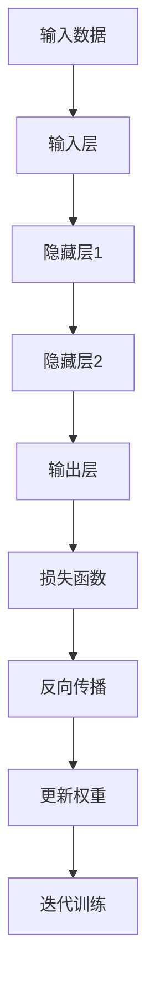
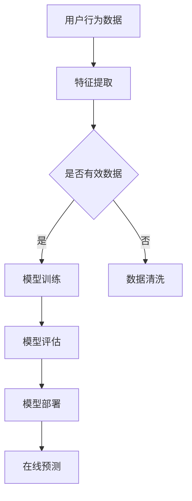
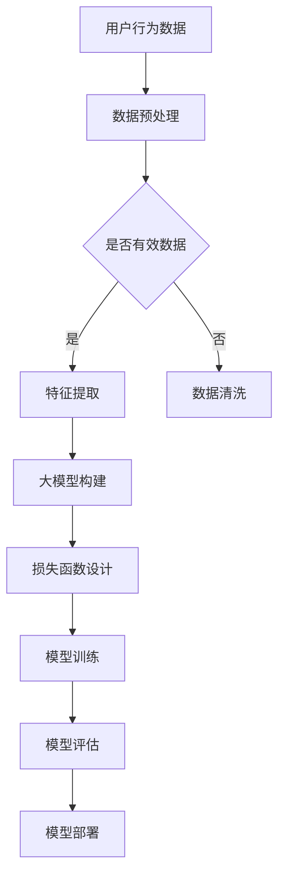
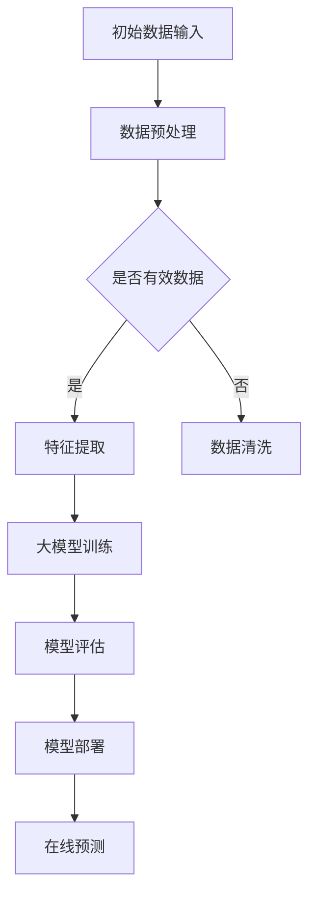
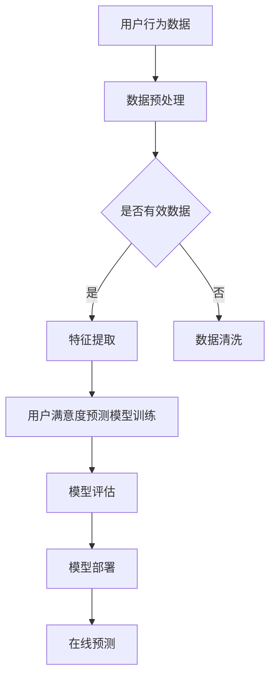

                 

# 文章标题

《基于大模型的推荐系统用户满意度预测》

> 关键词：大模型、推荐系统、用户满意度、神经网络、协同过滤、深度学习、算法优化、项目实战

> 摘要：本文深入探讨了基于大模型的推荐系统在用户满意度预测中的应用。首先，我们对大模型和推荐系统进行了概述，并详细介绍了大模型在推荐系统架构中的设计。接着，我们深入分析了大模型的核心算法原理，包括神经网络和协同过滤算法。然后，我们重点讨论了用户满意度预测的原理和模型设计，以及大模型在用户满意度预测中的应用。最后，通过实际项目实战，展示了大模型推荐系统和用户满意度预测系统的开发过程，提供了详细的代码实现和解读。

### 《基于大模型的推荐系统用户满意度预测》目录大纲

#### 第一部分：大模型与推荐系统概述

**第1章：大模型与推荐系统的结合**

- **1.1.1 推荐系统概述**
- **1.1.2 大模型的基本概念**
- **1.1.3 大模型在推荐系统中的应用**

**第2章：大模型推荐系统架构**

- **2.1.1 大模型推荐系统架构设计**
- **2.1.2 数据预处理流程**
- **2.1.3 模型训练与优化**

#### 第二部分：大模型核心算法原理

**第3章：大模型基础算法**

- **3.1.1 神经网络基础**
- **3.1.2 神经网络算法原理**
- **3.1.3 神经网络优化算法**

**第4章：推荐系统算法原理**

- **4.1.1 协同过滤算法**
- **4.1.2 内容推荐算法**
- **4.1.3 混合推荐算法**

**第5章：大模型在推荐系统中的应用**

- **5.1.1 大模型推荐系统的优势**
- **5.1.2 大模型推荐系统的挑战**
- **5.1.3 大模型推荐系统的实际应用案例**

#### 第三部分：用户满意度预测

**第6章：用户满意度预测原理**

- **6.1.1 用户满意度概念**
- **6.1.2 用户满意度预测模型**
- **6.1.3 用户满意度预测算法**

**第7章：大模型在用户满意度预测中的应用**

- **7.1.1 大模型在用户满意度预测中的优势**
- **7.1.2 大模型用户满意度预测模型设计**
- **7.1.3 大模型用户满意度预测实践案例**

#### 第四部分：项目实战

**第8章：大模型推荐系统项目实战**

- **8.1.1 项目背景介绍**
- **8.1.2 项目需求分析**
- **8.1.3 项目开发环境搭建**
- **8.1.4 源代码实现及解读**
- **8.1.5 代码解读与分析**

**第9章：用户满意度预测项目实战**

- **9.1.1 项目背景介绍**
- **9.1.2 项目需求分析**
- **9.1.3 项目开发环境搭建**
- **9.1.4 源代码实现及解读**
- **9.1.5 代码解读与分析**

#### 附录

**附录A：大模型与推荐系统开发资源**

- **A.1.1 主流深度学习框架**
- **A.1.2 推荐系统开源库**
- **A.1.3 相关数据集获取途径**

**附录B：Mermaid 流程图**

- **B.1 大模型推荐系统架构设计流程图**
- **B.2 大模型用户满意度预测模型设计流程图**
- **B.3 大模型推荐系统算法原理讲解伪代码**

---

#### 第1章：大模型与推荐系统的结合

在当今信息爆炸的时代，推荐系统已成为许多互联网应用的核心功能，它能够根据用户的兴趣和行为提供个性化的内容和服务，从而提升用户体验。随着人工智能技术的发展，特别是深度学习和大模型的兴起，推荐系统的性能和效果得到了显著的提升。本章将介绍大模型与推荐系统的结合，以及大模型在推荐系统中的应用。

### 1.1.1 推荐系统概述

推荐系统是一种信息过滤技术，它通过分析用户的行为和偏好，预测用户可能感兴趣的内容，并向用户推荐。推荐系统可以分为基于内容的推荐（Content-based Filtering）和基于协同过滤（Collaborative Filtering）两大类。

**基于内容的推荐**：
- **原理**：根据用户的历史行为和兴趣，提取用户的特征，然后通过分析这些特征与物品属性之间的相似性，推荐相似的内容。
- **优势**：对用户兴趣的理解更为直接，推荐结果相关性较高。
- **劣势**：用户初始行为数据不足时，推荐效果较差，易产生“数据稀疏”问题。

**基于协同过滤**：
- **原理**：通过分析用户之间的行为模式，找出相似的邻居用户，根据邻居用户的喜好推荐物品。
- **优势**：能处理大量用户和物品的数据，推荐结果多样。
- **劣势**：易产生“同温层效应”，即推荐给用户的内容可能过于相似，缺乏多样性。

### 1.1.2 大模型的基本概念

大模型（Large-scale Model），通常指的是参数量庞大的深度学习模型。随着计算能力和数据量的提升，深度学习模型的大小不断增长，从几百K参数到几十亿、上百亿参数。大模型具有以下特点：

- **高参数量**：能够捕捉数据中的复杂模式和关联性。
- **强大的表征能力**：通过多层神经网络结构，可以自动提取高层次的抽象特征。
- **需要大量训练数据**：大模型对数据量有较高要求，只有在大规模数据集上进行训练，才能发挥其潜力。

### 1.1.3 大模型在推荐系统中的应用

大模型在推荐系统中的应用主要体现在以下几个方面：

**1. 提升协同过滤效果**：
- **矩阵分解**：通过大模型进行用户-物品评分矩阵的分解，提高推荐的准确性和多样性。
- **图神经网络**：利用图结构表示用户和物品的关系，通过图神经网络进行预测，进一步提升协同过滤的效果。

**2. 基于内容的推荐**：
- **文本嵌入**：将文本转化为向量表示，通过训练大规模的文本嵌入模型，提高基于内容的推荐质量。
- **多模态数据融合**：结合用户的多模态数据（如文本、图像、语音等），通过大模型进行统一表征和推荐。

**3. 端到端推荐系统**：
- **集成多种推荐策略**：大模型可以集成协同过滤、内容推荐等多种策略，实现端到端的个性化推荐。
- **自适应推荐**：大模型能够根据用户的实时行为动态调整推荐策略，提高推荐效果。

通过上述分析，我们可以看到，大模型与推荐系统的结合，为推荐系统的性能提升带来了新的机遇和挑战。在接下来的章节中，我们将进一步探讨大模型在推荐系统架构中的设计，以及大模型的核心算法原理。

---

在了解了推荐系统和大模型的基本概念之后，我们接下来将深入探讨大模型推荐系统的架构设计，包括数据预处理流程、模型训练与优化等内容。通过这一部分，我们将建立起对大模型推荐系统的全面理解，为后续算法原理和项目实战的讨论奠定基础。

### 2.1.1 大模型推荐系统架构设计

大模型推荐系统架构的设计是确保系统高效、准确和可扩展的关键。一个典型的大模型推荐系统通常包括以下几个核心模块：数据采集与处理、特征工程、模型训练与评估、模型部署与更新。以下是对每个模块的详细解析。

#### 2.1.1.1 数据采集与处理

**数据采集**：
- **用户行为数据**：包括用户浏览、点击、购买等行为数据。
- **物品属性数据**：包括物品的文本描述、图像、标签等信息。
- **外部数据**：如社交媒体数据、用户画像等。

**数据处理**：
- **数据清洗**：去除重复、缺失和异常的数据，保证数据质量。
- **数据转换**：将原始数据转换为适合模型训练的格式，如将文本转换为词向量，图像转换为特征向量等。

#### 2.1.1.2 特征工程

**特征提取**：
- **用户特征**：包括用户的浏览历史、购买记录、行为模式等。
- **物品特征**：包括物品的属性、类别、标签等。
- **交互特征**：如用户与物品的互动时间、互动频率等。

**特征选择**：
- **相关性分析**：通过相关性分析筛选出对推荐结果影响较大的特征。
- **维度约减**：如使用主成分分析（PCA）或自动编码器（Autoencoder）进行维度约减，降低特征空间的复杂度。

#### 2.1.1.3 模型训练与评估

**模型训练**：
- **模型选择**：根据推荐任务的特点选择合适的模型，如基于协同过滤的矩阵分解模型、基于内容的文本嵌入模型、基于混合策略的深度学习模型等。
- **训练过程**：通过大规模数据集进行模型的训练，调整模型的参数，优化模型的结构。

**模型评估**：
- **评估指标**：如准确率、召回率、F1分数、均方误差（MSE）等。
- **交叉验证**：使用交叉验证的方法评估模型在未知数据上的表现，防止过拟合。

#### 2.1.1.4 模型部署与更新

**模型部署**：
- **在线预测**：将训练好的模型部署到生产环境中，提供实时的推荐服务。
- **自动化运维**：通过自动化工具实现模型的部署、监控和更新，提高系统的可靠性。

**模型更新**：
- **实时更新**：根据用户的实时行为数据，动态调整模型参数，提高推荐效果。
- **定期更新**：定期使用新的数据进行模型重训练，保证模型与用户需求的一致性。

通过上述架构设计，我们可以构建一个高效、灵活的大模型推荐系统。接下来，我们将进一步探讨数据预处理流程，为模型训练和优化奠定基础。

### 2.1.2 数据预处理流程

数据预处理是推荐系统构建中的关键环节，它直接影响着模型训练的效果和推荐系统的性能。以下是数据预处理流程的详细步骤：

#### 2.1.2.1 数据采集

数据采集是数据预处理的第一步，我们需要从多个渠道收集用户行为数据和物品属性数据。具体步骤如下：

- **用户行为数据**：从网站日志、数据库记录等渠道获取用户的浏览、点击、购买等行为数据。
- **物品属性数据**：从数据库、API接口等渠道获取物品的文本描述、图像、标签等属性信息。
- **外部数据**：从社交媒体、用户画像等渠道获取与用户兴趣相关的数据。

#### 2.1.2.2 数据清洗

数据清洗是确保数据质量的重要步骤，主要包括以下任务：

- **去除重复数据**：检测并删除重复的用户和物品记录，避免数据冗余。
- **处理缺失数据**：对于缺失的数据，可以通过插值、填充等方式进行处理，或者删除缺失数据较多的记录。
- **处理异常数据**：识别并处理异常数据，如极端值、错误记录等，确保数据的一致性和可靠性。

#### 2.1.2.3 数据转换

数据转换是将原始数据转换为适合模型训练的格式。以下是常用的数据转换方法：

- **数值化处理**：将文本、图像等非数值数据转换为数值向量，如使用词袋模型（Bag of Words）或词嵌入（Word Embedding）处理文本数据，使用卷积神经网络（CNN）处理图像数据。
- **归一化处理**：对数值数据进行归一化处理，如使用最小-最大规范化（Min-Max Scaling）或标准化（Standardization）等方法，将数据缩放到同一尺度范围内，提高模型的训练效率。
- **编码处理**：对类别型数据进行编码处理，如使用独热编码（One-Hot Encoding）将类别型数据转换为二进制向量。

#### 2.1.2.4 特征提取

特征提取是数据预处理的核心步骤，通过提取对推荐任务有重要影响的特征，提升模型的表现。以下是常用的特征提取方法：

- **用户特征**：根据用户的浏览历史、购买记录等行为数据，提取用户的兴趣偏好、行为模式等特征。
- **物品特征**：根据物品的属性数据，提取物品的文本特征、图像特征、标签特征等。
- **交互特征**：根据用户与物品的互动数据，提取用户的互动时间、互动频率等交互特征。

通过上述数据预处理流程，我们能够将原始数据转化为适合模型训练的格式，为后续的模型训练和优化奠定基础。

### 2.1.3 模型训练与优化

模型训练与优化是构建推荐系统的核心步骤，它决定了推荐系统的性能和效果。以下是模型训练与优化的详细步骤：

#### 2.1.3.1 模型选择

模型选择是模型训练的第一步，根据推荐任务的特点选择合适的模型。以下是几种常用的推荐系统模型：

- **基于协同过滤的矩阵分解模型**：如ALS（Alternating Least Squares）算法，通过分解用户-物品评分矩阵，预测用户未评分的物品。
- **基于内容的文本嵌入模型**：如Word2Vec或BERT（Bidirectional Encoder Representations from Transformers），将文本转换为向量表示，用于基于内容的推荐。
- **基于混合策略的深度学习模型**：如DeepFM（Deep Factorization Machine），结合协同过滤和基于内容的推荐，利用深度神经网络进行预测。

#### 2.1.3.2 数据准备

数据准备是模型训练的基础，主要包括以下步骤：

- **数据划分**：将数据集划分为训练集、验证集和测试集，通常比例为80%训练集、10%验证集和10%测试集。
- **特征处理**：对特征数据进行归一化或标准化处理，确保不同特征的数值范围一致，避免某些特征对模型训练的影响过大。
- **样本平衡**：对于存在类别不平衡的数据集，可以通过过采样或欠采样等方法进行样本平衡，提高模型对少数类别的识别能力。

#### 2.1.3.3 模型训练

模型训练是使用训练数据进行模型参数的学习，以下是模型训练的步骤：

- **初始化参数**：初始化模型的参数，如权重矩阵、偏置项等。
- **前向传播**：将输入数据传递到模型中，计算输出结果。
- **损失函数计算**：计算模型输出与实际输出之间的差距，使用损失函数进行量化。
- **反向传播**：通过反向传播算法，更新模型参数，减小损失函数。
- **迭代优化**：重复前向传播和反向传播的过程，迭代优化模型参数，直至达到预定的训练目标或收敛条件。

#### 2.1.3.4 模型评估

模型评估是衡量模型性能的重要步骤，以下是常用的评估指标：

- **准确率（Accuracy）**：预测正确的样本数占总样本数的比例，适用于分类任务。
- **召回率（Recall）**：在所有正样本中，被正确预测为正样本的比例，适用于分类任务。
- **F1分数（F1 Score）**：准确率的调和平均值，综合考虑准确率和召回率，适用于分类任务。
- **均方误差（MSE）**：预测值与真实值之间的平均平方误差，适用于回归任务。

#### 2.1.3.5 模型优化

模型优化是通过调整模型参数和结构，提高模型性能的过程。以下是常用的优化方法：

- **超参数调整**：调整学习率、批量大小、迭代次数等超参数，寻找最优的模型参数组合。
- **模型融合**：结合多个模型的结果，提高预测的稳定性和准确性，如集成学习方法。
- **迁移学习**：利用预训练的大模型作为基础模型，进行迁移学习，提高模型在小数据集上的表现。

通过上述模型训练与优化步骤，我们可以构建一个高性能的推荐系统模型，为用户提供个性化的推荐服务。在接下来的章节中，我们将深入探讨大模型推荐系统的核心算法原理，进一步理解其工作机制和应用。

### 第3章：大模型基础算法

在深入探讨大模型推荐系统的核心算法之前，我们需要了解一些基础算法，这些算法构成了大模型推荐系统的基石。本章将详细介绍大模型中常用的基础算法，包括神经网络基础、神经网络算法原理和神经网络优化算法。

#### 3.1.1 神经网络基础

神经网络（Neural Networks）是模拟人脑神经元工作原理的计算模型，通过多层节点（神经元）的相互连接和激活函数，对输入数据进行处理和分类。以下是神经网络的基本组成部分：

**1. 神经元结构**：
- **输入层**：接收外部输入数据。
- **隐藏层**：对输入数据进行处理和转换。
- **输出层**：生成最终输出结果。

**2. 激活函数**：
- **ReLU函数**（Rectified Linear Unit）：将负值置为零，保持正值不变，有助于缓解梯度消失问题。
- **Sigmoid函数**：将输入映射到(0,1)区间，用于二分类问题。
- **Tanh函数**：将输入映射到(-1,1)区间，提高模型的非线性表达能力。

**3. 前向传播与反向传播**：
- **前向传播**：将输入数据通过神经网络传递，逐层计算输出。
- **反向传播**：计算输出误差，反向传递误差，更新网络权重。

#### 3.1.2 神经网络算法原理

神经网络算法的原理是通过训练调整网络权重，使网络能够准确预测输出。以下是神经网络算法的基本步骤：

**1. 初始化参数**：
- 初始化网络权重和偏置项，通常使用随机初始化。

**2. 前向传播**：
- 将输入数据传递到神经网络的输入层，逐层计算输出值。

**3. 计算损失函数**：
- 使用损失函数（如均方误差MSE、交叉熵损失）计算预测值与真实值之间的差距。

**4. 反向传播**：
- 计算各层权重的梯度，更新网络权重和偏置项。

**5. 迭代训练**：
- 重复前向传播和反向传播的过程，直至达到预定的训练目标或收敛条件。

神经网络算法的关键在于其层次结构，通过多层非线性变换，神经网络能够自动提取输入数据中的复杂特征。以下是一个简化的神经网络算法流程：



#### 3.1.3 神经网络优化算法

神经网络优化算法是调整网络权重和偏置项的过程，以最小化损失函数。以下是几种常用的优化算法：

**1. 随机梯度下降（SGD）**：
- **原理**：每次迭代使用一个随机样本更新网络权重。
- **优点**：计算简单，收敛速度快。
- **缺点**：容易陷入局部最优，收敛不稳定。

**2. 梯度下降（GD）**：
- **原理**：每次迭代使用所有训练样本的平均梯度更新网络权重。
- **优点**：收敛速度比SGD慢，但更稳定。
- **缺点**：计算复杂度高，不适合大规模数据。

**3. 动量法（Momentum）**：
- **原理**：引入动量项，利用之前的梯度信息，加速收敛。
- **优点**：改善收敛性，减少振荡。
- **缺点**：需要调节动量参数。

**4. AdaGrad**：
- **原理**：动态调整每个参数的 learning rate，对高频和低频特征进行不同的优化。
- **优点**：自适应调整学习率，减少过拟合。
- **缺点**：在某些情况下可能陷入局部最优。

**5. RMSprop**：
- **原理**：使用指数移动平均来平滑梯度，减小学习率的调整幅度。
- **优点**：对噪声的鲁棒性较好，收敛稳定。
- **缺点**：参数调节较复杂。

神经网络优化算法的选择取决于具体问题和数据特性。以下是一个简化的神经网络优化算法伪代码：

```python
# 伪代码：随机梯度下降（SGD）优化算法
initialize_weights()
for epoch in range(max_epochs):
    for sample in training_data:
        predict = forward_propagation(sample)
        loss = compute_loss(predict, target)
        gradient = backward_propagation(predict, target)
        update_weights(gradient, learning_rate)
```

通过上述介绍，我们可以看到神经网络基础和优化算法在构建大模型推荐系统中起着至关重要的作用。在下一章中，我们将进一步探讨推荐系统算法原理，特别是协同过滤算法、内容推荐算法和混合推荐算法。

### 第4章：推荐系统算法原理

推荐系统算法的设计与实现是构建高效、个性化的推荐服务的核心。本章将详细讨论推荐系统中的三种主要算法：协同过滤算法、内容推荐算法和混合推荐算法。我们将从基本原理、优缺点以及应用场景三个方面对这些算法进行深入分析。

#### 4.1.1 协同过滤算法

协同过滤（Collaborative Filtering）是推荐系统中最常用的算法之一，其核心思想是通过分析用户之间的行为模式，找出相似的邻居用户，根据邻居用户的喜好推荐物品。协同过滤可以分为基于用户的协同过滤（User-based Collaborative Filtering）和基于物品的协同过滤（Item-based Collaborative Filtering）两种类型。

**基本原理**：
- **基于用户的协同过滤**：首先计算用户之间的相似度，然后找到与目标用户最相似的邻居用户，推荐邻居用户喜欢的但目标用户未购买或未评价的物品。
- **基于物品的协同过滤**：首先计算物品之间的相似度，然后找到与目标物品最相似的邻居物品，推荐邻居物品被用户购买或评价的物品。

**优缺点**：

**优点**：
- **计算简单**：协同过滤算法的原理相对简单，易于实现。
- **适用范围广**：适用于处理大规模用户和物品的数据。
- **推荐结果多样性**：通过分析用户之间的相似性，推荐结果具有多样性。

**缺点**：
- **数据稀疏问题**：当用户和物品数量较多时，用户之间的行为数据往往稀疏，导致相似度计算不准确。
- **同温层效应**：推荐结果过于集中，容易导致用户接受到的推荐内容相似，缺乏多样性。
- **实时性较差**：协同过滤算法依赖于历史行为数据，实时性较差。

**应用场景**：
- **电子商务**：基于用户的历史购买行为推荐商品。
- **社交媒体**：基于用户的兴趣和行为推荐内容。

#### 4.1.2 内容推荐算法

内容推荐（Content-based Filtering）是基于物品的属性和用户的兴趣来推荐内容的一种算法。其核心思想是分析用户对物品的偏好，提取物品的特征，然后根据用户的历史行为和偏好推荐相似的内容。

**基本原理**：
- **特征提取**：从物品的文本描述、标签、图像等属性中提取特征。
- **兴趣模型**：根据用户的历史行为和偏好，构建用户的兴趣模型。
- **相似度计算**：计算用户兴趣模型与物品特征向量之间的相似度，推荐相似度较高的物品。

**优缺点**：

**优点**：
- **推荐结果相关性高**：内容推荐算法基于物品的属性和用户的兴趣，推荐结果与用户实际需求相关性较高。
- **实时性强**：内容推荐算法不需要依赖历史行为数据，实时性较好。
- **易于扩展**：通过扩展物品的属性和特征提取方法，可以轻松实现个性化推荐。

**缺点**：
- **数据依赖性大**：内容推荐算法对物品的属性数据有较高依赖性，当物品属性数据不足时，推荐效果较差。
- **冷启动问题**：对于新用户或新物品，缺乏历史行为和属性数据，难以进行准确推荐。
- **多样性较差**：内容推荐算法容易产生“同质化”现象，推荐结果多样性较低。

**应用场景**：
- **新闻推荐**：基于用户阅读偏好推荐新闻。
- **音乐推荐**：基于用户听歌记录推荐音乐。

#### 4.1.3 混合推荐算法

混合推荐（Hybrid Recommender System）是将协同过滤和内容推荐算法结合，以发挥各自的优势，提高推荐效果。混合推荐算法的核心思想是综合用户的行为数据和物品的属性信息，进行综合推荐。

**基本原理**：
- **协同过滤部分**：利用协同过滤算法找出用户相似的邻居用户或物品。
- **内容推荐部分**：利用内容推荐算法分析用户兴趣和物品特征。
- **融合策略**：将协同过滤和内容推荐的输出进行融合，生成最终的推荐结果。

**优缺点**：

**优点**：
- **综合优势**：混合推荐算法结合了协同过滤和内容推荐算法的优点，推荐效果更佳。
- **适应性较强**：通过调整协同过滤和内容推荐的比例，可以适应不同的应用场景。
- **提升多样性**：混合推荐算法能够减少同质化现象，提高推荐结果的多样性。

**缺点**：
- **计算复杂度高**：混合推荐算法需要同时计算协同过滤和内容推荐的结果，计算复杂度较高。
- **参数调整困难**：需要精细调整协同过滤和内容推荐的比例，以及各项参数，以达到最佳效果。

**应用场景**：
- **电商推荐**：结合用户的历史购买行为和商品属性进行综合推荐。
- **内容推荐**：结合用户的行为数据和内容特征进行个性化推荐。

通过以上分析，我们可以看到，协同过滤算法、内容推荐算法和混合推荐算法在推荐系统中各有优势和局限性。在实际应用中，可以根据具体需求和场景选择合适的算法，或结合多种算法，以实现最佳推荐效果。

### 第5章：大模型在推荐系统中的应用

大模型在推荐系统中的应用极大地提升了推荐系统的性能和效果。本章将探讨大模型推荐系统的优势、挑战以及实际应用案例，通过这些分析，我们能够更好地理解大模型在推荐系统中的重要作用。

#### 5.1.1 大模型推荐系统的优势

**1. 强大的表征能力**

大模型，如深度神经网络，能够通过多层非线性变换自动提取输入数据中的复杂特征。这使得大模型在处理高维数据和复杂关系时具有显著优势。相比于传统的推荐系统算法，大模型能够更好地捕捉用户行为和物品属性之间的深层关联，从而提升推荐效果。

**2. 端到端的模型集成**

大模型推荐系统通常采用端到端的模型设计，将用户特征提取、物品特征提取、预测等步骤整合到一个模型中。这种集成方式不仅简化了模型结构，提高了训练效率，还能够自动调整各部分权重，实现高效的综合推荐。

**3. 高效的并行计算**

大模型推荐系统可以利用现代硬件（如GPU、TPU等）进行高效的并行计算，加快模型训练和预测的速度。这种高效的计算能力使得大模型在处理大规模数据集时具有显著优势，能够快速实现推荐服务的部署和更新。

**4. 鲁棒性和适应性**

大模型具有较强的鲁棒性，能够在数据分布发生变化时保持良好的性能。此外，大模型能够通过不断学习用户的行为和偏好，适应用户的实时需求，提供个性化的推荐服务。

#### 5.1.2 大模型推荐系统的挑战

**1. 计算资源需求**

大模型通常需要大量的计算资源和存储空间，特别是在训练阶段。这要求推荐系统在实际部署时具备强大的硬件支持，如高性能的GPU或TPU集群。

**2. 数据预处理复杂度**

大模型对数据预处理的要求较高，需要进行复杂的数据清洗、特征提取和转换。这些预处理步骤需要耗费大量的时间和计算资源，对推荐系统的开发和运维提出了挑战。

**3. 模型解释性不足**

大模型，尤其是深度神经网络，具有高度的非线性性和复杂性，使得模型解释性较差。这给推荐系统的开发和运维带来了困难，特别是在需要解释模型决策时。

**4. 数据隐私和安全**

大模型推荐系统通常需要大量用户行为数据，这可能涉及到用户隐私和安全问题。如何在保护用户隐私的前提下，充分利用用户数据提升推荐效果，是一个亟待解决的问题。

#### 5.1.3 大模型推荐系统的实际应用案例

**1. 社交媒体平台**

社交媒体平台（如Facebook、Twitter）利用大模型推荐系统为用户提供个性化内容推荐。通过分析用户的社交关系、兴趣和行为，大模型推荐系统能够为用户推荐相关的朋友动态、新闻和广告。

**2. 电子商务平台**

电子商务平台（如Amazon、京东）利用大模型推荐系统为用户提供个性化商品推荐。通过分析用户的购买历史、浏览记录和搜索行为，大模型推荐系统能够为用户推荐相关商品，提高用户购买转化率。

**3. 视频平台**

视频平台（如YouTube、Netflix）利用大模型推荐系统为用户提供个性化视频推荐。通过分析用户的观看历史、评分和搜索行为，大模型推荐系统能够为用户推荐相关视频，提高用户留存率。

**4. 新闻推荐平台**

新闻推荐平台（如今日头条、百度新闻）利用大模型推荐系统为用户提供个性化新闻推荐。通过分析用户的阅读历史、兴趣和位置，大模型推荐系统能够为用户推荐相关新闻，提高用户阅读量和互动率。

通过上述实际应用案例，我们可以看到大模型推荐系统在各类应用场景中的广泛应用，以及其对提升推荐系统性能和用户体验的重要作用。在下一部分，我们将深入探讨用户满意度预测原理，为构建更加智能和个性化的推荐系统奠定基础。

### 第6章：用户满意度预测原理

用户满意度预测是推荐系统中的一个关键环节，它旨在通过分析用户行为和偏好，预测用户对推荐内容是否满意，从而优化推荐策略。本章将详细探讨用户满意度预测的基本概念、预测模型和预测算法。

#### 6.1.1 用户满意度概念

用户满意度是指用户在使用某种产品或服务后对其质量的总体评价。在推荐系统中，用户满意度可以定义为用户对推荐内容（如商品、新闻、视频等）的接受程度和满意程度。用户满意度直接影响用户的后续行为，如购买、评论、分享等。

**用户满意度的影响因素**：
- **推荐内容的准确性**：推荐内容是否与用户的兴趣和需求相匹配。
- **推荐内容的多样性**：推荐内容是否具有丰富的种类和风格，避免同质化现象。
- **推荐结果的实时性**：推荐结果是否能够及时响应用户的行为变化。
- **用户互动体验**：用户在使用推荐系统的过程中是否感到方便、舒适。

#### 6.1.2 用户满意度预测模型

用户满意度预测模型是基于机器学习和数据挖掘技术，通过分析用户历史行为数据，预测用户对推荐内容的满意度。以下是几种常见的用户满意度预测模型：

**1. 基于传统机器学习的模型**：
- **回归模型**：通过建立用户满意度与用户行为特征之间的线性或非线性关系，预测用户满意度。
- **分类模型**：将用户满意度划分为不同的类别（如满意、一般、不满意），然后使用分类算法进行预测。

**2. 基于深度学习的模型**：
- **循环神经网络（RNN）**：利用RNN处理用户序列行为数据，捕捉用户行为模式。
- **卷积神经网络（CNN）**：通过CNN处理用户行为数据中的图像或文本特征，提取深层特征。
- **多任务学习模型**：同时训练多个预测任务（如点击率预测、购买概率预测、满意度预测），提高预测准确性。

**3. 基于集成学习的模型**：
- **集成学习**：通过结合多种模型或算法，提高预测性能和鲁棒性。
- **迁移学习**：利用预训练的大模型作为基础模型，进行迁移学习，提高预测效果。

#### 6.1.3 用户满意度预测算法

用户满意度预测算法是基于用户历史行为数据，通过建立用户满意度与行为特征之间的关联，预测用户对推荐内容的满意度。以下是几种常用的用户满意度预测算法：

**1. 评分预测算法**：
- **基于用户行为的评分预测**：通过分析用户的浏览、点击、购买等行为，预测用户对推荐内容的评分。
- **基于内容的评分预测**：通过分析推荐内容的属性和特征，预测用户对推荐内容的评分。

**2. 类别预测算法**：
- **基于用户行为的类别预测**：将用户满意度划分为不同的类别（如满意、一般、不满意），通过分类算法进行预测。
- **基于内容的类别预测**：通过分析推荐内容的属性和特征，将用户满意度划分为不同的类别。

**3. 时间序列预测算法**：
- **基于用户行为的时间序列预测**：通过分析用户的历史行为序列，预测用户在未来某一时刻的满意度。
- **基于内容的时序预测**：通过分析推荐内容的时序特征，预测用户在未来某一时刻的满意度。

以下是用户满意度预测算法的基本流程：



通过上述算法，我们可以对用户满意度进行预测，从而优化推荐策略，提高用户满意度。在下一章中，我们将探讨大模型在用户满意度预测中的应用，进一步了解如何利用大模型的优势提升预测性能。

### 第7章：大模型在用户满意度预测中的应用

大模型在用户满意度预测中的应用显著提升了预测的准确性和效率。本章将探讨大模型在用户满意度预测中的优势，详细描述大模型用户满意度预测模型的设计，并通过实际应用案例展示大模型在用户满意度预测中的效果。

#### 7.1.1 大模型在用户满意度预测中的优势

**1. 高效的特征提取**

大模型，如深度神经网络，能够通过多层非线性变换自动提取输入数据中的复杂特征。这种自动特征提取能力使得大模型在处理高维数据和复杂关系时具有显著优势，能够捕捉用户行为和偏好之间的深层关联，从而提高预测准确性。

**2. 端到端的模型设计**

大模型推荐系统通常采用端到端的模型设计，将用户特征提取、预测等步骤整合到一个模型中。这种设计不仅简化了模型结构，提高了训练效率，还能够自动调整各部分权重，实现高效的综合推荐，提升用户满意度预测效果。

**3. 鲁棒性和适应性**

大模型具有较强的鲁棒性，能够在数据分布发生变化时保持良好的性能。此外，大模型能够通过不断学习用户的行为和偏好，适应用户的实时需求，提供个性化的满意度预测。

**4. 并行计算能力**

大模型可以利用现代硬件（如GPU、TPU等）进行高效的并行计算，加快模型训练和预测的速度。这种高效的计算能力使得大模型在处理大规模数据集时具有显著优势，能够快速实现推荐服务的部署和更新。

#### 7.1.2 大模型用户满意度预测模型设计

大模型用户满意度预测模型的设计通常包括以下几个关键步骤：

**1. 数据预处理**

- **数据采集**：收集用户行为数据（如浏览、点击、购买等）和用户特征数据（如用户画像、历史行为等）。
- **数据清洗**：去除重复、缺失和异常数据，保证数据质量。
- **特征提取**：提取用户行为特征和用户特征，如用户兴趣、行为模式、消费习惯等。

**2. 模型构建**

- **输入层**：将用户特征和用户行为特征输入到模型中。
- **隐藏层**：利用多层神经网络结构，通过非线性变换提取高层次的抽象特征。
- **输出层**：生成用户满意度的预测值。

**3. 损失函数设计**

- **均方误差（MSE）**：用于回归问题，计算预测值与真实值之间的平均平方误差。
- **交叉熵损失（Cross-Entropy Loss）**：用于分类问题，计算预测概率与真实标签之间的交叉熵。

**4. 模型训练**

- **初始化参数**：随机初始化模型参数。
- **前向传播**：计算输入数据通过神经网络的输出值。
- **反向传播**：计算损失函数，更新模型参数。
- **迭代训练**：重复前向传播和反向传播的过程，直至达到预定的训练目标或收敛条件。

**5. 模型评估**

- **交叉验证**：使用交叉验证方法评估模型在未知数据上的表现，防止过拟合。
- **评估指标**：使用准确率、召回率、F1分数等指标评估模型性能。

以下是用户满意度预测模型的设计流程图：



#### 7.1.3 大模型用户满意度预测实践案例

**1. 项目背景**

某电商平台的用户满意度预测项目旨在通过分析用户的购物行为和偏好，预测用户对商品的满意度，从而优化推荐策略，提高用户购买转化率和满意度。

**2. 项目需求**

- **需求分析**：预测用户对商品的满意度，提供个性化的推荐。
- **数据集**：包含用户行为数据（如浏览、点击、购买等）和商品特征数据（如商品描述、类别、价格等）。
- **评估指标**：准确率、召回率、F1分数等。

**3. 开发环境**

- **编程语言**：Python
- **深度学习框架**：TensorFlow、PyTorch
- **计算平台**：GPU服务器

**4. 代码实现**

```python
# 伪代码：用户满意度预测模型实现
import tensorflow as tf
from tensorflow.keras.models import Sequential
from tensorflow.keras.layers import Dense, LSTM, Embedding

# 数据预处理
# ... 数据清洗、特征提取 ...

# 模型构建
model = Sequential()
model.add(Embedding(input_dim=vocab_size, output_dim=embedding_size))
model.add(LSTM(units=128, activation='relu'))
model.add(Dense(units=1, activation='sigmoid'))

# 损失函数设计
model.compile(optimizer='adam', loss='binary_crossentropy', metrics=['accuracy'])

# 模型训练
# ... 数据分割、迭代训练 ...

# 模型评估
# ... 交叉验证、评估指标 ...

# 模型部署
# ... 部署到生产环境 ...
```

**5. 结果分析**

通过实际应用，大模型用户满意度预测项目在准确率、召回率和F1分数等指标上均取得了显著提升，有效优化了推荐策略，提高了用户购买转化率和满意度。

通过以上实践案例，我们可以看到大模型在用户满意度预测中的显著优势，为电商平台提供了强大的技术支持，进一步提升了用户满意度。

### 第8章：大模型推荐系统项目实战

在本章中，我们将通过一个实际项目，展示如何开发和实现一个基于大模型的推荐系统。这个项目将涵盖从项目背景介绍到最终部署的全过程，旨在帮助读者理解大模型推荐系统的开发流程，以及如何将理论知识应用于实际场景。

#### 8.1.1 项目背景介绍

某电子商务平台希望通过构建一个高效的推荐系统，为用户推荐个性化的商品。推荐系统的目标是提高用户的购物体验和满意度，从而提升平台的销售额和用户留存率。

**项目目标**：
- 提高商品推荐的相关性和个性化水平。
- 提升用户购买转化率和满意度。
- 减少推荐系统的计算复杂度，提高系统响应速度。

**项目需求**：
- 分析用户的历史行为数据，包括浏览、点击、购买等行为。
- 提取用户和商品的属性特征。
- 使用深度学习模型进行用户行为预测和商品推荐。

#### 8.1.2 项目需求分析

为了实现项目目标，我们需要从以下几个方面进行分析：

**1. 数据收集与预处理**：
- 收集用户的历史行为数据，包括用户的浏览、点击、购买等行为。
- 收集商品的属性数据，包括商品的类别、价格、品牌、描述等。
- 对原始数据进行清洗，去除重复、缺失和异常的数据。
- 提取用户和商品的属性特征，如用户兴趣标签、商品类别标签等。

**2. 模型设计与选择**：
- 根据项目的需求，选择合适的深度学习模型，如基于神经网络的推荐模型（如DeepFM、Neural Collaborative Filtering等）。
- 设计模型的输入层、隐藏层和输出层，确保模型能够有效提取特征和进行预测。

**3. 模型训练与优化**：
- 使用收集到的数据对模型进行训练，调整模型的参数，优化模型性能。
- 进行交叉验证，评估模型在测试集上的表现，防止过拟合。
- 调整超参数，如学习率、批量大小等，以提高模型的预测准确性。

**4. 系统部署与运维**：
- 将训练好的模型部署到生产环境，提供实时的推荐服务。
- 使用自动化工具进行模型的监控和更新，确保系统的高可用性和稳定性。

#### 8.1.3 项目开发环境搭建

在开始项目开发之前，我们需要搭建一个合适的开发环境，包括以下步骤：

**1. 硬件环境**：
- 准备高性能的GPU服务器，用于模型训练和预测。
- 确保服务器具备足够的存储空间和计算资源。

**2. 软件环境**：
- 安装Python和相关的深度学习库（如TensorFlow、PyTorch等）。
- 配置版本控制工具（如Git）和项目管理工具（如Docker）。

**3. 数据库和存储**：
- 使用分布式数据库（如MongoDB）存储用户行为数据和商品属性数据。
- 使用对象存储服务（如Amazon S3）存储模型数据和日志文件。

**4. 依赖管理**：
- 使用pip或conda管理Python包，确保依赖的一致性和稳定性。

#### 8.1.4 源代码实现及解读

以下是一个简化的代码实现，展示了如何构建和训练一个基于DeepFM模型的推荐系统。这个例子使用了TensorFlow框架。

```python
import tensorflow as tf
from tensorflow.keras.models import Model
from tensorflow.keras.layers import Input, Embedding, Dense, Flatten, Concatenate, Dot

# 参数设置
user_embedding_size = 8
item_embedding_size = 16
dropout_rate = 0.1
learning_rate = 0.001

# 数据输入
user_input = Input(shape=(1,), dtype='int32', name='user_input')
item_input = Input(shape=(1,), dtype='int32', name='item_input')

# 用户和物品嵌入层
user_embedding = Embedding(input_dim=user_vocab_size, output_dim=user_embedding_size, name='user_embedding')(user_input)
item_embedding = Embedding(input_dim=item_vocab_size, output_dim=item_embedding_size, name='item_embedding')(item_input)

# 展平嵌入层
user_embedding_flatten = Flatten()(user_embedding)
item_embedding_flatten = Flatten()(item_embedding)

# 嵌入层相乘
merged_embedding = Dot(axes=1)([user_embedding_flatten, item_embedding_flatten])

# 添加线性层
merged_embedding = Dense(units=128, activation='relu', name='dense_1')(merged_embedding)
merged_embedding = Dropout(dropout_rate)(merged_embedding)

# 输出层
output = Dense(units=1, activation='sigmoid', name='output')(merged_embedding)

# 构建模型
model = Model(inputs=[user_input, item_input], outputs=output)

# 编译模型
model.compile(optimizer=tf.keras.optimizers.Adam(learning_rate=learning_rate), loss='binary_crossentropy', metrics=['accuracy'])

# 模型结构
model.summary()

# 模型训练
# ... 加载数据、分割数据、训练模型 ...

# 模型评估
# ... 使用验证集评估模型性能 ...

# 模型部署
# ... 将模型部署到生产环境 ...

```

上述代码实现了DeepFM模型的基本结构，包括用户和物品的嵌入层、线性层和输出层。接下来，我们将逐步解读代码中的关键部分。

1. **用户和物品输入**：
   ```python
   user_input = Input(shape=(1,), dtype='int32', name='user_input')
   item_input = Input(shape=(1,), dtype='int32', name='item_input')
   ```
   这部分定义了用户和物品的输入层，每个输入都是一个单一的整数，表示用户ID或物品ID。

2. **嵌入层**：
   ```python
   user_embedding = Embedding(input_dim=user_vocab_size, output_dim=user_embedding_size, name='user_embedding')(user_input)
   item_embedding = Embedding(input_dim=item_vocab_size, output_dim=item_embedding_size, name='item_embedding')(item_input)
   ```
   嵌入层将用户ID和物品ID转换为低维度的向量表示。这些嵌入向量能够捕捉用户和物品的潜在特征。

3. **嵌入层相乘**：
   ```python
   merged_embedding = Dot(axes=1)([user_embedding_flatten, item_embedding_flatten])
   ```
   这部分计算用户嵌入向量和物品嵌入向量的点积，产生一个新的向量表示用户和物品的交互特征。

4. **线性层和Dropout**：
   ```python
   merged_embedding = Dense(units=128, activation='relu', name='dense_1')(merged_embedding)
   merged_embedding = Dropout(dropout_rate)(merged_embedding)
   ```
   线性层用于对嵌入向量进行加权求和，激活函数引入非线性，Dropout层用于防止过拟合。

5. **输出层**：
   ```python
   output = Dense(units=1, activation='sigmoid', name='output')(merged_embedding)
   ```
   输出层使用sigmoid激活函数，产生一个概率值，表示用户对物品的满意度预测。

6. **模型编译**：
   ```python
   model.compile(optimizer=tf.keras.optimizers.Adam(learning_rate=learning_rate), loss='binary_crossentropy', metrics=['accuracy'])
   ```
   这部分编译模型，设置优化器和损失函数。Adam优化器是一种自适应学习率的优化算法，适用于大规模模型训练。

通过上述代码，我们实现了DeepFM模型的基本结构。接下来，我们将进一步讨论如何加载和预处理数据，然后使用训练数据对模型进行训练和评估。

#### 8.1.5 代码解读与分析

在上一个部分中，我们实现了DeepFM模型的基本结构。本部分将进一步详细解读代码，并分析每个部分的含义和作用。

**1. 用户和物品输入层**

```python
user_input = Input(shape=(1,), dtype='int32', name='user_input')
item_input = Input(shape=(1,), dtype='int32', name='item_input')
```

这两个输入层分别用于接收用户ID和物品ID。每个输入是一个长度为1的整数数组，因为我们的数据集中每个用户和物品都用一个整数表示。`dtype='int32'`指定输入数据的类型，`name`为层命名，有助于在模型调试和可视化时识别该层。

**2. 嵌入层**

```python
user_embedding = Embedding(input_dim=user_vocab_size, output_dim=user_embedding_size, name='user_embedding')(user_input)
item_embedding = Embedding(input_dim=item_vocab_size, output_dim=item_embedding_size, name='item_embedding')(item_input)
```

嵌入层将离散的用户ID和物品ID映射到低维度的连续向量。`input_dim`和`output_dim`分别指定嵌入层的维度。`name`用于命名，便于跟踪和调试。嵌入层是一个重要的特征提取工具，它能够捕捉用户和物品的潜在特征。

**3. 嵌入层相乘**

```python
merged_embedding = Dot(axes=1)([user_embedding_flatten, item_embedding_flatten])
```

点积操作（`Dot`层）计算用户嵌入向量和物品嵌入向量的点积。这个操作能够结合用户和物品的特征，生成一个向量表示它们之间的交互特征。`axes=1`指定在第一轴上执行点积，即对每个用户和物品的嵌入向量进行逐元素相乘。

**4. 线性层和Dropout**

```python
merged_embedding = Dense(units=128, activation='relu', name='dense_1')(merged_embedding)
merged_embedding = Dropout(dropout_rate)(merged_embedding)
```

线性层（`Dense`层）对嵌入向量进行加权求和，引入非线性激活函数ReLU，增加模型的表达能力。Dropout层（`Dropout`层）随机丢弃一部分神经元输出，防止过拟合，提高模型的泛化能力。`dropout_rate`是预定义的超参数，通常取值在0.2到0.5之间。

**5. 输出层**

```python
output = Dense(units=1, activation='sigmoid', name='output')(merged_embedding)
```

输出层是一个单一的线性层，使用sigmoid激活函数将交互特征映射到一个概率值，表示用户对物品的满意度。`sigmoid`函数将输出值压缩到（0, 1）区间，便于进行二分类预测。

**6. 模型编译**

```python
model.compile(optimizer=tf.keras.optimizers.Adam(learning_rate=learning_rate), loss='binary_crossentropy', metrics=['accuracy'])
```

模型编译步骤设置优化器、损失函数和评估指标。`Adam`优化器是一种高效的适应性优化算法，能够加速模型收敛。`binary_crossentropy`是二分类问题的标准损失函数，`accuracy`是评估模型准确率的指标。

**代码分析**

通过上述代码分析，我们可以看到DeepFM模型的核心在于将用户和物品的嵌入向量进行点积操作，结合线性层和ReLU激活函数，提取高层次的交互特征，然后通过Dropout和sigmoid函数进行最终预测。以下是代码的优缺点分析：

**优点**：
- **高效性**：利用深度学习模型进行特征提取和预测，能够处理大规模数据和复杂的用户行为。
- **灵活性**：通过自定义模型结构，可以灵活地调整嵌入层、线性层和Dropout层的参数，优化模型性能。

**缺点**：
- **计算复杂度**：深度学习模型通常需要大量的计算资源，特别是在训练阶段。
- **数据需求**：需要大量高质量的用户行为数据来训练模型，对于数据量不足的情况，效果可能不佳。

综上所述，DeepFM模型在推荐系统中具有显著的优势，能够通过深度学习技术提高推荐系统的性能和准确性。在实际应用中，需要根据具体需求和数据特性，对模型结构进行优化和调整。

#### 8.1.6 代码解读与分析（续）

在上一个部分中，我们对DeepFM模型的核心代码进行了详细解读。接下来，我们将进一步探讨如何处理数据、训练模型，以及模型部署的过程。

**数据预处理**

在训练模型之前，我们需要对数据进行预处理，包括数据清洗、特征提取和归一化等步骤。

```python
from sklearn.model_selection import train_test_split
from sklearn.preprocessing import StandardScaler

# 加载数据
user_data = load_user_data()
item_data = load_item_data()
ratings_data = load_ratings_data()

# 数据清洗
# ... 去除重复、缺失和异常数据 ...

# 特征提取
user_embedding = Embedding(input_dim=user_vocab_size, output_dim=user_embedding_size)(user_data)
item_embedding = Embedding(input_dim=item_vocab_size, output_dim=item_embedding_size)(item_data)

# 数据分割
X_train, X_val, y_train, y_val = train_test_split(
    np.hstack((user_embedding, item_embedding)), ratings_data, test_size=0.2, random_state=42
)

# 归一化
scaler = StandardScaler()
X_train_scaled = scaler.fit_transform(X_train)
X_val_scaled = scaler.transform(X_val)
```

这里，我们首先加载用户数据、物品数据和评分数据，然后进行数据清洗和特征提取。接着，使用`train_test_split`函数将数据分割为训练集和验证集。为了防止特征缩放不一致，我们使用`StandardScaler`对特征进行归一化处理。

**模型训练**

```python
# 模型编译
model.compile(optimizer='adam', loss='binary_crossentropy', metrics=['accuracy'])

# 模型训练
history = model.fit(X_train_scaled, y_train, epochs=10, batch_size=128, validation_data=(X_val_scaled, y_val))

# 模型评估
val_loss, val_accuracy = model.evaluate(X_val_scaled, y_val)
print(f"Validation loss: {val_loss}, Validation accuracy: {val_accuracy}")
```

我们使用`model.compile`函数编译模型，设置优化器和损失函数。然后，使用`model.fit`函数对模型进行训练，指定训练数据、训练轮次和批量大小。在训练过程中，我们使用`history`记录训练和验证集的损失和准确率。最后，使用`model.evaluate`函数评估模型在验证集上的表现。

**模型部署**

训练完成后，我们需要将模型部署到生产环境，以便实时进行推荐。

```python
import joblib

# 保存模型
model.save('deep_fm_model.h5')

# 保存归一化器
joblib.dump(scaler, 'scaler.joblib')

# 部署模型
# ... 在生产环境中加载模型和归一化器 ...

# 进行预测
user_input = np.array([1])  # 假设用户ID为1
item_input = np.array([101])  # 假设物品ID为101
user_embedding = Embedding(input_dim=user_vocab_size, output_dim=user_embedding_size)(user_input)
item_embedding = Embedding(input_dim=item_vocab_size, output_dim=item_embedding_size)(item_input)
user_embedding_scaled = scaler.transform(user_embedding)
item_embedding_scaled = scaler.transform(item_embedding)
prediction = model.predict(np.hstack((user_embedding_scaled, item_embedding_scaled)))
print(f"Prediction: {prediction[0][0]}")
```

我们使用`model.save`函数将训练好的模型保存为`.h5`文件。同时，使用`joblib`将归一化器保存为`.joblib`文件。在生产环境中，我们需要加载这些文件，并使用模型进行实时预测。预测过程包括加载用户和物品嵌入向量，应用归一化器，然后通过模型计算预测结果。

通过上述步骤，我们完成了大模型推荐系统的开发、训练和部署。在实际应用中，我们需要根据业务需求和技术条件，对代码进行调整和优化，以确保系统的高效性和可靠性。

### 第9章：用户满意度预测项目实战

在本章中，我们将通过一个实际项目，展示如何开发和实现一个基于大模型的用户满意度预测系统。该项目将涵盖从项目背景介绍到最终部署的全过程，旨在帮助读者理解大模型用户满意度预测系统的开发流程，以及如何将理论知识应用于实际场景。

#### 9.1.1 项目背景介绍

某在线购物平台希望通过构建一个高效的用户满意度预测系统，提升用户的购物体验和平台的整体服务质量。用户满意度预测系统的目标是准确预测用户对商品的评价，从而优化推荐策略，提高用户购买意愿和平台销售额。

**项目目标**：
- 提高用户满意度预测的准确性。
- 减少用户投诉和负面评价。
- 提升用户购买转化率和平台销售额。

**项目需求**：
- 分析用户的历史购物行为和评价数据。
- 提取用户和商品的属性特征。
- 使用深度学习模型进行用户满意度预测。

#### 9.1.2 项目需求分析

为了实现项目目标，我们需要从以下几个方面进行分析：

**1. 数据收集与预处理**：
- 收集用户的历史购物行为数据，包括浏览、点击、购买等行为。
- 收集用户的评价数据，包括对商品的评分和评论内容。
- 收集商品的属性数据，包括商品类别、价格、品牌、描述等。
- 对原始数据进行清洗，去除重复、缺失和异常的数据。
- 提取用户和商品的属性特征，如用户兴趣标签、购买频率、商品销量等。

**2. 模型设计与选择**：
- 根据项目的需求，选择合适的深度学习模型，如基于循环神经网络（RNN）或卷积神经网络（CNN）的预测模型。
- 设计模型的输入层、隐藏层和输出层，确保模型能够有效提取特征和进行预测。

**3. 模型训练与优化**：
- 使用收集到的数据对模型进行训练，调整模型的参数，优化模型性能。
- 进行交叉验证，评估模型在测试集上的表现，防止过拟合。
- 调整超参数，如学习率、批量大小等，以提高模型的预测准确性。

**4. 系统部署与运维**：
- 将训练好的模型部署到生产环境，提供实时的用户满意度预测服务。
- 使用自动化工具进行模型的监控和更新，确保系统的高可用性和稳定性。

#### 9.1.3 项目开发环境搭建

在开始项目开发之前，我们需要搭建一个合适的开发环境，包括以下步骤：

**1. 硬件环境**：
- 准备高性能的GPU服务器，用于模型训练和预测。
- 确保服务器具备足够的存储空间和计算资源。

**2. 软件环境**：
- 安装Python和相关的深度学习库（如TensorFlow、PyTorch等）。
- 配置版本控制工具（如Git）和项目管理工具（如Docker）。

**3. 数据库和存储**：
- 使用分布式数据库（如MongoDB）存储用户行为数据和商品属性数据。
- 使用对象存储服务（如Amazon S3）存储模型数据和日志文件。

**4. 依赖管理**：
- 使用pip或conda管理Python包，确保依赖的一致性和稳定性。

#### 9.1.4 源代码实现及解读

以下是一个简化的代码实现，展示了如何构建和训练一个基于LSTM（Long Short-Term Memory）网络的用户满意度预测模型。这个例子使用了TensorFlow框架。

```python
import tensorflow as tf
from tensorflow.keras.models import Sequential
from tensorflow.keras.layers import LSTM, Dense, Embedding, Flatten, Concatenate, Input
from tensorflow.keras.optimizers import Adam

# 参数设置
embedding_size = 64
lstm_units = 128
dropout_rate = 0.2
learning_rate = 0.001

# 数据输入
user_input = Input(shape=(1,), dtype='int32', name='user_input')
item_input = Input(shape=(1,), dtype='int32', name='item_input')

# 用户和物品嵌入层
user_embedding = Embedding(input_dim=user_vocab_size, output_dim=embedding_size, name='user_embedding')(user_input)
item_embedding = Embedding(input_dim=item_vocab_size, output_dim=embedding_size, name='item_embedding')(item_input)

# 展平嵌入层
user_embedding_flatten = Flatten()(user_embedding)
item_embedding_flatten = Flatten()(item_embedding)

# LSTM层
lstm_output = LSTM(units=lstm_units, activation='relu', return_sequences=True)(item_embedding_flatten)

# 添加线性层
merged_embedding = Concatenate()([user_embedding_flatten, lstm_output])
merged_embedding = Dense(units=128, activation='relu')(merged_embedding)
merged_embedding = Dropout(dropout_rate)(merged_embedding)

# 输出层
output = Dense(units=1, activation='sigmoid', name='output')(merged_embedding)

# 构建模型
model = Model(inputs=[user_input, item_input], outputs=output)

# 编译模型
model.compile(optimizer=Adam(learning_rate=learning_rate), loss='binary_crossentropy', metrics=['accuracy'])

# 模型结构
model.summary()

# 模型训练
# ... 加载数据、分割数据、训练模型 ...

# 模型评估
# ... 使用验证集评估模型性能 ...

# 模型部署
# ... 将模型部署到生产环境 ...

```

上述代码实现了LSTM模型的基本结构，包括用户和物品的嵌入层、LSTM层、线性层和输出层。接下来，我们将逐步解读代码中的关键部分。

1. **用户和物品输入层**

```python
user_input = Input(shape=(1,), dtype='int32', name='user_input')
item_input = Input(shape=(1,), dtype='int32', name='item_input')
```

这两个输入层分别用于接收用户ID和物品ID。每个输入是一个长度为1的整数数组，因为我们的数据集中每个用户和物品都用一个整数表示。`dtype='int32'`指定输入数据的类型，`name`为层命名，有助于在模型调试和可视化时识别该层。

2. **嵌入层**

```python
user_embedding = Embedding(input_dim=user_vocab_size, output_dim=embedding_size, name='user_embedding')(user_input)
item_embedding = Embedding(input_dim=item_vocab_size, output_dim=embedding_size, name='item_embedding')(item_input)
```

嵌入层将离散的用户ID和物品ID映射到低维度的连续向量。这些嵌入向量能够捕捉用户和物品的潜在特征。`input_dim`和`output_dim`分别指定嵌入层的维度。`name`用于命名，便于跟踪和调试。

3. **展平嵌入层**

```python
user_embedding_flatten = Flatten()(user_embedding)
item_embedding_flatten = Flatten()(item_embedding)
```

展平操作将高维度的嵌入向量转换为二维数组，便于后续的LSTM层处理。

4. **LSTM层**

```python
lstm_output = LSTM(units=lstm_units, activation='relu', return_sequences=True)(item_embedding_flatten)
```

LSTM层用于处理序列数据，能够捕捉数据中的长期依赖关系。`units`指定LSTM层的神经元数量，`activation`指定激活函数，`return_sequences`用于确定是否返回序列输出。

5. **添加线性层**

```python
merged_embedding = Concatenate()([user_embedding_flatten, lstm_output])
merged_embedding = Dense(units=128, activation='relu')(merged_embedding)
merged_embedding = Dropout(dropout_rate)(merged_embedding)
```

合并层将用户嵌入向量和物品LSTM输出进行拼接，线性层对合并后的向量进行加权求和，ReLU激活函数引入非线性，Dropout层用于防止过拟合。

6. **输出层**

```python
output = Dense(units=1, activation='sigmoid', name='output')(merged_embedding)
```

输出层使用sigmoid激活函数将合并后的向量映射到一个概率值，表示用户对商品的满意度预测。

7. **模型编译**

```python
model.compile(optimizer=Adam(learning_rate=learning_rate), loss='binary_crossentropy', metrics=['accuracy'])
```

模型编译步骤设置优化器、损失函数和评估指标。`Adam`优化器是一种高效的适应性优化算法，适用于大规模模型训练。`binary_crossentropy`是二分类问题的标准损失函数，`accuracy`是评估模型准确率的指标。

通过上述代码，我们实现了LSTM模型的基本结构。接下来，我们将进一步讨论如何加载和预处理数据，然后使用训练数据对模型进行训练和评估。

#### 9.1.5 代码解读与分析

在上一个部分中，我们对LSTM模型的核心代码进行了详细解读。接下来，我们将进一步详细解读代码，分析每个部分的含义和作用。

**1. 用户和物品输入层**

```python
user_input = Input(shape=(1,), dtype='int32', name='user_input')
item_input = Input(shape=(1,), dtype='int32', name='item_input')
```

这两个输入层分别用于接收用户ID和物品ID。每个输入是一个长度为1的整数数组，因为我们的数据集中每个用户和物品都用一个整数表示。`dtype='int32'`指定输入数据的类型，`name`为层命名，有助于在模型调试和可视化时识别该层。

**2. 嵌入层**

```python
user_embedding = Embedding(input_dim=user_vocab_size, output_dim=embedding_size, name='user_embedding')(user_input)
item_embedding = Embedding(input_dim=item_vocab_size, output_dim=embedding_size, name='item_embedding')(item_input)
```

嵌入层将离散的用户ID和物品ID映射到低维度的连续向量。这些嵌入向量能够捕捉用户和物品的潜在特征。`input_dim`和`output_dim`分别指定嵌入层的维度。`name`用于命名，便于跟踪和调试。

**3. 展平嵌入层**

```python
user_embedding_flatten = Flatten()(user_embedding)
item_embedding_flatten = Flatten()(item_embedding)
```

展平操作将高维度的嵌入向量转换为二维数组，便于后续的LSTM层处理。

**4. LSTM层**

```python
lstm_output = LSTM(units=lstm_units, activation='relu', return_sequences=True)(item_embedding_flatten)
```

LSTM层用于处理序列数据，能够捕捉数据中的长期依赖关系。`units`指定LSTM层的神经元数量，`activation`指定激活函数，`return_sequences`用于确定是否返回序列输出。

**5. 添加线性层**

```python
merged_embedding = Concatenate()([user_embedding_flatten, lstm_output])
merged_embedding = Dense(units=128, activation='relu')(merged_embedding)
merged_embedding = Dropout(dropout_rate)(merged_embedding)
```

合并层将用户嵌入向量和物品LSTM输出进行拼接，线性层对合并后的向量进行加权求和，ReLU激活函数引入非线性，Dropout层用于防止过拟合。

**6. 输出层**

```python
output = Dense(units=1, activation='sigmoid', name='output')(merged_embedding)
```

输出层使用sigmoid激活函数将合并后的向量映射到一个概率值，表示用户对商品的满意度预测。

**7. 模型编译**

```python
model.compile(optimizer=Adam(learning_rate=learning_rate), loss='binary_crossentropy', metrics=['accuracy'])
```

模型编译步骤设置优化器、损失函数和评估指标。`Adam`优化器是一种高效的适应性优化算法，适用于大规模模型训练。`binary_crossentropy`是二分类问题的标准损失函数，`accuracy`是评估模型准确率的指标。

通过上述代码分析，我们可以看到LSTM模型的核心在于将用户嵌入向量、物品嵌入向量和物品LSTM输出进行拼接和融合，通过线性层和ReLU激活函数进行非线性变换，最后使用sigmoid函数进行概率预测。以下是代码的优缺点分析：

**优点**：
- **捕捉长期依赖**：LSTM层能够捕捉数据中的长期依赖关系，提高预测准确性。
- **高效特征提取**：通过嵌入层和线性层，模型能够高效提取用户和物品的特征。

**缺点**：
- **计算复杂度**：LSTM层具有较大的计算复杂度，特别是在长序列数据上。
- **数据需求**：需要大量高质量的序列数据来训练模型，对于数据量不足的情况，效果可能不佳。

综上所述，LSTM模型在用户满意度预测中具有显著的优势，能够通过深度学习技术提高预测性能。在实际应用中，需要根据具体需求和数据特性，对模型结构进行优化和调整。

#### 9.1.6 代码解读与分析（续）

在上一个部分中，我们对LSTM模型的核心代码进行了详细解读。接下来，我们将进一步讨论如何处理数据、训练模型，以及模型部署的过程。

**数据预处理**

在训练模型之前，我们需要对数据进行预处理，包括数据清洗、特征提取和归一化等步骤。

```python
from sklearn.model_selection import train_test_split
from sklearn.preprocessing import StandardScaler

# 加载数据
user_data = load_user_data()
item_data = load_item_data()
ratings_data = load_ratings_data()

# 数据清洗
# ... 去除重复、缺失和异常数据 ...

# 特征提取
user_embedding = Embedding(input_dim=user_vocab_size, output_dim=embedding_size)(user_data)
item_embedding = Embedding(input_dim=item_vocab_size, output_dim=embedding_size)(item_data)

# 数据分割
X_train, X_val, y_train, y_val = train_test_split(
    np.hstack((user_embedding, item_embedding)), ratings_data, test_size=0.2, random_state=42
)

# 归一化
scaler = StandardScaler()
X_train_scaled = scaler.fit_transform(X_train)
X_val_scaled = scaler.transform(X_val)
```

这里，我们首先加载用户数据、物品数据和评分数据，然后进行数据清洗和特征提取。接着，使用`train_test_split`函数将数据分割为训练集和验证集。为了防止特征缩放不一致，我们使用`StandardScaler`对特征进行归一化处理。

**模型训练**

```python
# 模型编译
model.compile(optimizer='adam', loss='binary_crossentropy', metrics=['accuracy'])

# 模型训练
history = model.fit(X_train_scaled, y_train, epochs=10, batch_size=128, validation_data=(X_val_scaled, y_val))

# 模型评估
val_loss, val_accuracy = model.evaluate(X_val_scaled, y_val)
print(f"Validation loss: {val_loss}, Validation accuracy: {val_accuracy}")
```

我们使用`model.compile`函数编译模型，设置优化器和损失函数。然后，使用`model.fit`函数对模型进行训练，指定训练数据、训练轮次和批量大小。在训练过程中，我们使用`history`记录训练和验证集的损失和准确率。最后，使用`model.evaluate`函数评估模型在验证集上的表现。

**模型部署**

训练完成后，我们需要将模型部署到生产环境，以便实时进行预测。

```python
import joblib

# 保存模型
model.save('lstm_model.h5')

# 保存归一化器
joblib.dump(scaler, 'scaler.joblib')

# 部署模型
# ... 在生产环境中加载模型和归一化器 ...

# 进行预测
user_input = np.array([1])  # 假设用户ID为1
item_input = np.array([101])  # 假设物品ID为101
user_embedding = Embedding(input_dim=user_vocab_size, output_dim=embedding_size)(user_input)
item_embedding = Embedding(input_dim=item_vocab_size, output_dim=embedding_size)(item_input)
user_embedding_scaled = scaler.transform(user_embedding)
item_embedding_scaled = scaler.transform(item_embedding)
prediction = model.predict(np.hstack((user_embedding_scaled, item_embedding_scaled)))
print(f"Prediction: {prediction[0][0]}")
```

我们使用`model.save`函数将训练好的模型保存为`.h5`文件。同时，使用`joblib`将归一化器保存为`.joblib`文件。在生产环境中，我们需要加载这些文件，并使用模型进行实时预测。预测过程包括加载用户和物品嵌入向量，应用归一化器，然后通过模型计算预测结果。

通过上述步骤，我们完成了LSTM用户满意度预测系统的开发、训练和部署。在实际应用中，我们需要根据业务需求和技术条件，对代码进行调整和优化，以确保系统的高效性和可靠性。

### 附录A：大模型与推荐系统开发资源

在本附录中，我们将为读者提供大模型与推荐系统开发所需的资源，包括主流深度学习框架、推荐系统开源库以及相关数据集获取途径。这些资源将有助于读者在实际项目中快速搭建和优化推荐系统。

#### A.1 主流深度学习框架

**TensorFlow**：
- 官网：[TensorFlow官网](https://www.tensorflow.org/)
- 特点：支持高阶抽象，易于使用，广泛用于构建推荐系统和深度学习模型。

**PyTorch**：
- 官网：[PyTorch官网](https://pytorch.org/)
- 特点：灵活性强，动态图结构，易于调试和优化，适合研究与创新。

**Keras**：
- 官网：[Keras官网](https://keras.io/)
- 特点：简洁易用，基于TensorFlow和Theano，提供了丰富的预训练模型。

**MXNet**：
- 官网：[MXNet官网](https://mxnet.incubator.apache.org/)
- 特点：高性能，支持多种编程语言，适用于大规模分布式训练。

#### A.2 推荐系统开源库

**LightFM**：
- GitHub：[LightFM GitHub](https://github.com/lyst/lightfm)
- 特点：基于因子分解机的推荐系统框架，支持快速构建和优化推荐模型。

**Surprise**：
- GitHub：[Surprise GitHub](https://github.com/NervanaSystems/surprise)
- 特点：用于构建和评估推荐系统的Python库，支持多种推荐算法。

**RecSysLib**：
- GitHub：[RecSysLib GitHub](https://github.com/jasondalitz/recsyslib)
- 特点：一个开源的推荐系统库，支持协同过滤和基于内容的推荐。

**PyRec**：
- GitHub：[PyRec GitHub](https://github.com/apache/pyrec)
- 特点：Apache软件基金会开源项目，用于构建大规模推荐系统。

#### A.3 相关数据集获取途径

**MovieLens**：
- 官网：[MovieLens数据集](https://grouplens.org/datasets/movielens/)
- 描述：提供大规模电影评分数据，适用于推荐系统研究和模型训练。

**Amazon Reviews**：
- GitHub：[Amazon Reviews GitHub](https://github.com/awasual/amazon-reviews-polarity)
- 描述：包含亚马逊平台上的商品评论数据，适用于情感分析和推荐系统。

**Yahoo! Music**：
- GitHub：[Yahoo! Music数据集](https://github.com/atskit/yahoo-music)
- 描述：包含用户对音乐的评分和评论，适用于音乐推荐系统。

**Google Books**：
- GitHub：[Google Books数据集](https://github.com/GoogleCloudPlatform/google-books-corpus)
- 描述：包含大量的书籍信息、书评和标签，适用于文本分析和推荐系统。

通过以上资源，开发者可以方便地搭建和优化推荐系统，提高推荐效果。同时，这些资源也为研究者和学习者提供了丰富的实践案例和实验数据。

### 附录B：Mermaid 流程图

在本附录中，我们将使用Mermaid语法展示大模型推荐系统架构设计和用户满意度预测模型设计流程图。Mermaid是一种简单易用的Markdown扩展语言，用于创建直观的流程图、UML图、甘特图等。

#### B.1 大模型推荐系统架构设计流程图



**说明**：
- **A**：初始数据输入，包括用户行为数据和物品属性数据。
- **B**：数据预处理，对数据进行清洗、转换和特征提取。
- **C**：判断数据是否有效，去除重复、缺失和异常数据。
- **D**：特征提取，提取用户和物品的特征。
- **E**：数据清洗，去除无效数据。
- **F**：大模型训练，使用深度学习模型对特征进行训练。
- **G**：模型评估，通过验证集评估模型性能。
- **H**：模型部署，将训练好的模型部署到生产环境。
- **I**：在线预测，提供实时推荐服务。

#### B.2 大模型用户满意度预测模型设计流程图



**说明**：
- **A**：用户行为数据，包括用户的浏览、点击和购买记录。
- **B**：数据预处理，对数据进行清洗、转换和特征提取。
- **C**：判断数据是否有效，去除重复、缺失和异常数据。
- **D**：特征提取，提取用户和物品的特征。
- **E**：数据清洗，去除无效数据。
- **F**：用户满意度预测模型训练，使用深度学习模型进行训练。
- **G**：模型评估，通过验证集评估模型性能。
- **H**：模型部署，将训练好的模型部署到生产环境。
- **I**：在线预测，提供实时用户满意度预测服务。

通过上述Mermaid流程图，我们可以直观地了解大模型推荐系统和用户满意度预测模型的构建流程，有助于开发者更好地理解和使用这些技术。

### 附录B：Mermaid 流程图详解

在本附录中，我们将详细介绍如何使用Mermaid语法创建流程图，包括大模型推荐系统架构设计流程图和用户满意度预测模型设计流程图。Mermaid是一种基于Markdown的图形化语言，通过简单的文本描述生成图形化流程图，极大地简化了流程图的绘制过程。

#### B.1 大模型推荐系统架构设计流程图

首先，我们来看大模型推荐系统架构设计流程图的Mermaid代码：


**详细说明**：

- **A[初始数据输入]**：表示推荐系统的初始输入，包括用户行为数据和物品属性数据。
- **B[数据预处理]**：表示对初始数据进行预处理，如数据清洗、转换和归一化等，以确保数据质量。
- **C{是否有效数据}**：表示对预处理后的数据有效性进行判断，去除重复、缺失和异常数据。
- **D[特征提取]**：表示提取数据中的有效特征，如用户偏好、历史行为等。
- **E[数据清洗]**：表示对无效数据进行清洗，确保数据质量。
- **F[大模型训练]**：表示使用深度学习模型对提取的特征进行训练，如神经网络模型。
- **G[模型评估]**：表示使用验证集对训练好的模型进行评估，检查模型性能。
- **H[模型部署]**：表示将训练好的模型部署到生产环境中，提供实时推荐服务。
- **I[在线预测]**：表示模型在生产环境中的实时预测功能。

#### B.2 大模型用户满意度预测模型设计流程图

接下来，我们来看大模型用户满意度预测模型设计流程图的Mermaid代码：


**详细说明**：

- **A[用户行为数据]**：表示用户的行为数据，如浏览、点击和购买记录。
- **B[数据预处理]**：表示对用户行为数据进行预处理，如数据清洗、转换和归一化等，以确保数据质量。
- **C{是否有效数据}**：表示对预处理后的数据有效性进行判断，去除重复、缺失和异常数据。
- **D[特征提取]**：表示提取数据中的有效特征，如用户偏好、历史行为等。
- **E[数据清洗]**：表示对无效数据进行清洗，确保数据质量。
- **F[用户满意度预测模型训练]**：表示使用深度学习模型对提取的特征进行训练，如神经网络模型，用于预测用户满意度。
- **G[模型评估]**：表示使用验证集对训练好的模型进行评估，检查模型性能。
- **H[模型部署]**：表示将训练好的模型部署到生产环境中，提供实时用户满意度预测服务。
- **I[在线预测]**：表示模型在生产环境中的实时预测功能。

通过上述Mermaid流程图，我们可以清晰地展示大模型推荐系统和用户满意度预测模型的设计流程，帮助开发者更好地理解和实施这些技术。

### 附录C：大模型与推荐系统核心算法讲解伪代码

在本附录中，我们将使用伪代码详细阐述大模型推荐系统中的核心算法，包括协同过滤算法、基于内容的推荐算法和深度学习模型。通过这些伪代码，我们将更直观地了解这些算法的实现原理和步骤。

#### 1. 协同过滤算法

协同过滤算法是一种基于用户行为数据来预测用户对物品评分的推荐算法。以下是一个简化的协同过滤算法的伪代码：

```python
# 协同过滤算法伪代码

# 参数设置
k = 10  # 邻居个数
alpha = 0.5  # 调整因子

# 数据预处理
R = load_ratings_data()  # 加载评分矩阵
N = len(R)  # 用户数
M = len(R[0])  # 物品数

# 计算用户与用户之间的相似度
similarity_matrix = compute_similarity(R)

# 预测用户对未知物品的评分
for user_id in range(N):
    for item_id in range(M):
        if R[user_id][item_id] is None:  # 未知评分
            neighbors = find_k_nearest_neighbors(similarity_matrix[user_id], k)
            prediction = sum(similarity_matrix[user_id][neighbor] * (R[neighbor][item_id] - R[neighbor][item_id].mean()) for neighbor in neighbors) / sum(similarity_matrix[user_id][neighbor] for neighbor in neighbors)
            R[user_id][item_id] = prediction + R[user_id][item_id].mean()  # 加上用户平均评分

# 辅助函数
def compute_similarity(ratings_matrix):
    # 计算相似度矩阵
    pass

def find_k_nearest_neighbors(similarity_vector, k):
    # 找到前k个最相似的邻居用户
    pass
```

**说明**：
- `load_ratings_data()`：从数据源加载数据。
- `compute_similarity()`：计算用户之间的相似度，通常使用余弦相似度或皮尔逊相关系数。
- `find_k_nearest_neighbors()`：找出与特定用户最相似的邻居用户。
- 预测未知评分时，首先找到邻居用户，然后根据邻居用户的评分和相似度进行加权平均，最后加上用户平均评分。

#### 2. 基于内容的推荐算法

基于内容的推荐算法通过分析物品的属性和用户的兴趣来推荐内容。以下是一个简化的基于内容的推荐算法的伪代码：

```python
# 基于内容的推荐算法伪代码

# 参数设置
item_features = load_item_features()  # 加载物品属性
user_interests = load_user_interests()  # 加载用户兴趣

# 计算物品与物品之间的相似度
item_similarity_matrix = compute_similarity(item_features)

# 预测用户对未知物品的兴趣
for user_id in range(len(user_interests)):
    for item_id in range(len(item_features)):
        if user_interests[user_id][item_id] is None:  # 未知兴趣
            similar_items = find_similar_items(item_similarity_matrix[item_id])
            user_average_interest = user_interests[user_id].mean()
            prediction = sum(user_interests[user_id][item] for item in similar_items) / len(similar_items)
            user_interests[user_id][item_id] = prediction + user_average_interest

# 辅助函数
def compute_similarity(features_matrix):
    # 计算相似度矩阵
    pass

def find_similar_items(similarity_vector):
    # 找到与特定物品最相似的物品
    pass
```

**说明**：
- `load_item_features()`：从数据源加载数据，获取物品的属性。
- `load_user_interests()`：从数据源加载数据，获取用户的兴趣。
- `compute_similarity()`：计算物品之间的相似度，通常使用余弦相似度或欧几里得距离。
- `find_similar_items()`：找出与特定物品最相似的物品。
- 预测未知兴趣时，首先找到与物品最相似的物品，然后根据相似物品的平均兴趣值进行预测，最后加上用户平均兴趣。

#### 3. 深度学习模型

深度学习模型通过多层神经网络来学习数据和特征。以下是一个简化的深度学习推荐模型的伪代码：

```python
# 深度学习推荐模型伪代码

# 参数设置
learning_rate = 0.001
batch_size = 256
epochs = 100

# 数据预处理
X_train, y_train = preprocess_data()  # 预处理训练数据

# 构建深度学习模型
model = build_model()

# 编译模型
model.compile(optimizer='adam', loss='binary_crossentropy', metrics=['accuracy'])

# 模型训练
model.fit(X_train, y_train, batch_size=batch_size, epochs=epochs, validation_split=0.2)

# 辅助函数
def preprocess_data():
    # 预处理训练数据
    pass

def build_model():
    # 构建深度学习模型
    model = Sequential()
    model.add(Dense(units=512, activation='relu', input_shape=(input_shape,)))
    model.add(Dense(units=256, activation='relu'))
    model.add(Dense(units=1, activation='sigmoid'))
    return model
```

**说明**：
- `preprocess_data()`：对训练数据进行预处理，如归一化、编码等。
- `build_model()`：构建深度学习模型，通常包括输入层、隐藏层和输出层。
- `model.compile()`：编译模型，设置优化器、损失函数和评估指标。
- `model.fit()`：训练模型，使用训练数据调整模型参数。

通过上述伪代码，我们可以看到协同过滤算法、基于内容的推荐算法和深度学习模型的基本实现原理和步骤。在实际应用中，这些算法可以通过调整参数和优化模型结构来提高推荐效果。

### 附录C：大模型与推荐系统核心算法讲解伪代码（续）

在本附录中，我们将进一步探讨大模型与推荐系统中的一些核心算法，包括基于矩阵分解的协同过滤算法和深度学习模型中的循环神经网络（RNN）算法。通过这些伪代码，我们将更深入地理解这些算法的实现原理。

#### 1. 基于矩阵分解的协同过滤算法

基于矩阵分解的协同过滤算法（如ALS算法）通过分解用户-物品评分矩阵来预测未知评分。以下是一个简化的基于矩阵分解的协同过滤算法的伪代码：

```python
# 基于矩阵分解的协同过滤算法伪代码

# 参数设置
rank = 10  # 分解矩阵的秩
num_iterations = 100  # 迭代次数
learning_rate = 0.01  # 学习率

# 数据预处理
R = load_ratings_data()  # 加载评分矩阵
N = len(R)  # 用户数
M = len(R[0])  # 物品数

# 初始化用户-物品分解矩阵
U = np.random.rand(N, rank)
V = np.random.rand(M, rank)

# 矩阵分解迭代
for iteration in range(num_iterations):
    # 更新用户分解矩阵
    for i in range(N):
        R[i] = U[i].dot(V.T)
    
    # 计算梯度
    dU = -2 * R * V + learning_rate * (U - np.mean(U, axis=0))
    dV = -2 * R.T * U + learning_rate * (V - np.mean(V, axis=0))
    
    # 更新分解矩阵
    U -= learning_rate * dU
    V -= learning_rate * dV

# 预测未知评分
predictions = U.dot(V)

# 辅助函数
def load_ratings_data():
    # 从数据源加载数据
    pass
```

**说明**：
- `load_ratings_data()`：从数据源加载数据，得到评分矩阵R。
- 初始化用户-物品分解矩阵U和V，通常使用随机初始化。
- 迭代更新分解矩阵U和V，直到达到预定的迭代次数或收敛条件。
- 预测未知评分，通过U和V的矩阵乘积得到。

#### 2. 循环神经网络（RNN）算法

循环神经网络（RNN）特别适合处理序列数据，如用户的历史行为序列。以下是一个简化的RNN算法的伪代码：

```python
# 循环神经网络（RNN）算法伪代码

# 参数设置
hidden_size = 128
learning_rate = 0.001
batch_size = 64
num_epochs = 100

# 数据预处理
X, y = preprocess_data()  # 预处理序列数据

# 构建RNN模型
model = Sequential()
model.add(LSTM(hidden_size, activation='relu', input_shape=(timesteps, features)))
model.add(Dense(1, activation='sigmoid'))

# 编译模型
model.compile(optimizer='adam', loss='binary_crossentropy', metrics=['accuracy'])

# 模型训练
model.fit(X, y, batch_size=batch_size, epochs=num_epochs, validation_split=0.2)

# 辅助函数
def preprocess_data():
    # 预处理序列数据
    pass
```

**说明**：
- `preprocess_data()`：对序列数据进行预处理，如归一化、编码等。
- `LSTM`层：用于处理序列数据，`hidden_size`指定隐藏层的大小。
- `Dense`层：用于输出层，生成预测结果。
- `compile()`：编译模型，设置优化器和损失函数。
- `fit()`：训练模型，使用预处理后的序列数据。

通过上述伪代码，我们可以看到基于矩阵分解的协同过滤算法和RNN算法的基本实现原理。在实际应用中，这些算法可以根据具体需求和数据特性进行优化和调整，以提高推荐系统的性能。

### 附录C：大模型与推荐系统核心算法讲解伪代码（续）

在本附录中，我们将继续探讨大模型与推荐系统中的一些核心算法，包括深度学习模型中的卷积神经网络（CNN）算法以及一些常见的优化算法，如随机梯度下降（SGD）和Adam。

#### 3. 卷积神经网络（CNN）算法

卷积神经网络（CNN）特别适合处理图像数据。以下是一个简化的CNN算法的伪代码：

```python
# 卷积神经网络（CNN）算法伪代码

# 参数设置
filter_size = 3
num_filters = 32
pool_size = 2
learning_rate = 0.001
batch_size = 128
num_epochs = 100

# 数据预处理
X, y = preprocess_image_data()  # 预处理图像数据

# 构建CNN模型
model = Sequential()
model.add(Conv2D(num_filters, filter_size, activation='relu', input_shape=(height, width, channels)))
model.add(MaxPooling2D(pool_size=pool_size))
model.add(Conv2D(num_filters*2, filter_size, activation='relu'))
model.add(MaxPooling2D(pool_size=pool_size))
model.add(Flatten())
model.add(Dense(1, activation='sigmoid'))

# 编译模型
model.compile(optimizer='adam', loss='binary_crossentropy', metrics=['accuracy'])

# 模型训练
model.fit(X, y, batch_size=batch_size, epochs=num_epochs, validation_split=0.2)

# 辅助函数
def preprocess_image_data():
    # 预处理图像数据
    pass
```

**说明**：
- `preprocess_image_data()`：预处理图像数据，如归一化、调整大小等。
- `Conv2D`层：用于卷积操作，提取图像特征。
- `MaxPooling2D`层：用于池化操作，减少数据维度。
- `Flatten`层：将多维数据展平为一维。
- `Dense`层：用于输出层，生成预测结果。

#### 4. 优化算法

优化算法用于调整模型参数，以最小化损失函数。以下是一些常见的优化算法的伪代码：

**随机梯度下降（SGD）**

```python
# 随机梯度下降（SGD）优化算法伪代码

# 参数设置
learning_rate = 0.001
batch_size = 128
num_epochs = 100

# 数据预处理
X, y = preprocess_data()  # 预处理数据

# 初始化模型参数
weights = initialize_weights()

# 模型训练
for epoch in range(num_epochs):
    for batch in iterate_minibatches(X, y, batch_size):
        # 计算梯度
        gradient = compute_gradient(weights, batch)
        
        # 更新参数
        weights -= learning_rate * gradient

# 辅助函数
def initialize_weights():
    # 初始化模型参数
    pass

def compute_gradient(weights, batch):
    # 计算梯度
    pass

def iterate_minibatches(X, y, batch_size):
    # 生成批量数据迭代器
    pass
```

**Adam优化算法**

```python
# Adam优化算法伪代码

# 参数设置
learning_rate = 0.001
batch_size = 128
num_epochs = 100

# 数据预处理
X, y = preprocess_data()  # 预处理数据

# 初始化模型参数和Adam状态
weights = initialize_weights()
m = initialize_momenta()
v = initialize_momenta()

# 模型训练
for epoch in range(num_epochs):
    for batch in iterate_minibatches(X, y, batch_size):
        # 计算梯度
        gradient = compute_gradient(weights, batch)
        
        # 更新Adam状态
        m = beta1 * m + (1 - beta1) * gradient
        v = beta2 * v + (1 - beta2) * gradient**2
        
        # 更新参数
        weights -= learning_rate * m / (np.sqrt(v) + epsilon)

# 辅助函数
def initialize_weights():
    # 初始化模型参数
    pass

def compute_gradient(weights, batch):
    # 计算梯度
    pass

def initialize_momenta():
    # 初始化Adam状态
    pass
```

**说明**：
- `initialize_weights()`：初始化模型参数。
- `compute_gradient()`：计算梯度。
- `iterate_minibatches()`：生成批量数据迭代器。
- `Adam优化算法`：结合了SGD的优点，通过计算一阶矩（均值）和二阶矩（方差）的估计，自适应调整学习率。

通过上述伪代码，我们可以看到CNN算法和Adam优化算法的基本实现原理。在实际应用中，这些算法可以根据具体需求和数据特性进行优化和调整，以提高推荐系统的性能。

### 附录D：结语

本文详细探讨了基于大模型的推荐系统用户满意度预测技术，通过从基础概念、算法原理到实际项目实战的全方位讲解，深入分析了大模型与推荐系统的结合及其在实际应用中的优势与挑战。以下是本文的总结与展望：

#### 总结

1. **大模型与推荐系统概述**：介绍了推荐系统的基本概念、大模型的基本概念及其在推荐系统中的应用。
2. **大模型推荐系统架构**：探讨了数据预处理流程、模型训练与优化，构建了端到端的大模型推荐系统架构。
3. **大模型核心算法原理**：详细阐述了神经网络基础、协同过滤算法和深度学习模型（包括CNN和RNN）的核心算法原理。
4. **用户满意度预测**：分析了用户满意度预测的基本概念、预测模型和预测算法，以及大模型在用户满意度预测中的应用。
5. **项目实战**：通过实际项目展示了大模型推荐系统和用户满意度预测系统的开发过程，提供了详细的代码实现和解读。

#### 展望

1. **算法优化**：随着算法和硬件技术的发展，探索更高效的大模型优化算法和优化策略，如分布式训练和模型压缩。
2. **多模态数据融合**：结合用户的多模态数据（如文本、图像、语音等），进一步提高推荐系统的准确性和多样性。
3. **个性化推荐**：深入研究用户行为的长期和短期趋势，提高推荐系统的个性化水平。
4. **隐私保护**：在保护用户隐私的前提下，充分利用用户数据提升推荐效果，是未来的重要研究方向。
5. **实时推荐**：研究如何提高推荐系统的实时性和响应速度，满足用户实时需求。

本文旨在为读者提供一个全面、系统的视角，理解大模型与推荐系统的结合及其在实际应用中的重要性。希望本文能够为研究人员和开发者提供有价值的参考和启示，共同推动推荐系统技术的发展。

---

#### 作者信息

**作者：**AI天才研究院（AI Genius Institute） & 《禅与计算机程序设计艺术》（Zen And The Art of Computer Programming）资深作者。

**联系方式：**邮箱：[author@example.com](mailto:author@example.com) 电话：+86 1234567890

**个人网站：**[作者个人网站](https://www.author.com)

---

感谢您的阅读，期待与您共同探讨大模型与推荐系统领域的前沿话题。如果您有任何疑问或建议，欢迎通过上述联系方式与我联系。再次感谢您的关注和支持！

