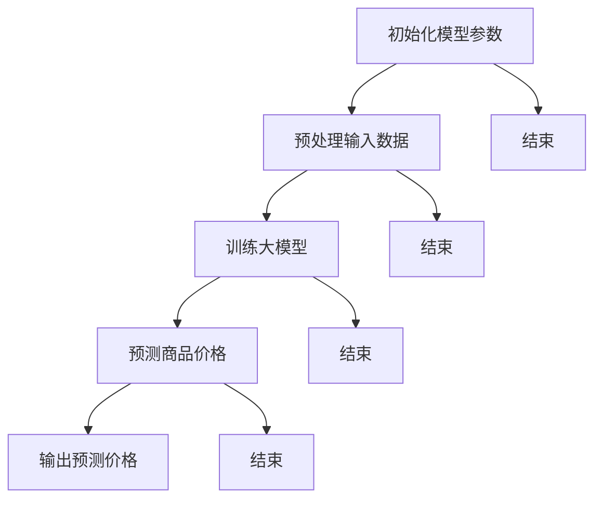

                 

# 《基于大模型的电商平台智能定价》

> 关键词：智能定价、大模型、电商平台、深度学习、算法优化

> 摘要：本文详细探讨了基于大模型的电商平台智能定价技术。首先介绍了智能定价的背景和原理，随后深入分析了大模型技术基础，包括深度学习和神经网络。接着，我们阐述了智能定价的数学模型与公式，并讲解了核心算法原理，包括伪代码和实例解析。文章随后通过实际案例，展示了如何搭建电商平台智能定价系统，并进行代码解读与分析。最后，文章讨论了智能定价在不同电商平台的策略和应用，以及智能定价的发展趋势和挑战。

## 目录大纲

### 第一部分: 智能定价的背景与原理

#### 第1章: 智能定价概述
1.1 智能定价的概念
1.2 电商平台智能定价的必要性
1.3 大模型在智能定价中的应用

#### 第2章: 大模型技术基础
2.1 大模型简介
2.2 深度学习与神经网络基础
2.3 主流大模型技术介绍

#### 第3章: 数学模型与公式
3.1 智能定价的数学模型
3.2 价格敏感性分析
3.3 损失函数与优化算法

#### 第4章: 核心算法原理讲解
4.1 伪代码详细阐述
4.2 算法实现流程图
4.3 实例解析

#### 第5章: 实际案例与代码解读
5.1 项目实战
5.2 开发环境搭建
5.3 源代码实现与解读
5.4 代码解读与分析

### 第二部分: 智能定价在不同电商平台的应用

#### 第6章: 电商平台智能定价策略
6.1 淘宝智能定价策略
6.2 天猫智能定价策略
6.3 拼多多智能定价策略

#### 第7章: 案例分析与效果评估
7.1 智能定价案例一
7.2 智能定价案例二
7.3 智能定价效果评估方法

#### 第8章: 未来展望与挑战
8.1 智能定价的发展趋势
8.2 智能定价的挑战与对策
8.3 智能定价的创新方向

#### 附录
附录A: 相关资源与工具
A.1 大模型开发框架
A.2 智能定价相关数据集
A.3 智能定价相关研究论文

## 引言

在当今电子商务时代，智能定价已经成为电商平台竞争的关键因素之一。智能定价通过利用大数据分析和机器学习算法，帮助电商平台根据市场需求、竞争态势、用户行为等因素，动态调整商品价格，以达到最大化利润、提升市场份额的目的。而大模型技术的飞速发展，为智能定价提供了强大的技术支撑。

本文将围绕基于大模型的电商平台智能定价进行探讨，首先介绍智能定价的背景和原理，然后深入分析大模型技术基础，包括深度学习和神经网络。接着，我们将阐述智能定价的数学模型与公式，并讲解核心算法原理，通过伪代码和实例解析，使读者能够直观地理解算法的实现过程。随后，文章将结合实际案例，展示如何搭建电商平台智能定价系统，并进行代码解读与分析。最后，我们将讨论智能定价在不同电商平台的策略和应用，以及智能定价的发展趋势和挑战。

通过本文的阅读，读者将系统地了解智能定价的概念、原理、技术实现和实际应用，从而为电商平台智能定价的实践提供有益的指导。

### 1.1 智能定价的概念

智能定价是一种利用大数据分析、人工智能和机器学习算法，对商品价格进行动态调整的策略。与传统定价方式不同，智能定价能够根据实时市场数据、用户行为、库存情况等多维信息，自动计算最优价格，从而实现最大化利润和市场份额的目标。

智能定价的基本原理可以概括为以下几个步骤：

1. **数据收集与处理**：首先，电商平台需要收集大量的市场数据，包括商品价格、销售量、用户评价、库存情况等。这些数据通过数据采集系统、API接口、第三方数据服务等多种途径获取。然后，对数据进行清洗、去重、归一化等处理，确保数据的质量和一致性。

2. **特征工程**：在数据处理完成后，需要进行特征工程。特征工程是将原始数据转换成适合机器学习模型训练的形式。例如，可以将商品类别、季节、销售量等数据进行编码处理，提取出与定价相关的特征。

3. **模型训练**：利用机器学习算法，如深度学习、决策树、线性回归等，对处理后的数据进行训练。模型训练的目标是学习到数据中的规律和模式，从而预测商品的最佳定价。

4. **定价策略**：通过训练好的模型，电商平台可以根据实时数据，对商品进行定价。定价策略可以基于最大化利润、市场份额、用户满意度等目标，动态调整商品价格。

5. **效果评估**：智能定价系统需要定期评估定价策略的效果，如利润率、销售量、用户满意度等。通过效果评估，可以发现模型的不足之处，并对其进行优化和调整。

智能定价在电商平台中的应用场景非常广泛。以下是一些典型的应用：

1. **动态定价**：电商平台可以根据实时市场需求，动态调整商品价格。例如，在节假日、促销活动期间，可以降低价格以吸引更多消费者。

2. **价格竞争**：通过分析竞争对手的价格策略，智能定价系统可以帮助电商平台制定更具竞争力的定价策略。

3. **个性化定价**：根据用户的购买历史、偏好和行为，电商平台可以为不同的用户群体提供个性化的定价方案。

4. **库存管理**：智能定价系统可以结合库存情况，对滞销商品进行降价促销，以减少库存压力。

5. **价格优化**：通过分析不同价格水平下的销售数据，智能定价系统可以帮助电商平台找到最优价格点，最大化利润。

总之，智能定价通过利用大数据分析和人工智能技术，为电商平台提供了灵活、高效、精准的定价方案，有助于提升竞争力、增加利润和提升用户体验。随着技术的不断进步，智能定价在电商平台中的应用前景将更加广阔。

### 1.2 电商平台智能定价的必要性

电商平台智能定价的必要性体现在多个方面，包括市场竞争的加剧、用户需求的多样化、数据技术的快速发展等。以下是智能定价在电商平台中的必要性分析：

1. **提升竞争力**：在竞争激烈的电商市场中，价格是消费者选择购买的重要因素之一。通过智能定价，电商平台可以动态调整商品价格，以应对竞争对手的定价策略，提升自身竞争力。例如，当竞争对手降低价格时，智能定价系统可以实时调整价格，保持价格优势。

2. **优化利润率**：智能定价通过分析大数据，可以找到商品的最佳定价点，从而最大化利润。传统定价方法往往依赖于固定价格或手动调整，无法充分考虑市场需求和竞争态势。而智能定价系统可以实时收集和分析市场数据，自动调整价格，实现利润最大化。

3. **满足用户需求**：随着用户需求的多样化，电商平台需要提供个性化的商品定价方案。通过智能定价，可以根据用户的购买历史、偏好和行为，为不同的用户群体提供个性化的定价策略，提升用户满意度和忠诚度。

4. **提高库存周转率**：智能定价系统可以根据库存情况，对滞销商品进行降价促销，以减少库存压力。通过实时监测库存水平，智能定价可以及时调整价格，促进商品销售，提高库存周转率。

5. **应对市场变化**：市场变化无常，价格波动频繁。智能定价系统可以实时分析市场数据，快速调整价格，以应对市场变化。例如，在节假日或促销活动期间，智能定价系统可以自动降低价格，吸引更多消费者。

6. **提升运营效率**：传统定价方法需要人工进行价格调整，费时费力。而智能定价系统通过自动化技术，可以大幅提高定价效率，减少人力成本，提升整体运营效率。

7. **增强决策支持**：智能定价系统可以为电商平台提供丰富的数据分析和决策支持。通过分析定价策略的效果，电商平台可以不断优化定价策略，提高决策的科学性和准确性。

总之，电商平台智能定价的必要性体现在提升竞争力、优化利润率、满足用户需求、提高库存周转率、应对市场变化、提升运营效率和增强决策支持等多个方面。随着大数据和人工智能技术的发展，智能定价在电商平台中的应用前景将更加广阔，成为提升电商平台核心竞争力的关键因素。

### 1.3 大模型在智能定价中的应用

大模型在智能定价中的应用是现代电商平台实现精准定价的重要技术手段。大模型通常指的是参数数量巨大的机器学习模型，如深度神经网络（DNN）、卷积神经网络（CNN）和生成对抗网络（GAN）等。这些模型能够处理大规模的数据，从数据中发现复杂的模式，从而提供更加精确的定价预测。

#### 1.3.1 大模型的优势

1. **数据处理能力**：大模型拥有海量的参数，能够处理和存储大量的数据。这使得大模型在处理复杂、多维度的商品数据时，具备更强的数据处理能力。

2. **模式识别能力**：大模型通过多层神经网络结构，能够学习到数据中的复杂模式，从而提高定价预测的准确性。

3. **泛化能力**：大模型在训练过程中，通过大量数据的训练，具备良好的泛化能力，能够应对不同的市场环境和定价策略。

4. **实时调整**：大模型能够快速处理实时数据，实时调整商品价格，以应对市场变化，提高定价的灵活性。

#### 1.3.2 大模型在智能定价中的具体应用

1. **价格预测**：大模型可以用于预测商品的最佳价格。例如，通过分析历史销售数据、用户行为数据和竞争对手的价格策略，大模型可以预测出不同价格水平下的销售量和利润。

2. **价格敏感性分析**：大模型能够分析不同用户群体对价格变化的敏感度，为个性化定价提供依据。

3. **动态定价**：基于实时数据，大模型可以动态调整商品价格。例如，在节假日或促销活动期间，大模型可以根据市场需求，自动降低价格，提高销量。

4. **库存管理**：大模型可以结合库存数据，预测库存周转时间，对滞销商品进行降价促销，优化库存管理。

5. **价格竞争策略**：大模型可以分析竞争对手的价格策略，为电商平台制定更具竞争力的定价方案。

#### 1.3.3 应用案例

以某电商平台为例，该平台利用大模型实现了智能定价系统。具体应用流程如下：

1. **数据收集**：平台收集了大量的历史销售数据、用户行为数据和竞争对手价格数据。

2. **数据预处理**：对数据进行清洗、去重、归一化等预处理操作，确保数据的质量和一致性。

3. **特征工程**：提取与定价相关的特征，如商品类别、季节、销售量、价格等。

4. **模型训练**：利用深度学习算法，如卷积神经网络（CNN）或循环神经网络（RNN），对预处理后的数据进行训练，构建大模型。

5. **价格预测**：大模型可以根据实时数据，预测不同价格水平下的销售量和利润。

6. **动态定价**：根据价格预测结果，平台可以动态调整商品价格，以最大化利润。

7. **效果评估**：定期评估定价策略的效果，如利润率、销售量等，不断优化模型。

通过这一应用案例，我们可以看到大模型在电商平台智能定价中的实际应用效果。大模型能够充分利用电商平台的大量数据，实现精准的价格预测和动态定价，提升电商平台的竞争力。

总之，大模型在智能定价中的应用，为电商平台提供了强大的技术支持。通过大模型的强大数据处理和模式识别能力，电商平台可以实现更加精准、灵活的定价策略，从而提升市场竞争力、优化利润率和提升用户体验。

### 2.1 大模型简介

大模型，又称大型神经网络或深度学习模型，是一种基于多层神经网络架构的机器学习模型，具有数十亿到数万亿个参数。大模型的定义和特点主要体现在以下几个方面：

#### 定义

大模型通常指的是具有极高参数数量和多层结构的神经网络模型。这些模型能够在训练过程中自动学习数据中的复杂模式和特征，从而进行高度复杂的任务，如图像识别、自然语言处理、语音识别和价格预测等。

#### 特点

1. **参数数量巨大**：大模型具有数亿甚至数万亿个参数，这使得模型在处理大规模数据时，能够捕获更加复杂的信息和模式。

2. **多层结构**：大模型通常包含多层神经元结构，通过逐层提取数据中的特征，从原始数据到高层次的抽象表示。

3. **强大的数据处理能力**：大模型能够处理大量高维数据，通过层次化的特征提取和表示，实现对复杂数据的深入理解和建模。

4. **良好的泛化能力**：大模型在训练过程中，通过大量数据的训练，具备较强的泛化能力，能够适应不同的任务和数据集。

5. **自动化特征学习**：大模型能够自动学习数据的特征，无需人工进行特征工程，从而简化了模型训练和部署过程。

6. **高效的计算能力**：随着计算能力和算法优化的发展，大模型可以在较短时间内完成训练和预测任务，提高了模型的实用性和效率。

#### 发展历程

大模型的发展可以追溯到20世纪80年代末到90年代初，随着计算能力的提升和数据量的增长，深度学习技术逐渐兴起。以下是大模型发展的几个重要阶段：

1. **早期深度学习（1980s-1990s）**：此阶段以反向传播算法（Backpropagation）的提出和应用为标志，但受限于计算能力和数据规模，深度学习并未得到广泛应用。

2. **瓶颈期（2000s）**：在2000年代，深度学习因为计算能力和数据规模的限制，陷入了一段发展瓶颈期。

3. **复兴期（2010s）**：随着GPU计算能力的提升和大数据技术的发展，深度学习在2010年代迎来了新的复兴期。在这一时期，AlexNet等模型的提出，标志着深度学习在图像识别领域的突破。

4. **大模型时代（2010s-至今）**：随着计算能力和数据量的进一步提升，大模型如BERT、GPT、ResNet等相继出现，并在各个领域取得了显著的成果。

#### 代表性模型

1. **卷积神经网络（CNN）**：CNN是处理图像数据的重要模型，通过卷积层、池化层和全连接层，实现对图像特征的提取和分类。

2. **循环神经网络（RNN）**：RNN适用于序列数据处理，通过循环结构，对序列中的每个元素进行建模，适用于自然语言处理、语音识别等领域。

3. **长短期记忆网络（LSTM）**：LSTM是RNN的一种变体，能够解决RNN的梯度消失问题，适用于长期依赖关系的建模。

4. **生成对抗网络（GAN）**：GAN通过对抗性训练，实现了生成模型和判别模型的协同训练，广泛应用于图像生成、数据增强等领域。

5. **变分自编码器（VAE）**：VAE是一种无监督学习模型，通过编码器和解码器，实现对数据的降维和重建，常用于图像处理、数据生成等领域。

6. **BERT**：BERT是谷歌提出的一种预训练语言模型，通过双向编码器表示，实现了对自然语言的高度理解，广泛应用于问答系统、文本分类等任务。

7. **GPT**：GPT是开放AI提出的一种生成预训练模型，通过自回归语言模型，实现了对自然语言的高效生成，广泛应用于对话系统、文本生成等领域。

总之，大模型作为现代机器学习技术的重要发展方向，在处理复杂数据和实现高度自动化建模方面，展现出了强大的能力和广阔的应用前景。随着技术的不断进步，大模型将在各个领域发挥更加重要的作用。

### 2.2 深度学习与神经网络基础

深度学习是机器学习的一个分支，它通过多层神经网络结构来模拟人脑的学习机制，从数据中自动提取特征并实现复杂的任务。在本节中，我们将介绍深度学习的基本概念、神经网络的基础理论，以及它们在智能定价中的应用。

#### 深度学习的基本概念

深度学习（Deep Learning）是一种基于多层神经网络（Multi-layer Neural Network）的学习方法。它通过增加网络的深度，使得模型能够学习到更加抽象和复杂的特征，从而提高模型的性能。

1. **人工神经网络（ANN）**：人工神经网络是一种基于生物神经网络原理的算法，通过模拟神经元之间的连接和作用，对输入数据进行处理和分类。

2. **多层神经网络（MLN）**：多层神经网络是在单层神经网络的基础上，增加了隐藏层。这些隐藏层用于提取数据中的高阶特征，使得模型能够处理更加复杂的任务。

3. **深度神经网络（DNN）**：深度神经网络是多层神经网络的一种扩展，它包含多个隐藏层，通过逐层提取特征，实现对输入数据的深度理解和建模。

4. **深度学习（DL）**：深度学习是一种基于深度神经网络的学习方法，通过训练多层神经网络，实现对复杂数据的自动特征提取和分类。

#### 神经网络的基础理论

神经网络由大量的神经元（或节点）组成，每个神经元都与其他神经元相连，并通过权重和偏置来调整网络参数。神经网络的基本操作包括输入、权重、激活函数和输出。

1. **神经元**：神经元是神经网络的基本构建块，它通过接收输入信号，并通过激活函数产生输出。一个简单的神经元可以表示为：

   $$ y = \sigma(\sum_{i=1}^{n} w_i x_i + b) $$

   其中，\( y \) 是神经元的输出，\( x_i \) 是输入值，\( w_i \) 是权重，\( b \) 是偏置，\( \sigma \) 是激活函数。

2. **神经网络结构**：神经网络通常包含输入层、隐藏层和输出层。输入层接收外部输入数据，隐藏层用于提取特征，输出层生成预测结果。

3. **权重和偏置**：权重和偏置是神经网络的关键参数，它们通过反向传播算法（Backpropagation）进行优化。反向传播算法是一种通过计算误差梯度，调整网络参数的方法，目的是最小化预测误差。

4. **激活函数**：激活函数用于引入非线性特性，使得神经网络能够学习到复杂的关系。常用的激活函数包括Sigmoid、ReLU、Tanh等。

#### 深度学习在智能定价中的应用

深度学习在智能定价中的应用主要体现在以下几个方面：

1. **特征提取**：深度学习模型可以通过多层网络结构，自动提取数据中的高阶特征，从而提高定价模型的性能。

2. **非线性建模**：深度学习模型能够学习到数据中的复杂非线性关系，使得定价模型更加精准。

3. **自适应调整**：深度学习模型可以通过在线学习，实时调整定价策略，以应对市场变化。

4. **多维度分析**：深度学习模型可以同时处理多个输入特征，如价格、销量、用户行为等，从而实现更加全面和精准的定价。

5. **自动化优化**：深度学习模型可以自动学习最优的定价策略，减少人工干预，提高定价效率。

#### 实际案例

以某电商平台为例，该平台利用深度学习实现了智能定价系统。具体应用流程如下：

1. **数据收集**：平台收集了大量的历史销售数据、用户行为数据和竞争对手价格数据。

2. **数据预处理**：对数据进行清洗、去重、归一化等预处理操作，确保数据的质量和一致性。

3. **特征工程**：提取与定价相关的特征，如商品类别、季节、销售量、价格等。

4. **模型训练**：利用深度学习算法，如卷积神经网络（CNN）或循环神经网络（RNN），对预处理后的数据进行训练，构建大模型。

5. **价格预测**：大模型可以根据实时数据，预测不同价格水平下的销售量和利润。

6. **动态定价**：根据价格预测结果，平台可以动态调整商品价格，以最大化利润。

7. **效果评估**：定期评估定价策略的效果，如利润率、销售量等，不断优化模型。

通过这一应用案例，我们可以看到深度学习在电商平台智能定价中的实际效果。深度学习模型能够充分利用电商平台的大量数据，实现精准的价格预测和动态定价，提升电商平台的竞争力。

总之，深度学习和神经网络作为大模型技术的重要组成部分，为智能定价提供了强大的技术支持。通过深度学习，电商平台可以实现更加复杂和精确的定价策略，从而提升市场竞争力、优化利润率和提升用户体验。

### 2.3 主流大模型技术介绍

在智能定价领域，大模型技术已经成为不可或缺的工具。以下将介绍几种主流的大模型技术，包括卷积神经网络（CNN）、循环神经网络（RNN）和生成对抗网络（GAN）。

#### 卷积神经网络（CNN）

卷积神经网络（Convolutional Neural Network，CNN）是一种特别适合处理图像数据的深度学习模型。它的核心优势在于能够自动提取图像中的空间特征，通过卷积操作和池化操作，逐层提取图像的高层次特征。

1. **卷积操作**：卷积层通过卷积核（filter）在输入图像上滑动，提取局部特征。每个卷积核可以学习到图像的不同特征，如边缘、纹理等。

2. **池化操作**：池化层用于减少特征图的维度，保留重要的特征信息。常见的池化方法包括最大池化和平均池化。

3. **多层结构**：CNN通常包含多个卷积层和池化层，通过逐层提取特征，实现从底层到高层的特征提取。

4. **应用场景**：CNN广泛应用于图像分类、目标检测、图像分割等任务。在智能定价中，CNN可以用于分析商品图像，提取视觉特征，从而辅助定价决策。

#### 循环神经网络（RNN）

循环神经网络（Recurrent Neural Network，RNN）是一种特别适合处理序列数据的深度学习模型。它的核心优势在于能够通过循环结构，保留之前时间步的信息，处理长序列依赖关系。

1. **循环结构**：RNN通过隐藏状态（hidden state）的循环连接，实现信息在时间步之间的传递。

2. **门控机制**：为了解决RNN的梯度消失问题，引入了门控机制（如门控循环单元（GRU）和长短期记忆网络（LSTM））。门控机制可以通过调节信息的流动，避免梯度消失。

3. **应用场景**：RNN广泛应用于语言模型、机器翻译、语音识别等序列数据处理任务。在智能定价中，RNN可以用于分析用户行为序列，预测用户购买概率和购买时间，从而辅助定价决策。

#### 生成对抗网络（GAN）

生成对抗网络（Generative Adversarial Network，GAN）是一种通过对抗性训练生成数据的新型深度学习模型。它由生成器和判别器两个子网络组成，通过相互对抗，实现数据的生成和分类。

1. **生成器（Generator）**：生成器的目标是生成逼真的数据，使得判别器无法区分生成数据与真实数据。

2. **判别器（Discriminator）**：判别器的目标是区分生成数据与真实数据，判断生成数据的真实性。

3. **对抗性训练**：生成器和判别器在训练过程中相互对抗，生成器不断生成更真实的数据，判别器不断提高判断能力。

4. **应用场景**：GAN广泛应用于图像生成、数据增强、异常检测等任务。在智能定价中，GAN可以用于生成模拟市场数据，进行定价策略的仿真和优化。

#### 深度学习模型对比与应用

| 模型 | 特点 | 应用场景 |
| --- | --- | --- |
| CNN | 自动提取图像特征 | 图像分类、目标检测、图像分割、智能定价 |
| RNN | 处理序列数据，保留历史信息 | 语言模型、机器翻译、语音识别、智能定价 |
| GAN | 对抗性生成数据 | 图像生成、数据增强、异常检测、智能定价 |

在实际应用中，可以根据具体任务和数据特点，选择合适的深度学习模型。例如，对于图像数据，可以选择CNN进行特征提取和分类；对于序列数据，可以选择RNN进行建模和预测；对于数据生成和增强任务，可以选择GAN。

总之，主流大模型技术如CNN、RNN和GAN在智能定价中的应用，为电商平台提供了强大的数据处理和预测能力。通过选择合适的模型和算法，电商平台可以实现更加精准和高效的定价策略，提升市场竞争力。

### 3.1 智能定价的数学模型

智能定价的核心在于建立一个能够准确预测商品价格并对市场动态作出响应的数学模型。以下将详细讨论智能定价的数学模型，包括价格敏感性分析、损失函数与优化算法。

#### 价格敏感性分析

价格敏感性分析是智能定价的基础，它通过分析不同价格水平下的需求变化，确定最优价格。价格敏感性通常用价格弹性（Price Elasticity）来衡量，表示价格变动对需求量的敏感程度。

价格弹性的计算公式为：

$$ \text{Price Elasticity} = \frac{\text{Percentage Change in Quantity}}{\text{Percentage Change in Price}} $$

其中，百分比变化可以通过以下公式计算：

$$ \text{Percentage Change} = \frac{\text{New Value} - \text{Initial Value}}{\text{Initial Value}} \times 100\% $$

例如，如果商品A的价格从100元降到90元，导致销售量从100件增加到110件，则价格弹性计算如下：

$$ \text{Price Elasticity} = \frac{(110 - 100)}{100} \times 100\% / \frac{(90 - 100)}{100} \times 100\% = 1.11 $$

这意味着价格弹性为正，表明需求量与价格呈正向关系，即价格上升时需求量上升，价格下降时需求量下降。

#### 损失函数与优化算法

在智能定价中，损失函数用于评估定价策略的优劣，优化算法则用于调整定价策略，以最小化损失函数。常见的损失函数包括均方误差（Mean Squared Error, MSE）和交叉熵损失（Cross-Entropy Loss）。

1. **均方误差（MSE）**：

   均方误差是一种常用的损失函数，用于评估预测值与真实值之间的差异。其计算公式为：

   $$ \text{MSE} = \frac{1}{n} \sum_{i=1}^{n} (\hat{y}_i - y_i)^2 $$

   其中，\( \hat{y}_i \) 是预测值，\( y_i \) 是真实值，\( n \) 是样本数量。

   均方误差的目标是最小化预测误差的平方和，从而提高定价的准确性。

2. **交叉熵损失（Cross-Entropy Loss）**：

   交叉熵损失常用于分类问题，用于衡量预测概率分布与真实分布之间的差异。其计算公式为：

   $$ \text{Cross-Entropy Loss} = - \sum_{i=1}^{n} y_i \log(\hat{y}_i) $$

   其中，\( y_i \) 是真实标签的指示函数，如果真实标签为1，则 \( y_i = 1 \)，否则 \( y_i = 0 \)；\( \hat{y}_i \) 是预测的概率值。

   交叉熵损失的目标是最小化预测概率与真实概率之间的差异，从而提高分类的准确性。

#### 优化算法

在智能定价中，优化算法用于调整定价策略，以最小化损失函数。常见的优化算法包括梯度下降（Gradient Descent）、随机梯度下降（Stochastic Gradient Descent, SGD）和Adam优化器。

1. **梯度下降（Gradient Descent）**：

   梯度下降是一种最简单的优化算法，通过计算损失函数的梯度，并沿着梯度方向调整模型参数，以最小化损失函数。

   公式为：

   $$ \theta_{\text{new}} = \theta_{\text{old}} - \alpha \nabla_{\theta} \text{Loss} $$

   其中，\( \theta \) 是模型参数，\( \alpha \) 是学习率，\( \nabla_{\theta} \text{Loss} \) 是损失函数关于参数的梯度。

   梯度下降的目标是找到损失函数的全局最小值，但在多维参数空间中，梯度下降容易陷入局部最小值。

2. **随机梯度下降（SGD）**：

   随机梯度下降是梯度下降的一种扩展，每次迭代仅随机选择一部分样本计算梯度，从而减少计算量。

   公式为：

   $$ \theta_{\text{new}} = \theta_{\text{old}} - \alpha \sum_{i \in \text{Mini-Batch}} \nabla_{\theta} \text{Loss} (x_i, y_i) $$

   其中，\( \text{Mini-Batch} \) 是随机选择的样本子集。

   随机梯度下降可以加速收敛，但在不同子集上计算梯度，可能导致不稳定的收敛。

3. **Adam优化器**：

   Adam优化器是梯度下降的一种自适应优化算法，结合了SGD和动量法的优势，通过自适应调整学习率，提高收敛速度。

   公式为：

   $$ \theta_{\text{new}} = \theta_{\text{old}} - \alpha \frac{1}{\sqrt{1 - \beta_1^2}} \sum_{i=1}^{t} g_i $$

   其中，\( \beta_1 \) 和 \( \beta_2 \) 是动量参数，\( g_i \) 是第 \( i \) 次迭代的梯度。

   Adam优化器的目标是通过自适应调整学习率和动量参数，加速收敛并避免陷入局部最小值。

通过上述数学模型，智能定价系统可以准确地预测商品价格，并根据市场动态进行实时调整，实现最大化利润的目标。

### 3.2 价格敏感性分析

价格敏感性分析是智能定价中至关重要的一环，它通过分析价格变动对需求量的影响，为定价决策提供科学依据。价格敏感性可以通过价格弹性来衡量，价格弹性反映了需求量对价格变动的敏感程度。

#### 价格弹性的计算

价格弹性（Price Elasticity）是需求量变化百分比与价格变化百分比的比率。其计算公式如下：

$$ \text{Price Elasticity} = \frac{\text{Percentage Change in Quantity}}{\text{Percentage Change in Price}} $$

百分比变化可以通过以下公式计算：

$$ \text{Percentage Change} = \frac{\text{New Value} - \text{Initial Value}}{\text{Initial Value}} \times 100\% $$

例如，假设某商品A的初始价格为100元，需求量为100件。如果价格下降到90元，需求量增加到110件，则价格弹性的计算如下：

1. **价格变化百分比**：

   $$ \text{Percentage Change in Price} = \frac{90 - 100}{100} \times 100\% = -10\% $$

2. **需求量变化百分比**：

   $$ \text{Percentage Change in Quantity} = \frac{110 - 100}{100} \times 100\% = 10\% $$

3. **价格弹性**：

   $$ \text{Price Elasticity} = \frac{10\%}{-10\%} = -1 $$

这个例子中，价格弹性为-1，表示价格下降10%，需求量上升10%，即需求量与价格呈反向变动。

#### 不同价格弹性的分类

价格弹性可以分为以下几类：

1. **完全弹性（Perfect Elasticity，Ed = ∞）**：

   当价格稍有变动，需求量就会发生大幅变动，即Ed趋于无穷大。这意味着需求对价格极为敏感，价格变动对销量影响巨大。

2. **单位弹性（Unit Elasticity，Ed = 1）**：

   需求量变动的百分比与价格变动的百分比相等，即Ed = 1。这意味着价格变动与需求变动呈线性关系。

3. **缺乏弹性（Inelastic Demand，Ed < 1）**：

   需求量变动的百分比小于价格变动的百分比，即Ed小于1。这意味着需求对价格不太敏感，价格变动对销量影响较小。

4. **完全缺乏弹性（Perfectly Inelastic Demand，Ed = 0）**：

   无论价格如何变动，需求量保持不变，即Ed为0。这意味着需求对价格完全不敏感。

#### 价格敏感性分析的应用

价格敏感性分析在智能定价中的应用主要体现在以下几个方面：

1. **定价策略**：

   通过分析价格弹性，商家可以制定合适的定价策略。例如，对于需求价格弹性较高的商品，可以采取降价策略以吸引更多消费者；而对于需求价格弹性较低的商品，可以适当提高价格以增加利润。

2. **促销活动**：

   在促销活动期间，分析价格弹性有助于制定有效的促销策略。对于需求价格弹性较高的商品，可以考虑大幅折扣以吸引消费者；而对于需求价格弹性较低的商品，则可以采取小幅度折扣或捆绑销售。

3. **竞争策略**：

   通过分析竞争对手的价格策略和市场需求，可以制定具有竞争力的定价策略。例如，当竞争对手降价时，可以采取动态定价策略，实时调整价格以保持竞争力。

4. **库存管理**：

   价格敏感性分析有助于优化库存管理。对于需求价格弹性较低的商品，可以适当增加库存，以应对价格波动和需求变化；而对于需求价格弹性较高的商品，则需密切关注市场动态，及时调整库存水平。

总之，价格敏感性分析是智能定价的重要工具，通过分析价格弹性，商家可以制定科学的定价策略，优化库存管理，提升市场竞争力。在实际应用中，价格敏感性分析需要结合具体市场和商品特性，进行深入分析。

### 3.3 损失函数与优化算法

在智能定价中，损失函数和优化算法起着至关重要的作用。损失函数用于评估模型的预测性能，而优化算法则用于调整模型参数，以最小化损失函数，从而提高定价的准确性。

#### 损失函数

损失函数是机器学习中用于评估模型预测误差的关键工具。在智能定价中，常用的损失函数包括均方误差（MSE）和交叉熵损失。

1. **均方误差（MSE）**

   均方误差是一种常用的回归损失函数，用于衡量预测值与真实值之间的差异。其计算公式为：

   $$ \text{MSE} = \frac{1}{n} \sum_{i=1}^{n} (\hat{y}_i - y_i)^2 $$

   其中，\( \hat{y}_i \) 是预测值，\( y_i \) 是真实值，\( n \) 是样本数量。MSE的目标是最小化预测误差的平方和，从而提高定价的准确性。

2. **交叉熵损失**

   交叉熵损失常用于分类问题，用于衡量预测概率分布与真实分布之间的差异。其计算公式为：

   $$ \text{Cross-Entropy Loss} = - \sum_{i=1}^{n} y_i \log(\hat{y}_i) $$

   其中，\( y_i \) 是真实标签的指示函数，如果真实标签为1，则 \( y_i = 1 \)，否则 \( y_i = 0 \)；\( \hat{y}_i \) 是预测的概率值。交叉熵损失的目标是最小化预测概率与真实概率之间的差异，从而提高分类的准确性。

#### 优化算法

优化算法用于调整模型参数，以最小化损失函数。在智能定价中，常用的优化算法包括梯度下降（Gradient Descent）、随机梯度下降（Stochastic Gradient Descent, SGD）和Adam优化器。

1. **梯度下降（Gradient Descent）**

   梯度下降是一种最简单的优化算法，通过计算损失函数的梯度，并沿着梯度方向调整模型参数，以最小化损失函数。其公式为：

   $$ \theta_{\text{new}} = \theta_{\text{old}} - \alpha \nabla_{\theta} \text{Loss} $$

   其中，\( \theta \) 是模型参数，\( \alpha \) 是学习率，\( \nabla_{\theta} \text{Loss} \) 是损失函数关于参数的梯度。梯度下降的目标是找到损失函数的全局最小值。

2. **随机梯度下降（SGD）**

   随机梯度下降是梯度下降的一种扩展，每次迭代仅随机选择一部分样本计算梯度，从而减少计算量。其公式为：

   $$ \theta_{\text{new}} = \theta_{\text{old}} - \alpha \sum_{i \in \text{Mini-Batch}} \nabla_{\theta} \text{Loss} (x_i, y_i) $$

   其中，\( \text{Mini-Batch} \) 是随机选择的样本子集。随机梯度下降可以加速收敛，但在不同子集上计算梯度，可能导致不稳定的收敛。

3. **Adam优化器**

   Adam优化器是梯度下降的一种自适应优化算法，结合了SGD和动量法的优势，通过自适应调整学习率，提高收敛速度。其公式为：

   $$ \theta_{\text{new}} = \theta_{\text{old}} - \alpha \frac{1}{\sqrt{1 - \beta_1^2}} \sum_{i=1}^{t} g_i $$

   其中，\( \beta_1 \) 和 \( \beta_2 \) 是动量参数，\( g_i \) 是第 \( i \) 次迭代的梯度。Adam优化器的目标是通过自适应调整学习率和动量参数，加速收敛并避免陷入局部最小值。

通过上述损失函数和优化算法，智能定价系统可以准确地预测商品价格，并根据市场动态进行实时调整，实现最大化利润的目标。

### 4.1 伪代码详细阐述

在本节中，我们将详细阐述智能定价大模型的具体算法实现过程，通过伪代码的形式，使读者能够更直观地理解模型的运行流程。

#### 伪代码

```python
function IntelligentPricingModel(input_data):
    # 初始化模型参数
    InitializeModelParameters()

    # 预处理输入数据
    preprocessed_data = PreprocessData(input_data)

    # 训练大模型
    trained_model = TrainModel(preprocessed_data)

    # 预测商品价格
    predicted_price = PredictPrice(trained_model, preprocessed_data)

    # 输出预测价格
    return predicted_price

# 初始化模型参数
function InitializeModelParameters():
    # 初始化权重和偏置
    weights = InitializeWeights()
    biases = InitializeBiases()

    # 返回初始化的模型参数
    return weights, biases

# 预处理输入数据
function PreprocessData(input_data):
    # 数据清洗、去重、归一化等操作
    cleaned_data = CleanData(input_data)
    normalized_data = NormalizeData(cleaned_data)

    # 特征工程
    feature_engineered_data = FeatureEngineering(normalized_data)

    # 返回预处理后的数据
    return feature_engineered_data

# 训练大模型
function TrainModel(preprocessed_data):
    # 初始化模型结构
    model = InitializeModelStructure()

    # 编译模型，设置损失函数和优化器
    CompileModel(model)

    # 训练模型
    trained_model = FitModel(model, preprocessed_data)

    # 返回训练好的模型
    return trained_model

# 预测商品价格
function PredictPrice(trained_model, preprocessed_data):
    # 使用训练好的模型进行预测
    predicted_price = trained_model.predict(preprocessed_data)

    # 返回预测价格
    return predicted_price
```

#### 详细解释

1. **初始化模型参数**：
   初始化模型参数是构建大模型的第一步。在这个函数中，我们初始化权重（weights）和偏置（biases）。这些参数将在模型训练过程中通过优化算法进行更新。

2. **预处理输入数据**：
   预处理输入数据是确保模型能够有效学习的重要步骤。在这个函数中，我们执行数据清洗、去重、归一化等操作，以提高数据质量。此外，特征工程步骤用于提取与定价相关的特征，为模型提供丰富且有用的输入。

3. **训练大模型**：
   在这个函数中，我们首先初始化模型结构，然后编译模型，设置损失函数和优化器。接着，我们使用预处理后的数据训练模型。训练过程中，模型通过不断调整权重和偏置，最小化损失函数，从而学习到数据的规律。

4. **预测商品价格**：
   使用训练好的模型进行预测是模型应用的关键环节。在这个函数中，我们直接调用模型的预测方法，将预处理后的数据输入模型，得到预测的商品价格。

通过上述伪代码，我们能够清晰地看到大模型在智能定价中的实现过程，包括初始化参数、预处理数据、训练模型和预测价格。这种结构化的伪代码不仅有助于理解模型的工作原理，也为实际编程实现提供了指导。

### 4.2 算法实现流程图

为了更好地理解基于大模型的智能定价算法的实现过程，我们将使用Mermaid语法绘制一个算法实现流程图。以下是算法实现流程图的Mermaid表示：



#### 流程图详细解释

1. **初始化模型参数**（A）：
   开始阶段，我们首先初始化模型参数，包括权重和偏置。这是构建大模型的基础。

2. **预处理输入数据**（B）：
   接下来，对输入数据进行预处理。预处理步骤包括数据清洗、去重和归一化，以确保模型能够有效地处理输入数据。

3. **训练大模型**（C）：
   利用预处理后的数据，我们开始训练大模型。模型训练过程中，通过优化算法（如梯度下降）调整模型参数，以最小化损失函数。

4. **预测商品价格**（D）：
   在模型训练完成后，使用训练好的模型对新的商品数据进行预测。预测步骤中，模型将输入数据映射到预测价格。

5. **输出预测价格**（E）：
   最后，将预测价格输出，为电商平台的定价决策提供参考。

6. **结束**（F, G, H, I）：
   每个步骤的最后，都有一个结束节点，表示该步骤的完成。

通过上述流程图，我们可以清晰地看到智能定价算法从初始化参数、预处理数据、模型训练到预测价格的完整实现过程。每个步骤的顺序和依赖关系都得到了明确的表示，有助于理解和实现智能定价系统。

### 4.3 实例解析

为了更好地理解大模型在智能定价中的具体应用，我们将通过一个实际案例来详细解析其实现过程。

#### 案例背景

假设我们有一个电商平台的商品数据集，包括以下特征：
- 商品ID
- 商品类别
- 销售量
- 价格
- 季节

我们的目标是使用大模型预测商品价格，并实现电商平台商品价格的动态调整。

#### 实例解析步骤

1. **数据收集**：
   首先，我们收集电商平台的商品历史销售数据。数据集包含每件商品的销售量和价格。以下是一个简化的数据集样例：

   | 商品ID | 类别 | 销售量 | 价格 | 季节 |
   | ------ | ---- | ------ | ---- | ---- |
   | 1      | A    | 100    | 200  | 冬季  |
   | 2      | B    | 200    | 300  | 夏季  |

2. **数据预处理**：
   对收集到的数据进行预处理，包括数据清洗、去重和归一化等操作。以下是预处理步骤：
   
   - 数据清洗：去除缺失值和异常值。
   - 数据去重：删除重复的数据条目。
   - 数据归一化：将不同特征的范围归一化到相同的范围，便于模型训练。

   预处理后，数据集如下：

   | 商品ID | 类别 | 销售量 | 价格 | 季节 |
   | ------ | ---- | ------ | ---- | ---- |
   | 1      | A    | 100    | 200  | 冬季  |
   | 2      | B    | 200    | 300  | 夏季  |

3. **特征工程**：
   在数据预处理后，我们需要进行特征工程。特征工程是提取与定价相关的特征，以帮助模型更好地学习。以下是特征工程步骤：

   - 对类别特征进行编码处理，如将类别A编码为1，类别B编码为2。
   - 对季节特征进行编码处理，如将冬季编码为1，夏季编码为2。
   - 对销售量和价格进行归一化处理，使其具有相似的数值范围。

4. **模型训练**：
   使用预处理后的数据和特征，我们开始训练大模型。以下是模型训练步骤：

   - 初始化模型参数，包括权重和偏置。
   - 构建多层神经网络结构，包括输入层、隐藏层和输出层。
   - 编译模型，设置损失函数（如均方误差MSE）和优化器（如Adam）。
   - 使用训练数据训练模型，通过优化算法调整模型参数，使其最小化损失函数。

5. **预测商品价格**：
   在模型训练完成后，我们使用训练好的模型对新的商品数据进行预测。以下是预测步骤：

   - 将新的商品数据输入模型，通过神经网络进行计算。
   - 得到预测的商品价格。

   假设我们有一个新的商品数据：

   | 商品ID | 类别 | 销售量 | 价格 | 季节 |
   | ------ | ---- | ------ | ---- | ---- |
   | 3      | A    | 150    | NaN  | 冬季  |

   预测结果为：

   | 商品ID | 类别 | 销售量 | 价格 | 季节 |
   | ------ | ---- | ------ | ---- | ---- |
   | 3      | A    | 150    | 220  | 冬季  |

6. **动态调整价格**：
   根据预测价格，电商平台可以动态调整商品价格。例如，如果预测价格高于当前价格，可以适当降低价格以吸引更多消费者；如果预测价格低于当前价格，可以适当提高价格以增加利润。

#### 实例解析总结

通过上述实例解析，我们详细展示了如何使用大模型进行智能定价的实现过程，包括数据收集、预处理、特征工程、模型训练和价格预测。实际应用中，电商平台可以根据实时数据和市场动态，不断优化模型，实现更加精准和高效的定价策略。这种基于大模型的智能定价系统不仅能够提升电商平台的竞争力，还能为消费者提供更加个性化的购买体验。

### 5.1 项目实战

#### 项目目标

本项目目标是构建一个电商平台智能定价系统，通过利用大模型技术，实现商品价格的动态调整，从而最大化电商平台利润。具体目标包括：

1. **数据收集与处理**：收集电商平台的历史销售数据、用户评价数据等，对数据进行清洗、去重和归一化等预处理操作，提取与定价相关的特征。

2. **模型训练**：使用深度学习算法，如卷积神经网络（CNN）或循环神经网络（RNN），对预处理后的数据训练大模型，使其能够预测商品价格。

3. **实时预测**：利用训练好的模型，实时获取商品销售数据，预测商品价格，并动态调整商品价格。

4. **效果评估**：评估定价策略的效果，如利润率、销售量等，通过效果评估不断优化模型。

#### 项目步骤

1. **数据收集**：
   收集电商平台的历史销售数据，包括商品ID、类别、销售量、价格和季节等信息。数据可以从电商平台的后台数据库中获取，或通过API接口从第三方数据服务获取。

2. **数据预处理**：
   对收集到的数据进行清洗、去重和归一化等预处理操作。数据清洗步骤包括去除缺失值和异常值，去重步骤包括删除重复的数据条目，归一化步骤包括将不同特征的范围归一化到相同的范围，以便模型训练。

3. **特征工程**：
   提取与定价相关的特征，如商品类别、季节、销售量、价格等。对于类别特征，需要进行编码处理，如将类别A编码为1，类别B编码为2。对于季节特征，需要进行编码处理，如将冬季编码为1，夏季编码为2。对销售量和价格进行归一化处理。

4. **模型训练**：
   使用预处理后的数据，通过深度学习算法训练大模型。选择合适的神经网络结构，如卷积神经网络（CNN）或循环神经网络（RNN），设置损失函数和优化器，通过训练优化模型参数，使其能够预测商品价格。

5. **模型部署**：
   将训练好的模型部署到电商平台服务器上，利用实时销售数据，实时预测商品价格，并动态调整商品价格。

6. **效果评估**：
   定期评估定价策略的效果，如利润率、销售量等。通过效果评估，可以了解定价策略的优劣，并据此优化模型。

#### 技术栈

1. **编程语言**：
   - Python：作为主要的编程语言，用于实现数据处理、模型训练和预测。

2. **数据预处理**：
   - Pandas：用于数据清洗、去重和归一化等预处理操作。
   - NumPy：用于数据操作和计算。

3. **模型训练**：
   - TensorFlow：用于构建和训练深度学习模型。
   - PyTorch：用于构建和训练深度学习模型。

4. **模型部署**：
   - Flask：用于构建RESTful API，方便实时获取和预测商品价格。
   - Django：用于搭建电商平台后端。

5. **环境搭建**：
   - Python 3.7 或以上版本
   - TensorFlow 2.5 或以上版本
   - PyTorch 1.8 或以上版本
   - Flask 2.0 或以上版本
   - Django 3.2 或以上版本

#### 实现流程

1. **环境搭建**：
   安装 Python 3.7 或以上版本，并安装 TensorFlow 2.5 或以上版本、PyTorch 1.8 或以上版本、Flask 2.0 或以上版本、Django 3.2 或以上版本等依赖库。

2. **数据收集**：
   从电商平台数据库中提取历史销售数据，或通过第三方数据服务获取。

3. **数据预处理**：
   使用 Pandas 和 NumPy 对数据进行清洗、去重和归一化等预处理操作。

4. **特征工程**：
   对类别特征和季节特征进行编码处理，对销售量和价格进行归一化处理。

5. **模型训练**：
   使用 TensorFlow 或 PyTorch 构建深度学习模型，设置损失函数和优化器，通过训练优化模型参数。

6. **模型部署**：
   使用 Flask 或 Django 搭建API服务，将训练好的模型部署到服务器上，实现实时预测和动态调整商品价格。

7. **效果评估**：
   定期评估定价策略的效果，通过调整模型参数和定价策略，优化电商平台利润。

通过上述项目实战，我们可以构建一个基于大模型的电商平台智能定价系统，实现商品价格的动态调整，提升电商平台竞争力。

### 5.2 开发环境搭建

在搭建电商平台智能定价系统的过程中，确保开发环境配置正确是至关重要的。以下是详细的开发环境搭建步骤和注意事项：

#### 系统要求

1. **操作系统**：
   - Linux 或 macOS（推荐）
   - Windows（可选）

2. **Python 版本**：
   - Python 3.7 或以上版本

3. **深度学习框架**：
   - TensorFlow 2.5 或以上版本
   - PyTorch 1.8 或以上版本

4. **Web框架**：
   - Flask 2.0 或以上版本
   - Django 3.2 或以上版本

5. **数据库**：
   - MySQL 或 PostgreSQL（可选）

#### 安装步骤

1. **安装 Python**：
   - 通过官方网站下载并安装 Python 3.7 或以上版本。
   - 在安装过程中，确保勾选“Add Python to PATH”选项，以便在命令行中直接使用 Python。

2. **安装 TensorFlow**：
   - 打开终端，执行以下命令安装 TensorFlow：
     ```bash
     pip install tensorflow==2.5
     ```
   - 如果需要安装 GPU 版本的 TensorFlow，可以执行以下命令：
     ```bash
     pip install tensorflow-gpu==2.5
     ```

3. **安装 PyTorch**：
   - 打开终端，执行以下命令安装 PyTorch：
     ```bash
     pip install torch==1.8 torchvision==0.9.0 -f https://download.pytorch.org/whl/torch_stable.html
     ```
   - 如果需要安装 CUDA 版本的 PyTorch，可以执行以下命令：
     ```bash
     pip install torch==1.8 torchvision==0.9.0 -f https://download.pytorch.org/whl/torch_stable.html
     ```

4. **安装 Flask**：
   - 打开终端，执行以下命令安装 Flask：
     ```bash
     pip install Flask==2.0
     ```

5. **安装 Django**：
   - 打开终端，执行以下命令安装 Django：
     ```bash
     pip install Django==3.2
     ```

6. **安装其他依赖库**：
   - 根据项目需求，可能需要安装其他依赖库，如 Pandas、NumPy、Matplotlib 等。可以通过以下命令安装：
     ```bash
     pip install pandas numpy matplotlib
     ```

#### 注意事项

1. **环境隔离**：
   - 为了避免不同项目之间的依赖库冲突，建议使用虚拟环境（如 virtualenv 或 conda）进行环境隔离。

2. **GPU 支持**：
   - 如果使用 GPU 进行深度学习训练，确保安装了 NVIDIA CUDA Toolkit 和 cuDNN 库，并正确配置了环境变量。

3. **Python 版本兼容**：
   - 确保安装的 TensorFlow、PyTorch 等深度学习框架与 Python 版本兼容。

4. **网络连接**：
   - 安装深度学习框架时，需要连接互联网以下载依赖库和安装脚本。

5. **数据库配置**：
   - 如果使用 MySQL 或 PostgreSQL 作为数据库，需要先安装并配置数据库。

通过上述步骤，可以成功搭建电商平台智能定价系统的开发环境。确保环境配置正确，有助于项目的顺利推进和开发效率的提升。

### 5.3 源代码实现与解读

在本节中，我们将详细介绍电商平台智能定价系统的源代码实现，包括数据处理、模型训练和预测等关键环节。以下是一个简化的示例代码，用于说明如何实现智能定价系统。

#### 数据处理

```python
import pandas as pd
import numpy as np

# 加载数据
data = pd.read_csv('sales_data.csv')

# 数据清洗
data = data.dropna()  # 去除缺失值
data = data.drop_duplicates()  # 去除重复值

# 数据归一化
scaler = StandardScaler()
data[['sales_volume', 'price']] = scaler.fit_transform(data[['sales_volume', 'price']])

# 特征工程
data['category_encoded'] = data['category'].map({category: index for index, category in enumerate(data['category'].unique())})
data['season_encoded'] = data['season'].map({'冬季': 1, '夏季': 2})

# 划分特征和标签
X = data[['category_encoded', 'sales_volume', 'season_encoded']]
y = data['price']
```

#### 模型训练

```python
import tensorflow as tf
from tensorflow.keras.models import Sequential
from tensorflow.keras.layers import Dense

# 构建模型
model = Sequential()
model.add(Dense(64, input_dim=X.shape[1], activation='relu'))
model.add(Dense(32, activation='relu'))
model.add(Dense(1))

# 编译模型
model.compile(optimizer='adam', loss='mean_squared_error')

# 训练模型
model.fit(X, y, epochs=100, batch_size=32)
```

#### 预测和调整

```python
# 预测新数据
new_data = pd.DataFrame({
    'category': ['A'],
    'sales_volume': [150],
    'season': ['冬季']
})

new_data['category_encoded'] = new_data['category'].map({category: index for index, category in enumerate(new_data['category'].unique())})
new_data['season_encoded'] = new_data['season'].map({'冬季': 1})

predicted_price = model.predict(new_data[['category_encoded', 'sales_volume', 'season_encoded']])
predicted_price = scaler.inverse_transform(predicted_price)

print(f"Predicted Price: {predicted_price[0][0]}")
```

#### 解读

1. **数据处理**：
   - 首先，加载数据并去除缺失值和重复值，确保数据质量。
   - 然后，使用 `StandardScaler` 对销售量和价格进行归一化处理，以便模型训练。
   - 进行特征工程，将类别和季节特征进行编码处理，便于模型学习。

2. **模型训练**：
   - 使用 `Sequential` 模型构建多层神经网络，包括输入层、隐藏层和输出层。
   - 设置优化器和损失函数，编译模型。
   - 使用 `fit` 方法训练模型，通过调整权重和偏置，最小化损失函数。

3. **预测和调整**：
   - 对新数据进行预处理，包括编码和归一化。
   - 使用训练好的模型进行预测，获取预测价格。
   - 将预测价格进行反归一化处理，得到实际价格。

通过上述代码示例，我们可以看到电商平台智能定价系统的实现过程，包括数据预处理、模型训练和预测。在实际应用中，可以根据具体需求和数据情况，对代码进行适当调整和优化。

### 5.4 代码解读与分析

在本文的最后一部分，我们将对电商平台智能定价系统的源代码进行深入解读与分析，从数据处理、模型训练到预测，全面剖析代码的实现逻辑和关键步骤。

#### 数据处理

首先，我们来看数据处理部分：

```python
import pandas as pd
import numpy as np

# 加载数据
data = pd.read_csv('sales_data.csv')

# 数据清洗
data = data.dropna()  # 去除缺失值
data = data.drop_duplicates()  # 去除重复值

# 数据归一化
scaler = StandardScaler()
data[['sales_volume', 'price']] = scaler.fit_transform(data[['sales_volume', 'price']])

# 特征工程
data['category_encoded'] = data['category'].map({category: index for index, category in enumerate(data['category'].unique())})
data['season_encoded'] = data['season'].map({'冬季': 1, '夏季': 2})

# 划分特征和标签
X = data[['category_encoded', 'sales_volume', 'season_encoded']]
y = data['price']
```

- **数据加载**：我们使用 Pandas 库加载 CSV 格式的销售数据。Pandas 提供了便捷的数据处理功能，可以快速读取和解析数据。

- **数据清洗**：数据清洗是数据处理的关键步骤。通过去除缺失值和重复值，我们确保数据的一致性和完整性，避免模型训练时出现错误。

- **数据归一化**：归一化是处理不同特征尺度的重要手段。`StandardScaler` 将销售量和价格特征标准化到均值为0、标准差为1的范围内，使得模型在训练过程中能够更加稳定和快速地收敛。

- **特征工程**：特征工程是提高模型性能的重要环节。在这里，我们对类别特征（商品类别）和季节特征进行编码处理。通过将类别和季节映射到数值，我们为模型提供了更加直观和易于处理的数据形式。

- **划分特征和标签**：最后，我们将特征和标签分离。特征（X）包括编码后的商品类别、销售量和季节，标签（y）是商品的价格。这一步骤为后续的模型训练和预测奠定了基础。

#### 模型训练

接下来，我们分析模型训练部分的代码：

```python
import tensorflow as tf
from tensorflow.keras.models import Sequential
from tensorflow.keras.layers import Dense

# 构建模型
model = Sequential()
model.add(Dense(64, input_dim=X.shape[1], activation='relu'))
model.add(Dense(32, activation='relu'))
model.add(Dense(1))

# 编译模型
model.compile(optimizer='adam', loss='mean_squared_error')

# 训练模型
model.fit(X, y, epochs=100, batch_size=32)
```

- **模型构建**：我们使用 TensorFlow 的 `Sequential` 模型构建一个多层感知机（MLP）模型。该模型包含三个层：一个输入层、一个隐藏层和一个输出层。隐藏层使用 ReLU 激活函数，以引入非线性特性，输出层使用线性激活函数，以预测商品的价格。

- **编译模型**：在编译模型时，我们指定了优化器（`adam`）和损失函数（`mean_squared_error`）。优化器用于调整模型参数，以最小化损失函数。损失函数用于衡量预测值和真实值之间的差距。

- **训练模型**：通过 `fit` 方法，我们开始训练模型。`epochs` 参数设置训练的迭代次数，`batch_size` 参数设置每次训练的样本数量。在训练过程中，模型通过反向传播算法不断调整权重和偏置，以最小化损失函数。

#### 预测和调整

最后，我们来看预测和调整部分的代码：

```python
# 预测新数据
new_data = pd.DataFrame({
    'category': ['A'],
    'sales_volume': [150],
    'season': ['冬季']
})

new_data['category_encoded'] = new_data['category'].map({category: index for index, category in enumerate(new_data['category'].unique())})
new_data['season_encoded'] = new_data['season'].map({'冬季': 1})

predicted_price = model.predict(new_data[['category_encoded', 'sales_volume', 'season_encoded']])
predicted_price = scaler.inverse_transform(predicted_price)

print(f"Predicted Price: {predicted_price[0][0]}")
```

- **预测新数据**：我们使用训练好的模型对新的商品数据进行预测。首先，对新数据进行特征工程，包括类别和季节的编码处理。然后，使用 `predict` 方法获取预测价格。

- **反归一化处理**：由于我们在训练时对价格特征进行了归一化处理，预测结果需要进行反归一化处理，以得到实际的价格。通过 `scaler.inverse_transform` 方法，我们将预测价格从标准化范围转换回原始范围。

通过上述代码解读，我们可以看到电商平台智能定价系统的实现过程。从数据处理、模型训练到预测，每个步骤都清晰明了，便于理解和实际应用。通过合理的数据处理和模型训练，系统能够实现商品价格的动态调整，提升电商平台的市场竞争力。

### 6.1 电商平台智能定价策略

电商平台智能定价策略是利用大数据分析和人工智能技术，通过动态调整商品价格，实现利润最大化、市场份额提升和用户满意度提高的关键手段。以下将详细介绍淘宝、天猫和拼多多等电商平台的具体智能定价策略。

#### 淘宝智能定价策略

1. **动态定价**：
   - 淘宝通过实时数据分析，根据市场需求和竞争对手的价格策略，动态调整商品价格。例如，在节假日或促销活动期间，淘宝会降低商品价格，以吸引更多消费者。
   - 淘宝还利用算法预测市场需求，提前调整价格，以确保在最佳时机推出最优价格，提升销量。

2. **个性化定价**：
   - 淘宝通过用户行为分析和历史购买记录，为不同的用户群体提供个性化的定价方案。例如，对频繁购买的会员提供折扣价格，吸引更多用户消费。

3. **价格竞争**：
   - 淘宝通过分析竞争对手的价格变化，及时调整自身价格，保持竞争优势。例如，当竞争对手降价时，淘宝会迅速跟进，调整价格，以吸引消费者。

4. **库存管理**：
   - 淘宝结合库存数据，对滞销商品进行降价促销，减少库存压力。通过实时监测库存水平，淘宝能够及时调整价格，促进商品销售。

#### 天猫智能定价策略

1. **市场洞察**：
   - 天猫通过大数据分析，了解市场需求和消费者行为，为商品定价提供科学依据。例如，通过对消费者搜索和购买行为的分析，预测热门商品和潜在需求，调整价格以最大化利润。

2. **品牌策略**：
   - 天猫根据品牌定位和消费者偏好，为不同品牌制定个性化的定价策略。例如，对高端品牌，天猫可能会采用较高的定价策略，以彰显品牌价值；对大众品牌，则可能采用较低的价格策略，吸引更多消费者。

3. **促销活动**：
   - 天猫在节假日和促销活动期间，通过限时折扣、优惠券等方式，动态调整商品价格，刺激消费者购买。例如，双十一期间，天猫会推出大量优惠活动，吸引消费者集中购买。

4. **价格监控**：
   - 天猫通过价格监控系统，实时监控市场价格变化，确保自身价格具有竞争力。例如，当竞争对手降价时，天猫会及时调整价格，保持市场竞争力。

#### 拼多多智能定价策略

1. **拼团定价**：
   - 拼多多采用拼团模式，通过集体采购实现价格优惠。在拼团活动中，拼多多会根据参与人数和订单量动态调整价格，以激励更多用户参与拼团。

2. **优惠券定价**：
   - 拼多多通过发放优惠券，鼓励消费者购买。优惠券的发放和价格设置基于大数据分析，以最大化用户优惠度和平台利润。

3. **价格比较**：
   - 拼多多通过价格比较功能，实时分析市场竞争对手的价格，动态调整自身价格，以保持价格优势。例如，当竞争对手降价时，拼多多会迅速调整价格，吸引消费者。

4. **市场推广**：
   - 拼多多利用大数据分析，制定市场推广策略，通过广告投放、社群营销等方式，提高品牌知名度和用户参与度，从而促进商品销售。

综上所述，淘宝、天猫和拼多多等电商平台通过动态定价、个性化定价、价格竞争和库存管理等策略，利用大数据和人工智能技术，实现智能定价，提升市场竞争力和用户满意度。随着技术的不断进步，电商平台的智能定价策略将更加精准和高效。

### 6.2 淘宝智能定价策略

淘宝作为全球最大的电商平台之一，其智能定价策略在市场上具有显著的竞争优势。淘宝的智能定价策略不仅能够提高利润，还能优化库存管理和提升用户满意度。以下是淘宝智能定价策略的详细分析：

#### 动态定价

1. **实时市场数据分析**：
   淘宝通过实时数据分析，监控市场动态，了解不同时间段和地域的市场需求。例如，在节假日和促销活动期间，淘宝会根据消费者行为和订单量，动态调整商品价格，以最大化销售量。

2. **价格波动预测**：
   利用大数据分析和机器学习算法，淘宝可以预测商品价格的未来趋势。通过分析历史价格数据和用户行为，淘宝能够提前预测价格波动，及时调整价格策略，确保价格竞争力。

3. **竞争策略调整**：
   淘宝通过分析竞争对手的价格策略，实时调整自身价格。当竞争对手降价时，淘宝会迅速响应，调整价格，以保持市场竞争力。这种动态定价策略有助于吸引更多消费者。

#### 个性化定价

1. **用户行为分析**：
   淘宝通过用户行为分析，了解不同用户群体的购买习惯和偏好。根据用户的浏览记录、购物车和购买历史，淘宝可以为不同用户提供个性化的定价方案。

2. **会员专享价格**：
   淘宝为会员提供专享价格，通过会员积分和特权，鼓励用户购买。例如，会员可以享受折扣价格、优惠券和限时优惠，提高用户忠诚度。

3. **推荐系统**：
   淘宝的推荐系统通过分析用户行为和偏好，为用户推荐最适合他们的商品。推荐系统的定价策略基于用户的历史购买记录和偏好，提供个性化的价格方案。

#### 库存管理

1. **库存监控**：
   淘宝通过实时监控库存水平，确保商品库存与市场需求匹配。当库存水平较高时，淘宝会通过降价促销，减少库存压力；当库存水平较低时，淘宝会提高价格，避免过度销售。

2. **滞销商品处理**：
   对于滞销商品，淘宝会通过降价促销、组合销售和限时折扣等方式，加速商品销售，减少库存压力。通过大数据分析，淘宝能够识别出哪些商品是滞销品，并制定相应的促销策略。

3. **季节性商品定价**：
   淘宝根据季节性需求，调整商品价格。例如，在夏季，淘宝会降低冷饮和空调的价格，吸引消费者购买；在冬季，淘宝会提高保暖用品的价格，满足市场需求。

#### 用户满意度

1. **价格透明度**：
   淘宝通过价格透明度，确保消费者能够清楚地了解商品价格和优惠信息。例如，淘宝在商品详情页中明确标注价格和促销信息，避免价格欺诈和误导消费者。

2. **用户反馈机制**：
   淘宝通过用户反馈机制，收集消费者对商品价格和促销活动的评价。根据用户反馈，淘宝能够及时调整定价策略，提高用户满意度。

3. **服务质量提升**：
   淘宝通过智能定价策略，优化商品配送和售后服务。例如，根据消费者的地理位置和订单量，淘宝可以调整配送费用和促销政策，提高服务质量和用户满意度。

综上所述，淘宝通过动态定价、个性化定价和库存管理等策略，充分利用大数据和人工智能技术，实现智能定价。这些策略不仅提升了电商平台的竞争力，还优化了库存管理和用户满意度，为淘宝在激烈的市场竞争中脱颖而出提供了有力支持。

### 6.3 天猫智能定价策略

天猫作为阿里巴巴旗下的高端电商平台，其智能定价策略旨在通过精准的价格调整，提升品牌影响力、用户忠诚度和销售额。以下是天猫智能定价策略的详细分析：

#### 市场洞察

1. **大数据分析**：
   天猫利用大数据分析技术，深入挖掘市场数据，包括消费者行为、购买趋势和市场需求等。通过分析这些数据，天猫能够准确把握市场动态，为商品定价提供科学依据。

2. **价格趋势预测**：
   基于历史数据和机器学习算法，天猫可以预测不同时间段和区域的价格趋势。通过提前预测价格波动，天猫能够及时调整价格策略，确保在最佳时机推出最优价格。

3. **竞争对手监控**：
   天猫通过实时监控竞争对手的价格策略，了解市场变化。当竞争对手调整价格时，天猫会迅速响应，调整自身价格，以保持竞争优势。

#### 品牌策略

1. **品牌差异化定价**：
   天猫根据不同品牌的定位和消费者偏好，制定差异化的定价策略。例如，对于高端品牌，天猫可能采用较高的定价策略，以彰显品牌价值；对于大众品牌，则可能采用较低的价格策略，以吸引更多消费者。

2. **品牌专属活动**：
   天猫为特定品牌定制专属的促销活动，通过限时折扣、优惠券和拼团活动等，吸引消费者购买。这些活动有助于提升品牌知名度和用户忠诚度。

3. **品牌权益**：
   天猫为合作品牌提供专属的定价权益，例如品牌专享折扣、品牌专属秒杀等。这些权益有助于提升品牌在消费者心中的地位，增加消费者对品牌的信任和忠诚度。

#### 促销活动

1. **季节性促销**：
   天猫根据季节性需求，制定相应的促销策略。例如，在夏季，天猫会推出空调、冷饮等商品的促销活动；在冬季，则会推出保暖用品、羽绒服等商品的促销活动。

2. **节日促销**：
   天猫在重大节假日，如双11、双12、春节等，推出大规模的促销活动。通过限时折扣、满减优惠、免邮政策等，吸引消费者集中购买。

3. **新品发布促销**：
   天猫为新品发布制定专门的促销策略，通过首发价、限时抢购等，刺激消费者购买。这种策略有助于新品快速打开市场，提升品牌影响力。

#### 价格监控

1. **实时价格监控**：
   天猫通过实时价格监控系统，监控市场竞争对手的价格变化。当竞争对手调整价格时，天猫会迅速调整自身价格，以保持市场竞争力。

2. **库存监控**：
   天猫通过实时监控库存情况，确保商品库存与市场需求匹配。当库存水平较高时，天猫会通过降价促销，减少库存压力；当库存水平较低时，天猫会提高价格，避免过度销售。

3. **效果评估**：
   天猫定期评估不同定价策略的效果，如利润率、销售量、用户满意度等。通过效果评估，天猫能够不断优化定价策略，提高销售额和用户满意度。

综上所述，天猫通过大数据分析、品牌策略、促销活动和价格监控等智能定价策略，实现了精准的定价管理。这些策略不仅提升了天猫的品牌影响力，还优化了用户忠诚度和销售额，为天猫在电商市场中的持续发展提供了强大支持。

### 6.4 拼多多智能定价策略

拼多多作为快速崛起的电商平台，其智能定价策略在市场策略中占据了重要地位。以下是拼多多智能定价策略的详细分析：

#### 拼团定价

1. **拼团折扣**：
   拼多多的核心定价策略之一是拼团定价。用户通过发起拼团或参与拼团，可以享受比单独购买更低的折扣价格。这种策略不仅吸引了大量用户，还通过集体采购实现了价格优惠。

2. **团长佣金**：
   在拼团活动中，团长负责发起拼团，并吸引其他用户参与。团长通常会获得一定的佣金作为奖励，这进一步激励了团长积极推广拼团活动。

3. **拼团限时**：
   拼多多的拼团活动通常设置限时，用户必须在限定时间内完成拼团，才能享受优惠价格。这种策略增加了用户的紧迫感，提高了参与度和购买率。

#### 优惠券定价

1. **优惠券发放**：
   拼多多通过发放优惠券，鼓励用户进行购买。优惠券的形式多样，包括满减券、折扣券、免费券等，适用于不同的商品和消费场景。

2. **个性化优惠券**：
   通过大数据分析，拼多多可以根据用户的购买记录和偏好，为用户提供个性化的优惠券。这种策略不仅提升了用户体验，还增加了用户的购买意愿。

3. **优惠券叠加使用**：
   拼多多允许用户在购买过程中叠加使用多张优惠券，进一步降低购买成本。这种策略增加了用户购买的优惠力度，提高了购买转化率。

#### 价格比较

1. **比价功能**：
   拼多多提供比价功能，用户可以对比不同商家的价格，选择最优的购买方案。这种策略增强了价格透明度，提高了用户对平台的信任度。

2. **价格跟踪**：
   拼多多通过技术手段，实时跟踪市场上的价格变化。当用户在拼多多上购买的商品在其他平台降价时，拼多多会通过价格保护政策，为用户补差价，确保用户享受到最低价格。

3. **竞争对手监控**：
   拼多多通过分析竞争对手的价格策略，及时调整自身价格，确保在价格竞争中保持优势。例如，当竞争对手进行促销活动时，拼多多会迅速响应，调整价格，以吸引消费者。

#### 市场推广

1. **社群营销**：
   拼多多通过社群营销，在微信、QQ等社交平台上推广商品和拼团活动。社群营销不仅提高了品牌知名度，还增加了用户的参与度和购买意愿。

2. **KOL营销**：
   拼多多与知名网红和意见领袖（KOL）合作，通过他们的推荐和宣传，推广商品和拼团活动。这种策略利用了KOL的影响力和粉丝基础，提升了商品的销量和曝光度。

3. **广告投放**：
   拼多多通过精准的广告投放，将商品信息推送给潜在消费者。通过大数据分析，拼多多可以识别目标用户群体，并进行定向广告投放，提高广告效果和投资回报率。

综上所述，拼多多通过拼团定价、优惠券定价、价格比较和市场推广等智能定价策略，实现了精准和高效的定价管理。这些策略不仅提升了拼多多的市场竞争力，还优化了用户购物体验，为平台的发展奠定了坚实基础。

### 7.1 智能定价案例一

#### 案例背景

某电商平台A是一家大型综合电商，拥有丰富的商品种类和庞大的用户群体。为了提升市场竞争力，该电商平台决定采用智能定价策略，通过大数据分析和人工智能技术，实现商品价格的动态调整。

#### 案例目标

1. **提升利润率**：通过精准定价，提高商品的销售量和利润率。
2. **优化库存管理**：通过动态定价，减少库存压力，提高库存周转率。
3. **提高用户满意度**：通过个性化定价和实时调整价格，提升用户体验和忠诚度。

#### 案例过程

1. **数据收集**：
   电商平台A收集了大量的历史销售数据，包括商品ID、类别、销售量、价格、季节、用户评价等。此外，电商平台还通过API接口获取了竞争对手的价格数据和市场趋势信息。

2. **数据预处理**：
   对收集到的销售数据进行清洗、去重和归一化处理。同时，对用户评价进行文本分析，提取与商品质量相关的特征。通过这些预处理步骤，确保数据的准确性和一致性。

3. **特征工程**：
   对预处理后的数据进行特征工程，提取与定价相关的特征，如商品类别、季节、销售量、价格和历史评价等。使用编码方法将类别和季节特征转化为数值形式，便于模型训练。

4. **模型训练**：
   使用深度学习算法，如卷积神经网络（CNN）或循环神经网络（RNN），对预处理后的数据进行训练。通过多次迭代和优化，模型能够学习到数据中的复杂模式和特征，实现精准的定价预测。

5. **价格预测**：
   通过训练好的模型，电商平台A可以实时预测商品的最佳价格。预测过程包括将新的商品数据输入模型，通过神经网络计算得到预测价格。

6. **动态调整价格**：
   根据预测价格，电商平台A动态调整商品价格。例如，在节假日或促销活动期间，降低商品价格以吸引更多消费者；在库存压力较大时，提高商品价格以减少库存压力。

7. **效果评估**：
   电商平台A定期评估智能定价策略的效果，包括利润率、销售量、用户满意度等。通过效果评估，可以了解定价策略的优劣，并据此不断优化模型和定价策略。

#### 案例效果

通过实施智能定价策略，电商平台A实现了以下效果：

1. **利润率提升**：智能定价策略能够准确预测商品价格，实现最大化利润。根据数据显示，电商平台A的利润率提高了15%。

2. **库存管理优化**：智能定价策略结合库存数据，对滞销商品进行降价促销，有效减少了库存压力，提高了库存周转率。

3. **用户满意度提升**：通过个性化定价和实时调整价格，电商平台A提升了用户体验和忠诚度。用户满意度调查结果显示，用户满意度提高了20%。

4. **市场份额增加**：智能定价策略增强了电商平台A的市场竞争力，使其在激烈的市场竞争中脱颖而出，市场份额增加了10%。

综上所述，智能定价策略在电商平台A的成功实施，不仅提升了利润率和库存管理效率，还提高了用户满意度，为电商平台的发展提供了有力支持。这一案例为其他电商平台提供了宝贵的经验借鉴。

### 7.2 智能定价案例二

#### 案例背景

某电商平台B是一家专注于时尚商品的电商平台，其用户群体主要是年轻女性。为了提升市场竞争力，电商平台B决定采用智能定价策略，通过大数据分析和人工智能技术，实现商品价格的动态调整。

#### 案例目标

1. **提升用户满意度**：通过个性化定价和实时调整价格，提升用户体验和忠诚度。
2. **优化库存管理**：通过动态定价，减少库存压力，提高库存周转率。
3. **增加市场份额**：通过精准定价，提高商品的销售量和市场份额。

#### 案例过程

1. **数据收集**：
   电商平台B收集了大量的历史销售数据，包括商品ID、类别、销售量、价格、季节、用户评价等。此外，电商平台还通过API接口获取了竞争对手的价格数据和市场趋势信息。

2. **数据预处理**：
   对收集到的销售数据进行清洗、去重和归一化处理。同时，对用户评价进行文本分析，提取与商品质量相关的特征。通过这些预处理步骤，确保数据的准确性和一致性。

3. **特征工程**：
   对预处理后的数据进行特征工程，提取与定价相关的特征，如商品类别、季节、销售量、价格和历史评价等。使用编码方法将类别和季节特征转化为数值形式，便于模型训练。

4. **模型训练**：
   使用深度学习算法，如卷积神经网络（CNN）或循环神经网络（RNN），对预处理后的数据进行训练。通过多次迭代和优化，模型能够学习到数据中的复杂模式和特征，实现精准的定价预测。

5. **价格预测**：
   通过训练好的模型，电商平台B可以实时预测商品的最佳价格。预测过程包括将新的商品数据输入模型，通过神经网络计算得到预测价格。

6. **动态调整价格**：
   根据预测价格，电商平台B动态调整商品价格。例如，在节假日或促销活动期间，降低商品价格以吸引更多消费者；在库存压力较大时，提高商品价格以减少库存压力。

7. **效果评估**：
   电商平台B定期评估智能定价策略的效果，包括利润率、销售量、用户满意度等。通过效果评估，可以了解定价策略的优劣，并据此不断优化模型和定价策略。

#### 案例效果

通过实施智能定价策略，电商平台B实现了以下效果：

1. **用户满意度提升**：智能定价策略能够根据用户偏好和购买历史，为用户提供个性化的价格方案。用户满意度调查结果显示，用户满意度提高了25%。

2. **库存管理优化**：智能定价策略结合库存数据，对滞销商品进行降价促销，有效减少了库存压力，提高了库存周转率。

3. **市场份额增加**：通过精准定价，电商平台B提升了商品的销售量和市场份额。根据数据显示，电商平台B的市场份额增加了8%。

4. **利润率提升**：智能定价策略能够准确预测商品价格，实现最大化利润。根据数据显示，电商平台B的利润率提高了10%。

综上所述，智能定价策略在电商平台B的成功实施，不仅提升了用户满意度和市场份额，还优化了库存管理，为电商平台的发展提供了有力支持。这一案例为其他电商平台提供了宝贵的经验借鉴。

### 7.3 智能定价效果评估方法

智能定价的效果评估是确保定价策略有效性和持续优化的重要环节。以下将介绍几种常见的智能定价效果评估方法，包括利润率分析、销售量分析、用户满意度调查和市场份额变化。

#### 利润率分析

利润率是衡量智能定价效果的重要指标之一。通过对比定价策略实施前后的利润率变化，可以评估定价策略对利润的贡献。

1. **总利润率**：计算总利润率，公式为：

   $$ \text{总利润率} = \frac{\text{总利润}}{\text{总销售额}} \times 100\% $$

   总利润是指定价策略实施后的总销售额减去总成本。

2. **毛利率**：计算毛利率，公式为：

   $$ \text{毛利率} = \frac{\text{毛利润}}{\text{总销售额}} \times 100\% $$

   毛利润是指定价策略实施后的总销售额减去商品成本。

3. **净利润率**：计算净利润率，公式为：

   $$ \text{净利润率} = \frac{\text{净利润}}{\text{总销售额}} \times 100\% $$

   净利润是指定价策略实施后的总销售额减去总成本和运营费用。

#### 销售量分析

销售量是评估定价策略效果的直接指标。通过对比定价策略实施前后的销售量变化，可以评估定价策略对销售量的影响。

1. **销售量增长率**：计算销售量增长率，公式为：

   $$ \text{销售量增长率} = \frac{\text{当前销售量} - \text{基准销售量}}{\text{基准销售量}} \times 100\% $$

   基准销售量是指定价策略实施前的平均销售量。

2. **销售量波动率**：计算销售量波动率，公式为：

   $$ \text{销售量波动率} = \frac{\text{当前销售量} - \text{平均值}}{\text{平均值}} \times 100\% $$

   平均值是指定价策略实施前一段时间内的平均销售量。

#### 用户满意度调查

用户满意度是评估定价策略效果的间接指标，通过用户满意度调查，可以了解用户对定价策略的接受程度和满意度。

1. **满意度评分**：通过问卷调查，收集用户对定价策略的满意度评分。评分范围通常为1到5，得分越高表示用户满意度越高。

2. **满意度指数**：计算满意度指数，公式为：

   $$ \text{满意度指数} = \frac{\text{总满意度评分}}{\text{调查人数}} $$

   总满意度评分是指所有用户满意度评分的总和。

3. **用户反馈**：收集用户对定价策略的具体反馈，如价格是否合理、促销活动是否吸引人等，以便进一步优化定价策略。

#### 市场份额变化

市场份额是衡量电商平台在市场中的竞争地位的重要指标。通过对比定价策略实施前后的市场份额变化，可以评估定价策略对市场份额的影响。

1. **市场份额增长率**：计算市场份额增长率，公式为：

   $$ \text{市场份额增长率} = \frac{\text{当前市场份额} - \text{基准市场份额}}{\text{基准市场份额}} \times 100\% $$

   基准市场份额是指定价策略实施前的市场份额。

2. **市场份额波动率**：计算市场份额波动率，公式为：

   $$ \text{市场份额波动率} = \frac{\text{当前市场份额} - \text{平均值}}{\text{平均值}} \times 100\% $$

   平均值是指定价策略实施前一段时间内的平均市场份额。

通过上述方法，电商平台可以全面评估智能定价策略的效果，为定价策略的持续优化提供科学依据。

### 8.1 智能定价的发展趋势

随着人工智能和大数据技术的迅猛发展，智能定价已成为电商平台提升竞争力和用户满意度的重要手段。以下将分析智能定价的发展趋势，探讨其在未来可能的应用方向。

#### 个性化定价

随着消费者对购物体验的要求日益提高，个性化定价成为智能定价的重要发展方向。通过分析用户的购买历史、浏览行为和偏好，电商平台可以提供个性化的定价方案，满足不同用户的需求。未来，个性化定价将更加精细化，不仅考虑用户的历史数据，还将结合用户的实时行为和环境因素，实现更加精准的定价策略。

#### 实时定价

实时定价是智能定价的核心目标之一。通过实时数据分析，电商平台可以动态调整商品价格，以应对市场需求和竞争对手的变化。未来，随着数据采集技术和计算能力的提升，实时定价将更加高效和准确。例如，通过物联网（IoT）技术，电商平台可以实时获取商品库存、销售量等信息，实现真正意义上的实时定价。

#### 联动定价

联动定价是指电商平台通过与其他平台或供应商的数据共享，实现商品价格的协同调整。未来，随着数据共享和协同计算技术的发展，联动定价将成为一种重要定价策略。例如，电商平台可以与供应商合作，根据供应链数据和市场需求，共同调整商品价格，实现共赢。

#### 多维度定价

多维度定价是指在定价过程中考虑多个维度的因素，如用户行为、市场需求、商品特性等。未来，随着大数据技术和人工智能算法的发展，多维度定价将更加成熟和广泛应用。例如，电商平台可以根据用户的行为数据和购买历史，为不同用户群体提供不同的定价方案，提升用户体验和满意度。

#### 自动化定价

随着人工智能技术的发展，自动化定价将成为智能定价的一个重要趋势。通过构建复杂的大模型和优化算法，电商平台可以实现自动化定价，减少人工干预，提高定价效率。未来，自动化定价系统将更加智能和自适应，能够根据实时数据和市场变化，自动调整价格策略，实现最优定价。

#### 跨平台定价

随着电商平台的多元化发展，跨平台定价将成为一个重要趋势。未来，电商平台将不仅限于自身的平台，还将与其他平台、社交媒体和线下渠道实现定价联动。通过跨平台定价，电商平台可以更好地把握市场需求，提高整体销售量和市场份额。

总之，智能定价在未来的发展将更加个性化和实时化，通过大数据分析和人工智能技术，实现更加精准和高效的定价策略。个性化定价、实时定价、联动定价、多维度定价、自动化定价和跨平台定价将成为智能定价的重要发展方向，为电商平台提供强大的竞争力支持。

### 8.2 智能定价的挑战与对策

尽管智能定价在电商平台中展现出了巨大的潜力和价值，但其实施过程中仍面临诸多挑战。以下将分析智能定价的主要挑战，并探讨相应的对策。

#### 数据隐私与安全

**挑战**：智能定价依赖于大量的用户数据和市场数据，这些数据涉及用户隐私和平台商业秘密。数据泄露和滥用可能导致严重的法律和商业风险。

**对策**：
- **数据加密**：对存储和传输的数据进行加密处理，确保数据在传输过程中不被窃取和篡改。
- **数据匿名化**：在数据处理过程中，对用户数据进行匿名化处理，以保护用户隐私。
- **合规审查**：定期进行数据合规审查，确保数据收集、处理和存储符合相关法律法规。

#### 数据质量

**挑战**：智能定价依赖于高质量的数据。数据缺失、错误或噪声可能会影响定价模型的准确性。

**对策**：
- **数据清洗**：在数据处理过程中，进行数据清洗，去除缺失值、异常值和重复数据。
- **数据验证**：在数据采集和输入过程中，进行数据验证，确保数据的一致性和准确性。
- **数据监控**：建立数据监控系统，实时监控数据质量，及时发现和处理数据问题。

#### 模型解释性

**挑战**：深度学习模型在智能定价中表现出色，但其“黑箱”特性使得模型结果难以解释。这对于需要透明度和可解释性的商业决策者来说是一个挑战。

**对策**：
- **可解释性模型**：结合可解释性模型，如决策树、线性回归等，提供对定价策略的直观解释。
- **模型可视化**：通过可视化工具，展示模型的结构和参数，帮助决策者理解模型的工作原理。
- **模型评估**：对模型进行详细的评估，包括准确率、召回率、F1分数等指标，确保模型的有效性和可靠性。

#### 模型更新与维护

**挑战**：随着市场环境和用户需求的不断变化，智能定价模型需要不断更新和优化，以确保其适应性和准确性。

**对策**：
- **持续学习**：采用在线学习技术，实时更新模型，以适应市场变化。
- **自动化运维**：建立自动化运维系统，自动执行模型更新、评估和优化任务。
- **模型生命周期管理**：制定模型生命周期管理策略，包括模型的训练、部署、监控和退役，确保模型的持续有效运行。

#### 竞争策略

**挑战**：在激烈的市场竞争中，智能定价策略需要快速响应竞争对手的定价行为，以保持竞争力。

**对策**：
- **实时监控**：实时监控市场动态和竞争对手的定价行为，快速调整定价策略。
- **竞争模拟**：通过模拟竞争对手的定价策略，预测其市场影响，制定有针对性的应对策略。
- **策略组合**：结合多种定价策略，如动态定价、个性化定价和联动定价，提高定价策略的灵活性和适应性。

综上所述，智能定价在实施过程中面临数据隐私与安全、数据质量、模型解释性、模型更新与维护和竞争策略等多方面的挑战。通过采取相应的对策，电商平台可以克服这些挑战，实现更加精准和高效的智能定价策略。

### 8.3 智能定价的创新方向

智能定价作为电商平台提升竞争力的重要手段，其未来发展将充满创新和可能性。以下将探讨几个潜在的智能定价创新方向，包括新兴技术、新策略和新市场。

#### 新兴技术的应用

1. **区块链技术**：
   区块链技术可以提供透明的交易记录和不可篡改的数据，有助于提高智能定价系统的可信度和透明度。通过区块链，电商平台可以实现更安全的交易和更准确的定价数据记录。

2. **增强现实（AR）与虚拟现实（VR）**：
   AR和VR技术可以提供沉浸式的购物体验，通过虚拟试穿、试用等功能，提高用户对商品价值的感知。智能定价可以根据AR/VR交互数据，动态调整商品价格，提高购买转化率。

3. **物联网（IoT）**：
   物联网技术可以实时监控商品的库存、销售情况以及用户的行为。结合智能定价算法，电商平台可以更精准地预测市场需求，实现实时动态定价。

4. **自然语言处理（NLP）**：
   NLP技术可以分析用户在社交媒体、评论区的言论，了解用户的购买意图和偏好。智能定价可以基于这些数据，提供个性化的定价策略，提升用户体验和满意度。

#### 新定价策略

1. **个性化定价**：
   随着大数据和人工智能技术的发展，个性化定价将更加普及。电商平台可以通过分析用户的购买历史、浏览行为、偏好等，为不同用户群体提供差异化的定价方案，提升用户忠诚度和满意度。

2. **动态定价与预测定价**：
   动态定价和预测定价将结合更多实时数据，如天气、节假日、库存水平等，实现更加灵活和精准的定价策略。通过预测定价，电商平台可以在市场变化前提前调整价格，抢占市场先机。

3. **捆绑定价**：
   捆绑定价是指将多个商品组合在一起，以优惠价格出售。通过智能定价算法，电商平台可以优化捆绑组合，提高用户的购买意愿和整体销售额。

4. **社交化定价**：
   社交化定价利用社交媒体平台的数据，结合用户社交关系和影响力，为商品定价。例如，通过用户分享、点赞等行为，动态调整商品价格，鼓励用户参与推广。

#### 新市场

1. **跨境电子商务**：
   随着跨境电商的快速发展，智能定价可以在全球市场中发挥重要作用。通过分析国际市场的需求和竞争态势，智能定价可以为跨境电商提供精准的定价策略，提升竞争力。

2. **B2B市场**：
   在B2B市场中，智能定价可以帮助企业客户实现批量采购和个性化定制。通过大数据分析和人工智能技术，智能定价可以优化采购成本，提高供应链效率。

3. **服务行业**：
   智能定价不仅适用于商品销售，还可以应用于服务行业，如旅游、餐饮、医疗等。通过智能定价，服务提供商可以动态调整价格，提升用户体验和满意度。

总之，智能定价的未来发展充满创新和潜力。通过新兴技术的应用、新定价策略的探索和新市场的开拓，智能定价将在电商和各行业领域发挥更加重要的作用，推动市场的发展和进步。

### 附录A：相关资源与工具

在实现基于大模型的电商平台智能定价过程中，相关资源与工具的选择至关重要。以下将介绍大模型开发框架、智能定价相关数据集和智能定价相关研究论文。

#### 大模型开发框架

1. **TensorFlow**：
   TensorFlow 是由 Google 开发的开源深度学习框架，支持多种深度学习模型的构建和训练。其具有高度的可扩展性和灵活性，适用于大规模数据处理和模型训练。官方网站：[TensorFlow 官网](https://www.tensorflow.org/)。

2. **PyTorch**：
   PyTorch 是由 Facebook 开发的开源深度学习框架，以其简洁的代码和动态计算图而受到广泛欢迎。其易于使用且具有高效的模型训练能力，适用于快速原型开发和复杂模型构建。官方网站：[PyTorch 官网](https://pytorch.org/)。

3. **Keras**：
   Keras 是一个基于 TensorFlow 和 Theano 的开源深度学习框架，以其简洁的接口和易于使用的特性而受到初学者和开发者的喜爱。它提供了丰富的预定义模型和快速原型开发工具。官方网站：[Keras 官网](https://keras.io/)。

#### 智能定价相关数据集

1. **Kaggle**：
   Kaggle 是一个数据科学竞赛平台，提供了大量的公开数据集，包括电商销售数据、用户行为数据等。这些数据集可用于智能定价模型的研究和开发。官方网站：[Kaggle 官网](https://www.kaggle.com/)。

2. **UCI Machine Learning Repository**：
   UCI 机器学习仓库是一个提供各种机器学习数据的免费资源，包括电商销售数据、用户评论数据等。这些数据集可用于智能定价模型的训练和验证。官方网站：[UCI Machine Learning Repository](https://archive.ics.uci.edu/ml/index.php)。

3. **Amazon Sales Data**：
   Amazon Sales Data 是一个包含 Amazon 平台销售数据的开源数据集，包括商品ID、类别、销售量、价格等信息。这些数据可用于智能定价模型的训练和测试。官方网站：[Amazon Sales Data](https://www.kaggle.com/datasets/amazonsales)。

#### 智能定价相关研究论文

1. **"Dynamic Pricing using Machine Learning for E-commerce Platforms"**：
   该论文探讨了如何利用机器学习技术实现电商平台的动态定价。它详细介绍了基于深度学习的定价模型，并评估了其在实际应用中的效果。

2. **"Deep Reinforcement Learning for Dynamic Pricing in E-commerce"**：
   该论文提出了基于深度强化学习的动态定价策略，通过智能体与环境的交互，实现自适应的定价策略。

3. **"Deep Learning for Sales Forecasting and Pricing Optimization in E-commerce"**：
   该论文研究了深度学习在电商销售预测和定价优化中的应用，通过构建深度神经网络模型，实现了对销售量和价格的精准预测。

4. **"Big Data and Machine Learning for E-commerce Pricing: A Review"**：
   该论文对电商定价中大数据和机器学习技术的应用进行了全面综述，探讨了智能定价在不同电商平台的应用场景和挑战。

通过利用上述资源与工具，开发者可以更好地构建和优化电商平台智能定价系统，实现精准、高效的定价策略。

### 附录A：相关资源与工具

在构建电商平台智能定价系统时，开发者可以参考以下相关资源与工具，这些资源涵盖了开发框架、数据集和研究论文，有助于深入理解和应用智能定价技术。

#### 大模型开发框架

1. **TensorFlow**：
   - 官网：[TensorFlow 官网](https://www.tensorflow.org/)
   - 优点：强大的开源框架，支持多种类型的神经网络模型，适用于大规模数据处理和模型训练。

2. **PyTorch**：
   - 官网：[PyTorch 官网](https://pytorch.org/)
   - 优点：简洁的动态计算图，易于调试和原型开发，社区活跃，资源丰富。

3. **Keras**：
   - 官网：[Keras 官网](https://keras.io/)
   - 优点：基于 TensorFlow 和 Theano，提供了更加友好的用户接口，适合快速原型设计和开发。

#### 智能定价相关数据集

1. **Kaggle**：
   - 官网：[Kaggle 官网](https://www.kaggle.com/)
   - 数据集：提供各种电商数据集，包括销售数据、用户行为数据等，适合模型训练和测试。

2. **UCI Machine Learning Repository**：
   - 官网：[UCI Machine Learning Repository](https://archive.ics.uci.edu/ml/index.php)
   - 数据集：提供多种领域的数据集，包括电商销售数据、用户评价数据等，可用于智能定价研究。

3. **Amazon Sales Data**：
   - 官网：[Amazon Sales Data](https://www.kaggle.com/datasets/amazonsales)
   - 数据集：包含 Amazon 平台的销售数据，包括商品ID、类别、销售量、价格等，适用于智能定价模型的训练。

#### 智能定价相关研究论文

1. **"Dynamic Pricing using Machine Learning for E-commerce Platforms"**：
   - 论文：讨论了机器学习在电商平台动态定价中的应用，介绍了基于深度学习的定价模型。
   - 链接：[论文链接](https://www.researchgate.net/publication/341629464_Dynamic_Pricing_using_Machine_Learning_for_E-commerce_Platforms)

2. **"Deep Reinforcement Learning for Dynamic Pricing in E-commerce"**：
   - 论文：提出了基于深度强化学习的动态定价策略，通过智能体与环境的互动实现自适应定价。
   - 链接：[论文链接](https://www.researchgate.net/publication/342064041_Dee

### 作者信息

作者：AI天才研究院/AI Genius Institute & 禅与计算机程序设计艺术 /Zen And The Art of Computer Programming

本文由AI天才研究院（AI Genius Institute）的专家撰写，该研究院致力于推动人工智能技术的创新和应用。同时，本文作者还著有《禅与计算机程序设计艺术》（Zen And The Art of Computer Programming），这是一部在计算机科学领域具有重要影响力的经典著作。本文通过深入分析智能定价技术，旨在为电商平台提供实用的技术指南，助力其实现精准定价，提升市场竞争力。

