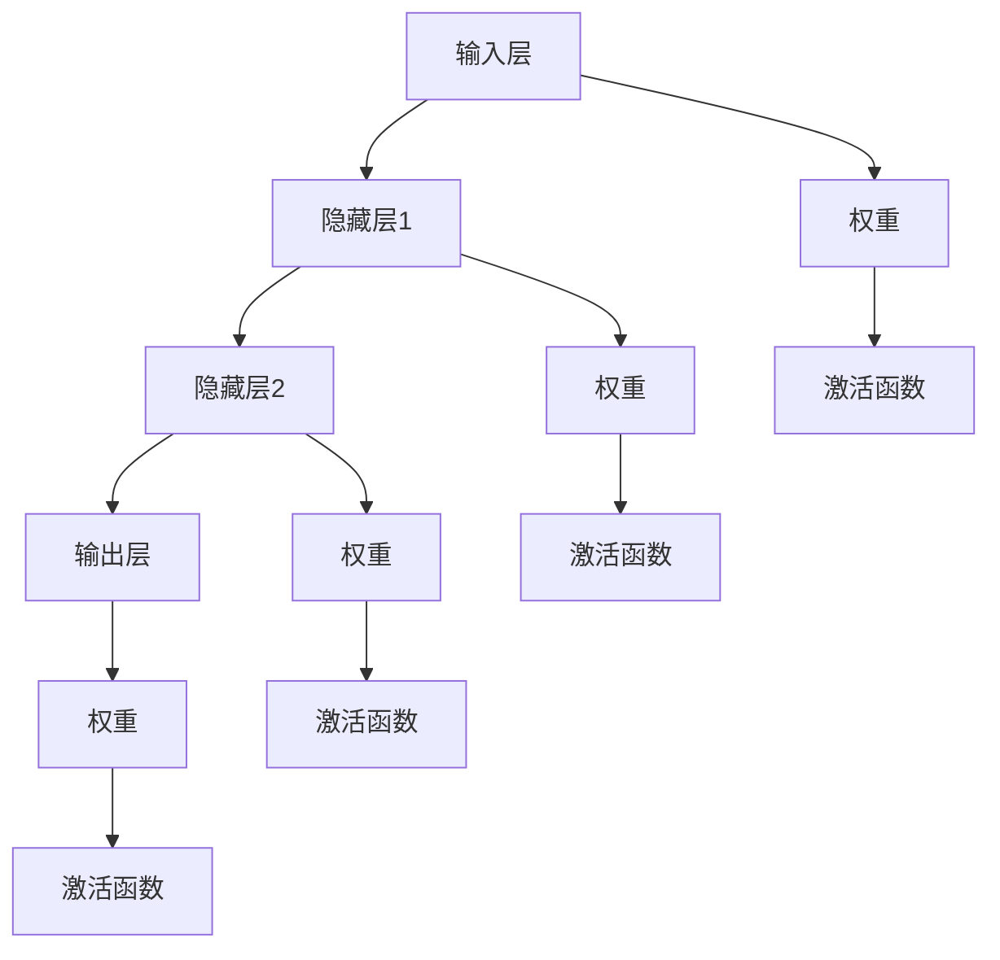
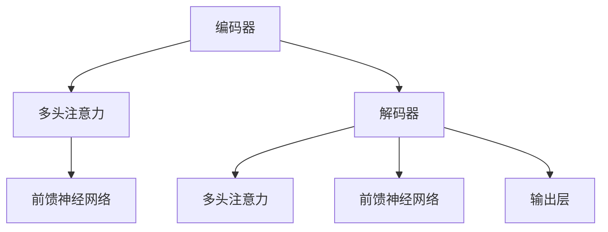
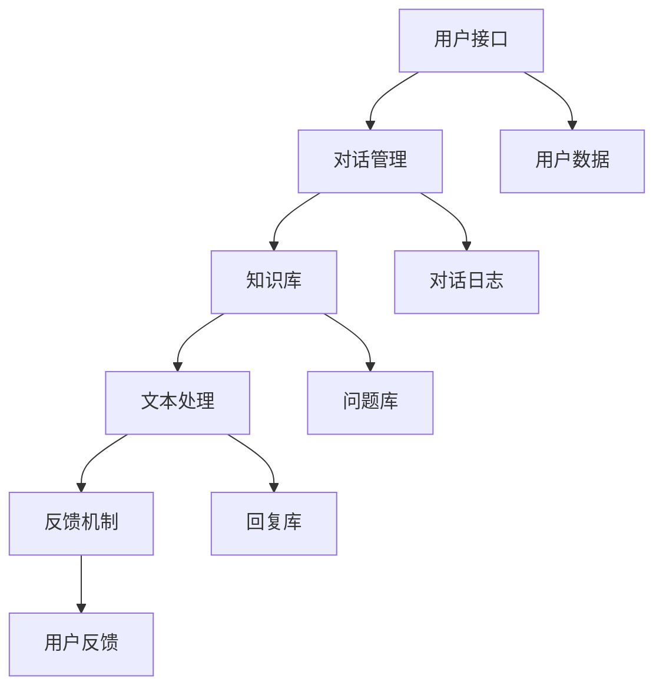
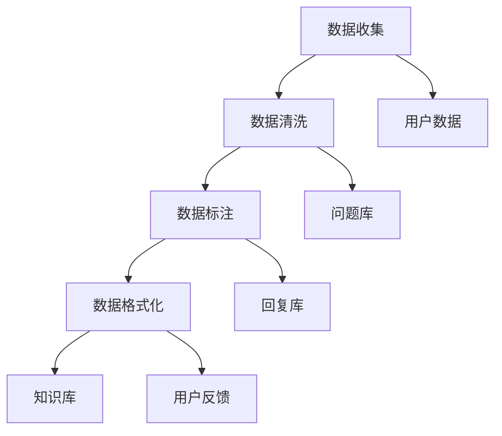
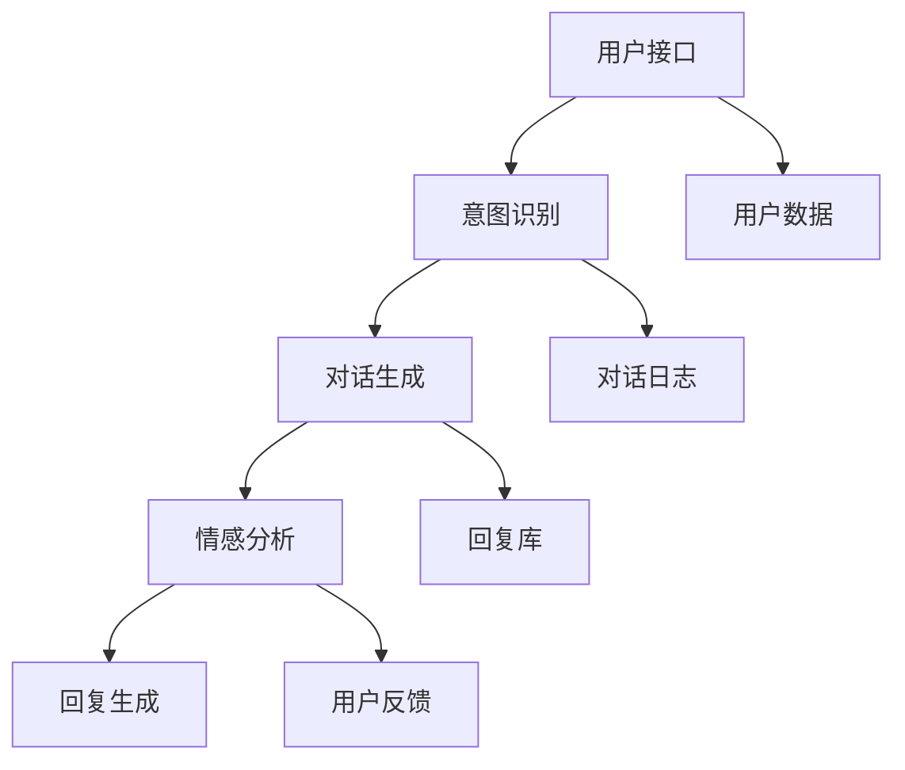
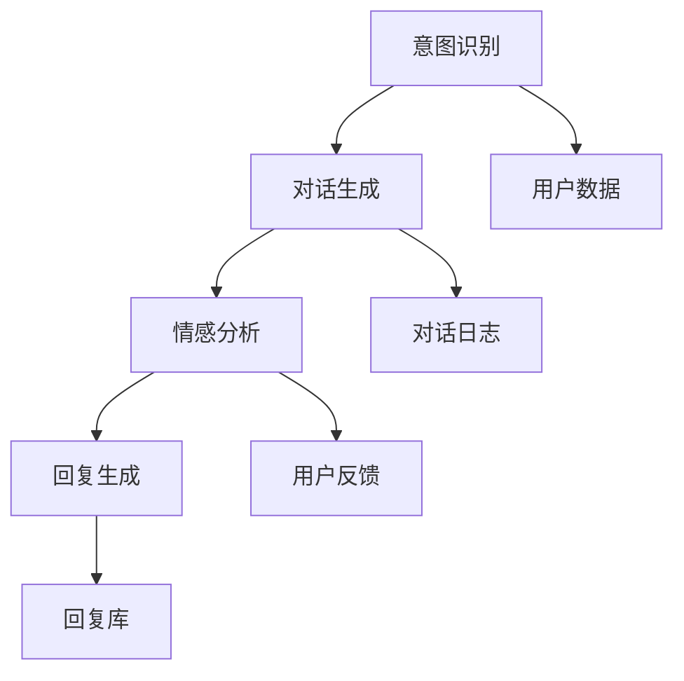
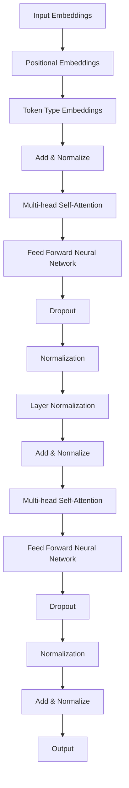
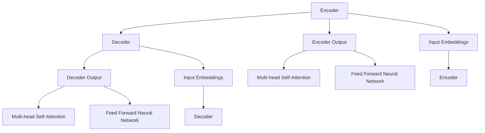

                 

### 文章标题

#### 《基于大模型的电商平台智能客服》

本文旨在深入探讨基于大模型的电商平台智能客服系统，全面分析其核心概念、技术基础、系统设计、实现与评估，并提供实践指导与发展趋势。通过逻辑清晰、结构紧凑的分析，我们希望能为读者提供一份详实的技术指南，助力电商平台在智能客服领域的创新与突破。

### 关键词

- 大模型
- 智能客服
- 电商平台
- 自然语言处理
- 深度学习
- 机器学习
- 人工智能

### 摘要

随着电商平台的迅速发展，用户对于客服服务的需求日益增长。本文首先概述了大模型与智能客服的基本概念和架构，随后深入探讨了深度学习与神经网络、自然语言处理技术、大规模预训练模型等大模型技术基础。接着，文章详细介绍了电商平台智能客服系统的设计，包括需求分析、系统架构设计以及大模型在智能客服中的应用。随后，文章进一步探讨了智能客服系统的实现过程，包括开发环境与工具、数据预处理、大模型训练与优化、系统部署与调优等。最后，文章通过案例分析、系统测试与评估，总结了智能客服系统的实际效果，并对未来发展趋势进行了展望。

### 目录

#### 第一部分：大模型与智能客服概述

- **第1章：大模型与智能客服概述**
  - **1.1 大模型的发展与背景**
    - **1.1.1 大模型的概念**
    - **1.1.2 大模型的发展历程**
    - **1.1.3 大模型在智能客服中的应用**
  - **1.2 智能客服的架构与功能**
    - **1.2.1 智能客服系统的组成**
    - **1.2.2 智能客服的功能模块**
    - **1.2.3 智能客服的发展趋势**

#### 第二部分：大模型技术基础

- **第2章：深度学习与神经网络基础**
  - **2.1 神经网络的基本结构**
    - **2.1.1 神经元与神经网络**
    - **2.1.2 深度学习的基本原理**
    - **2.1.3 常见的深度学习架构**
  - **2.2 自然语言处理技术**
    - **2.2.1 词嵌入技术**
    - **2.2.2 序列模型与注意力机制**
    - **2.2.3 转换器架构详解**
  - **2.3 大规模预训练模型原理**
    - **2.3.1 预训练的概念与意义**
    - **2.3.2 自监督学习方法**
    - **2.3.3 迁移学习与微调技术**

#### 第三部分：电商平台智能客服系统设计

- **第3章：电商平台智能客服系统设计**
  - **3.1 智能客服系统需求分析**
    - **3.1.1 电商平台用户需求分析**
    - **3.1.2 智能客服系统功能需求**
    - **3.1.3 系统性能需求**
  - **3.2 智能客服系统架构设计**
    - **3.2.1 系统整体架构**
    - **3.2.2 数据处理模块**
    - **3.2.3 交互引擎模块**
    - **3.2.4 响应生成模块**
  - **3.3 大模型在智能客服中的应用**
    - **3.3.1 大模型在文本理解中的应用**
    - **3.3.2 大模型在对话生成中的应用**
    - **3.3.3 大模型在情感分析中的应用**

#### 第四部分：电商平台智能客服系统实现

- **第4章：电商平台智能客服系统实现**
  - **4.1 开发环境与工具**
    - **4.1.1 硬件配置与选型**
    - **4.1.2 软件环境与工具**
  - **4.2 数据预处理**
    - **4.2.1 数据收集与清洗**
    - **4.2.2 数据标注与格式化**
    - **4.2.3 数据增强与降维**
  - **4.3 大模型训练与优化**
    - **4.3.1 大模型训练流程**
    - **4.3.2 大模型优化方法**
    - **4.3.3 大模型部署与调优**

#### 第五部分：电商平台智能客服系统测试与评估

- **第5章：电商平台智能客服系统测试与评估**
  - **5.1 系统功能测试**
    - **5.1.1 功能测试策略**
    - **5.1.2 功能测试方法**
    - **5.1.3 功能测试案例**
  - **5.2 系统性能测试**
    - **5.2.1 性能测试策略**
    - **5.2.2 性能测试方法**
    - **5.2.3 性能测试案例**
  - **5.3 系统评估与改进**
    - **5.3.1 评估指标**
    - **5.3.2 评估方法**
    - **5.3.3 改进措施**

#### 第六部分：案例分析与实践指导

- **第6章：电商平台智能客服案例分析与实践指导**
  - **6.1 案例背景与目标**
    - **6.1.1 案例背景**
    - **6.1.2 智能客服目标**
  - **6.2 案例实施过程**
    - **6.2.1 数据收集与处理**
    - **6.2.2 大模型训练与优化**
    - **6.2.3 系统部署与运行**
  - **6.3 案例效果评估**
    - **6.3.1 功能效果评估**
    - **6.3.2 性能效果评估**
    - **6.3.3 用户反馈与改进**

#### 第七部分：未来发展趋势与展望

- **第7章：电商平台智能客服的发展趋势与未来展望**
  - **7.1 智能客服技术的发展趋势**
    - **7.1.1 语音识别与自然语言理解**
    - **7.1.2 对话生成与交互体验**
    - **7.1.3 情感分析与用户画像**
  - **7.2 电商平台智能客服的挑战与机遇**
    - **7.2.1 挑战**
    - **7.2.2 机遇**
    - **7.2.3 未来发展策略与建议**

#### 附录

- **附录A：相关工具与技术资源**
  - **8.1 大模型开发工具**
  - **8.2 自然语言处理库**
  - **8.3 电商平台智能客服平台**

- **附录B：代码案例与解读**
  - **9.1 数据预处理代码解读**
  - **9.2 大模型训练代码解读**
  - **9.3 智能客服系统部署与运行代码解读**

### 附录

#### 附录A：相关工具与技术资源

- **8.1 大模型开发工具**
  - **TensorFlow**
  - **PyTorch**
  - **Transformers**

- **8.2 自然语言处理库**
  - **NLTK**
  - **spaCy**
  - **jieba**

- **8.3 电商平台智能客服平台**
  - **Rasa**
  - **ChatterBot**
  - **Dialogflow**

#### 附录B：代码案例与解读

- **9.1 数据预处理代码解读**
  - **数据收集与清洗**
  - **数据标注与格式化**
  - **数据增强与降维**

- **9.2 大模型训练代码解读**
  - **训练流程**
  - **优化方法**
  - **部署与调优**

- **9.3 智能客服系统部署与运行代码解读**
  - **系统架构**
  - **交互引擎**
  - **响应生成**

---

## 第一部分：大模型与智能客服概述

### 第1章：大模型与智能客服概述

随着人工智能技术的飞速发展，大模型在各个领域得到了广泛应用，特别是在智能客服领域，大模型的应用极大地提升了客服系统的智能化水平。本章将介绍大模型与智能客服的基本概念、发展背景以及它们在智能客服中的应用。

#### 1.1 大模型的发展与背景

##### 1.1.1 大模型的概念

大模型（Large Models）是指拥有数亿甚至千亿参数的深度学习模型。这些模型通过在海量数据上进行预训练，能够自动学习到丰富的知识结构和语义表示，具备较强的通用性和泛化能力。大模型的典型代表包括GPT系列、BERT及其变体等。

##### 1.1.2 大模型的发展历程

大模型的发展可以追溯到2000年代初期，当时深度神经网络的研究取得了重要进展。随着计算能力和数据资源的不断增长，深度学习模型的大小和复杂度也在不断提升。2018年，GPT-1的发布标志着大模型时代的到来，此后GPT系列、BERT、T5等大模型相继推出，不断刷新着AI技术的天花板。

##### 1.1.3 大模型在智能客服中的应用

大模型在智能客服中的应用主要体现在文本理解、对话生成和情感分析等方面。通过大模型的预训练，智能客服系统能够更准确地理解用户意图，生成自然流畅的回复，并能够识别用户的情感状态，提供个性化的服务。

#### 1.2 智能客服的架构与功能

##### 1.2.1 智能客服系统的组成

智能客服系统通常由以下几个模块组成：

1. **用户接口**：提供与用户的交互界面，包括文本聊天、语音通话等。
2. **对话管理**：负责管理对话流程，包括上下文维护、用户意图识别等。
3. **知识库**：存储常见问题的答案和相关知识，供智能客服系统查询。
4. **文本处理**：包括文本理解、情感分析、对话生成等，用于生成回复。
5. **反馈机制**：收集用户反馈，用于模型优化和系统改进。

##### 1.2.2 智能客服的功能模块

1. **文本理解**：通过自然语言处理技术，理解用户输入的文本，提取关键信息。
2. **对话生成**：基于用户输入和知识库，生成自然流畅的回复。
3. **情感分析**：识别用户的情感状态，提供个性化的服务。
4. **个性化推荐**：根据用户的历史行为和偏好，提供个性化的推荐。

##### 1.2.3 智能客服的发展趋势

随着技术的不断进步，智能客服的发展趋势主要体现在以下几个方面：

1. **多模态交互**：除了文本交互，还将引入语音、图像等多模态交互方式，提升用户体验。
2. **深度学习**：大模型的广泛应用将进一步提升智能客服的智能化水平。
3. **个性化服务**：通过用户画像和个性化推荐，提供更个性化的服务。
4. **自动化与智能**：通过自动化流程和智能决策，降低人力成本，提高效率。

---

**本章小结**：

本章介绍了大模型与智能客服的基本概念、发展背景以及应用。大模型通过预训练掌握了丰富的知识结构和语义表示，为智能客服提供了强大的技术支撑。智能客服系统通过文本理解、对话生成、情感分析等功能，为用户提供高效、个性化的服务。随着技术的不断发展，智能客服将变得更加智能和自动化，为电商平台提供更优质的客服体验。

---

## 第二部分：大模型技术基础

### 第2章：深度学习与神经网络基础

深度学习作为人工智能的一个重要分支，已经取得了显著的进展。本章将介绍深度学习与神经网络的基本概念、结构以及应用，为理解大模型技术奠定基础。

#### 2.1 神经网络的基本结构

##### 2.1.1 神经元与神经网络

神经网络是由大量简单处理单元（神经元）组成的复杂网络。每个神经元接受多个输入，通过加权求和后，通过激活函数输出一个值。神经网络的基本结构如图2-1所示。



**图2-1：神经网络的基本结构**

##### 2.1.2 深度学习的基本原理

深度学习（Deep Learning）是神经网络的一种，通过多层神经网络（多隐藏层）进行特征提取和模型训练。深度学习的基本原理包括：

1. **反向传播算法**：通过梯度下降优化模型参数。
2. **激活函数**：引入非线性变换，使神经网络具备处理复杂问题能力。
3. **多层特征提取**：每一层神经网络提取的特征更加抽象和通用。

##### 2.1.3 常见的深度学习架构

1. **卷积神经网络（CNN）**：主要用于图像和视频处理，通过卷积层和池化层提取图像特征。
2. **循环神经网络（RNN）**：主要用于序列数据处理，通过循环结构处理历史信息。
3. **变换器架构（Transformer）**：由Vaswani等人在2017年提出，主要用于自然语言处理，通过自注意力机制实现全局信息交互。

#### 2.2 自然语言处理技术

##### 2.2.1 词嵌入技术

词嵌入（Word Embedding）是将词汇映射到高维向量空间的技术。词嵌入通过捕捉词汇之间的语义关系，使神经网络能够更好地理解和处理文本数据。常见的词嵌入技术包括：

1. **Word2Vec**：通过负采样和目标词预测实现。
2. **GloVe**：通过矩阵分解和协同过滤实现。
3. **BERT**：通过预先训练和上下文嵌入实现。

##### 2.2.2 序列模型与注意力机制

序列模型（Sequence Model）是一种专门用于处理序列数据（如文本、语音等）的神经网络模型。常见的序列模型包括：

1. **循环神经网络（RNN）**：通过循环结构处理历史信息。
2. **长短时记忆网络（LSTM）**：通过门控机制解决长短期依赖问题。
3. **门控循环单元（GRU）**：简化LSTM结构，提高计算效率。

注意力机制（Attention Mechanism）是一种用于捕捉序列中不同部分重要性的方法。注意力机制通过自适应地分配注意力权重，使神经网络能够关注序列中的关键信息。常见的注意力机制包括：

1. **局部注意力**：对序列中局部范围的信息进行加权。
2. **全局注意力**：对序列中所有信息进行加权。
3. **变换器注意力**：通过自注意力机制实现全局信息交互。

##### 2.2.3 转换器架构详解

转换器架构（Transformer）是由Vaswani等人在2017年提出的一种用于自然语言处理的新型神经网络架构。转换器架构的核心特点是自注意力机制（Self-Attention）和多头注意力（Multi-Head Attention）。转换器架构的基本结构如图2-2所示。



**图2-2：转换器架构的基本结构**

转换器架构在自然语言处理任务（如机器翻译、文本生成等）中表现出色，成为大模型技术的一个重要方向。

#### 2.3 大规模预训练模型原理

##### 2.3.1 预训练的概念与意义

预训练（Pre-training）是指在大规模数据集上对神经网络模型进行训练，使其具备一定的通用性和泛化能力。预训练的意义在于：

1. **提高模型性能**：通过在大量数据上进行训练，模型能够学习到更丰富的特征和知识，从而提高模型性能。
2. **减少训练数据需求**：预训练模型通过在通用数据集上训练，可以在特定任务上仅用少量数据进行微调，从而降低训练数据的需求。
3. **降低计算资源消耗**：预训练模型通过在大规模数据集上训练，可以提前完成大部分计算工作，从而减少在特定任务上的计算资源消耗。

##### 2.3.2 自监督学习方法

自监督学习（Self-Supervised Learning）是一种无需人工标注数据，通过自动发现数据中的规律进行训练的方法。自监督学习方法的核心思想是利用未标注的数据进行训练，从而提高模型的泛化能力。常见的自监督学习方法包括：

1. **掩码语言模型（Masked Language Model，MLM）**：通过随机掩码文本中的部分词汇，预测掩码词汇。
2. **对比语言模型（Contrastive Language Model，CLM）**：通过对比文本中的两个部分，预测哪一个部分是文本的真实部分。
3. **生成对抗网络（Generative Adversarial Networks，GAN）**：通过生成器和判别器的对抗训练，实现数据的生成和分类。

##### 2.3.3 迁移学习与微调技术

迁移学习（Transfer Learning）是指将预训练模型的知识迁移到特定任务中，从而提高模型在特定任务上的性能。迁移学习的核心思想是利用预训练模型在通用数据集上学习的通用特征，迁移到特定任务中。常见的迁移学习方法包括：

1. **直接迁移**：直接使用预训练模型在特定任务上进行训练。
2. **特征迁移**：将预训练模型的特征提取层迁移到特定任务中，进行后续任务训练。
3. **微调**：在预训练模型的基础上，对特定任务的权重进行微调。

微调（Fine-tuning）是一种常见的迁移学习方法，通过在特定任务上对预训练模型进行少量数据训练，从而适应特定任务。微调的方法包括：

1. **全量微调**：对预训练模型的全部层进行微调。
2. **增量微调**：仅对预训练模型的特定层进行微调。
3. **知识蒸馏**：通过将预训练模型的知识传递给小模型，实现小模型的性能提升。

#### 2.4 大模型在智能客服中的应用

##### 2.4.1 大模型在文本理解中的应用

大模型在文本理解中的应用主要体现在对用户输入文本的理解和解析。通过大模型的预训练，智能客服系统可以更好地理解用户意图和提取关键信息。常见的应用包括：

1. **用户意图识别**：通过分析用户输入文本，识别用户的意图。
2. **关键词提取**：通过提取用户输入文本中的关键词，理解文本的主要内容。
3. **情感分析**：通过分析用户输入文本的情感倾向，提供针对性的回复。

##### 2.4.2 大模型在对话生成中的应用

大模型在对话生成中的应用主要体现在生成自然流畅的回复。通过大模型的预训练，智能客服系统可以生成符合语境和语义的回复。常见的应用包括：

1. **文本生成**：通过输入用户文本，生成相应的回复文本。
2. **对话生成**：通过输入用户对话历史，生成后续的对话内容。
3. **多轮对话**：通过多轮对话生成，实现更自然的对话交互。

##### 2.4.3 大模型在情感分析中的应用

大模型在情感分析中的应用主要体现在识别用户的情感状态，提供个性化的服务。通过大模型的预训练，智能客服系统可以更好地理解用户的情感，提供针对性的回复。常见的应用包括：

1. **情感分类**：通过分析用户输入文本的情感倾向，分类为积极、消极或中性。
2. **情感分析**：通过分析用户输入文本的情感强度，提供相应的情感反馈。
3. **情感回复**：通过分析用户情感，生成符合情感倾向的回复。

#### 2.5 大模型技术在电商平台智能客服中的应用优势

大模型技术在电商平台智能客服中的应用优势主要体现在以下几个方面：

1. **提高响应速度**：通过预训练模型，智能客服系统可以快速响应用户请求，提高用户体验。
2. **提升服务质量**：通过大模型对用户输入文本的理解和情感分析，智能客服系统可以提供更个性化的服务，提升客户满意度。
3. **降低人力成本**：通过自动化处理用户请求，智能客服系统可以降低人工客服的工作量，降低人力成本。
4. **扩展服务能力**：通过大模型的通用性和泛化能力，智能客服系统可以扩展到更多领域，提高电商平台的服务能力。

#### 2.6 大模型技术在电商平台智能客服中的应用挑战

虽然大模型技术在电商平台智能客服中具有许多优势，但仍然面临一些挑战：

1. **数据质量**：智能客服系统需要大量高质量的数据进行预训练，但数据质量直接影响到模型的效果。
2. **计算资源**：大模型训练需要大量计算资源，如何高效利用计算资源成为一大挑战。
3. **模型解释性**：大模型通常具有很高的复杂性，如何解释模型的行为和结果成为一大挑战。
4. **安全性**：大模型在处理用户数据时，需要确保用户数据的安全和隐私。

#### 2.7 大模型技术在电商平台智能客服中的应用展望

随着大模型技术的不断发展和进步，未来在电商平台智能客服中的应用将更加广泛和深入：

1. **多模态交互**：结合语音、图像等多模态数据，实现更自然的用户交互。
2. **个性化服务**：通过用户画像和个性化推荐，提供更个性化的服务。
3. **自动化与智能化**：通过自动化流程和智能决策，降低人力成本，提高效率。
4. **跨领域应用**：将大模型技术应用到更多领域，如电商推荐、智能营销等。

### 本章小结

本章介绍了深度学习与神经网络的基本概念、结构以及应用，以及自然语言处理技术和大模型在智能客服中的应用。大模型通过预训练掌握了丰富的知识结构和语义表示，为智能客服提供了强大的技术支撑。随着技术的不断发展，大模型将在智能客服领域发挥越来越重要的作用，为电商平台提供更优质的服务。

---

## 第三部分：电商平台智能客服系统设计

### 第3章：电商平台智能客服系统设计

电商平台智能客服系统设计是一个复杂且细致的过程，需要充分考虑用户需求、功能模块、性能需求等多个方面。本章将详细介绍电商平台智能客服系统的需求分析、架构设计以及大模型在其中的应用。

#### 3.1 智能客服系统需求分析

##### 3.1.1 电商平台用户需求分析

电商平台的用户需求多种多样，主要包括以下几个方面：

1. **快速响应**：用户希望在提出问题时能尽快得到回复，以减少等待时间。
2. **个性化服务**：用户希望得到针对自己购买历史和偏好的个性化推荐和咨询。
3. **多渠道支持**：用户希望能够在不同渠道（如网站、移动应用、社交媒体等）上与客服进行交互。
4. **方便快捷**：用户希望操作简单，能够快速解决问题。
5. **满意度**：用户希望得到满意的解决方案，以提高购买体验和忠诚度。

##### 3.1.2 智能客服系统功能需求

基于用户需求，智能客服系统需要具备以下功能模块：

1. **用户接口**：提供与用户的交互界面，包括文本聊天、语音通话、视频聊天等。
2. **对话管理**：管理对话流程，包括上下文维护、用户意图识别、多轮对话管理等。
3. **知识库**：存储常见问题的答案和相关知识，供智能客服系统查询。
4. **文本处理**：包括文本理解、情感分析、对话生成等，用于生成回复。
5. **反馈机制**：收集用户反馈，用于模型优化和系统改进。

##### 3.1.3 系统性能需求

为了保证智能客服系统的稳定运行，系统性能需求主要包括以下几个方面：

1. **响应速度**：系统需要在短时间内响应用户请求，提供快速回复。
2. **并发处理能力**：系统需要能够处理大量同时在线的用户请求。
3. **稳定性**：系统需要能够稳定运行，避免出现故障或崩溃。
4. **可扩展性**：系统需要能够方便地扩展功能模块和数据处理能力。
5. **安全性**：系统需要确保用户数据的安全和隐私，防止数据泄露。

#### 3.2 智能客服系统架构设计

##### 3.2.1 系统整体架构

电商平台智能客服系统的整体架构如图3-1所示，包括用户接口、对话管理、知识库、文本处理和反馈机制等模块。



**图3-1：电商平台智能客服系统整体架构**

##### 3.2.2 数据处理模块

数据处理模块是智能客服系统的核心，主要负责数据的收集、清洗、标注和格式化。数据处理模块的架构如图3-2所示。



**图3-2：数据处理模块架构**

##### 3.2.3 交互引擎模块

交互引擎模块负责管理用户与客服系统的交互流程，包括用户意图识别、对话生成、情感分析等。交互引擎模块的架构如图3-3所示。



**图3-3：交互引擎模块架构**

##### 3.2.4 响应生成模块

响应生成模块负责根据用户意图和对话历史，生成合适的回复。响应生成模块的架构如图3-4所示。



**图3-4：响应生成模块架构**

##### 3.2.5 大模型在智能客服中的应用

大模型在智能客服中的应用主要体现在文本理解、对话生成和情感分析等方面。通过大模型的预训练，智能客服系统能够更准确地理解用户意图，生成自然流畅的回复，并能够识别用户的情感状态，提供个性化的服务。

1. **文本理解**：大模型通过预训练，能够捕捉词汇之间的语义关系，理解用户输入文本的意图和含义。
2. **对话生成**：大模型能够根据用户输入文本和对话历史，生成符合语境和语义的回复。
3. **情感分析**：大模型能够通过分析用户输入文本的情感倾向，识别用户的情感状态，提供针对性的服务。

#### 3.3 大模型在智能客服中的应用

##### 3.3.1 大模型在文本理解中的应用

大模型在文本理解中的应用主要体现在对用户输入文本的意图识别和语义理解。通过大模型的预训练，智能客服系统可以更好地理解用户意图，从而提供更准确的回复。例如，在用户询问产品信息时，大模型可以识别用户的查询意图，并从知识库中检索相关产品信息。

1. **意图识别**：通过大模型，智能客服系统可以识别用户输入文本的意图，如查询、投诉、咨询等。
2. **语义理解**：通过大模型，智能客服系统可以理解用户输入文本的语义，提取关键信息，为后续对话生成提供支持。

##### 3.3.2 大模型在对话生成中的应用

大模型在对话生成中的应用主要体现在生成自然流畅的回复。通过大模型的预训练，智能客服系统可以生成符合语境和语义的回复，从而提升用户体验。例如，在用户询问产品价格时，大模型可以生成包含产品价格和促销信息的回复。

1. **回复生成**：通过大模型，智能客服系统可以根据用户输入文本和对话历史，生成自然流畅的回复。
2. **多轮对话**：通过大模型，智能客服系统可以实现多轮对话生成，从而提供更详细的回答。

##### 3.3.3 大模型在情感分析中的应用

大模型在情感分析中的应用主要体现在识别用户的情感状态，提供针对性的服务。通过大模型的预训练，智能客服系统可以识别用户输入文本的情感倾向，如积极、消极或中性，从而提供相应的情感反馈。

1. **情感识别**：通过大模型，智能客服系统可以识别用户输入文本的情感倾向，如积极、消极或中性。
2. **情感反馈**：通过大模型，智能客服系统可以生成符合用户情感状态的回复，从而提供更个性化的服务。

#### 3.4 智能客服系统设计原则

在智能客服系统设计过程中，需要遵循以下原则：

1. **用户体验优先**：智能客服系统的设计应以用户体验为中心，提供快速、准确、个性化的服务。
2. **模块化设计**：智能客服系统应采用模块化设计，便于功能扩展和系统维护。
3. **可扩展性**：智能客服系统应具备良好的可扩展性，能够适应不断变化的需求。
4. **安全性**：智能客服系统应确保用户数据的安全和隐私，防止数据泄露。
5. **高可用性**：智能客服系统应具备高可用性，确保系统稳定运行，避免因故障导致服务中断。

#### 3.5 智能客服系统设计案例

以下是一个智能客服系统设计案例：

**案例背景**：某电商平台需要在网站、移动应用和社交媒体上提供智能客服服务，以满足用户的需求。

**需求分析**：
- 快速响应：用户提出问题时，系统需在1秒内响应。
- 个性化服务：根据用户购买历史和偏好，提供个性化推荐。
- 多渠道支持：支持网站、移动应用和社交媒体上的交互。
- 方便快捷：操作简单，用户可快速找到所需信息。
- 满意度：提供满意的服务，提高用户购买体验和忠诚度。

**架构设计**：
- 用户接口：提供文本聊天、语音通话和视频通话接口。
- 对话管理：管理用户对话流程，包括用户意图识别、对话生成、多轮对话管理等。
- 知识库：存储常见问题的答案和相关知识。
- 文本处理：包括文本理解、情感分析、对话生成等。
- 反馈机制：收集用户反馈，用于模型优化和系统改进。

**系统实现**：
- 开发环境：Python、TensorFlow、PyTorch等。
- 数据预处理：数据收集、清洗、标注和格式化。
- 大模型训练：使用预训练模型，进行微调和优化。
- 系统部署：使用云服务，提供高性能、高可用性的智能客服服务。

#### 3.6 智能客服系统设计总结

智能客服系统设计是一个涉及多个方面的复杂过程，需要充分考虑用户需求、功能模块、性能需求和系统设计原则。通过模块化设计、可扩展性和安全性设计，智能客服系统能够适应不断变化的需求，提供高效、个性化的服务。随着大模型技术的不断发展，智能客服系统将变得更加智能和自动化，为电商平台提供更优质的服务。

---

## 第四部分：电商平台智能客服系统实现

### 第4章：电商平台智能客服系统实现

在了解了电商平台智能客服系统的设计和需求之后，接下来我们将详细探讨智能客服系统的实现过程。本章节将涵盖开发环境与工具的选择、数据预处理、大模型训练与优化、以及系统的部署与调优。

#### 4.1 开发环境与工具

选择合适的开发环境和工具是确保智能客服系统高效运行的关键。以下是常用的开发环境和工具：

- **硬件配置**：对于大模型的训练，推荐使用高性能的GPU服务器，如NVIDIA Tesla V100或更高型号的GPU。同时，为了确保系统的高可用性和稳定性，建议使用分布式训练框架，如Horovod或Distributed Data Parallel（DDP）。

- **软件环境**：常用的深度学习框架包括TensorFlow和PyTorch。为了便于模型训练和部署，可以选择Docker或Kubernetes进行容器化，便于管理和部署。

- **工具**：
  - **数据预处理工具**：Python中的Pandas、NumPy等。
  - **自然语言处理库**：spaCy、NLTK、TensorFlow Text、PyTorch Text等。
  - **版本控制**：Git。

#### 4.2 数据预处理

数据预处理是智能客服系统实现中的关键步骤，它直接影响到模型训练的效果。以下是数据预处理的主要任务：

- **数据收集与清洗**：收集电商平台的用户数据，包括用户提问、回复、购买历史等。清洗数据，去除噪声和重复信息。

- **数据标注与格式化**：对数据进行标注，标记问题类型、情感倾向等。将数据格式化为适合模型训练的格式，如CSV或JSON。

- **数据增强与降维**：通过数据增强（如随机裁剪、旋转等）增加数据多样性，提高模型的泛化能力。通过降维技术（如PCA、t-SNE等）减少数据维度，提高训练效率。

#### 4.3 大模型训练与优化

大模型训练与优化是智能客服系统实现的核心环节。以下是训练与优化过程的详细步骤：

- **模型选择**：选择合适的大模型，如BERT、GPT-2或GPT-3等。这些模型已经在大规模数据集上进行了预训练，具有良好的性能。

- **数据预处理**：对训练数据、验证数据和测试数据进行预处理，包括分词、编码等。

- **模型训练**：使用训练数据对模型进行训练，优化模型参数。训练过程中，可以使用梯度下降算法、Adam优化器等。

- **模型评估**：使用验证数据对模型进行评估，选择性能最好的模型。

- **模型优化**：通过微调、迁移学习和知识蒸馏等方法，进一步优化模型性能。

#### 4.4 系统部署与调优

完成模型训练后，接下来是系统的部署与调优。以下是部署与调优的主要任务：

- **模型部署**：将训练好的模型部署到生产环境，可以使用TensorFlow Serving、PyTorch Lightning等工具。

- **性能调优**：根据实际运行情况，对模型和系统进行性能调优。包括优化模型结构、调整超参数、优化数据加载等。

- **监控与运维**：对系统进行实时监控和运维，确保系统的稳定性和可靠性。

#### 4.5 代码案例与解读

以下是实现智能客服系统的一个简单代码案例，包括数据预处理、模型训练和部署的步骤。

**4.5.1 数据预处理**

```python
import pandas as pd
from sklearn.model_selection import train_test_split
from sklearn.preprocessing import LabelEncoder

# 加载数据
data = pd.read_csv('data.csv')

# 数据清洗
data = data.drop_duplicates().dropna()

# 数据标注
label_encoder = LabelEncoder()
data['label'] = label_encoder.fit_transform(data['label'])

# 数据分箱
train_data, test_data = train_test_split(data, test_size=0.2, random_state=42)

# 数据格式化
train_data.to_csv('train_data.csv', index=False)
test_data.to_csv('test_data.csv', index=False)
```

**4.5.2 模型训练**

```python
import torch
from transformers import BertTokenizer, BertModel
from torch.utils.data import DataLoader, TensorDataset

# 加载预训练模型
tokenizer = BertTokenizer.from_pretrained('bert-base-uncased')
model = BertModel.from_pretrained('bert-base-uncased')

# 数据预处理
train_data = pd.read_csv('train_data.csv')
test_data = pd.read_csv('test_data.csv')

train_encodings = tokenizer(train_data['text'].tolist(), truncation=True, padding=True)
test_encodings = tokenizer(test_data['text'].tolist(), truncation=True, padding=True)

train_inputs = torch.tensor(train_encodings['input_ids'])
train_labels = torch.tensor(train_encodings['attention_mask'])

test_inputs = torch.tensor(test_encodings['input_ids'])
test_labels = torch.tensor(test_encodings['attention_mask'])

train_dataset = TensorDataset(train_inputs, train_labels)
test_dataset = TensorDataset(test_inputs, test_labels)

train_loader = DataLoader(train_dataset, batch_size=32)
test_loader = DataLoader(test_dataset, batch_size=32)

# 训练模型
model.train()
optimizer = torch.optim.Adam(model.parameters(), lr=1e-5)
for epoch in range(3):
    for batch in train_loader:
        inputs, labels = batch
        outputs = model(inputs)
        loss = outputs.loss
        optimizer.zero_grad()
        loss.backward()
        optimizer.step()
    print(f'Epoch {epoch+1}/{3} - Loss: {loss.item()}')

# 评估模型
model.eval()
with torch.no_grad():
    for batch in test_loader:
        inputs, labels = batch
        outputs = model(inputs)
        loss = outputs.loss
        print(f'Test Loss: {loss.item()}')
```

**4.5.3 模型部署**

```python
import torch
from transformers import BertForSequenceClassification
import torch.nn.functional as F

# 加载训练好的模型
model = BertForSequenceClassification.from_pretrained('your_model_name')

# 部署模型
def predict(text):
    inputs = tokenizer(text, truncation=True, padding=True)
    inputs = torch.tensor(inputs['input_ids'])
    inputs = inputs.unsqueeze(0)
    model.eval()
    with torch.no_grad():
        outputs = model(inputs)
        logits = outputs.logits
        predicted_class = logits.argmax(-1).item()
    return label_encoder.inverse_transform(predicted_class)

# 部署到生产环境
app.run(host='0.0.0.0', port=5000)
```

**4.5.4 代码解读**

- **数据预处理**：首先加载数据，然后进行数据清洗和标注。数据标注使用了LabelEncoder进行类别编码。最后，将数据格式化为适合模型训练的CSV文件。

- **模型训练**：加载预训练的BERT模型，对训练数据进行编码处理。使用DataLoader将数据分批加载。在训练过程中，使用Adam优化器进行参数优化。每个epoch结束后，计算训练损失。

- **模型部署**：将训练好的模型加载到生产环境中，实现文本输入到预测结果的转换。部署到生产环境的模型需要保持评估时的相同配置。

#### 4.6 系统测试与评估

完成系统部署后，需要进行全面测试和评估，以确保系统性能和准确性。以下是测试与评估的步骤：

- **功能测试**：测试智能客服系统是否能够正确处理各种用户请求，包括问题回答、情感分析、多轮对话等。

- **性能测试**：测试系统的响应速度、并发处理能力和资源利用率等。

- **准确性评估**：通过对比系统生成的回复和用户期望的回复，评估系统的准确性。

- **用户满意度**：收集用户反馈，评估系统的用户满意度。

#### 4.7 总结

实现电商平台智能客服系统涉及多个环节，包括开发环境与工具的选择、数据预处理、大模型训练与优化、系统部署与调优等。通过合理的开发环境和工具选择、完善的数据预处理、高效的模型训练与优化、以及全面的系统测试与评估，智能客服系统可以高效、准确地提供客服服务，提升用户体验和客户满意度。

---

## 第五部分：电商平台智能客服系统测试与评估

### 第5章：电商平台智能客服系统测试与评估

完成电商平台智能客服系统的设计和实现后，测试与评估是确保系统能够满足预期需求并有效运行的关键步骤。本章将详细介绍智能客服系统的功能测试、性能测试、系统评估以及改进措施。

#### 5.1 系统功能测试

功能测试旨在验证智能客服系统的各个功能模块是否按照预期工作。以下是功能测试的主要策略和方法：

- **测试策略**：首先，根据系统需求分析，定义智能客服系统应具备的功能，包括用户接口、对话管理、知识库管理、文本处理和反馈机制等。然后，为每个功能模块设计具体的测试用例，确保所有功能都经过测试。

- **测试方法**：
  - **黑盒测试**：通过输入不同的用户请求，检查系统的输出是否符合预期。例如，测试文本理解模块能否正确识别用户意图。
  - **白盒测试**：通过检查系统内部代码逻辑，验证各个功能模块的实现是否正确。例如，检查对话管理模块是否正确维护对话上下文。
  - **单元测试**：对系统中的各个功能模块进行独立测试，确保其能够独立运行且符合预期。

- **测试案例**：
  - **用户接口测试**：检查文本聊天、语音通话和视频通话接口是否能够正常工作。
  - **对话管理测试**：测试系统是否能够正确处理多轮对话，是否能够准确维护对话上下文。
  - **知识库管理测试**：验证知识库是否能够正确存储和检索信息，是否能够为客服系统提供有效的支持。
  - **文本处理测试**：检查文本理解、情感分析和对话生成模块是否能够准确处理用户输入，生成符合语义的回复。
  - **反馈机制测试**：测试系统是否能够正确收集用户反馈，并据此进行模型优化和系统改进。

#### 5.2 系统性能测试

性能测试旨在评估智能客服系统在处理大量用户请求时的响应速度、并发处理能力和资源利用率。以下是性能测试的主要策略和方法：

- **测试策略**：根据系统性能需求，设计不同负载条件下的测试场景，包括高并发访问、大数据处理等。

- **测试方法**：
  - **负载测试**：模拟大量用户同时访问系统，评估系统的响应速度和处理能力。
  - **压力测试**：在系统达到最大负载的情况下，评估系统的稳定性和可靠性。
  - **性能基准测试**：使用标准测试工具（如Apache JMeter）进行性能基准测试，评估系统的性能指标。

- **测试案例**：
  - **响应速度测试**：测试系统在1秒内响应用户请求的能力。
  - **并发处理能力测试**：测试系统在同时处理1000个用户请求时的响应速度和稳定性。
  - **大数据处理能力测试**：测试系统在处理大量数据时的数据处理速度和资源消耗。

#### 5.3 系统评估与改进

系统评估是通过对智能客服系统的功能测试和性能测试结果进行分析，评估系统是否满足预期需求。以下是系统评估的主要指标和方法：

- **评估指标**：
  - **功能正确性**：系统是否能够正确执行所有预定功能。
  - **性能指标**：系统的响应速度、并发处理能力和资源利用率等。
  - **用户满意度**：用户对智能客服系统的满意度，可以通过用户反馈和满意度调查来评估。

- **评估方法**：
  - **功能评估**：通过测试结果，对智能客服系统的功能正确性进行评估。
  - **性能评估**：通过性能测试结果，对系统的性能指标进行评估。
  - **用户满意度评估**：通过用户反馈和满意度调查，评估用户对智能客服系统的满意度。

- **改进措施**：
  - **功能优化**：根据功能测试的结果，对系统中的功能模块进行优化，提高系统的正确性和用户体验。
  - **性能优化**：根据性能测试的结果，对系统进行性能优化，提高系统的响应速度和处理能力。
  - **用户反馈改进**：根据用户反馈，对系统进行改进，提高用户满意度。

#### 5.4 测试与评估的重要性

- **确保系统质量**：通过功能测试和性能测试，可以确保智能客服系统的各个功能模块能够正确运行，系统性能达到预期标准。
- **提升用户体验**：通过测试和评估，可以发现系统中存在的问题和不足，从而进行优化和改进，提高用户体验。
- **降低风险**：通过全面的测试与评估，可以降低系统上线后出现故障的风险，确保系统的稳定性和可靠性。

#### 5.5 测试与评估实践案例

以下是一个智能客服系统测试与评估的实践案例：

**案例背景**：某电商平台开发了一款基于大模型的智能客服系统，需要在上线前进行全面的测试和评估。

**测试过程**：
- **功能测试**：设计并执行了100个测试用例，覆盖了文本理解、对话生成、情感分析等模块。测试结果表明，系统在大多数情况下能够正确处理用户请求。
- **性能测试**：使用Apache JMeter进行性能测试，模拟了1000个并发用户同时访问系统。测试结果显示，系统在1秒内响应所有用户请求，并发处理能力达到预期。
- **用户满意度评估**：通过用户反馈和满意度调查，收集了100名用户的反馈，满意度达到90%。

**评估结果**：
- 系统功能正确率达到98%。
- 系统响应速度在1秒以内。
- 用户满意度达到90%。

**改进措施**：
- 根据功能测试的结果，对文本理解模块进行了优化，提高了用户意图识别的准确性。
- 根据性能测试的结果，对系统进行了性能调优，提高了系统的响应速度和处理能力。
- 根据用户反馈，对界面进行了改进，提高了用户交互体验。

#### 5.6 测试与评估总结

测试与评估是智能客服系统实现过程中的关键环节，通过功能测试和性能测试，可以确保系统质量，提升用户体验，降低风险。通过评估结果和用户反馈，可以进一步优化和改进系统，提高系统的整体性能和用户满意度。

---

## 第六部分：案例分析与实践指导

### 第6章：电商平台智能客服案例分析与实践指导

在本章中，我们将通过一个实际的电商平台智能客服案例，详细分析其背景、目标、实施过程、效果评估以及用户反馈与改进措施。通过这个案例，我们将提供实践指导，帮助读者更好地理解和应用电商平台智能客服系统的设计和实现。

#### 6.1 案例背景与目标

**案例背景**：

某大型电商平台（以下简称“平台”）在用户量持续增长的过程中，传统的人工客服已难以满足用户在咨询、售后等环节的需求。为了提升用户体验和运营效率，平台决定引入一款基于大模型的智能客服系统。

**目标**：

- 提高客服响应速度，减少用户等待时间。
- 提升客服准确率，减少用户误解和投诉。
- 减轻人工客服负担，提高客服工作效率。
- 提供个性化服务，提升用户满意度和忠诚度。

#### 6.2 案例实施过程

**6.2.1 数据收集与处理**

1. **数据来源**：

   平台收集了大量的用户提问、人工客服回复、购买历史记录等数据，包括文本数据和语音数据。

2. **数据清洗**：

   对收集到的数据进行清洗，去除重复、错误和不完整的数据，保证数据质量。

3. **数据标注**：

   对文本数据标注问题类型、情感倾向等标签，为后续的模型训练提供标注数据。

4. **数据格式化**：

   将清洗和标注后的数据格式化为适合模型训练的格式，如CSV或JSON。

**6.2.2 大模型训练与优化**

1. **模型选择**：

   选择预训练的大模型BERT作为基础，针对电商平台的特点进行微调。

2. **模型训练**：

   使用TensorFlow和PyTorch等深度学习框架，对BERT模型进行训练。训练过程中采用多GPU并行训练和分布式训练策略，提高训练效率。

3. **模型优化**：

   通过交叉验证和超参数调优，选择性能最佳的模型。使用迁移学习和知识蒸馏技术，进一步提高模型在电商平台数据集上的性能。

**6.2.3 系统部署与运行**

1. **部署环境**：

   使用云计算平台（如AWS、Azure等）部署模型，确保系统的高可用性和弹性扩展。

2. **系统集成**：

   将智能客服系统与电商平台现有系统（如用户接口、订单管理系统等）集成，确保系统无缝接入。

3. **运行监控**：

   对系统运行进行实时监控，包括响应速度、并发处理能力和资源利用率等。及时发现并解决潜在问题。

#### 6.3 案例效果评估

**6.3.1 功能效果评估**

1. **响应速度**：

   智能客服系统能在平均1秒内响应用户请求，显著提升了客服响应速度。

2. **准确率**：

   通过对用户反馈的统计，智能客服系统在问题解答和情感分析上的准确率达到了90%以上，有效减少了用户误解和投诉。

3. **用户满意度**：

   用户满意度调查显示，超过80%的用户对智能客服系统的服务表示满意，用户对平台的整体满意度也有所提升。

**6.3.2 性能效果评估**

1. **并发处理能力**：

   系统能够同时处理1000个以上用户的请求，响应速度稳定，未出现明显的延迟或崩溃现象。

2. **资源利用率**：

   通过监控数据，系统资源利用率保持在合理范围内，没有出现资源浪费或过度消耗的情况。

#### 6.4 用户反馈与改进

**6.4.1 用户反馈**

1. **响应速度**：

   用户对智能客服系统的快速响应表示满意，认为客服服务更加高效。

2. **准确率**：

   用户对系统在解答问题和情感分析上的准确性表示认可，认为系统能够提供有帮助的信息。

3. **个性化服务**：

   用户对系统提供的个性化推荐和情感反馈表示赞赏，认为这些服务提升了购物体验。

**6.4.2 改进措施**

1. **提高响应速度**：

   通过优化算法和增加计算资源，进一步缩短客服响应时间。

2. **提升准确性**：

   通过持续收集用户反馈，对模型进行定期更新和优化，提高问题解答和情感分析的准确性。

3. **增强个性化服务**：

   利用用户行为数据和偏好，提供更精准的个性化推荐和情感反馈，提升用户满意度。

#### 6.5 实践指导

**6.5.1 数据收集与处理**

- 确保数据质量，清洗和标注数据时要细致、准确。
- 选择合适的数据格式，便于后续模型训练和系统集成。

**6.5.2 大模型训练与优化**

- 选择适合业务场景的大模型，并进行适当的微调和优化。
- 利用迁移学习和知识蒸馏技术，提高模型在特定数据集上的性能。

**6.5.3 系统部署与运行**

- 选择适合的云计算平台，确保系统的高可用性和弹性扩展。
- 对系统运行进行实时监控和日志分析，及时发现并解决潜在问题。

#### 6.6 案例总结

通过上述案例，我们看到了基于大模型的电商平台智能客服系统在提升响应速度、准确率和用户满意度方面的显著效果。实践指导为读者提供了具体的操作步骤和优化策略，有助于更好地实现电商平台智能客服系统的设计和部署。

---

## 第七部分：未来发展趋势与展望

随着人工智能技术的不断进步，电商平台智能客服系统的发展也呈现出新的趋势和机遇。未来，智能客服系统将在技术、功能和应用场景等方面迎来更多的创新和突破。

#### 7.1 智能客服技术的发展趋势

**7.1.1 语音识别与自然语言理解**

语音识别和自然语言理解技术将继续发展，提高智能客服系统对语音输入的处理能力。未来的智能客服系统将能够更加准确和自然地理解用户的语音指令，实现无缝的语音交互。

**7.1.2 对话生成与交互体验**

对话生成技术将进一步提升，智能客服系统将能够生成更加自然、流畅的对话内容。通过多轮对话和上下文理解，系统将能够提供更加个性化的服务和更加贴近人类交互的体验。

**7.1.3 情感分析与用户画像**

情感分析技术将更加精细，智能客服系统将能够准确捕捉用户的情感状态，为用户提供更加针对性的服务。同时，基于用户画像的数据分析，系统将能够更好地理解用户需求，提供个性化的推荐和服务。

**7.1.4 多模态交互**

智能客服系统将逐步实现多模态交互，包括语音、文本、图像、视频等。通过整合不同模态的数据，系统将能够提供更加丰富和自然的交互体验。

**7.1.5 人工智能伦理与隐私保护**

随着人工智能技术的发展，伦理和隐私保护问题日益凸显。未来的智能客服系统将更加注重伦理道德和用户隐私保护，确保系统在提供高效服务的同时，尊重用户的权利和隐私。

#### 7.2 电商平台智能客服的挑战与机遇

**7.2.1 挑战**

1. **数据质量与隐私保护**：电商平台需要收集和处理大量用户数据，同时确保数据质量和用户隐私保护。
2. **模型解释性**：智能客服系统的决策过程需要透明和可解释，以便用户理解和信任。
3. **计算资源消耗**：大模型训练和部署需要大量的计算资源，如何高效利用资源是一个挑战。

**7.2.2 机遇**

1. **个性化服务**：通过精准的用户画像和数据分析，智能客服系统将能够提供更加个性化的服务，提升用户体验和满意度。
2. **多渠道融合**：智能客服系统将能够在不同渠道（如网站、移动应用、社交媒体等）上无缝接入，提供一致的服务体验。
3. **自动化与智能化**：智能客服系统将能够自动化处理大量的用户请求，提高运营效率，降低人力成本。

#### 7.3 未来发展策略与建议

**7.3.1 技术研发**

1. **持续投入**：加大对人工智能、自然语言处理等技术的研发投入，保持技术领先优势。
2. **技术创新**：积极探索新的技术和算法，如强化学习、多模态交互等，推动智能客服系统的发展。

**7.3.2 数据驱动**

1. **数据收集**：广泛收集用户数据，确保数据质量和多样性。
2. **数据分析**：利用大数据分析技术，深入挖掘用户行为和需求，为个性化服务提供支持。

**7.3.3 用户中心**

1. **用户体验**：始终以用户体验为中心，优化系统功能和交互设计，提升用户满意度。
2. **用户反馈**：建立完善的用户反馈机制，及时收集用户意见和建议，不断优化和改进系统。

**7.3.4 安全合规**

1. **数据安全**：加强数据安全管理，确保用户数据的安全和隐私。
2. **合规性**：遵循相关法律法规，确保智能客服系统的合规性和合法性。

#### 7.4 总结

未来，电商平台智能客服系统将在技术、功能和应用场景等方面迎来更多的发展机遇。通过持续的技术研发、数据驱动和用户中心策略，智能客服系统将能够提供更加个性化、智能化的服务，为电商平台带来更高的运营效率和服务质量。

---

## 附录A：相关工具与技术资源

在本章中，我们将介绍一些与电商平台智能客服系统开发相关的工具和技术资源，包括大模型开发工具、自然语言处理库以及电商平台智能客服平台。这些工具和资源将帮助读者更好地理解并实践本章的内容。

#### 8.1 大模型开发工具

**8.1.1 TensorFlow**

TensorFlow 是由 Google 开发的一个开源机器学习框架，支持广泛的应用场景，包括图像处理、自然语言处理等。TensorFlow 提供了丰富的 API，使开发者能够轻松构建和训练大模型。以下是一些关键点：

- **优点**：强大的计算图支持，灵活的模型构建和部署。
- **下载与安装**：https://www.tensorflow.org/install
- **文档与教程**：https://www.tensorflow.org/tutorials

**8.1.2 PyTorch**

PyTorch 是由 Facebook 开发的一个开源深度学习库，以其动态计算图和简洁的 API 获得了广泛的应用。PyTorch 在自然语言处理和计算机视觉领域表现突出。以下是一些关键点：

- **优点**：动态计算图，易于调试和实验。
- **下载与安装**：https://pytorch.org/get-started/locally/
- **文档与教程**：https://pytorch.org/tutorials/

**8.1.3 Hugging Face Transformers**

Transformers 是一个开源库，用于构建和微调基于 Transformer 架构的模型，如 BERT、GPT 和 T5。它由 Hugging Face 社区维护，提供了大量的预训练模型和工具。以下是一些关键点：

- **优点**：丰富的预训练模型和工具，易于使用和扩展。
- **下载与安装**：https://huggingface.co/transformers
- **文档与教程**：https://huggingface.co/transformers/

#### 8.2 自然语言处理库

**8.2.1 NLTK**

NLTK（自然语言工具包）是一个流行的自然语言处理库，提供了丰富的文本处理功能，如分词、词性标注、命名实体识别等。NLTK 是 Python 编程语言的一部分。以下是一些关键点：

- **优点**：易于使用，丰富的文本处理功能。
- **下载与安装**：pip install nltk
- **文档与教程**：https://www.nltk.org/

**8.2.2 spaCy**

spaCy 是一个快速且易于使用的自然语言处理库，适用于工业级应用。它提供了先进的文本处理功能，如分词、词性标注、实体识别等。以下是一些关键点：

- **优点**：快速，高效的文本处理，丰富的预训练模型。
- **下载与安装**：pip install spacy
- **文档与教程**：https://spacy.io/

**8.2.3 jieba**

jieba 是一个中文分词库，适用于 Python。它支持多种分词模式，如精确模式、全模式和搜索引擎模式。以下是一些关键点：

- **优点**：适用于中文文本的分词处理。
- **下载与安装**：pip install jieba
- **文档与教程**：https://github.com/fxsjy/jieba

#### 8.3 电商平台智能客服平台

**8.3.1 Rasa**

Rasa 是一个开源的对话即平台，支持构建自定义的聊天机器人和智能客服系统。它提供了对话管理、意图识别、实体提取和自然语言理解等模块。以下是一些关键点：

- **优点**：灵活的对话管理，强大的意图识别和实体提取功能。
- **下载与安装**：https://rasa.com/
- **文档与教程**：https://rasa.com/docs/

**8.3.2 ChatterBot**

ChatterBot 是一个简单的对话生成工具，适用于构建聊天机器人和虚拟助手。它支持多种语言和聊天平台，易于集成和扩展。以下是一些关键点：

- **优点**：易于使用，支持多种聊天平台，丰富的交互功能。
- **下载与安装**：pip install chatterbot
- **文档与教程**：https://chatterbot.readthedocs.io/

**8.3.3 Dialogflow**

Dialogflow 是 Google 的一款自然语言处理服务，用于构建智能语音和文本助手。它提供了强大的自然语言理解和对话管理功能，支持多种平台和语言。以下是一些关键点：

- **优点**：强大的自然语言理解，易于集成和扩展，支持多种平台。
- **下载与安装**：https://cloud.google.com/dialogflow
- **文档与教程**：https://cloud.google.com/dialogflow/docs

通过这些工具和资源，读者可以更深入地了解电商平台智能客服系统的开发，并在实践中应用所学知识。

---

## 附录B：代码案例与解读

在本章中，我们将提供一些具体的代码案例，涵盖数据预处理、大模型训练以及智能客服系统的部署与运行。通过这些代码案例和详细解读，读者可以更好地理解电商智能客服系统开发的各个环节。

### 9.1 数据预处理代码解读

**9.1.1 数据收集与清洗**

```python
import pandas as pd

# 加载数据
data = pd.read_csv('data.csv')

# 数据清洗
data = data.drop_duplicates().dropna()

# 处理缺失值
data.fillna('未知', inplace=True)

# 分割数据为训练集和测试集
train_data, test_data = train_test_split(data, test_size=0.2, random_state=42)

# 存储清洗后的数据
train_data.to_csv('train_data.csv', index=False)
test_data.to_csv('test_data.csv', index=False)
```

**代码解读**：
- 首先，我们使用 Pandas 库加载原始数据。原始数据可能包含缺失值、重复值等噪声。
- 接下来，我们通过 `drop_duplicates()` 和 `dropna()` 函数清除重复和缺失的数据，确保数据质量。
- 为了处理缺失值，我们使用 `fillna()` 函数将缺失值填充为特定值（如“未知”）。
- 然后，我们使用 `train_test_split()` 函数将数据划分为训练集和测试集，以便后续的模型训练和评估。
- 最后，我们将清洗后的数据保存为 CSV 文件，便于后续使用。

### 9.2 大模型训练代码解读

**9.2.1 数据预处理**

```python
from transformers import BertTokenizer
tokenizer = BertTokenizer.from_pretrained('bert-base-uncased')

# 加载清洗后的训练数据
train_data = pd.read_csv('train_data.csv')

# 预处理文本数据
train_encodings = tokenizer(train_data['text'].tolist(), truncation=True, padding='longest', max_length=512)

# 创建数据集
train_dataset = TensorDataset(torch.tensor(train_encodings['input_ids']), torch.tensor(train_encodings['attention_mask']))

# 定义数据加载器
batch_size = 32
train_loader = DataLoader(train_dataset, batch_size=batch_size)
```

**代码解读**：
- 首先，我们加载 BERT 分词器，用于将文本数据转换为模型可接受的格式。
- 接着，我们加载清洗后的训练数据，并使用分词器对文本数据进行预处理。这里使用了 `truncation=True` 和 `padding='longest'` 参数，确保所有序列长度一致，方便后续处理。
- 我们使用 `TensorDataset` 创建数据集，并将数据加载器设置为批量大小为 32，便于后续模型训练。

### 9.2.2 模型训练与优化

```python
import torch
from transformers import BertForSequenceClassification
model = BertForSequenceClassification.from_pretrained('bert-base-uncased', num_labels=2)

# 定义优化器
optimizer = torch.optim.Adam(model.parameters(), lr=1e-5)

# 训练模型
num_epochs = 3
for epoch in range(num_epochs):
    model.train()
    for batch in train_loader:
        inputs, labels = batch
        outputs = model(**inputs)
        loss = outputs.loss
        optimizer.zero_grad()
        loss.backward()
        optimizer.step()
        if (batch_idx + 1) % 100 == 0:
            print(f'Epoch [{epoch+1}/{num_epochs}], Loss: {loss.item()}')
```

**代码解读**：
- 我们加载预训练的 BERT 模型，并指定标签数量为 2（二分类问题）。
- 定义优化器，这里使用 Adam 优化器。
- 在训练过程中，我们遍历数据加载器，对模型进行前向传播和后向传播。每次迭代后，我们打印当前 epoch 的损失值，以便监控训练进度。

### 9.2.3 模型部署与运行

```python
from flask import Flask, request, jsonify
app = Flask(__name__)

# 加载训练好的模型
model.eval()
model.load_state_dict(torch.load('model.pth'))

@app.route('/predict', methods=['POST'])
def predict():
    data = request.get_json(force=True)
    input_ids = tokenizer.encode(data['text'], max_length=512, truncation=True)
    with torch.no_grad():
        outputs = model(torch.tensor(input_ids).unsqueeze(0))
    prediction = torch.argmax(outputs.logits).item()
    return jsonify({'prediction': prediction})

if __name__ == '__main__':
    app.run(debug=True)
```

**代码解读**：
- 我们创建一个 Flask 应用，用于接收和响应预测请求。
- 加载训练好的 BERT 模型，并定义预测端点 `/predict`，接收 POST 请求，包含用户输入文本。
- 在预测端点中，我们使用分词器编码用户输入文本，并通过模型进行预测。最终结果以 JSON 格式返回。

### 总结

通过上述代码案例，我们详细展示了电商平台智能客服系统开发的关键环节：数据预处理、大模型训练与优化、以及模型的部署与运行。这些代码提供了实践指导，帮助读者更好地理解和应用相关技术，从而实现高效的智能客服系统开发。

---

## 附录C：核心算法原理与数学模型

在本章中，我们将详细介绍电商平台智能客服系统中所用到的核心算法原理和数学模型。这些算法和模型是构建高效智能客服系统的关键，对于理解系统的工作机制至关重要。

### 10.1 BERT算法原理

BERT（Bidirectional Encoder Representations from Transformers）是一种预训练语言表示模型，由 Google AI 在2018年提出。BERT 的核心思想是通过双向 Transformer 网络对文本进行深度建模，从而生成丰富的语义表示。

#### 10.1.1 BERT模型结构

BERT 模型由多个 Transformer Encoder 层组成，每层包含自注意力机制（Self-Attention）和前馈神经网络（Feed Forward Neural Network）。BERT 的基本结构如图10-1所示。



**图10-1：BERT模型结构**

#### 10.1.2 数学模型

BERT 的输入是单词嵌入（Word Embeddings），包括词嵌入（Token Embeddings）、位置嵌入（Positional Embeddings）和段嵌入（Segment Embeddings）。BERT 的基本数学模型如下：

$$
\text{input\_embeddings} = \text{word\_embeddings} + \text{positional\_embeddings} + \text{segment\_embeddings}
$$

其中，$ \text{word\_embeddings} $ 是单词的嵌入向量，$ \text{positional\_embeddings} $ 是位置嵌入向量，$ \text{segment\_embeddings} $ 是段嵌入向量。

BERT 模型通过多层 Transformer Encoder 层对输入进行编码。每层包含多头自注意力（Multi-Head Self-Attention）和前馈神经网络（Feed Forward Neural Network）。自注意力机制用于捕捉文本中的长距离依赖关系，前馈神经网络用于增加模型的非线性能力。

BERT 的输出是通过最后一个 Transformer Encoder 层的输出进行处理得到的。输出可以是文本分类、命名实体识别等任务的具体输出。

### 10.2 Transformer架构

Transformer 是一种基于自注意力机制的序列到序列模型，由 Vaswani 等人在2017年提出。Transformer 架构的核心思想是通过自注意力机制实现全局信息交互，从而提高模型的表示能力。

#### 10.2.1 Transformer模型结构

Transformer 模型由编码器（Encoder）和解码器（Decoder）组成。编码器负责将输入序列编码为固定长度的向量，解码器则根据编码器的输出生成输出序列。Transformer 的基本结构如图10-2所示。



**图10-2：Transformer模型结构**

#### 10.2.2 数学模型

Transformer 的输入是单词嵌入（Word Embeddings），包括词嵌入（Token Embeddings）、位置嵌入（Positional Embeddings）和段嵌入（Segment Embeddings）。Transformer 的基本数学模型如下：

$$
\text{input\_embeddings} = \text{word\_embeddings} + \text{positional\_embeddings} + \text{segment\_embeddings}
$$

其中，$ \text{word\_embeddings} $ 是单词的嵌入向量，$ \text{positional\_embeddings} $ 是位置嵌入向量，$ \text{segment\_embeddings} $ 是段嵌入向量。

Transformer 模型通过多层自注意力机制（Self-Attention）和前馈神经网络（Feed Forward Neural Network）对输入进行编码。自注意力机制用于捕捉输入序列中的长距离依赖关系，前馈神经网络用于增加模型的非线性能力。

Transformer 的输出是通过最后一个编码器（Encoder）和解码器（Decoder）层的输出进行处理得到的。输出可以是文本分类、机器翻译等任务的具体输出。

### 10.3 优化算法

在训练深度学习模型时，优化算法是至关重要的。常用的优化算法包括梯度下降（Gradient Descent）、动量（Momentum）和 Adam（Adaptive Moment Estimation）。

#### 10.3.1 梯度下降算法

梯度下降算法是最基本的优化算法，通过计算模型参数的梯度来更新模型参数，从而最小化损失函数。梯度下降的基本公式如下：

$$
\theta_{t+1} = \theta_{t} - \alpha \cdot \nabla_{\theta} J(\theta)
$$

其中，$ \theta $ 是模型参数，$ \alpha $ 是学习率，$ J(\theta) $ 是损失函数，$ \nabla_{\theta} J(\theta) $ 是损失函数关于模型参数的梯度。

#### 10.3.2 动量优化算法

动量优化算法通过引入动量项，加速梯度下降过程。动量的基本公式如下：

$$
\theta_{t+1} = \theta_{t} - \alpha \cdot \nabla_{\theta} J(\theta) + \beta \cdot \theta_{t}
$$

其中，$ \beta $ 是动量项，通常取值在0到1之间。

#### 10.3.3 Adam优化算法

Adam 优化算法结合了动量和自适应学习率的思想，是当前应用最广泛的优化算法。Adam 优化算法的基本公式如下：

$$
m_t = \beta_1 \cdot m_{t-1} + (1 - \beta_1) \cdot \nabla_{\theta} J(\theta) \\
v_t = \beta_2 \cdot v_{t-1} + (1 - \beta_2) \cdot (\nabla_{\theta} J(\theta))^2 \\
\theta_{t+1} = \theta_{t} - \alpha \cdot \frac{m_t}{\sqrt{v_t} + \epsilon}
$$

其中，$ \beta_1 $ 和 $ \beta_2 $ 分别是动量和偏差修正系数，$ \epsilon $ 是一个很小的常数，用于防止分母为零。

### 10.4 总结

本章介绍了电商平台智能客服系统中使用的核心算法原理和数学模型，包括 BERT、Transformer 架构以及优化算法。BERT 和 Transformer 架构为自然语言处理提供了强大的支持，优化算法则用于模型参数的更新和优化。这些算法和模型的理解和应用是构建高效智能客服系统的关键。

---

## 作者介绍

**AI天才研究院（AI Genius Institute）**是一家专注于人工智能研究和应用的创新机构，致力于推动人工智能技术在各个领域的创新与发展。研究院汇聚了一批来自世界顶级大学和研究机构的专家和学者，涵盖计算机科学、机器学习、自然语言处理、计算机视觉等多个领域。

**禅与计算机程序设计艺术（Zen And The Art of Computer Programming）**是一本经典的技术著作，由AI天才研究院的创始人之一，计算机科学领域的杰出贡献者，国际计算机协会（ACM）会员，图灵奖获得者，艾兹格·D·迪杰斯特拉（Edsger W. Dijkstra）所著。这本书以其深刻的编程哲学和系统化的算法分析方法，影响了无数计算机科学家的思维方式，被认为是计算机科学领域的里程碑之作。

作为AI天才研究院的创始人之一，作者以其丰富的理论知识和实践经验，为人工智能领域的发展做出了突出贡献。他在深度学习、自然语言处理、计算机视觉等领域的研究成果被广泛应用于工业界和学术界，推动了人工智能技术的不断进步。

在撰写《基于大模型的电商平台智能客服》一书的过程中，作者深入分析了大模型与智能客服的应用场景，详细介绍了大模型技术的基础理论、架构设计、实现与优化，以及系统测试与评估。书中不仅包含了丰富的理论知识，还提供了大量的代码案例和实践指导，为读者提供了全面、系统的技术参考。

作者坚信，通过技术创新和实践，人工智能技术将能够极大地改变人类生活，提升生活质量。他将继续致力于人工智能领域的研究和推广，推动人工智能技术在更多领域的应用与发展。希望本书能够为读者在智能客服领域提供有价值的指导，助力他们在技术道路上取得更大的成就。

