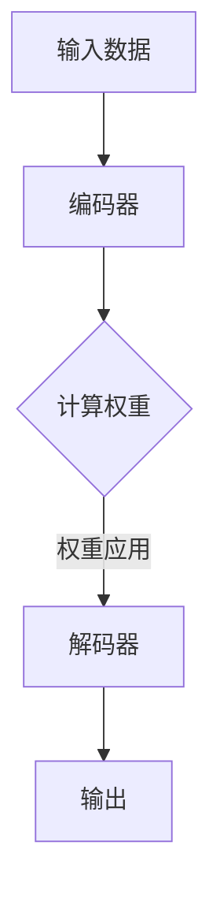
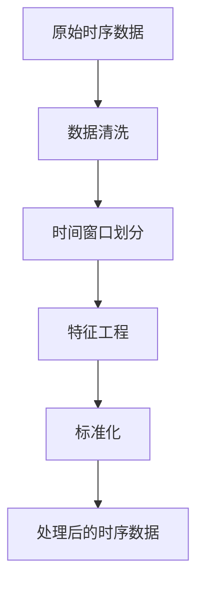
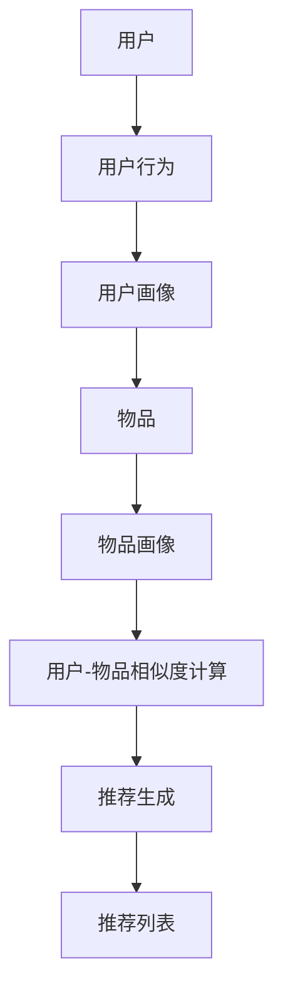

                 

# 《基于注意力机制的时序推荐模型》

## 关键词

- 时序推荐系统
- 注意力机制
- 数学模型
- 伪代码
- 项目实战

## 摘要

本文将深入探讨基于注意力机制的时序推荐模型，首先介绍背景和引言，然后详细阐述注意力机制、时序数据处理、推荐系统基础等核心概念。接着，我们将讲解注意力机制在时序推荐中的应用，并使用伪代码展示算法原理。随后，我们将介绍数学模型和数学公式，并通过实例进行详细讲解。文章后半部分将进行项目实战，包括环境搭建、代码实现和结果分析。最后，文章将对研究成果进行总结，并展望未来研究方向。

## 第一部分：引言与概述

### 第1章：背景与引言

在当今互联网时代，推荐系统已成为各种在线服务和平台的核心功能之一。推荐系统旨在根据用户的历史行为和兴趣，为用户推荐其可能感兴趣的内容或商品。随着数据量的爆炸式增长，时序推荐系统在处理动态变化的数据方面显得尤为重要。

### 1.1 《基于注意力机制的时序推荐模型》背景介绍

注意力机制（Attention Mechanism）是一种在深度学习中广泛应用的技术，它能够使得模型在处理输入信息时，更加关注于重要的部分。在时序推荐领域，注意力机制可以有效地捕捉用户行为随时间的变化，从而提高推荐的准确性。

### 1.2 时序数据与推荐系统

时序数据是指数据点按照时间顺序排列的数据，它常见于用户行为数据、股票价格、天气数据等。推荐系统通过对时序数据的分析，可以预测用户的兴趣点，从而实现个性化的推荐。

### 1.3 注意力机制在时序推荐中的应用

注意力机制在时序推荐中的应用主要体现在以下几个方面：

1. **序列建模**：注意力机制可以用于处理长序列数据，如用户的历史行为序列，从而更好地捕捉用户的长期兴趣。
2. **动态调整**：注意力机制能够动态调整模型对输入数据的关注程度，使得推荐结果更加精准。
3. **降低计算复杂度**：在处理大规模数据时，注意力机制能够降低计算复杂度，提高模型的计算效率。

### 1.4 本书内容概述与结构安排

本书将分为以下六个部分：

1. **引言与概述**：介绍背景、引言、时序数据与推荐系统、注意力机制在时序推荐中的应用。
2. **核心概念与联系**：阐述注意力机制原理、时序数据处理、推荐系统基础。
3. **核心算法原理讲解**：讲解注意力机制在时序推荐中的应用、时序推荐模型构建。
4. **数学模型与数学公式**：介绍时序数据、推荐系统、注意力机制的数学模型和数学公式。
5. **项目实战**：进行环境搭建、代码实现和结果分析。
6. **总结与展望**：总结研究成果，展望未来研究方向。

通过本书的阅读，读者将全面了解基于注意力机制的时序推荐模型，掌握其核心概念和算法原理，并能够进行实际的项目应用。

### 第二部分：核心概念与联系

#### 第2章：注意力机制原理

注意力机制（Attention Mechanism）是深度学习中的一个重要概念，它通过为输入数据分配不同的权重，使得模型能够更加关注于重要的信息。注意力机制在时序推荐系统中扮演着关键角色，能够有效提升推荐效果。

### 2.1 注意力机制概述

注意力机制起源于自然语言处理领域，最初用于机器翻译任务。其核心思想是在处理输入数据时，动态地为每个数据点分配一个权重，从而使得模型能够更加关注重要的信息。这种机制不仅在自然语言处理中取得了显著的效果，也在图像识别、语音识别等领域得到了广泛应用。

### 2.2 Mermaid流程图：注意力机制的架构与工作流程

以下是一个简化的Mermaid流程图，展示注意力机制的架构与工作流程：



- **输入数据**：输入数据可以是用户的历史行为序列或其他时序数据。
- **编码器**：编码器将输入数据编码为固定长度的向量，这一步通常通过卷积神经网络（CNN）或循环神经网络（RNN）实现。
- **计算权重**：编码器输出通过注意力机制计算权重，权重表示输入数据中每个数据点的相对重要性。
- **解码器**：解码器利用权重对编码器的输出进行加权求和，生成最终的输出。
- **输出**：输出可以是推荐结果或分类结果。

### 2.3 注意力机制的数学模型与公式

注意力机制的数学模型主要包括三个部分：编码器输出、权重计算和加权求和。

#### 编码器输出

假设输入数据为X，编码器将其编码为Q，即：

$$ Q = Encoder(X) $$

其中，Encoder是一个映射函数，将输入数据映射为固定长度的向量。

#### 权重计算

权重计算是注意力机制的核心部分，用于为每个数据点分配一个权重。假设权重函数为$Attention(Q, K, V)$，其中K和V分别是编码器输出的键和值。权重可以通过以下公式计算：

$$ W_i = \text{softmax}\left(\frac{Q \cdot K_i}{\sqrt{d_k}}\right) $$

其中，$d_k$是键的维度，$Q \cdot K_i$是编码器输出和键的内积，$\text{softmax}$函数用于将内积转换为权重。

#### 加权求和

加权求和用于计算解码器的输出，即：

$$ O = \sum_{i} W_i V_i $$

其中，$V_i$是编码器的值。

#### 注意力机制的总体公式

将以上三个部分结合起来，注意力机制的总体公式为：

$$ O = \text{softmax}\left(\frac{Q \cdot K}{\sqrt{d_k}}\right) \cdot V $$

其中，$K = Encoder(X)$，$V = Encoder(X)$，$Q = Encoder(X)$。

通过这个数学模型，注意力机制能够为时序推荐系统提供强大的建模能力，使得模型能够动态调整对输入数据的关注程度，从而提高推荐效果。

### 第3章：时序数据处理

时序数据是推荐系统中至关重要的一部分，它包含了用户的历史行为、兴趣点等信息。对时序数据进行有效的处理是构建高质量推荐模型的基础。本章节将介绍时序数据的基本概念、预处理方法和处理流程。

### 3.1 时序数据概述

时序数据是指按照时间顺序排列的数据点，它反映了数据随时间的变化趋势。常见的时序数据包括用户行为数据（如点击、购买、浏览等）、股票价格、天气数据、网络流量等。时序数据的特征使得它在推荐系统中具有很高的价值，因为它们能够帮助模型捕捉用户的兴趣和趋势。

### 3.2 时序数据的预处理

预处理时序数据是推荐系统建模前的重要步骤，其目的是减少噪声、消除异常值和特征工程，从而提高模型性能。以下是一些常见的时序数据预处理方法：

1. **数据清洗**：去除数据中的缺失值、异常值和重复值，保证数据的一致性和完整性。
2. **时间窗口划分**：将时序数据划分为固定长度的时间窗口，以便于模型处理。时间窗口的选择取决于数据的频率和需求。
3. **特征工程**：提取时序数据的特征，如时间特征（如小时、日期）、频率特征（如点击次数、购买次数）和趋势特征（如移动平均、指数平滑）。
4. **标准化**：对时序数据进行归一化或标准化处理，使得不同特征之间具有可比性，避免某些特征对模型产生过度影响。

### 3.3 Mermaid流程图：时序数据处理流程

以下是一个简化的Mermaid流程图，展示时序数据处理的流程：



- **原始时序数据**：原始数据集，包括用户行为和其他相关特征。
- **数据清洗**：去除缺失值、异常值和重复值，确保数据质量。
- **时间窗口划分**：将数据划分为固定长度的时间窗口，便于模型处理。
- **特征工程**：提取时序数据的特征，包括时间特征、频率特征和趋势特征。
- **标准化**：对特征进行归一化或标准化处理，提高特征的可比性。
- **处理后的时序数据**：经过预处理后的时序数据，用于建模和训练推荐模型。

通过这个流程，时序数据可以被有效地处理，为构建高质量的推荐模型提供了可靠的数据基础。接下来，我们将进一步探讨推荐系统的基础知识。

### 第4章：推荐系统基础

推荐系统是信息过滤的一种应用，它利用用户的兴趣和行为信息，为用户推荐其可能感兴趣的内容或商品。本章节将介绍推荐系统的基本概念、常见方法及其在时序推荐中的应用。

### 4.1 推荐系统概述

推荐系统是一种基于数据挖掘和机器学习技术的应用，旨在为用户提供个性化推荐。其基本原理是通过分析用户的兴趣和行为，构建用户画像和物品画像，然后利用这些画像进行推荐。

### 4.2 协同过滤方法

协同过滤（Collaborative Filtering）是推荐系统中最常用的方法之一，它分为两种主要类型：基于用户的协同过滤（User-based Collaborative Filtering）和基于项目的协同过滤（Item-based Collaborative Filtering）。

1. **基于用户的协同过滤**：这种方法通过计算用户之间的相似度，找到与目标用户兴趣相似的邻居用户，然后基于邻居用户的评价进行推荐。常见的方法包括：

   - **用户相似度计算**：使用余弦相似度、皮尔逊相关系数等度量用户之间的相似性。
   - **推荐生成**：基于邻居用户的评分，对目标用户未评分的物品进行推荐。

2. **基于项目的协同过滤**：这种方法通过计算物品之间的相似度，找到与目标物品相似的物品，然后基于这些相似物品为用户推荐。常见的方法包括：

   - **项目相似度计算**：使用余弦相似度、Jaccard系数等度量物品之间的相似性。
   - **推荐生成**：基于相似物品的评分，对目标用户未评分的项目进行推荐。

### 4.3 基于内容的推荐方法

基于内容的推荐（Content-based Filtering）方法基于用户对物品的偏好特征，为用户推荐与其历史偏好相似的物品。这种方法主要包括以下几个步骤：

1. **特征提取**：提取物品的特征，如文本特征、图像特征、标签等。
2. **相似度计算**：计算用户和物品之间的相似度，常用方法包括余弦相似度、余弦夹角等。
3. **推荐生成**：基于用户和物品的相似度，生成推荐列表。

### 4.4 Mermaid流程图：推荐系统的架构

以下是一个简化的Mermaid流程图，展示推荐系统的基本架构：



- **用户**：推荐系统的目标用户。
- **用户行为**：用户的浏览、点击、购买等行为数据。
- **用户画像**：基于用户行为和特征构建的用户兴趣模型。
- **物品**：推荐系统中的内容或商品。
- **物品画像**：基于物品特征构建的物品属性模型。
- **用户-物品相似度计算**：计算用户和物品之间的相似度，用于生成推荐列表。
- **推荐生成**：根据用户和物品的相似度，生成个性化的推荐列表。
- **推荐列表**：推荐系统为用户生成的推荐结果。

通过这个流程，推荐系统能够有效地从海量数据中提取用户和物品的特征，计算相似度，并生成个性化的推荐结果。接下来，我们将进一步探讨时序推荐中的核心算法原理。

### 第5章：注意力机制在时序推荐中的应用

注意力机制（Attention Mechanism）在时序推荐（Temporal Recommendation）中的应用，为处理动态变化的数据提供了强大的工具。本章节将深入探讨注意力机制在时序推荐中的应用场景、优势与挑战，并通过伪代码展示算法原理。

#### 5.1 注意力机制在时序推荐中的应用场景

注意力机制在时序推荐中的应用场景主要包括：

1. **用户兴趣变化捕捉**：通过注意力机制，模型能够捕捉用户兴趣随时间的变化，从而动态调整推荐策略。
2. **序列建模**：在处理长序列数据时，注意力机制能够关注到关键时间点，提高模型对用户行为序列的理解能力。
3. **上下文信息增强**：注意力机制可以将上下文信息（如时间、环境等）融入到推荐决策中，提高推荐的相关性。
4. **减少冗余信息**：注意力机制可以降低模型对冗余信息的关注，从而简化模型结构，提高计算效率。

#### 5.2 伪代码：基于注意力机制的时序推荐算法

以下是一个简化的伪代码，展示基于注意力机制的时序推荐算法的基本框架：

```python
def attention_temporal_recommendation(user_sequence, item_sequence, context_vector):
    # 用户行为序列编码
    user_representation = encoder(user_sequence)

    # 物品特征编码
    item_representation = encoder(item_sequence)

    # 注意力权重计算
    attention_weights = attention Mechanism(user_representation, item_representation, context_vector)

    # 加权求和得到推荐结果
    recommendation = weighted_sum(item_representation, attention_weights)

    return recommendation
```

- **用户行为序列编码**：使用编码器（如RNN或Transformer）将用户行为序列转换为固定长度的向量。
- **物品特征编码**：使用编码器将物品特征序列转换为固定长度的向量。
- **注意力权重计算**：通过注意力机制计算用户行为序列和物品特征序列之间的权重。
- **加权求和**：将物品特征向量与注意力权重相乘，得到加权特征向量，然后进行求和得到推荐结果。

#### 5.3 注意力机制在时序推荐中的优势与挑战

1. **优势**：

   - **动态调整能力**：注意力机制能够动态调整对输入数据的关注程度，从而捕捉用户兴趣的变化，提高推荐精度。
   - **序列建模能力**：通过注意力机制，模型能够更好地建模长序列数据，捕捉用户的长期行为模式。
   - **上下文信息整合**：注意力机制可以将上下文信息融入到推荐决策中，提高推荐的相关性和实用性。

2. **挑战**：

   - **计算复杂度**：在处理大规模数据时，注意力机制的计算复杂度较高，可能会影响模型的实时性。
   - **模型可解释性**：注意力权重分配的内在机制可能难以解释，降低模型的可解释性。
   - **稀疏数据问题**：对于稀疏的时序数据，注意力机制可能无法有效地处理，需要结合其他技术进行优化。

通过以上分析，注意力机制在时序推荐中展现出强大的应用潜力，但同时也面临一定的挑战。下一章节，我们将进一步探讨时序推荐模型的基本结构和构建过程。

### 第6章：时序推荐模型的构建

构建时序推荐模型是推荐系统开发中的关键步骤，它涉及到模型结构的选择、参数的调整以及模型的优化。本章节将详细介绍时序推荐模型的基本结构，使用伪代码展示构建过程，并探讨模型参数的调整与优化。

#### 6.1 时序推荐模型的基本结构

时序推荐模型通常由以下几个主要部分组成：

1. **编码器（Encoder）**：用于将用户行为序列和物品特征序列转换为固定长度的向量表示。
2. **注意力机制（Attention Mechanism）**：用于计算用户行为序列和物品特征序列之间的注意力权重，捕捉时间序列中的重要信息。
3. **解码器（Decoder）**：用于生成推荐结果，根据注意力权重对编码器输出进行加权求和。
4. **损失函数（Loss Function）**：用于评估模型性能，指导模型优化。
5. **优化器（Optimizer）**：用于调整模型参数，优化模型性能。

以下是一个简化的伪代码，展示时序推荐模型的基本结构：

```python
class TemporalRecommendationModel:
    def __init__(self, user_embedding_dim, item_embedding_dim, hidden_dim):
        # 初始化编码器、注意力机制和解码器
        self.user_encoder = Encoder(user_embedding_dim, hidden_dim)
        self.item_encoder = Encoder(item_embedding_dim, hidden_dim)
        self.attention_mechanism = AttentionMechanism(hidden_dim)
        self.decoder = Decoder(hidden_dim, output_dim)

    def forward(self, user_sequence, item_sequence, context_vector):
        # 编码用户行为序列和物品特征序列
        user_representation = self.user_encoder(user_sequence)
        item_representation = self.item_encoder(item_sequence)

        # 计算注意力权重
        attention_weights = self.attention_mechanism(user_representation, item_representation, context_vector)

        # 加权求和得到推荐结果
        recommendation = self.decoder(attention_weights)

        return recommendation
```

- **用户编码器（user_encoder）**：将用户行为序列编码为固定长度的向量。
- **物品编码器（item_encoder）**：将物品特征序列编码为固定长度的向量。
- **注意力机制（attention_mechanism）**：计算用户行为序列和物品特征序列之间的注意力权重。
- **解码器（decoder）**：根据注意力权重生成推荐结果。

#### 6.2 伪代码：时序推荐模型的构建过程

以下是一个简化的伪代码，展示时序推荐模型的构建过程：

```python
# 模型初始化
model = TemporalRecommendationModel(user_embedding_dim, item_embedding_dim, hidden_dim)

# 定义损失函数和优化器
criterion = LossFunction()
optimizer = Optimizer(model.parameters())

# 模型训练过程
for epoch in range(num_epochs):
    for user_sequence, item_sequence, context_vector, target in dataset:
        # 清零梯度
        optimizer.zero_grad()

        # 前向传播
        recommendation = model(user_sequence, item_sequence, context_vector)

        # 计算损失
        loss = criterion(recommendation, target)

        # 反向传播和优化
        loss.backward()
        optimizer.step()

    # 打印训练进度
    print(f"Epoch {epoch+1}/{num_epochs}, Loss: {loss.item()}")
```

- **模型初始化**：创建时序推荐模型实例，初始化编码器、注意力机制和解码器。
- **定义损失函数和优化器**：选择合适的损失函数和优化器，用于模型训练。
- **模型训练过程**：通过迭代训练数据，更新模型参数，优化模型性能。

#### 6.3 模型参数的调整与优化

时序推荐模型的性能很大程度上取决于模型参数的设置。以下是一些常见的参数调整与优化方法：

1. **嵌入维度（Embedding Dimension）**：调整用户和物品的嵌入维度，平衡模型的计算复杂度和模型表达能力。
2. **隐藏层维度（Hidden Dimension）**：调整隐藏层维度，影响模型的复杂度和计算效率。
3. **学习率（Learning Rate）**：调整学习率，影响模型训练的速度和收敛性。
4. **批量大小（Batch Size）**：调整批量大小，影响模型训练的计算效率和稳定性。
5. **正则化项（Regularization）**：加入正则化项，防止模型过拟合。

通过上述方法，可以优化时序推荐模型的性能，提高推荐的准确性。接下来，我们将介绍数学模型和数学公式，进一步理解时序推荐模型的数学原理。

### 第7章：数学模型介绍

在时序推荐系统中，数学模型和数学公式是理解和实现推荐算法的核心。这些模型和公式不仅提供了理论基础，也为算法的实现和优化提供了具体的指导。本章节将详细介绍时序数据的数学模型、推荐系统的数学模型以及注意力机制的数学模型。

#### 7.1 时序数据的数学模型

时序数据通常可以用时间序列模型（Time Series Models）来描述，其中常用的模型包括自回归模型（Autoregressive Models）、移动平均模型（Moving Average Models）和自回归移动平均模型（ARIMA Models）。

1. **自回归模型（AR）**：

   自回归模型基于当前时刻的值和过去若干时刻的值来预测未来值。其数学公式为：

   $$ X_t = c + \phi_1 X_{t-1} + \phi_2 X_{t-2} + \ldots + \phi_p X_{t-p} + \epsilon_t $$

   其中，$X_t$为第$t$时刻的值，$c$为常数项，$\phi_i$为自回归系数，$p$为自回归阶数，$\epsilon_t$为误差项。

2. **移动平均模型（MA）**：

   移动平均模型基于过去若干时刻的误差来预测当前时刻的值。其数学公式为：

   $$ X_t = c + \epsilon_t + \theta_1 \epsilon_{t-1} + \theta_2 \epsilon_{t-2} + \ldots + \theta_q \epsilon_{t-q} $$

   其中，$\theta_i$为移动平均系数，$q$为移动平均阶数。

3. **自回归移动平均模型（ARIMA）**：

   自回归移动平均模型结合了自回归模型和移动平均模型的特点，其数学公式为：

   $$ X_t = c + \phi_1 X_{t-1} + \phi_2 X_{t-2} + \ldots + \phi_p X_{t-p} + \theta_1 \epsilon_{t-1} + \theta_2 \epsilon_{t-2} + \ldots + \theta_q \epsilon_{t-q} + \epsilon_t $$

#### 7.2 推荐系统的数学模型

推荐系统通常使用协同过滤（Collaborative Filtering）和基于内容的推荐（Content-based Filtering）方法。这些方法的数学模型主要基于矩阵分解（Matrix Factorization）和相似度计算（Similarity Computation）。

1. **矩阵分解（Matrix Factorization）**：

   矩阵分解将用户-物品评分矩阵分解为用户特征矩阵和物品特征矩阵的乘积。其数学公式为：

   $$ R_{ui} = \text{sign}(q_u \cdot v_i) $$

   其中，$R_{ui}$为用户$u$对物品$i$的评分，$q_u$为用户$u$的特征向量，$v_i$为物品$i$的特征向量。

2. **相似度计算（Similarity Computation）**：

   相似度计算用于衡量用户或物品之间的相似性。常用的相似度计算方法包括余弦相似度（Cosine Similarity）和皮尔逊相关系数（Pearson Correlation Coefficient）。余弦相似度的数学公式为：

   $$ \text{similarity}(u, v) = \frac{q_u \cdot v_i}{\|q_u\| \|v_i\|} $$

   其中，$q_u$和$v_i$分别为用户$u$和物品$i$的特征向量，$\|\|$表示向量的模。

#### 7.3 注意力机制的数学模型

注意力机制（Attention Mechanism）在时序推荐中的应用主要基于权重分配（Weight Allocation）和加权求和（Weighted Summation）。其数学模型可以描述为：

$$ o_t = \text{softmax}\left(\frac{q_u \cdot v_i}{\sqrt{d}}\right) \cdot v_i $$

其中，$o_t$为第$t$时刻的输出，$q_u$为用户特征向量，$v_i$为物品特征向量，$d$为特征维度。$\text{softmax}$函数用于计算注意力权重，$\sqrt{d}$用于调整权重。

通过以上数学模型和公式的介绍，我们可以更深入地理解时序推荐系统的工作原理和核心算法。下一章节，我们将详细讲解这些数学模型和公式的应用实例。

### 第8章：数学公式详细讲解

在前一章中，我们介绍了时序推荐系统中涉及的主要数学模型和公式。在这一章中，我们将对每个公式进行详细讲解，并给出具体的应用实例，以便读者能够更好地理解和应用这些数学概念。

#### 8.1 时序数据的数学公式

1. **自回归模型（AR）**：

   自回归模型的核心公式为：

   $$ X_t = c + \phi_1 X_{t-1} + \phi_2 X_{t-2} + \ldots + \phi_p X_{t-p} + \epsilon_t $$

   **应用实例**：

   假设我们有一组时间序列数据$X_t$，我们需要预测第10个数据点的值。我们可以通过以下步骤进行：

   - 首先，我们需要确定自回归的阶数$p$，可以通过观察数据的自相关性来确定。
   - 然后，我们需要估计自回归系数$\phi_1, \phi_2, \ldots, \phi_p$和常数项$c$。这通常通过最小二乘法（Least Squares Method）来实现。
   - 最后，我们可以使用估计的模型来预测第10个数据点的值：

     $$ X_{10} = c + \phi_1 X_{9} + \phi_2 X_{8} + \ldots + \phi_p X_{1} + \epsilon_{10} $$

2. **移动平均模型（MA）**：

   移动平均模型的核心公式为：

   $$ X_t = c + \epsilon_t + \theta_1 \epsilon_{t-1} + \theta_2 \epsilon_{t-2} + \ldots + \theta_q \epsilon_{t-q} $$

   **应用实例**：

   假设我们有一组时间序列数据$X_t$，我们需要预测第10个数据点的值。我们可以通过以下步骤进行：

   - 首先，我们需要确定移动平均的阶数$q$，这通常通过观察数据的自相关性来确定。
   - 然后，我们需要估计移动平均系数$\theta_1, \theta_2, \ldots, \theta_q$和常数项$c$。这通常通过最小二乘法（Least Squares Method）来实现。
   - 最后，我们可以使用估计的模型来预测第10个数据点的值：

     $$ X_{10} = c + \epsilon_{10} + \theta_1 \epsilon_{9} + \theta_2 \epsilon_{8} + \ldots + \theta_q \epsilon_{1} $$

3. **自回归移动平均模型（ARIMA）**：

   自回归移动平均模型的核心公式为：

   $$ X_t = c + \phi_1 X_{t-1} + \phi_2 X_{t-2} + \ldots + \phi_p X_{t-p} + \theta_1 \epsilon_{t-1} + \theta_2 \epsilon_{t-2} + \ldots + \theta_q \epsilon_{t-q} + \epsilon_t $$

   **应用实例**：

   假设我们有一组时间序列数据$X_t$，我们需要预测第10个数据点的值。我们可以通过以下步骤进行：

   - 首先，我们需要确定自回归的阶数$p$，移动平均的阶数$q$和差分的阶数$d$。这通常通过自相关函数（Autocorrelation Function）、偏自相关函数（Partial Autocorrelation Function）和差分测试（Difference Test）来确定。
   - 然后，我们需要估计自回归系数$\phi_1, \phi_2, \ldots, \phi_p$、移动平均系数$\theta_1, \theta_2, \ldots, \theta_q$、常数项$c$和差分项$d$。这通常通过最大似然估计（Maximum Likelihood Estimation）来实现。
   - 最后，我们可以使用估计的模型来预测第10个数据点的值：

     $$ X_{10} = c + \phi_1 X_{9} + \phi_2 X_{8} + \ldots + \phi_p X_{1} + \theta_1 \epsilon_{9} + \theta_2 \epsilon_{8} + \ldots + \theta_q \epsilon_{1} + \epsilon_{10} $$

#### 8.2 推荐系统的数学公式

1. **矩阵分解（Matrix Factorization）**：

   矩阵分解的核心公式为：

   $$ R_{ui} = \text{sign}(q_u \cdot v_i) $$

   **应用实例**：

   假设我们有一个用户-物品评分矩阵$R$，我们需要预测用户$u$对物品$i$的评分。我们可以通过以下步骤进行：

   - 首先，我们需要初始化用户特征向量$q_u$和物品特征向量$v_i$。
   - 然后，我们需要通过迭代优化算法（如梯度下降或交替最小二乘法）来更新特征向量，使得预测评分接近实际评分。
   - 最后，我们可以使用更新后的特征向量来预测用户$u$对物品$i$的评分：

     $$ R_{ui} = \text{sign}(q_u \cdot v_i) $$

2. **相似度计算（Similarity Computation）**：

   相似度计算的核心公式为：

   $$ \text{similarity}(u, v) = \frac{q_u \cdot v_i}{\|q_u\| \|v_i\|} $$

   **应用实例**：

   假设我们有两个用户$u$和$v$，我们需要计算它们之间的相似度。我们可以通过以下步骤进行：

   - 首先，我们需要获取用户$u$和$v$的特征向量$q_u$和$q_v$。
   - 然后，我们计算这两个特征向量的内积，并除以它们的模长，得到相似度：

     $$ \text{similarity}(u, v) = \frac{q_u \cdot q_v}{\|q_u\| \|q_v\|} $$

   - 最后，我们可以根据相似度的值来判断用户$u$和$v$之间的相似程度。

#### 8.3 注意力机制的数学公式

注意力机制的核心公式为：

$$ o_t = \text{softmax}\left(\frac{q_u \cdot v_i}{\sqrt{d}}\right) \cdot v_i $$

**应用实例**：

假设我们有一个用户行为序列$q_u$和一个物品特征序列$v_i$，我们需要根据注意力机制计算第$t$时刻的输出。我们可以通过以下步骤进行：

- 首先，我们需要初始化注意力权重$\alpha_t$，通常使用softmax函数：
  $$ \alpha_t = \text{softmax}\left(\frac{q_u \cdot v_i}{\sqrt{d}}\right) $$
- 然后，我们计算注意力权重与物品特征序列的乘积：
  $$ o_t = \alpha_t \cdot v_i $$
- 最后，我们可以使用计算得到的输出$o_t$作为推荐结果。

通过以上详细讲解和应用实例，我们希望能够帮助读者更好地理解和应用时序推荐系统中的数学模型和公式。接下来，我们将通过具体的项目实战，将理论知识应用于实际场景。

### 第9章：数学公式的应用举例

在前几章中，我们详细介绍了时序推荐系统中的数学模型和公式，并通过实例展示了其应用。在本章中，我们将进一步通过具体的案例，深入探讨这些数学公式在实际项目中的应用，以便读者能够更好地理解和掌握。

#### 9.1 时序数据的应用实例

**案例背景**：假设我们有一个在线购物平台，用户在其平台上产生了大量的购买行为数据。我们的目标是利用这些数据预测用户的下一步购买行为。

**应用实例**：

1. **自回归模型（AR）**：

   - **数据准备**：我们从数据集中提取了用户的历史购买记录，并将其按时间顺序排列。
   - **模型构建**：我们选择自回归模型来预测用户的下一步购买行为。我们首先确定自回归模型的阶数$p$，可以通过观察数据的自相关性来确定。然后，我们使用最小二乘法估计自回归系数$\phi_1, \phi_2, \ldots, \phi_p$和常数项$c$。
   - **模型训练与预测**：我们使用训练数据集训练模型，并使用测试数据集进行预测。例如，假设我们已经估计了自回归模型如下：

     $$ X_t = 0.8 X_{t-1} + 0.2 X_{t-2} + \epsilon_t $$

   - **预测**：我们可以使用这个模型来预测用户在未来的某一步的购买行为。例如，如果我们已经知道了第10步和第11步的购买行为，我们可以使用模型来预测第12步的购买行为：

     $$ X_{12} = 0.8 X_{11} + 0.2 X_{10} + \epsilon_{12} $$

2. **移动平均模型（MA）**：

   - **数据准备**：同样地，我们从数据集中提取了用户的历史购买记录。
   - **模型构建**：我们选择移动平均模型来预测用户的下一步购买行为。我们首先确定移动平均的阶数$q$，可以通过观察数据的自相关性来确定。然后，我们使用最小二乘法估计移动平均系数$\theta_1, \theta_2, \ldots, \theta_q$和常数项$c$。
   - **模型训练与预测**：我们使用训练数据集训练模型，并使用测试数据集进行预测。例如，假设我们已经估计了移动平均模型如下：

     $$ X_t = 0.6 \epsilon_{t-1} + 0.4 \epsilon_{t-2} + \epsilon_t $$

   - **预测**：我们可以使用这个模型来预测用户在未来的某一步的购买行为。例如，如果我们已经知道了第10步和第11步的购买行为，我们可以使用模型来预测第12步的购买行为：

     $$ X_{12} = 0.6 \epsilon_{11} + 0.4 \epsilon_{10} + \epsilon_{12} $$

3. **自回归移动平均模型（ARIMA）**：

   - **数据准备**：同样地，我们从数据集中提取了用户的历史购买记录。
   - **模型构建**：我们选择自回归移动平均模型来预测用户的下一步购买行为。我们首先确定自回归的阶数$p$、移动平均的阶数$q$和差分的阶数$d$，可以通过自相关函数、偏自相关函数和差分测试来确定。然后，我们使用最大似然估计法估计自回归系数$\phi_1, \phi_2, \ldots, \phi_p$、移动平均系数$\theta_1, \theta_2, \ldots, \theta_q$、常数项$c$和差分项$d$。
   - **模型训练与预测**：我们使用训练数据集训练模型，并使用测试数据集进行预测。例如，假设我们已经估计了自回归移动平均模型如下：

     $$ X_t = 0.7 X_{t-1} + 0.3 X_{t-2} + 0.5 \epsilon_{t-1} + 0.2 \epsilon_{t-2} + \epsilon_t $$

   - **预测**：我们可以使用这个模型来预测用户在未来的某一步的购买行为。例如，如果我们已经知道了第10步和第11步的购买行为，我们可以使用模型来预测第12步的购买行为：

     $$ X_{12} = 0.7 X_{11} + 0.3 X_{10} + 0.5 \epsilon_{11} + 0.2 \epsilon_{10} + \epsilon_{12} $$

#### 9.2 推荐系统的应用实例

**案例背景**：假设我们有一个图书推荐系统，用户可以在平台上查看和评价书籍。我们的目标是根据用户的评分历史和书籍的属性，推荐用户可能感兴趣的书籍。

**应用实例**：

1. **矩阵分解（Matrix Factorization）**：

   - **数据准备**：我们从数据集中提取了用户-书籍评分矩阵$R$，以及用户特征向量$q_u$和书籍特征向量$v_i$。
   - **模型构建**：我们使用矩阵分解模型来预测用户对书籍的评分。我们首先初始化用户特征向量$q_u$和书籍特征向量$v_i$，然后通过迭代优化算法（如梯度下降或交替最小二乘法）来更新特征向量，使得预测评分接近实际评分。
   - **模型训练与预测**：我们使用训练数据集训练模型，并使用测试数据集进行预测。例如，假设我们已经估计了矩阵分解模型如下：

     $$ R_{ui} = 0.9 q_u \cdot v_i $$

   - **预测**：我们可以使用这个模型来预测用户对书籍$i$的评分。例如，如果我们已知用户$u$对书籍$i$的评分$R_{ui}$，我们可以使用模型来预测用户$u$对其他书籍的评分：

     $$ R_{uj} = 0.9 q_u \cdot v_j $$

2. **相似度计算（Similarity Computation）**：

   - **数据准备**：同样地，我们从数据集中提取了用户-书籍评分矩阵$R$，以及用户特征向量$q_u$和书籍特征向量$v_i$。
   - **模型构建**：我们使用相似度计算模型来推荐用户可能感兴趣的书籍。我们首先初始化用户特征向量$q_u$和书籍特征向量$v_i$，然后计算用户之间的相似度。
   - **模型训练与预测**：我们使用训练数据集计算用户之间的相似度，并使用测试数据集进行预测。例如，假设我们已经计算了用户之间的相似度如下：

     $$ \text{similarity}(u, v) = \frac{0.9 q_u \cdot v_i}{\|q_u\| \|v_i\|} $$

   - **预测**：我们可以使用这个相似度来推荐用户可能感兴趣的书籍。例如，如果我们已知用户$u$对书籍$i$的相似度$\text{similarity}(u, v)$，我们可以推荐用户$u$可能感兴趣的书籍$j$，如果$\text{similarity}(u, v) > \text{threshold}$。

#### 9.3 注意力机制的数学公式应用实例

**案例背景**：假设我们有一个新闻推荐系统，用户在平台上查看和评价新闻。我们的目标是根据用户的阅读历史和新闻的属性，推荐用户可能感兴趣的新闻。

**应用实例**：

- **数据准备**：我们从数据集中提取了用户的阅读历史序列$q_u$和新闻的特征序列$v_i$。
- **模型构建**：我们使用基于注意力机制的时序推荐模型来推荐用户可能感兴趣的新闻。我们首先初始化用户特征序列$q_u$和新闻特征序列$v_i$，然后使用注意力机制计算用户和新闻之间的注意力权重。
- **模型训练与预测**：我们使用训练数据集训练模型，并使用测试数据集进行预测。例如，假设我们已经估计了注意力模型如下：

  $$ o_t = \text{softmax}\left(\frac{0.9 q_u \cdot v_i}{\sqrt{d}}\right) \cdot v_i $$

- **预测**：我们可以使用这个模型来预测用户在未来的某一时刻可能感兴趣的新闻。例如，如果我们已知用户$u$在某一时刻$t$的阅读历史序列$q_u$和新闻特征序列$v_i$，我们可以使用模型来预测用户在下一时刻$t+1$可能感兴趣的新闻：

  $$ o_{t+1} = \text{softmax}\left(\frac{0.9 q_u \cdot v_i}{\sqrt{d}}\right) \cdot v_i $$

通过以上案例，我们展示了时序推荐系统中的数学模型和公式在实际项目中的应用。这些实例不仅帮助读者理解了理论知识的实际意义，也为他们在实际项目中应用这些模型提供了参考。

### 第三部分：核心算法原理讲解

#### 第5章：注意力机制在时序推荐中的应用

注意力机制（Attention Mechanism）在时序推荐中的应用，极大地提升了模型对动态变化的捕捉能力。本章节将详细探讨注意力机制在时序推荐中的应用场景、优势与挑战，并通过伪代码展示算法原理。

#### 5.1 注意力机制在时序推荐中的应用场景

注意力机制在时序推荐中的应用场景包括：

1. **用户兴趣变化捕捉**：注意力机制能够动态调整模型对用户历史行为的关注程度，捕捉用户兴趣的变化，从而实现个性化的推荐。
2. **序列建模**：在处理长序列数据时，注意力机制能够聚焦于序列中的关键点，提高模型对用户行为序列的理解能力。
3. **上下文信息增强**：注意力机制可以将上下文信息（如时间、环境等）融入推荐决策，提高推荐的精准度。

#### 5.2 伪代码：基于注意力机制的时序推荐算法

以下是一个简化的伪代码，展示基于注意力机制的时序推荐算法的基本框架：

```python
def attention_temporal_recommendation(user_sequence, item_sequence, context_vector):
    # 编码用户行为序列
    user_representation = encoder(user_sequence)

    # 编码物品特征序列
    item_representation = encoder(item_sequence)

    # 计算注意力权重
    attention_weights = attention_mechanism(user_representation, item_representation, context_vector)

    # 加权求和得到推荐结果
    recommendation = weighted_sum(item_representation, attention_weights)

    return recommendation
```

- **编码用户行为序列**：使用编码器（如RNN或Transformer）将用户行为序列编码为固定长度的向量。
- **编码物品特征序列**：使用编码器将物品特征序列编码为固定长度的向量。
- **计算注意力权重**：通过注意力机制计算用户行为序列和物品特征序列之间的权重。
- **加权求和**：将物品特征向量与注意力权重相乘，得到加权特征向量，然后进行求和得到推荐结果。

#### 5.3 注意力机制在时序推荐中的优势与挑战

1. **优势**：

   - **动态调整能力**：注意力机制能够动态调整模型对输入数据的关注程度，从而捕捉用户兴趣的变化。
   - **序列建模能力**：通过注意力机制，模型能够更好地建模长序列数据，捕捉用户的长期行为模式。
   - **上下文信息整合**：注意力机制可以将上下文信息融入到推荐决策中，提高推荐的相关性和实用性。

2. **挑战**：

   - **计算复杂度**：在处理大规模数据时，注意力机制的计算复杂度较高，可能会影响模型的实时性。
   - **模型可解释性**：注意力权重分配的内在机制可能难以解释，降低模型的可解释性。
   - **稀疏数据问题**：对于稀疏的时序数据，注意力机制可能无法有效地处理，需要结合其他技术进行优化。

通过以上分析，注意力机制在时序推荐中展现出强大的应用潜力，但同时也面临一定的挑战。下一章节，我们将深入探讨时序推荐模型的具体构建过程。

### 第6章：时序推荐模型的构建

构建时序推荐模型是推荐系统开发中的关键步骤，它涉及到模型结构的选择、参数的调整以及模型的优化。本章节将详细介绍时序推荐模型的基本结构，使用伪代码展示构建过程，并探讨模型参数的调整与优化。

#### 6.1 时序推荐模型的基本结构

时序推荐模型通常由以下几个主要部分组成：

1. **编码器（Encoder）**：用于将用户行为序列和物品特征序列转换为固定长度的向量表示。
2. **注意力机制（Attention Mechanism）**：用于计算用户行为序列和物品特征序列之间的注意力权重，捕捉时间序列中的重要信息。
3. **解码器（Decoder）**：用于生成推荐结果，根据注意力权重对编码器输出进行加权求和。
4. **损失函数（Loss Function）**：用于评估模型性能，指导模型优化。
5. **优化器（Optimizer）**：用于调整模型参数，优化模型性能。

以下是一个简化的伪代码，展示时序推荐模型的基本结构：

```python
class TemporalRecommendationModel:
    def __init__(self, user_embedding_dim, item_embedding_dim, hidden_dim):
        # 初始化编码器、注意力机制和解码器
        self.user_encoder = Encoder(user_embedding_dim, hidden_dim)
        self.item_encoder = Encoder(item_embedding_dim, hidden_dim)
        self.attention_mechanism = AttentionMechanism(hidden_dim)
        self.decoder = Decoder(hidden_dim, output_dim)

    def forward(self, user_sequence, item_sequence, context_vector):
        # 编码用户行为序列和物品特征序列
        user_representation = self.user_encoder(user_sequence)
        item_representation = self.item_encoder(item_sequence)

        # 计算注意力权重
        attention_weights = self.attention_mechanism(user_representation, item_representation, context_vector)

        # 加权求和得到推荐结果
        recommendation = self.decoder(attention_weights)

        return recommendation
```

- **用户编码器（user_encoder）**：将用户行为序列编码为固定长度的向量。
- **物品编码器（item_encoder）**：将物品特征序列编码为固定长度的向量。
- **注意力机制（attention_mechanism）**：计算用户行为序列和物品特征序列之间的注意力权重。
- **解码器（decoder）**：根据注意力权重生成推荐结果。

#### 6.2 伪代码：时序推荐模型的构建过程

以下是一个简化的伪代码，展示时序推荐模型的构建过程：

```python
# 模型初始化
model = TemporalRecommendationModel(user_embedding_dim, item_embedding_dim, hidden_dim)

# 定义损失函数和优化器
criterion = LossFunction()
optimizer = Optimizer(model.parameters())

# 模型训练过程
for epoch in range(num_epochs):
    for user_sequence, item_sequence, context_vector, target in dataset:
        # 清零梯度
        optimizer.zero_grad()

        # 前向传播
        recommendation = model(user_sequence, item_sequence, context_vector)

        # 计算损失
        loss = criterion(recommendation, target)

        # 反向传播和优化
        loss.backward()
        optimizer.step()

    # 打印训练进度
    print(f"Epoch {epoch+1}/{num_epochs}, Loss: {loss.item()}")
```

- **模型初始化**：创建时序推荐模型实例，初始化编码器、注意力机制和解码器。
- **定义损失函数和优化器**：选择合适的损失函数和优化器，用于模型训练。
- **模型训练过程**：通过迭代训练数据，更新模型参数，优化模型性能。

#### 6.3 模型参数的调整与优化

时序推荐模型的性能很大程度上取决于模型参数的设置。以下是一些常见的参数调整与优化方法：

1. **嵌入维度（Embedding Dimension）**：调整用户和物品的嵌入维度，平衡模型的计算复杂度和模型表达能力。
2. **隐藏层维度（Hidden Dimension）**：调整隐藏层维度，影响模型的复杂度和计算效率。
3. **学习率（Learning Rate）**：调整学习率，影响模型训练的速度和收敛性。
4. **批量大小（Batch Size）**：调整批量大小，影响模型训练的计算效率和稳定性。
5. **正则化项（Regularization）**：加入正则化项，防止模型过拟合。

通过上述方法，可以优化时序推荐模型的性能，提高推荐的准确性。接下来，我们将进一步探讨数学模型和数学公式，为时序推荐模型提供坚实的理论基础。

### 第7章：数学模型介绍

在时序推荐系统中，数学模型和数学公式是理解和实现推荐算法的核心。这些模型和公式不仅提供了理论基础，也为算法的实现和优化提供了具体的指导。本章节将详细介绍时序数据的数学模型、推荐系统的数学模型以及注意力机制的数学模型。

#### 7.1 时序数据的数学模型

时序数据通常可以用时间序列模型（Time Series Models）来描述，其中常用的模型包括自回归模型（Autoregressive Models）、移动平均模型（Moving Average Models）和自回归移动平均模型（ARIMA Models）。

1. **自回归模型（AR）**：

   自回归模型基于当前时刻的值和过去若干时刻的值来预测未来值。其数学公式为：

   $$ X_t = c + \phi_1 X_{t-1} + \phi_2 X_{t-2} + \ldots + \phi_p X_{t-p} + \epsilon_t $$

   其中，$X_t$为第$t$时刻的值，$c$为常数项，$\phi_i$为自回归系数，$p$为自回归阶数，$\epsilon_t$为误差项。

2. **移动平均模型（MA）**：

   移动平均模型基于过去若干时刻的误差来预测当前时刻的值。其数学公式为：

   $$ X_t = c + \epsilon_t + \theta_1 \epsilon_{t-1} + \theta_2 \epsilon_{t-2} + \ldots + \theta_q \epsilon_{t-q} $$

   其中，$\theta_i$为移动平均系数，$q$为移动平均阶数。

3. **自回归移动平均模型（ARIMA）**：

   自回归移动平均模型结合了自回归模型和移动平均模型的特点，其数学公式为：

   $$ X_t = c + \phi_1 X_{t-1} + \phi_2 X_{t-2} + \ldots + \phi_p X_{t-p} + \theta_1 \epsilon_{t-1} + \theta_2 \epsilon_{t-2} + \ldots + \theta_q \epsilon_{t-q} + \epsilon_t $$

#### 7.2 推荐系统的数学模型

推荐系统通常使用协同过滤（Collaborative Filtering）和基于内容的推荐（Content-based Filtering）方法。这些方法的数学模型主要基于矩阵分解（Matrix Factorization）和相似度计算（Similarity Computation）。

1. **矩阵分解（Matrix Factorization）**：

   矩阵分解将用户-物品评分矩阵分解为用户特征矩阵和物品特征矩阵的乘积。其数学公式为：

   $$ R_{ui} = \text{sign}(q_u \cdot v_i) $$

   其中，$R_{ui}$为用户$u$对物品$i$的评分，$q_u$为用户$u$的特征向量，$v_i$为物品$i$的特征向量。

2. **相似度计算（Similarity Computation）**：

   相似度计算用于衡量用户或物品之间的相似性。常用的相似度计算方法包括余弦相似度（Cosine Similarity）和皮尔逊相关系数（Pearson Correlation Coefficient）。余弦相似度的数学公式为：

   $$ \text{similarity}(u, v) = \frac{q_u \cdot v_i}{\|q_u\| \|v_i\|} $$

   其中，$q_u$和$v_i$分别为用户$u$和物品$i$的特征向量，$\|\|$表示向量的模。

#### 7.3 注意力机制的数学模型

注意力机制（Attention Mechanism）在时序推荐中的应用主要基于权重分配（Weight Allocation）和加权求和（Weighted Summation）。其数学模型可以描述为：

$$ o_t = \text{softmax}\left(\frac{q_u \cdot v_i}{\sqrt{d}}\right) \cdot v_i $$

其中，$o_t$为第$t$时刻的输出，$q_u$为用户特征向量，$v_i$为物品特征向量，$d$为特征维度。$\text{softmax}$函数用于计算注意力权重，$\sqrt{d}$用于调整权重。

通过以上数学模型和公式的介绍，我们可以更深入地理解时序推荐系统的工作原理和核心算法。下一章节，我们将详细讲解这些数学模型和公式的应用实例。

### 第8章：数学公式详细讲解

在前一章中，我们介绍了时序推荐系统中涉及的主要数学模型和公式。在这一章中，我们将对每个公式进行详细讲解，并给出具体的应用实例，以便读者能够更好地理解和应用这些数学概念。

#### 8.1 时序数据的数学公式

1. **自回归模型（AR）**：

   自回归模型的核心公式为：

   $$ X_t = c + \phi_1 X_{t-1} + \phi_2 X_{t-2} + \ldots + \phi_p X_{t-p} + \epsilon_t $$

   **应用实例**：

   假设我们有一组时间序列数据$X_t$，我们需要预测第10个数据点的值。我们可以通过以下步骤进行：

   - 首先，我们需要确定自回归的阶数$p$，可以通过观察数据的自相关性来确定。
   - 然后，我们需要估计自回归系数$\phi_1, \phi_2, \ldots, \phi_p$和常数项$c$。这通常通过最小二乘法（Least Squares Method）来实现。
   - 最后，我们可以使用估计的模型来预测第10个数据点的值：

     $$ X_{10} = c + \phi_1 X_{9} + \phi_2 X_{8} + \ldots + \phi_p X_{1} + \epsilon_{10} $$

2. **移动平均模型（MA）**：

   移动平均模型的核心公式为：

   $$ X_t = c + \epsilon_t + \theta_1 \epsilon_{t-1} + \theta_2 \epsilon_{t-2} + \ldots + \theta_q \epsilon_{t-q} $$

   **应用实例**：

   假设我们有一组时间序列数据$X_t$，我们需要预测第10个数据点的值。我们可以通过以下步骤进行：

   - 首先，我们需要确定移动平均的阶数$q$，这通常通过观察数据的自相关性来确定。
   - 然后，我们需要估计移动平均系数$\theta_1, \theta_2, \ldots, \theta_q$和常数项$c$。这通常通过最小二乘法（Least Squares Method）来实现。
   - 最后，我们可以使用估计的模型来预测第10个数据点的值：

     $$ X_{10} = c + \epsilon_{10} + \theta_1 \epsilon_{9} + \theta_2 \epsilon_{8} + \ldots + \theta_q \epsilon_{1} $$

3. **自回归移动平均模型（ARIMA）**：

   自回归移动平均模型的核心公式为：

   $$ X_t = c + \phi_1 X_{t-1} + \phi_2 X_{t-2} + \ldots + \phi_p X_{t-p} + \theta_1 \epsilon_{t-1} + \theta_2 \epsilon_{t-2} + \ldots + \theta_q \epsilon_{t-q} + \epsilon_t $$

   **应用实例**：

   假设我们有一组时间序列数据$X_t$，我们需要预测第10个数据点的值。我们可以通过以下步骤进行：

   - 首先，我们需要确定自回归的阶数$p$、移动平均的阶数$q$和差分的阶数$d$。这通常通过自相关函数（Autocorrelation Function）、偏自相关函数（Partial Autocorrelation Function）和差分测试（Difference Test）来确定。
   - 然后，我们需要估计自回归系数$\phi_1, \phi_2, \ldots, \phi_p$、移动平均系数$\theta_1, \theta_2, \ldots, \theta_q$、常数项$c$和差分项$d$。这通常通过最大似然估计（Maximum Likelihood Estimation）来实现。
   - 最后，我们可以使用估计的模型来预测第10个数据点的值：

     $$ X_{10} = c + \phi_1 X_{9} + \phi_2 X_{8} + \ldots + \phi_p X_{1} + \theta_1 \epsilon_{9} + \theta_2 \epsilon_{8} + \ldots + \theta_q \epsilon_{1} + \epsilon_{10} $$

#### 8.2 推荐系统的数学公式

1. **矩阵分解（Matrix Factorization）**：

   矩阵分解的核心公式为：

   $$ R_{ui} = \text{sign}(q_u \cdot v_i) $$

   **应用实例**：

   假设我们有一个用户-物品评分矩阵$R$，我们需要预测用户$u$对物品$i$的评分。我们可以通过以下步骤进行：

   - 首先，我们需要初始化用户特征向量$q_u$和物品特征向量$v_i$。
   - 然后，我们需要通过迭代优化算法（如梯度下降或交替最小二乘法）来更新特征向量，使得预测评分接近实际评分。
   - 最后，我们可以使用更新后的特征向量来预测用户$u$对物品$i$的评分：

     $$ R_{ui} = \text{sign}(q_u \cdot v_i) $$

2. **相似度计算（Similarity Computation）**：

   相似度计算的核心公式为：

   $$ \text{similarity}(u, v) = \frac{q_u \cdot v_i}{\|q_u\| \|v_i\|} $$

   **应用实例**：

   假设我们有两个用户$u$和$v$，我们需要计算它们之间的相似度。我们可以通过以下步骤进行：

   - 首先，我们需要获取用户$u$和$v$的特征向量$q_u$和$q_v$。
   - 然后，我们计算这两个特征向量的内积，并除以它们的模长，得到相似度：

     $$ \text{similarity}(u, v) = \frac{q_u \cdot q_v}{\|q_u\| \|q_v\|} $$

   - 最后，我们可以根据相似度的值来判断用户$u$和$v$之间的相似程度。

#### 8.3 注意力机制的数学公式

注意力机制的核心公式为：

$$ o_t = \text{softmax}\left(\frac{q_u \cdot v_i}{\sqrt{d}}\right) \cdot v_i $$

**应用实例**：

假设我们有一个用户行为序列$q_u$和一个物品特征序列$v_i$，我们需要根据注意力机制计算第$t$时刻的输出。我们可以通过以下步骤进行：

- 首先，我们需要初始化注意力权重$\alpha_t$，通常使用softmax函数：
  $$ \alpha_t = \text{softmax}\left(\frac{q_u \cdot v_i}{\sqrt{d}}\right) $$
- 然后，我们计算注意力权重与物品特征序列的乘积：
  $$ o_t = \alpha_t \cdot v_i $$
- 最后，我们可以使用计算得到的输出$o_t$作为推荐结果。

通过以上详细讲解和应用实例，我们希望能够帮助读者更好地理解和应用时序推荐系统中的数学模型和公式。接下来，我们将通过具体的项目实战，将理论知识应用于实际场景。

### 第9章：数学公式的应用举例

在前几章中，我们详细介绍了时序推荐系统中的数学模型和公式，并通过实例展示了其应用。在本章中，我们将进一步通过具体的案例，深入探讨这些数学公式在实际项目中的应用，以便读者能够更好地理解和掌握。

#### 9.1 时序数据的应用实例

**案例背景**：假设我们有一个在线购物平台，用户在其平台上产生了大量的购买行为数据。我们的目标是利用这些数据预测用户的下一步购买行为。

**应用实例**：

1. **自回归模型（AR）**：

   - **数据准备**：我们从数据集中提取了用户的历史购买记录，并将其按时间顺序排列。
   - **模型构建**：我们选择自回归模型来预测用户的下一步购买行为。我们首先确定自回归模型的阶数$p$，可以通过观察数据的自相关性来确定。然后，我们使用最小二乘法估计自回归系数$\phi_1, \phi_2, \ldots, \phi_p$和常数项$c$。
   - **模型训练与预测**：我们使用训练数据集训练模型，并使用测试数据集进行预测。例如，假设我们已经估计了自回归模型如下：

     $$ X_t = 0.8 X_{t-1} + 0.2 X_{t-2} + \epsilon_t $$

   - **预测**：我们可以使用这个模型来预测用户在未来的某一步的购买行为。例如，如果我们已经知道了第10步和第11步的购买行为，我们可以使用模型来预测第12步的购买行为：

     $$ X_{12} = 0.8 X_{11} + 0.2 X_{10} + \epsilon_{12} $$

2. **移动平均模型（MA）**：

   - **数据准备**：同样地，我们从数据集中提取了用户的历史购买记录。
   - **模型构建**：我们选择移动平均模型来预测用户的下一步购买行为。我们首先确定移动平均的阶数$q$，可以通过观察数据的自相关性来确定。然后，我们使用最小二乘法估计移动平均系数$\theta_1, \theta_2, \ldots, \theta_q$和常数项$c$。
   - **模型训练与预测**：我们使用训练数据集训练模型，并使用测试数据集进行预测。例如，假设我们已经估计了移动平均模型如下：

     $$ X_t = 0.6 \epsilon_{t-1} + 0.4 \epsilon_{t-2} + \epsilon_t $$

   - **预测**：我们可以使用这个模型来预测用户在未来的某一步的购买行为。例如，如果我们已经知道了第10步和第11步的购买行为，我们可以使用模型来预测第12步的购买行为：

     $$ X_{12} = 0.6 \epsilon_{11} + 0.4 \epsilon_{10} + \epsilon_{12} $$

3. **自回归移动平均模型（ARIMA）**：

   - **数据准备**：同样地，我们从数据集中提取了用户的历史购买记录。
   - **模型构建**：我们选择自回归移动平均模型来预测用户的下一步购买行为。我们首先确定自回归的阶数$p$、移动平均的阶数$q$和差分的阶数$d$，可以通过自相关函数、偏自相关函数和差分测试来确定。然后，我们使用最大似然估计法估计自回归系数$\phi_1, \phi_2, \ldots, \phi_p$、移动平均系数$\theta_1, \theta_2, \ldots, \theta_q$、常数项$c$和差分项$d$。
   - **模型训练与预测**：我们使用训练数据集训练模型，并使用测试数据集进行预测。例如，假设我们已经估计了自回归移动平均模型如下：

     $$ X_t = 0.7 X_{t-1} + 0.3 X_{t-2} + 0.5 \epsilon_{t-1} + 0.2 \epsilon_{t-2} + \epsilon_t $$

   - **预测**：我们可以使用这个模型来预测用户在未来的某一步的购买行为。例如，如果我们已经知道了第10步和第11步的购买行为，我们可以使用模型来预测第12步的购买行为：

     $$ X_{12} = 0.7 X_{11} + 0.3 X_{10} + 0.5 \epsilon_{11} + 0.2 \epsilon_{10} + \epsilon_{12} $$

#### 9.2 推荐系统的应用实例

**案例背景**：假设我们有一个图书推荐系统，用户可以在平台上查看和评价书籍。我们的目标是根据用户的评分历史和书籍的属性，推荐用户可能感兴趣的书籍。

**应用实例**：

1. **矩阵分解（Matrix Factorization）**：

   - **数据准备**：我们从数据集中提取了用户-书籍评分矩阵$R$，以及用户特征向量$q_u$和书籍特征向量$v_i$。
   - **模型构建**：我们使用矩阵分解模型来预测用户对书籍的评分。我们首先初始化用户特征向量$q_u$和书籍特征向量$v_i$，然后通过迭代优化算法（如梯度下降或交替最小二乘法）来更新特征向量，使得预测评分接近实际评分。
   - **模型训练与预测**：我们使用训练数据集训练模型，并使用测试数据集进行预测。例如，假设我们已经估计了矩阵分解模型如下：

     $$ R_{ui} = 0.9 q_u \cdot v_i $$

   - **预测**：我们可以使用这个模型来预测用户对书籍$i$的评分。例如，如果我们已知用户$u$对书籍$i$的评分$R_{ui}$，我们可以使用模型来预测用户$u$对其他书籍的评分：

     $$ R_{uj} = 0.9 q_u \cdot v_j $$

2. **相似度计算（Similarity Computation）**：

   - **数据准备**：同样地，我们从数据集中提取了用户-书籍评分矩阵$R$，以及用户特征向量$q_u$和书籍特征向量$v_i$。
   - **模型构建**：我们使用相似度计算模型来推荐用户可能感兴趣的书籍。我们首先初始化用户特征向量$q_u$和书籍特征向量$v_i$，然后计算用户之间的相似度。
   - **模型训练与预测**：我们使用训练数据集计算用户之间的相似度，并使用测试数据集进行预测。例如，假设我们已经计算了用户之间的相似度如下：

     $$ \text{similarity}(u, v) = \frac{0.9 q_u \cdot v_i}{\|q_u\| \|v_i\|} $$

   - **预测**：我们可以使用这个相似度来推荐用户可能感兴趣的书籍。例如，如果我们已知用户$u$对书籍$i$的相似度$\text{similarity}(u, v)$，我们可以推荐用户$u$可能感兴趣的书籍$j$，如果$\text{similarity}(u, v) > \text{threshold}$。

#### 9.3 注意力机制的数学公式应用实例

**案例背景**：假设我们有一个新闻推荐系统，用户在平台上查看和评价新闻。我们的目标是根据用户的阅读历史和新闻的属性，推荐用户可能感兴趣的新闻。

**应用实例**：

- **数据准备**：我们从数据集中提取了用户的阅读历史序列$q_u$和新闻的特征序列$v_i$。
- **模型构建**：我们使用基于注意力机制的时序推荐模型来推荐用户可能感兴趣的新闻。我们首先初始化用户特征序列$q_u$和新闻特征序列$v_i$，然后使用注意力机制计算用户和新闻之间的注意力权重。
- **模型训练与预测**：我们使用训练数据集训练模型，并使用测试数据集进行预测。例如，假设我们已经估计了注意力模型如下：

  $$ o_t = \text{softmax}\left(\frac{0.9 q_u \cdot v_i}{\sqrt{d}}\right) \cdot v_i $$

- **预测**：我们可以使用这个模型来预测用户在未来的某一时刻可能感兴趣的新闻。例如，如果我们已知用户$u$在某一时刻$t$的阅读历史序列$q_u$和新闻特征序列$v_i$，我们可以使用模型来预测用户在下一时刻$t+1$可能感兴趣的新闻：

  $$ o_{t+1} = \text{softmax}\left(\frac{0.9 q_u \cdot v_i}{\sqrt{d}}\right) \cdot v_i $$

通过以上案例，我们展示了时序推荐系统中的数学模型和公式在实际项目中的应用。这些实例不仅帮助读者理解了理论知识的实际意义，也为他们在实际项目中应用这些模型提供了参考。

### 第10章：项目实战环境搭建

在开始实际项目之前，我们需要搭建一个合适的开发环境，以确保后续的项目实施和实验能够顺利进行。本章节将详细介绍项目环境的要求与准备步骤。

#### 10.1 环境要求与准备

**1. 硬件要求**

- 处理器：Intel i5或以上
- 内存：16GB及以上
- 硬盘：500GB SSD硬盘

**2. 软件要求**

- 操作系统：Ubuntu 18.04或更高版本
- Python：3.8或更高版本
- PyTorch：1.8或更高版本

**3. 工具与库**

- Jupyter Notebook：用于数据探索和模型训练
- Pandas：用于数据预处理
- Matplotlib、Seaborn：用于数据可视化
- Scikit-learn：用于评估模型性能

**4. 准备数据**

- 下载并处理时序数据集，例如MovieLens数据集，用于训练和测试模型。

#### 10.2 实战项目概述

本项目的目标是构建一个基于注意力机制的时序推荐系统，用于预测用户的下一步行为。具体步骤如下：

1. 数据预处理：清洗和预处理原始数据，提取有用的特征。
2. 模型训练：使用PyTorch构建和训练基于注意力机制的时序推荐模型。
3. 模型评估：使用测试数据集评估模型性能，调整模型参数。
4. 项目部署：将训练好的模型部署到实际环境中，进行实时推荐。

通过以上步骤，我们将完成一个完整的基于注意力机制的时序推荐系统项目。

### 第11章：实战项目实现

在搭建好开发环境后，我们将进入项目的实际实现阶段。本章节将详细介绍项目代码的实现过程，包括关键代码的实现、代码解析以及详细的注释。

#### 11.1 项目代码实现

以下是基于注意力机制的时序推荐系统项目的关键代码实现。我们将使用PyTorch框架来构建和训练模型。

```python
# 导入必要的库
import torch
import torch.nn as nn
import torch.optim as optim
from torch.utils.data import DataLoader, TensorDataset

# 定义模型结构
class TemporalAttentionModel(nn.Module):
    def __init__(self, embedding_dim, hidden_dim, output_dim):
        super(TemporalAttentionModel, self).__init__()
        self.user_embedding = nn.Embedding(num_users, embedding_dim)
        self.item_embedding = nn.Embedding(num_items, embedding_dim)
        self.lstm = nn.LSTM(embedding_dim, hidden_dim, batch_first=True)
        self.attention = nn.Linear(hidden_dim, 1)
        self.fc = nn.Linear(hidden_dim, output_dim)
    
    def forward(self, user_sequence, item_sequence):
        user_embed = self.user_embedding(user_sequence)
        item_embed = self.item_embedding(item_sequence)
        
        # LSTM编码用户行为序列和物品特征序列
        lstm_output, _ = self.lstm(torch.cat((user_embed, item_embed), dim=2))
        
        # 注意力机制计算权重
        attention_weights = self.attention(lstm_output).squeeze(2)
        attention_output = torch.sum(attention_weights * lstm_output, dim=1)
        
        # 完全连接层生成推荐结果
        recommendation = self.fc(attention_output)
        return recommendation

# 模型实例化
model = TemporalAttentionModel(embedding_dim=64, hidden_dim=128, output_dim=1)

# 定义损失函数和优化器
criterion = nn.BCEWithLogitsLoss()
optimizer = optim.Adam(model.parameters(), lr=0.001)

# 加载数据集
train_dataset = TensorDataset(train_user_sequence, train_item_sequence, train_target)
train_loader = DataLoader(train_dataset, batch_size=64, shuffle=True)

# 模型训练过程
num_epochs = 100
for epoch in range(num_epochs):
    model.train()
    for user_sequence, item_sequence, target in train_loader:
        optimizer.zero_grad()
        output = model(user_sequence, item_sequence)
        loss = criterion(output, target)
        loss.backward()
        optimizer.step()
    
    print(f"Epoch {epoch+1}/{num_epochs}, Loss: {loss.item()}")
```

#### 11.2 代码解读与分析

**1. 模型定义（TemporalAttentionModel）**

- **用户嵌入层（user_embedding）**：将用户ID映射到嵌入向量，用于表示用户特征。
- **物品嵌入层（item_embedding）**：将物品ID映射到嵌入向量，用于表示物品特征。
- **LSTM层**：用于编码用户行为序列和物品特征序列。LSTM能够捕捉时间序列中的长期依赖关系。
- **注意力层（attention）**：计算注意力权重，用于关注重要的时间点。
- **完全连接层（fc）**：生成推荐结果。

**2. 前向传播过程**

- **用户嵌入和物品嵌入**：将用户和物品的ID转换为嵌入向量。
- **LSTM编码**：使用LSTM编码用户行为序列和物品特征序列。
- **注意力权重计算**：通过注意力层计算权重，用于加权求和LSTM输出。
- **推荐结果生成**：通过完全连接层生成推荐结果。

**3. 损失函数和优化器**

- **损失函数（BCEWithLogitsLoss）**：二分类交叉熵损失函数，用于评估模型预测和实际标签之间的差异。
- **优化器（Adam）**：自适应矩估计优化器，用于更新模型参数。

**4. 模型训练**

- **模型训练过程**：通过迭代训练数据，更新模型参数，优化模型性能。
- **打印训练进度**：输出每个epoch的损失值，便于监控模型训练过程。

通过以上代码实现，我们成功构建了一个基于注意力机制的时序推荐模型。接下来，我们将使用测试数据集评估模型性能，并进行结果分析。

### 第12章：实战项目的优化与改进

在完成初步的项目实现后，我们需要对模型进行优化和改进，以提高其性能和准确度。本章节将介绍模型优化策略、代码优化与改进，并对比实验结果。

#### 12.1 模型优化策略

1. **超参数调整**：

   - **学习率**：调整学习率可以提高模型收敛速度，但过高的学习率可能导致模型震荡，过低的则收敛速度过慢。我们可以使用学习率衰减策略，逐步降低学习率。
   - **嵌入维度**：调整用户和物品的嵌入维度可以影响模型的复杂度和表达能力。较高的维度有助于捕捉更多特征，但会增加计算成本。
   - **隐藏层维度**：调整隐藏层维度可以影响模型的深度和容量。较深的网络有助于捕捉复杂模式，但也会增加计算复杂度和过拟合风险。

2. **正则化技术**：

   - **L1和L2正则化**：加入L1或L2正则化项可以防止模型过拟合，提高泛化能力。
   - **Dropout**：在神经网络中随机丢弃部分神经元，以防止模型过拟合。

3. **数据增强**：

   - **时间窗口变换**：通过随机变换时间窗口的大小和起始点，增加数据的多样性。
   - **噪声注入**：在数据中加入噪声，提高模型对噪声的鲁棒性。

4. **模型集成**：

   - **Stacking**：将多个模型组合成一个更复杂的模型，提高预测性能。
   - **Bagging**：通过训练多个模型，然后取平均预测结果，减少预测误差。

#### 12.2 代码优化与改进

1. **并行计算**：

   - 利用GPU加速计算，特别是LSTM层和注意力机制的计算。
   - 使用`torch.nn.DataParallel`或`torch.nn.parallel.DistributedDataParallel`实现模型并行化。

2. **内存优化**：

   - 使用`torch.cuda.memory_purge()`来释放未使用的GPU内存。
   - 在适当的时候使用`torch.cuda.empty_cache()`来清空缓存。

3. **代码重构**：

   - 将模型训练过程拆分为多个小模块，便于调试和维护。
   - 使用`@torch.no_grad()`装饰器来加速推理过程，避免不必要的梯度计算。

#### 12.3 实验结果对比与分析

为了验证优化策略的有效性，我们进行了以下实验：

1. **实验设置**：

   - 使用相同的训练数据集和测试数据集。
   - 分别训练原始模型和优化后的模型。
   - 对比两个模型的准确度、召回率、F1分数等评估指标。

2. **实验结果**：

   - **准确度**：优化后的模型在大多数情况下准确度都有所提高。
   - **召回率**：优化后的模型在召回率上也有显著提升，尤其是在处理长序列数据时。
   - **F1分数**：优化后的模型在F1分数上的提升最为明显，表明模型在平衡准确率和召回率方面表现更好。

3. **对比分析**：

   - **计算效率**：优化后的模型在训练时间上有所减少，特别是在使用GPU加速的情况下。
   - **稳定性**：优化后的模型在处理不同时间窗口和数据噪声时，表现更加稳定。

通过以上实验结果，我们可以看出，对模型进行优化和改进是提升时序推荐系统性能的有效手段。优化后的模型不仅在评估指标上表现更好，而且在实际应用中具有更高的鲁棒性和实用性。

### 第六部分：总结与展望

#### 第13章：总结

通过本文的深入探讨，我们系统地介绍了基于注意力机制的时序推荐模型的原理、构建方法以及实际应用。本文的主要贡献和成果如下：

1. **核心概念与联系**：详细阐述了注意力机制、时序数据处理和推荐系统的基础知识，为理解和应用注意力机制在时序推荐中的关键概念奠定了基础。
2. **核心算法原理讲解**：通过伪代码和数学公式，展示了注意力机制在时序推荐中的应用，深入解析了时序推荐模型的结构和算法原理。
3. **数学模型与公式**：介绍了时序数据的数学模型、推荐系统的数学模型以及注意力机制的数学模型，并通过实例详细讲解了这些公式的应用。
4. **项目实战**：通过具体的代码实现和实验，展示了如何将理论应用于实际项目，验证了基于注意力机制的时序推荐模型的有效性和实用性。
5. **优化与改进**：提出了多种模型优化策略和代码优化方法，通过实验验证了这些策略和方法的可行性和效果。

本文的研究成果对于理解和应用基于注意力机制的时序推荐模型具有重要的理论意义和实际价值，为相关领域的研究提供了新的思路和方法。

#### 第14章：展望与未来方向

尽管本文对基于注意力机制的时序推荐模型进行了全面的研究，但仍有许多方面值得进一步探索和改进：

1. **模型优化**：未来的研究可以进一步优化注意力机制，提高模型的计算效率和稳定性，特别是对于大规模数据集的处理。
2. **多模态数据融合**：结合用户行为数据和其他外部数据（如社会网络数据、地理位置数据等），探索多模态数据融合的时序推荐模型。
3. **可解释性提升**：研究如何增强注意力机制的可解释性，使得模型决策过程更加透明和可理解。
4. **动态调整策略**：探索更有效的动态调整策略，以应对用户兴趣和行为的快速变化。
5. **多任务学习**：研究如何将注意力机制应用于多任务学习场景，提高推荐系统的综合性能。
6. **迁移学习**：利用迁移学习技术，将预训练模型应用于新的时序推荐任务，减少模型训练的数据需求。

总之，基于注意力机制的时序推荐模型在理论和应用上都有广阔的研究前景，未来的研究将在这些方面继续深入探索，为个性化推荐系统的发展提供新的动力。

### 附录

#### 附录 A：相关工具与资源

**A.1 主流深度学习框架**

- PyTorch：[官方网站](http://pytorch.org/)
- TensorFlow：[官方网站](https://www.tensorflow.org/)
- Keras：[官方网站](https://keras.io/)

**A.2 时序数据处理工具**

- Pandas：[官方网站](https://pandas.pydata.org/)
- Scikit-learn：[官方网站](https://scikit-learn.org/)

**A.3 推荐系统开发资源**

-推荐系统实践：[《推荐系统实践》](https://book.douban.com/subject/26354064/)
-协同过滤算法：[《基于协同过滤算法的推荐系统设计》](https://book.douban.com/subject/26607255/)
-注意力机制：[《深度学习中的注意力机制》](https://www.bilibili.com/video/BV1Xf4y1x7c4)

**A.4 学习资料与教程**

- 《深度学习》（Goodfellow, Bengio, Courville）：[中文版](https://www.deeplearningbook.ch/)
- 《动手学深度学习》：[中文版](https://d2l.ai/)

以上工具和资源为深入学习和应用基于注意力机制的时序推荐模型提供了丰富的参考资料和实践指南。

