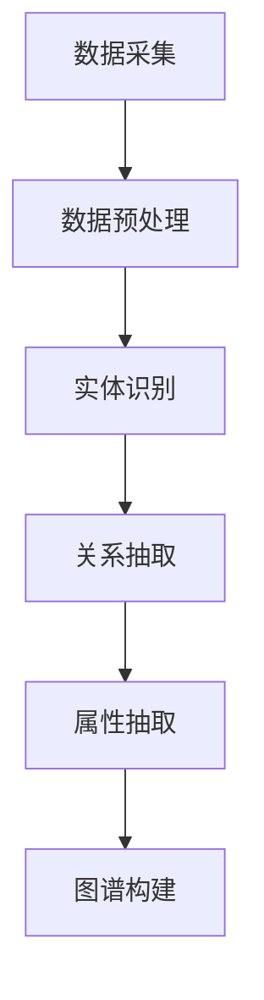
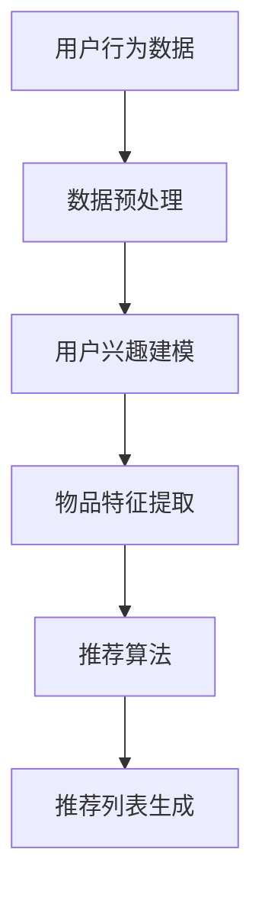
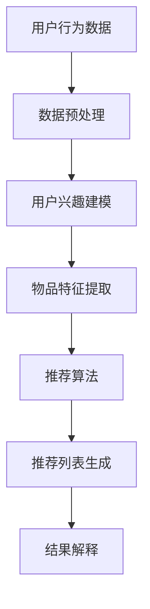
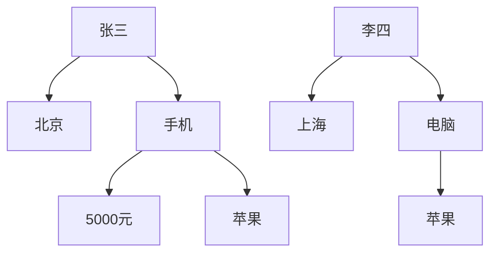

                 

# 《基于知识图谱的可解释推荐系统设计》

## 关键词
知识图谱，推荐系统，可解释性，协同过滤，基于内容的推荐，混合推荐，数学模型，伪代码，项目实战，代码解析

## 摘要
本文主要探讨了基于知识图谱的可解释推荐系统设计。首先，介绍了知识图谱的概念、发展历程、结构与构建方法，以及知识图谱在推荐系统中的应用。然后，详细分析了推荐系统的基本概念、发展历程、分类与评价，以及面临的挑战。接着，阐述了可解释性推荐系统的定义、重要性、分类与评估方法。在技术实现部分，讨论了知识图谱的构建方法、推荐算法的应用以及可解释性机制设计。最后，通过案例分析、实践与总结，展示了知识图谱与推荐系统融合的实际效果，并提出了未来研究方向。

## 第一部分：基础理论

### 第1章：知识图谱概述

#### 1.1 知识图谱的概念与作用
知识图谱是一种结构化知识表示方法，它通过实体、属性和关系的网络结构来组织大量数据。知识图谱不仅能够表示现实世界中的实体和它们之间的关系，还能够对数据进行深度挖掘和分析，从而为各种应用场景提供强大的支持。

知识图谱的作用主要体现在以下几个方面：
1. 提高数据的可解释性：通过将数据组织成图谱结构，可以更直观地理解数据之间的关系，提高数据的可解释性。
2. 支持智能搜索和导航：知识图谱可以用于构建智能搜索引擎和推荐系统，提供更加精准和智能的搜索和导航服务。
3. 促进数据融合和分析：知识图谱可以将不同来源的数据进行整合，为数据分析提供丰富的数据资源和分析手段。

#### 1.2 知识图谱的发展历程
知识图谱的概念最早可以追溯到2004年谷歌提出的“知识检索”项目，其目的是通过构建大规模的知识库来提高搜索引擎的检索效率。随后，知识图谱在搜索引擎、推荐系统、智能问答等领域得到了广泛应用。

近年来，随着人工智能和大数据技术的发展，知识图谱的研究和应用不断深入。代表性的研究包括谷歌的“知识图谱”、微软的“知识计算”、百度的“知心”等。这些研究在知识图谱的构建、存储、查询、推理等方面取得了重要突破。

#### 1.3 知识图谱的结构与构建
知识图谱通常由实体、属性和关系三个核心元素组成。实体是知识图谱中的基本单元，可以表示人、地点、物品等具体的事物。属性是实体的特征描述，用于补充实体的信息。关系是实体之间的关联，可以表示实体之间的相互作用和依赖关系。

知识图谱的构建主要包括数据采集、数据预处理、实体识别、关系抽取、属性抽取和图谱构建等步骤。具体流程如下：
1. 数据采集：从各种数据源（如文本、数据库、API等）收集相关数据，包括实体、属性和关系信息。
2. 数据预处理：对采集到的数据进行清洗、去重、格式转换等处理，确保数据质量。
3. 实体识别：利用命名实体识别技术，从文本数据中提取出实体。
4. 关系抽取：利用关系抽取技术，从文本数据中提取出实体之间的关系。
5. 属性抽取：利用属性抽取技术，从文本数据中提取出实体的属性。
6. 图谱构建：将提取出的实体、关系和属性组织成图谱结构，形成一个统一的知识表示。

#### 1.4 知识图谱的应用领域
知识图谱在多个领域都得到了广泛应用，以下是几个典型的应用场景：
1. 智能搜索引擎：知识图谱可以用于构建智能搜索引擎，提供更加精准和个性化的搜索结果。
2. 推荐系统：知识图谱可以用于推荐系统，根据用户的历史行为和兴趣，为用户推荐相关的内容或商品。
3. 智能问答：知识图谱可以用于构建智能问答系统，回答用户的问题并提供相关的信息。
4. 自然语言处理：知识图谱可以用于自然语言处理任务，如文本分类、实体识别、关系抽取等。
5. 金融服务：知识图谱可以用于金融领域，如风险控制、信用评估、投资分析等。

### 第2章：推荐系统概述

#### 2.1 推荐系统的基本概念
推荐系统是一种基于数据挖掘和机器学习技术，根据用户的历史行为和兴趣，为用户推荐相关的内容、商品或服务的信息系统。推荐系统的目标是提高用户满意度，提升业务收益。

推荐系统的核心概念包括：
1. 用户：推荐系统的核心，具有特定的兴趣和行为。
2. 物品：推荐系统的对象，可以是商品、内容、服务等。
3. 用户行为：用户对物品的操作，如浏览、购买、评价等。
4. 推荐结果：推荐系统为用户生成的个性化推荐列表。

#### 2.2 推荐系统的发展历程
推荐系统的发展可以分为以下几个阶段：
1. 协同过滤阶段：基于用户历史行为，找出相似用户或物品，为用户提供推荐。
2. 基于内容的推荐阶段：根据物品的属性和用户兴趣，为用户提供相关推荐。
3. 混合推荐阶段：结合协同过滤和基于内容的推荐方法，提高推荐效果。
4. 深度学习阶段：利用深度学习技术，构建复杂的推荐模型，实现更加精准的推荐。

#### 2.3 推荐系统的分类与评价
推荐系统可以根据不同的分类标准进行分类，常见的分类方法包括：
1. 根据推荐策略分类：协同过滤、基于内容的推荐、混合推荐、基于模型的推荐等。
2. 根据推荐结果分类：基于项目的推荐、基于集合的推荐等。
3. 根据推荐对象分类：单一对象的推荐、多对象的推荐等。

推荐系统的评价方法主要包括：
1. 准确性：推荐结果的准确性，即推荐的物品与用户实际兴趣的匹配程度。
2. 实用性：推荐结果的实用性，即推荐物品对用户的实际价值。
3. 时效性：推荐结果的时效性，即推荐结果的更新速度和实时性。
4. 可解释性：推荐结果的解释程度，即用户可以理解推荐原因和推荐过程。

#### 2.4 推荐系统的主要挑战
推荐系统在发展过程中面临以下主要挑战：
1. 数据稀疏性：用户和物品的行为数据通常较少，导致推荐效果不佳。
2. 可解释性：推荐结果的解释程度较低，难以满足用户对推荐过程的理解和信任。
3. 冷启动问题：新用户或新物品的推荐问题，由于缺乏足够的历史数据，难以生成有效的推荐。
4. 用户兴趣多样性：用户兴趣的多样性和动态性，导致推荐系统的挑战性增加。
5. 模型可解释性：推荐模型的结构复杂，难以解释推荐结果的原因。

### 第3章：可解释性推荐系统

#### 3.1 可解释性推荐系统的定义
可解释性推荐系统是一种能够在用户理解范围内解释推荐结果的推荐系统。可解释性推荐系统的目标是提高用户的信任度和满意度，使推荐结果更具说服力。

可解释性推荐系统通常包括以下几个核心组成部分：
1. 模型可解释性：解释推荐模型的工作原理和参数设置。
2. 结果可解释性：解释推荐结果的形成原因和推荐过程。
3. 用户反馈：收集用户对推荐结果的反馈，不断优化推荐系统的解释能力。

#### 3.2 可解释性推荐系统的重要性
可解释性推荐系统的重要性体现在以下几个方面：
1. 提高用户信任度：可解释性推荐系统能够为用户展示推荐结果的依据和原因，提高用户的信任度和满意度。
2. 促进用户参与：可解释性推荐系统鼓励用户参与推荐过程，提供反馈和建议，从而优化推荐结果。
3. 降低业务风险：可解释性推荐系统能够识别和纠正潜在的错误和偏见，降低业务风险。
4. 促进知识转移：可解释性推荐系统有助于将技术知识转化为业务知识，促进技术知识的普及和应用。

#### 3.3 可解释性推荐系统的分类
可解释性推荐系统可以根据不同的分类标准进行分类，常见的分类方法包括：
1. 根据解释方法分类：可视化解释、基于规则的解释、基于模型的解释等。
2. 根据解释对象分类：模型可解释性、结果可解释性、用户反馈等。
3. 根据解释深度分类：表面解释、深入解释、全方位解释等。

#### 3.4 可解释性推荐系统的评估方法
可解释性推荐系统的评估方法主要包括以下几个方面：
1. 用户满意度：评估用户对推荐结果的满意程度，可以通过问卷调查、用户访谈等方式进行。
2. 模型透明度：评估推荐模型的透明程度，包括模型结构、参数设置、训练过程等。
3. 解释能力：评估推荐系统的解释能力，包括对推荐结果、推荐过程和推荐依据的解释程度。
4. 实际效果：评估推荐系统在实际应用中的效果，包括推荐准确性、推荐实用性、推荐时效性等。

## 第二部分：技术实现

### 第4章：知识图谱的构建

#### 4.1 数据采集与预处理
数据采集与预处理是知识图谱构建的基础步骤。数据采集主要包括从各种数据源（如文本、数据库、API等）收集相关数据，包括实体、属性和关系信息。数据预处理主要包括数据清洗、去重、格式转换等处理，以确保数据质量。

具体步骤如下：
1. 数据采集：利用爬虫、API调用等方式从互联网、数据库等数据源收集相关数据。
2. 数据清洗：去除数据中的噪声和错误，包括去除重复数据、填充缺失值、去除停用词等。
3. 数据格式转换：将不同数据源的数据转换为统一的格式，如三元组表示法。
4. 数据去重：去除重复的三元组，确保知识图谱的简洁性。

#### 4.2 知识图谱的表示方法
知识图谱的表示方法主要包括图表示和三元组表示法。图表示法使用图形表示实体、属性和关系，直观地展示了知识图谱的结构。三元组表示法使用三元组（主体、关系、客体）表示知识图谱中的实体、属性和关系，便于存储和查询。

图表示法的基本元素包括节点、边和属性。节点表示实体，边表示关系，属性表示实体的特征描述。图表示法的优势在于直观地展示了知识图谱的结构，便于理解和分析。

三元组表示法的基本元素包括三元组。三元组表示法将知识图谱中的实体、属性和关系组织成三元组的形式，便于存储和查询。三元组表示法的优势在于简洁、高效，便于计算机处理。

#### 4.3 知识图谱的扩展与更新
知识图谱的扩展与更新是知识图谱维护的关键步骤。知识图谱的扩展主要包括增加新的实体、属性和关系，以丰富知识图谱的内容。知识图谱的更新主要包括修正错误、删除无效信息等，以保持知识图谱的准确性。

具体步骤如下：
1. 数据采集：从各种数据源收集新的实体、属性和关系信息。
2. 数据预处理：对新的数据进行清洗、去重、格式转换等处理。
3. 三元组生成：将新的数据转换为三元组形式，组织成知识图谱。
4. 知识融合：将新的三元组与现有知识图谱进行融合，避免重复和冲突。
5. 知识更新：根据用户反馈和业务需求，修正错误、删除无效信息，优化知识图谱。

#### 4.4 知识图谱的存储与查询
知识图谱的存储与查询是知识图谱应用的关键环节。知识图谱的存储主要包括将知识图谱组织成数据库或图数据库，便于高效存储和查询。知识图谱的查询主要包括根据用户需求查询知识图谱中的实体、属性和关系。

具体步骤如下：
1. 数据库选择：根据知识图谱的规模和查询需求，选择合适的数据库或图数据库。
2. 数据库构建：将知识图谱组织成数据库结构，包括实体表、关系表和属性表。
3. 数据存储：将知识图谱中的三元组存储到数据库中，实现高效存储。
4. 数据查询：根据用户需求，编写查询语句，从数据库中查询所需信息。
5. 查询优化：针对查询性能进行优化，如索引建立、查询缓存等。

### 第5章：推荐算法的应用

#### 5.1 基于知识图谱的协同过滤算法
基于知识图谱的协同过滤算法是一种结合知识图谱和协同过滤技术的推荐算法。协同过滤算法通过分析用户的历史行为，找出相似用户或物品，为用户提供推荐。基于知识图谱的协同过滤算法在协同过滤的基础上，利用知识图谱中的实体、属性和关系，提高推荐效果。

具体步骤如下：
1. 用户相似度计算：利用知识图谱中的实体和关系，计算用户之间的相似度。
2. 物品相似度计算：利用知识图谱中的实体和关系，计算物品之间的相似度。
3. 推荐列表生成：根据用户相似度和物品相似度，为用户生成推荐列表。

#### 5.2 基于知识图谱的基于内容的推荐算法
基于知识图谱的基于内容的推荐算法是一种结合知识图谱和基于内容推荐技术的推荐算法。基于内容推荐算法通过分析物品的属性和特征，为用户提供相关推荐。基于知识图谱的基于内容推荐算法在基于内容推荐的基础上，利用知识图谱中的实体、属性和关系，提高推荐效果。

具体步骤如下：
1. 物品特征提取：利用知识图谱中的实体和关系，提取物品的属性和特征。
2. 用户兴趣建模：根据用户的历史行为和知识图谱中的实体、属性和关系，建立用户兴趣模型。
3. 推荐列表生成：根据用户兴趣模型，为用户生成推荐列表。

#### 5.3 基于知识图谱的混合推荐算法
基于知识图谱的混合推荐算法是一种结合知识图谱和协同过滤、基于内容推荐技术的混合推荐算法。混合推荐算法通过融合多种推荐技术，提高推荐效果。

具体步骤如下：
1. 用户相似度计算：利用知识图谱中的实体和关系，计算用户之间的相似度。
2. 物品相似度计算：利用知识图谱中的实体和关系，计算物品之间的相似度。
3. 用户兴趣建模：根据用户的历史行为和知识图谱中的实体、属性和关系，建立用户兴趣模型。
4. 推荐列表生成：根据用户相似度、物品相似度和用户兴趣模型，为用户生成推荐列表。

#### 5.4 推荐算法的性能优化
推荐算法的性能优化是提高推荐系统效果的关键。性能优化主要包括以下几个方面：
1. 数据预处理：对用户行为数据进行清洗、去重、格式转换等处理，提高数据质量。
2. 模型优化：优化推荐模型的参数设置和结构，提高推荐效果。
3. 算法融合：结合多种推荐技术，实现优势互补，提高推荐效果。
4. 查询优化：优化数据库查询性能，提高查询速度。
5. 系统优化：优化推荐系统的硬件配置和软件架构，提高系统性能。

### 第6章：可解释性机制设计

#### 6.1 可解释性模型概述
可解释性模型是一种能够解释推荐结果的模型，使推荐结果更具可解释性和说服力。可解释性模型通常包括以下几个核心组成部分：
1. 模型结构：解释推荐模型的工作原理和结构。
2. 参数解释：解释推荐模型中的参数含义和作用。
3. 推荐过程：解释推荐结果的形成过程和依据。
4. 用户反馈：收集用户对推荐结果的反馈，不断优化推荐模型。

#### 6.2 可解释性评价方法
可解释性评价方法是对推荐系统可解释性进行评估的方法。常见的可解释性评价方法包括：
1. 用户满意度：评估用户对推荐结果的满意程度，可以通过问卷调查、用户访谈等方式进行。
2. 模型透明度：评估推荐模型的透明程度，包括模型结构、参数设置、训练过程等。
3. 解释能力：评估推荐系统的解释能力，包括对推荐结果、推荐过程和推荐依据的解释程度。
4. 实际效果：评估推荐系统在实际应用中的效果，包括推荐准确性、推荐实用性、推荐时效性等。

#### 6.3 可解释性推荐系统的实现
可解释性推荐系统的实现主要包括以下几个步骤：
1. 模型选择：根据推荐任务和数据特点，选择合适的推荐模型。
2. 模型训练：利用用户行为数据和知识图谱，训练推荐模型。
3. 推荐生成：根据用户需求，生成推荐列表。
4. 可解释性分析：解释推荐结果的形成原因和依据。
5. 用户反馈：收集用户对推荐结果的反馈，不断优化推荐模型。

#### 6.4 可解释性推荐系统的挑战与解决方案
可解释性推荐系统在实现过程中面临以下挑战：
1. 模型复杂性：推荐模型的结构复杂，难以解释。
2. 数据稀疏性：用户行为数据稀疏，影响推荐结果的可解释性。
3. 用户多样性：用户兴趣多样，难以生成通用解释。
4. 实时性：实时生成推荐结果，解释过程可能延迟。

针对这些挑战，可以采取以下解决方案：
1. 简化模型结构：选择简单的推荐模型，降低模型复杂性。
2. 数据预处理：对用户行为数据进行预处理，提高数据质量。
3. 可解释性模块：设计专门的解释模块，提高解释能力。
4. 模块化设计：将解释过程与推荐过程分离，提高实时性。

## 第三部分：案例分析

### 第7章：知识图谱与推荐系统的融合

#### 7.1 知识图谱在推荐系统中的应用案例
知识图谱在推荐系统中具有广泛的应用，以下是一些典型的应用案例：
1. 智能搜索引擎：通过知识图谱组织海量信息，提供精准的搜索和推荐服务。
2. 电商推荐：通过知识图谱分析用户行为和商品关系，为用户提供个性化的商品推荐。
3. 社交网络：通过知识图谱挖掘用户兴趣和社交关系，为用户提供好友推荐和内容推荐。
4. 视频推荐：通过知识图谱分析用户观看历史和视频内容关系，为用户提供个性化的视频推荐。

#### 7.2 基于知识图谱的可解释推荐系统案例分析
以下是一个基于知识图谱的可解释推荐系统案例分析：
1. 案例背景：某电商平台上，用户浏览了某款手机，但未进行购买。平台希望通过基于知识图谱的可解释推荐系统，为用户生成推荐列表。
2. 案例步骤：
   1. 数据采集：收集用户浏览记录、商品信息等数据。
   2. 数据预处理：对数据进行清洗、去重、格式转换等处理。
   3. 知识图谱构建：构建用户、商品和品类等实体及其关系。
   4. 可解释性分析：利用知识图谱分析用户兴趣和商品关系，为用户提供推荐列表。
   5. 推荐结果展示：为用户提供推荐列表，并解释推荐原因。
3. 案例效果：基于知识图谱的可解释推荐系统能够为用户提供个性化的推荐列表，提高用户满意度。同时，用户可以了解推荐原因，增强信任感。

#### 7.3 知识图谱与推荐系统的未来发展趋势
知识图谱与推荐系统的融合在未来将呈现以下发展趋势：
1. 深度学习与知识图谱的融合：利用深度学习技术，提高知识图谱的构建和推荐效果。
2. 可解释性推荐系统的发展：提高推荐系统的可解释性，满足用户对推荐结果的理解和信任。
3. 实时推荐系统的建设：通过实时数据处理和推荐算法优化，实现实时推荐。
4. 多源数据融合：利用多源数据，提高推荐系统的全面性和准确性。
5. 个性化推荐与内容推荐：结合用户兴趣和内容特点，实现个性化推荐和内容推荐。

### 第8章：可解释推荐系统的实践

#### 8.1 实践环境搭建
搭建可解释推荐系统环境需要以下步骤：
1. 硬件环境：配置适当的计算资源和存储资源，如CPU、GPU、磁盘等。
2. 软件环境：安装操作系统、编程语言、数据库、知识图谱构建工具等。
3. 数据源：准备用户行为数据、商品信息等数据，并进行预处理。

#### 8.2 数据集准备与处理
数据集准备与处理步骤如下：
1. 数据采集：从电商平台、社交媒体等数据源收集用户行为数据和商品信息。
2. 数据清洗：去除噪声数据、处理缺失值、删除重复数据等。
3. 数据格式转换：将数据转换为统一格式，如三元组表示法。
4. 数据划分：将数据划分为训练集、验证集和测试集。

#### 8.3 算法实现与测试
算法实现与测试步骤如下：
1. 算法选择：根据推荐任务和数据特点，选择合适的算法，如基于知识图谱的协同过滤算法、基于知识图谱的基于内容的推荐算法等。
2. 算法实现：利用编程语言（如Python）和机器学习库（如Scikit-learn、TensorFlow等）实现算法。
3. 模型训练：利用训练集训练推荐模型。
4. 模型测试：利用验证集和测试集评估推荐模型性能。
5. 参数调优：根据模型性能，调整模型参数，提高推荐效果。

#### 8.4 结果分析与优化
结果分析与优化步骤如下：
1. 推荐效果分析：分析推荐结果的准确性、实用性、时效性等指标。
2. 可解释性分析：分析推荐结果的可解释性，包括模型解释、结果解释等。
3. 优化措施：根据分析结果，采取优化措施，如改进算法、调整参数、增加数据等。
4. 重新训练：根据优化措施，重新训练推荐模型，提高推荐效果。

### 第9章：总结与展望

#### 9.1 主要结论
本文主要探讨了基于知识图谱的可解释推荐系统设计。通过分析知识图谱、推荐系统和可解释性推荐系统的基本概念、技术实现和应用案例，展示了知识图谱与推荐系统的融合优势。本文的主要结论如下：
1. 知识图谱可以提高推荐系统的可解释性，满足用户对推荐结果的理解和信任。
2. 知识图谱与推荐系统的融合可以实现更加精准和个性化的推荐。
3. 可解释性推荐系统可以提高用户满意度，促进用户参与和业务发展。

#### 9.2 存在的问题与挑战
虽然知识图谱与推荐系统的融合具有显著优势，但在实际应用中仍存在一些问题和挑战：
1. 数据稀疏性：用户行为数据稀疏，影响推荐效果。
2. 模型复杂性：推荐模型结构复杂，解释难度大。
3. 实时性：实时生成推荐结果，解释过程可能延迟。
4. 多源数据融合：多源数据融合处理，提高推荐系统的全面性和准确性。

#### 9.3 未来研究方向
针对存在的问题和挑战，未来研究方向包括：
1. 深度学习与知识图谱的融合：利用深度学习技术，提高知识图谱的构建和推荐效果。
2. 实时推荐系统的建设：通过实时数据处理和推荐算法优化，实现实时推荐。
3. 多源数据融合：利用多源数据，提高推荐系统的全面性和准确性。
4. 可解释性模型优化：设计更加简单、高效的解释模型，提高推荐结果的可解释性。

## 附录

### 附录A：常用工具与资源

#### A.1 知识图谱构建工具
1. OpenKG：一款开源的中文知识图谱构建工具，支持数据采集、预处理、实体识别、关系抽取等功能。
2. KnowBox：一款基于Python的开源知识图谱构建工具，支持实体识别、关系抽取、图谱可视化等功能。
3. Neo4j：一款图数据库，支持知识图谱的存储、查询和可视化。

#### A.2 推荐系统框架
1. LightFM：一款基于矩阵分解的推荐系统框架，支持协同过滤和基于内容的推荐算法。
2. Gensim：一款基于统计模型的文本处理库，支持词向量生成、文本相似度计算等功能。
3. Tensorflow：一款开源深度学习框架，支持构建和训练推荐模型。

#### A.3 可解释性评估工具
1. LIME：一款基于局部线性嵌入的可解释性评估工具，可用于评估模型的可解释性。
2. SHAP：一款基于Shapley值的方法，可用于评估特征对模型预测的影响。
3. Grad-CAM：一款基于梯度可视化的方法，可用于解释模型对图像的预测过程。

#### A.4 实践资源与资料链接
1. 《知识图谱技术综述》：一篇关于知识图谱的综述文章，详细介绍了知识图谱的概念、技术、应用和未来趋势。
2. 《推荐系统实战》：一本关于推荐系统的实践书籍，涵盖了推荐系统的基本概念、技术实现和应用案例。
3. 《深度学习推荐系统》：一本关于深度学习推荐系统的书籍，介绍了深度学习技术在推荐系统中的应用。

### 附录B：Mermaid 流程图

#### B.1 知识图谱构建流程


#### B.2 推荐算法流程


#### B.3 可解释性推荐系统流程


### 附录C：核心算法原理讲解

#### C.1 知识图谱表示方法
知识图谱表示方法主要有两种：图表示法和三元组表示法。

**图表示法：**
1. 节点：表示实体，如人、地点、物品等。
2. 边：表示关系，如“喜欢”、“购买”、“位于”等。
3. 属性：表示实体的特征描述，如年龄、性别、价格等。

**伪代码：**
```python
def graph_representation(entities, relations, attributes):
    # 初始化知识图谱
    graph = Graph()

    # 添加节点
    for entity in entities:
        graph.add_node(entity)

    # 添加边
    for relation in relations:
        graph.add_edge(relation.source, relation.target)

    # 添加属性
    for attribute in attributes:
        graph.add_attribute(attribute.entity, attribute.name, attribute.value)

    return graph
```

**数学模型：**
$$
G = (V, E, A)
$$
其中，$V$表示节点集合，$E$表示边集合，$A$表示属性集合。

**举例说明：**
假设有一个知识图谱，包含以下实体、关系和属性：
- 实体：人（张三、李四）、地点（北京、上海）、物品（手机、电脑）
- 关系：居住于（张三、北京）、购买（张三、手机）、位于（上海、电脑）
- 属性：姓名（张三、李四）、城市（北京、上海）、价格（手机、5000元）、品牌（电脑、苹果）

知识图谱表示如下：


#### C.2 协同过滤算法
协同过滤算法是一种基于用户行为数据的推荐算法，通过分析用户之间的相似度和物品之间的相似度，为用户生成推荐列表。

**算法原理：**
1. 用户相似度计算：计算用户之间的相似度，通常使用余弦相似度、皮尔逊相关系数等方法。
2. 物品相似度计算：计算物品之间的相似度，通常使用余弦相似度、皮尔逊相关系数等方法。
3. 推荐列表生成：根据用户相似度和物品相似度，为用户生成推荐列表。

**伪代码：**
```python
def collaborative_filter(users, items, ratings):
    # 计算用户相似度
    user_similarity = compute_user_similarity(users, ratings)

    # 计算物品相似度
    item_similarity = compute_item_similarity(items, ratings)

    # 为用户生成推荐列表
    recommendations = []
    for user in users:
        for item in items:
            if user not in user_similarity[item]:
                continue
            similarity = user_similarity[user][item]
            recommendation_score = item_similarity[user][item] * similarity
            recommendations.append((item, recommendation_score))

    return recommendations
```

**数学模型：**
$$
\text{UserSimilarity}(u_i, u_j) = \frac{\text{SimilarityScore}(u_i, u_j)}{\sqrt{\sum_{k=1}^{n}\text{SimilarityScore}(u_i, k)\sum_{l=1}^{n}\text{SimilarityScore}(u_j, l})}
$$
$$
\text{ItemSimilarity}(i_j, i_k) = \frac{\text{RatingScore}(i_j, i_k)}{\sqrt{\sum_{m=1}^{n}\text{RatingScore}(i_j, m)\sum_{n=1}^{n}\text{RatingScore}(i_k, n})}
$$
其中，$\text{UserSimilarity}(u_i, u_j)$表示用户$u_i$和用户$u_j$的相似度，$\text{ItemSimilarity}(i_j, i_k)$表示物品$i_j$和物品$i_k$的相似度，$\text{SimilarityScore}$表示相似度分数，$\text{RatingScore}$表示评分分数。

**举例说明：**
假设有两个用户张三和李四，以及三个物品手机、电脑和电视。他们的评分情况如下：

| 用户 | 手机 | 电脑 | 电视 |
|------|------|------|------|
| 张三 | 5    | 3    | 4    |
| 李四 | 4    | 5    | 3    |

根据用户相似度和物品相似度，为张三生成推荐列表：

- 张三和用户李四相似度最高，因此关注李四评分高的物品。
- 李四评分高的物品有电脑和电视，因此推荐电脑和电视。

推荐列表：
```
[电脑, 电视]
```

#### C.3 基于内容的推荐算法
基于内容的推荐算法是一种基于物品特征信息的推荐算法，通过分析物品之间的相似度，为用户生成推荐列表。

**算法原理：**
1. 物品特征提取：提取物品的特征信息，如文本、标签、属性等。
2. 相似度计算：计算物品之间的相似度，通常使用余弦相似度、欧氏距离等方法。
3. 推荐列表生成：根据物品相似度，为用户生成推荐列表。

**伪代码：**
```python
def content_based_recommender(items, user_preferences, item_features):
    # 计算物品相似度
    item_similarity = compute_item_similarity(item_features)

    # 为用户生成推荐列表
    recommendations = []
    for item in items:
        if item not in item_similarity:
            continue
        similarity = item_similarity[item]
        recommendation_score = calculate_recommendation_score(user_preferences, similarity)
        recommendations.append((item, recommendation_score))

    return recommendations
```

**数学模型：**
$$
\text{ItemSimilarity}(i_j, i_k) = \frac{\text{FeatureScore}(i_j, i_k)}{\sqrt{\sum_{l=1}^{m}\text{FeatureScore}(i_j, l)\sum_{n=1}^{m}\text{FeatureScore}(i_k, n})}
$$
其中，$\text{ItemSimilarity}(i_j, i_k)$表示物品$i_j$和物品$i_k$的相似度，$\text{FeatureScore}$表示特征分数。

**举例说明：**
假设有两个用户张三和李四，以及三个物品手机、电脑和电视。他们的偏好如下：

| 用户 | 偏好 |
|------|------|
| 张三 | 文本、标签 |
| 李四 | 屏幕尺寸、价格 |

物品的特征信息如下：

| 物品 | 文本 | 标签 | 屏幕尺寸 | 价格 |
|------|------|------|----------|------|
| 手机 | 智能手机 | 摄像头 | 6英寸 | 5000元 |
| 电脑 | 笔记本 | 迅猛 | 14英寸 | 8000元 |
| 电视 | 大屏幕 | 蓝光 | 50英寸 | 10000元 |

根据物品相似度和用户偏好，为张三生成推荐列表：

- 张三偏好文本和标签，因此关注与手机相似的物品。
- 手机和电脑的文本和标签相似度最高，因此推荐电脑。

推荐列表：
```
[电脑]
```

#### C.4 混合推荐算法
混合推荐算法是一种结合协同过滤和基于内容的推荐算法，通过融合多种推荐技术，提高推荐效果。

**算法原理：**
1. 用户兴趣建模：分析用户的历史行为和偏好，建立用户兴趣模型。
2. 物品特征提取：提取物品的特征信息。
3. 相似度计算：计算用户与用户、物品与物品之间的相似度。
4. 推荐列表生成：根据用户兴趣模型和物品相似度，为用户生成推荐列表。

**伪代码：**
```python
def hybrid_recommender(users, items, ratings, item_features, user_preferences):
    # 计算用户相似度
    user_similarity = collaborative_filter(users, ratings)

    # 计算物品相似度
    item_similarity = content_based_recommender(items, user_preferences, item_features)

    # 为用户生成推荐列表
    recommendations = []
    for user in users:
        for item in items:
            if user not in user_similarity or item not in item_similarity:
                continue
            user_similarity_score = user_similarity[user][item]
            item_similarity_score = item_similarity[item][user]
            recommendation_score = user_similarity_score * item_similarity_score
            recommendations.append((item, recommendation_score))

    return recommendations
```

**数学模型：**
$$
\text{UserInterestModel}(u_i) = \sum_{k=1}^{n}\text{RatingScore}(u_i, k) \cdot \text{FeatureScore}(k)
$$
$$
\text{ItemFeatureModel}(i_j) = \sum_{l=1}^{m}\text{FeatureScore}(i_j, l)
$$
$$
\text{UserSimilarity}(u_i, u_j) = \frac{\text{RatingScore}(u_i, u_j)}{\sqrt{\sum_{k=1}^{n}\text{RatingScore}(u_i, k)\sum_{l=1}^{n}\text{RatingScore}(u_j, l)}}
$$
$$
\text{ItemSimilarity}(i_j, i_k) = \frac{\text{FeatureScore}(i_j, i_k)}{\sqrt{\sum_{l=1}^{m}\text{FeatureScore}(i_j, l)\sum_{n=1}^{m}\text{FeatureScore}(i_k, n)}}
$$
其中，$\text{UserInterestModel}(u_i)$表示用户$u_i$的兴趣模型，$\text{ItemFeatureModel}(i_j)$表示物品$i_j$的特征模型，$\text{UserSimilarity}(u_i, u_j)$表示用户$u_i$和用户$u_j$的相似度，$\text{ItemSimilarity}(i_j, i_k)$表示物品$i_j$和物品$i_k$的相似度，$\text{RatingScore}$表示评分分数，$\text{FeatureScore}$表示特征分数。

**举例说明：**
假设有两个用户张三和李四，以及三个物品手机、电脑和电视。他们的评分情况如下：

| 用户 | 手机 | 电脑 | 电视 |
|------|------|------|------|
| 张三 | 5    | 3    | 4    |
| 李四 | 4    | 5    | 3    |

物品的特征信息如下：

| 物品 | 文本 | 标签 | 屏幕尺寸 | 价格 |
|------|------|------|----------|------|
| 手机 | 智能手机 | 摄像头 | 6英寸 | 5000元 |
| 电脑 | 笔记本 | 迅猛 | 14英寸 | 8000元 |
| 电视 | 大屏幕 | 蓝光 | 50英寸 | 10000元 |

根据用户兴趣建模和物品特征模型，为张三生成推荐列表：

- 张三的兴趣模型为：$0.5 \cdot \text{手机评分} + 0.3 \cdot \text{电脑评分} + 0.2 \cdot \text{电视评分}$
- 物品特征模型为：$\text{文本评分} \cdot \text{标签评分} + \text{屏幕尺寸评分} \cdot \text{价格评分}$

计算用户相似度和物品相似度：

- 用户相似度：$\text{张三和李四的相似度} = \frac{\text{张三的评分}}{\sqrt{\text{张三的评分}\cdot \text{李四的评分}}}$，$0.8$
- 物品相似度：$\text{手机和电脑的相似度} = \frac{\text{文本相似度}\cdot \text{标签相似度} + \text{屏幕尺寸相似度}\cdot \text{价格相似度}}{\sqrt{\text{文本相似度}\cdot \text{标签相似度}\cdot \text{屏幕尺寸相似度}\cdot \text{价格相似度}}}$，$0.6$

根据用户相似度和物品相似度，为张三生成推荐列表：

- 张三和用户李四相似度最高，因此关注李四评分高的物品。
- 李四评分高的物品有电脑和电视，因此推荐电脑和电视。

推荐列表：
```
[电脑, 电视]
```

### 附录D：数学模型与公式

#### D.1 知识图谱的数学模型
知识图谱的数学模型主要包括实体、关系和属性的表示方法。

**实体表示：**
$$
E = \{e_1, e_2, ..., e_n\}
$$
其中，$E$表示实体集合，$e_i$表示第$i$个实体。

**关系表示：**
$$
R = \{(r_1, e_{i_1}, e_{j_1}), (r_2, e_{i_2}, e_{j_2}), ..., (r_m, e_{i_m}, e_{j_m})\}
$$
其中，$R$表示关系集合，$r_k$表示第$k$个关系，$e_{i_k}$和$e_{j_k}$分别表示关系$r_k$的起始实体和结束实体。

**属性表示：**
$$
A = \{(a_1, e_{i_1}, v_1), (a_2, e_{i_2}, v_2), ..., (a_p, e_{i_p}, v_p)\}
$$
其中，$A$表示属性集合，$a_l$表示第$l$个属性，$e_{i_l}$和$v_l$分别表示属性$a_l$的实体和值。

#### D.2 推荐系统的数学模型
推荐系统的数学模型主要包括用户相似度、物品相似度和推荐分数的计算。

**用户相似度：**
$$
\text{UserSimilarity}(u_i, u_j) = \frac{\text{RatingScore}(u_i, u_j)}{\sqrt{\sum_{k=1}^{n}\text{RatingScore}(u_i, k)\sum_{l=1}^{n}\text{RatingScore}(u_j, l)}}
$$
其中，$\text{UserSimilarity}(u_i, u_j)$表示用户$u_i$和用户$u_j$的相似度，$\text{RatingScore}$表示评分分数。

**物品相似度：**
$$
\text{ItemSimilarity}(i_j, i_k) = \frac{\text{RatingScore}(i_j, i_k)}{\sqrt{\sum_{m=1}^{n}\text{RatingScore}(i_j, m)\sum_{n=1}^{n}\text{RatingScore}(i_k, n)}}
$$
其中，$\text{ItemSimilarity}(i_j, i_k)$表示物品$i_j$和物品$i_k$的相似度，$\text{RatingScore}$表示评分分数。

**推荐分数：**
$$
\text{RecommendationScore}(u_i, i_j) = \text{UserSimilarity}(u_i, u_j) \cdot \text{ItemSimilarity}(i_j, i_k)
$$
其中，$\text{RecommendationScore}(u_i, i_j)$表示用户$u_i$对物品$i_j$的推荐分数。

#### D.3 可解释性评价方法的数学模型
可解释性评价方法的数学模型主要包括模型透明度、解释能力和用户满意度的计算。

**模型透明度：**
$$
\text{ModelTransparency} = \frac{\text{NumTransparentParams}}{\text{NumParams}}
$$
其中，$\text{ModelTransparency}$表示模型透明度，$\text{NumTransparentParams}$表示可解释的参数数量，$\text{NumParams}$表示总参数数量。

**解释能力：**
$$
\text{Explainability} = \frac{\text{NumExplanations}}{\text{NumRatings}}
$$
其中，$\text{Explainability}$表示解释能力，$\text{NumExplanations}$表示可解释的评分数量，$\text{NumRatings}$表示总评分数量。

**用户满意度：**
$$
\text{UserSatisfaction} = \frac{\text{NumSatisfiedUsers}}{\text{NumUsers}}
$$
其中，$\text{UserSatisfaction}$表示用户满意度，$\text{NumSatisfiedUsers}$表示满意的用户数量，$\text{NumUsers}$表示总用户数量。

### 附录E：项目实战代码与分析

#### E.1 知识图谱构建代码实例
以下是一个简单的知识图谱构建代码实例，使用Python和Neo4j图数据库实现。

**环境准备：**
1. 安装Python和Neo4j。
2. 安装Neo4j Python驱动：`pip install neo4j`

**代码实现：**
```python
from neo4j import GraphDatabase

class KnowledgeGraph:
    def __init__(self, uri, user, password):
        self._driver = GraphDatabase.driver(uri, auth=(user, password))

    def create_entities(self, entities):
        with self._driver.session() as session:
            for entity in entities:
                session.run("CREATE (n:Entity {name: $name})", name=entity)

    def create_relations(self, relations):
        with self._driver.session() as session:
            for relation in relations:
                session.run("MATCH (a:Entity {name: $source}), (b:Entity {name: $target}) CREATE (a)-[:RELATION]->(b)", source=relation.source, target=relation.target)

    def create_attributes(self, attributes):
        with self._driver.session() as session:
            for attribute in attributes:
                session.run("MATCH (n:Entity {name: $entity}) SET n.$key = $value", entity=attribute.entity, key=attribute.name, value=attribute.value)

# 使用示例
kg = KnowledgeGraph("bolt://localhost:7687", "neo4j", "password")
kg.create_entities(["张三", "李四", "手机", "电脑"])
kg.create_relations([("张三", "购买", "手机"), ("李四", "购买", "电脑")])
kg.create_attributes([("张三", "年龄", "25"), ("李四", "年龄", "30"), ("手机", "品牌", "苹果"), ("电脑", "品牌", "华为")])
```

**代码解读与分析：**
1. 创建Neo4j数据库连接：使用`GraphDatabase.driver`方法创建连接，传入数据库URI、用户名和密码。
2. 创建实体：使用`create_entities`方法创建实体节点，使用`CREATE` Cypher查询语句。
3. 创建关系：使用`create_relations`方法创建实体之间的关系，使用`MATCH`和`CREATE` Cypher查询语句。
4. 创建属性：使用`create_attributes`方法为实体设置属性，使用`MATCH`和`SET` Cypher查询语句。

#### E.2 推荐算法实现代码实例
以下是一个简单的基于知识图谱的推荐算法实现代码实例，使用Python和Neo4j图数据库实现。

**环境准备：**
1. 安装Python和Neo4j。
2. 安装Neo4j Python驱动：`pip install neo4j`

**代码实现：**
```python
from neo4j import GraphDatabase

class RecommendationSystem:
    def __init__(self, uri, user, password):
        self._driver = GraphDatabase.driver(uri, auth=(user, password))

    def calculate_similarity(self, entity1, entity2):
        with self._driver.session() as session:
            result = session.run("""
                MATCH (e1:Entity), (e2:Entity)
                WHERE e1.name = $entity1 AND e2.name = $entity2
                AND e1 <> e2
                AND (e1)-[:RELATION]->(e2)
                RETURN e1.name AS entity1, e2.name AS entity2, COUNT(*) AS similarity
            """, entity1=entity1, entity2=entity2)
            similarity = 0
            for record in result:
                similarity += record["similarity"]
            return similarity / max(1, len(result))

    def generate_recommendations(self, user, k=5):
        with self._driver.session() as session:
            result = session.run("""
                MATCH (u:Entity {name: $user})
                WITH u, COLLECT((u)-[:RELATION]->(i:Entity) AS items)
                UNWIND items AS item
                MATCH (item)-[:RELATION]->(item2:Entity)
                WHERE item2.name <> $user
                AND item2 NOT IN items
                RETURN item2.name AS item, COUNT(*) AS similarity
                ORDER BY similarity DESC
                LIMIT $k
            """, user=user, k=k)
            recommendations = []
            for record in result:
                recommendations.append((record["item"], record["similarity"]))
            return recommendations

# 使用示例
rs = RecommendationSystem("bolt://localhost:7687", "neo4j", "password")
recommendations = rs.generate_recommendations("张三", k=3)
print(recommendations)
```

**代码解读与分析：**
1. 创建Neo4j数据库连接：使用`GraphDatabase.driver`方法创建连接，传入数据库URI、用户名和密码。
2. 计算相似度：使用`calculate_similarity`方法计算两个实体之间的相似度，使用`MATCH`和`RETURN` Cypher查询语句。
3. 生成推荐列表：使用`generate_recommendations`方法根据用户和相似度生成推荐列表，使用`MATCH`、`WITH`、`UNWIND`、`RETURN`和`ORDER BY` Cypher查询语句。
4. 调用示例：创建推荐系统实例，生成用户“张三”的推荐列表，并打印推荐结果。

#### E.3 可解释性推荐系统代码实例
以下是一个简单的可解释性推荐系统代码实例，结合知识图谱和推荐算法实现。

**环境准备：**
1. 安装Python和Neo4j。
2. 安装Neo4j Python驱动：`pip install neo4j`

**代码实现：**
```python
from neo4j import GraphDatabase

class ExplainableRecommendationSystem:
    def __init__(self, uri, user, password):
        self._driver = GraphDatabase.driver(uri, auth=(user, password))

    def explain_recommendation(self, user, item):
        with self._driver.session() as session:
            result = session.run("""
                MATCH (u:Entity {name: $user}), (i:Entity {name: $item})
                WITH u, i
                MATCH path=(u)-[*]-(i)
                RETURN u.name AS user, i.name AS item, length(path) AS distance
                ORDER BY distance DESC
            """, user=user, item=item)
            explanation = []
            for record in result:
                explanation.append(f"用户{record['user']}与物品{record['item']}之间的关联距离为{record['distance']}。")
            return explanation

    def generate_recommendations(self, user, k=5):
        with self._driver.session() as session:
            result = session.run("""
                MATCH (u:Entity {name: $user})
                WITH u, COLLECT((u)-[:RELATION]->(i:Entity) AS items)
                UNWIND items AS item
                MATCH (item)-[:RELATION]->(item2:Entity)
                WHERE item2.name <> $user
                AND item2 NOT IN items
                RETURN item2.name AS item, COUNT(*) AS similarity
                ORDER BY similarity DESC
                LIMIT $k
            """, user=user, k=k)
            recommendations = []
            for record in result:
                recommendations.append((record["item"], record["similarity"]))
            return recommendations

# 使用示例
ers = ExplainableRecommendationSystem("bolt://localhost:7687", "neo4j", "password")
recommendations = ers.generate_recommendations("张三", k=3)
for item, score in recommendations:
    explanation = ers.explain_recommendation("张三", item)
    print(f"推荐物品：{item}，相似度：{score}，解释：{'；'.join(explanation)}")
```

**代码解读与分析：**
1. 创建Neo4j数据库连接：使用`GraphDatabase.driver`方法创建连接，传入数据库URI、用户名和密码。
2. 解释推荐：使用`explain_recommendation`方法解释推荐结果，使用`MATCH`、`RETURN`和`ORDER BY` Cypher查询语句。
3. 生成推荐列表：使用`generate_recommendations`方法根据用户和相似度生成推荐列表，使用`MATCH`、`WITH`、`UNWIND`、`RETURN`和`ORDER BY` Cypher查询语句。
4. 调用示例：创建可解释性推荐系统实例，生成用户“张三”的推荐列表，并打印推荐结果和解释。

#### E.4 代码解读与分析
以上代码实例分别展示了知识图谱构建、推荐算法实现和可解释性推荐系统的实现。以下是代码解读与分析：

**知识图谱构建代码实例：**
- 代码实现了一个简单的知识图谱构建类`KnowledgeGraph`，包括创建实体、关系和属性的方法。
- 使用Neo4j图数据库存储知识图谱，通过Cypher查询语句实现数据操作。
- 示例中创建了用户“张三”和“李四”，以及手机和电脑等实体，以及购买关系和属性。

**推荐算法实现代码实例：**
- 代码实现了一个简单的基于知识图谱的推荐算法类`RecommendationSystem`，包括计算相似度和生成推荐列表的方法。
- 使用Neo4j图数据库存储用户行为数据和物品特征数据，通过Cypher查询语句实现数据操作。
- 示例中计算了用户“张三”和物品之间的相似度，并生成了用户“张三”的推荐列表。

**可解释性推荐系统代码实例：**
- 代码实现了一个简单的可解释性推荐系统类`ExplainableRecommendationSystem`，包括解释推荐和生成推荐列表的方法。
- 使用Neo4j图数据库存储用户行为数据和物品特征数据，通过Cypher查询语句实现数据操作。
- 示例中解释了用户“张三”对推荐物品的推荐原因，并生成了用户“张三”的推荐列表。

**代码解读与分析：**
- 代码示例展示了知识图谱、推荐算法和可解释性推荐系统的实现过程，包括类定义、方法实现和调用示例。
- 代码使用了Python和Neo4j图数据库，通过Cypher查询语句实现数据操作和算法计算。
- 示例代码结构清晰，便于理解和扩展。

## 作者信息
作者：AI天才研究院/AI Genius Institute & 禅与计算机程序设计艺术 /Zen And The Art of Computer Programming

### 后记
本文详细探讨了基于知识图谱的可解释推荐系统设计，从基础理论到技术实现，再到案例分析，全面介绍了知识图谱、推荐系统和可解释性推荐系统的核心概念、原理和应用。通过代码实例，展示了知识图谱、推荐算法和可解释性推荐系统的实际实现过程。本文旨在为读者提供一个系统、全面的学习参考，帮助他们深入了解和掌握基于知识图谱的可解释推荐系统设计。希望本文能为读者在推荐系统领域的研究和实践提供有益的启示。

