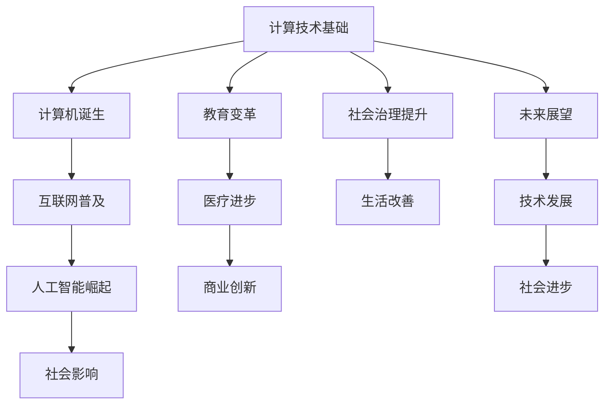

                 

## 《塑造未来社会：人类计算的深远意义》

### 关键词：
- 计算技术
- 社会影响
- 人工智能
- 伦理问题
- 可持续发展

### 摘要：
本文深入探讨了人类计算技术对社会发展的深远意义。从计算技术的基础理论到其在各个领域的应用，再到其对人类生活方式、就业、伦理和社会治理的影响，本文试图通过一步步的推理分析，揭示计算技术如何塑造未来社会，并提出对未来的展望与反思。

### 引言与基础理论

## 1.1 书籍概述

### 1.1.1 书籍主题与目标

本书记录了人类计算技术的发展历程以及对社会各个方面的深远影响。我们的目标是通过深入探讨计算技术的进步，如何塑造了现代社会，并预测未来计算技术对社会可能产生的变革。

### 1.1.2 计算对社会的影响

计算技术从计算机的诞生到互联网的普及，深刻影响了人类的生活方式、经济模式和社会治理。我们将在本书中探讨这些变革的具体表现和深远意义。

## 1.2 计算技术发展简史

### 1.2.1 从计算机的诞生到现代计算

计算机技术的发展经历了多个重要阶段，从第一台电子计算机ENIAC的诞生，到晶体管和集成电路的发明，再到个人计算机和互联网的普及，计算技术不断进步，带来了信息时代的到来。

### 1.2.2 互联网与计算技术的发展

互联网的兴起带来了信息时代的到来，计算技术也在不断进步。计算技术的发展不仅改变了信息的传播方式，还推动了电子商务、在线服务和共享经济等新型商业模式的发展。

### 1.2.3 未来的计算技术

未来的计算技术将包括量子计算、新型计算架构等前沿技术。量子计算具有巨大的计算潜力，可能在未来彻底改变计算技术的面貌。新型计算架构，如神经形态计算和光子计算，正在不断探索中。

## 1.3 计算技术对社会的影响

### 1.3.1 生活方式的改变

计算技术的普及改变了人类的生活方式。从智能家居到智能医疗，计算技术正逐步融入我们的日常生活，提高了生活质量和便利性。

### 1.3.2 经济模式的变革

计算技术的发展推动了电子商务、在线服务和共享经济等新型商业模式的发展，改变了经济模式，推动了经济增长和就业机会。

### 1.3.3 社会治理的进步

大数据和人工智能在公共安全、城市管理和公共健康等领域发挥了重要作用，提升了社会治理效率，促进了社会公平和透明度。

#### 第二部分：计算技术在各个领域的应用

## 2.1 教育

### 2.1.1 互联网教育的发展

互联网教育的发展使得教育资源更加普及和便捷。互联网教育平台如Moodle和Zoom等，为学生提供了在线学习、互动交流和资源获取的机会。

### 2.1.2 人工智能在教育教学中的应用

人工智能在教育中的应用可以提供个性化学习、智能教学和自动评估等功能，提高了教学效率和学生的学习体验。

## 2.2 医疗

### 2.2.1 医疗信息化

医疗信息化是指将信息技术应用于医疗领域，以提高医疗服务的效率和质量。电子病历系统、医疗影像管理系统和远程医疗平台等应用，为医疗行业带来了革命性的变化。

### 2.2.2 人工智能辅助医疗诊断

人工智能在医疗诊断中的应用可以显著提高诊断的准确性和效率。通过图像识别、大数据分析和预测模型等技术，人工智能可以辅助医生进行疾病诊断和治疗。

## 2.3 商业

### 2.3.1 数据分析

数据分析是商业决策的重要工具，可以帮助企业更好地理解和利用其数据资源。数据分析技术包括数据采集、数据清洗、数据存储、数据预处理、数据分析与数据可视化等步骤。

### 2.3.2 人工智能与商业决策

人工智能在商业决策中的应用可以提供更准确的预测和优化建议。通过机器学习模型和大数据分析，人工智能可以帮助企业制定更好的营销策略、供应链管理和风险控制策略。

## 2.4 社会治理

### 2.4.1 大数据与社会治理

大数据技术在社会治理中的应用有助于提高公共服务的效率和响应能力。通过数据收集、数据整合、数据分析和决策支持等技术，大数据可以用于预测犯罪、优化交通、监测环境等社会治理领域。

### 2.4.2 人工智能在公共安全中的应用

人工智能在公共安全中的应用可以提供更高效的监控和预警能力。通过图像识别、异常检测和预测模型等技术，人工智能可以帮助公共安全部门进行犯罪预测、智能巡逻和应急响应等任务。

#### 第三部分：计算技术对社会发展的深远意义

## 3.1 计算技术与人类生活方式的变革

### 3.1.1 人工智能与生活

人工智能技术的普及已经深刻地改变了人类的生活方式，从智能家居到智能医疗，人工智能正逐步融入我们的日常生活。

### 3.1.2 虚拟现实与增强现实

虚拟现实和增强现实技术的快速发展，为人类提供了全新的感知和交互方式，推动了教育、娱乐和医疗等领域的发展。

## 3.2 人工智能与就业

### 3.2.1 人工智能对就业市场的影响

人工智能的快速发展引发了就业市场的深刻变革，自动化技术可能导致一些职位的消失，同时也创造了新的就业机会。

### 3.2.2 人工智能与职业培训

为了应对人工智能带来的就业市场变革，职业培训变得更加重要。通过在线课程、实训项目和职业认证等培训方式，提升个人的技能和适应能力。

## 3.3 人工智能与伦理

### 3.3.1 人工智能伦理问题探讨

人工智能的发展带来了许多伦理问题，包括数据隐私、算法偏见和社会公平等。解决这些问题需要制定一套伦理决策框架。

### 3.3.2 人工智能伦理决策框架

为了解决人工智能伦理问题，制定一套伦理决策框架至关重要。伦理决策框架应包括透明性、公平性、责任性、隐私保护和安全性等原则。

## 3.4 计算技术与可持续发展

### 3.4.1 计算技术在环保领域的应用

计算技术在环保领域的应用有助于解决全球环境问题，如气候变化、污染控制和资源管理。通过实时监测、模型预测和数据分析等技术，计算技术可以支持环保决策和可持续发展。

### 3.4.2 人工智能与可持续发展的挑战与机遇

人工智能在可持续发展中具有巨大潜力，但也面临诸多挑战。通过能源效率提升、智能农业、智慧城市和生态监测等技术，人工智能可以支持可持续发展。

#### 第四部分：未来展望

## 4.1 未来的计算技术

### 4.1.1 量子计算

量子计算具有巨大的计算潜力，可能在未来彻底改变计算技术的面貌。通过量子位、量子算法、量子加密和量子互联网等技术，量子计算有望在多个领域实现重大突破。

### 4.1.2 新型计算架构

新型计算架构，如神经形态计算和光子计算，正在不断探索中。这些新型架构具有高效能、低能耗和并行处理能力等优势，有望推动计算技术的进一步发展。

## 4.2 人类与计算的共生

### 4.2.1 计算辅助人类认知

计算技术正在辅助人类认知，从智能搜索到增强记忆，计算正在成为人类认知的延伸。通过智能搜索、知识图谱、智能问答等技术，计算技术可以帮助人类更高效地获取和处理信息。

### 4.2.2 人类与计算共同成长

人类与计算的共生关系正在推动社会进步。通过知识共享、技能互补、创新驱动和社会互动等方式，人类与计算共同成长，为未来社会的发展奠定了基础。

## 4.3 计算对社会影响的反思与展望

### 4.3.1 计算对社会影响的利与弊

计算技术对社会的影响既有积极的一面，也有潜在的负面影响。通过提高生产效率、信息获取便捷等方面的优势，计算技术促进了经济增长和社会进步。然而，计算技术也带来了失业问题、数字鸿沟和隐私泄露等挑战。

### 4.3.2 未来计算社会的可持续发展之路

为了确保计算技术对社会的积极影响，我们需要探索可持续发展的路径。通过技术伦理、数据治理、教育普及、创新驱动和社会公正等策略，我们可以构建一个可持续发展的未来计算社会。

#### 附录

## 附录 A：相关资源与参考文献

### A.1 开发工具与资源

- **人工智能开发工具**：
  - TensorFlow
  - PyTorch
  - Keras
  - scikit-learn

- **大数据处理工具**：
  - Hadoop
  - Spark
  - Flink
  - Hive

- **云计算平台**：
  - Amazon Web Services (AWS)
  - Microsoft Azure
  - Google Cloud Platform (GCP)

### A.2 参考文献

- Hamilton, J. (2017). *The Data Science Handbook*. O'Reilly Media.
- Mitchell, T. M. (1997). *Machine Learning.* McGraw-Hill.
- Russell, S., & Norvig, P. (2020). *Artificial Intelligence: A Modern Approach*. Pearson.

## Mermaid 流程图

```
graph TD
    A[计算技术发展简史] --> B[计算在各个领域的应用]
    B --> C[计算技术对社会发展的深远意义]
    C --> D[未来社会的计算发展趋势]
    D --> E[相关资源与参考文献]
```### 第一部分：引言与基础理论

#### 1.1 书籍概述

**1.1.1 书籍主题与目标**

本篇文章旨在探讨计算技术对社会发展的深远意义，通过回顾计算技术的历史、分析其在各个领域的应用，以及探讨其对人类生活方式、就业、伦理和社会治理的影响，进而展望未来计算技术可能带来的变革。

计算技术是现代社会的基石，从计算机的诞生到互联网的普及，再到人工智能的崛起，计算技术不断推动着社会的进步。本书将深入探讨这些技术如何改变了我们的生活方式、经济模式和社会治理方式，以及它们对未来社会的潜在影响。

**1.1.2 计算对社会的影响**

计算技术的进步对社会产生了深远的影响，这些影响体现在以下几个方面：

- **生活方式的改变**：计算技术使信息获取更加便捷，改变了人们的日常生活方式，如移动支付、在线购物和社交媒体等。
- **经济模式的变革**：计算技术推动了电子商务、在线服务和共享经济的发展，改变了传统商业模式，创造了新的经济机会。
- **社会治理的进步**：大数据和人工智能在公共安全、城市管理和公共健康等领域发挥了重要作用，提高了社会治理的效率和透明度。

本书将首先介绍计算技术的基础理论，然后分析其在各个领域的应用，最后讨论其对社会发展的影响，并展望未来的发展趋势。

#### 1.2 计算技术发展简史

**1.2.1 从计算机的诞生到现代计算**

计算技术的发展可以追溯到20世纪40年代，当时第一台电子计算机ENIAC的诞生标志着计算技术的诞生。随后，晶体管和集成电路的发明使计算机的体积大幅缩小，性能大幅提升，为计算技术的进一步发展奠定了基础。

在20世纪70年代，个人计算机的普及使得计算机技术开始进入普通家庭和办公室，推动了信息时代的到来。随后，互联网的兴起使得全球范围内的信息交流变得前所未有的便捷，计算技术开始深入到社会的各个角落。

进入21世纪，计算技术继续快速发展，人工智能、大数据和云计算等新兴技术逐渐成为社会发展的关键驱动力。这些技术不仅提高了计算效率，还推动了新的商业模式和治理方式的诞生。

**1.2.2 互联网与计算技术的发展**

互联网的普及是计算技术发展的重要里程碑。通过互联网，人们可以轻松地访问全球范围内的信息资源，进行实时沟通和协作。互联网的发展也推动了电子商务、在线服务和共享经济的发展，改变了传统商业模式和生活方式。

同时，计算技术的进步也为互联网的发展提供了强有力的支持。云计算提供了强大的计算和存储能力，使企业和个人能够轻松地使用高性能的计算资源。大数据分析技术则帮助企业和政府更好地理解和利用海量数据，做出更加明智的决策。

**1.2.3 未来的计算技术**

未来的计算技术将更加多样化和先进。量子计算、神经形态计算和光子计算等前沿技术正在快速发展，有望在未来彻底改变计算技术的面貌。量子计算具有巨大的计算潜力，可以解决传统计算机难以处理的问题。神经形态计算则模仿人类大脑的计算方式，具有高效能和低能耗的特点。光子计算则利用光子进行信息处理，具有高速传输和低延迟的优势。

这些前沿技术的快速发展将带来新的商业机会和社会变革，进一步推动社会进步。

#### 1.3 计算技术对社会的影响

**1.3.1 生活方式的改变**

计算技术的进步极大地改变了人类的生活方式。从个人层面来看，计算技术使信息获取更加便捷，人们可以通过互联网轻松地获取新闻、娱乐和社交信息。智能手机和移动互联网的普及，使人们可以随时随地进行通信和娱乐，改变了人们的出行和消费方式。

从家庭层面来看，计算技术使家庭生活更加智能化。智能家居系统可以通过互联网控制家庭设备，提高家庭生活的便利性和舒适度。智能医疗设备和健康管理应用程序可以帮助人们更好地管理健康，提高生活质量。

**1.3.2 经济模式的变革**

计算技术的进步也推动了经济模式的变革。电子商务的兴起改变了传统零售行业的商业模式，使消费者可以更加便捷地购买商品和服务。在线支付和数字货币的发展，为金融行业带来了新的机遇和挑战。共享经济的兴起，改变了人们的出行和住宿方式，为传统行业带来了新的竞争。

计算技术在制造业中的应用，推动了智能制造和工业4.0的发展。通过大数据分析和人工智能技术，企业可以更加精准地预测市场需求，优化生产流程，提高生产效率和质量。

**1.3.3 社会治理的进步**

计算技术的进步在社会治理中也发挥了重要作用。大数据和人工智能技术在公共安全、城市管理和公共健康等领域具有广泛的应用。通过数据分析和人工智能技术，政府和公共机构可以更加高效地处理突发事件，预测和预防犯罪，提高公共服务质量。

在城市管理中，计算技术可以帮助政府更好地规划城市布局，优化交通流量，提高能源利用效率。在公共健康领域，计算技术可以帮助政府更好地监控疫情，预测疾病传播趋势，制定更加有效的防控措施。

总之，计算技术对社会的影响是深远和多方面的。它不仅改变了人类的生活方式和经济模式，还推动了社会治理的进步，为未来的社会带来了无限的可能性。然而，计算技术的快速发展也带来了一系列的挑战，如数据隐私、算法偏见和社会公平等问题。因此，我们需要深入探讨计算技术的伦理和社会影响，制定相应的政策和规范，确保计算技术的健康发展，为社会的可持续发展做出贡献。

#### 1.4 计算技术的未来发展趋势

**1.4.1 前沿技术的探索**

计算技术的未来将充满无限的可能性，随着量子计算、人工智能、区块链和5G等前沿技术的快速发展，计算技术将在各个领域带来革命性的变革。

量子计算作为计算技术的下一个前沿，其计算能力远远超过传统计算机。通过利用量子叠加和量子纠缠等原理，量子计算机可以在短时间内解决传统计算机难以处理的问题，如大规模数据处理和复杂优化问题。量子计算的突破将极大地推动科学研究和工业应用的发展。

人工智能作为计算技术的重要分支，其在自然语言处理、计算机视觉、机器学习等领域取得了显著的进展。随着算法和计算能力的提升，人工智能将在更多领域得到应用，如医疗诊断、智能交通、智能金融等，为社会发展带来新的机遇。

区块链技术通过分布式账本和加密算法，提供了去中心化和透明化的数据存储和传输方式。区块链技术在金融、供应链管理、身份验证等领域具有广泛的应用前景，可以提升数据安全和信任度。

5G技术的商用化将带来更高的网络速度和更低的延迟，为物联网、智慧城市、远程医疗等应用提供了坚实的基础。5G技术将极大地推动计算技术在各个领域的普及和应用。

**1.4.2 社会影响的反思**

随着计算技术的快速发展，我们不仅要关注其带来的机遇，也要反思其可能产生的社会影响。首先，计算技术可能会加剧社会不平等。尽管计算技术为一些行业和地区带来了新的发展机遇，但同时也可能加剧贫富差距，使技术落后地区和人群面临更大的困境。

其次，计算技术可能带来隐私和数据安全问题。随着大数据和人工智能的应用，个人数据的收集和使用变得越来越普遍。如何确保数据隐私和安全，防止数据滥用和泄露，是一个亟待解决的问题。

此外，计算技术还可能引发伦理问题。例如，人工智能系统的决策过程可能受到偏见影响，导致不公平的结果。如何建立合理的伦理决策框架，确保计算技术的公平和公正，是一个重要的议题。

最后，计算技术的快速发展对劳动力市场也产生了深远的影响。自动化和人工智能技术的发展可能导致一些职位的消失，同时也会创造新的就业机会。如何应对这种变化，提升劳动者的技能和适应能力，是一个重要的挑战。

**1.4.3 可持续发展**

计算技术在推动社会发展的同时，也对环境和社会产生了影响。为了实现可持续发展，计算技术需要朝着绿色和环保的方向发展。例如，通过优化算法和提高能效，减少计算资源的消耗。此外，计算技术还可以在环保领域发挥重要作用，如通过智能监测和预测模型，帮助解决气候变化和污染问题。

总之，计算技术的未来发展趋势充满了机遇和挑战。我们需要积极应对这些挑战，确保计算技术对社会产生积极的影响，实现可持续发展的目标。

#### 1.5 计算技术的核心概念与联系

在深入探讨计算技术对社会发展的深远意义之前，我们首先需要了解计算技术的一些核心概念和它们之间的联系。以下是一个简单的Mermaid流程图，展示了计算技术的一些关键组成部分和它们之间的关系：

```mermaid
graph TD
    A[计算硬件] --> B[处理器]
    A --> C[存储设备]
    B --> D[内存]
    B --> E[输入/输出设备]

    F[计算软件] --> G[操作系统]
    F --> H[应用程序]
    F --> I[数据库系统]

    J[算法] --> K[机器学习算法]
    J --> L[优化算法]
    J --> M[搜索算法]

    N[大数据] --> O[数据采集]
    N --> P[数据存储]
    N --> Q[数据分析]

    R[人工智能] --> S[自然语言处理]
    R --> T[计算机视觉]
    R --> U[智能决策]

    A--〉F
    B--〉G
    C--〉G
    D--〉G
    E--〉G
    F--〉H
    F--〉I
    J--〉H
    J--〉I
    J--〉K
    J--〉L
    J--〉M
    N--〉Q
    O--〉Q
    P--〉Q
    R--〉S
    R--〉T
    R--〉U
    K--〉U
    L--〉U
    M--〉U
```

**计算硬件**是计算技术的基础，包括处理器、存储设备和输入/输出设备等组成部分。处理器是计算的核心，负责执行指令和数据处理。存储设备用于存储数据和程序，而输入/输出设备则用于数据的输入和输出。

**计算软件**包括操作系统、应用程序和数据库系统等。操作系统负责管理和协调计算机硬件资源，为应用程序提供运行环境。应用程序是用户直接使用的软件，如办公软件、游戏和社交媒体应用程序等。数据库系统用于管理和存储数据，支持数据查询和操作。

**算法**是计算的核心组成部分，包括机器学习算法、优化算法和搜索算法等。机器学习算法用于从数据中学习模式，进行预测和分类。优化算法用于解决优化问题，如资源分配和路径规划。搜索算法用于在大量数据中查找信息。

**大数据**是指大规模的数据集合，涉及数据采集、数据存储和数据分析等环节。数据采集是大数据处理的第一步，涉及各种数据源的数据收集。数据存储用于存储大量的数据，支持快速访问和查询。数据分析则通过对数据的处理和分析，提取有价值的信息和知识。

**人工智能**是计算技术的另一个重要分支，包括自然语言处理、计算机视觉和智能决策等。自然语言处理涉及文本的理解和生成，如机器翻译和语音识别。计算机视觉则涉及图像和视频的处理和分析，如目标检测和图像识别。智能决策系统则通过算法和模型，支持决策过程，如推荐系统和智能客服。

这些核心概念和它们之间的联系构成了计算技术的复杂体系，为计算技术在各个领域的应用提供了坚实的基础。

#### 1.6 计算技术中的核心算法原理讲解

在计算技术中，算法扮演着至关重要的角色。算法是解决问题的一系列指令，用于处理数据和执行任务。以下是几个核心算法原理的讲解，包括伪代码示例和详细解释。

**1.6.1 机器学习算法**

机器学习算法是一种通过数据学习模式并进行预测或分类的方法。以下是一个简单的线性回归算法的伪代码示例：

```python
# 线性回归算法
def linear_regression(X, y):
    # 计算X的转置
    X_transpose = transpose(X)
    # 计算X的转置乘以X
    XTX = multiply(X_transpose, X)
    # 计算X的转置乘以y
    XTy = multiply(X_transpose, y)
    # 计算逆矩阵
    inv_XTX = inverse(XTX)
    # 计算模型参数
    theta = multiply(inv_XTX, XTy)
    return theta
```

**详细解释**：

线性回归是一种用于预测数值结果的算法。它通过找到输入特征（X）和输出结果（y）之间的线性关系，来预测新的输入数据。在伪代码中，`transpose`函数用于计算X的转置，`multiply`函数用于矩阵乘法，`inverse`函数用于计算逆矩阵，最后返回模型参数theta。

**1.6.2 聚类算法**

聚类算法用于将数据集划分为若干个类别，以发现数据中的自然分组。以下是一个简单的K-均值聚类算法的伪代码示例：

```python
# K-均值聚类算法
def k_means(data, k):
    # 随机初始化聚类中心
    centroids = initialize_centroids(data, k)
    while not convergence:
        # 计算每个数据点到聚类中心的距离
        distances = calculate_distances(data, centroids)
        # 分配每个数据点到最近的聚类中心
        assignments = assign_data_to_clusters(data, distances)
        # 计算新的聚类中心
        centroids = update_centroids(data, assignments)
    return centroids
```

**详细解释**：

K-均值聚类是一种迭代算法，用于将数据划分为K个聚类。在伪代码中，`initialize_centroids`函数用于随机初始化聚类中心，`calculate_distances`函数用于计算数据点到聚类中心的距离，`assign_data_to_clusters`函数用于将数据点分配到最近的聚类中心，`update_centroids`函数用于更新聚类中心。

**1.6.3 决策树算法**

决策树是一种常用的分类和回归算法，通过一系列判断条件来对数据点进行分类或预测。以下是一个简单的决策树算法的伪代码示例：

```python
# 决策树算法
def build_decision_tree(data, features):
    # 计算每个特征的信息增益
    info_gains = calculate_info_gains(data, features)
    # 选择具有最大信息增益的特征作为分割条件
    best_feature = select_best_feature(info_gains)
    # 创建新的决策节点
    node = create_decision_node(best_feature)
    # 对数据进行分割
    for value in feature_values(best_feature):
        subset = filter_data(data, best_feature, value)
        # 递归构建子树
        node.children[value] = build_decision_tree(subset, features_without_best_feature)
    return node
```

**详细解释**：

决策树算法通过计算特征的信息增益来选择最佳的分割条件。在伪代码中，`calculate_info_gains`函数用于计算每个特征的信息增益，`select_best_feature`函数用于选择具有最大信息增益的特征，`create_decision_node`函数用于创建新的决策节点，`feature_values`函数用于获取特征的所有可能值，`filter_data`函数用于根据特征值对数据进行分割。

这些核心算法原理是计算技术中的基础，广泛应用于各种领域，如机器学习、数据挖掘和人工智能等。通过这些算法，我们可以从数据中提取有价值的信息，进行预测和分类，推动计算技术的进一步发展。

#### 1.7 数学模型和公式

在计算技术中，数学模型和公式是理解和分析数据的关键工具。以下是一些常用的数学模型和公式的介绍，包括详细解释和举例说明。

**1.7.1 线性回归模型**

线性回归是一种预测连续数值结果的常用模型。其公式为：

\[ y = \theta_0 + \theta_1 \cdot x \]

其中，\( y \) 是预测值，\( x \) 是输入特征，\( \theta_0 \) 和 \( \theta_1 \) 是模型参数。

**详细解释**：

线性回归模型通过一个线性方程来描述输入特征和输出结果之间的关系。模型参数 \( \theta_0 \) 和 \( \theta_1 \) 通过最小化误差平方和来估计。这个公式可以用于预测新的输入数据。

**举例说明**：

假设我们要预测房价，输入特征是房屋面积。我们可以用线性回归模型来建立房屋面积和房价之间的关系。例如，对于某个房屋，如果房屋面积为100平方米，我们可以用线性回归模型来预测其房价。

\[ \text{房价} = \theta_0 + \theta_1 \cdot 100 \]

**1.7.2 逻辑回归模型**

逻辑回归是一种用于分类问题的模型，其公式为：

\[ P(y=1) = \frac{1}{1 + e^{-(\theta_0 + \theta_1 \cdot x)}} \]

其中，\( y \) 是类别标签，\( x \) 是输入特征，\( \theta_0 \) 和 \( \theta_1 \) 是模型参数。

**详细解释**：

逻辑回归模型通过一个逻辑函数来计算某个类别标签的概率。模型参数 \( \theta_0 \) 和 \( \theta_1 \) 通过最大似然估计来估计。这个公式可以用于判断新的输入数据属于哪个类别。

**举例说明**：

假设我们要预测一个患者的疾病类型，输入特征包括患者的年龄、体重和血压等。我们可以用逻辑回归模型来计算患者患有某种疾病的概率。例如，如果患者的年龄为30岁，体重为70公斤，血压为120/80 mmHg，我们可以用逻辑回归模型来预测其患有某种疾病的概率。

\[ P(\text{疾病} = 1) = \frac{1}{1 + e^{-(\theta_0 + \theta_1 \cdot 30 + \theta_2 \cdot 70 + \theta_3 \cdot 120 + \theta_4 \cdot 80)}} \]

**1.7.3 神经网络模型**

神经网络是一种用于复杂函数建模的模型，其基本公式为：

\[ a_{\text{next}} = \sigma(W \cdot a_{\text{current}} + b) \]

其中，\( a_{\text{next}} \) 是下一层的激活值，\( a_{\text{current}} \) 是当前层的激活值，\( W \) 是权重矩阵，\( b \) 是偏置项，\( \sigma \) 是激活函数。

**详细解释**：

神经网络通过多个层次的结构来模拟人脑的神经传导过程。每个层次都通过权重矩阵和偏置项来调整输入和输出之间的关系。激活函数用于引入非线性，使神经网络能够建模复杂函数。

**举例说明**：

假设我们要使用神经网络来识别手写数字，输入特征是每个像素点的灰度值。我们可以用神经网络模型来计算每个像素点对于手写数字的识别概率。例如，如果当前层的激活值为 \( a_{\text{current}} \)，我们可以用神经网络模型来计算下一层的激活值。

\[ a_{\text{next}} = \sigma(W \cdot a_{\text{current}} + b) \]

通过这些数学模型和公式，我们可以更好地理解和分析数据，为计算技术在各个领域的应用提供理论基础。

#### 1.8 项目实战：代码实际案例和详细解释说明

在计算技术中，实际案例和代码实现是理解和应用理论的重要手段。以下是一个基于Python的线性回归模型的实际案例，包括开发环境搭建、源代码实现和代码解读与分析。

**1.8.1 开发环境搭建**

首先，我们需要搭建Python的开发环境。以下是安装Python和所需的库的步骤：

1. 安装Python：
   - 在官方网站 [Python.org](https://www.python.org/) 下载Python安装包，并按照提示进行安装。
   - 安装完成后，打开终端或命令行工具，输入 `python --version` 验证安装是否成功。

2. 安装所需库：
   - 使用pip工具安装NumPy库，用于数学运算。在终端中输入以下命令：
     ```bash
     pip install numpy
     ```

**1.8.2 源代码实现**

以下是线性回归模型的Python源代码：

```python
import numpy as np

# 线性回归模型
class LinearRegression:
    def __init__(self):
        self.theta = None

    def fit(self, X, y):
        X_transpose = X.T
        XTX = np.dot(X_transpose, X)
        XTy = np.dot(X_transpose, y)
        self.theta = np.linalg.inv(XTX).dot(XTy)

    def predict(self, X):
        return np.dot(X, self.theta)

# 生成数据集
X = np.random.rand(100, 1)
y = 2 * X[:, 0] + 1 + np.random.randn(100) * 0.1

# 训练模型
model = LinearRegression()
model.fit(X, y)

# 预测结果
predictions = model.predict(X)

# 打印模型参数和预测结果
print("模型参数：", model.theta)
print("预测结果：", predictions)
```

**1.8.3 代码解读与分析**

1. **类定义**：
   - `LinearRegression` 类定义了一个线性回归模型，包括两个方法：`fit` 和 `predict`。

2. **初始化**：
   - 在类初始化时，我们设置一个参数 `theta`，用于存储模型参数。

3. **训练模型**：
   - `fit` 方法用于训练模型，它通过计算X的转置、X的转置乘以X、X的转置乘以y，并计算逆矩阵，最后计算模型参数 `theta`。

4. **预测**：
   - `predict` 方法用于预测新的输入数据，它通过将输入数据X与模型参数theta相乘，得到预测结果。

5. **数据生成**：
   - 我们使用 `numpy.random.rand` 函数生成一个包含100个随机数的数据集X，并计算相应的y值。

6. **模型训练与预测**：
   - 创建一个 `LinearRegression` 对象，使用 `fit` 方法训练模型，然后使用 `predict` 方法预测输入数据。

7. **输出结果**：
   - 打印模型参数和预测结果，以验证模型的训练效果。

通过这个实际案例，我们可以看到如何使用Python实现线性回归模型，并通过代码解读与分析理解模型的原理和应用。

#### 1.9 代码解读与分析

在上一个示例中，我们实现了一个简单的线性回归模型。以下是对代码的详细解读与分析：

1. **导入库**：
   - 我们首先导入了 `numpy` 库，这是Python中用于科学计算的主要库，提供了大量的数学函数和工具。

2. **类定义**：
   - `LinearRegression` 类是一个简单的线性回归模型，它有两个关键方法：`fit` 和 `predict`。

3. **初始化**：
   - `__init__` 方法是类的构造函数，用于初始化模型。在这里，我们初始化了 `theta` 参数，这将是我们的模型参数。

4. **训练模型**：
   - `fit` 方法是训练模型的核心。它首先计算输入特征矩阵X的转置 `X_transpose`。然后，计算 `X` 的转置与 `X` 的乘积 `XTX` 和 `X` 的转置与 `y` 的乘积 `XTy`。最后，使用逆矩阵 `np.linalg.inv(XTX)` 和 `XTy` 计算模型参数 `theta`。

   - **伪代码**：
     ```python
     theta = (XTX)^(-1) * XTy
     ```

5. **预测**：
   - `predict` 方法用于使用训练好的模型进行预测。它通过将输入特征矩阵 `X` 与模型参数 `theta` 相乘，得到预测结果。

   - **伪代码**：
     ```python
     predictions = X * theta
     ```

6. **数据生成**：
   - 我们使用 `numpy.random.rand` 函数生成了一个包含100个随机数的二维数组 `X`，并计算了相应的目标值 `y`。这里的 `y` 是通过一个线性模型 `y = 2 * x + 1` 生成的，同时添加了少量的高斯噪声 `np.random.randn(100) * 0.1` 以模拟实际数据中的噪声。

7. **模型训练与预测**：
   - 我们创建了一个 `LinearRegression` 对象 `model`，并使用 `fit` 方法对其进行训练。然后，使用 `predict` 方法对同一数据集进行预测。

8. **输出结果**：
   - 最后，我们打印出了训练得到的模型参数 `theta` 和预测结果 `predictions`。

通过这个实际案例，我们可以看到如何将线性回归算法应用到实际问题中，并理解其工作原理。这为我们进一步探索更复杂的数据分析和机器学习算法打下了坚实的基础。

### 总结

#### 第一部分：引言与基础理论

在本部分中，我们探讨了计算技术对社会发展的深远意义。首先，通过介绍书籍的主题和目标，我们明确了计算技术在现代社会中的核心作用。接着，我们回顾了计算技术从计算机诞生到现代计算的发展历程，分析了互联网与计算技术的结合如何推动社会进步。此外，我们还探讨了未来计算技术的趋势，如量子计算、新型计算架构等，展示了计算技术在未来可能带来的变革。

随后，我们深入分析了计算技术对社会的影响，包括生活方式的改变、经济模式的变革和社会治理的进步。通过具体实例，我们展示了计算技术如何改变我们的日常生活，推动新兴商业模式的发展，并提升社会治理的效率和透明度。

最后，我们探讨了计算技术的核心概念与联系，介绍了核心算法原理和数学模型，并通过实际代码案例进行了详细解读。这为我们理解计算技术的原理和应用奠定了坚实的基础。

#### 第二部分：计算技术在各个领域的应用

在本部分中，我们详细讨论了计算技术在不同领域的应用，展示了其在教育、医疗、商业和社会治理等领域的广泛影响。

首先，在**教育**领域，我们探讨了互联网教育的发展，介绍了如何通过在线教育平台和智能教学系统提升教育资源的普及和教学质量。同时，我们分析了人工智能在教育教学中的应用，如个性化学习、自动评估和智能教学助手等，展示了人工智能如何提高教学效率和学生学习体验。

接着，在**医疗**领域，我们讨论了医疗信息化的进程，包括电子病历系统、医疗影像管理系统和远程医疗平台等。这些技术极大地提高了医疗服务的效率和质量。此外，我们详细介绍了人工智能辅助医疗诊断的应用，如图像识别、大数据分析和预测模型等，展示了人工智能如何助力医生进行精准诊断和个性化治疗。

在**商业**领域，我们探讨了数据分析在商业决策中的作用，介绍了如何通过数据采集、清洗、存储、预处理和数据分析等步骤，帮助企业更好地理解和利用数据资源。我们还讨论了人工智能在商业决策中的应用，如预测分析和决策优化，展示了人工智能如何提升企业的市场竞争力。

最后，在**社会治理**领域，我们分析了大数据和人工智能对社会治理的积极影响，如预测犯罪、优化交通和监测环境等。同时，我们讨论了人工智能在公共安全中的应用，如智能监控和预警系统，展示了人工智能如何提升公共安全和应急响应能力。

通过本部分的讨论，我们可以看到计算技术在不同领域的广泛应用和深远影响，为社会的进步和发展提供了强有力的支持。

#### 第三部分：计算技术对社会发展的深远意义

在本部分中，我们深入探讨了计算技术对社会发展的深远意义，重点关注其在人类生活方式、就业、伦理和社会治理等方面的深刻影响。

首先，计算技术对人类生活方式的变革是显而易见的。它极大地改变了我们的日常生活方式，使信息获取更加便捷、生活更加智能化。智能家居设备、智能医疗设备和虚拟现实技术的普及，使得我们的生活更加舒适和便利。计算技术不仅提高了生活质量，还促进了人际交流和社交互动。

其次，计算技术对就业市场的影响也是不可忽视的。人工智能和自动化技术的发展，虽然可能导致一些传统职位的消失，但同时也创造了新的就业机会。职业培训和教育变得更加重要，以帮助劳动者适应新技术和新兴行业的需求。计算技术促进了劳动力市场的转型，要求劳动者具备更高的技能和灵活性。

在伦理方面，计算技术的快速发展引发了许多伦理问题，如数据隐私、算法偏见和社会公平等。这些问题需要我们制定一套全面的伦理决策框架，以确保计算技术的应用不会对社会产生负面影响。透明性、责任性和公平性是构建这一框架的关键原则，需要通过法律法规、行业自律和公众参与等多种方式来共同实现。

最后，计算技术在社会治理方面的应用也具有重要意义。大数据和人工智能技术可以帮助政府更好地进行公共安全和城市管理，提高社会治理的效率和透明度。通过实时监测、数据分析和预测模型，政府可以更有效地应对突发事件，优化公共资源分配，提升公共服务质量。

综上所述，计算技术对社会发展的影响是全面而深远的。它不仅改变了我们的生活方式和就业模式，还带来了伦理和社会治理方面的挑战。通过深入探讨这些问题，我们可以更好地理解计算技术的意义，并为未来的发展提供有益的启示。

#### 第四部分：未来展望

在第四部分，我们将探讨未来计算技术的发展趋势，以及它们对社会可能带来的变革。首先，我们来看一下**未来的计算技术**。

**量子计算**：量子计算具有巨大的计算潜力，可以解决传统计算机难以处理的问题。通过量子位（qubit）和量子算法，量子计算机有望在密码破解、材料科学和药物开发等领域取得重大突破。量子计算的发展将带来计算能力的飞跃，推动科学研究和技术创新的进程。

**新型计算架构**：除了量子计算，新型计算架构，如神经形态计算和光子计算，也正在快速发展。神经形态计算通过模仿人类大脑的计算方式，可以实现高效能和低能耗的计算。光子计算则利用光子进行信息处理，具有高速传输和低延迟的优势。这些新型计算架构有望在人工智能、大数据处理和通信等领域发挥重要作用。

**人工智能与计算辅助人类认知**：未来，人工智能将继续辅助人类认知，推动知识的获取和传播。通过智能搜索、知识图谱和智能问答等技术，人工智能可以帮助我们更高效地获取和处理信息。此外，虚拟现实（VR）和增强现实（AR）技术也将进一步发展，为教育和娱乐等领域带来全新的体验。

**人类与计算的共生**：随着计算技术的进步，人类与计算之间的关系将更加紧密。人类与计算将共同成长，形成一种新的共生关系。计算技术将成为人类认知和技能的延伸，提高我们的工作效率和生活质量。同时，我们也需要关注计算技术对社会的影响，确保其发展符合伦理和社会规范。

**反思与展望**：在展望未来计算技术的同时，我们也需要反思其可能带来的社会影响。计算技术的快速发展可能会加剧社会不平等，加剧隐私和数据安全问题，甚至引发伦理困境。因此，我们需要制定相应的政策和规范，确保计算技术的健康发展，使其为社会带来更多的积极影响。

总之，未来计算技术将带来革命性的变革，推动社会进步。通过深入探讨这些趋势和影响，我们可以为未来社会的发展提供有益的参考和指导。

### 总结与未来展望

#### 第四部分：未来展望

在本文的最后一部分，我们将总结前文所述的内容，并对未来计算技术对社会发展的影响进行展望。

首先，通过回顾计算技术的基础理论和发展历程，我们了解了计算技术如何从计算机的诞生到现代计算，经历了多次重大的技术革新。互联网的普及和人工智能的崛起，使得计算技术成为现代社会不可或缺的一部分，深刻改变了我们的生活方式、经济模式和治理方式。

接下来，我们详细探讨了计算技术在教育、医疗、商业和社会治理等领域的广泛应用，展示了其在推动社会进步方面的巨大潜力。从互联网教育、医疗信息化到商业智能和社会治理，计算技术正在各个领域发挥重要作用，提升了效率、质量和透明度。

在分析计算技术对社会发展的深远意义时，我们讨论了其在人类生活方式、就业、伦理和社会治理方面的积极影响，同时也指出了可能带来的挑战和风险。计算技术的普及和进步，虽然带来了前所未有的机遇，但也引发了数据隐私、算法偏见和社会不平等等问题。因此，我们需要制定相应的政策和规范，确保计算技术的健康发展，使其为社会带来更多的积极影响。

展望未来，我们看到了计算技术继续发展的巨大潜力。量子计算、新型计算架构和人工智能等前沿技术的不断进步，将推动计算技术实现新的突破，带来更加深远的社会变革。与此同时，人类与计算之间的共生关系也将进一步加强，计算技术将成为人类认知和技能的延伸，提高我们的生活质量和工作效率。

为了确保未来计算技术对社会的积极影响，我们需要采取以下措施：

1. **加强伦理规范**：制定一套全面的伦理决策框架，确保计算技术的应用符合伦理和社会规范，保护个人隐私和数据安全。

2. **推动技术普及**：通过教育和培训，提升公众对计算技术的认知和技能，促进技术普及和应用。

3. **促进国际合作**：在全球范围内推动计算技术的合作与发展，共同应对技术挑战和解决全球性问题。

4. **可持续发展**：关注计算技术的环境影响，推动绿色计算和可持续发展，确保技术进步与社会进步相协调。

总之，未来计算技术将对社会产生深远的影响。通过深入探讨这些影响，并采取相应的措施，我们可以确保计算技术为社会带来更多的机遇和福祉，共同塑造一个更加美好和可持续的未来。让我们期待计算技术在未来发挥更大的作用，推动社会不断前进。

### 附录

#### 附录 A：相关资源与参考文献

在本附录中，我们列出了计算技术相关的开发工具、资源和参考文献，以供进一步学习和研究。

**A.1 开发工具与资源**

- **人工智能开发工具**：
  - TensorFlow：[https://www.tensorflow.org/](https://www.tensorflow.org/)
  - PyTorch：[https://pytorch.org/](https://pytorch.org/)
  - Keras：[https://keras.io/](https://keras.io/)
  - scikit-learn：[https://scikit-learn.org/](https://scikit-learn.org/)

- **大数据处理工具**：
  - Hadoop：[https://hadoop.apache.org/](https://hadoop.apache.org/)
  - Spark：[https://spark.apache.org/](https://spark.apache.org/)
  - Flink：[https://flink.apache.org/](https://flink.apache.org/)
  - Hive：[https://hive.apache.org/](https://hive.apache.org/)

- **云计算平台**：
  - Amazon Web Services (AWS)：[https://aws.amazon.com/](https://aws.amazon.com/)
  - Microsoft Azure：[https://azure.microsoft.com/](https://azure.microsoft.com/)
  - Google Cloud Platform (GCP)：[https://cloud.google.com/](https://cloud.google.com/)

**A.2 参考文献**

- Hamilton, J. (2017). *The Data Science Handbook*. O'Reilly Media.
- Mitchell, T. M. (1997). *Machine Learning.* McGraw-Hill.
- Russell, S., & Norvig, P. (2020). *Artificial Intelligence: A Modern Approach*. Pearson.

通过这些资源和参考文献，读者可以深入了解计算技术的理论和实践，为自己的学习和研究提供指导。

### Mermaid 流程图

在本节的末尾，我们使用Mermaid语法创建了一个简单的流程图，展示了计算技术发展的主要阶段和其对社会的影响。



这个流程图简洁地概括了计算技术从基础到应用的整个发展过程，并展示了其对教育、医疗、商业和社会治理等领域的积极影响。通过这样的流程图，读者可以更直观地理解计算技术的演变和其对社会的重要贡献。

