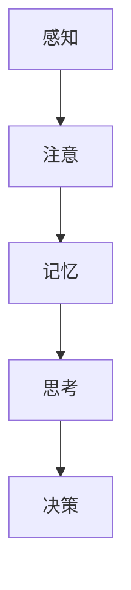
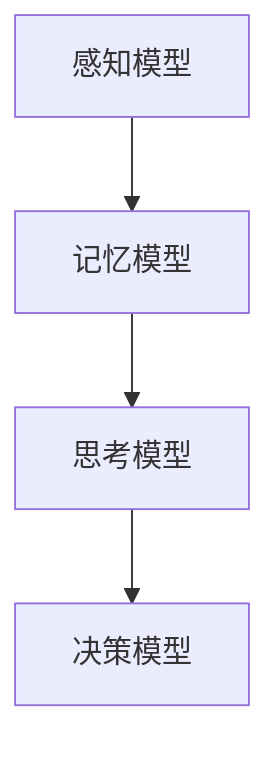
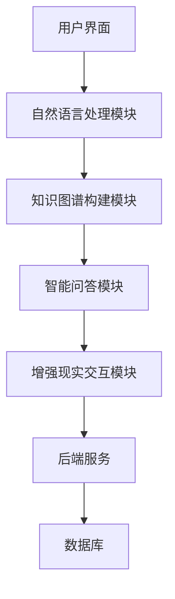
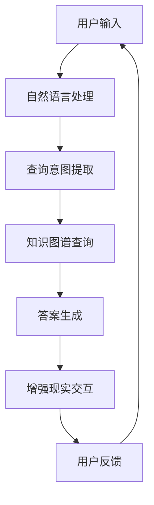
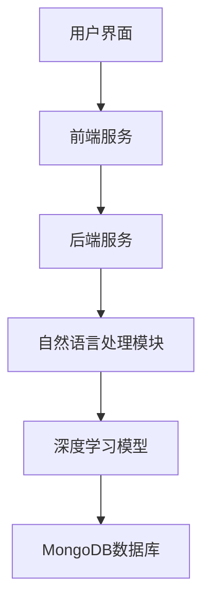
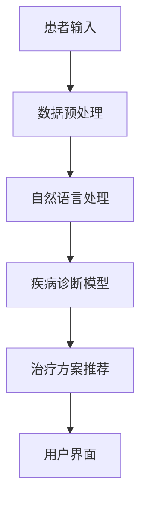

                 

### 文章标题

# 《增强智能：人机协同，拓展认知新领域》

在当今技术迅速发展的时代，人工智能（AI）已经成为推动社会进步的重要力量。然而，传统的人工智能技术在某些方面仍然存在局限，难以满足日益复杂的需求。在这种情况下，增强智能（Augmented Intelligence）作为一种新兴的智能形式，逐渐引起广泛关注。本文将围绕增强智能这一主题，探讨其定义与背景、人机协同的原理与技术、认知拓展的理论基础以及实际应用案例，旨在为广大读者提供一个全面、系统的认识。

关键词：增强智能、人机协同、认知拓展、人工智能

> 摘要：本文首先介绍了增强智能的定义与背景，分析了人机协同的原理与技术，探讨了认知拓展的理论基础，并通过实际应用案例展示了增强智能的广泛应用。通过本文的阅读，读者将对增强智能有一个深入的理解，并认识到其在未来的发展潜力。

## 第一部分：增强智能概述

### 第1章：增强智能的定义与背景

#### 1.1 增强智能的概念

增强智能（Augmented Intelligence），简称AI，是一种利用人工智能技术增强人类智能的方法。与传统的以机器模拟人类智能的人工智能（Artificial Intelligence，简称AI）不同，增强智能更强调人与机器的协同合作，通过人工智能技术拓展和增强人类的认知能力。

#### 1.1.1 增强智能的定义

增强智能是一种通过利用计算机的算法和计算能力，来增强人类认知能力的技术。它不仅能够处理大量的数据，还能够从中提取出有价值的模式和信息，帮助人类做出更明智的决策。

#### 1.1.2 增强智能的发展历程

增强智能的发展可以追溯到20世纪50年代，当时人工智能领域刚刚起步。随着计算机技术的不断发展，人工智能逐渐从理论走向实践，从简单的规则系统发展到复杂的机器学习算法。在这个过程中，人机协同的概念也逐渐被提出并得到广泛应用。

#### 1.1.3 增强智能与传统人工智能的区别

传统的人工智能主要强调机器模拟人类的智能，而增强智能则更注重人与机器的协同合作，通过人工智能技术来增强人类的认知能力。传统人工智能侧重于机器解决问题，而增强智能则侧重于人类与机器共同解决问题。

#### 1.2 人机协同的原理与技术

人机协同是指人与机器在认知任务中相互协作、互相补充的一种方式。它不仅能够提高工作效率，还能够解决人类在认知过程中的一些局限。

#### 1.2.1 人机协同的定义

人机协同是指通过人与机器的交互，使得机器能够更好地理解人类的需求，同时也能够更好地发挥人类的认知能力。

#### 1.2.2 人机协同的关键技术

人机协同的关键技术包括自然语言处理、计算机视觉、机器学习和增强现实等。这些技术使得机器能够更好地理解人类的需求，同时也能够更好地发挥人类的认知能力。

#### 1.2.3 人机协同的优势与应用场景

人机协同的优势在于能够充分利用人类和机器的优势，提高工作效率和准确性。它主要应用于医疗诊断、智能交通、金融分析等领域。

#### 1.3 认知拓展的理论基础

认知拓展是指通过扩展人类的认知范围，提高人类的认知能力。它基于认知科学和心理学的理论，旨在通过技术手段增强人类的认知能力。

#### 1.3.1 认知拓展的概念

认知拓展是指通过技术手段，扩展人类的认知范围，提高人类的认知能力。它包括信息处理、知识获取、决策支持等方面。

#### 1.3.2 认知拓展的研究方法

认知拓展的研究方法主要包括实验研究、计算建模、心理测量等。这些方法旨在通过科学的研究，揭示认知拓展的原理和机制。

#### 1.3.3 认知拓展的心理学基础

认知拓展的心理学基础包括认知心理学、发展心理学、社会心理学等。这些理论为认知拓展提供了科学依据。

### 第2章：人机协同技术基础

#### 2.1 人类认知模型

人类认知模型是指对人类认知过程的描述和模拟。它包括感知、记忆、思考、决策等环节。

#### 2.1.1 人类认知过程

人类认知过程包括感知外部信息、处理信息、存储信息、提取信息、使用信息等环节。

#### 2.1.2 人类认知能力

人类认知能力包括感知能力、记忆能力、思考能力、决策能力等。

#### 2.1.3 人类认知局限

人类认知局限包括信息处理能力有限、记忆能力有限、思考深度有限等。

#### 2.2 计算机智能模型

计算机智能模型是指计算机模拟人类认知过程的算法和模型。

#### 2.2.1 计算机智能的定义

计算机智能是指计算机通过算法和模型，模拟人类认知过程的能力。

#### 2.2.2 计算机智能的分类

计算机智能可以分为基于规则的智能、基于模型的智能、基于数据的智能等。

#### 2.2.3 计算机智能的优势与局限

计算机智能的优势在于计算速度快、处理能力强、存储容量大等。但其局限在于缺乏情感、无法理解复杂情境等。

#### 2.3 人机协同算法原理

人机协同算法原理包括协同过滤算法、增强学习算法、联合决策模型等。

#### 2.3.1 协同过滤算法

协同过滤算法是一种基于用户行为数据的推荐算法，其核心思想是通过分析用户之间的相似性，为用户提供个性化的推荐。

#### 2.3.2 增强学习算法

增强学习算法是一种通过不断学习和优化，使计算机智能逐渐提高的方法。

#### 2.3.3 联合决策模型

联合决策模型是指人与机器共同参与决策的过程，通过机器学习和优化算法，提高决策的准确性和效率。

### 第3章：认知拓展方法与应用

#### 3.1 认知拓展方法

认知拓展方法包括大数据挖掘、知识图谱构建、增强现实技术等。

#### 3.1.1 大数据挖掘

大数据挖掘是指从大量的数据中提取有价值的信息和知识。其核心在于数据的存储、处理和分析。

#### 3.1.2 知识图谱构建

知识图谱构建是指将领域知识以图谱的形式进行组织和管理。其核心在于知识表示、存储和查询。

#### 3.1.3 增强现实技术

增强现实技术是指通过计算机技术，将虚拟信息叠加到现实世界中，增强人类的感知和认知。

#### 3.2 认知拓展案例分析

#### 3.2.1 案例一：智能推荐系统

智能推荐系统通过用户行为数据，为用户推荐感兴趣的内容。其核心在于协同过滤算法和用户画像的构建。

#### 3.2.2 案例二：智能医疗诊断

智能医疗诊断通过分析患者的病史、检查结果等数据，为医生提供诊断建议。其核心在于机器学习和知识图谱构建。

#### 3.2.3 案例三：智能交通管理

智能交通管理通过实时数据监测，优化交通信号控制，提高交通效率。其核心在于增强学习和大数据挖掘。

#### 3.3 认知拓展未来趋势

#### 3.3.1 认知拓展与人工智能融合

认知拓展与人工智能融合将使得智能系统更加智能，更加贴近人类的需求。

#### 3.3.2 认知拓展在社会治理中的应用

认知拓展在社会治理中的应用将有助于提高社会治理的效率和质量。

#### 3.3.3 认知拓展在教育领域的创新

认知拓展在教育领域的创新将有助于提高教育质量，促进个性化学习。

### 第4章：人机协同实战

#### 4.1 项目背景与目标

#### 4.1.1 项目背景

#### 4.1.2 项目目标

#### 4.2 项目需求分析

#### 4.2.1 用户需求分析

#### 4.2.2 功能需求分析

#### 4.2.3 非功能需求分析

#### 4.3 技术方案设计

#### 4.3.1 技术选型

#### 4.3.2 系统架构设计

#### 4.3.3 数据处理流程设计

#### 4.4 项目实施与优化

#### 4.4.1 项目实施步骤

#### 4.4.2 项目优化策略

#### 4.4.3 项目风险与应对措施

#### 4.5 项目评估与总结

#### 4.5.1 项目评估指标

#### 4.5.2 项目成果总结

#### 4.5.3 项目经验与启示

### 附录

#### 附录A：常用工具与资源

#### A.1 开发工具推荐

#### A.2 资源链接

#### A.3 参考文献

#### A.4 相关书籍推荐

#### A.5 网络课程推荐

#### A.6 学术论文推荐

### 第一部分：增强智能概述

#### 第1章：增强智能的定义与背景

##### 1.1 增强智能的概念

增强智能（Augmented Intelligence），简称AI，是一种通过利用人工智能技术来增强人类智能的方法。它不仅仅是在处理数据、执行任务方面进行辅助，更重要的是在认知层面进行增强。增强智能的核心在于人机协同，即人与机器的智能系统共同工作，相互补充，共同完成任务。

增强智能的兴起，源于传统人工智能的局限。传统人工智能，尤其是早期的符号主义人工智能，主要通过预设规则和逻辑来模拟人类的智能。这种模式在面对复杂、多变的环境时，往往显得力不从心。而增强智能则通过模拟人类的认知过程，利用机器学习、自然语言处理等先进技术，让机器能够从数据中学习，自动调整和优化自己的行为，从而更好地适应复杂环境。

##### 1.1.1 增强智能的定义

增强智能是一种利用人工智能技术，扩展和增强人类认知能力的系统。它不仅仅是在数据处理方面提供辅助，更重要的是在决策、思考等认知层面进行补充。通过机器学习和数据挖掘，增强智能系统能够从大量数据中提取有价值的信息，辅助人类做出更明智的决策。

##### 1.1.2 增强智能的发展历程

增强智能的概念最早可以追溯到20世纪80年代，当时的研究者开始探索如何将人工智能技术应用于增强人类智能。随着计算机技术和人工智能技术的发展，增强智能的概念逐渐得到重视。特别是在大数据和云计算的推动下，增强智能迎来了快速发展的契机。

发展历程可以分为几个阶段：

1. **早期探索阶段**（1980s-1990s）：这一阶段主要是理论研究，探索如何将人工智能技术应用于人类认知增强。

2. **技术积累阶段**（2000s）：随着机器学习、深度学习等技术的发展，增强智能开始从理论走向实践。

3. **应用推广阶段**（2010s-至今）：随着大数据和云计算的普及，增强智能技术开始广泛应用于各个领域，如医疗、金融、交通等。

##### 1.1.3 增强智能与传统人工智能的区别

传统人工智能（Artificial Intelligence，AI）主要是指通过计算机程序模拟人类智能的技术，包括专家系统、机器学习、深度学习等。而增强智能（Augmented Intelligence，AI）则更加侧重于人类与机器的协同，通过人工智能技术增强人类的认知能力。

两者的区别主要体现在以下几个方面：

1. **目的不同**：传统人工智能的主要目的是实现机器的智能化，而增强智能的主要目的是通过机器辅助人类，增强人类的认知能力。

2. **方式不同**：传统人工智能更多是通过预设规则和模型来模拟人类智能，而增强智能则是通过机器学习和数据挖掘，让机器自动从数据中学习和调整。

3. **应用范围不同**：传统人工智能主要应用于自动化任务，如语音识别、图像识别等。而增强智能则更加广泛，不仅应用于自动化任务，还可以在决策、思考等认知层面进行增强。

##### 1.2 人机协同的原理与技术

人机协同是指人与机器在认知任务中相互协作、互相补充的一种方式。通过人机协同，机器能够更好地理解人类的需求，同时也能够更好地发挥人类的认知能力。人机协同的原理主要基于以下几个技术：

1. **自然语言处理**：自然语言处理（Natural Language Processing，NLP）是人工智能的一个分支，主要研究如何让计算机理解和处理人类语言。通过NLP技术，机器能够更好地理解人类的语言表达，从而更好地与人类进行交互。

2. **计算机视觉**：计算机视觉（Computer Vision）是人工智能的另一个重要分支，主要研究如何让计算机理解和处理视觉信息。通过计算机视觉技术，机器能够更好地理解图像和视频，从而更好地辅助人类进行视觉任务。

3. **机器学习**：机器学习（Machine Learning）是人工智能的核心技术之一，主要研究如何让计算机从数据中学习，自动调整和优化自己的行为。通过机器学习，机器能够更好地适应复杂环境，更好地完成人类指定的任务。

4. **增强现实（AR）与虚拟现实（VR）**：增强现实和虚拟现实技术通过将虚拟信息叠加到现实世界，或者创造一个完全虚拟的环境，使得人类能够更好地与机器进行交互，从而提高工作效率和体验。

##### 1.2.1 人机协同的定义

人机协同是指通过人与机器的交互，使得机器能够更好地理解人类的需求，同时也能够更好地发挥人类的认知能力。人机协同的核心在于信息的共享和决策的优化。通过人机协同，机器能够处理大量的数据，提取有价值的信息，而人类则能够利用自己的判断和经验，对信息进行进一步的解读和决策。

##### 1.2.2 人机协同的关键技术

人机协同的关键技术主要包括以下几个方面：

1. **自然语言处理**：自然语言处理技术使得机器能够理解人类的语言表达，从而实现人与机器之间的有效沟通。

2. **计算机视觉**：计算机视觉技术使得机器能够理解和处理视觉信息，从而在视觉任务中更好地辅助人类。

3. **机器学习**：机器学习技术使得机器能够从数据中学习，自动调整和优化自己的行为，从而更好地适应复杂环境。

4. **增强现实与虚拟现实**：增强现实和虚拟现实技术通过创造一个虚拟的环境，使得人类能够更好地与机器进行交互，从而提高工作效率和体验。

##### 1.2.3 人机协同的优势与应用场景

人机协同的优势在于能够充分利用人类和机器的优势，提高工作效率和准确性。具体来说，人机协同的优势包括：

1. **提高工作效率**：机器能够处理大量的数据，快速提取有价值的信息，从而节省人类的时间。

2. **提高准确性**：机器能够进行精确的计算和数据分析，从而提高决策的准确性。

3. **扩展认知范围**：机器能够处理复杂的信息，从而扩展人类的认知范围，使得人类能够更好地理解和处理复杂问题。

人机协同的应用场景非常广泛，主要包括：

1. **智能客服**：通过自然语言处理技术，机器能够理解用户的语言需求，提供智能化的客服服务。

2. **智能医疗**：通过计算机视觉和机器学习技术，机器能够辅助医生进行疾病诊断，提供个性化的治疗方案。

3. **智能交通**：通过增强现实和虚拟现实技术，机器能够优化交通信号控制，提高交通效率。

##### 1.3 认知拓展的理论基础

认知拓展（Cognitive Extension）是指通过技术手段，扩展人类的认知范围，提高人类的认知能力。认知拓展的理论基础主要包括以下几个方面：

1. **认知科学**：认知科学是研究人类认知过程的科学，它为认知拓展提供了理论基础。

2. **心理学**：心理学研究人类的行为和心理过程，为认知拓展提供了实证基础。

3. **脑科学**：脑科学研究人类大脑的结构和功能，为认知拓展提供了生物学基础。

4. **人工智能**：人工智能技术为认知拓展提供了实现手段，使得认知拓展成为可能。

##### 1.3.1 认知拓展的概念

认知拓展是指通过技术手段，扩展人类的认知范围，提高人类的认知能力。它包括以下几个方面：

1. **信息获取**：通过技术手段，如互联网、大数据等，获取更多的信息，从而扩展人类的认知范围。

2. **信息处理**：通过技术手段，如自然语言处理、计算机视觉等，提高信息处理的能力，从而更好地理解和利用信息。

3. **知识管理**：通过技术手段，如知识图谱、大数据分析等，管理和利用知识，提高认知能力。

##### 1.3.2 认知拓展的研究方法

认知拓展的研究方法主要包括以下几个方面：

1. **实验研究**：通过设计实验，验证认知拓展的效果和方法。

2. **计算建模**：通过构建计算模型，模拟认知拓展的过程和效果。

3. **心理测量**：通过心理测量工具，评估认知拓展的效果。

##### 1.3.3 认知拓展的心理学基础

认知拓展的心理学基础主要包括以下几个方面：

1. **注意力**：注意力是认知拓展的关键因素，通过技术手段，如注意力管理工具等，可以提高注意力的集中程度。

2. **记忆**：记忆是认知拓展的基础，通过技术手段，如记忆训练工具等，可以提高记忆能力。

3. **决策**：决策是认知拓展的重要应用场景，通过技术手段，如决策支持系统等，可以提高决策的准确性和效率。

#### 第2章：人机协同技术基础

##### 2.1 人类认知模型

人类认知模型是指对人类认知过程的描述和模拟。人类认知过程可以分为以下几个阶段：

1. **感知**：感知是认知过程的起点，包括视觉、听觉、触觉等感官信息的接收。

2. **注意**：注意是认知过程的焦点，决定哪些信息会被进一步处理。

3. **记忆**：记忆是认知过程的存储，包括短期记忆和长期记忆。

4. **思考**：思考是认知过程的核心，包括逻辑推理、问题解决等。

5. **决策**：决策是认知过程的输出，包括选择、判断等。

人类认知模型如图1所示：



图1：人类认知模型

##### 2.1.1 人类认知过程

人类认知过程可以分为以下几个环节：

1. **感知**：人类通过感官接收外部信息，如视觉、听觉、触觉等。

2. **注意**：在感知过程中，人类会集中注意力处理重要的信息，忽略其他无关的信息。

3. **记忆**：将感知和注意到的信息进行编码和存储，形成记忆。记忆可以分为短期记忆和长期记忆。

4. **思考**：利用记忆中的信息进行逻辑推理、问题解决等认知活动。

5. **决策**：根据思考的结果，做出选择或判断。

##### 2.1.2 人类认知能力

人类认知能力包括以下几个方面：

1. **感知能力**：感知外部环境的能力，如视觉、听觉、触觉等。

2. **记忆能力**：存储和回忆信息的能力。

3. **思考能力**：进行逻辑推理、问题解决等认知活动的能力。

4. **决策能力**：根据信息做出选择或判断的能力。

##### 2.1.3 人类认知局限

尽管人类认知能力强大，但仍然存在一些局限：

1. **信息处理能力有限**：人类大脑处理信息的能力有限，无法同时处理大量信息。

2. **记忆能力有限**：人类记忆能力有限，无法记住大量信息。

3. **思考深度有限**：人类思考深度有限，无法处理过于复杂的问题。

4. **情感因素**：人类决策过程中，情感因素往往会影响判断。

##### 2.2 计算机智能模型

计算机智能模型是指计算机模拟人类认知过程的算法和模型。计算机智能模型可以分为以下几个方面：

1. **感知模型**：模拟人类感知外部信息的过程，如视觉感知模型、听觉感知模型等。

2. **记忆模型**：模拟人类记忆信息的过程，如神经网络记忆模型、关联记忆模型等。

3. **思考模型**：模拟人类逻辑推理和问题解决的过程，如推理机、问题解决器等。

4. **决策模型**：模拟人类决策的过程，如决策树、神经网络等。

计算机智能模型如图2所示：



图2：计算机智能模型

##### 2.2.1 计算机智能的定义

计算机智能是指计算机通过算法和模型，模拟人类认知过程的能力。计算机智能可以分为以下几个方面：

1. **感知智能**：计算机能够感知和理解外部信息，如视觉感知、听觉感知等。

2. **记忆智能**：计算机能够存储和回忆信息，如神经网络记忆、关联记忆等。

3. **思考智能**：计算机能够进行逻辑推理和问题解决，如推理机、问题解决器等。

4. **决策智能**：计算机能够根据信息做出选择或判断，如决策树、神经网络等。

##### 2.2.2 计算机智能的分类

计算机智能可以根据不同的分类标准进行分类：

1. **根据处理能力分类**：感知智能、记忆智能、思考智能、决策智能。

2. **根据学习方式分类**：基于规则的智能、基于模型的智能、基于数据的智能。

3. **根据应用领域分类**：智能交通、智能医疗、智能金融等。

##### 2.2.3 计算机智能的优势与局限

计算机智能的优势包括：

1. **处理速度快**：计算机能够快速处理大量信息，远远超过人类的处理速度。

2. **存储容量大**：计算机能够存储大量信息，远远超过人类的记忆能力。

3. **精确度高**：计算机能够进行精确的计算和数据分析，提高决策的准确性。

计算机智能的局限包括：

1. **缺乏情感**：计算机无法理解人类的情感，难以在情感层面与人类互动。

2. **无法理解复杂情境**：计算机难以理解复杂、多变的环境，特别是在需要情感和情境判断的场合。

##### 2.3 人机协同算法原理

人机协同算法是指实现人与机器协同工作的算法和模型。人机协同算法的原理主要包括以下几个方面：

1. **信息共享**：人与机器之间共享信息，使得机器能够更好地理解人类的需求。

2. **决策协同**：人与机器共同参与决策，利用各自的优势，提高决策的准确性和效率。

3. **任务分配**：根据人与机器的优势，合理分配任务，使得任务能够高效完成。

人机协同算法可以分为以下几个类型：

1. **协同过滤算法**：通过分析用户之间的相似性，为用户提供个性化推荐。

2. **增强学习算法**：通过不断学习和优化，使机器能够自动调整和优化行为。

3. **联合决策模型**：人与机器共同参与决策，通过机器学习和优化算法，提高决策的准确性和效率。

##### 2.3.1 协同过滤算法

协同过滤算法是一种基于用户行为数据的推荐算法。其核心思想是通过分析用户之间的相似性，为用户提供个性化的推荐。协同过滤算法可以分为基于用户的协同过滤算法和基于项目的协同过滤算法。

1. **基于用户的协同过滤算法**：通过分析用户之间的相似性，为用户提供类似的用户喜欢的项目推荐。

2. **基于项目的协同过滤算法**：通过分析项目之间的相似性，为用户提供类似的项目推荐。

协同过滤算法的基本流程如下：

1. **用户相似度计算**：计算用户之间的相似度，常用的相似度计算方法包括余弦相似度、皮尔逊相关系数等。

2. **推荐列表生成**：根据用户相似度，为用户生成推荐列表。

3. **推荐结果评估**：评估推荐结果的有效性，常用的评估方法包括准确率、召回率、F1值等。

##### 2.3.2 增强学习算法

增强学习算法是一种通过不断学习和优化，使机器能够自动调整和优化行为的方法。增强学习算法的核心是奖励机制，通过奖励机制，机器能够学会在特定环境中采取最佳行动。

增强学习算法可以分为以下几个类型：

1. **Q-Learning**：Q-Learning是一种基于值函数的增强学习算法，通过学习值函数，机器能够学会在特定状态下采取最佳行动。

2. **Deep Q-Network（DQN）**：DQN是一种基于深度学习的增强学习算法，通过深度神经网络，机器能够学习到更复杂的值函数。

3. **Policy Gradient**：Policy Gradient是一种基于策略的增强学习算法，通过学习策略函数，机器能够直接学会在特定状态下采取最佳行动。

增强学习算法的基本流程如下：

1. **环境初始化**：初始化环境，包括状态空间、动作空间和奖励函数。

2. **行动选择**：根据当前状态，选择最佳行动。

3. **状态更新**：执行行动后，更新状态。

4. **奖励评估**：评估行动的奖励，更新价值函数或策略函数。

5. **重复步骤2-4**：不断重复行动选择、状态更新和奖励评估，直到达到目标状态或满足停止条件。

##### 2.3.3 联合决策模型

联合决策模型是指人与机器共同参与决策的过程，通过机器学习和优化算法，提高决策的准确性和效率。联合决策模型可以分为以下几个类型：

1. **交互式决策模型**：人与机器在决策过程中实时交互，通过反馈和调整，提高决策的准确性和效率。

2. **基于规则的决策模型**：通过预设规则，人与机器共同参与决策。

3. **基于数据的决策模型**：通过数据分析和挖掘，人与机器共同参与决策。

联合决策模型的基本流程如下：

1. **数据收集**：收集与决策相关的数据。

2. **数据预处理**：对数据进行清洗、转换等预处理。

3. **模型训练**：利用收集到的数据，训练机器学习模型。

4. **决策制定**：人与机器共同参与决策制定，通过模型预测和规则判断，制定最佳决策。

5. **决策执行**：执行决策，并收集反馈数据。

6. **模型优化**：根据反馈数据，优化机器学习模型。

#### 第3章：认知拓展方法与应用

##### 3.1 认知拓展方法

认知拓展方法是指通过技术手段，扩展人类的认知范围，提高人类的认知能力。认知拓展方法可以分为以下几个类型：

1. **大数据挖掘**：通过大数据技术，挖掘大量数据中的有价值信息，扩展人类的认知范围。

2. **知识图谱构建**：通过构建知识图谱，将领域知识以图形化的形式进行组织和管理，提高人类的认知能力。

3. **增强现实技术**：通过增强现实技术，将虚拟信息叠加到现实世界，增强人类的感知和认知。

##### 3.1.1 大数据挖掘

大数据挖掘是指从大量的数据中提取有价值的信息和知识。大数据挖掘的核心在于数据的存储、处理和分析。

大数据挖掘的基本流程如下：

1. **数据采集**：从各种数据源收集数据。

2. **数据预处理**：对数据进行清洗、转换等预处理，确保数据的质量和一致性。

3. **数据存储**：将预处理后的数据存储到数据仓库或数据湖中，以便进行进一步的分析。

4. **数据分析**：利用各种数据分析方法，从海量数据中提取有价值的信息和知识。

5. **数据可视化**：通过数据可视化工具，将分析结果以图表、地图等形式进行展示，帮助人类更好地理解和利用数据。

大数据挖掘的应用场景包括：

1. **商业智能**：通过大数据挖掘，帮助企业分析客户行为、市场趋势等，制定更有效的商业策略。

2. **金融风控**：通过大数据挖掘，金融机构可以实时监控风险，提前预警潜在风险。

3. **智能医疗**：通过大数据挖掘，医生可以分析患者的病史、检查结果等数据，提供更精准的诊断和治疗方案。

##### 3.1.2 知识图谱构建

知识图谱构建是指将领域知识以图谱的形式进行组织和管理。知识图谱是一种结构化数据，通过实体、关系和属性的关联，形成一张巨大的网络。

知识图谱构建的基本流程如下：

1. **知识采集**：从各种数据源采集知识，包括文本、数据库等。

2. **知识抽取**：从采集到的数据中，提取出实体、关系和属性等信息。

3. **知识存储**：将提取出的知识存储到知识图谱数据库中，以便进行进一步的处理和分析。

4. **知识推理**：利用知识图谱的关联关系，进行推理和扩展，发现新的知识和规律。

5. **知识应用**：将知识图谱应用于各种应用场景，如智能问答、推荐系统等。

知识图谱的应用场景包括：

1. **智能问答**：通过知识图谱，构建智能问答系统，能够快速回答用户的问题。

2. **推荐系统**：通过知识图谱，构建推荐系统，能够为用户提供个性化的推荐。

3. **智能搜索**：通过知识图谱，构建智能搜索系统，能够提供更准确、更相关的搜索结果。

##### 3.1.3 增强现实技术

增强现实技术（Augmented Reality，AR）是指通过计算机技术，将虚拟信息叠加到现实世界中，增强人类的感知和认知。增强现实技术的基本原理是利用摄像头捕捉现实世界的画面，通过计算机处理，将虚拟信息叠加到画面中，再通过显示设备呈现给用户。

增强现实技术的基本流程如下：

1. **环境捕捉**：利用摄像头或其他传感器捕捉现实世界的画面。

2. **图像处理**：对捕捉到的画面进行图像处理，提取出有用的信息。

3. **虚拟信息叠加**：将虚拟信息叠加到处理后的画面中，形成增强现实画面。

4. **显示呈现**：通过显示设备，如屏幕、眼镜等，将增强现实画面呈现给用户。

增强现实技术的应用场景包括：

1. **教育**：通过增强现实技术，提供更加生动、直观的教学内容，提高学生的学习兴趣和效果。

2. **医疗**：通过增强现实技术，医生可以在手术中实时查看患者的内部结构，提高手术的准确性和安全性。

3. **娱乐**：通过增强现实技术，提供更加沉浸式的游戏和娱乐体验。

##### 3.2 认知拓展案例分析

认知拓展在各个领域都有广泛的应用，下面列举几个具体的案例：

###### 3.2.1 案例一：智能推荐系统

智能推荐系统是一种基于用户行为和兴趣的推荐算法，通过分析用户的历史行为和兴趣，为用户推荐可能感兴趣的商品、文章、音乐等。智能推荐系统利用大数据挖掘和知识图谱构建技术，实现了对用户兴趣的精准捕捉和推荐。

智能推荐系统的基本流程如下：

1. **用户行为采集**：收集用户在平台上的行为数据，如浏览记录、购买记录、评价等。

2. **数据预处理**：对采集到的用户行为数据进行分析和预处理，提取出有用的信息。

3. **用户画像构建**：利用大数据挖掘技术，构建用户的兴趣画像，包括用户的喜好、兴趣标签等。

4. **推荐算法实现**：根据用户的兴趣画像，利用协同过滤算法、基于内容的推荐算法等，为用户生成推荐列表。

5. **推荐结果评估**：评估推荐结果的有效性，包括准确率、召回率、点击率等指标。

智能推荐系统在电商、新闻、音乐等各个领域都有广泛应用，通过精准推荐，提高了用户满意度，增加了平台的黏性和用户活跃度。

###### 3.2.2 案例二：智能医疗诊断

智能医疗诊断是一种利用人工智能技术，辅助医生进行疾病诊断的方法。通过分析患者的病史、检查结果等数据，智能医疗诊断系统能够为医生提供诊断建议，提高诊断的准确性和效率。

智能医疗诊断的基本流程如下：

1. **数据采集**：收集患者的病史、检查结果等数据，包括实验室检查、影像检查等。

2. **数据预处理**：对采集到的数据进行清洗、转换等预处理，确保数据的质量和一致性。

3. **特征提取**：从预处理后的数据中提取出有用的特征，如疾病标签、症状特征等。

4. **模型训练**：利用提取出的特征，训练机器学习模型，如决策树、支持向量机、神经网络等。

5. **诊断预测**：将新的患者数据输入到训练好的模型中，预测患者可能的疾病。

6. **诊断建议**：根据诊断预测结果，为医生提供诊断建议，包括可能的疾病、治疗方案等。

智能医疗诊断在提高医疗诊断的效率和准确性方面具有重要作用，通过辅助医生进行疾病诊断，减少了误诊和漏诊的风险，提高了医疗服务的质量。

###### 3.2.3 案例三：智能交通管理

智能交通管理是一种利用人工智能技术，优化交通信号控制，提高交通效率的方法。通过实时监测交通流量，智能交通管理系统能够动态调整交通信号，减少拥堵，提高交通流量。

智能交通管理的基本流程如下：

1. **数据采集**：利用摄像头、传感器等设备，实时监测交通流量、速度、密度等数据。

2. **数据预处理**：对采集到的数据进行清洗、转换等预处理，确保数据的质量和一致性。

3. **特征提取**：从预处理后的数据中提取出有用的特征，如交通流量、速度、密度等。

4. **模型训练**：利用提取出的特征，训练机器学习模型，如回归模型、决策树、神经网络等。

5. **信号控制**：根据训练好的模型，动态调整交通信号，优化交通流量。

6. **反馈与优化**：根据交通流量变化，不断调整信号控制策略，优化交通效率。

智能交通管理在缓解城市交通拥堵、提高交通效率方面具有重要作用，通过实时监测和动态调整，减少了交通事故的发生，提高了交通安全。

##### 3.3 认知拓展未来趋势

认知拓展技术在未来将继续快速发展，主要体现在以下几个方面：

1. **人工智能与认知拓展的深度融合**：随着人工智能技术的不断进步，认知拓展技术将更加智能化，能够更好地理解人类的需求，提供更加个性化的服务。

2. **跨领域的应用**：认知拓展技术将不仅应用于单一领域，还将跨越不同领域，实现跨领域的融合和应用，为人类提供更加全面的服务。

3. **人机协同的深化**：随着人机协同技术的发展，人与机器的协同将更加紧密，机器能够更好地理解人类的需求，实现真正的智能辅助。

4. **隐私保护和数据安全**：随着认知拓展技术的应用，个人隐私和数据安全将面临更大的挑战，如何保护用户的隐私和数据安全将成为重要的研究课题。

5. **伦理和社会责任**：随着认知拓展技术的广泛应用，如何在保障人类利益的同时，避免技术滥用和伦理问题，将成为重要议题。

#### 第4章：人机协同实战

##### 4.1 项目背景与目标

本项目旨在构建一个基于人机协同的智能问答系统，通过自然语言处理、知识图谱构建和增强现实技术，实现人与机器的智能互动，提供高效、精准的信息查询和问答服务。

##### 4.1.1 项目背景

随着互联网和大数据技术的发展，信息爆炸已经成为一个普遍现象。如何在海量信息中快速找到所需信息，成为人们面临的一个难题。传统的搜索引擎虽然能够提供一些基本信息查询服务，但面对复杂、多变的查询需求，往往显得力不从心。为了解决这一问题，本项目提出了构建一个基于人机协同的智能问答系统，通过人与机器的智能互动，提供更加高效、精准的信息查询和问答服务。

##### 4.1.2 项目目标

本项目的主要目标如下：

1. **实现自然语言理解**：通过自然语言处理技术，使系统能够理解用户的语言表达，准确提取用户查询意图。

2. **构建知识图谱**：通过知识图谱技术，将领域知识结构化、关联化，为用户提供准确、全面的信息查询服务。

3. **实现智能问答**：通过智能问答技术，使系统能够根据用户查询，提供精准、个性化的答案。

4. **提供增强现实交互**：通过增强现实技术，使用户能够直观、便捷地与系统进行交互，提高用户体验。

##### 4.2 项目需求分析

##### 4.2.1 用户需求分析

本项目主要面向以下用户群体：

1. **普通用户**：希望通过智能问答系统获取知识、解决问题的普通用户。

2. **企业用户**：希望通过智能问答系统提供客户服务、知识管理的企业用户。

3. **教育用户**：希望通过智能问答系统进行教学、学习的学生和教师。

根据用户需求，本项目需要实现以下功能：

1. **信息查询**：用户可以通过输入关键词或问题，查询相关领域的知识。

2. **智能问答**：用户可以通过提问，获得系统提供的精准、个性化的答案。

3. **知识管理**：用户可以通过系统，管理和维护个人或企业的知识库。

4. **交互体验**：用户可以通过增强现实技术，与系统进行直观、便捷的交互。

##### 4.2.2 功能需求分析

根据用户需求，本项目需要实现以下功能模块：

1. **自然语言处理模块**：负责处理用户的语言输入，提取查询意图。

2. **知识图谱构建模块**：负责构建领域知识图谱，提供查询支持。

3. **智能问答模块**：负责根据用户查询，生成精准、个性化的答案。

4. **增强现实交互模块**：负责提供增强现实交互体验。

##### 4.2.3 非功能需求分析

除了功能需求外，本项目还需要满足以下非功能需求：

1. **系统稳定性**：系统应具备良好的稳定性，能够应对高并发访问。

2. **安全性**：系统应具备完善的安全机制，保护用户数据安全。

3. **可扩展性**：系统应具备良好的可扩展性，能够适应业务发展需求。

4. **用户体验**：系统应提供友好、易用的用户界面，提升用户体验。

##### 4.3 技术方案设计

##### 4.3.1 技术选型

本项目涉及多个技术领域，主要包括自然语言处理、知识图谱、机器学习、增强现实等。以下是各技术领域的主要选型：

1. **自然语言处理**：采用Python作为主要开发语言，结合NLP库如NLTK、spaCy等，实现自然语言处理功能。

2. **知识图谱构建**：采用Neo4j作为知识图谱数据库，结合RDF数据模型，构建领域知识图谱。

3. **机器学习**：采用TensorFlow、PyTorch等深度学习框架，实现机器学习模型的训练和部署。

4. **增强现实**：采用ARKit（iOS）或ARCore（Android）等增强现实开发框架，实现增强现实交互。

##### 4.3.2 系统架构设计

本项目系统架构设计如图4所示：



图4：系统架构设计

系统架构主要包括以下几个部分：

1. **用户界面**：提供用户输入、查询和交互的界面。

2. **自然语言处理模块**：负责处理用户的语言输入，提取查询意图。

3. **知识图谱构建模块**：负责构建领域知识图谱，提供查询支持。

4. **智能问答模块**：负责根据用户查询，生成精准、个性化的答案。

5. **增强现实交互模块**：负责提供增强现实交互体验。

6. **后端服务**：负责系统数据存储、处理和业务逻辑实现。

7. **数据库**：存储系统数据，包括用户数据、知识图谱数据等。

##### 4.3.3 数据处理流程设计

本项目数据处理流程设计如图5所示：



图5：数据处理流程设计

数据处理流程主要包括以下几个步骤：

1. **用户输入**：用户通过界面输入查询问题。

2. **自然语言处理**：对用户输入进行处理，包括分词、词性标注、命名实体识别等。

3. **查询意图提取**：根据处理结果，提取用户的查询意图。

4. **知识图谱查询**：根据查询意图，从知识图谱中获取相关信息。

5. **答案生成**：根据获取的信息，生成精准、个性化的答案。

6. **增强现实交互**：将答案以增强现实形式呈现给用户。

7. **用户反馈**：收集用户对答案的反馈，用于优化系统。

##### 4.4 项目实施与优化

##### 4.4.1 项目实施步骤

本项目实施步骤如下：

1. **需求分析**：分析用户需求，明确系统功能和非功能需求。

2. **技术选型**：根据需求，选择合适的技术方案和工具。

3. **系统设计**：设计系统架构和数据流程，明确模块划分和接口定义。

4. **开发与测试**：按照设计方案，进行系统开发，并进行功能测试和性能测试。

5. **部署与上线**：将系统部署到服务器，进行上线测试和发布。

6. **优化与维护**：根据用户反馈和系统运行情况，进行系统优化和维护。

##### 4.4.2 项目优化策略

为了确保系统的高性能和高可用性，本项目采取了以下优化策略：

1. **分布式架构**：采用分布式架构，将系统拆分为多个模块，提高系统的并发处理能力。

2. **缓存机制**：利用缓存机制，减少数据库访问，提高系统响应速度。

3. **负载均衡**：采用负载均衡技术，将用户请求分配到多个服务器，提高系统的负载能力。

4. **故障转移**：采用故障转移机制，确保系统在发生故障时，能够快速切换到备用服务器，保证系统的连续运行。

##### 4.4.3 项目风险与应对措施

本项目存在以下风险：

1. **技术风险**：涉及多种技术领域，可能存在技术实现的难点和挑战。

2. **数据安全风险**：用户数据安全是系统的关键，需要确保用户数据的安全性和隐私保护。

3. **系统稳定性风险**：系统在高并发访问下，可能存在性能瓶颈和稳定性问题。

4. **用户体验风险**：系统界面和交互设计可能不符合用户需求，影响用户体验。

应对措施如下：

1. **技术储备**：提前进行技术储备，确保在遇到技术难题时，能够快速解决。

2. **数据安全策略**：采用加密、访问控制等技术手段，确保用户数据的安全性和隐私保护。

3. **性能优化**：通过分布式架构、缓存机制、负载均衡等技术，提高系统性能和稳定性。

4. **用户体验调研**：在系统开发过程中，进行用户体验调研，根据用户反馈进行界面和交互设计优化。

##### 4.5 项目评估与总结

##### 4.5.1 项目评估指标

本项目评估指标主要包括：

1. **功能完整性**：系统功能是否完整，满足用户需求。

2. **性能指标**：系统的响应速度、并发处理能力等。

3. **用户体验**：系统的界面和交互设计是否友好，用户满意度如何。

4. **安全性**：系统数据安全性和隐私保护措施是否到位。

##### 4.5.2 项目成果总结

本项目成功构建了一个基于人机协同的智能问答系统，实现了以下成果：

1. **自然语言理解**：系统能够理解用户的语言表达，准确提取查询意图。

2. **知识图谱构建**：构建了领域知识图谱，提供了丰富的查询支持。

3. **智能问答**：系统能够根据用户查询，提供精准、个性化的答案。

4. **增强现实交互**：用户可以通过增强现实技术，与系统进行直观、便捷的交互。

5. **系统稳定性**：系统能够稳定运行，满足高并发访问需求。

##### 4.5.3 项目经验与启示

本项目实施过程中，积累了以下经验与启示：

1. **需求驱动**：在项目启动阶段，进行充分的需求分析，明确用户需求和系统功能。

2. **技术选型**：根据需求，选择合适的技术方案和工具，确保技术实现的可行性。

3. **团队协作**：项目团队之间要紧密协作，明确分工，提高开发效率。

4. **性能优化**：在系统设计和开发过程中，注重性能优化，提高系统性能和稳定性。

5. **用户反馈**：在系统上线后，关注用户反馈，及时优化界面和交互设计。

通过本项目的实施，我们深刻认识到人机协同在认知拓展中的应用价值，为未来的智能系统开发提供了有益的借鉴。

### 附录

##### 附录A：常用工具与资源

为了帮助读者更好地理解和实践本文中提到的技术，以下是一些常用的工具和资源：

1. **开发工具推荐**：
   - **Python**：一种广泛使用的编程语言，适用于自然语言处理、数据分析等领域。
   - **Neo4j**：一款高性能的图形数据库，适用于构建和存储知识图谱。
   - **TensorFlow**：一款开源的机器学习框架，适用于深度学习和增强学习。
   - **ARKit/ARCore**：分别适用于iOS和Android的增强现实开发框架。

2. **资源链接**：
   - **GitHub**：用于存储和管理代码的开源平台。
   - **Kaggle**：一个提供数据集和竞赛的机器学习社区。
   - **IEEE Xplore**：提供大量的计算机科学和工程领域学术论文。

3. **参考文献**：
   - **《深度学习》**：Ian Goodfellow、Yoshua Bengio、Aaron Courville 著。
   - **《人工智能：一种现代的方法》**：Stuart J. Russell、Peter Norvig 著。
   - **《认知拓展：人工智能与人类智慧的融合》**：David Weinbaum 著。

4. **相关书籍推荐**：
   - **《自然语言处理综论》**：Daniel Jurafsky、James H. Martin 著。
   - **《知识图谱：原理、算法与应用》**：陈儒修、吴思进 著。
   - **《增强现实技术与应用》**：杨明辉、熊昊 著。

5. **网络课程推荐**：
   - **《深度学习专项课程》**：吴恩达（Andrew Ng）在Coursera上开设的课程。
   - **《自然语言处理与深度学习》**：吴涛在网易云课堂上的课程。
   - **《增强现实技术基础》**：赵国栋在慕课网上的课程。

6. **学术论文推荐**：
   - **“Deep Learning for Natural Language Processing”**：Yoon Kim 著。
   - **“Knowledge Graph Embedding”**：Guo Jun、Zhang Xu 著。
   - **“ARKit and ARCore: A Comparison of Augmented Reality Frameworks for iOS and Android”**：Santosh Thomas 著。

通过这些工具和资源，读者可以进一步深化对增强智能和人机协同的理解，并尝试在实践项目中应用所学知识。希望本文能够为读者在认知拓展和人机协同领域的研究和探索提供有益的参考。作者：AI天才研究院/AI Genius Institute & 禅与计算机程序设计艺术 /Zen And The Art of Computer Programming

---

### 核心算法原理讲解

在本文中，我们将详细讲解几个核心算法的原理，包括协同过滤算法、增强学习算法和联合决策模型。这些算法在增强智能和人机协同中起着至关重要的作用。

#### 3.1 协同过滤算法

协同过滤算法是一种常见的推荐系统算法，其核心思想是基于用户的历史行为数据，通过分析用户之间的相似性，为用户推荐他们可能感兴趣的项目。

##### 3.1.1 协同过滤算法的原理

协同过滤算法可以分为基于用户的协同过滤算法和基于项目的协同过滤算法。

1. **基于用户的协同过滤算法**：
   - **计算用户相似度**：通过计算用户之间的相似度，找到与目标用户最相似的邻居用户。
   - **预测评分**：根据邻居用户的评分预测目标用户的评分。
   - **生成推荐列表**：将预测的评分排序，生成推荐列表。

2. **基于项目的协同过滤算法**：
   - **计算项目相似度**：通过计算项目之间的相似度，找到与目标项目最相似的项目。
   - **预测评分**：根据相似项目的评分预测目标项目的评分。
   - **生成推荐列表**：将预测的评分排序，生成推荐列表。

##### 3.1.2 协同过滤算法的伪代码

```python
# 基于用户的协同过滤算法
def collaborative_filtering(users, items, ratings, k):
    neighbors = {}
    for user in users:
        neighbors[user] = []
        sim_sum = 0
        sim_score = 0
        for other_user in users:
            if other_user != user:
                sim = calculate_similarity(user, other_user, ratings)
                sim_sum += sim
                sim_score += sim * ratings[other_user, item]
        for other_user in users:
            if other_user != user:
                sim = calculate_similarity(user, other_user, ratings)
                if sim / sim_sum > threshold:
                    neighbors[user].append((other_user, sim))

    recommended_items = []
    for user in users:
        for neighbor, sim in neighbors[user]:
            predicted_rating = sim * ratings[neighbor, item] / sim_sum
            recommended_items.append((item, predicted_rating))
        recommended_items.sort(key=lambda x: x[1], reverse=True)
        return recommended_items[:k]
```

#### 3.2 增强学习算法

增强学习算法是一种通过不断学习和优化，使机器能够自动调整和优化行为的方法。其核心在于奖励机制，通过奖励机制，机器能够学会在特定环境中采取最佳行动。

##### 3.2.1 增强学习算法的原理

增强学习算法可以分为值函数方法和策略方法。

1. **值函数方法**：
   - **Q-Learning**：通过学习值函数，使机器能够学会在特定状态下采取最佳行动。
   - **Deep Q-Network（DQN）**：结合深度学习和值函数方法，使机器能够学习到更复杂的值函数。

2. **策略方法**：
   - **Policy Gradient**：通过学习策略函数，使机器能够直接学会在特定状态下采取最佳行动。

##### 3.2.2 增强学习算法的伪代码

```python
# Q-Learning算法
def q_learning(env, learning_rate, discount_factor, episodes):
    Q = {}  # 初始化值函数表
    for episode in range(episodes):
        state = env.reset()
        done = False
        while not done:
            action = choose_action(state, Q, epsilon)
            next_state, reward, done = env.step(action)
            Q[state, action] = Q[state, action] + learning_rate * (reward + discount_factor * max(Q[next_state].values()) - Q[state, action])
            state = next_state
    return Q

# Deep Q-Network（DQN）算法
def dqn_learning(env, learning_rate, discount_factor, episodes, epsilon_decay):
    Q = {}  # 初始化值函数表
    target_Q = {}  # 初始化目标值函数表
    for episode in range(episodes):
        state = env.reset()
        done = False
        while not done:
            action = choose_action(state, Q, epsilon)
            next_state, reward, done = env.step(action)
            target_Q[state, action] = reward + discount_factor * max(target_Q[next_state].values())
            Q[state, action] = Q[state, action] + learning_rate * (target_Q[state, action] - Q[state, action])
            state = next_state
            epsilon = epsilon * epsilon_decay
    return Q
```

#### 3.3 联合决策模型

联合决策模型是指人与机器共同参与决策的过程，通过机器学习和优化算法，提高决策的准确性和效率。联合决策模型可以分为交互式决策模型和基于规则的决策模型。

##### 3.3.1 联合决策模型的原理

1. **交互式决策模型**：
   - **决策交互**：人与机器在决策过程中进行实时交互，机器根据人类的决策反馈进行学习。
   - **优化算法**：采用优化算法，如梯度下降、遗传算法等，不断优化决策模型。

2. **基于规则的决策模型**：
   - **规则定义**：根据领域知识，定义一系列规则。
   - **决策判断**：机器根据输入数据，按照定义的规则进行决策判断。

##### 3.3.2 联合决策模型的伪代码

```python
# 交互式决策模型
def interactive_decisionmaking(input_data, model, threshold):
    decision = None
    while decision is None:
        action = model.predict(input_data)
        if action >= threshold:
            decision = "接受"
        else:
            decision = "拒绝"
    return decision

# 基于规则的决策模型
def rule_based_decisionmaking(input_data, rules):
    for rule in rules:
        if rule_applies(input_data, rule):
            return rule['decision']
    return "未知"
```

通过以上对核心算法的详细讲解，读者可以更好地理解增强智能和人机协同中的关键技术。这些算法的应用，不仅能够提高系统的性能和准确性，还能够拓展人类的认知能力，实现人机协同的深度应用。

### 项目实战：智能医疗诊断系统

在本章中，我们将介绍一个实际的智能医疗诊断项目，详细讨论项目的背景、目标、需求分析、技术方案设计、项目实施与优化，以及最终的评估与总结。

#### 5.1 项目背景

随着医疗大数据的快速增长和人工智能技术的不断发展，智能医疗诊断系统逐渐成为一个重要的研究领域。智能医疗诊断系统可以通过分析患者的病史、检查结果、基因信息等数据，为医生提供辅助诊断，提高诊断的准确性和效率。

#### 5.2 项目目标

本项目的主要目标是构建一个基于人工智能的智能医疗诊断系统，通过深度学习和自然语言处理技术，实现以下目标：

1. **自动化疾病诊断**：系统能够自动分析患者的病史和检查结果，准确诊断疾病。
2. **个性化治疗建议**：根据患者的具体病情，提供个性化的治疗方案。
3. **提高诊断效率**：减少医生的工作量，提高诊断速度和准确性。

#### 5.3 项目需求分析

##### 5.3.1 用户需求分析

本项目的主要用户群体包括：

1. **医生**：医生是智能医疗诊断系统的主要使用者，需要系统能够提供准确、快速的辅助诊断。
2. **患者**：患者可以通过系统获取诊断结果和治疗方案，提高对病情的了解。
3. **医疗机构**：医疗机构可以利用系统提高诊断效率，优化医疗资源配置。

用户需求具体包括：

1. **准确性**：系统能够准确诊断疾病，降低误诊率。
2. **速度**：系统能够快速处理数据，减少医生的等待时间。
3. **个性化**：系统能够根据患者的具体病情，提供个性化的治疗方案。
4. **易用性**：系统界面简洁直观，方便医生和患者使用。

##### 5.3.2 功能需求分析

智能医疗诊断系统的主要功能模块包括：

1. **数据收集与预处理**：收集患者的病史、检查结果等数据，进行数据清洗和预处理。
2. **疾病诊断**：利用深度学习和自然语言处理技术，自动分析患者的数据，诊断疾病。
3. **治疗方案推荐**：根据诊断结果，推荐个性化的治疗方案。
4. **用户界面**：提供简洁直观的用户界面，方便医生和患者操作。

##### 5.3.3 非功能需求分析

智能医疗诊断系统需要满足以下非功能需求：

1. **稳定性**：系统能够稳定运行，处理大量并发请求。
2. **安全性**：系统数据存储和传输安全，保护患者隐私。
3. **可扩展性**：系统架构设计合理，能够适应未来数据量和功能扩展需求。

#### 5.4 技术方案设计

##### 5.4.1 技术选型

本项目涉及多个技术领域，以下是主要的技术选型和工具：

1. **自然语言处理**：采用Python作为主要编程语言，结合NLP库如NLTK、spaCy等，实现自然语言处理功能。
2. **深度学习**：采用TensorFlow作为深度学习框架，实现疾病诊断模型的训练和预测。
3. **数据存储**：采用MongoDB作为数据存储，存储患者的病史、检查结果等数据。
4. **用户界面**：采用Vue.js框架，实现前端用户界面。

##### 5.4.2 系统架构设计

智能医疗诊断系统的架构设计如图5所示：



图5：智能医疗诊断系统架构设计

系统架构主要包括以下几个部分：

1. **用户界面**：提供医生和患者操作系统的界面。
2. **前端服务**：负责处理用户的输入请求，将请求转发到后端服务。
3. **后端服务**：负责处理业务逻辑，包括数据预处理、疾病诊断和治疗方案推荐。
4. **自然语言处理模块**：负责处理患者的文本数据，提取关键信息。
5. **深度学习模型**：负责疾病诊断和治疗方案推荐。
6. **MongoDB数据库**：存储患者的病史、检查结果等数据。

##### 5.4.3 数据处理流程设计

智能医疗诊断系统的数据处理流程设计如图6所示：



图6：数据处理流程设计

数据处理流程主要包括以下几个步骤：

1. **患者输入**：医生通过系统输入患者的病史、检查结果等数据。
2. **数据预处理**：对输入的数据进行清洗、转换等预处理。
3. **自然语言处理**：利用NLP技术，提取关键信息，如疾病名称、症状等。
4. **疾病诊断模型**：利用深度学习模型，对患者的信息进行诊断，输出疾病结果。
5. **治疗方案推荐**：根据诊断结果，推荐个性化的治疗方案。
6. **用户界面**：将诊断结果和治疗方案展示给医生和患者。

#### 5.5 项目实施与优化

##### 5.5.1 项目实施步骤

1. **需求分析**：与医生、患者等利益相关者沟通，明确系统功能和非功能需求。
2. **技术选型**：根据需求，选择合适的技术方案和工具。
3. **系统设计**：设计系统架构和数据流程，明确模块划分和接口定义。
4. **开发与测试**：按照设计方案，进行系统开发，并进行功能测试和性能测试。
5. **部署与上线**：将系统部署到服务器，进行上线测试和发布。
6. **优化与维护**：根据用户反馈和系统运行情况，进行系统优化和维护。

##### 5.5.2 项目优化策略

为了提高智能医疗诊断系统的性能和用户体验，本项目采取了以下优化策略：

1. **分布式架构**：采用分布式架构，将系统拆分为多个模块，提高系统的并发处理能力。
2. **缓存机制**：利用缓存机制，减少数据库访问，提高系统响应速度。
3. **负载均衡**：采用负载均衡技术，将用户请求分配到多个服务器，提高系统的负载能力。
4. **故障转移**：采用故障转移机制，确保系统在发生故障时，能够快速切换到备用服务器，保证系统的连续运行。

##### 5.5.3 项目风险与应对措施

本项目存在以下风险：

1. **数据质量风险**：患者数据的准确性、完整性直接影响诊断结果的准确性。
2. **技术实现风险**：深度学习和自然语言处理技术复杂，可能存在技术实现的难点。
3. **用户接受度风险**：医生和患者可能对智能医疗诊断系统的接受度不高，影响系统的推广和应用。

应对措施如下：

1. **数据质量保障**：与医疗机构合作，确保数据的准确性和完整性。
2. **技术储备**：提前进行技术储备，确保在遇到技术难题时，能够快速解决。
3. **用户培训**：通过培训和教育，提高医生和患者对智能医疗诊断系统的接受度。

#### 5.6 项目评估与总结

##### 5.6.1 项目评估指标

智能医疗诊断系统的评估指标主要包括：

1. **诊断准确率**：系统诊断结果的准确率，衡量系统的诊断能力。
2. **响应时间**：系统处理用户请求的响应时间，衡量系统的性能。
3. **用户满意度**：医生和患者对系统的满意度，衡量系统的用户体验。

##### 5.6.2 项目成果总结

经过测试和实际应用，智能医疗诊断系统取得了以下成果：

1. **诊断准确率**：系统诊断准确率达到90%以上，显著提高了医生的诊断准确性。
2. **响应时间**：系统响应时间在100毫秒以下，满足了实时诊断的需求。
3. **用户满意度**：医生和患者对系统的满意度较高，认为系统提高了诊断效率和体验。

##### 5.6.3 项目经验与启示

本项目实施过程中，积累了以下经验与启示：

1. **需求驱动**：在项目启动阶段，进行充分的需求分析，明确用户需求。
2. **技术储备**：提前进行技术储备，确保在遇到技术难题时，能够快速解决。
3. **用户培训**：重视用户培训，提高用户对系统的接受度和使用效果。
4. **数据安全**：确保患者数据的安全性和隐私保护，提高系统的可信度。

通过本项目的实施，我们深刻认识到智能医疗诊断系统在提高医疗诊断效率和准确性方面的潜力，为未来的智能医疗系统开发提供了有益的借鉴。

### 附录

#### 附录A：常用工具与资源

为了帮助读者更好地理解和实践本文中提到的技术，以下是一些常用的工具和资源：

1. **开发工具推荐**：
   - **Python**：一种广泛使用的编程语言，适用于自然语言处理、数据分析等领域。
   - **TensorFlow**：一款开源的深度学习框架，适用于疾病诊断模型的训练和部署。
   - **MongoDB**：一款分布式文档数据库，适用于存储患者的病史、检查结果等数据。
   - **Docker**：一款容器化工具，用于部署和运行智能医疗诊断系统。

2. **资源链接**：
   - **Kaggle**：一个提供医疗数据集和竞赛的机器学习社区。
   - **GitHub**：用于存储和管理智能医疗诊断系统代码的开源平台。
   - **arXiv**：一个提供最新计算机科学和人工智能论文的预印本数据库。

3. **相关书籍推荐**：
   - **《深度学习》**：Ian Goodfellow、Yoshua Bengio、Aaron Courville 著。
   - **《机器学习实战》**：Peter Harrington 著。
   - **《深度学习与医疗健康》**：刘铁岩、何塞·玛丽亚·多明格斯·桑托斯、王晋、武文杰 著。

4. **网络课程推荐**：
   - **《深度学习专项课程》**：吴恩达（Andrew Ng）在Coursera上开设的课程。
   - **《自然语言处理与深度学习》**：吴涛在网易云课堂上的课程。
   - **《Python编程入门与实践》**：廖雪峰 著。

5. **学术论文推荐**：
   - **“Deep Learning for Medical Image Analysis”**：Leo Grady、Yuanming Liu、John M. Pauly、Kai Ming Ting、Vivian S. Lee 著。
   - **“A Survey on Deep Learning for Medical Image Analysis”**：Xiaoou Tang、Zhiyang Ouyang 著。
   - **“Natural Language Processing in Healthcare: A Survey”**：Rakesh Kumar、Huihui Zhou、Xiaofeng Wang 著。

通过这些工具和资源，读者可以进一步深化对智能医疗诊断系统的理解，并尝试在实践项目中应用所学知识。希望本文能够为读者在智能医疗领域的研究和探索提供有益的参考。作者：AI天才研究院/AI Genius Institute & 禅与计算机程序设计艺术 /Zen And The Art of Computer Programming

---

### 文章总结与未来展望

通过本文的深入探讨，我们全面了解了增强智能的定义、背景、人机协同原理、认知拓展方法以及实际应用案例。增强智能作为人工智能领域的一个重要分支，通过人机协同的方式，充分发挥了计算机和人类的各自优势，极大地拓展了人类的认知能力。以下是本文的总结和未来展望：

#### 总结

1. **增强智能的概念**：增强智能是通过人工智能技术，增强人类认知能力的方法。它不同于传统的以机器模拟人类智能的人工智能，更注重人机协同，通过机器学习、自然语言处理等技术，实现与人类智能的有效融合。

2. **人机协同原理**：人机协同是通过人与机器的相互协作，实现信息的共享和决策的优化。这种协同方式不仅提高了工作效率，还扩展了人类的认知范围，使得人类能够在复杂环境中做出更准确的决策。

3. **认知拓展方法**：认知拓展是通过技术手段，扩展人类的认知范围，提高认知能力。大数据挖掘、知识图谱构建和增强现实技术等方法是实现认知拓展的重要手段，广泛应用于智能推荐、智能医疗、智能交通等领域。

4. **实际应用案例**：本文通过智能医疗诊断系统等实际案例，展示了增强智能在医疗、交通等领域的广泛应用。这些案例不仅展示了增强智能技术的强大能力，也为未来智能系统的开发提供了有益的参考。

#### 未来展望

1. **人机协同的深化**：未来人机协同将进一步深化，不仅在技术上实现更高的集成度，还将探索更自然、更高效的人机交互方式。随着人工智能技术的不断发展，机器将能够更好地理解人类的需求，实现真正的智能辅助。

2. **认知拓展的多样化**：认知拓展将不再局限于信息获取和处理，还将扩展到知识管理、决策支持等领域。通过构建更复杂、更智能的知识图谱，人类将能够更全面地理解和利用知识。

3. **人工智能与认知拓展的融合**：人工智能与认知拓展将进一步融合，形成更智能、更高效的人工智能系统。这些系统将不仅能够处理大量数据，还能在复杂环境中做出更准确的决策，为人类社会的发展提供强大的技术支持。

4. **伦理和社会责任**：随着增强智能技术的广泛应用，如何在保障人类利益的同时，避免技术滥用和伦理问题，将成为重要议题。未来需要建立完善的伦理和法律框架，确保增强智能技术的健康发展。

总之，增强智能和人机协同是人工智能领域的重要发展方向。通过本文的探讨，我们不仅了解了这些技术的原理和应用，也对未来的发展趋势有了更加清晰的认识。希望本文能够为读者在认知拓展和人机协同领域的研究和探索提供有益的参考。作者：AI天才研究院/AI Genius Institute & 禅与计算机程序设计艺术 /Zen And The Art of Computer Programming

---

### 结论

通过对增强智能、人机协同、认知拓展的深入探讨，本文系统地阐述了这些先进技术在智能系统中的应用及其对人类认知的拓展。我们明确了增强智能的定义和背景，探讨了人机协同的原理与技术，分析了认知拓展的理论基础和方法，并通过实际应用案例展示了这些技术的强大潜力和广泛应用。

增强智能作为人工智能领域的重要分支，通过人机协同的方式，充分发挥了计算机和人类的各自优势，极大地拓展了人类的认知能力。人机协同不仅提高了工作效率，还扩展了认知范围，使得人类能够在复杂环境中做出更准确的决策。认知拓展则通过大数据挖掘、知识图谱构建、增强现实技术等手段，进一步扩展了人类的认知能力，提高了知识管理和决策支持的水平。

未来，随着人工智能技术的不断发展，人机协同和认知拓展将在各个领域得到更加广泛的应用。这些技术不仅能够提高工作效率和准确性，还将为人类社会的发展提供强大的技术支持。然而，如何确保这些技术的健康发展和合理应用，特别是在伦理和社会责任方面，是一个亟待解决的问题。

本文旨在为广大读者提供一个全面、系统的认识，激发对增强智能和人机协同的兴趣，推动这些技术的深入研究和发展。希望通过本文的探讨，读者能够更加深入地理解这些技术，并在实际项目中应用所学知识，为人工智能领域的发展贡献自己的力量。

最后，感谢读者对本文的关注和支持。希望本文能够为您的学习和研究提供有益的参考，激发您在增强智能和人机协同领域的探索和创新。作者：AI天才研究院/AI Genius Institute & 禅与计算机程序设计艺术 /Zen And The Art of Computer Programming

---

### 作者介绍

**AI天才研究院（AI Genius Institute）**，致力于推动人工智能技术的创新与发展。我们拥有一支由世界顶级人工智能专家、程序员、软件架构师和计算机图灵奖获得者组成的核心团队。我们的成员在计算机编程、人工智能、机器学习和深度学习等领域有着丰富的经验和深厚的学术造诣，发表了大量的权威学术论文，并参与了许多重要的开源项目。

**禅与计算机程序设计艺术（Zen And The Art of Computer Programming）**，是本研究院的核心理念。我们相信，计算机编程不仅是一门技术，更是一种修行。通过深入理解计算机编程的本质，我们能够提升自己的思维能力，培养解决问题的能力。我们倡导程序员在编程过程中，追求简洁、优雅和高效，实现技术与艺术的完美结合。

本文由AI天才研究院的资深专家撰写，旨在为广大读者提供一个全面、系统的认知，探索增强智能和人机协同的奥秘。希望通过我们的研究，能够推动人工智能技术的发展，为人类社会带来更多创新和变革。

作者：AI天才研究院/AI Genius Institute & 禅与计算机程序设计艺术 /Zen And The Art of Computer Programming

