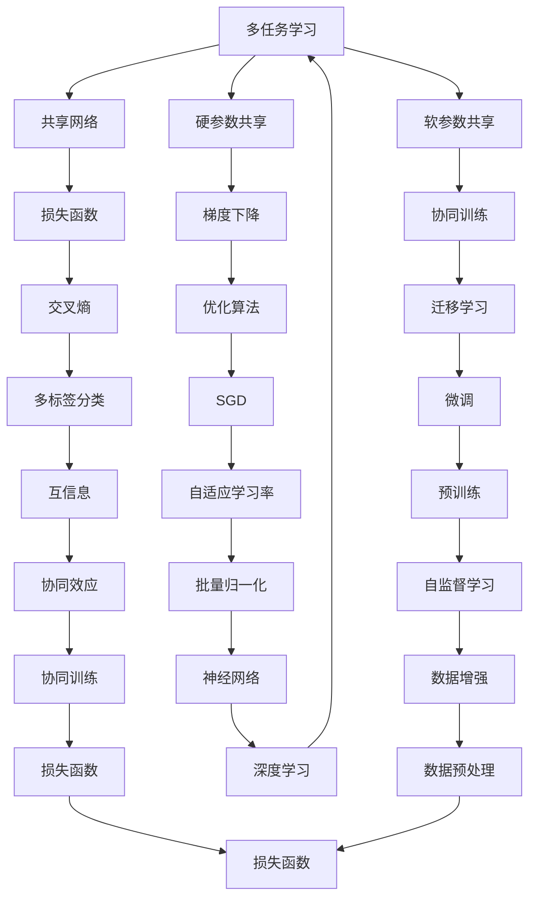

                 

# 文章标题：多任务学习

> 关键词：多任务学习，共享网络，硬参数共享，软参数共享，深度学习，自然语言处理，计算机视觉，优化算法

> 摘要：
本文将深入探讨多任务学习的基本概念、核心算法以及其在深度学习中的广泛应用。通过详细阐述多任务学习的定义、背景、挑战和分类，并结合实际案例展示其在自然语言处理和计算机视觉领域的应用，本文旨在为读者提供全面、系统的多任务学习知识。

## 第一部分：多任务学习的基本概念

### 第1章：多任务学习的概述

#### 1.1 多任务学习的定义与背景

**1.1.1 多任务学习的定义**

多任务学习（Multi-Task Learning，MTL）是一种机器学习技术，旨在同时从多个相关的任务中学习，以提高每个任务的性能。在多任务学习中，多个任务共享部分先验知识和信息，从而使得模型能够更好地泛化和处理新的任务。

**1.1.2 多任务学习的背景与意义**

随着人工智能和机器学习技术的快速发展，越来越多的应用场景需要同时处理多个任务。例如，在自然语言处理中，同时进行文本分类和情感分析可以提高模型的性能；在计算机视觉中，同时进行图像分类和目标检测可以更加精确地理解图像内容。因此，多任务学习在人工智能领域具有重要的研究价值和实际应用意义。

#### 1.2 多任务学习的主要挑战

**1.2.1 资源分配问题**

多任务学习需要同时处理多个任务，因此在计算资源有限的情况下，如何合理地分配资源成为一个重要的挑战。需要考虑到各个任务的复杂度和计算需求，以确保每个任务都能够得到足够的资源支持。

**1.2.2 模型规模问题**

多任务学习通常需要较大的模型规模来同时处理多个任务，这可能导致模型的训练时间和内存消耗大幅增加。因此，如何设计高效的多任务学习模型是一个关键问题。

**1.2.3 损失函数设计问题**

多任务学习中的损失函数设计需要考虑到各个任务的重要性和相互关系。如何设计一个既能平衡不同任务损失，又能有效推动模型训练的损失函数是一个重要的研究课题。

#### 1.3 多任务学习的分类

**1.3.1 同步多任务学习**

同步多任务学习（Synchronous Multi-Task Learning）是一种多任务学习方式，其中多个任务同时进行，并共享模型的权重和参数。这种方法的优点是能够有效地利用多个任务的先验知识，提高每个任务的性能。

**1.3.2 异步多任务学习**

异步多任务学习（Asynchronous Multi-Task Learning）是一种多任务学习方式，其中多个任务在不同时间点进行，并使用独立的模型进行训练。这种方法的优点是能够更好地适应不同的任务需求和资源限制。

**1.3.3 分层多任务学习**

分层多任务学习（Hierarchical Multi-Task Learning）是一种多任务学习方式，其中任务被组织成一个层次结构，并按照层次顺序进行学习。这种方法的优点是能够更好地利用任务的层次关系，提高模型的泛化能力。

## 第二部分：多任务学习中的核心算法

### 第2章：多任务学习中的核心算法

#### 2.1 多任务学习的理论基础

**2.1.1 多任务学习与单任务学习的关系**

多任务学习与单任务学习有着密切的关系。单任务学习关注于单个任务的性能优化，而多任务学习则旨在同时处理多个相关任务，并利用任务的共享信息来提高每个任务的性能。

**2.1.2 多任务学习中的协同效应**

多任务学习中的协同效应（Synergistic Effects）是指多个任务之间相互促进，从而提高整体性能的现象。协同效应可以通过共享网络结构、共享参数或者共享数据等方式实现。

**2.1.3 多任务学习中的互信息理论**

互信息理论（Information Theory）在多任务学习中的应用提供了量化任务之间相关性的方法。通过计算任务之间的互信息，可以确定任务之间的关联程度，从而指导多任务学习模型的设计。

#### 2.2 多任务学习的主要算法

**2.2.1 基于共享网络的多任务学习算法**

基于共享网络的多任务学习算法通过共享模型的权重和参数来同时处理多个任务。这种方法能够有效地利用任务的共享信息，提高模型的性能和泛化能力。

**2.2.2 基于硬参数共享的多任务学习算法**

基于硬参数共享的多任务学习算法通过将多个任务的权重矩阵合并为一个共享的权重矩阵，但每个任务具有独立的偏置向量。这种方法能够简化模型的训练过程，提高计算效率。

**2.2.3 基于软参数共享的多任务学习算法**

基于软参数共享的多任务学习算法通过优化目标函数来学习共享的参数，同时考虑各个任务的重要性。这种方法能够更好地平衡不同任务的损失，提高模型的性能。

#### 2.3 多任务学习的优化算法

**2.3.1 矩阵分解方法**

矩阵分解方法（Matrix Factorization）是一种常用的多任务学习优化算法。通过将高维数据分解为低维矩阵，可以有效地降低模型的复杂度，提高训练和推理的效率。

**2.3.2 共同梯度下降方法**

共同梯度下降方法（Conjugate Gradient Descent）是一种基于梯度的多任务学习优化算法。通过迭代优化目标函数，可以逐步找到最优的模型参数，提高模型的性能。

**2.3.3 多任务学习中的随机梯度下降方法**

随机梯度下降方法（Stochastic Gradient Descent，SGD）是一种常用的多任务学习优化算法。通过随机选取样本进行梯度更新，可以加快模型的训练速度，提高模型的泛化能力。

## 第三部分：多任务学习在深度学习中的应用

### 第3章：多任务学习在自然语言处理中的应用

#### 3.1 多任务学习在文本分类中的应用

**3.1.1 多分类问题**

多分类问题（Multi-Class Classification）是指同时处理多个分类任务。多任务学习可以同时学习多个分类任务，提高每个分类任务的性能。

**3.1.2 多标签文本分类问题**

多标签文本分类问题（Multi-Label Text Classification）是指文本可以同时属于多个类别。多任务学习可以同时学习多个标签，提高文本分类的准确性。

**3.1.3 实际案例解析**

以一个实际案例为例，我们可以使用多任务学习技术来同时进行文本分类和情感分析。通过共享文本表示和分类器，可以有效地提高模型的性能和准确率。

#### 3.2 多任务学习在机器翻译中的应用

**3.2.1 同时翻译多个语言**

多任务学习可以同时处理多个语言的翻译任务，提高翻译的效率和准确性。通过共享编码器和解码器，可以有效地利用任务的共享信息，提高翻译质量。

**3.2.2 多语言机器翻译的挑战**

多语言机器翻译面临着词汇量差异、语言结构差异等挑战。多任务学习可以结合不同语言的特点，有效地解决这些挑战。

**3.2.3 多语言机器翻译的案例解析**

以一个多语言机器翻译案例为例，我们可以使用多任务学习技术来同时进行英语到法语和英语到西班牙语的翻译。通过共享编码器和解码器，可以有效地提高翻译的准确性和流畅性。

#### 3.3 多任务学习在问答系统中的应用

**3.3.1 问答系统概述**

问答系统（Question Answering System）是一种基于自然语言理解的智能对话系统。多任务学习可以同时进行问答系统的多个任务，如问题理解、答案检索和答案生成。

**3.3.2 多任务学习在问答系统中的实现**

多任务学习可以同时学习问答系统的多个任务，如通过共享问答网络来同时进行问题理解和答案生成。这种方法可以有效地提高问答系统的性能和准确性。

**3.3.3 实际案例解析**

以一个实际案例为例，我们可以使用多任务学习技术来同时进行问题理解和答案生成，从而构建一个高效的问答系统。

### 第4章：多任务学习在计算机视觉中的应用

#### 4.1 多任务学习在图像分类中的应用

**4.1.1 多分类问题**

多分类问题（Multi-Class Classification）是指同时处理多个图像分类任务。多任务学习可以同时学习多个分类任务，提高每个分类任务的性能。

**4.1.2 多标签图像分类问题**

多标签图像分类问题（Multi-Label Image Classification）是指图像可以同时属于多个标签。多任务学习可以同时学习多个标签，提高图像分类的准确性。

**4.1.3 实际案例解析**

以一个实际案例为例，我们可以使用多任务学习技术来同时进行图像分类和目标检测。通过共享图像特征表示和分类器，可以有效地提高模型的性能和准确率。

#### 4.2 多任务学习在目标检测中的应用

**4.2.1 目标检测概述**

目标检测（Object Detection）是一种图像识别任务，旨在识别图像中的目标和其位置。多任务学习可以同时进行图像分类和目标检测，提高模型的性能和准确性。

**4.2.2 多任务学习在目标检测中的实现**

多任务学习可以同时学习图像分类和目标检测任务，如通过共享卷积神经网络来同时进行特征提取和目标检测。这种方法可以有效地提高目标检测的准确性和效率。

**4.2.3 实际案例解析**

以一个实际案例为例，我们可以使用多任务学习技术来同时进行图像分类和目标检测，从而构建一个高效的目标检测系统。

#### 4.3 多任务学习在图像分割中的应用

**4.3.1 图像分割概述**

图像分割（Image Segmentation）是一种图像处理任务，旨在将图像划分为不同的区域。多任务学习可以同时进行图像分类和图像分割，提高模型的性能和准确性。

**4.3.2 多任务学习在图像分割中的实现**

多任务学习可以同时学习图像分类和图像分割任务，如通过共享卷积神经网络来同时进行特征提取和分割。这种方法可以有效地提高图像分割的准确性和效率。

**4.3.3 实际案例解析**

以一个实际案例为例，我们可以使用多任务学习技术来同时进行图像分类和图像分割，从而构建一个高效的图像分割系统。

## 第四部分：多任务学习的应用与未来展望

### 第5章：多任务学习的实际应用案例分析

#### 5.1 案例一：智能客服系统的多任务学习应用

**5.1.1 智能客服系统概述**

智能客服系统是一种基于人工智能技术的自动客户服务系统，旨在为用户提供24/7的在线服务。多任务学习可以同时处理多个任务，如对话管理、意图识别和答案生成。

**5.1.2 多任务学习在智能客服系统中的应用**

通过多任务学习技术，智能客服系统可以同时处理多个任务，提高用户的满意度和服务效率。例如，可以同时进行对话管理和意图识别，以快速理解用户的需求并提供准确的答案。

**5.1.3 案例解析**

以一个实际案例为例，我们可以使用多任务学习技术来构建一个高效的智能客服系统，从而为用户提供更好的服务体验。

#### 5.2 案例二：智能驾驶的多任务学习应用

**5.2.1 智能驾驶概述**

智能驾驶是一种基于人工智能技术的自动驾驶系统，旨在实现车辆的安全、高效和智能驾驶。多任务学习可以同时处理多个驾驶任务，如路径规划、目标检测和障碍物避让。

**5.2.2 多任务学习在智能驾驶中的应用**

通过多任务学习技术，智能驾驶系统可以同时处理多个驾驶任务，提高车辆的驾驶安全性和效率。例如，可以同时进行路径规划和目标检测，以确保车辆在复杂的驾驶环境中保持稳定行驶。

**5.2.3 案例解析**

以一个实际案例为例，我们可以使用多任务学习技术来构建一个高效的智能驾驶系统，从而实现更安全、更智能的驾驶体验。

### 第6章：多任务学习的未来发展

#### 6.1 多任务学习的技术挑战

**6.1.1 模型可解释性问题**

多任务学习模型的可解释性是一个重要的技术挑战。如何解释模型的决策过程和推理逻辑，以提高模型的透明度和可信度，是一个需要深入研究的课题。

**6.1.2 数据隐私保护问题**

在多任务学习中，如何保护用户数据的隐私是一个重要的技术挑战。如何设计安全的多任务学习算法，以避免数据泄露和隐私侵犯，是一个需要解决的问题。

**6.1.3 模型泛化能力问题**

多任务学习模型的泛化能力是一个关键问题。如何提高模型在不同任务和数据集上的泛化能力，以提高模型的应用价值，是一个需要研究的课题。

#### 6.2 多任务学习的应用前景

**6.2.1 多任务学习在医疗健康领域的应用**

多任务学习在医疗健康领域具有广泛的应用前景。例如，可以通过多任务学习技术同时进行疾病诊断、治疗方案推荐和患者健康监测，以提高医疗服务的质量和效率。

**6.2.2 多任务学习在工业自动化领域的应用**

多任务学习在工业自动化领域具有重要的应用价值。例如，可以通过多任务学习技术同时进行生产过程优化、设备故障检测和能耗管理，以提高生产效率和能源利用率。

**6.2.3 多任务学习在其他领域的应用**

多任务学习在金融、交通、教育等多个领域具有广泛的应用前景。例如，可以通过多任务学习技术同时进行风险预测、交通流量优化和教育个性化推荐，以提高相关领域的效率和质量。

### 第7章：总结与展望

#### 7.1 多任务学习的重要性

**7.1.1 提高模型性能**

多任务学习可以通过共享任务信息和优化目标函数，提高模型的性能和准确性。

**7.1.2 提高数据处理效率**

多任务学习可以同时处理多个任务，从而提高数据处理效率和计算资源利用率。

**7.1.3 拓宽AI应用领域**

多任务学习可以应用于更多的领域，推动人工智能技术的发展和应用。

#### 7.2 未来发展趋势

**7.2.1 模型压缩与加速**

为了应对多任务学习的计算需求，模型压缩与加速技术将成为未来的重要研究方向。

**7.2.2 模型可解释性与可信赖性**

提高多任务学习模型的可解释性和可信赖性，将有助于增强用户对AI技术的信任和接受度。

**7.2.3 跨学科融合与创新**

多任务学习技术与其他领域的跨学科融合和创新，将推动人工智能技术的不断进步和应用。

### 多任务学习中的核心概念与联系

以下是多任务学习中的核心概念与联系，包括共享网络、硬参数共享、软参数共享、损失函数、优化算法、协同训练和迁移学习等。

**Mermaid流程图：**



### 多任务学习中的核心算法原理讲解

#### 基于共享网络的多任务学习算法

**算法原理：**

基于共享网络的多任务学习算法通过共享模型的某些部分，如卷积层或全连接层，来同时处理多个任务。这种方法的优点是可以通过共享信息来提高模型的泛化能力和性能。

**伪代码：**

```python
# 定义共享网络结构
class SharedNetwork(nn.Module):
    def __init__(self):
        super(SharedNetwork, self).__init__()
        # 共享卷积层
        self.conv = nn.Conv2d(in_channels, hidden_channels, kernel_size)
        # 任务1的全连接层
        self.fc1 = nn.Linear(hidden_channels, output_size1)
        # 任务2的全连接层
        self.fc2 = nn.Linear(hidden_channels, output_size2)

    def forward(self, x):
        x = self.conv(x)
        x = torch.relu(x)
        # 对于任务1
        out1 = self.fc1(x)
        # 对于任务2
        out2 = self.fc2(x)
        return out1, out2
```

**示例：**

假设有两个任务：图像分类和目标检测。我们可以使用共享卷积层来提取图像特征，然后分别使用两个不同的全连接层来处理每个任务。

```python
# 初始化模型
model = SharedNetwork()

# 定义损失函数
criterion1 = nn.CrossEntropyLoss()
criterion2 = nn.L1Loss()

# 定义优化器
optimizer = optim.Adam(model.parameters(), lr=0.001)

# 训练模型
for epoch in range(num_epochs):
    for inputs, targets1, targets2 in data_loader:
        optimizer.zero_grad()
        outputs1, outputs2 = model(inputs)
        loss1 = criterion1(outputs1, targets1)
        loss2 = criterion2(outputs2, targets2)
        loss = loss1 + loss2
        loss.backward()
        optimizer.step()
```

#### 基于硬参数共享的多任务学习算法

**算法原理：**

基于硬参数共享的多任务学习算法通过将多个任务的权重矩阵合并为一个共享的权重矩阵，但每个任务具有独立的偏置向量。这种方法可以简化模型的训练过程，提高计算效率。

**伪代码：**

```python
# 定义硬参数共享网络结构
class HardSharedNetwork(nn.Module):
    def __init__(self):
        super(HardSharedNetwork, self).__init__()
        # 共享全连接层
        self.fc = nn.Linear(in_features, hidden_size)
        # 任务1的输出层
        self.out1 = nn.Linear(hidden_size, output_size1)
        # 任务2的输出层
        self.out2 = nn.Linear(hidden_size, output_size2)

    def forward(self, x):
        x = self.fc(x)
        x = torch.relu(x)
        # 对于任务1
        out1 = self.out1(x)
        # 对于任务2
        out2 = self.out2(x)
        return out1, out2
```

**示例：**

假设有两个任务：图像分类和情感分析。我们可以使用共享的全连接层来提取特征，然后分别使用两个不同的输出层来处理每个任务。

```python
# 初始化模型
model = HardSharedNetwork()

# 定义损失函数
criterion1 = nn.CrossEntropyLoss()
criterion2 = nn.BCEWithLogitsLoss()

# 定义优化器
optimizer = optim.Adam(model.parameters(), lr=0.001)

# 训练模型
for epoch in range(num_epochs):
    for inputs, targets1, targets2 in data_loader:
        optimizer.zero_grad()
        outputs1, outputs2 = model(inputs)
        loss1 = criterion1(outputs1, targets1)
        loss2 = criterion2(outputs2, targets2)
        loss = loss1 + loss2
        loss.backward()
        optimizer.step()
```

#### 基于软参数共享的多任务学习算法

**算法原理：**

基于软参数共享的多任务学习算法通过优化目标函数来学习共享的参数，同时考虑各个任务的重要性。这种方法可以平衡不同任务的损失，提高模型的性能。

**伪代码：**

```python
# 定义软参数共享网络结构
class SoftSharedNetwork(nn.Module):
    def __init__(self):
        super(SoftSharedNetwork, self).__init__()
        # 共享全连接层
        self.fc = nn.Linear(in_features, hidden_size)
        # 任务1的输出层
        self.out1 = nn.Linear(hidden_size, output_size1)
        # 任务2的输出层
        self.out2 = nn.Linear(hidden_size, output_size2)

    def forward(self, x):
        x = self.fc(x)
        x = torch.relu(x)
        # 对于任务1
        out1 = self.out1(x)
        # 对于任务2
        out2 = self.out2(x)
        return out1, out2

# 定义损失函数
def soft_loss(outputs1, targets1, outputs2, targets2, alpha):
    loss1 = nn.CrossEntropyLoss()(outputs1, targets1)
    loss2 = nn.BCEWithLogitsLoss()(outputs2, targets2)
    loss = alpha * loss1 + (1 - alpha) * loss2
    return loss
```

**示例：**

假设有两个任务：图像分类和目标检测。我们可以使用共享的全连接层来提取特征，然后分别使用两个不同的输出层来处理每个任务。同时，通过优化目标函数来平衡不同任务的损失。

```python
# 初始化模型
model = SoftSharedNetwork()

# 定义损失函数
alpha = 0.5  # 权重系数
soft_loss_fn = lambda outputs1, targets1, outputs2, targets2: soft_loss(outputs1, targets1, outputs2, targets2, alpha)

# 定义优化器
optimizer = optim.Adam(model.parameters(), lr=0.001)

# 训练模型
for epoch in range(num_epochs):
    for inputs, targets1, targets2 in data_loader:
        optimizer.zero_grad()
        outputs1, outputs2 = model(inputs)
        loss = soft_loss_fn(outputs1, targets1, outputs2, targets2)
        loss.backward()
        optimizer.step()
```

### 数学模型和数学公式

多任务学习中的损失函数通常是一个组合函数，包含不同任务的损失。以下是一个简化的例子：

$$
L(\theta) = \alpha L_1(\theta) + (1 - \alpha) L_2(\theta)
$$

其中，$L_1(\theta)$ 和 $L_2(\theta)$ 分别是分类和回归任务的损失，$\alpha$ 是权重系数，用于平衡不同任务的损失。

#### 交叉熵损失函数

分类任务的交叉熵损失函数可以表示为：

$$
L_1(\theta) = -\frac{1}{N} \sum_{i=1}^{N} y_i \log(p_i)
$$

其中，$N$ 是样本数量，$y_i$ 是真实标签，$p_i$ 是模型预测的概率。

$$
\log(p_i) = \log(\frac{e^{\text{logit}(x_i; \theta)}}{1 + e^{\text{logit}(x_i; \theta)}})
$$

$$
\text{logit}(x_i; \theta) = \theta \cdot x_i
$$

$$
p_i = \frac{e^{\text{logit}(x_i; \theta)}}{1 + e^{\text{logit}(x_i; \theta)}}
$$

#### 均方误差损失函数

回归任务的均方误差损失函数可以表示为：

$$
L_2(\theta) = \frac{1}{N} \sum_{i=1}^{N} (y_i - \hat{y}_i)^2
$$

其中，$N$ 是样本数量，$y_i$ 是真实标签，$\hat{y}_i$ 是模型预测的值。

$$
\hat{y}_i = \text{激活函数}(\theta \cdot x_i)
$$

$$
\text{激活函数}(x) = \text{sigmoid}(x) \text{ 或者 } \text{ReLU}(x)
$$

#### 多分类问题的交叉熵损失函数

在多分类问题中，通常使用softmax激活函数来计算预测概率：

$$
\text{softmax}(x) = \frac{e^x}{\sum_{j} e^x_j}
$$

交叉熵损失函数可以表示为：

$$
L_1(\theta) = -\frac{1}{N} \sum_{i=1}^{N} \sum_{j=1}^{C} y_{ij} \log(p_{ij})
$$

其中，$N$ 是样本数量，$C$ 是类别数量，$y_{ij}$ 是第$i$个样本属于第$j$类别的标签（$y_{ij} \in \{0, 1\}$），$p_{ij}$ 是模型预测的第$i$个样本属于第$j$类别的概率。

$$
p_{ij} = \text{softmax}(\text{logit}(x_i; \theta))
$$

### 项目实战

以下是一个简单的多任务学习项目，包括数据预处理、模型训练和评估。

#### 开发环境搭建

- 安装Python 3.8及以上版本。
- 安装PyTorch 1.8及以上版本。
- 安装其他必要的库，如NumPy、Pandas等。

#### 源代码详细实现

```python
import torch
import torch.nn as nn
import torch.optim as optim
from torch.utils.data import DataLoader, TensorDataset

# 数据预处理
# 假设我们有两个任务：分类和回归
# 加载数据集，并进行预处理
# ...

# 定义模型
class MultiTaskModel(nn.Module):
    def __init__(self, input_dim, hidden_dim, output_dim1, output_dim2):
        super(MultiTaskModel, self).__init__()
        self.fc1 = nn.Linear(input_dim, hidden_dim)
        self.fc2 = nn.Linear(hidden_dim, output_dim1)  # 分类任务的输出层
        self.fc3 = nn.Linear(hidden_dim, output_dim2)  # 回归任务的输出层

    def forward(self, x):
        x = torch.relu(self.fc1(x))
        x1 = self.fc2(x)  # 分类任务的输出
        x2 = self.fc3(x)  # 回归任务的输出
        return x1, x2

# 实例化模型
model = MultiTaskModel(input_dim, hidden_dim, output_dim1, output_dim2)

# 定义损失函数
criterion1 = nn.CrossEntropyLoss()
criterion2 = nn.MSELoss()

# 定义优化器
optimizer = optim.Adam(model.parameters(), lr=0.001)

# 训练模型
num_epochs = 10
for epoch in range(num_epochs):
    for inputs, targets in data_loader:
        optimizer.zero_grad()
        outputs1, outputs2 = model(inputs)
        loss1 = criterion1(outputs1, targets['class'])
        loss2 = criterion2(outputs2, targets['regression'])
        loss = loss1 + loss2
        loss.backward()
        optimizer.step()
    print(f'Epoch {epoch+1}/{num_epochs}, Loss: {loss.item()}')

# 评估模型
with torch.no_grad():
    total_loss1, total_loss2 = 0, 0
    for inputs, targets in test_loader:
        outputs1, outputs2 = model(inputs)
        loss1 = criterion1(outputs1, targets['class'])
        loss2 = criterion2(outputs2, targets['regression'])
        total_loss1 += loss1.item()
        total_loss2 += loss2.item()
    print(f'Validation Loss (Class): {total_loss1 / len(test_loader)}, Validation Loss (Regression): {total_loss2 / len(test_loader)}')

# 保存模型
torch.save(model.state_dict(), 'multi_task_model.pth')
```

#### 代码解读与分析

- **数据预处理**：加载并预处理数据集，将数据转换为Tensor格式，并创建数据加载器（DataLoader）。

- **模型定义**：定义一个多任务模型（MultiTaskModel），包含两个全连接层（fc1, fc2）和一个共享的线性层（fc3）。在forward方法中，首先通过fc1和ReLU激活函数进行特征提取，然后分别通过fc2和fc3得到分类和回归任务的输出。

- **损失函数和优化器**：定义交叉熵损失函数（criterion1）和均方误差损失函数（criterion2），并使用Adam优化器（optimizer）。

- **模型训练**：遍历数据加载器中的数据，通过前向传播计算损失，使用反向传播更新模型参数。

- **模型评估**：在测试集上评估模型的性能，计算分类和回归任务的损失，并输出结果。

- **保存模型**：将训练好的模型保存为.pth文件，以供后续使用。

通过这个简单的多任务学习项目，我们可以看到如何定义模型、设置损失函数和优化器，并使用PyTorch进行模型训练和评估。在实际应用中，可能需要更复杂的模型架构和更精细的参数调优来提高模型的性能。

