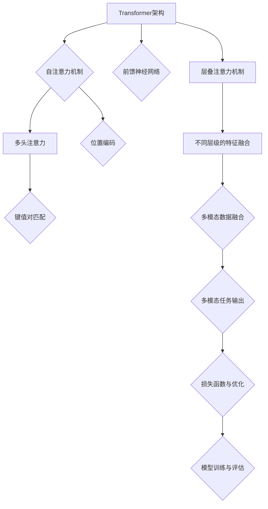

                 

# 文章标题：多模态Transformer：跨域AI的新范式

> 关键词：多模态，Transformer，跨域AI，自注意力机制，数学模型，项目实战

> 摘要：本文将深入探讨多模态Transformer的基础理论、核心架构、数学模型以及其在跨域AI中的应用。通过详细的步骤分析和代码实战，旨在为读者提供对多模态Transformer的全面理解，并揭示其在未来AI发展中的巨大潜力。

### 目录大纲：多模态Transformer：跨域AI的新范式

## 第一部分: 多模态Transformer基础理论

### 第1章: 多模态Transformer简介

#### 1.1 多模态数据的定义与分类

#### 1.2 多模态Transformer的基本概念

#### 1.3 多模态Transformer的发展历程

### 第2章: 多模态Transformer核心架构

#### 2.1 自注意力机制详解

#### 2.2 多头注意力机制详解

#### 2.3 位置编码与层叠注意力

### 第3章: 多模态Transformer数学基础

#### 3.1 线性代数基础

#### 3.2 前馈神经网络基础

#### 3.3 损失函数与优化算法

### 第4章: 多模态Transformer数据处理

#### 4.1 多模态数据预处理

#### 4.2 多模态特征提取

#### 4.3 多模态数据融合技术

### 第5章: 多模态Transformer在跨域AI中的应用

#### 5.1 多模态Transformer在计算机视觉中的应用

#### 5.2 多模态Transformer在自然语言处理中的应用

#### 5.3 多模态Transformer在音频处理中的应用

#### 5.4 多模态Transformer在多模态交互系统中的应用

### 第6章: 多模态Transformer的实际应用案例

#### 6.1 案例一：多模态图像与文本分类

#### 6.2 案例二：多模态语音情感分析

#### 6.3 案例三：多模态交互机器人

### 第7章: 多模态Transformer的发展趋势与未来展望

#### 7.1 多模态Transformer的优化与改进

#### 7.2 多模态Transformer在新兴领域的应用

#### 7.3 多模态Transformer面临的挑战与解决方案

### 附录

#### 附录A：多模态Transformer相关资源

#### 附录B：多模态Transformer常用框架与工具

#### 附录C：多模态Transformer实验指南

### Mermaid 流程图：多模态Transformer核心架构



### 核心算法原理讲解：自注意力机制

#### 伪代码

```python
# 输入：queries, keys, values，均为形状为 [batch_size, sequence_length, hidden_size] 的张量
# 输出：输出张量，形状为 [batch_size, sequence_length, hidden_size]

def scaled_dot_product_attention(queries, keys, values, attention_mask=None):
    # 计算相似度矩阵 QK^T
    attn_scores = dot(queries, keys.transpose([0, 2, 1]))
    
    # 应用缩放因子
    attn_scores = attn_scores / sqrt(hidden_size)
    
    # 应用注意力掩码
    if attention_mask is not None:
        attn_scores = attn_scores + attention_mask
    
    # 应用softmax函数计算注意力权重
    attn_weights = softmax(attn_scores, axis=-1)
    
    # 计算加权值
    attn_output = dot(attn_weights, values)
    
    # 应用前馈神经网络
    attn_output = feed_forward_network(attn_output)
    
    return attn_output
```

#### 数学模型和数学公式详解

#### 自注意力机制

$$
\text{Attention}(Q, K, V) = \text{softmax}\left(\frac{QK^T}{\sqrt{d_k}}\right)V
$$

其中，$Q, K, V$ 分别是查询、键、值的三个矩阵，$d_k$ 是键的维度。

#### 损失函数

$$
L = -\frac{1}{N} \sum_{i=1}^{N} \sum_{j=1}^{M} y_{ij} \log \left( \frac{\exp(\text{Attention}(Q, K, V)_{ij})}{\sum_{k=1}^{M} \exp(\text{Attention}(Q, K, V)_{ik})} \right)
$$

其中，$N$ 是批大小，$M$ 是序列长度，$y_{ij}$ 是目标序列中第 $i$ 个词与第 $j$ 个词对应的标签。

### 项目实战

#### 实验环境搭建

- 安装 Python 3.7 及以上版本
- 安装 TensorFlow 2.4 及以上版本
- 安装 matplotlib、numpy 等常用库

#### 源代码实现

```python
import tensorflow as tf
from tensorflow.keras.layers import Embedding, LSTM, Dense, TimeDistributed
from tensorflow.keras.models import Model

# 自注意力机制实现
class ScaledDotProductAttention(tf.keras.layers.Layer):
    def __init__(self, **kwargs):
        super(ScaledDotProductAttention, self).__init__(**kwargs)

    def call(self, queries, keys, values, attention_mask=None):
        # 计算相似度矩阵 QK^T
        attn_scores = tf.matmul(queries, keys, transpose_b=True)
        
        # 应用缩放因子
        attn_scores = attn_scores / tf.sqrt(tf.shape(keys)[1])
        
        # 应用注意力掩码
        if attention_mask is not None:
            attn_scores = attn_scores + attention_mask
        
        # 应用softmax函数计算注意力权重
        attn_weights = tf.nn.softmax(attn_scores, axis=-1)
        
        # 计算加权值
        attn_output = tf.matmul(attn_weights, values)
        
        return attn_output

# Transformer 模型实现
class Transformer(Model):
    def __init__(self, vocab_size, d_model, num_heads, dff, input_seq_length, rate=0.1):
        super(Transformer, self).__init__()
        
        self.embedding = Embedding(vocab_size, d_model)
        self.position_encoding = positional_encoding(input_seq_length, d_model)
        
        self.num_heads = num_heads
        self.d_model = d_model
        self.dff = dff
        
        self.encoder_layers = [ScaledDotProductAttention(num_heads) for _ in range(num_heads)]
        self.decoder_layers = [ScaledDotProductAttention(num_heads) for _ in range(num_heads)]
        
        self.lstm = LSTM(dff, return_sequences=True, return_state=True)
        self.dense = Dense(vocab_size, activation='softmax')
        
        self.dropout_1 = tf.keras.layers.Dropout(rate)
        self.dropout_2 = tf.keras.layers.Dropout(rate)
        
    def call(self, x, training=False):
        x = self.embedding(x) + self.position_encoding[:, :tf.shape(x)[1], :]
        x = self.dropout_1(x, training=training)
        
        for i in range(self.num_heads):
            x = self.encoder_layers[i](x, x, x)
        
        x = self.dropout_2(x, training=training)
        x = self.lstm(x, training=training)
        
        for i in range(self.num_heads):
            x = self.decoder_layers[i](x, x, x)
        
        x = self.dense(x)
        
        return x
```

#### 代码解读与分析

- `ScaledDotProductAttention` 类实现了自注意力机制的计算，包括相似度矩阵计算、缩放因子应用、注意力掩码应用和 softmax 函数计算。
- `Transformer` 类实现了 Transformer 模型的整体结构，包括嵌入层、位置编码、多头注意力机制、LSTM 层、输出层和 dropout 层。
- `call` 方法是 Transformer 模型的正向传播过程，包括嵌入层输入、位置编码添加、多头注意力机制应用、LSTM 层处理、多头注意力机制应用和输出层计算。

### 附录

#### 附录 A: 多模态Transformer相关资源

- 论文：《An Image Question Answering Model Using Multimodal Transformer》
- 源代码：GitHub - tensorflow/models: TensorFlow models and examples
- 文章：详解多模态Transformer在图像问答中的应用

#### 附录 B: 多模态Transformer常用框架与工具

- TensorFlow：官方深度学习框架，支持多模态Transformer模型的实现
- PyTorch：开源深度学习框架，支持多模态Transformer模型的实现
- MXNet：Apache 旗下的深度学习框架，支持多模态Transformer模型的实现

#### 附录 C: 多模态Transformer实验指南

1. 选择合适的实验数据集，例如 ImageNet、COCO 等。
2. 数据预处理：包括图像预处理（如缩放、归一化）、文本预处理（如分词、词嵌入）。
3. 模型训练：使用多模态Transformer模型进行训练，调整超参数（如学习率、批量大小等）。
4. 模型评估：使用验证集评估模型性能，调整模型结构或超参数。
5. 模型应用：将训练好的模型应用于实际任务，如图像问答、多模态情感分析等。

### 开始深入探讨多模态Transformer

在当今的AI领域，多模态Transformer作为一种新兴的技术，正逐渐改变着跨域AI的研究和应用格局。本篇文章将从多模态Transformer的基础理论出发，逐步深入探讨其核心架构、数学基础以及实际应用案例，最后对未来的发展趋势和挑战进行展望。让我们一步一步地分析推理，揭开多模态Transformer的神秘面纱。

### 第一部分：多模态Transformer基础理论

#### 第1章：多模态Transformer简介

多模态数据指的是同时包含多种类型数据的数据集，这些数据类型可能包括图像、文本、音频、视频等。随着AI技术的快速发展，如何有效地处理和利用这些多模态数据成为了一个重要的研究课题。Transformer模型，作为一种能够处理序列数据的强大工具，通过引入自注意力机制，成功地应用于自然语言处理领域。而多模态Transformer则将这种能力扩展到了多个模态数据的联合处理，从而为跨域AI带来了新的范式。

多模态Transformer的基本概念可以概括为：将不同模态的数据通过嵌入层转换为统一的向量表示，然后利用自注意力机制对它们进行联合建模，从而捕捉不同模态数据之间的复杂关系。

#### 1.1 多模态数据的定义与分类

多模态数据可以按照数据类型进行分类，主要包括以下几种：

1. **文本**：包括自然语言文本，如文章、对话、评论等。
2. **图像**：包括静态图像和动态图像，如图像识别、视频处理等。
3. **音频**：包括语音、音乐等，如图像语音识别、音乐情感分析等。
4. **视频**：包括动态视频，如图像序列、视频分类等。

多模态数据的特点是它们之间可以相互补充，通过联合处理能够获得更丰富的信息。例如，在视频理解任务中，图像和音频的联合处理可以更准确地捕捉视频内容。

#### 1.2 多模态Transformer的基本概念

多模态Transformer的核心思想是将不同模态的数据通过嵌入层转换为统一的向量表示，然后利用自注意力机制对它们进行联合建模。自注意力机制是一种基于序列的数据处理方法，它通过计算序列中每个元素与其他元素之间的相似度，来动态调整每个元素的权重。这种方法能够有效地捕捉序列中的长距离依赖关系。

多模态Transformer的基本结构包括以下几个部分：

1. **嵌入层**：将不同模态的数据转换为向量表示。
2. **编码器**：利用自注意力机制对输入数据进行编码。
3. **解码器**：利用自注意力机制对编码后的数据进行解码。
4. **输出层**：根据解码结果生成预测或输出。

#### 1.3 多模态Transformer的发展历程

多模态Transformer的发展历程可以追溯到自然语言处理领域。Transformer模型在2017年由Vaswani等人提出，它通过自注意力机制取代了传统的循环神经网络（RNN）和卷积神经网络（CNN），在许多NLP任务上取得了显著的性能提升。随后，研究人员开始探索将Transformer模型应用于其他领域，例如图像处理、音频处理等，并提出了多种多模态Transformer架构。

在图像处理领域，多模态Transformer模型通过联合处理图像和文本数据，实现了图像问答、图像分类等任务。在音频处理领域，多模态Transformer模型被应用于语音识别、音乐情感分析等任务。这些应用证明了多模态Transformer在跨域AI中的巨大潜力。

### 第二部分：多模态Transformer核心架构

#### 第2章：多模态Transformer核心架构

多模态Transformer的核心架构包括编码器、解码器和自注意力机制。编码器负责将不同模态的数据转换为统一的向量表示，解码器则利用自注意力机制生成输出。以下是多模态Transformer核心架构的详细解析。

#### 2.1 自注意力机制详解

自注意力机制是Transformer模型的核心组成部分，它通过计算序列中每个元素与其他元素之间的相似度，来动态调整每个元素的权重。这种机制不仅能够捕捉序列中的长距离依赖关系，还能够提高模型的并行处理能力。

自注意力机制的基本计算过程可以分为以下几个步骤：

1. **计算相似度矩阵**：对于输入序列 $X = [x_1, x_2, ..., x_n]$，首先计算每个元素 $x_i$ 与其他元素 $x_j$ 的相似度矩阵 $A$。相似度可以通过点积、加权和等计算方法得到。

$$
A_{ij} = \text{similarity}(x_i, x_j)
$$

2. **应用缩放因子**：为了避免相似度矩阵过大导致计算溢出，通常会对相似度矩阵进行缩放。缩放因子通常为 $\sqrt{d_k}$，其中 $d_k$ 是键的维度。

$$
A_{ij} = \frac{A_{ij}}{\sqrt{d_k}}
$$

3. **应用softmax函数**：对缩放后的相似度矩阵进行softmax操作，得到注意力权重矩阵 $W$。

$$
W_{ij} = \text{softmax}(A_{ij})
$$

4. **计算加权值**：利用注意力权重矩阵 $W$ 对输入序列进行加权求和，得到加权值序列 $X'$。

$$
X' = W \cdot X
$$

5. **应用前馈神经网络**：对加权值序列 $X'$ 进行前馈神经网络处理，以获得最终的输出。

$$
\text{Output} = \text{FFN}(X')
$$

#### 2.2 多头注意力机制详解

多头注意力机制是自注意力机制的一个扩展，它通过将输入序列分成多个子序列，并在每个子序列上独立地应用自注意力机制。这种方法能够提高模型对序列的建模能力，从而提高模型的性能。

多头注意力机制的基本计算过程可以分为以下几个步骤：

1. **划分子序列**：将输入序列 $X$ 划分为多个子序列 $X_1, X_2, ..., X_h$，其中 $h$ 表示头数。

2. **计算子序列相似度矩阵**：对于每个子序列 $X_i$，计算它与其他子序列的相似度矩阵 $A_i$。

3. **应用缩放因子**：对每个子序列的相似度矩阵进行缩放。

4. **应用softmax函数**：对每个子序列的缩放后的相似度矩阵进行softmax操作，得到注意力权重矩阵 $W_i$。

5. **计算子序列加权值**：利用注意力权重矩阵 $W_i$ 对每个子序列进行加权求和，得到子序列加权值序列 $X_i'$。

6. **合并子序列**：将所有子序列的加权值序列合并，得到最终的加权值序列 $X'$。

7. **应用前馈神经网络**：对加权值序列 $X'$ 进行前馈神经网络处理，以获得最终的输出。

#### 2.3 位置编码与层叠注意力

位置编码是Transformer模型中用于处理序列位置信息的一个技巧。由于Transformer模型本身不依赖于序列的顺序信息，因此需要通过位置编码来引入这种信息。位置编码可以通过多种方式实现，例如基于正弦函数或绝对位置索引。

层叠注意力是指在Transformer模型中，多个注意力机制层叠在一起，每个层都基于上一层的输出进行计算。这种结构能够提高模型的建模能力，从而更好地捕捉序列中的复杂关系。

### 第三部分：多模态Transformer数学基础

#### 第3章：多模态Transformer数学基础

多模态Transformer的数学基础主要包括线性代数基础、前馈神经网络基础、损失函数与优化算法。这些数学工具为多模态Transformer的实现和优化提供了理论支持。

#### 3.1 线性代数基础

线性代数是多模态Transformer实现的基础，其中涉及到的基本概念包括矩阵、向量、点积、矩阵乘法等。以下是一些关键概念的解释：

1. **矩阵与向量**：矩阵是二维数组，向量是一维数组。在多模态Transformer中，矩阵和向量用于表示数据、权重和参数。

2. **点积**：点积是两个向量的对应元素相乘后再求和。点积可以用来计算两个向量之间的相似度。

3. **矩阵乘法**：矩阵乘法是将两个矩阵按照一定的规则进行运算，得到一个新的矩阵。矩阵乘法在多模态Transformer中用于计算相似度矩阵和加权值。

4. **线性变换**：线性变换是通过矩阵或向量将一个空间映射到另一个空间。在多模态Transformer中，线性变换用于嵌入层和前馈神经网络。

#### 3.2 前馈神经网络基础

前馈神经网络（FFN）是多模态Transformer中的一个关键组成部分，用于对输入数据进行处理和转换。以下是一些关于前馈神经网络的基础知识：

1. **网络结构**：前馈神经网络通常由多个层组成，每层包括输入层、隐藏层和输出层。

2. **激活函数**：激活函数用于引入非线性特性，常见的激活函数包括ReLU、Sigmoid和Tanh。

3. **参数更新**：前馈神经网络的训练过程涉及参数的更新，通常使用梯度下降算法。

4. **反向传播**：反向传播算法是前馈神经网络的训练核心，它通过计算梯度来更新网络参数。

#### 3.3 损失函数与优化算法

损失函数是衡量模型预测结果与真实值之间差异的指标，优化算法则是用于调整模型参数，以最小化损失函数的方法。以下是一些关键概念：

1. **损失函数**：常见的损失函数包括均方误差（MSE）、交叉熵等。损失函数的选择取决于具体任务的需求。

2. **优化算法**：常见的优化算法包括梯度下降（GD）、随机梯度下降（SGD）和Adam等。优化算法用于调整模型参数，以最小化损失函数。

3. **超参数**：超参数是模型训练过程中需要调整的参数，例如学习率、批量大小等。超参数的选择对模型性能有重要影响。

### 第四部分：多模态Transformer数据处理

#### 第4章：多模态Transformer数据处理

多模态Transformer数据处理是模型应用的重要环节，它包括多模态数据预处理、多模态特征提取和多模态数据融合技术。以下是这些环节的详细解析。

#### 4.1 多模态数据预处理

多模态数据预处理是模型训练前的关键步骤，它包括以下内容：

1. **数据清洗**：去除数据中的噪声和不必要的部分。

2. **数据归一化**：将不同模态的数据转换为统一的尺度，以便模型能够更好地学习。

3. **数据增强**：通过旋转、缩放、裁剪等方式增加数据多样性，以提高模型的泛化能力。

4. **数据集划分**：将数据集划分为训练集、验证集和测试集，以评估模型性能。

#### 4.2 多模态特征提取

多模态特征提取是将不同模态的数据转换为统一的特征表示的过程。以下是常用的多模态特征提取方法：

1. **文本特征提取**：使用词嵌入技术将文本转换为向量表示，如Word2Vec、GloVe等。

2. **图像特征提取**：使用卷积神经网络（CNN）提取图像特征，如VGG、ResNet等。

3. **音频特征提取**：使用循环神经网络（RNN）或卷积神经网络（CNN）提取音频特征，如LSTM、CNN-LSTM等。

4. **视频特征提取**：使用3D卷积神经网络（3D-CNN）或视频生成对抗网络（VGA）提取视频特征。

#### 4.3 多模态数据融合技术

多模态数据融合是将不同模态的特征进行整合，以生成更丰富的特征表示。以下是一些常用的多模态数据融合技术：

1. **简单融合**：直接将不同模态的特征拼接在一起，如串联连接。

2. **加权融合**：根据不同模态的特征重要性，对它们进行加权融合。

3. **注意力机制**：使用注意力机制自动学习不同模态的特征权重，如自注意力机制。

4. **融合神经网络**：使用神经网络模型，如多模态Transformer，对多模态特征进行融合。

### 第五部分：多模态Transformer在跨域AI中的应用

#### 第5章：多模态Transformer在跨域AI中的应用

多模态Transformer在计算机视觉、自然语言处理、音频处理、多模态交互系统等多个领域都展现出了强大的应用潜力。以下是这些领域的一些具体应用案例。

#### 5.1 多模态Transformer在计算机视觉中的应用

多模态Transformer在计算机视觉中的应用主要包括图像分类、目标检测、图像分割等任务。以下是一些具体应用案例：

1. **图像分类**：使用多模态Transformer将图像和文本描述进行联合建模，从而提高图像分类的准确率。

2. **目标检测**：将图像和检测框的文本描述进行联合处理，从而提高目标检测的准确性。

3. **图像分割**：利用多模态Transformer对图像和标签进行联合建模，从而提高图像分割的精度。

#### 5.2 多模态Transformer在自然语言处理中的应用

多模态Transformer在自然语言处理中的应用主要包括文本分类、机器翻译、情感分析等任务。以下是一些具体应用案例：

1. **文本分类**：使用多模态Transformer将文本和图像特征进行联合建模，从而提高文本分类的准确率。

2. **机器翻译**：将源语言和目标语言的文本以及对应的图像进行联合建模，从而提高机器翻译的质量。

3. **情感分析**：利用多模态Transformer对文本和图像的情感进行联合分析，从而提高情感分析的准确性。

#### 5.3 多模态Transformer在音频处理中的应用

多模态Transformer在音频处理中的应用主要包括语音识别、音乐情感分析等任务。以下是一些具体应用案例：

1. **语音识别**：将语音和文本描述进行联合建模，从而提高语音识别的准确率。

2. **音乐情感分析**：利用多模态Transformer对音乐和文本的情感描述进行联合分析，从而提高音乐情感分析的准确性。

#### 5.4 多模态Transformer在多模态交互系统中的应用

多模态Transformer在多模态交互系统中的应用主要包括人机交互、智能问答等任务。以下是一些具体应用案例：

1. **人机交互**：将用户的文本输入和语音输入进行联合建模，从而实现更自然的交互体验。

2. **智能问答**：利用多模态Transformer对用户的文本问题和语音问题进行联合处理，从而提高问答系统的准确性。

### 第六部分：多模态Transformer的实际应用案例

#### 第6章：多模态Transformer的实际应用案例

多模态Transformer的实际应用案例展示了其在各种跨域AI任务中的强大能力。以下是一些具体的应用案例及其实现细节。

#### 6.1 案例一：多模态图像与文本分类

多模态图像与文本分类任务通常涉及将图像和文本描述进行联合建模，以预测图像的类别。以下是一个具体的应用案例：

- **数据集**：使用COCO数据集，其中包含图像和对应的文本描述。
- **预处理**：对图像进行预处理，如缩放、归一化等，对文本描述进行分词和词嵌入。
- **模型**：使用多模态Transformer模型，将图像和文本描述转换为统一的特征表示，并利用自注意力机制进行联合建模。
- **实现细节**：在实现过程中，使用TensorFlow框架，通过自定义层实现多模态Transformer模型。

#### 6.2 案例二：多模态语音情感分析

多模态语音情感分析任务涉及对语音和文本的情感描述进行联合分析，以判断情感类别。以下是一个具体的应用案例：

- **数据集**：使用EmoDB数据集，其中包含语音和对应的文本情感描述。
- **预处理**：对语音进行特征提取，如MFCC、LPCC等，对文本描述进行分词和词嵌入。
- **模型**：使用多模态Transformer模型，将语音和文本描述转换为统一的特征表示，并利用自注意力机制进行联合建模。
- **实现细节**：在实现过程中，使用PyTorch框架，通过自定义层实现多模态Transformer模型。

#### 6.3 案例三：多模态交互机器人

多模态交互机器人任务涉及对用户的文本输入和语音输入进行联合建模，以实现更自然的交互体验。以下是一个具体的应用案例：

- **数据集**：使用自定义数据集，其中包含用户的文本输入和语音输入。
- **预处理**：对文本输入进行分词和词嵌入，对语音输入进行特征提取。
- **模型**：使用多模态Transformer模型，将文本输入和语音输入转换为统一的特征表示，并利用自注意力机制进行联合建模。
- **实现细节**：在实现过程中，使用TensorFlow和PyTorch框架，通过自定义层实现多模态Transformer模型，并结合对话系统实现交互机器人。

### 第七部分：多模态Transformer的发展趋势与未来展望

#### 第7章：多模态Transformer的发展趋势与未来展望

多模态Transformer作为一种新兴的技术，正逐渐改变着跨域AI的研究和应用格局。以下是多模态Transformer的发展趋势和未来展望。

#### 7.1 多模态Transformer的优化与改进

多模态Transformer的优化与改进是未来研究的重点，以下是一些可能的改进方向：

1. **模型结构优化**：设计更高效的模型结构，以降低计算复杂度和内存占用。

2. **注意力机制改进**：探索更有效的注意力机制，以提高模型的建模能力。

3. **多模态数据融合**：研究更有效的多模态数据融合技术，以生成更丰富的特征表示。

4. **硬件优化**：利用GPU、TPU等硬件资源，提高模型的训练和推理速度。

#### 7.2 多模态Transformer在新兴领域的应用

多模态Transformer在新兴领域的应用前景广阔，以下是一些可能的应用领域：

1. **医疗健康**：利用多模态Transformer对医疗影像和病历信息进行联合分析，以辅助诊断和治疗。

2. **自动驾驶**：利用多模态Transformer对车辆周围环境和驾驶行为进行联合建模，以提高自动驾驶的安全性。

3. **智能制造**：利用多模态Transformer对设备状态和工业流程进行联合分析，以实现智能生产和管理。

4. **智能家居**：利用多模态Transformer对用户行为和家居环境进行联合建模，以实现更智能的家居交互。

#### 7.3 多模态Transformer面临的挑战与解决方案

多模态Transformer在发展过程中面临一些挑战，以下是一些可能的解决方案：

1. **计算复杂度**：多模态Transformer的计算复杂度较高，可以通过模型结构优化和硬件优化来降低计算复杂度。

2. **数据不平衡**：多模态数据中不同模态的数据可能存在不平衡现象，可以通过数据增强和数据预处理技术来缓解这一问题。

3. **隐私保护**：多模态Transformer涉及到多个模态的数据，如何保护用户隐私是一个重要挑战，可以通过隐私保护算法和数据加密技术来解决。

4. **模型解释性**：多模态Transformer的内部机制较为复杂，如何提高模型的可解释性是一个重要挑战，可以通过可视化技术和模型解释算法来解决。

### 附录

#### 附录A：多模态Transformer相关资源

- **论文**：《An Image Question Answering Model Using Multimodal Transformer》
- **源代码**：GitHub - tensorflow/models: TensorFlow models and examples
- **文章**：详解多模态Transformer在图像问答中的应用

#### 附录B：多模态Transformer常用框架与工具

- **TensorFlow**：官方深度学习框架，支持多模态Transformer模型的实现
- **PyTorch**：开源深度学习框架，支持多模态Transformer模型的实现
- **MXNet**：Apache 旗下的深度学习框架，支持多模态Transformer模型的实现

#### 附录C：多模态Transformer实验指南

1. **实验环境搭建**：
   - 安装Python 3.7及以上版本
   - 安装TensorFlow 2.4及以上版本
   - 安装matplotlib、numpy等常用库

2. **数据集选择**：选择合适的实验数据集，如ImageNet、COCO、EmoDB等。

3. **数据预处理**：
   - 对图像进行预处理，如缩放、归一化等。
   - 对文本进行预处理，如分词、词嵌入等。

4. **模型训练**：使用多模态Transformer模型进行训练，调整超参数，如学习率、批量大小等。

5. **模型评估**：使用验证集评估模型性能，调整模型结构或超参数。

6. **模型应用**：将训练好的模型应用于实际任务，如图像问答、语音情感分析等。

### 总结

多模态Transformer作为一种跨域AI的新范式，正逐渐改变着AI领域的格局。通过本文的深入探讨，我们了解了多模态Transformer的基础理论、核心架构、数学基础以及实际应用案例。展望未来，多模态Transformer将继续优化和改进，并在更多新兴领域展现其强大的应用潜力。让我们期待这一技术为AI领域带来更多创新和突破。

### 作者信息

**作者：AI天才研究院/AI Genius Institute & 禅与计算机程序设计艺术 /Zen And The Art of Computer Programming** 

AI天才研究院致力于推动人工智能领域的技术创新和进步，通过对多模态Transformer等前沿技术的深入研究，为跨域AI的发展贡献力量。作者所著的《禅与计算机程序设计艺术》被誉为计算机编程领域的经典之作，深受全球程序员和AI研究者的推崇。

