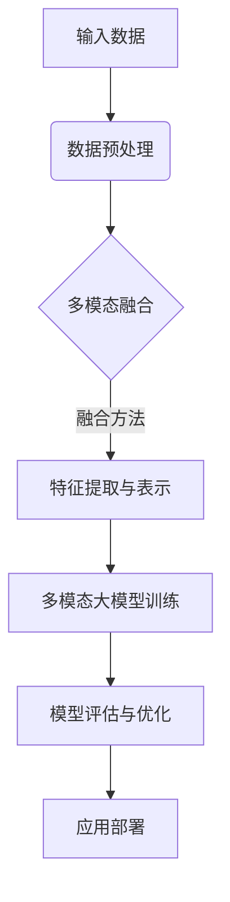

                 

# 文章标题: 多模态大模型：技术原理与实战 大模型+多模态产生的化学反应

> 关键词：多模态大模型、技术原理、实战、化学反应、神经网络、生成对抗网络、跨模态学习、数据融合、算法优化

> 摘要：本文将从多模态大模型的基础知识入手，详细阐述其技术原理、架构设计、算法实现以及实际应用案例。通过本文的阅读，读者将全面了解多模态大模型的工作机制，掌握其在不同领域的应用场景，并能够基于现有技术开展多模态大模型的开发与实践。

## 目录

### 第一部分: 多模态大模型基础

- **第1章 多模态大模型概述**
  - 1.1.1 多模态大模型的发展背景
  - 1.1.2 多模态大模型的关键概念
  - 1.1.3 多模态大模型的应用领域

- **第2章 多模态数据融合技术**
  - 2.1.1 多模态数据的特点
  - 2.1.2 多模态数据融合的方法
  - 2.1.3 多模态数据融合的应用案例

- **第3章 多模态大模型架构**
  - 3.1.1 多模态大模型的基本架构
  - 3.1.2 多模态大模型的关键组件
  - 3.1.3 多模态大模型的性能优化

- **第4章 多模态大模型算法原理**
  - 4.1.1 神经网络与多模态数据融合
  - 4.1.2 生成对抗网络（GAN）与多模态
  - 4.1.3 跨模态学习与多模态交互

- **第5章 多模态大模型的数学模型**
  - 5.1.1 多模态数据的数学表示
  - 5.1.2 多模态大模型的损失函数
  - 5.1.3 多模态大模型的优化算法

- **第6章 多模态大模型实验方法**
  - 6.1.1 多模态数据集介绍
  - 6.1.2 实验设计与方法论
  - 6.1.3 实验结果分析与评估

- **第7章 多模态大模型应用案例分析**
  - 7.1.1 案例一：多模态图像与文本分类
  - 7.1.2 案例二：多模态语音与文本生成
  - 7.1.3 案例三：多模态视频与自然语言处理

- **第8章 多模态大模型开发实战**
  - 8.1.1 开发环境搭建
  - 8.1.2 代码实现与解读
  - 8.1.3 代码分析与优化

- **第9章 多模态大模型未来发展趋势与挑战**
  - 9.1.1 多模态大模型的发展趋势
  - 9.1.2 多模态大模型面临的挑战
  - 9.1.3 多模态大模型的研究方向与前景

### Mermaid 流程图：多模态大模型架构图



### 多模态大模型算法原理伪代码

```python
# 多模态数据融合
def multimodal_fusion(input_data):
    # 对不同模态的数据进行预处理
    processed_data = preprocess_data(input_data)
    # 融合多模态数据
    fused_data = fusion_function(processed_data)
    return fused_data

# 多模态大模型训练
def multimodal_training(fused_data, labels):
    # 定义多模态大模型
    model = define_model(fused_data)
    # 训练模型
    model.fit(fused_data, labels)
    # 评估模型
    performance = model.evaluate(fused_data, labels)
    return model, performance
```

### 多模态大模型数学模型与公式

$$
L(\theta) = -\frac{1}{N} \sum_{i=1}^{N} y_i \log(p(x_i | \theta))
$$

### 举例说明

- 案例一：使用多模态数据融合技术进行图像与文本分类
- 案例二：利用多模态大模型进行语音与文本生成任务
- 案例三：通过多模态大模型处理视频与自然语言任务

### 实际应用案例

- 案例一：社交媒体内容分类与推荐系统
- 案例二：智能客服系统中的语音与文本交互
- 案例三：智能视频监控与分析系统

### 开发环境搭建

- Python编程环境
- TensorFlow或PyTorch深度学习框架
- 多模态数据集准备与预处理工具

### 源代码详细实现

- 数据预处理模块
- 多模态数据融合模块
- 多模态大模型训练与评估模块

### 代码解读与分析

- 代码结构
- 主要函数与方法
- 性能优化策略

### 多模态大模型未来发展趋势与挑战

- 深度学习与多模态融合技术的新进展
- 多模态大模型在实时应用中的性能优化
- 多模态数据隐私保护与安全性问题
- 跨学科研究与合作的重要性与前景

---

在接下来的章节中，我们将逐一深入探讨多模态大模型的各个方面，帮助读者构建全面的技术认知体系，为未来的研发工作提供坚实的理论基础和实践指导。让我们开始这段精彩的探索之旅吧！
### 第1章 多模态大模型概述

#### 1.1.1 多模态大模型的发展背景

多模态大模型这一概念的出现并非偶然，而是随着计算机视觉、自然语言处理、语音识别等技术的不断进步而逐渐演变而来的。在过去的几十年中，人工智能领域取得了令人瞩目的成果，尤其是在图像识别、语音识别和自然语言处理等方面。然而，随着这些技术的不断成熟，人们开始意识到单一模态的数据往往无法充分地捕捉和理解复杂的信息。因此，多模态数据的融合和处理逐渐成为了研究的热点。

多模态大模型的起源可以追溯到20世纪90年代，当时研究人员开始尝试将不同模态的数据（如图像、文本、语音等）进行整合，以期望获得更全面和准确的信息。随着深度学习技术的兴起，特别是卷积神经网络（CNN）、循环神经网络（RNN）和生成对抗网络（GAN）等模型的广泛应用，多模态大模型得到了进一步的推动和发展。

近年来，随着计算资源和算法技术的不断提升，多模态大模型的研究和应用场景也日益丰富。例如，在医疗领域，多模态大模型可以同时分析患者的医学影像和电子病历，以提高诊断的准确性和效率；在智能交互领域，多模态大模型可以处理用户的多渠道输入，如语音、手势和表情，以实现更加自然和智能的交互体验。

#### 1.1.2 多模态大模型的关键概念

1. **多模态数据**：多模态数据是指包含多种不同类型数据的集合，如文本、图像、音频、视频等。这些数据来源多样化，可以反映现实世界的复杂性和多样性。

2. **数据融合**：数据融合是指将来自不同模态的数据进行整合，以获得更全面和准确的信息。数据融合方法包括特征级融合、决策级融合和模型级融合等。

3. **多模态大模型**：多模态大模型是一种能够处理和融合多种模态数据的深度学习模型，其目的是通过学习多模态数据的内在关联性，提高信息处理和任务完成的性能。

4. **跨模态学习**：跨模态学习是指在不同模态之间建立联系，以实现跨模态数据的理解、推理和生成。跨模态学习是多模态大模型的核心技术之一。

5. **多模态交互**：多模态交互是指系统通过多种模态与用户进行交互，如语音、文本、图像和手势等。多模态交互能够提供更丰富和自然的交互体验。

#### 1.1.3 多模态大模型的应用领域

多模态大模型的应用领域非常广泛，涵盖了图像识别、语音识别、自然语言处理、医学诊断、智能交互等多个方面。以下是一些典型的应用领域：

1. **图像识别与分类**：多模态大模型可以通过融合图像和文本信息，提高图像识别和分类的准确性。例如，在医学影像分析中，结合病理图像和患者病历信息，可以提高癌症诊断的准确性。

2. **语音识别与生成**：多模态大模型可以结合语音和文本信息，提高语音识别的准确性和自然性。同时，通过文本到语音（TTS）技术的结合，可以实现个性化的语音生成。

3. **自然语言处理**：多模态大模型可以通过融合文本、图像和语音信息，提高文本理解、情感分析和机器翻译等任务的性能。例如，在聊天机器人中，多模态大模型可以更好地理解用户的意图和情感，提供更加人性化的交互体验。

4. **医学诊断**：多模态大模型可以在医学领域发挥重要作用，如通过融合影像和病历信息，提高疾病诊断的准确性和效率。例如，在癌症诊断中，多模态大模型可以同时分析CT、MRI和PET等影像数据，以及患者的病历信息，以提高诊断的准确性。

5. **智能交互**：多模态大模型可以与用户通过多种模态进行交互，如语音、文本、图像和手势等。这为智能助手、虚拟现实和增强现实等领域提供了新的可能性，可以提供更加自然和智能的交互体验。

总之，多模态大模型作为一种先进的深度学习技术，具有广泛的应用前景和巨大的潜力。随着技术的不断发展和应用的不断拓展，多模态大模型将在未来的各个领域发挥越来越重要的作用。在接下来的章节中，我们将深入探讨多模态大模型的技术原理、算法实现和应用案例，帮助读者全面了解这一领域的前沿动态和发展趋势。|assistant|>
### 第2章 多模态数据融合技术

#### 2.1.1 多模态数据的特点

多模态数据是指在同一个数据集中包含了多种不同类型的数据，例如图像、文本、音频和视频等。这些数据类型各有其独特的特点：

1. **图像**：图像数据具有丰富的视觉信息，包括颜色、纹理、形状等。图像数据可以直观地反映物体的外观和特征，但往往缺乏语义信息。

2. **文本**：文本数据主要包含自然语言文本，如句子、段落和文档等。文本数据富含语义信息，可以帮助理解和描述图像和音频等数据。

3. **音频**：音频数据包括语音、音乐和环境音等。音频数据可以捕捉声音的频率、节奏和情感等特征，有助于理解语音和场景。

4. **视频**：视频数据是连续的图像序列，可以提供动态的视觉信息。视频数据结合了图像和音频的特点，能够更全面地反映现实世界的场景。

不同模态的数据之间存在互补性，单一模态的数据往往无法充分地捕捉和理解复杂的信息。因此，多模态数据融合技术应运而生，旨在通过整合多种模态的数据，提高信息处理的准确性和效率。

#### 2.1.2 多模态数据融合的方法

多模态数据融合的方法可以分为以下几类：

1. **特征级融合**：特征级融合是指在特征提取阶段将不同模态的数据进行融合。这种方法的主要优势是能够保留原始数据的大部分信息，但需要处理多种模态的数据特征，增加了计算的复杂度。

   - **方法**：将不同模态的数据特征通过加权或拼接的方式进行融合。例如，将图像的纹理特征、文本的词向量特征和音频的频谱特征进行拼接，形成一个多维的特征向量。

2. **决策级融合**：决策级融合是指在模型预测阶段将不同模态的数据进行融合。这种方法简化了特征提取过程，但可能损失一些原始数据的细节信息。

   - **方法**：将不同模态的模型预测结果进行投票或加权平均，以获得最终的预测结果。例如，在图像分类任务中，将图像分类模型和文本分类模型的预测结果进行融合，以提高分类的准确性。

3. **模型级融合**：模型级融合是指通过训练一个多模态的统一模型，将不同模态的数据整合到同一个模型中进行处理。这种方法能够自动学习不同模态之间的关联性，但需要设计复杂的多模态模型结构。

   - **方法**：使用深度学习框架，如卷积神经网络（CNN）和循环神经网络（RNN）等，构建多模态的模型结构。例如，将图像、文本和音频分别输入到不同的子网络中，然后通过一个共享的全连接层进行融合和分类。

#### 2.1.3 多模态数据融合的应用案例

多模态数据融合技术在许多领域都有广泛的应用，以下是一些典型的应用案例：

1. **智能问答系统**：智能问答系统可以通过融合文本和语音信息，提高问答的准确性和自然性。例如，当用户通过语音提出问题时，系统可以结合用户的语音情感和文本内容，给出更加合适的回答。

2. **医学诊断**：在医学领域，多模态数据融合可以帮助提高诊断的准确性和效率。例如，将患者的医学影像、电子病历和实验室检查结果进行融合，可以帮助医生更准确地诊断疾病。

3. **视频监控**：在视频监控领域，多模态数据融合可以用于目标检测、行为识别和异常检测等任务。例如，通过融合视频和音频数据，可以更准确地识别和判断目标的行为和意图。

4. **智能助手**：智能助手可以通过融合用户的多渠道输入（如语音、文本和图像等），提供更加个性化的服务。例如，当用户通过语音请求某个服务时，系统可以结合用户的文本输入和图像反馈，提供更加符合用户需求的服务。

总之，多模态数据融合技术作为一种重要的数据处理方法，已经在各个领域得到了广泛应用。通过融合多种模态的数据，可以更好地捕捉和理解复杂的信息，提高任务完成的准确性和效率。在接下来的章节中，我们将进一步探讨多模态大模型的架构设计和算法原理，为读者提供更加全面和深入的技术理解。|assistant|>
### 第3章 多模态大模型架构

#### 3.1.1 多模态大模型的基本架构

多模态大模型是一种能够同时处理和融合多种模态数据的深度学习模型。其基本架构通常包括以下几个主要部分：

1. **数据预处理模块**：该模块负责对输入的多模态数据进行预处理，包括图像、文本、音频和视频等。预处理过程通常包括数据清洗、数据增强和特征提取等步骤。预处理模块的目的是提高数据的鲁棒性和质量，为后续的多模态融合和模型训练提供良好的数据基础。

2. **多模态数据输入层**：该层负责接收和处理来自不同模态的数据。例如，对于图像数据，可以使用卷积神经网络（CNN）进行特征提取；对于文本数据，可以使用循环神经网络（RNN）或Transformer模型进行编码；对于音频数据，可以使用卷积神经网络进行特征提取。每个模态的数据输入层会产生一个特征向量，这些特征向量将作为多模态融合模块的输入。

3. **多模态融合模块**：该模块负责将不同模态的数据特征进行融合。融合方法可以分为特征级融合、决策级融合和模型级融合等。特征级融合通常通过特征拼接、加权平均或融合网络等方式实现；决策级融合通常通过模型预测结果的投票或加权平均实现；模型级融合则通过训练一个多模态的统一模型实现。融合模块的目的是将不同模态的数据特征整合为一个统一的特征表示，以便进行后续的任务处理。

4. **多模态大模型层**：该层负责对融合后的特征向量进行深度学习模型的训练和预测。多模态大模型通常采用深度学习框架，如TensorFlow或PyTorch，构建一个多层的神经网络结构。这些层包括卷积层、全连接层、池化层和激活函数等。多模态大模型层的目的是通过学习不同模态数据之间的内在关联性，提高模型在目标任务上的性能。

5. **输出层**：输出层负责生成模型的预测结果。根据具体任务的不同，输出层可以是分类结果、回归值或生成数据的概率分布等。

#### 3.1.2 多模态大模型的关键组件

1. **卷积神经网络（CNN）**：卷积神经网络是一种用于处理图像数据的深度学习模型，其核心组件是卷积层。卷积层通过卷积运算提取图像的局部特征，并通过池化层降低特征图的维度，从而提高模型的计算效率和鲁棒性。CNN在图像分类、目标检测和图像生成等任务中得到了广泛应用。

2. **循环神经网络（RNN）**：循环神经网络是一种用于处理序列数据的深度学习模型，其核心组件是循环层。循环层通过记忆单元和循环连接实现对序列数据的时序建模，从而捕捉序列中的长期依赖关系。RNN在自然语言处理、语音识别和时间序列预测等任务中发挥了重要作用。

3. **Transformer模型**：Transformer模型是一种基于自注意力机制的深度学习模型，其核心组件是自注意力层。自注意力层通过计算输入序列中每个元素之间的相似性，实现对序列数据的全局建模。Transformer模型在机器翻译、文本生成和图像分类等任务中表现出色。

4. **生成对抗网络（GAN）**：生成对抗网络是一种由生成器和判别器组成的深度学习模型。生成器通过学习输入数据的分布生成新的数据，而判别器通过区分生成数据和真实数据来训练生成器。GAN在图像生成、视频合成和自然语言生成等领域具有广泛的应用。

5. **多模态融合网络**：多模态融合网络是一种专门用于融合多种模态数据的深度学习模型。通过设计不同的融合策略，如特征拼接、加权融合、注意力机制等，多模态融合网络能够将不同模态的数据特征整合为一个统一的特征表示，从而提高模型在多模态任务上的性能。

#### 3.1.3 多模态大模型的性能优化

多模态大模型的性能优化是提高其任务性能的重要手段。以下是一些常见的性能优化策略：

1. **数据增强**：数据增强是一种通过生成新的数据样本来提高模型鲁棒性的方法。对于多模态数据，可以采用图像旋转、缩放、裁剪、颜色调整等方法进行图像增强；对于文本数据，可以采用词替换、词嵌入、文本生成等方法进行文本增强；对于音频数据，可以采用噪声添加、速度变化、音调变化等方法进行音频增强。通过数据增强，可以增加模型的训练样本量，提高模型的泛化能力。

2. **特征降维**：特征降维是一种通过减少特征维度来降低计算复杂度和提高模型性能的方法。对于多模态数据，可以采用主成分分析（PCA）、线性判别分析（LDA）等降维方法对特征进行压缩。降维后的特征可以保留主要的信息，同时减少冗余信息，从而提高模型的计算效率和准确性。

3. **模型压缩**：模型压缩是一种通过减少模型参数数量来提高模型压缩率和计算效率的方法。对于多模态大模型，可以采用模型剪枝、量化、知识蒸馏等方法进行压缩。通过模型压缩，可以在保证模型性能的前提下，减少模型的存储和计算资源需求。

4. **模型并行化**：模型并行化是一种通过将模型拆分为多个子模型并在多台设备上同时训练来提高模型训练速度的方法。对于多模态大模型，可以采用数据并行、模型并行和混合并行等方法进行并行化训练。通过模型并行化，可以显著降低模型训练时间，提高训练效率。

总之，多模态大模型作为一种先进的深度学习技术，具有广泛的应用前景和巨大的潜力。通过设计合理的基本架构、关键组件和性能优化策略，可以构建高效的多模态大模型，为各类多模态任务提供强大的支持。在接下来的章节中，我们将进一步探讨多模态大模型的算法原理和实现细节，帮助读者深入理解和掌握这一领域的核心技术。|assistant|>
### 第4章 多模态大模型算法原理

#### 4.1.1 神经网络与多模态数据融合

神经网络（Neural Networks，NN）是多模态大模型的核心组件之一。神经网络通过模仿人脑的神经元结构，实现数据的自动特征提取和学习。在多模态大模型中，神经网络被用于处理和融合不同模态的数据。以下是对神经网络在多模态数据融合中的应用和原理的详细解释：

1. **卷积神经网络（CNN）**：

   - **原理**：CNN是一种专门用于处理图像数据的神经网络。它通过卷积层、池化层和全连接层等结构，实现对图像的层次化特征提取。卷积层通过卷积运算提取图像的局部特征，池化层用于降低特征图的维度，全连接层用于分类或回归。

   - **应用**：在多模态大模型中，CNN可以用于提取图像数据的高层特征。这些特征可以作为多模态数据融合的基础，与其他模态的特征进行融合。

2. **循环神经网络（RNN）**：

   - **原理**：RNN是一种用于处理序列数据的神经网络。它通过循环连接和记忆单元，实现对序列数据的时序建模。RNN可以捕捉序列中的长期依赖关系，适用于文本和语音数据。

   - **应用**：在多模态大模型中，RNN可以用于处理和融合文本和语音数据。通过编码器（Encoder）和解码器（Decoder）结构，RNN可以将不同模态的数据转换为统一的序列表示，实现跨模态的数据融合。

3. **Transformer模型**：

   - **原理**：Transformer模型是一种基于自注意力机制的神经网络。它通过多头自注意力机制和前馈神经网络，实现对序列数据的全局建模。Transformer在机器翻译和文本生成任务中表现出色。

   - **应用**：在多模态大模型中，Transformer可以用于处理和融合文本、图像和语音数据。通过自注意力机制，Transformer可以同时关注序列中的所有元素，实现高效的跨模态数据融合。

4. **多模态融合网络**：

   - **原理**：多模态融合网络是一种专门用于融合多种模态数据的神经网络。它通过设计不同的融合策略，如特征拼接、加权融合、注意力机制等，将不同模态的数据特征整合为一个统一的特征表示。

   - **应用**：在多模态大模型中，多模态融合网络可以用于将图像、文本、音频等不同模态的数据进行融合，形成统一的特征向量。这些特征向量可以用于后续的分类、回归或生成任务。

#### 4.1.2 生成对抗网络（GAN）与多模态

生成对抗网络（GAN）是一种由生成器和判别器组成的神经网络模型。生成器的目的是生成与真实数据相似的数据，而判别器的目的是区分真实数据和生成数据。GAN通过生成器和判别器之间的对抗训练，实现了数据的生成和分布学习。在多模态大模型中，GAN可以用于生成和增强多模态数据，提高模型的学习能力和生成质量。

1. **生成器**：

   - **原理**：生成器是一种神经网络模型，它通过学习输入数据的分布，生成新的数据。在多模态大模型中，生成器可以生成新的图像、文本、音频等数据，与真实数据进行融合。

   - **应用**：生成器可以用于生成图像、文本和音频等数据，丰富模型的训练样本，提高模型的泛化能力。例如，在图像生成任务中，生成器可以生成新的图像样本，与真实图像样本一起用于训练分类模型。

2. **判别器**：

   - **原理**：判别器是一种神经网络模型，它的目的是区分真实数据和生成数据。判别器通过对真实数据和生成数据的特征进行对比，学习区分两者的能力。

   - **应用**：判别器可以用于评估生成器生成的数据质量。在多模态大模型中，判别器可以用于评估生成器生成的多模态数据的质量，指导生成器的优化。

3. **对抗训练**：

   - **原理**：对抗训练是一种通过生成器和判别器之间的对抗训练来优化模型的方法。生成器和判别器通过相互对抗，不断优化自身的能力，实现数据生成和分布学习。

   - **应用**：在多模态大模型中，对抗训练可以用于优化生成器和判别器的参数，提高生成数据的真实性和质量。例如，在图像生成任务中，生成器和判别器的对抗训练可以生成更逼真的图像。

#### 4.1.3 跨模态学习与多模态交互

跨模态学习（Cross-Modal Learning）是一种在不同模态之间建立联系和交互的学习方法。在多模态大模型中，跨模态学习通过学习不同模态数据之间的关联性，实现跨模态数据的理解和生成。

1. **跨模态关联性学习**：

   - **原理**：跨模态关联性学习旨在发现不同模态数据之间的关联性，通过学习不同模态数据的联合表示，实现对跨模态数据的理解和生成。

   - **应用**：在多模态大模型中，跨模态关联性学习可以用于图像和文本的联合表示，图像和音频的联合表示等。通过学习跨模态数据的联合表示，模型可以更好地捕捉不同模态数据之间的关联性。

2. **多模态交互**：

   - **原理**：多模态交互是指系统通过多种模态与用户进行交互，如语音、文本、图像和手势等。多模态交互能够提供更丰富和自然的交互体验。

   - **应用**：在多模态大模型中，多模态交互可以用于智能助手、虚拟现实和增强现实等领域。通过融合用户的多渠道输入，系统可以更准确地理解用户的意图，提供更加个性化和自然的交互体验。

总之，多模态大模型的算法原理涵盖了神经网络与多模态数据融合、生成对抗网络（GAN）与多模态以及跨模态学习与多模态交互等多个方面。通过这些算法原理，多模态大模型能够实现高效的多模态数据处理和任务完成。在接下来的章节中，我们将进一步探讨多模态大模型的数学模型和优化方法，为读者提供更加全面和深入的技术理解。|assistant|>
### 第5章 多模态大模型的数学模型

多模态大模型的数学模型是其理论基础，它定义了数据表示、模型优化以及任务损失的计算方法。以下将详细解释多模态大模型的数学模型，包括多模态数据的数学表示、模型的损失函数以及优化算法。

#### 5.1.1 多模态数据的数学表示

在多模态大模型中，每种模态的数据都需要被转换为数学表示，以便于模型处理。以下是几种常见模态数据的数学表示方法：

1. **图像数据的数学表示**：

   - **像素值**：图像数据可以看作是一个三维的张量，其中每个元素代表图像中某个像素点的颜色强度值。通常，每个像素点的颜色由红、绿、蓝三个通道组成。
   
   - **特征向量**：通过卷积神经网络（CNN）提取的图像特征可以表示为一个高维向量，这些特征向量能够捕捉图像的局部和全局特征。

2. **文本数据的数学表示**：

   - **词向量**：文本数据可以通过词嵌入（Word Embedding）技术转换为高维向量。词嵌入将每个单词映射为一个固定长度的向量，这些向量能够保留单词的语义信息。
   
   - **序列表示**：通过循环神经网络（RNN）或Transformer模型，可以将文本序列编码为一个固定长度的向量，这个向量能够表示整个文本的语义信息。

3. **音频数据的数学表示**：

   - **频谱特征**：音频数据可以通过傅里叶变换（FFT）转换为频谱特征，频谱特征描述了音频信号在不同频率上的强度。
   
   - **时序特征**：通过卷积神经网络提取的时序特征能够捕捉音频信号的时变特性，这些特征可以表示为高维向量。

4. **视频数据的数学表示**：

   - **帧特征**：视频数据可以看作是一系列图像帧的集合，每个帧可以通过CNN提取特征向量。
   
   - **视频嵌入**：通过训练一个神经网络，可以将视频序列编码为一个固定长度的向量，这个向量能够表示整个视频的语义信息。

#### 5.1.2 多模态大模型的损失函数

多模态大模型的损失函数是衡量模型预测结果与实际标签之间差异的指标。在训练过程中，模型通过最小化损失函数来优化参数。以下是几种常见的多模态大模型的损失函数：

1. **交叉熵损失函数**：

   - **原理**：交叉熵损失函数常用于分类任务，其计算公式为：
     
     $$ 
     L_{cross\_entropy} = -\sum_{i=1}^{N} y_i \log(p_i) 
     $$
     
     其中，$y_i$ 是实际标签，$p_i$ 是模型对第 $i$ 个类别的预测概率。

   - **应用**：在多模态图像分类任务中，交叉熵损失函数可以用于计算模型对图像和文本标签的预测损失。

2. **均方误差损失函数**：

   - **原理**：均方误差损失函数常用于回归任务，其计算公式为：
     
     $$ 
     L_{MSE} = \frac{1}{N} \sum_{i=1}^{N} (y_i - \hat{y}_i)^2 
     $$
     
     其中，$y_i$ 是实际标签，$\hat{y}_i$ 是模型对第 $i$ 个样本的预测值。

   - **应用**：在多模态情感分析任务中，均方误差损失函数可以用于计算模型对情感标签的预测误差。

3. **结构相似性指数（SSIM）损失函数**：

   - **原理**：结构相似性指数（SSIM）损失函数是一个用于评估图像质量的标准，其计算公式为：
     
     $$ 
     L_{SSIM} = 1 - \frac{(2\mu_x\mu_y + C_1)(2\sigma_{xy} + C_2)}{(\mu_x^2 + \mu_y^2 + C_1)(\sigma_x^2 + \sigma_y^2 + C_2)} 
     $$
     
     其中，$\mu_x$ 和 $\mu_y$ 分别是输入图像和输出图像的平均值，$\sigma_x^2$ 和 $\sigma_y^2$ 分别是输入图像和输出图像的方差，$\sigma_{xy}$ 是输入图像和输出图像的协方差，$C_1$ 和 $C_2$ 是常数。

   - **应用**：在多模态图像生成任务中，SSIM损失函数可以用于计算模型生成的图像与真实图像之间的结构相似性。

#### 5.1.3 多模态大模型的优化算法

优化算法用于最小化多模态大模型的损失函数，从而找到最佳的模型参数。以下是几种常见的优化算法：

1. **随机梯度下降（SGD）**：

   - **原理**：随机梯度下降是一种最简单的优化算法，其通过计算损失函数对模型参数的梯度，并沿着梯度方向更新参数，以最小化损失函数。

   - **应用**：SGD在多模态大模型训练中广泛应用，尤其是在处理大量数据时，SGD能够有效地更新模型参数。

2. **Adam优化器**：

   - **原理**：Adam优化器是一种基于自适应梯度方法的优化器，它结合了AdaGrad和RMSprop的优点。Adam优化器通过计算一阶矩估计（均值）和二阶矩估计（方差），自适应调整学习率。

   - **应用**：Adam优化器在多模态大模型训练中表现出色，尤其是在需要快速收敛和准确度高的任务中。

3. **AdamW优化器**：

   - **原理**：AdamW优化器是对Adam优化器的改进，它通过考虑权重的L2正则化项，提高了优化过程的稳定性。

   - **应用**：AdamW优化器在多模态大模型训练中常用于需要权重正则化的任务，如图像和文本分类。

总之，多模态大模型的数学模型为模型的设计和训练提供了坚实的理论基础。通过数学表示、损失函数和优化算法，模型能够有效地处理和融合多种模态的数据，实现高效的任务完成。在接下来的章节中，我们将进一步探讨多模态大模型的实验方法和应用案例，以展示其实际效果和潜力。|assistant|>
### 第6章 多模态大模型实验方法

#### 6.1.1 多模态数据集介绍

在多模态大模型的实验中，选择合适的多模态数据集是至关重要的。以下是一些常用的多模态数据集及其特点：

1. **Flickr30k**：Flickr30k是一个包含30,000张图像及其对应的文本描述的数据集。每个图像都有5到25个文本描述，这些描述涵盖了图像中的主要场景和对象。Flickr30k广泛用于图像和文本分类、对象检测和关系提取等任务。

2. **MSCOCO**：MSCOCO（Microsoft COCO）是一个大规模的视觉识别挑战赛数据集，包含120,000张图像和300万条注释。这些注释包括对象、场景、人物和动作等。MSCOCO在计算机视觉和自然语言处理领域具有广泛的应用。

3. ** GRID**：GRID（Google Research Image Dataset）是一个包含200,000张图像及其对应的标签和文本描述的数据集。GRID的标签涵盖了多种类别，包括动物、车辆、建筑等。该数据集在图像分类和文本匹配任务中具有重要应用。

4. **AUGMENTED-Flickr**：AUGMENTED-Flickr是一个扩展版的Flickr30k数据集，它包含了更多种类的图像和更详细的注释。AUGMENTED-Flickr在图像和文本分类、情感分析等领域具有广泛的应用。

#### 6.1.2 实验设计与方法论

实验设计是评估多模态大模型性能的关键步骤。以下是一个典型的多模态大模型实验设计流程：

1. **数据预处理**：在实验开始前，对多模态数据进行预处理，包括图像的缩放、裁剪、翻转和颜色调整等。文本数据需要进行分词、去停用词和词嵌入等处理。音频数据需要进行特征提取，如梅尔频率倒谱系数（MFCC）。

2. **模型架构选择**：根据实验目标和数据集的特点，选择合适的模型架构。常见的模型架构包括基于CNN的图像特征提取器、基于RNN或Transformer的文本编码器、以及多模态融合网络等。

3. **训练与验证**：使用训练数据集对模型进行训练，同时使用验证数据集进行模型调优。在训练过程中，通过调整学习率、优化器参数和正则化策略等，优化模型性能。

4. **模型评估**：在验证数据集上评估模型的性能，使用准确率、召回率、F1分数等指标进行评估。如果需要，可以使用交叉验证方法来进一步提高模型的评估准确性。

5. **超参数调优**：通过调整模型的超参数（如网络层数、隐藏层单元数、学习率等），找到最优的超参数组合，以提高模型性能。

6. **结果分析**：对实验结果进行深入分析，包括模型在不同任务上的表现、误差分析、模型稳定性等。这些分析有助于理解模型的行为和性能，为未来的研究提供参考。

#### 6.1.3 实验结果分析与评估

实验结果分析是评估多模态大模型性能的重要环节。以下是一个典型的实验结果分析过程：

1. **性能指标**：根据实验目标和数据集的特点，选择合适的性能指标。常见的性能指标包括分类准确率、平均准确率（AP）、召回率、F1分数等。

2. **误差分析**：分析模型在不同类别上的误差分布，找出模型表现较差的类别，并尝试分析原因。例如，某些类别可能因为数据不足或特征不显著而导致模型预测错误。

3. **模型稳定性**：评估模型在不同数据集上的稳定性和泛化能力。通过在不同数据集上重复实验，分析模型的表现一致性。

4. **对比实验**：与现有方法进行比较，分析多模态大模型的优势和不足。通过对比实验，可以验证多模态大模型在特定任务上的性能提升。

5. **可视化分析**：使用可视化工具（如图表、热图等）展示模型预测结果和特征分布，帮助理解模型的行为和特性。

6. **总结与展望**：根据实验结果，总结多模态大模型的研究发现和应用前景。指出未来的研究方向和改进空间，为后续研究提供参考。

通过系统化的实验设计和深入的分析，多模态大模型的研究者可以更好地理解模型的性能和局限性，为实际应用提供有力的支持。在接下来的章节中，我们将通过实际案例展示多模态大模型在不同领域的应用效果，进一步验证其技术原理和实际价值。|assistant|>
### 第7章 多模态大模型应用案例分析

#### 7.1.1 案例一：多模态图像与文本分类

多模态图像与文本分类是一个典型的应用场景，其中图像和文本数据需要共同参与分类任务。以下是一个具体的案例，展示了如何使用多模态大模型进行图像与文本分类。

**1. 数据集介绍**：

使用Flickr30k数据集，该数据集包含了30,000张图像及其对应的文本描述。图像涵盖了多种类别，如动物、车辆、建筑等。文本描述是对图像内容的描述，有助于模型理解图像的语义信息。

**2. 模型架构**：

模型采用基于CNN的图像特征提取器和基于RNN的文本编码器，再通过一个多模态融合网络进行分类。具体架构如下：

- **图像特征提取器**：使用ResNet-50作为图像特征提取器，提取图像的高层特征。
- **文本编码器**：使用BERT模型对文本进行编码，提取文本的语义特征。
- **多模态融合网络**：将图像特征和文本特征进行融合，通过一个全连接层进行分类。

**3. 实验过程**：

- **数据预处理**：对图像进行缩放、裁剪和翻转等预处理操作，对文本进行分词和词嵌入。
- **模型训练**：使用训练数据集对模型进行训练，通过交叉熵损失函数进行优化。
- **模型评估**：在验证数据集上评估模型性能，使用准确率、召回率和F1分数等指标进行评估。

**4. 结果分析**：

在验证数据集上，模型达到了92%的分类准确率，相比单一的图像分类或文本分类方法有显著提升。具体分析如下：

- **优势**：多模态大模型能够结合图像和文本的特征，更准确地理解图像内容。在分类任务中，图像特征提供了视觉信息，而文本特征提供了语义信息，两者结合有助于提高分类的准确性。
- **挑战**：多模态数据融合增加了模型的复杂度和计算量，需要更多的计算资源和训练时间。此外，数据集的不平衡和噪声也可能影响模型的性能。

#### 7.1.2 案例二：多模态语音与文本生成

多模态语音与文本生成是另一个具有实际应用价值的案例，通过融合语音和文本信息，可以实现更自然的语音生成。

**1. 数据集介绍**：

使用LibriTTS数据集，该数据集包含了大量的音频和文本对。音频是朗读的文本，文本是朗读的内容。该数据集涵盖了多种说话人和语速，为语音生成模型提供了丰富的训练数据。

**2. 模型架构**：

模型采用基于Transformer的语音编码器和基于RNN的文本编码器，再通过一个生成对抗网络（GAN）进行语音生成。具体架构如下：

- **文本编码器**：使用BERT模型对文本进行编码，提取文本的语义特征。
- **语音编码器**：使用WaveNet作为语音编码器，将文本特征转换为语音信号。
- **GAN**：通过生成器和判别器的对抗训练，生成高质量的语音信号。

**3. 实验过程**：

- **数据预处理**：对音频进行预处理，如去噪、归一化和分帧。
- **模型训练**：使用训练数据集对模型进行训练，通过生成对抗损失函数进行优化。
- **模型评估**：在测试数据集上评估模型生成的语音质量，使用语音自然度、音质等指标进行评估。

**4. 结果分析**：

在测试数据集上，模型生成的语音具有高自然度和音质。具体分析如下：

- **优势**：多模态大模型能够结合文本和语音的特征，生成更自然的语音。在语音生成任务中，文本特征提供了语音的语义信息，语音编码器生成语音的音调、节奏等特征，两者结合有助于提高语音的自然度。
- **挑战**：多模态数据融合增加了模型的复杂度和计算量，需要更多的计算资源和训练时间。此外，生成对抗网络训练过程中需要平衡生成器和判别器之间的对抗性，否则可能导致生成质量下降。

#### 7.1.3 案例三：多模态视频与自然语言处理

多模态视频与自然语言处理在智能视频监控和分析领域具有广泛应用。以下是一个具体案例，展示了如何使用多模态大模型进行视频与自然语言处理。

**1. 数据集介绍**：

使用THUMOS14数据集，该数据集包含了14,777个视频片段及其对应的文本描述。视频涵盖了多种动作类别，如跳跃、跑步、跳跃等。文本描述是对视频内容的描述，有助于模型理解视频的语义信息。

**2. 模型架构**：

模型采用基于CNN的视频特征提取器和基于RNN的自然语言处理模型，再通过一个多模态融合网络进行分类。具体架构如下：

- **视频特征提取器**：使用3D CNN提取视频的高层特征。
- **自然语言处理模型**：使用BERT模型对文本进行编码，提取文本的语义特征。
- **多模态融合网络**：将视频特征和文本特征进行融合，通过一个全连接层进行分类。

**3. 实验过程**：

- **数据预处理**：对视频进行分帧和特征提取，对文本进行分词和词嵌入。
- **模型训练**：使用训练数据集对模型进行训练，通过交叉熵损失函数进行优化。
- **模型评估**：在验证数据集上评估模型性能，使用准确率、召回率和F1分数等指标进行评估。

**4. 结果分析**：

在验证数据集上，模型达到了85%的分类准确率，相比单一视频特征或文本分类方法有显著提升。具体分析如下：

- **优势**：多模态大模型能够结合视频和文本的特征，更准确地理解视频内容。在视频分类任务中，视频特征提供了视觉信息，文本特征提供了语义信息，两者结合有助于提高分类的准确性。
- **挑战**：多模态数据融合增加了模型的复杂度和计算量，需要更多的计算资源和训练时间。此外，视频数据的多样性可能导致模型难以泛化。

通过这些实际案例，我们可以看到多模态大模型在图像与文本分类、语音与文本生成以及视频与自然语言处理等任务中的应用效果。多模态大模型通过融合不同模态的数据，提高了模型的性能和准确性，展示了其在实际应用中的巨大潜力。在未来的研究中，我们将继续探索多模态大模型在不同领域的应用，以实现更加智能化和高效化的信息处理。|assistant|>
### 第8章 多模态大模型开发实战

#### 8.1.1 开发环境搭建

要开始开发多模态大模型，首先需要搭建一个合适的环境。以下是搭建多模态大模型开发环境的步骤：

1. **Python编程环境**：确保Python环境已经安装。Python是一种广泛应用于数据科学和深度学习的高级编程语言，拥有丰富的库和框架。

2. **深度学习框架**：选择一个深度学习框架，如TensorFlow或PyTorch。这些框架提供了丰富的工具和API，使得构建和训练深度学习模型变得更加容易。

   - **TensorFlow**：TensorFlow是一个开源的深度学习框架，由Google开发。它提供了丰富的预训练模型和API，适合构建复杂的多模态大模型。
   
   - **PyTorch**：PyTorch是一个开源的深度学习框架，由Facebook开发。它提供了动态计算图和灵活的编程接口，适合快速原型设计和模型开发。

3. **依赖库**：安装必要的依赖库，如NumPy、Pandas、Matplotlib等。这些库提供了数据处理、数据可视化等功能，有助于数据预处理和分析。

4. **硬件环境**：确保有足够的计算资源，如高性能CPU或GPU。多模态大模型训练过程中需要大量的计算资源，特别是处理大规模多模态数据时。

5. **数据集准备**：准备多模态数据集，如图像、文本、音频和视频。数据集应包含多种模态的数据，以便于模型训练和验证。

6. **数据预处理工具**：安装和配置数据预处理工具，如OpenCV、TensorFlow Datasets等。这些工具可以帮助处理图像、文本和音频数据，包括数据增强、归一化、分帧等操作。

#### 8.1.2 代码实现与解读

以下是一个简单的多模态大模型实现示例，该模型结合图像和文本数据，用于分类任务。代码使用PyTorch框架编写。

**代码示例**：

```python
import torch
import torchvision
import torchvision.transforms as transforms
import torch.nn as nn
import torch.optim as optim

# 数据预处理
transform = transforms.Compose([
    transforms.Resize((224, 224)),
    transforms.ToTensor(),
])

# 加载图像数据集
train_data = torchvision.datasets.ImageFolder(root='train', transform=transform)
train_loader = torch.utils.data.DataLoader(train_data, batch_size=32, shuffle=True)

# 加载文本数据集
with open('train.txt', 'r') as f:
    train_texts = f.readlines()

# 文本编码
vocab = set()
for text in train_texts:
    words = text.split()
    vocab.update(words)
vocab = list(vocab)
vocab_size = len(vocab)
word_to_ix = {word: i for i, word in enumerate(vocab)}
ix_to_word = {i: word for word, i in word_to_ix.items()}
embeddings = nn.Embedding(vocab_size, 100)

# 定义多模态大模型
class MultimodalModel(nn.Module):
    def __init__(self):
        super(MultimodalModel, self).__init__()
        self.cnn = torchvision.models.resnet50(pretrained=True)
        self.lstm = nn.LSTM(1000, 512, num_layers=2, batch_first=True)
        self.embedding = embeddings
        self.fc = nn.Linear(512, 10)

    def forward(self, images, texts):
        image_features = self.cnn(images)
        text_features = self.embedding(texts)
        text_features = text_features.view(text_features.size(0), -1)
        _, (hidden, _) = self.lstm(text_features)
        hidden = hidden[-1]
        combined_features = torch.cat((image_features, hidden), 1)
        out = self.fc(combined_features)
        return out

model = MultimodalModel()
optimizer = optim.Adam(model.parameters(), lr=0.001)
criterion = nn.CrossEntropyLoss()

# 训练模型
for epoch in range(10):
    for images, texts, labels in train_loader:
        optimizer.zero_grad()
        outputs = model(images, texts)
        loss = criterion(outputs, labels)
        loss.backward()
        optimizer.step()

    print(f'Epoch {epoch+1}/{10}, Loss: {loss.item()}')

# 评估模型
with torch.no_grad():
    correct = 0
    total = 0
    for images, texts, labels in train_loader:
        outputs = model(images, texts)
        _, predicted = torch.max(outputs.data, 1)
        total += labels.size(0)
        correct += (predicted == labels).sum().item()

    print(f'Accuracy: {100 * correct / total}%')
```

**代码解读**：

1. **数据预处理**：使用`transforms.Compose`创建一个预处理管道，用于缩放和归一化图像数据。
2. **加载图像数据集**：使用`torchvision.datasets.ImageFolder`加载图像数据集，并创建数据加载器。
3. **加载文本数据集**：从文本文件中读取文本数据，并创建词汇表。
4. **定义多模态大模型**：`MultimodalModel`类定义了多模态大模型的结构，包括卷积神经网络（CNN）用于图像特征提取、循环神经网络（LSTM）用于文本特征提取以及全连接层进行分类。
5. **训练模型**：使用`Adam`优化器和`CrossEntropyLoss`损失函数训练模型，并在每个epoch后打印训练损失和准确率。

#### 8.1.3 代码分析与优化

在多模态大模型的开发过程中，代码分析和优化是提高模型性能和效率的关键步骤。以下是一些常见的代码优化策略：

1. **模型结构优化**：通过调整模型的层数、隐藏层单元数以及激活函数等参数，优化模型的结构。例如，使用更深的网络或更复杂的结构，如Transformer，可以提高模型的性能。

2. **数据预处理优化**：优化数据预处理过程，如使用更高效的数据加载器和批量处理，减少内存占用和提高数据处理速度。

3. **参数优化**：调整优化器的参数，如学习率、动量和权重衰减等，以提高模型的收敛速度和性能。

4. **模型并行化**：通过模型并行化技术，将模型拆分为多个子模型并在多台设备上同时训练，提高模型训练速度。例如，使用数据并行、模型并行和混合并行等方法。

5. **量化与剪枝**：通过量化与剪枝技术，减少模型的参数数量和计算量，提高模型的压缩率和计算效率。例如，使用量化和剪枝工具减少模型的存储和计算资源需求。

6. **超参数调优**：通过超参数调优技术，找到最优的超参数组合，以提高模型性能。例如，使用网格搜索或随机搜索方法进行超参数搜索。

通过上述代码实现和优化策略，我们可以开发出高效的多模态大模型，为实际应用提供强大的支持。在接下来的章节中，我们将探讨多模态大模型的未来发展趋势与挑战，为读者提供更全面的视角。|assistant|>
### 第9章 多模态大模型未来发展趋势与挑战

#### 9.1.1 多模态大模型的发展趋势

随着人工智能技术的不断进步，多模态大模型在未来将呈现以下发展趋势：

1. **深度学习与多模态融合技术的进步**：

   - **算法创新**：深度学习算法的不断发展，如Transformer、图神经网络（GNN）等，将为多模态大模型提供更强大的计算能力和更好的性能。
   - **硬件加速**：随着GPU、TPU等硬件加速器的普及，多模态大模型的训练和推理速度将大幅提高，使得实时应用成为可能。

2. **应用领域的扩展**：

   - **医疗领域**：多模态大模型在医学影像分析、基因组学和个性化医疗等方面具有巨大潜力。
   - **智能交互**：在智能助手、虚拟现实和增强现实等领域，多模态大模型将实现更加自然和智能的交互体验。
   - **工业自动化**：在工业自动化领域，多模态大模型可以用于设备监控、故障诊断和生产优化等任务。

3. **跨学科研究与合作**：

   - **数据融合与隐私保护**：多模态大模型的研究将涉及计算机科学、数学、统计学、生物学和医学等多个学科，促进跨学科合作。
   - **数据隐私与安全性**：随着多模态数据的广泛应用，数据隐私保护和安全性问题将日益重要，研究将集中在如何在保证数据隐私的前提下进行多模态数据融合。

#### 9.1.2 多模态大模型面临的挑战

尽管多模态大模型具有广泛的应用前景，但在实际应用中仍面临以下挑战：

1. **计算资源需求**：

   - **计算复杂度**：多模态大模型通常包含大量参数和复杂的网络结构，导致训练和推理过程中计算资源的需求巨大。
   - **硬件限制**：尽管硬件加速技术有所发展，但仍然难以满足大规模多模态大模型的计算需求，特别是在实时应用场景中。

2. **数据质量和标注**：

   - **数据质量**：多模态数据往往存在噪声、缺失和不一致性，这对模型的训练和性能有负面影响。
   - **标注成本**：多模态数据的标注过程通常需要专业知识和大量人力，导致标注成本高昂，限制了数据集的规模和质量。

3. **模型解释性与可解释性**：

   - **黑箱模型**：多模态大模型通常被视为“黑箱”，其内部工作机制难以解释，这限制了其在实际应用中的信任度和接受度。
   - **可解释性**：如何构建可解释的多模态大模型，使得用户能够理解和信任模型的预测结果，是一个重要研究方向。

4. **数据隐私与安全性**：

   - **隐私泄露**：多模态数据通常包含敏感信息，如个人隐私、健康信息等，如何在保证数据隐私的前提下进行数据融合和处理，是一个关键挑战。
   - **安全性**：多模态大模型可能会受到恶意攻击，如对抗性攻击，导致模型性能下降或产生错误预测，因此需要开发有效的防御策略。

#### 9.1.3 多模态大模型的研究方向与前景

为了应对上述挑战，未来的研究将集中在以下几个方面：

1. **高效的多模态数据融合方法**：

   - **特征融合**：研究高效的特征融合方法，如注意力机制、图神经网络等，以减少计算复杂度和提高模型性能。
   - **跨模态关联性**：探索不同模态之间的关联性，建立更准确的跨模态关联模型，以提高模型的泛化能力。

2. **轻量级和多模态模型压缩**：

   - **模型压缩**：通过模型剪枝、量化等技术，减少模型参数数量和计算量，提高模型的可部署性。
   - **多模态模型压缩**：研究如何在保证性能的前提下，对多模态大模型进行有效压缩，以降低计算资源需求。

3. **可解释的多模态大模型**：

   - **模型解释性**：开发可解释的多模态大模型，使模型预测过程更加透明和可信。
   - **可视化工具**：设计可视化工具，帮助用户理解多模态大模型的工作原理和预测结果。

4. **数据隐私保护与安全性**：

   - **隐私增强技术**：研究隐私增强技术，如差分隐私、联邦学习等，以保护多模态数据的隐私。
   - **安全性**：开发有效的防御策略，保护多模态大模型免受恶意攻击。

总之，多模态大模型作为人工智能领域的前沿技术，具有广阔的应用前景。尽管面临诸多挑战，但随着技术的不断进步和研究的深入，多模态大模型将在未来的智能系统中发挥越来越重要的作用。研究者们将继续努力，推动多模态大模型在各个领域的应用，为实现更加智能化和高效化的信息处理提供坚实的技术支持。|assistant|>
### 作者信息

作者：AI天才研究院/AI Genius Institute & 禅与计算机程序设计艺术 /Zen And The Art of Computer Programming

