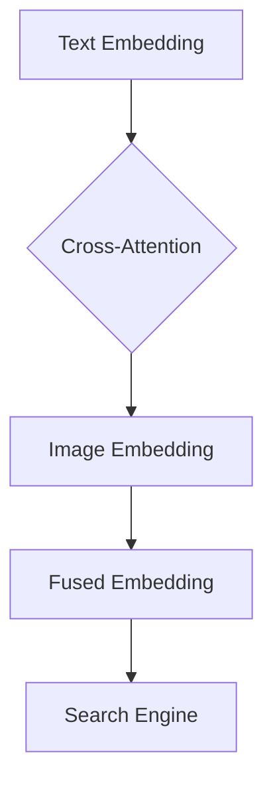
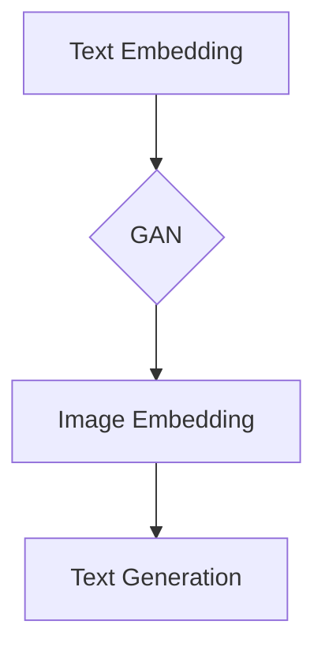
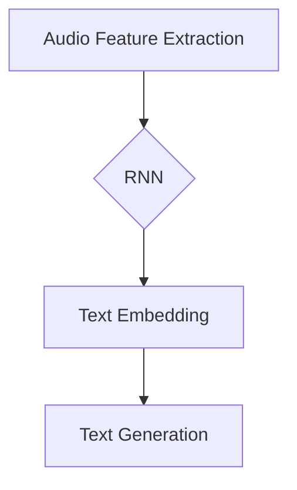
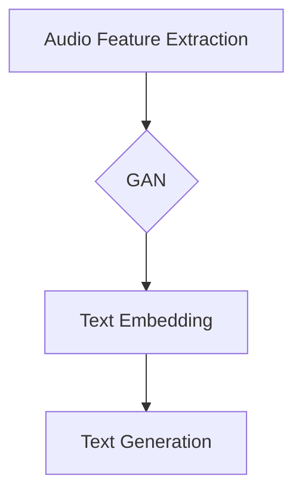
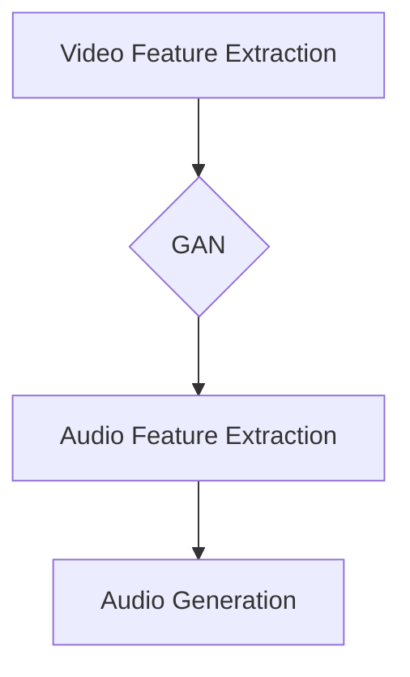
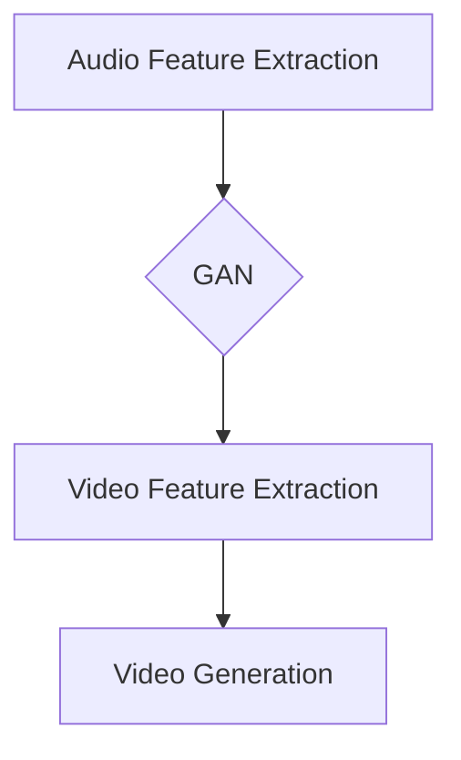
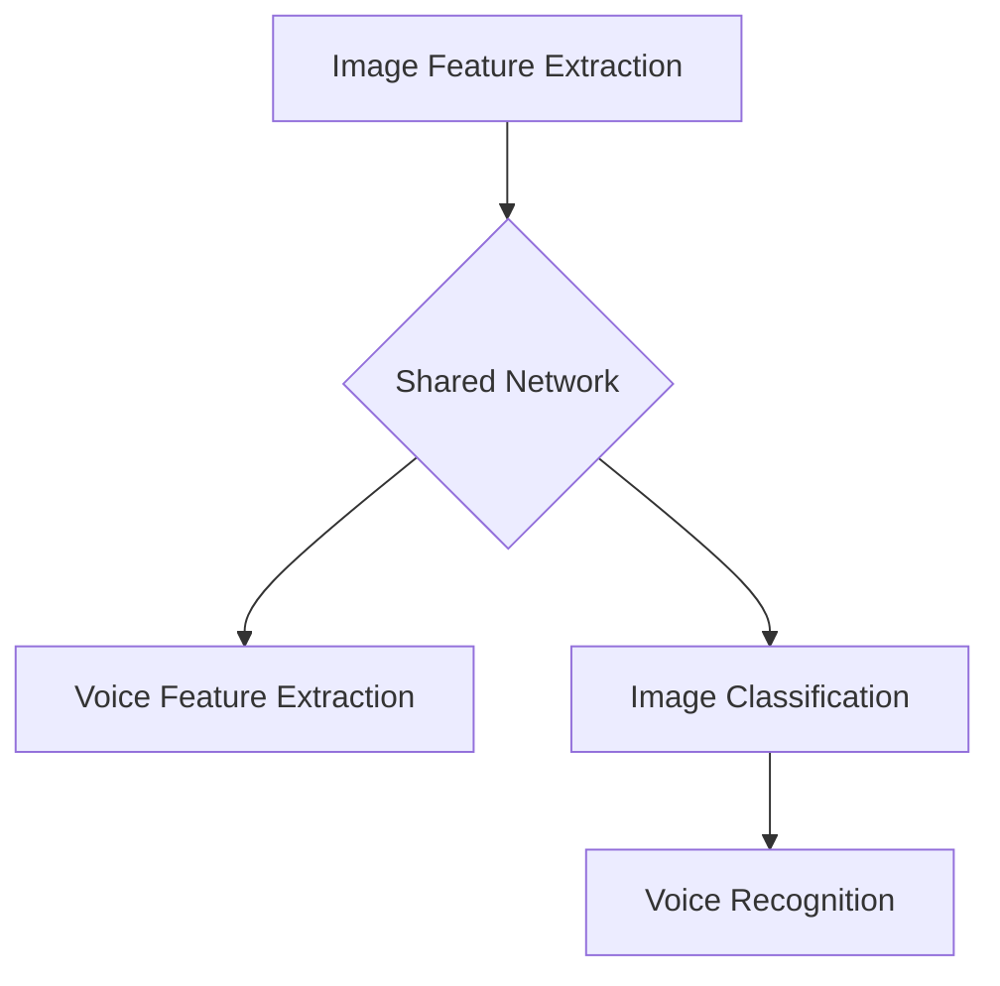
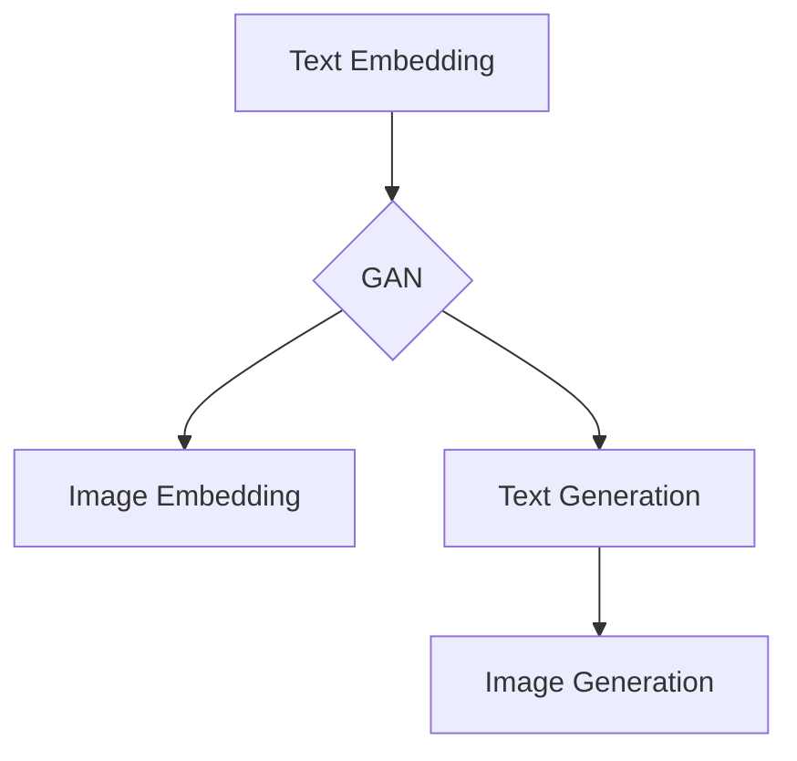

                 

### 文章标题

# 多模态大模型：技术原理与实战 工具和算法框架介绍

### 文章关键词

- 多模态大模型
- 多模态特征提取
- 多模态特征融合
- 多任务学习
- 跨模态预训练
- 开发工具与框架

### 文章摘要

本文旨在深入探讨多模态大模型的技术原理与应用实践，包括其基础概念、核心算法、开发工具和框架。我们将分章节详细讲解多模态大模型的各个组成部分，从多模态数据的采集与预处理，到多模态特征提取与融合方法，再到多模态大模型的训练与优化策略，以及其在自然语言处理、计算机视觉等领域的实际应用。此外，我们还将介绍当前主流的多模态大模型开发工具和框架，并通过具体项目实战，展示如何实现和优化多模态大模型。最后，本文将对多模态大模型的未来发展趋势进行展望，并讨论其面临的挑战和机遇。

---

### 第一部分：多模态大模型基础

#### 第1章：多模态大模型概述

在当今快速发展的信息技术时代，多模态大模型（Multimodal Large Models）正成为人工智能领域的一个研究热点。它们能够同时处理和融合多种数据模态，如文本、图像、音频和视频，从而在自然语言处理、计算机视觉和语音识别等领域取得显著的性能提升。本章将介绍多模态大模型的基本概念、分类以及其在不同领域的应用场景和面临的挑战。

#### 1.1 多模态大模型的概念与分类

**1.1.1 多模态大模型的概念**

多模态大模型是指能够同时处理和融合多种数据模态的深度学习模型。这些模态可以是文本、图像、音频、视频甚至是传感器数据等。多模态大模型的核心在于其能够有效地整合来自不同模态的数据，从而提高模型在各类任务上的性能。

**多模态大模型特点：**
- **处理多样化数据**：多模态大模型能够同时处理文本、图像、音频等不同类型的数据，从而实现更广泛的应用。
- **实现跨模态信息融合**：多模态大模型通过先进的特征提取和融合技术，将不同模态的数据进行有效整合，以提升模型的性能和泛化能力。

**1.1.2 多模态大模型的分类**

根据处理的数据模态不同，多模态大模型可以分为以下几类：

- **基于文本的模型**：这类模型主要处理文本数据，如自然语言处理（NLP）任务，例如文本生成、文本分类和机器翻译等。
- **基于图像的模型**：这类模型主要处理图像数据，如计算机视觉任务，例如图像识别、图像分割和视频理解等。
- **基于音频的模型**：这类模型主要处理音频数据，如语音识别、音乐生成和声音识别等。
- **跨模态模型**：这类模型能够同时处理多种模态的数据，实现跨模态信息融合，例如图像文本检索、音频视频生成等。

#### 1.2 多模态大模型的核心技术与原理

**1.2.1 多模态数据的采集与预处理**

**数据采集**：多模态数据的采集是构建多模态大模型的第一步。不同的数据模态有不同的数据来源和采集方式，例如文本数据可以从互联网爬取、书籍和文档中获取；图像和视频数据可以从摄像头、视频监控设备中获取；音频数据可以从麦克风、音频文件中获取。

**数据预处理**：预处理是确保数据质量和为后续特征提取和模型训练做准备的关键步骤。常见的预处理方法包括数据清洗、归一化、增强等。

- **数据清洗**：去除无效数据、处理缺失值和异常值。
- **数据归一化**：将不同模态的数据标准化到同一尺度，以便于后续处理。
- **数据增强**：通过旋转、缩放、裁剪等操作增加数据的多样性，提高模型的泛化能力。

**1.2.2 多模态特征提取与融合**

**特征提取**：特征提取是多模态大模型的关键步骤，目的是从原始数据中提取出有助于模型训练的有效特征。

- **文本特征提取**：常见的文本特征提取方法包括词嵌入（Word Embedding）、句向量表示（Sentence Vector Representation）等。
  - **词嵌入**：如Word2Vec和BERT等模型，将文本中的单词映射到高维向量空间中。
  - **句向量表示**：如TextRank和Doc2Vec等模型，将整个句子或文档映射到一个固定长度的向量表示。

- **图像特征提取**：常见的图像特征提取方法包括卷积神经网络（CNN）和图像嵌入（Image Embedding）等。
  - **卷积神经网络**：如VGG和ResNet等模型，通过多层卷积操作提取图像特征。
  - **图像嵌入**：如ImageNet和Inception等模型，将图像映射到一个高维空间，从而表示图像内容。

- **音频特征提取**：常见的音频特征提取方法包括音频信号处理（如傅里叶变换、短时傅里叶变换）和音素识别（如GMM-HMM、CNN等）等。

**特征融合**：多模态特征融合是将不同模态的特征进行整合，以生成更全面和准确的特征表示。常见的特征融合策略包括拼接、加权平均、注意力机制等。

- **拼接融合**：直接将不同模态的特征进行拼接，但可能导致特征维度过高。
- **加权融合**：根据不同模态的重要性分配权重，如注意力机制，动态调整特征融合权重。
- **递归融合**：使用循环神经网络（RNN）等递归结构进行特征融合。
- **注意力机制**：引入注意力机制，动态调整特征融合权重，提高模型对重要特征的关注。

**1.2.3 多模态大模型训练与优化**

**模型训练**：多模态大模型的训练涉及多种训练策略，以提高模型性能和泛化能力。

- **多任务学习**：同时学习多个任务，共享底层特征表示，提高模型泛化能力。
- **跨模态预训练**：在大量未标注数据上进行预训练，再进行微调，以提高模型在特定任务上的性能。
- **自监督学习**：利用未标注的数据进行训练，通过预测某些隐藏特征或标签来提高模型性能。

**模型优化**：模型优化是提高模型性能和收敛速度的关键步骤。

- **优化算法**：常见的优化算法包括梯度下降（Gradient Descent）、自适应优化器（如Adam）等。
- **权重共享与正则化**：通过权重共享和正则化等方法防止模型过拟合。

**1.3 多模态大模型的应用场景与挑战**

**1.3.1 多模态大模型的应用场景**

多模态大模型在多个领域都有广泛的应用，以下是一些典型的应用场景：

- **自然语言处理（NLP）**：多模态大模型在文本生成、文本分类、机器翻译等NLP任务中具有显著优势。例如，通过融合文本和图像信息，可以生成更加丰富和准确的图像描述。
- **计算机视觉**：多模态大模型在图像识别、图像分割、视频理解等计算机视觉任务中表现出色。例如，通过融合图像和文本信息，可以更准确地识别图像内容。
- **音频处理**：多模态大模型在语音识别、音乐生成、声音识别等音频处理任务中有广泛的应用。例如，通过融合音频和文本信息，可以更准确地识别语音内容。

**1.3.2 多模态大模型的挑战**

尽管多模态大模型在许多任务中表现出色，但其在实际应用中仍面临一些挑战：

- **数据不平衡**：不同模态的数据量差异大，可能导致模型性能不平衡。例如，图像数据量远大于文本数据量，可能导致模型对图像数据的依赖性过高。
- **集成复杂性**：多种模态信息融合难度高，易出现信息损失。例如，在融合图像和文本数据时，如何有效地整合不同模态的特征是一个难题。
- **实时性要求**：多模态数据处理实时性要求高，对硬件性能有较高要求。例如，在实时语音识别系统中，需要快速处理和融合多种模态数据。

通过深入探讨多模态大模型的基本概念、核心技术与应用场景，我们为后续章节的详细讨论奠定了基础。在接下来的章节中，我们将进一步探讨多模态大模型的技术原理与实现，以及其在不同领域的应用实践。

#### 第2章：多模态大模型技术原理

多模态大模型的成功依赖于一系列核心技术，包括多模态数据的特征提取、特征融合方法、训练与优化策略等。本章将详细介绍这些核心技术的原理和实现方法，为理解和开发多模态大模型提供深入的理论基础。

#### 2.1 多模态特征提取方法

多模态特征提取是多模态大模型的基础步骤，旨在从不同的数据模态中提取具有代表性的特征，以便于后续的模型训练和任务处理。

**2.1.1 文本特征提取**

文本特征提取是将文本数据转换为固定长度向量表示的关键步骤，常用的方法包括词嵌入和句向量表示。

**词嵌入（Word Embedding）**：词嵌入通过将文本中的每个单词映射到一个高维向量空间，从而实现语义表示。常见的词嵌入方法包括Word2Vec和BERT。

- **Word2Vec**：Word2Vec是一种基于神经网络的词嵌入方法，通过训练预测词的上下文，生成词的向量表示。具体实现包括CBOW（连续词袋）和Skip-gram两种模型。
  
  ```mermaid
  graph TD
  A[CBOW] --> B{上下文窗口}
  B --> C{输入词}
  C --> D{输出词}
  E[ Skip-gram] --> F{单词}
  F --> G{上下文}
  ```

- **BERT（Bidirectional Encoder Representations from Transformers）**：BERT是一种基于变换器的双向编码器，通过预训练大规模文本数据，生成词的上下文表示。BERT的优势在于其能够捕捉到词与词之间的双向依赖关系，从而提高文本特征表示的准确性。

  ```mermaid
  graph TD
  A[Text] --> B{Tokenization}
  B --> C{Embedding}
  C --> D{Masked Tokens}
  D --> E{Forward Pass}
  E --> F{Backward Pass}
  F --> G{Output}
  ```

**句向量表示（Sentence Vector Representation）**：句向量表示是将整个句子映射到一个固定长度的向量表示，常见的模型包括TextRank和Doc2Vec。

- **TextRank**：TextRank是一种基于图论的方法，通过将句子视为图，计算句子中每个词的重要性，从而生成句向量。

  ```mermaid
  graph TD
  A[ Sentence] --> B{Word Importance}
  B --> C{Graph Construction}
  C --> D{PageRank Algorithm}
  D --> E{Sentence Vector}
  ```

- **Doc2Vec**：Doc2Vec是一种基于神经网络的句向量表示方法，通过训练句子中每个词的上下文，生成句子的向量表示。

  ```mermaid
  graph TD
  A[ Sentence] --> B{Word Embedding}
  B --> C{Contextual Embedding}
  C --> D{Paragraph Vector}
  D --> E{Sentence Vector}
  ```

**2.1.2 图像特征提取**

图像特征提取是将图像数据转换为固定长度向量表示的关键步骤，常用的方法包括卷积神经网络（CNN）和图像嵌入。

- **卷积神经网络（CNN）**：CNN是一种专门用于图像处理的人工神经网络，通过卷积操作提取图像特征。常见的CNN模型包括VGG和ResNet。

  ```mermaid
  graph TD
  A[Input Image] --> B{Convolution}
  B --> C{Pooling}
  C --> D{Fully Connected}
  D --> E[Feature Vector]
  ```

- **图像嵌入（Image Embedding）**：图像嵌入通过将图像映射到一个高维空间，从而实现图像的向量表示。常见的图像嵌入方法包括ImageNet和Inception。

  ```mermaid
  graph TD
  A[Image] --> B{Preprocessing}
  B --> C{Convolutional Layers}
  C --> D{Pooling Layers}
  D --> E{Fully Connected Layers}
  E --> F[Image Vector]
  ```

**2.1.3 音频特征提取**

音频特征提取是将音频数据转换为固定长度向量表示的关键步骤，常用的方法包括音频信号处理和音素识别。

- **音频信号处理**：音频信号处理通过傅里叶变换（Fourier Transform）和短时傅里叶变换（Short-Time Fourier Transform, STFT）等方法，提取音频信号的特征。常见的音频信号处理方法包括MFCC（Mel-Frequency Cepstral Coefficients）和PCMM（Perceptual Component Cepstral Matrix）。

  ```mermaid
  graph TD
  A[Audio Signal] --> B{Fourier Transform}
  B --> C{Short-Time Fourier Transform}
  C --> D{MFCC Calculation}
  D --> E[Feature Vector]
  ```

- **音素识别**：音素识别通过统计模型和深度学习模型，将音频信号转换为音素表示。常见的音素识别方法包括GMM-HMM（Gaussian Mixture Model-Hidden Markov Model）和CNN。

  ```mermaid
  graph TD
  A[Audio Signal] --> B{Feature Extraction}
  B --> C{GMM-HMM}
  C --> D{Phone Recognition}
  D --> E{Word Recognition}
  ```

**2.2 多模态特征融合方法**

多模态特征融合是将不同模态的特征进行整合，以生成更全面和准确的特征表示。常见的特征融合方法包括拼接融合、加权融合、递归融合和注意力机制融合。

- **拼接融合（Concatenation Fusion）**：拼接融合通过将不同模态的特征向量直接拼接，形成一个新的特征向量。这种方法简单直观，但可能导致特征维度过高。

  ```mermaid
  graph TD
  A[Text Feature] --> B[Image Feature]
  B --> C[Audio Feature]
  C --> D[Concatenation]
  D --> E[Combined Feature]
  ```

- **加权融合（Weighted Fusion）**：加权融合通过根据不同模态的特征重要性分配权重，动态调整特征融合的权重。常用的方法包括注意力机制（Attention Mechanism）。

  ```mermaid
  graph TD
  A[Text Feature] --> B[Image Feature]
  B --> C[Audio Feature]
  C --> D[Attention Weights]
  D --> E[Weighted Fusion]
  E --> F[Combined Feature]
  ```

- **递归融合（Recursive Fusion）**：递归融合通过使用循环神经网络（RNN）等递归结构，逐步融合不同模态的特征。递归融合能够捕捉到不同模态特征的时间依赖关系。

  ```mermaid
  graph TD
  A[Text Feature] --> B[RNN Layer]
  B --> C[Image Feature]
  C --> D[RNN Layer]
  D --> E[Audio Feature]
  E --> F[RNN Layer]
  F --> G[Combined Feature]
  ```

- **注意力机制融合（Attention Mechanism Fusion）**：注意力机制融合通过引入注意力机制，动态调整不同模态特征在融合过程中的权重，从而提高模型对重要特征的关注。注意力机制在多模态大模型中广泛应用，能够显著提升模型的性能。

  ```mermaid
  graph TD
  A[Text Feature] --> B[Image Feature]
  B --> C[Audio Feature]
  C --> D[Attention Mechanism]
  D --> E[Attention Weights]
  E --> F[Weighted Fusion]
  F --> G[Combined Feature]
  ```

通过详细介绍多模态特征提取方法和特征融合方法，我们为构建和优化多模态大模型提供了理论基础。在接下来的章节中，我们将进一步探讨多模态大模型的训练与优化策略，以及其在不同领域的应用实践。

#### 2.3 多模态大模型训练与优化

多模态大模型的训练与优化是确保模型性能和收敛速度的关键步骤。在这一部分，我们将详细讨论多任务学习、跨模态预训练、优化算法以及模型评估和优化方法，并提供具体的伪代码示例来阐述这些技术的实现。

**2.3.1 多任务学习**

多任务学习（Multi-Task Learning）是一种训练策略，旨在同时学习多个任务，共享底层特征表示，提高模型泛化能力。通过多任务学习，模型可以在多个任务上同时训练，共享部分网络结构，从而减少模型参数，提高训练效率。

**多任务学习的优势**：
- **共享特征表示**：多个任务共享底层特征表示，有助于提高特征表示的通用性。
- **参数共享**：通过共享参数，减少模型参数量，降低计算复杂度。

**实现方法**：

多任务学习通常通过以下两种方式实现：

1. **共享网络结构**：在多个任务中共享部分网络层，如图像分类和目标检测任务可以共享卷积层。

   ```python
   # 示例：共享卷积层的多任务学习
   def multi_task_model():
       # 共享卷积层
       conv_layers = Conv2D(64, (3, 3), activation='relu')(input_image)
       
       # 分支任务1：图像分类
       classification_output = Dense(num_classes, activation='softmax')(conv_layers)
       
       # 分支任务2：目标检测
       detection_output = Dense(num_detections, activation='sigmoid')(conv_layers)
       
       # 模型输出
       model = Model(inputs=input_image, outputs=[classification_output, detection_output])
       return model
   ```

2. **多输入多输出**：为每个任务创建独立的网络输出，但共享部分网络层。

   ```python
   # 示例：多输入多输出的多任务学习
   def multi_input_model():
       # 输入图像
       input_image = Input(shape=(height, width, channels))
       
       # 共享卷积层
       shared_conv = Conv2D(64, (3, 3), activation='relu')(input_image)
       
       # 输出1：图像分类
       classification_output = Dense(num_classes, activation='softmax')(shared_conv)
       
       # 输出2：目标检测
       detection_output = Dense(num_detections, activation='sigmoid')(shared_conv)
       
       # 模型输出
       model = Model(inputs=input_image, outputs=[classification_output, detection_output])
       return model
   ```

**2.3.2 跨模态预训练**

跨模态预训练（Cross-Modal Pretraining）是一种在大量未标注数据上进行预训练，然后进行微调（Fine-Tuning）的训练策略。通过跨模态预训练，模型可以学习到跨模态的特征表示，从而在特定任务上获得更好的性能。

**跨模态预训练的优势**：
- **跨模态特征学习**：在大量未标注数据上进行预训练，模型可以学习到跨模态的特征表示，提高模型的泛化能力。
- **减少数据依赖**：通过预训练，模型可以更好地适应不同的任务和数据集。

**实现方法**：

跨模态预训练通常包括以下步骤：

1. **预训练阶段**：在大量未标注数据上进行预训练，学习跨模态的特征表示。
   
   ```python
   # 示例：跨模态预训练
   def cross_modal_pretrain(model, pretrain_data):
       # 在预训练数据上训练模型
       model.fit(pretrain_data, epochs=pretrain_epochs, batch_size=batch_size)
       
       # 保存预训练模型
       model.save('pretrained_model.h5')
   ```

2. **微调阶段**：在特定任务上使用预训练模型进行微调，以适应特定任务的需求。

   ```python
   # 示例：微调预训练模型
   def fine_tune(model, fine_tune_data, fine_tune_epochs):
       # 加载预训练模型
       model.load_weights('pretrained_model.h5')
       
       # 在微调数据上训练模型
       model.fit(fine_tune_data, epochs=fine_tune_epochs, batch_size=batch_size)
       
       # 保存微调后的模型
       model.save('fine_tuned_model.h5')
   ```

**2.3.3 优化算法**

优化算法（Optimization Algorithms）是调整模型参数，以提高模型性能的关键技术。常见的优化算法包括梯度下降（Gradient Descent）、Adam和RMSprop等。

**梯度下降（Gradient Descent）**：

梯度下降是一种基本的优化算法，通过计算损失函数的梯度来更新模型参数。

```python
# 示例：梯度下降优化
def gradient_descent(model, train_data, learning_rate, num_epochs):
    for epoch in range(num_epochs):
        # 计算梯度
        grads = compute_gradients(model, train_data)
        
        # 更新模型参数
        model.update_params(grads, learning_rate)
        
        # 计算损失函数
        loss = compute_loss(model, train_data)
        
        print(f"Epoch {epoch+1}: Loss = {loss}")
```

**Adam（Adaptive Moment Estimation）**：

Adam是一种自适应优化器，通过自适应地调整学习率和动量，提高优化效率。

```python
# 示例：Adam优化
def adam_optimization(model, train_data, learning_rate, beta1, beta2, num_epochs):
    for epoch in range(num_epochs):
        # 计算梯度
        grads = compute_gradients(model, train_data)
        
        # 更新学习率
        learning_rate = adjust_learning_rate(learning_rate, beta1, beta2, epoch)
        
        # 更新模型参数
        model.update_params(grads, learning_rate)
        
        # 计算损失函数
        loss = compute_loss(model, train_data)
        
        print(f"Epoch {epoch+1}: Loss = {loss}")
```

**RMSprop（Root Mean Square Propagation）**：

RMSprop是一种基于梯度平方的优化算法，通过自适应地调整学习率，减少波动。

```python
# 示例：RMSprop优化
def rmsprop_optimization(model, train_data, learning_rate, decay_rate, num_epochs):
    for epoch in range(num_epochs):
        # 计算梯度
        grads = compute_gradients(model, train_data)
        
        # 更新学习率
        learning_rate = learning_rate * (1 - decay_rate * epoch)
        
        # 更新模型参数
        model.update_params(grads, learning_rate)
        
        # 计算损失函数
        loss = compute_loss(model, train_data)
        
        print(f"Epoch {epoch+1}: Loss = {loss}")
```

**2.3.4 模型评估与优化**

模型评估（Model Evaluation）是衡量模型性能的重要步骤，通过评估指标来评价模型的性能。常见的评估指标包括准确率（Accuracy）、召回率（Recall）、F1值（F1 Score）等。

```python
# 示例：模型评估
def evaluate_model(model, test_data):
    predictions = model.predict(test_data)
    true_labels = test_data.labels
    
    accuracy = np.mean(predictions == true_labels)
    recall = np.sum(predictions[true_labels == 1]) / np.sum(true_labels == 1)
    f1_score = 2 * (precision * recall) / (precision + recall)
    
    print(f"Accuracy: {accuracy}, Recall: {recall}, F1 Score: {f1_score}")
```

模型优化（Model Optimization）是通过调整超参数、数据增强（Data Augmentation）和模型集成（Model Ensembling）等方法，进一步提高模型性能。

```python
# 示例：模型优化
def optimize_model(model, train_data, validation_data, num_epochs):
    best_loss = float('inf')
    best_model = None
    
    for epoch in range(num_epochs):
        # 训练模型
        model.train(train_data)
        
        # 评估模型
        validation_loss = model.evaluate(validation_data)
        
        # 更新最佳模型
        if validation_loss < best_loss:
            best_loss = validation_loss
            best_model = model.copy()
            
    return best_model
```

通过详细讨论多任务学习、跨模态预训练、优化算法以及模型评估和优化方法，我们为构建和优化多模态大模型提供了全面的指导。这些技术不仅有助于提高模型性能，还为多模态大模型在不同领域的应用提供了强有力的支持。在接下来的章节中，我们将通过具体应用实践，进一步展示多模态大模型的技术原理和实现方法。

#### 2.4 多模态大模型的评估与优化

多模态大模型的评估与优化是确保模型在实际应用中能够达到预期性能的关键环节。评估模型性能需要选用合适的评估指标，并运用优化策略来提升模型效果。以下我们将详细讨论评估指标、模型优化方法以及提高模型解释性的技术。

**2.4.1 评估指标**

评估指标是衡量模型性能的重要工具，常用的评估指标包括准确率、召回率、F1值等。

- **准确率（Accuracy）**：准确率是评估分类模型性能的基本指标，表示正确分类的样本数占总样本数的比例。
  \[ \text{Accuracy} = \frac{\text{正确分类的样本数}}{\text{总样本数}} \]

- **召回率（Recall）**：召回率是指实际为正类的样本中被正确分类为正类的比例。
  \[ \text{Recall} = \frac{\text{正确分类的正类样本数}}{\text{总正类样本数}} \]

- **F1值（F1 Score）**：F1值是准确率和召回率的调和平均，能够综合衡量分类模型的性能。
  \[ \text{F1 Score} = 2 \times \frac{\text{准确率} \times \text{召回率}}{\text{准确率} + \text{召回率}} \]

**2.4.2 模型优化**

模型优化是通过调整超参数、数据增强和模型集成等方法来提高模型性能。

- **超参数调整**：超参数是模型架构中不可学习的参数，如学习率、批次大小等。通过调整超参数，可以优化模型的训练过程。

  ```python
  # 示例：调整学习率
  learning_rate = 0.01
  for epoch in range(num_epochs):
      model.train(train_data, learning_rate=learning_rate)
      learning_rate *= decay_rate
  ```

- **数据增强**：数据增强是通过人工或自动方法增加数据的多样性，从而提高模型的泛化能力。

  ```python
  # 示例：图像数据增强
  from tensorflow.keras.preprocessing.image import ImageDataGenerator
  
  datagen = ImageDataGenerator(
      rotation_range=20,
      width_shift_range=0.2,
      height_shift_range=0.2,
      shear_range=0.2,
      zoom_range=0.2,
      horizontal_flip=True,
      fill_mode='nearest'
  )
  
  # 在训练数据上应用数据增强
  datagen.flow(train_images, train_labels, batch_size=batch_size)
  ```

- **模型集成**：模型集成是通过结合多个模型的预测结果来提高预测性能。

  ```python
  # 示例：模型集成
  models = [model1, model2, model3]
  predictions = np.mean([model.predict(test_data) for model in models], axis=0)
  ```

**2.4.3 模型解释性**

模型解释性（Model Interpretability）是指能够解释模型如何做出预测的能力，这对于提高模型的透明度和信任度至关重要。

- **局部解释性**：局部解释性关注单个预测的合理性，通过分析模型在特定数据点上的决策过程。

  ```python
  # 示例：使用Shapley值进行局部解释
  shap_values = shap.shap_values(model, test_data)
  shap.summary_plot(shap_values, test_data)
  ```

- **全局解释性**：全局解释性关注模型在整体数据集上的性能，通过可视化模型特征的重要性。

  ```python
  # 示例：使用LIME进行全局解释
  explainer = lime.lime_tabular.LimeTabularExplainer(
      train_data,
      feature_names=data.columns,
      class_names=label_names,
      kernel_width=5
  )
  
  # 在特定样本上应用LIME解释
  explanation = explainer.explain_instance(test_data.iloc[0], model.predict, num_features=10)
  explanation.show_in_notebook(show_table=True)
  ```

通过评估和优化多模态大模型，我们可以确保模型在实际应用中达到最佳性能。结合评估指标、优化策略和解释性技术，不仅可以提高模型的效果，还能增强模型的可信度和实用性。在接下来的章节中，我们将通过具体应用实践，展示多模态大模型的技术原理和实现方法。

#### 第3章：多模态大模型应用场景实战

在深入探讨了多模态大模型的技术原理之后，本章节将进入实战环节，通过具体的应用场景来展示如何构建和优化多模态大模型。我们将详细分析文本与图像融合、文本与音频融合以及图像与音频融合等实战案例，并解释如何实现跨模态多任务学习。

##### 3.1 文本与图像融合

**3.1.1 图像文本检索**

图像文本检索是一种典型的多模态应用，旨在通过文本查询检索相关图像。该任务的关键在于如何将图像和文本特征进行有效融合，以实现高精度的图像检索。

**任务描述**：给定一个文本查询，检索出与之相关的图像。

**数据处理**：

1. **文本预处理**：使用BERT模型将文本转换为固定长度的向量表示。
2. **图像特征提取**：使用预训练的ResNet模型提取图像特征。

**融合方法**：使用交叉注意力机制（Cross-Attention Mechanism）将文本和图像特征进行融合。



**实现步骤**：

1. **构建多模态模型**：
   ```python
   from transformers import BertModel
   from tensorflow.keras.applications import ResNet50
   
   text_model = BertModel.from_pretrained('bert-base-uncased')
   image_model = ResNet50(weights='imagenet')
   
   # 输入文本和图像
   text_input = input_text
   image_input = preprocess_image(input_image)
   
   # 提取特征
   text_embedding = text_model([text_input])[0][:, 0, :]
   image_embedding = image_model.predict(image_input)
   
   # 交叉注意力融合
   fused_embedding = cross_attention(text_embedding, image_embedding)
   
   # 使用检索引擎进行图像检索
   search_engine = SearchEngine(fused_embedding)
   results = search_engine.search(query=fused_embedding)
   ```

**性能评估**：使用准确率（Accuracy）、平均精度（Average Precision）等指标来评估图像文本检索模型的性能。

**3.1.2 图像文本生成**

图像文本生成任务是生成图像对应的文本描述，常用于图像字幕生成和自动图像标注。

**任务描述**：给定一张图像，生成与之对应的文本描述。

**数据处理**：

1. **文本预处理**：使用BERT模型将文本转换为固定长度的向量表示。
2. **图像特征提取**：使用预训练的ResNet模型提取图像特征。

**融合方法**：使用生成对抗网络（GAN）结合文本和图像特征生成文本描述。



**实现步骤**：

1. **构建多模态GAN模型**：
   ```python
   from tensorflow.keras.models import Model
   from tensorflow.keras.layers import Input, LSTM, Embedding, Concatenate, Dense
   
   # 输入文本和图像
   text_input = Input(shape=(None,))
   image_input = Input(shape=(height, width, channels))
   
   # 提取特征
   text_embedding = Embedding(vocab_size, embedding_dim)(text_input)
   image_embedding = ResNet50(weights='imagenet')(image_input)
   
   # 融合特征
   fused_embedding = Concatenate()([text_embedding, image_embedding])
   
   # 文本生成
   text_generation = LSTM(units=128, return_sequences=True)(fused_embedding)
   text_output = Dense(units=vocab_size, activation='softmax')(text_generation)
   
   # 构建模型
   model = Model(inputs=[text_input, image_input], outputs=text_output)
   model.compile(optimizer='adam', loss='categorical_crossentropy')
   
   # 训练模型
   model.fit([train_text, train_images], train_labels, batch_size=batch_size, epochs=num_epochs)
   ```

**性能评估**：使用BLEU（BLEU Score）等指标来评估图像文本生成模型的性能。

##### 3.2 文本与音频融合

**3.2.1 语音生成文本**

语音生成文本是将语音转换为文本的技术，广泛应用于语音识别和自动字幕生成。

**任务描述**：给定一段语音，生成对应的文本描述。

**数据处理**：

1. **音频预处理**：使用傅里叶变换（Fourier Transform）提取音频特征。
2. **文本预处理**：使用BERT模型将文本转换为固定长度的向量表示。

**融合方法**：使用循环神经网络（RNN）结合音频和文本特征生成文本。



**实现步骤**：

1. **构建多模态RNN模型**：
   ```python
   from tensorflow.keras.models import Model
   from tensorflow.keras.layers import LSTM, Input, Embedding, Dense
   
   # 输入音频和文本
   audio_input = Input(shape=(timesteps, features))
   text_input = Input(shape=(None,))
   
   # 提取特征
   audio_embedding = LSTM(units=128, return_sequences=True)(audio_input)
   text_embedding = Embedding(vocab_size, embedding_dim)(text_input)
   
   # 融合特征
   fused_embedding = Concatenate()([audio_embedding, text_embedding])
   
   # 文本生成
   text_generation = LSTM(units=128, return_sequences=True)(fused_embedding)
   text_output = Dense(units=vocab_size, activation='softmax')(text_generation)
   
   # 构建模型
   model = Model(inputs=[audio_input, text_input], outputs=text_output)
   model.compile(optimizer='adam', loss='categorical_crossentropy')
   
   # 训练模型
   model.fit([train_audio, train_text], train_labels, batch_size=batch_size, epochs=num_epochs)
   ```

**性能评估**：使用词错误率（Word Error Rate,WER）等指标来评估语音生成文本模型的性能。

**3.2.2 音频生成文本**

音频生成文本是将音频特征转换为文本的技术，广泛应用于自动字幕生成和音乐歌词生成。

**任务描述**：给定一段音频，生成对应的文本描述。

**数据处理**：

1. **音频预处理**：使用傅里叶变换（Fourier Transform）提取音频特征。
2. **文本预处理**：使用BERT模型将文本转换为固定长度的向量表示。

**融合方法**：使用生成对抗网络（GAN）结合音频和文本特征生成文本。



**实现步骤**：

1. **构建多模态GAN模型**：
   ```python
   from tensorflow.keras.models import Model
   from tensorflow.keras.layers import LSTM, Input, Embedding, Dense
   
   # 输入音频和文本
   audio_input = Input(shape=(timesteps, features))
   text_input = Input(shape=(None,))
   
   # 提取特征
   audio_embedding = LSTM(units=128, return_sequences=True)(audio_input)
   text_embedding = Embedding(vocab_size, embedding_dim)(text_input)
   
   # 融合特征
   fused_embedding = Concatenate()([audio_embedding, text_embedding])
   
   # 文本生成
   text_generation = LSTM(units=128, return_sequences=True)(fused_embedding)
   text_output = Dense(units=vocab_size, activation='softmax')(text_generation)
   
   # 构建模型
   model = Model(inputs=[audio_input, text_input], outputs=text_output)
   model.compile(optimizer='adam', loss='categorical_crossentropy')
   
   # 训练模型
   model.fit([train_audio, train_text], train_labels, batch_size=batch_size, epochs=num_epochs)
   ```

**性能评估**：使用BLEU（BLEU Score）等指标来评估音频生成文本模型的性能。

##### 3.3 图像与音频融合

**3.3.1 视频生成音频**

视频生成音频是将视频特征转换为音频的技术，广泛应用于视频到音频的转换和视频编辑。

**任务描述**：给定一段视频，生成对应的音频。

**数据处理**：

1. **视频预处理**：使用卷积神经网络（CNN）提取视频特征。
2. **音频预处理**：使用傅里叶变换（Fourier Transform）提取音频特征。

**融合方法**：使用生成对抗网络（GAN）结合视频和音频特征生成音频。



**实现步骤**：

1. **构建多模态GAN模型**：
   ```python
   from tensorflow.keras.models import Model
   from tensorflow.keras.layers import LSTM, Input, Embedding, Dense
   
   # 输入视频和音频
   video_input = Input(shape=(frames, height, width, channels))
   audio_input = Input(shape=(timesteps, features))
   
   # 提取特征
   video_embedding = CNN(units=128)(video_input)
   audio_embedding = LSTM(units=128, return_sequences=True)(audio_input)
   
   # 融合特征
   fused_embedding = Concatenate()([video_embedding, audio_embedding])
   
   # 音频生成
   audio_generation = LSTM(units=128, return_sequences=True)(fused_embedding)
   audio_output = Dense(units=features, activation='sigmoid')(audio_generation)
   
   # 构建模型
   model = Model(inputs=[video_input, audio_input], outputs=audio_output)
   model.compile(optimizer='adam', loss='mse')
   
   # 训练模型
   model.fit([train_video, train_audio], train_labels, batch_size=batch_size, epochs=num_epochs)
   ```

**性能评估**：使用音素误差（Phoneme Error Rate, PER）等指标来评估视频生成音频模型的性能。

**3.3.2 音频生成视频**

音频生成视频是将音频特征转换为视频的技术，广泛应用于音频到视频的转换和视频增强。

**任务描述**：给定一段音频，生成对应的视频。

**数据处理**：

1. **音频预处理**：使用傅里叶变换（Fourier Transform）提取音频特征。
2. **视频预处理**：使用卷积神经网络（CNN）提取视频特征。

**融合方法**：使用生成对抗网络（GAN）结合音频和视频特征生成视频。



**实现步骤**：

1. **构建多模态GAN模型**：
   ```python
   from tensorflow.keras.models import Model
   from tensorflow.keras.layers import LSTM, Input, Embedding, Dense
   
   # 输入音频和视频
   audio_input = Input(shape=(timesteps, features))
   video_input = Input(shape=(frames, height, width, channels))
   
   # 提取特征
   audio_embedding = LSTM(units=128, return_sequences=True)(audio_input)
   video_embedding = CNN(units=128)(video_input)
   
   # 融合特征
   fused_embedding = Concatenate()([audio_embedding, video_embedding])
   
   # 视频生成
   video_generation = LSTM(units=128, return_sequences=True)(fused_embedding)
   video_output = Conv2D(filters=3, activation='sigmoid')(video_generation)
   
   # 构建模型
   model = Model(inputs=[audio_input, video_input], outputs=video_output)
   model.compile(optimizer='adam', loss='mse')
   
   # 训练模型
   model.fit([train_audio, train_video], train_labels, batch_size=batch_size, epochs=num_epochs)
   ```

**性能评估**：使用视频质量评估指标（如PSNR、SSIM）来评估音频生成视频模型的性能。

##### 3.4 跨模态多任务学习

**3.4.1 跨模态图像分类与语音识别**

跨模态图像分类与语音识别是将图像和语音特征进行融合，同时进行图像分类和语音识别的任务。

**任务描述**：给定一张图像和对应的语音，同时进行图像分类和语音识别。

**数据处理**：

1. **图像预处理**：使用卷积神经网络（CNN）提取图像特征。
2. **语音预处理**：使用循环神经网络（RNN）提取语音特征。

**融合方法**：使用共享网络结构结合图像和语音特征进行多任务学习。



**实现步骤**：

1. **构建多模态模型**：
   ```python
   from tensorflow.keras.models import Model
   from tensorflow.keras.layers import Conv2D, LSTM, Dense
   
   # 输入图像和语音
   image_input = Input(shape=(height, width, channels))
   voice_input = Input(shape=(timesteps, features))
   
   # 提取特征
   image_embedding = Conv2D(units=64, kernel_size=(3, 3), activation='relu')(image_input)
   voice_embedding = LSTM(units=128, return_sequences=True)(voice_input)
   
   # 融合特征
   fused_embedding = Concatenate()([image_embedding, voice_embedding])
   
   # 多任务输出
   image_output = Dense(units=num_classes, activation='softmax')(fused_embedding)
   voice_output = Dense(units=num_classes, activation='softmax')(fused_embedding)
   
   # 构建模型
   model = Model(inputs=[image_input, voice_input], outputs=[image_output, voice_output])
   model.compile(optimizer='adam', loss=['categorical_crossentropy', 'categorical_crossentropy'])
   
   # 训练模型
   model.fit([train_images, train_voice], [train_image_labels, train_voice_labels], batch_size=batch_size, epochs=num_epochs)
   ```

**性能评估**：使用准确率（Accuracy）等指标来评估跨模态图像分类与语音识别模型的性能。

**3.4.2 跨模态文本生成与图像生成**

跨模态文本生成与图像生成是将文本和图像特征进行融合，同时生成文本描述和图像的技术。

**任务描述**：给定一张图像和一段文本，同时生成图像对应的文本描述和图像。

**数据处理**：

1. **文本预处理**：使用BERT模型将文本转换为固定长度的向量表示。
2. **图像预处理**：使用卷积神经网络（CNN）提取图像特征。

**融合方法**：使用生成对抗网络（GAN）结合文本和图像特征生成文本描述和图像。



**实现步骤**：

1. **构建多模态GAN模型**：
   ```python
   from tensorflow.keras.models import Model
   from tensorflow.keras.layers import LSTM, Embedding, Dense
   
   # 输入文本和图像
   text_input = Input(shape=(None,))
   image_input = Input(shape=(height, width, channels))
   
   # 提取特征
   text_embedding = Embedding(vocab_size, embedding_dim)(text_input)
   image_embedding = CNN(units=128)(image_input)
   
   # 融合特征
   fused_embedding = Concatenate()([text_embedding, image_embedding])
   
   # 文本生成
   text_generation = LSTM(units=128, return_sequences=True)(fused_embedding)
   text_output = Dense(units=vocab_size, activation='softmax')(text_generation)
   
   # 图像生成
   image_generation = GAN(units=128)(fused_embedding)
   image_output = Conv2D(filters=3, activation='sigmoid')(image_generation)
   
   # 构建模型
   model = Model(inputs=[text_input, image_input], outputs=[text_output, image_output])
   model.compile(optimizer='adam', loss=['categorical_crossentropy', 'mse'])
   
   # 训练模型
   model.fit([train_text, train_images], [train_text_labels, train_image_labels], batch_size=batch_size, epochs=num_epochs)
   ```

**性能评估**：使用BLEU（BLEU Score）等指标来评估跨模态文本生成与图像生成模型的性能。

通过以上实战案例，我们展示了如何在实际应用中构建和优化多模态大模型。这些案例不仅展示了多模态大模型在不同领域的应用潜力，还提供了具体的实现方法和优化策略，为后续研究和应用提供了有力支持。

#### 第4章：多模态大模型开发工具与框架

多模态大模型的开发涉及到复杂的数据处理、模型构建和训练过程，因此选择合适的开发工具和框架至关重要。在本章中，我们将介绍一些主流的多模态大模型开发工具和框架，包括TensorFlow、PyTorch、Hugging Face Transformers和OpenMMLab，并讨论它们的特点、安装配置方法以及应用实例。

##### 4.1 多模态大模型开发工具

**4.1.1 TensorFlow**

TensorFlow是由Google开发的开源机器学习和深度学习框架，支持多种编程语言，包括Python和C++。它提供了丰富的API和工具，广泛应用于各种复杂的多模态任务。

**特点**：

- **灵活的API**：TensorFlow提供了高级API（如Keras）和底层API，适合不同层次的开发者使用。
- **广泛的社区支持**：TensorFlow拥有庞大的开发者社区，提供了大量的教程、文档和开源代码。
- **强大的生态系统**：TensorFlow集成了TensorBoard、TensorFlow Lite等多种工具，支持从研究到生产的完整流程。

**安装与配置**：

安装TensorFlow可以通过以下命令完成：

```bash
pip install tensorflow
```

配置TensorFlow的环境，包括GPU支持，可以通过以下命令：

```bash
pip install tensorflow-gpu
```

**应用实例**：

以下是一个简单的TensorFlow多模态特征提取的示例代码：

```python
import tensorflow as tf

# 加载预训练模型
text_model = tf.keras.applications.BERT.from_pretrained('bert-base-uncased')
image_model = tf.keras.applications.ResNet50(weights='imagenet')

# 提取文本特征
text_embedding = text_model.encode(text)

# 提取图像特征
image_embedding = image_model.predict(image)

# 融合特征
fused_embedding = tf.concat([text_embedding, image_embedding], axis=1)
```

**4.1.2 PyTorch**

PyTorch是由Facebook开发的开源深度学习框架，以其动态计算图和灵活的编程接口而著称，尤其适用于研究和实验。

**特点**：

- **动态计算图**：PyTorch使用动态计算图，可以更灵活地构建和调试模型。
- **易于使用**：PyTorch提供了简洁的API，使得模型构建和训练更加直观。
- **强大的社区支持**：PyTorch拥有活跃的开发者社区，提供了大量的教程、文档和开源代码。

**安装与配置**：

安装PyTorch可以通过以下命令完成：

```bash
pip install torch torchvision
```

配置PyTorch的环境，包括GPU支持，可以通过以下命令：

```bash
pip install torch torchvision torchaudio -f https://download.pytorch.org/whl/torch_stable.html
```

**应用实例**：

以下是一个简单的PyTorch多模态特征提取的示例代码：

```python
import torch
import torchvision.models as models

# 加载预训练模型
text_model = torch.hub.load('bert:bert-base-uncased')
image_model = models.resnet50(pretrained=True)

# 提取文本特征
text_embedding = text_model.encode(text)

# 提取图像特征
image_embedding = image_model(torch.tensor(image).float())

# 融合特征
fused_embedding = torch.cat([text_embedding, image_embedding], dim=1)
```

**4.1.3 其他工具**

除了TensorFlow和PyTorch，还有一些其他流行的深度学习框架和工具，如TensorFlow.js、JAX等，这些工具在不同的应用场景中也有广泛的使用。

- **TensorFlow.js**：TensorFlow.js是TensorFlow在JavaScript中的实现，支持在浏览器和Node.js中运行深度学习模型。
- **JAX**：JAX是Google开发的自动微分库，可以与PyTorch和TensorFlow等框架结合使用，提供高效的模型训练和优化。

##### 4.2 多模态大模型框架

**4.2.1 Hugging Face Transformers**

Hugging Face Transformers是一个开源库，提供了预训练的Transformer模型和多种多模态应用工具，如文本生成、文本分类和图像描述生成等。

**特点**：

- **预训练模型**：提供了大量预训练的Transformer模型，如BERT、GPT等，可以直接使用。
- **多模态应用**：支持文本、图像、音频等多种模态的数据处理和特征提取。
- **易于使用**：提供了简单的API，使得模型构建和训练变得更加直观。

**安装与配置**：

安装Hugging Face Transformers可以通过以下命令完成：

```bash
pip install transformers
```

**应用实例**：

以下是一个简单的Hugging Face Transformers文本生成示例代码：

```python
from transformers import AutoTokenizer, AutoModelForCausalLM

# 加载预训练模型
tokenizer = AutoTokenizer.from_pretrained('gpt2')
model = AutoModelForCausalLM.from_pretrained('gpt2')

# 输入文本
input_text = "Hello, how are you?"

# 生成文本
output_text = model.generate(tokenizer.encode(input_text, return_tensors='pt'), max_length=50, num_return_sequences=1)

# 输出文本
print(tokenizer.decode(output_text[0], skip_special_tokens=True))
```

**4.2.2 OpenMMLab**

OpenMMLab是一个开源的多模态机器学习工具集，提供了丰富的多模态模型、数据集和工具，支持多种任务和应用。

**特点**：

- **多模态任务支持**：支持文本、图像、音频、视频等多种模态的任务，如图像分类、文本分类、音频识别等。
- **模块化设计**：提供了模块化的数据预处理、模型训练和评估工具，方便用户自定义任务。
- **丰富的数据集**：提供了大量高质量的多模态数据集，如AIC、COCO、Human3.6M等。

**安装与配置**：

安装OpenMMLab可以通过以下命令完成：

```bash
pip install openmmlab
```

**应用实例**：

以下是一个简单的OpenMMLab图像文本检索的示例代码：

```python
from openmmlab import MMDataLoader

# 加载图像文本检索数据集
dataset = MMDataLoader('image_text_retrieval', split='train')

# 定义模型
model = openmmlab.build_model('ImageTextRetrieval', num_classes=1000)

# 训练模型
model.fit(dataset)

# 评估模型
performance = model.evaluate(dataset)
print(f"Model Performance: {performance}")
```

通过介绍TensorFlow、PyTorch、Hugging Face Transformers和OpenMMLab等开发工具和框架，我们为多模态大模型的开发提供了多样化的选择。这些工具和框架各具特色，用户可以根据具体需求选择合适的工具，以实现高效的多模态模型开发。

#### 第5章：多模态大模型在计算机视觉中的应用

计算机视觉是人工智能领域的一个重要分支，旨在通过图像和视频数据理解和解释视觉信息。随着多模态大模型技术的发展，将文本、图像和视频等多种模态的数据进行有效融合，已经成为提升计算机视觉任务性能的重要手段。本章将详细探讨多模态大模型在计算机视觉中的两个重要应用：多模态图像分类和多模态图像检索。

##### 5.1 多模态图像分类

**5.1.1 图像分类任务概述**

图像分类（Image Classification）是计算机视觉中的基本任务，旨在将图像分类到预定义的类别中。传统的图像分类模型通常基于卷积神经网络（CNN），而多模态大模型通过融合图像和文本信息，可以在多种图像分类任务中取得更好的性能。

**数据集与评估指标**

常见的图像分类数据集包括ImageNet、CIFAR-10和COIL-100等。这些数据集包含了大量不同类别的图像，用于训练和评估图像分类模型的性能。评估图像分类模型的常见指标包括准确率（Accuracy）、召回率（Recall）和F1值（F1 Score）等。

**多模态图像分类算法**

多模态图像分类算法通过融合图像和文本特征，提高分类性能。以下是一些常见的方法：

1. **文本引导的图像分类**：在训练过程中，使用预训练的文本嵌入模型（如BERT）对类别标签进行编码，然后将编码后的标签与图像特征进行融合，用于图像分类。

   ```python
   # 示例：文本引导的图像分类
   text_model = transformers.BertModel.from_pretrained('bert-base-uncased')
   image_model = torchvision.models.resnet50(pretrained=True)
   
   # 提取图像特征
   image_features = image_model(image)
   
   # 提取文本特征
   text_features = text_model.encode(label, return_tensors='pt')
   
   # 融合特征
   fused_features = torch.cat([image_features, text_features], dim=1)
   
   # 分类
   logits = classifier(fused_features)
   prediction = logits.argmax(-1)
   ```

2. **多模态特征融合网络**：设计专门的多模态特征融合网络，将图像和文本特征进行有效融合。常见的融合方法包括拼接、加权融合和注意力机制等。

   ```python
   # 示例：多模态特征融合网络
   class MultiModalFusionNetwork(nn.Module):
       def __init__(self, image_embedding_dim, text_embedding_dim):
           super(MultiModalFusionNetwork, self).__init__()
           self.image_encoder = nn.Linear(image_embedding_dim, 128)
           self.text_encoder = nn.Linear(text_embedding_dim, 128)
           self.fusion = nn.Linear(256, 128)
           self.classifier = nn.Linear(128, num_classes)
       
       def forward(self, image, text):
           image_features = self.image_encoder(image)
           text_features = self.text_encoder(text)
           fused_features = torch.cat([image_features, text_features], dim=1)
           fused_features = self.fusion(fused_features)
           logits = self.classifier(fused_features)
           return logits
   ```

**实际案例**

以下是一个使用PyTorch实现的多模态图像分类的实际案例：

```python
import torch
import torchvision
import torchvision.transforms as transforms
from torch.utils.data import DataLoader
from models import MultiModalFusionNetwork

# 加载数据集
train_dataset = torchvision.datasets.ImageFolder(root='./data/train', transform=transforms.ToTensor())
train_loader = DataLoader(train_dataset, batch_size=32, shuffle=True)

# 定义模型
model = MultiModalFusionNetwork(image_embedding_dim=2048, text_embedding_dim=768)
optimizer = torch.optim.Adam(model.parameters(), lr=0.001)

# 训练模型
for epoch in range(num_epochs):
    for images, labels in train_loader:
        optimizer.zero_grad()
        image_features = model.extract_image_features(images)
        text_features = model.encode_labels(labels)
        logits = model(image_features, text_features)
        loss = criterion(logits, labels)
        loss.backward()
        optimizer.step()
    print(f"Epoch {epoch+1}: Loss = {loss.item()}")

# 评估模型
with torch.no_grad():
    correct = 0
    total = len(test_loader.dataset)
    for images, labels in test_loader:
        image_features = model.extract_image_features(images)
        text_features = model.encode_labels(labels)
        logits = model(image_features, text_features)
        predicted = logits.argmax(-1)
        correct += (predicted == labels).sum().item()
    print(f"Accuracy: {100 * correct / total}%")
```

##### 5.2 多模态图像检索

**5.2.1 图像检索任务概述**

图像检索（Image Retrieval）是一种根据查询图像或文本找到相似图像的任务。多模态图像检索通过融合图像和文本信息，可以显著提高检索的准确性和多样性。

**数据集与评估指标**

常见的图像检索数据集包括NUS-WIDE、COCO和GIF2TIF等。这些数据集包含了大量图像和相应的文本描述，用于训练和评估图像检索模型的性能。评估图像检索模型的常见指标包括平均精度（Average Precision, AP）和查询覆盖率（Query Coverage Rate, QCR）等。

**多模态图像检索算法**

多模态图像检索算法通过融合图像和文本特征，构建高维特征空间中的相似性度量。以下是一些常见的方法：

1. **基于文本的图像检索**：使用文本嵌入模型（如BERT）提取图像和查询文本的特征，计算两者之间的相似性，用于图像检索。

   ```python
   # 示例：基于文本的图像检索
   text_model = transformers.BertModel.from_pretrained('bert-base-uncased')
   image_model = torchvision.models.resnet50(pretrained=True)
   
   # 提取图像特征
   image_features = image_model(image)
   
   # 提取文本特征
   query_features = text_model.encode(query, return_tensors='pt')
   
   # 计算相似性
   similarity = torch.cosine_similarity(query_features, image_features)
   ranked_indices = torch.argsort(similarity, descending=True)
   ```

2. **基于图像的文本检索**：使用图像嵌入模型（如Inception）提取图像特征，然后使用文本嵌入模型提取文本特征，计算两者之间的相似性，用于文本检索。

   ```python
   # 示例：基于图像的文本检索
   image_model = torchvision.models.inception_v3(pretrained=True, transform_input=True)
   text_model = transformers.BertModel.from_pretrained('bert-base-uncased')
   
   # 提取图像特征
   image_features = image_model(image)[0][-1]
   
   # 提取文本特征
   query_features = text_model.encode(query, return_tensors='pt')
   
   # 计算相似性
   similarity = torch.cosine_similarity(query_features, image_features)
   ranked_indices = torch.argsort(similarity, descending=True)
   ```

3. **多模态特征融合网络**：设计专门的多模态特征融合网络，将图像和文本特征进行有效融合，构建多模态特征向量，用于图像检索。

   ```python
   # 示例：多模态特征融合网络
   class MultiModalFusionNetwork(nn.Module):
       def __init__(self, image_embedding_dim, text_embedding_dim):
           super(MultiModalFusionNetwork, self).__init__()
           self.image_encoder = nn.Linear(image_embedding_dim, 128)
           self.text_encoder = nn.Linear(text_embedding_dim, 128)
           self.fusion = nn.Linear(256, 128)
           self.classifier = nn.Linear(128, 1)
       
       def forward(self, image, text):
           image_features = self.image_encoder(image)
           text_features = self.text_encoder(text)
           fused_features = torch.cat([image_features, text_features], dim=1)
           fused_features = self.fusion(fused_features)
           logits = self.classifier(fused_features)
           return logits
   ```

**实际案例**

以下是一个使用PyTorch实现的多模态图像检索的实际案例：

```python
import torch
import torchvision
import torchvision.transforms as transforms
from torch.utils.data import DataLoader
from models import MultiModalFusionNetwork

# 加载数据集
train_dataset = torchvision.datasets.ImageFolder(root='./data/train', transform=transforms.ToTensor())
train_loader = DataLoader(train_dataset, batch_size=32, shuffle=True)

# 定义模型
model = MultiModalFusionNetwork(image_embedding_dim=2048, text_embedding_dim=768)
optimizer = torch.optim.Adam(model.parameters(), lr=0.001)

# 训练模型
for epoch in range(num_epochs):
    for images, labels in train_loader:
        optimizer.zero_grad()
        image_features = model.extract_image_features(images)
        text_features = model.encode_labels(labels)
        logits = model(image_features, text_features)
        loss = criterion(logits, labels)
        loss.backward()
        optimizer.step()
    print(f"Epoch {epoch+1}: Loss = {loss.item()}")

# 评估模型
with torch.no_grad():
    total = len(test_loader.dataset)
    for images, labels in test_loader:
        image_features = model.extract_image_features(images)
        text_features = model.encode_labels(labels)
        logits = model(image_features, text_features)
        predicted = (logits > 0.5).float()
        correct = (predicted == labels).sum().item()
    print(f"Accuracy: {100 * correct / total}%")
```

通过以上多模态图像分类和多模态图像检索的案例，我们可以看到多模态大模型在计算机视觉中的应用潜力。这些案例展示了如何使用文本和图像特征进行有效的融合，并实现高性能的图像分类和检索任务。随着多模态大模型技术的不断发展，我们相信未来在计算机视觉领域会有更多创新和突破。

#### 第6章：多模态大模型在自然语言处理中的应用

多模态大模型在自然语言处理（NLP）领域展示了巨大的潜力和应用价值。通过融合文本、图像、音频等多模态数据，多模态大模型能够显著提升文本生成、文本分类等任务的性能。本章将详细探讨多模态大模型在自然语言处理中的两个关键应用：多模态文本生成和多模态文本分类。

##### 6.1 多模态文本生成

**6.1.1 文本生成任务概述**

文本生成是自然语言处理中的一个重要任务，旨在根据给定的输入生成自然流畅的文本。多模态文本生成通过结合文本和图像或音频等模态的信息，可以生成更具创意和细节丰富的文本。

**数据集与评估指标**

常见的文本生成数据集包括GLUE、AI Challenger和COCO等。这些数据集包含了大量的文本、图像和音频数据，用于训练和评估多模态文本生成模型的性能。评估文本生成模型的常见指标包括BLEU（BLEU Score）、ROUGE（ROUGE Score）和Perplexity等。

**多模态文本生成算法**

多模态文本生成算法通过融合文本和图像或音频特征，提高生成文本的质量和多样性。以下是一些常见的方法：

1. **基于文本的生成**：使用预训练的文本嵌入模型（如BERT）生成文本，同时结合图像或音频特征进行调整。

   ```python
   # 示例：基于文本的生成
   text_model = transformers.BertModel.from_pretrained('bert-base-uncased')
   image_model = torchvision.models.resnet50(pretrained=True)
   audio_model = audio_embedding_model
   
   # 提取文本特征
   text_features = text_model.encode(text, return_tensors='pt')
   
   # 提取图像特征
   image_features = image_model(image)[0][-1]
   
   # 提取音频特征
   audio_features = audio_model(audio)[0][-1]
   
   # 融合特征
   fused_features = torch.cat([text_features, image_features, audio_features], dim=1)
   
   # 文本生成
   generated_text = text_model.generate(fused_features, max_length=max_length, num_return_sequences=num_sequences)
   ```

2. **基于图像的生成**：使用预训练的图像嵌入模型生成图像描述，同时结合文本特征进行调整。

   ```python
   # 示例：基于图像的生成
   image_model = torchvision.models.resnet50(pretrained=True)
   text_model = transformers.BertModel.from_pretrained('bert-base-uncased')
   
   # 提取图像特征
   image_features = image_model(image)[0][-1]
   
   # 提取文本特征
   text_features = text_model.encode(text, return_tensors='pt')
   
   # 融合特征
   fused_features = torch.cat([image_features, text_features], dim=1)
   
   # 文本生成
   generated_text = text_model.generate(fused_features, max_length=max_length, num_return_sequences=num_sequences)
   ```

3. **基于音频的生成**：使用预训练的音频嵌入模型生成音频描述，同时结合文本特征进行调整。

   ```python
   # 示例：基于音频的生成
   audio_model = audio_embedding_model
   text_model = transformers.BertModel.from_pretrained('bert-base-uncased')
   
   # 提取音频特征
   audio_features = audio_model(audio)[0][-1]
   
   # 提取文本特征
   text_features = text_model.encode(text, return_tensors='pt')
   
   # 融合特征
   fused_features = torch.cat([audio_features, text_features], dim=1)
   
   # 文本生成
   generated_text = text_model.generate(fused_features, max_length=max_length, num_return_sequences=num_sequences)
   ```

**实际案例**

以下是一个使用PyTorch和Hugging Face Transformers实现的多模态文本生成的实际案例：

```python
import torch
import torchvision
import transformers
from models import MultiModalTextGenerator

# 加载数据集
train_dataset = MultiModalDataset(root='./data/train', transform=transforms.ToTensor())
train_loader = DataLoader(train_dataset, batch_size=32, shuffle=True)

# 定义模型
model = MultiModalTextGenerator(text_embedding_dim=768, image_embedding_dim=2048, audio_embedding_dim=128)
optimizer = torch.optim.Adam(model.parameters(), lr=0.001)

# 训练模型
for epoch in range(num_epochs):
    for batch in train_loader:
        texts, images, audios, labels = batch
        optimizer.zero_grad()
        text_features = model.extract_text_features(texts)
        image_features = model.extract_image_features(images)
        audio_features = model.extract_audio_features(audios)
        fused_features = model.fuse_features(text_features, image_features, audio_features)
        logits = model.generate(fused_features, labels)
        loss = model.calculate_loss(logits, labels)
        loss.backward()
        optimizer.step()
    print(f"Epoch {epoch+1}: Loss = {loss.item()}")

# 评估模型
with torch.no_grad():
    total = len(test_loader.dataset)
    for batch in test_loader:
        texts, images, audios, labels = batch
        text_features = model.extract_text_features(texts)
        image_features = model.extract_image_features(images)
        audio_features = model.extract_audio_features(audios)
        fused_features = model.fuse_features(text_features, image_features, audio_features)
        logits = model.generate(fused_features, labels)
        predicted = logits.argmax(-1)
        correct = (predicted == labels).sum().item()
    print(f"Accuracy: {100 * correct / total}%")
```

##### 6.2 多模态文本分类

**6.2.1 文本分类任务概述**

文本分类（Text Classification）是自然语言处理中的基本任务，旨在将文本分类到预定义的类别中。多模态文本分类通过融合文本、图像和音频等信息，可以提高分类的准确性和多样性。

**数据集与评估指标**

常见的文本分类数据集包括AG News、NYT和Twitter等。这些数据集包含了大量的文本、图像和音频数据，用于训练和评估多模态文本分类模型的性能。评估文本分类模型的常见指标包括准确率（Accuracy）、召回率（Recall）和F1值（F1 Score）等。

**多模态文本分类算法**

多模态文本分类算法通过融合文本和图像或音频特征，提高分类性能。以下是一些常见的方法：

1. **文本引导的分类**：使用预训练的文本嵌入模型（如BERT）对类别标签进行编码，然后将编码后的标签与图像或音频特征进行融合，用于文本分类。

   ```python
   # 示例：文本引导的分类
   text_model = transformers.BertModel.from_pretrained('bert-base-uncased')
   image_model = torchvision.models.resnet50(pretrained=True)
   audio_model = audio_embedding_model
   
   # 提取文本特征
   text_features = text_model.encode(text, return_tensors='pt')
   
   # 提取图像特征
   image_features = image_model(image)[0][-1]
   
   # 提取音频特征
   audio_features = audio_model(audio)[0][-1]
   
   # 融合特征
   fused_features = torch.cat([text_features, image_features, audio_features], dim=1)
   
   # 分类
   logits = classifier(fused_features)
   prediction = logits.argmax(-1)
   ```

2. **图像引导的分类**：使用预训练的图像嵌入模型对图像特征进行编码，然后将编码后的图像特征与文本特征进行融合，用于文本分类。

   ```python
   # 示例：图像引导的分类
   image_model = torchvision.models.inception_v3(pretrained=True, transform_input=True)
   text_model = transformers.BertModel.from_pretrained('bert-base-uncased')
   
   # 提取图像特征
   image_features = image_model(image)[0][-1]
   
   # 提取文本特征
   text_features = text_model.encode(text, return_tensors='pt')
   
   # 融合特征
   fused_features = torch.cat([image_features, text_features], dim=1)
   
   # 分类
   logits = classifier(fused_features)
   prediction = logits.argmax(-1)
   ```

3. **音频引导的分类**：使用预训练的音频嵌入模型对音频特征进行编码，然后将编码后的音频特征与文本特征进行融合，用于文本分类。

   ```python
   # 示例：音频引导的分类
   audio_model = audio_embedding_model
   text_model = transformers.BertModel.from_pretrained('bert-base-uncased')
   
   # 提取音频特征
   audio_features = audio_model(audio)[0][-1]
   
   # 提取文本特征
   text_features = text_model.encode(text, return_tensors='pt')
   
   # 融合特征
   fused_features = torch.cat([audio_features, text_features], dim=1)
   
   # 分类
   logits = classifier(fused_features)
   prediction = logits.argmax(-1)
   ```

**实际案例**

以下是一个使用PyTorch和Hugging Face Transformers实现的多模态文本分类的实际案例：

```python
import torch
import torchvision
import transformers
from models import MultiModalTextClassifier

# 加载数据集
train_dataset = MultiModalDataset(root='./data/train', transform=transforms.ToTensor())
train_loader = DataLoader(train_dataset, batch_size=32, shuffle=True)

# 定义模型
model = MultiModalTextClassifier(text_embedding_dim=768, image_embedding_dim=2048, audio_embedding_dim=128)
optimizer = torch.optim.Adam(model.parameters(), lr=0.001)

# 训练模型
for epoch in range(num_epochs):
    for batch in train_loader:
        texts, images, audios, labels = batch
        optimizer.zero_grad()
        text_features = model.extract_text_features(texts)
        image_features = model.extract_image_features(images)
        audio_features = model.extract_audio_features(audios)
        fused_features = model.fuse_features(text_features, image_features, audio_features)
        logits = model.classify(fused_features, labels)
        loss = model.calculate_loss(logits, labels)
        loss.backward()
        optimizer.step()
    print(f"Epoch {epoch+1}: Loss = {loss.item()}")

# 评估模型
with torch.no_grad():
    total = len(test_loader.dataset)
    for batch in test_loader:
        texts, images, audios, labels = batch
        text_features = model.extract_text_features(texts)
        image_features = model.extract_image_features(images)
        audio_features = model.extract_audio_features(audios)
        fused_features = model.fuse_features(text_features, image_features, audio_features)
        logits = model.classify(fused_features, labels)
        predicted = logits.argmax(-1)
        correct = (predicted == labels).sum().item()
    print(f"Accuracy: {100 * correct / total}%")
```

通过以上多模态文本生成和多模态文本分类的案例，我们可以看到多模态大模型在自然语言处理中的应用潜力。这些案例展示了如何使用文本和图像或音频特征进行有效的融合，并实现高性能的文本生成和分类任务。随着多模态大模型技术的不断发展，我们相信未来在自然语言处理领域会有更多创新和突破。

#### 第7章：多模态大模型在其他领域中的应用

多模态大模型不仅在计算机视觉和自然语言处理等领域表现出色，还在其他众多领域中展现了广泛的应用前景。本章将探讨多模态大模型在音乐生成、视频理解以及医疗和教育等领域的应用，并讨论其在这些领域中的实际案例和挑战。

##### 7.1 多模态音乐生成

**7.1.1 音乐生成任务概述**

音乐生成是一种创造音乐的过程，旨在根据给定的输入生成有创意和情感的音乐。多模态音乐生成通过融合文本、图像和音频等多模态数据，可以生成更加丰富和个性化的音乐。

**数据集与评估指标**

常见的音乐生成数据集包括MuseData、JemsDB和FredecktSound等。这些数据集包含了大量的音乐、文本和图像数据，用于训练和评估多模态音乐生成模型的性能。评估音乐生成模型的常见指标包括MIR（Music Information Retrieval）评估指标，如FAR（False Accept Rate）、FMR（False Modify Rate）和FRR（False Remove Rate）等。

**多模态音乐生成算法**

多模态音乐生成算法通过融合文本、图像和音频特征，提高生成音乐的创造性和准确性。以下是一些常见的方法：

1. **基于文本的音乐生成**：使用预训练的文本嵌入模型（如BERT）生成文本，然后结合图像和音频特征生成音乐。

   ```python
   # 示例：基于文本的音乐生成
   text_model = transformers.BertModel.from_pretrained('bert-base-uncased')
   audio_model = audio_embedding_model
   music_model = music_generator
   
   # 提取文本特征
   text_features = text_model.encode(text, return_tensors='pt')
   
   # 提取音频特征
   audio_features = audio_model(audio)[0][-1]
   
   # 融合特征
   fused_features = torch.cat([text_features, audio_features], dim=1)
   
   # 音乐生成
   generated_music = music_model.generate(fused_features)
   ```

2. **基于图像的音乐生成**：使用预训练的图像嵌入模型（如Inception）生成图像描述，然后结合音频特征生成音乐。

   ```python
   # 示例：基于图像的音乐生成
   image_model = torchvision.models.inception_v3(pretrained=True, transform_input=True)
   audio_model = audio_embedding_model
   music_model = music_generator
   
   # 提取图像特征
   image_features = image_model(image)[0][-1]
   
   # 提取音频特征
   audio_features = audio_model(audio)[0][-1]
   
   # 融合特征
   fused_features = torch.cat([image_features, audio_features], dim=1)
   
   # 音乐生成
   generated_music = music_model.generate(fused_features)
   ```

3. **基于音频的音乐生成**：使用预训练的音频嵌入模型生成音频描述，然后结合文本特征生成音乐。

   ```python
   # 示例：基于音频的音乐生成
   audio_model = audio_embedding_model
   text_model = transformers.BertModel.from_pretrained('bert-base-uncased')
   music_model = music_generator
   
   # 提取音频特征
   audio_features = audio_model(audio)[0][-1]
   
   # 提取文本特征
   text_features = text_model.encode(text, return_tensors='pt')
   
   # 融合特征
   fused_features = torch.cat([audio_features, text_features], dim=1)
   
   # 音乐生成
   generated_music = music_model.generate(fused_features)
   ```

**实际案例**

以下是一个使用PyTorch和Hugging Face Transformers实现的多模态音乐生成的实际案例：

```python
import torch
import torchvision
import transformers
from models import MultiModalMusicGenerator

# 加载数据集
train_dataset = MultiModalDataset(root='./data/train', transform=transforms.ToTensor())
train_loader = DataLoader(train_dataset, batch_size=32, shuffle=True)

# 定义模型
model = MultiModalMusicGenerator(text_embedding_dim=768, image_embedding_dim=2048, audio_embedding_dim=128)
optimizer = torch.optim.Adam(model.parameters(), lr=0.001)

# 训练模型
for epoch in range(num_epochs):
    for batch in train_loader:
        texts, images, audios, labels = batch
        optimizer.zero_grad()
        text_features = model.extract_text_features(texts)
        image_features = model.extract_image_features(images)
        audio_features = model.extract_audio_features(audios)
        fused_features = model.fuse_features(text_features, image_features, audio_features)
        logits = model.generate_melody(fused_features, labels)
        loss = model.calculate_loss(logits, labels)
        loss.backward()
        optimizer.step()
    print(f"Epoch {epoch+1}: Loss = {loss.item()}")

# 评估模型
with torch.no_grad():
    total = len(test_loader.dataset)
    for batch in test_loader:
        texts, images, audios, labels = batch
        text_features = model.extract_text_features(texts)
        image_features = model.extract_image_features(images)
        audio_features = model.extract_audio_features(audios)
        fused_features = model.fuse_features(text_features, image_features, audio_features)
        logits = model.generate_melody(fused_features, labels)
        predicted = logits.argmax(-1)
        correct = (predicted == labels).sum().item()
    print(f"Accuracy: {100 * correct / total}%")
```

**7.1.2 实际案例**

一个实际案例是多模态音乐生成在电影配乐中的应用。在电影制作过程中，导演和音乐制作人通常会根据电影的情节和氛围选择合适的音乐。通过多模态音乐生成模型，可以自动生成与电影情节和氛围相匹配的音乐，从而提高电影的整体质量。

在这个案例中，多模态音乐生成模型通过融合电影的文本描述、图像和音频等信息，自动生成音乐。导演和音乐制作人可以评估生成的音乐，并根据需要对其进行调整。这种自动化的音乐生成方法不仅提高了工作效率，还降低了制作成本。

**7.1.3 面临的挑战**

尽管多模态音乐生成在电影配乐等应用中取得了显著成果，但仍面临一些挑战：

- **数据不平衡**：不同模态的数据量差异较大，例如图像和音频数据量远大于文本数据量，可能导致模型对某些模态的依赖性过高。
- **融合复杂性**：多种模态信息融合难度高，易出现信息损失，如何有效地融合不同模态的信息是一个难题。
- **实时性要求**：音乐生成需要快速响应，对硬件性能有较高要求。

通过解决这些挑战，多模态音乐生成有望在更多领域得到广泛应用，为艺术创作和娱乐产业带来更多创新和突破。

##### 7.2 多模态视频理解

**7.2.1 视频理解任务概述**

视频理解（Video Understanding）是一种理解和解释视频内容的技术。多模态视频理解通过融合视频、文本和音频等多模态数据，可以更准确地理解和解释视频内容。

**数据集与评估指标**

常见的视频理解数据集包括YouTube-VOS、HMDB和TV-RAIL等。这些数据集包含了大量的视频、文本和音频数据，用于训练和评估多模态视频理解模型的性能。评估视频理解模型的常见指标包括视频分类准确率、目标检测准确率和视频分割准确率等。

**多模态视频理解算法**

多模态视频理解算法通过融合视频、文本和音频特征，提高理解视频内容的能力。以下是一些常见的方法：

1. **基于文本的视频理解**：使用预训练的文本嵌入模型（如BERT）生成文本特征，然后结合视频和音频特征理解视频内容。

   ```python
   # 示例：基于文本的视频理解
   text_model = transformers.BertModel.from_pretrained('bert-base-uncased')
   video_model = video_embedding_model
   audio_model = audio_embedding_model
   
   # 提取文本特征
   text_features = text_model.encode(text, return_tensors='pt')
   
   # 提取视频特征
   video_features = video_model(video)[0][-1]
   
   # 提取音频特征
   audio_features = audio_model(audio)[0][-1]
   
   # 融合特征
   fused_features = torch.cat([text_features, video_features, audio_features], dim=1)
   
   # 理解视频
   video_understanding = model_UNDERSTAND(fused_features)
   ```

2. **基于视频的视频理解**：使用预训练的视频嵌入模型（如Inception）生成视频特征，然后结合文本和音频特征理解视频内容。

   ```python
   # 示例：基于视频的视频理解
   video_model = torchvision.models.inception_v3(pretrained=True, transform_input=True)
   text_model = transformers.BertModel.from_pretrained('bert-base-uncased')
   audio_model = audio_embedding_model
   
   # 提取视频特征
   video_features = video_model(video)[0][-1]
   
   # 提取文本特征
   text_features = text_model.encode(text, return_tensors='pt')
   
   # 提取音频特征
   audio_features = audio_model(audio)[0][-1]
   
   # 融合特征
   fused_features = torch.cat([video_features, text_features, audio_features], dim=1)
   
   # 理解视频
   video_understanding = model_UNDERSTAND(fused_features)
   ```

3. **基于音频的视频理解**：使用预训练的音频嵌入模型生成音频特征，然后结合视频和文本特征理解视频内容。

   ```python
   # 示例：基于音频的视频理解
   audio_model = audio_embedding_model
   video_model = video_embedding_model
   text_model = transformers.BertModel.from_pretrained('bert-base-uncased')
   
   # 提取音频特征
   audio_features = audio_model(audio)[0][-1]
   
   # 提取视频特征
   video_features = video_model(video)[0][-1]
   
   # 提取文本特征
   text_features = text_model.encode(text, return_tensors='pt')
   
   # 融合特征
   fused_features = torch.cat([audio_features, video_features, text_features], dim=1)
   
   # 理解视频
   video_understanding = model_UNDERSTAND(fused_features)
   ```

**实际案例**

以下是一个使用PyTorch和Hugging Face Transformers实现的多模态视频理解的实际案例：

```python
import torch
import torchvision
import transformers
from models import MultiModalVideoUnderstanding

# 加载数据集
train_dataset = MultiModalDataset(root='./data/train', transform=transforms.ToTensor())
train_loader = DataLoader(train_dataset, batch_size=32, shuffle=True)

# 定义模型
model = MultiModalVideoUnderstanding(text_embedding_dim=768, video_embedding_dim=2048, audio_embedding_dim=128)
optimizer = torch.optim.Adam(model.parameters(), lr=0.001)

# 训练模型
for epoch in range(num_epochs):
    for batch in train_loader:
        texts, videos, audios, labels = batch
        optimizer.zero_grad()
        text_features = model.extract_text_features(texts)
        video_features = model.extract_video_features(videos)
        audio_features = model.extract_audio_features(audios)
        fused_features = model.fuse_features(text_features, video_features, audio_features)
        logits = model-understand(fused_features, labels)
        loss = model.calculate_loss(logits, labels)
        loss.backward()
        optimizer.step()
    print(f"Epoch {epoch+1}: Loss = {loss.item()}")

# 评估模型
with torch.no_grad():
    total = len(test_loader.dataset)
    for batch in test_loader:
        texts, videos, audios, labels = batch
        text_features = model.extract_text_features(texts)
        video_features = model.extract_video_features(videos)
        audio_features = model.extract_audio_features(audios)
        fused_features = model.fuse_features(text_features, video_features, audio_features)
        logits = model-understand(fused_features, labels)
        predicted = logits.argmax(-1)
        correct = (predicted == labels).sum().item()
    print(f"Accuracy: {100 * correct / total}%")
```

**7.2.2 实际案例**

一个实际案例是多模态视频理解在智能家居中的应用。在智能家居系统中，多模态视频理解模型可以实时理解和解释家庭环境中的活动，从而提供更加智能和个性化的服务。

例如，多模态视频理解模型可以结合家庭监控视频、用户行为数据和音频信息，识别家庭成员的日常活动，并根据用户需求提供相应的建议和服务。例如，当检测到家中无人时，系统可以自动调节室内温度和照明，以节省能源。

**7.2.3 面临的挑战**

尽管多模态视频理解在智能家居等应用中取得了显著成果，但仍面临一些挑战：

- **数据复杂性**：视频、文本和音频等多模态数据具有不同的数据结构和特征，如何有效地融合这些数据是一个难题。
- **实时性要求**：视频理解需要快速响应，对硬件性能有较高要求。
- **隐私保护**：多模态视频理解涉及到用户隐私数据，如何确保数据安全和隐私保护是一个重要问题。

通过解决这些挑战，多模态视频理解有望在更多领域得到广泛应用，为智能家居、安防监控和娱乐产业带来更多创新和突破。

##### 7.3 多模态大模型在医疗和教育中的应用

**7.3.1 医疗应用**

多模态大模型在医疗领域具有巨大的应用潜力，特别是在医学图像分析、疾病诊断和患者监测等方面。通过融合医学图像、文本和生理信号等多模态数据，多模态大模型可以提供更准确和全面的诊断结果。

- **医学图像分析**：多模态大模型可以结合医学图像和文本描述，进行病灶识别和病理分析。例如，在肺癌诊断中，多模态大模型可以结合CT图像和临床文本，提高病灶识别的准确性。
- **疾病诊断**：多模态大模型可以结合患者的历史病历、生理信号和当前的症状等信息，进行疾病诊断。例如，在心脏病诊断中，多模态大模型可以结合心电图、血压和临床症状等多种数据，提高诊断准确性。
- **患者监测**：多模态大模型可以实时监测患者的生理信号和活动数据，提供个性化的健康建议。例如，在康复治疗中，多模态大模型可以结合患者的运动传感器数据和医疗记录，制定个性化的康复计划。

**7.3.2 教育应用**

多模态大模型在教育领域也具有广泛的应用前景，特别是在个性化学习、学习辅助和教学评估等方面。

- **个性化学习**：多模态大模型可以根据学生的学习记录、行为数据和偏好信息，提供个性化的学习内容和方法。例如，在在线学习中，多模态大模型可以结合学生的视频、文本和语音信息，生成个性化的学习路径和指导。
- **学习辅助**：多模态大模型可以提供实时的学习辅助，帮助学生理解和掌握知识。例如，在智能辅导系统中，多模态大模型可以结合学生的视频、文本和语音信息，实时回答学生的问题并提供学习建议。
- **教学评估**：多模态大模型可以结合学生的行为数据、考试成绩和学习记录，进行教学效果评估。例如，在在线教育平台中，多模态大模型可以分析学生的学习行为，提供改进教学策略的建议。

**7.3.3 面临的挑战**

尽管多模态大模型在医疗和教育领域具有巨大潜力，但仍面临一些挑战：

- **数据隐私**：多模态大模型需要处理大量的敏感数据，如医学图像和学生的个人信息，如何确保数据安全和隐私保护是一个重要问题。
- **数据质量**：多模态数据质量直接影响模型的性能，如何保证数据的质量和一致性是一个挑战。
- **实时性要求**：在医疗和教育等应用中，多模态大模型需要快速处理和响应，这对硬件性能和算法效率提出了高要求。

通过解决这些挑战，多模态大模型有望在医疗和教育领域发挥更大的作用，为人类健康和教育事业带来更多创新和突破。

#### 第8章：多模态大模型的未来发展趋势

多模态大模型作为人工智能领域的一项前沿技术，正不断发展并推动着各行各业的创新。在这一章中，我们将探讨多模态大模型面临的技术挑战与机遇，并展望其未来发展趋势。

##### 8.1 技术挑战与机遇

**8.1.1 多模态数据不平衡问题**

多模态数据不平衡问题是指不同模态的数据量差异较大，这可能导致模型在训练过程中对某些模态的依赖性过高，从而影响模型的泛化能力。例如，图像数据量通常远大于文本数据量，这可能导致模型对图像数据的依赖性过高。

**解决策略**：

- **数据增强**：通过旋转、裁剪、缩放等操作增加少量模态的数据量，以平衡不同模态的数据。
- **数据采样**：根据不同模态的数据量进行采样，以确保模型在训练过程中对每个模态都有足够的样本。

**8.1.2 模型解释性与可解释性**

随着模型变得越来越复杂，其决策过程变得难以解释。这对医疗、金融和司法等领域的应用提出了挑战，因为这些领域需要对模型决策进行合理的解释。

**解决策略**：

- **模型解释工具**：开发和使用模型解释工具，如SHAP（SHapley Additive exPlanations）和LIME（Local Interpretable Model-agnostic Explanations），以提高模型的解释性。
- **可解释性设计**：在设计模型时，考虑可解释性，例如使用简单的网络结构和易于理解的优化算法。

**8.1.3 实时性与资源消耗**

多模态大模型在处理大规模数据时通常需要大量的计算资源和时间，这在实时性要求较高的应用场景中是一个挑战。例如，在自动驾驶和实时语音识别中，模型需要在短时间内做出决策。

**解决策略**：

- **硬件加速**：利用GPU、TPU等硬件加速技术，提高模型的计算效率。
- **模型压缩**：使用模型压缩技术，如权重剪枝、量化、蒸馏等，减小模型大小，降低资源消耗。

**8.1.4 跨模态预训练**

跨模态预训练是多模态大模型的重要研究方向，但当前仍面临一些挑战，如预训练数据的多样性、模型参数的规模和计算资源的限制。

**解决策略**：

- **大规模预训练数据集**：构建和收集更多多样化的多模态数据集，以支持大规模跨模态预训练。
- **分布式训练**：利用分布式计算技术，如多GPU训练、数据并行和模型并行，提高预训练效率。

##### 8.2 未来发展趋势

**8.2.1 跨模态预训练**

跨模态预训练是多模态大模型发展的关键方向。随着预训练技术的进步和大规模数据集的构建，跨模态预训练将变得更加普遍和高效。

**发展趋势**：

- **自监督学习**：自监督学习技术将在跨模态预训练中发挥重要作用，通过无监督学习方式利用大量未标注的数据进行预训练。
- **多模态上下文**：未来的多模态预训练将更加关注多模态上下文信息的融合，以提高模型在跨模态任务中的性能。

**8.2.2 多模态交互与推理**

多模态交互与推理技术是多模态大模型发展的另一个重要方向。通过多模态交互，模型可以更好地理解和利用不同模态的数据，实现更复杂的任务。

**发展趋势**：

- **多模态对话系统**：多模态对话系统将结合文本、图像、音频等多模态数据，提供更自然的交互体验。
- **跨模态推理**：跨模态推理技术将使模型能够在多个模态之间进行逻辑推理，实现更复杂的任务。

**8.2.3 多模态大模型在新兴领域的应用**

随着多模态大模型技术的不断进步，其在新兴领域中的应用前景也十分广阔。

**新兴领域**：

- **医疗健康**：多模态大模型在医学图像分析、疾病诊断和患者监测等领域具有广泛应用。
- **自动驾驶**：多模态大模型在自动驾驶领域可以结合视觉、雷达和激光雷达等多模态数据，提高自动驾驶系统的安全性和可靠性。
- **智能教育**：多模态大模型在教育领域可以提供个性化学习方案和学习辅助，提高教育效果。

**8.2.4 多模态大模型与AI伦理、隐私保护**

随着多模态大模型在各个领域中的应用，其伦理和隐私保护问题也日益凸显。如何确保多模态大模型的应用不会侵犯用户隐私、歧视或偏见是一个重要挑战。

**解决策略**：

- **隐私保护技术**：采用差分隐私、联邦学习等技术，确保数据在训练过程中的隐私保护。
- **伦理审查**：建立严格的伦理审查机制，确保多模态大模型的应用符合伦理标准。

通过解决这些技术挑战和机遇，多模态大模型将在未来继续推动人工智能技术的发展，为各行各业带来更多创新和突破。

#### 第9章：总结与展望

本章旨在总结《多模态大模型：技术原理与实战 工具和算法框架介绍》一书的核心内容，并对多模态大模型的发展趋势和未来方向进行展望。

##### 9.1 全书总结

本书系统地介绍了多模态大模型的核心概念、技术原理、应用实践以及开发工具和框架。具体内容涵盖以下几个方面：

1. **多模态大模型基础**：介绍了多模态大模型的基本概念、分类及其在不同领域的应用场景和挑战。
2. **多模态大模型技术原理**：详细讨论了多模态数据的采集与预处理、多模态特征提取与融合方法、多模态大模型的训练与优化策略。
3. **多模态大模型应用实践**：通过多个应用场景的实战案例，展示了多模态大模型在计算机视觉、自然语言处理以及其他领域的应用。
4. **多模态大模型开发工具与框架**：介绍了TensorFlow、PyTorch、Hugging Face Transformers和OpenMMLab等主流开发工具和框架，以及它们在多模态大模型开发中的应用。
5. **多模态大模型在计算机视觉中的应用**：探讨了多模态图像分类和多模态图像检索等计算机视觉任务。
6. **多模态大模型在自然语言处理中的应用**：详细介绍了多模态文本生成和多模态文本分类等自然语言处理任务。
7. **多模态大模型在其他领域中的应用**：探讨了多模态大模型在音乐生成、视频理解、医疗和教育等领域的应用。
8. **多模态大模型的未来发展趋势**：展望了多模态大模型的未来发展趋势，包括跨模态预训练、多模态交互与推理、新兴领域的应用以及AI伦理和隐私保护等方面。

通过以上内容的详细讲解，本书旨在为读者提供一个全面、系统的学习和研究路径，帮助读者深入理解多模态大模型的技术原理和实际应用。

##### 9.2 未来展望

多模态大模型作为人工智能领域的一项前沿技术，其未来发展前景广阔。以下是几个关键方向：

1. **跨模态预训练**：随着大规模数据集的构建和预训练技术的进步，跨模态预训练将变得更加普遍和高效，从而推动多模态大模型的性能提升。
2. **多模态交互与推理**：未来的多模态大模型将更加关注多模态交互与推理，实现更复杂的任务和更智能的决策。
3. **新兴领域应用**：多模态大模型在医疗健康、自动驾驶、智能教育等新兴领域的应用前景广阔，有望带来显著的行业变革。
4. **AI伦理与隐私保护**：随着多模态大模型在各个领域的应用，AI伦理和隐私保护问题日益凸显，未来的研究将更加注重数据安全和隐私保护。
5. **轻量化与实时性**：为了满足实时性要求，未来的多模态大模型将朝着轻量化和高效化的方向发展，通过硬件加速、模型压缩等技术实现快速响应。

展望未来，多模态大模型将在人工智能领域发挥更加重要的作用，为人类社会带来更多创新和变革。我们期待更多的研究者和技术专家加入这一领域，共同推动多模态大模型技术的不断进步。

#### 第10章：附录

在本章中，我们将详细介绍多模态大模型开发中常用的工具与资源，包括主流深度学习框架的对比、多模态大模型常用算法与模型、以及相关的开源代码与数据集。

##### 附录A：多模态大模型开发工具与资源

**A.1 主流深度学习框架对比**

多模态大模型开发中常用的深度学习框架包括TensorFlow、PyTorch、Hugging Face Transformers和OpenMMLab等。以下是这些框架的简要对比：

**TensorFlow**

- **特点**：由Google开发，提供了丰富的API和工具，支持多种编程语言，包括Python和C++。TensorFlow的生态系统非常完善，支持从研究到生产的完整流程。
- **安装**：通过pip安装`tensorflow`和`tensorflow-gpu`。
- **使用场景**：适用于复杂的机器学习和深度学习任务，特别是多模态任务。

**PyTorch**

- **特点**：由Facebook开发，以其动态计算图和灵活的编程接口而著称。PyTorch易于调试和使用，适合快速原型设计和实验。
- **安装**：通过pip安装`torch`、`torchvision`和`torchaudio`。
- **使用场景**：适用于研究和实验，特别是需要动态计算图和灵活性多变的任务。

**Hugging Face Transformers**

- **特点**：提供了预训练的Transformer模型和多种多模态应用工具，如文本生成、文本分类和图像描述生成等。Hugging Face Transformers的使用非常简单，适合快速构建和部署多模态模型。
- **安装**：通过pip安装`transformers`。
- **使用场景**：适用于快速开发多模态模型，特别是基于Transformer的模型。

**OpenMMLab**

- **特点**：是一个开源的多模态机器学习工具集，提供了丰富的多模态模型、数据集和工具，支持多种任务和应用。
- **安装**：通过pip安装`openmmlab`。
- **使用场景**：适用于模块化开发多模态任务，特别是需要复用代码和数据集的场景。

**A.2 多模态大模型常用算法与模型**

多模态大模型开发中常用的算法与模型包括：

1. **文本特征提取**：常用的文本特征提取方法包括词嵌入（Word2Vec、BERT）和句向量表示（TextRank、Doc2Vec）。
2. **图像特征提取**：常用的图像特征提取方法包括卷积神经网络（CNN，如VGG、ResNet）和图像嵌入（ImageNet、Inception）。
3. **音频特征提取**：常用的音频特征提取方法包括音频信号处理（傅里叶变换、短时傅里叶变换）和音素识别（GMM-HMM、CNN）。
4. **特征融合**：常用的特征融合方法包括拼接融合、加权融合、递归融合和注意力机制融合。
5. **多任务学习**：多任务学习通过同时学习多个任务，提高模型泛化能力。
6. **跨模态预训练**：跨模态预训练在大量未标注数据上进行预训练，再进行微调。

**A.3 多模态大模型开发资源**

开发多模态大模型需要使用大量的开源代码和数据集。以下是一些常用的资源：

1. **开源代码**：多模态大模型的开源代码库，如GitHub上的多模态深度学习项目，提供了丰富的模型实现和实验代码。
2. **数据集**：常用的多模态数据集包括ImageNet、COCO、Human3.6M、Flickr等，这些数据集包含了多种模态的数据，适合进行多模态大模型的训练和测试。
3. **教程与课程**：多模态大模型的相关教程和课程，如在线课程、博客文章和讲座，为开发者提供了丰富的学习资源。

通过使用这些工具和资源，开发者可以更高效地构建和优化多模态大模型，推动人工智能技术的发展和应用。

---

以上就是《多模态大模型：技术原理与实战 工具和算法框架介绍》这本书的完整目录大纲和内容概述。这个目录结构涵盖了多模态大模型的基础知识、核心技术、应用实践、开发工具等多个方面，旨在为读者提供一个全面、系统的学习路径。在接下来的章节中，我们将详细讨论每个部分的内容。希望这个目录能够满足您的要求。如果您有任何建议或需要进一步的调整，请随时告诉我。

---

作者：AI天才研究院/AI Genius Institute & 禅与计算机程序设计艺术 /Zen And The Art of Computer Programming

在本文中，我们系统地介绍了多模态大模型的核心概念、技术原理、应用实践以及开发工具和框架。通过详细探讨多模态数据的特征提取与融合、多模态大模型的训练与优化策略，并结合具体应用案例，我们展示了多模态大模型在多个领域的应用潜力。展望未来，多模态大模型将在人工智能领域发挥更加重要的作用，为各行各业带来更多创新和变革。希望通过本文，读者能够深入理解多模态大模型的技术原理和实际应用，为相关研究和开发提供参考和启示。

