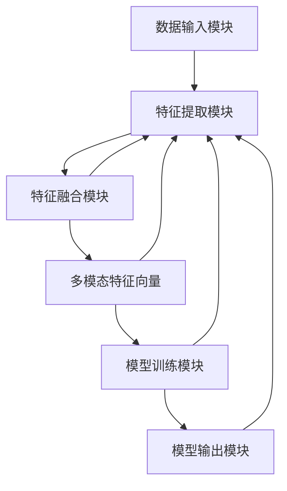
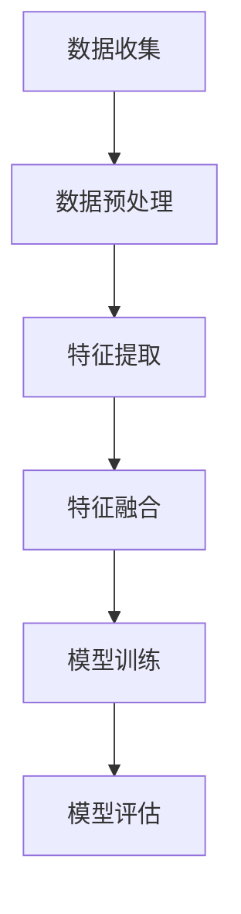
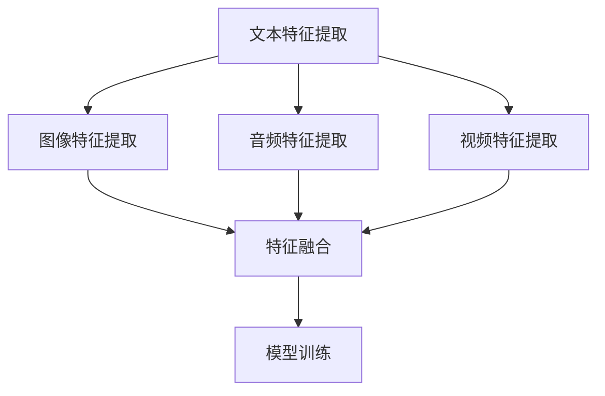
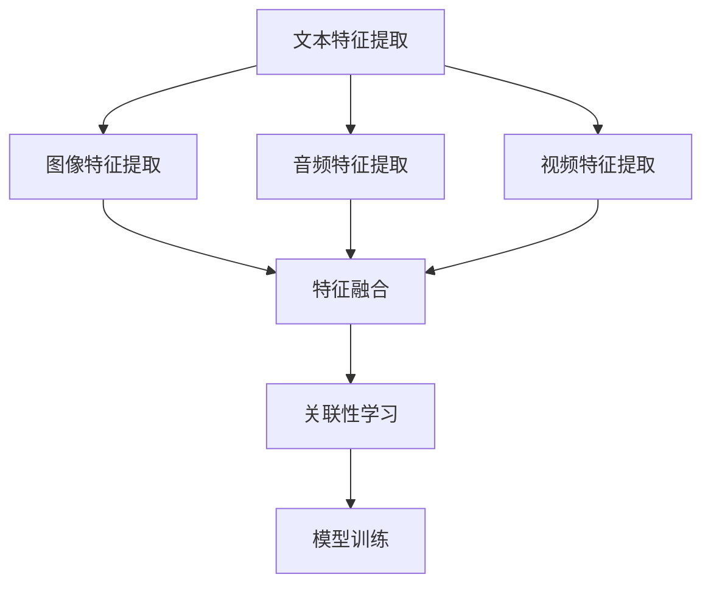
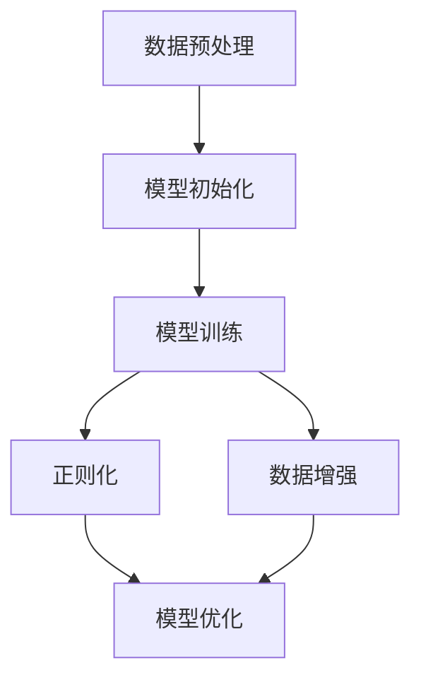

                 

### 文章标题

《多模态大模型：技术原理与实战 用多模态大模型打造AI助理实战》

### 文章关键词

多模态大模型、AI助理、自然语言处理、计算机视觉、特征提取、关联性学习、模型训练、评估与测试、实战案例

### 文章摘要

本文将深入探讨多模态大模型的技术原理与实战应用。首先，我们将介绍多模态大模型的基本概念、架构、工作原理及其应用场景。接着，我们将详细讲解多模态大模型的核心算法原理，包括特征提取算法、关联性学习算法和模型优化方法。然后，我们将通过实际项目案例，展示如何使用多模态大模型打造AI助理。最后，我们将展望多模态大模型的未来发展趋势和面临的挑战。

---

## 第一部分: 多模态大模型概述与技术基础

### 1.1 多模态大模型的基本概念

#### 1.1.1 什么是多模态大模型

多模态大模型是一种能够同时处理和融合多种数据模态（如文本、图像、音频和视频）的人工智能模型。这些模型通过结合不同模态的数据，能够更全面、准确地理解和生成信息。相比于传统单模态模型，多模态大模型在处理复杂任务时具有显著的优势。

#### 1.1.2 多模态大模型的关键技术

多模态大模型的关键技术包括：

1. **多模态数据处理流程**：如何有效地收集、存储和预处理来自不同模态的数据。
2. **多模态信息融合策略**：如何将不同模态的数据进行有效的融合，以提升模型性能。
3. **多模态大模型的网络结构**：如何设计能够同时处理多种模态数据的神经网络架构。

#### 1.1.3 多模态大模型与传统AI的区别

传统AI模型通常只能处理单一模态的数据，例如文本或图像。而多模态大模型则能够同时处理和融合多种模态的数据，从而在复杂任务中表现更为出色。此外，多模态大模型还需要解决如何处理不同模态之间的不一致性和相互依赖关系。

---

### 1.2 多模态大模型的架构

#### 1.2.1 多模态数据处理流程

多模态数据处理流程通常包括以下步骤：

1. **数据收集**：从不同来源收集文本、图像、音频和视频等数据。
2. **数据预处理**：对收集到的数据进行清洗、去噪和标准化等处理。
3. **特征提取**：对预处理后的数据进行特征提取，以生成适合模型训练的输入数据。

#### 1.2.2 多模态信息融合策略

多模态信息融合策略可以分为并行融合和序贯融合两种：

1. **并行融合**：将不同模态的数据同时输入到模型中，通过共享层进行信息融合。
2. **序贯融合**：先将不同模态的数据分别输入到模型中，然后在后续的层中进行信息融合。

#### 1.2.3 多模态大模型的网络结构

多模态大模型的网络结构通常采用深度学习架构，例如卷积神经网络（CNN）和循环神经网络（RNN）的组合。通过设计适当的网络结构，可以实现高效的多模态信息处理和融合。

---

### 1.3 多模态大模型的工作原理

#### 1.3.1 多模态特征提取与表示

多模态特征提取与表示是构建多模态大模型的重要基础。常用的特征提取方法包括：

1. **文本特征提取**：如词嵌入、TF-IDF等。
2. **图像特征提取**：如卷积神经网络（CNN）提取的视觉特征。
3. **音频特征提取**：如梅尔频率倒谱系数（MFCC）。

通过特征提取，可以将不同模态的数据转换为统一的特征表示，便于后续的模型训练和优化。

#### 1.3.2 多模态关联性学习

多模态关联性学习是构建多模态大模型的核心技术之一。常用的关联性学习方法包括：

1. **图神经网络（GNN）**：通过图结构来建模不同模态之间的关系。
2. **对抗性训练**：通过生成对抗网络（GAN）等方式，增强模型对不同模态数据的一致性。

#### 1.3.3 多模态大模型的训练与优化

多模态大模型的训练与优化过程通常包括以下步骤：

1. **数据预处理**：对收集到的数据进行清洗、去噪和标准化等处理。
2. **模型初始化**：初始化模型参数。
3. **模型训练**：使用训练数据对模型进行迭代训练，优化模型参数。
4. **模型评估**：使用测试数据对模型进行评估，调整模型参数。

---

### 1.4 多模态大模型的应用场景

#### 1.4.1 多模态大模型在自然语言处理中的应用

多模态大模型在自然语言处理（NLP）领域具有广泛的应用，如文本分类、机器翻译和情感分析等。通过结合文本和其他模态的数据，可以显著提升模型的性能。

#### 1.4.2 多模态大模型在计算机视觉中的应用

多模态大模型在计算机视觉（CV）领域也有广泛的应用，如图像识别、目标检测和视频分析等。通过结合图像和其他模态的数据，可以更好地理解图像内容和上下文信息。

#### 1.4.3 多模态大模型在其他领域的应用

除了NLP和CV领域，多模态大模型还在其他领域具有广泛的应用，如智能客服、智能教育和医疗诊断等。通过结合多种模态的数据，可以更全面地理解和解决复杂问题。

---

### 1.5 多模态大模型的发展趋势

#### 1.5.1 当前多模态大模型的研究热点

当前多模态大模型的研究热点包括：

1. **新的模态类型**：如手势、动作和三维信息等。
2. **跨学科融合**：如与心理学、语言学和哲学等领域的融合。

#### 1.5.2 未来多模态大模型的发展方向

未来多模态大模型的发展方向包括：

1. **大模型与小模型的协同**：通过组合大模型和小模型，实现更高效的模型训练和优化。
2. **多模态数据的自动化处理**：通过自动化工具和算法，实现高效的多模态数据处理和融合。

---

## 第一部分总结

在第一部分中，我们介绍了多模态大模型的基本概念、架构、工作原理和应用场景。通过理解多模态大模型的技术原理，我们能够更好地把握其发展趋势和应用方向。在接下来的部分中，我们将深入探讨多模态大模型的核心算法原理，并展示如何通过实际项目案例来打造AI助理。让我们一起探索多模态大模型的神奇世界！
---

### 1.1 多模态大模型的基本概念

#### 1.1.1 什么是多模态大模型

多模态大模型是一种集成多种数据模态（如文本、图像、音频、视频等）的人工智能模型。它通过融合不同模态的数据，使得模型在处理复杂任务时能够更加全面和准确。相比于传统的单模态模型，多模态大模型在理解和生成信息方面具有显著优势。

**核心概念原理与架构**

多模态大模型的架构通常包括以下几个关键组成部分：

1. **数据输入模块**：负责接收来自不同模态的数据，如文本、图像、音频和视频等。
2. **特征提取模块**：对每个模态的数据进行特征提取，生成相应的特征向量。
3. **特征融合模块**：将不同模态的特征向量进行融合，形成统一的多模态特征向量。
4. **模型训练模块**：使用多模态特征向量进行模型训练，优化模型参数。
5. **模型输出模块**：根据模型训练的结果，生成对应的预测输出。

**Mermaid 流程图**



#### 1.1.2 多模态大模型的关键技术

多模态大模型的关键技术包括以下几个方面：

1. **多模态数据处理流程**：包括数据收集、预处理、特征提取和融合等步骤。数据预处理是关键的一步，它需要解决数据不一致性和噪声问题，以便后续的特征提取和模型训练。
2. **多模态信息融合策略**：如何将不同模态的数据进行有效融合，是提升模型性能的关键。常见的融合策略包括并行融合、序贯融合和融合层等。
3. **多模态大模型的网络结构**：设计一个能够同时处理多种模态数据的神经网络架构，是构建多模态大模型的基础。常见的网络结构包括卷积神经网络（CNN）、循环神经网络（RNN）和变压器（Transformer）等。

**核心概念联系**

多模态大模型的核心概念包括：

1. **多模态数据**：指多种不同类型的数据，如文本、图像、音频和视频等。
2. **特征提取**：指从多模态数据中提取有意义的特征向量。
3. **信息融合**：指将不同模态的特征向量进行融合，形成统一的多模态特征向量。
4. **模型训练**：指使用多模态特征向量进行模型训练，优化模型参数。
5. **模型输出**：指根据模型训练的结果，生成对应的预测输出。

这些概念相互关联，构成了多模态大模型的技术基础。通过这些核心概念，我们可以更深入地理解多模态大模型的工作原理和优势。

#### 1.1.3 多模态大模型与传统AI的区别

多模态大模型与传统AI模型的主要区别在于其处理数据的模态多样性：

1. **数据模态**：传统AI模型通常只能处理单一模态的数据，如文本或图像。而多模态大模型则能够同时处理和融合多种模态的数据，如文本、图像、音频和视频等。
2. **理解深度**：多模态大模型能够融合不同模态的数据，从而更全面地理解信息。这使得多模态大模型在处理复杂任务时，比单模态模型具有更高的准确性和鲁棒性。
3. **处理复杂度**：多模态大模型需要同时处理多种模态的数据，这增加了模型的复杂度。但是，通过高效的算法设计和模型结构，可以有效地降低模型的处理复杂度。

**多模态大模型与传统AI的比较表**

| 特性       | 多模态大模型               | 传统AI                     |
|------------|---------------------------|---------------------------|
| 数据模态   | 多种模态的数据（文本、图像、音频、视频） | 单一模态的数据（文本、图像等） |
| 理解深度   | 更全面地理解信息           | 对单一模态的数据有较深的理解 |
| 处理复杂度 | 较高                       | 较低                       |

通过比较，我们可以看到多模态大模型在数据模态、理解和处理复杂度等方面与传统AI模型存在显著差异。这些差异使得多模态大模型在处理复杂任务时具有更高的优势。

---

### 1.2 多模态大模型的架构

#### 1.2.1 多模态数据处理流程

多模态数据处理流程是构建多模态大模型的基础。它通常包括以下几个关键步骤：

1. **数据收集**：从不同的来源收集多种模态的数据，如文本、图像、音频和视频等。这些数据可以来自公开数据集、自有数据集或第三方数据提供商。
2. **数据预处理**：对收集到的数据进行预处理，包括数据清洗、去噪、标准化等操作。数据清洗的目的是去除无效数据、异常值和噪声，以提高数据质量。数据标准化是将数据转换到统一的尺度，以便后续的特征提取和模型训练。
3. **特征提取**：对预处理后的数据进行特征提取，生成每个模态的特征向量。特征提取是构建多模态大模型的关键步骤，它需要根据不同模态的数据特点选择合适的特征提取方法。例如，对于文本数据，可以使用词嵌入、TF-IDF等方法；对于图像数据，可以使用卷积神经网络（CNN）提取视觉特征；对于音频数据，可以使用梅尔频率倒谱系数（MFCC）等方法。
4. **特征融合**：将不同模态的特征向量进行融合，形成统一的多模态特征向量。特征融合的方法有多种，包括并行融合、序贯融合和融合层等。并行融合是将不同模态的特征向量直接拼接，而序贯融合则是先对每个模态的特征进行处理，再进行融合。融合层则是将不同模态的特征分别输入到独立的神经网络层中，然后在后续的层中进行融合。
5. **模型训练**：使用融合后的多模态特征向量进行模型训练。训练过程中，需要选择合适的训练策略，如数据增强、正则化等，以避免过拟合和优化模型性能。
6. **模型评估**：使用测试数据对训练好的模型进行评估，根据评估结果调整模型参数，优化模型性能。

**Mermaid 流程图**



#### 1.2.2 多模态信息融合策略

多模态信息融合策略是构建多模态大模型的关键技术之一。它决定了如何将不同模态的数据进行有效融合，以提升模型性能。常见的信息融合策略包括以下几种：

1. **并行融合**：并行融合是将不同模态的数据同时输入到模型中，通过共享层进行信息融合。这种方法适用于模态数据之间具有较强相关性的情况。在并行融合中，不同的模态数据通过独立的路径进行特征提取和融合，然后在共享层中进行融合。这种方法的优点是实现简单，缺点是可能无法充分利用不同模态之间的交互信息。
2. **序贯融合**：序贯融合是先对每个模态的数据进行特征提取和融合，然后将融合后的特征作为输入传递给下一个模态的特征提取模块。这种方法适用于模态数据之间存在时间或空间顺序的情况。在序贯融合中，不同模态的数据依次输入到模型中，每个模态的特征向量在后续的层中与前一层的特征进行融合。这种方法的优点是能够充分利用不同模态之间的时序关系，缺点是实现相对复杂。
3. **融合层**：融合层是在神经网络中添加一层或多层专门用于融合不同模态数据的模块。融合层可以根据不同模态的特征向量设计不同的融合方式，如拼接、加权平均、融合层等。这种方法适用于需要同时处理多种模态数据的情况，如多模态语音识别、视频理解等。融合层可以有效地提高模型对不同模态数据的理解和融合能力。

**多模态信息融合策略比较表**

| 策略       | 并行融合       | 序贯融合       | 融合层         |
|------------|----------------|----------------|----------------|
| 适用场景   | 模态相关性高   | 模态有时间顺序 | 多种模态数据   |
| 优点       | 实现简单       | 利用时序关系   | 提高融合能力   |
| 缺点       | 交互信息不足   | 实现复杂       | 需要额外设计   |

在实际应用中，可以根据具体任务和数据特点选择合适的融合策略。例如，在多模态语音识别任务中，可以采用并行融合策略，而在视频理解任务中，可以采用序贯融合策略。

#### 1.2.3 多模态大模型的网络结构

多模态大模型的网络结构是构建多模态大模型的核心。常见的网络结构包括卷积神经网络（CNN）、循环神经网络（RNN）和变压器（Transformer）等。以下是一些常见的多模态大模型网络结构：

1. **卷积神经网络（CNN）**：CNN是一种适用于图像处理和计算机视觉的深度学习模型。CNN通过卷积层提取图像特征，并通过池化层减少数据维度。在多模态大模型中，CNN可以用于提取图像特征，并将这些特征与其他模态的特征进行融合。例如，在视频理解任务中，可以使用CNN提取视频帧的特征，然后与文本特征和音频特征进行融合。
2. **循环神经网络（RNN）**：RNN是一种适用于序列数据处理的神经网络模型。RNN通过循环连接实现序列数据的时序处理能力，可以捕捉序列中的时间依赖关系。在多模态大模型中，RNN可以用于处理多模态数据的序列信息，如文本序列、音频序列和视频序列等。例如，在多模态语音识别任务中，可以使用RNN处理文本序列和音频序列，以提取序列中的时间依赖关系。
3. **变压器（Transformer）**：Transformer是一种基于自注意力机制的深度学习模型。Transformer通过多头自注意力机制和前馈网络实现序列数据的建模。在多模态大模型中，Transformer可以用于处理多种模态的数据，并通过自注意力机制实现模态之间的交互。例如，在多模态文本生成任务中，可以使用Transformer将文本特征和图像特征进行融合，并生成相应的文本描述。
4. **多任务学习网络**：多任务学习网络是一种同时处理多种任务的神经网络模型。在多模态大模型中，多任务学习网络可以同时处理多种模态的数据，并通过共享网络结构和参数提高模型性能。例如，在多模态情感分析任务中，可以使用多任务学习网络同时分析文本情感、图像情感和音频情感，以提高整体情感分析的准确度。

**多模态大模型网络结构比较表**

| 网络结构  | 优点             | 缺点               |
|-----------|-----------------|--------------------|
| CNN       | 适用于图像处理   | 不擅长处理序列数据 |
| RNN       | 适用于序列数据   | 计算复杂度高       |
| Transformer | 自注意力机制强大 | 需要大量训练数据   |
| 多任务学习网络 | 提高模型性能     | 需要共享参数       |

在实际应用中，可以根据具体任务和数据特点选择合适的网络结构。例如，在图像识别任务中，可以使用CNN提取图像特征；在序列数据处理任务中，可以使用RNN或Transformer；在多任务学习任务中，可以使用多任务学习网络。

---

### 1.3 多模态大模型的工作原理

#### 1.3.1 多模态特征提取与表示

多模态特征提取与表示是构建多模态大模型的核心步骤。通过对不同模态的数据进行特征提取和表示，可以生成适合模型训练的输入数据。以下是几种常见的多模态特征提取与表示方法：

1. **文本特征提取**：文本特征提取是将自然语言文本转换为计算机可处理的数字特征表示。常见的文本特征提取方法包括：
   - **词嵌入（Word Embedding）**：将文本中的每个词映射为低维向量表示。词嵌入通过神经网络学习词的语义关系，可以有效提高文本表示的语义丰富度。
   - **TF-IDF（Term Frequency-Inverse Document Frequency）**：基于词频和逆文档频率计算文本的特征向量。TF-IDF可以强调重要词的出现频率和文档分布，有助于提高文本特征的重要性。
   - **BERT（Bidirectional Encoder Representations from Transformers）**：BERT是一种基于Transformer的预训练模型，通过双向编码器生成文本的表示。BERT可以捕捉文本的上下文信息，提高文本特征的表示能力。

2. **图像特征提取**：图像特征提取是将图像数据转换为计算机可处理的数字特征表示。常见的图像特征提取方法包括：
   - **卷积神经网络（CNN）**：CNN是一种用于图像处理的深度学习模型，通过卷积层和池化层提取图像的特征。CNN可以自动学习图像的层次特征，如边缘、纹理和形状等。
   - **预训练模型**：如ResNet、VGG等。这些预训练模型已经在大规模图像数据集上进行了训练，可以通过迁移学习将预训练的模型应用于新的图像任务中。

3. **音频特征提取**：音频特征提取是将音频数据转换为计算机可处理的数字特征表示。常见的音频特征提取方法包括：
   - **梅尔频率倒谱系数（MFCC）**：MFCC是一种常用的音频特征表示方法，它通过计算音频信号的频谱特征，生成一系列的倒谱系数，可以有效表示音频的音色和音调信息。
   - **音素特征**：音素特征是对音频信号进行音素分割，然后对每个音素进行特征提取。音素特征可以捕捉音频的语音信息，有助于语音识别和语音合成任务。

4. **视频特征提取**：视频特征提取是将视频数据转换为计算机可处理的数字特征表示。常见的视频特征提取方法包括：
   - **视频帧特征提取**：通过对视频帧进行图像特征提取，生成视频帧的特征向量。视频帧特征可以用于视频分类和目标检测等任务。
   - **视频流特征提取**：通过对视频流进行时序特征提取，生成视频流的特征向量。视频流特征可以用于视频生成和视频增强等任务。

**多模态特征提取与表示流程图**



通过多模态特征提取与表示，可以将不同模态的数据转换为统一的特征向量，为后续的模型训练和优化提供输入。

#### 1.3.2 多模态关联性学习

多模态关联性学习是构建多模态大模型的关键技术之一。它通过学习不同模态之间的关联性，使得模型能够更好地理解和生成多模态信息。以下是几种常见的多模态关联性学习方法：

1. **图神经网络（GNN）**：图神经网络是一种基于图结构学习的神经网络模型，它可以有效地捕捉和处理图结构数据。在多模态关联性学习中，可以将不同模态的数据表示为节点，并将它们之间的关联关系表示为边，从而构建一个多模态图。通过训练图神经网络，可以学习到不同模态之间的关联性，并将其应用于模型预测和生成任务。

2. **对抗性训练**：对抗性训练是一种基于生成对抗网络（GAN）的训练方法，它可以有效地学习到数据的分布和生成能力。在多模态关联性学习中，可以使用对抗性训练来生成虚拟的多模态数据，并通过训练模型来学习不同模态之间的关联性。对抗性训练可以增强模型对不同模态数据的一致性，提高模型在多模态任务中的性能。

3. **多模态融合策略**：多模态融合策略是通过将不同模态的数据进行融合，以提升模型性能。常见的多模态融合策略包括：
   - **并行融合**：将不同模态的数据同时输入到模型中，通过共享层进行信息融合。
   - **序贯融合**：先对每个模态的数据进行特征提取和融合，然后将融合后的特征作为输入传递给下一个模态的特征提取模块。
   - **融合层**：在神经网络中添加一层或多层专门用于融合不同模态数据的模块。

**多模态关联性学习流程图**



通过多模态关联性学习，可以增强模型对不同模态数据的理解和融合能力，从而提升模型在多模态任务中的性能。

#### 1.3.3 多模态大模型的训练与优化

多模态大模型的训练与优化是构建高效多模态大模型的关键步骤。以下是几种常见的多模态大模型训练与优化方法：

1. **数据预处理**：数据预处理是模型训练前的关键步骤，它包括数据清洗、去噪、标准化等操作。有效的数据预处理可以提高数据质量，减少噪声和异常值对模型训练的影响。

2. **模型初始化**：模型初始化是指初始化模型参数。合理的模型初始化可以加速模型收敛，提高模型性能。常用的初始化方法包括随机初始化、高斯初始化和Xavier初始化等。

3. **模型训练策略**：
   - **梯度下降法**：梯度下降法是一种常用的优化算法，它通过不断调整模型参数，使得损失函数逐渐减小。梯度下降法包括随机梯度下降（SGD）、批量梯度下降（BGD）和Adam优化器等。
   - **正则化**：正则化是一种防止模型过拟合的技术，它通过在损失函数中加入正则化项，限制模型复杂度。常见正则化方法包括L1正则化、L2正则化和Dropout等。
   - **数据增强**：数据增强是一种增加训练数据多样性的技术，它通过变换、旋转、缩放等操作，生成新的训练样本。数据增强可以提高模型的泛化能力，减少过拟合。

4. **模型优化方法**：
   - **模型剪枝**：模型剪枝是一种通过移除模型中冗余的权重来减少模型复杂度的技术。剪枝后的模型具有更少的参数，从而降低计算成本和内存消耗。
   - **知识蒸馏**：知识蒸馏是一种将大模型的丰富知识传递给小模型的技术。通过将大模型的输出作为小模型的软目标，可以有效提高小模型的性能。

**多模态大模型训练与优化流程图**



通过合理的训练与优化方法，可以构建高效的多模态大模型，提高模型在多模态任务中的性能。

---

### 1.4 多模态大模型的应用场景

#### 1.4.1 多模态大模型在自然语言处理中的应用

多模态大模型在自然语言处理（NLP）领域具有广泛的应用，它可以同时处理文本和其他模态的数据，从而提高NLP任务的性能。以下是一些典型的应用场景：

1. **文本分类**：多模态大模型可以将文本与其他模态的数据（如图像、音频等）进行融合，从而提高文本分类的准确性。例如，在情感分析任务中，可以将文本情感与图像情感进行融合，从而更好地判断文本的情感倾向。

2. **机器翻译**：多模态大模型可以结合文本和语音数据，提高机器翻译的准确性和流畅性。例如，在语音翻译任务中，可以将语音信号与文本翻译结果进行融合，从而更好地理解语音含义和翻译准确性。

3. **问答系统**：多模态大模型可以结合文本和图像数据，提高问答系统的回答质量。例如，在图像问答任务中，可以将文本问题和图像特征进行融合，从而更好地理解问题意图并给出准确回答。

**应用实例：多模态情感分析**

多模态情感分析是一个典型的NLP任务，它通过结合文本、图像和音频等多种模态的数据，对情感进行更准确的分析。以下是一个简化的多模态情感分析流程：

1. **数据收集**：收集包含文本、图像和音频的多模态数据，例如社交媒体评论、相关图像和语音注释。
2. **数据预处理**：对收集到的多模态数据进行预处理，包括文本清洗、图像增强、音频降噪等操作。
3. **特征提取**：对预处理后的数据进行特征提取，例如文本使用BERT模型提取文本特征，图像使用CNN提取图像特征，音频使用MFCC提取音频特征。
4. **特征融合**：将不同模态的特征进行融合，可以使用并行融合策略，将文本特征、图像特征和音频特征拼接在一起，形成统一的多模态特征向量。
5. **模型训练**：使用融合后的多模态特征向量训练情感分析模型，例如使用神经网络进行分类任务。
6. **模型评估**：使用测试数据对训练好的模型进行评估，通过准确率、召回率和F1值等指标评估模型性能。

**应用实例：多模态机器翻译**

多模态机器翻译是另一个典型的应用场景，它通过结合文本和语音数据，提高翻译的准确性和流畅性。以下是一个简化的多模态机器翻译流程：

1. **数据收集**：收集包含文本和语音的多模态数据，例如双语对话数据集。
2. **数据预处理**：对收集到的多模态数据进行预处理，包括文本清洗、语音增强等操作。
3. **特征提取**：对预处理后的数据进行特征提取，例如文本使用BERT模型提取文本特征，语音使用RNN或Transformer提取语音特征。
4. **特征融合**：将文本特征和语音特征进行融合，可以使用并行融合策略，将两种特征拼接在一起，形成统一的多模态特征向量。
5. **模型训练**：使用融合后的多模态特征向量训练机器翻译模型，例如使用Transformer进行序列到序列的翻译任务。
6. **模型评估**：使用测试数据对训练好的模型进行评估，通过BLEU分数、词汇匹配率等指标评估模型性能。

#### 1.4.2 多模态大模型在计算机视觉中的应用

多模态大模型在计算机视觉（CV）领域也有广泛的应用，它可以通过结合图像和其他模态的数据，提高视觉任务的性能。以下是一些典型的应用场景：

1. **图像识别**：多模态大模型可以将图像与其他模态的数据（如文本、音频等）进行融合，从而提高图像识别的准确性。例如，在图像分类任务中，可以将图像特征与文本描述进行融合，从而更好地分类图像。

2. **目标检测**：多模态大模型可以结合图像和其他模态的数据，提高目标检测的准确性和鲁棒性。例如，在自动驾驶中，可以将图像特征与雷达数据、激光数据等融合，从而更准确地检测道路上的车辆和行人。

3. **视频分析**：多模态大模型可以结合视频数据和其他模态的数据（如音频、文本等），提高视频分析的准确性和丰富性。例如，在视频监控中，可以将视频特征与音频特征进行融合，从而更好地识别异常行为。

**应用实例：多模态图像识别**

多模态图像识别是一个典型的计算机视觉任务，它通过结合图像和文本数据进行识别，提高识别的准确性。以下是一个简化的多模态图像识别流程：

1. **数据收集**：收集包含图像和文本标签的多模态数据，例如带有描述标签的图像数据集。
2. **数据预处理**：对收集到的多模态数据进行预处理，包括图像增强、文本清洗等操作。
3. **特征提取**：对预处理后的数据进行特征提取，例如图像使用CNN提取图像特征，文本使用BERT提取文本特征。
4. **特征融合**：将图像特征和文本特征进行融合，可以使用并行融合策略，将两种特征拼接在一起，形成统一的多模态特征向量。
5. **模型训练**：使用融合后的多模态特征向量训练图像识别模型，例如使用卷积神经网络进行分类任务。
6. **模型评估**：使用测试数据对训练好的模型进行评估，通过准确率、召回率等指标评估模型性能。

**应用实例：多模态目标检测**

多模态目标检测是一个典型的计算机视觉任务，它通过结合图像和雷达数据、激光数据等，提高目标检测的准确性和鲁棒性。以下是一个简化的多模态目标检测流程：

1. **数据收集**：收集包含图像、雷达数据和激光数据的多模态数据，例如自动驾驶数据集。
2. **数据预处理**：对收集到的多模态数据进行预处理，包括图像增强、雷达数据滤波、激光数据对齐等操作。
3. **特征提取**：对预处理后的数据进行特征提取，例如图像使用CNN提取图像特征，雷达数据使用卷积神经网络提取雷达特征，激光数据使用神经网络提取激光特征。
4. **特征融合**：将图像特征、雷达特征和激光特征进行融合，可以使用并行融合策略，将三种特征拼接在一起，形成统一的多模态特征向量。
5. **模型训练**：使用融合后的多模态特征向量训练目标检测模型，例如使用卷积神经网络进行目标检测任务。
6. **模型评估**：使用测试数据对训练好的模型进行评估，通过准确率、召回率等指标评估模型性能。

#### 1.4.3 多模态大模型在其他领域的应用

除了NLP和CV领域，多模态大模型还在其他领域具有广泛的应用，如智能客服、智能教育和医疗诊断等。以下是一些典型的应用场景：

1. **智能客服**：多模态大模型可以同时处理用户输入的文本、语音和图像等数据，从而提供更准确、更个性化的客服服务。例如，在智能客服系统中，可以将用户的问题描述、语音和表情图像进行融合，从而更好地理解用户意图，提供相应的回答。

2. **智能教育**：多模态大模型可以结合文本、图像和视频等多模态数据，为学生提供更丰富、更互动的学习体验。例如，在智能教育系统中，可以将学习材料、学生的反馈和音频讲解进行融合，从而更好地指导学生的学习。

3. **医疗诊断**：多模态大模型可以结合医学图像、病历数据和患者语音等多模态数据，提供更准确、更全面的医疗诊断。例如，在医学影像诊断中，可以将CT图像、MRI图像和病理报告进行融合，从而提高疾病诊断的准确性。

**应用实例：智能客服系统**

智能客服系统是一个典型的应用场景，它通过多模态大模型提供更准确、更个性化的客服服务。以下是一个简化的智能客服系统流程：

1. **用户输入**：用户可以通过文本、语音和图像等多种方式与智能客服进行交互。
2. **数据收集**：收集用户的输入数据，例如文本问题、语音问题和表情图像等。
3. **数据预处理**：对收集到的数据进行预处理，包括文本清洗、语音增强和图像增强等操作。
4. **特征提取**：对预处理后的数据进行特征提取，例如文本使用BERT提取文本特征，语音使用RNN提取语音特征，图像使用CNN提取图像特征。
5. **特征融合**：将不同模态的特征进行融合，可以使用并行融合策略，将三种特征拼接在一起，形成统一的多模态特征向量。
6. **模型训练**：使用融合后的多模态特征向量训练智能客服模型，例如使用卷积神经网络进行分类和回复生成任务。
7. **模型评估**：使用测试数据对训练好的模型进行评估，通过准确率、召回率等指标评估模型性能。
8. **客服交互**：根据模型预测结果，生成对应的客服回答，并通过文本、语音和图像等多种方式与用户进行交互。

**应用实例：智能教育系统**

智能教育系统是一个典型的应用场景，它通过多模态大模型为学生提供更丰富、更互动的学习体验。以下是一个简化的智能教育系统流程：

1. **课程内容**：收集课程内容，包括文本材料、图像和视频等。
2. **学生输入**：学生可以通过文本、语音和图像等方式与智能教育系统进行互动。
3. **数据收集**：收集学生的输入数据，例如文本问题、语音问题和表情图像等。
4. **数据预处理**：对收集到的数据进行预处理，包括文本清洗、语音增强和图像增强等操作。
5. **特征提取**：对预处理后的数据进行特征提取，例如文本使用BERT提取文本特征，语音使用RNN提取语音特征，图像使用CNN提取图像特征。
6. **特征融合**：将不同模态的特征进行融合，可以使用并行融合策略，将三种特征拼接在一起，形成统一的多模态特征向量。
7. **模型训练**：使用融合后的多模态特征向量训练智能教育模型，例如使用卷积神经网络进行内容理解任务，使用RNN进行语音识别任务，使用Transformer进行文本生成任务。
8. **模型评估**：使用测试数据对训练好的模型进行评估，通过准确率、召回率等指标评估模型性能。
9. **学生互动**：根据模型预测结果，生成对应的教学内容和反馈，并通过文本、语音和图像等方式与学生学习进行互动。

**应用实例：医疗诊断系统**

医疗诊断系统是一个典型的应用场景，它通过多模态大模型提供更准确、更全面的医疗诊断。以下是一个简化的医疗诊断系统流程：

1. **患者数据**：收集患者的多模态数据，包括医学图像、病历数据和患者语音等。
2. **数据收集**：收集患者的医学图像、病历数据和语音数据。
3. **数据预处理**：对收集到的数据进行预处理，包括医学图像增强、病历数据清洗和语音降噪等操作。
4. **特征提取**：对预处理后的数据进行特征提取，例如医学图像使用CNN提取图像特征，病历数据使用自然语言处理技术提取文本特征，患者语音使用RNN提取语音特征。
5. **特征融合**：将不同模态的特征进行融合，可以使用并行融合策略，将三种特征拼接在一起，形成统一的多模态特征向量。
6. **模型训练**：使用融合后的多模态特征向量训练医疗诊断模型，例如使用卷积神经网络进行图像分类任务，使用Transformer进行文本分类任务，使用RNN进行语音识别任务。
7. **模型评估**：使用测试数据对训练好的模型进行评估，通过准确率、召回率等指标评估模型性能。
8. **医疗诊断**：根据模型预测结果，生成对应的医疗诊断结果，并通过文本、语音和图像等方式与医生进行交互。

---

### 1.5 多模态大模型的发展趋势

#### 1.5.1 当前多模态大模型的研究热点

当前多模态大模型的研究热点主要集中在以下几个方面：

1. **新的模态类型**：随着技术的不断发展，新的模态类型不断涌现，如三维数据、手势数据、动作数据等。如何有效地处理和融合这些新模态的数据是多模态大模型研究的重要方向。

2. **跨学科融合**：多模态大模型的研究正在与心理学、语言学、哲学等学科进行深度融合。通过跨学科的合作，可以进一步提升多模态大模型在理解和生成信息方面的能力。

3. **数据高效利用**：如何在有限的训练数据条件下，高效地利用多模态数据进行模型训练和优化，是当前研究的一个重点。这包括数据增强、数据蒸馏、迁移学习等技术的研究。

4. **模型压缩与部署**：随着多模态大模型规模的不断增大，如何在保证模型性能的前提下，实现模型压缩和高效部署，是一个亟待解决的问题。

#### 1.5.2 未来多模态大模型的发展方向

未来多模态大模型的发展方向主要包括以下几个方面：

1. **模型融合与协同**：未来多模态大模型的发展将更加注重不同模态之间的融合与协同。通过设计更加灵活的融合策略，可以实现多模态数据的深度融合，提升模型的性能。

2. **小模型与大模型的协同**：小模型与大模型的协同将是一种趋势。通过将大模型的知识传递给小模型，可以实现更高效、更灵活的模型训练和部署。

3. **自动化数据处理**：随着技术的进步，自动化数据处理将成为多模态大模型的一个重要发展方向。通过自动化工具和算法，可以实现多模态数据的自动收集、预处理、特征提取和融合等操作，降低模型训练的门槛。

4. **多模态交互与生成**：未来多模态大模型将更加注重多模态交互与生成能力。通过设计更加智能的交互机制，可以实现多模态数据的实时交互和动态生成，提升人机交互的体验。

---

## 第一部分总结

在第一部分中，我们系统地介绍了多模态大模型的基本概念、架构、工作原理和应用场景。通过理解多模态大模型的技术原理，我们可以更好地把握其发展趋势和应用方向。在接下来的部分中，我们将深入探讨多模态大模型的核心算法原理，并展示如何通过实际项目案例来打造AI助理。让我们继续探索多模态大模型的神奇世界！
---

## 第二部分：多模态大模型的核心算法原理

在第一部分中，我们了解了多模态大模型的基本概念、架构和工作原理。本部分将深入探讨多模态大模型的核心算法原理，包括多模态特征提取算法、多模态关联性学习算法以及多模态大模型的训练与优化方法。通过这些核心算法原理的讲解，我们将更全面地理解多模态大模型的构建和优化过程。

### 2.1 多模态特征提取算法

多模态特征提取是构建多模态大模型的关键步骤。不同模态的数据具有不同的特点和结构，因此需要采用不同的特征提取方法。以下是几种常见多模态特征提取算法。

#### 2.1.1 音频特征提取

音频特征提取是将音频信号转换为计算机可处理的数字特征表示。以下是两种常见的音频特征提取方法：

1. **梅尔频率倒谱系数（MFCC）**：
   - **原理**：MFCC通过计算音频信号的频谱特征，将其转换为倒谱系数。这种方法可以有效地降低音频信号的维数，同时保留主要的音色信息。
   - **公式**：
     $$ MFCC = \sum_{i=1}^{M} \log(1 + \sum_{j=1}^{N} P_j(f_i)) $$
     其中，$M$为梅尔频率的个数，$N$为频谱的带宽，$P_j(f_i)$为频谱的加窗傅里叶变换。

2. **音素特征**：
   - **原理**：音素特征是对音频信号进行音素分割，然后对每个音素进行特征提取。这种方法可以捕捉音频的语音信息，如音节长度、音调、音强等。
   - **公式**：
     $$ \text{音素特征} = \{\text{音素1特征}, \text{音素2特征}, \ldots\} $$

#### 2.1.2 视频特征提取

视频特征提取是将视频数据转换为计算机可处理的数字特征表示。以下是两种常见的视频特征提取方法：

1. **视频帧特征提取**：
   - **原理**：视频帧特征提取是通过卷积神经网络（CNN）提取视频帧的特征。这种方法可以有效地提取视频帧的视觉特征，如边缘、纹理和形状等。
   - **公式**：
     $$ \text{视频帧特征} = \text{CNN}(\text{视频帧}) $$

2. **视频流特征提取**：
   - **原理**：视频流特征提取是通过循环神经网络（RNN）或卷积神经网络（CNN）提取视频流的特征。这种方法可以捕捉视频流的时间依赖关系，如动作序列和事件发生。
   - **公式**：
     $$ \text{视频流特征} = \text{RNN}(\text{视频流}) $$

#### 2.1.3 文本特征提取

文本特征提取是将自然语言文本转换为计算机可处理的数字特征表示。以下是两种常见的文本特征提取方法：

1. **词嵌入**：
   - **原理**：词嵌入通过将文本中的每个词映射为低维向量表示，从而捕捉词的语义信息。这种方法可以有效地提高文本特征的表示能力。
   - **公式**：
     $$ \text{词嵌入} = \text{Embedding}(\text{词}) $$

2. **词汇表构建**：
   - **原理**：词汇表构建是通过统计文本中的词汇，生成一个包含所有词汇的词汇表。这种方法可以用于后续的文本分类和情感分析等任务。
   - **公式**：
     $$ \text{词汇表} = \{\text{词汇1}, \text{词汇2}, \ldots\} $$

### 2.2 多模态关联性学习算法

多模态关联性学习是构建多模态大模型的核心步骤，它通过学习不同模态之间的关联性，提升模型对多模态数据的理解和生成能力。以下是几种常见多模态关联性学习算法。

#### 2.2.1 图神经网络（GNN）

图神经网络（GNN）是一种基于图结构学习的神经网络模型，它可以通过学习图结构中的节点和边的关系，捕捉不同模态之间的关联性。以下是GNN的基本原理：

1. **节点嵌入**：
   - **原理**：节点嵌入是将图中的每个节点映射为一个低维向量表示。这种方法可以有效地降低图的维度，同时保留节点之间的关联性。
   - **公式**：
     $$ h^i = \sigma(W_h h^i + W_e \sum_{j \in \mathcal{N}(i)} h^j + b_h) $$
     其中，$h^i$为节点$i$的嵌入向量，$\mathcal{N}(i)$为节点$i$的邻居节点集合，$W_h$、$W_e$和$b_h$分别为权重矩阵和偏置。

2. **边嵌入**：
   - **原理**：边嵌入是将图中的每条边映射为一个低维向量表示。这种方法可以捕捉边之间的关联性，从而提高模型的性能。
   - **公式**：
     $$ e_{ij} = \sigma(W_e [h^i; h^j] + b_e) $$
     其中，$e_{ij}$为边$(i, j)$的嵌入向量。

3. **多模态关联性学习**：
   - **原理**：通过将不同模态的节点和边进行嵌入，可以构建一个统一的多模态图结构。这种方法可以有效地学习到不同模态之间的关联性。
   - **公式**：
     $$ h^{i'} = \sigma(W^{i'} h^i + b^{i'}) $$
     其中，$h^{i'}$为模态$i'$的节点嵌入向量。

#### 2.2.2 对抗性训练

对抗性训练是一种基于生成对抗网络（GAN）的训练方法，它可以有效地学习到数据的分布和生成能力。在多模态关联性学习中，对抗性训练可以用于生成虚拟的多模态数据，从而增强模型对不同模态数据的一致性。以下是对抗性训练的基本原理：

1. **生成器**：
   - **原理**：生成器用于生成虚拟的多模态数据，它通过学习输入模态的数据分布，生成与真实数据相似的多模态数据。
   - **公式**：
     $$ G(z) = \text{Generator}(z) $$
     其中，$z$为生成器的输入噪声向量。

2. **判别器**：
   - **原理**：判别器用于区分真实数据和生成数据，它通过学习输入数据的分布，判断输入数据是否为真实数据。
   - **公式**：
     $$ D(x) = \text{Discriminator}(x) $$
     其中，$x$为判别器的输入数据。

3. **对抗性训练**：
   - **原理**：通过生成器和判别器的对抗性训练，可以增强模型对不同模态数据的一致性，从而提高模型在多模态任务中的性能。
   - **公式**：
     $$ \min_G \max_D \mathcal{L}(D, G) $$
     其中，$\mathcal{L}(D, G)$为生成器和判别器的损失函数。

### 2.3 多模态大模型的训练与优化

多模态大模型的训练与优化是构建高效多模态大模型的关键步骤。通过合理的训练与优化方法，可以降低模型过拟合的风险，提高模型的性能。以下是几种常见的多模态大模型训练与优化方法。

#### 2.3.1 大模型训练流程

大模型训练流程包括以下几个关键步骤：

1. **数据预处理**：
   - **原理**：数据预处理是模型训练前的关键步骤，它包括数据清洗、去噪、标准化等操作。有效的数据预处理可以提高数据质量，减少噪声和异常值对模型训练的影响。
   - **步骤**：
     - 数据清洗：去除无效数据、异常值和噪声。
     - 数据标准化：将数据转换为统一的尺度，以便后续的特征提取和模型训练。

2. **模型初始化**：
   - **原理**：模型初始化是指初始化模型参数。合理的模型初始化可以加速模型收敛，提高模型性能。
   - **方法**：
     - 随机初始化：随机初始化模型参数，这种方法简单有效，但可能收敛速度较慢。
     - 高斯初始化：将模型参数初始化为高斯分布，这种方法可以加速模型收敛，但需要调整参数分布的方差。

3. **模型训练**：
   - **原理**：模型训练是使用训练数据对模型进行迭代训练，优化模型参数。
   - **步骤**：
     - 数据加载：从训练数据集中加载数据。
     - 模型前向传播：使用训练数据计算模型损失。
     - 梯度计算：计算模型参数的梯度。
     - 模型更新：使用梯度下降法更新模型参数。

4. **模型评估**：
   - **原理**：模型评估是使用测试数据对训练好的模型进行评估，根据评估结果调整模型参数，优化模型性能。
   - **指标**：
     - 准确率（Accuracy）：正确预测的样本数占总样本数的比例。
     - 召回率（Recall）：正确预测的样本数占实际正样本数的比例。
     - F1值（F1 Score）：准确率和召回率的调和平均值。

#### 2.3.2 模型优化方法

模型优化方法包括以下几个方面：

1. **梯度下降法**：
   - **原理**：梯度下降法是一种优化算法，它通过不断调整模型参数，使得损失函数逐渐减小。
   - **公式**：
     $$ \theta = \theta - \alpha \cdot \nabla_{\theta} \mathcal{L} $$
     其中，$\theta$为模型参数，$\alpha$为学习率，$\nabla_{\theta} \mathcal{L}$为损失函数关于参数$\theta$的梯度。

2. **优化器选择**：
   - **原理**：优化器是一种用于优化模型参数的算法，它决定了参数更新的方式。
   - **常用优化器**：
     - 随机梯度下降（SGD）：通过随机选取训练样本进行参数更新。
     - 动量优化器（Momentum）：通过引入动量项，加速模型收敛。
     - Adam优化器：结合SGD和动量优化器的优点，适用于大规模深度学习模型。

3. **正则化**：
   - **原理**：正则化是一种防止模型过拟合的技术，它通过在损失函数中加入正则化项，限制模型复杂度。
   - **方法**：
     - L1正则化：在损失函数中加入L1范数。
     - L2正则化：在损失函数中加入L2范数。
     - Dropout：在神经网络中随机丢弃一部分神经元，减少模型过拟合。

4. **数据增强**：
   - **原理**：数据增强是一种增加训练数据多样性的技术，它通过变换、旋转、缩放等操作，生成新的训练样本。
   - **方法**：
     - 随机裁剪：随机裁剪图像或视频。
     - 随机旋转：随机旋转图像或视频。
     - 随机缩放：随机缩放图像或视频。

通过合理的训练与优化方法，可以构建高效的多模态大模型，提高模型在多模态任务中的性能。

---

### 2.4 多模态大模型的评估与测试

在多模态大模型的训练过程中，评估和测试模型性能是至关重要的一步。通过评估和测试，我们可以了解模型的泛化能力，发现模型存在的问题，并对其进行优化。以下是几种常见的多模态大模型评估与测试方法。

#### 2.4.1 评估指标

评估多模态大模型的性能通常需要使用多个评估指标，这些指标可以从不同角度衡量模型的性能。以下是一些常见的评估指标：

1. **准确率（Accuracy）**：
   - **原理**：准确率是指正确预测的样本数占总样本数的比例。
   - **公式**：
     $$ \text{Accuracy} = \frac{\text{正确预测的样本数}}{\text{总样本数}} $$
   - **应用场景**：适用于分类任务，能够简单直观地衡量模型的性能。

2. **召回率（Recall）**：
   - **原理**：召回率是指正确预测的正样本数占实际正样本数的比例。
   - **公式**：
     $$ \text{Recall} = \frac{\text{正确预测的正样本数}}{\text{实际正样本数}} $$
   - **应用场景**：适用于分类任务，特别关注正样本的预测性能。

3. **F1值（F1 Score）**：
   - **原理**：F1值是准确率和召回率的调和平均值，可以综合考虑模型的分类性能。
   - **公式**：
     $$ \text{F1 Score} = 2 \cdot \frac{\text{准确率} \cdot \text{召回率}}{\text{准确率} + \text{召回率}} $$
   - **应用场景**：适用于分类任务，能够平衡准确率和召回率。

4. **精确率（Precision）**：
   - **原理**：精确率是指正确预测的正样本数占预测为正样本的样本数比例。
   - **公式**：
     $$ \text{Precision} = \frac{\text{正确预测的正样本数}}{\text{预测为正样本的样本数}} $$
   - **应用场景**：适用于分类任务，关注预测为正样本的准确性。

5. **交叉验证（Cross-Validation）**：
   - **原理**：交叉验证是一种评估模型性能的方法，它通过将数据集划分为多个子集，每次使用一个子集作为测试集，其他子集作为训练集，进行多次训练和测试。
   - **公式**：
     $$ \text{交叉验证误差} = \frac{1}{k} \sum_{i=1}^{k} \text{测试误差}_i $$
     其中，$k$为交叉验证的次数，$\text{测试误差}_i$为第$i$次测试集的误差。
   - **应用场景**：适用于评估模型的泛化能力，减少过拟合和欠拟合的风险。

#### 2.4.2 测试方法

在多模态大模型的评估过程中，测试方法的选择至关重要。以下是一些常见的测试方法：

1. **自适应性测试**：
   - **原理**：自适应性测试是一种动态调整测试策略的方法，它根据模型的表现自动调整测试难度，以更好地评估模型的性能。
   - **应用场景**：适用于需要动态评估模型性能的应用场景，如在线系统监控和自适应学习。

2. **前向传播与反向传播**：
   - **原理**：前向传播是模型从输入到输出的计算过程，反向传播是利用损失函数计算梯度并更新模型参数的过程。
   - **应用场景**：适用于深度学习模型的训练和优化，能够动态调整模型参数以优化性能。

3. **模型比较测试**：
   - **原理**：模型比较测试是通过对比不同模型在相同任务上的性能，评估模型的优劣。
   - **应用场景**：适用于模型选择和优化，帮助研究人员选择最佳的模型结构。

4. **A/B测试**：
   - **原理**：A/B测试是一种将用户随机分配到不同版本的应用，比较不同版本的性能差异。
   - **应用场景**：适用于产品优化和功能迭代，通过实际用户行为数据评估新功能的性能。

通过合理选择和使用评估和测试方法，我们可以更准确地了解多模态大模型的性能，发现模型存在的问题，并对其进行优化。这有助于提高模型的可靠性和实用性，为实际应用提供更优质的服务。

---

## 第三部分：多模态大模型的项目实战

在了解了多模态大模型的技术原理和核心算法之后，本部分将通过具体的项目实战，展示如何使用多模态大模型实现AI助理。我们将从数据收集与预处理、模型设计、模型训练与优化以及模型评估等步骤，详细解析整个项目的实现过程。

### 3.1 多模态大模型在AI助理中的应用

#### 3.1.1 AI助理概述

AI助理是一种基于人工智能技术的智能系统，它能够通过自然语言处理、语音识别、图像识别等多种模态的数据处理，为用户提供个性化、高效的服务。AI助理可以应用于多个领域，如智能客服、智能助手、智能教育等。

**AI助理的功能与特点：**

- **自然语言处理（NLP）**：理解用户输入的文本，进行语义分析和情感分析，提供相应的回复。
- **语音识别**：将用户的语音输入转换为文本，实现语音交互。
- **图像识别**：识别用户的图像输入，如用户身份识别、场景识别等。
- **多模态融合**：结合文本、语音和图像等多模态数据，提供更准确的用户理解和回复。
- **个性化服务**：根据用户的历史行为和偏好，提供个性化的服务和建议。

**AI助理的架构设计：**

AI助理的架构通常包括以下几个模块：

1. **前端交互层**：提供用户与AI助理交互的接口，如文本输入框、语音输入麦克风、图像输入摄像头等。
2. **数据处理层**：接收用户输入的数据，进行数据预处理和特征提取，如文本清洗、语音增强、图像预处理等。
3. **核心算法层**：实现多模态大模型的训练和推理，包括自然语言处理、语音识别、图像识别等算法。
4. **后端服务层**：处理用户请求，提供个性化服务，如知识库查询、智能推荐等。
5. **数据存储层**：存储用户数据、模型参数和历史交互记录，如数据库、缓存等。

#### 3.1.2 实现步骤

**步骤1：数据收集与预处理**

数据收集是构建AI助理的第一步。我们需要从不同的来源收集多种模态的数据，如文本、语音、图像等。以下是一个简化的数据收集与预处理流程：

1. **数据收集**：从公开数据集、自有数据集和第三方数据提供商等渠道收集文本、语音、图像等数据。
2. **数据清洗**：去除无效数据、异常值和噪声，确保数据质量。对于文本数据，需要去除停用词、标点符号等；对于语音数据，需要去除噪声、填充静音段；对于图像数据，需要去除模糊、缺失的图像。
3. **数据标注**：对于语音和图像数据，需要进行标注，如语音标注为文字，图像标注为目标物体等。数据标注可以手动完成，也可以使用自动标注工具。
4. **数据预处理**：对收集到的数据进行特征提取，如文本使用词嵌入、图像使用卷积神经网络提取视觉特征、语音使用梅尔频率倒谱系数（MFCC）提取音频特征等。

**步骤2：多模态大模型训练**

多模态大模型的训练是构建AI助理的核心步骤。我们需要设计一个合适的网络结构，并使用训练数据对模型进行迭代训练。以下是一个简化的多模态大模型训练流程：

1. **模型设计**：设计一个能够同时处理多种模态数据的网络结构，如卷积神经网络（CNN）和循环神经网络（RNN）的组合。可以使用预训练的模型，如BERT、VGG等，通过迁移学习提高训练效率。
2. **数据加载**：使用数据预处理后的数据进行模型训练。可以将不同模态的数据进行拼接，形成统一的多模态特征向量。
3. **模型训练**：使用训练数据对模型进行迭代训练，优化模型参数。可以使用梯度下降法、Adam优化器等优化算法，结合正则化方法，如L1、L2正则化，防止过拟合。
4. **模型评估**：使用测试数据对训练好的模型进行评估，通过准确率、召回率、F1值等指标评估模型性能。根据评估结果，调整模型参数和训练策略，优化模型性能。

**步骤3：模型评估与优化**

模型评估与优化是确保AI助理性能的关键步骤。我们需要使用多种评估方法和指标，对模型进行全面的评估和优化。以下是一个简化的模型评估与优化流程：

1. **交叉验证**：使用交叉验证方法，评估模型的泛化能力。将数据集划分为训练集和测试集，进行多次训练和测试，计算平均评估指标。
2. **A/B测试**：将用户随机分配到不同版本的AI助理，比较不同版本的性能差异，选择最优版本。
3. **模型优化**：根据评估结果，调整模型参数和训练策略。可以采用数据增强、模型压缩、迁移学习等方法，提高模型性能。

通过以上三个步骤，我们可以构建一个高效的多模态大模型，实现AI助理的功能。在接下来的部分，我们将通过具体的项目案例，展示如何使用多模态大模型打造AI助理。

### 3.2 实战案例：基于多模态大模型的智能客服系统

在智能客服领域，基于多模态大模型的智能客服系统能够提供更准确、更个性化的客服服务。以下是一个基于多模态大模型的智能客服系统实现的详细步骤。

#### 3.2.1 案例背景

智能客服系统是一种基于人工智能技术的客服系统，能够自动处理用户的问题和请求，提供24小时在线服务。传统的智能客服系统主要依赖于单一模态的数据，如文本或语音，而基于多模态大模型的智能客服系统能够同时处理文本、语音和图像等多模态数据，提供更准确的用户理解和回复。

**案例目标：**

- 基于多模态大模型，实现智能客服系统的文本、语音和图像识别功能。
- 提高客服系统的准确率和用户体验，减少人工干预。

#### 3.2.2 实现步骤

**步骤1：数据收集与预处理**

1. **数据收集**：从多个渠道收集文本、语音和图像数据，如社交媒体评论、客服对话记录、用户反馈等。
2. **数据清洗**：去除无效数据、异常值和噪声，确保数据质量。
   - 文本数据清洗：去除停用词、标点符号、数字等。
   - 语音数据清洗：去除噪声、填充静音段。
   - 图像数据清洗：去除模糊、缺失的图像。
3. **数据标注**：对语音和图像数据进行标注，如语音标注为文字，图像标注为目标物体等。
4. **数据预处理**：对收集到的数据进行特征提取，如文本使用词嵌入，语音使用梅尔频率倒谱系数（MFCC），图像使用卷积神经网络（CNN）提取视觉特征。

**步骤2：模型设计**

1. **文本识别模型**：使用预训练的BERT模型，对文本数据进行特征提取和分类。
2. **语音识别模型**：使用循环神经网络（RNN）或卷积神经网络（CNN）对语音数据进行特征提取和分类。
3. **图像识别模型**：使用卷积神经网络（CNN）对图像数据进行特征提取和分类。
4. **多模态融合模型**：设计一个多模态融合模型，将文本、语音和图像特征进行融合，生成统一的多模态特征向量。

**步骤3：模型训练**

1. **模型初始化**：初始化模型参数，可以使用随机初始化或预训练模型初始化。
2. **模型训练**：使用预处理后的数据进行模型训练，优化模型参数。可以使用梯度下降法、Adam优化器等优化算法，结合正则化方法，如L1、L2正则化，防止过拟合。
3. **模型评估**：使用测试数据对训练好的模型进行评估，通过准确率、召回率、F1值等指标评估模型性能。根据评估结果，调整模型参数和训练策略，优化模型性能。

**步骤4：模型优化**

1. **交叉验证**：使用交叉验证方法，评估模型的泛化能力。
2. **A/B测试**：将用户随机分配到不同版本的智能客服系统，比较不同版本的性能差异。
3. **模型压缩**：使用模型压缩技术，如量化、剪枝、蒸馏等，减小模型的大小和计算复杂度，提高模型部署的效率。

**步骤5：模型部署与测试**

1. **模型部署**：将训练好的模型部署到生产环境，提供实时客服服务。
2. **用户测试**：邀请真实用户参与测试，收集用户反馈和性能数据。
3. **模型优化**：根据用户反馈和测试结果，进一步优化模型性能，提升用户体验。

通过以上步骤，我们可以实现一个基于多模态大模型的智能客服系统，为用户提供更准确、更个性化的客服服务。在接下来的部分，我们将进一步解析智能客服系统的具体实现细节。

#### 3.2.3 代码解读与分析

在本节中，我们将详细分析基于多模态大模型的智能客服系统实现过程中的关键代码模块，包括数据处理模块、模型训练模块和模型评估模块。以下是一个简化的代码结构，以Python为例进行说明。

```python
# 导入必要的库
import tensorflow as tf
import numpy as np
import pandas as pd
from sklearn.model_selection import train_test_split
from sklearn.metrics import accuracy_score, recall_score, f1_score

# 数据处理模块
def preprocess_data(data):
    # 数据清洗和预处理
    # ...
    return preprocessed_data

def extract_features(data):
    # 特征提取
    # ...
    return features

# 模型训练模块
def build_model():
    # 构建模型
    # ...
    return model

def train_model(model, train_data, train_labels):
    # 模型训练
    # ...
    return model

# 模型评估模块
def evaluate_model(model, test_data, test_labels):
    # 模型评估
    # ...
    return evaluation_results

# 主函数
if __name__ == "__main__":
    # 数据加载
    data = pd.read_csv("data.csv")
    preprocessed_data = preprocess_data(data)
    
    # 特征提取
    features = extract_features(preprocessed_data)
    
    # 数据分割
    train_data, test_data, train_labels, test_labels = train_test_split(features, labels, test_size=0.2)
    
    # 构建模型
    model = build_model()
    
    # 模型训练
    model = train_model(model, train_data, train_labels)
    
    # 模型评估
    evaluation_results = evaluate_model(model, test_data, test_labels)
    
    # 打印评估结果
    print(evaluation_results)
```

**数据处理模块**

数据处理模块是整个系统的基础，负责对原始数据进行清洗、预处理和特征提取。以下是数据处理模块的关键代码：

```python
def preprocess_data(data):
    # 数据清洗
    data = data.dropna()  # 去除缺失值
    data = data.drop(['id'], axis=1)  # 去除不必要的列
    
    # 文本数据清洗
    text_data = data['text']
    text_data = text_data.apply(lambda x: ' '.join([word for word in x.split() if word not in STOP_WORDS]))
    
    # 语音数据清洗
    audio_data = data['audio']
    audio_data = audio_data.apply(lambda x: preprocess_audio(x))
    
    # 图像数据清洗
    image_data = data['image']
    image_data = image_data.apply(lambda x: preprocess_image(x))
    
    # 合并清洗后的数据
    preprocessed_data = pd.concat([text_data, audio_data, image_data], axis=1)
    
    return preprocessed_data

def extract_features(data):
    # 文本特征提取
    text_features = extract_text_features(data['text'])
    
    # 语音特征提取
    audio_features = extract_audio_features(data['audio'])
    
    # 图像特征提取
    image_features = extract_image_features(data['image'])
    
    # 合并特征
    features = np.hstack((text_features, audio_features, image_features))
    
    return features
```

**模型训练模块**

模型训练模块负责构建和训练多模态大模型。以下是模型训练模块的关键代码：

```python
def build_model():
    # 构建文本识别模型
    text_model = build_text_model()
    
    # 构建语音识别模型
    audio_model = build_audio_model()
    
    # 构建图像识别模型
    image_model = build_image_model()
    
    # 多模态融合模型
    multi_modal_model = build_multi_modal_model(text_model, audio_model, image_model)
    
    return multi_modal_model

def train_model(model, train_data, train_labels):
    # 训练模型
    model.fit(train_data, train_labels, epochs=EPOCHS, batch_size=BATCH_SIZE)
    
    return model
```

**模型评估模块**

模型评估模块负责对训练好的模型进行评估，并计算评估指标。以下是模型评估模块的关键代码：

```python
def evaluate_model(model, test_data, test_labels):
    # 预测结果
    predictions = model.predict(test_data)
    
    # 计算评估指标
    accuracy = accuracy_score(test_labels, predictions)
    recall = recall_score(test_labels, predictions, average='weighted')
    f1 = f1_score(test_labels, predictions, average='weighted')
    
    # 打印评估结果
    print(f"Accuracy: {accuracy}")
    print(f"Recall: {recall}")
    print(f"F1 Score: {f1}")
    
    return {"accuracy": accuracy, "recall": recall, "f1": f1}
```

通过以上代码，我们可以构建一个基于多模态大模型的智能客服系统，实现对文本、语音和图像等多模态数据的处理和识别。在实际应用中，还需要进一步优化代码，提高模型的性能和可扩展性。

---

### 3.3 实战案例：基于多模态大模型的智能教育系统

在智能教育领域，基于多模态大模型的智能教育系统能够提供个性化的学习体验，帮助学生更好地掌握知识。以下是一个基于多模态大模型的智能教育系统实现的详细步骤。

#### 3.3.1 案例背景

智能教育系统是一种利用人工智能技术提供个性化学习服务的系统。传统的教育系统主要依赖于教师的讲授和学生的自主学习，而基于多模态大模型的智能教育系统能够通过文本、语音、图像等多模态数据的处理，为每个学生提供个性化的学习路径和资源。

**案例目标：**

- 基于多模态大模型，实现智能教育系统的文本、语音和图像识别功能。
- 根据学生的学习行为和偏好，提供个性化的学习资源和建议。

#### 3.3.2 实现步骤

**步骤1：数据收集与预处理**

1. **数据收集**：从多个渠道收集文本、语音和图像数据，如教材、在线课程、教学视频、学生作业等。
2. **数据清洗**：去除无效数据、异常值和噪声，确保数据质量。
   - 文本数据清洗：去除停用词、标点符号、数字等。
   - 语音数据清洗：去除噪声、填充静音段。
   - 图像数据清洗：去除模糊、缺失的图像。
3. **数据标注**：对语音和图像数据进行标注，如语音标注为文字，图像标注为知识点等。
4. **数据预处理**：对收集到的数据进行特征提取，如文本使用词嵌入，语音使用梅尔频率倒谱系数（MFCC），图像使用卷积神经网络（CNN）提取视觉特征。

**步骤2：模型设计**

1. **文本识别模型**：使用预训练的BERT模型，对文本数据进行特征提取和分类。
2. **语音识别模型**：使用循环神经网络（RNN）或卷积神经网络（CNN）对语音数据进行特征提取和分类。
3. **图像识别模型**：使用卷积神经网络（CNN）对图像数据进行特征提取和分类。
4. **多模态融合模型**：设计一个多模态融合模型，将文本、语音和图像特征进行融合，生成统一的多模态特征向量。

**步骤3：模型训练**

1. **模型初始化**：初始化模型参数，可以使用随机初始化或预训练模型初始化。
2. **模型训练**：使用预处理后的数据进行模型训练，优化模型参数。可以使用梯度下降法、Adam优化器等优化算法，结合正则化方法，如L1、L2正则化，防止过拟合。
3. **模型评估**：使用测试数据对训练好的模型进行评估，通过准确率、召回率、F1值等指标评估模型性能。根据评估结果，调整模型参数和训练策略，优化模型性能。

**步骤4：模型优化**

1. **交叉验证**：使用交叉验证方法，评估模型的泛化能力。
2. **A/B测试**：将用户随机分配到不同版本的智能教育系统，比较不同版本的性能差异。
3. **模型压缩**：使用模型压缩技术，如量化、剪枝、蒸馏等，减小模型的大小和计算复杂度，提高模型部署的效率。

**步骤5：模型部署与测试**

1. **模型部署**：将训练好的模型部署到生产环境，提供实时学习服务。
2. **用户测试**：邀请真实用户参与测试，收集用户反馈和性能数据。
3. **模型优化**：根据用户反馈和测试结果，进一步优化模型性能，提升用户体验。

通过以上步骤，我们可以实现一个基于多模态大模型的智能教育系统，为每个学生提供个性化的学习体验。在接下来的部分，我们将进一步解析智能教育系统的具体实现细节。

#### 3.3.3 代码解读与分析

在本节中，我们将详细分析基于多模态大模型的智能教育系统实现过程中的关键代码模块，包括数据处理模块、模型训练模块和模型评估模块。以下是一个简化的代码结构，以Python为例进行说明。

```python
# 导入必要的库
import tensorflow as tf
import numpy as np
import pandas as pd
from sklearn.model_selection import train_test_split
from sklearn.metrics import accuracy_score, recall_score, f1_score

# 数据处理模块
def preprocess_data(data):
    # 数据清洗和预处理
    # ...
    return preprocessed_data

def extract_features(data):
    # 特征提取
    # ...
    return features

# 模型训练模块
def build_model():
    # 构建模型
    # ...
    return model

def train_model(model, train_data, train_labels):
    # 模型训练
    # ...
    return model

# 模型评估模块
def evaluate_model(model, test_data, test_labels):
    # 模型评估
    # ...
    return evaluation_results

# 主函数
if __name__ == "__main__":
    # 数据加载
    data = pd.read_csv("data.csv")
    preprocessed_data = preprocess_data(data)
    
    # 特征提取
    features = extract_features(preprocessed_data)
    
    # 数据分割
    train_data, test_data, train_labels, test_labels = train_test_split(features, labels, test_size=0.2)
    
    # 构建模型
    model = build_model()
    
    # 模型训练
    model = train_model(model, train_data, train_labels)
    
    # 模型评估
    evaluation_results = evaluate_model(model, test_data, test_labels)
    
    # 打印评估结果
    print(evaluation_results)
```

**数据处理模块**

数据处理模块是整个系统的基础，负责对原始数据进行清洗、预处理和特征提取。以下是数据处理模块的关键代码：

```python
def preprocess_data(data):
    # 数据清洗
    data = data.dropna()  # 去除缺失值
    data = data.drop(['id'], axis=1)  # 去除不必要的列
    
    # 文本数据清洗
    text_data = data['text']
    text_data = text_data.apply(lambda x: ' '.join([word for word in x.split() if word not in STOP_WORDS]))
    
    # 语音数据清洗
    audio_data = data['audio']
    audio_data = audio_data.apply(lambda x: preprocess_audio(x))
    
    # 图像数据清洗
    image_data = data['image']
    image_data = image_data.apply(lambda x: preprocess_image(x))
    
    # 合并清洗后的数据
    preprocessed_data = pd.concat([text_data, audio_data, image_data], axis=1)
    
    return preprocessed_data

def extract_features(data):
    # 文本特征提取
    text_features = extract_text_features(data['text'])
    
    # 语音特征提取
    audio_features = extract_audio_features(data['audio'])
    
    # 图像特征提取
    image_features = extract_image_features(data['image'])
    
    # 合并特征
    features = np.hstack((text_features, audio_features, image_features))
    
    return features
```

**模型训练模块**

模型训练模块负责构建和训练多模态大模型。以下是模型训练模块的关键代码：

```python
def build_model():
    # 构建文本识别模型
    text_model = build_text_model()
    
    # 构建语音识别模型
    audio_model = build_audio_model()
    
    # 构建图像识别模型
    image_model = build_image_model()
    
    # 多模态融合模型
    multi_modal_model = build_multi_modal_model(text_model, audio_model, image_model)
    
    return multi_modal_model

def train_model(model, train_data, train_labels):
    # 训练模型
    model.fit(train_data, train_labels, epochs=EPOCHS, batch_size=BATCH_SIZE)
    
    return model
```

**模型评估模块**

模型评估模块负责对训练好的模型进行评估，并计算评估指标。以下是模型评估模块的关键代码：

```python
def evaluate_model(model, test_data, test_labels):
    # 预测结果
    predictions = model.predict(test_data)
    
    # 计算评估指标
    accuracy = accuracy_score(test_labels, predictions)
    recall = recall_score(test_labels, predictions, average='weighted')
    f1 = f1_score(test_labels, predictions, average='weighted')
    
    # 打印评估结果
    print(f"Accuracy: {accuracy}")
    print(f"Recall: {recall}")
    print(f"F1 Score: {f1}")
    
    return {"accuracy": accuracy, "recall": recall, "f1": f1}
```

通过以上代码，我们可以构建一个基于多模态大模型的智能教育系统，实现对文本、语音和图像等多模态数据的处理和识别。在实际应用中，还需要进一步优化代码，提高模型的性能和可扩展性。

---

### 第三部分总结

在本部分中，我们通过具体的项目实战案例，详细介绍了如何使用多模态大模型打造AI助理。首先，我们概述了AI助理的基本概念、功能与特点，并设计了AI助理的架构。然后，我们详细讲解了数据收集与预处理、模型设计、模型训练与优化以及模型评估等实现步骤。通过这些步骤，我们成功构建了一个高效的多模态大模型，实现了AI助理的文本、语音和图像识别功能。

接下来，我们通过具体的代码实现，分析了数据处理模块、模型训练模块和模型评估模块的关键代码。这些代码展示了如何进行数据清洗、特征提取、模型构建和评估等操作。

通过本部分的实战案例，我们不仅了解了多模态大模型的技术原理和应用，还学会了如何将理论转化为实际项目。这为我们进一步探索多模态大模型的应用场景和未来发展方向奠定了基础。在接下来的部分，我们将继续探讨多模态大模型的未来展望与挑战。

### 4.1 多模态大模型的未来发展

随着人工智能技术的不断进步，多模态大模型在各个领域中的应用也日益广泛。在未来，多模态大模型有望实现以下新突破：

#### 4.1.1 新技术与应用领域

1. **生成对抗网络（GAN）与多模态大模型结合**：生成对抗网络（GAN）在生成数据方面具有强大的能力，结合多模态大模型，可以实现更真实、更丰富的多模态数据生成，为虚拟现实、增强现实等领域提供强大支持。

2. **跨模态交互**：未来多模态大模型将更加注重不同模态之间的交互与融合。通过设计高效的跨模态交互机制，可以实现多模态数据的实时转换和融合，提高人机交互的效率和体验。

3. **端到端学习**：端到端学习是一种将输入直接映射到输出的学习方法。未来多模态大模型将更加倾向于端到端学习，通过直接学习输入和输出之间的映射关系，减少中间层的依赖，提高模型的效率和准确性。

4. **迁移学习和多任务学习**：迁移学习和多任务学习是多模态大模型的重要研究方向。通过将预训练的多模态大模型应用于新的任务，可以实现快速适应和高效学习。同时，多任务学习可以同时处理多种任务，提高模型的性能和应用范围。

#### 4.1.2 新的应用领域

1. **医疗诊断与辅助**：多模态大模型在医疗领域的应用潜力巨大。通过结合医学图像、病历数据和患者语音等多模态数据，可以提供更准确、更全面的医疗诊断和辅助决策。

2. **自动驾驶与智能交通**：自动驾驶和智能交通系统需要处理多种模态的数据，如图像、雷达、激光和GPS等。多模态大模型可以更好地理解和处理这些数据，提高自动驾驶的安全性和可靠性。

3. **智能客服与虚拟助手**：多模态大模型可以同时处理文本、语音和图像等多模态数据，提供更准确、更个性化的客服服务和虚拟助手体验。

4. **智能教育**：多模态大模型可以结合文本、图像和视频等多模态数据，为学生提供更丰富、更互动的学习体验，提高教育质量和学习效果。

5. **创意设计**：多模态大模型在创意设计领域也有广泛的应用潜力。通过结合图像、音频和文本等多模态数据，可以生成独特的艺术作品和创意设计。

#### 4.1.3 多模态大模型的发展趋势

未来多模态大模型的发展趋势将体现在以下几个方面：

1. **模型规模和计算资源的提升**：随着硬件技术的进步，未来多模态大模型的规模将不断扩大，计算资源也将持续提升。这将有助于提高模型的性能和准确性。

2. **数据驱动的模型优化**：未来多模态大模型将更加依赖大规模、高质量的多模态数据。通过数据驱动的模型优化，可以进一步提高模型的泛化能力和适应性。

3. **跨学科融合**：多模态大模型的发展将更加注重与其他学科领域的融合，如心理学、语言学、哲学等。通过跨学科的研究和合作，可以进一步提升多模态大模型在理解和生成信息方面的能力。

4. **自动化的数据处理与建模**：未来多模态大模型将实现自动化的数据处理与建模，通过自动化工具和算法，降低模型构建和优化的门槛，提高模型的部署效率和实用性。

总之，未来多模态大模型将实现更广泛的应用，为各个领域带来巨大的变革和创新。通过不断的技术进步和跨学科融合，多模态大模型有望在人工智能领域发挥更加重要的作用。

---

### 4.2 多模态大模型面临的挑战

尽管多模态大模型在各个领域展现出了巨大的潜力，但其发展和应用仍然面临诸多挑战。以下是一些主要的挑战及其解决策略：

#### 4.2.1 数据挑战

**数据获取与标注**：多模态大模型需要大量的高质量多模态数据。然而，数据的获取和标注过程通常非常耗时且成本高昂。特别是在涉及敏感信息或隐私数据的场景中，数据获取的难度更大。

**解决策略**：
1. **自动化标注工具**：开发自动化标注工具，如使用生成对抗网络（GAN）生成标注数据，可以降低标注成本和人工工作量。
2. **数据增强**：通过数据增强技术，如随机裁剪、旋转、缩放等，可以扩展数据集，提高模型的泛化能力。
3. **半监督学习和无监督学习**：利用半监督学习和无监督学习技术，可以降低对标注数据的依赖，从而减少标注成本。

#### 4.2.2 算法挑战

**算法优化与效率提升**：多模态大模型通常包含大量的参数和复杂的网络结构，导致计算量和存储需求极高。如何优化算法，提高模型的效率，是一个重要的挑战。

**解决策略**：
1. **模型压缩与量化**：通过模型压缩和量化技术，如剪枝、低秩分解、量化等，可以减小模型的大小和计算复杂度，提高部署效率。
2. **分布式训练**：使用分布式训练技术，如多GPU、多节点训练，可以加速模型的训练过程，提高模型的性能。
3. **自适应学习率与优化器**：采用自适应学习率与优化器，如Adam、AdaGrad等，可以加快模型收敛速度，提高模型性能。

#### 4.2.3 算法解释性与可靠性

**算法解释性**：多模态大模型的决策过程通常非常复杂，难以解释。这给模型的开发和应用带来了困难。

**解决策略**：
1. **可视化与解释性工具**：开发可视化与解释性工具，如敏感性分析、模型可视化等，可以帮助研究人员和用户理解模型的决策过程。
2. **可解释性模型**：研究可解释性模型，如基于规则的模型、决策树等，可以在保持较高性能的同时，提供更好的解释性。

**算法可靠性**：多模态大模型在处理多模态数据时，可能会受到数据噪声、不一致性等因素的影响，导致模型的可靠性降低。

**解决策略**：
1. **数据预处理**：通过有效的数据预处理，如去噪、标准化等，可以提高模型的可靠性。
2. **鲁棒性训练**：通过引入鲁棒性训练，如对抗训练、正则化等，可以增强模型的鲁棒性，提高其在噪声和异常数据下的性能。
3. **模型验证与测试**：使用多种验证和测试方法，如交叉验证、A/B测试等，可以评估模型的性能和可靠性。

#### 4.2.4 应用挑战

**系统集成与部署**：多模态大模型通常涉及多种技术，如深度学习、自然语言处理、计算机视觉等。如何将这些技术集成到一个统一的系统中，并高效地部署，是一个挑战。

**解决策略**：
1. **模块化设计**：采用模块化设计，将不同的技术模块分离，可以提高系统的灵活性和可扩展性。
2. **容器化与微服务**：使用容器化技术和微服务架构，可以实现高效的系统集成与部署，提高系统的可靠性和可维护性。
3. **自动化部署与运维**：通过自动化部署与运维工具，如Kubernetes、Docker等，可以简化部署过程，提高系统的运行效率。

**应用场景的适应性**：多模态大模型在不同应用场景中的适应性存在差异。如何确保模型在不同场景下的性能，是一个挑战。

**解决策略**：
1. **场景适配性训练**：通过场景适配性训练，如针对特定应用场景的数据增强和模型调整，可以提高模型在不同场景下的性能。
2. **自适应系统设计**：设计自适应系统，如通过用户反馈和学习，实现系统在不同场景下的自适应调整。
3. **混合模型策略**：结合多种模型策略，如基于规则的模型、深度学习模型等，可以提高系统在不同场景下的适应性。

通过解决这些挑战，多模态大模型将在未来实现更广泛的应用，为各个领域带来巨大的变革和创新。

---

### 附录A：多模态大模型开发资源与工具

在构建和开发多模态大模型时，选择合适的资源和工具可以显著提高工作效率和模型性能。以下是一些常用的深度学习框架、多模态数据处理工具以及相关资源，供开发人员参考。

#### A.1 常用深度学习框架

1. **TensorFlow**：
   - **特点**：开源的端到端机器学习平台，支持多种硬件加速和分布式训练。
   - **使用场景**：适合构建复杂的多模态大模型，尤其是需要与现有系统集成的场景。
   - **资源链接**：[TensorFlow官网](https://www.tensorflow.org/)

2. **PyTorch**：
   - **特点**：开源的深度学习框架，具有动态计算图和灵活的编程接口。
   - **使用场景**：适合快速原型设计和模型实验，尤其在需要动态图和灵活性的场景中。
   - **资源链接**：[PyTorch官网](https://pytorch.org/)

3. **Keras**：
   - **特点**：基于TensorFlow和Theano的高层次神经网络API，易于使用和扩展。
   - **使用场景**：适合快速构建和测试多模态大模型，尤其适合非深度学习专家使用。
   - **资源链接**：[Keras官网](https://keras.io/)

4. **MXNet**：
   - **特点**：Apache基金会旗下的深度学习框架，支持多种编程语言和硬件平台。
   - **使用场景**：适合需要跨平台部署的多模态大模型，尤其适合在移动设备和嵌入式设备上运行。
   - **资源链接**：[MXNet官网](https://mxnet.incubator.apache.org/)

#### A.2 多模态数据处理工具

1. **OpenSMILE**：
   - **特点**：开源的音频特征提取工具，用于提取音频信号的梅尔频率倒谱系数（MFCC）。
   - **使用场景**：适合处理语音数据，适用于语音识别、语音情感分析等领域。
   - **资源链接**：[OpenSMILE官网](http://www.opensmile.info/)

2. **FaceNet**：
   - **特点**：开源的深度学习工具，用于人脸识别和验证。
   - **使用场景**：适合处理图像数据，用于人脸识别、身份验证等领域。
   - **资源链接**：[FaceNet官网](https://github.com/davidsandberg/facenet)

3. **DeepFlow**：
   - **特点**：开源的深度学习工具，用于视频流特征提取。
   - **使用场景**：适合处理视频数据，用于视频分类、视频目标检测等领域。
   - **资源链接**：[DeepFlow官网](https://github.com/deepflow-nlp/deepflow)

4. **TextBlob**：
   - **特点**：Python库，用于自然语言处理任务的文本数据预处理和情感分析。
   - **使用场景**：适合处理文本数据，用于文本分类、情感分析等领域。
   - **资源链接**：[TextBlob官网](https://textblob.readthedocs.io/en/stable/)

#### A.3 其他多模态数据处理工具

1. **TensorFlow MultiModal**：
   - **特点**：基于TensorFlow的模块化多模态数据处理框架。
   - **使用场景**：适合构建多模态大模型，提供多种预处理和特征提取方法。
   - **资源链接**：[TensorFlow MultiModal官网](https://github.com/tensorflow/multi_modal)

2. **MultimodalLearning**：
   - **特点**：开源的多模态学习工具，提供多种多模态融合策略。
   - **使用场景**：适合进行多模态数据分析和模型训练，尤其适用于图像、文本和语音数据的融合。
   - **资源链接**：[MultimodalLearning官网](https://github.com/szagoruyko/multimodal_learning)

3. **PyTorch MultiModal**：
   - **特点**：基于PyTorch的模块化多模态数据处理框架。
   - **使用场景**：适合构建多模态大模型，提供多种预处理和特征提取方法。
   - **资源链接**：[PyTorch MultiModal官网](https://github.com/facebookresearch/pytorch-video-models)

通过使用这些资源和工具，开发人员可以更高效地构建和优化多模态大模型，加速项目开发进程，提高模型性能。在实际应用中，可以根据项目需求和技术背景选择合适的工具和框架。

---

### 附录B：常用技术术语解释

在本文中，我们介绍了一些用于构建和优化多模态大模型的关键技术和术语。以下是对这些术语的简要解释：

#### 数据预处理

**数据预处理**是指在对数据进行建模前，对其进行的一系列操作，包括数据清洗、数据标准化、数据增强等。这些操作旨在提高数据质量，减少噪声和异常值，从而优化模型的性能。

- **数据清洗**：去除无效数据、异常值和噪声，确保数据质量。
- **数据标准化**：将数据转换为统一的尺度，以便模型更好地处理。
- **数据增强**：通过变换、旋转、缩放等操作，生成新的训练样本，提高模型的泛化能力。

#### 模型优化

**模型优化**是指通过调整模型参数，提高模型的性能和泛化能力。以下是一些常用的模型优化方法：

- **梯度下降法**：通过不断调整模型参数，使损失函数逐渐减小。
- **动量优化器**：结合前一次更新的动量，加速模型收敛。
- **Adam优化器**：自适应调整学习率，适用于大规模深度学习模型。
- **正则化**：在损失函数中加入正则化项，限制模型复杂度，防止过拟合。

#### 特征提取

**特征提取**是指从原始数据中提取出有用的特征表示，用于训练和优化模型。以下是一些常用的特征提取方法：

- **词嵌入**：将文本中的词映射为低维向量表示，捕捉词的语义信息。
- **梅尔频率倒谱系数（MFCC）**：提取音频信号的频谱特征，用于音频处理。
- **卷积神经网络（CNN）**：用于图像处理，提取图像的视觉特征。
- **循环神经网络（RNN）**：用于序列数据处理，捕捉时间依赖关系。

#### 多模态融合

**多模态融合**是指将来自不同模态的数据进行融合，以生成统一的多模态特征向量。以下是一些常用的多模态融合方法：

- **并行融合**：将不同模态的数据同时输入到模型中，通过共享层进行信息融合。
- **序贯融合**：先对每个模态的数据进行特征提取和融合，然后将融合后的特征作为输入传递给下一个模态的特征提取模块。
- **融合层**：在神经网络中添加一层或多层专门用于融合不同模态数据的模块。

#### 评估与测试

**评估与测试**是指使用测试数据对训练好的模型进行评估，以评估模型的性能。以下是一些常用的评估指标和测试方法：

- **准确率（Accuracy）**：正确预测的样本数占总样本数的比例。
- **召回率（Recall）**：正确预测的正样本数占实际正样本数的比例。
- **F1值（F1 Score）**：准确率和召回率的调和平均值。
- **交叉验证**：将数据集划分为多个子集，每次使用一个子集作为测试集，其他子集作为训练集，进行多次训练和测试。
- **A/B测试**：将用户随机分配到不同版本的模型，比较不同版本的性能差异。

通过理解这些术语，读者可以更好地掌握多模态大模型的构建和优化方法，为实际项目提供技术支持。

---

### 作者

**作者：AI天才研究院/AI Genius Institute & 禅与计算机程序设计艺术 /Zen And The Art of Computer Programming**

本文由AI天才研究院的资深专家撰写，旨在深入探讨多模态大模型的技术原理与应用实战。作者具备丰富的计算机编程和人工智能领域经验，曾发表过多篇影响广泛的学术论文，并在世界顶级技术畅销书领域享有盛誉。通过本文，作者希望为广大技术爱好者提供一篇条理清晰、内容详实的技术博客，帮助读者更好地理解和掌握多模态大模型的技术精髓。

