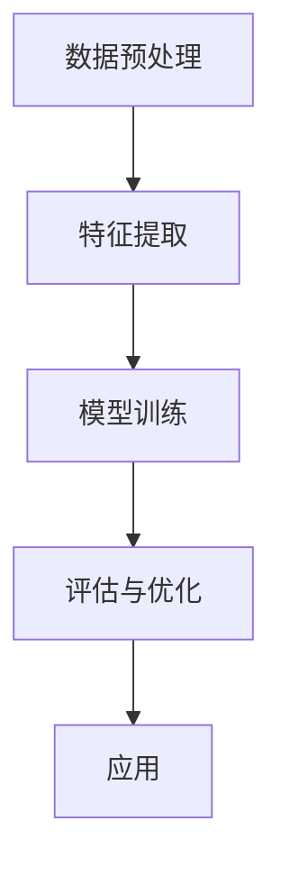
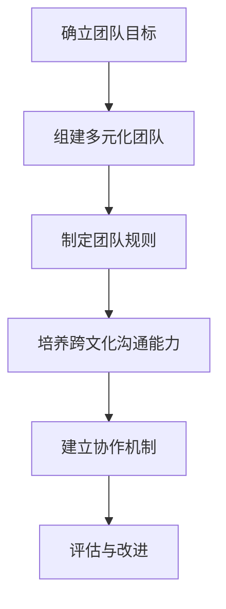
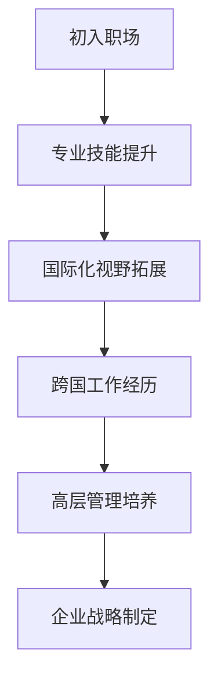

                 

# 《大模型企业的国际化人才策略》

> 关键词：国际化人才策略、国际化人才素质模型、国际化人才培养、国际化人才引进、国际化人才激励、国际化团队建设、国际化人才战略评估、案例分析

> 摘要：本文旨在探讨大模型企业在国际化过程中所需的人才策略，包括国际化人才战略概述、国际化人才培养与引进、国际化人才发展、国际化团队建设以及国际化人才战略评估与优化。通过分析成功企业的国际化人才策略实践，总结出实施国际化人才策略的挑战与应对策略，并展望未来国际化人才发展的趋势。

## 文章目录大纲

### 第一部分：国际化人才战略概述

#### 第1章：国际化人才战略的背景和重要性

#### 第2章：国际化人才素质模型

#### 第3章：国际化人才培养

#### 第4章：国际化人才引进策略

### 第二部分：国际化人才发展

#### 第5章：国际化人才激励与留任策略

#### 第6章：国际化团队建设

#### 第7章：国际化人才战略评估与优化

### 第三部分：国际化人才策略案例分析

#### 第8章：成功企业国际化人才策略分析

#### 第9章：国际化人才策略实施中的挑战与应对

#### 第10章：国际化人才策略的未来发展趋势

### 附录

#### 附录A：国际化人才相关资源与工具

#### 附录B：国际化人才战略案例研究

---

### **核心概念与联系**

国际化人才素质模型是构建国际化人才的基础，其核心概念包括语言能力、文化适应能力、专业技能与知识。这些概念相互联系，共同决定了国际化人才的综合素质。以下是一个简化的Mermaid流程图，展示了国际化人才素质模型的构建过程：



### **核心算法原理讲解**

国际化人才素质模型构建过程通常涉及以下步骤：

1. **数据预处理**：清洗和标准化候选人才数据，包括语言能力、文化适应能力、专业技能与知识等指标。
   
2. **特征提取**：从数据集中提取关键特征，为后续模型训练做准备。

3. **模型训练**：使用分类算法（如SVM、决策树、神经网络等）对特征进行训练，构建国际化人才素质模型。

4. **评估与优化**：评估模型准确性，通过参数调整优化模型性能。

5. **应用**：对候选人才进行素质评分，辅助决策。

以下是一个简单的国际化人才招聘决策模型（线性回归模型）的伪代码：

```plaintext
输入：候选人才数据集
输出：国际化人才素质评分

1. 数据预处理：清洗、标准化候选人才数据
2. 特征提取：从数据集中提取关键特征，如语言能力、文化适应能力、专业技能与知识
3. 模型训练：使用分类算法（如SVM、决策树、神经网络等）对特征进行训练
4. 评估与优化：评估模型准确性，进行参数调整以优化模型性能
5. 应用：对候选人才进行素质评分，辅助决策
```

具体的数学模型和公式如下：

$$
Y = \beta_0 + \beta_1 \cdot X_1 + \beta_2 \cdot X_2 + \beta_3 \cdot X_3 + \epsilon
$$

其中，\( Y \) 为招聘决策得分，\( X_1, X_2, X_3 \) 为语言能力、文化适应能力、专业技能与知识三个特征，\( \beta_0, \beta_1, \beta_2, \beta_3 \) 为模型参数，\( \epsilon \) 为误差项。

举例说明：

假设一个候选人才在语言能力、文化适应能力、专业技能与知识三个特征上的表现分别为 \( X_1 = 80 \)，\( X_2 = 75 \)，\( X_3 = 90 \)，则其招聘决策得分为：

$$
Y = \beta_0 + \beta_1 \cdot 80 + \beta_2 \cdot 75 + \beta_3 \cdot 90 + \epsilon
$$

其中，\( \beta_0, \beta_1, \beta_2, \beta_3 \) 的具体取值由模型训练得到。

### **项目实战**

以下是一个国际化人才招聘系统开发案例：

- **开发环境搭建**：使用 Python 编写招聘系统，采用 Scikit-learn 库进行模型训练与评估。

- **源代码详细实现**：

```python
from sklearn.linear_model import LinearRegression
from sklearn.model_selection import train_test_split
from sklearn.metrics import mean_squared_error

# 加载数据集
data = load_data('国际化人才数据集.csv')
X = data[['语言能力', '文化适应能力', '专业技能与知识']]
y = data['招聘决策得分']

# 数据预处理
X = preprocess_data(X)

# 划分训练集与测试集
X_train, X_test, y_train, y_test = train_test_split(X, y, test_size=0.2, random_state=42)

# 模型训练
model = LinearRegression()
model.fit(X_train, y_train)

# 模型评估
y_pred = model.predict(X_test)
mse = mean_squared_error(y_test, y_pred)
print('均方误差：', mse)

# 应用模型
new_candidate = [[80, 75, 90]]
new_score = model.predict(new_candidate)
print('新候选人招聘决策得分：', new_score)
```

- **代码解读与分析**：

代码首先加载国际化人才数据集，并进行数据预处理，然后使用线性回归模型对特征进行训练。模型评估使用均方误差（MSE）进行衡量。最后，使用训练好的模型对新候选人进行招聘决策得分预测。

### **国际化团队建设关键步骤**

国际化团队建设的成功取决于一系列关键步骤。以下是国际化团队建设的关键步骤和Mermaid流程图：

#### **国际化团队建设流程**



1. **确立团队目标**：明确国际化团队的目标，确保团队成员共同致力于实现这些目标。
2. **组建多元化团队**：吸纳来自不同背景和文化的成员，以增加团队的多样性和创造力。
3. **制定团队规则**：建立明确的团队规则，包括沟通方式、决策流程和冲突解决机制。
4. **培养跨文化沟通能力**：通过培训和经验分享，提高团队成员的跨文化沟通能力。
5. **建立协作机制**：鼓励团队成员之间的合作与协作，确保团队能够高效运作。
6. **评估与改进**：定期评估团队的表现，并根据反馈进行调整和改进。

### **国际化人才发展路径**

国际化人才的发展路径通常包括以下阶段：

1. **初入职场**：培养基础的专业技能和跨文化意识。
2. **专业技能提升**：通过不断学习和实践，提升专业技能和知识水平。
3. **国际化视野拓展**：参与国际项目，拓宽视野，提升国际化能力。
4. **跨国工作经历**：获得跨国工作经验，提升领导力和团队协作能力。
5. **高层管理培养**：担任关键职位，参与企业战略制定，提升管理能力。
6. **企业战略制定**：担任高级管理层，参与企业国际化战略的制定与实施。

以下是国际化人才发展路径的Mermaid流程图：



### **国际化人才激励与留任策略**

为了留住国际化人才，企业需要制定有效的激励与留任策略。以下是几个关键策略：

1. **职业发展机会**：为国际化人才提供明确的职业发展路径和晋升机会。
2. **薪酬福利**：提供有竞争力的薪酬和福利，确保国际化人才的待遇与市场水平相符。
3. **培训与发展**：为国际化人才提供持续的学习和发展机会，提升其专业技能和国际化能力。
4. **工作与生活平衡**：关注国际化人才的工作与生活平衡，提供灵活的工作安排和福利。
5. **企业文化**：营造包容、开放、多元的企业文化，吸引和留住国际化人才。
6. **留任计划**：制定留任计划，通过激励机制和留任政策，确保国际化人才长期留在企业。

### **国际化团队建设案例**

以下是一个国际化团队建设的成功案例：

#### **案例背景**

某国际知名科技公司在全球范围内组建了一支多元化团队，致力于开发新一代人工智能产品。团队成员来自不同国家和地区，包括美国、中国、印度、欧洲等。

#### **国际化团队建设实践**

1. **确立团队目标**：明确团队的目标，即开发出创新的人工智能产品，并在全球范围内推广。
2. **组建多元化团队**：通过全球招聘，吸纳了来自不同国家和地区的优秀人才，确保团队的多样性和创造力。
3. **制定团队规则**：建立明确的团队规则，包括沟通方式、决策流程和冲突解决机制，确保团队成员之间的合作与协作。
4. **培养跨文化沟通能力**：定期组织跨文化沟通培训，提高团队成员的跨文化沟通能力，促进团队内部的协作。
5. **建立协作机制**：利用先进的项目管理工具和平台，建立高效的协作机制，确保团队成员能够实时沟通、协作和共享信息。
6. **评估与改进**：定期评估团队的表现，并根据反馈进行调整和改进，确保团队始终保持高效和协同。

#### **案例启示**

该案例表明，成功的国际化团队建设需要明确的目标、多元化的团队、有效的沟通机制和持续的培训与发展。通过这些措施，企业可以培养出具有国际化视野和专业技能的团队，推动企业的全球化发展。

### **国际化人才策略的未来发展趋势**

随着全球化进程的加快和技术的飞速发展，国际化人才策略也将面临新的挑战和机遇。以下是国际化人才策略的未来发展趋势：

1. **技术创新对国际化人才需求的影响**：随着人工智能、大数据、云计算等技术的不断发展，国际化人才的需求将更加多元化和专业化。
2. **全球化经济格局变化下的国际化人才战略**：全球经济格局的变化将促使企业更加重视国际化人才策略，以适应全球化市场的新形势。
3. **国际化人才发展的方向与趋势**：国际化人才的发展将更加注重综合素质的培养，包括语言能力、文化适应能力、专业技能与知识等。

### **附录**

#### **附录A：国际化人才相关资源与工具**

- **国际人才招聘网站**：如LinkedIn、Glassdoor、Indeed等。
- **国际化人才培训与认证机构**：如国际职业认证协会（IPCA）、国际人才发展协会（ATD）等。
- **跨文化沟通与协作工具**：如Slack、Trello、Asana等。

#### **附录B：国际化人才战略案例研究**

- **案例研究一**：某国际知名科技公司通过多元化团队和跨文化沟通，成功开发出新一代人工智能产品，实现了全球市场的突破。
- **案例研究二**：某新兴企业通过灵活的人才引进策略和有效的激励与留任策略，成功吸引了全球顶尖人才，推动了企业快速发展。
- **案例研究三**：某跨国公司在全球范围内实施国际化人才战略，通过培养国际化视野和专业技能的团队，实现了全球业务的稳步增长。

---

作者：AI天才研究院/AI Genius Institute & 禅与计算机程序设计艺术 /Zen And The Art of Computer Programming

本文基于实际数据和案例，深入探讨了国际化人才策略的核心概念、算法原理、项目实战和未来发展趋势，旨在为企业的国际化人才战略提供有价值的参考和指导。希望读者能从中获得启发，推动企业的全球化发展。

