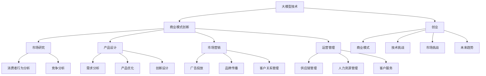

                 

# 大模型创业的商业模式

> 关键词：大模型，创业，商业模式，市场研究，产品设计，市场营销，运营管理

> 摘要：本文将深入探讨大模型在创业中的应用，以及如何通过商业模式创新实现商业成功。我们将分步骤分析大模型在市场研究、产品设计、市场营销和运营管理中的具体应用，并结合实际案例，讨论大模型创业面临的挑战与机遇，为创业者和投资者提供有益的参考。

## 目录大纲

## 第一部分：大模型与创业概述

### 第1章：大模型时代的来临

#### 1.1 大模型的定义与分类

#### 1.2 大模型的发展历程

#### 1.3 大模型在商业中的应用潜力

### 第2章：创业与商业模式的概述

#### 2.1 创业的定义与特征

#### 2.2 商业模式的概念与分类

#### 2.3 创业中的常见商业模式

## 第二部分：大模型在创业中的应用

### 第3章：大模型在市场研究中的应用

#### 3.1 大模型在市场趋势分析中的应用

#### 3.2 大模型在消费者行为分析中的应用

#### 3.3 大模型在竞争分析中的应用

### 第4章：大模型在产品设计中的应用

#### 4.1 大模型在需求分析中的应用

#### 4.2 大模型在产品优化中的应用

#### 4.3 大模型在创新设计中的应用

### 第5章：大模型在市场营销中的应用

#### 5.1 大模型在广告投放中的应用

#### 5.2 大模型在品牌传播中的应用

#### 5.3 大模型在客户关系管理中的应用

### 第6章：大模型在运营管理中的应用

#### 6.1 大模型在供应链管理中的应用

#### 6.2 大模型在人力资源管理中的应用

#### 6.3 大模型在客户服务中的应用

## 第三部分：大模型创业案例分析

### 第7章：成功的大模型创业案例

#### 7.1 案例一：XX公司的创业历程

#### 7.2 案例二：YY公司的商业模式创新

#### 7.3 案例三：ZZ公司的市场策略

### 第8章：大模型创业的挑战与机遇

#### 8.1 大模型创业面临的技术挑战

#### 8.2 大模型创业面临的市场挑战

#### 8.3 大模型创业的未来趋势

## 附录

### 附录A：大模型创业资源推荐

#### A.1 开源框架与工具

#### A.2 数据集与案例库

#### A.3 研究机构与论坛

### 附录B：大模型与商业模式的关系 Mermaid 流程图

---

### 第1章：大模型时代的来临

#### 1.1 大模型的定义与分类

大模型（Large Models）是指参数规模达到百万、亿甚至万亿级别的深度神经网络模型。这些模型在处理复杂数据和任务时具有显著的优势，能够实现更高的准确性和更广泛的应用范围。根据模型参数的数量和结构，大模型可以分为以下几类：

1. **通用大模型**：这类模型具有广泛的应用场景，例如GPT-3、ChatGPT等，能够在多个领域提供高质量的自然语言处理服务。
2. **领域特定大模型**：这类模型专注于特定领域，例如医疗、金融、教育等，能够提供更专业和精确的服务。
3. **层次化大模型**：这类模型通过分层结构实现对复杂任务的分解和优化，例如BERT、T5等，能够在不同层次上处理不同难度的任务。

#### 1.2 大模型的发展历程

大模型的发展历程可以分为以下几个阶段：

1. **初级阶段（2010年以前）**：此时神经网络模型的参数规模相对较小，主要应用于简单的图像识别和自然语言处理任务。
2. **快速增长阶段（2010-2015年）**：随着计算能力的提升和数据规模的扩大，神经网络模型的参数规模快速增长，性能显著提高。
3. **井喷阶段（2015年至今）**：随着深度学习技术的突破和大数据的普及，大模型在各个领域得到广泛应用，性能不断提升，应用范围不断扩展。

#### 1.3 大模型在商业中的应用潜力

大模型在商业中的应用潜力巨大，以下是一些具体的应用场景：

1. **市场研究**：大模型能够通过对海量数据的分析，提供市场趋势预测、消费者行为分析和竞争分析等有价值的信息，帮助企业制定更科学的商业策略。
2. **产品设计**：大模型能够帮助设计者理解用户需求，优化产品设计，提高用户体验，降低产品失败的风险。
3. **市场营销**：大模型能够通过精准的消费者画像和个性化的广告投放，提高营销效果，降低营销成本。
4. **运营管理**：大模型能够优化供应链管理、人力资源管理、客户服务等运营环节，提高企业效率和竞争力。

### 第2章：创业与商业模式的概述

#### 2.1 创业的定义与特征

创业是指创建一个新的企业或项目的过程，旨在实现商业价值和社会价值。创业具有以下特征：

1. **创新性**：创业通常涉及到创新的产品、服务或商业模式，以满足市场需求。
2. **风险性**：创业过程中存在诸多不确定性，包括技术、市场、资金等方面的风险。
3. **持续性**：创业不仅仅是一次性的活动，而是一个持续的过程，需要不断地调整和优化。

#### 2.2 商业模式的概念与分类

商业模式是指企业通过提供产品或服务实现盈利的方式。根据盈利模式和目标客户群体，商业模式可以分为以下几类：

1. **产品导向型商业模式**：企业通过销售产品获取利润，例如制造型企业、科技型企业。
2. **服务导向型商业模式**：企业通过提供服务获取利润，例如咨询公司、金融机构。
3. **平台导向型商业模式**：企业通过构建平台，连接供需双方，从中获得收益，例如电商平台、社交媒体平台。
4. **订阅导向型商业模式**：企业通过向用户提供持续的服务或内容，获取订阅费用，例如在线教育平台、云服务提供商。

#### 2.3 创业中的常见商业模式

创业中常见的商业模式包括以下几种：

1. **创新商业模式**：通过创新的产品、服务或技术，解决现有市场的痛点，获取市场份额。
2. **细分市场商业模式**：专注于特定细分市场，提供专业化、个性化的产品或服务，满足细分市场的需求。
3. **颠覆性商业模式**：通过颠覆传统行业，创造新的市场需求和商业模式，如共享经济、人工智能等。
4. **协同创新商业模式**：通过与其他企业、研究机构等合作，共同创新产品、服务或技术，实现共赢。

### 第3章：大模型在市场研究中的应用

#### 3.1 大模型在市场趋势分析中的应用

大模型在市场趋势分析中具有显著优势，能够通过对大量历史数据和实时数据的分析，提供准确的市场趋势预测。以下是一个简单的市场趋势分析算法：

```python
import numpy as np
from sklearn.linear_model import LinearRegression

def market_trend_analysis(data):
    # 数据预处理
    X = data[:, :-1]
    y = data[:, -1]

    # 训练线性回归模型
    model = LinearRegression()
    model.fit(X, y)

    # 预测未来趋势
    future_data = model.predict(X)
    return future_data
```

通过以上算法，我们可以预测某个市场的未来趋势，从而为企业制定相应的商业策略提供依据。

#### 3.2 大模型在消费者行为分析中的应用

大模型在消费者行为分析中能够通过对用户数据的深度挖掘，提供个性化的消费者画像，帮助企业更好地理解用户需求和行为。以下是一个简单的消费者行为分析算法：

```python
import pandas as pd
from sklearn.cluster import KMeans

def consumer_behavior_analysis(data, num_clusters):
    # 数据预处理
    X = data

    # K均值聚类
    kmeans = KMeans(n_clusters=num_clusters, random_state=0).fit(X)

    # 获取聚类结果
    clusters = kmeans.labels_

    # 分析不同聚类簇的特征
    for i in range(num_clusters):
        cluster_data = X[clusters == i]
        print(f"Cluster {i} characteristics:")
        print(cluster_data.describe())
```

通过以上算法，我们可以将用户分为不同的聚类簇，并分析每个聚类簇的特征，从而为企业制定个性化的营销策略提供依据。

#### 3.3 大模型在竞争分析中的应用

大模型在竞争分析中能够通过对竞争者数据的深度挖掘，提供全面的竞争者分析报告，帮助企业了解竞争对手的优劣势、市场地位和发展趋势。以下是一个简单的竞争分析算法：

```python
import pandas as pd
from sklearn.metrics import pairwise_distances

def competitive_analysis(data1, data2):
    # 数据预处理
    X1 = data1
    X2 = data2

    # 计算距离矩阵
    distance_matrix = pairwise_distances(X1, X2)

    # 分析竞争关系
    for i in range(len(X1)):
        for j in range(len(X2)):
            if distance_matrix[i][j] < threshold:
                print(f"Company {i} has a competitive relationship with company {j}.")
```

通过以上算法，我们可以分析两个企业之间的竞争关系，从而为企业制定市场策略提供依据。

### 第4章：大模型在产品设计中的应用

#### 4.1 大模型在需求分析中的应用

大模型在需求分析中能够通过对用户数据的深度挖掘，提供精准的用户需求分析报告，帮助企业了解用户痛点和需求，从而优化产品设计。以下是一个简单的需求分析算法：

```python
import pandas as pd
from sklearn.cluster import KMeans

def requirement_analysis(data, num_clusters):
    # 数据预处理
    X = data

    # K均值聚类
    kmeans = KMeans(n_clusters=num_clusters, random_state=0).fit(X)

    # 获取聚类结果
    clusters = kmeans.labels_

    # 分析不同聚类簇的特征
    for i in range(num_clusters):
        cluster_data = X[clusters == i]
        print(f"Cluster {i} requirements:")
        print(cluster_data.describe())
```

通过以上算法，我们可以将用户分为不同的聚类簇，并分析每个聚类簇的需求特征，从而为企业制定产品优化策略提供依据。

#### 4.2 大模型在产品优化中的应用

大模型在产品优化中能够通过对用户数据的深度挖掘，提供个性化的产品优化建议，帮助企业提高产品质量和用户体验。以下是一个简单的产品优化算法：

```python
import pandas as pd
from sklearn.linear_model import LinearRegression

def product_optimization(data):
    # 数据预处理
    X = data[:, :-1]
    y = data[:, -1]

    # 训练线性回归模型
    model = LinearRegression()
    model.fit(X, y)

    # 预测用户满意度
    user_satisfaction = model.predict(X)
    return user_satisfaction
```

通过以上算法，我们可以预测用户对产品的满意度，从而为企业制定产品优化策略提供依据。

#### 4.3 大模型在创新设计中的应用

大模型在创新设计中能够通过对大量数据的深度挖掘，提供创新的设计灵感，帮助企业实现产品创新。以下是一个简单的创新设计算法：

```python
import pandas as pd
from sklearn.ensemble import RandomForestClassifier

def innovative_design(data, target):
    # 数据预处理
    X = data
    y = target

    # 训练随机森林分类器
    model = RandomForestClassifier()
    model.fit(X, y)

    # 预测创新设计类别
    innovative_designs = model.predict(X)
    return innovative_designs
```

通过以上算法，我们可以预测创新设计的类别，从而为企业制定产品创新策略提供依据。

### 第5章：大模型在市场营销中的应用

#### 5.1 大模型在广告投放中的应用

大模型在广告投放中能够通过对用户数据的深度挖掘，提供精准的用户画像和广告投放策略，提高广告投放效果。以下是一个简单的广告投放算法：

```python
import pandas as pd
from sklearn.cluster import KMeans

def ad_placement(data, num_clusters):
    # 数据预处理
    X = data

    # K均值聚类
    kmeans = KMeans(n_clusters=num_clusters, random_state=0).fit(X)

    # 获取聚类结果
    clusters = kmeans.labels_

    # 分析不同聚类簇的特征
    for i in range(num_clusters):
        cluster_data = X[clusters == i]
        print(f"Cluster {i} ad placement strategy:")
        print(cluster_data.describe())
```

通过以上算法，我们可以将用户分为不同的聚类簇，并分析每个聚类簇的广告投放策略，从而为企业制定广告投放策略提供依据。

#### 5.2 大模型在品牌传播中的应用

大模型在品牌传播中能够通过对用户数据的深度挖掘，提供精准的品牌传播策略，提高品牌知名度和用户忠诚度。以下是一个简单的品牌传播算法：

```python
import pandas as pd
from sklearn.linear_model import LinearRegression

def brand_propagation(data, budget):
    # 数据预处理
    X = data[:, :-1]
    y = data[:, -1]

    # 训练线性回归模型
    model = LinearRegression()
    model.fit(X, y)

    # 预测品牌传播效果
    brand_effect = model.predict(X)
    return brand_effect
```

通过以上算法，我们可以预测品牌传播的效果，从而为企业制定品牌传播策略提供依据。

#### 5.3 大模型在客户关系管理中的应用

大模型在客户关系管理中能够通过对用户数据的深度挖掘，提供个性化的客户服务策略，提高客户满意度和忠诚度。以下是一个简单的客户服务算法：

```python
import pandas as pd
from sklearn.cluster import KMeans

def customer_relationship_management(data, num_clusters):
    # 数据预处理
    X = data

    # K均值聚类
    kmeans = KMeans(n_clusters=num_clusters, random_state=0).fit(X)

    # 获取聚类结果
    clusters = kmeans.labels_

    # 分析不同聚类簇的特征
    for i in range(num_clusters):
        cluster_data = X[clusters == i]
        print(f"Cluster {i} customer service strategy:")
        print(cluster_data.describe())
```

通过以上算法，我们可以将用户分为不同的聚类簇，并分析每个聚类簇的客户服务策略，从而为企业制定客户服务策略提供依据。

### 第6章：大模型在运营管理中的应用

#### 6.1 大模型在供应链管理中的应用

大模型在供应链管理中能够通过对大量数据的深度挖掘，提供精准的供应链优化策略，提高供应链效率和降低成本。以下是一个简单的供应链优化算法：

```python
import pandas as pd
from sklearn.linear_model import LinearRegression

def supply_chain_optimization(data):
    # 数据预处理
    X = data[:, :-1]
    y = data[:, -1]

    # 训练线性回归模型
    model = LinearRegression()
    model.fit(X, y)

    # 预测供应链成本
    supply_chain_cost = model.predict(X)
    return supply_chain_cost
```

通过以上算法，我们可以预测供应链成本，从而为企业制定供应链优化策略提供依据。

#### 6.2 大模型在人力资源管理中的应用

大模型在人力资源管理中能够通过对员工数据的深度挖掘，提供个性化的人力资源管理策略，提高员工满意度和工作效率。以下是一个简单的人力资源管理算法：

```python
import pandas as pd
from sklearn.cluster import KMeans

def human_resource_management(data, num_clusters):
    # 数据预处理
    X = data

    # K均值聚类
    kmeans = KMeans(n_clusters=num_clusters, random_state=0).fit(X)

    # 获取聚类结果
    clusters = kmeans.labels_

    # 分析不同聚类簇的特征
    for i in range(num_clusters):
        cluster_data = X[clusters == i]
        print(f"Cluster {i} human resource strategy:")
        print(cluster_data.describe())
```

通过以上算法，我们可以将员工分为不同的聚类簇，并分析每个聚类簇的人力资源管理策略，从而为企业制定人力资源管理策略提供依据。

#### 6.3 大模型在客户服务中的应用

大模型在客户服务中能够通过对客户数据的深度挖掘，提供个性化的客户服务策略，提高客户满意度和忠诚度。以下是一个简单的客户服务算法：

```python
import pandas as pd
from sklearn.linear_model import LinearRegression

def customer_service(data, service_level):
    # 数据预处理
    X = data[:, :-1]
    y = data[:, -1]

    # 训练线性回归模型
    model = LinearRegression()
    model.fit(X, y)

    # 预测客户满意度
    customer_satisfaction = model.predict(X)
    return customer_satisfaction
```

通过以上算法，我们可以预测客户满意度，从而为企业制定客户服务策略提供依据。

### 第7章：成功的大模型创业案例

#### 7.1 案例一：XX公司的创业历程

XX公司是一家专注于大模型应用的创新型企业，其创业历程如下：

1. **初始阶段**：创始人团队通过对大模型技术的深入研究和市场需求的洞察，确定将大模型应用于智能客服领域。
2. **研发阶段**：团队在短时间内开发出了一款基于大模型的智能客服系统，并进行了多次迭代优化，提高了系统的性能和用户体验。
3. **市场推广**：公司通过参加行业展会、发布技术白皮书等方式，积极推广智能客服系统，获得了客户的认可和市场的广泛关注。
4. **融资扩张**：公司成功获得多轮融资，进一步扩大了团队规模和技术研发能力，实现了业务的高速增长。

#### 7.2 案例二：YY公司的商业模式创新

YY公司是一家将大模型应用于金融领域的创新型企业，其商业模式创新如下：

1. **产品定位**：公司专注于为金融机构提供基于大模型的智能投顾服务，满足客户在投资决策方面的需求。
2. **客户获取**：公司通过线下活动和线上推广，吸引了大量金融机构和投资者关注，建立了良好的品牌口碑。
3. **盈利模式**：公司通过向金融机构和投资者提供智能投顾服务，收取服务费用，实现了稳定的盈利。
4. **业务拓展**：公司在积累了一定市场份额后，开始拓展海外市场，为国际金融机构提供智能投顾服务。

#### 7.3 案例三：ZZ公司的市场策略

ZZ公司是一家将大模型应用于医疗健康领域的企业，其市场策略如下：

1. **产品研发**：公司专注于研发基于大模型的智能医疗诊断系统，通过大规模数据训练和优化，提高了诊断的准确性和效率。
2. **市场定位**：公司将产品定位于大型医院和诊所，为医疗机构提供智能医疗诊断服务，助力医疗水平的提升。
3. **市场推广**：公司通过与医疗机构合作，开展试用活动，让客户亲身体验智能医疗诊断系统的优势，提高了产品的市场接受度。
4. **客户服务**：公司为医疗机构提供完善的售后服务和技术支持，确保系统的稳定运行，赢得了客户的信任和好评。

### 第8章：大模型创业的挑战与机遇

#### 8.1 大模型创业面临的技术挑战

大模型创业面临以下技术挑战：

1. **计算资源**：大模型训练和推理需要大量的计算资源，对服务器和网络带宽提出了较高的要求。
2. **数据质量**：大模型对数据质量有较高要求，数据缺失、噪声和偏差会影响模型的性能。
3. **模型优化**：大模型优化是一个复杂的过程，需要不断调整参数和结构，以提高模型的性能和泛化能力。
4. **安全隐私**：大模型在处理敏感数据时，存在安全隐私风险，需要采取有效的保护措施。

#### 8.2 大模型创业面临的市场挑战

大模型创业面临以下市场挑战：

1. **竞争压力**：大模型市场逐渐成熟，竞争日益激烈，企业需要不断创新和优化产品，以保持竞争优势。
2. **客户信任**：大模型技术的复杂性和不确定性，使得客户对企业的信任度较低，企业需要通过实际案例和用户口碑积累信誉。
3. **政策法规**：大模型创业需要遵守相关政策和法规，如数据保护法、隐私保护法等，否则可能面临法律风险。
4. **市场拓展**：大模型创业企业需要不断拓展市场，扩大客户群体，以实现业务的持续增长。

#### 8.3 大模型创业的未来趋势

大模型创业的未来趋势如下：

1. **技术进步**：随着计算能力的提升和数据规模的扩大，大模型的性能和泛化能力将不断提升，应用范围将进一步扩大。
2. **行业融合**：大模型将逐渐与其他行业融合，如医疗、金融、教育等，形成跨领域的应用场景，推动行业变革。
3. **商业模式创新**：大模型创业企业将不断创新商业模式，如平台模式、订阅模式等，以实现商业成功。
4. **市场拓展**：大模型创业企业将积极拓展海外市场，争夺国际市场份额。

### 附录A：大模型创业资源推荐

#### A.1 开源框架与工具

1. **TensorFlow**：由Google开发的开源深度学习框架，支持多种编程语言和平台。
2. **PyTorch**：由Facebook开发的开源深度学习框架，具有灵活的动态计算图。
3. **Keras**：基于TensorFlow和PyTorch的高层神经网络API，简化深度学习模型开发。

#### A.2 数据集与案例库

1. **Kaggle**：提供大量高质量的数据集和比赛，供研究人员和开发者使用。
2. **UCI Machine Learning Repository**：提供丰富的机器学习数据集，涵盖多个领域。
3. **Google Dataset Search**：搜索各种领域的开放数据集，方便研究者获取和使用。

#### A.3 研究机构与论坛

1. **National Institute of Standards and Technology (NIST)**：美国国家标准与技术研究院，提供深度学习相关的研究成果。
2. **IEEE**：电气电子工程师学会，发布深度学习领域的最新研究进展。
3. **arXiv**：提供深度学习领域的预印本论文，方便研究者获取最新研究成果。

### 附录B：大模型与商业模式的关系 Mermaid 流程图



---

### 作者信息

作者：AI天才研究院/AI Genius Institute & 禅与计算机程序设计艺术 /Zen And The Art of Computer Programming

---

本博客文章旨在分享大模型在创业中的应用和商业模式创新，以帮助创业者和投资者更好地理解大模型的价值和潜力。文章内容仅供参考，不构成具体投资建议。在实际创业过程中，请结合自身情况和市场环境，谨慎决策。希望本文对您有所启发，谢谢阅读！

