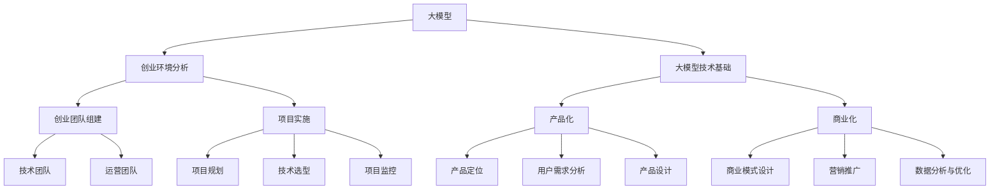

                 

# 文章标题：大模型创业的技术发展

> 关键词：大模型，创业，技术发展，深度学习，自然语言处理，商业模式

> 摘要：本文将探讨大模型创业的技术发展趋势，分析大模型在创业环境中的地位和核心优势，解析大模型技术基础及其应用，提供创业策略和实战案例，探讨大模型创业的风险与挑战，并展望其未来发展趋势。通过本文的深入分析，读者将了解大模型创业的核心理念和实践方法，为未来创业提供有益的参考。

----------------------------------------------------------------

# 《大模型创业的技术发展》目录大纲

## 第一部分：大模型概述

### 第1章：大模型时代来临

#### 1.1 大模型的概念与背景

#### 1.2 大模型的核心优势

#### 1.3 大模型与创业的关联

### 第2章：大模型技术基础

#### 2.1 深度学习基础

#### 2.2 自然语言处理技术

#### 2.3 大模型预训练技术

## 第二部分：大模型创业策略

### 第3章：创业环境分析

#### 3.1 市场需求分析

#### 3.2 竞争对手分析

#### 3.3 技术路线选择

### 第4章：大模型创业团队组建

#### 4.1 技术团队组建

#### 4.2 运营团队组建

#### 4.3 融资与投资

### 第5章：大模型项目实施

#### 5.1 项目规划

#### 5.2 技术选型

#### 5.3 项目实施与监控

### 第6章：大模型产品化

#### 6.1 产品定位

#### 6.2 用户需求分析

#### 6.3 产品设计

### 第7章：大模型商业化

#### 7.1 商业模式设计

#### 7.2 营销推广

#### 7.3 数据分析与优化

## 第三部分：大模型创业实践

### 第8章：大模型创业案例分析

#### 8.1 案例一：X公司的成功之道

#### 8.2 案例二：Y公司的失败教训

#### 8.3 案例三：Z公司的创新策略

### 第9章：大模型创业风险与挑战

#### 9.1 技术风险

#### 9.2 市场风险

#### 9.3 法律风险

### 第10章：大模型创业的未来趋势

#### 10.1 产业发展趋势

#### 10.2 技术创新趋势

#### 10.3 创业环境展望

## 附录

### 附录A：大模型相关资源

#### A.1 开源框架

#### A.2 技术论文

#### A.3 行业报告

### 附录B：大模型项目实战案例

#### B.1 项目一：智能客服系统

#### B.2 项目二：智能推荐系统

#### B.3 项目三：智能翻译系统

**核心概念与联系图示：**



**核心算法原理讲解：**

### 2.2 大模型训练算法

#### 2.2.1 训练流程

伪代码如下：

```python
function train(model, train_data, optimizer, epochs):
    for epoch in 1 to epochs:
        for batch in train_data:
            optimizer.zero_grad()
            output = model(batch)
            loss = calculate_loss(output, batch_labels)
            loss.backward()
            optimizer.step()
```

#### 2.2.2 优化器

常用的优化器有SGD、Adam等。

```python
optimizer = optim.Adam(model.parameters(), lr=0.001)
```

#### 2.2.3 损失函数

常用的损失函数有交叉熵损失、均方误差等。

```python
criterion = nn.CrossEntropyLoss()
```

**数学模型和数学公式：**

$$
\text{Loss} = -\frac{1}{N}\sum_{i=1}^{N}y_{i}\log(p_{i})
$$

其中，$y_{i}$ 为标签，$p_{i}$ 为预测概率。

**项目实战：**

### 5.2 技术选型

以开发一个智能客服系统为例，技术选型如下：

- **深度学习框架**：TensorFlow
- **自然语言处理库**：NLTK
- **对话管理**：基于规则的方法与机器学习方法的结合

**代码实现：**

```python
import tensorflow as tf
from nltk.tokenize import word_tokenize

# 定义模型
model = tf.keras.Sequential([
    tf.keras.layers.Embedding(input_dim=vocab_size, output_dim=embedding_dim),
    tf.keras.layers.GlobalAveragePooling1D(),
    tf.keras.layers.Dense(units=num_classes, activation='softmax')
])

# 编译模型
model.compile(optimizer='adam', loss='categorical_crossentropy', metrics=['accuracy'])

# 训练模型
model.fit(train_data, train_labels, epochs=10, batch_size=32)
```

**代码解读与分析：**

此代码片段为TensorFlow框架下的一个文本分类模型，用于智能客服系统中的对话分类。首先，通过`Embedding`层将输入文本转化为向量表示。接着，使用`GlobalAveragePooling1D`层对文本序列进行平均处理。最后，通过`Dense`层进行分类预测。

在实际应用中，需要根据具体需求和数据集进行相应的调整和优化。例如，可以增加更多隐藏层、调整学习率、使用不同的损失函数等。

**作者：AI天才研究院/AI Genius Institute & 禅与计算机程序设计艺术 /Zen And The Art of Computer Programming**

