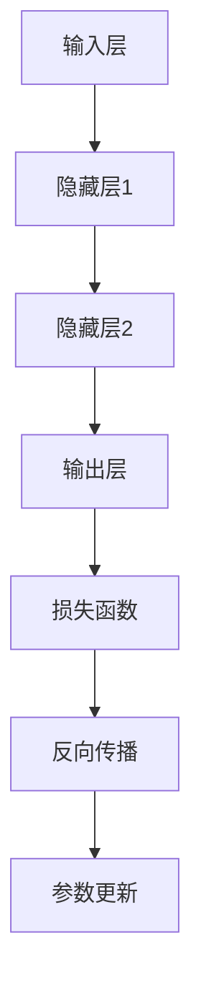

                 

### 文章标题

# 大模型创业的技术突破

> 关键词：大模型，创业，技术突破，深度学习，神经网络，预训练，优化策略，创业模式，项目管理，应用场景

> 摘要：本文将深入探讨大模型创业中的技术突破，从大模型的概述、核心算法解析、创业实战、项目管理到应用场景及未来展望，全面解析大模型创业的各个方面，帮助创业者更好地理解和应用这一前沿技术，抓住时代机遇。

### 第一部分：大模型概述

大模型作为当前人工智能领域的研究热点，其技术突破和应用前景备受关注。本部分首先对大模型进行概述，探讨其定义、分类、发展历史以及核心算法和架构。

#### 第1章：大模型时代来临

##### 1.1 大模型的定义与分类

**1.1.1 大模型的定义与基本特征**

大模型，通常指的是那些具有巨大参数量和训练数据的神经网络模型，它们能够在各类任务中取得优异的性能。大模型的基本特征包括：

1. **庞大的参数量**：大模型的参数数量通常在数十亿到数万亿级别。
2. **丰富的训练数据**：大模型在训练过程中使用了海量的数据，以提升模型的泛化能力。
3. **复杂的网络结构**：大模型通常具有多层神经网络结构，以支持复杂的计算和表达。

**1.1.2 大模型的分类与应用领域**

大模型可以分为两大类：自监督学习和迁移学习。

1. **自监督学习**：在自监督学习中，模型无需外部标签，利用未标记的数据自行学习。例如，图像生成、文本生成等。
2. **迁移学习**：迁移学习是指将一个任务（源任务）上的学习经验应用于另一个相关任务（目标任务）。例如，图像分类、语音识别等。

大模型的应用领域广泛，包括但不限于自然语言处理、计算机视觉、推荐系统、生物信息学等。

##### 1.2 大模型的发展历史与趋势

**1.2.1 大模型的起源与发展**

大模型的发展可以追溯到1990年代，当时神经网络的规模较小，但随着计算能力的提升和深度学习算法的突破，大模型的研究和应用逐渐成为可能。

**1.2.2 大模型的研究现状与未来趋势**

当前，大模型已经成为学术界和工业界的研究热点。随着技术的进步，大模型的规模和性能不断提升，未来发展趋势包括：

1. **模型压缩与高效推理**：为了在实际应用中高效地部署大模型，模型压缩和高效推理技术将成为重要研究方向。
2. **新型神经网络架构**：探索新型神经网络架构，如Transformer、Diffusion Model等，以提升模型的计算效率和性能。
3. **量子计算与大模型结合**：量子计算的结合将可能为大模型带来新的突破。

##### 1.3 大模型的核心算法与架构

**1.3.1 深度学习基础算法**

深度学习基础算法包括神经网络、卷积神经网络（CNN）和循环神经网络（RNN）。其中，神经网络是构建大模型的基础。

**1.3.2 大模型架构设计原理**

大模型架构设计注重参数共享、层次化结构和多任务学习，以提升模型的泛化能力和效率。

**1.3.3 Mermaid流程图：大模型架构示例**



这个Mermaid流程图展示了大模型的基本架构，包括输入层、隐藏层和输出层，以及损失函数、反向传播和参数更新等关键环节。

#### 第二部分：大模型技术细节

在大模型的技术细节部分，我们将深入探讨深度学习核心算法的解析，包括神经网络基础、大规模预训练模型原理、大模型训练与优化策略，并通过伪代码和数学模型进行详细阐述。

##### 第2章：深度学习核心算法解析

##### 2.1 神经网络基础

**2.1.1 神经元与神经网络的构建**

神经网络由多个神经元（或称为节点）组成，每个神经元都与多个其他神经元相连，通过加权连接进行信息传递。

**2.1.2 激活函数与优化算法**

激活函数用于引入非线性特性，常见的激活函数包括sigmoid、ReLU等。优化算法用于调整网络参数，以最小化损失函数，常见的优化算法包括SGD、Adam等。

**2.1.3 伪代码：神经网络训练过程**

```python
# 伪代码：神经网络训练过程

initialize parameters
for epoch in range(num_epochs):
    for batch in data_loader:
        # 前向传播
        outputs = forward_pass(batch, parameters)
        # 计算损失
        loss = compute_loss(outputs, labels)
        # 反向传播
        gradients = backward_pass(outputs, labels, parameters)
        # 更新参数
        update_parameters(parameters, gradients)
```

##### 2.2 大规模预训练模型原理

**2.2.1 预训练的概念与目标**

预训练是指在特定任务之前，使用大量未标记的数据对模型进行训练，以提取通用特征。预训练的目标是提升模型在下游任务上的性能。

**2.2.2 自监督学习与大模型预训练**

自监督学习是一种无需标签数据的预训练方法，通过预测数据中的未标注部分来实现。在大模型预训练中，自监督学习被广泛应用。

**2.2.3 迁移学习与微调技术**

迁移学习是指将预训练模型应用于特定任务，通过微调调整模型参数以适应新的任务。微调技术在大模型创业中具有重要意义。

##### 2.3 大模型训练与优化策略

**2.3.1 大模型训练策略**

大模型训练策略包括数据增强、批次归一化、学习率调度等，以提高训练效率和模型性能。

**2.3.2 大模型优化策略**

大模型优化策略包括分布式训练、模型并行化等，以提升训练速度和模型性能。

**2.3.3 数学模型与公式：大模型优化目标**

优化目标通常定义为最小化损失函数，常见的损失函数包括均方误差（MSE）和交叉熵（Cross-Entropy）。

$$
\text{Loss} = \frac{1}{n}\sum_{i=1}^{n}(\hat{y}_i - y_i)^2 \quad \text{（MSE）}
$$

$$
\text{Loss} = -\frac{1}{n}\sum_{i=1}^{n}y_i \log(\hat{y}_i) \quad \text{（Cross-Entropy）}
$$

**2.3.4 举例说明：大模型训练实例**

以图像分类任务为例，通过伪代码展示大模型训练的完整流程。

```python
# 伪代码：大模型训练实例

# 加载预训练模型
model = load_pretrained_model()

# 加载训练数据
train_loader = load_train_data()

# 设置优化器和学习率
optimizer = Adam(model.parameters(), lr=0.001)

# 开始训练
for epoch in range(num_epochs):
    for images, labels in train_loader:
        # 前向传播
        outputs = model(images)
        # 计算损失
        loss = compute_loss(outputs, labels)
        # 反向传播
        optimizer.zero_grad()
        loss.backward()
        optimizer.step()
    # 打印训练进度
    print(f"Epoch [{epoch+1}/{num_epochs}], Loss: {loss.item()}")
```

#### 第三部分：大模型创业实战

在大模型创业实战部分，我们将分析大模型创业路径与案例分析，探讨大模型开发与项目管理，以及大模型在各个领域的应用场景和落地实践。

##### 第3章：大模型创业路径与案例分析

##### 3.1 大模型创业模式分析

大模型创业模式包括自研模型、开源社区合作、并购与合作等，每种模式都有其优势和挑战。

##### 3.2 大模型创业案例解析

通过分析Google的BERT模型、OpenAI的GPT-3等经典案例，探讨大模型创业的成功经验和挑战。

##### 第4章：大模型开发与项目管理

##### 4.1 大模型开发环境搭建

详细讲解大模型开发环境的配置和工具选择，包括深度学习框架、计算资源、编程语言等。

##### 4.2 大模型项目管理与实践

探讨大模型项目管理的原则与方法，包括团队协作、风险管理等，以及大模型项目的实际操作流程。

##### 第5章：大模型应用场景与落地实践

##### 5.1 大模型在自然语言处理中的应用

分析大模型在语言理解与生成、对话系统与问答机器人、机器翻译与文本摘要等领域的应用场景。

##### 5.2 大模型在计算机视觉中的应用

探讨大模型在图像分类与目标检测、视觉推理与视频分析、图像生成与风格迁移等领域的应用。

##### 5.3 大模型在其他领域的应用

介绍大模型在医疗健康、金融科技、教育科技等领域的应用场景和落地实践。

#### 第四部分：大模型创业未来展望

在未来展望部分，我们将分析大模型创业面临的挑战和机遇，以及大模型创业的未来发展趋势。

##### 第6章：大模型创业的挑战与机遇

##### 6.1 大模型创业面临的挑战

包括技术挑战、法规与伦理挑战、商业模式与市场挑战等，探讨如何应对这些挑战。

##### 6.2 大模型创业的机遇

分析技术进步、行业变革、新型应用场景等带来的机遇，以及如何抓住这些机遇。

##### 第7章：大模型创业的未来发展趋势

##### 7.1 大模型创业的技术趋势

包括模型压缩与高效推理、新型神经网络架构、量子计算与大模型结合等。

##### 7.2 大模型创业的商业趋势

包括商业模式的创新、产业链的整合与分工、国际化与全球化布局等。

#### 附录

附录部分将介绍大模型开发工具与资源，包括主流深度学习框架、算法库、开发资源推荐，以及大模型创业社区与平台。

### 附录A：大模型开发工具与资源

##### A.1 主流深度学习框架对比

- TensorFlow
- PyTorch
- 其他深度学习框架

##### A.2 大模型开发常用算法库

- SciPy
- NumPy
- Matplotlib

##### A.3 大模型开发资源推荐

- 论文和书籍
- 网络课程和教程
- 论坛和社区

##### A.4 大模型创业社区与平台介绍

- AI大会
- Kaggle
- AI社群和论坛

### 作者

作者：AI天才研究院/AI Genius Institute & 禅与计算机程序设计艺术 /Zen And The Art of Computer Programming

---

本文由AI天才研究院/AI Genius Institute与禅与计算机程序设计艺术/Zen And The Art of Computer Programming联合撰写，旨在深入探讨大模型创业中的技术突破，为创业者提供全面的技术指导。希望本文能够帮助读者更好地理解和应用大模型技术，抓住时代机遇，实现创业梦想。

