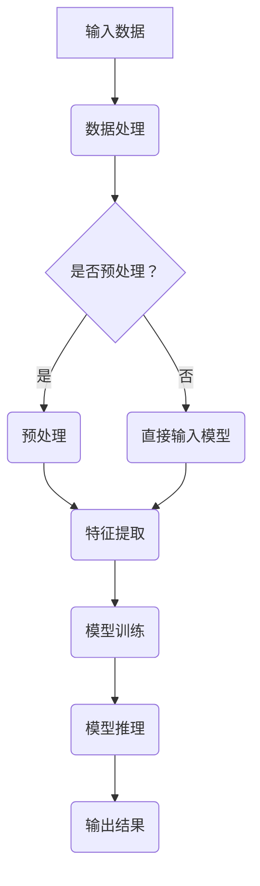

                 

### 文章标题：大模型商业化：新商业模式和产业生态孕育

> 关键词：大模型、商业化、新商业模式、产业生态、技术驱动、创新应用

> 摘要：本文将深入探讨大模型商业化的背景、核心技术、新商业模式探索以及产业生态的孕育。通过梳理大模型商业化的发展历程、分析大模型技术的核心原理，本文旨在揭示大模型在各个行业中的应用潜力，并探讨其商业化过程中的挑战与机遇。同时，本文还将分析大模型驱动的商业模式创新，探讨大模型产业生态的现状与趋势，以及产业生态的构建策略。最后，本文将展望大模型商业化的未来趋势，并提出可能的应对策略。

### 第一部分：大模型商业化背景

#### 第1章：大模型商业化概述

##### 1.1 大模型商业化的重要性

大模型商业化的重要性体现在其能够为企业带来巨大的价值。首先，大模型可以显著提升企业的数据分析和处理能力，帮助企业在海量数据中挖掘出有价值的信息。其次，大模型能够为企业提供智能化解决方案，提升企业运营效率和产品质量。此外，大模型商业化的成功还可以为企业带来丰厚的经济回报，推动企业实现可持续发展。

##### 1.2 大模型商业化的发展历程

大模型商业化的发展历程可以分为三个阶段：

1. **起步阶段**：20世纪80年代末至90年代，随着神经网络技术的发展，大模型研究开始萌芽，但商业化应用尚未普及。

2. **快速发展阶段**：21世纪初至2012年，深度学习技术的突破使得大模型研究取得显著进展，商业应用逐渐兴起，如谷歌的神经机器翻译系统。

3. **繁荣阶段**：2012年以来，随着计算能力和数据资源的不断提升，大模型商业化进入繁荣阶段，各类大模型产品和服务不断涌现，如百度文心一言、谷歌BERT等。

##### 1.3 大模型商业化的主要驱动力

大模型商业化的主要驱动力包括：

1. **技术进步**：深度学习和神经网络技术的飞速发展，使得大模型性能不断提升。

2. **数据资源**：大数据的积累和互联网的发展，为训练大模型提供了丰富的数据资源。

3. **市场需求**：企业在数据分析和智能化需求驱动下，对大模型技术表现出强烈的兴趣。

##### 1.4 大模型商业化面临的挑战与机遇

大模型商业化面临的挑战主要包括：

1. **技术难题**：大模型训练和推理过程对计算资源要求高，如何优化算法和提升计算效率是关键问题。

2. **数据隐私与伦理问题**：大模型在数据处理过程中可能涉及用户隐私，如何确保数据安全和用户隐私是重要挑战。

3. **商业模式创新**：如何在激烈的市场竞争中找到合适的商业模式，实现可持续发展，是每个企业都需要面对的问题。

然而，这些挑战也为大模型商业化带来了机遇。通过技术创新、商业模式创新和产业生态构建，大模型商业化有望在未来取得更大的突破。

### 第二部分：大模型技术基础

#### 第2章：大模型核心技术原理

##### 2.1 大模型的基本架构

大模型的基本架构通常包括输入层、隐藏层和输出层。输入层负责接收外部输入数据，隐藏层负责对数据进行处理和变换，输出层负责生成预测结果。

##### 2.1.1 神经网络与深度学习

神经网络是构建大模型的基础，深度学习则是神经网络的一种发展。深度学习通过构建多层神经网络，实现对复杂数据的建模和预测。

##### 2.1.2 大模型训练算法

大模型训练算法主要包括梯度下降法、随机梯度下降法、批量梯度下降法等。这些算法通过不断调整模型参数，使模型在训练数据上达到最优状态。

##### 2.1.3 大模型推理算法

大模型推理算法主要负责对新的输入数据进行处理，并生成预测结果。推理算法的核心是计算模型参数在输入数据上的作用效果，从而得到预测结果。

##### 2.2 大模型在自然语言处理中的应用

大模型在自然语言处理（NLP）领域有着广泛的应用，包括语言模型、文本生成、对话系统、语义理解等。

##### 2.2.1 语言模型与文本生成

语言模型是NLP领域的基础，它通过对大量文本数据的学习，生成符合语法和语义规则的文本。文本生成则利用语言模型生成符合特定主题或风格的文本。

##### 2.2.2 对话系统与语义理解

对话系统是NLP领域的另一重要应用，它能够实现人与机器之间的自然交互。语义理解则是对话系统的基础，通过理解用户的意图和问题，为用户提供合适的回答。

##### 2.3 大模型在计算机视觉中的应用

大模型在计算机视觉（CV）领域也有着广泛的应用，包括图像分类、目标检测、视觉感知、视频分析等。

##### 2.3.1 图像分类与目标检测

图像分类是CV领域的基础任务，通过将图像划分为不同的类别，实现对图像内容的理解。目标检测则是在图像中定位并识别出特定目标，对目标进行定位和分类。

##### 2.3.2 视觉感知与视频分析

视觉感知是CV领域的进一步发展，通过模拟人类视觉系统，实现对图像和视频的感知和理解。视频分析则利用视觉感知技术，对视频内容进行分析和处理。

### 第三部分：新商业模式探索

#### 第3章：大模型驱动的商业模式创新

##### 3.1 大模型与传统行业的融合

大模型与传统行业的融合，为各行业带来了新的商业模式和增长点。

##### 3.1.1 金融行业的应用

在金融行业，大模型可以用于风险控制、投资决策、欺诈检测等方面。例如，通过构建大模型，银行可以实现精准的风险评估和信用评分，提高信贷审批效率。

##### 3.1.2 零售业的转型

在零售行业，大模型可以用于客户细分、个性化推荐、供应链优化等方面。例如，通过分析消费者的购买行为和偏好，零售商可以实现精准营销，提高销售额。

##### 3.1.3 医疗健康领域的发展

在医疗健康领域，大模型可以用于疾病预测、诊断辅助、药物研发等方面。例如，通过分析患者的病历数据，医生可以实现早期疾病预测和诊断。

##### 3.2 大模型赋能的产业生态构建

大模型赋能的产业生态构建，包括大模型产业链分析、大模型平台与生态系统、大模型行业的政策与法规等方面。

##### 3.2.1 大模型产业链分析

大模型产业链包括硬件设备、软件平台、数据资源、服务提供商等环节。各个环节相互协同，共同推动大模型产业的发展。

##### 3.2.2 大模型平台与生态系统

大模型平台与生态系统为大模型商业化提供了基础设施和技术支持。通过搭建大模型平台，企业可以实现大模型的研究、开发和部署。

##### 3.2.3 大模型行业的政策与法规

大模型行业的政策与法规，对于大模型商业化的健康发展具有重要意义。政府应出台相关法规，规范大模型的数据处理和商业应用，保障数据安全和用户隐私。

### 第四部分：产业生态孕育

#### 第5章：大模型产业链分析

##### 5.1 大模型产业链的构成

大模型产业链的构成包括硬件设备、软件平台、数据资源、服务提供商等环节。

##### 5.1.1 硬件设备

硬件设备是构建大模型的基础，包括高性能计算机、GPU、TPU等。高性能计算机和大规模GPU集群能够显著提升大模型的训练和推理效率。

##### 5.1.2 软件平台

软件平台为大模型的研究、开发、部署提供了技术支持。常见的软件平台包括TensorFlow、PyTorch、MXNet等。

##### 5.1.3 数据资源

数据资源是大模型训练的重要基础，包括公开数据集、企业数据、政府数据等。丰富和高质量的数据资源能够提升大模型的效果和性能。

##### 5.1.4 服务提供商

服务提供商为大模型商业化提供了全面的技术和服务支持，包括大模型开发、部署、运维等。

##### 5.2 大模型产业生态的现状与趋势

##### 5.2.1 全球大模型产业发展

全球大模型产业发展迅速，美国、中国等国家在技术、市场、政策等方面处于领先地位。全球大模型产业链逐渐成熟，各环节协同发展。

##### 5.2.2 我国大模型产业发展

我国大模型产业发展迅猛，政府和企业加大对大模型技术的投入，产业链逐渐完善。我国大模型产业在技术、市场、政策等方面具有较大潜力。

##### 5.2.3 大模型产业的政策与支持

政府出台了一系列政策和支持措施，推动大模型产业发展。包括资金扶持、人才培养、知识产权保护等方面。

#### 第6章：大模型产业生态的构建

##### 6.1 大模型产业生态的构建原则

大模型产业生态的构建应遵循以下原则：

1. **产业链协同**：各个环节相互协同，共同推动大模型产业发展。

2. **生态合作与共赢**：企业之间建立紧密的合作关系，实现资源共享和优势互补。

3. **技术创新与开放合作**：持续推动技术创新，积极参与国际竞争，加强开放合作。

##### 6.2 大模型产业生态的构建策略

大模型产业生态的构建策略包括：

1. **建立大模型研发中心**：集聚国内外优秀科研力量，推动大模型技术创新。

2. **构建大模型开源社区**：鼓励开放共享，促进大模型技术的普及和应用。

3. **产业链上下游合作**：加强产业链上下游企业的合作，共同推动大模型产业的发展。

### 第五部分：大模型商业化的未来展望

#### 第7章：大模型商业化的未来展望

##### 7.1 大模型商业化的未来趋势

大模型商业化的未来趋势包括：

1. **大模型技术的持续发展**：随着计算能力和数据资源的提升，大模型技术将持续发展，性能不断提升。

2. **商业模式的不断创新**：大模型商业化的成功案例将推动商业模式不断创新，为企业带来更多机遇。

3. **产业生态的不断完善**：大模型产业生态将逐步完善，产业链各环节协同发展，为商业化提供有力支持。

##### 7.2 大模型商业化面临的挑战与应对

大模型商业化面临的挑战包括：

1. **技术创新与突破**：持续推动技术创新，解决大模型训练和推理过程中的技术难题。

2. **政策法规的完善**：完善政策法规，保障数据安全和用户隐私，为商业应用提供良好环境。

3. **产业合作与共赢**：加强产业链上下游企业的合作，实现资源整合和优势互补。

### 附录

#### 第8章：大模型商业化工具与资源

##### 8.1 大模型开发工具

大模型开发工具包括TensorFlow、PyTorch、MXNet等。这些工具提供了丰富的API和生态系统，方便开发者进行大模型的研究和开发。

##### 8.2 大模型应用案例

大模型应用案例包括百度文心一言、谷歌BERT模型、微软小冰等。这些案例展示了大模型在不同领域的应用场景和商业价值。

##### 8.3 大模型相关研究论文与资料

大模型相关研究论文和资料包括《深度学习》、《自然语言处理综论》、《计算机视觉：算法与应用》等。这些论文和资料为研究者和开发者提供了丰富的理论和技术支持。

---

**附录A：大模型核心技术原理 Mermaid 流程图**



**附录B：大模型训练算法伪代码**

```python
# 初始化模型参数
params = initialize_params()

# 定义损失函数
def loss(y_true, y_pred):
    return np.mean(np.square(y_true - y_pred))

# 定义优化器
optimizer = initialize_optimizer()

# 模型训练循环
for epoch in range(num_epochs):
    for batch in data_loader:
        # 前向传播
        y_pred = model(batch.X)

        # 计算损失
        loss_value = loss(batch.y, y_pred)

        # 反向传播
        grads = compute_gradients(model, params, y_pred, batch.y)

        # 更新模型参数
        optimizer.update_params(params, grads)

    print(f"Epoch {epoch+1}: Loss = {loss_value}")
```

**附录C：数学模型和数学公式**

$$
y = f(x) = \sigma(\sum_{i=1}^{n} w_i \cdot x_i)
$$

**附录D：大模型项目实战**

- **实战1：基于BERT的文本分类**
  - **环境搭建**：安装TensorFlow和BERT模型库。
  - **数据预处理**：对文本数据进行清洗和标记。
  - **模型训练**：使用BERT模型进行训练，调整模型参数。
  - **模型评估**：评估模型在测试集上的性能。
  - **代码解读**：分析代码实现细节，理解BERT模型的工作原理。

- **实战2：基于GPT-3的聊天机器人**
  - **环境搭建**：安装Hugging Face的Transformers库。
  - **数据准备**：准备对话数据集，用于训练和测试。
  - **模型训练**：使用GPT-3模型进行训练，优化对话效果。
  - **模型应用**：部署聊天机器人，实现用户交互。
  - **代码解读**：分析代码实现细节，理解GPT-3模型的工作原理。

- **实战3：基于ImageNet的图像分类**
  - **环境搭建**：安装TensorFlow和Keras。
  - **数据预处理**：对图像数据进行归一化和预处理。
  - **模型训练**：使用预训练的ResNet模型进行微调。
  - **模型评估**：评估模型在测试集上的性能。
  - **代码解读**：分析代码实现细节，理解图像分类模型的工作原理。

---

**作者：AI天才研究院/AI Genius Institute & 禅与计算机程序设计艺术 /Zen And The Art of Computer Programming**

