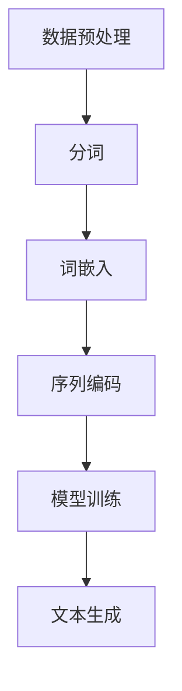
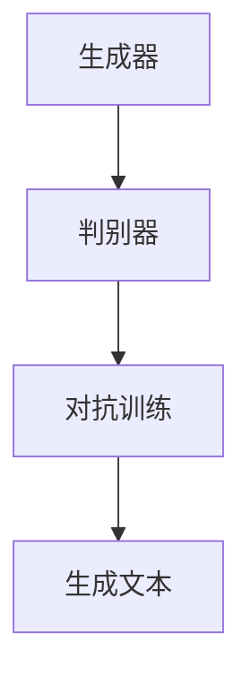
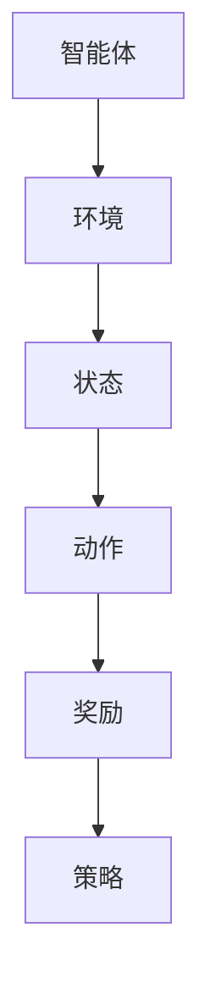
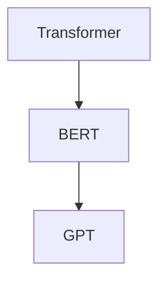

                 

## 文章标题

《大模型在商品描述自动生成与优化中的应用》

> 关键词：大模型、商品描述、自动生成、优化、NLP、GAN、强化学习

> 摘要：本文深入探讨了大规模模型（大模型）在商品描述自动生成与优化中的应用。通过详细介绍大模型的基本概念、核心技术，以及应用场景，本文提出了基于大模型的商品描述自动生成与优化方法。此外，文章还通过实际案例，展示了大模型在商品描述领域的应用效果，并分析了未来发展趋势及挑战。

## 第一部分：大模型概述与应用场景

### 第1章：大模型基本概念与原理

大模型是指参数规模超过数十亿甚至千亿级别的人工神经网络模型。这类模型通过深度学习算法，从大量数据中学习到复杂的特征表示，从而在各类任务中表现出色。大模型在计算机视觉、自然语言处理、语音识别等领域取得了显著的进展。

#### 1.1 大模型的定义与历史演变

大模型的发展可以追溯到深度学习的兴起。随着计算能力和数据资源的提升，深度学习模型的大小和复杂度不断增长。特别是2018年，谷歌推出了Transformer模型，该模型在自然语言处理领域取得了突破性成果，推动了大规模模型的研究和应用。

#### 1.2 大模型的核心技术

大模型的核心技术包括自然语言处理（NLP）技术、生成对抗网络（GAN）和强化学习。

##### 1.2.1 自然语言处理（NLP）技术

NLP是研究计算机与人类语言交互的学科。在大模型中，NLP技术主要用于文本编码和解码。

**Mermaid流程图：** NLP的数据处理流程



**伪代码：** 基于Transformer的文本编码

```python
# 输入：文本序列text
# 输出：编码后的序列编码表示encoded_sequence

# 步骤1：分词
words = tokenize(text)

# 步骤2：词嵌入
embeddings = [word_embedding(word) for word in words]

# 步骤3：序列编码
encoded_sequence = transformer.encode(embeddings)
```

##### 1.2.2 生成对抗网络（GAN）

GAN是一种通过对抗性训练生成数据的方法。在大模型中，GAN主要用于生成高质量的文本。

**Mermaid流程图：** GAN的工作流程



**伪代码：** GAN的训练过程

```python
# 输入：训练数据
# 输出：生成器与判别器的参数

# 步骤1：初始化生成器与判别器的参数
G_params, D_params = initialize_parameters()

# 步骤2：对抗训练
for epoch in range(num_epochs):
    for batch in data_loader:
        # 步骤2.1：生成器更新
        z = generate_noise(batch_size)
        fake_text = generator(G_params, z)
        D_params = update_discriminator(D_params, fake_text, batch)

        # 步骤2.2：判别器更新
        real_text = real_data_loader(batch)
        D_params = update_generator(D_params, real_text)
```

##### 1.2.3 强化学习与深度强化学习

强化学习是一种通过与环境交互来学习最优策略的方法。在大模型中，强化学习主要用于优化模型的行为。

**Mermaid流程图：** 强化学习的基本框架



**伪代码：** Q-learning算法

```python
# 输入：状态空间S、动作空间A、奖励函数R、学习率α
# 输出：策略π

# 初始化Q值矩阵Q
Q = initialize_Q(s, a)

# 步骤1：初始化智能体状态
state = initial_state

# 步骤2：进行N次迭代
for episode in range(N):
    # 步骤2.1：执行动作
    action = choose_action(state, Q)

    # 步骤2.2：与环境交互
    next_state, reward = environment.step(state, action)

    # 步骤2.3：更新Q值
    Q[state, action] = Q[state, action] + α * (reward + γ * max(Q[next_state, :]) - Q[state, action])

    # 步骤2.4：更新状态
    state = next_state
```

### 第2章：大模型在商品描述中的应用场景

#### 2.1 商品描述自动生成的基本流程

商品描述自动生成的流程包括数据采集、模型训练和商品描述生成三个阶段。

1. **数据采集**：从电商平台、社交媒体等渠道收集商品描述数据。
2. **模型训练**：利用大规模文本数据，训练大模型，使其具备自动生成商品描述的能力。
3. **商品描述生成**：输入商品相关信息，通过大模型生成对应的商品描述。

#### 2.2 商品描述质量优化方法

商品描述质量优化方法主要分为基于文本相似性和基于用户行为两种。

##### 2.2.1 基于文本相似性的优化策略

基于文本相似性优化策略旨在提高商品描述的相似度，从而提高用户体验。

**数学模型与公式：** 余弦相似性计算

$$
\cos(\theta) = \frac{\text{向量A} \cdot \text{向量B}}{|\text{向量A}| \cdot |\text{向量B}|}
$$

**举例说明：** 如何使用余弦相似性优化商品描述

假设有两个商品描述文本A和B，通过计算A和B的余弦相似性，可以判断两个文本的相似度。如果相似度较低，说明文本描述存在差异，可以针对性地进行调整。

##### 2.2.2 基于用户行为的优化策略

基于用户行为优化策略旨在提高商品描述的点击率（CTR），从而提高销售转化率。

**数学模型与公式：** 点击率（CTR）预测模型

$$
\hat{CTR} = \sigma(\text{向量A} \cdot \text{向量B} + b)
$$

其中，$\sigma$表示 sigmoid 函数，$\text{向量A}$和$\text{向量B}$分别表示用户特征和商品描述特征，$b$表示偏置。

**举例说明：** 如何利用CTR预测优化商品描述

通过分析用户行为数据，提取用户特征和商品描述特征，构建CTR预测模型。利用预测模型，可以为每个商品描述打分，根据分数高低进行优化，从而提高商品描述的点击率。

## 第二部分：大模型技术实现与优化

### 第3章：大模型搭建与训练

#### 3.1 模型搭建与超参数选择

大模型的搭建与超参数选择是保证模型性能的关键。

##### 3.1.1 词嵌入技术

词嵌入是将词汇映射为固定长度的向量表示，是自然语言处理的基础。

**数学模型与公式：** 词嵌入

$$
\text{向量} = \text{Word2Vec}(\text{词汇})
$$

##### 3.1.2 模型架构选择

大模型的架构选择对模型的性能和效率有重要影响。常用的架构包括Transformer、BERT、GPT等。

**Mermaid流程图：** 常见大模型架构



#### 3.2 大模型的训练与优化

大模型的训练与优化是模型性能提升的关键。

##### 3.2.1 训练数据预处理

训练数据预处理包括数据清洗、去重、分词、词嵌入等步骤。

**伪代码：** 数据预处理

```python
# 输入：原始文本数据
# 输出：预处理后的数据

# 步骤1：数据清洗
cleaned_data = clean_data(raw_data)

# 步骤2：去重
unique_data = remove_duplicates(cleaned_data)

# 步骤3：分词
tokenized_data = tokenize(unique_data)

# 步骤4：词嵌入
embedded_data = word_embedding(tokenized_data)
```

##### 3.2.2 训练过程监控与调整

训练过程监控与调整包括损失函数监控、学习率调整、early stopping等策略。

**伪代码：** 训练过程监控与调整

```python
# 输入：训练数据、验证数据、模型参数
# 输出：调整后的模型参数

# 步骤1：初始化模型参数
model_params = initialize_parameters()

# 步骤2：训练模型
for epoch in range(num_epochs):
    # 步骤2.1：训练过程
    train_loss = train_model(train_data, model_params)
    
    # 步骤2.2：验证过程
    valid_loss = validate_model(valid_data, model_params)
    
    # 步骤2.3：调整模型参数
    if valid_loss < previous_valid_loss:
        previous_valid_loss = valid_loss
        model_params = adjust_parameters(model_params)
    else:
        break
```

##### 3.2.3 大模型的评估与调优

大模型的评估与调优是保证模型性能的关键。

**数学模型与公式：** F1分数计算

$$
F1 = 2 \cdot \frac{precision \cdot recall}{precision + recall}
$$

**伪代码：** F1分数计算

```python
# 输入：预测结果、真实结果
# 输出：F1分数

# 步骤1：计算精确率
precision = correct_predictions / total_predictions

# 步骤2：计算召回率
recall = correct_predictions / total_relevant_predictions

# 步骤3：计算F1分数
F1 = 2 * (precision * recall) / (precision + recall)
```

**调优策略：** 根据评估结果，调整模型参数，优化模型性能。

**伪代码：** 调优策略

```python
# 输入：评估结果、模型参数
# 输出：优化后的模型参数

# 步骤1：评估模型性能
performance = evaluate_model(ground_truth, predictions)

# 步骤2：调整模型参数
if performance < desired_performance:
    model_params = adjust_parameters(model_params)
else:
    break
```

## 第三部分：大模型在商品描述领域的挑战与未来

### 第4章：大模型在商品描述领域的挑战

大模型在商品描述领域面临以下挑战：

1. **数据隐私保护**：商品描述数据涉及用户隐私，需要采取有效的数据保护措施。
2. **模型解释性与可解释性**：大模型通常是一个黑盒，难以解释模型决策过程，需要提高模型的透明度。
3. **模型部署与运维**：大模型训练过程复杂，需要高效稳定的部署与运维环境。

### 第5章：大模型在商品描述领域的未来发展趋势

大模型在商品描述领域的未来发展趋势包括：

1. **大模型与商业智能的结合**：利用大模型进行商业智能分析，为电商平台提供更智能的商品推荐和服务。
2. **大模型在多语言商品描述中的应用**：支持多语言商品描述生成与优化，扩大电商平台的全球市场。
3. **大模型与物联网（IoT）的结合**：结合物联网设备数据，为商品描述提供更多维度的信息，提高用户体验。

### 第6章：大模型在商品描述领域的挑战与未来发展趋势

#### 6.1 数据隐私保护

在商品描述自动生成与优化过程中，数据隐私保护是一个重要挑战。商品描述数据通常包含用户个人信息、购物行为等敏感信息。为了确保数据隐私，可以采取以下措施：

1. **数据去噪**：通过数据去噪技术，减少数据中的噪声和冗余，降低隐私泄露风险。
2. **差分隐私**：在数据处理过程中引入差分隐私机制，对用户数据进行扰动，保护用户隐私。
3. **数据加密**：对敏感数据进行加密处理，确保数据在传输和存储过程中的安全性。

#### 6.2 模型解释性与可解释性

大模型通常是一个复杂的黑盒，难以解释其决策过程。模型解释性与可解释性对于提高用户信任和监管合规至关重要。以下是一些提高模型可解释性的方法：

1. **注意力机制**：通过注意力机制，可以显式地展示模型对输入数据的关注点，提高模型的可解释性。
2. **可视化技术**：利用可视化技术，将模型内部的决策过程以图形化方式呈现，帮助用户理解模型的工作原理。
3. **模型压缩与简化**：通过模型压缩与简化技术，降低模型复杂度，提高模型的可解释性。

#### 6.3 模型部署与运维

大模型的部署与运维是一个复杂的过程，需要考虑计算资源、数据存储、网络传输等方面。以下是一些提高模型部署与运维效率的方法：

1. **云计算与容器化**：利用云计算和容器化技术，实现模型的高效部署与运维。
2. **自动化运维**：通过自动化运维工具，实现模型训练、部署、监控等任务的自动化处理。
3. **分布式训练**：利用分布式训练技术，提高模型训练速度和资源利用效率。

### 第7章：案例研究

#### 7.1 某电商平台商品描述自动生成与优化实践

以某电商平台为例，介绍大模型在商品描述自动生成与优化实践中的应用。

1. **数据采集**：从电商平台收集商品描述数据，包括商品名称、描述、标签等。
2. **模型训练**：利用大规模文本数据，训练大模型，使其具备自动生成商品描述的能力。
3. **商品描述生成**：输入商品相关信息，通过大模型生成对应的商品描述。
4. **商品描述优化**：利用基于文本相似性和用户行为的优化策略，提高商品描述的质量和点击率。

#### 7.2 某零售企业商品描述质量提升案例分析

以某零售企业为例，分析大模型在商品描述质量提升中的应用。

1. **数据采集**：从零售企业收集商品描述数据，包括商品名称、描述、标签等。
2. **模型训练**：利用大规模文本数据，训练大模型，使其具备自动生成商品描述的能力。
3. **商品描述生成**：输入商品相关信息，通过大模型生成对应的商品描述。
4. **商品描述优化**：利用基于文本相似性和用户行为的优化策略，提高商品描述的质量和销售转化率。

## 附录

### 附录A：常用工具与资源

#### A.1 开源框架与库

1. **TensorFlow**：由谷歌开发的深度学习框架，支持大规模模型训练和部署。
2. **PyTorch**：由Facebook开发的开源深度学习框架，提供灵活的动态计算图支持。
3. **Hugging Face**：提供丰富的自然语言处理工具和预训练模型。

#### A.2 数据集与资源下载

1. **Amazon Product Reviews**：包含亚马逊平台上的商品评价数据。
2. **Etsy Product Descriptions**：包含Etsy平台上的商品描述数据。
3. **Common Crawl**：一个大规模的网页文本数据集。

#### A.3 相关论文与文献推荐

1. **"Attention is All You Need"**：介绍了Transformer模型，是自然语言处理领域的里程碑。
2. **"Generative Adversarial Networks"**：介绍了生成对抗网络（GAN），是生成模型的重要突破。
3. **"Algorithms for Reinforcement Learning"**：介绍了强化学习算法，是智能决策的重要方法。

### 附录B：代码解读与分析

#### B.1 商品描述自动生成代码解读

以TensorFlow和Hugging Face为例，介绍商品描述自动生成代码的实现。

```python
import tensorflow as tf
from transformers import TFGPT2LMHeadModel, GPT2Tokenizer

# 加载预训练模型
tokenizer = GPT2Tokenizer.from_pretrained("gpt2")
model = TFGPT2LMHeadModel.from_pretrained("gpt2")

# 输入商品名称，生成商品描述
input_text = "商品名称：智能音箱"
input_ids = tokenizer.encode(input_text, return_tensors="tf")

# 生成商品描述
output_ids = model.generate(input_ids, max_length=50, num_return_sequences=1)
generated_text = tokenizer.decode(output_ids[0], skip_special_tokens=True)

print(generated_text)
```

#### B.2 商品描述优化代码解读

以基于用户行为的优化策略为例，介绍商品描述优化代码的实现。

```python
import tensorflow as tf
from tensorflow.keras.models import Model
from tensorflow.keras.layers import Input, Embedding, LSTM, Dense

# 定义模型结构
input_text = Input(shape=(max_sequence_length,))
embedding_layer = Embedding(input_dim=vocab_size, output_dim=embedding_size)(input_text)
lstm_layer = LSTM(units=lstm_units)(embedding_layer)
dense_layer = Dense(units=1, activation="sigmoid")(lstm_layer)

# 构建模型
model = Model(inputs=input_text, outputs=dense_layer)

# 编译模型
model.compile(optimizer="adam", loss="binary_crossentropy", metrics=["accuracy"])

# 训练模型
model.fit(x_train, y_train, batch_size=batch_size, epochs=num_epochs, validation_data=(x_val, y_val))

# 预测点击率
predictions = model.predict(x_test)

# 根据点击率调整商品描述
for i, prediction in enumerate(predictions):
    if prediction < threshold:
        # 调整商品描述
        adjusted_description = modify_description(x_test[i])
        print(f"原始描述：{x_test[i]}")
        print(f"调整后描述：{adjusted_description}")
```

#### B.3 实战案例代码解读与分析

以某电商平台商品描述自动生成与优化为例，介绍实战案例代码的实现。

```python
# 实战案例代码
# 数据预处理
def preprocess_data(data):
    # 数据清洗、去重、分词、词嵌入等步骤
    pass

# 模型训练
def train_model(train_data, valid_data, model_params):
    # 训练大模型，包括数据预处理、模型搭建、训练过程监控等步骤
    pass

# 商品描述生成
def generate_description(product_name):
    # 输入商品名称，生成商品描述
    pass

# 商品描述优化
def optimize_description(description, user_behavior_data):
    # 利用用户行为数据，优化商品描述
    pass

# 主函数
if __name__ == "__main__":
    # 数据预处理
    train_data = preprocess_data(train_data)
    valid_data = preprocess_data(valid_data)

    # 训练模型
    model_params = train_model(train_data, valid_data, model_params)

    # 商品描述生成与优化
    for product_name in product_names:
        description = generate_description(product_name)
        optimized_description = optimize_description(description, user_behavior_data)
        print(f"原始描述：{description}")
        print(f"优化后描述：{optimized_description}")
```

通过以上实战案例，展示了如何利用大模型实现商品描述自动生成与优化。在实际应用中，可以根据具体需求和数据情况，调整和优化代码实现。

