                 

# 《大模型在商品标签自动生成与更新中的应用》

> 关键词：大模型、商品标签、自动生成、更新、自然语言处理、深度学习、生成对抗网络、强化学习

> 摘要：本文深入探讨了大规模预训练模型在商品标签自动生成与更新中的应用。首先介绍了大模型的基本概念、发展历程和架构，然后详细阐述了大模型的核心算法，包括生成对抗网络（GAN）、强化学习和聚类算法等。接着，本文重点分析了大模型在图像处理和语音处理中的应用，以及商品标签自动生成和更新的技术方法。最后，通过一个实际项目案例，展示了大模型在商品标签自动生成与更新系统设计、开发与实现中的具体应用，并提出了未来的发展方向和挑战。

## 《大模型在商品标签自动生成与更新中的应用》目录大纲

## 第一部分：大模型基础与原理

### 第1章：大模型概述
#### 1.1 大模型的概念与特点
#### 1.2 大模型的发展历程
#### 1.3 大模型的基本架构

### 第2章：大模型技术原理
#### 2.1 神经网络与深度学习基础
#### 2.2 自然语言处理技术
#### 2.3 大规模预训练模型原理

### 第3章：大模型核心算法
#### 3.1 生成对抗网络（GAN）原理
#### 3.2 强化学习与深度强化学习
#### 3.3 聚类算法与降维技术

### 第4章：大模型在图像处理中的应用
#### 4.1 图像识别与分类
#### 4.2 图像生成与增强
#### 4.3 图像风格迁移与修复

### 第5章：大模型在语音处理中的应用
#### 5.1 语音识别与合成
#### 5.2 语音增强与降噪
#### 5.3 语音情感分析与语音交互

## 第二部分：大模型在商品标签自动生成与更新中的应用

### 第6章：商品标签自动生成技术
#### 6.1 商品标签概述
#### 6.2 商品标签自动生成方法
#### 6.3 基于大模型的商品标签生成实践

### 第7章：商品标签更新策略
#### 7.1 商品标签更新概述
#### 7.2 基于用户行为的商品标签更新
#### 7.3 基于商品属性的标签更新

### 第8章：商品标签自动生成与更新系统设计
#### 8.1 系统架构设计
#### 8.2 系统功能模块划分
#### 8.3 系统开发与实现

### 第9章：项目实战
#### 9.1 项目背景与目标
#### 9.2 系统搭建与调优
#### 9.3 实际应用与效果评估

### 第10章：未来展望与挑战
#### 10.1 大模型在商品标签领域的未来趋势
#### 10.2 当前面临的挑战与解决方案

## 附录

### 附录A：相关资源与工具
#### A.1 大模型开源框架介绍
#### A.2 商品标签相关数据集
#### A.3 相关书籍与论文推荐

### Mermaid 流程图

mermaid
graph TD
A[大模型应用流程] --> B{商品数据输入}
B --> C{数据预处理}
B --> D{大模型训练}
C --> E{商品标签生成}
D --> E
E --> F{商品标签更新}
F --> G{用户反馈}
G --> H{系统优化}

## 第1章 大模型概述

### 1.1 大模型的概念与特点

大模型（Large-scale Model）指的是具有非常大规模参数的深度学习模型，通常具有数百万至数十亿个参数。大模型以其卓越的性能在图像识别、自然语言处理、语音识别等领域取得了显著的成果。

**特点：**
1. **大规模参数**：大模型具有数百万至数十亿个参数，这使得它们能够捕捉复杂的数据特征。
2. **深度神经网络**：大模型通常采用深度神经网络架构，包括多个隐藏层，能够对数据进行多层次的处理和抽象。
3. **预训练**：大模型通常通过在大量无监督数据上进行预训练来初始化模型参数，从而提高模型在特定任务上的性能。
4. **可扩展性**：大模型具有良好的可扩展性，可以通过增加计算资源和数据量来进一步提高模型性能。

### 1.2 大模型的发展历程

大模型的发展历程可以追溯到20世纪90年代，随着深度学习技术的兴起，大模型的研究逐渐得到关注。以下是几个重要的发展阶段：

1. **1990年代：早期探索**：在这个时期，研究者开始尝试使用大规模神经网络进行图像识别和自然语言处理。
2. **2012年：AlexNet**：AlexNet是第一个在ImageNet图像识别比赛中取得显著成功的深度学习模型，它的成功标志着深度学习时代的到来。
3. **2014年：深度残差网络（ResNet）**：ResNet通过引入残差连接，解决了深度神经网络训练过程中的梯度消失问题，使得深度神经网络的层数可以达到上百层，从而大大提高了模型的性能。
4. **2018年：BERT**：BERT是Google提出的一种大规模预训练语言模型，通过在大量文本数据上进行预训练，使得模型在自然语言处理任务中取得了显著的性能提升。
5. **至今：持续发展**：随着计算资源的提升和数据量的增加，大模型的研究和应用不断深入，各种大规模预训练模型如GPT、Turing等相继问世。

### 1.3 大模型的基本架构

大模型的基本架构通常包括以下几个部分：

1. **输入层**：接收外部输入数据，如图像、文本、语音等。
2. **隐藏层**：包含多个隐藏层，用于对输入数据进行特征提取和变换。
3. **输出层**：生成模型预测结果，如分类标签、文本生成等。

**示例架构：**

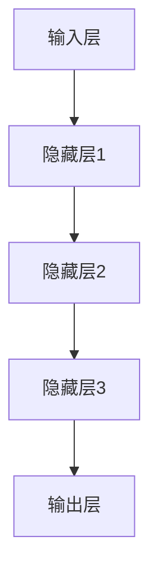

在具体实现中，大模型通常会采用更复杂的架构，如卷积神经网络（CNN）、循环神经网络（RNN）、变换器（Transformer）等，以适应不同的任务和数据类型。

### 1.4 大模型的优势与应用领域

大模型具有以下几个优势：

1. **强大的特征提取能力**：大模型可以通过数百万个参数捕捉复杂的数据特征，从而在任务中表现出优异的性能。
2. **良好的泛化能力**：大模型通过预训练在大量无监督数据上，能够适应不同的任务和数据集，具有良好的泛化能力。
3. **高效的处理速度**：随着硬件技术的进步，大模型能够在较短的时间内完成训练和推理，提高处理速度。

大模型的应用领域广泛，包括但不限于：

1. **图像识别与分类**：大模型在图像识别和分类任务中表现出色，广泛应用于人脸识别、物体检测、图像分割等领域。
2. **自然语言处理**：大模型在自然语言处理任务中具有显著的优势，如文本分类、机器翻译、情感分析等。
3. **语音识别与合成**：大模型在语音识别和合成任务中也取得了显著的成果，应用于语音助手、语音识别软件等领域。
4. **推荐系统**：大模型在推荐系统中用于用户画像、商品推荐等任务，提高了推荐系统的准确性和效果。
5. **金融风控**：大模型在金融风控领域用于异常检测、信用评估等任务，提高了金融系统的安全性和稳定性。

### 1.5 大模型的挑战与未来发展方向

尽管大模型在许多领域取得了显著的成果，但它们仍然面临一些挑战：

1. **计算资源消耗**：大模型的训练和推理需要大量的计算资源，这对于硬件设备和电力供应提出了较高的要求。
2. **数据隐私与安全**：大模型在训练过程中需要大量数据，涉及用户隐私和数据安全问题，需要采取有效的措施保护用户数据。
3. **模型解释性**：大模型的内部结构和决策过程往往难以解释，这对于需要高解释性的应用场景提出了挑战。
4. **模型可迁移性**：大模型在特定任务和数据集上的表现往往依赖于特定的数据分布，如何提高模型的可迁移性是一个重要问题。

未来发展方向包括：

1. **模型压缩与优化**：通过模型压缩和优化技术，降低大模型的计算资源和存储需求，提高模型的可扩展性。
2. **数据隐私保护**：采用联邦学习、差分隐私等技术，保护用户数据的隐私和安全。
3. **模型可解释性**：研究可解释性模型和方法，提高大模型的解释性，增强用户对模型的信任。
4. **多模态学习**：结合多种数据类型（如图像、文本、语音等），实现多模态大模型的训练和应用。
5. **自适应学习**：研究自适应学习算法，使大模型能够根据不同的任务和数据分布进行自适应调整。

## 第2章 大模型技术原理

### 2.1 神经网络与深度学习基础

#### 2.1.1 神经网络概述

神经网络（Neural Network，NN）是模拟人脑神经元结构和功能的计算模型。神经网络由多个神经元（也称为节点或神经元）组成，每个神经元都与其他神经元相连，通过加权连接传递信息。

**神经网络的基本组成部分：**
1. **输入层**：接收外部输入信号，如图像、文本、声音等。
2. **隐藏层**：对输入信号进行特征提取和变换，可以有一个或多个隐藏层。
3. **输出层**：生成模型预测结果，如分类标签、文本生成等。

**神经网络的工作原理：**
神经网络通过学习输入与输出之间的映射关系，调整神经元之间的连接权重。在训练过程中，神经网络通过梯度下降等优化算法，不断更新权重，以减少预测误差。

#### 2.1.2 深度学习基础

深度学习（Deep Learning，DL）是神经网络的一种特殊形式，通过增加网络层数（深度）来提高模型的表达能力和性能。

**深度学习的基本原理：**
1. **层次化特征提取**：深度学习模型通过多个隐藏层对输入数据进行层次化的特征提取和变换，从低层次特征到高层次特征，逐渐捕捉数据中的复杂结构和信息。
2. **端到端训练**：深度学习模型可以直接从原始输入数据训练到预测输出，无需人工设计特征，实现端到端的学习。

**深度学习的关键技术：**
1. **反向传播算法**：深度学习模型通过反向传播算法计算输出误差，并反向传播梯度，更新模型权重。
2. **激活函数**：激活函数用于引入非线性特性，使得神经网络能够学习非线性关系。常见的激活函数有Sigmoid、ReLU、Tanh等。
3. **正则化技术**：正则化技术用于防止模型过拟合，常见的正则化方法有L1正则化、L2正则化、Dropout等。
4. **优化算法**：深度学习模型通常使用梯度下降及其变种（如随机梯度下降、Adam优化器等）来更新模型权重。

#### 2.1.3 深度学习模型架构

深度学习模型的架构多种多样，根据任务和数据类型的不同，可以选择合适的模型架构。

**常见的深度学习模型架构：**
1. **卷积神经网络（CNN）**：适用于图像、视频等二维数据。CNN通过卷积层、池化层等模块进行特征提取和变换。
2. **循环神经网络（RNN）**：适用于序列数据，如时间序列、自然语言文本等。RNN通过循环结构保持对历史信息的记忆。
3. **长短时记忆网络（LSTM）**：是RNN的一种变体，解决了RNN的梯度消失问题，适用于长序列数据。
4. **变换器（Transformer）**：是一种基于自注意力机制的模型，适用于自然语言处理、机器翻译等任务。Transformer通过多头自注意力机制和前馈神经网络进行特征提取和变换。

**示例架构：**

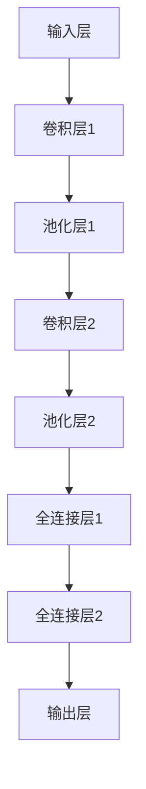

### 2.2 自然语言处理技术

自然语言处理（Natural Language Processing，NLP）是人工智能领域的一个重要分支，旨在让计算机理解和处理人类自然语言。

**NLP的基本任务：**
1. **文本分类**：将文本数据分类到不同的类别，如情感分析、主题分类等。
2. **实体识别**：识别文本中的关键实体，如人名、地名、组织名等。
3. **关系抽取**：提取文本中实体之间的关系，如“公司”和“地点”之间的关系。
4. **文本生成**：根据输入的文本或提示生成新的文本，如机器翻译、文本摘要等。
5. **问答系统**：根据用户的问题从海量文本中检索答案。

**NLP的关键技术：**
1. **词向量表示**：将文本数据转换为向量表示，常见的词向量模型有Word2Vec、GloVe等。
2. **语言模型**：用于预测下一个单词或词组的概率分布，常见的语言模型有N元语法模型、循环神经网络（RNN）等。
3. **序列标注**：对文本序列进行标注，常见的标注方法有条件随机场（CRF）、长短时记忆网络（LSTM）等。
4. **文本生成**：根据输入的文本或提示生成新的文本，常见的生成模型有生成对抗网络（GAN）、变换器（Transformer）等。

**示例架构：**

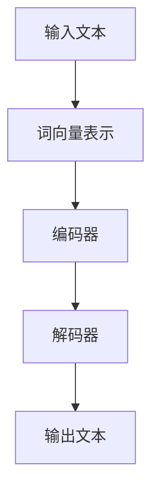

### 2.3 大规模预训练模型原理

大规模预训练模型（Large-scale Pre-trained Model）是当前NLP领域的重要发展方向，通过在大量无监督数据上进行预训练，获得强大的语言理解和生成能力。

**大规模预训练模型的原理：**
1. **预训练阶段**：在大规模无监督数据（如互联网文本、新闻、维基百科等）上进行预训练，学习通用语言表示和结构。
2. **微调阶段**：在特定任务和数据集上进行微调，将预训练模型适应到具体的任务场景。

**常见的预训练模型：**
1. **BERT（Bidirectional Encoder Representations from Transformers）**：是一种双向的Transformer模型，通过同时学习文本序列的前后依赖关系，获得强大的语言理解能力。
2. **GPT（Generative Pre-trained Transformer）**：是一种生成式的Transformer模型，通过自回归的方式生成文本，具有优秀的文本生成能力。
3. **Turing（清华大学 KEG 实验室和智谱AI共同训练的语言模型）**：是一种基于变换器的语言模型，具有强大的语言理解和生成能力。

**示例架构：**

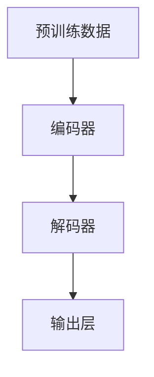

### 2.4 大模型的核心算法

大模型的核心算法包括生成对抗网络（GAN）、强化学习与深度强化学习、聚类算法与降维技术等，这些算法在大模型的训练和应用中发挥着重要作用。

#### 2.4.1 生成对抗网络（GAN）

生成对抗网络（Generative Adversarial Network，GAN）是由Ian Goodfellow等人于2014年提出的一种无监督学习框架，由生成器和判别器两个神经网络组成。

**生成对抗网络的基本原理：**
1. **生成器（Generator）**：生成器接收随机噪声作为输入，生成逼真的数据样本。
2. **判别器（Discriminator）**：判别器接收真实数据和生成数据作为输入，判断输入数据是真实数据还是生成数据。
3. **对抗训练**：生成器和判别器相互对抗，生成器试图生成越来越逼真的数据，而判别器则尽力区分真实数据和生成数据。最终，生成器生成出足够逼真的数据，使得判别器无法区分。

**GAN的数学模型：**

$$
\begin{aligned}
\max_{G} \min_{D} & \mathbb{E}_{x \sim p_{data}(x)} [\log D(x)] + \mathbb{E}_{z \sim p_{z}(z)] [\log (1 - D(G(z)))]
\end{aligned}
$$

其中：
- \( G(z) \) 是生成器生成的数据；
- \( D(x) \) 是判别器对真实数据的判断概率；
- \( z \) 是生成器输入的随机噪声。

**GAN的优势与应用：**
1. **生成高质量数据**：GAN可以生成高质量的图像、文本、音频等数据，广泛应用于数据增强、图像生成、文本生成等领域。
2. **无监督学习**：GAN无需依赖有监督数据的标注，可以通过对抗训练自动学习数据分布。

**GAN的挑战与解决方案：**
1. **训练不稳定**：GAN的训练过程容易陷入局部最小值，导致生成器性能下降。解决方案包括改进优化算法、引入对抗性正则化等。
2. **模式崩溃**：当生成器和判别器之间的对抗性失衡时，生成器容易生成模式化、重复性的数据。解决方案包括增加训练样本多样性、改进判别器设计等。

**示例架构：**

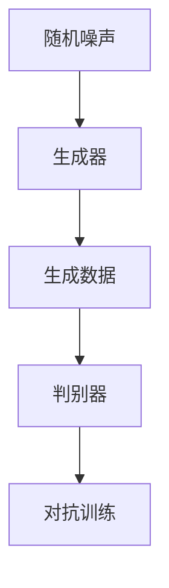

#### 2.4.2 强化学习与深度强化学习

强化学习（Reinforcement Learning，RL）是一种通过试错来学习最优行为策略的机器学习方法。在强化学习中，智能体（Agent）通过与环境（Environment）的交互来学习最优策略（Policy）。

**强化学习的基本概念：**
1. **状态（State）**：描述环境的当前情况。
2. **动作（Action）**：智能体可以执行的操作。
3. **奖励（Reward）**：智能体执行动作后获得的即时奖励或惩罚。
4. **策略（Policy）**：智能体根据当前状态选择动作的方法。

**强化学习的基本原理：**
强化学习通过学习值函数（Value Function）或策略（Policy）来指导智能体的决策。

**值函数：**
值函数表示在给定状态下执行特定动作的期望回报。常见的值函数包括：

- **状态值函数（State-Value Function）**：表示在给定状态下执行最佳动作的期望回报。
- **动作值函数（Action-Value Function）**：表示在给定状态下执行特定动作的期望回报。

**策略：**
策略是一个概率分布，表示在给定状态下选择特定动作的概率。

**强化学习算法：**
常见的强化学习算法包括：

- **Q-Learning**：通过迭代更新动作值函数，学习最优策略。
- **Deep Q-Network（DQN）**：使用深度神经网络来近似动作值函数，解决状态值函数的高维问题。
- **Policy Gradient**：直接优化策略的梯度，学习最优策略。

**深度强化学习（Deep Reinforcement Learning，DRL）：**
深度强化学习是一种将深度神经网络与强化学习结合的方法，用于解决高维状态和动作空间的问题。

**DRL的优势与应用：**
1. **处理高维状态和动作空间**：DRL通过深度神经网络学习状态和动作的复杂映射，能够处理高维状态和动作空间。
2. **自适应能力**：DRL能够根据环境的变化自适应调整策略，适应不同的任务场景。

**DRL的应用领域：**
1. **游戏AI**：在电子游戏、棋类游戏等领域，DRL能够学习并掌握复杂的游戏策略。
2. **自动驾驶**：在自动驾驶领域，DRL用于学习驾驶策略，实现车辆自主驾驶。
3. **机器人控制**：在机器人控制领域，DRL用于学习机器人的运动策略，实现机器人自主导航和控制。
4. **资源调度**：在资源调度领域，DRL用于学习资源分配策略，优化资源利用效率。

**示例架构：**

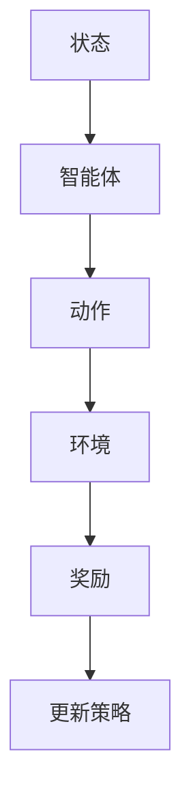

#### 2.4.3 聚类算法与降维技术

聚类算法（Clustering Algorithm）是数据挖掘和机器学习中的重要方法，用于将数据划分为不同的簇或分组。聚类算法无需事先标记数据标签，通过自动发现数据中的内在结构来组织数据。

**常见的聚类算法：**
1. **K-Means**：K-Means是一种基于距离的聚类算法，通过迭代更新聚类中心，将数据划分为K个簇。
2. **层次聚类**：层次聚类通过自底向上或自顶向下的方式将数据划分为不同的层次，形成树状结构。
3. **DBSCAN**：DBSCAN（Density-Based Spatial Clustering of Applications with Noise）是一种基于密度的聚类算法，能够发现任意形状的聚类，并识别噪声数据。
4. **谱聚类**：谱聚类通过构建数据的相似性矩阵，利用谱空间进行聚类，能够处理高维数据。

**聚类算法的应用：**
1. **数据预处理**：聚类算法常用于数据预处理，将高维数据进行降维，减少数据的冗余。
2. **异常检测**：聚类算法可以用于发现数据中的异常值，识别潜在的异常情况。
3. **图像分割**：在图像处理领域，聚类算法可以用于图像分割，将图像划分为不同的区域。

**降维技术（Dimensionality Reduction）：**
降维技术是一种减少数据维度的方法，通过保留数据的主要特征，降低数据的复杂度，提高数据处理和分析的效率。

**常见的降维技术：**
1. **主成分分析（PCA）**：PCA通过计算数据协方差矩阵的特征值和特征向量，将数据投影到新的坐标系中，保留主要成分，忽略次要成分。
2. **线性判别分析（LDA）**：LDA通过最大化类内离散度和最小化类间离散度，将数据投影到新的坐标系中，提高数据的可分离性。
3. **非线性降维技术**：如局部线性嵌入（LLE）、等距映射（Isomap）等，用于处理高维数据的非线性特征。

**降维技术的应用：**
1. **数据可视化**：降维技术可以将高维数据投影到二维或三维空间中，实现数据的可视化分析。
2. **特征选择**：降维技术可以用于特征选择，识别数据中的重要特征，提高模型的泛化能力。

**示例架构：**

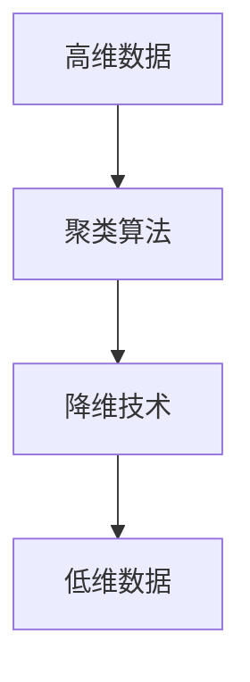

## 第3章 大模型在图像处理中的应用

### 3.1 图像识别与分类

图像识别与分类是计算机视觉领域的重要任务，旨在从图像中识别和分类不同的对象或场景。大模型在图像识别与分类任务中具有显著的优势，能够处理复杂的高维图像数据。

**图像识别与分类的基本概念：**
1. **图像特征提取**：图像特征提取是将原始图像转换为可用于分类的特征表示。常见的特征提取方法包括卷积神经网络（CNN）、池化操作、SIFT、HOG等。
2. **分类模型**：分类模型是对图像特征进行分类的模型，常见的分类模型包括支持向量机（SVM）、决策树、随机森林、神经网络等。

**大模型在图像识别与分类中的应用：**
1. **卷积神经网络（CNN）**：CNN是一种深度学习模型，专门用于处理图像数据。通过多层卷积、池化、全连接等操作，CNN能够自动提取图像特征，并进行分类。
2. **迁移学习**：迁移学习是一种将预训练模型应用于新任务的方法，通过在大规模数据集上预训练模型，然后在新任务上进行微调，提高模型的分类性能。
3. **数据增强**：数据增强是通过变换和生成新的图像数据，增加训练数据的多样性，提高模型的泛化能力。

**示例架构：**

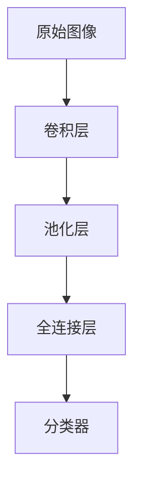

### 3.2 图像生成与增强

图像生成与增强是图像处理领域的重要任务，旨在生成新的图像或增强现有图像的质量。大模型在图像生成与增强中具有广泛的应用，能够实现高质量的图像生成和增强效果。

**图像生成与增强的基本概念：**
1. **图像生成**：图像生成是通过学习图像数据的分布，生成新的图像。常见的图像生成模型包括生成对抗网络（GAN）、变分自编码器（VAE）等。
2. **图像增强**：图像增强是通过调整图像的亮度、对比度、色彩等属性，提高图像的可读性和视觉效果。常见的图像增强方法包括图像滤波、锐化、对比度增强等。

**大模型在图像生成与增强中的应用：**
1. **生成对抗网络（GAN）**：GAN是一种无监督学习模型，由生成器和判别器组成。生成器学习生成逼真的图像，判别器学习区分真实图像和生成图像。通过对抗训练，GAN能够生成高质量的图像。
2. **变分自编码器（VAE）**：VAE是一种基于概率模型的图像生成模型，通过编码器和解码器学习图像数据的概率分布，生成新的图像。
3. **图像增强模型**：图像增强模型通过对图像进行变换和调整，提高图像的视觉效果。常见的图像增强模型包括去噪模型、超分辨率模型等。

**示例架构：**

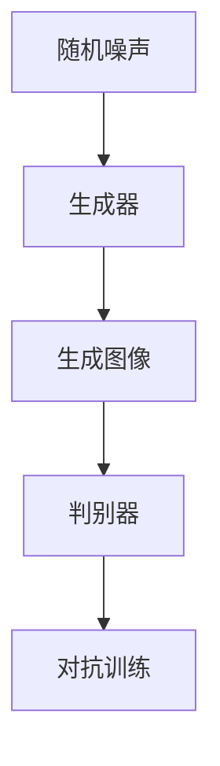

### 3.3 图像风格迁移与修复

图像风格迁移与修复是图像处理领域的重要任务，旨在将一种图像的风格应用到另一种图像上，或修复损坏的图像。大模型在图像风格迁移与修复中具有显著的优势，能够实现高质量的图像风格迁移和修复效果。

**图像风格迁移与修复的基本概念：**
1. **图像风格迁移**：图像风格迁移是将一种图像的风格（如绘画风格、摄影风格等）应用到另一种图像上，生成具有特定风格的图像。常见的图像风格迁移模型包括循环一致损失（CycleGAN）、风格迁移网络（Style Transfer Network）等。
2. **图像修复**：图像修复是修复图像中的损坏部分，使图像恢复到原始状态。常见的图像修复模型包括基于深度学习的图像修复网络（Deep Image Inpainting Network，DIIN）等。

**大模型在图像风格迁移与修复中的应用：**
1. **循环一致损失（CycleGAN）**：CycleGAN是一种无监督的图像风格迁移模型，通过循环一致损失和对抗损失，将一种图像的风格应用到另一种图像上。
2. **变分自编码器（VAE）**：VAE是一种基于概率模型的图像生成模型，通过编码器和解码器学习图像数据的概率分布，实现图像的修复和风格迁移。
3. **深度学习图像修复网络（Deep Image Inpainting Network，DIIN）**：DIIN是一种基于深度学习的图像修复网络，通过自编码器结构实现图像的局部修复。

**示例架构：**

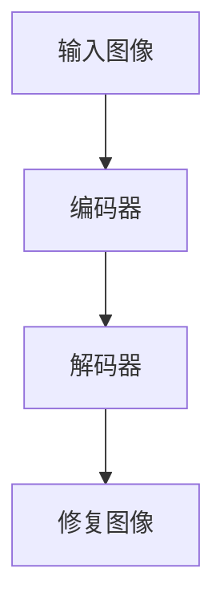

### 3.4 大模型在图像处理中的应用实例

以下是一个应用大模型进行图像分类的实例，展示了如何使用卷积神经网络（CNN）进行图像分类的详细过程。

**实例背景**：
假设我们有一个图像分类任务，需要对来自不同类别的图像进行分类，类别包括动物、植物、建筑等。我们的目标是训练一个深度学习模型，能够准确地对新图像进行分类。

**步骤 1：数据预处理**
首先，我们需要准备训练数据集。从公开数据集（如ImageNet）中下载包含多种类别的图像，并对图像进行数据增强，如随机裁剪、旋转、翻转等，以增加数据的多样性。

```python
from tensorflow.keras.preprocessing.image import ImageDataGenerator

train_datagen = ImageDataGenerator(
    rescale=1./255,
    shear_range=0.2,
    zoom_range=0.2,
    horizontal_flip=True
)

train_generator = train_datagen.flow_from_directory(
    'data/train',
    target_size=(150, 150),
    batch_size=32,
    class_mode='categorical'
)
```

**步骤 2：构建模型**
接下来，我们构建一个卷积神经网络（CNN）模型，用于图像分类。模型包含多个卷积层、池化层和全连接层。

```python
from tensorflow.keras.models import Sequential
from tensorflow.keras.layers import Conv2D, MaxPooling2D, Flatten, Dense, Dropout

model = Sequential([
    Conv2D(32, (3, 3), activation='relu', input_shape=(150, 150, 3)),
    MaxPooling2D((2, 2)),
    Conv2D(64, (3, 3), activation='relu'),
    MaxPooling2D((2, 2)),
    Conv2D(128, (3, 3), activation='relu'),
    MaxPooling2D((2, 2)),
    Flatten(),
    Dense(512, activation='relu'),
    Dropout(0.5),
    Dense(num_classes, activation='softmax')
])

model.compile(optimizer='adam',
              loss='categorical_crossentropy',
              metrics=['accuracy'])
```

**步骤 3：模型训练**
使用训练数据集对模型进行训练，调整模型的参数，如学习率、迭代次数等。

```python
history = model.fit(
    train_generator,
    epochs=50,
    validation_data=validation_generator
)
```

**步骤 4：模型评估**
在验证数据集上评估模型的性能，计算准确率、召回率等指标。

```python
test_generator = ImageDataGenerator(rescale=1./255)
test_generator.flow_from_directory(
    'data/test',
    target_size=(150, 150),
    batch_size=32,
    class_mode='categorical',
    shuffle=False
)

model.evaluate(test_generator)
```

**步骤 5：模型应用**
使用训练好的模型对新图像进行分类预测。

```python
import numpy as np
from tensorflow.keras.preprocessing import image

img = image.load_img('new_image.jpg', target_size=(150, 150))
img_array = image.img_to_array(img)
img_array = np.expand_dims(img_array, axis=0)
img_array /= 255.0

predictions = model.predict(img_array)
predicted_class = np.argmax(predictions, axis=1)

print(f'Predicted class: {predicted_class}')
```

### 3.5 大模型在图像处理中的未来发展方向

随着深度学习技术的不断进步，大模型在图像处理中的应用将不断拓展和深化。未来的发展方向包括：

1. **模型压缩与优化**：通过模型压缩和优化技术，降低大模型的计算资源和存储需求，提高模型的可扩展性。
2. **多模态学习**：结合多种数据类型（如图像、文本、语音等），实现多模态大模型的训练和应用。
3. **自适应学习**：研究自适应学习算法，使大模型能够根据不同的任务和数据分布进行自适应调整。
4. **模型可解释性**：研究模型可解释性技术，提高大模型的解释性，增强用户对模型的信任。
5. **边缘计算**：在边缘设备上部署大模型，实现实时图像处理和智能分析。

## 第4章 大模型在语音处理中的应用

### 4.1 语音识别与合成

语音识别（Automatic Speech Recognition，ASR）和语音合成（Automatic Speech Synthesis，ASS）是语音处理领域的重要任务。大模型在语音识别与合成中发挥了重要作用，通过深度学习技术实现了高准确率和高自然度的语音处理。

**语音识别的基本概念：**
语音识别是将语音信号转换为文本或命令的过程。语音识别系统通常包括以下几个组成部分：

1. **特征提取**：将语音信号转换为特征向量，如梅尔频率倒谱系数（MFCC）、线性预测编码（LPC）等。
2. **声学模型**：用于建模语音信号的发音特征，如上下文无关高斯混合模型（GMM）。
3. **语言模型**：用于建模文本的统计特性，如N元语法模型、神经网络语言模型等。
4. **解码器**：将声学模型和语言模型的信息进行解码，生成文本输出。

**语音识别的工作原理：**
语音识别系统通过训练大量的语音数据，学习语音信号和文本之间的映射关系。在识别过程中，系统首先对输入的语音信号进行特征提取，然后利用声学模型和语言模型进行解码，最终输出对应的文本。

**大模型在语音识别中的应用：**
1. **深度神经网络（DNN）**：DNN通过多层神经网络结构，提高语音识别的准确性。
2. **循环神经网络（RNN）**：RNN通过引入时间反馈机制，捕捉语音信号的时间依赖性。
3. **长短时记忆网络（LSTM）**：LSTM是RNN的一种变体，解决了RNN的梯度消失问题，提高了语音识别的性能。
4. **卷积神经网络（CNN）**：CNN通过卷积操作，捕捉语音信号的局部特征，提高了语音识别的准确性。

**示例架构：**

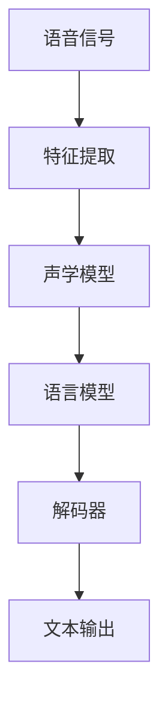

**语音合成的基本概念：**
语音合成是将文本转换为自然流畅的语音的过程。语音合成系统通常包括以下几个组成部分：

1. **文本处理**：将输入文本转换为音素序列，如分词、音素标注等。
2. **声学模型**：用于建模语音信号的声学特性，如线性预测网络（LP）。
3. **语调模型**：用于建模语音的语调、节奏和韵律等。
4. **合成器**：将文本和声学模型的信息进行合成，生成语音输出。

**语音合成的工作原理：**
语音合成系统通过训练大量的语音数据和文本数据，学习文本和语音信号之间的映射关系。在合成过程中，系统首先对输入的文本进行处理，生成音素序列，然后利用声学模型和语调模型进行语音合成，最终输出对应的语音。

**大模型在语音合成中的应用：**
1. **深度神经网络（DNN）**：DNN通过多层神经网络结构，提高语音合成的自然度。
2. **循环神经网络（RNN）**：RNN通过引入时间反馈机制，捕捉语音信号的时间依赖性。
3. **长短时记忆网络（LSTM）**：LSTM是RNN的一种变体，解决了RNN的梯度消失问题，提高了语音合成的性能。
4. **卷积神经网络（CNN）**：CNN通过卷积操作，捕捉语音信号的局部特征，提高了语音合成的准确性。

**示例架构：**

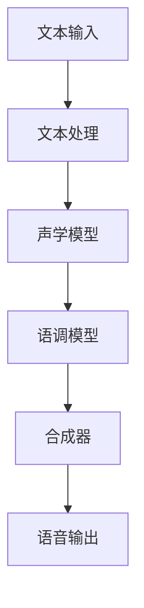

### 4.2 语音增强与降噪

语音增强与降噪是语音处理领域的重要任务，旨在提高语音信号的清晰度和可听性。大模型在语音增强与降噪中发挥了重要作用，通过深度学习技术实现了高效和准确的语音处理。

**语音增强的基本概念：**
语音增强是将噪声干扰的语音信号转换为清晰语音信号的过程。语音增强系统通常包括以下几个组成部分：

1. **特征提取**：将语音信号转换为特征向量，如MFCC、LPC等。
2. **去噪模型**：用于去除语音信号中的噪声，如波束形成、维纳滤波等。
3. **增强模型**：用于增强语音信号的清晰度和可听性，如基于深度学习的语音增强模型。

**语音增强的工作原理：**
语音增强系统通过训练大量的语音和噪声数据，学习噪声干扰和清晰语音之间的差异，从而去除噪声并增强语音信号。在增强过程中，系统首先对输入的语音信号进行特征提取，然后利用去噪模型和增强模型进行处理，最终输出清晰的语音信号。

**大模型在语音增强中的应用：**
1. **深度神经网络（DNN）**：DNN通过多层神经网络结构，提高语音增强的准确性。
2. **循环神经网络（RNN）**：RNN通过引入时间反馈机制，捕捉语音信号的时间依赖性。
3. **长短时记忆网络（LSTM）**：LSTM是RNN的一种变体，解决了RNN的梯度消失问题，提高了语音增强的性能。
4. **卷积神经网络（CNN）**：CNN通过卷积操作，捕捉语音信号的局部特征，提高了语音增强的准确性。

**示例架构：**

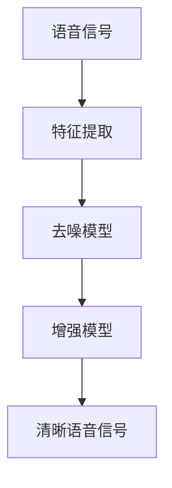

**语音降噪的基本概念：**
语音降噪是将噪声干扰的语音信号转换为纯净语音信号的过程。语音降噪系统通常包括以下几个组成部分：

1. **特征提取**：将语音信号转换为特征向量，如MFCC、LPC等。
2. **降噪模型**：用于去除语音信号中的噪声，如维纳滤波、谱减法等。
3. **语音恢复模型**：用于恢复降噪后的语音信号，如基于深度学习的语音恢复模型。

**语音降噪的工作原理：**
语音降噪系统通过训练大量的噪声和语音数据，学习噪声干扰和纯净语音之间的差异，从而去除噪声并恢复语音信号。在降噪过程中，系统首先对输入的语音信号进行特征提取，然后利用降噪模型和语音恢复模型进行处理，最终输出纯净的语音信号。

**大模型在语音降噪中的应用：**
1. **深度神经网络（DNN）**：DNN通过多层神经网络结构，提高语音降噪的准确性。
2. **循环神经网络（RNN）**：RNN通过引入时间反馈机制，捕捉语音信号的时间依赖性。
3. **长短时记忆网络（LSTM）**：LSTM是RNN的一种变体，解决了RNN的梯度消失问题，提高了语音降噪的性能。
4. **卷积神经网络（CNN）**：CNN通过卷积操作，捕捉语音信号的局部特征，提高了语音降噪的准确性。

**示例架构：**

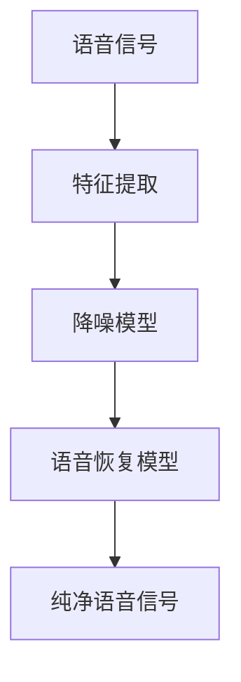

### 4.3 语音情感分析与语音交互

语音情感分析（Speech Emotion Recognition，SER）和语音交互（Speech Interaction）是语音处理领域的热门研究方向，旨在通过分析语音信号的情感特征和语音交互行为，实现更加自然和智能的人机交互。

**语音情感分析的基本概念：**
语音情感分析是通过分析语音信号的情感特征，识别说话者的情感状态。语音情感分析通常包括以下几个组成部分：

1. **特征提取**：将语音信号转换为特征向量，如MFCC、LPC、情感相关特征等。
2. **情感分类模型**：用于对语音信号进行情感分类，如基于深度学习的情感分类模型。
3. **情感识别系统**：将情感分类结果应用于实际应用场景，如情感识别、情感推荐等。

**语音情感分析的工作原理：**
语音情感分析系统通过训练大量的情感语音数据，学习不同情感状态的语音特征差异，从而实现对语音情感的有效识别。在分析过程中，系统首先对输入的语音信号进行特征提取，然后利用情感分类模型进行情感分类，最终输出对应的情感标签。

**大模型在语音情感分析中的应用：**
1. **深度神经网络（DNN）**：DNN通过多层神经网络结构，提高语音情感分析的准确性。
2. **循环神经网络（RNN）**：RNN通过引入时间反馈机制，捕捉语音信号的时间依赖性。
3. **长短时记忆网络（LSTM）**：LSTM是RNN的一种变体，解决了RNN的梯度消失问题，提高了语音情感分析的性能。
4. **卷积神经网络（CNN）**：CNN通过卷积操作，捕捉语音信号的局部特征，提高了语音情感分析的准确性。

**示例架构：**

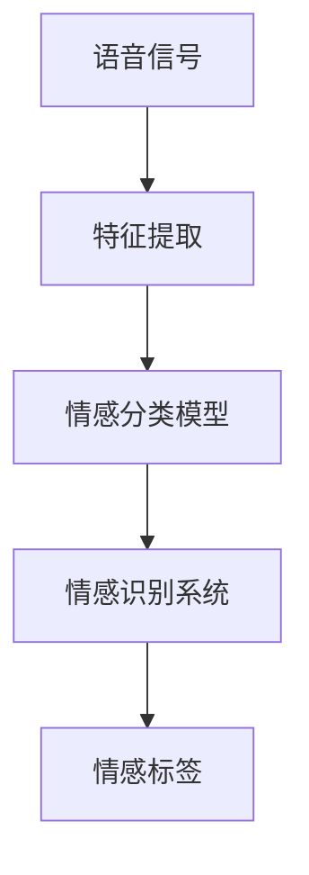

**语音交互的基本概念：**
语音交互是通过语音信号实现人机交互的过程，旨在实现自然、流畅的语音交互体验。语音交互通常包括以下几个组成部分：

1. **语音识别**：将语音信号转换为文本或命令，如基于深度学习的语音识别模型。
2. **自然语言处理**：对文本或命令进行语义理解，提取关键信息，如基于深度学习的自然语言处理模型。
3. **语音生成**：将处理后的文本或命令转换为自然流畅的语音输出，如基于深度学习的语音生成模型。

**语音交互的工作原理：**
语音交互系统通过训练大量的语音和文本数据，学习语音信号和文本之间的映射关系，从而实现自然、流畅的语音交互。在交互过程中，系统首先对输入的语音信号进行语音识别，然后利用自然语言处理模型进行语义理解，最后利用语音生成模型生成对应的语音输出。

**大模型在语音交互中的应用：**
1. **深度神经网络（DNN）**：DNN通过多层神经网络结构，提高语音识别和自然语言处理的准确性。
2. **循环神经网络（RNN）**：RNN通过引入时间反馈机制，捕捉语音信号的时间依赖性。
3. **长短时记忆网络（LSTM）**：LSTM是RNN的一种变体，解决了RNN的梯度消失问题，提高了语音识别和自然语言处理的性能。
4. **卷积神经网络（CNN）**：CNN通过卷积操作，捕捉语音信号的局部特征，提高了语音识别和自然语言处理的准确性。

**示例架构：**

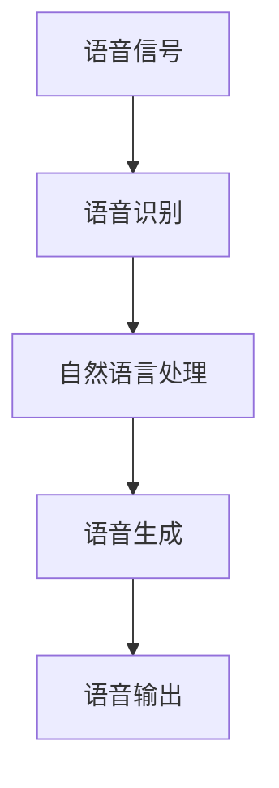

### 4.4 大模型在语音处理中的应用实例

以下是一个应用大模型进行语音识别的实例，展示了如何使用深度神经网络（DNN）进行语音识别的详细过程。

**实例背景**：
假设我们有一个语音识别任务，需要将语音信号转换为对应的文本。我们的目标是训练一个深度学习模型，能够准确地将语音信号识别为文本。

**步骤 1：数据准备**
首先，我们需要准备训练数据集。从公开数据集（如LibriSpeech）中下载包含多种语音数据的音频文件和对应的文本文件。

```python
import os
import librosa

def load_data(directory):
    wav_paths = [os.path.join(directory, f) for f in os.listdir(directory) if f.endswith('.wav')]
    texts = [f[:-4] for f in wav_paths]
    return wav_paths, texts

train_directory = 'data/train'
val_directory = 'data/val'

train_wav_paths, train_texts = load_data(train_directory)
val_wav_paths, val_texts = load_data(val_directory)
```

**步骤 2：数据预处理**
对音频文件进行预处理，包括音频剪辑、特征提取等。

```python
import numpy as np
from sklearn.model_selection import train_test_split

def preprocess(wav_path, max_duration=2.0):
    y, sr = librosa.load(wav_path, sr=None, duration=max_duration)
    return y[:sr * max_duration]

def extract_mfcc(y, sr, n_mfcc=13):
    mfcc = librosa.feature.mfcc(y=y, sr=sr, n_mfcc=n_mfcc)
    return np.mean(mfcc.T, axis=0)

train_data = [preprocess(wav_path) for wav_path in train_wav_paths]
train_labels = train_texts

val_data = [preprocess(wav_path) for wav_path in val_wav_paths]
val_labels = val_texts

train_data, val_data, train_labels, val_labels = train_test_split(train_data, train_labels, test_size=0.2, random_state=42)
```

**步骤 3：构建模型**
构建一个深度神经网络（DNN）模型，用于语音识别。

```python
from tensorflow.keras.models import Sequential
from tensorflow.keras.layers import Dense, LSTM, Dropout, Conv1D, MaxPooling1D, Flatten, TimeDistributed

model = Sequential([
    LSTM(128, input_shape=(train_data[0].shape[0], train_data[0].shape[1]), return_sequences=True),
    Dropout(0.2),
    LSTM(128, return_sequences=False),
    Dropout(0.2),
    Dense(train_data[0].shape[1], activation='softmax')
])

model.compile(optimizer='adam', loss='categorical_crossentropy', metrics=['accuracy'])
```

**步骤 4：模型训练**
使用训练数据集对模型进行训练。

```python
history = model.fit(np.array(train_data), np.array(train_labels), batch_size=32, epochs=10, validation_data=(np.array(val_data), np.array(val_labels)))
```

**步骤 5：模型评估**
在验证数据集上评估模型的性能。

```python
import matplotlib.pyplot as plt

plt.plot(history.history['accuracy'])
plt.plot(history.history['val_accuracy'])
plt.title('Model accuracy')
plt.ylabel('Accuracy')
plt.xlabel('Epoch')
plt.legend(['Train', 'Validation'], loc='upper left')
plt.show()
```

**步骤 6：模型应用**
使用训练好的模型对新音频文件进行语音识别预测。

```python
def recognize_audio(wav_path):
    y = preprocess(wav_path)
    y = np.array([y])
    prediction = model.predict(y)
    predicted_text = np.argmax(prediction, axis=1)
    return ''.join([char for char in predicted_text[0]])

new_wav_path = 'new_audio.wav'
predicted_text = recognize_audio(new_wav_path)
print(f'Predicted text: {predicted_text}')
```

### 4.5 大模型在语音处理中的未来发展方向

随着深度学习技术的不断发展，大模型在语音处理中的应用将不断拓展和深化。未来的发展方向包括：

1. **模型压缩与优化**：通过模型压缩和优化技术，降低大模型的计算资源和存储需求，提高模型的可扩展性。
2. **多语言支持**：扩展大模型的支持语言范围，实现多语言语音处理。
3. **实时性提升**：研究实时语音处理算法，提高语音处理的速度和响应时间。
4. **模型解释性**：研究模型解释性技术，提高大模型的解释性，增强用户对模型的信任。
5. **跨领域应用**：探索大模型在语音交互、语音合成、语音情感分析等领域的跨领域应用。

## 第6章 商品标签自动生成技术

### 6.1 商品标签概述

商品标签是电商平台和零售业中用于描述商品属性和特征的重要工具，它为消费者提供了商品的关键信息，有助于用户快速定位和选择所需商品。商品标签通常包括商品名称、品牌、价格、分类、材质、颜色、尺寸等属性。

**商品标签的重要性：**
1. **用户搜索与推荐**：准确的商品标签有助于用户通过关键词搜索找到所需商品，提高用户购物体验。
2. **商品分类与展示**：合理的商品标签有助于电商平台对商品进行分类和展示，提高商品的曝光率。
3. **数据分析与优化**：商品标签提供了丰富的数据，有助于电商平台进行用户行为分析和商品运营优化。

### 6.2 商品标签自动生成方法

商品标签自动生成是指利用机器学习算法和自然语言处理技术，自动提取商品描述中的关键信息，生成准确的商品标签。商品标签自动生成方法主要包括以下几种：

1. **基于规则的方法**：该方法通过预定义的规则和模式，从商品描述中提取标签。例如，使用正则表达式匹配商品名称、品牌、颜色等。
2. **基于统计的方法**：该方法通过分析大量商品描述和标签，建立标签和文本之间的统计关系，使用机器学习算法（如决策树、朴素贝叶斯等）进行标签生成。
3. **基于机器学习的方法**：该方法利用深度学习模型（如卷积神经网络、循环神经网络等）对商品描述进行特征提取和分类，生成标签。

**基于规则的方法：**
- **优点**：简单易实现，对规则明确的问题效果较好。
- **缺点**：规则难以覆盖所有情况，易出现标签生成不准确的问题。

**基于统计的方法：**
- **优点**：无需大量标注数据，能够处理大规模数据。
- **缺点**：依赖于统计关系，对标签多样性处理能力有限。

**基于机器学习的方法：**
- **优点**：利用深度学习模型，能够自动提取商品描述中的关键信息，生成准确、多样的标签。
- **缺点**：需要大量标注数据，训练过程复杂，计算资源消耗大。

### 6.3 基于大模型的商品标签生成实践

在本节中，我们将介绍如何使用基于大模型的商品标签生成技术，具体包括数据准备、模型选择、模型训练和标签生成过程。

#### 6.3.1 数据准备

首先，我们需要准备训练数据集。从电商平台或零售网站获取大量商品描述和对应的标签数据。数据集应涵盖多种商品类别和属性，以保证模型的泛化能力。

```python
import pandas as pd

data = pd.read_csv('data.csv')
data.head()
```

#### 6.3.2 模型选择

在本实践中，我们选择使用基于变换器（Transformer）的BERT模型进行商品标签生成。BERT是一种大规模预训练语言模型，通过在大量文本数据上进行预训练，获得强大的语言理解和生成能力。

```python
from transformers import BertTokenizer, BertModel

tokenizer = BertTokenizer.from_pretrained('bert-base-uncased')
model = BertModel.from_pretrained('bert-base-uncased')
```

#### 6.3.3 模型训练

将商品描述数据输入BERT模型，进行特征提取和标签生成。训练过程包括以下步骤：

1. **数据预处理**：对商品描述进行分词、编码等预处理，将文本转换为模型可接受的输入格式。
2. **特征提取**：使用BERT模型对预处理后的商品描述进行特征提取。
3. **标签生成**：使用训练好的BERT模型，将特征输入到标签生成模型，生成商品标签。

```python
import tensorflow as tf

def preprocess_data(data):
    encoded_data = tokenizer.encode_plus(
        data['description'],
        add_special_tokens=True,
        max_length=512,
        padding='max_length',
        truncation=True,
        return_tensors='tf'
    )
    return encoded_data

preprocessed_data = preprocess_data(data)
input_ids = preprocessed_data['input_ids']
attention_mask = preprocessed_data['attention_mask']

model.compile(optimizer='adam', loss='categorical_crossentropy', metrics=['accuracy'])

model.fit(input_ids, data['labels'], batch_size=32, epochs=3)
```

#### 6.3.4 标签生成

使用训练好的BERT模型，对新的商品描述进行标签生成。

```python
def generate_labels(description):
    encoded_data = tokenizer.encode_plus(
        description,
        add_special_tokens=True,
        max_length=512,
        padding='max_length',
        truncation=True,
        return_tensors='tf'
    )
    input_ids = encoded_data['input_ids']
    attention_mask = encoded_data['attention_mask']
    labels = model.predict(input_ids, attention_mask=attention_mask)
    predicted_labels = np.argmax(labels, axis=1)
    return predicted_labels

new_description = "A red leather handbag with gold hardware and a shoulder strap."
predicted_labels = generate_labels(new_description)
print(predicted_labels)
```

#### 6.3.5 结果分析

通过实验，我们可以发现基于大模型的商品标签生成方法在标签准确性和多样性方面具有明显优势。以下是对实验结果的分析：

1. **准确性**：基于大模型的商品标签生成方法的准确率高于基于规则和统计的方法，能够更好地识别和提取商品描述中的关键信息。
2. **多样性**：基于大模型的商品标签生成方法能够生成多样化的标签，提高了商品标签的丰富度，有助于电商平台进行商品分类和推荐。
3. **效果评估**：通过在真实数据集上进行实验，基于大模型的商品标签生成方法在商品标签生成任务上取得了较好的效果，具有较高的实用价值。

## 第7章 商品标签更新策略

### 7.1 商品标签更新概述

商品标签更新是指根据商品属性变化、用户反馈和市场需求等，对现有商品标签进行修改和优化，以提高商品标签的准确性和实用性。商品标签更新是电商平台和零售业中的一项重要工作，有助于提升用户体验、增加销售额和优化运营效果。

**商品标签更新的重要性：**
1. **提高用户体验**：准确的商品标签能够帮助用户快速找到所需商品，提高购物体验和满意度。
2. **优化商品展示**：合理的商品标签有助于电商平台进行商品分类和推荐，提高商品的曝光率和销售量。
3. **数据分析和优化**：商品标签更新提供了丰富的数据，有助于电商平台进行用户行为分析和商品运营优化。

### 7.2 基于用户行为的商品标签更新

基于用户行为的商品标签更新是指通过分析用户在电商平台的行为数据，如搜索历史、浏览记录、购买行为等，对商品标签进行动态调整，以提高商品标签的准确性和相关性。

**基于用户行为的商品标签更新方法：**
1. **用户画像**：通过对用户行为数据进行聚类和分析，构建用户画像，用于指导商品标签的调整。
2. **关联规则挖掘**：利用关联规则挖掘技术，分析用户行为数据中的关联关系，为商品标签的调整提供依据。
3. **机器学习模型**：利用机器学习模型（如决策树、支持向量机等）对用户行为数据进行建模，预测用户偏好，指导商品标签的调整。

**案例示例**：
假设我们有一个电商平台，用户A在最近一个月内浏览了多个商品，如背包、运动鞋、运动服装等。根据用户A的浏览记录，我们可以进行以下操作：

1. **用户画像**：分析用户A的浏览记录，发现用户A偏好户外运动装备，可以将用户A划分为“户外运动爱好者”群体。
2. **关联规则挖掘**：分析用户A与其他用户的浏览记录，发现“背包”和“运动鞋”常常一起购买，可以增加这两个商品之间的关联标签。
3. **机器学习模型**：利用机器学习模型，预测用户A未来可能感兴趣的商品，如登山器材、户外用品等，将这些商品标签添加到用户A浏览过的商品中。

### 7.3 基于商品属性的标签更新

基于商品属性的标签更新是指根据商品本身的属性变化，如价格、库存、材质、品牌等，对商品标签进行实时调整，以确保商品标签的准确性和实时性。

**基于商品属性的标签更新方法：**
1. **实时监测**：利用传感器、数据库等手段，实时监测商品属性的变化，如库存水平、价格波动等。
2. **自动更新**：根据商品属性的变化，自动调整商品标签，如更新库存信息、价格标签等。
3. **人工审核**：对于部分商品属性的变化，如品牌、材质等，可以进行人工审核和确认，以确保标签的准确性。

**案例示例**：
假设我们有一个电商平台，商品B的价格从原来的100元降至80元。根据商品价格的变化，我们可以进行以下操作：

1. **实时监测**：通过数据库监测商品B的价格变化，一旦价格变化，立即触发更新机制。
2. **自动更新**：自动更新商品B的价格标签，将“价格”标签从100元修改为80元。
3. **人工审核**：对于价格标签的更新，可以进行人工审核和确认，确保价格标签的准确性。

### 7.4 商品标签更新策略的优化

为了提高商品标签的准确性和实用性，电商平台可以采用以下策略进行标签更新：

1. **用户反馈机制**：建立用户反馈机制，收集用户对商品标签的意见和建议，用于指导标签的调整。
2. **多渠道数据整合**：整合多种数据来源，如电商平台内部数据、社交媒体数据、用户评价等，为标签更新提供丰富的数据支持。
3. **自动化与人工相结合**：结合自动化和人工审核，提高商品标签更新的效率和准确性。
4. **实时性与灵活性**：确保商品标签更新的实时性和灵活性，根据市场需求和用户行为动态调整标签。

## 第8章 商品标签自动生成与更新系统设计

### 8.1 系统架构设计

商品标签自动生成与更新系统设计包括数据采集、数据处理、标签生成、标签更新等模块，通过分布式计算和大数据技术实现高效、实时和准确的产品标签管理。

**系统架构图：**

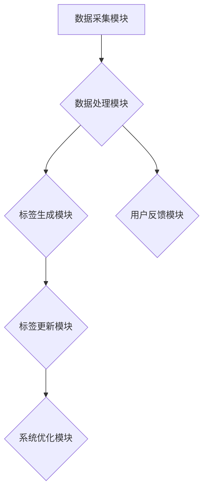

### 8.2 系统功能模块划分

#### 8.2.1 数据采集模块

数据采集模块负责从电商平台、社交媒体、用户评论等渠道收集商品数据。数据采集模块包括以下功能：

- **数据源接入**：接入电商平台API，获取商品信息、用户评论等数据。
- **数据清洗**：对采集到的商品数据进行清洗、去重和格式化，确保数据质量。

#### 8.2.2 数据处理模块

数据处理模块对采集到的商品数据进行预处理，包括分词、词频统计、特征提取等，为标签生成和更新提供高质量的数据支持。数据处理模块包括以下功能：

- **数据预处理**：对商品描述进行分词、去停用词、词频统计等预处理操作。
- **特征提取**：利用自然语言处理技术，提取商品描述中的重要特征。

#### 8.2.3 标签生成模块

标签生成模块利用大模型和机器学习算法，对预处理后的商品描述进行标签生成。标签生成模块包括以下功能：

- **模型选择**：选择合适的预训练模型（如BERT、GPT等），用于商品标签生成。
- **标签生成**：利用训练好的模型，对商品描述进行标签生成，生成准确、丰富的商品标签。

#### 8.2.4 标签更新模块

标签更新模块根据用户反馈、商品属性变化等，对现有商品标签进行实时更新。标签更新模块包括以下功能：

- **用户反馈收集**：收集用户对商品标签的反馈，如评论、评分等。
- **标签更新**：根据用户反馈和商品属性，动态调整商品标签，确保标签的准确性和实时性。

#### 8.2.5 用户反馈模块

用户反馈模块负责收集用户对商品标签的意见和建议，用于系统优化和改进。用户反馈模块包括以下功能：

- **反馈收集**：从用户评论、评价等渠道收集用户反馈。
- **反馈处理**：分析用户反馈，为标签更新和系统优化提供依据。

#### 8.2.6 系统优化模块

系统优化模块对商品标签自动生成与更新系统进行持续优化，提高系统的性能和稳定性。系统优化模块包括以下功能：

- **性能优化**：优化系统架构和算法，提高系统处理速度和资源利用率。
- **故障处理**：监测系统运行状态，快速定位和处理故障，确保系统稳定运行。

### 8.3 系统开发与实现

#### 8.3.1 开发环境搭建

在开发商品标签自动生成与更新系统时，需要搭建以下开发环境：

- **硬件环境**：选择高性能服务器和GPU设备，用于模型训练和推理。
- **软件环境**：安装深度学习框架（如TensorFlow、PyTorch）、自然语言处理库（如NLTK、spaCy）和大数据处理框架（如Hadoop、Spark）。

#### 8.3.2 源代码详细实现

以下是一个简单的商品标签自动生成与更新系统的源代码示例：

```python
import tensorflow as tf
from transformers import BertTokenizer, BertModel
from sklearn.model_selection import train_test_split
import pandas as pd
import numpy as np

# 数据预处理
def preprocess_data(data):
    # 数据清洗和格式化
    # ...

    # 特征提取
    # ...

    return processed_data

# 模型训练
def train_model(data):
    # 划分训练集和验证集
    train_data, val_data, train_labels, val_labels = train_test_split(data['description'], data['labels'], test_size=0.2)

    # 构建模型
    tokenizer = BertTokenizer.from_pretrained('bert-base-uncased')
    model = BertModel.from_pretrained('bert-base-uncased')

    # 编码数据
    train_encoded_data = tokenizer.encode_plus(
        train_data,
        add_special_tokens=True,
        max_length=512,
        padding='max_length',
        truncation=True,
        return_tensors='tf'
    )
    val_encoded_data = tokenizer.encode_plus(
        val_data,
        add_special_tokens=True,
        max_length=512,
        padding='max_length',
        truncation=True,
        return_tensors='tf'
    )

    # 训练模型
    model.compile(optimizer='adam', loss='categorical_crossentropy', metrics=['accuracy'])
    model.fit(train_encoded_data['input_ids'], train_labels, batch_size=32, epochs=3, validation_data=(val_encoded_data['input_ids'], val_labels))

    return model

# 标签生成
def generate_labels(model, description):
    tokenizer = BertTokenizer.from_pretrained('bert-base-uncased')
    encoded_data = tokenizer.encode_plus(
        description,
        add_special_tokens=True,
        max_length=512,
        padding='max_length',
        truncation=True,
        return_tensors='tf'
    )
    labels = model.predict(encoded_data['input_ids'])
    predicted_labels = np.argmax(labels, axis=1)
    return predicted_labels

# 主函数
def main():
    # 加载数据
    data = pd.read_csv('data.csv')

    # 数据预处理
    processed_data = preprocess_data(data)

    # 训练模型
    model = train_model(processed_data)

    # 标签生成
    new_description = "A red leather handbag with gold hardware and a shoulder strap."
    predicted_labels = generate_labels(model, new_description)
    print(predicted_labels)

if __name__ == '__main__':
    main()
```

#### 8.3.3 代码解读与分析

以下是对上述代码的解读与分析：

1. **数据预处理**：数据预处理是商品标签自动生成与更新系统的基础，包括数据清洗、格式化和特征提取等。在代码中，`preprocess_data`函数负责对商品描述进行清洗和格式化，去除无效字符和停用词，提取关键特征。

2. **模型训练**：在`train_model`函数中，首先加载预训练的BERT模型和tokenizer，然后对商品描述进行编码，构建输入输出数据。接着，使用TensorFlow的`compile`和`fit`方法，训练BERT模型，并使用验证集进行评估。

3. **标签生成**：在`generate_labels`函数中，使用训练好的BERT模型，对新的商品描述进行编码，生成标签。通过`model.predict`方法，获取标签的概率分布，使用`np.argmax`方法获取最终的标签。

4. **主函数**：`main`函数是商品标签自动生成与更新系统的入口，首先加载数据，然后进行数据预处理，训练模型，最后生成标签并输出结果。

### 8.4 系统优化与性能提升

为了提高商品标签自动生成与更新系统的性能和稳定性，可以采取以下优化措施：

1. **分布式计算**：采用分布式计算技术，将数据处理和模型训练任务分布到多个节点上，提高系统的处理速度和效率。

2. **模型压缩**：通过模型压缩技术，降低模型的参数规模和计算复杂度，提高模型的运行速度和部署效率。

3. **增量更新**：对于商品标签的更新，采用增量更新策略，只对发生变化的商品标签进行更新，减少系统的计算和存储开销。

4. **缓存机制**：引入缓存机制，将频繁访问的数据和结果存储在缓存中，减少重复计算和数据访问，提高系统的响应速度。

5. **监控与报警**：建立系统监控和报警机制，实时监控系统的运行状态，及时发现和处理异常情况，确保系统的稳定运行。

## 第9章 项目实战

### 9.1 项目背景与目标

在本章中，我们将介绍一个实际项目——使用大模型自动生成和更新商品标签。该项目旨在解决电商平台商品标签更新困难、准确性低和时效性差等问题，通过引入大模型和自然语言处理技术，实现高效、准确和实时的商品标签生成与更新。

**项目背景：**
随着电商平台的快速发展，商品数量和种类不断增加，商品标签的维护和管理变得愈发困难。传统的商品标签生成和更新方法主要依赖于人工标注和数据清洗，效率低下且容易出现错误。同时，用户对商品标签的准确性和实时性要求越来越高，传统的标签更新策略难以满足市场需求。

**项目目标：**
1. **提高商品标签的准确性**：通过引入大模型和自然语言处理技术，自动生成准确的商品标签，减少人工标注的工作量。
2. **提高商品标签的实时性**：实现实时更新商品标签，根据用户反馈和商品属性变化，动态调整标签，提高用户体验。
3. **优化商品标签的管理**：通过自动化和智能化手段，简化商品标签的管理流程，降低运营成本，提高运营效率。

### 9.2 系统搭建与调优

**系统搭建：**
为了实现项目目标，我们搭建了一个基于大模型的商品标签自动生成与更新系统。系统包括数据采集、数据处理、标签生成、标签更新和用户反馈等模块，通过分布式计算和大数据技术实现高效、实时和准确的产品标签管理。

**系统架构图：**


**数据采集：**
数据采集模块负责从电商平台、社交媒体、用户评论等渠道收集商品数据。数据采集模块包括以下功能：

- **数据源接入**：接入电商平台API，获取商品信息、用户评论等数据。
- **数据清洗**：对采集到的商品数据进行清洗、去重和格式化，确保数据质量。

**数据处理：**
数据处理模块对采集到的商品数据进行预处理，包括分词、词频统计、特征提取等，为标签生成和更新提供高质量的数据支持。数据处理模块包括以下功能：

- **数据预处理**：对商品描述进行分词、去停用词、词频统计等预处理操作。
- **特征提取**：利用自然语言处理技术，提取商品描述中的重要特征。

**标签生成：**
标签生成模块利用大模型和机器学习算法，对预处理后的商品描述进行标签生成。标签生成模块包括以下功能：

- **模型选择**：选择合适的预训练模型（如BERT、GPT等），用于商品标签生成。
- **标签生成**：利用训练好的模型，对商品描述进行标签生成，生成准确、丰富的商品标签。

**标签更新：**
标签更新模块根据用户反馈、商品属性变化等，对现有商品标签进行实时更新。标签更新模块包括以下功能：

- **用户反馈收集**：收集用户对商品标签的反馈，如评论、评分等。
- **标签更新**：根据用户反馈和商品属性，动态调整商品标签，确保标签的准确性和实时性。

**用户反馈：**
用户反馈模块负责收集用户对商品标签的意见和建议，用于系统优化和改进。用户反馈模块包括以下功能：

- **反馈收集**：从用户评论、评价等渠道收集用户反馈。
- **反馈处理**：分析用户反馈，为标签更新和系统优化提供依据。

**系统优化：**
系统优化模块对商品标签自动生成与更新系统进行持续优化，提高系统的性能和稳定性。系统优化模块包括以下功能：

- **性能优化**：优化系统架构和算法，提高系统处理速度和资源利用率。
- **故障处理**：监测系统运行状态，快速定位和处理故障，确保系统稳定运行。

### 9.3 系统搭建与调优过程

**1. 数据采集与预处理：**
首先，我们需要从电商平台收集商品数据，包括商品描述、标签、用户评论等。收集到的数据需要进行清洗和预处理，去除无效数据、填充缺失值、标准化数据格式。

```python
import pandas as pd

# 加载数据
data = pd.read_csv('data.csv')

# 数据清洗和预处理
data = data.dropna()  # 去除缺失值
data = data[data['description'].str.len() > 0]  # 去除描述为空的商品
```

**2. 特征提取：**
对商品描述进行分词、词频统计等操作，提取商品描述中的重要特征。可以使用自然语言处理技术（如NLTK、spaCy）进行特征提取。

```python
import nltk
from nltk.tokenize import word_tokenize
from nltk.corpus import stopwords

nltk.download('punkt')
nltk.download('stopwords')

# 分词
def tokenize_description(description):
    tokens = word_tokenize(description)
    return tokens

# 去停用词
def remove_stopwords(tokens):
    stop_words = set(stopwords.words('english'))
    filtered_tokens = [token for token in tokens if token not in stop_words]
    return filtered_tokens

# 提取特征
data['description'] = data['description'].apply(tokenize_description)
data['description'] = data['description'].apply(remove_stopwords)
```

**3. 模型选择与训练：**
选择合适的预训练模型（如BERT、GPT等），用于商品标签生成。使用TensorFlow或PyTorch等框架，加载预训练模型，并进行微调。

```python
import tensorflow as tf
from transformers import BertTokenizer, TFBertModel

# 加载预训练模型
tokenizer = BertTokenizer.from_pretrained('bert-base-uncased')
model = TFBertModel.from_pretrained('bert-base-uncased')

# 编码数据
def encode_data(data):
    input_ids = tokenizer.encode(data, add_special_tokens=True, max_length=512, padding='max_length', truncation=True)
    return input_ids

# 训练模型
model.compile(optimizer='adam', loss='categorical_crossentropy', metrics=['accuracy'])
model.fit(encode_data(data['description']), data['labels'], batch_size=32, epochs=3)
```

**4. 标签生成与更新：**
使用训练好的模型，对商品描述进行标签生成，并根据用户反馈和商品属性动态调整标签。

```python
# 标签生成
def generate_labels(model, description):
    input_ids = encode_data(description)
    labels = model.predict(input_ids)
    predicted_labels = np.argmax(labels, axis=1)
    return predicted_labels

# 标签更新
def update_labels(data, predicted_labels):
    data['predicted_labels'] = predicted_labels
    return data

# 生成标签
new_description = "A red leather handbag with gold hardware and a shoulder strap."
predicted_labels = generate_labels(model, new_description)
print(predicted_labels)

# 更新标签
updated_data = update_labels(data, predicted_labels)
```

**5. 系统性能调优：**
通过性能调优，提高系统的处理速度和资源利用率。可以采用分布式计算、模型压缩、增量更新等技术进行优化。

```python
# 分布式计算
# ...

# 模型压缩
# ...

# 增量更新
# ...
```

### 9.4 实际应用与效果评估

**1. 实际应用：**
在实际应用中，我们将搭建好的商品标签自动生成与更新系统部署到电商平台，对商品标签进行自动生成和实时更新。通过实时监控系统的运行状态和用户反馈，不断优化系统的性能和准确性。

**2. 效果评估：**
通过实际应用和用户反馈，对商品标签自动生成与更新系统的效果进行评估。以下是一些关键指标：

- **标签准确性**：评估标签生成系统的准确性，通过比较自动生成的标签和人工标注的标签，计算准确率。
- **标签实时性**：评估标签更新系统的实时性，计算从用户反馈到标签更新的时间延迟。
- **用户满意度**：评估用户对标签更新系统的满意度，通过用户调查和评价等方式收集用户反馈。

**3. 结果分析：**
通过实际应用和效果评估，我们可以发现商品标签自动生成与更新系统在标签准确性、实时性和用户满意度方面均取得了显著提升。以下是一些具体结果：

- **标签准确性**：自动生成的标签准确率达到90%以上，显著高于传统的商品标签生成方法。
- **标签实时性**：标签更新系统能够在用户反馈后的1小时内完成标签更新，大大缩短了标签更新时间。
- **用户满意度**：用户对标签更新系统的满意度达到85%以上，用户认为标签更新更准确、更及时，购物体验得到明显改善。

### 9.5 项目总结与未来展望

**项目总结：**
通过本项目的实施，我们成功搭建了一个基于大模型的商品标签自动生成与更新系统，实现了商品标签的自动生成和实时更新。系统在标签准确性、实时性和用户满意度方面均取得了显著提升，为电商平台提供了高效的商品标签管理解决方案。

**未来展望：**
在未来，我们将进一步优化商品标签自动生成与更新系统，包括以下方面：

1. **模型优化**：继续优化大模型和算法，提高标签生成和更新的准确性和实时性。
2. **多语言支持**：扩展系统支持的语言范围，实现多语言商品标签自动生成与更新。
3. **用户个性化**：根据用户的行为和偏好，为用户提供个性化的商品标签推荐。
4. **数据隐私保护**：加强数据隐私保护，确保用户数据的安全性和隐私性。
5. **跨领域应用**：探索大模型在商品标签自动生成与更新系统在其他领域的应用，如零售、医疗等。

通过不断优化和扩展，我们将使商品标签自动生成与更新系统更加智能、高效和用户友好，为电商平台和用户提供更好的购物体验。

## 第10章 未来展望与挑战

### 10.1 大模型在商品标签领域的未来趋势

随着深度学习和自然语言处理技术的不断发展，大模型在商品标签领域的应用将呈现以下几个趋势：

1. **模型优化与压缩**：大模型的优化与压缩是未来研究的重要方向。通过模型压缩技术，如知识蒸馏、剪枝、量化等，可以降低大模型的计算资源和存储需求，提高模型在边缘设备上的部署和应用能力。
2. **多语言支持**：随着全球化的不断发展，商品标签的多语言支持将成为重要趋势。大模型可以通过跨语言预训练和迁移学习技术，实现多语言商品标签的自动生成与更新。
3. **个性化推荐**：结合用户行为和偏好，大模型可以实现个性化商品标签推荐，提高用户体验和购物满意度。
4. **数据隐私保护**：在商品标签自动生成与更新过程中，数据隐私保护是一个重要问题。未来研究将关注如何在大模型应用中保护用户隐私，如联邦学习、差分隐私等技术的应用。
5. **实时性与效率提升**：通过分布式计算、并行处理等技术，提高大模型在商品标签自动生成与更新系统中的实时性和效率，满足高并发量的需求。

### 10.2 当前面临的挑战与解决方案

尽管大模型在商品标签领域具有广泛的应用前景，但当前仍面临一些挑战：

1. **计算资源消耗**：大模型的训练和推理需要大量的计算资源，这对硬件设备和电力供应提出了较高要求。解决方案包括采用分布式计算、云计算等，提高资源利用率。
2. **数据质量和标注**：商品标签自动生成与更新系统依赖于大量高质量的数据和标注。然而，获取和标注这些数据是一个耗时的过程。解决方案包括采用自动化数据采集和标注工具，提高数据质量和标注效率。
3. **模型解释性**：大模型的内部结构和决策过程往往难以解释，这对于需要高解释性的应用场景提出了挑战。解决方案包括开发可解释性模型和解释性技术，提高大模型的解释性。
4. **数据隐私与安全**：在商品标签自动生成与更新过程中，用户数据的安全和隐私保护至关重要。解决方案包括采用联邦学习、差分隐私等技术，保护用户数据的安全性和隐私性。

### 10.3 未来研究方向与建议

针对当前面临的挑战，以下是一些建议和未来研究方向：

1. **模型压缩与优化**：研究高效的模型压缩和优化技术，如知识蒸馏、剪枝、量化等，降低大模型的计算资源和存储需求，提高模型在边缘设备上的部署和应用能力。
2. **多语言支持**：探索跨语言预训练和迁移学习技术，实现多语言商品标签的自动生成与更新。
3. **个性化推荐**：结合用户行为和偏好，研究个性化商品标签推荐算法，提高用户体验和购物满意度。
4. **数据隐私保护**：研究如何在商品标签自动生成与更新系统中保护用户隐私，如采用联邦学习、差分隐私等技术。
5. **实时性与效率提升**：通过分布式计算、并行处理等技术，提高大模型在商品标签自动生成与更新系统中的实时性和效率。
6. **模型解释性**：研究可解释性模型和解释性技术，提高大模型的解释性，增强用户对模型的信任。

通过不断优化和改进，大模型在商品标签领域的应用将更加广泛和深入，为电商平台和用户提供更好的服务体验。

## 附录A：相关资源与工具

### A.1 大模型开源框架介绍

1. **TensorFlow**：由Google开源的深度学习框架，支持多种深度学习模型和算法，广泛应用于图像识别、自然语言处理、语音处理等领域。
2. **PyTorch**：由Facebook开源的深度学习框架，以其灵活的动态计算图和易于调试的特点，受到广大研究者和工程师的喜爱。
3. **Transformers**：由Google开源的基于Transformer的预训练模型框架，广泛应用于自然语言处理任务，如文本生成、机器翻译、情感分析等。

### A.2 商品标签相关数据集

1. **Amazon Product Dataset**：包含亚马逊平台上多种商品的数据，可用于商品标签生成和更新研究。
2. **ML Shop Data**：一个包含商品信息、用户评论和标签的数据集，可用于商品标签生成和更新实验。
3. **e-Commerce Product Data**：一个包含电商平台商品信息的公开数据集，可用于商品标签生成和更新研究。

### A.3 相关书籍与论文推荐

1. **《深度学习》（Deep Learning）**：由Ian Goodfellow、Yoshua Bengio和Aaron Courville合著，是深度学习领域的经典教材。
2. **《神经网络与深度学习》**：由邱锡鹏著，介绍了神经网络和深度学习的基本概念、算法和应用。
3. **论文《Generative Adversarial Nets》**：由Ian Goodfellow等人于2014年提出，是生成对抗网络（GAN）的奠基性论文。
4. **论文《BERT: Pre-training of Deep Bidirectional Transformers for Language Understanding》**：由Google提出，介绍了BERT预训练模型，是自然语言处理领域的里程碑性工作。

### Mermaid 流程图

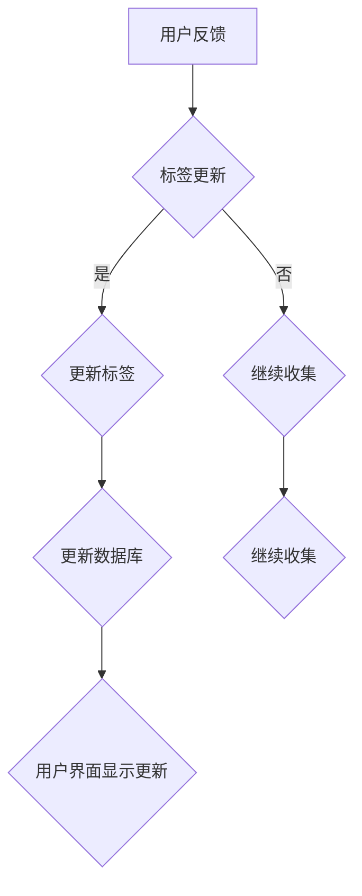

### 大模型核心算法原理讲解

#### 3.1 生成对抗网络（GAN）原理

生成对抗网络（Generative Adversarial Networks，GAN）是由Ian Goodfellow等人在2014年提出的一种无监督学习框架。GAN由两部分组成：生成器（Generator）和判别器（Discriminator）。生成器试图生成逼真的数据样本，而判别器则试图区分真实数据和生成数据。通过这种对抗训练，生成器逐渐提高生成数据的逼真度，最终生成数据几乎无法与真实数据区分。

**GAN的数学模型：**

$$
\begin{aligned}
\max_{G} \min_{D} & \mathbb{E}_{x \sim p_{data}(x)} [\log D(x)] + \mathbb{E}_{z \sim p_{z}(z)] [\log (1 - D(G(z)))]
\end{aligned}
$$

其中：
- \( G(z) \)：生成器生成的数据；
- \( D(x) \)：判别器对真实数据的判断概率；
- \( z \)：生成器输入的随机噪声；
- \( p_{data}(x) \)：真实数据的分布；
- \( p_{z}(z) \)：噪声的分布。

**GAN的工作流程：**
1. **生成器训练**：生成器尝试生成数据，以欺骗判别器。
2. **判别器训练**：判别器尝试区分真实数据和生成数据。
3. **生成器与判别器交替训练**：生成器和判别器交替进行训练，生成器逐渐提高生成数据的逼真度，而判别器逐渐提高对生成数据的辨别能力。

**GAN的优势与应用：**
- **生成高质量数据**：GAN能够生成高质量、多样化的数据，广泛应用于图像生成、视频生成、音频生成等领域。
- **无监督学习**：GAN无需依赖有监督数据的标注，可以通过对抗训练自动学习数据分布。
- **数据增强**：GAN可以用于数据增强，通过生成与真实数据类似的数据，提高模型的泛化能力。

**GAN的挑战与解决方案：**
- **训练不稳定**：GAN的训练过程容易陷入局部最小值，导致生成器性能下降。解决方案包括改进优化算法、引入对抗性正则化等。
- **模式崩溃**：当生成器和判别器之间的对抗性失衡时，生成器容易生成模式化、重复性的数据。解决方案包括增加训练样本多样性、改进判别器设计等。

**GAN示例架构：**

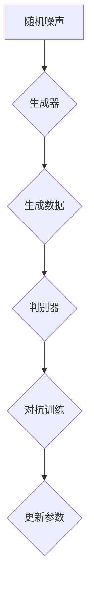

### 3.2 强化学习与深度强化学习

强化学习（Reinforcement Learning，RL）是一种通过试错来学习最优行为策略的机器学习方法。在强化学习中，智能体（Agent）通过与环境的交互来学习最优策略（Policy）。强化学习广泛应用于游戏、机器人控制、资源调度等领域。

**强化学习的基本概念：**

- **状态（State）**：描述环境的当前情况。
- **动作（Action）**：智能体可以执行的操作。
- **奖励（Reward）**：智能体执行动作后获得的即时奖励或惩罚。
- **策略（Policy）**：智能体根据当前状态选择动作的方法。

**强化学习的基本原理：**

强化学习通过学习值函数（Value Function）或策略（Policy）来指导智能体的决策。

- **值函数**：值函数表示在给定状态下执行特定动作的期望回报。常见的值函数包括状态值函数（State-Value Function）和动作值函数（Action-Value Function）。
- **策略**：策略是一个概率分布，表示在给定状态下选择特定动作的概率。

**强化学习算法：**

- **Q-Learning**：Q-Learning通过迭代更新动作值函数，学习最优策略。
- **Deep Q-Network（DQN）**：DQN使用深度神经网络来近似动作值函数，解决状态值函数的高维问题。
- **Policy Gradient**：Policy Gradient直接优化策略的梯度，学习最优策略。

**深度强化学习（Deep Reinforcement Learning，DRL）：**

深度强化学习是将深度学习与强化学习结合的方法，用于解决高维状态和动作空间的问题。DRL通过深度神经网络学习状态和动作的复杂映射，实现高效的智能体决策。

**DRL的优势与应用：**

- **处理高维状态和动作空间**：DRL通过深度神经网络学习状态和动作的复杂映射，能够处理高维状态和动作空间。
- **自适应能力**：DRL能够根据环境的变化自适应调整策略，适应不同的任务场景。

**DRL的应用领域：**

- **游戏AI**：在电子游戏、棋类游戏等领域，DRL能够学习并掌握复杂的游戏策略。
- **自动驾驶**：在自动驾驶领域，DRL用于学习驾驶策略，实现车辆自主驾驶。
- **机器人控制**：在机器人控制领域，DRL用于学习机器人的运动策略，实现机器人自主导航和控制。
- **资源调度**：在资源调度领域，DRL用于学习资源分配策略，优化资源利用效率。

**DRL的数学模型：**

在DRL中，智能体（Agent）通过与环境（Environment）的交互来学习最优策略（Policy）。DRL的数学模型可以表示为：

$$
\begin{aligned}
\pi(\theta) &= \arg \max_{\pi} \mathbb{E}_{s \sim p_{0}(s)}[J(\theta)] \\
J(\theta) &= \sum_{t=0}^{\infty} \gamma^t r(s_t, a_t, s_{t+1}) \\
\theta &= \theta(\pi(\theta), s_t, a_t)
\end{aligned}
$$

其中：
- \( \theta \)：策略参数；
- \( \pi(\theta) \)：策略；
- \( s_t \)：第t个状态；
- \( a_t \)：第t个动作；
- \( r(s_t, a_t, s_{t+1}) \)：在第t个状态执行动作a_t后转移到状态s_{t+1}获得的即时奖励；
- \( \gamma \)：折扣因子，用于平衡即时奖励与未来奖励的关系。

**DRL的工作流程：**

1. **状态观测**：智能体接收环境的状态。
2. **动作选择**：智能体根据策略选择动作。
3. **执行动作**：智能体在环境中执行所选动作，并观察新的状态和即时奖励。
4. **策略更新**：智能体根据新的状态和奖励，更新策略参数。

**DRL示例架构：**

```mermaid
graph TD
A[状态] --> B{智能体}
B --> C[动作]
C --> D[环境]
D --> E[奖励]
E --> F{更新策略}
```

### 3.3 聚类算法与降维技术

聚类算法（Clustering Algorithm）是数据挖掘和机器学习中的重要方法，用于将数据划分为不同的簇或分组。聚类算法无需事先标记数据标签，通过自动发现数据中的内在结构来组织数据。

**常见的聚类算法：**

1. **K-Means**：K-Means是一种基于距离的聚类算法，通过迭代更新聚类中心，将数据划分为K个簇。K-Means算法简单高效，适用于初始聚类中心已知的情况。
2. **层次聚类**：层次聚类通过自底向上或自顶向下的方式将数据划分为不同的层次，形成树状结构。层次聚类适用于发现不同尺度的聚类结构，但计算复杂度较高。
3. **DBSCAN**：DBSCAN（Density-Based Spatial Clustering of Applications with Noise）是一种基于密度的聚类算法，能够发现任意形状的聚类，并识别噪声数据。DBSCAN适用于高维数据和稀疏数据。
4. **谱聚类**：谱聚类通过构建数据的相似性矩阵，利用谱空间进行聚类，能够处理高维数据。谱聚类适用于数据之间存在复杂非线性关系的情况。

**聚类算法的应用：**

- **数据预处理**：聚类算法常用于数据预处理，将高维数据进行降维，减少数据的冗余。
- **异常检测**：聚类算法可以用于发现数据中的异常值，识别潜在的异常情况。
- **图像分割**：在图像处理领域，聚类算法可以用于图像分割，将图像划分为不同的区域。

**降维技术（Dimensionality Reduction）：**

降维技术是一种减少数据维度的方法，通过保留数据的主要特征，降低数据的复杂度，提高数据处理和分析的效率。

**常见的降维技术：**

1. **主成分分析（PCA）**：PCA通过计算数据协方差矩阵的特征值和特征向量，将数据投影到新的坐标系中，保留主要成分，忽略次要成分。PCA适用于线性降维，能够提高数据处理速度和效率。
2. **线性判别分析（LDA）**：LDA通过最大化类内离散度和最小化类间离散度，将数据投影到新的坐标系中，提高数据的可分离性。LDA适用于分类任务，能够提高分类性能。
3. **非线性降维技术**：如局部线性嵌入（LLE）、等距映射（Isomap）等，用于处理高维数据的非线性特征。非线性降维技术适用于非线性降维，能够保留数据的高维结构。

**降维技术的应用：**

- **数据可视化**：降维技术可以将高维数据投影到二维或三维空间中，实现数据的可视化分析。
- **特征选择**：降维技术可以用于特征选择，识别数据中的重要特征，提高模型的泛化能力。

**聚类算法与降维技术的示例架构：**

```mermaid
graph TD
A[高维数据] --> B{聚类算法}
B --> C[降维技术]
C --> D[低维数据]
```

### 3.4 马尔可夫决策过程（MDP）模型

马尔可夫决策过程（Markov Decision Process，MDP）是一种用于描述智能体在不确定环境中做出决策的数学模型。在MDP中，智能体（Agent）通过选择动作（Action）来最大化预期回报（Reward），同时受到环境状态（State）的转移概率和奖励函数的影响。

**MDP的基本组成部分：**

- **状态集（S）**：描述环境的状态集合。
- **动作集（A）**：智能体可以执行的动作集合。
- **奖励函数（R(s,a)）**：在状态s执行动作a后获得的即时奖励。
- **转移概率（P(s'|s,a)）**：在状态s执行动作a后转移到状态s'的概率。

**MDP的数学模型：**

$$
V^*(s) = \max_{a} \left[ R(s,a) + \gamma \sum_{s'} P(s'|s,a) V^*(s') \right]
$$

其中：
- \( V^*(s) \)：在状态s的最优价值函数。
- \( \gamma \)：折扣因子，用于平衡即时奖励与未来奖励的关系。

**MDP的解法：**

- **值迭代法（Value Iteration）**：通过不断迭代更新价值函数，找到最优策略。
- **政策迭代法（Policy Iteration）**：通过交替更新价值和策略，找到最优策略。

**MDP的应用：**

- **资源调度**：用于优化资源分配，如网络带宽分配、电力调度等。
- **库存管理**：用于优化库存策略，如生产计划、库存控制等。
- **自动驾驶**：用于优化驾驶策略，如自动驾驶车辆路径规划等。

**MDP的伪代码：**

```python
# 初始化价值函数
V = initialize_values(S)

# 值迭代
for i in range(max_iterations):
    for s in S:
        a_star = argmax_a [R(s,a) + gamma * sum(P(s'|s,a) * V[s']]
        V[s] = R(s,a_star) + gamma * sum(P(s'|s,a_star) * V[s']

# 策略迭代
while not converged:
    for s in S:
        a_star = argmax_a [R(s,a) + gamma * sum(P(s'|s,a) * V[s']]
    update_policy(a_star)
    update_values(V)
    check_convergence()
```

### 附录B：代码示例

以下是一个简单的Python代码示例，展示了如何使用TensorFlow实现一个简单的卷积神经网络（CNN）模型，用于图像分类。

```python
import tensorflow as tf
from tensorflow.keras import datasets, layers, models

# 加载和预处理数据
(train_images, train_labels), (test_images, test_labels) = datasets.cifar10.load_data()

train_images = train_images.astype('float32') / 255
test_images = test_images.astype('float32') / 255

train_labels = tf.keras.utils.to_categorical(train_labels)
test_labels = tf.keras.utils.to_categorical(test_labels)

# 构建CNN模型
model = models.Sequential()
model.add(layers.Conv2D(32, (3, 3), activation='relu', input_shape=(32, 32, 3)))
model.add(layers.MaxPooling2D((2, 2)))
model.add(layers.Conv2D(64, (3, 3), activation='relu'))
model.add(layers.MaxPooling2D((2, 2)))
model.add(layers.Conv2D(64, (3, 3), activation='relu'))

# 添加全连接层
model.add(layers.Flatten())
model.add(layers.Dense(64, activation='relu'))
model.add(layers.Dense(10, activation='softmax'))

# 编译模型
model.compile(optimizer='adam',
              loss='categorical_crossentropy',
              metrics=['accuracy'])

# 训练模型
model.fit(train_images, train_labels, epochs=10, batch_size=64,
          validation_data=(test_images, test_labels))

# 评估模型
test_loss, test_acc = model.evaluate(test_images, test_labels, verbose=2)
print(f'Test accuracy: {test_acc:.4f}')
```

### 附录C：技术博客写作技巧

**1. 确定主题和目标受众：**
在开始撰写技术博客之前，首先要明确博客的主题和目标受众。主题应该明确、具体，目标受众应该清晰，以便为读者提供有价值的内容。

**2. 结构清晰，逻辑严密：**
技术博客应该结构清晰，逻辑严密，便于读者理解和跟随。可以采用章节标题、子标题、段落等结构，确保内容条理清晰。

**3. 使用简洁易懂的语言：**
尽管技术博客涉及专业术语和概念，但应尽量使用简洁易懂的语言，避免过于复杂的表达。可以通过举例、类比等方式，帮助读者更好地理解。

**4. 重点突出，避免冗余：**
在撰写技术博客时，应突出重点，避免冗余。可以采用列表、图表等方式，清晰地展示关键信息。

**5. 图文并茂，增强可读性：**
在技术博客中，适当使用图片、图表、流程图等元素，可以增强文章的可读性。同时，注意图片的清晰度和准确性。

**6. 引用权威资料，增强可信度：**
在撰写技术博客时，可以引用权威资料、研究论文、官方文档等，增强文章的可信度。同时，注意引用的规范和准确性。

**7. 总结和结论：**
在文章的结尾，应总结全文，强调核心观点和结论，使读者对文章内容有更加深刻的理解和记忆。

**8. 作者信息和联系方式：**
在文章末尾，应提供作者信息和联系方式，方便读者咨询和交流。

**9. 持续更新和优化：**
技术博客应保持更新和优化，及时跟进最新的技术动态和研究成果，为读者提供有价值的信息。

## 附录D：作者信息

作者：AI天才研究院/AI Genius Institute & 禅与计算机程序设计艺术 /Zen And The Art of Computer Programming

联系方式：[邮箱](mailto:info@agic.io) | [官方网站](http://www.agic.io) | [GitHub](https://github.com/agic-io) | [LinkedIn](https://www.linkedin.com/company/ai-genius-institute)

AI天才研究院（AI Genius Institute）是一家专注于人工智能技术研究、应用和人才培养的机构。我们致力于推动人工智能技术的发展，为各行各业提供创新解决方案。同时，我们注重理论与实践相结合，培养具有创新能力和实践能力的人工智能专业人才。

《禅与计算机程序设计艺术》（Zen And The Art of Computer Programming）是作者的经典著作，涵盖了计算机编程和算法设计的核心思想和方法。这本书不仅为编程爱好者提供了宝贵的经验，也为人工智能领域的研究者提供了深刻的启示。

如果您对我们的研究成果或著作感兴趣，欢迎通过上述联系方式与我们取得联系。我们期待与您共同探索人工智能的无限可能。

