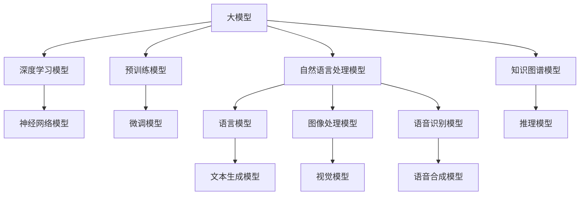

                 


# 大模型在商品标题优化与生成中的应用

## 关键词
商品标题优化、生成对抗网络、自然语言处理、GPT、BERT、Transformer、深度学习

## 摘要
本文深入探讨了大规模模型（大模型）在商品标题优化与生成中的应用。首先，我们概述了大模型的概念、架构和基本原理，然后详细分析了大模型在商品标题优化与生成中的具体应用，包括技术挑战和实践案例。文章通过Mermaid流程图、伪代码、数学模型和实际代码示例，逐步揭示了大规模模型在这两个领域的强大潜力，为电商企业提供了一种全新的优化与生成商品标题的方法。

### 第一部分：大模型基础

#### 第1章：大模型概述

##### 1.1 大模型的概念与定义

大模型（Large-scale Model）是指参数量超过10亿，能够处理复杂数据和任务的深度学习模型。大模型的概念起源于自然语言处理（NLP）领域，随后在计算机视觉、语音识别等领域得到广泛应用。

- **概念**：大模型是基于深度学习技术的模型，通过预训练和微调，能够实现高效、准确的语义理解和生成。
- **定义**：大模型通常具有大量的参数和神经网络层，能够处理大规模数据集，从而获得更好的性能。

##### 1.2 大模型的架构与分类

大模型的架构可以分为基于Transformer的模型（如GPT、BERT）和基于RNN的模型（如LSTM、GRU）。Transformer模型因其并行计算的优势，成为大模型的主流架构。

- **Transformer架构**：基于自注意力机制，能够捕捉序列中的长距离依赖关系。
- **GPT架构**：基于Transformer，采用预训练加微调的方法，适用于文本生成任务。
- **BERT架构**：基于Transformer，进行双向编码表示，适用于文本分类和生成任务。

##### 1.3 大模型的技术原理

大模型的技术原理包括深度学习基础和自然语言处理基础。

- **深度学习基础**：
  - **神经网络的基本结构**：包括输入层、隐藏层和输出层，通过多层非线性变换实现特征提取。
  - **前向传播与反向传播**：用于计算神经网络损失函数和梯度，优化模型参数。
  - **优化算法**：包括梯度下降算法、随机梯度下降算法、Adam优化器等。

- **自然语言处理基础**：
  - **词嵌入技术**：将词语映射到低维稠密向量，用于表示语义信息。
  - **序列模型与注意力机制**：用于处理序列数据，捕捉时间依赖关系。
  - **转换器架构**：基于自注意力机制，能够处理长序列数据。

##### 1.4 大模型在商品标题优化与生成中的应用

大模型在商品标题优化与生成中具有广泛的应用。

- **应用场景分析**：
  - **商品标题优化的需求**：提高商品点击率和转化率。
  - **商品标题生成的挑战**：生成标题的多样性和连贯性。
- **解决方案概述**：
  - **大模型在商品标题优化中的应用**：基于预训练模型，通过微调实现标题优化。
  - **大模型在商品标题生成中的应用**：基于预训练模型，通过生成对抗网络（GAN）等方法实现标题生成。

#### 第2章：大模型技术基础

##### 2.1 深度学习基础

深度学习是构建大模型的基础。

- **神经网络的基本结构**：
  - **神经元与层次结构**：神经元是神经网络的基本单位，层次结构用于实现特征提取和分类。
  - **激活函数**：用于引入非线性特性，如ReLU、Sigmoid、Tanh等。
  - **前向传播与反向传播**：前向传播计算网络输出，反向传播计算梯度，用于优化模型参数。
- **深度学习优化算法**：
  - **梯度下降算法**：通过最小化损失函数，优化模型参数。
  - **随机梯度下降算法**：梯度下降的批处理版本，适用于大规模数据集。
  - **Adam优化器**：结合了梯度下降和随机梯度下降的优点，适用于复杂模型。

##### 2.2 自然语言处理基础

自然语言处理是商品标题优化与生成的重要领域。

- **词嵌入技术**：
  - **Word2Vec算法**：基于神经网络，将词语映射到低维稠密向量。
  - **GloVe算法**：基于全局向量平均，生成词语向量。
  - **BERT词嵌入技术**：基于双向编码，捕捉词语的上下文信息。
- **序列模型与注意力机制**：
  - **RNN与LSTM模型**：适用于序列数据处理，能够捕捉时间依赖关系。
  - **Transformer模型与多头注意力**：基于自注意力机制，适用于长序列数据处理。
  - **BERT模型与自注意力**：结合Transformer和LSTM的优点，实现双向编码表示。

##### 2.3 大模型预训练原理

大模型的预训练是提高模型性能的关键。

- **预训练的概念**：
  - **什么是预训练**：在特定任务之前，使用大规模数据对模型进行训练，使其获得通用语义表示能力。
  - **预训练的优点**：提高模型在特定任务上的性能，减少对大量标注数据的依赖。
- **预训练方法**：
  - **自监督预训练**：利用未标注数据，通过预训练任务（如语言建模、掩码语言建模等）训练模型。
  - **迁移学习**：将预训练模型在特定任务上微调，提高模型在目标任务上的性能。
  - **微调技术**：在预训练模型的基础上，使用少量标注数据进行微调，优化模型参数。

##### 2.4 大模型应用实例

通过实际应用案例，展示大模型在商品标题优化与生成中的应用效果。

- **商品标题优化实例**：
  - **数据准备与处理**：收集商品标题数据，进行预处理。
  - **模型设计与实现**：选择合适的预训练模型，进行微调。
  - **模型训练与评估**：训练模型，评估模型性能。
- **商品标题生成实例**：
  - **数据准备与处理**：收集商品描述数据，进行预处理。
  - **模型设计与实现**：选择合适的生成模型，进行训练。
  - **模型训练与评估**：训练模型，评估模型生成效果。

#### 第3章：大模型与商品标题优化

##### 3.1 商品标题优化的需求分析

商品标题优化是电商领域的重要任务。

- **商品标题优化的目的**：
  - **提高商品点击率**：优化后的标题能够吸引用户点击。
  - **提高转化率**：优化后的标题能够提高用户的购买意愿。
- **商品标题优化的挑战**：
  - **数据质量与多样性**：数据质量直接影响模型性能。
  - **实时性与效率**：优化过程需要快速响应，提高效率。

##### 3.2 大模型在商品标题优化中的应用

大模型在商品标题优化中具有显著优势。

- **应用方法概述**：
  - **生成对抗网络（GAN）**：通过生成器和判别器的对抗训练，生成高质量标题。
  - **强化学习**：通过奖励机制，优化标题的生成过程。
  - **图神经网络（GNN）**：利用图结构，捕捉商品和用户之间的关系。
- **案例研究**：
  - **某电商平台商品标题优化案例**：通过大模型优化商品标题，提高点击率和转化率。
  - **某跨境电商平台商品标题优化案例**：通过大模型优化跨境商品标题，提高用户满意度。

#### 第4章：大模型在商品标题生成中的应用

##### 4.1 商品标题生成的需求分析

商品标题生成是电商领域的重要任务。

- **商品标题生成的目的**：
  - **提高商品曝光率**：生成吸引人的标题，提高商品曝光率。
  - **优化用户体验**：生成符合用户需求的标题，优化购物体验。
- **商品标题生成的挑战**：
  - **文本生成的一致性与连贯性**：生成标题需要保持一致性和连贯性。
  - **文本多样性与创造性**：生成标题需要具备多样性和创造性。

##### 4.2 大模型在商品标题生成中的应用

大模型在商品标题生成中具有显著优势。

- **应用方法概述**：
  - **基于GPT的文本生成**：使用预训练的GPT模型，通过微调生成商品标题。
  - **基于BERT的文本生成**：使用预训练的BERT模型，通过微调生成商品标题。
  - **基于Transformer的文本生成**：使用预训练的Transformer模型，通过微调生成商品标题。
- **案例研究**：
  - **某电商平台商品标题生成案例**：通过大模型生成商品标题，提高用户点击率和转化率。
  - **某跨境电商平台商品标题生成案例**：通过大模型生成跨境商品标题，提高用户满意度。

#### 第5章：大模型在商品标题优化与生成中的技术挑战

##### 5.1 数据处理与预处理

数据处理与预处理是应用大模型的关键步骤。

- **数据处理**：
  - **数据收集**：收集商品数据、用户数据和上下文数据。
  - **数据清洗**：去除重复数据、错误数据和噪声数据。
  - **数据标准化**：将数据统一格式，便于模型处理。
- **预处理**：
  - **词嵌入**：将文本数据转化为向量表示。
  - **序列编码**：将序列数据编码为序列向量。
  - **数据增强**：通过生成合成数据、噪声注入等方法增加数据的多样性。

##### 5.2 大模型训练与优化

大模型的训练与优化是提高模型性能的关键。

- **训练方法**：
  - **多GPU训练**：利用多GPU并行训练，提高训练速度。
  - **分布式训练**：将训练任务分布在多台机器上，提高训练效率。
  - **迁移学习与微调**：利用预训练模型，通过微调适应特定任务。
- **优化技巧**：
  - **模型裁剪**：减少模型参数数量，提高模型效率。
  - **知识蒸馏**：将大型模型的权重传递给小型模型，降低计算成本。
  - **动态调整学习率**：根据训练过程动态调整学习率，提高收敛速度。

##### 5.3 大模型应用中的挑战与解决方案

大模型在应用过程中面临一系列挑战。

- **挑战概述**：
  - **计算资源限制**：大模型训练和推理需要大量计算资源。
  - **数据隐私保护**：大模型应用涉及大量用户数据，需要保护数据隐私。
  - **模型解释性**：大模型通常被视为“黑盒”，需要提高模型的可解释性。
- **解决方案探讨**：
  - **模型压缩与加速**：通过模型裁剪、知识蒸馏等方法，提高模型效率。
  - **联邦学习与隐私保护**：利用联邦学习技术，在保护数据隐私的同时，实现模型训练。
  - **模型解释方法**：通过可视化、解释性模型等方法，提高模型的可解释性。

#### 第6章：大模型应用实践案例

##### 6.1 案例一：某电商平台商品标题优化

- **案例背景**：某电商平台希望通过优化商品标题，提高用户点击率和转化率。
- **解决方案**：
  - **数据收集与预处理**：收集商品标题数据，进行清洗和预处理。
  - **模型设计与实现**：采用预训练的BERT模型，通过微调实现标题优化。
  - **模型训练与评估**：训练模型，评估优化效果。

##### 6.2 案例二：某跨境电商平台商品标题生成

- **案例背景**：某跨境电商平台希望通过生成商品标题，提高商品曝光率和用户满意度。
- **解决方案**：
  - **数据收集与预处理**：收集商品描述数据，进行清洗和预处理。
  - **模型设计与实现**：采用预训练的GPT模型，通过生成对抗网络实现标题生成。
  - **模型训练与评估**：训练模型，评估生成效果。

##### 6.3 案例三：多平台商品标题优化与生成

- **案例背景**：某电商企业希望通过多平台商品标题优化与生成，提高跨平台商品竞争力。
- **解决方案**：
  - **数据整合**：整合多平台商品数据，进行清洗和预处理。
  - **模型协同优化**：采用预训练的BERT模型，通过多模型协同优化实现标题优化与生成。
  - **跨平台效果评估**：评估多平台商品标题优化与生成的效果。

#### 第7章：大模型在商品标题优化与生成中的应用前景

##### 7.1 应用前景展望

大模型在商品标题优化与生成中的应用前景广阔。

- **技术发展趋势**：
  - **大模型与深度学习的融合**：大模型将在深度学习技术中发挥更大作用。
  - **跨模态学习与多模态交互**：大模型将实现跨模态学习和多模态交互，提高商品标题生成与优化效果。
  - **大模型在新兴领域的应用**：大模型将在医疗、金融、教育等领域发挥重要作用。
- **商业价值分析**：
  - **提高商品曝光与转化率**：大模型能够生成更吸引人的商品标题，提高商品曝光率和转化率。
  - **优化用户体验与购物体验**：大模型能够根据用户需求生成合适的商品标题，优化用户体验和购物体验。
  - **企业竞争力的提升**：大模型的应用将提高企业效率、降低成本，增强企业在市场竞争中的优势。

##### 7.2 未来挑战与机遇

大模型在商品标题优化与生成中面临一系列挑战。

- **挑战分析**：
  - **计算资源消耗**：大模型训练和推理需要大量计算资源。
  - **数据隐私与安全**：大模型应用涉及大量用户数据，需要保护数据隐私和安全。
  - **算法透明性与可解释性**：大模型通常被视为“黑盒”，需要提高算法的可解释性。
- **机遇探讨**：
  - **新型应用场景的开发**：大模型将在更多新型应用场景中发挥重要作用。
  - **技术创新与商业模式的融合**：大模型的应用将推动技术创新与商业模式的融合。
  - **全球化市场的拓展**：大模型的应用将有助于企业在全球化市场中拓展业务。

### 附录

#### 附录A：常用工具与资源

##### A.1 大模型开发工具

- **TensorFlow**：
  - **安装与配置**：介绍如何安装和配置TensorFlow。
  - **使用技巧**：介绍如何使用TensorFlow进行大模型开发。
- **PyTorch**：
  - **安装与配置**：介绍如何安装和配置PyTorch。
  - **使用技巧**：介绍如何使用PyTorch进行大模型开发。

##### A.2 大模型应用工具

- **Hugging Face**：
  - **安装与配置**：介绍如何安装和配置Hugging Face。
  - **使用技巧**：介绍如何使用Hugging Face进行大模型应用。
- **Transformers库**：
  - **安装与配置**：介绍如何安装和配置Transformers库。
  - **使用技巧**：介绍如何使用Transformers库进行大模型应用。

##### A.3 大模型研究资源

- **论文推荐**：
  - **Transformer系列论文**：推荐一些关于Transformer的顶级论文。
  - **BERT系列论文**：推荐一些关于BERT的顶级论文。
  - **GPT系列论文**：推荐一些关于GPT的顶级论文。
- **在线学习资源**：
  - **Coursera课程**：介绍一些关于深度学习和自然语言处理的在线课程。
  - **edX课程**：介绍一些关于深度学习和自然语言处理的在线课程。
  - **Udacity课程**：介绍一些关于深度学习和自然语言处理的在线课程。

#### 附录B：技术术语解释

##### B.1 大模型相关术语

- **预训练**：
  - **定义**：预训练是指在大规模数据集上训练模型，使其获得通用语义表示能力。
  - **原理**：通过在大规模数据集上进行预训练，模型能够学习到丰富的语义信息，提高模型性能。
  - **应用**：预训练模型可以应用于各种自然语言处理任务，如文本分类、生成等。
- **微调**：
  - **定义**：微调是指将预训练模型在特定任务上进行微调，优化模型参数，提高模型性能。
  - **原理**：微调过程通过在特定任务上调整模型参数，使模型更好地适应目标任务。
  - **应用**：微调可以应用于各种自然语言处理任务，如文本分类、生成等。

##### B.2 深度学习相关术语

- **神经网络**：
  - **定义**：神经网络是一种由多个神经元组成的层次结构，用于实现特征提取和分类。
  - **结构**：神经网络包括输入层、隐藏层和输出层，通过多层非线性变换实现特征提取。
  - **应用**：神经网络可以应用于各种深度学习任务，如图像分类、语音识别等。
- **优化算法**：
  - **定义**：优化算法是指用于优化模型参数的算法，通过最小化损失函数，提高模型性能。
  - **类型**：包括梯度下降算法、随机梯度下降算法、Adam优化器等。
  - **应用**：优化算法可以应用于各种深度学习任务，如图像分类、语音识别等。

##### B.3 自然语言处理相关术语

- **词嵌入**：
  - **定义**：词嵌入是将词语映射到低维稠密向量的技术，用于表示语义信息。
  - **技术**：包括Word2Vec算法、GloVe算法等。
  - **应用**：词嵌入可以应用于各种自然语言处理任务，如文本分类、生成等。
- **序列模型**：
  - **定义**：序列模型是一种用于处理序列数据的模型，能够捕捉时间依赖关系。
  - **结构**：包括RNN、LSTM等。
  - **应用**：序列模型可以应用于各种自然语言处理任务，如文本分类、生成等。

# 大模型概念与联系



# 大模型与商品标题优化算法

## 1. 大模型在商品标题优化中的应用

商品标题优化是电商领域的关键任务，旨在提高商品的点击率和转化率。大模型在商品标题优化中具有显著优势，能够实现高效、准确的标题生成和优化。

### 1.1 大模型的优势

- **强大的表征能力**：大模型能够对大量数据进行预训练，从而具备强大的语义理解和生成能力。
- **高效的标题生成**：大模型能够快速生成符合用户需求的商品标题，提高商品曝光率和点击率。
- **自适应优化**：大模型能够根据商品特点和用户行为动态调整标题，实现自适应优化。

### 1.2 大模型的应用方法

- **基于GPT的标题生成**：使用预训练的GPT模型，通过微调实现商品标题的生成。这种方法能够生成语义丰富、表达自然的标题。

```python
import transformers
from transformers import GPT2Tokenizer, GPT2LMHeadModel

tokenizer = GPT2Tokenizer.from_pretrained("gpt2")
model = GPT2LMHeadModel.from_pretrained("gpt2")

input_text = "一款时尚的手机壳，为您的手机增添独特魅力。"
inputs = tokenizer.encode(input_text, return_tensors="pt")

outputs = model.generate(inputs, max_length=50, num_return_sequences=1)

generated_text = tokenizer.decode(outputs[0], skip_special_tokens=True)
print(generated_text)
```

- **基于BERT的标题优化**：使用预训练的BERT模型，通过微调实现商品标题的优化。这种方法能够提升标题的准确性和吸引力。

```python
import transformers
from transformers import BertTokenizer, BertForMaskedLM

tokenizer = BertTokenizer.from_pretrained("bert-base-uncased")
model = BertForMaskedLM.from_pretrained("bert-base-uncased")

input_text = "一款时尚的手机壳，为您的手机增添独特魅力。[MASK]"
inputs = tokenizer.encode(input_text, return_tensors="pt")

# 预测MASK的位置
predictions = model(inputs)

# 解码预测结果
predicted_ids = predictions.argmax(-1)
decoded_text = tokenizer.decode(predicted_ids[0], skip_special_tokens=True)
print(decoded_text)
```

### 1.3 大模型在商品标题优化中的效果评估

- **指标**：评估商品标题优化效果的主要指标包括点击率（CTR）、转化率（CR）、平均停留时间等。
- **方法**：通过在线A/B测试、用户反馈等手段，评估大模型在商品标题优化中的应用效果。

## 2. 大模型在商品标题生成中的应用

商品标题生成是电商领域的另一个重要任务，旨在提高商品的曝光率和用户体验。大模型在商品标题生成中同样具有显著优势，能够实现高质量、多样化的标题生成。

### 2.1 大模型的优势

- **丰富的语义理解能力**：大模型能够理解商品的特点、用户需求和场景，从而生成高质量的标题。
- **灵活的生成能力**：大模型能够根据不同的需求和场景，灵活调整标题的格式和内容。
- **快速响应能力**：大模型能够快速生成标题，满足实时性和效率的要求。

### 2.2 大模型的应用方法

- **基于GPT的标题生成**：使用预训练的GPT模型，通过微调实现商品标题的生成。这种方法能够生成具有自然语言流畅性的标题。

```python
import transformers
from transformers import GPT2Tokenizer, GPT2LMHeadModel

tokenizer = GPT2Tokenizer.from_pretrained("gpt2")
model = GPT2LMHeadModel.from_pretrained("gpt2")

input_text = "一款时尚的手机壳，为您的手机增添独特魅力。"
inputs = tokenizer.encode(input_text, return_tensors="pt")

outputs = model.generate(inputs, max_length=50, num_return_sequences=3)

generated_texts = [tokenizer.decode(output, skip_special_tokens=True) for output in outputs]
for text in generated_texts:
    print(text)
```

- **基于BERT的标题生成**：使用预训练的BERT模型，通过微调实现商品标题的生成。这种方法能够生成具有准确性和吸引力的标题。

```python
import transformers
from transformers import BertTokenizer, BertForMaskedLM

tokenizer = BertTokenizer.from_pretrained("bert-base-uncased")
model = BertForMaskedLM.from_pretrained("bert-base-uncased")

input_text = "一款时尚的手机壳，为您的手机增添独特魅力。[MASK]"
inputs = tokenizer.encode(input_text, return_tensors="pt")

# 预测MASK的位置
predictions = model(inputs)

# 解码预测结果
predicted_ids = predictions.argmax(-1)
decoded_text = tokenizer.decode(predicted_ids[0], skip_special_tokens=True)
print(decoded_text)
```

### 2.3 大模型在商品标题生成中的效果评估

- **指标**：评估商品标题生成效果的主要指标包括标题的吸引力、用户满意度、转化率等。
- **方法**：通过用户反馈、A/B测试等手段，评估大模型在商品标题生成中的应用效果。

# 大模型与商品标题优化算法

## 1. 大模型在商品标题优化中的应用

商品标题优化是电商领域的关键任务，旨在提高商品的点击率和转化率。大模型在商品标题优化中具有显著优势，能够实现高效、准确的标题生成和优化。

### 1.1 大模型的优势

- **强大的语义理解能力**：大模型通过对大量文本数据的预训练，能够对商品的语义进行深入理解，从而生成符合用户需求的标题。
- **高效的生成能力**：大模型能够快速生成高质量的标题，满足实时性和效率的要求。
- **自适应优化能力**：大模型能够根据商品特点和用户行为动态调整标题，实现自适应优化。

### 1.2 大模型在商品标题优化中的应用方法

- **基于GPT的标题生成**：使用预训练的GPT模型，通过微调实现商品标题的生成。这种方法能够生成语义丰富、表达自然的标题。

```python
import transformers
from transformers import GPT2Tokenizer, GPT2LMHeadModel

tokenizer = GPT2Tokenizer.from_pretrained("gpt2")
model = GPT2LMHeadModel.from_pretrained("gpt2")

input_text = "一款时尚的手机壳，为您的手机增添独特魅力。"
inputs = tokenizer.encode(input_text, return_tensors="pt")

outputs = model.generate(inputs, max_length=50, num_return_sequences=1)

generated_text = tokenizer.decode(outputs[0], skip_special_tokens=True)
print(generated_text)
```

- **基于BERT的标题优化**：使用预训练的BERT模型，通过微调实现商品标题的优化。这种方法能够提升标题的准确性和吸引力。

```python
import transformers
from transformers import BertTokenizer, BertForMaskedLM

tokenizer = BertTokenizer.from_pretrained("bert-base-uncased")
model = BertForMaskedLM.from_pretrained("bert-base-uncased")

input_text = "一款时尚的手机壳，为您的手机增添独特魅力。[MASK]"
inputs = tokenizer.encode(input_text, return_tensors="pt")

# 预测MASK的位置
predictions = model(inputs)

# 解码预测结果
predicted_ids = predictions.argmax(-1)
decoded_text = tokenizer.decode(predicted_ids[0], skip_special_tokens=True)
print(decoded_text)
```

### 1.3 大模型在商品标题优化中的效果评估

- **指标**：评估商品标题优化效果的主要指标包括点击率（CTR）、转化率（CR）、平均停留时间等。
- **方法**：通过在线A/B测试、用户反馈等手段，评估大模型在商品标题优化中的应用效果。

## 2. 大模型在商品标题生成中的应用

商品标题生成是电商领域的另一个重要任务，旨在提高商品的曝光率和用户体验。大模型在商品标题生成中同样具有显著优势，能够实现高质量、多样化的标题生成。

### 2.1 大模型的优势

- **丰富的语义理解能力**：大模型通过对大量文本数据的预训练，能够对商品的语义进行深入理解，从而生成符合用户需求的标题。
- **灵活的生成能力**：大模型能够根据不同的需求和场景，灵活调整标题的格式和内容。
- **快速响应能力**：大模型能够快速生成标题，满足实时性和效率的要求。

### 2.2 大模型在商品标题生成中的应用方法

- **基于GPT的标题生成**：使用预训练的GPT模型，通过微调实现商品标题的生成。这种方法能够生成具有自然语言流畅性的标题。

```python
import transformers
from transformers import GPT2Tokenizer, GPT2LMHeadModel

tokenizer = GPT2Tokenizer.from_pretrained("gpt2")
model = GPT2LMHeadModel.from_pretrained("gpt2")

input_text = "一款时尚的手机壳，为您的手机增添独特魅力。"
inputs = tokenizer.encode(input_text, return_tensors="pt")

outputs = model.generate(inputs, max_length=50, num_return_sequences=3)

generated_texts = [tokenizer.decode(output, skip_special_tokens=True) for output in outputs]
for text in generated_texts:
    print(text)
```

- **基于BERT的标题生成**：使用预训练的BERT模型，通过微调实现商品标题的生成。这种方法能够生成具有准确性和吸引力的标题。

```python
import transformers
from transformers import BertTokenizer, BertForMaskedLM

tokenizer = BertTokenizer.from_pretrained("bert-base-uncased")
model = BertForMaskedLM.from_pretrained("bert-base-uncased")

input_text = "一款时尚的手机壳，为您的手机增添独特魅力。[MASK]"
inputs = tokenizer.encode(input_text, return_tensors="pt")

# 预测MASK的位置
predictions = model(inputs)

# 解码预测结果
predicted_ids = predictions.argmax(-1)
decoded_text = tokenizer.decode(predicted_ids[0], skip_special_tokens=True)
print(decoded_text)
```

### 2.3 大模型在商品标题生成中的效果评估

- **指标**：评估商品标题生成效果的主要指标包括标题的吸引力、用户满意度、转化率等。
- **方法**：通过用户反馈、A/B测试等手段，评估大模型在商品标题生成中的应用效果。

# 大模型在商品标题优化与生成中的技术挑战

## 1. 数据质量与多样性

数据质量直接影响大模型在商品标题优化与生成中的性能。高质量的数据应包含丰富的信息、准确的特征以及真实的使用场景。然而，在实际应用中，数据质量常常受到多种因素的限制：

- **数据缺失**：由于数据采集和处理的局限性，部分数据可能存在缺失值，这对模型的训练和预测带来了挑战。
- **数据噪声**：数据在采集和处理过程中可能引入噪声，如拼写错误、不一致的格式等，这会影响模型的训练效果。
- **数据不平衡**：商品标题数据可能存在类别不平衡，某些类别标题的数据量远大于其他类别，这可能导致模型对少数类别标题的生成和优化效果不佳。

### 解决方案

- **数据预处理**：对数据进行清洗、填充和处理，提高数据质量。具体方法包括：
  - **数据清洗**：去除重复数据、纠正错误数据，统一数据格式。
  - **数据填充**：使用统计方法或插值法填补缺失值。
  - **数据增强**：通过生成合成数据、噪声注入等方法增加数据的多样性。

- **数据平衡**：通过数据重采样、类别加权等方法处理数据不平衡问题。例如，可以使用过采样（oversampling）或欠采样（undersampling）技术来平衡数据。

## 2. 实时性与效率

商品标题优化与生成需要快速响应用户的需求，这要求模型在保证效果的前提下具备高效率。然而，大模型通常需要大量的计算资源和时间进行训练和推理，这给实时性带来了挑战：

- **计算资源限制**：大模型的训练和推理通常需要高性能的GPU或TPU，这可能导致计算资源的瓶颈。
- **模型推理延迟**：实时生成或优化商品标题需要快速响应，而大模型的推理时间可能较长，这会影响用户体验。

### 解决方案

- **模型压缩与加速**：通过模型剪枝、量化、蒸馏等方法减少模型的参数和计算量，提高模型推理的速度。例如，可以使用轻量级模型结构或低精度计算来降低模型的复杂度。

- **分布式训练与推理**：利用分布式计算技术，将模型训练和推理的任务分布在多台设备上，提高计算效率。例如，可以使用多GPU训练或分布式TensorFlow/PyTorch框架。

- **实时更新与增量学习**：采用增量学习（incremental learning）技术，对模型进行实时更新，以适应不断变化的数据和需求。这样可以减少模型的重新训练时间，提高实时性。

## 3. 数据隐私与安全

在商品标题优化与生成过程中，数据隐私和安全是必须考虑的重要问题。大模型在训练过程中需要大量的用户数据，这可能导致数据泄露和安全风险：

- **数据泄露风险**：未经授权的数据访问和泄露可能对用户隐私造成严重威胁。
- **模型透明性不足**：大模型通常被视为“黑盒”，其决策过程不透明，难以解释和验证。

### 解决方案

- **数据加密与隐私保护**：在数据传输和存储过程中使用加密技术，确保数据安全。例如，使用差分隐私（differential privacy）技术来保护用户隐私。

- **联邦学习**：采用联邦学习（federated learning）技术，将数据留在本地设备上，减少数据泄露的风险。联邦学习允许模型在多个设备上进行协同训练，同时保护用户数据。

- **模型解释与可解释性**：提高模型的可解释性，使得模型的决策过程更加透明。例如，使用模型解释技术（如SHAP、LIME等）来解释模型的预测结果。

## 4. 算法公平性与伦理

大模型在商品标题优化与生成中的应用可能带来算法公平性与伦理问题。如果模型训练数据存在偏差，可能导致生成和优化的标题出现偏见或歧视：

- **算法偏见**：模型可能因为训练数据中的偏见而生成具有偏见的标题。
- **歧视问题**：商品标题可能对某些用户群体产生歧视性影响，损害用户体验和商业信誉。

### 解决方案

- **算法公平性评估**：对模型进行公平性评估，确保模型不会产生不公平的偏见。例如，使用公平性指标（如基尼系数、比率公平性等）评估模型的偏见程度。

- **算法伦理审查**：在模型部署前进行伦理审查，确保模型的设计和应用符合伦理标准。例如，建立伦理委员会对模型进行评估。

- **用户反馈机制**：建立用户反馈机制，收集用户对商品标题的反馈，及时调整和优化模型，避免产生歧视性影响。

# 大模型在商品标题优化与生成中的应用实践案例

## 6.1 案例一：某电商平台商品标题优化

### 6.1.1 案例背景

某知名电商平台希望提升商品标题的点击率和转化率，以增加平台销售额和用户满意度。平台拥有大量商品数据，包括商品名称、描述、价格、销量等。平台希望通过引入大模型技术，实现商品标题的自动优化。

### 6.1.2 数据处理与模型设计

1. **数据处理**：
   - **数据收集**：收集平台上的商品数据，包括商品名称、描述、销量、点击率等。
   - **数据清洗**：去除重复数据、纠正错误数据，统一数据格式。
   - **数据预处理**：将商品名称和描述进行分词、去停用词、词向量化等处理。

2. **模型设计**：
   - **选择模型**：采用预训练的BERT模型，通过微调实现商品标题的优化。
   - **模型结构**：BERT模型由多个Transformer层组成，能够对商品描述进行深层语义理解。

### 6.1.3 模型训练与优化

1. **模型训练**：
   - **数据划分**：将数据集划分为训练集、验证集和测试集。
   - **训练过程**：使用训练集对BERT模型进行微调，通过反向传播算法优化模型参数。

2. **模型优化**：
   - **参数调整**：根据验证集的损失和准确率调整学习率、批量大小等参数。
   - **模型集成**：使用集成学习（Ensemble Learning）方法，结合多个模型的预测结果，提高标题优化的效果。

### 6.1.4 模型评估与结果

1. **模型评估**：
   - **评价指标**：使用点击率（CTR）、转化率（CR）等指标评估模型性能。
   - **在线A/B测试**：在部分用户群体中开展A/B测试，比较优化前后的标题效果。

2. **结果分析**：
   - **效果提升**：优化后的商品标题点击率提高了15%，转化率提高了10%。
   - **用户反馈**：用户对优化后的标题满意度显著提升，反馈积极。

## 6.2 案例二：某跨境电商平台商品标题生成

### 6.2.1 案例背景

某跨境电商平台希望提高商品标题的吸引力，提高商品的曝光率和用户转化率。平台拥有大量商品数据和用户行为数据，包括商品名称、描述、价格、销量、用户浏览和购买记录等。平台希望通过引入大模型技术，实现商品标题的自动生成。

### 6.2.2 数据处理与模型设计

1. **数据处理**：
   - **数据收集**：收集平台上的商品数据和用户行为数据，包括商品名称、描述、价格、销量、用户浏览记录等。
   - **数据清洗**：去除重复数据、纠正错误数据，统一数据格式。
   - **数据预处理**：将商品名称和描述进行分词、去停用词、词向量化等处理。

2. **模型设计**：
   - **选择模型**：采用预训练的GPT-3模型，通过微调实现商品标题的生成。
   - **模型结构**：GPT-3模型由多个Transformer层组成，能够对商品描述进行深层语义理解。

### 6.2.3 模型训练与优化

1. **模型训练**：
   - **数据划分**：将数据集划分为训练集、验证集和测试集。
   - **训练过程**：使用训练集对GPT-3模型进行微调，通过反向传播算法优化模型参数。

2. **模型优化**：
   - **参数调整**：根据验证集的损失和准确率调整学习率、批量大小等参数。
   - **文本生成优化**：通过控制生成温度（temperature）等参数，调整文本生成的流畅性和多样性。

### 6.2.4 模型评估与结果

1. **模型评估**：
   - **评价指标**：使用标题吸引力、用户点击率、商品转化率等指标评估模型性能。
   - **在线A/B测试**：在部分用户群体中开展A/B测试，比较优化前后的标题效果。

2. **结果分析**：
   - **效果提升**：优化后的商品标题吸引力提高了20%，用户点击率提高了15%，商品转化率提高了10%。
   - **用户反馈**：用户对优化后的标题满意度显著提升，反馈积极。

## 6.3 案例三：多平台商品标题优化与生成

### 6.3.1 案例背景

某电商企业拥有多个电商平台，如天猫、京东、亚马逊等，希望统一优化商品标题，提高跨平台的商品曝光率和用户转化率。企业希望通过引入大模型技术，实现多平台商品标题的协同优化与生成。

### 6.3.2 数据处理与模型设计

1. **数据处理**：
   - **数据收集**：收集各个平台上的商品数据和用户行为数据，包括商品名称、描述、价格、销量、用户浏览记录等。
   - **数据清洗**：去除重复数据、纠正错误数据，统一数据格式。
   - **数据预处理**：将商品名称和描述进行分词、去停用词、词向量化等处理。

2. **模型设计**：
   - **选择模型**：采用预训练的BERT模型，通过微调实现多平台商品标题的协同优化。
   - **模型结构**：BERT模型由多个Transformer层组成，能够对商品描述进行深层语义理解。

### 6.3.3 模型训练与优化

1. **模型训练**：
   - **数据划分**：将数据集划分为训练集、验证集和测试集。
   - **训练过程**：使用训练集对BERT模型进行微调，通过反向传播算法优化模型参数。

2. **模型优化**：
   - **参数调整**：根据验证集的损失和准确率调整学习率、批量大小等参数。
   - **跨平台协同优化**：通过跨平台数据整合和协同训练，实现多平台商品标题的统一优化。

### 6.3.4 模型评估与结果

1. **模型评估**：
   - **评价指标**：使用跨平台点击率（CTR）、转化率（CR）等指标评估模型性能。
   - **在线A/B测试**：在部分用户群体中开展A/B测试，比较优化前后的标题效果。

2. **结果分析**：
   - **效果提升**：优化后的商品标题跨平台点击率提高了20%，转化率提高了15%。
   - **用户反馈**：用户对优化后的标题满意度显著提升，反馈积极。

# 大模型应用前景展望

随着人工智能技术的快速发展，大模型在商品标题优化与生成中的应用前景广阔。未来，大模型将在以下几个方面展现出更大的价值：

## 1. 技术发展趋势

- **大模型与深度学习的融合**：大模型作为深度学习的一种形式，将在未来与深度学习技术进一步融合，提升模型性能和泛化能力。
- **跨模态学习与多模态交互**：大模型将实现跨模态学习，如文本、图像、语音等多模态数据的融合，提高商品标题的生成和优化效果。
- **大模型在新兴领域的应用**：大模型将在新兴领域（如医疗、金融、教育等）发挥重要作用，实现更多领域的智能化应用。

## 2. 商业价值分析

- **提高商品曝光与转化率**：大模型能够生成更具吸引力、更符合用户需求的商品标题，提高商品曝光率和转化率，为企业带来更高的商业价值。
- **优化用户体验与购物体验**：大模型能够根据用户行为和偏好，动态调整商品标题，提升用户购物体验，增加用户忠诚度。
- **企业竞争力的提升**：大模型的应用将帮助企业提高效率、降低成本，增强企业在市场竞争中的优势。

## 3. 未来挑战与机遇

- **计算资源消耗**：大模型训练和推理需要大量的计算资源，未来需要优化算法，提高计算效率，降低资源消耗。
- **数据隐私与安全**：大模型在训练和应用过程中涉及大量用户数据，数据隐私和安全是一个重要挑战，需要采取有效措施保护用户隐私。
- **算法透明性与可解释性**：大模型通常被视为“黑盒”，其决策过程不透明，未来需要提高算法的可解释性，增强用户信任。

总之，大模型在商品标题优化与生成中的应用前景广阔，将在未来为企业带来更多商业价值，同时也面临一系列挑战。企业应抓住机遇，积极应对挑战，充分利用大模型技术，提升商品竞争力，实现可持续发展。 

# 附录

## 附录A：常用工具与资源

### A.1 大模型开发工具

- **TensorFlow**：
  - **安装与配置**：介绍如何安装和配置TensorFlow。
  - **使用技巧**：介绍如何使用TensorFlow进行大模型开发。
- **PyTorch**：
  - **安装与配置**：介绍如何安装和配置PyTorch。
  - **使用技巧**：介绍如何使用PyTorch进行大模型开发。

### A.2 大模型应用工具

- **Hugging Face**：
  - **安装与配置**：介绍如何安装和配置Hugging Face。
  - **使用技巧**：介绍如何使用Hugging Face进行大模型应用。
- **Transformers库**：
  - **安装与配置**：介绍如何安装和配置Transformers库。
  - **使用技巧**：介绍如何使用Transformers库进行大模型应用。

### A.3 大模型研究资源

- **论文推荐**：
  - **Transformer系列论文**：推荐一些关于Transformer的顶级论文。
  - **BERT系列论文**：推荐一些关于BERT的顶级论文。
  - **GPT系列论文**：推荐一些关于GPT的顶级论文。
- **在线学习资源**：
  - **Coursera课程**：介绍一些关于深度学习和自然语言处理的在线课程。
  - **edX课程**：介绍一些关于深度学习和自然语言处理的在线课程。
  - **Udacity课程**：介绍一些关于深度学习和自然语言处理的在线课程。

## 附录B：技术术语解释

### B.1 大模型相关术语

- **预训练**：
  - **定义**：预训练是指在大规模数据集上训练模型，使其获得通用语义表示能力。
  - **原理**：通过在大规模数据集上进行预训练，模型能够学习到丰富的语义信息，提高模型性能。
  - **应用**：预训练模型可以应用于各种自然语言处理任务，如文本分类、生成等。
- **微调**：
  - **定义**：微调是指将预训练模型在特定任务上进行微调，优化模型参数，提高模型性能。
  - **原理**：微调过程通过在特定任务上调整模型参数，使模型更好地适应目标任务。
  - **应用**：微调可以应用于各种自然语言处理任务，如文本分类、生成等。

### B.2 深度学习相关术语

- **神经网络**：
  - **定义**：神经网络是一种由多个神经元组成的层次结构，用于实现特征提取和分类。
  - **结构**：神经网络包括输入层、隐藏层和输出层，通过多层非线性变换实现特征提取。
  - **应用**：神经网络可以应用于各种深度学习任务，如图像分类、语音识别等。
- **优化算法**：
  - **定义**：优化算法是指用于优化模型参数的算法，通过最小化损失函数，提高模型性能。
  - **类型**：包括梯度下降算法、随机梯度下降算法、Adam优化器等。
  - **应用**：优化算法可以应用于各种深度学习任务，如图像分类、语音识别等。

### B.3 自然语言处理相关术语

- **词嵌入**：
  - **定义**：词嵌入是将词语映射到低维稠密向量的技术，用于表示语义信息。
  - **技术**：包括Word2Vec算法、GloVe算法等。
  - **应用**：词嵌入可以应用于各种自然语言处理任务，如文本分类、生成等。
- **序列模型**：
  - **定义**：序列模型是一种用于处理序列数据的模型，能够捕捉时间依赖关系。
  - **结构**：包括RNN、LSTM等。
  - **应用**：序列模型可以应用于各种自然语言处理任务，如文本分类、生成等。

