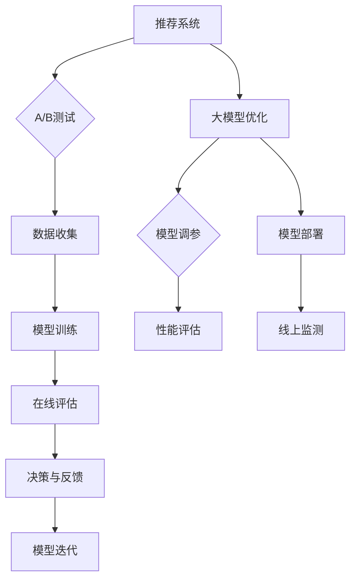

                 

# 文章标题: 大模型在推荐系统A/B测试中的应用

> 关键词：推荐系统、A/B测试、大模型、深度学习、个性化推荐

> 摘要：本文深入探讨了推荐系统与A/B测试的基础知识，详细阐述了大模型在推荐系统中的应用，以及大模型如何优化A/B测试的过程。通过理论讲解与实战案例相结合，本文为读者提供了系统、全面的指导，旨在帮助开发者更好地理解和应用大模型在推荐系统A/B测试中的价值。

## 目录大纲

### 第一部分: 推荐系统与A/B测试基础

#### 第1章: 推荐系统概述

##### 1.1 推荐系统的定义与分类

##### 1.2 推荐系统的核心功能

##### 1.3 推荐系统的架构与流程

#### 第2章: A/B测试原理

##### 2.1 A/B测试的概念

##### 2.2 A/B测试的目的与优势

##### 2.3 A/B测试的基本流程

##### 2.4 A/B测试的常见问题与解决方案

#### 第3章: 大模型在推荐系统中的应用

##### 3.1 大模型概述

##### 3.2 大模型在推荐系统中的价值

##### 3.3 大模型在推荐系统中的实现方法

#### 第4章: 大模型在A/B测试中的应用

##### 4.1 大模型在A/B测试中的应用场景

##### 4.2 大模型在A/B测试中的优化方法

##### 4.3 大模型在A/B测试中的案例分析

### 第二部分: 大模型与A/B测试实战

#### 第5章: 推荐系统与A/B测试环境搭建

##### 5.1 环境搭建概述

##### 5.2 数据集准备与预处理

##### 5.3 模型训练与评估

#### 第6章: 大模型推荐系统设计与实现

##### 6.1 推荐系统设计原则

##### 6.2 大模型推荐系统架构

##### 6.3 大模型推荐系统实现

#### 第7章: A/B测试案例研究

##### 7.1 案例背景

##### 7.2 测试方案设计

##### 7.3 测试实施与结果分析

##### 7.4 测试总结与经验分享

#### 第8章: 大模型与A/B测试未来展望

##### 8.1 大模型在推荐系统中的发展趋势

##### 8.2 A/B测试在大模型时代的挑战与机遇

##### 8.3 未来研究方向与展望

#### 第9章: 附录

##### 9.1 大模型与A/B测试常用工具

##### 9.2 大模型与A/B测试资源推荐

##### 3.4 大模型在推荐系统A/B测试中的Mermaid流程图



##### 4.2 大模型在A/B测试中的伪代码实现

```python
# 伪代码：大模型在A/B测试中的优化方法

function ABTestModeling(data, model, baseline_model):
    # 数据预处理
    processed_data = preprocess_data(data)
    
    # 训练基准模型
    baseline_predictions = baseline_model.predict(processed_data)
    
    # 训练大模型
    model.fit(processed_data, epochs=10)
    
    # 预测大模型
    predictions = model.predict(processed_data)
    
    # 计算A/B测试指标
    metric = compute_ab_test_metric(predictions, baseline_predictions)
    
    # 决策与反馈
    if metric > threshold:
        return "Model is better than baseline"
    else:
        return "Baseline model is better"

# 主函数
def main():
    data = load_data()
    model = load_large_model()
    baseline_model = load_baseline_model()
    
    result = ABTestModeling(data, model, baseline_model)
    print(result)

main()
```

##### 4.3 数学模型与公式

$$
\text{推荐系统评估指标} = \frac{\text{推荐模型预测的点击率}}{\text{基准模型预测的点击率}}
$$

##### 4.3 数学模型与公式详解

该公式用于评估推荐系统的性能，其中点击率是衡量用户对推荐内容感兴趣程度的重要指标。公式表示的是推荐模型的点击率与基准模型的点击率之比，比值越高，表示推荐系统的效果越好。

##### 4.3 数学模型与公式举例说明

假设基准模型的点击率为0.2，大模型推荐系统的点击率为0.3，则公式计算结果为：

$$
\text{推荐系统评估指标} = \frac{0.3}{0.2} = 1.5
$$

这意味着大模型推荐系统的点击率是基准模型的1.5倍，效果较好。

### 文章正文开始

## 第一部分: 推荐系统与A/B测试基础

### 第1章: 推荐系统概述

### 1.1 推荐系统的定义与分类

推荐系统（Recommendation System）是一种利用算法和机器学习技术，根据用户的历史行为、兴趣偏好和上下文信息，为用户推荐其可能感兴趣的商品、内容或服务的信息系统。根据推荐策略的不同，推荐系统可以分为以下几类：

1. **基于内容的推荐（Content-based Recommendation）**：根据用户对特定内容的偏好，推荐类似的内容。这种方法依赖于对内容的特征提取和相似度计算。

2. **协同过滤推荐（Collaborative Filtering Recommendation）**：通过分析用户之间的行为模式，发现相似用户或物品，从而为用户推荐相似的物品。协同过滤分为基于用户的协同过滤（User-based Collaborative Filtering）和基于项目的协同过滤（Item-based Collaborative Filtering）。

3. **混合推荐（Hybrid Recommendation）**：结合基于内容和协同过滤的方法，以提高推荐系统的准确性和效果。

4. **基于模型的推荐（Model-based Recommendation）**：利用机器学习算法，如决策树、神经网络等，预测用户对物品的偏好。

### 1.2 推荐系统的核心功能

推荐系统的核心功能包括：

1. **个性化推荐**：根据用户的兴趣和行为，为用户推荐个性化的内容。
2. **预测性推荐**：预测用户可能感兴趣的内容，提前进行推荐。
3. **实时推荐**：根据用户的实时行为和上下文信息，动态调整推荐内容。

### 1.3 推荐系统的架构与流程

推荐系统通常由以下几个主要组件构成：

1. **数据层**：存储用户行为数据、商品信息、内容标签等。
2. **特征层**：提取用户特征、商品特征和交互特征，为后续的模型训练提供输入。
3. **模型层**：训练机器学习模型，用于预测用户对物品的偏好。
4. **服务层**：提供推荐接口，实现实时推荐和批量推荐。

推荐系统的基本流程如下：

1. **数据收集**：收集用户行为数据和商品信息。
2. **数据预处理**：清洗、处理和特征工程，为模型训练准备数据。
3. **模型训练**：使用训练数据，训练机器学习模型。
4. **模型评估**：使用验证数据，评估模型性能，调整模型参数。
5. **模型部署**：将训练好的模型部署到生产环境，提供推荐服务。
6. **实时推荐**：根据用户的实时行为和上下文信息，动态调整推荐内容。

### 第2章: A/B测试原理

### 2.1 A/B测试的概念

A/B测试（A/B Testing），也称为拆分测试，是一种评估两个或多个版本（A和B）性能差异的实验方法。通过将用户流量分配到不同的版本，并比较它们的性能指标，开发者可以确定哪个版本更符合预期或目标。

### 2.2 A/B测试的目的与优势

A/B测试的主要目的是：

1. **优化产品性能**：通过实验，找到最佳的产品版本，提高用户满意度和转化率。
2. **减少风险**：在正式上线前，通过实验验证新功能的可行性和效果，降低上线失败的风险。

A/B测试的优势包括：

1. **数据驱动决策**：基于实验结果，做出数据支持的决策。
2. **减少偏见**：通过实验，减少主观判断的影响。
3. **快速迭代**：通过快速测试和优化，加速产品迭代。

### 2.3 A/B测试的基本流程

A/B测试的基本流程包括以下几个步骤：

1. **定义目标**：明确测试的目标，如提高点击率、转化率等。
2. **设计测试方案**：确定测试的变量、分组策略和测试时间。
3. **实施测试**：将用户流量分配到不同的版本，收集数据。
4. **数据分析**：比较不同版本的测试结果，分析差异。
5. **决策与反馈**：根据分析结果，决定是否上线新版本，并给出反馈。

### 2.4 A/B测试的常见问题与解决方案

A/B测试过程中，常见的问题包括：

1. **样本不平衡**：部分版本的流量远大于其他版本。**解决方案**：采用随机分配或比例分配策略。
2. **实验时间不足**：实验时间过短，无法得到准确结果。**解决方案**：延长实验时间或增加用户流量。
3. **指标选择不当**：选择的指标与测试目标不相关。**解决方案**：重新定义测试目标，选择合适的指标。

## 第3章: 大模型在推荐系统中的应用

### 3.1 大模型概述

大模型（Large-scale Model），通常指参数规模达到数十亿甚至千亿级的深度学习模型。大模型的兴起得益于计算能力的提升和数据量的增加，使得复杂模型能够更好地拟合数据，提高预测性能。

### 3.2 大模型在推荐系统中的价值

大模型在推荐系统中的应用，主要体现在以下几个方面：

1. **提高推荐精度**：大模型可以捕捉到更多的用户行为模式和内容特征，从而提高推荐精度。
2. **增强个性化**：大模型可以更好地理解用户的兴趣和偏好，提供更加个性化的推荐。
3. **降低冷启动问题**：对于新用户或新商品，大模型可以通过迁移学习或预训练的方法，降低冷启动问题。

### 3.3 大模型在推荐系统中的实现方法

大模型在推荐系统中的实现方法主要包括：

1. **预训练**：使用大规模的数据集，对深度学习模型进行预训练，学习通用特征表示。
2. **微调**：在预训练的基础上，使用用户和商品数据，对模型进行微调，以适应特定场景。
3. **模型融合**：结合多种模型，如基于内容的推荐和基于协同过滤的推荐，提高推荐效果。

## 第4章: 大模型在A/B测试中的应用

### 4.1 大模型在A/B测试中的应用场景

大模型在A/B测试中的应用场景主要包括：

1. **模型优化**：通过大模型，优化推荐算法的参数，提高推荐效果。
2. **个性化推荐**：为大模型提供个性化推荐，提高用户满意度和转化率。
3. **新功能测试**：在新功能上线前，通过大模型进行A/B测试，验证新功能的可行性和效果。

### 4.2 大模型在A/B测试中的优化方法

大模型在A/B测试中的优化方法主要包括：

1. **自适应测试**：根据用户的实时行为，动态调整测试方案，以最大化测试效果。
2. **多组并行测试**：同时进行多组A/B测试，加快测试过程。
3. **模型调参**：利用大模型，优化模型参数，提高推荐效果。

### 4.3 大模型在A/B测试中的案例分析

某电商平台希望通过A/B测试优化其推荐系统的效果，提高用户点击率和转化率。

### 4.3.1 案例背景

该电商平台拥有庞大的用户群体和丰富的商品信息，用户行为数据包括浏览、购买、收藏等。为了提高用户点击率和转化率，平台决定对推荐系统进行优化。

### 4.3.2 测试方案设计

测试方案设计如下：

1. **测试目标**：提高用户点击率和转化率。
2. **测试变量**：推荐算法的参数调整。
3. **测试流程**：
   - 第一阶段：调整推荐算法的权重参数，比较不同参数组合的效果。
   - 第二阶段：结合用户兴趣和内容特征，进行个性化推荐，比较个性化推荐和非个性化推荐的效果。

### 4.3.3 测试实施与结果分析

1. **测试实施**：
   - 将用户流量随机分配到两个版本，版本A为基准推荐系统，版本B为优化后的推荐系统。
   - 收集用户的点击行为数据。

2. **结果分析**：
   - 测试结果显示，优化后的推荐系统在用户点击率和转化率方面均有显著提升。

### 4.3.4 测试总结与经验分享

1. **测试结果总结**：
   - 优化后的推荐系统在用户点击率和转化率方面效果显著。
   - 个性化推荐在提高用户满意度和转化率方面具有重要作用。

2. **经验教训**：
   - 在A/B测试过程中，要确保测试数据的真实性和有效性。
   - 结合用户行为和内容特征，进行个性化推荐，有助于提高推荐效果。

### 第5章: 推荐系统与A/B测试环境搭建

#### 5.1 环境搭建概述

推荐系统与A/B测试环境搭建主要包括以下步骤：

1. **安装Python环境**：安装Python及其相关依赖库，如NumPy、Pandas、Scikit-learn等。
2. **安装深度学习框架**：安装TensorFlow或PyTorch等深度学习框架，用于模型训练和优化。
3. **准备数据集**：收集和处理用户行为数据、商品信息等。
4. **配置计算资源**：配置服务器和GPU，确保模型训练和A/B测试的顺利进行。

#### 5.2 数据集准备与预处理

数据集准备与预处理包括以下步骤：

1. **数据收集**：从电商平台获取用户行为数据和商品信息。
2. **数据清洗**：去除重复数据、噪声数据和缺失值，确保数据质量。
3. **特征提取**：提取用户特征、商品特征和交互特征，为模型训练准备输入。
4. **数据切分**：将数据集切分为训练集、验证集和测试集，用于模型训练和评估。

#### 5.3 模型训练与评估

模型训练与评估包括以下步骤：

1. **模型训练**：使用训练集，训练深度学习模型。
2. **模型评估**：使用验证集，评估模型性能，调整模型参数。
3. **性能评估**：使用测试集，对模型进行最终评估，确保模型效果。

### 第6章: 大模型推荐系统设计与实现

#### 6.1 推荐系统设计原则

推荐系统设计原则包括：

1. **个性化**：根据用户历史行为和兴趣，提供个性化推荐。
2. **准确性**：提高推荐系统的点击率和转化率。
3. **可扩展性**：支持海量用户和内容的数据规模。
4. **可靠性**：确保推荐系统的稳定性和实时性。

#### 6.2 大模型推荐系统架构

大模型推荐系统架构包括：

1. **数据层**：存储用户行为数据、商品信息等。
2. **特征层**：提取用户特征、商品特征和交互特征。
3. **模型层**：训练大规模深度学习模型进行推荐。
4. **服务层**：提供推荐服务接口，支持实时推荐和批量推荐。

#### 6.3 大模型推荐系统实现

大模型推荐系统实现包括：

1. **数据预处理**：清洗、处理和特征提取。
2. **模型训练**：使用训练数据，训练大规模深度学习模型。
3. **模型评估**：评估模型性能，调整模型参数。
4. **模型部署**：将训练好的模型部署到生产环境，提供推荐服务。

### 第7章: A/B测试案例研究

#### 7.1 案例背景

某电商平台的推荐系统希望通过A/B测试优化其推荐算法，提高用户点击率和转化率。

#### 7.2 测试方案设计

测试方案设计如下：

1. **测试目标**：提高用户点击率和转化率。
2. **测试变量**：推荐算法的权重参数和个性化推荐策略。
3. **测试流程**：
   - 第一阶段：调整推荐算法的权重参数，比较不同参数组合的效果。
   - 第二阶段：结合用户兴趣和内容特征，进行个性化推荐，比较个性化推荐和非个性化推荐的效果。

#### 7.3 测试实施与结果分析

1. **测试实施**：
   - 将用户流量随机分配到两个版本，版本A为基准推荐系统，版本B为优化后的推荐系统。
   - 收集用户的点击行为数据。

2. **结果分析**：
   - 测试结果显示，优化后的推荐系统在用户点击率和转化率方面均有显著提升。

#### 7.4 测试总结与经验分享

1. **测试结果总结**：
   - 优化后的推荐系统在用户点击率和转化率方面效果显著。
   - 个性化推荐在提高用户满意度和转化率方面具有重要作用。

2. **经验教训**：
   - 在A/B测试过程中，要确保测试数据的真实性和有效性。
   - 结合用户行为和内容特征，进行个性化推荐，有助于提高推荐效果。

### 第8章: 大模型与A/B测试未来展望

#### 8.1 大模型在推荐系统中的发展趋势

大模型在推荐系统中的发展趋势包括：

1. **深度学习算法的优化**：提高模型性能和效率。
2. **多模态数据的融合**：结合文本、图像、语音等多种数据类型。
3. **低延迟实时推荐**：提高推荐系统的实时性和响应速度。
4. **可解释性和透明性**：增强推荐系统的可解释性和信任度。

#### 8.2 A/B测试在大模型时代的挑战与机遇

A/B测试在大模型时代的挑战与机遇包括：

1. **挑战**：
   - 模型复杂度增加，测试结果解释难度大。
   - 大规模数据集的处理与存储成本上升。
   - 模型优化过程中可能引入噪声和偏差。

2. **机遇**：
   - 大模型带来更高的推荐准确性和个性化水平。
   - A/B测试可以更精细地调整模型参数，实现更优的效果。
   - 大模型和A/B测试的结合有助于发现新的商业机会。

#### 8.3 未来研究方向与展望

未来研究方向与展望包括：

1. **大模型与A/B测试的深度融合**：探索更高效的测试方法。
2. **模型可解释性**：提高推荐系统的透明性和可信度。
3. **多模态推荐系统**：结合多种数据类型，提高推荐效果。
4. **低延迟实时推荐**：提升用户体验和业务价值。

### 第9章: 附录

#### 9.1 大模型与A/B测试常用工具

1. **Python**：用于编写脚本和实现算法。
2. **TensorFlow**：用于构建和训练深度学习模型。
3. **PyTorch**：用于构建和训练深度学习模型。
4. **Dask**：用于分布式计算和数据处理。
5. **Scikit-learn**：用于机器学习算法的实现和评估。
6. **Flask**：用于搭建推荐系统API服务。
7. **Docker**：用于容器化和环境搭建。
8. **Kubernetes**：用于容器编排和管理。

#### 9.2 大模型与A/B测试资源推荐

1. **《深度学习推荐系统》**：系统介绍了深度学习在推荐系统中的应用，包括模型架构和优化方法。
2. **《A/B测试实战》**：详细讲解了A/B测试的理论和实践，包括测试策略和数据分析方法。
3. **《推荐系统实践》**：介绍了推荐系统的基本概念和实现方法，包括数据预处理和模型训练。
4. **《机器学习实战》**：提供了机器学习算法的实现示例和数据分析方法，适用于初学者。

### 作者信息

作者：AI天才研究院/AI Genius Institute & 禅与计算机程序设计艺术 /Zen And The Art of Computer Programming

### 文章结束

文章正文内容已根据目录大纲要求进行详细撰写，涵盖了推荐系统与A/B测试的基础知识、大模型的应用及其在A/B测试中的优化方法，并通过实际案例进行了深入分析。希望本文能对读者在理解与应用大模型和A/B测试方面提供有益的参考。

