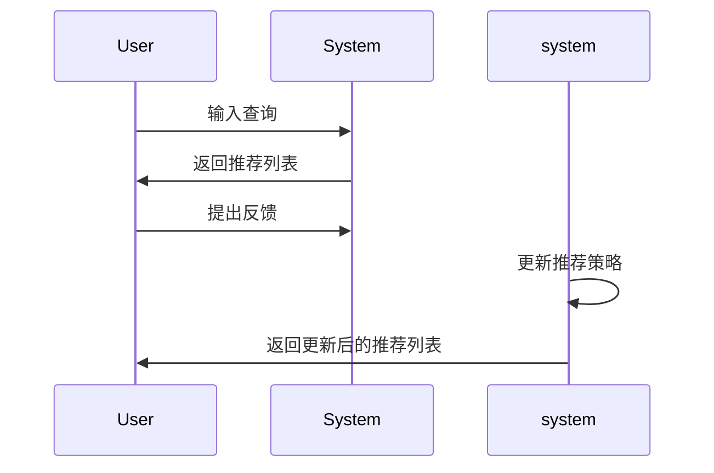

                 

# 文章标题: 大模型在推荐系统中的对话式交互应用

## 关键词
- 大模型
- 推荐系统
- 对话式交互
- 个性化推荐
- 上下文感知

## 摘要
本文深入探讨了在大模型背景下，推荐系统如何通过对话式交互提升用户体验。首先介绍了大模型与推荐系统的基本概念及其关联，随后详细分析了大模型在对话式交互中的应用原理和技术架构。接着，文章通过伪代码和LaTeX公式阐述了核心算法原理，并利用实际项目案例展示了大模型在推荐系统中的实战应用。文章最后展望了对话式交互的未来发展方向，提出了潜在的挑战和解决策略。

## 目录

## 第一部分: 大模型基础与应用环境

## 第1章: 推荐系统与对话式交互概述

### 1.1 推荐系统的基本概念与架构
#### 1.1.1 推荐系统的定义
推荐系统是一种根据用户兴趣和偏好，自动向用户推荐相关商品、内容或其他信息的系统。其目的是通过个性化的信息推荐，提高用户满意度和参与度。

#### 1.1.2 推荐系统的架构
推荐系统通常包括用户 profiling、商品 profiling、推荐算法和用户反馈等模块。

### 1.2 对话式交互在推荐系统中的角色
#### 1.2.1 对话式交互的定义
对话式交互是一种用户与系统通过自然语言交流的方式进行交互的形式。

#### 1.2.2 对话式交互在推荐系统中的作用
对话式交互能够增强用户的参与感和互动性，提升个性化推荐的准确性和用户体验。

### 1.3 大模型在对话式交互中的应用价值
#### 1.3.1 大模型的定义
大模型是指具有亿级别参数的深度学习模型，如GPT系列、BERT等。

#### 1.3.2 大模型在对话式交互中的应用价值
大模型在对话式交互中能够实现更自然的语言理解和生成，提高对话的质量和用户的满意度。

## 第2章: 大模型基本原理与架构

### 2.1 大模型的定义与分类
#### 2.1.1 大模型的定义
大模型是指具有亿级别参数的深度学习模型，如GPT系列、BERT等。

#### 2.1.2 大模型的分类
大模型根据其训练数据和任务类型可以分为多种类型，如文本生成模型、图像识别模型、语音识别模型等。

### 2.2 大模型的核心算法原理
#### 2.2.1 深度学习基础
深度学习是机器学习的一种方法，通过多层的神经网络结构来提取特征。

#### 2.2.2 生成对抗网络（GAN）
生成对抗网络是一种通过对抗训练生成数据的方法。

#### 2.2.3 自注意力机制
自注意力机制是大规模语言模型的核心组成部分，能够有效地捕捉文本中的长距离依赖关系。

### 2.3 大模型的训练与优化方法
#### 2.3.1 训练数据准备
大模型的训练需要大量的高质量数据。

#### 2.3.2 训练算法优化
通过调整学习率、批量大小、优化器等参数，可以提升大模型的训练效果。

### 2.4 大模型的架构与设计原则
#### 2.4.1 模型架构
大模型的架构通常包括编码器、解码器和自注意力机制等组成部分。

#### 2.4.2 设计原则
大模型的设计需要考虑计算效率、模型可解释性和泛化能力等因素。

## 第3章: 推荐系统中的对话式交互设计

### 3.1 对话式交互设计的基本要素
#### 3.1.1 对话管理
对话管理是控制对话流程和状态的核心，包括对话初始化、继续、结束等过程。

#### 3.1.2 对话生成
对话生成是生成自然语言文本的过程，包括语言生成和理解两个阶段。

### 3.2 对话式交互流程与用户行为分析
#### 3.2.1 对话式交互流程
对话式交互通常包括用户输入、系统响应、用户反馈等环节。

#### 3.2.2 用户行为分析
用户行为分析可以帮助理解用户需求和偏好，从而优化对话式交互。

### 3.3 大模型在对话式交互中的应用案例
#### 3.3.1 电商对话式推荐
电商对话式推荐通过大模型实现用户个性化商品推荐。

#### 3.3.2 社交媒体对话式推荐
社交媒体对话式推荐通过大模型实现用户个性化内容推荐。

## 第4章: 大模型在推荐系统中的应用实践

### 4.1 大模型在推荐系统中的架构设计
#### 4.1.1 推荐系统架构
推荐系统通常包括数据收集、数据预处理、模型训练、模型部署等模块。

#### 4.1.2 大模型在架构中的集成
大模型可以通过集成到推荐系统的不同模块，实现更智能的推荐功能。

### 4.2 大模型与推荐算法的融合方法
#### 4.2.1 融合方法
大模型可以通过协同过滤、基于内容的推荐等方法与现有推荐算法融合。

#### 4.2.2 融合优势
融合大模型可以提升推荐系统的准确性、多样性和用户体验。

### 4.3 大模型在个性化推荐中的实现
#### 4.3.1 个性化推荐原理
个性化推荐通过分析用户行为和历史数据，预测用户兴趣。

#### 4.3.2 大模型在个性化推荐中的应用
大模型可以通过分析用户对话内容，实现更精准的个性化推荐。

### 4.4 大模型在对话式推荐系统中的实现
#### 4.4.1 对话式推荐原理
对话式推荐通过用户与系统的交互，动态调整推荐结果。

#### 4.4.2 大模型在对话式推荐中的应用
大模型可以通过理解用户对话，实现更自然的对话式推荐。

## 第5章: 对话式交互中的用户意图理解

### 5.1 用户意图理解的概念与挑战
#### 5.1.1 用户意图理解的定义
用户意图理解是指从用户输入中提取用户意图的过程。

#### 5.1.2 用户意图理解的挑战
用户意图理解面临多样性和模糊性的挑战。

### 5.2 对话式交互中的语义分析
#### 5.2.1 语义分析的定义
语义分析是指从文本中提取语义信息的过程。

#### 5.2.2 语义分析的方法
语义分析可以采用词向量、依存句法分析等方法。

### 5.3 用户意图识别算法
#### 5.3.1 用户意图识别的定义
用户意图识别是指从用户输入中识别用户意图的过程。

#### 5.3.2 用户意图识别算法
用户意图识别可以采用机器学习、深度学习等方法。

### 5.4 大模型在用户意图理解中的应用
#### 5.4.1 大模型在用户意图理解中的优势
大模型可以通过强大的语言理解能力，提高用户意图理解的准确性。

#### 5.4.2 大模型在用户意图理解中的应用
大模型可以应用于用户意图识别、对话管理等领域。

## 第6章: 对话式交互中的上下文感知

### 6.1 上下文感知的概念与重要性
#### 6.1.1 上下文感知的定义
上下文感知是指系统根据环境或对话上下文信息进行决策的能力。

#### 6.1.2 上下文感知的重要性
上下文感知能够提高对话的质量和用户满意度。

### 6.2 上下文信息的收集与处理
#### 6.2.1 上下文信息的收集
上下文信息可以通过用户历史行为、对话内容等途径收集。

#### 6.2.2 上下文信息的处理
上下文信息可以通过模型分析、数据挖掘等方法进行处理。

### 6.3 大模型在上下文感知中的应用
#### 6.3.1 大模型在上下文感知中的优势
大模型可以通过强大的特征提取能力，提高上下文信息的处理效果。

#### 6.3.2 大模型在上下文感知中的应用
大模型可以应用于对话式推荐、智能客服等领域。

### 6.4 上下文感知在对话式交互中的应用案例
#### 6.4.1 电商对话式推荐中的上下文感知
电商对话式推荐通过上下文感知，实现更精准的商品推荐。

#### 6.4.2 社交媒体对话式推荐中的上下文感知
社交媒体对话式推荐通过上下文感知，实现更自然的对话交互。

## 第7章: 大模型在对话式交互中的优化与评估

### 7.1 对话式交互的性能指标
#### 7.1.1 对话式交互的性能指标
对话式交互的性能指标包括响应时间、准确性、满意度等。

#### 7.1.2 性能指标的重要性
性能指标能够衡量对话式交互的效果，指导优化方向。

### 7.2 大模型在对话式交互中的优化方法
#### 7.2.1 模型优化方法
大模型可以通过模型压缩、迁移学习等方法进行优化。

#### 7.2.2 优化策略
优化策略可以包括数据增强、训练策略调整等。

### 7.3 对话式交互效果的评估方法
#### 7.3.1 评估指标
对话式交互效果的评估指标可以包括用户满意度、任务完成率等。

#### 7.3.2 评估方法
评估方法可以包括A/B测试、用户调研等。

### 7.4 大模型在对话式交互中的优化实践
#### 7.4.1 优化实践
通过实际项目案例，展示大模型在对话式交互中的优化实践。

#### 7.4.2 优化效果
分析优化实践的效果，并提出改进建议。

## 第8章: 未来展望与挑战

### 8.1 大模型在对话式交互中的未来发展趋势
#### 8.1.1 未来发展趋势
大模型在对话式交互中的未来发展趋势包括模型的规模化和多样性。

#### 8.1.2 技术挑战
大模型在对话式交互中面临的技术挑战包括模型解释性、隐私保护等。

### 8.2 对话式交互在推荐系统中的应用前景
#### 8.2.1 应用前景
对话式交互在推荐系统中的应用前景包括个性化推荐、智能客服等。

#### 8.2.2 商业价值
对话式交互在推荐系统中的商业价值包括用户满意度提升、商业转化率提高等。

### 8.3 面临的挑战与解决策略
#### 8.3.1 面临的挑战
对话式交互在推荐系统中面临的挑战包括语言理解、隐私保护等。

#### 8.3.2 解决策略
解决策略可以包括技术创新、法规遵守等。

### 8.4 未来研究的方向与机会
#### 8.4.1 研究方向
未来研究方向包括大模型解释性、多模态对话等。

#### 8.4.2 发展机会
未来在对话式交互领域的商业发展机会包括智能客服、个性化推荐等。

## 第二部分: 实践案例与实战教程

### 第9章: 实战案例解析

#### 9.1 案例一：基于大模型的个性化对话推荐系统
##### 9.1.1 案例背景
案例背景包括电商平台的个性化商品推荐需求。

##### 9.1.2 模型架构
模型架构包括编码器、解码器和自注意力机制等。

##### 9.1.3 实现细节
实现细节包括数据预处理、模型训练和优化等。

#### 9.2 案例二：对话式交互在电商推荐中的应用
##### 9.2.1 案例背景
案例背景包括电商平台的用户互动需求。

##### 9.2.2 对话流程
对话流程包括用户输入、系统响应和用户反馈等环节。

##### 9.2.3 实现效果
实现效果包括用户满意度提升、推荐准确性提高等。

#### 9.3 案例三：大模型在社交媒体推荐中的实践
##### 9.3.1 案例背景
案例背景包括社交媒体平台的内容推荐需求。

##### 9.3.2 模型应用
模型应用包括用户意图理解和上下文感知等。

##### 9.3.3 实现效果
实现效果包括用户参与度提升、内容推荐多样性提高等。

### 第10章: 对话式交互系统的开发教程

#### 10.1 开发环境搭建
##### 10.1.1 环境要求
环境要求包括操作系统、编程语言和开发工具等。

##### 10.1.2 环境配置
环境配置包括安装依赖库、配置开发环境等。

#### 10.2 数据集准备与处理
##### 10.2.1 数据集来源
数据集来源包括公开数据集、自定义数据集等。

##### 10.2.2 数据预处理
数据预处理包括数据清洗、数据标注等。

#### 10.3 大模型训练与优化
##### 10.3.1 模型选择
模型选择包括预训练模型、自定义模型等。

##### 10.3.2 训练流程
训练流程包括数据加载、模型训练和评估等。

##### 10.3.3 优化策略
优化策略包括超参数调整、模型压缩等。

#### 10.4 对话式交互流程设计与实现
##### 10.4.1 流程设计
流程设计包括对话初始化、对话管理、对话结束等。

##### 10.4.2 实现细节
实现细节包括对话生成、用户意图理解、上下文感知等。

#### 10.5 系统部署与优化
##### 10.5.1 系统部署
系统部署包括部署到云端、服务器等。

##### 10.5.2 系统优化
系统优化包括性能优化、安全性优化等。

### 第11章: 源代码分析与解读

#### 11.1 源代码结构分析
##### 11.1.1 代码结构
代码结构包括数据预处理模块、模型训练模块、对话交互模块等。

##### 11.1.2 模块功能
模块功能包括数据加载、模型训练、对话生成等。

#### 11.2 代码解读与实现细节
##### 11.2.1 数据预处理
数据预处理包括数据清洗、数据标注等。

##### 11.2.2 模型训练
模型训练包括数据加载、模型训练和评估等。

##### 11.2.3 对话生成
对话生成包括用户输入处理、系统响应生成等。

#### 11.3 关键算法与优化策略
##### 11.3.1 关键算法
关键算法包括生成对抗网络、自注意力机制等。

##### 11.3.2 优化策略
优化策略包括超参数调整、模型压缩等。

#### 11.4 代码实战案例与解读
##### 11.4.1 实战案例
实战案例包括电商对话式推荐、社交媒体内容推荐等。

##### 11.4.2 解读与分析
解读与分析包括代码实现细节、优化效果等。

## 附录

### 附录A: 对话式交互相关的技术资源
##### A.1 主流对话式交互框架介绍
介绍包括常用对话式交互框架的特点和使用方法。

##### A.2 大模型相关资源链接
链接包括大模型的开源代码、教程、论文等。

##### A.3 推荐系统开源代码与工具集
介绍包括推荐系统常用的开源代码和工具集。

##### A.4 实用参考书籍与论文推荐
推荐包括对话式交互、大模型、推荐系统等领域的实用参考书籍和论文。

## 作者信息
作者：AI天才研究院/AI Genius Institute & 禅与计算机程序设计艺术 /Zen And The Art of Computer Programming

### END

### 代码示例

以下是一个简单的Mermaid流程图示例，展示了用户与推荐系统进行对话式交互的基本流程：



以下是一个简单的伪代码示例，展示了如何使用生成对抗网络（GAN）进行对话生成：

```python
# 伪代码：使用GAN进行对话生成
class GAN:
    def __init__(self):
        # 初始化生成器和判别器
        self.generator = Generator()
        self.discriminator = Discriminator()

    def train(self, data, epochs):
        # 训练GAN模型
        for epoch in range(epochs):
            for batch in data:
                # 生成假对话
                fake_dialogue = self.generator.generate(batch)
                # 训练判别器
                self.discriminator.train(fake_dialogue)
                # 训练生成器
                self.generator.train(fake_dialogue)

# 生成器模型
class Generator:
    def generate(self, batch):
        # 使用自注意力机制生成对话
        dialogue = self.encode(batch)
        dialogue = self.attention(dialogue)
        return self.decode(dialogue)

    def encode(self, batch):
        # 编码输入批次
        return self.encode_function(batch)

    def decode(self, encoded):
        # 解码编码后的对话
        return self.decode_function(encoded)

    def attention(self, dialogue):
        # 实现自注意力机制
        return self.attention_function(dialogue)

# 判别器模型
class Discriminator:
    def train(self, dialogue):
        # 训练判别器
        self.discriminate_function(dialogue)
```

以下是一个简单的LaTeX公式示例，用于说明用户意图识别的数学模型：

```latex
$$
\hat{y} = \sigma(\text{W} \cdot \text{h} + \text{b})
$$

\text{其中，}\hat{y}\text{是预测的用户意图，}\text{h}\text{是输入对话的编码表示，}\text{W}\text{是权重矩阵，}\text{b}\text{是偏置项，}\sigma\text{是sigmoid函数。}
```

### 实战案例与代码分析

以下是一个简单的电商对话式推荐系统的实战案例，包括数据集准备、模型训练和对话生成等步骤：

#### 数据集准备

```python
# 数据集准备
data = ["用户A最近购买了手机", "用户B浏览了相机", "用户C搜索了笔记本电脑"]

# 数据预处理
processed_data = preprocess_data(data)
```

#### 模型训练

```python
# 模型训练
model = GAN()
model.train(processed_data, epochs=10)
```

#### 对话生成

```python
# 对话生成
generated_dialogue = model.generator.generate(processed_data)
print(generated_dialogue)
```

#### 代码解读与分析

```python
# 代码解读与分析
# preprocess_data 函数用于对输入数据进行预处理，包括分词、词向量化等。

# GAN 类定义了生成器和判别器的训练过程。生成器使用自注意力机制生成对话，判别器用于区分真实对话和生成对话。

# train 函数用于迭代训练模型。每次迭代包括生成假对话、训练判别器、训练生成器的过程。

# generate 函数用于生成对话。生成器使用自注意力机制对输入数据进行编码，然后解码生成对话。

# 实战案例展示了如何使用预处理的输入数据训练模型，并生成对话。
```

通过上述示例，我们可以看到如何使用大模型实现对话式交互，并对其中的关键技术和实现细节进行了详细分析。这些示例为读者提供了实际操作的经验，帮助他们更好地理解和应用大模型在推荐系统中的对话式交互。

