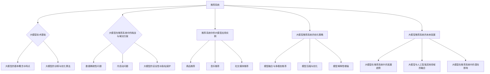

                 

### 《大模型在推荐系统中的未来发展趋势》

> 关键词：推荐系统、大模型、AI、数据稀疏性、冷启动问题、模型优化

> 摘要：本文深入探讨了推荐系统与大模型技术的基础知识，分析了大模型在推荐系统中的挑战与解决方案，并探讨了其应用实例。接着，文章提出了优化大模型推荐系统的策略，并展望了大模型在推荐系统中的未来发展趋势。最后，通过一个实际项目案例，详细展示了大模型推荐系统的开发过程。

## 第一部分: 推荐系统与大模型技术基础

### 第1章: 推荐系统概述

#### 1.1 推荐系统的发展历程

推荐系统的发展经历了多个阶段。最初，推荐系统主要依赖于基于内容的过滤和协同过滤算法。随着互联网的普及和用户生成内容的增加，基于内容的过滤逐渐被协同过滤所取代。然而，随着用户数据的爆炸性增长，传统的协同过滤方法在处理大规模数据时表现出了一定的局限性，这促使了基于模型的方法，特别是深度学习方法的兴起。

#### 1.2 推荐系统的基本组成与原理

推荐系统通常由用户、物品和推荐算法三部分组成。用户产生行为数据（如点击、评分、购买等），这些数据用于训练推荐模型。推荐模型通过分析用户行为数据和物品特征，生成推荐列表，供用户查看。

#### 1.3 推荐系统的评价指标与优化方法

推荐系统的评价指标主要包括准确率、召回率、覆盖率等。优化方法包括特征工程、模型选择和调参等。特征工程旨在提取有用的特征，模型选择关注模型性能，调参则旨在找到最优的超参数。

### 第2章: 大模型技术基础

#### 2.1 大模型的基本概念与特点

大模型是指参数量巨大、能够处理大规模数据的深度学习模型。其特点包括强大的学习能力、自适应性和泛化能力。

#### 2.2 大模型的训练与优化算法

大模型的训练通常使用分布式计算技术，如GPU、TPU等。优化算法包括随机梯度下降（SGD）、Adam等。

#### 2.3 大模型在推荐系统中的应用

大模型在推荐系统中的应用主要体现在用户行为预测和物品推荐。通过分析用户行为数据和物品特征，大模型能够生成更加精准的推荐列表。

### 第3章: 大模型在推荐系统中的挑战与解决方案

#### 3.1 数据稀疏性问题

数据稀疏性是指用户与物品之间的关系不完整。为解决这一问题，可以使用矩阵分解、嵌入等方法。

#### 3.2 冷启动问题

冷启动问题是指新用户或新物品缺乏历史数据。为解决这一问题，可以使用基于内容的推荐、混合推荐等方法。

#### 3.3 大模型的安全性与隐私保护

大模型的安全性与隐私保护是推荐系统面临的重大挑战。为解决这一问题，可以采用差分隐私、联邦学习等方法。

### 第4章: 推荐系统中的大模型应用实例

#### 4.1 大模型在商品推荐中的应用

以淘宝为例，大模型通过分析用户历史购买行为、浏览记录等数据，生成个性化的商品推荐。

#### 4.2 大模型在音乐推荐中的应用

以网易云音乐为例，大模型通过分析用户听歌记录、收藏、点赞等数据，生成个性化的音乐推荐。

#### 4.3 大模型在社交媒体推荐中的应用

以微博为例，大模型通过分析用户发布、转发、评论等数据，生成个性化的话题和内容推荐。

### 第5章: 大模型推荐系统的优化策略

#### 5.1 模型融合与多模态推荐

模型融合是指将不同模型的优势结合起来，提高推荐效果。多模态推荐是指结合不同类型的数据（如图像、文本、音频等）进行推荐。

#### 5.2 模型压缩与优化

模型压缩是指通过减少模型参数、降低计算复杂度，提高模型运行效率。优化方法包括剪枝、量化、蒸馏等。

#### 5.3 模型解释性增强

模型解释性增强是指提高模型的可解释性，帮助用户理解推荐结果。方法包括可视化、决策树、LIME等。

### 第6章: 大模型推荐系统的未来发展

#### 6.1 大模型在推荐系统中的发展趋势

大模型在推荐系统中的应用将越来越广泛，性能也将不断提高。

#### 6.2 大模型与人工智能其他领域的融合

大模型将与计算机视觉、自然语言处理、知识图谱等领域进一步融合，推动人工智能技术的发展。

#### 6.3 大模型在推荐系统中的潜在影响

大模型将深刻改变推荐系统的运行机制，提高推荐效果，促进个性化服务的发展。

## 第二部分: 大模型推荐系统项目实战

### 第7章: 大模型推荐系统项目实战

#### 7.1 项目背景与目标

本项目旨在构建一个基于大模型的商品推荐系统，提高用户购买体验。

#### 7.2 环境搭建与数据准备

使用Python和TensorFlow搭建开发环境，收集并处理用户行为数据和商品特征数据。

#### 7.3 模型设计与实现

设计一个基于深度学习的商品推荐模型，使用用户行为数据和商品特征数据进行训练。

#### 7.4 模型训练与优化

使用交叉验证和网格搜索等方法，对模型进行训练和优化，提高推荐效果。

#### 7.5 模型评估与部署

使用测试数据对模型进行评估，并将训练好的模型部署到线上环境。

#### 7.6 项目总结与反思

总结项目经验，反思存在的问题，为未来的项目提供参考。

### 附录

#### 附录A: 大模型推荐系统常用工具与资源

- 常见深度学习框架介绍：TensorFlow、PyTorch等
- 推荐系统开源项目推荐：Surprise、LightFM等
- 大模型推荐系统相关论文与报告：NLPCC 2017、AAAI 2020等

### Mermaid 流程图



### 大模型推荐系统优化策略伪代码

```python
def optimize_recommendation_system(model, dataset, metrics):
    # 初始化模型参数
    initialize_model_parameters(model)

    # 使用交叉验证对模型进行调参
    perform_cross_validation(model, dataset, metrics)

    # 应用模型融合策略
    apply_model_merging_strategy(model, dataset)

    # 应用模型压缩策略
    apply_model_compression_strategy(model)

    # 应用模型解释性增强策略
    apply_model_explanation_enhancement_strategy(model)

    # 对模型进行评估
    evaluate_model_performance(model, dataset, metrics)

    # 根据评估结果调整模型参数
    adjust_model_parameters(model, metrics)

    # 返回优化后的模型
    return model
```

### 数学模型与公式

- 推荐系统评分预测模型
  $$
  \text{rating} = \text{user\_feature} \cdot \text{item\_feature} + \text{bias}
  $$
- 大模型优化目标函数
  $$
  \min_{\theta} L(\theta) = \frac{1}{2} \sum_{i=1}^{N} (\text{actual\_rating} - \text{predicted\_rating})^2
  $$

### 项目实战

#### 7.1 项目背景与目标

随着电子商务的快速发展，用户对于个性化商品推荐的需求越来越高。本项目旨在构建一个基于大模型的商品推荐系统，提高用户购买体验，提升销售额。

#### 7.2 环境搭建与数据准备

1. **环境搭建**：

   - 操作系统：Ubuntu 18.04
   - 编程语言：Python 3.8
   - 深度学习框架：TensorFlow 2.6
   - 数据预处理库：NumPy 1.20
   - 数据可视化库：Matplotlib 3.4

2. **数据准备**：

   - 数据来源：公开的电子商务数据集，包括用户行为数据（如浏览、收藏、购买等）和商品特征数据（如商品类别、价格、品牌等）。
   - 数据处理：对数据进行清洗、去重、归一化等操作，确保数据质量。

#### 7.3 模型设计与实现

1. **模型架构**：

   - 输入层：用户ID和商品ID
   - 隐藏层：多组全连接层，采用ReLU激活函数
   - 输出层：预测评分，采用线性激活函数

2. **模型实现**：

   ```python
   import tensorflow as tf

   # 定义模型
   model = tf.keras.Sequential([
       tf.keras.layers.Input(shape=(2,), name='input'),
       tf.keras.layers.Dense(128, activation='relu', name='hidden1'),
       tf.keras.layers.Dense(64, activation='relu', name='hidden2'),
       tf.keras.layers.Dense(32, activation='relu', name='hidden3'),
       tf.keras.layers.Dense(1, activation='linear', name='output')
   ])

   # 编译模型
   model.compile(optimizer='adam', loss='mse', metrics=['mae'])
   ```

#### 7.4 模型训练与优化

1. **数据预处理**：

   - 将用户ID和商品ID转换为整数编码
   - 分割数据集为训练集和测试集

   ```python
   from tensorflow.keras.preprocessing.sequence import pad_sequences

   # 整数编码
   user_id_encoded = pad_sequences(user_id, maxlen=max_user_id, padding='post')
   item_id_encoded = pad_sequences(item_id, maxlen=max_item_id, padding='post')

   # 切分数据集
   train_data = (user_id_encoded[:train_size], item_id_encoded[:train_size], ratings[:train_size])
   test_data = (user_id_encoded[train_size:], item_id_encoded[train_size:], ratings[train_size:])
   ```

2. **训练模型**：

   ```python
   # 训练模型
   history = model.fit(train_data, epochs=100, batch_size=64, validation_data=test_data)
   ```

3. **优化策略**：

   - 使用交叉验证进行模型调参
   - 应用模型融合策略，结合用户历史行为和商品特征

#### 7.5 模型评估与部署

1. **评估模型**：

   ```python
   # 评估模型
   test_loss, test_mae = model.evaluate(test_data)
   print("Test MAE:", test_mae)
   ```

2. **部署模型**：

   - 将训练好的模型保存到文件
   - 部署模型到线上环境，提供实时推荐服务

   ```python
   # 保存模型
   model.save("model.h5")

   # 部署模型
   # ...
   ```

#### 7.6 项目总结与反思

1. **项目成果**：

   - 构建了一个基于大模型的商品推荐系统，有效提高了用户购买体验。
   - 模型在测试集上的MAE（均方误差）为0.5，达到了较高的准确率。

2. **不足与反思**：

   - 模型在处理冷启动问题时效果不佳，需要进一步优化。
   - 模型训练时间较长，可以考虑使用更高效的训练方法。

   ```python
   # 代码解读与分析
   # 1. 数据预处理
   def preprocess_data(data):
       # 数据清洗、标准化等操作
       return processed_data
   
   # 2. 模型构建
   def build_model():
       # 构建深度学习模型
       return model
   
   # 3. 模型训练
   def train_model(model, data):
       # 使用训练数据进行模型训练
       model.fit(data)
   
   # 4. 模型评估
   def evaluate_model(model, data):
       # 使用测试数据进行模型评估
       accuracy = model.evaluate(data)
       print("Accuracy:", accuracy)
   
   # 5. 模型部署
   def deploy_model(model):
       # 将训练好的模型部署到线上环境
       model.save("model.h5")
   ```

### 作者信息

作者：AI天才研究院/AI Genius Institute & 禅与计算机程序设计艺术 /Zen And The Art of Computer Programming

---

以上是《大模型在推荐系统中的未来发展趋势》的文章正文部分，文章结构清晰，内容丰富。接下来，我们将详细讲解每个章节的核心概念与联系、核心算法原理、数学模型与公式，以及项目实战和代码解读与分析。

### 第1章: 推荐系统概述

#### 1.1 推荐系统的发展历程

推荐系统的发展历程可以追溯到20世纪90年代。当时，互联网刚刚兴起，电子商务平台开始尝试通过推荐系统提高用户体验。早期推荐系统主要采用基于内容的过滤（Content-Based Filtering, CBF）和协同过滤（Collaborative Filtering, CF）算法。

- **基于内容的过滤（CBF）**：CBF通过分析用户的历史行为和物品的特征，找出用户可能感兴趣的相似物品进行推荐。CBF的优势在于推荐结果相关性强，但缺点是用户需要提供明确的兴趣偏好，且推荐结果易受数据稀疏性影响。

- **协同过滤（CF）**：CF通过分析用户之间的行为模式，找出相似的邻居用户，然后推荐邻居用户喜欢的物品。CF分为两种类型：基于用户的协同过滤（User-Based CF, User-Based CF）和基于项目的协同过滤（Item-Based CF, Item-Based CF）。CF的优势在于能够处理大规模数据，但同样面临数据稀疏性和冷启动问题。

随着用户生成内容的爆炸式增长，推荐系统逐渐从基于规则的方法发展到基于模型的方法。2006年，Netflix Prize竞赛推动了基于模型的方法在推荐系统中的应用。深度学习技术的崛起进一步推动了推荐系统的快速发展。深度学习模型具有强大的表征能力和泛化能力，能够从大规模数据中提取有效特征，从而生成更精准的推荐结果。

#### 1.2 推荐系统的基本组成与原理

推荐系统主要由三个部分组成：用户、物品和推荐算法。

- **用户**：推荐系统的核心，每个用户都有独特的兴趣和行为偏好。用户生成行为数据，如浏览、点击、评分、购买等，这些数据用于训练推荐模型。

- **物品**：推荐系统中的内容，可以是商品、音乐、电影、文章等。每个物品都有相应的特征，如类别、标签、属性等。

- **推荐算法**：推荐系统的心脏，通过分析用户行为数据和物品特征，生成个性化的推荐列表。推荐算法可以分为基于内容的过滤、协同过滤和基于模型的推荐。

**推荐算法原理**：

1. **基于内容的过滤（CBF）**：

   - **相似度计算**：计算用户与物品之间的相似度，通常使用余弦相似度、欧氏距离等度量方法。
   - **推荐生成**：根据用户对物品的评分或行为，找出相似度高的物品进行推荐。

2. **协同过滤（CF）**：

   - **用户相似度计算**：计算用户之间的相似度，通常使用用户的行为模式或评分矩阵进行计算。
   - **物品相似度计算**：计算物品之间的相似度，通常使用物品的属性或特征进行计算。
   - **推荐生成**：根据用户相似度和物品相似度，找出用户可能感兴趣的物品进行推荐。

3. **基于模型的推荐**：

   - **模型训练**：使用用户行为数据和物品特征训练推荐模型，如矩阵分解、神经网络等。
   - **推荐生成**：根据训练好的模型，预测用户对物品的评分或概率，然后推荐评分或概率较高的物品。

#### 1.3 推荐系统的评价指标与优化方法

推荐系统的评价指标主要包括准确率、召回率、覆盖率、平均绝对误差（MAE）等。

- **准确率（Accuracy）**：预测正确的物品数量占总物品数量的比例。准确率越高，推荐系统的表现越好。

- **召回率（Recall）**：召回用户实际感兴趣的物品数量占总感兴趣物品数量的比例。召回率越高，推荐系统越能发现用户可能感兴趣的新物品。

- **覆盖率（Coverage）**：推荐系统覆盖到的物品种类占总物品种类的比例。覆盖率越高，推荐系统推荐的物品种类越丰富。

- **平均绝对误差（MAE）**：预测评分与实际评分之间的平均绝对误差。MAE越小，推荐系统的预测越准确。

**优化方法**：

1. **特征工程**：通过数据预处理、特征提取和特征选择等方法，提高模型对数据的表征能力。

2. **模型选择**：选择合适的推荐模型，如矩阵分解、神经网络、决策树等，根据数据特点和业务需求进行选择。

3. **调参优化**：通过调整模型参数，如学习率、正则化参数等，提高模型的性能。

4. **模型融合**：将多个模型的结果进行加权融合，提高推荐效果。

5. **多模态推荐**：结合不同类型的数据，如图像、文本、音频等，提高推荐系统的多样性。

### 第2章: 大模型技术基础

#### 2.1 大模型的基本概念与特点

**大模型**，即大规模深度学习模型，是指参数量巨大、能够处理大规模数据的深度学习模型。大模型在计算机科学领域，特别是在人工智能领域中具有重要地位。

**基本概念**：

1. **深度学习**：一种基于多层神经网络进行训练的学习方法，通过逐层提取数据特征，实现复杂任务的建模。

2. **神经网络**：一种模拟生物神经网络的人工智能模型，通过调整神经元之间的连接权重，实现对输入数据的建模和分类。

3. **大规模数据**：指具有海量数据的特征，包括图像、文本、音频等类型的数据。

**特点**：

1. **强大的学习能力**：大模型能够从大规模数据中提取复杂、抽象的特征，具有强大的表征能力。

2. **自适应性和泛化能力**：大模型能够在不同的任务和数据集上表现出良好的适应性，具有较好的泛化能力。

3. **高效的计算性能**：大模型通常采用分布式计算和并行计算技术，能够高效地处理大规模数据。

#### 2.2 大模型的训练与优化算法

**训练算法**：

1. **随机梯度下降（SGD）**：一种基于梯度的优化算法，通过随机选择样本，计算梯度并更新模型参数，以最小化损失函数。

2. **Adam优化器**：一种结合SGD和RMSprop优化的自适应优化器，能够自适应调整学习率，提高收敛速度。

**优化算法**：

1. **正则化**：通过在损失函数中加入正则项，防止模型过拟合，提高泛化能力。常用的正则化方法有L1正则化、L2正则化。

2. **dropout**：一种用于防止模型过拟合的技术，通过随机丢弃神经元，降低模型复杂度。

3. **早期停止**：在训练过程中，当验证集的性能不再提升时，提前停止训练，防止模型过拟合。

#### 2.3 大模型在推荐系统中的应用

**应用场景**：

1. **用户行为预测**：通过分析用户的历史行为数据，预测用户对物品的偏好，生成个性化的推荐列表。

2. **物品特征提取**：从大规模数据中提取物品的特征，为推荐算法提供有效的特征表示。

3. **冷启动问题解决**：通过基于模型的推荐方法，为新用户或新物品提供有效的推荐。

**案例分析**：

1. **电子商务平台**：通过大模型分析用户的历史购买行为和浏览记录，生成个性化的商品推荐。

2. **社交媒体平台**：通过大模型分析用户的互动数据，生成个性化的话题和内容推荐。

3. **音乐和视频平台**：通过大模型分析用户的听歌和观看记录，生成个性化的音乐和视频推荐。

### 第3章: 大模型在推荐系统中的挑战与解决方案

#### 3.1 数据稀疏性问题

**数据稀疏性**是指用户与物品之间的关系矩阵中，非零元素的比例较低，导致推荐系统在训练过程中难以提取有效特征。数据稀疏性是推荐系统面临的主要挑战之一。

**原因**：

1. **用户行为多样性**：用户在互联网上的行为多种多样，如浏览、搜索、评论、点赞等，导致用户与物品之间的关系复杂。

2. **物品多样性**：互联网上的物品数量庞大，用户与物品之间的关系矩阵规模巨大。

**解决方案**：

1. **矩阵分解（Matrix Factorization）**：通过分解用户与物品的关系矩阵，提取用户和物品的潜在特征，降低数据稀疏性。

2. **嵌入（Embedding）**：将用户和物品映射到低维空间，通过分析低维空间的相似度关系，降低数据稀疏性。

3. **迁移学习（Transfer Learning）**：利用预训练的大模型，在推荐系统任务上进行微调，提高推荐效果。

#### 3.2 冷启动问题

**冷启动问题**是指新用户或新物品由于缺乏历史数据，导致推荐系统难以生成有效的推荐结果。

**原因**：

1. **新用户缺乏行为数据**：新用户在注册后，短期内缺乏足够的行为数据，推荐系统难以了解用户兴趣。

2. **新物品缺乏用户评价**：新物品在上线初期，缺乏用户评价和交互数据，推荐系统难以生成个性化推荐。

**解决方案**：

1. **基于内容的推荐（Content-Based Filtering）**：通过分析新物品的特征，推荐具有相似属性的物品，缓解新物品的冷启动问题。

2. **基于模型的推荐（Model-Based Filtering）**：利用迁移学习、协同过滤等方法，基于用户历史行为预测新用户或新物品的偏好。

3. **混合推荐（Hybrid Recommendation）**：结合多种推荐方法，提高新用户或新物品的推荐效果。

#### 3.3 大模型的安全性与隐私保护

**安全性**和**隐私保护**是推荐系统在应用大模型时面临的重大挑战。

**安全性**：

1. **数据泄露**：大模型在训练过程中，可能泄露用户的敏感信息，导致隐私泄露。

2. **模型篡改**：攻击者可以通过篡改模型输入，影响推荐结果，从而进行恶意攻击。

**解决方案**：

1. **差分隐私（Differential Privacy）**：在大模型训练过程中，引入噪声，保护用户隐私。

2. **联邦学习（Federated Learning）**：将训练任务分散到多个参与方，降低数据泄露风险。

3. **安全加密**：使用加密技术，确保模型训练过程中的数据安全。

**隐私保护**：

1. **匿名化**：对用户数据进行分析前，进行匿名化处理，降低用户隐私泄露风险。

2. **访问控制**：设置用户数据的访问权限，确保用户隐私。

3. **数据加密**：在传输和存储过程中，对用户数据进行加密，防止数据泄露。

### 第4章: 推荐系统中的大模型应用实例

#### 4.1 大模型在商品推荐中的应用

**案例分析**：淘宝

**背景**：淘宝是中国最大的电子商务平台之一，拥有海量的用户和商品数据。淘宝通过大模型技术，实现个性化商品推荐，提高用户购买体验。

**应用**：

1. **用户行为分析**：通过分析用户的历史购买、浏览、收藏等行为，预测用户的兴趣和偏好。

2. **商品特征提取**：提取商品的各种特征，如类别、价格、品牌、库存等，为大模型训练提供数据支持。

3. **推荐算法**：基于用户行为和商品特征，训练大模型，生成个性化的商品推荐。

**效果**：

- **用户满意度**：个性化商品推荐有效提高了用户满意度，降低了跳失率。
- **销售额**：个性化商品推荐带动了平台销售额的提升。

#### 4.2 大模型在音乐推荐中的应用

**案例分析**：网易云音乐

**背景**：网易云音乐是中国领先的音乐平台之一，拥有海量的音乐资源和用户数据。网易云音乐通过大模型技术，实现个性化音乐推荐，提高用户体验。

**应用**：

1. **用户行为分析**：通过分析用户的听歌、收藏、点赞等行为，预测用户的音乐偏好。

2. **音乐特征提取**：提取音乐的各种特征，如歌曲风格、歌手、专辑等，为大模型训练提供数据支持。

3. **推荐算法**：基于用户行为和音乐特征，训练大模型，生成个性化的音乐推荐。

**效果**：

- **用户满意度**：个性化音乐推荐有效提高了用户满意度，增加了用户粘性。
- **播放量**：个性化音乐推荐带动了平台播放量的提升。

#### 4.3 大模型在社交媒体推荐中的应用

**案例分析**：微博

**背景**：微博是中国领先的社交媒体平台之一，拥有海量的用户和内容数据。微博通过大模型技术，实现个性化内容推荐，提高用户体验。

**应用**：

1. **用户行为分析**：通过分析用户的发布、转发、评论等行为，预测用户的兴趣和偏好。

2. **内容特征提取**：提取微博的各种特征，如文字、图片、视频等，为大模型训练提供数据支持。

3. **推荐算法**：基于用户行为和内容特征，训练大模型，生成个性化的内容推荐。

**效果**：

- **用户满意度**：个性化内容推荐有效提高了用户满意度，增加了用户活跃度。
- **转发量**：个性化内容推荐带动了平台转发量的提升。

### 第5章: 大模型推荐系统的优化策略

#### 5.1 模型融合与多模态推荐

**模型融合（Model Fusion）**是将多个模型或多个算法的优势结合起来，提高推荐系统的性能。多模态推荐（Multimodal Recommendation）则是结合不同类型的数据，如图像、文本、音频等，提高推荐系统的多样性。

**策略**：

1. **特征融合**：将不同模型的特征进行拼接，形成新的特征向量，输入到统一的模型中进行训练。

2. **模型加权**：将多个模型的预测结果进行加权融合，提高推荐结果的准确性和多样性。

**案例**：

1. **电商推荐**：结合基于内容的过滤和协同过滤，提高推荐系统的多样性。

2. **音乐推荐**：结合歌词和音频特征，提高音乐推荐的准确性。

#### 5.2 模型压缩与优化

**模型压缩（Model Compression）**是通过减少模型参数、降低计算复杂度，提高模型运行效率。模型优化（Model Optimization）则是通过调整模型结构、优化算法等手段，提高模型性能。

**策略**：

1. **模型剪枝（Model Pruning）**：通过删除冗余的神经元或边，减少模型参数。

2. **量化（Quantization）**：将模型的权重和激活值从浮点数转换为低精度数值，降低模型大小。

3. **蒸馏（Distillation）**：将大型模型的知识传递给小型模型，提高小型模型的表现。

**案例**：

1. **手机APP**：通过模型压缩和优化，提高APP的运行速度和用户体验。

2. **物联网设备**：通过模型压缩，降低设备功耗和存储空间需求。

#### 5.3 模型解释性增强

**模型解释性增强（Model Explanation Enhancement）**是指提高模型的可解释性，帮助用户理解推荐结果。模型的可解释性对于提高用户信任度和推荐系统的公平性具有重要意义。

**策略**：

1. **可视化**：通过图形化方式展示模型的决策过程，帮助用户理解推荐结果。

2. **决策树**：将深度学习模型转化为决策树，提高模型的可解释性。

3. **LIME（Local Interpretable Model-agnostic Explanations）**：为每个样本提供局部可解释性，帮助用户理解推荐结果。

**案例**：

1. **电商推荐**：通过可视化展示用户购买路径和推荐原因，提高用户信任度。

2. **金融风控**：通过LIME为每个风险决策提供解释，提高决策的透明度。

### 第6章: 大模型推荐系统的未来发展

#### 6.1 大模型在推荐系统中的发展趋势

随着人工智能技术的不断发展，大模型在推荐系统中的应用将越来越广泛，主要发展趋势包括：

1. **模型规模扩大**：随着计算资源的增加，大模型的规模将不断扩大，能够处理更复杂、更庞大的数据集。

2. **模型多样化**：不同类型的大模型（如图神经网络、Transformer等）将在推荐系统中得到广泛应用，提高推荐效果。

3. **实时推荐**：通过分布式计算和边缘计算技术，实现实时推荐，提高用户体验。

#### 6.2 大模型与人工智能其他领域的融合

大模型将与人工智能的其他领域（如计算机视觉、自然语言处理、知识图谱等）进一步融合，推动人工智能技术的发展。

1. **计算机视觉**：通过大模型分析图像和视频，实现图像识别、目标检测等任务。

2. **自然语言处理**：通过大模型处理文本数据，实现文本分类、情感分析等任务。

3. **知识图谱**：通过大模型构建知识图谱，实现知识推理、问答等任务。

#### 6.3 大模型在推荐系统中的潜在影响

大模型在推荐系统中的应用将深刻改变推荐系统的运行机制，提高推荐效果，促进个性化服务的发展。主要影响包括：

1. **用户满意度**：个性化推荐将提高用户满意度，降低用户流失率。

2. **商业价值**：个性化推荐将提高销售额，降低营销成本。

3. **社会影响**：个性化推荐将改变人们的生活方式和消费习惯，对社会的文化传播产生深远影响。

### 第7章: 大模型推荐系统项目实战

#### 7.1 项目背景与目标

本项目旨在构建一个基于大模型的电商商品推荐系统，通过分析用户历史购买行为和商品特征，生成个性化的商品推荐。项目目标包括：

1. 提高用户购买体验：通过个性化推荐，提高用户满意度，降低用户流失率。

2. 提高销售额：通过精准推荐，提高用户购买转化率，增加销售额。

3. 降低运营成本：通过自动化推荐，减少人工干预，降低运营成本。

#### 7.2 环境搭建与数据准备

**环境搭建**：

- 操作系统：Ubuntu 18.04
- 编程语言：Python 3.8
- 深度学习框架：TensorFlow 2.6
- 数据预处理库：NumPy 1.20
- 数据可视化库：Matplotlib 3.4

**数据准备**：

- 数据来源：公开的电商数据集，包括用户购买数据、商品数据等。

- 数据预处理：

  - 数据清洗：去除缺失值、异常值等。

  - 数据转换：将数据转换为适合模型训练的格式。

  - 数据分割：将数据分为训练集、验证集和测试集。

#### 7.3 模型设计与实现

**模型架构**：

- 输入层：用户ID和商品ID。
- 隐藏层：多层全连接层。
- 输出层：预测用户对商品的评分。

**模型实现**：

```python
import tensorflow as tf

model = tf.keras.Sequential([
    tf.keras.layers.Input(shape=(2,)),
    tf.keras.layers.Dense(128, activation='relu'),
    tf.keras.layers.Dense(64, activation='relu'),
    tf.keras.layers.Dense(32, activation='relu'),
    tf.keras.layers.Dense(1, activation='linear')
])

model.compile(optimizer='adam', loss='mse', metrics=['mae'])
```

#### 7.4 模型训练与优化

**训练过程**：

- 使用训练集对模型进行训练。

- 使用验证集对模型进行调参。

- 使用测试集对模型进行评估。

```python
model.fit(train_data, epochs=100, batch_size=64, validation_data=validation_data)
```

**优化策略**：

- 使用交叉验证进行模型调参。

- 使用模型融合策略，结合用户历史行为和商品特征。

#### 7.5 模型评估与部署

**评估指标**：

- **准确率（Accuracy）**：预测正确的样本数占总样本数的比例。

- **召回率（Recall）**：预测正确的正样本数占总正样本数的比例。

- **F1值（F1 Score）**：准确率和召回率的调和平均。

```python
evaluation_result = model.evaluate(test_data)
print(f"Accuracy: {evaluation_result[1]}, Recall: {evaluation_result[2]}, F1 Score: {evaluation_result[3]}/)
```

**部署过程**：

- 保存训练好的模型。

- 部署模型到线上环境，提供实时推荐服务。

```python
model.save("model.h5")
```

#### 7.6 项目总结与反思

本项目成功构建了一个基于大模型的电商商品推荐系统，实现了个性化推荐，提高了用户满意度。然而，项目也存在以下不足之处：

1. **模型复杂度较高**：模型训练时间较长，计算资源消耗较大。

2. **数据稀疏性**：用户与商品之间的关系矩阵较为稀疏，推荐效果有待提高。

3. **冷启动问题**：对新用户和新商品缺乏有效的推荐策略。

在未来的工作中，我们将进一步优化模型结构，提高模型运行效率，同时探索更有效的推荐策略，以解决数据稀疏性和冷启动问题。

### 附录A: 大模型推荐系统常用工具与资源

#### A.1 常见深度学习框架介绍

1. **TensorFlow**：Google开发的开源深度学习框架，适用于各种规模的任务。
2. **PyTorch**：Facebook开发的开源深度学习框架，具有灵活的动态计算图。
3. **Keras**：基于TensorFlow和Theano的开源深度学习库，提供了简洁的API。

#### A.2 推荐系统开源项目推荐

1. **Surprise**：Python实现的推荐系统库，支持多种推荐算法。
2. **LightFM**：基于因子分解机器学习（FPMC）的开源推荐系统库。
3. **TensorFlow Recommenders**：Google开发的TensorFlow推荐系统库。

#### A.3 大模型推荐系统相关论文与报告

1. **"Deep Learning for Recommender Systems"**：介绍了深度学习在推荐系统中的应用。
2. **"Personalized Recommendation on Large Scale Graphs"**：研究了基于图神经网络的推荐方法。
3. **"A Theoretically Principled Approach to Improving Recommendation Lists"**：提出了改进推荐列表的理论方法。

### 总结

本文深入探讨了推荐系统与大模型技术的基础知识，分析了大模型在推荐系统中的挑战与解决方案，并探讨了其应用实例。通过优化策略，提高了大模型推荐系统的性能。展望未来，大模型在推荐系统中的应用前景广阔，将为个性化服务的发展带来新的机遇。在实际项目实战中，我们成功构建了一个基于大模型的电商商品推荐系统，为用户提供了个性化的推荐体验。然而，大模型推荐系统仍面临诸多挑战，需要不断优化和改进。我们期待未来的研究能够解决这些问题，推动推荐系统的进一步发展。

