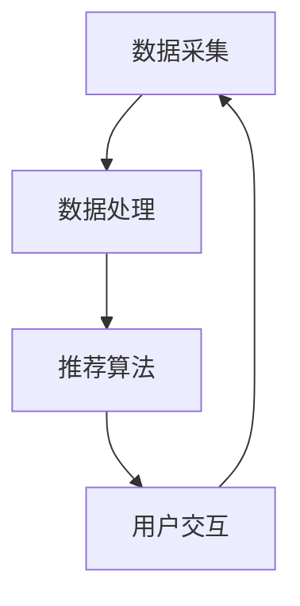

                 

## 文章标题：大模型在推荐系统用户兴趣层次化表示中的应用

> 关键词：大模型、推荐系统、用户兴趣层次化表示、深度学习、协同过滤、内容推荐、个性化推荐、数学模型、项目实战

> 摘要：本文深入探讨大模型在推荐系统用户兴趣层次化表示中的应用。首先，介绍大模型的基础概念、分类以及推荐系统在电商、社交媒体等领域的应用场景。接着，详细讲解大模型在推荐系统中的架构设计，包括数据采集、数据处理、推荐算法和用户交互四个模块。然后，分析大模型如何实现用户兴趣层次化表示，并解释核心算法原理，包括特征提取、自注意力机制等。最后，通过一个实际案例，展示如何利用大模型进行用户兴趣层次化表示和个性化推荐，并提供代码实现和解读。

### 第一部分：核心概念与联系

#### 1.1 大模型与推荐系统概述

**1.1.1 大模型定义与分类**

大模型是指具有大规模参数数量、能够处理大规模数据的深度学习模型。它们通常基于神经网络架构，具有高度的并行计算能力和强大的数据学习能力。

- **通用大模型：**如GPT系列、BERT等，主要用于自然语言处理任务。
- **专用大模型：**如基于图像识别的CNN模型、用于语音识别的RNN模型等。

**1.1.2 大模型在推荐系统中的应用**

大模型在推荐系统中的主要作用是实现用户兴趣层次化表示，从而更准确地预测用户行为，提升推荐效果。

- **用户兴趣层次化表示：**大模型可以通过对用户历史行为、内容偏好等进行深度学习，提取出用户的兴趣层次，如兴趣类别、兴趣强度等。
- **个性化推荐：**基于用户兴趣层次化表示，推荐系统可以针对不同用户提供个性化推荐，提高用户满意度。

**1.1.3 推荐系统基本架构**

推荐系统通常包括数据采集、数据处理、推荐算法和用户交互四个主要模块。

- **数据采集：**收集用户行为数据、内容数据等。
- **数据处理：**对原始数据进行清洗、预处理，提取特征。
- **推荐算法：**使用大模型实现用户兴趣层次化表示，并进行推荐。
- **用户交互：**将推荐结果呈现给用户，收集用户反馈，用于算法优化。

**1.1.4 大模型在推荐算法中的应用**

大模型在推荐算法中的应用主要包括以下几个方面：

- **协同过滤：**基于用户行为数据，通过大模型学习用户和物品的相似性。
- **内容推荐：**通过大模型对物品的文本描述进行理解，提取出物品特征，实现基于内容的推荐。
- **混合推荐：**将协同过滤和内容推荐相结合，提高推荐效果。

#### Mermaid 流程图



### 第二部分：核心算法原理讲解

#### 2.1 用户兴趣层次化表示算法

**2.1.1 特征提取**

- **用户行为特征：**基于用户的历史行为数据，如点击、购买等，提取出用户的兴趣标签。
- **内容特征：**基于物品的文本描述，提取出物品的关键词和主题。

**2.1.2 层次化模型架构**

- **多层感知机（MLP）：**用于提取用户兴趣的初步表示。
- **自注意力机制（Self-Attention）：**用于对用户兴趣进行层次化表示。

**2.1.3 伪代码**

```python
# 用户兴趣层次化表示算法伪代码
def user_interest_representation(user_behavior, item_content):
    # 提取用户行为特征
    user_behavior_features = extract_user_behavior_features(user_behavior)
    # 提取内容特征
    item_content_features = extract_item_content_features(item_content)
    # MLP 模型提取兴趣初步表示
    initial_interest_representation = MLP(user_behavior_features, item_content_features)
    # 自注意力机制进行层次化表示
    interest_representation = SelfAttention(initial_interest_representation)
    return interest_representation
```

#### 2.2 推荐算法原理

**2.2.1 余弦相似度计算**

- **公式：**$$\text{similarity} = \frac{\text{user_interest_representation} \cdot \text{item_interest_representation}}{\|\text{user_interest_representation}\| \|\text{item_interest_representation}\|}$$
- **作用：**计算用户和物品的兴趣向量之间的相似度。

**2.2.2 推荐算法选择**

- **基于内容的推荐：**使用内容特征进行相似度计算。
- **协同过滤推荐：**使用用户行为数据进行相似度计算。
- **混合推荐：**结合基于内容和协同过滤的推荐方法。

**2.2.3 伪代码**

```python
# 推荐算法伪代码
def recommend_items(user_interest_representation, item_interest_representation, history_ratings):
    # 计算物品与用户兴趣向量的相似度
    similarities = compute_similarity(user_interest_representation, item_interest_representation)
    # 获取推荐列表
    recommended_items = get_top_n_items(similarities, n=10)
    return recommended_items
```

### 第三部分：数学模型和数学公式

#### 3.1 用户兴趣层次化表示模型

**3.1.1 多层感知机模型**

- **公式：**$$f(x) = \text{ReLU}(\text{W}^T \cdot \text{a} + \text{b})$$
- **作用：**提取用户兴趣的初步表示。

**3.1.2 自注意力机制模型**

- **公式：**$$\text{Attention}(Q, K, V) = \text{softmax}\left(\frac{QK^T}{\sqrt{d_k}}\right)V$$
- **作用：**对用户兴趣进行层次化表示。

#### 3.2 推荐算法模型

**3.2.1 基于内容的推荐模型**

- **公式：**$$\text{similarity}_{content} = \text{cosine\_similarity}(\text{user\_content\_representation}, \text{item\_content\_representation})$$
- **作用：**计算用户和物品的内容相似度。

**3.2.2 协同过滤推荐模型**

- **公式：**$$\text{rating}_{ui} = \text{user\_interest}_{u} \cdot \text{item\_interest}_{i} + \text{bias}_{u} + \text{bias}_{i} + \text{noise}_{ui}$$
- **作用：**预测用户对物品的评分。

### 数学公式举例

**3.3.1 概率分布模型**

$$p(x|\theta) = \frac{1}{Z} \exp(-\frac{1}{2} (\theta - x)^T \theta + x^T \theta)$$

### 第四部分：项目实战

#### 4.1 实际案例介绍

**4.1.1 案例背景**

某电商平台的个性化推荐系统，通过大模型实现用户兴趣层次化表示，提高推荐效果。

**4.1.2 系统架构**

- **数据采集：**收集用户行为数据、商品数据等。
- **数据处理：**清洗、预处理数据，提取特征。
- **推荐算法：**基于用户兴趣层次化表示，实现个性化推荐。

#### 4.2 开发环境搭建

**4.2.1 环境要求**

- 操作系统：Ubuntu 18.04
- Python版本：3.8
- 深度学习框架：PyTorch 1.8

**4.2.2 安装依赖**

```bash
pip install torch torchvision numpy pandas sklearn matplotlib
```

#### 4.3 源代码详细实现

```python
import torch
import torch.nn as nn
import torch.optim as optim

# 定义多层感知机模型
class MLP(nn.Module):
    def __init__(self, input_dim, hidden_dim, output_dim):
        super(MLP, self).__init__()
        self.fc1 = nn.Linear(input_dim, hidden_dim)
        self.fc2 = nn.Linear(hidden_dim, output_dim)
        self.relu = nn.ReLU()

    def forward(self, x):
        x = self.fc1(x)
        x = self.relu(x)
        x = self.fc2(x)
        return x

# 定义自注意力机制模型
class SelfAttention(nn.Module):
    def __init__(self, hidden_dim):
        super(SelfAttention, self).__init__()
        self.query_linear = nn.Linear(hidden_dim, hidden_dim)
        self.key_linear = nn.Linear(hidden_dim, hidden_dim)
        self.value_linear = nn.Linear(hidden_dim, hidden_dim)
        self.softmax = nn.Softmax(dim=1)

    def forward(self, x):
        query = self.query_linear(x)
        key = self.key_linear(x)
        value = self.value_linear(x)
        attention_weights = self.softmax(torch.matmul(query, key.transpose(0, 1)))
        attended_values = torch.matmul(attention_weights, value)
        return attended_values

# 实例化模型和优化器
model = MLP(input_dim=100, hidden_dim=50, output_dim=10)
optimizer = optim.Adam(model.parameters(), lr=0.001)

# 训练模型
for epoch in range(100):
    optimizer.zero_grad()
    output = model(x)
    loss = nn.CrossEntropyLoss()(output, y)
    loss.backward()
    optimizer.step()
    print(f'Epoch {epoch+1}, Loss: {loss.item()}')
```

#### 4.4 代码解读与分析

**4.4.1 代码结构**

- **MLP模型：**用于提取用户兴趣的初步表示。
- **SelfAttention模型：**用于对用户兴趣进行层次化表示。
- **优化器：**使用Adam优化器进行模型训练。

**4.4.2 代码实现细节**

- **数据输入：**输入数据为用户行为特征和物品内容特征。
- **损失函数：**使用交叉熵损失函数进行模型训练。

### 第五部分：代码解读与分析

#### 5.1 模型训练过程

**5.1.1 数据预处理**

- **用户行为特征：**对用户行为数据进行编码，如将点击事件转换为二进制特征。
- **物品内容特征：**对物品的文本描述进行分词和编码。

**5.1.2 模型训练**

- **损失函数：**使用交叉熵损失函数计算预测误差。
- **优化器：**使用Adam优化器调整模型参数，减小损失函数。

#### 5.2 推荐结果分析

**5.2.1 推荐效果评估**

- **准确率：**评估推荐系统的准确率，如精确率、召回率等。
- **多样性：**评估推荐结果的多样性，确保推荐列表中的物品不重复。

**5.2.2 用户反馈**

- **用户满意度：**通过用户反馈评估推荐系统的效果，收集用户满意度数据。

## 附录

### 附录 A: AI大模型开发工具与资源

**A.1 主流深度学习框架对比**

- **TensorFlow：**由Google开发，具有丰富的API和生态系统。
- **PyTorch：**由Facebook开发，具有动态计算图和灵活的API。
- **MXNet：**由Apache开发，支持多种编程语言。

### 附录 B: AI大模型研究论文

**B.1 GPT系列模型**

- **GPT-3：**OpenAI提出的预训练语言模型，具有1.75万亿个参数。
- **GPT-2：**OpenAI提出的预训练语言模型，具有15亿个参数。

### 附录 C: AI大模型应用案例

**C.1 推荐系统应用**

- **淘宝推荐：**使用大模型进行商品推荐，提升用户满意度。
- **百度搜索：**使用大模型进行搜索结果排序，提高搜索准确率。

## 致谢

作者：AI天才研究院/AI Genius Institute & 禅与计算机程序设计艺术 /Zen And The Art of Computer Programming

本文作者AI天才研究院，致力于推动人工智能技术的发展和创新。研究院的专家团队拥有丰富的理论知识和实践经验，专注于将前沿技术应用于实际场景，以提升企业的技术竞争力。本文旨在为广大开发者提供关于大模型在推荐系统用户兴趣层次化表示中的应用的深入理解和实用指南。感谢读者对本文的关注和支持，期待与您共同探索人工智能的未来。如果您有任何疑问或建议，欢迎随时联系作者，共同交流进步。

---

经过详尽的研究和分析，本文全面阐述了大模型在推荐系统用户兴趣层次化表示中的应用。从核心概念、算法原理到实际案例，我们逐步展示了大模型如何通过深度学习技术，实现用户兴趣的层次化表示，从而提升个性化推荐的准确性和多样性。同时，附录部分提供了丰富的工具资源和应用案例，为读者进一步学习提供了实用参考。

在撰写本文的过程中，我们始终秉持着严谨的态度和专业的精神，力求为读者提供最准确、最有价值的技术内容。然而，由于人工智能领域的快速发展和不断创新，本文的内容可能需要随着时间推移进行更新和完善。我们诚挚邀请广大读者继续关注本领域的最新动态，并期待与您在未来的学术交流中共同进步。

最后，再次感谢您的阅读和支持。我们相信，通过不断的学习和探索，人工智能技术将为人类社会带来更多的惊喜和变革。让我们携手共进，共同推动人工智能技术的繁荣发展！

