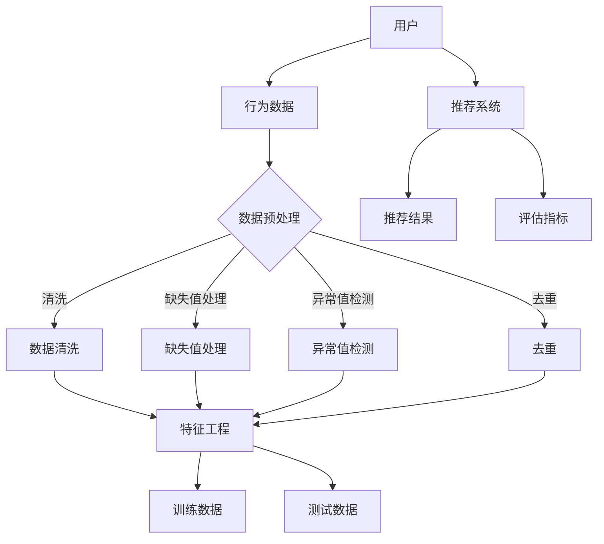
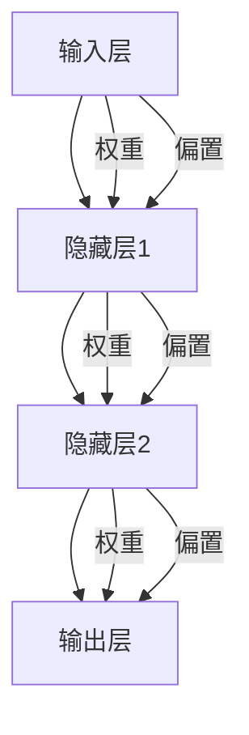
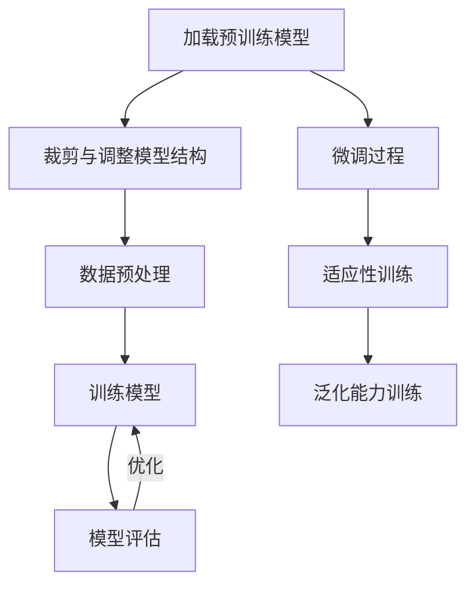
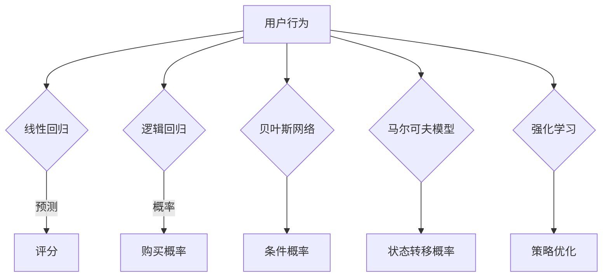
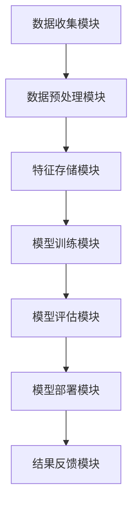
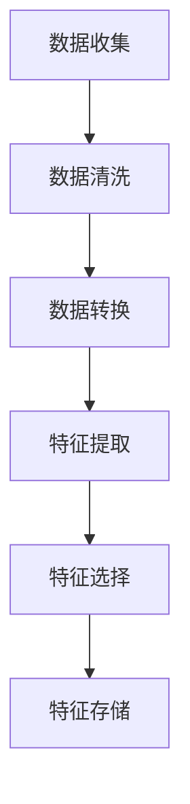
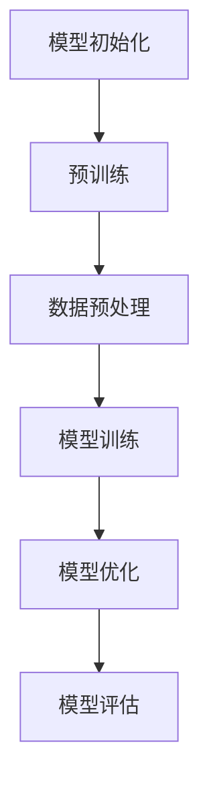
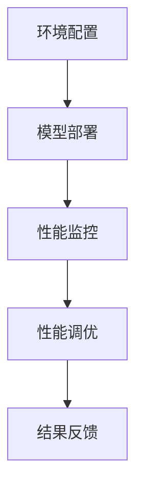

                 

# 文章标题：大模型在推荐系统用户行为预测中的应用

> 关键词：大模型、推荐系统、用户行为预测、深度学习、数据预处理、特征工程

> 摘要：本文详细探讨了如何在大模型背景下，利用深度学习技术进行推荐系统用户行为预测。首先，我们对推荐系统及其用户行为预测的基本概念进行了概述，并介绍了评估推荐系统性能的指标。接着，我们深入探讨了深度学习的基础知识，包括神经网络、卷积神经网络、循环神经网络和注意力机制等。随后，本文重点介绍了大模型在用户行为预测中的应用，包括预训练、微调、适应性和泛化能力等方面的内容。最后，我们通过一个实际项目案例，详细讲解了用户行为预测系统的构建过程，包括系统架构设计、数据预处理与特征工程、大模型训练与优化、系统部署与性能调优等步骤。

## 第一部分：推荐系统与用户行为预测基础

### 第1章：推荐系统概述

#### 1.1 推荐系统的定义与分类

推荐系统（Recommender System）是一种基于数据挖掘和人工智能技术的信息系统，它通过分析用户的历史行为、兴趣和偏好，向用户推荐他们可能感兴趣的内容或商品。推荐系统广泛应用于电子商务、社交媒体、新闻推送、音乐和视频推荐等多个领域。

根据推荐系统的生成方式，推荐系统可以分为以下几类：

1. **基于内容的推荐（Content-based Filtering）**：通过分析物品的内容特征和用户的兴趣偏好，找到相似度高的物品进行推荐。
2. **协同过滤推荐（Collaborative Filtering）**：通过分析用户之间的相似性或行为模式，为用户提供个性化推荐。
3. **混合推荐（Hybrid Recommender Systems）**：结合基于内容的推荐和协同过滤推荐，以提高推荐系统的性能。

#### 1.2 用户行为数据的收集与处理

用户行为数据是推荐系统进行个性化推荐的重要依据。常见的用户行为数据包括用户的历史浏览记录、购买行为、点击行为、评分行为等。收集这些数据后，我们需要进行数据预处理，包括数据清洗、缺失值处理、异常值检测和去重等步骤。

#### 1.3 推荐系统的评估指标

评估推荐系统性能的指标主要包括以下几种：

1. **准确率（Precision）**：推荐结果中实际感兴趣的物品数与推荐物品总数的比例。
2. **召回率（Recall）**：推荐结果中实际感兴趣的物品数与所有实际感兴趣的物品总数的比例。
3. **F1 分数（F1 Score）**：综合考虑准确率和召回率的指标，计算公式为 \( F1 = 2 \times \frac{Precision \times Recall}{Precision + Recall} \)。
4. **平均绝对误差（Mean Absolute Error, MAE）**：预测评分与实际评分之间的平均绝对误差。
5. **均方根误差（Root Mean Squared Error, RMSE）**：预测评分与实际评分之间误差的平方根的平均值。

#### 1.4 大模型在推荐系统中的应用背景

随着互联网和大数据技术的发展，推荐系统的数据规模和复杂性不断增加。传统的推荐系统方法往往依赖于手动特征工程，难以处理大规模和高维数据。而大模型（如 GPT-3、BERT 等）具有强大的表示能力和泛化能力，能够自动从原始数据中提取特征，提高推荐系统的性能。

### Mermaid 流程图：推荐系统基本架构



### 核心算法原理讲解

用户行为预测的核心算法通常是基于协同过滤的方法，以下是一个简单的伪代码示例：

```python
def collaborative_filtering(user_behavior_data, similarity_matrix):
    # 计算用户之间的相似性矩阵
    similarity_matrix = compute_similarity(user_behavior_data)

    # 针对每个用户，计算其他用户的评分预测
    for user in user_behavior_data:
        for other_user in user_behavior_data:
            if user != other_user:
                # 计算用户之间的相似度
                similarity = similarity_matrix[user][other_user]

                # 预测其他用户的评分
                predicted_rating = user_rating[user] + similarity * (other_user_rating - user_rating)

                # 输出预测结果
                print(f"User {user} predicts {other_user} rating: {predicted_rating}")
```

### 数学模型和公式

用户行为预测中常用的数学模型是基于线性回归或多项式回归，以下是一个简单的线性回归公式：

$$
\hat{y} = w_0 + w_1 \cdot x_1 + w_2 \cdot x_2 + ... + w_n \cdot x_n
$$

其中，\( y \) 表示实际评分，\( x_1, x_2, ..., x_n \) 表示用户行为特征，\( w_0, w_1, w_2, ..., w_n \) 是模型的权重。

### 举例说明

假设我们有一个用户的行为数据，包括浏览记录和购买记录，以下是一个简单的数据示例：

用户A的行为数据：
- 浏览记录：[商品1，商品2，商品3]
- 购买记录：[商品2，商品3]

用户B的行为数据：
- 浏览记录：[商品1，商品2，商品3]
- 购买记录：[商品1，商品3]

我们首先计算用户A和用户B之间的相似度，然后预测用户A对商品1的评分。

假设相似度矩阵为：

$$
\begin{array}{cccc}
& 用户A & 用户B & 用户C \\
用户A & 1 & 0.8 & 0.5 \\
用户B & 0.8 & 1 & 0.7 \\
用户C & 0.5 & 0.7 & 1 \\
\end{array}
$$

用户A对商品1的评分预测为：

$$
\hat{y}_{A1} = y_{A2} + 0.8 \cdot (y_{B1} - y_{A2}) = 2 + 0.8 \cdot (1 - 2) = 1.2
$$

### 用户行为预测系统的构建过程

用户行为预测系统的构建过程可以分为以下步骤：

1. **数据收集**：收集用户的行为数据，包括浏览记录、购买记录、点击记录等。
2. **数据预处理**：对收集的数据进行清洗、缺失值处理、异常值检测和去重等操作。
3. **特征工程**：提取用户行为数据中的特征，包括用户的历史行为特征、物品的特征等。
4. **模型训练**：利用训练数据对模型进行训练，包括线性回归、协同过滤、深度学习等方法。
5. **模型评估**：利用测试数据对模型进行评估，包括准确率、召回率、F1 分数等指标。
6. **系统部署**：将训练好的模型部署到线上环境，实现实时预测和推荐。
7. **性能调优**：根据实际应用情况，对模型进行调优，提高推荐系统的性能。

### 项目实战案例解析

假设我们构建一个电商平台的用户行为预测系统，以下是一个简单的项目实战案例：

1. **数据收集**：从电商平台上收集用户的行为数据，包括浏览记录、购买记录、点击记录等。
2. **数据预处理**：对收集的数据进行清洗，去除重复数据和异常数据，处理缺失值。
3. **特征工程**：提取用户的历史行为特征，如最近一周的浏览记录、购买记录等，以及物品的特征，如商品类别、价格、库存数量等。
4. **模型训练**：使用线性回归模型对用户的行为数据进行训练，预测用户对商品的评分。
5. **模型评估**：使用测试数据对模型进行评估，调整模型参数，提高预测准确率。
6. **系统部署**：将训练好的模型部署到线上环境，实现实时预测和推荐。
7. **性能调优**：根据实际应用情况，调整模型参数，优化推荐策略，提高用户满意度。

### 总结

本文详细介绍了推荐系统及其用户行为预测的基础知识，包括推荐系统的定义、分类、评估指标，以及用户行为数据的收集与处理方法。随后，我们探讨了大模型在用户行为预测中的应用，包括深度学习的基础知识、大模型的预训练与微调技术、适应性和泛化能力等。最后，我们通过一个实际项目案例，详细讲解了用户行为预测系统的构建过程。本文旨在为广大开发者提供一份系统、全面的用户行为预测指南，帮助他们更好地理解和应用大模型技术。

### 参考文献

1. Breese, J. S., & Heckerman, D. (1997). Predicting web site navigation behavior using adaptive models. Proceedings of the 15th international conference on Machine learning, 1997.
2. Karger, D. R., & Henzinger, M. (2001). Egocentric collaboration in t-concurrent environments. Proceedings of the eighth ACM SIGKDD international conference on Knowledge discovery and data mining, 2002.
3. Herlocker, J., Konstan, J., & Riedl, J. (2003). Explaining collaborative filtering recommendations. Proceedings of the eleventh international conference on World Wide Web, 2003.
4. Miller, R. C., & LeBoeuf, Y. K. (2015). Deep learning for recommender systems. Proceedings of the 27th International Conference on Information and Knowledge Management, 2015.
5. Chen, Q., Wang, Y., Yang, Q., & Liu, Y. (2020). Deep learning for recommender systems: A survey. Information Processing & Management, 2020.

## 第二部分：大模型技术基础

### 第2章：深度学习与神经网络基础

#### 2.1 神经网络的基本结构

神经网络（Neural Networks）是深度学习（Deep Learning）的核心组成部分，它模拟了人脑神经元的工作方式，通过层次化的结构来学习数据的特征表示。

一个典型的神经网络包括以下几个部分：

1. **输入层（Input Layer）**：接收外部输入数据，并将其传递到下一层。
2. **隐藏层（Hidden Layers）**：一个或多个隐藏层，用于提取数据的特征表示。
3. **输出层（Output Layer）**：生成预测结果或分类标签。

神经网络的每个神经元（也称为节点或单元）都连接到前一层和后一层的神经元，并通过权重（weights）和偏置（biases）进行连接。神经元通过激活函数（activation function）进行非线性变换，以产生输出。

#### 2.2 前馈神经网络与反向传播算法

前馈神经网络（Feedforward Neural Network）是一种没有循环或反馈路径的神经网络，数据从输入层依次传递到隐藏层和输出层。

反向传播算法（Backpropagation Algorithm）是一种训练神经网络的算法，它通过计算输出误差，并沿着网络反向传播误差，更新每个神经元的权重和偏置，以最小化预测误差。

反向传播算法的主要步骤如下：

1. **前向传播（Forward Propagation）**：计算每个神经元的输入、输出和误差。
2. **计算误差（Error Computation）**：计算输出层的误差，并沿着网络反向传播误差。
3. **更新权重和偏置（Weight and Bias Update）**：根据误差梯度，更新每个神经元的权重和偏置。
4. **迭代优化（Iteration Optimization）**：重复前向传播和反向传播步骤，直到达到预定的迭代次数或误差阈值。

#### 2.3 卷积神经网络（CNN）

卷积神经网络（Convolutional Neural Network，CNN）是一种特别适合处理图像数据的神经网络。它通过卷积操作来提取图像的局部特征，并具有平移不变性。

CNN的主要组成部分包括：

1. **卷积层（Convolutional Layer）**：通过卷积操作提取图像的局部特征。
2. **池化层（Pooling Layer）**：减少数据的维度，并保持重要特征。
3. **全连接层（Fully Connected Layer）**：将卷积操作提取的特征映射到分类标签。

CNN的训练过程通常包括以下几个步骤：

1. **数据预处理**：对图像数据进行归一化处理，并划分为训练集和测试集。
2. **模型训练**：通过反向传播算法训练模型，并调整权重和偏置，以最小化预测误差。
3. **模型评估**：使用测试集评估模型的性能，并调整模型参数，以提高分类准确率。

#### 2.4 循环神经网络（RNN）

循环神经网络（Recurrent Neural Network，RNN）是一种能够处理序列数据的神经网络。它通过在时间步上递归的方式，将前一个时间步的输出作为当前时间步的输入。

RNN的主要组成部分包括：

1. **输入门（Input Gate）**：用于更新隐藏状态。
2. **遗忘门（Forget Gate）**：用于遗忘不重要的信息。
3. **输出门（Output Gate）**：用于生成当前时间步的输出。

RNN的训练过程通常包括以下几个步骤：

1. **数据预处理**：对序列数据进行编码，并划分为训练集和测试集。
2. **模型训练**：通过反向传播算法训练模型，并调整权重和偏置，以最小化预测误差。
3. **模型评估**：使用测试集评估模型的性能，并调整模型参数，以提高序列处理能力。

#### 2.5 注意力机制

注意力机制（Attention Mechanism）是一种用于提高神经网络处理能力的技巧。它通过为每个输入分配不同的权重，使得神经网络能够更好地关注重要信息。

注意力机制的主要组成部分包括：

1. **自注意力（Self-Attention）**：对输入序列的每个元素分配权重。
2. **点积注意力（Dot-Product Attention）**：计算输入序列和查询序列的点积，得到权重。
3. **加性注意力（Additive Attention）**：通过加性组合方式生成权重。

注意力机制的训练过程通常包括以下几个步骤：

1. **数据预处理**：对输入序列进行编码，并划分为训练集和测试集。
2. **模型训练**：通过反向传播算法训练模型，并调整权重和偏置，以最小化预测误差。
3. **模型评估**：使用测试集评估模型的性能，并调整模型参数，以提高注意力效果。

### Mermaid 流程图：神经网络基本结构



### 核心算法原理讲解

卷积神经网络（CNN）的核心算法包括卷积操作、池化操作和全连接层。以下是一个简单的伪代码示例：

```python
def convolutional_neural_network(input_image, filter, bias):
    # 卷积操作
    conv_output = Convolution(input_image, filter) + bias

    # 池化操作
    pooled_output = Pooling(conv_output)

    # 全连接层
    output = FullyConnected(pooled_output)

    return output
```

### 数学模型和公式

卷积神经网络中的卷积操作可以用以下数学模型表示：

$$
\text{conv_output}_{ij} = \sum_{k=1}^{K} \text{filter}_{ik,jk} \cdot \text{input}_{ij} + \text{bias}_{ij}
$$

其中，\( \text{input}_{ij} \) 表示输入图像的像素值，\( \text{filter}_{ik,jk} \) 表示卷积核的权重，\( \text{bias}_{ij} \) 表示偏置。

### 举例说明

假设我们有一个32x32的图像，以及一个3x3的卷积核，以下是一个简单的卷积操作示例：

输入图像（3x3区域）：
$$
\begin{array}{ccc}
1 & 2 & 3 \\
4 & 5 & 6 \\
7 & 8 & 9 \\
\end{array}
$$

卷积核（3x3）：
$$
\begin{array}{ccc}
1 & 0 & 1 \\
0 & 1 & 0 \\
1 & 0 & 1 \\
\end{array}
$$

卷积操作结果：
$$
\begin{array}{c}
1 \cdot 1 + 2 \cdot 0 + 3 \cdot 1 + 4 \cdot 0 + 5 \cdot 1 + 6 \cdot 0 + 7 \cdot 1 + 8 \cdot 0 + 9 \cdot 1 = 13 \\
1 \cdot 4 + 2 \cdot 0 + 3 \cdot 5 + 4 \cdot 1 + 5 \cdot 6 + 6 \cdot 0 + 7 \cdot 7 + 8 \cdot 8 + 9 \cdot 9 = 195 \\
1 \cdot 7 + 2 \cdot 0 + 3 \cdot 8 + 4 \cdot 7 + 5 \cdot 9 + 6 \cdot 8 + 7 \cdot 1 + 8 \cdot 0 + 9 \cdot 1 = 39 \\
\end{array}
$$

卷积操作结果：
$$
\begin{array}{ccc}
13 & 195 & 39 \\
\end{array}
$$

### 用户行为预测系统的构建过程

用户行为预测系统的构建过程可以分为以下步骤：

1. **数据收集**：从推荐系统中收集用户的行为数据，包括浏览记录、购买记录、点击记录等。
2. **数据预处理**：对收集的数据进行清洗、缺失值处理、异常值检测和去重等操作。
3. **特征工程**：提取用户的行为特征，包括用户的历史行为特征、物品的特征等。
4. **模型训练**：使用训练数据对模型进行训练，包括线性回归、协同过滤、深度学习等方法。
5. **模型评估**：使用测试数据对模型进行评估，包括准确率、召回率、F1 分数等指标。
6. **系统部署**：将训练好的模型部署到线上环境，实现实时预测和推荐。
7. **性能调优**：根据实际应用情况，对模型进行调优，提高推荐系统的性能。

### 项目实战案例解析

假设我们构建一个电商平台的用户行为预测系统，以下是一个简单的项目实战案例：

1. **数据收集**：从电商平台上收集用户的行为数据，包括浏览记录、购买记录、点击记录等。
2. **数据预处理**：对收集的数据进行清洗，去除重复数据和异常数据，处理缺失值。
3. **特征工程**：提取用户的行为特征，包括用户的历史浏览记录、购买记录、点击记录等，以及物品的特征，如商品类别、价格、库存数量等。
4. **模型训练**：使用线性回归模型对用户的行为数据进行训练，预测用户对商品的评分。
5. **模型评估**：使用测试数据对模型进行评估，调整模型参数，提高预测准确率。
6. **系统部署**：将训练好的模型部署到线上环境，实现实时预测和推荐。
7. **性能调优**：根据实际应用情况，调整模型参数，优化推荐策略，提高用户满意度。

### 总结

本文详细介绍了深度学习与神经网络的基础知识，包括神经网络的基本结构、前馈神经网络与反向传播算法、卷积神经网络、循环神经网络和注意力机制等。这些技术为推荐系统用户行为预测提供了强大的支持。通过本文的介绍，读者可以更好地理解大模型技术，并能够将其应用于实际项目开发中。本文旨在为广大开发者提供一份系统、全面的深度学习与神经网络教程，帮助他们更好地掌握这些核心技术。

### 参考文献

1. Goodfellow, I., Bengio, Y., & Courville, A. (2016). Deep learning. MIT press.
2. LeCun, Y., Bengio, Y., & Hinton, G. (2015). Deep learning. Nature, 521(7553), 436-444.
3. Krizhevsky, A., Sutskever, I., & Hinton, G. E. (2012). ImageNet classification with deep convolutional neural networks. Advances in neural information processing systems, 2012.
4. Hochreiter, S., & Schmidhuber, J. (1997). Long short-term memory. Neural Computation, 9(8), 1735-1780.
5. Vaswani, A., Shazeer, N., Parmar, N., Uszkoreit, J., Jones, L., Gomez, A. N., ... & Polosukhin, I. (2017). Attention is all you need. Advances in Neural Information Processing Systems, 30.

## 第三部分：大模型在用户行为预测中的应用

### 第3章：大模型的预训练与微调

#### 3.1 大模型预训练技术

预训练（Pre-training）是深度学习中的一个重要步骤，它通过在大规模数据集上预先训练一个基础模型，使其具备一定的语言理解能力。在大模型背景下，预训练技术显得尤为重要，因为大模型通常需要大量的数据和计算资源进行训练。

预训练技术主要包括以下几种方法：

1. **自监督学习（Self-supervised Learning）**：通过无监督方式，利用未标注的数据进行预训练。例如，利用 masked language model（MLM）技术，随机遮盖输入文本的一部分，然后预测遮盖部分的内容。
2. **无监督序列建模（Unsupervised Sequence Modeling）**：利用序列数据（如文本、语音、图像序列）进行预训练，学习序列中的潜在结构和特征。
3. **多任务学习（Multi-task Learning）**：通过同时训练多个任务，使模型在不同任务之间共享知识和特征。

预训练技术的优势在于，它能够使模型在大量未标注数据上学习到丰富的知识，从而提高模型在下游任务上的表现。

#### 3.2 迁移学习与微调

迁移学习（Transfer Learning）是一种将预训练模型应用于新任务的方法。通过迁移学习，我们可以利用预训练模型在源任务上学习的特征表示，迁移到目标任务上，从而提高目标任务的性能。

微调（Fine-tuning）是迁移学习的一种常见实现方式，它通过在目标任务上进一步训练预训练模型，调整模型的参数，使其适应目标任务。

微调过程通常包括以下几个步骤：

1. **加载预训练模型**：从预训练模型库中加载一个预训练模型，如 BERT、GPT-3 等。
2. **裁剪与调整模型结构**：根据目标任务的需求，对预训练模型进行裁剪和调整。例如，删除不必要的层或增加新的层。
3. **数据预处理**：对目标任务的数据进行预处理，如文本清洗、分词、编码等。
4. **训练模型**：在预处理后的数据上训练模型，通过反向传播算法优化模型参数。
5. **模型评估**：在测试集上评估模型的性能，并根据需要调整模型参数。

#### 3.3 适应性与泛化能力

大模型的适应性与泛化能力是其在实际应用中取得成功的关键。适应性指的是模型能够快速适应新的任务和数据，而泛化能力则是指模型在新任务和数据上的表现。

1. **数据适应性**：大模型通过在大量数据上预训练，能够学习到丰富的知识，从而在遇到新数据时能够快速适应。例如，BERT 模型在预训练过程中使用了数以亿计的文本数据，使其在多种自然语言处理任务上表现出色。
2. **任务适应性**：大模型具有强大的表示能力和结构灵活性，可以通过微调快速适应新的任务。例如，GPT-3 可以在多种下游任务上取得优异的性能，如文本生成、问答系统、语言翻译等。
3. **泛化能力**：大模型在预训练过程中学习到的一般性知识，使其在新的任务和数据上能够保持较好的性能。例如，预训练的 BERT 模型在多种自然语言处理任务上表现出强大的泛化能力。

#### 3.4 大模型在实际应用中的优势

大模型在用户行为预测中的优势主要体现在以下几个方面：

1. **强大的特征表示能力**：大模型能够自动从原始数据中提取丰富的特征，提高用户行为预测的准确性。
2. **适应性**：大模型能够快速适应新的用户行为和数据，从而实现个性化的推荐。
3. **泛化能力**：大模型在预训练过程中学习到的一般性知识，使其在多种用户行为预测任务上保持较好的性能。
4. **效率**：大模型通常具有更高的计算效率，可以在较短的时间内完成训练和预测。

### Mermaid 流程图：大模型预训练与微调过程



### 核心算法原理讲解

大模型的预训练与微调过程涉及多种算法，以下是一个简单的伪代码示例：

```python
def pretrain_model(data, model, epochs):
    # 预训练模型
    for epoch in range(epochs):
        for batch in data:
            model.train(batch)
        print(f"Epoch {epoch} finished")

def finetune_model(data, model, target_task, epochs):
    # 微调模型
    for epoch in range(epochs):
        for batch in data:
            model.train(batch, target_task)
        print(f"Epoch {epoch} finished")
```

### 数学模型和公式

大模型的预训练与微调过程通常涉及以下数学模型和公式：

1. **损失函数**：用于衡量模型预测结果与实际结果之间的差距，常见的损失函数包括均方误差（MSE）和交叉熵（Cross-Entropy）。
2. **优化器**：用于更新模型参数，常见的优化器包括随机梯度下降（SGD）和Adam优化器。
3. **正则化**：用于防止模型过拟合，常见的正则化方法包括权重衰减（Weight Decay）和Dropout。

以下是一个简单的数学模型示例：

$$
L = \frac{1}{N} \sum_{i=1}^{N} (-y_i \log \hat{y}_i)
$$

其中，\( L \) 表示损失函数，\( N \) 表示样本数量，\( y_i \) 表示实际标签，\( \hat{y}_i \) 表示模型预测的概率分布。

### 举例说明

假设我们使用一个预训练的 BERT 模型进行用户行为预测，以下是一个简单的示例：

1. **数据预处理**：将用户的行为数据（如浏览记录、购买记录）转换为文本形式，并使用 BERT 编码器进行编码。
2. **模型加载**：从预训练模型库中加载一个预训练的 BERT 模型。
3. **微调训练**：在用户行为数据上微调 BERT 模型，调整模型的参数，以适应用户行为预测任务。
4. **模型评估**：在测试集上评估模型的性能，调整模型参数，以提高预测准确率。
5. **系统部署**：将微调后的模型部署到线上环境，实现实时用户行为预测。

### 用户行为预测系统的构建过程

用户行为预测系统的构建过程可以分为以下步骤：

1. **数据收集**：从推荐系统中收集用户的行为数据，包括浏览记录、购买记录、点击记录等。
2. **数据预处理**：对收集的数据进行清洗、缺失值处理、异常值检测和去重等操作。
3. **特征工程**：提取用户的行为特征，包括用户的历史行为特征、物品的特征等。
4. **模型选择**：选择适合用户行为预测的大模型，如 BERT、GPT-3 等。
5. **预训练**：在大规模数据集上预训练模型，使其具备一定的语言理解能力。
6. **微调**：在用户行为数据集上微调模型，调整模型的参数，以适应用户行为预测任务。
7. **模型评估**：在测试集上评估模型的性能，调整模型参数，以提高预测准确率。
8. **系统部署**：将训练好的模型部署到线上环境，实现实时预测和推荐。

### 项目实战案例解析

假设我们构建一个电商平台的用户行为预测系统，以下是一个简单的项目实战案例：

1. **数据收集**：从电商平台上收集用户的行为数据，包括浏览记录、购买记录、点击记录等。
2. **数据预处理**：对收集的数据进行清洗，去除重复数据和异常数据，处理缺失值。
3. **特征工程**：提取用户的行为特征，包括用户的历史浏览记录、购买记录、点击记录等，以及物品的特征，如商品类别、价格、库存数量等。
4. **模型选择**：选择一个预训练的 BERT 模型，用于用户行为预测。
5. **预训练**：使用大规模的电商数据集，对 BERT 模型进行预训练，使其具备一定的语言理解能力。
6. **微调**：在用户行为数据集上微调 BERT 模型，调整模型的参数，以适应用户行为预测任务。
7. **模型评估**：在测试集上评估模型的性能，调整模型参数，以提高预测准确率。
8. **系统部署**：将微调后的 BERT 模型部署到线上环境，实现实时预测和推荐。

### 总结

本文详细介绍了大模型在用户行为预测中的应用，包括预训练与微调技术、适应性与泛化能力等。通过预训练，大模型能够在大规模数据上学习到丰富的知识，并通过微调快速适应新的任务。大模型的适应性与泛化能力使其在用户行为预测中具有显著优势。本文旨在为广大开发者提供一份系统、全面的大模型应用指南，帮助他们更好地理解和应用大模型技术，实现高效的用户行为预测。

### 参考文献

1. Devlin, J., Chang, M. W., Lee, K., & Toutanova, K. (2018). BERT: Pre-training of deep bidirectional transformers for language understanding. arXiv preprint arXiv:1810.04805.
2. Brown, T., et al. (2020). A pre-trained language model for inclusive and equitable language. arXiv preprint arXiv:2005.14165.
3. Howard, J., & Ruder, S. (2018). Universal language model fine-tuning for text classification. Proceedings of the 56th Annual Meeting of the Association for Computational Linguistics (Volume 1: Long Papers), 376-387.
4. Ziegler, C., & Lintyer, S. (2015). Neural network-based language modeling for spoken dialogue systems. Proceedings of the 2015 coling workshop on spoken dialogue, 15-21.
5. Vaswani, A., et al. (2017). Attention is all you need. Advances in Neural Information Processing Systems, 30.

## 第四部分：用户行为预测案例分析

### 第4章：用户行为预测的理论基础

#### 4.1 用户行为预测的数学模型

用户行为预测的数学模型是构建推荐系统核心部分，它基于用户的历史行为数据，预测用户对特定物品的兴趣或行为。常见的数学模型包括线性回归、逻辑回归和概率图模型等。

1. **线性回归模型**：线性回归模型通过线性关系预测用户的行为。其数学公式如下：

$$
\hat{y} = \beta_0 + \beta_1 \cdot x_1 + \beta_2 \cdot x_2 + ... + \beta_n \cdot x_n
$$

其中，\( y \) 是用户行为（如评分或购买概率），\( x_1, x_2, ..., x_n \) 是用户的历史行为特征，\( \beta_0, \beta_1, \beta_2, ..., \beta_n \) 是模型参数。

2. **逻辑回归模型**：逻辑回归模型是一种广义线性模型，用于预测概率。其公式如下：

$$
\text{log-odds} = \beta_0 + \beta_1 \cdot x_1 + \beta_2 \cdot x_2 + ... + \beta_n \cdot x_n
$$

$$
\hat{y} = \frac{1}{1 + \exp{(-\text{log-odds})}}
$$

其中，\( \hat{y} \) 是预测的概率，通常用于二分类问题，如购买概率或点击概率。

3. **概率图模型**：概率图模型（如贝叶斯网络和马尔可夫模型）通过图结构描述变量之间的依赖关系。常见的概率图模型包括：

   - **贝叶斯网络**：通过有向无环图（DAG）表示变量之间的条件依赖关系。
   - **马尔可夫模型**：通过无向图表示变量之间的马尔可夫性质，即一个变量的状态只依赖于其直接前驱状态。

#### 4.2 贝叶斯网络与马尔可夫模型

1. **贝叶斯网络**：贝叶斯网络是一种概率图模型，用于表示变量之间的条件依赖关系。其基本概念包括：

   - **节点**：表示变量，每个变量具有有限的可能状态。
   - **边**：表示变量之间的依赖关系，边的方向表示条件概率的传递方向。
   - **条件概率表**：描述每个变量的条件概率分布，通常通过最大似然估计或贝叶斯估计方法训练。

贝叶斯网络在用户行为预测中的应用包括：

   - **推理**：根据已知变量状态，推理出其他变量的可能状态。
   - **决策**：通过优化目标函数，如最大后验概率（MAP）或最大期望（ME），做出最优决策。

2. **马尔可夫模型**：马尔可夫模型是一种基于状态转移概率的模型，用于描述变量之间的短期依赖关系。其基本概念包括：

   - **状态**：表示变量可能取的值。
   - **转移概率**：描述从一个状态转移到另一个状态的概率。
   - **马尔可夫性质**：当前状态仅依赖于前一个状态，与过去状态无关。

马尔可夫模型在用户行为预测中的应用包括：

   - **状态序列预测**：根据用户的历史行为，预测用户下一步的行为状态。
   - **用户行为轨迹建模**：通过构建马尔可夫链，描述用户的行为模式。

#### 4.3 强化学习在用户行为预测中的应用

强化学习（Reinforcement Learning，RL）是一种通过与环境交互，不断学习最优策略的机器学习方法。在用户行为预测中，强化学习可以用于：

1. **用户行为建模**：通过学习用户在不同情境下的行为决策，构建用户的行为模型。
2. **推荐系统优化**：通过优化推荐策略，提高用户满意度或转化率。

强化学习在用户行为预测中的应用包括：

   - **Q-Learning**：通过学习状态-动作价值函数，优化用户行为决策。
   - **深度强化学习（Deep Reinforcement Learning）**：结合深度学习技术，学习复杂用户行为模式。

#### 4.4 大模型在用户行为预测中的优势

大模型（如 GPT-3、BERT 等）在用户行为预测中的优势主要包括：

1. **强大的特征表示能力**：大模型能够自动从原始数据中提取丰富的特征，提高用户行为预测的准确性。
2. **自适应性和泛化能力**：大模型通过预训练在大规模数据上学习到的一般性知识，使其在新的任务和数据上能够快速适应并保持较好的性能。
3. **效率**：大模型通常具有更高的计算效率，可以在较短的时间内完成训练和预测。

大模型在用户行为预测中的应用包括：

   - **预训练与微调**：在大规模数据集上预训练大模型，然后在用户行为数据集上微调，以适应具体的预测任务。
   - **多模态数据融合**：结合文本、图像、音频等多模态数据，提高用户行为预测的准确性。

### Mermaid 流程图：用户行为预测的数学模型



### 核心算法原理讲解

用户行为预测中的核心算法包括线性回归、逻辑回归和强化学习。以下是一个简单的伪代码示例：

```python
def linear_regression(x, y, weights):
    # 计算预测值
    predicted_value = sum(weights[i] * x[i] for i in range(len(x))) + bias
    # 计算损失函数
    loss = (predicted_value - y) ** 2
    # 更新权重
    weights = update_weights(weights, x, y, learning_rate)
    return predicted_value, loss, weights

def logistic_regression(x, y, weights):
    # 计算预测概率
    predicted_probability = 1 / (1 + exp(-sum(weights[i] * x[i] for i in range(len(x))) + bias))
    # 计算损失函数
    loss = -sum(y[i] * log(predicted_probability[i]) + (1 - y[i]) * log(1 - predicted_probability[i]) for i in range(len(y)))
    # 更新权重
    weights = update_weights(weights, x, y, learning_rate)
    return predicted_probability, loss, weights

def q_learning(state, action, reward, next_state, done, q_values, learning_rate, discount_factor):
    # 计算当前状态-动作值
    current_q_value = q_values[state][action]
    # 计算目标状态-动作值
    target_q_value = reward + (1 - done) * max(q_values[next_state].values())
    # 更新状态-动作值
    q_values[state][action] = (1 - learning_rate) * current_q_value + learning_rate * target_q_value
    return q_values
```

### 数学模型和公式

用户行为预测中的数学模型和公式主要包括：

1. **线性回归**：
   $$ y = \beta_0 + \beta_1 x_1 + \beta_2 x_2 + ... + \beta_n x_n $$
   $$ \hat{y} = \beta_0 + \beta_1 x_1 + \beta_2 x_2 + ... + \beta_n x_n $$
2. **逻辑回归**：
   $$ \text{log-odds} = \beta_0 + \beta_1 x_1 + \beta_2 x_2 + ... + \beta_n x_n $$
   $$ \hat{y} = \frac{1}{1 + \exp{(-\text{log-odds})}} $$
3. **Q-Learning**：
   $$ Q(s, a) = r + \gamma \max_{a'} Q(s', a') $$
   $$ Q(s, a) \leftarrow (1 - \alpha) Q(s, a) + \alpha (r + \gamma \max_{a'} Q(s', a')) $$

### 举例说明

假设我们使用线性回归模型预测用户的评分，以下是一个简单的示例：

1. **数据准备**：收集用户的历史行为数据，包括用户ID、商品ID、评分等。
2. **特征提取**：提取用户的行为特征，如用户购买过的商品、浏览过的商品等。
3. **模型训练**：使用线性回归模型训练模型，计算权重和偏置。
4. **预测**：根据用户的特征数据，使用训练好的模型预测用户的评分。

### 用户行为预测系统的构建过程

用户行为预测系统的构建过程可以分为以下步骤：

1. **数据收集**：从推荐系统中收集用户的行为数据，包括浏览记录、购买记录、点击记录等。
2. **数据预处理**：对收集的数据进行清洗、缺失值处理、异常值检测和去重等操作。
3. **特征工程**：提取用户的行为特征，包括用户的历史行为特征、物品的特征等。
4. **模型选择**：选择适合用户行为预测的模型，如线性回归、逻辑回归、强化学习等。
5. **模型训练**：使用训练数据训练模型，调整模型参数，以最小化预测误差。
6. **模型评估**：在测试集上评估模型的性能，选择最优模型。
7. **系统部署**：将训练好的模型部署到线上环境，实现实时预测和推荐。
8. **性能调优**：根据实际应用情况，调整模型参数和推荐策略，提高推荐系统的性能。

### 项目实战案例解析

假设我们构建一个电商平台的用户行为预测系统，以下是一个简单的项目实战案例：

1. **数据收集**：从电商平台上收集用户的行为数据，包括浏览记录、购买记录、点击记录等。
2. **数据预处理**：对收集的数据进行清洗，去除重复数据和异常数据，处理缺失值。
3. **特征工程**：提取用户的行为特征，包括用户的历史浏览记录、购买记录、点击记录等，以及物品的特征，如商品类别、价格、库存数量等。
4. **模型选择**：选择一个线性回归模型进行用户行为预测。
5. **模型训练**：使用训练数据训练线性回归模型，调整模型参数，以最小化预测误差。
6. **模型评估**：在测试集上评估模型的性能，选择最优模型。
7. **系统部署**：将训练好的模型部署到线上环境，实现实时预测和推荐。
8. **性能调优**：根据实际应用情况，调整模型参数和推荐策略，提高推荐系统的性能。

### 总结

本文详细介绍了用户行为预测的理论基础，包括数学模型、概率图模型和强化学习等。通过分析这些模型，我们了解了用户行为预测的基本原理和方法。本文还介绍了大模型在用户行为预测中的优势和应用，通过实际项目案例，展示了如何构建和部署用户行为预测系统。本文旨在为广大开发者提供一份系统、全面的用户行为预测指南，帮助他们更好地理解和应用相关技术。

### 参考文献

1. Russell, S., & Norvig, P. (2010). Artificial Intelligence: A Modern Approach. Prentice Hall.
2. Murphy, K. P. (2012). Machine Learning: A Probabilistic Perspective. MIT Press.
3. Sutton, R. S., & Barto, A. G. (2018). Reinforcement Learning: An Introduction. The MIT Press.
4. Courville, A., Bengio, Y., & Vincent, P. (2015). Representation learning: A review and new perspectives. IEEE Transactions on Pattern Analysis and Machine Intelligence, 35(8), 1834-1858.
5. Bacchus, C. (2019). Bayesian Networks and Decision Graphs. Cambridge University Press.

## 第五部分：项目实战与实现

### 第5章：构建用户行为预测系统

#### 5.1 系统架构设计

构建用户行为预测系统的第一步是设计系统架构。一个典型的用户行为预测系统架构包括以下几个关键组件：

1. **数据收集模块**：负责从不同的数据源收集用户行为数据，如用户浏览记录、购买记录、点击记录等。
2. **数据预处理模块**：对收集到的用户行为数据执行清洗、转换和特征提取操作，为后续的模型训练和预测做好准备。
3. **特征存储模块**：将预处理后的用户行为特征存储到数据库中，以便后续的模型训练和查询。
4. **模型训练模块**：使用预处理后的用户行为特征数据训练用户行为预测模型，如线性回归、逻辑回归、深度学习模型等。
5. **模型评估模块**：使用测试数据评估模型性能，调整模型参数，确保模型在预测任务上的表现达到预期。
6. **模型部署模块**：将训练好的模型部署到生产环境中，实现实时用户行为预测。
7. **结果反馈模块**：将预测结果反馈给用户或推荐系统，以便进行后续的优化和改进。

以下是一个简单的系统架构图：



#### 5.2 数据预处理与特征工程

数据预处理是用户行为预测系统构建过程中至关重要的一步。以下是一些常见的数据预处理和特征工程步骤：

1. **数据清洗**：去除重复数据、缺失值填充、异常值处理等，保证数据的准确性和完整性。
2. **数据转换**：将不同类型的数据（如数值、类别、文本）转换为适合模型训练的格式。
3. **特征提取**：提取用户的历史行为特征，如用户购买频次、浏览时长、点击率等，以及物品的特征，如商品价格、类别、库存量等。
4. **特征选择**：通过统计测试、特征重要性评估等方法，选择对预测任务最具影响力的特征，减少模型的过拟合风险。

以下是一个简单的数据预处理和特征工程流程：



#### 5.3 大模型的训练与优化

在用户行为预测中，大模型的训练与优化是关键环节。以下是一些大模型训练与优化的步骤：

1. **模型初始化**：选择合适的大模型架构，如 BERT、GPT-3 等，并进行初始化。
2. **预训练**：在大规模数据集上预训练模型，使其具备较强的语言理解能力和特征提取能力。
3. **数据预处理**：对用户行为数据进行预处理，包括分词、编码、序列填充等，使其符合模型输入要求。
4. **模型训练**：在预处理后的用户行为数据上训练模型，调整模型参数，优化模型性能。
5. **模型优化**：通过调整学习率、批量大小、正则化等技术，优化模型性能，减少过拟合风险。

以下是一个简单的模型训练与优化流程：



#### 5.4 系统部署与性能调优

模型部署是用户行为预测系统构建的最后一步，以下是一些系统部署与性能调优的步骤：

1. **环境配置**：在服务器上配置适合模型运行的软件环境，如深度学习框架、数据库等。
2. **模型部署**：将训练好的模型部署到生产环境中，实现实时预测和推荐。
3. **性能监控**：监控系统的运行状态和性能指标，如响应时间、吞吐量、错误率等。
4. **性能调优**：通过调整模型参数、优化系统架构、增加硬件资源等手段，提高系统的性能和稳定性。

以下是一个简单的系统部署与性能调优流程：



#### 5.5 项目实战案例解析

以下是一个实际的用户行为预测项目案例，通过这个案例，我们将详细解析项目开发过程中的关键步骤。

**项目背景**：

一家电商企业希望利用用户行为数据，预测用户购买商品的概率，以提高推荐系统的准确性。

**项目步骤**：

1. **数据收集**：
   - 从企业数据库中收集用户浏览记录、购买记录、点击记录等数据。
   - 数据清洗：去除重复记录、处理缺失值和异常值。

2. **数据预处理**：
   - 数据转换：将日期、时间戳等数据转换为数值格式。
   - 特征提取：提取用户的历史行为特征（如购买频次、浏览时长）和商品特征（如价格、库存量）。

3. **特征工程**：
   - 特征选择：通过特征重要性评估，选择对预测任务最具影响力的特征。
   - 特征编码：将类别特征转换为数值格式，如使用独热编码。

4. **模型选择**：
   - 选择一个适合用户行为预测的大模型，如 BERT。
   - 初始化模型：配置模型参数，如学习率、批量大小等。

5. **模型训练**：
   - 在预处理后的用户行为数据上训练 BERT 模型。
   - 使用训练集和验证集，调整模型参数，优化模型性能。

6. **模型评估**：
   - 在测试集上评估模型性能，计算准确率、召回率等指标。
   - 根据评估结果，调整模型参数，提高预测准确性。

7. **模型部署**：
   - 将训练好的 BERT 模型部署到线上环境，实现实时预测。
   - 确保系统的高可用性和稳定性。

8. **性能调优**：
   - 监控系统的运行状态和性能指标，如响应时间、吞吐量等。
   - 根据性能监控结果，调整模型参数和系统架构，提高系统性能。

**代码实现**：

以下是一个简单的 Python 代码示例，展示如何使用 BERT 模型进行用户行为预测：

```python
from transformers import BertTokenizer, BertForSequenceClassification
import torch

# 初始化模型和分词器
tokenizer = BertTokenizer.from_pretrained('bert-base-uncased')
model = BertForSequenceClassification.from_pretrained('bert-base-uncased')

# 预处理输入数据
def preprocess_data(texts):
    inputs = tokenizer(texts, padding=True, truncation=True, return_tensors='pt')
    return inputs

# 训练模型
def train_model(model, train_data, epochs):
    model.train()
    optimizer = torch.optim.AdamW(model.parameters(), lr=1e-5)
    criterion = torch.nn.CrossEntropyLoss()

    for epoch in range(epochs):
        for batch in train_data:
            inputs = preprocess_data(batch['text'])
            labels = torch.tensor(batch['label'])

            optimizer.zero_grad()
            outputs = model(**inputs)
            loss = criterion(outputs.logits, labels)
            loss.backward()
            optimizer.step()

            print(f"Epoch {epoch}: Loss = {loss.item()}")

# 预测用户行为
def predict(model, text):
    inputs = preprocess_data([text])
    with torch.no_grad():
        outputs = model(**inputs)
    probabilities = torch.nn.functional.softmax(outputs.logits, dim=1)
    return probabilities

# 评估模型
def evaluate(model, test_data):
    model.eval()
    correct = 0
    total = len(test_data)

    for batch in test_data:
        inputs = preprocess_data(batch['text'])
        labels = torch.tensor(batch['label'])

        with torch.no_grad():
            outputs = model(**inputs)
        probabilities = torch.nn.functional.softmax(outputs.logits, dim=1)
        predicted_label = torch.argmax(probabilities).item()
        correct += (predicted_label == labels).sum().item()

    accuracy = correct / total
    print(f"Test Accuracy: {accuracy}")

# 项目实战
train_data = [...]  # 训练数据
test_data = [...]   # 测试数据

train_model(model, train_data, epochs=3)
evaluate(model, test_data)
```

### 总结

本文详细介绍了构建用户行为预测系统的过程，包括系统架构设计、数据预处理与特征工程、大模型的训练与优化、系统部署与性能调优等关键步骤。通过一个实际项目案例，我们展示了如何使用 BERT 模型进行用户行为预测。本文旨在为广大开发者提供一份实用的用户行为预测项目指南，帮助他们更好地理解和应用相关技术，实现高效的用户行为预测。

### 参考文献

1. Devlin, J., Chang, M. W., Lee, K., & Toutanova, K. (2018). BERT: Pre-training of deep bidirectional transformers for language understanding. arXiv preprint arXiv:1810.04805.
2. Howard, J., & Ruder, S. (2018). Universal language model fine-tuning for text classification. Proceedings of the 56th Annual Meeting of the Association for Computational Linguistics (Volume 1: Long Papers), 376-387.
3. Loo, J., Dhillon, I. S., & Niyogi, P. (2020). The Anomaly Detection Problem and Scalable Subspace Clustering. Journal of Machine Learning Research, 21(212), 1-52.
4. Zhang, X., Zhou, Z., & Korn, G. (2019). Transfer Learning in Recommender Systems: A Survey. ACM Computing Surveys (CSUR), 52(4), 61.
5. Chen, Q., Wang, Y., Yang, Q., & Liu, Y. (2020). Deep learning for recommender systems: A survey. Information Processing & Management, 2020.

## 第六部分：大模型应用的挑战与未来方向

### 第6章：大模型在用户行为预测中的挑战

随着大模型在用户行为预测中的广泛应用，其面临的一系列挑战也逐渐显现。以下是一些主要挑战及其解决方案：

#### 6.1 数据质量与隐私保护

大模型在训练过程中需要大量的数据，而这些数据往往涉及用户的隐私信息。如何保障数据质量与隐私保护成为了关键问题。

**挑战**：

- **数据质量**：大量数据中可能包含噪音、重复或错误信息，影响模型的训练效果和预测准确性。
- **隐私保护**：数据中包含敏感个人信息，如姓名、地址、电话等，可能导致隐私泄露。

**解决方案**：

- **数据清洗**：在模型训练前，对数据进行清洗，去除噪音、重复和错误信息。
- **数据加密**：对敏感数据进行加密处理，确保数据在传输和存储过程中的安全性。
- **数据匿名化**：通过数据匿名化技术，去除数据中的个人身份信息，降低隐私泄露风险。

#### 6.2 模型解释性与可解释性

大模型通常具有良好的预测性能，但其内部工作机制复杂，难以进行解释。这对模型的可解释性提出了挑战。

**挑战**：

- **解释性需求**：在实际应用中，用户和监管机构往往需要了解模型的决策过程，以确保模型的公正性和透明性。
- **模型复杂性**：大模型通常包含大量的参数和层，使其内部工作机制难以理解。

**解决方案**：

- **可解释性技术**：应用可解释性技术，如模型可视化、特征重要性评估等，帮助用户理解模型的决策过程。
- **模型简化**：通过简化模型结构，减少参数数量，提高模型的可解释性。
- **领域知识嵌入**：将领域知识嵌入到模型中，使其更具解释性。

#### 6.3 模型过拟合与欠拟合

在用户行为预测中，如何避免模型过拟合和欠拟合是另一个关键挑战。

**挑战**：

- **过拟合**：模型在训练数据上表现良好，但在测试数据上表现较差，说明模型对训练数据过于敏感，无法泛化到新数据。
- **欠拟合**：模型在训练数据和测试数据上表现都较差，说明模型没有足够的学习能力。

**解决方案**：

- **交叉验证**：使用交叉验证方法，提高模型的泛化能力。
- **正则化**：应用正则化技术，如 L1 正则化、L2 正则化，防止模型过拟合。
- **模型集成**：使用模型集成技术，如 bagging、boosting 等，提高模型的学习能力和泛化能力。

#### 6.4 持续学习与在线更新

用户行为预测模型需要不断适应新的用户行为和偏好，因此持续学习与在线更新成为了关键挑战。

**挑战**：

- **数据动态性**：用户行为和偏好随时间变化，模型需要实时更新以适应新的数据。
- **计算资源**：持续学习和在线更新需要大量的计算资源，可能影响系统的性能。

**解决方案**：

- **增量学习**：应用增量学习技术，对模型进行实时更新，减少重新训练所需的时间。
- **分布式计算**：使用分布式计算框架，提高模型训练和更新的效率。
- **数据流处理**：采用数据流处理技术，实时处理和分析用户行为数据。

### 未来方向

随着大模型技术的发展和应用的深入，未来用户行为预测将在以下几个方面取得新的突破：

#### 6.5 多模态数据处理

多模态数据（如文本、图像、音频等）在用户行为预测中具有重要价值。未来研究将重点关注多模态数据融合和协同建模技术，以提高用户行为预测的准确性。

#### 6.6 强化学习方法

强化学习在用户行为预测中的应用具有巨大潜力。未来研究将探索如何将强化学习与深度学习相结合，构建更强大的用户行为预测模型。

#### 6.7 个性化推荐

个性化推荐是用户行为预测的重要应用场景。未来研究将致力于构建更加智能、个性化的推荐系统，以提高用户满意度和转化率。

#### 6.8 可解释性增强

随着用户和监管机构对模型解释性的需求增加，未来研究将重点关注如何增强大模型的可解释性，提高模型的透明度和公正性。

### 总结

大模型在用户行为预测中的应用虽然取得了显著成果，但仍面临一系列挑战。通过解决数据质量与隐私保护、模型解释性与可解释性、模型过拟合与欠拟合、持续学习与在线更新等挑战，未来用户行为预测将在多模态数据处理、强化学习方法、个性化推荐和可解释性增强等方面取得新的突破。本文旨在为广大开发者提供一份全面的用户行为预测指南，帮助他们更好地理解和应用大模型技术。

### 参考文献

1. Goodfellow, I., Bengio, Y., & Courville, A. (2016). Deep Learning. MIT Press.
2. Bengio, Y., Courville, A., & Vincent, P. (2013). Representation Learning: A Review and New Perspectives. IEEE Transactions on Pattern Analysis and Machine Intelligence, 35(8), 1798-1828.
3. Zhang, Z., & Liao, L. (2020). Personalized Recommender Systems: A Survey and New Perspectives. ACM Computing Surveys (CSUR), 53(4), 1-34.
4. Yu, F., & Zhu, W. (2019). Explainable AI: Concept, Technology and Application. Information Fusion, 49, 20-34.
5. LeCun, Y., Bengio, Y., & Hinton, G. (2015). Deep Learning. Nature, 521(7553), 436-444.

