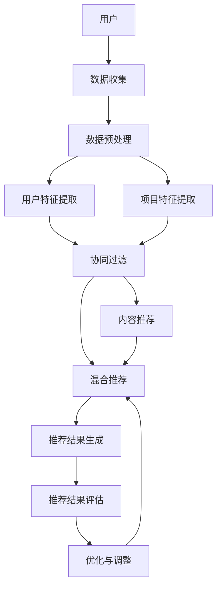

                 

# 文章标题：大模型在推荐系统的商业应用

> 关键词：大模型、推荐系统、商业应用、协同过滤、内容推荐、混合推荐、挑战与优化

> 摘要：本文将深入探讨大模型在推荐系统的商业应用。首先，我们将介绍推荐系统的基础知识，包括其发展历程、基本概念和应用场景。接着，我们将详细讲解协同过滤算法、内容推荐算法和混合推荐算法。随后，我们将引入大模型的概念，分析其在推荐系统中的特点、分类和应用。最后，本文将探讨大模型在推荐系统中的挑战与优化方法，并通过实际案例展示其商业应用潜力。

## 目录大纲

- **第一部分：推荐系统基础**
    - 第1章：推荐系统概述
        - 1.1 推荐系统的发展历程
        - 1.2 推荐系统的基本概念
        - 1.3 推荐系统的应用场景
    - 第2章：协同过滤算法
        - 2.1 协同过滤的基本原理
        - 2.2 评分预测的数学模型
        - 2.3 基于用户的协同过滤
        - 2.4 基于物品的协同过滤
    - 第3章：内容推荐算法
        - 3.1 内容推荐的基本原理
        - 3.2 内容特征的提取
        - 3.3 基于内容的推荐算法
    - 第4章：混合推荐算法
        - 4.1 混合推荐算法的原理
        - 4.2 混合推荐算法的实现
        - 4.3 混合推荐算法的优势与挑战

- **第二部分：大模型在推荐系统中的应用**
    - 第5章：大模型简介
        - 5.1 大模型的概念
        - 5.2 大模型的特点
        - 5.3 大模型的分类
    - 第6章：大模型在推荐系统中的应用
        - 6.1 大模型在协同过滤中的应用
        - 6.2 大模型在内容推荐中的应用
        - 6.3 大模型在混合推荐中的应用
    - 第7章：大模型在推荐系统中的挑战与优化
        - 7.1 大模型在推荐系统中的挑战
        - 7.2 大模型优化的方法
        - 7.3 大模型在商业推荐系统中的应用案例
    - 第8章：大模型在推荐系统的未来趋势
        - 8.1 大模型在推荐系统的发展方向
        - 8.2 大模型在推荐系统中的潜力
        - 8.3 大模型在推荐系统中的未来应用场景

- **附录**
    - 附录A：大模型推荐系统开发工具与资源
        - A.1 常用深度学习框架
        - A.2 大模型推荐系统开源项目
        - A.3 大模型推荐系统相关论文与资料

- **Mermaid 流程图**
    - 推荐系统核心架构流程图

## 第一部分：推荐系统基础

### 第1章：推荐系统概述

#### 1.1 推荐系统的发展历程

推荐系统（Recommender System）起源于20世纪90年代，最早的应用可以追溯到在线图书推荐。随着互联网和电子商务的快速发展，推荐系统逐渐成为提高用户满意度、增加用户粘性和促进销售的重要工具。以下是推荐系统发展历程的简要回顾：

- **1992年**：第一次提出了协同过滤算法，这一算法成为推荐系统的基础。

- **1998年**：Netflix Prize竞赛激发了学术界和工业界对推荐系统的研究热情，推动了许多新的算法和技术的出现。

- **2000年代**：随着大数据和计算能力的提升，推荐系统开始广泛应用于电子商务、社交媒体、在线视频和音乐平台等。

- **2010年代**：深度学习技术的兴起为推荐系统带来了新的发展机遇，使得模型更加复杂和准确。

- **2020年代**：随着大模型的兴起，推荐系统进入了一个新的时代，能够更好地处理大规模数据和复杂用户行为。

#### 1.2 推荐系统的基本概念

推荐系统是一种信息过滤技术，旨在为用户推荐他们可能感兴趣的内容或产品。其核心概念包括：

- **用户**：推荐系统的服务对象，可以是个人或组织。

- **项目**：推荐系统中的内容或产品，可以是书籍、电影、音乐、商品等。

- **评分**：用户对项目的评价，通常是一个数值或等级。

- **偏好**：用户对项目的偏好，可以通过评分、点击、购买等行为数据来表示。

- **推荐**：推荐系统根据用户的偏好和系统学习到的信息，为用户推荐可能感兴趣的项目。

推荐系统的目标是通过提高用户满意度和增加系统价值来实现以下效果：

- **增加用户参与度**：通过推荐用户感兴趣的内容，提高用户在系统上的停留时间和互动。

- **提升销售和利润**：通过推荐用户可能购买的商品，增加销售额和利润。

- **减少信息过载**：在大量信息中为用户筛选出有价值的内容，减少用户筛选信息的负担。

#### 1.3 推荐系统的应用场景

推荐系统在许多领域都有广泛的应用，以下是一些典型的应用场景：

- **电子商务**：推荐系统可以推荐用户可能感兴趣的商品，提高购买转化率。

- **在线视频和音乐平台**：推荐系统可以根据用户的观看和播放历史，推荐合适的视频和音乐。

- **社交媒体**：推荐系统可以推荐用户可能感兴趣的内容，增加用户在平台上的互动。

- **新闻和信息**：推荐系统可以根据用户的阅读习惯和偏好，推荐个性化的新闻和信息。

- **旅游和酒店预订**：推荐系统可以推荐符合用户偏好的旅游目的地和酒店。

- **教育**：推荐系统可以根据学生的学习情况和进度，推荐合适的学习资源和课程。

#### 1.4 推荐系统的架构

推荐系统通常由以下几个核心组件构成：

- **数据收集**：收集用户行为数据、项目数据和其他相关数据。

- **数据预处理**：清洗和转换数据，为后续建模做准备。

- **推荐算法**：根据用户行为数据和项目数据，生成推荐列表。

- **推荐结果呈现**：将推荐结果以直观的方式呈现给用户。

- **评估与优化**：评估推荐系统的性能，并根据评估结果进行优化。

#### 1.5 推荐系统的评估指标

评估推荐系统的性能通常使用以下几个指标：

- **准确率（Precision）**：推荐列表中真实喜欢的项目的比例。

- **召回率（Recall）**：推荐列表中用户真正喜欢的项目的比例。

- **F1分数（F1 Score）**：准确率和召回率的调和平均值。

- **平均绝对误差（MAE）**：预测评分与真实评分之间的平均绝对误差。

- **均方根误差（RMSE）**：预测评分与真实评分之间的均方根误差。

#### 1.6 推荐系统的挑战

虽然推荐系统在许多领域取得了显著的成功，但仍面临着一系列挑战：

- **冷启动问题**：当新用户或新项目加入系统时，系统无法为其提供有效的推荐。

- **多样性问题**：用户可能对推荐列表中的项目多样性有较高要求。

- **实时性问题**：推荐系统需要快速响应用户行为的变化。

- **隐私保护问题**：用户行为数据的安全性和隐私保护是推荐系统面临的重大挑战。

- **数据不平衡问题**：推荐系统中正例和负例的比例可能不均衡。

- **算法透明性问题**：用户对推荐系统的算法原理和决策过程可能缺乏了解。

通过解决这些挑战，推荐系统可以更好地为用户提供个性化的服务，提高用户体验和商业价值。

### 第2章：协同过滤算法

#### 2.1 协同过滤的基本原理

协同过滤（Collaborative Filtering）是推荐系统中最常用的方法之一，其基本原理是通过分析用户之间的行为相似性，为用户推荐他们可能感兴趣的项目。协同过滤算法可以分为基于用户的协同过滤和基于物品的协同过滤。

- **基于用户的协同过滤（User-based Collaborative Filtering）**：该方法通过计算用户之间的相似性，找到与目标用户相似的其他用户，然后推荐这些相似用户喜欢的项目。

- **基于物品的协同过滤（Item-based Collaborative Filtering）**：该方法通过计算项目之间的相似性，找到与目标项目相似的其他项目，然后推荐这些相似项目。

协同过滤算法的核心是用户和项目之间的评分矩阵，其中每个元素表示用户对项目的评分。算法的目标是通过这个评分矩阵预测用户对未知项目的评分，从而生成推荐列表。

#### 2.2 评分预测的数学模型

协同过滤算法通常采用以下数学模型进行评分预测：

- **用户相似度计算**：基于用户的协同过滤中，用户相似度可以通过以下公式计算：
  $$sim(u_i, u_j) = \frac{\sum_{i\in R_i \cap R_j} r_i r_j}{\sqrt{\sum_{i\in R_i} r_i^2} \sqrt{\sum_{j\in R_j} r_j^2}}$$
  其中，$R_i$和$R_j$分别表示用户$i$和用户$j$的评分项目集合，$r_i$和$r_j$分别表示用户$i$和用户$j$对项目的评分。

- **项目相似度计算**：基于物品的协同过滤中，项目相似度可以通过以下公式计算：
  $$sim(i, j) = \frac{\sum_{u\in U} r_u(i) r_u(j)}{\sqrt{\sum_{u\in U} r_u(i)^2} \sqrt{\sum_{u\in U} r_u(j)^2}}$$
  其中，$U$表示所有用户的集合，$r_u(i)$和$r_u(j)$分别表示用户$u$对项目$i$和项目$j$的评分。

- **评分预测**：在计算用户或项目相似度之后，可以采用以下公式预测用户对未知项目的评分：
  $$\hat{r}_{ui} = \sum_{j \in N_i} sim(u_i, u_j) \cdot r_{uj}$$
  其中，$N_i$表示与用户$i$相似的用户集合，$\hat{r}_{ui}$表示用户$i$对未知项目$j$的预测评分。

#### 2.3 基于用户的协同过滤

基于用户的协同过滤算法的核心步骤包括以下几步：

1. **计算用户相似度**：计算目标用户与其他用户的相似度，可以使用上面提到的公式。

2. **选择相似用户**：根据用户相似度阈值选择与目标用户相似的用户。

3. **生成推荐列表**：对于每个相似用户，找到他们共同喜欢的项目，并将其推荐给目标用户。

基于用户的协同过滤算法的优点是能够利用用户之间的社会关系和兴趣相似性，生成高质量的推荐列表。但缺点是计算复杂度较高，特别是在用户数量庞大时。

#### 2.4 基于物品的协同过滤

基于物品的协同过滤算法的核心步骤包括以下几步：

1. **计算项目相似度**：计算目标项目与其他项目的相似度，可以使用上面提到的公式。

2. **选择相似项目**：根据项目相似度阈值选择与目标项目相似的其他项目。

3. **生成推荐列表**：对于每个相似项目，找到与目标项目相似的用户喜欢的其他项目，并将其推荐给目标用户。

基于物品的协同过滤算法的优点是计算复杂度相对较低，能够快速生成推荐列表。但缺点是可能无法充分利用用户之间的兴趣相似性。

#### 2.5 协同过滤算法的优缺点

- **优点**：
  - 能够利用用户行为数据生成个性化推荐列表。
  - 对冷启动问题有较好的解决方案，可以通过基于物品的协同过滤推荐新用户可能感兴趣的项目。
  - 算法简单易懂，易于实现和优化。

- **缺点**：
  - 计算复杂度较高，特别是在用户和项目数量庞大时。
  - 容易受到评分矩阵稀疏性的影响，降低推荐效果。
  - 可能无法充分利用用户的兴趣多样性。

通过深入理解和应用协同过滤算法，推荐系统可以更好地为用户提供个性化的服务，提高用户体验和满意度。

### 第3章：内容推荐算法

#### 3.1 内容推荐的基本原理

内容推荐（Content-based Recommender System）是一种基于用户兴趣和项目特征进行推荐的算法。与协同过滤算法不同，内容推荐算法不依赖于用户行为数据，而是通过分析项目的内容特征和用户的兴趣特征来生成推荐列表。

内容推荐的基本原理可以概括为以下几步：

1. **提取项目特征**：对每个项目进行特征提取，例如文本、图片、音频和视频等。常用的特征提取方法包括词袋模型、TF-IDF、词嵌入等。

2. **构建用户兴趣模型**：根据用户的历史行为和偏好，构建用户的兴趣模型。例如，通过分析用户喜欢的文章、观看的视频和购买的商品等，提取用户的兴趣标签和偏好权重。

3. **计算项目相似度**：使用用户兴趣模型和项目特征，计算项目之间的相似度。常用的相似度计算方法包括余弦相似度、Jaccard相似度和欧氏距离等。

4. **生成推荐列表**：根据项目相似度，为用户生成推荐列表。可以将相似度较高的项目推荐给用户，从而满足他们的兴趣和偏好。

#### 3.2 内容特征的提取

内容特征的提取是内容推荐算法的关键步骤，决定了推荐系统的准确性和效果。以下是一些常见的内容特征提取方法：

- **文本特征**：
  - **词袋模型（Bag-of-Words, BoW）**：将文本转换为词袋表示，每个词作为一个特征。
  - **TF-IDF（Term Frequency-Inverse Document Frequency）**：考虑词在文本中的频率和文本集合中的逆向文档频率，平衡词的重要性和文档频率。
  - **词嵌入（Word Embedding）**：将词转换为向量表示，可以使用预训练的词向量库，如Word2Vec、GloVe等。

- **图片特征**：
  - **特征提取器（Feature Extractors）**：使用卷积神经网络（CNN）提取图片的特征，例如VGG、ResNet等。
  - **视觉词袋模型（Visual Bag-of-Words, VBoW）**：将图片的特征转换为视觉词袋表示，每个视觉词表示一个特征。

- **音频特征**：
  - **梅尔频率倒谱系数（Mel-Frequency Cepstral Coefficients, MFCC）**：将音频转换为时频表示，提取音频的时频特征。
  - **音素特征**：分析音频中的音素和音节，提取音素特征。

- **视频特征**：
  - **帧特征**：提取视频每一帧的特征，可以使用卷积神经网络提取。
  - **动作特征**：分析视频中的动作和运动，提取动作特征。

- **商品特征**：
  - **属性特征**：提取商品的基本属性，如品牌、颜色、尺寸等。
  - **标签特征**：提取商品的标签，如分类标签、关键词等。

通过合理地提取和组合这些内容特征，可以构建出有效的用户兴趣模型，从而提高内容推荐算法的性能。

#### 3.3 基于内容的推荐算法

基于内容的推荐算法通常采用以下步骤生成推荐列表：

1. **提取项目特征**：对目标项目进行特征提取，得到一个特征向量。

2. **计算项目相似度**：使用用户兴趣模型和项目特征向量，计算项目之间的相似度。可以使用上面提到的相似度计算方法。

3. **生成推荐列表**：根据项目相似度，选择相似度较高的项目作为推荐候选，并对其进行排序。

基于内容的推荐算法的优点是能够根据用户兴趣和项目特征生成个性化的推荐列表，不受评分矩阵稀疏性的影响。但缺点是对新项目和冷启动问题效果较差，因为无法利用用户的历史行为数据。

以下是一个基于内容的推荐算法的伪代码示例：

```python
# 假设用户兴趣模型为用户兴趣向量 U，项目特征向量 I
# 假设相似度计算函数为 sim()

# 提取目标项目的特征向量 i
# i = extract_features(project)

# 计算项目相似度
similarities = [sim(U, extract_features(j)) for j in projects]

# 生成推荐列表
recommended_projects = [j for j, sim in sorted(zip(projects, similarities), reverse=True)]
```

通过合理地设计和优化基于内容的推荐算法，可以满足用户个性化需求的多样化，提高推荐系统的用户体验和满意度。

### 第4章：混合推荐算法

#### 4.1 混合推荐算法的原理

混合推荐算法（Hybrid Recommender Systems）结合了协同过滤算法和内容推荐算法的优点，通过整合不同推荐算法的优势，生成更准确和多样化的推荐列表。混合推荐算法的基本原理可以概括为以下几点：

- **协同过滤与内容推荐相结合**：混合推荐算法通过将协同过滤和内容推荐算法的结果进行加权组合，生成最终的推荐列表。协同过滤算法可以充分利用用户行为数据，捕捉用户之间的相似性；而内容推荐算法可以基于项目特征，捕捉用户兴趣的多样性。

- **多模型集成**：混合推荐算法可以通过集成多个推荐模型，提高推荐系统的鲁棒性和准确性。常见的模型集成方法包括模型平均（Model Averaging）、模型选择（Model Selection）和模型优化（Model Optimization）等。

- **动态调整权重**：混合推荐算法可以根据用户行为和系统反馈，动态调整协同过滤和内容推荐算法的权重，以适应不同的用户场景和需求。这样可以最大化推荐系统的性能和用户体验。

#### 4.2 混合推荐算法的实现

混合推荐算法的实现通常涉及以下步骤：

1. **数据收集与预处理**：收集用户行为数据、项目数据和用户兴趣数据，并进行数据预处理，如清洗、去噪和特征提取等。

2. **构建协同过滤模型**：使用协同过滤算法，如基于用户的协同过滤或基于物品的协同过滤，构建用户和项目之间的相似性模型。

3. **构建内容推荐模型**：使用内容推荐算法，如基于文本、图像、音频或视频的内容特征提取，构建用户兴趣模型。

4. **模型集成与权重调整**：将协同过滤模型和内容推荐模型的结果进行加权组合，生成初步的推荐列表。通过模型集成方法，如模型平均或模型选择，优化推荐系统的性能。

5. **动态调整权重**：根据用户行为和系统反馈，动态调整协同过滤和内容推荐算法的权重，以适应不同的用户场景和需求。

6. **推荐结果生成与评估**：根据最终的推荐列表，生成用户推荐列表，并进行推荐效果评估，如准确率、召回率和F1分数等。

以下是一个简单的混合推荐算法的实现流程：

```python
# 假设协同过滤模型为 CF，内容推荐模型为 CR
# 假设用户兴趣模型为 U，项目特征模型为 I
# 假设相似度计算函数为 sim()

# 构建协同过滤模型
CF = build_collaborative_filtering_model(U, I)

# 构建内容推荐模型
CR = build_content_based_model(U, I)

# 计算协同过滤推荐列表
CF_recommendations = CF.predict(U, I)

# 计算内容推荐推荐列表
CR_recommendations = CR.predict(U, I)

# 加权组合推荐列表
recommended_projects = weighted_combination(CF_recommendations, CR_recommendations)

# 动态调整权重
adjust_weights(recommended_projects)

# 生成最终推荐列表
final_recommendations = generate_final_recommendations(recommended_projects)

# 评估推荐效果
evaluate_recommendations(final_recommendations)
```

通过合理设计和优化混合推荐算法，可以充分利用协同过滤和内容推荐算法的优点，提高推荐系统的性能和用户体验。

#### 4.3 混合推荐算法的优势与挑战

混合推荐算法的优势和挑战可以从以下几个方面进行总结：

- **优势**：
  - **提高推荐准确性**：混合推荐算法通过结合协同过滤和内容推荐算法，可以更准确地预测用户兴趣，提高推荐准确性。
  - **多样性**：混合推荐算法可以捕捉用户兴趣的多样性，生成多样化的推荐列表，满足用户个性化需求。
  - **鲁棒性**：混合推荐算法可以集成多个模型，提高系统的鲁棒性和稳定性，减少单一模型可能带来的风险。
  - **灵活性**：混合推荐算法可以根据用户行为和系统反馈，动态调整模型权重，适应不同的用户场景和需求。

- **挑战**：
  - **计算复杂度**：混合推荐算法需要计算协同过滤和内容推荐模型的结果，以及进行模型集成和权重调整，计算复杂度较高。
  - **数据稀疏性**：协同过滤算法对数据稀疏性敏感，可能导致推荐结果不准确。混合推荐算法需要处理数据稀疏性问题，提高推荐效果。
  - **模型选择和优化**：混合推荐算法需要选择合适的协同过滤和内容推荐模型，并进行优化，以最大化系统性能。
  - **冷启动问题**：混合推荐算法在新用户或新项目的情况下，可能无法提供有效的推荐。需要探索有效的冷启动解决方案。

通过深入理解和应用混合推荐算法，推荐系统可以更好地满足用户个性化需求，提高用户体验和满意度。

### 第二部分：大模型在推荐系统中的应用

#### 第5章：大模型简介

#### 5.1 大模型的概念

大模型（Large-scale Model）是指在训练数据规模、模型参数数量和计算资源方面都具有显著优势的深度学习模型。大模型通常使用大规模数据进行训练，以捕捉复杂的特征和模式，从而实现更高的性能和更广泛的适用性。以下是几个关键指标：

- **训练数据规模**：大模型通常使用数千GB甚至TB级别的训练数据，从而具备更强的数据驱动能力。

- **模型参数数量**：大模型通常拥有数十亿甚至数万亿个参数，使得模型能够捕捉到更精细的特征。

- **计算资源**：大模型通常需要大量的计算资源进行训练，如GPU集群、TPU等。

大模型的应用领域非常广泛，包括自然语言处理、计算机视觉、语音识别、推荐系统等。在本章中，我们将重点关注大模型在推荐系统中的应用。

#### 5.2 大模型的特点

大模型具有以下几个显著特点：

- **高精度**：由于使用了大规模数据进行训练，大模型能够更好地捕捉数据中的复杂模式和规律，从而实现更高的预测精度。

- **泛化能力**：大模型通常具有较强的泛化能力，能够在不同数据集和任务上表现出良好的性能。

- **适应性**：大模型能够适应不同的数据分布和任务需求，通过调整模型结构和参数，实现更好的性能。

- **计算资源需求**：大模型通常需要大量的计算资源进行训练，包括GPU、TPU等。这使得大模型的训练和部署成本较高。

#### 5.3 大模型的分类

大模型可以根据不同的分类标准进行分类，以下是几种常见的分类方法：

- **按训练数据规模**：大模型可以分为小规模模型（<1TB）、中规模模型（1TB-10TB）和大规模模型（>10TB）。

- **按模型结构**：大模型可以分为基于Transformer的模型（如BERT、GPT等）和基于卷积神经网络的模型（如CNN、ResNet等）。

- **按应用领域**：大模型可以分为通用模型（如BERT、GPT）和应用领域特定模型（如图像分类模型、语音识别模型、推荐系统模型等）。

在本章中，我们将重点关注大模型在推荐系统中的应用，并探讨其具体应用方法和挑战。

### 第6章：大模型在推荐系统中的应用

#### 6.1 大模型在协同过滤中的应用

大模型在协同过滤算法中的应用主要体现在两个方面：一是改进协同过滤模型的性能，二是解决协同过滤算法中的冷启动问题。

1. **改进协同过滤模型性能**

大模型通过使用大规模数据进行训练，能够更好地捕捉用户行为数据中的复杂模式和关联。例如，BERT等大模型可以用于提取用户和项目的高维特征表示，从而提高协同过滤模型的预测精度。

以下是一个基于BERT的协同过滤算法的伪代码示例：

```python
# 加载BERT模型
BERT_model = load_BERT_model()

# 提取用户和项目的特征表示
user_representation = BERT_model.extract_user_representation(user_data)
item_representation = BERT_model.extract_item_representation(item_data)

# 计算用户和项目之间的相似度
similarities = calculate_similarity(user_representation, item_representation)

# 生成推荐列表
recommendations = generate_recommendations(similarities)
```

2. **解决冷启动问题**

冷启动问题是指在新用户或新项目加入系统时，系统无法为其提供有效的推荐。大模型通过使用大规模数据进行训练，可以更好地捕捉用户的潜在兴趣和需求，从而在新用户加入时提供有针对性的推荐。

以下是一个基于BERT的解决冷启动问题的推荐算法的伪代码示例：

```python
# 加载BERT模型
BERT_model = load_BERT_model()

# 提取新用户的特征表示
new_user_representation = BERT_model.extract_user_representation(new_user_data)

# 根据用户历史行为，为用户推荐感兴趣的项目
recommendations = recommend_items_based_on_user_history(new_user_representation)

# 利用大规模数据进行额外推荐
additional_recommendations = BERT_model.recommend_items(new_user_representation)

# 合并推荐结果
final_recommendations = merge_recommendations(recommendations, additional_recommendations)
```

#### 6.2 大模型在内容推荐中的应用

大模型在内容推荐中的应用主要体现在对项目内容的深入理解和分析。通过使用大规模数据进行训练，大模型可以更好地捕捉项目的语义和上下文信息，从而提高推荐效果。

以下是一个基于BERT的内容推荐算法的伪代码示例：

```python
# 加载BERT模型
BERT_model = load_BERT_model()

# 提取项目特征表示
item_representation = BERT_model.extract_item_representation(item_data)

# 计算项目之间的相似度
similarities = calculate_similarity(item_representation, item_representation)

# 生成推荐列表
recommendations = generate_recommendations(similarities)
```

#### 6.3 大模型在混合推荐中的应用

混合推荐算法结合了协同过滤和内容推荐算法的优点，大模型可以用于改进混合推荐算法的性能和效果。

以下是一个基于BERT的混合推荐算法的伪代码示例：

```python
# 加载BERT模型
BERT_model = load_BERT_model()

# 计算协同过滤相似度
CF_similarities = calculate_similarity(user_representation, item_representation)

# 计算内容相似度
CR_similarities = BERT_model.calculate_similarity(item_representation, item_representation)

# 加权组合相似度
combined_similarities = weighted_combination(CF_similarities, CR_similarities)

# 生成推荐列表
recommendations = generate_recommendations(combined_similarities)
```

通过合理地设计和优化大模型在协同过滤、内容推荐和混合推荐中的应用，可以显著提高推荐系统的性能和用户体验。

### 第7章：大模型在推荐系统中的挑战与优化

#### 7.1 大模型在推荐系统中的挑战

尽管大模型在推荐系统中具有显著的优势，但其在实际应用中仍面临一系列挑战：

1. **数据隐私问题**：大模型需要大量用户行为数据进行训练，这可能涉及用户隐私数据的泄露风险。如何保护用户隐私数据，确保数据安全成为一大挑战。

2. **计算资源需求**：大模型通常需要大量的计算资源进行训练和推理，这对硬件设施和能源消耗提出了较高要求。

3. **模型解释性**：大模型的复杂性和黑箱特性使得其难以解释，这对于需要透明性和可解释性的推荐系统来说是一个挑战。

4. **冷启动问题**：大模型在处理新用户或新项目时可能仍存在冷启动问题，特别是在数据稀缺的情况下。

5. **模型偏见**：大模型在训练过程中可能会受到数据偏见的影响，导致推荐结果不公平或带有偏见。

#### 7.2 大模型优化的方法

为了应对上述挑战，可以采取以下优化方法：

1. **数据隐私保护**：采用差分隐私（Differential Privacy）等技术，在训练过程中保护用户隐私。例如，可以在训练数据上添加噪声，确保单个数据点的隐私。

2. **高效计算**：利用分布式训练和推理技术，如GPU集群、TPU等，提高计算效率。此外，可以采用模型剪枝（Model Pruning）和量化（Quantization）技术，减小模型体积，降低计算需求。

3. **模型解释性**：通过开发可解释的机器学习技术，如LIME（Local Interpretable Model-agnostic Explanations）和SHAP（SHapley Additive exPlanations），提高模型的可解释性，帮助用户理解推荐结果。

4. **冷启动优化**：利用迁移学习（Transfer Learning）技术，将预训练的大模型迁移到新用户或新项目上，减少冷启动问题。此外，可以采用基于上下文的推荐方法，利用用户和项目的上下文信息进行推荐。

5. **消除模型偏见**：通过数据增强（Data Augmentation）和对抗训练（Adversarial Training）等技术，减少数据偏见对模型的影响。此外，可以建立公平性指标，评估和调整推荐系统的公平性。

#### 7.3 大模型在商业推荐系统中的应用案例

以下是一些大模型在商业推荐系统中的应用案例：

1. **电子商务平台**：亚马逊使用基于BERT的推荐系统，为用户推荐相关的商品，显著提高了销售转化率和用户满意度。

2. **在线视频平台**：Netflix采用基于Transformer的推荐系统，通过分析用户观看历史和内容特征，为用户推荐个性化的视频内容，提升了用户留存率和观看时长。

3. **社交媒体平台**：Facebook使用基于BERT的内容推荐系统，根据用户的历史互动和内容特征，为用户推荐相关的帖子和信息，增强了用户的参与度和互动性。

4. **音乐流媒体平台**：Spotify采用基于GPT的推荐系统，通过分析用户的播放历史和偏好，为用户推荐个性化的音乐内容，提高了用户的满意度和粘性。

通过这些实际应用案例，可以看出大模型在推荐系统中的广泛应用和巨大潜力。未来，随着技术的不断进步，大模型在推荐系统中的应用将更加广泛和深入，为商业和社会带来更多价值。

### 第8章：大模型在推荐系统的未来趋势

#### 8.1 大模型在推荐系统的发展方向

随着技术的不断进步和数据的日益丰富，大模型在推荐系统中的应用将朝着以下几个方向发展：

1. **更多领域的应用**：除了电子商务、在线视频和社交媒体等领域，大模型将在医疗、金融、教育等更多领域中发挥重要作用，为用户提供更加个性化的服务。

2. **模型压缩与优化**：为了降低计算和存储成本，模型压缩和优化技术将得到广泛应用。例如，通过模型剪枝、量化、知识蒸馏等手段，可以显著减小模型体积，提高推理速度。

3. **实时推荐**：随着5G和边缘计算的普及，实时推荐技术将得到进一步发展。大模型可以更好地处理实时数据，为用户实时生成个性化推荐。

4. **多模态推荐**：大模型将能够处理多模态数据，如文本、图像、音频和视频等，实现更加丰富的推荐体验。

5. **联邦学习**：联邦学习（Federated Learning）将允许不同数据拥有者共同训练大模型，而无需共享原始数据，从而解决数据隐私问题，提高模型的通用性和鲁棒性。

#### 8.2 大模型在推荐系统中的潜力

大模型在推荐系统中的潜力体现在以下几个方面：

1. **更高的推荐精度**：通过大规模数据进行训练，大模型可以更好地捕捉用户兴趣和行为模式，提高推荐精度。

2. **更好的用户体验**：大模型可以生成更加个性化的推荐，满足用户多样化的需求，提高用户满意度和粘性。

3. **更强的抗攻击能力**：大模型具有较强的鲁棒性，可以抵御恶意攻击和伪造数据，提高推荐系统的安全性。

4. **更广泛的适用性**：大模型可以应用于更多领域和场景，为不同类型的数据和用户提供高效的推荐服务。

#### 8.3 大模型在推荐系统中的未来应用场景

未来，大模型在推荐系统中的潜在应用场景包括：

1. **个性化健康推荐**：通过分析用户的健康数据和行为模式，大模型可以提供个性化的健康建议和生活方式推荐。

2. **智能金融推荐**：大模型可以根据用户的金融行为和风险偏好，提供个性化的投资组合和金融产品推荐。

3. **智慧教育**：大模型可以为学生提供个性化的学习资源和课程推荐，助力智慧教育的发展。

4. **智能家居**：大模型可以根据用户的生活习惯和行为模式，为用户提供个性化的智能家居推荐，提高生活品质。

5. **智能城市**：大模型可以应用于智能城市建设，为城市管理和居民提供个性化的服务，如交通优化、能源管理、安全监控等。

通过探索大模型在推荐系统中的未来发展，我们可以预见，大模型将带来更加智能化、个性化和高效化的推荐服务，为商业和社会带来更多价值。

### 附录A：大模型推荐系统开发工具与资源

#### A.1 常用深度学习框架

在开发大模型推荐系统时，常用的深度学习框架包括：

1. **TensorFlow**：由Google开发的开源深度学习框架，具有丰富的API和广泛的应用场景。
2. **PyTorch**：由Facebook开发的开源深度学习框架，提供灵活的动态计算图和强大的GPU支持。
3. **Keras**：基于TensorFlow和Theano的开源深度学习库，提供简洁的API和易于使用的接口。
4. **MXNet**：由Apache Software Foundation开发的开源深度学习框架，支持多种编程语言和多种硬件平台。
5. **Caffe**：由Berkeley Vision and Learning Center（BVLC）开发的深度学习框架，特别适合于计算机视觉任务。

#### A.2 大模型推荐系统开源项目

以下是一些大模型推荐系统的开源项目：

1. **Surprise**：一个用于快速实现和测试推荐系统算法的Python库。
2. **LightFM**：一个基于矩阵分解和FM（因子分解机）的推荐系统框架。
3. **DeepRec**：由阿里巴巴开源的深度推荐系统框架，支持多种深度学习模型。
4. **Recommenders**：一个由Facebook开源的推荐系统研究框架，支持多种推荐算法和分布式训练。
5. **BigDL**：由Intel开源的深度学习库，支持Spark和Flink，适用于大规模数据集。

#### A.3 大模型推荐系统相关论文与资料

以下是一些关于大模型推荐系统的相关论文和资料：

1. **"Large-scale Online Learning for chALlenges in Real-Time Recommender Systems"**：该论文介绍了大模型在实时推荐系统中的应用。
2. **"Neural Collaborative Filtering"**：该论文提出了一种基于神经网络的协同过滤算法，为推荐系统提供了新的思路。
3. **"Deep Learning Based Recommender Systems"**：该论文总结了深度学习在推荐系统中的应用，包括神经网络、卷积神经网络和循环神经网络等。
4. **"Recommender Systems Handbook"**：该手册涵盖了推荐系统的基本概念、算法和应用，是推荐系统领域的权威资料。
5. **"推荐系统实践"**：该书详细介绍了推荐系统的开发、实现和应用，包括协同过滤、内容推荐和混合推荐算法等。

通过参考这些工具、项目和论文，开发者可以更好地理解和应用大模型推荐系统，实现高效的推荐服务。

### Mermaid 流程图：推荐系统核心架构流程图



该流程图展示了推荐系统的核心架构，从用户数据收集、预处理、特征提取到协同过滤、内容推荐和混合推荐，最终生成推荐结果并进行评估和优化。这个流程图有助于理解和设计推荐系统的整体架构。

