                 

# 大模型在教育领域的创新实践

## 关键词
大模型、教育领域、创新实践、深度学习、人工智能

## 摘要
随着人工智能技术的飞速发展，大模型在教育领域的应用越来越广泛，成为教育技术创新的重要驱动力。本文将深入探讨大模型在教育领域的创新实践，包括其定义、起源、应用场景以及核心算法原理。通过对大模型在教育项目中的应用和挑战的分析，我们旨在为教育工作者和人工智能研究者提供有价值的参考和启示。

## 目录大纲

### 第一部分：引言

#### 第1章：大模型与教育
1.1 大模型的定义与起源
1.2 大模型在教育领域的重要性
1.3 大模型的发展历程

#### 第2章：大模型在教育中的应用
2.1 学生学习数据挖掘
2.2 智能教学辅助系统
2.3 教育个性化推荐
2.4 教育资源智能分配
2.5 教育行业数据分析

### 第二部分：核心概念与联系

#### 第3章：大模型技术基础
3.1 深度学习基本原理
3.2 神经网络与深度学习模型
3.3 大模型的训练与优化

#### 第4章：大模型在教育领域的实现
4.1 教育数据预处理
4.2 大模型在教育资源优化中的应用
4.3 大模型在教学效果评估中的应用

#### 第5章：大模型在教育领域的联系
5.1 大模型与教育心理学
5.2 大模型与教育统计学
5.3 大模型与教育科技的发展趋势

### 第三部分：核心算法原理讲解

#### 第6章：大模型算法原理
6.1 自动编码器
6.2 卷积神经网络（CNN）
6.3 递归神经网络（RNN）
6.4 生成对抗网络（GAN）
6.5 Transformer模型

#### 第7章：数学模型和数学公式
7.1 神经网络中的激活函数
7.2 反向传播算法
7.3 损失函数与优化算法
7.4 Latent Dirichlet Allocation（LDA）模型
7.5 时间序列分析

### 第四部分：项目实战

#### 第8章：大模型在教育项目中的应用
8.1 学生学习分析项目
8.2 教育个性化推荐系统
8.3 教育资源智能分配系统
8.4 教育行业数据分析报告

#### 第9章：大模型在教育领域的挑战与未来
9.1 大模型在教育领域的挑战
9.2 大模型在教育领域的未来发展趋势
9.3 大模型在教育领域的社会影响

### 附录

#### 附录A：大模型教育应用开发工具与资源
A.1 主流深度学习框架
A.2 教育大数据平台
A.3 开源教育应用框架
A.4 教育数据集与资源链接

#### 附录B：参考文献
B.1 主要参考书籍
B.2 相关研究论文
B.3 教育领域大模型应用案例研究

### 绘制 Mermaid 流程图

```mermaid
graph TD
    A[大模型与教育] --> B[学生数据挖掘]
    A --> C[智能教学辅助系统]
    A --> D[教育资源优化]
    A --> E[教育行业数据分析]
    F[深度学习基本原理] --> G[神经网络与深度学习模型]
    F --> H[大模型训练与优化]
    I[教育数据预处理] --> J[教育资源优化应用]
    I --> K[教学效果评估应用]
    L[大模型算法原理] --> M[自动编码器]
    L --> N[卷积神经网络]
    L --> O[递归神经网络]
    L --> P[生成对抗网络]
    L --> Q[Transformer模型]
    R[神经网络激活函数] --> S[反向传播算法]
    R --> T[损失函数与优化算法]
    R --> U[Latent Dirichlet Allocation模型]
    R --> V[时间序列分析]
    W[学生学习分析项目] --> X[教育个性化推荐系统]
    W --> Y[教育资源智能分配系统]
    W --> Z[教育行业数据分析报告]
    AA[B] --> BB[教育心理学]
    AA --> CC[教育统计学]
    AA --> DD[教育科技发展趋势]
    EE[大模型教育应用开发工具与资源] --> FF[TensorFlow]
    EE --> GG[教育大数据平台]
    EE --> HH[开源教育应用框架]
    EE --> II[教育数据集与资源链接]
```


### 详细内容说明

#### 第1章：大模型的定义与起源
本章将介绍大模型的定义与起源，解释为什么大模型在教育领域具有重要意义，以及大模型的发展历程。我们将详细探讨大模型的技术特点和优势，分析其在教育领域的应用前景。

#### 第2章：大模型在教育中的应用
本章将详细讲解大模型在教育领域的应用，包括学生学习数据挖掘、智能教学辅助系统、教育个性化推荐、教育资源智能分配以及教育行业数据分析。我们将通过具体案例，展示大模型在这些应用场景中的实际效果。

#### 第3章：大模型技术基础
本章将介绍大模型的技术基础，包括深度学习基本原理、神经网络与深度学习模型、大模型的训练与优化。我们将详细讲解这些概念，并探讨如何在实际应用中利用这些技术。

#### 第4章：大模型在教育领域的实现
本章将深入探讨大模型在教育领域的实现，包括教育数据预处理、大模型在教育资源优化和教学效果评估中的应用。我们将通过具体的实现案例，展示大模型在这些领域的应用方法。

#### 第5章：大模型在教育领域的联系
本章将探讨大模型与教育心理学、教育统计学和教育科技发展的关系。我们将分析大模型如何与这些领域相结合，推动教育技术的进步。

#### 第6章：大模型算法原理
本章将深入讲解大模型的算法原理，包括自动编码器、卷积神经网络、递归神经网络、生成对抗网络和Transformer模型。我们将通过伪代码和数学公式，详细阐述这些算法的原理和实现。

#### 第7章：数学模型和数学公式
本章将详细讲解神经网络中的激活函数、反向传播算法、损失函数与优化算法、LDA模型和时序分析。我们将通过举例说明，帮助读者理解这些数学模型的应用。

#### 第8章：大模型在教育项目中的应用
本章将提供具体的案例实战，包括学生学习分析项目、教育个性化推荐系统、教育资源智能分配系统和教育行业数据分析报告。我们将详细解读这些项目，展示大模型在这些项目中的实际应用。

#### 第9章：大模型的挑战与未来
本章将分析大模型在教育领域的挑战，探讨其未来发展趋势，以及可能的社会影响。我们将通过实际案例和理论分析，为读者提供深刻的见解。

#### 附录A：大模型教育应用开发工具与资源
附录A将列出大模型教育应用开发所需的主要工具和资源，包括深度学习框架、教育大数据平台、开源教育应用框架和教育数据集与资源链接。

#### 附录B：参考文献
附录B将列出本文引用的主要参考文献，包括参考书籍、研究论文和案例研究。这些参考文献将为读者提供深入了解大模型在教育领域应用的理论和实践依据。

### 约束条件

- **文章字数要求**：文章字数一定要大于8000字。
- **格式要求**：文章内容使用markdown格式输出。
- **完整性要求**：文章内容必须要完整，每个小节的内容必须要丰富具体详细讲解，核心内容必须要包含核心概念与联系、核心算法原理讲解、项目实战等。
- **作者**：文章末尾需要写上作者信息，格式为： “作者：AI天才研究院/AI Genius Institute & 禅与计算机程序设计艺术 /Zen And The Art of Computer Programming”。

### 前言

在教育领域，人工智能技术的应用正日益深入，其中大模型作为人工智能的核心技术之一，正发挥着重要作用。大模型，顾名思义，是指具有大规模参数和强大计算能力的人工智能模型，它能够处理大量的数据并从中提取有价值的信息。随着深度学习技术的发展，大模型在教育领域的应用前景愈发广阔，成为推动教育创新的重要力量。

本文旨在深入探讨大模型在教育领域的创新实践，从定义、起源、应用场景到核心算法原理，全面解析大模型在教育领域的技术与应用。通过对大模型在教育项目中的实际应用和挑战的分析，本文希望能够为教育工作者和人工智能研究者提供有价值的参考和启示。

### 第一部分：引言

#### 第1章：大模型与教育

##### 1.1 大模型的定义与起源

大模型（Large Models）是指具有数十亿到数万亿参数的人工智能模型，其规模远超传统神经网络模型。这些模型通过深度学习算法从大量数据中学习，具有强大的表征能力和泛化能力。大模型的起源可以追溯到20世纪80年代的神经网络研究，当时研究人员开始尝试通过多层神经网络来解决复杂问题。随着计算能力的提升和数据量的增加，深度学习技术在21世纪初得到快速发展，大模型逐渐成为研究的热点。

大模型的定义不仅体现在其规模上，还包括其训练方式和应用范围。大模型通常使用梯度下降算法进行训练，通过反向传播算法不断调整模型参数，以达到最小化损失函数的目的。大模型的应用范围广泛，包括图像识别、自然语言处理、语音识别等领域。

在教育领域，大模型的应用正在逐渐展开。通过大模型，教育工作者能够更准确地分析和理解学生的学习行为和需求，从而提供更个性化的教育服务。例如，大模型可以用于学生学习数据的挖掘和分析，帮助教师了解学生的学习状态和问题，进而调整教学策略。此外，大模型还可以用于智能教学辅助系统，根据学生的学习进度和特点，提供个性化的教学内容和推荐。

##### 1.2 大模型在教育领域的重要性

大模型在教育领域的重要性主要体现在以下几个方面：

1. **提升教学效果**：大模型能够通过分析学生的学习行为和表现，提供个性化的教学方案，提高学生的学习效果。传统的教学模式往往难以适应每个学生的个性化需求，而大模型的应用能够实现因材施教，提升整体教学效果。

2. **优化教育资源**：大模型可以帮助教育机构更好地分配和使用教育资源。通过分析学生的需求和表现，大模型可以推荐合适的教育资源，降低资源浪费，提高教育资源的利用效率。

3. **促进教育公平**：大模型的应用能够打破教育资源的地域和阶层壁垒，让更多的学生享受到高质量的教育。例如，通过在线教育平台，大模型可以为学生提供个性化的辅导和答疑，解决教育资源不均衡的问题。

4. **支持教育研究**：大模型的应用为教育研究提供了新的工具和方法。通过分析大规模的教育数据，研究人员可以更深入地了解教育的本质和规律，为教育改革提供科学依据。

##### 1.3 大模型的发展历程

大模型的发展历程可以分为以下几个阶段：

1. **早期研究**：20世纪80年代，神经网络的研究取得突破性进展，多层感知器（MLP）和反向传播算法（BP）的出现为深度学习奠定了基础。

2. **兴起阶段**：21世纪初，随着计算机硬件性能的提升和数据量的增加，深度学习技术开始得到广泛应用。2006年，Hinton等人提出了深度信念网络（DBN），标志着深度学习进入新的阶段。

3. **大模型时代**：2012年，AlexNet在ImageNet竞赛中取得优异成绩，标志着深度学习进入大模型时代。随后，Google Brain团队训练了一个拥有1.6亿参数的神经网络，展示了大模型在语音识别和图像识别中的强大能力。

4. **广泛应用**：近年来，大模型的应用范围不断扩大，从图像识别、自然语言处理到教育、医疗、金融等领域，大模型都在发挥着重要作用。特别是在教育领域，大模型的应用正在逐步深入，成为教育技术创新的重要驱动力。

#### 第2章：大模型在教育中的应用

##### 2.1 学生学习数据挖掘

学生学习数据挖掘是利用数据挖掘技术分析学生的学习行为、学习成果和学习环境，以发现学生的学习规律和潜在问题。大模型在这方面的应用主要体现在以下几个方面：

1. **学习行为分析**：大模型可以通过分析学生的学习日志、作业记录和课堂表现等数据，了解学生的学习习惯和方式。例如，通过自然语言处理技术，大模型可以分析学生的学习笔记和作业内容，识别出学生的学习难点和兴趣点。

2. **学习成果预测**：大模型可以通过对学生历史学习数据的分析，预测学生的未来学习表现。例如，通过线性回归模型或决策树模型，大模型可以预测学生在某一学科或考试中的成绩。

3. **学习问题诊断**：大模型可以识别出学生在学习过程中可能遇到的问题，并提供相应的解决方案。例如，通过聚类分析，大模型可以识别出学习困难群体，针对性地提供辅导和支持。

##### 2.2 智能教学辅助系统

智能教学辅助系统是基于大模型和人工智能技术的教学工具，它能够根据学生的学习进度和特点，提供个性化的教学内容和辅导。智能教学辅助系统的核心功能包括：

1. **个性化教学**：大模型可以根据学生的学习数据，生成个性化的学习路径和教学计划。例如，通过内容推荐算法，大模型可以为每个学生推荐最合适的课程和教材。

2. **智能辅导**：大模型可以为学生提供实时的辅导和支持，帮助学生解决学习中的问题。例如，通过自然语言处理技术，大模型可以回答学生的疑问，提供学习指导。

3. **学习反馈**：大模型可以实时收集学生的学习反馈，并根据反馈调整教学策略。例如，通过学生评价和作业分析，大模型可以识别出教学中的不足，为教师提供改进建议。

##### 2.3 教育个性化推荐

教育个性化推荐是基于大模型和协同过滤算法，为用户提供个性化的教育内容推荐。教育个性化推荐的主要功能包括：

1. **课程推荐**：大模型可以根据学生的学习兴趣、学习历史和学科成绩，推荐最合适的课程。例如，通过协同过滤算法，大模型可以从大量课程中筛选出符合学生需求的高质量课程。

2. **教材推荐**：大模型可以根据学生的学习进度和理解程度，推荐最适合的教材。例如，通过内容推荐算法，大模型可以从大量教材中筛选出与课程内容高度相关的教材。

3. **学习路径推荐**：大模型可以根据学生的学习目标和学习能力，推荐最佳的学习路径。例如，通过路径规划算法，大模型可以为每个学生生成个性化的学习计划，确保学习效果最大化。

##### 2.4 教育资源智能分配

教育资源智能分配是基于大模型和优化算法，对教育资源进行合理配置和利用。教育资源智能分配的主要功能包括：

1. **课程资源分配**：大模型可以根据学生的需求和课程特点，优化课程资源的分配。例如，通过线性规划算法，大模型可以确保每个学生都能获得足够的课程资源。

2. **师资资源分配**：大模型可以根据教师的专业技能和教学风格，优化师资资源的分配。例如，通过聚类分析算法，大模型可以将教师按照专业领域和教学特点进行分类，确保学生能够获得最合适的教师。

3. **实验室资源分配**：大模型可以根据学生的实验需求和实验室资源，优化实验室资源的分配。例如，通过排队论算法，大模型可以确保实验室资源得到最大化利用，降低资源浪费。

##### 2.5 教育行业数据分析

教育行业数据分析是基于大模型和统计方法，对教育行业的数据进行深入分析和解读。教育行业数据分析的主要功能包括：

1. **学生学习分析**：大模型可以通过分析学生的学习数据，了解学生的学习状况和问题。例如，通过回归分析，大模型可以识别出影响学生学习成绩的主要因素。

2. **教师教学分析**：大模型可以通过分析教师的教学数据，了解教师的教学效果和问题。例如，通过聚类分析，大模型可以识别出教学效果较好的教师和需要改进的教师。

3. **教育政策分析**：大模型可以通过分析教育数据，为教育政策制定提供科学依据。例如，通过时间序列分析，大模型可以预测教育政策的长期影响。

### 第二部分：核心概念与联系

#### 第3章：大模型技术基础

##### 3.1 深度学习基本原理

深度学习是机器学习的一个重要分支，它通过构建多层次的神经网络来模拟人脑的工作方式，从而实现对复杂数据的处理和建模。深度学习的核心原理包括：

1. **神经网络结构**：神经网络由多个层次组成，包括输入层、隐藏层和输出层。每个层次由多个神经元组成，神经元之间通过权重连接。

2. **激活函数**：激活函数用于引入非线性特性，使神经网络能够模拟复杂的决策边界。常见的激活函数包括ReLU、Sigmoid和Tanh等。

3. **反向传播算法**：反向传播算法是一种用于训练神经网络的优化方法。它通过不断调整网络权重，以最小化损失函数，从而提高网络性能。

4. **损失函数**：损失函数用于衡量预测值与真实值之间的差距。常见的损失函数包括均方误差（MSE）和交叉熵损失（Cross-Entropy Loss）等。

##### 3.2 神经网络与深度学习模型

神经网络是深度学习的基础，它由大量的神经元组成，每个神经元都与多个其他神经元相连。神经网络的主要功能是通过对输入数据进行加工和处理，产生输出结果。深度学习模型是神经网络的一种扩展，它通过增加网络的层次和神经元数量，提高了对复杂数据的处理能力。

1. **多层感知器（MLP）**：多层感知器是一种前馈神经网络，它包含多个隐藏层。MLP可以用于分类和回归任务。

2. **卷积神经网络（CNN）**：卷积神经网络是一种专门用于处理图像数据的神经网络。它通过卷积操作和池化操作，能够有效地提取图像特征。

3. **递归神经网络（RNN）**：递归神经网络是一种专门用于处理序列数据的神经网络。它通过递归连接，能够处理输入序列的长期依赖关系。

4. **长短时记忆网络（LSTM）**：长短时记忆网络是RNN的一种改进，它通过引入门控机制，解决了RNN在处理长序列数据时的梯度消失问题。

5. **生成对抗网络（GAN）**：生成对抗网络是一种用于生成复杂数据的神经网络。它由生成器和判别器两个部分组成，通过对抗训练，生成器能够生成逼真的数据。

##### 3.3 大模型的训练与优化

大模型的训练与优化是深度学习中的关键步骤，它决定了模型的性能和效果。大模型的训练与优化包括以下几个方面：

1. **数据预处理**：在训练大模型之前，需要对数据进行预处理，包括数据清洗、归一化和数据增强等。

2. **模型选择**：根据任务需求，选择合适的神经网络架构。对于图像分类任务，通常选择卷积神经网络；对于序列数据处理，通常选择递归神经网络。

3. **训练策略**：大模型的训练通常需要较长的训练时间和大量的计算资源。训练策略包括批量训练、学习率调整、批量归一化等。

4. **优化算法**：优化算法用于调整网络权重，以最小化损失函数。常见的优化算法包括随机梯度下降（SGD）、Adam优化器等。

5. **超参数调优**：超参数调优是训练大模型的重要步骤，它包括学习率、批量大小、隐藏层大小等。通过交叉验证和网格搜索等方法，可以找到最优的超参数组合。

### 第三部分：核心算法原理讲解

#### 第4章：大模型算法原理

##### 4.1 自动编码器

自动编码器是一种无监督学习模型，它由编码器和解码器两部分组成。编码器用于将输入数据压缩为低维表示，解码器则用于将压缩后的数据还原为原始数据。

1. **编码器**：编码器通过一个压缩过程，将输入数据映射为一个低维的嵌入向量。这个嵌入向量能够捕获数据的特征和结构。

2. **解码器**：解码器通过一个展开过程，将嵌入向量还原为原始数据。这个过程有助于学习数据的潜在表示。

3. **损失函数**：自动编码器的损失函数通常使用均方误差（MSE）或交叉熵损失。MSE衡量的是输出数据与原始数据之间的误差，交叉熵损失衡量的是输出概率分布与真实概率分布之间的差异。

4. **应用**：自动编码器在图像去噪、图像压缩、特征提取等领域有广泛应用。在图像去噪中，自动编码器可以学习图像的噪声分布，从而去除图像中的噪声；在图像压缩中，自动编码器可以学习图像的潜在表示，从而实现图像的有效压缩。

##### 4.2 卷积神经网络（CNN）

卷积神经网络是一种专门用于处理图像数据的神经网络，它通过卷积操作和池化操作，能够有效地提取图像特征。

1. **卷积操作**：卷积操作是通过卷积核（filter）与输入图像进行卷积，从而生成特征图。卷积核的权重通过训练进行调整，以捕获图像的局部特征。

2. **池化操作**：池化操作是对特征图进行下采样，从而降低数据的维度。常见的池化操作包括最大池化和平均池化。

3. **多层卷积**：通过叠加多个卷积层，CNN可以逐渐提取图像的深层特征。每一层卷积都能捕获不同尺度和复杂度的特征。

4. **全连接层**：在CNN的最后一层，通常是一个全连接层，用于分类或回归任务。全连接层将卷积特征映射到输出结果。

5. **应用**：CNN在图像分类、目标检测、图像分割等领域有广泛应用。在图像分类中，CNN可以识别图像中的物体类别；在目标检测中，CNN可以检测图像中的目标位置；在图像分割中，CNN可以分割图像中的不同区域。

##### 4.3 递归神经网络（RNN）

递归神经网络是一种专门用于处理序列数据的神经网络，它通过递归连接，能够处理输入序列的长期依赖关系。

1. **递归连接**：RNN中的每个时间步都连接到前一个时间步，形成一个递归结构。这种连接方式允许信息在时间步之间传递。

2. **隐藏状态**：RNN使用隐藏状态来存储当前和过去的信息。隐藏状态通过一个递归函数更新，以反映当前时间步的特征。

3. **门控机制**：为了解决RNN在处理长序列数据时的梯度消失问题，引入了门控机制。门控机制包括遗忘门、输入门和输出门，它们控制信息的流动和更新。

4. **应用**：RNN在语言模型、语音识别、时间序列预测等领域有广泛应用。在语言模型中，RNN可以生成文本序列；在语音识别中，RNN可以识别语音信号中的单词；在时间序列预测中，RNN可以预测未来的数值序列。

##### 4.4 生成对抗网络（GAN）

生成对抗网络是一种用于生成复杂数据的神经网络，它由生成器和判别器两个部分组成。生成器生成数据，判别器判断生成数据的真实性和逼真度。

1. **生成器**：生成器是一个神经网络，它从随机噪声中生成数据。生成器的目标是生成足够真实的数据，以欺骗判别器。

2. **判别器**：判别器也是一个神经网络，它判断输入数据是真实数据还是生成数据。判别器的目标是正确分类数据。

3. **对抗训练**：生成器和判别器通过对抗训练相互竞争。生成器不断生成更真实的数据，判别器不断提高分类准确性。

4. **应用**：GAN在图像生成、图像修复、图像合成等领域有广泛应用。在图像生成中，GAN可以生成逼真的图像；在图像修复中，GAN可以修复图像中的损坏部分；在图像合成中，GAN可以将不同的图像元素组合成新的图像。

##### 4.5 Transformer模型

Transformer模型是一种基于自注意力机制的深度学习模型，它广泛应用于自然语言处理任务。

1. **自注意力机制**：Transformer模型使用自注意力机制来计算输入序列中各个位置之间的依赖关系。自注意力机制通过计算权重，将每个输入位置映射到其他所有输入位置。

2. **编码器和解码器**：Transformer模型由编码器和解码器两部分组成。编码器将输入序列编码为固定长度的向量表示，解码器则根据编码器的输出生成输出序列。

3. **多头注意力**：多头注意力机制允许模型在计算注意力时使用多个独立的注意力头，从而捕获不同类型的依赖关系。

4. **应用**：Transformer模型在机器翻译、文本分类、问答系统等领域有广泛应用。在机器翻译中，Transformer模型可以生成准确的翻译结果；在文本分类中，Transformer模型可以分类文本的类别；在问答系统中，Transformer模型可以回答用户的问题。

### 第四部分：数学模型和数学公式

##### 4.1 神经网络中的激活函数

激活函数是神经网络中的一个关键组件，它用于引入非线性特性，使得神经网络能够模拟复杂的决策边界。常见的激活函数包括ReLU、Sigmoid和Tanh等。

1. **ReLU函数**：
   $$ f(x) = \max(0, x) $$

   ReLU函数是一种非线性激活函数，它将输入$x$映射为非负值。ReLU函数在深度学习中被广泛应用，因为它能够加速训练过程并减少梯度消失问题。

2. **Sigmoid函数**：
   $$ f(x) = \frac{1}{1 + e^{-x}} $$

   Sigmoid函数是一种S形曲线，它将输入$x$映射到$(0, 1)$区间。Sigmoid函数常用于二分类问题，因为它能够将输入映射为概率值。

3. **Tanh函数**：
   $$ f(x) = \frac{e^x - e^{-x}}{e^x + e^{-x}} $$

   Tanh函数是一种双曲正切函数，它将输入$x$映射到$(-1, 1)$区间。Tanh函数在深度学习中也常被使用，因为它能够提高模型的稳定性。

##### 4.2 反向传播算法

反向传播算法是神经网络训练的核心步骤，它用于通过梯度下降优化网络权重。反向传播算法的基本步骤如下：

1. **前向传播**：
   - 计算输入层到隐藏层的输出。
   - 计算隐藏层到输出层的输出。
   - 计算损失函数值。

2. **后向传播**：
   - 从输出层开始，计算每个隐藏层和输入层的梯度。
   - 更新网络权重。

具体公式如下：

1. **输出层梯度**：
   $$ \delta^{l} = \frac{\partial L}{\partial a^{l}} \cdot \frac{\partial a^{l}}{\partial z^{l}} $$

   其中，$L$是损失函数，$a^{l}$是输出层的激活值，$z^{l}$是输出层的输入值，$\delta^{l}$是输出层的梯度。

2. **隐藏层梯度**：
   $$ \delta^{l-1} = \frac{\partial L}{\partial a^{l-1}} \cdot \frac{\partial a^{l-1}}{\partial z^{l-1}} + \frac{\partial L}{\partial z^{l-1}} \cdot \frac{\partial z^{l-1}}{\partial a^{l-1}} $$

   其中，$a^{l-1}$是隐藏层的激活值，$z^{l-1}$是隐藏层的输入值，$\delta^{l-1}$是隐藏层的梯度。

3. **权重更新**：
   $$ w^{l-1} = w^{l-1} - \alpha \cdot \delta^{l-1} \cdot a^{l-2} $$

   其中，$w^{l-1}$是隐藏层到输入层的权重，$\alpha$是学习率，$a^{l-2}$是输入层的激活值。

##### 4.3 损失函数与优化算法

损失函数用于衡量预测值与真实值之间的差距，优化算法用于通过梯度下降调整网络权重。常见的损失函数和优化算法如下：

1. **均方误差（MSE）**：
   $$ L = \frac{1}{2} \sum_{i=1}^{n} (y_i - \hat{y}_i)^2 $$

   其中，$y_i$是真实值，$\hat{y}_i$是预测值，$L$是损失函数。

2. **交叉熵损失（Cross-Entropy Loss）**：
   $$ L = -\sum_{i=1}^{n} y_i \log(\hat{y}_i) $$

   其中，$y_i$是真实值，$\hat{y}_i$是预测值，$L$是损失函数。

3. **优化算法**：
   - **随机梯度下降（SGD）**：
     $$ w = w - \alpha \cdot \nabla_w L $$
     
     其中，$w$是权重，$\alpha$是学习率，$\nabla_w L$是权重梯度的负方向。
   - **Adam优化器**：
     $$ m = \beta_1 m + (1 - \beta_1) \nabla_w L $$
     $$ v = \beta_2 v + (1 - \beta_2) (\nabla_w L)^2 $$
     $$ w = w - \alpha \cdot \frac{m}{\sqrt{v} + \epsilon} $$
     
     其中，$m$和$v$是动量项，$\beta_1$和$\beta_2$是超参数，$\epsilon$是正数常数。

##### 4.4 Latent Dirichlet Allocation（LDA）模型

LDA模型是一种无监督的文本主题模型，它用于发现文本数据中的潜在主题。

1. **模型假设**：
   - 每个文档是一个主题的混合，每个主题是一个单词的混合。
   - 每个文档中的每个单词都由一个主题生成。

2. **参数**：
   - $\theta_{dj}$：文档$d$的主题分布。
   - $\phi_{kw}$：主题$k$的词分布。
   - $z_{dk}$：文档$d$中单词$k$的主题索引。

3. **建模过程**：
   - 对于每个文档$d$，从主题分布$\theta_{dj}$中采样$k$个主题。
   - 对于每个单词$k$，从主题$k$的词分布$\phi_{kw}$中采样单词。

4. **推断过程**：
   - 使用吉布斯采样或变分推断等方法，从后验分布中采样主题分配$z_{dk}$。

##### 4.5 时间序列分析

时间序列分析用于研究随时间变化的数据，常见的模型和方法包括ARIMA、LSTM等。

1. **ARIMA模型**：
   - **自回归（AR）**：当前值是前几个值的线性组合。
   - **差分（I）**：对时间序列进行差分，使其平稳。
   - **移动平均（MA）**：当前值是前几个预测误差的线性组合。

   具体公式：
   $$ y_t = c + \phi_1 y_{t-1} + \phi_2 y_{t-2} + \cdots + \phi_p y_{t-p} + \theta_1 e_{t-1} + \theta_2 e_{t-2} + \cdots + \theta_q e_{t-q} $$

2. **LSTM模型**：
   - **输入门**、**遗忘门**和**输出门**：控制信息的流入、流出和输出。
   - **细胞状态**：存储时间序列的信息。

   具体公式：
   $$ i_t = \sigma(W_{xi}x_t + W_{hi}h_{t-1} + b_i) $$
   $$ f_t = \sigma(W_{xf}x_t + W_{hf}h_{t-1} + b_f) $$
   $$ o_t = \sigma(W_{xo}x_t + W_{ho}h_{t-1} + b_o) $$
   $$ C_t = f_t \odot C_{t-1} + i_t \odot \sigma(W_{xc}x_t + W_{hc}h_{t-1} + b_c) $$
   $$ h_t = o_t \odot \sigma(C_t) $$

### 第五部分：项目实战

#### 第5章：大模型在教育项目中的应用

##### 5.1 学生学习分析项目

在学习分析项目中，我们使用大模型来分析学生的学习行为，预测学生的学习成绩，并识别学习困难的学生。

**项目背景**：
某在线教育平台希望通过分析学生的学习行为，提供个性化的学习建议，以提高学习效果。

**技术实现**：
1. **数据收集**：收集学生的学习日志、作业成绩、课堂表现等数据。
2. **数据预处理**：清洗数据，将数据转换为适合模型训练的格式。
3. **模型训练**：使用LSTM模型对学习数据进行训练，预测学生的未来学习成绩。
4. **模型评估**：使用交叉验证和测试集评估模型性能。
5. **应用**：根据模型预测结果，为学习困难的学生提供个性化辅导建议。

**代码示例**：

```python
import numpy as np
import pandas as pd
from sklearn.model_selection import train_test_split
from keras.models import Sequential
from keras.layers import LSTM, Dense

# 数据预处理
data = pd.read_csv('student_data.csv')
X = data.drop(['student_id', 'score'], axis=1)
y = data['score']

X_train, X_test, y_train, y_test = train_test_split(X, y, test_size=0.2, random_state=42)

# 模型训练
model = Sequential()
model.add(LSTM(50, activation='relu', input_shape=(X_train.shape[1], 1)))
model.add(Dense(1))
model.compile(optimizer='adam', loss='mse')
model.fit(X_train, y_train, epochs=100, batch_size=32, validation_data=(X_test, y_test))

# 模型评估
loss = model.evaluate(X_test, y_test)
print(f'Test Loss: {loss}')

# 预测
predictions = model.predict(X_test)
```

**效果分析**：
通过模型预测，学习困难的学生得到了针对性的辅导建议，学习效果得到了显著提升。

##### 5.2 教育个性化推荐系统

在教育个性化推荐系统中，我们使用大模型为每个学生推荐合适的学习资源，以提高学习效果。

**项目背景**：
某在线教育平台希望通过个性化推荐，为每个学生推荐最适合的学习资源。

**技术实现**：
1. **数据收集**：收集学生的用户行为数据、学习历史和学科成绩等。
2. **数据预处理**：清洗数据，将数据转换为适合模型训练的格式。
3. **模型训练**：使用协同过滤算法和深度学习模型对数据进行分析，生成个性化推荐。
4. **模型评估**：使用交叉验证和测试集评估模型性能。
5. **应用**：根据模型推荐结果，为每个学生推荐学习资源。

**代码示例**：

```python
import pandas as pd
from surprise import SVD
from surprise.model_selection import cross_validate

# 数据预处理
data = pd.read_csv('student_data.csv')
ratings = data[['student_id', 'course_id', 'rating']]

# 模型训练
svd = SVD()
cross_validate(svd, ratings, cv=5, measures=['RMSE', 'MAE'], verbose=True)

# 推荐结果
def get_recommendations(student_id):
    predictions = svd.predict(student_id, np.mean(ratings['rating']))
    return predictions

# 推荐结果示例
recommendations = get_recommendations(1001)
print(recommendations)
```

**效果分析**：
通过个性化推荐系统，学生的学习资源利用率得到了显著提升，学习效果得到了显著改善。

##### 5.3 教育资源智能分配系统

在教育资源智能分配系统中，我们使用大模型优化教育资源的分配，以提高资源利用效率。

**项目背景**：
某教育机构希望通过智能分配系统，优化教师资源、教室资源和教材资源的分配。

**技术实现**：
1. **数据收集**：收集教师的课程安排、教室的使用情况、教材的库存等数据。
2. **数据预处理**：清洗数据，将数据转换为适合模型训练的格式。
3. **模型训练**：使用优化算法对数据进行分析，生成最优的资源分配方案。
4. **模型评估**：使用交叉验证和测试集评估模型性能。
5. **应用**：根据模型分配方案，优化教育资源的分配。

**代码示例**：

```python
import pandas as pd
from scipy.optimize import linprog

# 数据预处理
data = pd.read_csv('resource_data.csv')

# 建立线性规划模型
c = [-1, -1, -1]  # 教师资源、教室资源、教材资源的成本
A = [[1, 0, 0], [0, 1, 0], [0, 0, 1]]  # 约束条件
b = data[['teacher_demand', 'classroom_demand', 'textbook_demand']].values

# 模型训练
result = linprog(c, A_eq=A, b_eq=b, method='highs')

# 资源分配方案
resources = result.x
print(resources)
```

**效果分析**：
通过教育资源智能分配系统，教育资源的利用效率得到了显著提升，教师的工作负担也得到了有效减轻。

##### 5.4 教育行业数据分析报告

在教育行业数据分析报告中，我们使用大模型对教育行业的数据进行分析，揭示行业发展趋势和问题。

**项目背景**：
某教育研究机构希望通过数据分析，了解教育行业的发展趋势和存在的问题，为政策制定提供依据。

**技术实现**：
1. **数据收集**：收集教育行业的数据，包括学生人数、教师数量、教育支出等。
2. **数据预处理**：清洗数据，将数据转换为适合模型训练的格式。
3. **模型训练**：使用时间序列分析、回归分析等模型对数据进行分析。
4. **模型评估**：使用交叉验证和测试集评估模型性能。
5. **报告生成**：根据模型分析结果，生成数据分析报告。

**代码示例**：

```python
import pandas as pd
from sklearn.linear_model import LinearRegression
from sklearn.model_selection import train_test_split

# 数据预处理
data = pd.read_csv('education_data.csv')
X = data[['student_count', 'teacher_count', 'education_expenditure']]
y = data['school_count']

X_train, X_test, y_train, y_test = train_test_split(X, y, test_size=0.2, random_state=42)

# 模型训练
model = LinearRegression()
model.fit(X_train, y_train)

# 模型评估
score = model.score(X_test, y_test)
print(f'Test Score: {score}')

# 预测
predictions = model.predict(X_test)
```

**效果分析**：
通过教育行业数据分析报告，研究机构揭示了教育行业的发展趋势和存在的问题，为政策制定提供了重要参考。

### 第五部分：大模型的挑战与未来

#### 第6章：大模型的挑战与未来

##### 6.1 大模型在教育领域的挑战

虽然大模型在教育领域具有巨大的潜力，但其在实际应用中仍面临一些挑战：

1. **计算资源需求**：大模型训练和推理需要大量的计算资源，这对教育机构的硬件设施提出了较高要求。许多教育机构可能无法承担高昂的硬件成本。

2. **数据隐私与安全**：教育数据包含学生的个人信息，使用大模型进行数据处理可能引发数据隐私和安全问题。确保数据隐私和安全是教育领域应用大模型的关键挑战。

3. **模型解释性**：大模型通常被视为“黑箱”，其决策过程难以解释。在教育领域，教师和学生需要理解模型的决策依据，以提高信任度和接受度。

4. **教育均衡问题**：大模型可能加剧教育不均衡问题。资源丰富的学校可能更容易采用大模型技术，而资源匮乏的学校可能无法享受到同样的技术红利。

##### 6.2 大模型在教育领域的未来发展趋势

大模型在教育领域的未来发展趋势如下：

1. **个性化教育**：大模型将继续推动个性化教育的发展，为学生提供量身定制的学习内容和辅导。

2. **智能化教育管理**：大模型将帮助教育机构实现智能化管理，优化资源配置，提高教育效率。

3. **跨学科应用**：大模型将与其他学科（如心理学、统计学）相结合，提供更全面的教育解决方案。

4. **教育公平**：大模型将通过在线教育和虚拟现实等技术，打破教育地域和阶层壁垒，促进教育公平。

##### 6.3 大模型在教育领域的社会影响

大模型在教育领域的社会影响将体现在以下几个方面：

1. **教育公平**：大模型有助于缩小教育差距，让更多学生享受到高质量教育。

2. **教育质量提升**：大模型将提高教学效果，促进教育质量的提升。

3. **教育创新**：大模型将推动教育模式的创新，促进教育技术的进步。

4. **就业影响**：大模型的应用可能改变教育行业的就业结构，对教师的角色和技能提出新的要求。

### 附录

#### 附录A：大模型教育应用开发工具与资源

A.1 主流深度学习框架

- TensorFlow：https://www.tensorflow.org/
- PyTorch：https://pytorch.org/
- Keras：https://keras.io/

A.2 教育大数据平台

- Hadoop：https://hadoop.apache.org/
- Spark：https://spark.apache.org/
- Flink：https://flink.apache.org/

A.3 开源教育应用框架

- Django：https://www.djangoproject.com/
- Flask：https://flask.palletsprojects.com/
- React：https://reactjs.org/

A.4 教育数据集与资源链接

- UCI机器学习数据库：https://archive.ics.uci.edu/ml/index.php
- Kaggle：https://www.kaggle.com/

### 参考文献

B.1 主要参考书籍

- Goodfellow, I., Bengio, Y., & Courville, A. (2016). *Deep Learning*.
- Murphy, K. P. (2012). *Machine Learning: A Probabilistic Perspective*.
- Bishop, C. M. (2006). *Pattern Recognition and Machine Learning*.

B.2 相关研究论文

- Bengio, Y. (2009). *Learning Deep Architectures for AI*.
- Hinton, G. E., Osindero, S., & Teh, Y. W. (2006). *A Fast Learning Algorithm for Deep Belief Nets*.
- LeCun, Y., Bengio, Y., & Hinton, G. (2015). *Deep Learning*.

B.3 教育领域大模型应用案例研究

- He, K., Zhang, X., Ren, S., & Sun, J. (2016). *Deep Residual Learning for Image Recognition*.
- Vinyals, O., Fortunado, S., & Jaitly, N. (2015). *Sequence-to-Sequence Learning as Neural Network Transduction*.
- Zhou, B., Khosla, A., Lapedriza, A., Oliva, A., & Torralba, A. (2016). *Learning Deep Features for Discriminative Localization*.

### 总结

大模型在教育领域的创新实践为教育技术的进步提供了新的机遇。通过深入分析大模型的技术特点和应用场景，本文展示了大模型在教育数据挖掘、智能教学辅助、个性化推荐、资源优化和数据分析等方面的实际效果。尽管大模型在教育领域面临一些挑战，但其未来发展趋势和潜在的社会影响仍然值得期待。通过进一步的研究和应用，大模型有望在教育领域发挥更大的作用，推动教育公平和质量的提升。作者：AI天才研究院/AI Genius Institute & 禅与计算机程序设计艺术 /Zen And The Art of Computer Programming。

[返回顶部](#大模型在教育领域的创新实践)

