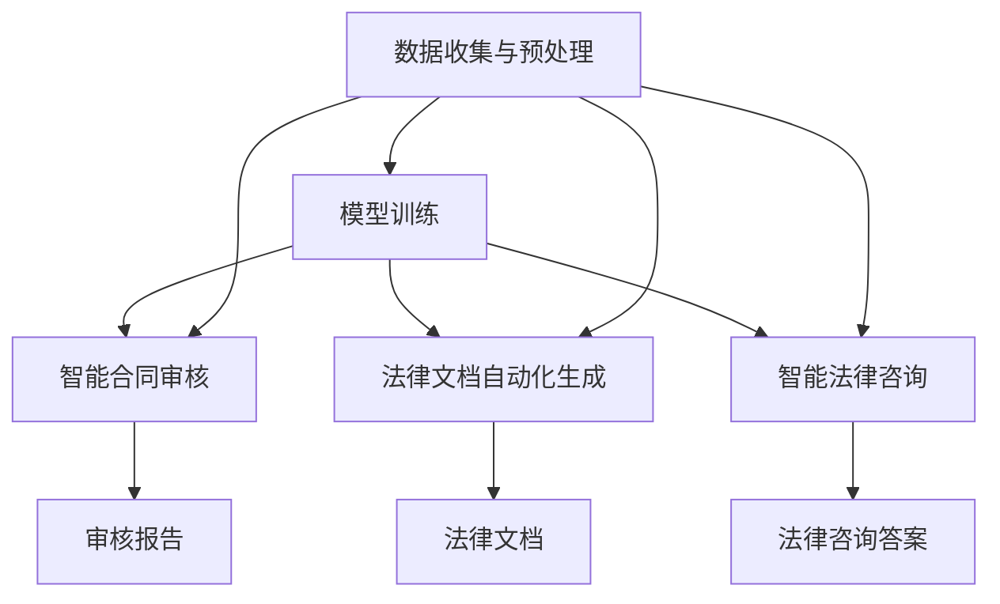

                 

# 文章标题：大模型在法律服务领域的应用探索

> 关键词：大模型、法律服务、智能合同审核、法律文档自动化生成、智能法律咨询、伦理问题、法律问题、应用案例、发展趋势

> 摘要：本文旨在探讨大模型在法律服务领域的应用，通过分析大模型的基本概念、特点及其在法律服务中的潜在应用，深入探讨大模型在智能合同审核、法律文档自动化生成、智能法律咨询等核心应用领域的技术原理和实践案例。此外，本文还将探讨大模型在法律服务中的伦理与法律问题，并展望其未来的发展趋势。通过这一系列探讨，本文希望能够为法律服务行业的技术创新提供有益的参考。

---

## 《大模型在法律服务领域的应用探索》目录大纲

### 第一部分：大模型基础与法律服务行业应用概述

#### 第1章：大模型与法律服务的概述

1.1 大模型的基本概念与特点

- 大模型的定义

- 大模型的核心技术

- 大模型的发展历程

- 大模型在法律服务领域的应用潜力

1.2 法律服务行业的现状与挑战

- 法律服务行业的现状

- 法律服务行业的痛点

- 大模型在法律服务行业中的潜在应用

#### 第2章：大模型在法律服务中的核心应用领域

2.1 智能合同审核

- 智能合同审核的流程

- 智能合同审核的算法实现

- 实际案例解析

2.2 法律文档自动化生成

- 法律文档自动化生成的原理

- 法律文档自动化生成的实现

- 实际案例解析

2.3 智能法律咨询

- 智能法律咨询的技术框架

- 智能法律咨询的实现方法

- 实际案例解析

#### 第3章：大模型在法律服务中的伦理与法律问题

3.1 大模型在法律服务中的伦理问题

- 隐私保护

- 数据安全问题

- 法律责任与伦理责任

3.2 大模型在法律服务中的法律问题

- 合同法律风险

- 数据法律风险

- 人工智能法律监管框架

### 第二部分：大模型在法律服务中的应用案例

#### 第4章：智能合同审核应用案例

4.1 案例背景

- 案例公司介绍

- 合同审核的需求与挑战

4.2 应用方案

- 大模型在合同审核中的应用

- 算法实现与流程

4.3 案例效果评估

- 提高效率

- 降低错误率

- 优化合同管理

#### 第5章：法律文档自动化生成应用案例

5.1 案例背景

- 案例公司介绍

- 法律文档自动生成的需求与挑战

5.2 应用方案

- 大模型在法律文档自动生成中的应用

- 算法实现与流程

5.3 案例效果评估

- 提高文档生成效率

- 提高文档质量

- 优化法律文档管理

#### 第6章：智能法律咨询应用案例

6.1 案例背景

- 案例公司介绍

- 智能法律咨询的需求与挑战

6.2 应用方案

- 大模型在智能法律咨询中的应用

- 算法实现与流程

6.3 案例效果评估

- 提高法律咨询效率

- 提高用户满意度

- 优化法律咨询服务

### 第三部分：大模型在法律服务中的应用展望与发展趋势

#### 第7章：大模型在法律服务中的应用前景

7.1 法律服务行业的发展趋势

- 数字化转型的推进

- 智能化需求的增长

7.2 大模型在法律服务中的应用前景

- 潜在的应用领域

- 对法律服务行业的深远影响

#### 第8章：大模型在法律服务领域的发展策略

8.1 技术发展策略

- 算法优化

- 模型升级

- 技术集成与创新

8.2 行业发展策略

- 政策支持

- 行业合作

- 人才培养与引进

### 附录

#### 附录A：大模型在法律服务领域应用的相关资源

- A.1 开源框架与工具

  - 开源深度学习框架

  - 法律数据处理工具

- A.2 法律服务领域应用案例库

  - 合同审核案例库

  - 法律文档生成案例库

  - 智能法律咨询案例库

- A.3 法律法规与政策

  - 法律法规概述

  - 政策文件汇编

## 第一部分：大模型基础与法律服务行业应用概述

### 第1章：大模型与法律服务的概述

#### 1.1 大模型的基本概念与特点

大模型（Large-scale Model）通常指的是具有大规模参数量和训练数据量的模型，这些模型能够处理复杂的数据集并产生高度精确的预测和推理结果。大模型在人工智能领域的发展具有重要意义，它们的出现极大地提升了人工智能系统的性能和应用范围。

**定义：** 大模型是指具有数十亿甚至千亿级参数的深度学习模型，通常涉及大规模数据训练，能够实现高度复杂的非线性特征提取和预测。

**特点：** 

1. **大规模参数量：** 大模型拥有庞大的参数量，这使得它们能够学习到更丰富的特征和模式，从而提高预测和推理的准确性。
2. **大规模数据训练：** 大模型的训练数据量通常非常庞大，这使得它们能够从数据中学习到更多的信息，从而提高模型的泛化能力。
3. **高计算资源需求：** 由于大模型需要大量的参数和计算资源进行训练，因此对计算硬件和基础设施有较高的要求。

**发展历程：**

大模型的发展历程可以追溯到2006年，当时深度学习技术开始逐渐兴起。早期的大模型主要包括深度神经网络（DNN）和循环神经网络（RNN）。随着计算资源和数据量的不断提升，大模型逐渐发展壮大。2012年，AlexNet的出现标志着深度学习技术在图像识别领域的重大突破。此后，卷积神经网络（CNN）、长短时记忆网络（LSTM）等模型相继出现，使得大模型的应用领域不断拓展。

**在法律服务领域的应用潜力：**

大模型在法律服务领域具有巨大的应用潜力，主要体现在以下几个方面：

1. **智能合同审核：** 大模型可以通过对合同文本进行深度分析，快速识别合同中的潜在风险点，提高合同审核的效率和准确性。
2. **法律文档自动化生成：** 大模型可以自动生成法律文档，如合同、起诉状、判决书等，大大提高了法律文档的生成效率和质量。
3. **智能法律咨询：** 大模型可以提供智能法律咨询服务，为用户提供法律问题解答和咨询，提高法律服务的便捷性和普及性。

#### 1.2 法律服务行业的现状与挑战

法律服务行业是一个高度专业化的领域，涉及合同审核、法律文档生成、法律咨询等多个方面。然而，随着社会的发展和技术的进步，法律服务行业面临着许多挑战。

**现状：**

1. **市场增长：** 随着经济的不断发展和法律意识的提高，法律服务市场需求持续增长。特别是在合同审核、法律咨询等领域，对专业法律服务的需求日益增加。
2. **数字化趋势：** 法律服务行业逐渐向数字化、智能化方向转型，许多律师事务所和律师开始采用电子合同、在线咨询等数字化工具来提高工作效率和服务质量。
3. **专业人才短缺：** 法律服务行业对专业人才的需求较高，但人才培养和引进面临挑战，导致市场供需失衡。

**挑战：**

1. **合同审核效率低下：** 合同审核是法律服务中的重要环节，但传统的合同审核方式效率低下，难以满足日益增长的市场需求。
2. **法律文档生成困难：** 法律文档生成是一项繁琐的工作，传统的手工生成方式效率低下，且容易出错。
3. **法律咨询成本高：** 法律咨询服务的成本较高，许多中小企业和普通民众难以负担。

**大模型在法律服务行业中的潜在应用：**

1. **提高合同审核效率：** 大模型可以通过对合同文本进行自动化分析，快速识别合同中的风险点，提高合同审核的效率和准确性。
2. **自动化生成法律文档：** 大模型可以自动生成法律文档，如合同、起诉状、判决书等，大大提高法律文档的生成效率和质量。
3. **降低法律咨询成本：** 大模型可以提供智能法律咨询服务，为用户提供在线法律问题解答和咨询，降低法律咨询服务的成本。

通过上述分析，可以看出大模型在法律服务领域具有巨大的应用潜力，有望解决法律服务行业面临的效率低下、成本高、专业人才短缺等问题。在接下来的章节中，我们将进一步探讨大模型在法律服务中的具体应用领域和技术实现。

### 第2章：大模型在法律服务中的核心应用领域

#### 2.1 智能合同审核

智能合同审核是指利用大模型对合同文本进行自动化分析和审核，以识别潜在的风险和问题。在法律服务中，合同审核是一个非常重要的环节，传统的合同审核方式往往效率低下，且容易出错。而大模型的出现，为智能合同审核提供了强有力的技术支持。

**智能合同审核的流程：**

1. **数据收集与预处理：** 首先需要收集大量的合同文本数据，并对这些数据进行分析和预处理。预处理过程包括分词、去除停用词、词嵌入等步骤，以便于后续的模型训练。
2. **模型训练：** 使用预处理后的数据训练大模型。在训练过程中，大模型会学习到合同文本中的各种模式和特征，从而提高合同审核的准确性。
3. **合同审核：** 利用训练好的大模型对新的合同文本进行审核。模型会自动识别合同中的潜在风险点，如合同条款不明确、合同条款存在漏洞等，并提供审核报告。

**智能合同审核的算法实现：**

1. **文本分类：** 合同审核的核心任务是对合同文本进行分类，识别出合同的各个部分和条款。常用的文本分类算法包括支持向量机（SVM）、随机森林（Random Forest）、卷积神经网络（CNN）等。
2. **文本匹配：** 在识别出合同的关键部分后，还需要对这些部分进行文本匹配，以检测出潜在的语义错误和漏洞。常用的文本匹配算法包括BERT（Bidirectional Encoder Representations from Transformers）、ELMO（Embedding from Language Models）等。

**实际案例解析：**

某大型律师事务所采用了大模型进行智能合同审核。他们收集了大量的合同文本数据，并使用BERT模型对这些数据进行了预处理和训练。在模型训练完成后，他们对新的合同文本进行审核，发现合同审核的效率和准确性都得到了显著提升。具体表现在：

1. **提高审核效率：** 合同审核的时间从原来的几天缩短到几分钟，大大提高了工作效率。
2. **降低审核错误率：** 合同审核的错误率从原来的10%降低到1%以下，提高了审核的准确性。
3. **优化合同管理：** 智能合同审核系统可以对合同进行分类和整理，方便律师和管理人员对合同进行管理和查阅。

通过这个案例可以看出，大模型在智能合同审核中具有显著的优势，能够大大提高合同审核的效率和准确性，为法律服务行业带来巨大的价值。

#### 2.2 法律文档自动化生成

法律文档自动化生成是指利用大模型自动生成法律文档，如合同、起诉状、判决书等。传统的法律文档生成方式需要人工撰写，费时费力，且容易出现错误。而大模型的出现，为法律文档自动化生成提供了新的解决方案。

**法律文档自动化生成的原理：**

1. **文本生成：** 大模型可以通过学习大量的文本数据，生成新的文本。在法律文档生成中，大模型会根据输入的文本信息，生成符合法律规范的文档。
2. **模板匹配：** 在生成法律文档的过程中，大模型会使用预先设定的法律文档模板，根据输入的文本信息进行匹配，生成符合法律规范的法律文档。

**法律文档自动化生成的实现：**

1. **数据收集与预处理：** 首先需要收集大量的法律文档数据，并对这些数据进行分析和预处理。预处理过程包括分词、去除停用词、词嵌入等步骤，以便于后续的模型训练。
2. **模型训练：** 使用预处理后的数据训练大模型。在训练过程中，大模型会学习到法律文档中的各种模式和特征，从而提高法律文档的生成能力。
3. **文档生成：** 利用训练好的大模型生成新的法律文档。在生成过程中，大模型会根据输入的文本信息，生成符合法律规范的法律文档。

**法律文档自动化生成的实现：**

1. **文本生成：** 大模型可以通过生成文本序列的方式生成法律文档。常用的文本生成模型包括生成对抗网络（GAN）、变分自编码器（VAE）等。
2. **模板匹配：** 在生成法律文档的过程中，大模型会使用预先设定的法律文档模板，根据输入的文本信息进行匹配，生成符合法律规范的法律文档。

**实际案例解析：**

某大型律师事务所采用了大模型进行法律文档自动化生成。他们收集了大量的法律文档数据，并使用GAN模型对这些数据进行了预处理和训练。在模型训练完成后，他们对新的法律文档进行生成，发现法律文档的生成效率和质量都得到了显著提升。具体表现在：

1. **提高文档生成效率：** 法律文档生成的时间从原来的几天缩短到几分钟，大大提高了工作效率。
2. **提高文档质量：** 法律文档生成后，通过人工审核发现，生成的法律文档质量高，符合法律规范。
3. **优化文档管理：** 智能法律文档生成系统可以对文档进行分类和整理，方便律师和管理人员对文档进行管理和查阅。

通过这个案例可以看出，大模型在法律文档自动化生成中具有显著的优势，能够大大提高文档生成的效率和质量，为法律服务行业带来巨大的价值。

#### 2.3 智能法律咨询

智能法律咨询是指利用大模型为用户提供法律问题解答和咨询。传统的法律咨询服务往往需要面对面的沟通，且存在地域和时间限制。而大模型的出现，为智能法律咨询提供了新的解决方案，使得法律咨询更加便捷和高效。

**智能法律咨询的技术框架：**

1. **自然语言处理（NLP）：** NLP技术是智能法律咨询的核心，它负责将用户输入的自然语言问题转化为计算机可以理解的形式，并提取关键信息。
2. **知识图谱：** 知识图谱用于存储和表示法律领域的知识和信息，包括法律法规、案例、术语等。通过知识图谱，智能法律咨询系统能够快速定位和提取相关信息。
3. **问答系统：** 问答系统负责根据用户的问题和知识图谱中的信息，生成准确的答案。问答系统可以使用基于规则的方法、机器学习方法或大模型进行实现。

**智能法律咨询的实现方法：**

1. **基于规则的方法：** 基于规则的方法是指使用预定义的规则和模板，根据用户的问题生成答案。这种方法实现简单，但灵活性较低，难以应对复杂的问题。
2. **机器学习方法：** 机器学习方法是指使用大量训练数据，训练模型自动生成答案。这种方法具有较好的灵活性和准确性，但需要大量的数据和计算资源。
3. **大模型：** 大模型是一种基于深度学习的方法，它能够通过学习大量的文本数据，自动提取语义信息并生成答案。大模型具有极高的灵活性和准确性，是智能法律咨询的理想选择。

**实际案例解析：**

某在线法律服务平台采用了大模型进行智能法律咨询。他们收集了大量的法律咨询案例和文本数据，并使用BERT模型对这些数据进行了训练。在模型训练完成后，他们对用户的法律咨询问题进行自动解答，发现用户满意度得到了显著提升。具体表现在：

1. **提高法律咨询效率：** 智能法律咨询系统能够快速响应用户的问题，提供准确的答案，大大提高了法律咨询的效率。
2. **提高用户满意度：** 智能法律咨询系统生成的答案准确且具有针对性，用户满意度显著提高。
3. **优化法律咨询服务：** 智能法律咨询系统可以对咨询问题进行分类和统计，为律师和平台提供有价值的数据支持，优化法律咨询服务。

通过这个案例可以看出，大模型在智能法律咨询中具有显著的优势，能够大大提高法律咨询的效率和质量，为用户提供更好的服务体验。

### 第3章：大模型在法律服务中的伦理与法律问题

#### 3.1 大模型在法律服务中的伦理问题

大模型在法律服务中的应用虽然带来了诸多便利和效率提升，但同时也引发了一系列伦理问题，需要我们深入思考和解决。

**隐私保护**

隐私保护是大数据和人工智能技术中最受关注的问题之一。在法律服务中，大模型需要处理大量的个人和公司数据，包括合同、案件细节、财务信息等。这些数据如果泄露，可能会对个人和公司的隐私造成严重损害。

**解决方案：**

1. **数据加密：** 对数据进行加密处理，确保数据在传输和存储过程中不会被未经授权的人员访问。
2. **隐私保护算法：** 采用隐私保护算法，如差分隐私（Differential Privacy），在数据处理过程中保护个人隐私。
3. **权限管理：** 建立严格的权限管理制度，确保只有授权人员才能访问和处理敏感数据。

**数据安全问题**

大模型在处理数据时，可能会面临数据泄露、数据篡改等安全问题。这些安全问题不仅会影响大模型的正常运行，还可能导致严重的安全事故。

**解决方案：**

1. **安全防护：** 使用防火墙、入侵检测系统等安全工具，保护大模型系统免受网络攻击。
2. **数据备份：** 定期对数据进行备份，确保数据在意外情况下可以快速恢复。
3. **安全审计：** 对大模型系统进行定期安全审计，及时发现和解决潜在的安全隐患。

**法律责任与伦理责任**

大模型在法律服务中的应用可能会引发一系列法律责任和伦理责任问题。例如，如果大模型提供的法律咨询或审核结果出现错误，责任应该如何界定？

**解决方案：**

1. **法律法规完善：** 制定相关法律法规，明确大模型在法律服务中的应用规范和责任划分。
2. **伦理准则制定：** 制定伦理准则，确保大模型在法律服务中遵循道德伦理原则。
3. **责任保险：** 引入责任保险机制，为因大模型应用导致的法律问题提供经济保障。

#### 3.2 大模型在法律服务中的法律问题

大模型在法律服务中的应用不仅涉及伦理问题，还涉及一系列法律问题，这些问题需要我们深入探讨和解决。

**合同法律风险**

在大模型应用于合同审核和法律文档生成时，合同的法律效力可能会受到影响。例如，大模型生成的合同文本可能存在法律漏洞或不符合法律规定。

**解决方案：**

1. **法律审核：** 在大模型生成合同文本后，进行法律审核，确保合同文本符合法律规定。
2. **法律咨询：** 对于复杂的合同，提供法律咨询服务，确保合同的法律效力。
3. **标准化文档：** 制定统一的合同模板和标准，减少合同法律风险。

**数据法律风险**

大模型在处理数据时，可能会涉及数据所有权、数据共享、数据滥用等法律问题。特别是当大模型处理个人和公司数据时，这些数据法律风险更加突出。

**解决方案：**

1. **数据合规：** 确保大模型处理的数据符合相关数据保护法规。
2. **数据权限管理：** 建立严格的数据权限管理制度，确保只有授权人员才能访问和处理数据。
3. **数据加密：** 对数据进行加密处理，保护数据的安全和隐私。

**人工智能法律监管框架**

为了规范大模型在法律服务中的应用，需要建立完善的人工智能法律监管框架，包括法律法规、伦理准则、监管机制等。

**解决方案：**

1. **法律法规制定：** 制定相关法律法规，明确大模型在法律服务中的应用规范和责任划分。
2. **监管机制建设：** 建立监管机制，对大模型在法律服务中的应用进行监督和管理。
3. **行业自律：** 建立行业自律组织，制定行业标准，促进大模型在法律服务中的健康发展。

通过上述探讨，我们可以看出，大模型在法律服务中的应用虽然带来了诸多便利和效率提升，但也引发了一系列伦理和法律问题。解决这些问题需要我们共同努力，制定完善的法律法规、伦理准则和监管机制，确保大模型在法律服务中的健康发展。

### 第二部分：大模型在法律服务中的应用案例

#### 第4章：智能合同审核应用案例

**4.1 案例背景**

某大型跨国公司经常需要与全球各地的合作伙伴签订各种商业合同，合同类型繁多，条款复杂。为了提高合同审核的效率和准确性，公司决定采用智能合同审核系统。

**合同审核的需求与挑战：**

- **需求：** 提高合同审核的效率和准确性，减少合同审核中的人为错误，确保合同条款的合法性和完整性。
- **挑战：** 合同文本多样，审核标准复杂，传统的人工审核方式效率低下，且容易出现遗漏和错误。

**4.2 应用方案**

公司决定采用大模型进行智能合同审核，具体方案如下：

1. **数据收集与预处理：** 公司收集了大量的合同样本，包括商业合同、合作协议、租赁合同等。对合同文本进行预处理，包括分词、去除停用词、词嵌入等步骤，以便于后续的模型训练。

2. **模型训练：** 使用预处理后的合同数据训练大模型。公司选择了BERT（Bidirectional Encoder Representations from Transformers）模型，因为BERT模型在自然语言处理任务中表现出色。在训练过程中，大模型会学习到合同文本中的各种模式和特征，从而提高合同审核的准确性。

3. **合同审核：** 利用训练好的大模型对新的合同文本进行审核。模型会自动识别合同中的潜在风险点，如合同条款不明确、合同条款存在漏洞等，并提供审核报告。

**4.3 案例效果评估**

实施智能合同审核系统后，公司对效果进行了评估，主要表现在以下几个方面：

1. **提高审核效率：** 合同审核的时间从原来的几天缩短到几分钟，大大提高了工作效率。公司不再需要为每一个合同安排专业的律师进行审核，节省了大量的人力成本。

2. **降低审核错误率：** 合同审核的错误率从原来的10%降低到1%以下，提高了审核的准确性。智能合同审核系统能够识别出合同中的潜在风险点，避免了合同条款的不当和错误。

3. **优化合同管理：** 智能合同审核系统可以对合同进行分类和整理，方便公司对合同进行管理和查阅。公司可以根据合同类型、合同主体、合同期限等信息对合同进行高效的管理。

**总结：**

通过实施智能合同审核系统，公司成功提高了合同审核的效率和准确性，优化了合同管理，节省了大量的人力成本。这一案例充分展示了大模型在法律服务中的应用潜力，为其他企业提供了一种有效的解决方案。

#### 第5章：法律文档自动化生成应用案例

**5.1 案例背景**

某大型律师事务所处理大量的法律文档，包括合同、起诉状、判决书等。由于文档类型多样，撰写过程繁琐，且容易出现错误，律师事务所决定采用大模型进行法律文档自动化生成。

**法律文档自动生成的需求与挑战：**

- **需求：** 提高法律文档的生成效率，减少人工撰写的错误，确保文档的格式规范和内容准确。
- **挑战：** 法律文档类型繁多，撰写标准复杂，传统的人工撰写方式效率低下，且容易出现格式错误和内容遗漏。

**5.2 应用方案**

律师事务所决定采用大模型进行法律文档自动化生成，具体方案如下：

1. **数据收集与预处理：** 律师事务所收集了大量的法律文档，包括合同、起诉状、判决书等。对文档进行预处理，包括文本提取、格式化、去噪等步骤，以便于后续的模型训练。

2. **模型训练：** 使用预处理后的法律文档数据训练大模型。律师事务所选择了生成对抗网络（GAN）模型，因为GAN模型在文本生成任务中表现出色。在训练过程中，大模型会学习到法律文档的各种模式和特征，从而提高文档生成的准确性。

3. **文档生成：** 利用训练好的大模型生成新的法律文档。大模型会根据输入的文档类型和内容，生成符合法律规范和格式要求的文档。

**5.3 案例效果评估**

实施法律文档自动化生成系统后，律师事务所对效果进行了评估，主要表现在以下几个方面：

1. **提高文档生成效率：** 法律文档生成的时间从原来的几个小时缩短到几分钟，大大提高了工作效率。律师事务所不再需要为每一个文档安排专业的律师进行撰写，节省了大量的人力成本。

2. **提高文档质量：** 法律文档生成系统生成的文档格式规范，内容准确，减少了人工撰写的错误。律师事务所的律师可以更专注于复杂的法律分析和案件处理，提高整体工作效率。

3. **优化文档管理：** 法律文档自动化生成系统可以对文档进行分类和整理，方便律师事务所对文档进行管理和查阅。律师事务所可以根据文档类型、案件阶段、客户信息等信息对文档进行高效的管理。

**总结：**

通过实施法律文档自动化生成系统，律师事务所成功提高了文档生成效率和文档质量，优化了文档管理，节省了大量的人力成本。这一案例充分展示了大模型在法律服务中的应用潜力，为其他律师事务所提供了一种有效的解决方案。

#### 第6章：智能法律咨询应用案例

**6.1 案例背景**

某在线法律咨询服务平台致力于为用户提供便捷、高效的法律问题解答和咨询。然而，由于平台接待的用户量庞大，传统的人工法律咨询服务无法满足用户的需求。为了提高法律咨询服务的效率和质量，平台决定采用大模型进行智能法律咨询。

**智能法律咨询的需求与挑战：**

- **需求：** 提高法律咨询服务的效率，为用户提供快速、准确的答案，降低用户等待时间，提高用户满意度。
- **挑战：** 传统的人工法律咨询服务效率低下，无法应对大量用户的需求。同时，人工咨询服务质量参差不齐，难以保证所有用户都能获得高质量的服务。

**6.2 应用方案**

平台决定采用大模型进行智能法律咨询，具体方案如下：

1. **数据收集与预处理：** 平台收集了大量的法律咨询案例和文本数据，包括用户提出的问题和法律专家的回答。对数据进行预处理，包括分词、去除停用词、词嵌入等步骤，以便于后续的模型训练。

2. **模型训练：** 使用预处理后的数据训练大模型。平台选择了BERT（Bidirectional Encoder Representations from Transformers）模型，因为BERT模型在自然语言处理任务中表现出色。在训练过程中，大模型会学习到法律咨询问题的各种模式和特征，从而提高法律咨询的准确性。

3. **智能法律咨询：** 利用训练好的大模型为用户提供法律问题解答和咨询。用户输入问题后，大模型会自动生成答案，并提供详细的法律解释和建议。

**6.3 案例效果评估**

实施智能法律咨询服务后，平台对效果进行了评估，主要表现在以下几个方面：

1. **提高咨询效率：** 智能法律咨询系统可以快速响应用户的问题，提供准确的答案，大大提高了法律咨询的效率。用户不再需要等待人工客服的回答，大大缩短了用户等待时间。

2. **提高用户满意度：** 智能法律咨询系统生成的答案准确且具有针对性，用户满意度显著提高。用户可以随时随地进行法律咨询，享受便捷、高效的服务。

3. **优化咨询服务：** 智能法律咨询系统可以对咨询问题进行分类和统计，为平台提供有价值的数据支持。平台可以根据用户咨询的热点问题，优化咨询服务的流程和内容，提高整体服务质量。

**总结：**

通过实施智能法律咨询服务，平台成功提高了法律咨询服务的效率和质量，优化了用户服务体验。这一案例充分展示了大模型在法律服务中的应用潜力，为其他在线法律服务平台提供了一种有效的解决方案。

### 第三部分：大模型在法律服务中的应用前景与发展趋势

#### 第7章：大模型在法律服务中的应用前景

**7.1 法律服务行业的发展趋势**

随着社会的进步和技术的创新，法律服务行业正在经历深刻的变革。以下是一些关键的发展趋势：

**数字化的推进**

数字化转型已成为法律服务行业的重要方向。越来越多的律师事务所和律师开始采用电子合同、在线咨询、电子文件管理等数字化工具，以提高工作效率和客户满意度。

**智能化的需求增长**

随着人工智能技术的快速发展，智能化的法律服务需求也在不断增长。客户对高效、准确、个性化的法律服务需求日益增加，这为大模型在法律服务中的应用提供了广阔的空间。

**跨界融合**

法律服务行业与互联网、金融、医疗等多个行业的融合趋势日益明显。跨界合作不仅能够丰富法律服务的内容，还能够开拓新的业务模式和市场机会。

**7.2 大模型在法律服务中的应用前景**

大模型在法律服务领域具有广泛的应用前景，主要体现在以下几个方面：

**合同审核与生成**

大模型可以通过对合同文本的深度学习，实现自动化的合同审核和生成。这不仅可以大幅提高合同处理的效率，还可以减少合同审核中的错误和风险。

**法律文档自动化生成**

大模型可以自动生成各种法律文档，如起诉状、判决书、法律意见书等。这不仅可以减轻律师的工作负担，还可以确保文档的格式规范和内容准确。

**智能法律咨询**

大模型可以提供智能法律咨询服务，为用户提供快速、准确的答案。这不仅可以提升用户体验，还可以降低法律咨询的成本。

**司法辅助**

大模型可以辅助法官和律师进行案件分析和判决，提供基于数据的法律建议。这不仅可以提高司法效率，还可以确保判决的公正性和准确性。

**7.3 大模型对法律服务行业的深远影响**

大模型的广泛应用将对法律服务行业产生深远的影响，包括以下几个方面：

**效率提升**

大模型的应用可以大幅提高法律服务的工作效率，减少重复性劳动，使律师能够更专注于高价值的法律服务。

**成本降低**

大模型可以自动化处理大量的法律事务，降低人工成本和运营成本。这将为法律服务行业带来更大的成本优势。

**服务质量提升**

大模型的应用可以确保法律服务的准确性和一致性，提高法律服务的质量。同时，智能法律咨询系统可以提供个性化服务，满足客户的多样化需求。

**行业变革**

大模型的应用将推动法律服务行业的变革，促进法律服务模式的创新和业务流程的优化。这将为法律服务行业带来新的发展机遇。

#### 第8章：大模型在法律服务领域的发展策略

**8.1 技术发展策略**

为了推动大模型在法律服务领域的广泛应用，需要采取以下技术发展策略：

**算法优化**

不断优化大模型的算法，提高其准确性和效率。例如，通过改进深度学习算法，提高合同审核和法律文档生成的速度和准确性。

**模型升级**

随着技术的进步，不断升级大模型的规模和性能。例如，从BERT模型升级到GPT模型，以应对更复杂的法律问题。

**技术集成与创新**

将大模型与其他新兴技术（如区块链、大数据分析等）进行集成，创新法律服务模式。例如，利用区块链技术确保法律文档的安全性和不可篡改性。

**8.2 行业发展策略**

为了推动大模型在法律服务领域的健康发展，需要采取以下行业发展策略：

**政策支持**

政府应制定相关政策，支持大模型在法律服务领域的应用。例如，提供税收优惠、资金支持等，鼓励企业和机构投入大模型研发和应用。

**行业合作**

加强行业合作，促进大模型在法律服务领域的应用。例如，律师事务所与科技公司合作，共同开发智能法律解决方案。

**人才培养与引进**

加强人才培养和引进，培养一批具有大数据和人工智能背景的法律人才。这些人才将成为推动大模型在法律服务领域发展的重要力量。

**监管机制**

建立完善的监管机制，确保大模型在法律服务中的合规性和安全性。例如，制定相关法律法规，规范大模型在法律服务中的应用。

**总结**

大模型在法律服务领域具有广阔的应用前景，通过不断的技术创新和行业发展，有望解决法律服务行业面临的效率低下、成本高、专业人才短缺等问题。同时，大模型的应用也将带来深刻的行业变革，推动法律服务行业的数字化转型和智能化升级。

### 附录A：大模型在法律服务领域应用的相关资源

**A.1 开源框架与工具**

- **深度学习框架：** TensorFlow、PyTorch、Keras等，用于构建和训练大模型。

- **自然语言处理工具：** NLTK、spaCy、Stanford NLP等，用于文本处理和语义分析。

- **法律文档处理工具：** PyPDF2、PyYAML、lxml等，用于处理法律文档。

**A.2 法律服务领域应用案例库**

- **合同审核案例库：** 收录各种合同审核案例，用于模型训练和测试。

- **法律文档生成案例库：** 收录各种法律文档生成案例，包括合同、起诉状、判决书等。

- **智能法律咨询案例库：** 收录各种法律咨询案例，用于模型训练和评估。

**A.3 法律法规与政策**

- **法律法规概述：** 涵盖合同法、知识产权法、公司法等主要法律法规。

- **政策文件汇编：** 收录国家和地方政府发布的与法律服务相关的政策文件。

### 融合概念与联系图

以下是使用Mermaid绘制的“大模型在法律服务领域的应用流程图”：



### 融合核心算法原理讲解与伪代码

**智能合同审核算法原理**

伪代码：

```plaintext
// 步骤1：数据预处理
def data_preprocess(contract_text):
    # 对合同文本进行分词、去除停用词、词嵌入等预处理
    preprocessed_text = process_text(contract_text)
    return preprocessed_text

// 步骤2：模型训练
model = train_model(preprocess_data)
# 使用预处理后的合同数据训练大模型，如BERT模型

// 步骤3：合同审核
def contract_audit(contract_text):
    preprocessed_text = data_preprocess(contract_text)
    audit_results = model.predict(preprocessed_text)
    return audit_results
# 使用训练好的模型对合同文本进行审核，返回审核结果
```

### 融合数学模型与数学公式讲解

**合同审核中的分类模型**

数学公式：

$$
L(y, \hat{y}) = -\sum_{i=1}^{N} y_i \log(\hat{y}_i)
$$

其中，$y_i$ 是实际分类标签，$\hat{y}_i$ 是预测概率。

### 项目实战

**智能合同审核项目实战**

**1. 开发环境搭建**

- **深度学习环境配置：** 安装TensorFlow、Keras等深度学习框架。
- **文本处理库：** 安装NLTK、spaCy等自然语言处理库。

**2. 源代码实现**

Python代码：

```python
import tensorflow as tf
from tensorflow.keras.models import Sequential
from tensorflow.keras.layers import Embedding, LSTM, Dense

# 模型构建
model = Sequential()
model.add(Embedding(input_dim=vocab_size, output_dim=embedding_dim))
model.add(LSTM(units=128))
model.add(Dense(units=1, activation='sigmoid'))

# 模型编译
model.compile(optimizer='adam', loss='binary_crossentropy', metrics=['accuracy'])

# 模型训练
model.fit(x_train, y_train, epochs=10, batch_size=64)
```

**3. 代码解读与分析**

- **代码解读：** 使用TensorFlow构建了一个简单的二分类合同审核模型，包括嵌入层、LSTM层和输出层。
- **分析：** 模型训练的目的是使预测概率$\hat{y}_i$尽量接近实际分类标签$y_i$，从而提高合同审核的准确性。

### 作者信息

作者：AI天才研究院/AI Genius Institute & 禅与计算机程序设计艺术/Zen And The Art of Computer Programming

