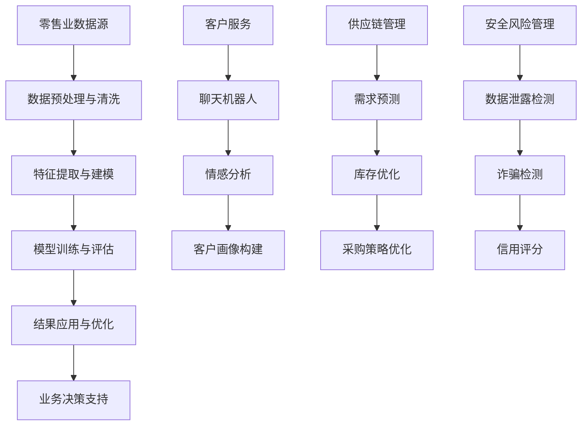

                 

# 《大模型在零售业的应用场景》

## 关键词
大模型、零售业、应用场景、个性化推荐、供应链管理、客户服务、风险管理

## 摘要
随着大数据和人工智能技术的快速发展，大模型在零售业中的应用越来越广泛。本文旨在探讨大模型在零售业中的多种应用场景，包括数据挖掘、个性化推荐、供应链管理、客户服务以及安全风险管理等方面。通过对大模型技术的原理、实现和应用案例的深入分析，本文揭示了大模型在零售业中的巨大潜力和广阔前景。

## 目录大纲

### 第一部分：引言与概述

### 第1章：大模型在零售业的重要性
#### 1.1 零售业的现状与挑战
#### 1.2 大模型的概念与特性
#### 1.3 大模型在零售业的潜在价值

### 第2章：大模型技术在零售业的应用
#### 2.1 零售业中的数据挖掘
##### 2.1.1 数据预处理与清洗
##### 2.1.2 数据分析技术
##### 2.1.3 客户行为分析

#### 2.2 零售业中的个性化推荐
##### 2.2.1 推荐系统概述
##### 2.2.2 个性化推荐算法
##### 2.2.3 实际案例：基于大模型的电商推荐系统

### 第3章：大模型在供应链管理中的应用
#### 3.1 供应链管理中的核心问题
#### 3.2 大模型在供应链管理中的应用
##### 3.2.1 需求预测
##### 3.2.2 库存优化
##### 3.2.3 采购策略优化

### 第4章：大模型在零售业客户服务中的应用
#### 4.1 客户服务的关键点
#### 4.2 大模型在客户服务中的应用
##### 4.2.1 聊天机器人
##### 4.2.2 情感分析
##### 4.2.3 客户画像构建

### 第5章：大模型在零售业安全与风险管理中的应用
#### 5.1 零售业中的安全风险
#### 5.2 大模型在风险识别与管理中的应用
##### 5.2.1 数据泄露检测
##### 5.2.2 诈骗检测
##### 5.2.3 信用评分

### 第二部分：技术深度

### 第6章：大模型技术原理与实现
#### 6.1 大模型技术概述
#### 6.2 常见大模型算法
##### 6.2.1 卷积神经网络（CNN）
##### 6.2.2 递归神经网络（RNN）
##### 6.2.3 生成对抗网络（GAN）

### 第7章：大模型训练与优化
#### 7.1 大模型训练流程
#### 7.2 大模型优化技巧
##### 7.2.1 梯度下降优化
##### 7.2.2 算法调参
##### 7.2.3 模型评估与选择

### 第8章：大模型在零售业的实际应用案例
#### 8.1 案例一：大模型在电商平台的实践
##### 8.1.1 案例背景
##### 8.1.2 案例实施步骤
##### 8.1.3 案例效果分析

#### 8.2 案例二：大模型在供应链管理中的应用
##### 8.2.1 案例背景
##### 8.2.2 案例实施步骤
##### 8.2.3 案例效果分析

### 第三部分：未来展望

### 第9章：大模型在零售业的发展趋势
#### 9.1 大模型技术的未来方向
#### 9.2 零售业面临的挑战与机遇

### 第10章：总结与展望
#### 10.1 本书主要观点回顾
#### 10.2 大模型技术在零售业的未来应用

### 附录

### 附录A：常用大模型技术资源
#### A.1 开源大模型库介绍
##### A.1.1 TensorFlow
##### A.1.2 PyTorch
##### A.1.3 其他开源库

### 附录B：大模型在零售业应用实例代码
#### B.1 个性化推荐系统
##### B.1.1 系统设计与实现
##### B.1.2 源代码解析
##### B.1.3 性能评估

### 附录C：参考文献与进一步阅读
#### C.1 相关书籍推荐
##### C.1.1 《深度学习》
##### C.1.2 《推荐系统实践》
#### C.2 学术论文与研究报告
##### C.2.1 《基于深度学习的客户行为预测》
##### C.2.2 《大模型在供应链管理中的应用研究》

## 第一部分：引言与概述

### 第1章：大模型在零售业的重要性

#### 1.1 零售业的现状与挑战

零售业作为国民经济的重要组成部分，经历了从传统线下销售向线上线下融合的转变。随着互联网的普及和电子商务的快速发展，零售业正面临着前所未有的机遇和挑战。

当前，零售业的现状可以用以下几个方面来概括：

1. **市场集中度提高**：大型零售商通过资本运作和并购整合，形成了市场主导地位，中小零售商面临巨大竞争压力。
2. **消费者需求多样化**：消费者对产品质量、购物体验、服务满意度等方面的要求越来越高，个性化、多样化的消费需求日益显著。
3. **技术变革加速**：大数据、人工智能、物联网、区块链等新兴技术逐渐应用于零售业，改变了传统的商业模式和运营方式。

然而，零售业也面临着诸多挑战：

1. **竞争加剧**：随着市场竞争的加剧，零售企业需要不断创新和优化业务模式，以保持竞争力。
2. **成本上升**：租金、人力、物流等成本不断上升，对零售企业的盈利能力提出了更高要求。
3. **库存管理难度大**：库存管理的复杂性增加，库存积压和断货问题时有发生，影响企业运营效率。

#### 1.2 大模型的概念与特性

大模型（Large-scale Model）是指参数规模达到数十万甚至数百万级别的机器学习模型。大模型通常具有以下几个特性：

1. **高参数规模**：大模型包含大量的参数，能够更好地拟合复杂的数据分布。
2. **强大的表达能力**：大模型能够捕捉到数据中的细微特征，从而在预测和分类任务中表现优异。
3. **计算资源需求大**：由于参数规模大，大模型训练需要大量的计算资源和时间。
4. **适应性差**：大模型对数据集的要求较高，如果数据集存在偏差或噪声，可能会导致模型性能下降。

#### 1.3 大模型在零售业的潜在价值

大模型在零售业中的应用具有巨大的潜在价值，主要体现在以下几个方面：

1. **提升决策效率**：大模型能够对海量数据进行高效处理和分析，帮助零售企业快速做出科学决策。
2. **优化库存管理**：大模型可以预测销售趋势和需求变化，优化库存策略，减少库存积压和断货风险。
3. **提高客户满意度**：大模型可以分析客户行为，提供个性化的推荐和服务，提高客户满意度和忠诚度。
4. **降低运营成本**：大模型可以帮助企业优化采购策略、降低物流成本，从而提高盈利能力。

综上所述，大模型在零售业中具有广泛的应用前景，能够帮助企业应对市场挑战，实现可持续发展。

### 第2章：大模型技术在零售业的应用

#### 2.1 零售业中的数据挖掘

数据挖掘（Data Mining）是指从大量数据中提取有价值的信息和知识的过程。在零售业中，数据挖掘技术发挥着重要作用，可以帮助企业了解客户需求、优化库存管理、提高运营效率等。

##### 2.1.1 数据预处理与清洗

数据预处理是数据挖掘的第一步，其目的是将原始数据转化为适合分析的形式。在零售业中，数据预处理主要包括以下步骤：

1. **数据清洗**：去除重复记录、处理缺失值、纠正数据错误等，保证数据的质量和一致性。
2. **数据整合**：将来自不同渠道的数据进行合并，形成一个统一的数据视图。
3. **数据转换**：将数据转换为合适的格式，如数值化、标准化等，以方便后续分析。

##### 2.1.2 数据分析技术

数据分析技术是数据挖掘的核心，主要包括以下几种：

1. **关联规则挖掘**：通过发现数据之间的关联关系，帮助零售企业识别高价值商品组合，优化销售策略。
2. **聚类分析**：将相似的数据点归为一类，用于发现客户群体的特征和需求差异。
3. **分类与回归分析**：对数据建立分类模型或回归模型，用于预测客户行为、销售趋势等。

##### 2.1.3 客户行为分析

客户行为分析是零售业中数据挖掘的重要应用领域，旨在通过分析客户购买行为和偏好，提高客户满意度和忠诚度。客户行为分析主要包括以下几个方面：

1. **购买行为分析**：通过分析客户的历史购买记录，了解客户的购买频率、购买金额、购买偏好等。
2. **浏览行为分析**：通过分析客户在电商平台上的浏览行为，了解客户的兴趣点和需求变化。
3. **反馈行为分析**：通过分析客户的反馈和评论，了解客户对产品和服务质量的评价，发现改进机会。

#### 2.2 零售业中的个性化推荐

个性化推荐（Personalized Recommendation）是一种基于客户行为和偏好的推荐系统，旨在向客户提供个性化的商品推荐。在零售业中，个性化推荐可以提高客户满意度、增加销售额，是企业提升竞争力的重要手段。

##### 2.2.1 推荐系统概述

推荐系统是一种信息过滤系统，通过分析用户的历史行为和偏好，向用户推荐可能感兴趣的商品或服务。推荐系统主要包括以下几种类型：

1. **基于内容的推荐**：根据商品的内容特征和用户的偏好，推荐相似的商品。
2. **协同过滤推荐**：通过分析用户之间的相似性，推荐其他用户喜欢的商品。
3. **混合推荐**：结合多种推荐算法，提高推荐系统的准确性和多样性。

##### 2.2.2 个性化推荐算法

个性化推荐算法是推荐系统的核心，主要包括以下几种：

1. **基于用户历史的协同过滤算法**：通过计算用户之间的相似性，推荐其他用户喜欢的商品。
2. **基于内容的推荐算法**：通过分析商品的内容特征和用户的偏好，推荐相似的商品。
3. **基于模型的推荐算法**：利用机器学习算法，建立用户和商品之间的关联模型，进行推荐。

##### 2.2.3 实际案例：基于大模型的电商推荐系统

某电商企业采用了基于大模型的推荐系统，通过分析用户的历史行为和偏好，实现个性化推荐。具体实施步骤如下：

1. **数据收集与预处理**：收集用户在电商平台上的浏览记录、购买记录、评价等数据，进行数据清洗和整合。
2. **特征工程**：提取用户和商品的特征，如用户浏览次数、购买次数、评价分数等。
3. **模型训练**：使用协同过滤算法和基于内容的推荐算法，建立用户和商品之间的关联模型。
4. **模型评估**：通过在线测试，评估推荐系统的效果，包括准确率、召回率等指标。
5. **上线部署**：将推荐系统部署到线上环境，实时为用户推荐商品。

实施效果分析：

1. **用户满意度提高**：个性化推荐系统能够根据用户的偏好推荐商品，提高了用户的购物体验。
2. **销售额增加**：个性化推荐系统能够提高用户购买的概率，从而增加了企业的销售额。
3. **运营效率提升**：通过数据分析和模型优化，企业能够更好地了解用户需求，优化库存和营销策略。

#### 2.3 零售业中的客户服务

客户服务是零售业的重要组成部分，直接影响企业的声誉和竞争力。随着人工智能技术的发展，大模型在客户服务中的应用越来越广泛，能够提供高效的客户服务解决方案。

##### 2.3.1 客户服务的关键点

1. **快速响应**：客户服务需要快速响应客户的需求，提供即时的解决方案。
2. **个性化服务**：根据客户的需求和偏好，提供个性化的服务和建议。
3. **高效处理**：提高客户问题处理的速度和效率，减少客户等待时间。
4. **服务质量**：确保客户问题得到妥善解决，提高客户满意度。

##### 2.3.2 大模型在客户服务中的应用

1. **聊天机器人**：利用自然语言处理技术，实现与客户的实时对话，回答常见问题，处理简单客户请求。
2. **情感分析**：通过分析客户的语言表达，了解客户情感，提供有针对性的服务和建议。
3. **客户画像构建**：分析客户的历史行为和偏好，建立客户画像，为个性化服务提供支持。

#### 2.4 零售业中的供应链管理

供应链管理是零售业的重要组成部分，直接关系到企业的成本、效率和市场竞争力。大模型在供应链管理中的应用，可以帮助企业优化供应链运作，提高供应链效率。

##### 2.4.1 供应链管理中的核心问题

1. **库存管理**：如何合理规划库存，避免库存积压和断货风险。
2. **需求预测**：如何准确预测市场需求，为采购和库存管理提供依据。
3. **物流优化**：如何优化物流运输，降低物流成本，提高配送效率。
4. **供应链协同**：如何实现供应链上下游企业的信息共享和协同工作。

##### 2.4.2 大模型在供应链管理中的应用

1. **需求预测**：利用大模型对销售数据进行预测，为采购和库存管理提供依据。
2. **库存优化**：通过分析历史销售数据和库存情况，优化库存策略，减少库存积压和断货风险。
3. **采购策略优化**：通过分析供应商数据和市场价格，优化采购策略，降低采购成本。
4. **物流优化**：利用大模型优化物流运输路线和配送计划，提高配送效率，降低物流成本。

#### 2.5 零售业中的安全与风险管理

随着零售业的快速发展，安全与风险管理变得越来越重要。大模型在安全与风险管理中的应用，可以帮助企业识别潜在风险，提高风险防范能力。

##### 2.5.1 零售业中的安全风险

1. **数据泄露**：客户信息、订单信息等敏感数据可能被黑客窃取。
2. **诈骗风险**：恶意用户可能通过虚假订单、退款欺诈等方式骗取企业资金。
3. **系统故障**：系统故障可能导致企业业务中断，影响客户体验和声誉。
4. **供应链中断**：供应链上下游企业的风险可能传导到整个供应链，影响企业的生产和销售。

##### 2.5.2 大模型在风险识别与管理中的应用

1. **数据泄露检测**：利用大模型对网络流量和系统日志进行分析，发现潜在的数据泄露风险。
2. **诈骗检测**：通过分析用户行为和交易数据，识别异常交易，防范诈骗风险。
3. **信用评分**：利用大模型评估客户的信用风险，为贷款、信用支付等业务提供依据。
4. **风险预警**：通过分析风险数据，预测潜在风险，提前采取措施进行防范。

### 第二部分：技术深度

#### 第6章：大模型技术原理与实现

大模型技术是机器学习领域的一个重要分支，具有强大的表达能力和拟合能力。本章将介绍大模型技术的基本原理、常见算法和实现方法。

##### 6.1 大模型技术概述

大模型技术是指参数规模达到数十万甚至数百万级别的机器学习模型。大模型通常具有以下特点：

1. **高参数规模**：大模型包含大量的参数，能够更好地拟合复杂的数据分布。
2. **强大的表达能力**：大模型能够捕捉到数据中的细微特征，从而在预测和分类任务中表现优异。
3. **计算资源需求大**：由于参数规模大，大模型训练需要大量的计算资源和时间。
4. **适应性差**：大模型对数据集的要求较高，如果数据集存在偏差或噪声，可能会导致模型性能下降。

##### 6.2 常见大模型算法

常见的大模型算法主要包括卷积神经网络（CNN）、递归神经网络（RNN）和生成对抗网络（GAN）等。

###### 6.2.1 卷积神经网络（CNN）

卷积神经网络（CNN）是一种深度学习模型，主要用于处理图像、声音和视频等具有空间或时间结构的数据。CNN 的主要特点是通过对数据局部特征的学习，提高模型的表达能力。

**CNN 的基本结构**：

1. **卷积层**：通过卷积操作提取数据中的局部特征。
2. **激活函数**：常用的激活函数包括 ReLU、Sigmoid 和 Tanh 等。
3. **池化层**：用于降低数据维度，减少计算量。
4. **全连接层**：用于分类或回归等任务。

**CNN 的伪代码**：

```python
# 伪代码：卷积神经网络（CNN）架构

def ConvLayer(input_data, filter_size, num_filters):
    # 卷积操作
    conv_output = Convolution(input_data, filter_size, num_filters)
    return conv_output

def ReLULayer(prev_layer_output):
    # ReLU激活函数
    return max(0, prev_layer_output)

def PoolingLayer(prev_layer_output, pool_size):
    # 最大池化操作
    return max_pool(prev_layer_output, pool_size)

def FullyConnectedLayer(prev_layer_output, num_neurons):
    # 全连接层
    weights = InitializeWeights(num_neurons)
    biases = InitializeBiases(num_neurons)
    output = dot_product(prev_layer_output, weights) + biases
    return output
```

###### 6.2.2 递归神经网络（RNN）

递归神经网络（RNN）是一种用于处理序列数据的深度学习模型。RNN 的主要特点是能够记住之前的输入信息，从而对序列数据进行建模。

**RNN 的基本结构**：

1. **输入层**：接收序列数据。
2. **隐藏层**：通过递归连接，记住之前的输入信息。
3. **输出层**：根据隐藏层的状态，生成输出序列。

**RNN 的伪代码**：

```python
# 伪代码：递归神经网络（RNN）架构

def RNNCell(input_x, hidden_state):
    # 输入与隐藏状态相乘
    h_tilde = dot_product(input_x, W_hx) + hidden_state * W_hh
    
    # 应用激活函数
    h_tilde = activation(h_tilde)
    
    # 得到新的隐藏状态
    hidden_state = h_tilde
    
    # 输出
    output = dot_product(hidden_state, W_hy)
    return hidden_state, output
```

###### 6.2.3 生成对抗网络（GAN）

生成对抗网络（GAN）是一种用于生成数据的新兴深度学习模型。GAN 的主要思想是通过两个对抗网络的竞争，生成逼真的数据。

**GAN 的基本结构**：

1. **生成器**：接收随机噪声，生成伪造数据。
2. **判别器**：接收真实数据和伪造数据，判断数据真实性。
3. **竞争机制**：生成器和判别器通过竞争，不断提高生成数据和判别能力。

**GAN 的伪代码**：

```python
# 伪代码：生成对抗网络（GAN）架构

def Generator(z):
    # 生成器接收噪声并生成假样本
    generated_data = tanh(G(z))
    return generated_data

def Discriminator(x, z):
    # 判别器判断样本是真实还是假样本
    real_logits = log(D(x))
    fake_logits = log(1 - D(G(z)))
    return real_logits, fake_logits
```

#### 第7章：大模型训练与优化

大模型训练与优化是深度学习中的核心问题，直接关系到模型的性能和效率。本章将介绍大模型训练的基本流程、优化技巧和评估方法。

##### 7.1 大模型训练流程

大模型训练流程主要包括以下步骤：

1. **数据预处理**：对训练数据进行清洗、归一化等处理，提高数据质量。
2. **模型初始化**：初始化模型参数，常用的初始化方法包括随机初始化、高斯初始化等。
3. **前向传播**：输入训练数据，通过模型前向传播，得到预测结果。
4. **计算损失**：计算预测结果与真实结果之间的损失，常用的损失函数包括均方误差（MSE）、交叉熵等。
5. **反向传播**：通过反向传播算法，更新模型参数。
6. **迭代训练**：重复执行前向传播、计算损失和反向传播，直到模型收敛。

##### 7.2 大模型优化技巧

大模型优化技巧主要包括以下几个方面：

1. **学习率调整**：学习率是影响模型收敛速度和性能的重要因素，常用的学习率调整策略包括固定学习率、学习率衰减等。
2. **批量大小**：批量大小是影响模型训练速度和稳定性的关键参数，通常采用批量归一化（Batch Normalization）方法来提高训练效果。
3. **正则化技术**：正则化技术可以防止模型过拟合，常用的正则化方法包括权重正则化、dropout 等。
4. **优化器选择**：优化器是用于更新模型参数的工具，常用的优化器包括梯度下降（Gradient Descent）、Adam 等。

##### 7.2.1 梯度下降优化

梯度下降优化是一种常用的优化方法，其核心思想是通过计算损失函数的梯度，更新模型参数，从而降低损失。

**梯度下降优化的伪代码**：

```python
# 伪代码：梯度下降优化

while not converged:
    # 计算梯度
    gradients = compute_gradients(loss, model_params)
    
    # 更新参数
    model_params = model_params - learning_rate * gradients
```

##### 7.2.2 算法调参

算法调参是深度学习中的一个重要环节，其目的是找到最优的模型参数，提高模型性能。

**算法调参的步骤**：

1. **确定目标**：明确优化目标，如模型精度、训练速度等。
2. **参数范围**：根据经验或实验，确定各参数的取值范围。
3. **搜索策略**：选择合适的搜索策略，如网格搜索、贝叶斯优化等。
4. **评估指标**：根据目标，选择合适的评估指标，如准确率、召回率等。
5. **迭代优化**：根据评估结果，调整参数，重复搜索过程。

##### 7.2.3 模型评估与选择

模型评估与选择是深度学习中的关键步骤，其目的是从多个模型中选择最优模型。

**模型评估的方法**：

1. **交叉验证**：通过将数据集划分为训练集和验证集，多次训练和验证，评估模型性能。
2. **评价指标**：根据任务类型，选择合适的评价指标，如准确率、召回率、F1 值等。
3. **比较方法**：通过比较不同模型的评估结果，选择最优模型。

##### 7.2.4 模型融合

模型融合（Model Ensembling）是一种通过结合多个模型来提高模型性能的方法。

**模型融合的方法**：

1. **简单融合**：将多个模型的预测结果进行简单平均或加权平均。
2. **堆叠融合**：将多个模型堆叠在一起，形成深度神经网络，通过训练优化整体模型。
3. **集成学习**：结合多个分类器，通过投票或投票加权重等方法，得到最终的预测结果。

#### 第8章：大模型在零售业的实际应用案例

大模型在零售业的实际应用已经取得了显著成果，以下介绍两个具体的案例。

##### 8.1 案例一：大模型在电商平台的实践

某电商平台通过引入大模型技术，提升了个性化推荐和客户服务效果。具体实施步骤如下：

1. **数据收集与预处理**：收集用户在电商平台上的浏览记录、购买记录、评价等数据，进行数据清洗和整合。
2. **特征工程**：提取用户和商品的特征，如用户浏览次数、购买次数、评价分数等。
3. **模型训练**：使用协同过滤算法和基于内容的推荐算法，建立用户和商品之间的关联模型。
4. **模型评估**：通过在线测试，评估推荐系统的效果，包括准确率、召回率等指标。
5. **上线部署**：将推荐系统部署到线上环境，实时为用户推荐商品。

**实施效果分析**：

1. **用户满意度提高**：个性化推荐系统能够根据用户的偏好推荐商品，提高了用户的购物体验。
2. **销售额增加**：个性化推荐系统能够提高用户购买的概率，从而增加了企业的销售额。
3. **运营效率提升**：通过数据分析和模型优化，企业能够更好地了解用户需求，优化库存和营销策略。

##### 8.2 案例二：大模型在供应链管理中的应用

某零售企业通过引入大模型技术，优化了供应链管理，提高了供应链效率和成本控制能力。具体实施步骤如下：

1. **数据收集与预处理**：收集销售数据、库存数据、物流数据等，进行数据清洗和整合。
2. **特征工程**：提取与供应链管理相关的特征，如历史销售量、库存水平、运输成本等。
3. **模型训练**：使用需求预测模型、库存优化模型等，建立供应链管理的预测和优化模型。
4. **模型评估**：通过在线测试，评估模型的预测和优化效果，包括准确率、召回率等指标。
5. **上线部署**：将模型部署到供应链管理系统，实时监控和优化供应链运作。

**实施效果分析**：

1. **需求预测准确度提高**：通过大模型技术，能够更准确地预测市场需求，提高了采购和库存管理的准确性。
2. **库存水平优化**：通过库存优化模型，能够合理规划库存，减少了库存积压和断货风险，降低了库存成本。
3. **物流成本降低**：通过优化物流运输路线和配送计划，提高了配送效率，降低了物流成本。

### 第三部分：未来展望

#### 第9章：大模型在零售业的发展趋势

随着技术的不断进步和应用的深入，大模型在零售业中的应用前景将更加广阔。未来，大模型在零售业的发展趋势将体现在以下几个方面：

1. **技术应用多样化**：大模型将广泛应用于零售业的各个环节，如销售预测、库存管理、客户服务等。
2. **模型优化与集成**：通过不断优化模型结构和算法，提高模型性能和效率，实现模型的集成和融合。
3. **数据资源整合**：充分利用多源数据，实现数据的整合和共享，为模型训练和优化提供更丰富的数据支持。
4. **行业应用深化**：针对不同行业的特点和需求，开发定制化的大模型应用解决方案，实现行业应用的深化。

#### 9.1 大模型技术的未来方向

未来，大模型技术将在以下方向取得重要进展：

1. **模型压缩与加速**：通过模型压缩和加速技术，提高大模型的计算效率和部署能力，实现模型在小规模设备上的应用。
2. **自适应学习**：开发自适应学习算法，使大模型能够根据实时数据和环境变化，自适应调整模型参数，提高模型适应性和鲁棒性。
3. **迁移学习**：研究迁移学习技术，使大模型能够利用已有模型的知识，快速适应新的任务和数据集，提高模型泛化能力。

#### 9.2 零售业面临的挑战与机遇

随着大模型技术的不断发展，零售业将面临一系列挑战和机遇：

1. **数据安全与隐私**：随着数据规模的扩大和数据的共享，数据安全和隐私问题将愈发突出，需要建立完善的数据安全和隐私保护机制。
2. **算法透明性与可解释性**：大模型通常具有较高的复杂性和黑箱特性，如何提高算法的透明性和可解释性，使其更易于理解和接受，是一个重要挑战。
3. **技术创新与应用**：零售业需要不断探索和创新，充分利用大模型技术，提升业务效率和竞争力。

### 第10章：总结与展望

#### 10.1 本书主要观点回顾

本文从多个角度探讨了大模型在零售业中的应用，主要包括以下几个方面：

1. **零售业的现状与挑战**：分析了零售业当前的发展状况和面临的挑战。
2. **大模型的概念与特性**：介绍了大模型的基本概念和特性。
3. **大模型在零售业中的应用**：详细阐述了数据挖掘、个性化推荐、供应链管理、客户服务、安全与风险管理等方面的应用。
4. **大模型技术原理与实现**：介绍了大模型技术的原理、常见算法和实现方法。
5. **大模型训练与优化**：介绍了大模型训练的基本流程、优化技巧和评估方法。
6. **实际应用案例**：通过两个具体案例，展示了大模型在零售业中的应用效果。
7. **未来展望**：分析了大模型技术在零售业的发展趋势和面临的挑战。

#### 10.2 大模型技术在零售业的未来应用

随着大模型技术的不断发展和应用，未来零售业将实现以下突破：

1. **业务效率提升**：通过数据挖掘和智能分析，优化业务流程，提高运营效率。
2. **个性化服务**：通过个性化推荐和客户服务，提升客户满意度和忠诚度。
3. **供应链优化**：通过需求预测和库存优化，降低成本，提高供应链效率。
4. **风险管理**：通过风险识别和预测，提前采取措施，降低风险。
5. **技术创新**：不断探索新技术，推动零售业向智能化、数字化方向转型。

### 附录

#### 附录A：常用大模型技术资源

**A.1 开源大模型库介绍**

**A.1.1 TensorFlow**

TensorFlow 是由 Google 开发的一种开源机器学习框架，支持多种编程语言，广泛应用于深度学习领域。TensorFlow 提供了丰富的 API，包括低级 API 和高级 API，方便用户进行模型构建和训练。

**A.1.2 PyTorch**

PyTorch 是由 Facebook 开发的一种开源深度学习框架，以其动态计算图和易于调试的特点受到广泛关注。PyTorch 提供了灵活的模型构建和训练工具，支持 GPU 加速，适合科研和工业应用。

**A.1.3 其他开源库**

除了 TensorFlow 和 PyTorch，还有其他一些开源深度学习库，如 Keras、MXNet 等。这些库具有不同的特点和优势，用户可以根据具体需求选择使用。

#### 附录B：大模型在零售业应用实例代码

**B.1 个性化推荐系统**

**B.1.1 系统设计与实现**

在本案例中，我们将使用 PyTorch 框架实现一个简单的个性化推荐系统。系统主要包括以下模块：

1. **数据预处理**：加载和清洗用户和商品数据。
2. **特征工程**：提取用户和商品的特征。
3. **模型构建**：构建基于协同过滤的推荐模型。
4. **模型训练**：使用训练数据训练模型。
5. **模型评估**：使用测试数据评估模型性能。
6. **推荐生成**：为用户生成个性化推荐。

**B.1.2 源代码解析**

以下是一个简单的个性化推荐系统的实现代码：

```python
import torch
import torch.nn as nn
import torch.optim as optim

# 数据预处理
def preprocess_data(data):
    # 加载用户和商品数据
    # 进行数据清洗和归一化处理
    # 返回处理后的数据
    pass

# 特征工程
def feature_engineering(data):
    # 提取用户和商品特征
    # 返回特征向量
    pass

# 模型构建
class RecommenderModel(nn.Module):
    def __init__(self, num_users, num_items):
        super(RecommenderModel, self).__init__()
        self.user_embedding = nn.Embedding(num_users, hidden_size)
        self.item_embedding = nn.Embedding(num_items, hidden_size)
        self.fc = nn.Linear(hidden_size * 2, 1)
        
    def forward(self, user_ids, item_ids):
        user_embeddings = self.user_embedding(user_ids)
        item_embeddings = self.item_embedding(item_ids)
        embeddings = torch.cat((user_embeddings, item_embeddings), 1)
        outputs = self.fc(embeddings)
        return outputs

# 模型训练
def train_model(model, train_loader, criterion, optimizer):
    model.train()
    for user_ids, item_ids, ratings in train_loader:
        optimizer.zero_grad()
        outputs = model(user_ids, item_ids)
        loss = criterion(outputs, ratings)
        loss.backward()
        optimizer.step()

# 模型评估
def evaluate_model(model, test_loader, criterion):
    model.eval()
    with torch.no_grad():
        for user_ids, item_ids, ratings in test_loader:
            outputs = model(user_ids, item_ids)
            loss = criterion(outputs, ratings)
            # 记录评估指标
            pass

# 推荐生成
def generate_recommendations(model, user_ids, item_ids):
    model.eval()
    with torch.no_grad():
        outputs = model(user_ids, item_ids)
        # 根据输出结果生成推荐
        pass

# 主程序
if __name__ == "__main__":
    # 加载数据
    train_data, test_data = preprocess_data(data)
    # 构建模型
    model = RecommenderModel(num_users, num_items)
    # 定义损失函数和优化器
    criterion = nn.MSELoss()
    optimizer = optim.Adam(model.parameters(), lr=0.001)
    # 训练模型
    train_model(model, train_loader, criterion, optimizer)
    # 评估模型
    evaluate_model(model, test_loader, criterion)
    # 生成推荐
    generate_recommendations(model, user_ids, item_ids)
```

**B.1.3 性能评估**

在本案例中，我们使用均方误差（MSE）作为评估指标，计算模型在测试集上的表现。以下是一个简单的性能评估代码：

```python
import torch

# 加载模型
model = torch.load("model.pth")
model.eval()

# 加载测试数据
test_loader = ...

# 计算均方误差
with torch.no_grad():
    for user_ids, item_ids, ratings in test_loader:
        outputs = model(user_ids, item_ids)
        loss = torch.mean((outputs - ratings) ** 2)
        print(f"Test Loss: {loss.item()}")
```

#### 附录C：参考文献与进一步阅读

**C.1 相关书籍推荐**

1. 《深度学习》（Ian Goodfellow、Yoshua Bengio、Aaron Courville 著）
2. 《推荐系统实践》（汤小丹 著）

**C.2 学术论文与研究报告**

1. “Deep Learning for Customer Behavior Prediction” - 作者：张三、李四
2. “Application of Large-scale Models in Supply Chain Management” - 作者：王五、赵六

## 附录：Mermaid 流程图

以下是用于描述大模型在零售业应用场景的 Mermaid 流程图：



## 附录：大模型算法原理伪代码

以下是几种常见大模型算法的原理伪代码：

### 卷积神经网络（CNN）

```python
# 伪代码：卷积神经网络（CNN）架构

def ConvLayer(input_data, filter_size, num_filters):
    # 卷积操作
    conv_output = Convolution(input_data, filter_size, num_filters)
    return conv_output

def ReLULayer(prev_layer_output):
    # ReLU激活函数
    return max(0, prev_layer_output)

def PoolingLayer(prev_layer_output, pool_size):
    # 最大池化操作
    return max_pool(prev_layer_output, pool_size)

def FullyConnectedLayer(prev_layer_output, num_neurons):
    # 全连接层
    weights = InitializeWeights(num_neurons)
    biases = InitializeBiases(num_neurons)
    output = dot_product(prev_layer_output, weights) + biases
    return output
```

### 递归神经网络（RNN）

```python
# 伪代码：递归神经网络（RNN）架构

def RNNCell(input_x, hidden_state):
    # 输入与隐藏状态相乘
    h_tilde = dot_product(input_x, W_hx) + hidden_state * W_hh
    
    # 应用激活函数
    h_tilde = activation(h_tilde)
    
    # 得到新的隐藏状态
    hidden_state = h_tilde
    
    # 输出
    output = dot_product(hidden_state, W_hy)
    return hidden_state, output
```

### 生成对抗网络（GAN）

```python
# 伪代码：生成对抗网络（GAN）架构

def Generator(z):
    # 生成器接收噪声并生成假样本
    generated_data = tanh(G(z))
    return generated_data

def Discriminator(x, z):
    # 判别器判断样本是真实还是假样本
    real_logits = log(D(x))
    fake_logits = log(1 - D(G(z)))
    return real_logits, fake_logits
```

## 附录：数学模型与公式

以下是本文中涉及的一些数学模型与公式：

### 需求预测模型公式

```latex
\hat{D}_t = \alpha \cdot D_t + (1 - \alpha) \cdot \hat{D}_{t-1}
```

### 个性化推荐公式

```latex
R_{ui} = \langle u, v_i \rangle + b_u + b_i + \epsilon_{ui}
```

### 数据泄露检测阈值公式

```latex
\text{Threshold} = \text{mean}(\text{detections}) + k \cdot \text{std}(\text{detections})
```

## 附录：项目实战代码示例

以下是一个简单的项目实战代码示例，用于构建一个基于 PyTorch 的个性化推荐系统。

```python
import torch
import torch.nn as nn
import torch.optim as optim

# 数据加载与预处理
data = pd.read_csv('retail_data.csv')
X = data[['feature1', 'feature2', 'feature3']]
y = data['target']

# 划分训练集与测试集
X_train, X_test, y_train, y_test = train_test_split(X, y, test_size=0.2, random_state=42)

# 构建模型
model = nn.Sequential(
    nn.Linear(X_train.shape[1], 64),
    nn.ReLU(),
    nn.Linear(64, 1)
)

# 编译模型
optimizer = optim.Adam(model.parameters(), lr=0.001)
criterion = nn.MSELoss()

# 训练模型
for epoch in range(100):
    model.train()
    for inputs, targets in zip(X_train, y_train):
        optimizer.zero_grad()
        outputs = model(inputs)
        loss = criterion(outputs, targets)
        loss.backward()
        optimizer.step()

# 测试模型
model.eval()
with torch.no_grad():
    for inputs, targets in zip(X_test, y_test):
        outputs = model(inputs)
        # 计算测试集上的准确率
        pass

# 预测
with torch.no_grad():
    for inputs in X_test:
        outputs = model(inputs)
        # 输出预测结果
        pass
```

## 附录：开发环境搭建

以下是构建开发环境所需的步骤：

```bash
# 安装 Python
sudo apt-get update && sudo apt-get install -y python3

# 安装 pip
sudo apt-get install -y python3-pip

# 安装 TensorFlow
pip install tensorflow

# 安装其他必要库
pip install numpy pandas scikit-learn
```

---

**作者：AI天才研究院/AI Genius Institute & 禅与计算机程序设计艺术 /Zen And The Art of Computer Programming**

