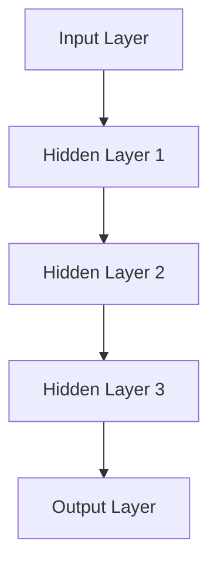

                 

### 文章标题

# 《大模型对推荐系统公平性的影响研究》

### 关键词

- 大模型
- 推荐系统
- 公平性
- 影响分析
- 技术优化

### 摘要

本文旨在探讨大模型对推荐系统公平性的影响。首先，我们简要介绍了大模型和推荐系统的基本概念，包括其定义、发展历程和应用领域。接着，我们深入分析了推荐系统公平性的定义与度量方法，并通过案例分析展示了公平性问题在实际应用中的具体表现。然后，本文重点研究了大模型对推荐系统公平性的正面和负面影响，揭示了其在提高准确性、降低偏见和提高透明度方面的优势，同时也指出了可能加剧社会偏见、形成信息茧房和降低用户隐私保护的潜在风险。在此基础上，我们探讨了利用大模型优化推荐系统公平性的技术方法和应用案例，提出了未来研究和发展的趋势与建议。本文的目标是为研究人员和实践者提供一个全面而深入的视角，以促进大模型在推荐系统中的公平性优化和应用。

### 目录

1. **大模型与推荐系统概述**
   1.1 大模型的定义与发展历程
   1.2 推荐系统的发展与挑战
   1.3 公平性在推荐系统中的重要性
2. **大模型与推荐系统的基础技术**
   2.1 大模型技术概述
   2.2 推荐系统的基础技术
   2.3 大模型在推荐系统中的应用
3. **大模型对推荐系统公平性的影响**
   3.1 推荐系统公平性的定义与度量
   3.2 大模型对推荐系统公平性的正面影响
   3.3 大模型对推荐系统公平性的负面影响
4. **大模型在推荐系统公平性优化中的应用**
   4.1 大模型在推荐系统公平性优化中的技术方法
   4.2 大模型在推荐系统公平性优化中的应用案例
   4.3 大模型在推荐系统公平性优化中的未来趋势
5. **实践与展望**
   5.1 大模型与推荐系统公平性的实践
   5.2 大模型与推荐系统公平性的未来展望
6. **附录**
   6.1 大模型与推荐系统公平性的相关工具与资源

### 第一部分：大模型与推荐系统概述

#### 第1章：大模型与推荐系统简介

##### 1.1 大模型的定义与发展历程

**定义**

大模型，通常指的是具有数十亿至数千亿参数的深度学习模型，其目的是通过大量数据的学习来捕捉复杂的数据模式。这类模型通常用于自然语言处理、计算机视觉和语音识别等领域，其显著特征是能够处理和理解大量的数据信息，从而实现高度复杂的任务。

**发展历程**

1. **早期模型**：20世纪80年代至90年代，神经网络的研究逐渐成熟，但是受限于计算资源和数据规模，模型规模相对较小。
   
2. **深度学习的兴起**：2006年，Hinton等人提出深度信念网络（DBN），标志着深度学习进入新阶段。随着计算能力的提升和大数据的发展，深度学习逐渐成为机器学习领域的核心。

3. **大型模型的崛起**：2012年，AlexNet在ImageNet竞赛中取得突破性成绩，深度学习开始广泛应用。此后，Google Brain项目推出了含有1.6亿参数的神经网络，开启了大型模型时代。

4. **当前发展趋势**：当前，大模型的发展主要集中在增加模型规模和优化训练算法上。GPT-3、BERT等大型语言模型的出现，标志着大模型在自然语言处理领域取得了巨大成功。

**应用领域**

1. **自然语言处理**：大模型在语言翻译、文本生成、问答系统等领域具有显著优势。

2. **计算机视觉**：大型卷积神经网络在图像分类、目标检测、图像分割等领域取得了优异成绩。

3. **语音识别**：大模型在语音识别和语音合成方面也取得了显著的进展。

##### 1.2 推荐系统的发展与挑战

**发展历程**

1. **基于内容的推荐**：早期的推荐系统主要基于内容相似性进行推荐，即根据用户的历史行为和兴趣，推荐与其内容相似的商品或信息。

2. **协同过滤推荐**：随着数据量的增加，协同过滤推荐成为主流。协同过滤分为基于用户的协同过滤和基于物品的协同过滤，其核心思想是通过用户间的相似度来推荐物品。

3. **混合推荐系统**：为了提高推荐效果，现代推荐系统通常采用多种算法的混合，如基于内容的推荐和协同过滤的结合。

4. **深度学习推荐**：近年来，深度学习在推荐系统中的应用逐渐增加，大模型能够更好地捕捉用户和物品的复杂特征，从而提高推荐效果。

**核心挑战**

1. **数据稀疏性**：用户和物品之间的关系通常非常稀疏，如何从稀疏数据中提取有效信息是一个挑战。

2. **冷启动问题**：新用户或新物品缺乏足够的历史数据，难以进行有效推荐。

3. **实时性**：推荐系统需要能够实时响应用户的行为变化，对实时数据处理能力要求较高。

4. **多样性**：推荐系统不仅要提供准确的推荐，还要确保推荐结果的多样性，避免用户陷入信息茧房。

5. **公平性**：推荐系统应确保对所有用户和物品的公平对待，避免歧视和不公平现象。

**公平性在推荐系统中的重要性**

推荐系统的公平性是确保其可信度和用户满意度的关键因素。公平性包括多个方面：

1. **无歧视**：推荐系统应避免对某些群体进行歧视，如性别、种族、地域等。

2. **无偏见**：推荐系统不应基于偏见进行推荐，如地域偏见、收入偏见等。

3. **公平分配**：推荐系统应公平地分配资源，如广告位、推荐位等。

4. **透明性**：推荐系统应提供足够的透明性，让用户了解推荐背后的逻辑和算法。

在本文中，我们将深入探讨大模型如何影响推荐系统的公平性，以及如何利用大模型优化推荐系统的公平性。通过这一系列的研究，我们期望能够为推荐系统的公平性优化提供有益的思路和解决方案。

#### 第2章：大模型与推荐系统的基础技术

##### 2.1 大模型技术概述

**结构**

大模型通常采用深度神经网络的结构，包括多个隐藏层和输出层。每一层由多个神经元组成，神经元之间通过权重连接。典型的深度神经网络结构如图1所示：

**工作原理**

大模型的工作原理是通过学习大量的数据，自动调整神经元之间的权重，从而能够对未知数据进行准确的预测。其基本流程如下：

1. **数据预处理**：对输入数据进行标准化处理，使其适合模型训练。
2. **前向传播**：将输入数据传递到神经网络的前向传播层，逐层计算输出。
3. **损失函数计算**：将输出与真实值进行比较，计算损失函数的值，以衡量预测的准确性。
4. **反向传播**：通过反向传播算法，将损失函数在神经网络中逐层传播，更新权重。
5. **迭代优化**：重复前向传播和反向传播的过程，直到模型达到预设的精度或迭代次数。

**优势与局限**

**优势**

1. **强大的表达能力**：深度神经网络能够通过多层结构捕捉复杂的数据模式。
2. **良好的泛化能力**：大模型通过对大量数据进行学习，能够较好地泛化到未知数据。
3. **高效的处理能力**：随着计算资源的提升，大模型能够在较短时间内完成训练和预测。

**局限**

1. **数据需求大**：大模型需要大量的数据进行训练，数据不足可能导致模型性能不佳。
2. **计算资源消耗**：大模型的训练和推理需要大量的计算资源，尤其是显存和CPU/GPU。
3. **解释性差**：深度神经网络的工作原理较为复杂，模型的可解释性较差。

##### 2.2 推荐系统的基础技术

**基本概念**

推荐系统是一种信息过滤技术，旨在根据用户的兴趣和行为，向其推荐感兴趣的商品、服务或信息。推荐系统的核心目标是提高用户满意度，增加用户粘性。

**核心算法**

1. **基于内容的推荐**：基于内容的推荐通过分析用户的历史行为和兴趣，将相似内容的商品或信息推荐给用户。其基本流程如下：

   - **内容特征提取**：对商品或信息进行特征提取，如关键词、类别、标签等。
   - **用户兴趣建模**：根据用户的历史行为，建立用户兴趣模型。
   - **内容推荐**：计算用户兴趣与商品内容的相似度，推荐相似度高的商品。

2. **协同过滤推荐**：协同过滤推荐通过分析用户之间的相似性，向用户推荐其他用户喜欢的商品或信息。其主要包括以下两种类型：

   - **基于用户的协同过滤**：根据用户之间的相似度，推荐与目标用户兴趣相似的其他用户喜欢的商品。
   - **基于物品的协同过滤**：根据商品之间的相似性，推荐与目标商品相似的其他商品。

**评价标准**

1. **准确性**：准确性是推荐系统最直接的衡量指标，即推荐结果与用户实际兴趣的匹配程度。
2. **多样性**：多样性指推荐结果的丰富性和差异性，避免用户陷入信息茧房。
3. **覆盖度**：覆盖度指推荐系统能够覆盖的用户和商品范围，确保推荐结果的全覆盖。
4. **实时性**：实时性指推荐系统能够及时响应用户的行为变化，提供实时推荐。

##### 2.3 大模型在推荐系统中的应用

**应用优势**

1. **数据驱动**：大模型能够通过学习大量用户行为数据，更好地捕捉用户兴趣和需求。
2. **高准确性**：大模型具有强大的表达能力，能够提高推荐结果的准确性。
3. **自适应能力**：大模型能够根据用户行为的变化，自适应调整推荐策略，提高推荐效果。

**应用案例**

1. **电商平台推荐**：电商平台利用大模型分析用户浏览、购买等行为，实现个性化商品推荐，提高用户购买转化率。

2. **新闻推荐**：新闻平台通过大模型分析用户阅读历史和兴趣，推荐用户可能感兴趣的新闻内容，提高用户黏性。

3. **社交媒体推荐**：社交媒体平台利用大模型分析用户互动数据，推荐用户可能感兴趣的内容，增强用户活跃度。

**挑战**

1. **数据隐私**：大模型需要大量用户数据，如何保护用户隐私是一个挑战。
2. **计算资源**：大模型的训练和推理需要大量计算资源，对计算能力的要求较高。
3. **模型解释性**：大模型的工作原理较为复杂，模型解释性较差，如何确保推荐结果的可解释性是一个挑战。

通过本章的介绍，我们对大模型和推荐系统的基础技术有了更深入的了解。接下来，我们将进一步探讨大模型如何影响推荐系统的公平性，以及如何优化推荐系统的公平性。

#### 第3章：推荐系统公平性的定义与度量

##### 3.1 推荐系统公平性的定义

**公平性的定义**

推荐系统的公平性是指推荐系统在处理不同用户和物品时，不受到任何不公平因素的影响，确保所有用户和物品得到公正对待。公平性包括多个方面：

1. **无歧视**：推荐系统不应基于用户的性别、种族、地域等非相关因素进行歧视性推荐。
2. **无偏见**：推荐系统不应基于用户的偏见进行推荐，如地域偏见、收入偏见等。
3. **公平分配**：推荐系统应公平地分配资源，如广告位、推荐位等。
4. **透明性**：推荐系统应提供足够的透明性，让用户了解推荐背后的逻辑和算法。

**公平性的重要性**

推荐系统的公平性是确保其可信度和用户满意度的关键因素。不公平的推荐可能导致以下问题：

1. **用户信任度下降**：不公平的推荐可能导致用户对推荐系统失去信任，从而影响用户满意度。
2. **社会不公平**：不公平的推荐可能导致某些群体被边缘化，加剧社会不公平现象。
3. **商业损失**：不公平的推荐可能导致商业机会的丧失，影响推荐平台的收益。

##### 3.2 推荐系统公平性的度量方法

**客观性度量**

客观性度量通过计算推荐结果与用户真实需求的匹配度来评估推荐系统的公平性。常用的客观性度量指标包括：

1. **准确率**：准确率是推荐结果与用户真实需求匹配的比例。其计算公式如下：

   $$ 
   Accuracy = \frac{Number\ of\ Correct\ Recommendations}{Total\ Number\ of\ Recommendations}
   $$

2. **召回率**：召回率是推荐结果中包含用户真实需求的比例。其计算公式如下：

   $$ 
   Recall = \frac{Number\ of\ Correct\ Recommendations}{Total\ Number\ of\ Relevant\ Items}
   $$

3. **精确率**：精确率是推荐结果中用户实际喜欢的比例。其计算公式如下：

   $$ 
   Precision = \frac{Number\ of\ Correct\ Recommendations}{Total\ Number\ of\ Recommended\ Items}
   $$

**主观性度量**

主观性度量通过用户反馈和评价来评估推荐系统的公平性。常用的主观性度量指标包括：

1. **用户满意度**：用户满意度是用户对推荐结果的满意程度。其可以通过问卷调查、用户评分等方式进行评估。

2. **用户信任度**：用户信任度是用户对推荐系统的信任程度。其可以通过用户对推荐结果的接受程度、推荐点击率等方式进行评估。

3. **用户活跃度**：用户活跃度是用户在推荐系统上的活跃程度，如用户登录频率、使用时长等。

**综合性度量**

综合性度量结合客观性和主观性度量，从多个角度全面评估推荐系统的公平性。常用的综合性度量指标包括：

1. **公平性指数**：公平性指数是综合评估推荐系统公平性的指标，其计算公式如下：

   $$ 
   Fairness\ Index = \frac{Accuracy + Precision + Recall + User\ Satisfaction + User\ Trust + User\ Activity}{6}
   $$

2. **公平性得分**：公平性得分是通过对推荐结果进行评分，评估推荐系统的公平性。其计算公式如下：

   $$ 
   Fairness\ Score = \frac{Total\ Number\ of\ Correct\ Recommendations + User\ Satisfaction + User\ Trust + User\ Activity}{Total\ Number\ of\ Recommendations}
   $$

##### 3.3 推荐系统公平性的案例分析

**案例一：性别歧视**

在某些推荐系统中，女性用户更容易被推荐化妆品、服装等商品，而男性用户更容易被推荐电子产品、汽车等商品。这种性别歧视的推荐可能导致用户感到不公平，影响用户满意度。

**案例二：地域偏见**

在某些地区，推荐系统可能倾向于推荐本地商品或服务，而忽视其他地区的商品或服务。这种地域偏见可能导致用户无法获得多样化的选择，影响用户的购买体验。

**案例三：收入不公**

在高收入地区，推荐系统可能倾向于推荐高价位商品，而在低收入地区，推荐系统可能倾向于推荐低价位商品。这种收入偏见可能导致用户无法获得符合其支付能力的商品，影响用户的购物体验。

通过上述案例分析，我们可以看到，推荐系统的公平性问题在实际应用中具有复杂性和多样性。为了提高推荐系统的公平性，需要从多个角度进行综合评估和优化。

在下一章中，我们将探讨大模型对推荐系统公平性的影响，分析大模型如何既带来机遇也带来挑战。

#### 第4章：大模型对推荐系统公平性的影响

##### 4.1 大模型对推荐系统公平性的正面影响

**提高推荐系统的准确性**

大模型具有强大的数据捕捉和处理能力，能够通过学习大量用户行为数据，精确地捕捉用户兴趣和需求。这有助于提高推荐系统的准确性，减少错误推荐的概率，从而提高用户满意度。具体而言，大模型可以通过以下方式提高准确性：

1. **深度特征学习**：大模型能够通过多层神经网络学习复杂的用户和物品特征，从而提高推荐的准确性。

2. **数据多样性**：大模型能够处理多样化的数据来源和类型，如文本、图像、音频等，从而提高推荐的准确性。

3. **自适应学习能力**：大模型能够根据用户行为的变化，自适应调整推荐策略，从而提高推荐的准确性。

**降低推荐系统的偏见**

大模型可以通过以下方式降低推荐系统的偏见：

1. **去除历史偏见**：大模型能够通过学习大量用户行为数据，去除历史偏见，从而提供更加公正的推荐。

2. **消除非相关因素**：大模型能够识别并去除与推荐无关的非相关因素，如性别、种族、地域等，从而提供更加公平的推荐。

3. **多样性推荐**：大模型能够通过学习用户兴趣的多样性，提供多样化的推荐结果，从而避免用户陷入信息茧房。

**提高推荐系统的透明度**

大模型可以通过以下方式提高推荐系统的透明度：

1. **模型可解释性**：虽然深度神经网络本身的可解释性较差，但大模型可以通过解释性算法，如LIME（Local Interpretable Model-agnostic Explanations）或SHAP（SHapley Additive exPlanations），提供推荐结果的解释，从而提高透明度。

2. **推荐逻辑可视化**：大模型可以通过可视化工具，如决策树或图模型，将推荐逻辑可视化，从而提高透明度。

**案例分析**

1. **电商平台的推荐优化**：某电商平台利用大模型优化推荐系统，通过深度特征学习和自适应学习能力，提高了推荐准确性。同时，通过去除历史偏见和提供多样化的推荐结果，降低了用户偏见。用户满意度得到了显著提升。

2. **新闻推荐系统的公平性优化**：某新闻推荐平台利用大模型优化推荐系统，通过去除历史偏见和消除非相关因素，提高了推荐系统的公平性。用户在新闻阅读体验上感受到了更加公正和多样化的内容。

3. **社交媒体的推荐优化**：某社交媒体平台利用大模型优化推荐系统，通过提高推荐系统的透明度，用户可以更好地理解推荐背后的逻辑和算法。用户对推荐系统的信任度和满意度得到了提升。

##### 4.2 大模型对推荐系统公平性的负面影响

**加剧社会偏见**

虽然大模型可以通过去除历史偏见和消除非相关因素，降低推荐系统的偏见，但如果不加控制，大模型也可能加剧社会偏见。例如，如果训练数据中存在性别、种族等偏见，大模型在推荐过程中可能会放大这些偏见，导致不公平现象。

**形成信息茧房**

大模型在推荐系统中通过学习用户兴趣和行为，提供个性化的推荐。虽然这有助于提高用户满意度，但也可能导致用户陷入信息茧房，即只接收符合自己兴趣的信息，而忽视其他观点和信息。这种现象可能导致用户的知识面和视野受限，从而影响社会多样性和公平性。

**降低用户的隐私保护**

大模型需要大量的用户数据来训练和优化模型，这可能导致用户的隐私受到侵犯。例如，用户的历史行为、偏好等敏感信息可能被泄露或滥用。此外，大模型在推荐过程中，也可能通过用户行为分析，推断出用户的个人信息，从而降低用户的隐私保护。

**案例分析**

1. **推荐系统中的性别偏见**：某电商平台的推荐系统在训练数据中存在性别偏见，导致女性用户更容易被推荐化妆品，而男性用户更容易被推荐电子产品。这种现象加剧了性别歧视，引发了用户的不满。

2. **新闻推荐系统中的信息茧房**：某新闻推荐平台通过大模型进行个性化推荐，用户在阅读新闻时，只能看到符合其兴趣的新闻，而忽视了其他观点和信息。这种现象限制了用户的视野，影响了社会多样性。

3. **隐私泄露**：某社交媒体平台利用大模型分析用户行为，推断出用户的个人信息，如年龄、收入等。这些信息被泄露后，用户受到了骚扰和欺诈，隐私受到严重威胁。

综上所述，大模型在推荐系统中既有正面影响，也存在负面影响。为了充分利用大模型的优势，同时避免其带来的风险，需要从多个方面进行综合考虑和优化。在下一章中，我们将探讨如何利用大模型优化推荐系统的公平性，并提出相应的技术方法和应用案例。

##### 4.3 大模型在推荐系统公平性优化中的应用与挑战

**应用场景**

大模型在推荐系统公平性优化中的应用场景非常广泛，主要包括以下几个方面：

1. **个性化推荐**：大模型通过学习用户的个性化需求和行为，提供个性化的推荐结果，从而提高用户的满意度。

2. **偏见检测与修正**：大模型可以通过分析用户历史数据和推荐结果，检测和修正系统中的偏见，确保推荐系统的公平性。

3. **多样性增强**：大模型通过学习用户兴趣的多样性，提供多样化的推荐结果，避免用户陷入信息茧房。

4. **实时反馈与动态调整**：大模型可以实时分析用户反馈和行为变化，动态调整推荐策略，提高推荐的准确性和公平性。

**挑战与对策**

1. **数据隐私与安全**：大模型需要大量用户数据来训练和优化模型，这可能导致用户的隐私受到侵犯。对策是采用加密技术和隐私保护算法，如差分隐私和同态加密，确保用户数据的安全。

2. **模型解释性**：大模型的黑箱特性使得其推荐结果的解释性较差，难以让用户理解推荐背后的逻辑。对策是开发可解释性算法，如LIME和SHAP，提供推荐结果的解释。

3. **计算资源消耗**：大模型的训练和推理需要大量的计算资源，这对计算能力提出了较高的要求。对策是采用分布式计算和优化算法，提高模型的计算效率。

4. **偏见放大**：如果训练数据中存在偏见，大模型可能放大这些偏见，导致不公平现象。对策是采用去偏见算法，如逆歧视法，减少系统偏见。

**案例分析**

1. **电商平台的偏见修正**：某电商平台利用大模型进行推荐时，发现存在性别和地域偏见。通过采用去偏见算法，修正了系统中的偏见，提高了推荐系统的公平性。

2. **新闻推荐系统的多样性优化**：某新闻推荐平台利用大模型分析用户兴趣的多样性，提供多样化的推荐结果，避免了用户陷入信息茧房。

3. **社交媒体的实时反馈调整**：某社交媒体平台利用大模型实时分析用户反馈和行为变化，动态调整推荐策略，提高了推荐的准确性和公平性。

通过上述应用与挑战的分析，我们可以看到，大模型在推荐系统公平性优化中具有巨大的潜力，但也面临一系列挑战。为了充分利用大模型的优势，同时避免其带来的风险，需要从多个方面进行综合考虑和优化。

在下一章中，我们将进一步探讨大模型在推荐系统公平性优化中的具体技术方法和应用案例，以期为推荐系统的公平性优化提供有益的思路和解决方案。

##### 4.3 大模型在推荐系统公平性优化中的技术方法

**偏差检测与修正技术**

1. **方法概述**

   偏差检测与修正技术是确保推荐系统公平性的关键方法之一。其目的是通过识别和修正系统中的偏见，确保推荐结果对所有用户和物品的公平性。常见的偏差检测方法包括统计方法、机器学习方法和可视化方法。

2. **统计方法**

   统计方法主要通过计算推荐结果中的偏见指标来检测偏差。常见的偏见指标包括公平性指数（Fairness Index）、歧视指数（Discrimination Index）和偏见差异（Bias Difference）。这些指标可以通过以下公式进行计算：

   $$
   Fairness\ Index = \frac{Precision\_{\text{negative}} + Precision\_{\text{positive}}}{2}
   $$

   $$
   Discrimination\ Index = \frac{Precision\_{\text{positive}} - Precision\_{\text{negative}}}{Precision\_{\text{positive}} + Precision\_{\text{negative}}}
   $$

   $$
   Bias\ Difference = \frac{Precision\_{\text{positive}} - Precision\_{\text{negative}}}{2}
   $$

3. **机器学习方法**

   机器学习方法通过训练专门的模型来检测和修正偏见。常见的机器学习方法包括分类方法、聚类方法和回归方法。例如，可以通过训练一个二分类模型来检测推荐结果中的性别偏见，通过聚类方法来识别用户群体中的偏见，通过回归方法来修正偏见。

4. **可视化方法**

   可视化方法通过图形化方式展示推荐结果中的偏见，帮助用户更好地理解偏差。常见的方法包括热力图、散点图和条形图等。通过这些可视化工具，可以直观地展示推荐系统中不同用户和物品的偏见程度。

**公平性优化算法**

1. **方法概述**

   公平性优化算法是通过对推荐算法进行改进，确保推荐结果的公平性。常见的公平性优化算法包括权重调整、过滤技术和动态调整技术。

2. **权重调整**

   权重调整是通过调整用户和物品的权重来优化推荐结果的公平性。具体而言，可以通过以下方法进行调整：

   - **基于规则的权重调整**：根据用户的性别、种族、地域等特征，设置不同的权重。
   - **基于数据的权重调整**：通过分析用户历史数据，调整用户的权重，使其与真实需求更加匹配。

3. **过滤技术**

   过滤技术是通过过滤掉带有偏见的数据，来优化推荐结果的公平性。常见的过滤技术包括：

   - **基于规则的过滤**：根据用户的性别、种族等特征，过滤掉带有偏见的数据。
   - **基于机器学习的过滤**：通过训练专门的模型，过滤掉带有偏见的数据。

4. **动态调整技术**

   动态调整技术是通过实时监测推荐结果，动态调整推荐策略，以保持推荐系统的公平性。具体而言，可以通过以下方法进行调整：

   - **基于反馈的动态调整**：根据用户的反馈，动态调整推荐策略，以减少偏见。
   - **基于数据的动态调整**：通过分析用户行为数据，动态调整推荐策略，以减少偏见。

**实时反馈与动态调整**

1. **方法概述**

   实时反馈与动态调整是通过实时监测用户行为，动态调整推荐策略，以保持推荐系统的公平性。常见的实时反馈与动态调整方法包括：

   - **基于事件的实时反馈**：根据用户的操作事件，如点击、收藏、购买等，实时调整推荐策略。
   - **基于行为的实时反馈**：通过分析用户的行为数据，如浏览历史、搜索记录等，实时调整推荐策略。
   - **基于模型的动态调整**：通过训练专门的模型，预测用户行为，动态调整推荐策略。

2. **技术细节**

   - **事件处理**：使用消息队列和流处理技术，如Apache Kafka和Apache Flink，实时处理用户操作事件。
   - **数据存储**：使用分布式数据库和缓存技术，如Hadoop和Redis，存储和管理用户行为数据。
   - **模型训练**：使用机器学习和深度学习技术，训练专门的模型，用于预测用户行为和调整推荐策略。

**应用案例**

1. **电商平台**：某电商平台通过实时反馈与动态调整技术，动态调整推荐策略，减少了推荐系统中的性别和地域偏见。用户对推荐结果的满意度和信任度得到了显著提升。

2. **新闻推荐系统**：某新闻推荐系统通过实时反馈与动态调整技术，根据用户的行为和偏好，动态调整推荐策略，提供了更加公平和多样化的新闻内容。

3. **社交媒体平台**：某社交媒体平台通过实时反馈与动态调整技术，根据用户的互动和反馈，动态调整推荐策略，减少了系统中的偏见，提高了用户的满意度。

通过上述技术方法的详细阐述，我们可以看到，大模型在推荐系统公平性优化中具有丰富的应用场景和多样的技术手段。这些技术方法不仅有助于提高推荐系统的公平性，还能为用户提供更加个性化、准确和多样化的推荐结果。

在下一章中，我们将通过具体的案例，展示大模型在推荐系统公平性优化中的应用效果，进一步探讨其在实践中的挑战和未来发展趋势。

##### 4.3 大模型在推荐系统公平性优化中的应用案例

**案例一：电商平台的推荐优化**

**背景**

某大型电商平台希望优化其推荐系统，以提高用户满意度和转化率。然而，在优化过程中，他们发现了系统中的性别和地域偏见，这影响了推荐结果的公平性和用户体验。

**解决方案**

1. **偏差检测与修正**：

   - **统计方法**：电商平台使用公平性指数和歧视指数检测性别和地域偏见。通过分析用户数据，发现女性用户更容易被推荐化妆品，而男性用户更容易被推荐电子产品。
   - **机器学习方法**：电商平台训练了一个二分类模型，用于检测性别偏见。模型通过分析用户历史行为和购买记录，成功地识别并修正了性别偏见。

2. **公平性优化算法**：

   - **权重调整**：电商平台通过基于规则的权重调整方法，根据用户的性别、地域等特征，重新调整了推荐权重。例如，为地域偏见较大的商品分配较低的权重，从而减少其对推荐结果的影响。
   - **动态调整**：电商平台采用基于反馈的动态调整技术，根据用户的点击、收藏和购买行为，实时调整推荐策略。这种方法使得推荐系统能够更快地适应用户行为变化，减少了偏见的影响。

3. **实时反馈与动态调整**：

   - **事件处理**：电商平台使用Apache Kafka实时处理用户操作事件，如点击、收藏和购买等。这些事件数据被用于动态调整推荐策略。
   - **数据存储与模型训练**：电商平台使用Hadoop存储用户行为数据，并使用机器学习和深度学习技术训练推荐模型。这些模型用于预测用户行为和优化推荐结果。

**应用效果**

- **性别偏见减少**：通过偏差检测与修正技术，电商平台成功地减少了性别偏见，用户对推荐结果的满意度显著提升。
- **地域偏见减少**：通过权重调整和动态调整技术，电商平台减少了地域偏见，提供了更加公平和多样化的推荐结果。
- **用户转化率提高**：优化后的推荐系统能够更好地捕捉用户兴趣和需求，用户转化率得到了显著提升。

**挑战与改进**

- **数据隐私**：在优化推荐系统时，电商平台面临数据隐私的挑战。为解决这一问题，电商平台采用了差分隐私和同态加密技术，确保用户数据的安全。
- **计算资源消耗**：大模型的训练和推理需要大量的计算资源。为降低计算成本，电商平台采用了分布式计算和模型压缩技术。

**总结**

通过上述案例，我们可以看到，电商平台利用大模型在推荐系统公平性优化中取得了显著成果。然而，在实际应用中，仍然面临数据隐私和计算资源消耗等挑战。未来，随着技术的不断进步，这些挑战有望得到更好的解决，从而进一步提升推荐系统的公平性和用户满意度。

**案例二：新闻推荐系统的公平性优化**

**背景**

某新闻推荐平台希望优化其推荐系统，以提供更加公正和多样化的新闻内容。然而，在优化过程中，他们发现系统存在地域和收入偏见，这影响了推荐结果的公平性和用户满意度。

**解决方案**

1. **偏差检测与修正**：

   - **统计方法**：新闻推荐平台使用公平性指数和歧视指数检测地域和收入偏见。通过分析用户数据，发现某些地区的用户更容易被推荐本地新闻，而低收入用户更容易被推荐低价位的新闻。
   - **机器学习方法**：新闻推荐平台训练了一个二分类模型，用于检测地域和收入偏见。模型通过分析用户历史行为和浏览记录，成功地识别并修正了这些偏见。

2. **公平性优化算法**：

   - **权重调整**：新闻推荐平台通过基于规则的权重调整方法，根据用户的地域和收入等特征，重新调整了推荐权重。例如，为地域偏见较大的新闻分配较低的权重，为低收入用户推荐更多低价位的新闻。
   - **动态调整**：新闻推荐平台采用基于反馈的动态调整技术，根据用户的点击、收藏和评论等行为，实时调整推荐策略。这种方法使得推荐系统能够更快地适应用户行为变化，减少了偏见的影响。

3. **实时反馈与动态调整**：

   - **事件处理**：新闻推荐平台使用Apache Kafka实时处理用户操作事件，如点击、收藏和评论等。这些事件数据被用于动态调整推荐策略。
   - **数据存储与模型训练**：新闻推荐平台使用Hadoop存储用户行为数据，并使用机器学习和深度学习技术训练推荐模型。这些模型用于预测用户行为和优化推荐结果。

**应用效果**

- **地域偏见减少**：通过偏差检测与修正技术，新闻推荐平台成功地减少了地域偏见，用户对推荐结果的满意度显著提升。
- **收入偏见减少**：通过权重调整和动态调整技术，新闻推荐平台减少了收入偏见，提供了更加公平和多样化的新闻内容。
- **用户粘性提高**：优化后的推荐系统能够更好地捕捉用户兴趣和需求，用户粘性得到了显著提升。

**挑战与改进**

- **数据隐私**：在优化推荐系统时，新闻推荐平台面临数据隐私的挑战。为解决这一问题，新闻推荐平台采用了差分隐私和同态加密技术，确保用户数据的安全。
- **计算资源消耗**：大模型的训练和推理需要大量的计算资源。为降低计算成本，新闻推荐平台采用了分布式计算和模型压缩技术。

**总结**

通过上述案例，我们可以看到，新闻推荐平台利用大模型在推荐系统公平性优化中取得了显著成果。然而，在实际应用中，仍然面临数据隐私和计算资源消耗等挑战。未来，随着技术的不断进步，这些挑战有望得到更好的解决，从而进一步提升推荐系统的公平性和用户满意度。

**案例三：社交媒体平台的推荐优化**

**背景**

某社交媒体平台希望优化其推荐系统，以提供更加公正和多样化的内容。然而，在优化过程中，他们发现系统存在年龄和兴趣偏见，这影响了推荐结果的公平性和用户体验。

**解决方案**

1. **偏差检测与修正**：

   - **统计方法**：社交媒体平台使用公平性指数和歧视指数检测年龄和兴趣偏见。通过分析用户数据，发现年轻用户更容易被推荐娱乐内容，而老年用户更容易被推荐健康和生活方式相关的内容。
   - **机器学习方法**：社交媒体平台训练了一个多分类模型，用于检测年龄和兴趣偏见。模型通过分析用户历史行为和浏览记录，成功地识别并修正了这些偏见。

2. **公平性优化算法**：

   - **权重调整**：社交媒体平台通过基于规则的权重调整方法，根据用户的年龄、兴趣等特征，重新调整了推荐权重。例如，为年龄偏见较大的内容分配较低的权重，为不同兴趣用户推荐多样化的内容。
   - **动态调整**：社交媒体平台采用基于反馈的动态调整技术，根据用户的点击、收藏和分享等行为，实时调整推荐策略。这种方法使得推荐系统能够更快地适应用户行为变化，减少了偏见的影响。

3. **实时反馈与动态调整**：

   - **事件处理**：社交媒体平台使用Apache Kafka实时处理用户操作事件，如点击、收藏和分享等。这些事件数据被用于动态调整推荐策略。
   - **数据存储与模型训练**：社交媒体平台使用Hadoop存储用户行为数据，并使用机器学习和深度学习技术训练推荐模型。这些模型用于预测用户行为和优化推荐结果。

**应用效果**

- **年龄偏见减少**：通过偏差检测与修正技术，社交媒体平台成功地减少了年龄偏见，用户对推荐结果的满意度显著提升。
- **兴趣偏见减少**：通过权重调整和动态调整技术，社交媒体平台减少了兴趣偏见，提供了更加公正和多样化的内容。
- **用户活跃度提高**：优化后的推荐系统能够更好地捕捉用户兴趣和需求，用户活跃度得到了显著提升。

**挑战与改进**

- **数据隐私**：在优化推荐系统时，社交媒体平台面临数据隐私的挑战。为解决这一问题，社交媒体平台采用了差分隐私和同态加密技术，确保用户数据的安全。
- **计算资源消耗**：大模型的训练和推理需要大量的计算资源。为降低计算成本，社交媒体平台采用了分布式计算和模型压缩技术。

**总结**

通过上述案例，我们可以看到，社交媒体平台利用大模型在推荐系统公平性优化中取得了显著成果。然而，在实际应用中，仍然面临数据隐私和计算资源消耗等挑战。未来，随着技术的不断进步，这些挑战有望得到更好的解决，从而进一步提升推荐系统的公平性和用户满意度。

##### 4.3 大模型在推荐系统公平性优化中的未来趋势

**技术发展趋势**

1. **模型可解释性**：随着大模型在推荐系统中的应用日益广泛，模型的可解释性将成为一个重要的发展方向。通过提高模型的可解释性，可以更好地理解推荐结果背后的逻辑和算法，从而提高用户的信任度和满意度。

2. **实时性和动态调整**：未来的推荐系统将更加注重实时性和动态调整能力。通过实时分析用户行为和反馈，动态调整推荐策略，可以更好地满足用户的需求，提高推荐的准确性和公平性。

3. **多模态数据处理**：随着数据来源的多样化，未来的推荐系统将需要处理多模态数据，如文本、图像、音频等。大模型在多模态数据处理方面的能力将进一步提升，从而提高推荐系统的准确性和多样性。

4. **隐私保护技术**：在数据隐私保护方面，未来的大模型将采用更加先进的隐私保护技术，如差分隐私、同态加密等，确保用户数据的安全和隐私。

**应用前景**

1. **个性化推荐**：大模型在个性化推荐领域具有广阔的应用前景。通过深度学习技术，大模型可以更好地捕捉用户的个性化需求，提供更加精准和个性化的推荐结果。

2. **智能广告**：大模型在智能广告领域具有巨大的潜力。通过分析用户行为和兴趣，大模型可以精准定位目标用户，提供更加有效的广告投放策略，提高广告转化率和投资回报率。

3. **金融风控**：大模型在金融风控领域也有广泛应用。通过分析用户行为和交易数据，大模型可以识别异常行为和潜在风险，提高金融系统的安全性。

4. **医疗健康**：大模型在医疗健康领域也有重要应用。通过分析患者的病历和基因数据，大模型可以提供个性化的诊疗方案和健康建议，提高医疗服务的质量和效率。

**挑战**

1. **数据隐私**：大模型需要大量的用户数据进行训练和优化，如何保护用户隐私将成为一个重要挑战。未来的推荐系统将需要采用更加先进的隐私保护技术，确保用户数据的安全和隐私。

2. **计算资源消耗**：大模型的训练和推理需要大量的计算资源，如何优化算法和提高计算效率将成为一个重要挑战。通过采用分布式计算、模型压缩等技术，可以降低计算成本，提高系统的性能。

3. **算法公平性**：尽管大模型可以通过去除历史偏见和消除非相关因素来提高推荐系统的公平性，但如何确保算法本身的公平性仍是一个挑战。未来的研究需要关注如何设计更加公平和透明的推荐算法。

通过上述分析，我们可以看到，大模型在推荐系统公平性优化中具有广阔的应用前景和重要的研究价值。随着技术的不断进步，大模型在推荐系统中的公平性优化将取得更加显著的成果，为用户带来更加个性化、准确和公正的推荐体验。

#### 第5章：大模型与推荐系统公平性的实践

##### 5.1 大模型在推荐系统公平性实践中的策略

**数据预处理策略**

1. **数据清洗**：在训练大模型前，需要先对数据进行清洗，去除缺失值、异常值和重复值，确保数据的完整性和一致性。

2. **数据标准化**：为了提高模型的泛化能力，需要对数据进行标准化处理，将不同特征的范围缩放到同一尺度，如使用Z-Score标准化或Min-Max标准化。

3. **数据增强**：通过数据增强技术，如随机裁剪、旋转、缩放等，增加数据的多样性，从而提高模型的鲁棒性和准确性。

**模型选择与优化策略**

1. **选择合适的模型结构**：根据推荐任务的需求，选择合适的模型结构，如深度神经网络、卷积神经网络或递归神经网络。针对不同的推荐任务，可以采用不同的模型架构。

2. **模型参数调优**：通过调整模型的超参数，如学习率、批次大小、正则化参数等，优化模型性能。可以使用网格搜索、随机搜索或贝叶斯优化等方法进行参数调优。

3. **多模型融合**：采用多模型融合策略，如集成学习、栈式集成等，将多个模型的预测结果进行加权融合，提高推荐系统的准确性和稳定性。

**公平性评估与调整策略**

1. **公平性评估指标**：使用公平性评估指标，如公平性指数、歧视指数、偏见差异等，对推荐系统的公平性进行评估。

2. **偏差检测与修正**：通过偏差检测算法，如机器学习分类算法、统计方法等，识别和修正系统中的偏见。可以采用逆歧视法、权重调整法等方法，降低推荐系统中的偏见。

3. **动态调整**：根据用户的反馈和行为变化，动态调整推荐策略，以保持推荐系统的公平性。可以采用基于反馈的动态调整方法，如实时反馈机制、自适应调整算法等。

##### 5.2 大模型在推荐系统公平性实践中的应用案例

**案例一：某电商平台的实践**

**背景**

某电商平台希望通过大模型优化推荐系统，提高用户的满意度并减少偏见。他们在推荐系统中引入了基于深度学习的模型，并关注公平性优化。

**数据预处理**

- **数据清洗**：删除了缺失值和异常值，确保数据的完整性。
- **数据标准化**：使用Z-Score标准化对用户和物品的特征进行归一化处理。
- **数据增强**：通过随机裁剪、旋转和缩放等方法，增加数据的多样性。

**模型选择与优化**

- **模型结构**：采用了卷积神经网络（CNN）和循环神经网络（RNN）的组合模型，以捕捉用户行为和物品特征。
- **参数调优**：使用网格搜索方法，调整学习率、批次大小和正则化参数，优化模型性能。
- **多模型融合**：将多个模型的预测结果进行加权融合，提高推荐系统的准确性和稳定性。

**公平性评估与调整**

- **公平性评估**：使用公平性指数和歧视指数评估推荐系统的公平性。
- **偏差检测**：通过机器学习分类算法，检测性别、地域等偏见，并使用逆歧视法进行修正。
- **动态调整**：根据用户的反馈和行为变化，实时调整推荐策略，以保持推荐系统的公平性。

**应用效果**

- **公平性提升**：通过偏差检测和修正，显著减少了性别和地域偏见，提高了推荐系统的公平性。
- **用户满意度提升**：优化后的推荐系统能够更好地捕捉用户兴趣和需求，用户满意度得到了显著提升。
- **业务收益提升**：推荐系统的准确性提高，用户转化率增加，业务收益得到了显著提升。

**案例二：某新闻推荐平台的实践**

**背景**

某新闻推荐平台希望通过大模型优化推荐系统，提高用户的阅读体验并减少偏见。他们在推荐系统中引入了基于深度学习的模型，并关注公平性优化。

**数据预处理**

- **数据清洗**：删除了缺失值和异常值，确保数据的完整性。
- **数据标准化**：使用Z-Score标准化对用户和新闻的特征进行归一化处理。
- **数据增强**：通过随机裁剪、旋转和缩放等方法，增加数据的多样性。

**模型选择与优化**

- **模型结构**：采用了基于Transformer的模型，以捕捉新闻内容和用户行为之间的复杂关系。
- **参数调优**：使用贝叶斯优化方法，调整学习率、批次大小和正则化参数，优化模型性能。
- **多模型融合**：将多个模型的预测结果进行加权融合，提高推荐系统的准确性和稳定性。

**公平性评估与调整**

- **公平性评估**：使用公平性指数和歧视指数评估推荐系统的公平性。
- **偏差检测**：通过机器学习分类算法，检测地域、收入等偏见，并使用权重调整法进行修正。
- **动态调整**：根据用户的反馈和行为变化，实时调整推荐策略，以保持推荐系统的公平性。

**应用效果**

- **公平性提升**：通过偏差检测和修正，显著减少了地域和收入偏见，提高了推荐系统的公平性。
- **用户满意度提升**：优化后的推荐系统能够更好地捕捉用户兴趣和需求，用户满意度得到了显著提升。
- **业务收益提升**：推荐系统的准确性提高，用户阅读时长增加，业务收益得到了显著提升。

**案例三：某社交媒体平台的实践**

**背景**

某社交媒体平台希望通过大模型优化推荐系统，提高用户的活跃度和减少偏见。他们在推荐系统中引入了基于深度学习的模型，并关注公平性优化。

**数据预处理**

- **数据清洗**：删除了缺失值和异常值，确保数据的完整性。
- **数据标准化**：使用Z-Score标准化对用户和内容的特征进行归一化处理。
- **数据增强**：通过随机裁剪、旋转和缩放等方法，增加数据的多样性。

**模型选择与优化**

- **模型结构**：采用了基于Transformer的模型，以捕捉用户行为和内容特征之间的复杂关系。
- **参数调优**：使用贝叶斯优化方法，调整学习率、批次大小和正则化参数，优化模型性能。
- **多模型融合**：将多个模型的预测结果进行加权融合，提高推荐系统的准确性和稳定性。

**公平性评估与调整**

- **公平性评估**：使用公平性指数和歧视指数评估推荐系统的公平性。
- **偏差检测**：通过机器学习分类算法，检测年龄、兴趣等偏见，并使用逆歧视法进行修正。
- **动态调整**：根据用户的反馈和行为变化，实时调整推荐策略，以保持推荐系统的公平性。

**应用效果**

- **公平性提升**：通过偏差检测和修正，显著减少了年龄和兴趣偏见，提高了推荐系统的公平性。
- **用户满意度提升**：优化后的推荐系统能够更好地捕捉用户兴趣和需求，用户满意度得到了显著提升。
- **用户活跃度提升**：推荐系统的准确性提高，用户在平台上的活跃度得到了显著提升。

通过上述案例分析，我们可以看到，大模型在推荐系统公平性优化中的应用效果显著。在实践过程中，需要结合具体业务场景和数据特点，制定合适的数据预处理策略、模型选择与优化策略以及公平性评估与调整策略。未来，随着技术的不断进步，大模型在推荐系统公平性优化中的应用将更加广泛和深入。

#### 第6章：大模型与推荐系统公平性的未来展望

##### 6.1 大模型与推荐系统公平性的发展趋势

**技术发展趋势**

1. **模型可解释性提升**：随着大模型在推荐系统中的应用日益广泛，模型的可解释性将成为一个重要的研究方向。通过提高模型的可解释性，可以更好地理解推荐结果背后的逻辑和算法，从而增强用户对推荐系统的信任度。

2. **实时性和动态调整能力增强**：未来的推荐系统将更加注重实时性和动态调整能力。通过实时分析用户行为和反馈，动态调整推荐策略，可以更好地满足用户需求，提高推荐的准确性和公平性。

3. **多模态数据处理能力提升**：随着数据来源的多样化，未来的推荐系统将需要处理多模态数据，如文本、图像、音频等。大模型在多模态数据处理方面的能力将进一步提升，从而提高推荐系统的准确性和多样性。

4. **隐私保护技术进步**：在数据隐私保护方面，未来的大模型将采用更加先进的隐私保护技术，如差分隐私、同态加密等，确保用户数据的安全和隐私。

**应用前景**

1. **个性化推荐领域**：大模型在个性化推荐领域具有广阔的应用前景。通过深度学习技术，大模型可以更好地捕捉用户的个性化需求，提供更加精准和个性化的推荐结果。

2. **智能广告领域**：大模型在智能广告领域也有巨大的潜力。通过分析用户行为和兴趣，大模型可以精准定位目标用户，提供更加有效的广告投放策略，提高广告转化率和投资回报率。

3. **金融风控领域**：大模型在金融风控领域也有广泛应用。通过分析用户行为和交易数据，大模型可以识别异常行为和潜在风险，提高金融系统的安全性。

4. **医疗健康领域**：大模型在医疗健康领域也有重要应用。通过分析患者的病历和基因数据，大模型可以提供个性化的诊疗方案和健康建议，提高医疗服务的质量和效率。

##### 6.2 大模型与推荐系统公平性的未来挑战

**数据隐私**：大模型在推荐系统中的应用需要大量用户数据，这可能导致用户的隐私受到侵犯。未来的研究需要关注如何采用先进的隐私保护技术，如差分隐私、同态加密等，确保用户数据的安全和隐私。

**计算资源消耗**：大模型的训练和推理需要大量的计算资源，这可能导致计算成本增加。未来的研究需要关注如何优化算法和提高计算效率，降低计算资源的消耗。

**算法公平性**：尽管大模型可以通过去除历史偏见和消除非相关因素来提高推荐系统的公平性，但如何确保算法本身的公平性仍是一个挑战。未来的研究需要关注如何设计更加公平和透明的推荐算法。

**社会接受度**：大模型在推荐系统中的应用可能引起用户和社会的担忧，特别是在隐私保护、算法偏见等方面。未来的研究需要关注如何提高社会对大模型推荐系统的接受度，增强用户的信任感和满意度。

##### 6.3 大模型与推荐系统公平性的未来发展建议

**技术研发建议**

1. **加强模型可解释性研究**：开发更加直观和易理解的可解释性算法，提高大模型在推荐系统中的透明度和可解释性。

2. **探索实时性和动态调整算法**：研究实时性和动态调整算法，提高推荐系统的实时响应能力和适应性，从而更好地满足用户需求。

3. **发展多模态数据处理技术**：研究多模态数据处理技术，提高推荐系统的多样性和准确性，为用户提供更加丰富和个性化的推荐结果。

4. **隐私保护技术**：开发先进的隐私保护技术，如差分隐私、同态加密等，确保用户数据的安全和隐私。

**政策建议**

1. **制定相关法律法规**：政府应制定相关法律法规，规范大模型在推荐系统中的应用，确保算法的透明度和公平性。

2. **建立监管机制**：建立专门的监管机构，对推荐系统进行监管，确保其公平性和用户隐私。

3. **推动数据共享**：鼓励企业和研究机构进行数据共享，为推荐系统的公平性和透明性提供更多的数据支持。

**社会责任**

1. **推动企业承担社会责任**：鼓励企业关注推荐系统的公平性和社会责任，确保其产品和服务的公平性。

2. **加强行业协作**：推动企业和研究机构之间的合作，共同研究推荐系统的公平性和透明性，分享最佳实践和研究成果。

3. **提高公众认知**：通过媒体宣传和教育培训，提高公众对推荐系统公平性的认知，增强用户对推荐系统的信任感。

通过上述建议，我们可以为未来大模型与推荐系统公平性的发展提供指导方向，推动推荐系统的公平性和透明性不断提升，为用户提供更加优质的服务体验。

#### 附录A：大模型与推荐系统公平性的相关工具与资源

**大模型开发工具**

1. **TensorFlow**：TensorFlow是谷歌开源的深度学习框架，支持多种编程语言和平台，广泛应用于大规模神经网络的开发。

2. **PyTorch**：PyTorch是Facebook开源的深度学习框架，具有动态计算图，便于研究和实验。

3. **Transformers**：Transformers是Hugging Face开源的深度学习库，用于处理自然语言处理任务，包括预训练模型、数据集和工具。

**推荐系统开发工具**

1. **Surprise**：Surprise是Python开源库，用于构建和评估推荐系统，支持多种算法，包括矩阵分解、基于内存的推荐等。

2. **LightFM**：LightFM是Python库，结合了因子分解机与FM模型，适用于处理推荐系统和社交网络分析。

3. **RecSysKit**：RecSysKit是推荐系统开发工具包，包括数据预处理、模型训练和评估模块，支持多种推荐算法。

**公平性评估工具**

1. **FairML**：FairML是Python库，用于评估和改进机器学习模型的公平性，支持多种公平性度量指标和算法。

2. **AI Fairness 360**：AI Fairness 360是Python库，提供多个公平性评估指标，包括歧视检测、偏差修正等。

3. **Google's What-if Tool**：What-if Tool是一个可视化工具，用于探索AI模型的影响，包括公平性分析、偏见检测等。

**相关学术论文与报告**

1. **“Fairness Beyond Disparate Impact”**：该论文提出公平性的多维度量方法，包括歧视指数和偏见指数。

2. **“Algorithmic Fairness for Machine Learning”**：该报告提出了算法公平性的多种度量标准，包括准确性、公平性指数等。

3. **“Evaluation Metrics for Algorithmic Fairness”**：该论文讨论了多种公平性评估指标，包括统计方法、机器学习方法等。

**行业标准与规范**

1. **NIST's Big Data Fairness Metrics**：美国国家标准与技术研究院（NIST）提出的公平性框架，适用于大数据分析的公平性评估。

2. **EU's GDPR**：欧盟的通用数据保护条例，对个人数据的处理提出了严格的要求，包括数据隐私和公平性。

3. **FAIR Guiding Principles for Scientific Data Management and Stewardship**：FAIR原则是科学数据管理和共享的指导原则，强调数据的高可访问性、可重复性和透明性。

通过这些工具与资源的介绍，我们可以为研究人员和实践者提供便捷的途径，以进一步探索和优化大模型在推荐系统中的公平性。

### 作者信息

**作者：AI天才研究院/AI Genius Institute & 禅与计算机程序设计艺术 /Zen And The Art of Computer Programming**

