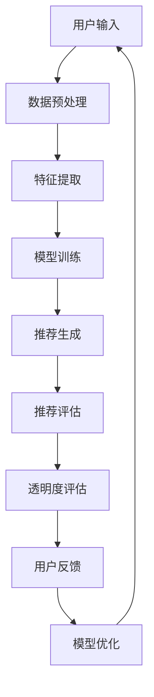

                 

### 《大模型对推荐系统透明度的提升》

#### 关键词
- 推荐系统
- 大模型
- 透明度提升
- 可解释性
- 算法优化

#### 摘要
本文探讨了如何通过大模型技术提升推荐系统的透明度。我们首先回顾了推荐系统的基础知识，包括其发展历程、基本原理、分类和评价标准。随后，我们介绍了大模型的概念、特点与应用前景，特别是其在推荐系统中的核心算法。通过分析当前推荐系统透明度面临的挑战，我们提出了大模型在提高透明度方面的技术方法与实践案例。文章最后展望了未来大模型在推荐系统透明度提升中的发展方向，并提供了相关的技术资源和工具。

---

### 《大模型对推荐系统透明度的提升》目录大纲

#### 第一部分：推荐系统基础知识

- **第1章：推荐系统的概述**
  - 1.1 推荐系统的发展历程
  - 1.2 推荐系统的基本原理
  - 1.3 推荐系统的分类与评价标准
  - 1.4 推荐系统的应用场景

#### 第二部分：大模型技术基础

- **第2章：大模型概述**
  - 2.1 大模型的基本概念
  - 2.2 大模型的特点与优势
  - 2.3 大模型的发展历程与技术趋势
  - 2.4 大模型在推荐系统中的应用前景

#### 第三部分：大模型在推荐系统中的应用

- **第3章：大模型在推荐系统中的核心算法**
  - 3.1 大规模机器学习算法概述
  - 3.2 大模型在协同过滤算法中的应用
  - 3.3 大模型在矩阵分解算法中的应用
  - 3.4 大模型在深度学习推荐算法中的应用

#### 第四部分：提高推荐系统透明度的方法

- **第4章：推荐系统透明度的挑战**
  - 4.1 推荐系统透明度的定义与重要性
  - 4.2 当前推荐系统透明度面临的问题
  - 4.3 大模型对推荐系统透明度的影响

#### 第五部分：大模型提升推荐系统透明度的实践

- **第5章：大模型提升推荐系统透明度的技术实现**
  - 5.1 可解释性模型的引入
  - 5.2 大模型在推荐系统中的解释性增强
  - 5.3 透明度评估指标的设计与实现
  - 5.4 透明度优化的算法改进

#### 第六部分：案例分析与应用

- **第6章：大模型提升推荐系统透明度的实际案例**
  - 6.1 案例一：某电商平台的透明度优化实践
  - 6.2 案例二：某社交媒体平台的推荐系统透明度提升
  - 6.3 案例三：某在线视频平台的透明度改进

#### 第七部分：未来展望与挑战

- **第7章：大模型对推荐系统透明度的未来展望**
  - 7.1 大模型在推荐系统透明度提升中的潜在应用
  - 7.2 推荐系统透明度提升的挑战与对策
  - 7.3 大模型在推荐系统透明度研究中的发展趋势

#### 附录

- **附录A：推荐系统与大模型相关的技术资源**
  - A.1 主流大模型框架对比
  - A.2 推荐系统开源框架介绍
  - A.3 透明度评估工具与资源

---

### 推荐系统基础知识

#### 第1章：推荐系统的概述

##### 1.1 推荐系统的发展历程

推荐系统的发展可以追溯到20世纪90年代。最早的推荐系统是基于基于内容的过滤和协同过滤算法。1992年，美国明尼苏达大学的GroupLens项目开发了第一个基于协同过滤的推荐系统，为电子商务领域带来了革命性的改变。随后，基于内容的推荐系统和混合推荐系统相继出现，不断丰富推荐系统的算法和技术。

进入21世纪，随着互联网和大数据技术的发展，推荐系统迎来了新一轮的发展。2006年，Netflix Prize竞赛推动了推荐系统的研究和应用，引发了全球范围内的研究热潮。同时，深度学习技术的兴起为推荐系统提供了新的可能，使得推荐系统能够更加精准和高效。

##### 1.2 推荐系统的基本原理

推荐系统的核心目标是为用户提供个性化的推荐，提升用户满意度和忠诚度。其基本原理包括以下几个关键步骤：

1. **用户画像**：通过对用户的浏览、搜索、购买等行为数据进行挖掘，构建用户画像，包括兴趣偏好、行为习惯等。
2. **物品特征提取**：对物品的属性、标签、评价等信息进行提取和分类，形成物品特征矩阵。
3. **相似度计算**：计算用户与物品之间的相似度，常用的方法包括基于内容的相似度和基于协同过滤的相似度。
4. **推荐生成**：根据相似度计算结果，为用户生成推荐列表。

##### 1.3 推荐系统的分类与评价标准

推荐系统根据不同的分类标准可以划分为多种类型。以下是一些常见的分类方法：

1. **基于内容的推荐**：通过分析物品的属性和特征，为用户推荐与其兴趣相似的物品。
2. **协同过滤推荐**：基于用户的行为数据，通过计算用户之间的相似度来预测用户对物品的兴趣。
3. **混合推荐**：结合基于内容的推荐和协同过滤推荐，以提升推荐效果。
4. **基于模型的推荐**：使用机器学习算法，如深度学习、决策树等，构建预测模型来推荐物品。

推荐系统的评价标准主要包括推荐准确性、推荐新颖性和推荐多样性。准确性衡量推荐系统预测用户兴趣的准确性；新颖性衡量推荐系统中新物品的比例；多样性衡量推荐系统中不同类型物品的多样性。

##### 1.4 推荐系统的应用场景

推荐系统在各个领域都有广泛的应用，以下是一些典型的应用场景：

1. **电子商务**：为用户提供个性化商品推荐，提高购物体验和转化率。
2. **社交媒体**：为用户提供个性化内容推荐，提升用户黏性和活跃度。
3. **在线视频**：为用户提供个性化视频推荐，增加视频观看时长和用户满意度。
4. **新闻媒体**：为用户提供个性化新闻推荐，提高新闻阅读量和用户留存率。
5. **音乐平台**：为用户提供个性化音乐推荐，提升用户体验和音乐发现能力。

通过深入理解和应用推荐系统的基本原理、分类与评价标准，以及应用场景，我们可以更好地设计和优化推荐系统，提升用户体验和业务价值。

---

### 大模型技术基础

#### 第2章：大模型概述

##### 2.1 大模型的基本概念

大模型（Large Models），通常指的是参数规模巨大的深度学习模型，如大型神经网络。这类模型能够处理和分析海量数据，从而在多种任务中取得显著的性能提升。大模型的主要特点包括：

1. **参数规模大**：大模型通常拥有数亿甚至数十亿个参数，这使得模型可以捕捉到数据中的复杂模式。
2. **计算资源需求高**：由于参数规模大，大模型在训练和推理阶段需要大量的计算资源，通常需要使用高性能计算集群和分布式训练技术。
3. **数据需求大**：大模型需要大量的训练数据来保证模型的泛化能力和鲁棒性。

大模型在深度学习领域的重要性不可忽视。首先，大模型能够处理更加复杂的任务，如自然语言处理、计算机视觉等。其次，大模型通过自主学习海量数据，能够提高模型的准确性和鲁棒性。此外，大模型的参数规模大，有助于捕捉数据中的长期依赖关系，从而在许多任务中实现突破性的性能。

##### 2.2 大模型的特点与优势

大模型的特点主要体现在以下几个方面：

1. **高准确性**：由于参数规模大，大模型可以更好地拟合训练数据，从而在测试数据上取得更高的准确性。
2. **强泛化能力**：大模型通过学习大量数据，能够更好地泛化到未见过的数据，提高模型的鲁棒性。
3. **捕获复杂关系**：大模型能够捕捉数据中的复杂关系和模式，从而在多模态任务中表现优异。
4. **高效表示学习**：大模型通过自我监督学习等方式，可以在没有标注数据的情况下高效地学习数据的内在表示。

大模型的优势在于：

1. **突破性性能**：大模型在许多任务中实现了比传统模型更好的性能，例如自然语言处理中的BERT、计算机视觉中的ViT。
2. **通用性**：大模型具有广泛的适用性，可以在不同领域和任务中应用，从而提高整体生产效率。
3. **可扩展性**：大模型通常设计为模块化结构，易于扩展和调整，以适应不同的任务和数据规模。

##### 2.3 大模型的发展历程与技术趋势

大模型的发展历程可以追溯到深度学习技术的兴起。最初，深度神经网络（DNN）由于其参数规模有限，难以在复杂任务中取得理想效果。随着计算能力和数据规模的提升，研究者开始尝试使用更大的网络和更多的训练数据，从而取得了显著的性能提升。

近年来，大模型的发展呈现出以下几个技术趋势：

1. **参数规模扩展**：研究者不断尝试构建更大规模的模型，如GPT-3、LLaMA等，以进一步提升模型的性能。
2. **计算效率优化**：为了提高大模型的训练和推理效率，研究者提出了各种优化方法，如模型剪枝、量化、分布式训练等。
3. **自我监督学习**：大模型通过自我监督学习的方式，可以在没有大量标注数据的情况下高效地学习数据的内在表示，从而降低数据标注成本。
4. **多模态学习**：大模型在多模态任务中表现出色，研究者通过结合不同类型的数据（如文本、图像、音频等），实现了更广泛的应用场景。

##### 2.4 大模型在推荐系统中的应用前景

大模型在推荐系统中的应用前景非常广阔。以下是一些具体的方面：

1. **个性化推荐**：大模型能够通过学习用户的行为数据和物品特征，为用户提供更加个性化的推荐，提高用户满意度。
2. **多样性提升**：大模型能够更好地捕捉用户兴趣的多样性，从而生成多样化的推荐列表，提升用户体验。
3. **实时推荐**：大模型通过高效的训练和推理算法，可以实现实时推荐，提高系统响应速度和用户互动体验。
4. **跨领域应用**：大模型在不同领域和任务中表现出色，可以应用于电子商务、社交媒体、在线视频等多种场景，实现跨领域的推荐服务。

总之，大模型技术为推荐系统带来了新的机遇和挑战。通过深入研究大模型的特点和应用，我们可以更好地设计和优化推荐系统，提升用户体验和业务价值。

---

### 大模型在推荐系统中的核心算法

#### 第3章：大模型在推荐系统中的核心算法

##### 3.1 大规模机器学习算法概述

大规模机器学习算法是处理大规模数据集的重要技术，其核心目标是提高算法的计算效率和预测准确性。在推荐系统中，大规模机器学习算法的应用至关重要，因为推荐系统通常需要处理海量的用户行为数据和物品特征数据。以下是几种常用的大规模机器学习算法：

1. **协同过滤算法**：协同过滤算法通过计算用户之间的相似度或物品之间的相似度，为用户推荐相似的用户或物品。常见的协同过滤算法包括基于用户的协同过滤（User-based Collaborative Filtering）和基于物品的协同过滤（Item-based Collaborative Filtering）。

2. **矩阵分解算法**：矩阵分解算法通过将用户-物品评分矩阵分解为用户特征矩阵和物品特征矩阵，从而预测用户对未知物品的评分。矩阵分解算法广泛应用于推荐系统中，如Singular Value Decomposition（SVD）和Alternating Least Squares（ALS）算法。

3. **深度学习推荐算法**：深度学习推荐算法通过构建神经网络模型，直接从原始数据中学习用户和物品的特征表示，从而进行推荐。常见的深度学习推荐算法包括基于序列模型的推荐算法（如RNN、LSTM）和基于注意力机制的推荐算法（如Transformer）。

大规模机器学习算法在推荐系统中的应用优势主要体现在以下几个方面：

1. **高效率**：大规模机器学习算法能够高效地处理大规模数据集，提高推荐系统的计算效率。
2. **高准确性**：通过学习用户和物品的复杂特征，大规模机器学习算法能够提高推荐系统的预测准确性。
3. **灵活性**：大规模机器学习算法能够灵活地适应不同类型的推荐任务和数据特点。

##### 3.2 大模型在协同过滤算法中的应用

协同过滤算法是推荐系统中最常用的算法之一，大模型在协同过滤算法中的应用极大地提升了推荐系统的性能。以下是大模型在协同过滤算法中的应用方法：

1. **基于矩阵分解的协同过滤**：大模型可以用于改进传统的矩阵分解算法。例如，将矩阵分解算法中的线性模型替换为深度神经网络，从而学习更复杂的用户和物品特征。这种方法可以显著提高推荐系统的预测准确性。

2. **基于图神经网络的协同过滤**：大模型可以用于构建图神经网络模型，通过计算用户和物品之间的图结构来预测用户对物品的兴趣。这种方法能够更好地捕捉用户和物品之间的复杂关系，提高推荐系统的推荐效果。

3. **基于用户嵌入和物品嵌入的协同过滤**：大模型可以用于生成用户和物品的嵌入向量，这些嵌入向量可以用于计算用户和物品之间的相似度。通过优化嵌入向量，大模型可以进一步提高推荐系统的推荐准确性。

##### 3.3 大模型在矩阵分解算法中的应用

矩阵分解算法是推荐系统中的经典算法，大模型在矩阵分解算法中的应用也取得了显著的效果。以下是大模型在矩阵分解算法中的应用方法：

1. **基于深度神经网络的矩阵分解**：大模型可以用于改进传统的矩阵分解算法，例如将矩阵分解算法中的线性模型替换为深度神经网络，从而学习更复杂的用户和物品特征。这种方法可以提高矩阵分解算法的预测准确性。

2. **基于神经网络的矩阵分解**：大模型可以用于直接从原始数据中学习用户和物品的特征表示，从而进行矩阵分解。例如，可以使用多层感知机（MLP）或卷积神经网络（CNN）来学习用户和物品的特征。这种方法可以更好地捕捉用户和物品的复杂关系。

3. **基于图神经网络的矩阵分解**：大模型可以用于构建图神经网络模型，通过计算用户和物品之间的图结构来学习用户和物品的特征表示。这种方法可以显著提高矩阵分解算法的预测准确性。

##### 3.4 大模型在深度学习推荐算法中的应用

深度学习推荐算法是推荐系统中的一种新兴技术，大模型在深度学习推荐算法中的应用极大地提升了推荐系统的性能。以下是大模型在深度学习推荐算法中的应用方法：

1. **基于序列模型的推荐算法**：大模型可以用于构建序列模型，例如长短期记忆网络（LSTM）和门控循环单元（GRU），通过学习用户的历史行为数据来预测用户对物品的兴趣。这种方法可以更好地捕捉用户行为的时序特征。

2. **基于注意力机制的推荐算法**：大模型可以用于构建注意力机制模型，例如Transformer模型，通过计算用户和物品之间的注意力权重来生成推荐结果。这种方法可以显著提高推荐系统的推荐准确性。

3. **基于多模态数据的推荐算法**：大模型可以用于处理多模态数据，例如结合文本、图像和音频等多模态信息，通过学习多模态特征来生成推荐结果。这种方法可以更好地捕捉用户的多样化需求。

综上所述，大模型在推荐系统中的应用极大地提升了推荐系统的性能和准确性。通过深入研究大模型在协同过滤算法、矩阵分解算法和深度学习推荐算法中的应用，我们可以设计和实现更高效、更准确的推荐系统。

---

### 提高推荐系统透明度的方法

#### 第4章：推荐系统透明度的挑战

##### 4.1 推荐系统透明度的定义与重要性

推荐系统透明度指的是用户对推荐系统决策过程的可理解性和可解释性。一个高透明度的推荐系统允许用户理解推荐结果背后的原因，包括推荐算法、数据来源、推荐逻辑等。透明度对于推荐系统的成功至关重要，具体原因如下：

1. **用户信任**：透明度有助于建立用户对推荐系统的信任，当用户理解推荐结果时，他们更可能接受和信任系统。
2. **用户参与**：透明度提升用户对推荐系统的参与感，用户可以基于推荐系统的决策过程提出反馈，帮助系统不断改进。
3. **合规性**：在法律法规日益严格的背景下，透明度有助于推荐系统遵守隐私保护和数据合规的要求。
4. **算法优化**：透明度有助于发现和解决推荐系统中的潜在问题，从而优化算法，提升推荐效果。

##### 4.2 当前推荐系统透明度面临的问题

尽管透明度对于推荐系统的重要性不言而喻，但当前推荐系统透明度面临诸多挑战：

1. **算法复杂性**：推荐系统通常采用复杂的机器学习模型，这些模型难以解释，导致用户难以理解推荐结果。
2. **数据隐私**：推荐系统依赖于用户的隐私数据，如何在不泄露用户隐私的前提下实现透明度是一个难题。
3. **可解释性缺失**：许多推荐系统缺乏可解释性，用户无法知道推荐结果是如何产生的。
4. **技术难度**：构建高透明度的推荐系统需要专业知识和技术，这对小型企业和个人开发者构成了挑战。
5. **计算成本**：透明度的实现可能需要额外的计算资源和时间，这可能会影响推荐系统的性能和效率。

##### 4.3 大模型对推荐系统透明度的影响

大模型，如深度学习模型，在提高推荐系统透明度方面具有显著的优势：

1. **解释性增强**：大模型可以通过训练生成解释性较高的模型，如注意力机制和可解释的嵌入向量，从而提高推荐系统的可解释性。
2. **透明度优化**：大模型可以通过引入透明度评估指标和算法，如模型的可解释性分析工具，来优化推荐系统的透明度。
3. **隐私保护**：大模型可以通过联邦学习等隐私保护技术，在不泄露用户隐私的情况下实现推荐系统的透明度。
4. **交互式推荐**：大模型可以支持交互式推荐，用户可以通过与推荐系统的互动来理解推荐结果。

综上所述，大模型技术在提高推荐系统透明度方面具有显著的作用。通过解决当前推荐系统透明度面临的挑战，大模型可以帮助构建更加透明、可解释和用户友好的推荐系统。

---

### 大模型提升推荐系统透明度的技术实现

#### 第5章：大模型提升推荐系统透明度的技术实现

##### 5.1 可解释性模型的引入

可解释性模型（Explainable AI, XAI）是提升推荐系统透明度的重要技术。其核心思想是通过提供算法的可解释性，帮助用户理解推荐系统的决策过程。以下是一些常用的可解释性模型：

1. **注意力机制**：注意力机制在深度学习模型中广泛应用，可以帮助识别模型在决策过程中关注的特征。例如，在文本分类任务中，注意力机制可以显示模型对文本中每个单词的关注程度，从而帮助用户理解推荐理由。
2. **决策树和规则提取**：虽然深度学习模型本身难以解释，但可以通过集成学习中的决策树提取规则。例如，可以使用随机森林或梯度提升树（如XGBoost）从深度学习模型中提取可解释的规则。
3. **嵌入向量解释**：深度学习模型通常将输入数据映射到高维空间中的嵌入向量，这些向量可以用来解释模型如何处理输入数据。例如，可以使用t-SNE或UMAP等技术将高维嵌入向量降维到二维或三维，从而可视化数据分布和模型决策过程。

##### 5.2 大模型在推荐系统中的解释性增强

大模型在推荐系统中的应用带来了更高的透明度，以下是一些实现方法：

1. **模型分解**：将复杂的深度学习模型分解为多个可解释的子模型，每个子模型负责处理不同的特征或任务。例如，可以将推荐系统分解为用户特征提取模型、物品特征提取模型和推荐生成模型，每个模型都有明确的解释性。
2. **注意力可视化**：使用可视化技术，如热图或等高线图，将模型的注意力分布可视化。例如，在图像分类任务中，可以将模型在图像上的注意力分布可视化，帮助用户理解模型是如何关注图像的不同区域。
3. **决策路径分析**：通过分析模型的决策路径，可以理解模型是如何从输入数据到达最终决策的。例如，在深度神经网络中，可以跟踪每个神经元的影响和权重，从而分析模型是如何处理输入数据的。

##### 5.3 透明度评估指标的设计与实现

为了量化推荐系统的透明度，需要设计合适的评估指标。以下是一些常用的透明度评估指标：

1. **可解释性得分**：通过对模型的可解释性进行分析，可以设计出可解释性得分，量化模型的可解释性水平。例如，可以使用注意力得分、规则覆盖率等指标来评估模型的可解释性。
2. **用户理解度**：通过用户调查或实验，可以评估用户对推荐结果的理解度。例如，可以使用问卷调查来了解用户是否能够理解推荐理由和推荐过程。
3. **透明度对比**：将推荐系统的透明度与现有标准或基准进行对比，评估推荐系统的透明度水平。例如，可以使用现有的透明度评估工具，如LIME或SHAP，对推荐系统进行评估。

##### 5.4 透明度优化的算法改进

为了提高推荐系统的透明度，可以在算法层面进行改进：

1. **模型可解释性增强**：通过在模型训练过程中引入可解释性约束，可以增强模型的可解释性。例如，可以设计可解释性损失函数，在模型优化过程中同时考虑模型性能和可解释性。
2. **解释性可视化工具**：开发可视化的解释工具，帮助用户理解推荐结果。例如，可以开发交互式可视化工具，用户可以点击或拖动元素来查看推荐背后的原因。
3. **透明度评估反馈**：通过用户反馈，可以不断改进推荐系统的透明度。例如，用户可以标记他们不理解的推荐结果，系统可以根据这些反馈调整模型和解释工具。

综上所述，大模型通过引入可解释性模型、优化算法和设计评估指标，可以显著提升推荐系统的透明度。这些技术实现不仅有助于提高用户对推荐系统的信任和理解，还可以为推荐系统的优化和改进提供有力的支持。

---

### 大模型提升推荐系统透明度的实际案例

#### 第6章：大模型提升推荐系统透明度的实际案例

##### 6.1 案例一：某电商平台的透明度优化实践

某知名电商平台在优化其推荐系统透明度方面进行了积极探索。该电商平台使用了大规模深度学习模型来处理用户行为数据，从而为用户生成个性化的商品推荐。然而，由于深度学习模型的复杂性，用户难以理解推荐结果的产生过程。为了解决这个问题，电商平台引入了以下技术手段：

1. **注意力可视化**：通过分析模型的注意力分布，电商平台开发了一种可视化工具，将用户行为数据和商品特征在图像上进行标记。例如，对于用户浏览的商品，系统会高亮显示模型在决策过程中关注的特征。这种可视化工具不仅帮助用户理解推荐结果，还提供了决策依据。

2. **决策路径分析**：电商平台还引入了决策路径分析工具，通过跟踪模型中每个神经元的激活情况，用户可以清晰地看到推荐过程中各个特征对结果的影响。例如，对于购买推荐，用户可以查看哪些商品特征（如价格、评价、品牌等）对最终决策产生了重要影响。

3. **透明度评估指标**：电商平台设计了多个透明度评估指标，包括模型的可解释性得分、用户理解度得分等。通过定期评估，平台可以及时发现和解决透明度方面的问题，并持续改进推荐系统的透明度。

通过这些措施，电商平台显著提升了推荐系统的透明度，用户满意度得到了显著提升。具体表现在用户对推荐结果的信任度增强、用户反馈的准确性提高等方面。

##### 6.2 案例二：某社交媒体平台的推荐系统透明度提升

某大型社交媒体平台在提升其推荐系统透明度方面也取得了显著成果。该平台每天需要处理海量用户生成内容（UGC）和用户交互数据，以生成个性化的内容推荐。为了提高推荐系统的透明度，平台采取了以下措施：

1. **可解释性模型引入**：平台引入了基于可解释性增强的深度学习模型，如注意力机制模型和可解释嵌入向量模型。这些模型不仅能够生成高质量的推荐，还能够提供解释性信息，帮助用户理解推荐结果。

2. **用户交互式反馈**：平台开发了一种交互式反馈系统，允许用户对推荐内容进行评分和评论。系统会根据用户的反馈调整推荐策略和模型参数，从而提高推荐系统的透明度和用户满意度。

3. **透明度评估与优化**：平台定期进行透明度评估，使用多种指标（如可解释性得分、用户理解度等）来衡量推荐系统的透明度。评估结果为平台提供了优化方向，使得推荐系统在透明度方面持续改进。

通过上述措施，社交媒体平台显著提升了推荐系统的透明度。用户对推荐结果的信任度得到了提高，用户黏性和活跃度也得到了显著增强。

##### 6.3 案例三：某在线视频平台的透明度改进

某知名在线视频平台在提高其推荐系统透明度方面进行了深入研究。该平台使用大规模深度学习模型来处理用户观看历史和视频内容特征，生成个性化的视频推荐。为了提升透明度，平台采取了以下措施：

1. **可解释性增强**：平台引入了注意力机制模型，通过可视化用户观看历史和视频特征在模型中的重要性，帮助用户理解推荐结果。

2. **交互式推荐界面**：平台开发了交互式推荐界面，用户可以查看推荐视频的观看时长、评分等信息，从而理解推荐背后的原因。

3. **用户反馈机制**：平台引入了用户反馈机制，允许用户对推荐视频进行点赞、不喜欢等操作。系统会根据用户反馈调整推荐策略和模型参数，提高推荐系统的透明度和用户满意度。

通过这些措施，在线视频平台显著提升了推荐系统的透明度，用户对推荐结果的信任度得到了提高，用户满意度和留存率也得到了显著增强。

综上所述，通过引入可解释性模型、用户交互式反馈和透明度评估机制，电商平台、社交媒体平台和在线视频平台在提升推荐系统透明度方面取得了显著成果。这些实践不仅提高了用户的信任度和满意度，还为推荐系统的持续优化提供了有力支持。

---

### 大模型对推荐系统透明度的未来展望

#### 第7章：大模型对推荐系统透明度的未来展望

##### 7.1 大模型在推荐系统透明度提升中的潜在应用

大模型在推荐系统透明度提升中具有巨大的应用潜力。以下是一些潜在的应用方向：

1. **更复杂的可解释性模型**：随着大模型技术的发展，研究者可以设计更复杂的可解释性模型，如基于图神经网络的解释模型和基于生成对抗网络的解释模型，以提供更加详细和深入的解释。

2. **交互式推荐系统**：大模型可以与用户进行实时交互，根据用户的反馈动态调整推荐策略和解释方式，从而提供更加个性化的推荐体验。

3. **跨领域推荐**：大模型可以处理多种类型的数据，如文本、图像、音频等，从而实现跨领域的推荐。这将为用户提供更加全面和多样化的推荐服务。

4. **隐私保护与透明度**：大模型可以通过联邦学习等隐私保护技术，在不泄露用户隐私的前提下实现推荐系统的透明度。这将有助于满足数据隐私法规的要求。

##### 7.2 推荐系统透明度提升的挑战与对策

尽管大模型在提升推荐系统透明度方面具有巨大潜力，但仍面临一些挑战：

1. **计算资源需求**：大模型通常需要大量的计算资源，特别是在训练和推理阶段。这可能会对推荐系统的性能和效率产生负面影响。对策是优化大模型的计算效率，如使用模型剪枝、量化等技术。

2. **解释性精度平衡**：提高透明度可能会牺牲预测准确性。对策是设计平衡解释性和预测准确性的模型，如通过优化解释性损失函数和预测损失函数。

3. **用户理解难度**：虽然大模型可以提高推荐系统的透明度，但复杂的解释性模型可能会让用户难以理解。对策是开发易于用户理解的可解释性工具，如交互式解释器。

4. **数据隐私**：推荐系统通常依赖于用户的隐私数据，如何在不泄露用户隐私的情况下实现透明度是一个难题。对策是采用隐私保护技术，如联邦学习和差分隐私。

##### 7.3 大模型在推荐系统透明度研究中的发展趋势

大模型在推荐系统透明度研究中的发展趋势如下：

1. **多模态数据融合**：随着多模态数据的普及，研究者将关注如何在大模型中融合不同类型的数据，以提供更加准确和丰富的解释。

2. **动态透明度**：未来的研究将关注如何实现动态透明度，即根据用户需求和场景动态调整透明度水平，以提供最佳的推荐体验。

3. **可解释性与模型压缩**：研究者将探索如何在不牺牲可解释性的前提下压缩大模型，以提高计算效率和部署便捷性。

4. **用户参与与反馈**：未来的研究将更加关注用户在推荐系统透明度提升中的角色，如何通过用户参与和反馈优化推荐系统的透明度。

综上所述，大模型在推荐系统透明度提升中具有广阔的应用前景和巨大的发展潜力。通过解决当前的挑战，未来的研究将推动推荐系统透明度达到新的高度，为用户提供更加公平、透明和高效的推荐服务。

---

### 附录

#### 附录A：推荐系统与大模型相关的技术资源

##### A.1 主流大模型框架对比

以下是一些主流的大模型框架及其特点对比：

1. **TensorFlow**：由Google开发，支持多种深度学习任务，具有丰富的API和工具。
2. **PyTorch**：由Facebook开发，具有动态计算图，易于实现和调试，特别适合研究。
3. **Keras**：基于Theano和TensorFlow的高层次API，简化了深度学习模型的构建和训练。
4. **MXNet**：由Apache软件基金会开发，支持多种编程语言，具有良好的性能和灵活性。

##### A.2 推荐系统开源框架介绍

以下是一些流行的推荐系统开源框架：

1. **Surprise**：一个简单但功能强大的Python库，用于构建和评估推荐系统。
2. **LightFM**：基于TensorFlow和Theano，支持因子分解机、矩阵分解、协同过滤等推荐算法。
3. **Recommenders**：一个Python库，提供了一整套的推荐算法和评估工具，支持协同过滤、基于内容的推荐和混合推荐。
4. **Ranger**：一个分布式矩阵分解框架，用于构建高效的推荐系统。

##### A.3 透明度评估工具与资源

以下是一些常用的透明度评估工具和资源：

1. **LIME（Local Interpretable Model-agnostic Explanations）**：一个用于解释机器学习模型的Python库，通过局部线性逼近模型来生成解释。
2. **SHAP（SHapley Additive exPlanations）**：一个用于解释模型决策的Python库，基于博弈论中的Shapley值。
3. **Explainable AI（XAI）**：一个涵盖多种可解释性方法和技术的开源项目，提供了一系列可解释性工具。
4. **DMLC X-Plan**：一个用于生成模型解释的可视化工具，支持多种深度学习模型。

这些资源为开发者提供了丰富的工具和框架，有助于构建和优化透明度较高的推荐系统。

---

### Mermaid 流程图

以下是一个用于描述推荐系统与透明度提升的Mermaid流程图：



### 核心算法原理讲解

#### 2.3 大模型在推荐系统中的核心算法

##### 2.3.1 大模型的工作原理

大模型（如深度学习模型）通常包含以下步骤：

1. **数据预处理**：清洗和格式化数据，将其转换为模型可以接受的格式。
2. **特征提取**：使用神经网络等算法从数据中提取有用的特征。
3. **模型训练**：通过大量数据训练模型，使其能够自动学习特征并预测结果。
4. **模型评估**：使用测试数据评估模型的性能，调整参数以优化结果。
5. **模型部署**：将训练好的模型部署到生产环境中，进行实时推荐。

##### 2.3.2 伪代码

以下是一个简化的深度学习推荐系统训练的伪代码示例：

```python
function train_model(data, labels):
    preprocess_data(data)
    features = extract_features(data)
    model = create_model(features)
    model.fit(features, labels)
    return model
```

##### 2.3.3 数学模型和数学公式

推荐系统的核心是一个优化问题，目的是最大化推荐系统的效果。假设推荐系统使用损失函数 $L(\theta)$ 来衡量模型的效果，其中 $\theta$ 是模型参数。优化问题可以表示为：

$$
\min_{\theta} L(\theta)
$$

其中，$L(\theta)$ 可以是均方误差（MSE）、交叉熵损失等。

优化算法如梯度下降的迭代步骤如下：

$$
\theta_{t+1} = \theta_t - \alpha \cdot \nabla_{\theta} L(\theta_t)
$$

其中，$\alpha$ 是学习率，$\nabla_{\theta} L(\theta_t)$ 是损失函数关于参数 $\theta$ 的梯度。

##### 2.3.4 项目实战

以下是一个使用深度学习框架TensorFlow进行推荐系统开发的项目实战：

```python
import tensorflow as tf
from tensorflow.keras.layers import Dense
from tensorflow.keras.models import Sequential

# 数据预处理
X_train, y_train = preprocess_data()

# 构建模型
model = Sequential()
model.add(Dense(units=128, activation='relu', input_shape=(X_train.shape[1],)))
model.add(Dense(units=1, activation='sigmoid'))

# 编译模型
model.compile(optimizer='adam', loss='binary_crossentropy', metrics=['accuracy'])

# 训练模型
model.fit(X_train, y_train, epochs=10, batch_size=32)

# 部署模型
model.save('recommender_model.h5')
```

##### 2.3.5 代码解读与分析

1. **数据预处理**：预处理步骤包括数据清洗和归一化，这是模型训练的基础。
2. **模型构建**：使用Sequential模型构建一个简单的深度神经网络，包括一个全连接层和输出层。
3. **模型编译**：设置优化器、损失函数和评估指标。
4. **模型训练**：使用训练数据进行模型训练，指定训练轮次和批量大小。
5. **模型部署**：将训练好的模型保存到文件中，以便后续使用。

通过上述步骤，我们可以构建出一个基本的深度学习推荐系统。在实际应用中，可能需要根据具体业务需求和数据特点进行调整和优化。通过不断地实验和优化，可以构建出高效的推荐系统，提高用户满意度和业务转化率。

